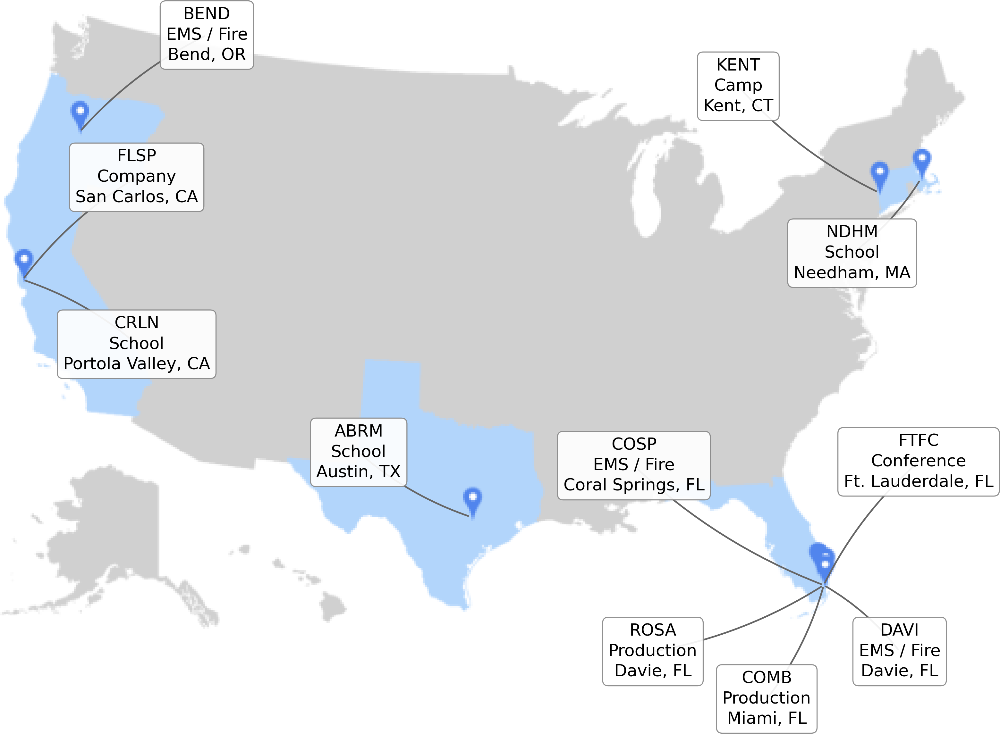
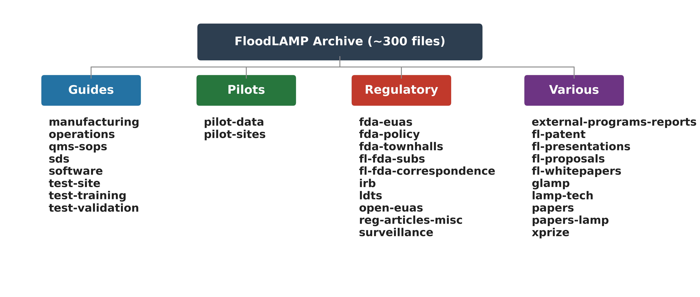

Randy True^1^\*, Theresa Ling^2^, Gary Withey^2^, Brandon Smith^3,2^

^1^ Focus on Foundations, Portola Valley, California, United States\
^2^ Formerly at FloodLAMP Biotechnologies, PBC, Portola Valley, California, United States\
^3^ California State University, Long Beach, Long Beach, California, United States

\* Corresponding author\
E-mail: randy@focusonfoundations.org (RT)

## Abstract
COVID-19 exposed a multifaceted failure to deploy one of the most important weapons we have to fight pandemics — widespread testing. Progress is achievable by solving the problems underlying this failure.

FloodLAMP Biotechnologies, PBC developed a simple colorimetric loop-mediated isothermal amplification (LAMP) test that is extraction-free and visually read, with a 45-minute turnaround. FloodLAMP deployed 11 surveillance testing programs in 6 states from December 2020 to June 2023. These programs generated 37,706 participant results from 16,209 tubes tested, identifying 884 positives among 2,752 unique individuals. Programs were operated by non-laboratory personnel including firefighters and school staff, and many utilized self-collected pooled samples. Comparisons with rapid antigen tests suggested earlier detection in the available operational comparisons, particularly for asymptomatic cases. This retrospective descriptive report summarizes de-identified operational data from 11 non-diagnostic surveillance programs in six U.S. states (December 2020–June 2023); analyses were descriptive only, and follow-up comparator testing was incomplete and generally not collected in parallel.

FloodLAMP pursued FDA Emergency Use Authorization using an open-source protocol model, disclosing all reagent components and granting a blanket Right of Reference, following the groundbreaking SalivaDirect "open EUA". Despite multiple submissions and direct appeals to FDA leadership with real-world data, FloodLAMP's submissions were deprioritized alongside 558 other EUA requests. Five weeks after the final closure of our second round of FDA submissions, the Omicron variant triggered massive test shortages.

This paper reports operational outcomes from 11 surveillance programs and summarizes the regulatory context in which they operated. Related de-identified data and a source document archive (~300 primary files) are publicly available at floodlamp.bio, GitHub, and Google Drive, including original files and AI-ready cleaned markdown versions (also combined by subcategory), for user-directed exploration.

## Introduction
Testing is among the most important tools for pandemic response, yet the United States failed to deploy it effectively during COVID-19. Severe testing shortages recurred throughout the pandemic, culminating in the Omicron surge of winter 2021–2022, when demand for testing vastly outstripped supply despite being nearly two years into the pandemic. The gap was not scientific. The barriers and failures were institutional, regulatory, and organizational.

Loop-mediated isothermal amplification (LAMP) emerged during COVID-19 as a promising alternative to polymerase chain reaction (PCR), especially for decentralized screening applications. LAMP amplifies nucleic acids at a constant temperature, removing the need for a thermal cycler. One LAMP variation, termed "colorimetric", involves a color change of the reaction, enabling readout visible to the naked eye. Colorimetric LAMP works with extraction-free sample preparation protocols, and supports low per-test costs amenable to pooling and serial testing. A foundational LAMP-based severe acute respiratory syndrome coronavirus 2 (SARS-CoV-2) assay was developed at Harvard by Rabe and Cepko [@rabe2020], who designed both a purified version using a low-cost silica purification method and a direct, extraction-free colorimetric RT-LAMP (LAMP) protocol using tris(2-carboxyethyl)phosphine (TCEP)/ethylenediaminetetraacetic acid (EDTA) chemical inactivation. The extraction-free (direct) protocol provided the basis for many testing programs. New England Biolabs' (NEB) WarmStart Colorimetric LAMP 2X Master Mix made colorimetric LAMP practical and was the critical reagent for the FloodLAMP test submitted to the FDA, which is the same test used for our surveillance pilot programs, and it was used in both EUA tests as well as in Clinical Laboratory Improvement Amendments (CLIA) laboratory-developed tests (LDTs) [@li2022lamp]. The Global LAMP Consortium (gLAMP), an international forum of over 300 members, coordinated the sharing of protocols, methods, and operational experience, producing a comprehensive review in 2021 [@moore2021].

FloodLAMP Biotechnologies was incorporated in August 2020 as a Public Benefit Corporation, having spun out from Focus on Foundations, a tiny 501(c)(3) STEM education nonprofit. Its mission was to advance globally scalable, open-source molecular screening. The company developed the QuickColor colorimetric LAMP test: an extraction-free assay adopting the primer set developed by Rabe and Cepko, using 18 LAMP primers targeting three SARS-CoV-2 genes (ORF1ab, N, E), with a visual pink-to-yellow readout, 45-minute turnaround, and no specialized instrumentation. FloodLAMP pursued FDA Emergency Use Authorization (EUA) using an open-source protocol model, fully disclosing all reagent components and offering a blanket Right of Reference to LAMP primer validation data, and following the approach demonstrated by the SalivaDirect program at Yale, which the FDA Commissioner had called a "game changer" and explicitly encouraged other developers to follow. FloodLAMP was unable to obtain sustained FDA engagement or any authorization. Turning to a regulatory gray area of non-diagnostic surveillance, FloodLAMP operated 11 pilot surveillance testing programs across 6 states from December 2020 to June 2023, serving emergency medical services (EMS) departments, municipal workforces, schools, and television production companies.

This paper accompanies the publication of a structured, AI-ready archive at [floodlamp.bio](https://floodlamp.bio), also hosted on GitHub, Google Drive, and Amazon S3 [@true2026archive]. The archive contains approximately 300 files organized into 4 categories (Guides, Pilots, Regulatory, Various) and 30 subcategories, encompassing operational guides, pilot program data, regulatory materials including FDA submissions and correspondence, and various supporting documents. The archive is designed for AI-assisted exploration: users can download combined markdown files optimized for AI context windows and use their own AI tools (ChatGPT, Claude, Gemini, or similar) to query the content. For more extensive exploration, users can download zip archives and point agentic AI systems such as Cursor or Claude Code for multi-file analysis. A great deal of time and effort has been spent standardizing and cleaning the converted archive markdown files. Advances in AI likely make much of this effort obsolete, but the hope is that having a high quality, AI-ready archive will reduce the friction and improve results of AI usage in the near to medium term. The archive project was supported by a grant from Balvi, a COVID-response funding initiative.

The scope of this paper and the archive covers FloodLAMP's work during the pandemic. It includes:

- data, case studies, and operational outcomes from the 11 pilot programs,
- regulatory experiences including FDA EUA submissions and correspondence,
- operational test site guides, training materials, quality management system (QMS) standard operating procedures (SOPs), and software guides and design files,
- internal manufacturing information and our cost model,
- various 2020-2023 proposals and presentations,
- a patent application related to next-generation device designs,
- regulatory issues such as institutional review boards (IRBs) and clinical studies, surveillance, and open-EUAs,
- proposals for regulatory reform related to pandemic testing preparedness.

For readers interested in a visual overview of FloodLAMP's work, please see the presentations included in the archive, particularly the BARDA and New England Biolabs (NEB) slide decks. The presentations subcategory is available on the [archive website](https://floodlamp.bio/cat-various#fl-presentations) and on [Google Drive](https://drive.google.com/drive/folders/14kWlI1ltZ-fyomxFiDRsrTUxcUgaX3oH?usp=drive_link).

The paper and archive are the culmination of the FloodLAMP work as the company wound down in 2024 and was absorbed back into the nonprofit Focus on Foundations, with the goal being this publication project. The corresponding author has not followed developments in the pandemic preparedness field since leaving this work in 2024 and some aspects may not be relevant given advances in the field.

## Materials and methods
This manuscript is a retrospective descriptive observational report of 11 non-diagnostic operational SARS-CoV-2 surveillance programs conducted in 6 U.S. states from December 2020 through June 2023. The report summarizes de-identified operational program data and archived records. Analyses were limited to descriptive summaries of site activity, participant results, and follow-up information; no inferential statistical analyses were planned or performed. Reporting was guided by STROBE for the observational components and by applicable STARD items for the embedded Stanford banked-specimen evaluation.

### Assay chemistry and test development
The primary FloodLAMP test (QuickColor) was based on the extraction-free colorimetric LAMP protocol developed by Rabe and Cepko at Harvard [@rabe2020], using the reaction mix specified by the instructions accompanying the NEB LAMP Master Mix (M1804). In our configuration, sample collection uses dry anterior nasal swabs collected by participants, with pooling up to 4 swabs per tube. During processing, the first step is to elute the dry swabs in a TCEP-based inactivation solution (100X Inactivation Solution diluted to 1X in saline). The inactivation solution comprised TCEP (tris(2-carboxyethyl)phosphine hydrochloride), EDTA, and NaOH in nuclease-free water, following the Rabe-Cepko formulation. After swab elution, samples were heat-treated to complete viral inactivation and release genomic RNA, followed by adding 2 µL of inactivated sample to complete the 25 µL LAMP reaction. The LAMP reaction is incubated at 65°C for 25 minutes, then removed and the tube visually checked for a color change from pink to yellow, and documented with a digital photo. The 25-minute incubation time for amplification was reduced from the standard 30 minutes in order to reduce the false positive rate, with the trade-off of a small reduction in sensitivity. This protocol is similar to many other LAMP tests developed during the pandemic, with the unusual tweak being the exact sample-to-reaction protocol involving the dry swab collection and elution in a 1X TCEP plus saline solution. This simply saves a step of eluting the swabs in saline first. All FloodLAMP tests were designed as open-source protocol tests. The reagent components were fully disclosed such that other researchers, test developers, and CLIA labs could source components directly from commercial vendors rather than purchasing proprietary kits, reducing cost and enabling supply chain redundancy.

#### QuickColor COVID-19 test
The primary FloodLAMP assay used 3 LAMP primer sets (As1e, N2, E1 — 18 oligonucleotides total) targeting the ORF1ab, N, and E genes of SARS-CoV-2, as described by Rabe and Cepko [@rabe2020; @anahtar2021]. Primers were combined with guanidine hydrochloride [@zhang2020guanidine] and nuclease-free water into a Primer-Guanidine Solution (PGS48, standardized at 48 reactions per batch to match typical program usage of 20–100+ reactions per testing session). This premixing eliminated a preparation step for the person running the test. The established limit of detection was measured at 12,500 copies/mL during the Stanford Clinical Study performed for the March 2021 EUA submissions.

#### EasyPCR COVID-19 test
A companion duplex reverse transcription quantitative polymerase chain reaction (RT-qPCR) assay using Centers for Disease Control and Prevention (CDC) N1 and human RNaseP primer-probe sets with NEB Luna RT-qPCR reagents and the same TCEP-based inactivation (20 µL total: 18 µL reaction mix + 2 µL sample). EasyPCR required a reverse transcription polymerase chain reaction (RT-PCR) instrument (validated on QuantStudio 6 Flex, QuantStudio 7 Pro, and Bio-Rad CFX96 platforms) but required no nucleic acid extraction equipment, with a turnaround time of approximately 1 hour 45 minutes. The limit of detection was measured at 3,100 copies/mL. This PCR test was designed to work as both a follow-up test to the QuickColor LAMP test and as an alternative.

Reagent manufacturing for FloodLAMP was small-scale pilot production at MBC BioLabs in San Carlos, California, without the infrastructure typical of industrial reagent manufacturing. Over its operating period, FloodLAMP produced approximately 100,000 reactions worth of PGS and 150,000–200,000 samples worth of 100X Inactivation Solution. No formal stability study was conducted on PGS, as it was stored frozen and used immediately upon thawing to make the reaction mix. The more pressing stability concern was the reaction mix itself: when sites stored pre-made reaction mix, the deep pink color of the colorimetric LAMP reaction would sometimes fade or turn orange, and FloodLAMP recommended against storing pre-made reaction mix when possible. A cursory stability study on the 1X Inactivation Saline Solution using PCR as the endpoint showed no significant loss of signal over two weeks, which was specified as the usage window. SOPs for PGS and Inactivation Solution production, along with process flow diagrams, 1X Inactivation Saline Solution stability study and verification procedures, are available in the archive (`floodlamp-archive/guides/manufacturing`, `floodlamp-archive/guides/qms-sops`). Table 1 summarizes the reagent compositions including the inactivation solution formulation, reaction mix composition, and key protocol steps. Full technical detail including instructions for use (IFUs), validation guides, and SOPs is available in the archive (`floodlamp-archive/guides/test-validation`, `floodlamp-archive/regulatory/fl-fda-submissions`).

**Table 1. FloodLAMP Assay Protocol Summary**

#### Panel A: Inactivation Solution Formulation

| Component | 100X Concentration | 1X Working Concentration (in saline) |
| --- | --- | --- |
| TCEP (tris(2-carboxyethyl)phosphine HCl) | 0.25 M | 2.5 mM |
| EDTA (ethylenediaminetetraacetic acid) | 0.1 M | 1.0 mM |
| NaOH | 1.15 N | 11.5 mN |
| NaCl (saline diluent) | — | ~153 mM |

The 100X Inactivation Solution (100XIS) is diluted to 1X in saline to produce the 1X Inactivation Saline Solution (1XISS) used for sample collection and viral inactivation.

#### Panel B: Reaction Mix Composition

| Component | QuickColor (RT-LAMP) | EasyPCR (RT-qPCR) |
| --- | --- | --- |
| Master Mix | NEB WarmStart Colorimetric LAMP 2X Master Mix | NEB Luna Universal Probe One-Step RT-qPCR Kit |
| Primer-Guanidine Solution (PGS) | 18 LAMP primers (As1e, N2, E1) + guanidine HCl | CDC N1 + RNaseP primer-probe sets |
| Reaction mix volume | 23 µL | 18 µL |
| Sample volume | 2 µL | 2 µL |
| Total reaction volume | 25 µL | 20 µL |
| Amplification temperature | 65°C (isothermal) | Standard RT-PCR cycling profile |
| Amplification time | 45 minutes | ~1 hr 45 min |

#### Panel C: Protocol Steps

| Step | Procedure | Time |
| --- | --- | --- |
| 1. Sample collection | Dry anterior nasal swab; self-collected (individual or pooled household, up to 4 swabs per tube) | — |
| 2. Swab elution | Insert swab into 1XISS (1X Inactivation Saline Solution); swirl to elute | ~1 min |
| 3. Heat inactivation | Heat at 95–100°C for 5–8 minutes (water bath or heat block) | 5–8 min |
| 4. Cool-down | Cool to room temperature or on ice | ~10 min |
| 5. Reaction setup | Add 2 µL inactivated sample to pre-prepared reaction mix in tubes/plate | ~5 min/plate |
| 6. Amplification | Incubate at 65°C (LAMP) or run PCR cycling program (EasyPCR) | 45 min (LAMP) |
| 7. Readout | Visual color assessment: pink = negative, yellow = positive (LAMP); Ct threshold (PCR) | ~1 min |
| 8. Result recording | Log results in FloodLAMP app or run form; photograph tubes | ~5 min |
| 9. Referral notification | Positive pools: notify sponsor; refer participants to follow-up diagnostic testing | — |

Total turnaround time from sample drop-off to results: typically < 2 hours for up to ~20-96 samples.

### Pilot program design and implementation
FloodLAMP operated 11 surveillance testing programs across 6 states (California, Florida, Oregon, Connecticut, Massachusetts, Texas) from December 2020 to June 2023. Programs served diverse populations and settings:

- EMS and fire department workforce screening (Coral Springs FL, Davie FL, Bend OR),
- school-based family pooled screening (Carillon preschool CA, Needham MA, Abrome TX),
- conference screening (FTFC, Fort Lauderdale FL),
- television production company screening (ROSA FL, Combate FL),
- a summer youth camp (Kent CT), and
- internal staff testing (FLSP, various CA locations).
Table 2 presents the key parameters for each program.

Participants were individuals enrolled through each operational program, including firefighters, municipal employees, school households, camp participants, production staff, and internal FloodLAMP personnel/affiliates. Eligibility, onboarding, and testing cadence were determined by each site's operational policies. This manuscript includes all available de-identified records from the 11 pilots rather than a sampled subset.

Programs were deployed as pop-up laboratories in non-laboratory settings — including an empty medical office, a school room, a hotel room, and a home garage — with equipment and consumables shipped or carried to the site. Programs were configured at several operational scales. The "standard" configuration used 5 mL sample collection tubes for the dry swabs, which were heated in a water bath for the inactivation. For LAMP reactions, strip-8 PCR tubes (occasionally 96-well plates) were incubated in a 96-well dry heat block. The "double standard" configuration at Coral Springs employed two simultaneous amplification and inactivation stations to handle hundreds of tubes per test session. The "mini" configuration used smaller heaters for sites with lower volumes and had easily swappable 40-well PCR-tube and 15-well 1.5 mL tube heat blocks, so a single ~$200 heater could do both the inactivation and amplification. Usually, pilot sites used either 2 of these mini heaters (such as the Bend site) or a water bath for the inactivation. The "mobile" system used a single heater and swapped heat blocks, as this configuration was optimized to fit into a small travel case (for photos, see slides 43-44 in `floodlamp-archive/various/fl-presentations/BARDA Market Research - FloodLAMP Presentation (2022-03-07)` [BARDA slides Google Drive](https://docs.google.com/presentation/d/1lv_tXtw7Q8OPwji6TB_aq1aPFF-616rdeIvVkBWr_AM)).

**Table 2. Summary of 11 FloodLAMP Pilot Surveillance Testing Programs**

| Site | Location | Dates | Type | Collection | Tubes | Participants | Pos | Individuals |
| ------- | ----------- | --------- | --------- | --------- | -----: | --------: | ----: | --------: |
| FLSP | San Carlos, CA | 12/20–1/23 | Company | Pooled HH, Indiv | 524 | 1,059 | 25 | 70 |
| CRLN | Portola Valley, CA | 12/21–5/22 | Preschool | Pooled HH, Indiv | 1,016 | 2,340 | 32 | 142 |
| FTFC | Ft. Lauderdale, FL | 6/21 | Conference | Pooled, Indiv | 61 | 195 | 0 | 195 |
| KENT | Kent, CT | 6–7/21 | Youth Camp | Pooled | 190 | 696 | 2 | 342 |
| COSP | Coral Springs, FL | 8/21–3/22 | City / EMS | Pooled | 7,146 | 22,643 | 347 | 1,074 |
| DAVI | Davie, FL | 9/21–3/22 | City / EMS | Pooled | 2,279 | 4,409 | 384 | — |
| ROSA | Davie, FL | 9–12/21 | Production | Individual | 781 | 781 | 1 | 156 |
| BEND | Bend, OR | 12/21–5/22 | Fire / EMS | Individual | 772 | 767 | 71 | 187 |
| COMB | Miami, FL | 3–8/22 | Production | Individual | 1,981 | 1,672 | 14 | 369 |
| NDHM | Needham, MA | 5–10/22 | K-12 School | Pooled HH | 80 | 190 | 0 | 130 |
| ABRM | Austin, TX | 9/22–6/23 | K-12 School | Pooled HH | 1,379 | 2,954 | 8 | 87 |
| **Total** | **6 states** | **12/20–6/23** | | | **16,209** | **37,706** | **884** | **2,752** |

Tubes = initial tubes tested, excluding re-runs. Participants = total participant results (includes repeated testing). Pooled HH = pooled household self-collection. More details available in Table S1.

Sample collection followed 2 primary modes. Household pooled self-collection allowed up to 4 self-collected anterior nasal swabs from household members to be pooled into a single 5 mL collection tube, registered via the FloodLAMP mobile app. Individual collection alternatively used single swabs, typically in 1.5 mL tubes, either self-collected or collected by healthcare workers. Collection kits were pre-assembled with barcoded tubes and swabs and distributed to participants in advance.

A total of 23 test operators were trained across all programs, many with no prior laboratory experience. Operators included firefighters, school staff, college students, and camp volunteers. FloodLAMP developed a structured, video-based training program designed to enable new operators, including non-laboratory personnel, to learn the full testing workflow independently. The training system used Moodle Cloud as the learning management platform with EdPuzzle integrated for interactive video content, and was developed with a consulting firm specializing in educational curriculum development. A series of 17 training videos covered the complete workflow from safety and personal protective equipment (PPE) through contamination protocols, each procedural step, and scale-up procedures for larger batches. A formal certification assessment provided a pass/fail checklist for evaluating operators by reviewing a recorded test run. The certification assessment was designed for self-grading, with trainees expected to iterate through multiple runs identifying their own mistakes before FloodLAMP personnel reviewed the records and final run, thus requiring approximately 30 minutes of staff time per certification. In practice, only a small number of operators completed the video-based program. Pilot sites generally preferred in-person training from experienced FloodLAMP testing staff, and the program saw limited adoption relative to the investment required to produce it. For FloodLAMP's final deployment at Abrome, the school chose to pay extra for in-person training rather than rely on the self-guided video curriculum. The handful of operators who did use the videos — notably at the Needham, Massachusetts site — completed the training successfully, though even that case involved considerable in-person interaction. The training model also included operator-to-operator cascading, where a firefighter trained at one site subsequently trained the operator at a neighboring site. Some programs (Kent, Bend) were brought up entirely remotely, with local volunteer scientists from the National Scientist Volunteer Database (NSVD), who had no prior exposure to the FloodLAMP test, providing on-site hands-on support.

FloodLAMP built its combination mobile and web app with a partner (Appivo) who did the development on its low-code development platform, with the majority of custom code written in JavaScript. The system had 3 main interfaces serving different user roles:

- a participant-facing mobile app for onboarding, consent, and sample collection registration;
- a staff-facing mobile app view for sample intake, processing, and resulting;
- an admin web portal for program management, user administration, and data export.

The FloodLAMP app managed the end-to-end testing workflow from participant onboarding and consent through sample tracking, pooled collection attribution (linking multiple participants to a single barcoded tube), and result notification. A "notes" field in the collection step allowed the "sponsor" (the person scanning the sample tube and entering which participants contributed swabs to a pooled tube) to add someone on the fly who was not registered in the program, providing operational flexibility at the cost of introducing potential consent gaps, misspelled names, and non-registered individuals into the system and data. FloodLAMP never had any software engineers on staff and relied almost entirely on our partner for all of the coding work. The FloodLAMP app grew to be quite complex, and the interaction effects between the app and the platform created periods of instability, outages, and downtime during critical operational periods, along with persistent bugs. Another problem was getting the app approved for the Apple App Store, which required reaching out to a high-level contact at Apple that had been made through a COVID-testing group call. We were ultimately successful after multiple rejections through the standard review process, apparently due to Apple's heightened scrutiny around health and COVID-related apps. At least one site (Davie) ran a substantial screening program of hundreds of samples per week entirely without the app, tracking everything manually.

All pilot programs operated as non-diagnostic surveillance under the FDA and Centers for Medicare & Medicaid Services (CMS) enforcement discretion, a regulatory gray area that presented a significant operational challenge. The central requirement was that surveillance programs not deliver individual patient results. FloodLAMP's approach was to take the FDA's and CMS's language literally: when a sample indicated the presence of SARS-CoV-2, participants were told only that they were "referred to follow-up clinical testing." FloodLAMP did not tell participants they were positive or negative, and emphasized this distinction and terminology with program administrators. This communication was initially confusing for participants and program administrators, but after a few repetitions, the framework was understood. The full regulatory context and critique of this framework are presented in the Discussion.

These pilots were real-world operational programs, not clinical trials. Considerable effort was made to standardize data collection and make it as reliable as possible given the circumstances. A contractual oversight in not requiring pilot sites to share their comparator testing data affected the availability of head-to-head antigen comparison data, particularly from the Coral Springs program. Deeper operational detail for each program is available in the archive:

- `floodlamp-archive/pilots/pilot-data`
- `floodlamp-archive/pilots/pilot-sites`
- `floodlamp-archive/guides/test-site`
- `floodlamp-archive/guides/test-training`
- `floodlamp-archive/guides/software`
- `floodlamp-archive/guides/operations`

### Data collection, processing, and quality
Pilot program data were drawn from three primary sources: (1) the FloodLAMP app, which captured participant registration, tube barcodes, collection attribution, and test results; (2) Google Forms, used for Run Form Reports (RFR) logging run-level data after each testing session and weekly statistics reporting; and (3) referral test data from follow-up diagnostic tests (typically antigen or PCR), communicated to FloodLAMP via email, text, or verbal reports from program administrators.

The data processing pipeline involved multiple stages of cleaning, reconciliation, and quality tracking. Appivo Samples (APS) data were extracted and cleaned, with tubes flagged for removal using standardized reason codes. Run Form Reports were audited by reviewing scanned paper forms and reaction tube photographs, with corrections tracked using codes, notes, and comments. This audit was part of a run reconciliation process that matched RFR runs to APS tubes for pilot sites with both data types, resolving discrepancies such as tubes collected the evening before a run, unresulted tubes in APS, and tubes absent from the app data, which were assigned specially designated tube IDs. Referral Test Reports (RTR) tracked follow-up testing with 1 row per referral test, rolled up to 1 row per person with case clusters grouping related cases. While column structure and lookup logic were applied to the referral test data, a fair amount of ad hoc manual processing was required to extract the standardized metrics. Data corrections and deletions were tracked using standardized reason codes.

De-identification was performed using a Person ID / de-identification (DeID) Key mapping system. The cleaned, de-identified pilot data are available via Google Drive as Google-native spreadsheet files, as xlsx files, and as extracted CSVs, through the GitHub archive repository, and Amazon S3 zip archives.

Data quality varied across sites, reflecting a core tension between flexibility and standardization. FloodLAMP provided operators with flexible data entry options, such as the ability to add participant "note names" for individuals not yet registered in the app, and did not require programs to use all FloodLAMP tools. While practical in the field, this flexibility introduced significant downstream reconciliation work to match entries to existing participant records. Some programs had all three primary data types (APS, RFR, RTR) while others had only 1 or 2; programs that did not use the Run Form (Coral Springs, ROSA, Davie, Kent, and FTFC) relied on a Run Stats Report Google Form for weekly reporting or on previously compiled statistics. 

Wrangling the data to its current state was a substantial undertaking, requiring far more rounds of cleaning and reconciliation than initially anticipated. The data work is thoroughly documented with acknowledged holes and caveats. This is a descriptive report of operational surveillance programs — all statistics were derived from the cleaned, reconciled pilot data, and no inferential statistical analysis was performed. The full data processing methodology is documented in the archive (`floodlamp-archive/pilots/pilot-data`).

Data completeness varied by site. Some sites had app, run-form, and referral-test data, whereas others had only one or two source types. Comparator testing was usually obtained after a FloodLAMP referral rather than collected in parallel. Missing or unavailable source data were not imputed; totals and summaries reflect the cleaned records available for each site.

### Statistical analysis
All analyses were descriptive. Counts, percentages, and rates were computed from the cleaned, reconciled pilot data. Exact binomial (Clopper-Pearson) 95% confidence intervals were calculated for the Stanford clinical evaluation PPA and NPA estimates. No hypothesis testing, regression modeling, or imputation was performed.

### Workplace and household pooling models
FloodLAMP employed two pooling models across its pilot programs, adapted to the setting and population being screened.

At FloodLAMP's EMS and municipal workforce programs in Coral Springs and Davie, Florida, co-workers self-collected anterior nasal swabs on-site and pooled them into shared collection tubes registered via the FloodLAMP mobile app. Samples were processed on-site by trained in-house staff with a typical turnaround time of 1–2 hours, depending on batch size. The Town of Davie extended its program from EMS personnel to all municipal employees in November 2021, establishing 6 designated collection points with daily pickup by Fire Rescue staff. This workplace pooling model screened the employee population directly: when a pool tested positive, the contributing individuals were re-tested to identify the infected person, who could then be isolated before transmitting to co-workers. During the Omicron surge, the established pooling infrastructure allowed these programs to scale rapidly to meet demand. Detailed documentation is available in the archive (`floodlamp-archive/various/fl-whitepapers/FloodLAMP Whitepaper - EMS and Municipal Screening Pilots DRAFT WIP`).

A different pooling approach, household-level pooling, was implemented at FloodLAMP's 3 school-based programs: Carillon preschool in Portola Valley, California, a school-based program in Needham, Massachusetts, and Abrome K-12 school in Austin, Texas. In this model, members of a participating household (parents, children, siblings, and in some cases extended family or household staff) self-collected anterior nasal swabs at home, typically on the morning of the school day. Up to 4 swabs were pooled into a single pre-barcoded 5 mL collection tube. Families registered their pooled collections through the FloodLAMP mobile app, identifying all contributing household members ("participants"). Tubes were dropped off at a designated collection point at the school entrance during the normal morning arrival.

A FloodLAMP team member collected all submitted tubes from the school drop-off point within 5-10 minutes of the morning drop-off and transported them to a near-site "lab" location for processing (approximately 5 minutes away). Results were usually available within 2 hours. When a pool tested positive, the contributing household members were contacted for same-day individual re-sampling to deconvolute the pool and identify which members of the pool were positive. This deconvolution step was performed using the same FloodLAMP LAMP test on individual swabs.

Unlike workplace pooling, which screened an organization's own members, household pooling extended surveillance coverage beyond enrolled students to their family and household members. By testing the entire household, typically the nuclear family but sometimes including extended family or household staff, the program caught infections in individuals who were not themselves attendees of the school. Of the 6 case clusters at Carillon for which deconvolution or referral data were available, 3 involved a family member outside the school as the initially positive individual. Catching a positive household member through routine screening gave the family the opportunity to isolate and monitor before the enrolled student became infected or, if already infected, before that student attended school and potentially transmitted to classmates.

The household pooling approach differed fundamentally from the classroom-level central-lab pooling model used in many school testing programs during the pandemic, in which 10–20 student samples were pooled on site at the school, and then sent to a central laboratory with 1–2 day turnaround. Each of the elements in FloodLAMP's model — self-collection, household-level pooling, fast-turnaround molecular testing, and decentralized near-site processing — existed in some programs individually, but their combination in a single real-world program may have been distinctive. Schools using the central-lab model reported frustration with the long turnaround time, during which children had already been at school for sometimes days before results returned. In contrast, great satisfaction was expressed with FloodLAMP's programs and it seems they were effective at identifying infections early and stopping spread.

A comparative survey of published household pooling programs, conducted using AI analysis of the available literature and included in the archive, found no programs combining all four elements: self-collection, household-level pooling, fast-turnaround molecular testing, and decentralized near-site processing. The value proposition and potential novelty of this model are discussed further in the Discussion section of this paper. Detailed documentation is available in the archive:

- `floodlamp-archive/various/fl-whitepapers/FloodLAMP Whitepaper - California Preschool Family Pooled Screening Pilot (June 2022)`
- `floodlamp-archive/pilots/pilot-data/CRLN_pilot-data_summary`
- `floodlamp-archive/pilots/pilot-data/ABRM_pilot-data_summary`

### Archive construction and AI-ready design
The FloodLAMP archive is primarily comprised of materials accumulated during 2020–2023, including both internal FloodLAMP documents and externally sourced reference materials. A total of approximately 300 primary files were sorted and organized into 4 top-level categories (Guides, Pilots, Regulatory, Various) and 30 subcategories. Source materials in multiple formats, including DOCX, PDF, PPTX, and XLSX, were converted to markdown using a combination of software, AI, and manual processing to produce cleaned text. The conversion to markdown was done in order to give the best results from AI tools, and also to be able to combine files together at the category and subcategory levels into single markdown files for easily including directly in the context window of AI models.

Each archive file includes a structured metadata header specifying filename, category, subcategory, source URLs (Google Drive, GitHub), token count, word count, and a brief summary. This standardization enables both human navigation and machine-readable indexing.

For each subcategory, the corresponding author wrote a context and commentary file providing narrative context, operational background, candid assessment of what worked and what did not, and cross-references to related archive materials. These context-and-commentary files offer additional information, analysis, and opinions that the primary archive documents alone do not provide.

The archive also includes 23 AI-generated files that comprise research reports and supplementary analysis documents created using frontier AI models (Claude Opus 4.6 Max, ChatGPT 5.2-5.4 Pro). These are marked with an `_AI_` filename prefix and include metadata disclaimers noting AI generation and the potential for errors. Prompts are included where applicable, as well as additional context files provided to the AI. Topics covered include FDA deprioritization, open-access diagnostics frameworks, comparable program surveys, and regulatory landscape analyses. Some of these AI files may be helpful as additional background information and some as examples of AI use with the FloodLAMP archive files.

Combined markdown files were generated for each subcategory and each category, with token counts embedded in filenames (e.g., `_archive-combined-files_pilot-data_XXk.md`). These combined files are designed to fit within AI context windows. Zip archives were created at subcategory, category, and whole-archive levels for bulk download.

The archive supports two primary usage modes. In context-window mode, a user downloads a combined markdown file and pastes or drags it into a standard AI chat interface (ChatGPT, Claude, Gemini) along with a description of their interests. In agentic mode, a user downloads zip files, unpacks them into a local folder, and opens the folder in an agentic AI system such as Claude Code or Cursor for multi-file exploration across multiple reasoning iterations. An audience profiles document maps 18 user types to relevant archive materials, and a combined metadata summary provides short descriptions of every archive file organized by category and subcategory.

A supplemental corpus of 100 transcripts from the FDA Virtual Town Hall meetings for COVID-19 diagnostic test developers and 100 corresponding extracted question-and-answer files is included in the archive (`floodlamp-archive/regulatory/fda-townhalls`). The question retrieval augmented generation (QRAG) retrieval tool and refusal analysis built over this corpus are discussed in the AI Tools section of the Discussion.

Publication endpoints include the website ([floodlamp.bio](https://floodlamp.bio)) as a navigation portal, the GitHub repository as the canonical file host, Google Drive for original-format files, and Amazon S3 for zip archives. The open-source code for archive construction and AI-assisted corpus analysis is available in the archive GitHub repository and in a more general public codebase at [github.com/FocusOnFoundationsNonprofit/public-corpus-tools](https://github.com/FocusOnFoundationsNonprofit/public-corpus-tools). The archive as a whole is cited as [@true2026archive].

Throughout this paper, specific archive materials are referenced using the notation (`floodlamp-archive/category/subcategory`) for subcategories and (`floodlamp-archive/category/subcategory/filename`) for individual files, corresponding to the archive structure detailed in Table S4. These paths match the folder structure of the archive repository and zip downloads, enabling readers to navigate directly to referenced materials.

### Ethics statement
The 11 pilot programs described here were implemented as operational, non-diagnostic SARS-CoV-2 surveillance programs rather than as prospectively designed research studies. The present manuscript reports retrospectively analyzed de-identified operational data and archived documents, and no identifying participant information is included. No separate IRB approval was obtained for the operational pilots because these activities were conducted as service/surveillance programs rather than human-subjects research. Participant/guardian onboarding and consent procedures were handled at the site level; where the FloodLAMP app was used, participants or parents/guardians completed program onboarding and consent electronically, and at Carillon families provided signed consent before program launch. The Stanford clinical evaluation used de-identified banked/remnant clinical specimens and is reported here only in aggregate form.

### AI tools and technologies
AI tools were used in archive preparation and in creating some archive commentary and supplementary analysis files, as described in the manuscript and archive metadata. Generative AI tools were also used for language editing and organizational support during manuscript preparation. AI tools were not used to generate primary study data. All numerical results, interpretations, and conclusions reported in this article were reviewed and verified by the corresponding author, who takes responsibility for the final content. The primary AI models used were Claude Opus 4.6 Max and ChatGPT 5.4 Pro.

## Results
### Aggregate pilot program outcomes
Across all 11 pilot programs in 6 states, FloodLAMP processed 16,209 initial tubes (excluding re-runs), generating 37,706 participant results. A total of 884 tubes had a final result of positive, and 2,752 unique individuals were tested. The testing period spanned December 2020 through June 2023, with the highest volume and positivity concentrated during the Omicron surge of December 2021 through February 2022.

Program scale varied widely, from a single 61-tube conference pilot (FTFC) to the Coral Springs city-wide EMS program, which alone accounted for nearly half of all tubes tested and more than 60% of all participant results. Three Florida-based programs (Coral Springs, Davie, and Combate) together contributed roughly 70% of total tube volume. Despite this concentration, the pilots collectively spanned 6 types (company, school, conference, youth camp, city/EMS, TV production) across six states. Table 2 presents the complete per-site summary.

No session-level false positives or false negatives were documented in available follow-up data across all programs, but these figures should not be interpreted as formal diagnostic-accuracy estimates and must be interpreted with essential caveats. For false negatives, referral diagnostic testing was almost always triggered by a positive FloodLAMP result, not collected in parallel. Without simultaneous higher-sensitivity comparator samples, false negatives in a screening context are effectively undetectable. A person always has a preceding negative test before turning positive, but the viral load trajectory from infection onset is unknown without paired comparator data. For false positives, LAMP reactions are inherently prone to false positives at the individual reaction level due to the nature of isothermal amplification. FloodLAMP employed a robust rerun workflow using triplicate re-run decision logic that resolved many reaction-level false positives into negative or inconclusive final session calls. At the session-call level, false positives would have been identified because the referral diagnostic test for a FloodLAMP positive would return negative, and program administrators would have reported such cases. For all FloodLAMP positive tubes with available referral data, every referral test was positive. These zeros reflect the structure of the surveillance programs rather than a claim of perfect test performance comparable to a controlled clinical study. The Stanford clinical evaluation provides the closest available measure of analytical performance under controlled conditions and is reported in the following section.

### Stanford clinical evaluation and analytical performance
The Stanford University clinical laboratory conducted an independent clinical evaluation of FloodLAMP's tests in March 2021 using banked clinical specimens and a Clinical Eval Guide provided by FloodLAMP. The lab ran the test successfully on the first attempt, with no training, using only this guide and the shipped materials. The Stanford evaluation was a retrospective banked-specimen clinical evaluation performed for regulatory purposes rather than a prospective diagnostic-accuracy study in a screening population; accordingly, this manuscript reports the available aggregate performance results and confidence intervals from that evaluation. Results are summarized in Table 3. The full clinical evaluation protocol and submission documents are available in the archive:

- `floodlamp-archive/guides/test-validation/2021-03-10_Clinical Eval Guide - from FloodLAMP IFU DRAFTS`
- `floodlamp-archive/regulatory/fl-fda-submissions/2021-03-22_EUA Submission - FloodLAMP QuickColor COVID-19 Test v1.0`
- `floodlamp-archive/regulatory/fl-fda-submissions/2021-03-22_EUA Submission - FloodLAMP EasyPCR COVID-19 Test v1.0`
- `floodlamp-archive/regulatory/fl-fda-submissions/2021-03-22_Instructions for Use - FloodLAMP QuickColor COVID-19 Test v1.0`
- `floodlamp-archive/regulatory/fl-fda-submissions/2021-03-22_Instructions for Use - FloodLAMP EasyPCR COVID-19 Test v1.0`

**Table 3. FloodLAMP Assay Performance Characteristics**

| Parameter | QuickColor RT-LAMP | EasyPCR RT-qPCR |
| --- | --- | --- |
| Assay Type | Colorimetric RT-LAMP | Duplex RT-qPCR |
| Target Genes | ORF1ab (As1e), N (N2), E (E1) — 18 primers | N (CDC N1), RNaseP (internal control) |
| Sample Volume | 2 µL inactivated sample | 2 µL inactivated sample |
| Reaction Volume | 25 µL (23 µL mix + 2 µL sample) | 20 µL (18 µL mix + 2 µL sample) |
| Readout Method | Visual colorimetric (pink → yellow) | Fluorescent (Ct values) |
| Turnaround Time | 45 minutes for small batch | ~1 hr 45 minutes |
| Instrument Required | Heat block or water bath (65°C) | RT-PCR instrument (QuantStudio, Bio-Rad CFX96) |
| Limit of Detection | 12,500 copies/mL | 3,100 copies/mL |
| PPA (Clinical Study) | 90.0% (36/40 positives) | 97.5% (39/40 positives) |
| NPA (Clinical Study) | 100% (40/40 negatives) | 100% (40/40 negatives) |
| Clinical Specimen Set | 80 anterior-nares swab specimens | 80 anterior-nares swab specimens |
| Clinical Evaluation Site | Stanford University Clinical Laboratory | Stanford University Clinical Laboratory |
| Evaluation Date | March 2021 | March 2021 |

- Clinical evaluation used banked specimens tested against a high-sensitivity RT-PCR comparator.
- All 4 missed QuickColor positives occurred at high Ct values (low viral load), near or beyond the established LoD.
- Sample preparation (TCEP/EDTA chemical inactivation + heat treatment) is shared between both assays.

The QuickColor colorimetric LAMP test achieved 90% positive percent agreement (PPA) and 100% negative percent agreement (NPA) on 80 specimens (40 positive and 40 negative by high-sensitivity RT-PCR comparator - Hologic Panther Fusion and Aptima SARS-CoV-2 Assays), with an established limit of detection (LoD) of 12,500 copies/mL. The exact binomial 95% confidence intervals for QuickColor were 76.3%–97.2% for PPA (36/40) and 91.2%–100.0% for NPA (40/40). All 4 missed comparator-positive specimens occurred at high cycle threshold (Ct) values, indicating low viral load near or beyond the test's established LoD. Per the QuickColor test protocol, reactions producing ambiguous color (neither clearly yellow nor clearly pink) were classified as inconclusive and follow-up tested with EasyPCR; seven of the 40 comparator-positive specimens initially yielded inconclusive QuickColor results, all of which were resolved as positive by EasyPCR follow-up, and no final inconclusive results remained. The EasyPCR RT-qPCR test achieved 97.5% PPA and 100% NPA on the same specimen set, with an LoD of 3,100 copies/mL. For EasyPCR, the exact binomial 95% confidence intervals were 86.8%–99.9% for PPA (39/40) and 91.2%–100.0% for NPA (40/40). A third assay, QuickFluor (fluorimetric LAMP), was included in the evaluation protocol but was subsequently dropped; the fluorimetric readout was redundant because EasyPCR already covered the PCR-machine use case, and QuickFluor's limit of detection was considerably worse than both other assays. FloodLAMP seldom ran the fluorimetric test internally, and none of the pilot sites used it. Of note, none of the pilot sites used EasyPCR either (excluding the internal FloodLAMP staff plus community testing). QuickColor was the assay deployed in all operational surveillance programs.

The 90% PPA for QuickColor falls below the FDA's 95% PPA threshold for the standard diagnostic intended use ("persons suspected of COVID-19 by their healthcare provider"), which the FDA cited in its June 2021 pre-EUA response and its October 2021 deficiency letter for FloodLAMP's submission. However, in April 2021 the FDA issued an amendment [@fda2020policy] creating a pathway for authorized molecular tests to be used for screening with serial testing of asymptomatic individuals. The supplemental template published in October 2021 later specified a lower threshold of 80% PPA, with 70% at the lower bound of the two-sided 95% confidence interval (CI). QuickColor's 90% PPA exceeded that serial-screening threshold. FloodLAMP formally requested to amend its intended use to serial screening only, but the FDA rejected the submission on study design grounds, stating that the Stanford clinical evaluation, which used de-identified remnant hospital specimens, was "not acceptable to support testing a screening population with serial testing", rather than on the basis of the PPA number itself. This created an inconsistency in the FDA's approach: for the standard diagnostic intended use, the FDA accepted clinical studies using banked remnant specimens with known Ct values, such as the study design FloodLAMP had performed at Stanford. But for the serial screening intended use, even though the analytical performance clearly exceeded the lower 80% threshold, the FDA required a prospective screening population study, which is significantly more expensive and complex to execute. The FDA's own supplemental template for serial screening explicitly contemplated authorizing tests without asymptomatic clinical data, with a post-authorization study as a condition of authorization. This mechanism could have allowed FloodLAMP to obtain authorization based on existing clinical data and then collect prospective screening data from within its active surveillance programs, where enrollment and data collection would have been straightforward. Instead, the requirement for a new prospective study prior to authorization created a barrier disproportionately affecting small developers that had already invested in banked-sample clinical evaluations and lacked the resources for standalone prospective clinical trials. The limitations of PPA-based triage are further reinforced by the FDA's own Reference Panel benchmarking data, discussed in the Discussion section below.

Despite obtaining institutional review board (IRB) approval through WCG (formerly Western Institutional Review Board) for a broad clinical study protocol, FloodLAMP never executed the study due to the FDA's decision to decline further review of FloodLAMP's second round of EUA and pre-EUA submissions. The combination of IRB costs, regulatory consulting, and six-figure clinical research organization quotes for participant recruitment alone created significant barriers to generating the clinical data the FDA required — barriers that disproportionately affect innovative small companies lacking established clinical trial infrastructure. Around mid-2022, FloodLAMP developed an alternative design that integrated clinical data collection into an active surveillance testing program (school or workplace-based), using an enrichment strategy to solve the low-prevalence problem and a cascading cohort structure to maximize data yield per positive event. This design may be able to collect clinical performance data at a fraction of the cost of a typical standalone trial, and is documented in the archive (`floodlamp-archive/regulatory/irb/_AI_digestion_irb_new-clinical-study-design`).

### Selected pilot programs

#### Carillon Preschool household pooling (CRLN)
Carillon was a small preschool in Portola Valley, California, attended by the children of FloodLAMP's founder. The Carillon program is the flagship case for the household pooling model and is presented here as a dedicated subsection. Families were onboarded before the first day of testing with signed consent and pooled collection kits (5-10 per family). A dropbox at the school entrance served as both the sample drop-off and kit pickup location. The typical daily workflow was straightforward: families collected samples at home the morning of school and dropped them off at the same time as their children. A FloodLAMP team member collected all kits from the dropbox, and drove them to a near-site "lab" location in a home garage for processing (approximately 5 minutes away). Results were usually available by 11 a.m., within 2 hours of the start of school.

Participation became mandatory after winter break in January 2022. Before the first day back at school, families dropped off samples the evening prior. Of 12 family pools tested on January 2, 2 tested positive. Both families were asymptomatic, and both positive results were subsequently confirmed. The families were contacted and referred for follow-up diagnostic testing, and their children did not attend school. This early detection may have reduced onward exposure at the school, although this cannot be established from these descriptive data. The same pre-screening approach was used successfully after spring break.

One documented case involved an asymptomatic family pool detected on that first screening round. Individual deconvolution the following day showed both parents positive and both children negative; the children turned antigen-positive the next day. All four family members were confirmed by PCR (results took 1-2 days). Return testing beginning a week later showed persistent FloodLAMP positivity: 15 days after the initial positive pool result, the family pool was still positive on FloodLAMP while all members were antigen-negative. In total, the program identified 8 positive pools or case clusters during the 2021–2022 school year. Among the 6 with deconvolution data, the initially positive individual was the school-aged child in half of cases and a parent or sibling in the other half, demonstrating the value of extending coverage in a screening program to the entire household. While other programs employed pooled testing during the pandemic, most notably classroom-level pooling of 10–20 student samples sent to a central lab, FloodLAMP is not aware of any other program that combined self-collected samples, household-level pooling, fast-turnaround molecular testing, and decentralized near-site processing. The program implemented several features that FloodLAMP considered both valuable and rare: multi-week longitudinal testing, household pooling, fast few-hour turnaround, and deconvolution capability. The school had zero closures and no known outbreaks during the program period, which coincided with the Omicron surge in early 2022.

#### Coral Springs (COSP)
The city of Coral Springs (population ~140,000) in south Florida was FloodLAMP's first major paid pilot and largest testing program by total volume (7,146 tubes, 22,643 participant results). FloodLAMP staff traveled from California with equipment and consumables, set up a pop-up lab in an empty medical office, ran a successful validation, and trained 1 firefighter with no prior lab or pipetting experience. The program started in September 2021 with modest volumes, averaging 25 tubes (pools) and 90 participants per week for the first 3 months. When the Omicron surge hit in mid-December, the program expanded rapidly to comprehensively cover first responders and municipal staff. At peak, Coral Springs ran 800 tubes per week covering 2,600 participants, with 2 staff members operating two inactivation and amplification stations ("double standard" configuration), running LAMP reactions in 96-well plates. During the December–January Omicron surge, the site ran 3-4 FloodLAMP processing runs per day to cover three emergency responder shifts, operating 7 days/week. The program was made mandatory by city leadership despite the availability of nearly unlimited free rapid antigen tests. Testing ended abruptly in late February 2022 as the Omicron wave passed through the community.

#### Davie (DAVI)
The Town of Davie (population ~110,000) is located next to Coral Springs in south Florida. The firefighter trained at Coral Springs subsequently trained the Davie tester, also a veteran firefighter, with supplementary early-morning support calls from FloodLAMP's founder. This single individual performed all testing at the Davie site. The program timeline paralleled Coral Springs: modest volumes averaging approximately 30 tubes and 80 participants per week from September through November 2021, followed by rapid expansion during the Omicron surge. Testing peaked at approximately 500 tubes per week in early January 2022, with positivity rates reaching 34% during the peak week. Program success led to expansion in mid-November 2021, extending FloodLAMP testing from EMS personnel to all Town of Davie municipal employees on a voluntary daily or weekly basis, with 6 designated collection points and daily pickup by Fire Rescue staff. Davie produced the most detailed head-to-head FloodLAMP vs. antigen comparison data (presented in the following section). The program reported 98% of FloodLAMP positives confirmed by referral tests.

#### Bend (BEND)
The Bend pilot was a follow-on EMS program resulting from the success of Coral Springs and Davie. The bring-up process was conducted entirely remotely, without FloodLAMP staff traveling to Oregon. A local scientist volunteer, recruited through the National Scientist Volunteer Database (NSVD), provided critical on-site support. The program began with a 1-hour Zoom kickoff call with fire and emergency management leadership, followed by remote training with the volunteer scientist providing hands-on assistance (see `floodlamp-archive/various/fl-presentations/Bend Pilot Program Bring-up (12-01-2021)`). The remote training was a bit awkward but proved effective. Positivity rates were high throughout January 2022 during the Omicron surge, ranging from 11% to 37%. All FloodLAMP positives were confirmed by the local clinical lab PCR, with no false positives documented in available follow-up data. The program recorded 2 inconclusive results, one of which was confirmed positive by PCR and the other negative by PCR. Bend purchased a "double mini" system, which was feasible because individual (non-pooled) samples could be collected in smaller 1.5 mL tubes, which fit into the smaller heat block, while the larger 5 mL tubes needed for 4 swabs required a water bath for inactivation. FloodLAMP charged $2,800 for equipment and $6 per reaction for an initial order of 1,000 reactions. The initial outlay was $8,800; a subsequent order of 1,000 reactions and a multi-channel pipette brought the total to approximately $15,000 including shipping. The EMS manager who administered the program described FloodLAMP as a "godsend."

#### Abrome (ABRM)
Abrome was a small alternative K-12 school in Austin, Texas. The school connected FloodLAMP to the Balvi grant organization and submitted for a grant that supported the system purchase. FloodLAMP's final pilot operated for 9 months (September 2022-June 2023), running 1,379 initial tubes covering 2,954 participant results across 87 unique individuals. Testing was pooled by household with an average pool level of 2.2 individuals per tube. Testing was conducted on 95% of weekdays during 36 active school weeks (171 of 180 weekdays), with an effective uptime of 97% adjusting for holidays. This demonstrated a strong commitment to COVID screening. The testing and administrative lead from the Combate program flew to Texas to set up the lab and conduct in-person training. The program detected 8 positive tubes corresponding to 3 distinct cases, all household infections caught before in-school transmission. A documented case from December 2022 illustrates the detection model: a morning LAMP test flagged a positive household pool (2 parents and 1 student), none of whom had symptoms. The student was immediately separated from the school. Within hours, one parent tested positive on rapid PCR; the student developed symptoms and tested positive 2 days later. No other Abrome students or staff tested positive, suggesting that the rapid detection and quarantine interrupted transmission to the school community. The head of school provided a written endorsement stating that the school emerged from 3.5 academic years of the pandemic without a known case of in-school transmission, crediting the FloodLAMP program. Abrome's success was supported by unusual conditions: a school culture that embraced mandatory daily testing, a small enough community for a single staff member to manage the program, and grant funding covering the full cost.

#### Combate (COMB)
FloodLAMP's only surveillance-screening-as-a-service operation, in which FloodLAMP employees directly performed all testing. An experienced nurse was hired and trained to run the FloodLAMP test; this person administered the program, collected samples, ran testing, and managed an assistant. The pop-up lab was established in a carpeted hotel room within the hotel that housed the TV program's staff and participants. This was not an ideal laboratory environment. With rigorous cleaning protocols and attention to detail, the program operated for over 4 months without significant contamination problems, serving as a demonstration of what is possible and as a testament to the exceptional performance of the testing staff. Testing was individual (no pooling), with approximately 100 people tested per week at a negotiated price of $35 per test all-in. The antigen comparison data from Combate (presented above) showed the highest antigen miss rate (45.5%) among FloodLAMP sites, attributable to the routine screening context catching infections at the earliest detectable stage.

#### FloodLAMP staff and friends case studies (FLSP)
The founder contracted COVID-19 at a holiday gathering during the Omicron surge ramp-up in December of 2021. He was participating in every-other-day pooled screening with FloodLAMP staff and tested negative in the morning; minor symptoms first appeared that evening. A pooled test run two days later, early in the morning, was positive, and a rapid antigen test confirmed the result immediately. He was able to isolate before anyone else in the household became infected. While this case demonstrated the value of early detection through routine screening, it also illustrates that in some cases, even with every other day screening, the more sensitive FloodLAMP test can catch the infection at the same point as a less sensitive rapid antigen test. Over the full span of the staff testing program, FloodLAMP detected four unknown, asymptomatic COVID-19 cases that were subsequently confirmed. In each instance, the case was caught early, and no other FloodLAMP staff tested positive in the period immediately following. The New Year's Eve case study, discussed in the following antigen comparison section, showed FloodLAMP detection approximately 48 hours before multiple FDA-authorized rapid tests.

Fuller case narratives are available in the archive: 

- `floodlamp-archive/pilots/pilot-sites`
- `floodlamp-archive/various/fl-whitepapers/FloodLAMP Whitepaper - California Preschool Family Pooled Screening Pilot (June 2022)`
- `floodlamp-archive/various/fl-whitepapers/FloodLAMP Whitepaper - EMS and Municipal Screening Pilots DRAFT WIP`

### Comparison with rapid antigen tests
Field comparisons between FloodLAMP molecular screening and rapid antigen tests were available from multiple pilot programs. These are real-world comparisons from operational surveillance programs, not prospective controlled comparator studies, and selection bias is acknowledged: antigen testing was almost always triggered by FloodLAMP positive results rather than collected in parallel. Despite these limitations, multiple complementary lines of evidence (the established LoD, the Stanford clinical evaluation Ct analysis, and these pilot-program data) support higher sensitivity of the FloodLAMP molecular test compared to rapid antigen tests for early and asymptomatic detection, consistent with the known sensitivity limitations of antigen tests documented in the Cochrane systematic review [@dinnes2021]. Table 4 below presents the FloodLAMP vs. antigen detection comparison across sites.

**Table 4. FloodLAMP vs. Rapid Antigen Test Detection Comparison**

| Site | Comparisons | Ag+ | Ag− (FL+) | % Ag− | Notes |
| ---------- | ----------: | ----------: | ----------: | ----------: | ---------------------- |
| DAVI | 42 | 38 | 4 | 10% | 3/4 Ag− were asymptomatic; 98% FL+ confirmed |
| COMB | 11 | 6 | 5 | 45% | All 5 Ag− confirmed by lab PCR |
| COSP* | ~22 | ~1 | ~21 | ~95% | Anecdotal; see footnote |

Ag+ = antigen positive; Ag− = antigen negative; FL+ = FloodLAMP positive. *COSP: A tester reported one plate with 22 FL positives (verified by rerun), 1 BinaxNOW positive same day; "everybody started popping positive" 2 days later. Formal comparator data was not shared. Zero cases across all sites where antigen detected a positive that FloodLAMP missed.

#### Town of Davie, FL (DAVI)
The Davie site produced the most detailed head-to-head comparison between FloodLAMP and BinaxNOW rapid antigen testing, tracking 51 employee cases through 3 evolving testing protocols during the Delta and Omicron waves: Group 1 (15 employees, Sep 15-Dec 23) used FloodLAMP as primary test with BinaxNOW sometimes used at home on Day 0; Group 2 (22 employees, Dec 24-Jan 9) used both tests throughout until return-to-work clearance, providing the most informative direct comparison data; Group 3 (14 employees, Jan 10-Feb 7) used FloodLAMP for initial detection and BinaxNOW for return-to-work clearance. Across the 42 cases with same-day FloodLAMP and BinaxNOW results, the two tests agreed in 38 cases (90%). In the remaining 4 cases (10%), FloodLAMP detected the infection while BinaxNOW did not; 3 of those 4 were asymptomatic. There were no cases where antigen testing detected a positive that FloodLAMP missed. During the intensive dual-testing phase (Group 2), the two tests generally tracked closely and cleared on the same day, with an average time to negative of approximately 9 days. The divergence between the BinaxNOW antigen test and FloodLAMP was concentrated at infection onset, particularly in asymptomatic or low-viral-load individuals. This is the detection gap that molecular screening closes. The program reported no false positives or suspected false negatives in available follow-up data, with 98% of FloodLAMP positives confirmed by referral or correspondence.

#### Combate TV production (COMB)
Of 11 FloodLAMP positive or inconclusive cases with same-day antigen referral tests, 6 (55%) were antigen-positive and 5 (45%) were antigen-negative. All 5 antigen-negative cases were subsequently confirmed positive by laboratory PCR. The testing protocol was systematic: FloodLAMP first, then antigen; if antigen disagreed, send for laboratory PCR — a protocol that provides high confidence in these numbers. The substantially higher antigen miss rate compared to Davie is attributable to the testing context. Combate was routine screening of a production crew during March through August 2022 at very low prevalence (0.7% tube positivity), catching infections at the earliest detectable stage when viral loads are lowest and antigen tests are least sensitive.

#### City of Coral Springs, FL (COSP) — anecdotal report
The primary tester described running a plate of samples with 22 positive results, an unusually high number that he verified by rerunning the samples, with identical results. Of those 22, only 1 was positive on same-day BinaxNOW rapid antigen testing, which was standard protocol to run after a FloodLAMP positive. The remaining 21 antigen-negative individuals returned to work, but 2 days later "everybody started popping positive," with most having previously tested positive by FloodLAMP. The phrasing "most" leaves open whether some of the 22 FloodLAMP positives that day were false positives; without the formal comparator data, this cannot be determined. However, the account suggests that a large majority of the 22 were true positives that antigen testing missed at the point of early infection. The conclusion after that episode was that BinaxNOW was significantly less sensitive than FloodLAMP for early detection. Coral Springs conducted extensive antigen testing including follow-up testing for FloodLAMP positives, but FloodLAMP was unable to obtain the formal comparator data despite communicating its importance. This report is therefore anecdotal but is consistent with findings from other sites.

#### New Year's Eve case study (FLSP)
An individual nasal swab collected at 9 a.m. on December 31, 2021 tested positive on the FloodLAMP colorimetric LAMP test, and PCR run on the same TCEP-inactivated sample confirmed the result. However, subsequent testing that same afternoon using several different commercial tests, including LAMP tests, BinaxNOW, Lucira, and Detect, was all negative. A 5 p.m. resampling showed the infection presenting more strongly in a throat swab (Ct 30.2) than the nasal swab (Ct 39.4 on one of three PCR replicates, with the other two undetermined), suggesting low and variable viral load distribution. A saliva sample collected later that evening had a Ct of 28.

The following day, New Year's Day, nasal and throat samples were positive on FloodLAMP and PCR but still negative on BinaxNOW antigen. An Accula rapid molecular test (PCR-based, 30-minute cartridge with lateral flow readout) administered at an airport testing site was also negative. It was not until the morning of January 2 (approximately 48 hours after FloodLAMP detection) that two different antigen test brands (FlowFlex and BinaxNOW) finally returned positive results. FloodLAMP developed its LAMP and PCR tests to run from the same TCEP-inactivated sample, and this dual-test capability proved particularly valuable for this case where multiple FDA-authorized tests returned false negatives. The FloodLAMP EasyPCR provided confidence in the QuickColor LAMP positive results.

#### Carillon Preschool teacher case
A teacher who had tested negative on antigen tests for 3 consecutive days following known household exposure came to school believing they were clear, but then tested positive on FloodLAMP. The result was confirmed by a laboratory PCR test. This detection discrepancy with the antigen tests could have been due to either the timing of viral load ramp-up or the increased sensitivity of the FloodLAMP molecular test. Regardless, the screening program identified the case before further classroom exposure occurred.

Taken together, these case studies and comparisons suggest higher sensitivity of the FloodLAMP direct LAMP test compared to antigen tests at infection onset, particularly for asymptomatic and low-viral-load individuals. This is consistent with known sensitivity differences between molecular and antigen testing methods and is consistent with the expected higher effectiveness of molecular-test-based screening.

### Operational metrics
Reagent cost-of-goods-sold for the QuickColor LAMP test was $1–2 per reaction, with the NEB colorimetric LAMP master mix being by far the largest single cost item. At discount pricing for our volumes, the cost was approximately $5 per pool ($1.25 per person with a pooling level of 4); the per-person cost with pooling was competitive for the time. The Bend program paid $6 per reaction at retail pricing, with a total program cost of approximately $15,000 for 5 months. Abrome's total program cost was approximately $20,000 for a full 9-month school year, including equipment, reagents, and in-person training. For larger orders, NEB drop-shipped the LAMP master mix directly to test sites, which significantly streamlined logistics. The archive contains a detailed cost model with full breakdowns (`floodlamp-archive/guides/operations/Cost Model - FloodLAMP`).

Turnaround time was typically 1.5 to 2 hours for batch sizes of up to about 200 tubes. Our pilots seldom if ever ran more than 1 plate of 96 samples per testing session. The 30-minute amplification step was the rate-limiting factor; sample inactivation, preparation, and result logging added approximately 30–60 minutes depending on batch size and configuration.

Training was designed to scale, and details are described in Methods. The 23 operators trained across all programs required minimal onboarding time; the formal certification assessment required approximately 30 minutes of FloodLAMP staff time per operator, and the operator-to-operator cascading model (e.g., Coral Springs training the Davie operator) further reduced the per-site training burden on the FloodLAMP organization.

FloodLAMP's deployments varied with respect to configuration, equipment selection, and supplies. Supply chain and kitting challenges were among the most persistent operational problems, from sourcing appropriate collection swabs to managing dozens of distinct inventory items across multiple sites. The kitting and distribution model was not efficient or scalable at FloodLAMP's organizational size, though a more mature operation with standardized kit specifications and established supplier partnerships could address this. The core operational lesson was to simplify relentlessly: every part that can be eliminated reduces cost, training burden, and failure modes, and every standard off-the-shelf item used in place of something custom reduces lead times and sourcing risk.

During the Omicron surge of winter 2021–2022, FloodLAMP's EMS programs in Coral Springs and Davie reported absenteeism rates of approximately 12%, compared to 30–35% in neighboring fire departments and EMS agencies that did not have FloodLAMP screening programs. These figures are from the draft EMS whitepaper in the archive (`floodlamp-archive/various/fl-whitepapers/FloodLAMP Whitepaper - EMS and Municipal Screening Pilots DRAFT WIP`). This information is incomplete and should be considered preliminary. However, the directional finding of substantially lower absenteeism in programs with early-detection molecular screening is consistent with the operational logic of catching infections before they spread through a shift or department.

Full operational metrics across all dimensions are available throughout the archive. The AI-ready design enables readers to extract and engage with whatever operational aspects are relevant to their interests.

## Discussion
### The case for decentralized molecular screening
FloodLAMP's 11 pilot programs illustrate that decentralized molecular screening using colorimetric LAMP is operationally feasible when implemented by non-laboratory personnel. Firefighters, school staff, college students, and camp volunteers successfully ran the test across diverse settings: fire stations, schools, hotel rooms, and home garages. Organizations integrated the programs into their operations, maintained them over months, and in several cases expanded and made participation mandatory.

The strongest evidence that decentralized molecular screening works is not any single metric but the behavior of the adopting organizations. The Coral Springs and Davie fire departments were government agencies responsible for protecting first responders. They had access to abundant free rapid antigen tests. They chose to invest in the FloodLAMP molecular screening program, saw it work, expanded it dramatically during the Omicron surge, and made it mandatory. That decision, made by operational leaders accountable for workforce readiness during a pandemic, speaks directly to the program's real-world effectiveness.

The advantages of decentralized molecular screening over the alternatives were evident across the pilot experience. Compared to centralized PCR, FloodLAMP offered hours rather than days of turnaround — a difference that was decisive during surge periods when central lab backlogs made PCR results operationally useless. Compared to rapid antigen tests, FloodLAMP consistently detected infections earlier, particularly in asymptomatic individuals, closing the detection gap at infection onset when the value of stopping spread is highest.

The fundamental gap that FloodLAMP's work illuminates is the absence of institutional infrastructure in the United States to move from "a pathogen has been sequenced" to "millions of people are being tested." The amplification chemistry was not the bottleneck. The bottlenecks to scaling were logistics, supply chains, software instability, support load, and kit preparation complexity. FloodLAMP created a workable model, but one that had problems in scalability in the deployed form. The generalizability of the FloodLAMP programs depends on which dimension is being considered. LAMP technology has broad potential and is generalizable beyond COVID-19. The specific program configuration involving pipettes, tubes, and manual steps has trade-offs discussed in the archive context and commentary. The next-generation platform concepts described in the patent application (since abandoned and in the public domain) point to usability improvements that warrant investment. This work is a contribution and a pointer to potential rather than a claim of a solution to pandemic testing.

This scaling challenge points to a more fundamental argument for decentralized screening. During the acute phase of a pandemic, infections rise exponentially, and neither centralized testing services, commercial testing companies, nor device manufacturers can scale fast enough to match that growth. The January 2022 Omicron surge produced the worst testing shortage of the entire pandemic despite two years of investment. One way to address these limitations is to enable organizations to use their own staff and their own resources to test their populations, without depending on external testing infrastructure that cannot keep pace with exponential spread. This is what FloodLAMP's pilot sites did: firefighters with no laboratory background ran the test, expanded coverage during the surge, and validated the test's performance against individuals already known to be positive through clinical testing. Organizations running screening programs are inherently positioned to evaluate whether the test is working. Their administrators know who is sick, see whether the screening catches those cases, and are directly accountable for the program's effectiveness. The regulatory framework should support this modality, a point developed further in the reform proposals below.

### The case for daily antigen testing and where molecular screening adds value
An honest assessment of FloodLAMP's value requires directly addressing the question: why not simply run a daily rapid antigen testing program instead? Daily or even every-other-day antigen screening could be proctored, incorporate witnessed swabbing, produce documented results, and maintain distancing while participants waited for the 15-minute read times. This would be a highly effective workplace/school/organization screening program. Even at retail costs of $8–10 per test, this amounts to $40–50 per week per person, a reasonable cost for the protection provided. The literature supports this: Liverpool's SMART Release pilot demonstrated that daily lateral-flow testing of close contacts among fire, police, and NHS key workers preserved an estimated 8,292 workdays [@liverpool2022smart]. FloodLAMP's own team frequently used antigen tests internally when staff missed a batch processing cutoff. The Coral Springs and Davie pilot sites had access to abundant BinaxNOW tests (at least by the end of 2021). The distinct advantages of antigen tests — ease of use, no training or liquid handling, no dedicated personnel or equipment, immediate individual-level results — are substantial and should not be understated.

On the program level, the case for a molecular screening like FloodLAMP over daily antigen rests on improved sensitivity at infection onset and among asymptomatics. Antigen tests typically detect virus at roughly 10^5 to 10^6 genome copies/mL, whereas molecular methods detect at levels orders of magnitude lower, and this gap is concentrated exactly where screening value is highest: early infection and asymptomatic carriers. FloodLAMP's pilot data bears this out. At Davie, 10% of FloodLAMP-positive cases were antigen-negative on the same day, and at Combate, operating in a low-prevalence routine surveillance context, that figure was 45%, with all antigen-negative cases subsequently confirmed by lab PCR. Coral Springs' tester reported a single plate with 22 FloodLAMP positives of which only one was same-day antigen-positive, with most subsequently confirmed. That said, a rigorous head-to-head comparison with sufficient statistical power does not exist in our data and would require a dedicated study. It would be very interesting to compare a two-to-three-times-per-week FloodLAMP program to a daily antigen one.

Substantial attention and funding have been directed toward what might be called the holy grail of pandemic diagnostics: a rapid molecular test that combines the speed, convenience, and low cost of an antigen test with the sensitivity of molecular detection. The 2022 Rapid Acceleration of Diagnostics (RADx) Tech solicitation [@radx2024] explicitly sought next-generation OTC and point-of-care tests with "significantly improved clinical and technical performance compared to current, best-in-class OTC/POC technologies" and "performance that approaches or exceeds the level of lab-based tests." Targets shared with us were a $5 test and $50 reader (assuming this means price to the consumer). This is an important goal and progress toward it would be valuable. However, device-based rapid molecular platforms (whether cartridge-based, microfluidic, or reader-dependent) face their own manufacturing scale-up constraints such as purpose-built instruments, specialized consumables, and supply chains that must be established before tests can reach widespread distribution. Liquid-based molecular tests like the direct colorimetric LAMP assay deployed by FloodLAMP, which use commodity reagents, standard laboratory plastics, and no specialized instrumentation, may be faster to manufacture and distribute at scale in the critical early phase of a pandemic precisely because they do not require device-specific infrastructure. FloodLAMP's ideas related to improving upon this standard pipette-based test are described in a RADx 2022 proposal and a patent application (since abandoned and in the public domain). They describe next-generation device concepts involving reagent caps to eliminate pipetting steps (see `floodlamp-archive/various/fl-proposals` and `floodlamp-archive/various/fl-patent`). For these reasons, in our view direct colorimetric LAMP, including the simple pipette-based versions, should be included in the portfolio of testing approaches under consideration for pandemic preparedness and response.

### Household pooling model — value and novelty
The household pooling model implemented at Carillon preschool and Abrome school may uniquely combine these four elements: self-collected samples, household-level pooling, fast-turnaround (<2 hrs), and molecular (high) sensitivity. A comparative survey of published COVID-19 pooled testing programs, conducted using AI analysis and included in the archive, found no programs combining this set of elements. Each element existed individually in other programs, but their combination in a single operational screening program may be distinctive. In principle, an at-home molecular device such as the Lucira LAMP test could achieve this profile if users pooled multiple household swabs into a single collection tube, and anecdotally, some users reportedly did so. However, Lucira was not authorized for pooled-swab use, and we are not aware of any published data on swab pooling with that device. Pooling multiple nasal swabs introduces additional mucin, a known inhibitor which can degrade assay signal. It is plausible that Lucira or other manufacturers published data that we are unaware of or studied this issue internally. More important than the claim of uniqueness is the observation that these four elements work exceptionally well together: self-collection removes the need for healthcare workers, household pooling reduces per-person cost and catches infections before they reach the school, fast turnaround enables same-day action to stop transmission chains, and molecular sensitivity catches cases earlier, especially among asymptomatics.

As described in Methods, household pooling extended surveillance coverage beyond enrolled students to their families, and half of the Carillon pilot's case clusters with deconvolution data traced the initial positive to a non-student household member. The operational significance of this is worth emphasizing: because household members are in close and sustained contact, an undetected asymptomatic infection in one person is likely to spread to others before anyone shows symptoms. Catching these cases through routine morning screening gave families the opportunity to isolate before the enrolled student became infectious at school. This shifted the school's posture from reactive quarantine after an outbreak to proactive interception. If quarantine is being practiced by the household, a non-infected student can use a "test-to-stay" protocol, perhaps daily antigen testing before school, with missing school being the more cautious option. Either way, the extension of coverage from the household pooling reduces spread at the school or workplace.

This stands in sharp contrast to the classroom-level central-lab pooling model used in many school testing programs during the pandemic (such as Ginkgo's), in which 10–20 student samples were pooled and sent to a central laboratory with 1–2 day turnaround. Schools reported that this approach was frustrating and operationally ineffective. Children had already been at school for days by the time results returned. FloodLAMP's near-site processing with sub-two-hour turnaround enabled same-day deconvolution and action. The operational difference is not marginal. It is the difference between a system that provides actionable early warning and one that creates anxiety and difficult choices (such as quarantining the entire classroom).

The success of the household pooling model depended on program design, not only molecular performance. Effective onboarding, convenient collection behavior (swabbing at home in the morning), simple drop-off logistics, and family-facing informational materials were all essential to achieving high participation. The Carillon program benefited from the close relationship between the FloodLAMP founders and the school community, which facilitated trust and rapid program adjustments. The overall effectiveness of FloodLAMP's school deployments suggests it may be fruitful to compare this model with more widely deployed, government-funded screening programs such as those supported by RADx, particularly in school and workplace settings, to better understand the trade-offs between different screening architectures.

### Regulatory barriers
The regulatory experiences documented in this paper and the accompanying archive may be the topic of highest interest. FloodLAMP's engagement with the FDA was defined by a persistent inability to obtain meaningful regulatory review on submissions that, by the FDA's own stated criteria, had potential for high impact and therefore should have warranted significant attention. The factual chronology is presented first, followed by critical assessment and reform proposals.

#### FloodLAMP's FDA timeline
FloodLAMP's engagement with the FDA spanned November 2020 through October 2021. In November 2020, a pre-EUA submission for a purified LAMP test led to a phone call with an assigned reviewer who had not heard of SalivaDirect, DetectaChem, or even LAMP as a technology. The reviewer strongly recommended against pursuing anything unusual, specifically asymptomatic testing or pooling, saying that any indication except the standard single symptomatic person suspected of COVID-19 would face long delays and was less likely to be authorized. Despite FloodLAMP's initial intention of pursuing asymptomatic and pooling indications, FloodLAMP followed the reviewer's advice and submitted for the standard indication of persons suspected of COVID-19. In hindsight, this was a strategic mistake that cost several months of valuable time. In March 2021, FloodLAMP submitted full EUAs for the QuickColor and EasyPCR tests. Both were deprioritized by the FDA about 2 weeks after submission and closed without review. In May 2021, FloodLAMP sent in revised full EUA submissions along with a pre-EUA for pooling and asymptomatic screening; the pre-EUA was closed in a letter with feedback and FloodLAMP requested an interactive review. In October 2021, FloodLAMP sent a direct appeal to the Office of In Vitro Diagnostics (OIVD) Director Tim Stenzel (`floodlamp-archive/regulatory/fl-fda-correspondence/2021-10-04_FloodLAMP Email to Tim Stenzel - 4 pages`). This letter has a summary of the case for FloodLAMP's test and its work. It presented real-world surveillance data from 5 sites across 3 states (approximately 2,300 people screened in 800 pools, 3 unknown positives detected, 0 known false negatives) alongside manufacturing readiness (2 million tests on hand, 3 million more at LGC Biosearch), $1–2 per test pricing, and active commercial sites with EMS and fire departments. Dr. Stenzel never responded to this letter, which was the second non-response as FloodLAMP had sent a letter addressed directly to Dr. Stenzel in its first round of EUA submissions in March 2021. Nine days later, the FDA review team issued a 6-deficiency letter and offered a 30-minute Zoom call the following day. FloodLAMP sent a substantive written response on October 20, 2021 that proposed a narrowed intended use and addressed multiple deficiencies, but the FDA issued final closure on October 21, 1 day after FloodLAMP's response. Five weeks after the FDA closed FloodLAMP's submission, the Omicron variant was reported. By January 2022, the United States experienced the worst testing shortage of the entire pandemic.

#### Broader context
By September 2021, the FDA had declined to review 558 EUA requests for COVID-19 tests [@gao2021], including 230 from laboratories developing LDTs. These submissions represented enormous effort by organizations that stepped up during a pandemic, likely thousands of scientists and businesses working to expand national testing capacity. The deprioritization mechanism itself seems to have received limited attention in the academic literature on pandemic response (see `floodlamp-archive/regulatory/fl-fda-correspondence/_AI_FDA Deprioritization of COVID-19 Diagnostic EUAs.md`). The FDA's use of deprioritization appears to have reflected short staffing and resource constraints. Although these were real constraints, there were better solutions available than wholesale purging of hundreds of EUAs. The FDA could have established streamlined review tracks for open-protocol tests (see next Discussion heading below), created batch review processes for submissions using validated primer sets, facilitated reference panels for small developers, or simply provided actionable feedback rather than closing files without engaging review [@phillips2021]. None of these seem to have been pursued. The Independent Test Assessment Program (ITAP) eventually emerged as a partial alternative pathway, but it had limited access and transparency. An FDA-commissioned assessment of its EUA response [@boozallen2021eua] documented the triage and deprioritization mechanisms but predated the Omicron surge and the testing shortages that followed. Meanwhile, the FDA's own SARS-CoV-2 Reference Panel independently undermined the reliability of the very metrics used to triage submissions (LoD performance data). 

#### FDA reference panel
In 2020, the FDA created a standardized set of samples containing heat-inactivated virus to benchmark the analytical sensitivity of EUA-authorized molecular diagnostic tests. The peer-reviewed study by Blommel et al. [@blommel2023], analyzing the FDA's comparative data [@fda2020refpanel], found a statistically significant difference, with a mean FDA panel LoD of 43,750 copies/mL versus a mean EUA-reported LoD of 9,417 copies/mL. A compiled dataset showed that approximately 86% of tests performed worse on the FDA panel, with a median discrepancy of roughly 9x and nearly half of tests showing discrepancies of 10x or greater. The entire EUA system relies on self-reported performance data from developers, validated with materials of their choice (clinical remnant samples, contrived specimens from commercial providers, gamma-inactivated virus, synthetic RNA, or other sources) each prepared under different protocols, in different matrices, and reported in inconsistent units. When the FDA's own standardized benchmark revealed that most tests performed substantially worse than their self-reported EUA data, the FDA neither resolved the discrepancy nor reformed the process that produced it. A formal complaint was filed under the Information Quality Act in December 2020; the FDA responded nearly 3 years later, defending the panel and noting the data had been removed as outdated. The agency archived the results and continued operating under the same framework of self-reported data and rigid performance cutoffs, a system in which submission triage decisions were based on metrics the FDA Reference Panel showed to be unreliable. Tests with order-of-magnitude sensitivity shortfalls from their EUA claims remained authorized and on the market while other developers had their EUAs rejected due to narrow misses of the thresholds. This is not the objective, reliable, predictable policy treatment that is needed in the important field of testing during a public health emergency. For more, see the FDA Reference Panel related files in `floodlamp-archive/regulatory/fda-policy`.

#### Surveillance framework
FloodLAMP's move to non-diagnostic surveillance was not a direct pivot from FDA rejection. While sustained FDA engagement on its EUA submissions would have made authorization the primary path to scale, the opportunity to operate under the surveillance framework arose in parallel, driven by FloodLAMP's connection to EMS leadership beginning in mid-2021, and by internal interest in pursuing surveillance as a deployment strategy. This framework, based on CMS enforcement discretion, enabled FloodLAMP's programs to operate but imposed communication constraints. When a sample indicated the presence of SARS-CoV-2, participants were told only that they were "referred to follow-up clinical testing." FloodLAMP did not tell participants they were positive or negative and emphasized this distinction with program administrators. This approach was informed by other programs' experience. CMS had sent notice letters to surveillance operators instructing them to stop using the language "results of potential clinical significance." In practice, everyone involved (operators, participants, and regulators) understood what a referral meant — that the surveillance test was positive. This kind of linguistic dance does not serve the public interest during a pandemic. Operating under the surveillance framework also involved multi-party legal negotiations at some deployment sites. The Coral Springs pilot, which covered municipal staff and first responders in a city of approximately 140,000 people and represented FloodLAMP's first significant commercial engagement, required a meeting involving city officials, the medical director, regulators from both FDA and CMS, and at least one elected representative before the program could proceed. FloodLAMP was not fully informed of the internal discussions at Coral Springs or the details of this meeting. The outcome was a green light for the program, though FloodLAMP never received any correspondence about that from CMS or the FDA.

#### Missing regulatory category
No clear pathway exists in the U.S. regulatory framework for non-diagnostic pandemic screening that enables organizations to test without CLIA certification or individual FDA authorization. The FDA did not distinguish between two very different kinds of individual decisions: clinical medical decisions, meaning using a test result as a diagnosis and relying on it for treatment, and public health mitigation decisions, such as going home from school or work, isolating from family members, and getting a follow-up diagnostic test. In FloodLAMP's programs, the individual actions triggered by surveillance testing were of the second kind: participants went home, isolated, and in nearly all cases obtained confirmatory clinical testing. 

#### Need for reform
No systemic reform of the FDA diagnostic review process has occurred since the pandemic. Discussion of FDA reform is understandably usually dominated by pharmaceutical policy and drug approval, a much larger industry and share of healthcare spending. With respect to pandemic preparedness, diagnostic and screening testing seem to be underappreciated and underaddressed as a domain for regulatory reform. Without reform, there is every reason to expect the same bottlenecks, the same discretionary purges, and the same capacity constraints when another pandemic arrives. The barriers extend beyond the review process itself. Generating the clinical performance data required for FDA submission involved IRB approvals, regulatory consulting, and clinical study expenses that for a small company like FloodLAMP exceeded six figures, disproportionately burdening organizations that lack established clinical trial infrastructure. Michael Mina proposed in an interview during the pandemic [@mina2021] that the U.S. president should declare in an Executive Order that, "any tools used for public health testing during this public health emergency will be designated as public health tools," and therefore fall outside FDA governance of these tests as medical devices. Unfortunately, to the best of our knowledge no progress has been made in that direction.

### Open-source protocol model for diagnostics
Of the lessons and proposals in this paper, the open-source protocol model for diagnostics may be the most directly actionable. It requires no new science, no new legislation, and no new technology — only the institutional willingness to replicate a model the FDA itself has already authorized and publicly championed.

#### SalivaDirect as the existence proof
The FDA called SalivaDirect's EUA in mid-2020 "the most unusual submission they had ever received." The small team responsible for the SalivaDirect project at Yale was led by Dr. Anne Wyllie, who had worked with two former FDA reviewers to craft a multifaceted creative approach to an "open-source protocol" EUA. When the agency issued the authorization, its own press release [@fda2020salivadirect_pr] called SalivaDirect a "game changer" and explicitly encouraged other test developers to follow this model. SalivaDirect used commodity reagents, validated multiple suppliers and instruments, fully disclosed its protocol, worked with the FDA to create a designation process for CLIA laboratories, and contracted with Eurofins to produce commercially available kits. SalivaDirect demonstrated that an open-source diagnostic protocol could be developed, validated, authorized by the FDA, and scaled to a supply-chain-resilient testing network of over 200 designated laboratories running more than 6.5 million tests [@salivadirect2020]. FloodLAMP took the FDA's invitation to expand the new model at face value and brought forward its own open-source protocol EUAs to the FDA, but without success.

SalivaDirect transitioned to an independent nonprofit in 2022 and is still operating, with a focus on expanding saliva-based diagnostics. From their website:

> "**SalivaDirect, Inc. has disrupted the diagnostic industry with our innovative regulatory approach.** Other diagnostic companies create a proprietary set of reagents to be run on their PCR instruments. SalivaDirect, Inc. has taken a different approach – creating the diagnostics industry’s equivalent to a “generic” diagnostic test. Our flexible model allows laboratories to select from a number of reagents and PCR suppliers, which have been validated for use with SalivaDirect™. The SalivaDirect™ protocol can be run at a fraction of the cost of a traditional PCR test, allowing our labs to stretch resources further and scale up community-based testing programs."

#### FloodLAMP's extension of the model
Following the lead of SalivaDirect, FloodLAMP's FDA submissions fully disclosed all reagent components, instead of referencing "Reaction Mix 1, Reaction Mix 2," which is the standard industry practice of not disclosing formulations. Additionally, FloodLAMP offered a blanket Right of Reference to its LAMP primer validation data for any in vitro diagnostic (IVD) test developer or CLIA lab, modeled on the CDC PCR primers. A Right of Reference is a meaningful legal commitment: it allows any qualifying developer to rely on FDA-reviewed validation data without obtaining a separate permission letter, effectively functioning as a broad, open license over the underlying regulatory data. This went beyond SalivaDirect's approach. SalivaDirect operated through a designation model where labs ran the test under Yale's EUA rather than through an open Right of Reference which would enable other developers to build on its validation data for their own EUAs. That said, by openly disclosing their chemical compositions, validated suppliers, and full protocol, the SalivaDirect team achieved something of enormous practical significance: many CLIA labs built their own LDTs directly from the published SalivaDirect protocol during the period when the U.S. Department of Health and Human Services (HHS) had removed FDA oversight of LDTs. The designation process itself was, to FloodLAMP's understanding, offered at no or minimal charge to labs, making SalivaDirect a massive and impactful public good. The FloodLAMP EasyPCR test used the same SalivaDirect/CDC primers and probes, creating interoperability between the two open-source protocol ecosystems.

#### Open EUA consortium
In late 2020, FloodLAMP convened a group of LAMP developers through the gLAMP consortium to collaborate on expanding open-source EUAs. The effort stalled quickly due to coordination challenges. FloodLAMP then decided to pursue the open EUAs independently, validating and submitting 3 related EUA tests: Colorimetric LAMP, Fluorimetric LAMP, and Direct PCR from the same inactivated sample. The plan was to then help other groups in the gLAMP community obtain their own EUAs or collaborate with them under the FloodLAMP organization. In hindsight, this was quite overconfident.

#### Why open EUAs matter
Developing and validating an LDT requires substantial expertise such as in silico bioinformatic analysis, wet-lab analytical and clinical performance characterization, cross-reactivity and interference testing. Only a small, single-digit percentage of moderate and high-complexity CLIA laboratories have the resources and personnel to undertake an LDT. A test that has gone through an EUA, whether sold commercially as a kit or provided as an open protocol, arrives at the clinical lab already validated with FDA-reviewed performance data, making it relatively straightforward for any qualified lab to implement. The open EUA model is the mechanism that bridges the gap between a published protocol and a test that the broad base of clinical laboratories can actually run.

#### The "generics of diagnostics" framing
The open EUA concept is analogous to the over-the-counter (OTC) drug monograph system — validated testing methods meeting defined standards, authorized for use by qualifying laboratories without each lab filing its own submission or depending on a single company's capacity. The U.S. diagnostic regulatory system lacks the mechanism for non-governmental entities deploying validated open protocols to competent laboratories. This "generics in diagnostics" framework would have implications beyond pandemics. It is a potential solution to the long-standing FDA vs. LDT regulatory tension: a middle ground between full commercial IVD authorization and the single-lab LDT pathway.

#### Structural asymmetry
The CDC deployed its SARS-CoV-2 test to any CLIA high-complexity lab in the country simply by distributing reagents — no stewardship model, no lab-by-lab designation. When an academic lab (Yale/SalivaDirect) created something comparably open, the regulatory system required a full stewardship and designation infrastructure. FloodLAMP, as a tiny startup, faced even greater barriers. The CDC's own extraction-free protocol, developed in response to a nationwide reagent shortage affecting all labs, was restricted in its Appendix A to public health labs only. This is an example of a pattern in which technical solutions existed but were constrained by institutional caution and regulatory barriers rather than by scientific or safety considerations. This asymmetry between government and non-government entities in the regulatory treatment of open-access diagnostics is a structural problem that warrants attention.

#### Multi-layer taxonomy of openness
The archive includes an AI-generated analysis documenting the layers of openness in diagnostic protocol design: open protocols (fully disclosed, implementable with commodity components), open supply chains (multiple validated suppliers), open authorization (multiple labs operating under one EUA through a steward/designation model), and open rights of reference (blanket permission for other developers to build on FDA-reviewed validation data). This level of detail is important for understanding the full scope of what "open-source diagnostics" can mean and what institutional infrastructure each layer requires. See `floodlamp-archive/regulatory/open-euas/_AI_open-euas-open-access-diagnostics-report.md`.

#### Patent tension
FloodLAMP, a Public Benefit Corporation, filed patent applications on software and program innovations and next-generation platform concepts (not the test chemistry, which was openly disclosed). This is acknowledged as in tension with the open-source mission. In retrospect, filing patent applications was a mistake as it was a significant drain on financial and time resources during a period when both were scarce, and a departure from the open-source approach that was central to FloodLAMP's mission. The binding open-source commitment was the full component disclosure in FDA submissions and the blanket Right of Reference. All FloodLAMP patent applications have since been abandoned and are in the public domain.

### Regulatory implications for pandemic preparedness
The following proposals are interpretive policy recommendations arising from the operational and regulatory experience described above; they are not themselves study outcomes.

#### Proposed pathways and mechanisms
##### Registered screening program pathway.
During a public health emergency, organizations should be able to register disease screening programs with defined quality, reporting, and follow-up testing obligations, without requiring individual FDA authorization or CLIA certification for each program. Entry should be permissionless but carry accountability through registration and reporting.

##### Open protocol authorization mechanism
The SalivaDirect steward/designation model should be expanded and institutionalized as a standard regulatory pathway, enabling multiple laboratories to adopt validated open protocols under a shared authorization. The current IVD framework authorizes test systems rather than tests in isolation. The entire system of reagents, instruments, workflow, and interpretation criteria must be specified, which poses an inherent tension with open-source protocols designed for broad deployment using commodity components from multiple suppliers. But this tension can be resolved. SalivaDirect supplemented its initial EUA with many amendments, adding more instruments, suppliers, and intended uses. So again, the template is in place — it just needs to be replicated.

##### FDA transparency on diagnostic submission rejections
Following the precedent of FDA Commissioner Makary's initiative to publish drug rejection letters, the FDA should publish rejection letters and stated reasons for all diagnostic test submissions. Additionally, the FDA should allow developers to choose to publish their submissions openly. Academics and public-interest developers likely would, meaningfully lowering the barrier for new entrants. Transparency creates accountability and enables the developer community to improve submission quality.

##### Formalized screening vs. diagnosis distinction
The regulatory framework should formally distinguish between screening tests used for population-level early warning (perhaps with mandatory referral to confirmatory testing) and diagnostic tests used for individual clinical decisions. The same test may serve both purposes, but the regulatory requirements should differ. Specifically, public health screening programs should mandate follow-up confirmatory testing for flagged participants, with participants reporting those results back to the program. This would provide the comparison data needed to evaluate screening performance while codifying the principle that screening test results should not be the basis for medical decisions.

#### LDT landscape
There is no middle ground in the U.S. regulatory framework between laboratory-developed tests, where a single laboratory is restricted to only using a test internally, and commercial IVDs produced by manufacturers and able to be sold to all clinical labs. This gap became acutely problematic during the pandemic, when the need to rapidly scale testing could not be met by either existing regulatory model. The FDA's 2024 attempt to impose device-style premarket review on laboratory-developed tests was vacated by the courts in March 2025, and the FDA did not appeal, reverting to the pre-2024 status quo. The regulatory gap persists, and the open EUA model could be the bridge.

#### AI and FDA reform
AI has enormous potential to create rapid progress at the FDA, however it would be shortsighted to limit its use to internal FDA efficiency improvements. The discretionary, unpredictable review process that FloodLAMP and hundreds of other developers experienced should be reformed toward transparency, objectivity, and automation. AI systems excel at the type of complex document analysis, structured data extraction, and rubric-based evaluation needed for reviewing EUAs or 510(k) submissions. Fully automated AI evaluation of diagnostic test submissions should be the goal, and current AI systems are likely able to achieve that currently or will have that capability soon. 

The AI tools used by FDA reviewers should be transparent, objective, open, and available to test developers such that they can be scrutinized by a broad base of researchers in industry and academia. This enables the test developer community to understand evaluation criteria, improve submissions, and identify inconsistencies. This kind of AI tooling could dramatically expand testing, especially in a pandemic.

One of the most persistent challenges documented in FloodLAMP's regulatory experience was the shifting priorities and changing evaluation criteria applied to EUA submissions. Developers invested months preparing submissions only to find the goalposts had moved. New EUA submissions could demonstrate clearly superior performance compared to an existing authorized EUA (such as FloodLAMP's compared to an early LAMP EUA by DetectaChem), yet the FDA could reject or decline to review for a myriad of reasons, with the developer having no avenue to appeal.

Bringing all of the criteria related to the authorization decision into the open and systematizing them through AI, including the prioritization factors, manufacturing capacity assessments, and performance thresholds, would address multiple problems at once. Applied specifically to EUA authorization during a public health emergency, where the timing is more urgent and testing profile needs differ, an automated review system offers several advantages:

- Objectivity and predictability. Codifying evaluation criteria creates the transparency that is a prerequisite for encouraging innovation and investment in diagnostic development.
- Scalability without headcount. Automated review effectively eliminates the staffing constraint the FDA consistently cited as the reason for long delays and deprioritization during the pandemic.
- Reduced communication burden. FDA experts focus their time on building and refining the system, and on adjudicating edge cases, disputes, and the small percentage of errors, which decrease as the system improves. Test developers and other stakeholders access the system directly rather than waiting months for individualized reviewer correspondence.
- Quality and protection of the public is safeguarded through the standard post-authorization monitoring requirement (60 or 90-day study and report), catching performance problems in real-world use while allowing tests that meet defined criteria to be deployed and start having impact.

On the developer side, AI could transform the document preparation burden. EUA submissions and IFUs are highly structured, repetitive across test types, and draw heavily on standardized language. With progress on standardization and transparency from the FDA (such as machine-readable templates, published example submissions, and clearer guidance on acceptable variations) AI tools could handle much of the drafting, cross-referencing, and consistency-checking that currently consumes significant developer resources, particularly among smaller innovative test developers.

FDA Commissioner Makary recently stated on a podcast that, as an example of recent progress, he instituted a new policy to make drug rejection letters public, stating that "if the FDA does not approve a drug, the public deserves to know why. And it creates accountability." This principle applies equally to diagnostics: when a test developer submits an EUA or 510(k), they are representing it as complete, and limited FDA resources are used to review it. There is a strong argument that rejected submissions and the FDA's stated reasons for rejection should both be made public. Such transparency could lead to faster processing, greater consistency, higher quality submissions, and greater encouragement of innovation.

#### Incentive problem in pandemic testing
Effective pandemic screening requires low-cost tests (in the range of $1–5 per person), with fast turnaround, flexible deployment across many scales, and the ability to ramp from zero to millions within weeks. This profile is fundamentally different from the standard medical diagnostic testing market, where per-test prices of $100 or more are routine and the infrastructure is optimized for individual clinical encounters, not population-level screening.

The incentive misalignment runs deep. When FloodLAMP pitched its low-cost LAMP test to a large clinical laboratory network, the response was direct: they did not want a significantly lower-cost test, saying if the cost of goods dropped from $20 to $5, they would have more difficulty justifying their $100 test price. They stated emphatically that they would not drop their per-test price from $100. They also said that half of their labor time was spent on accessioning and data entry. This reluctance to reduce pricing is rational behavior for a commercial clinical diagnostics lab, as their margins, staffing, and infrastructure are built around high-value clinical testing. The existing clinical laboratory industry does not have adequate incentives to develop or deploy the kind of testing that pandemic screening demands. During a pandemic, commercial entities understandably maximize revenue during the demand surge. When demand collapses, as it inevitably does once vaccines arrive, natural immunity builds, or the threat recedes, the companies that invested in pandemic-specific testing are left with excess capacity and no market. This is exactly what happened. Many diagnostic companies that developed COVID-19 tests were financially destroyed when the pandemic testing market contracted. The pattern is predictable: spiky demand, price points incompatible with sustainable margins, and regulatory timelines misaligned with pandemic timelines. This is not a market failure in the sense that the market behaved irrationally — it is a structural mismatch between what the market optimizes for and what a pandemic requires.

The question for preparedness is how to build infrastructure in non-emergency time that can scale testing rapidly with the right profile (cheap, fast, flexible, multi-scale) knowing that the commercial diagnostics market will not maintain that infrastructure between pandemics. Part of the answer is the open-source protocol model described above, which removes the dependency on any single company's capacity or survival. But protocols alone are not enough. A pandemic testing response also requires people such as scientists to validate and run tests, trainers to bring up new sites, coordinators to manage supply chains and quality assurance. COVID-19 demonstrated that enormous volunteer goodwill exists during an emergency. Scientists at universities, graduate students, retired professionals, and community members stepped up in various ways. Organizations like NSVD were created specifically to match this volunteer capacity to need, and FloodLAMP directly benefited from both in bringing up remote pilot sites. What was missing was the standing infrastructure to recruit, train, deploy, and coordinate these volunteers effectively. AI has since advanced to the point where it can substantially assist with training, real-time operational support, quality monitoring, and regulatory navigation. These capabilities would dramatically reduce the coordination burden of scaling a decentralized testing network. The infrastructure to harness these human and technological resources needs to exist before the next pandemic, not be improvised during it.

The U.S. Government Accountability Office (GAO) reached a consonant conclusion. In its June 2025 report (GAO-25-106980), GAO found that HHS still lacked a coordinated national approach for diagnostic testing for future pandemic threats, and that during COVID-19, HHS had "struggled to lead the nation's testing efforts" [@gao2025]. GAO identified challenges across four areas: developing accurate tests quickly, deploying tests, issuing clear guidance, and collecting complete testing data. GAO concluded that the core weakness was coordination under uncertainty. The system that should align regulators, manufacturers, laboratories, public health agencies, and data systems was not in place. GAO recommended both a national diagnostic testing strategy and a standing diagnostic testing coordinating forum with relevant stakeholders. These recommendations are consistent with the structural problems documented in this paper, though the proposals below go further in specifying what institutional form that coordination could take.

#### A dedicated pandemic testing preparedness authority
The FDA's Office of In Vitro Diagnostics (OIVD) within the Center for Devices and Radiological Health (CDRH) is designed for non-emergency regulation of clinical medical devices. Its processes, staffing, priorities, and institutional culture are optimized for that mission. But COVID-19 demonstrated that this same apparatus is not equipped to manage the fundamentally different demands of pandemic testing at scale. The systematic deprioritization of 558 EUA requests [@gao2021], the non-responsiveness to direct appeals, the shifting evaluation criteria, and the inability to create streamlined review tracks during the worst testing crisis in modern history all point to a structural mismatch, not merely a staffing shortage. The FDA's review infrastructure is designed to be deliberate, thorough, and conservative — qualities that serve public safety in normal times but that are devastating when speed and scale are the determining factors in a pandemic response.

GAO's findings reinforce this assessment. The 2025 report built on an earlier January 2021 finding (GAO-21-265) that HHS had not issued a comprehensive national COVID-19 testing strategy and that stakeholders either did not know such a strategy existed or did not understand it [@gao2021]. By 2022, GAO had placed HHS's leadership and coordination of public health emergencies on its High Risk List, partly because of the testing failures. Four years later, GAO concluded in its June 2025 report that the needed coordination architecture still did not exist [@gao2025].

This paper proposes that a dedicated pandemic testing preparedness authority be created. This could be structured as a division within an existing federal entity, a new interagency office, or an independent organization with federal mandate. We propose it be established with two functions that are currently unassigned as far as we know. First, during non-emergency periods, this authority would be responsible for maintaining the readiness infrastructure: open-source protocol portfolios, validated supply chains, regulatory pathway development, readiness exercises, coordination with universities and volunteer networks, and the standing relationships with manufacturers needed for rapid activation. Second, during a declared public health emergency, this authority would assume operational responsibility for the testing response, activating the registered screening pathway, coordinating protocol deployment across sites, managing quality oversight, and interfacing with the broader public health response. The critical design principle is that the people who plan during peacetime should be the people who execute during the emergency. Handing off pandemic testing response to an organization that did not build the plans and whose institutional reflexes are calibrated to a fundamentally different mission is a recipe for the same failures observed during COVID-19.

This is not a proposal to diminish the FDA's role in clinical diagnostics regulation, which serves an essential public safety function. It is a recognition that pandemic screening necessitates population-level testing of asymptomatic individuals for public health purposes, at price points and speeds incompatible with the clinical diagnostic framework. This is a different problem that requires different institutional treatment. The incentive structures, the performance requirements, the deployment models, the acceptable risk-benefit calculus, and the timelines are all different. A sober analysis of the FDA's COVID-19 testing response, some of which are documented in this paper and in the accompanying archive, supports the conclusion that a different entity, with a different mandate and different institutional incentives, should be responsible for this domain.

**Disclaimer** The author has been out of the testing and pandemic preparedness space for several years. These proposals are offered with that caveat and may not reflect current developments.

### AI tools: FDA town hall QRAG, archive exploration, and operational support
This section discusses both implemented and potential AI projects.

#### QRAG demo over FDA town hall transcripts
As a practical demonstration of AI-assisted regulatory navigation, FloodLAMP developed a Question Retrieval Augmented Generation (QRAG) tool over a corpus of 100 FDA virtual town hall transcripts for COVID-19 diagnostic test developers. The tool takes natural-language queries and returns the closest matching quoted FDA authority responses alongside an AI-generated summary. The core motivation was to avoid full reliance on AI-generated answers for a subject as consequential as FDA diagnostic regulatory policy. Hallucination rates in large language models have decreased substantially since this work began in 2023, but for regulatory questions where precision matters, users benefit from seeing the authority directly quoted rather than only AI-generated summaries and analysis. A demo of this tool can be accessed at https://www.focusonfoundations.org/fda-town-halls-qrag-demo.

As an example use of the corpus of cleaned FDA town hall transcripts, an analysis was performed of FDA refusals to answer questions. The analysis identified 135 refusal instances across 90 of the 100 town hall sessions (88 boilerplate opening disclaimers and 47 active in-session refusals). Many of the questions were asked in good faith by test developers seeking to understand the status or outcome of their own submissions, and could have been better served with substantive responses rather than generic refusal. There are concerns that this standard refusal was also used to avoid addressing questions that touched on areas of potential inconsistency, lack of clarity, or unresolved policy problems. This is an example of a complex analysis that can be performed when a corpus is structured for AI use. For this work and more, see `data/floodlamp-archive/regulatory/fda-townhalls`.

#### AI for operational support (proposals)
Several areas where AI could meaningfully improve decentralized testing operations are proposed based on FloodLAMP's experience:
1. AI-assisted training using multimodal assistants that could replace or supplement video-based learning management systems (LMS), adapting to operator pace and responding to questions in real time.
2. AI for data quality monitoring in field programs, automating the reconciliation work that consumed substantial effort in FloodLAMP's data pipeline.
3. AI for multi-jurisdictional regulatory research.

#### AI-generated content in the archive
The archive includes 23 documents created using frontier AI models (current as of March 2026), including regulatory histories, comparable program surveys, and literature reviews. These are demonstrations of AI-assisted research now available to organizations without in-house specialists. The AI-generated content is marked with `_AI_` filename prefixes and metadata disclaimers.

#### Open-source code
The [floodlamp-archive](https://github.com/FocusOnFoundationsNonprofit/floodlamp-archive) GitHub repository includes a `_code/` directory at its root (populated by the public mirror from the private corpus) with the mirror script, shared publication rules, workflow notes, and static embed sources used for the archive site. Broader corpus utilities from the same project family are published separately as [public-corpus-tools](https://github.com/FocusOnFoundationsNonprofit/public-corpus-tools); see Data Availability.

The AI landscape is moving rapidly. These observations and proposals should be read in that context. What is novel at the time of writing may be standard by the time the paper is published, and capabilities continue to advance. The proposals above are offered in that spirit, as pointers to potential, grounded in demonstrated use cases.

## Conclusion
FloodLAMP's 11 pilot programs illustrate that decentralized, low-cost molecular screening using colorimetric LAMP is operationally feasible when implemented by non-laboratory personnel in schools, fire stations, and municipal workplaces. Non-laboratory operators, including firefighters, school staff, and trained volunteers, successfully ran a molecular test that was often positive earlier than rapid antigen tests in the available operational comparisons for early and asymptomatic infections, the cases with the greatest transmission-prevention value.

The open-source protocol model for diagnostics, as demonstrated by SalivaDirect and pursued by FloodLAMP, remains the most promising regulatory model for scalable, low-cost diagnostic testing. It was not expanded during COVID-19, and it has not been institutionalized since (to the best of our knowledge). The regulatory gap — the absence of a clear, permissionless pathway for non-diagnostic pandemic screening — is the single most consequential barrier to rapidly deploying decentralized testing at scale in a future pandemic.

Testing is critical, especially in the early stages of a pandemic when the most consequential decisions about containment and mitigation are being made. The United States failed to use testing effectively during COVID-19, and the lessons from that failure should inform preparation for the next pandemic. The diagnostic industry and the FDA do not have the right incentives and are not equipped to respond adequately to a rapid-onset testing crisis. A combination of policy reform and practical coordination is needed. The following are proposed as starting points:

1. Fund the development and maintenance of open-source testing protocol infrastructure as a public good, including validated protocols, commercial reagent supply relationships, and stewardship organizations.
2. Create a registered screening program pathway for pandemic use, with permissionless entry and accountability through registration, quality, and reporting obligations.
3. Expand and institutionalize the open protocol EUA model, building on the SalivaDirect precedent to create a standard regulatory pathway for open-access diagnostics.
4. Reform FDA review processes with AI-enabled transparency and objectivity, making evaluation criteria and AI assessment systems available to the developer community.

The FloodLAMP archive, published at [floodlamp.bio](https://floodlamp.bio) and on GitHub, provides primary-source operational documentation from 11 surveillance testing programs, FDA submissions and correspondence, regulatory reform proposals, operational guides, and supporting materials. The archive is offered openly for researchers, policy analysts, and practitioners working on pandemic preparedness.

The urgency of that preparation is growing. Advances in artificial intelligence and synthetic biology are increasing the risk that engineered pathogens could trigger a future pandemic, whether through state actors, non-state groups, or accident. At the same time, AI and robotics offer tremendous opportunity to progress pandemic preparedness and response, far beyond what was possible during COVID-19. As David Deutsch argues in *The Beginning of Infinity*, “It is inevitable that we face problems, but no particular problem is inevitable. We survive, and thrive, by solving each problem as it comes up.” The testing infrastructure, regulatory pathways, and operational knowledge needed for rapid pandemic response are soluble problems — and the tools to solve them are advancing rapidly — but only if we choose to apply them.

## Acknowledgments
The authors thank Balvi, a COVID-19 pandemic relief fund, for the grant supporting this work.

The authors thank FloodLAMP Biotechnologies' angel investors, whose financial support during the company's operating period made this work possible.

New England Biolabs provided reagent donations and technical support throughout FloodLAMP's operating period. The authors are grateful for NEB's partnership and for the foundational role of their WarmStart Colorimetric LAMP 2X Master Mix in enabling this work.

The Stanford University Clinical Laboratory conducted the clinical evaluation that generated the performance data reported in this paper.

The authors thank the many scientist volunteers who supported training at pilot sites, and who were recruited through the National Scientist Volunteer Database (NSVD).

The authors thank the pilot site administrators, leadership, and operators who ran these programs — particularly the firefighters at Coral Springs, Davie, and Bend who showed that non-laboratory personnel can operate molecular screening tests effectively.

The authors thank the members of the Global LAMP Consortium (gLAMP) for the open exchange of protocols, methods, and operational experience that supported the broader LAMP testing community.

The SalivaDirect team at Yale are acknowledged for establishing the open-source protocol EUA model that served as both inspiration and template for FloodLAMP's regulatory strategy, and Wyllie for being a Scientific Advisor to FloodLAMP.

The authors thank the Appivo development team who built the FloodLAMP mobile application and admin portal that supported program operations.

The authors thank Bert Arquelada for her exceptional assistance in preparing the archive and this manuscript, for extensive AI-related work, and especially for the cleanup and wind-down of the FloodLAMP organization.

## Data availability
The FloodLAMP archive is published at [floodlamp.bio](https://floodlamp.bio), with canonical files hosted on GitHub ([github.com/FocusOnFoundationsNonprofit/floodlamp-archive](https://github.com/FocusOnFoundationsNonprofit/floodlamp-archive)), including a `_code/` folder at the repository root with mirror and publication reference scripts. Original-format files are on Google Drive, and zip archives are on Amazon S3. The preprint snapshot serves as the frozen citation version. Additional open-source corpus utilities are at [github.com/FocusOnFoundationsNonprofit/public-corpus-tools](https://github.com/FocusOnFoundationsNonprofit/public-corpus-tools).

## Supporting information
S1 Dataset. FloodLAMP Project Archive. Complete project archive containing de-identified pilot data, regulatory correspondence and submissions, operational guides, manufacturing protocols, quality management SOPs, and supporting materials. Hosted at [github.com/FocusOnFoundationsNonprofit/floodlamp-archive](https://github.com/FocusOnFoundationsNonprofit/floodlamp-archive) with a navigable web interface at [floodlamp.bio](https://floodlamp.bio). Available as zip download, individual file browsing, or AI-ready combined markdown files for context-window and agentic exploration modes described in the text. A complete archive zip is also available at [fofpublic.s3.us-west-2.amazonaws.com/floodlamp-archive/_zip_floodlamp-archive-all.zip](https://fofpublic.s3.us-west-2.amazonaws.com/floodlamp-archive/_zip_floodlamp-archive-all.zip).

S1 Table. Expanded Site Characteristics and Data Completeness. Extended version of Table 2 with additional columns for data-type availability per site (APS, RFR, RTR, RSR, STS), app usage, collection mode, and data quality notes.

S2 Table. FloodLAMP vs. Antigen Test Comparison Data — Full Results. Complete same-day comparison results for Davie (51 employee cases across three testing protocol periods) and Combate (11 cases) supporting the summary in Table 4.

S3 Table. Data Processing Pipeline Glossary. Definitions of all acronyms and specialized terms used in the pilot data files, including APS, RFR, RTR, RSR, STS, session call, collection tube, reaction sequence, and related concepts.

S4 Table. FloodLAMP Archive Structure. Category-level summary with file counts, token counts, and combined file references, followed by subcategory detail for all subcategories in the archive.

S5 Table. Audience Profiles Summary. Eighteen user types with brief descriptions and primary archive cross-references indicating subcategories and files most relevant to each audience.

S6 Table. Cost Model Comparison. Per-test, per-person (with pooling), and per-program cost breakdowns across sites and configurations.

S7 Table. Timeline of FDA Regulatory Engagement. Chronological record from pre-EUA (November 2020) through final closure (October 2021), with dates, document identifiers, and descriptions of each event.

S1 Checklist. STROBE Checklist. Adapted STROBE (Strengthening the Reporting of Observational Studies in Epidemiology) checklist mapping 22 items to manuscript sections for the retrospective descriptive observational report.

S2 Checklist. STARD Checklist for Stanford Banked-Specimen Evaluation. Adapted STARD 2015 (Standards for Reporting Diagnostic Accuracy Studies) item mapping for the embedded Stanford clinical evaluation component.

S3 Checklist. Human Participants Research Checklist. Completed PLOS Human Participants Research Checklist for this submission.

## References
