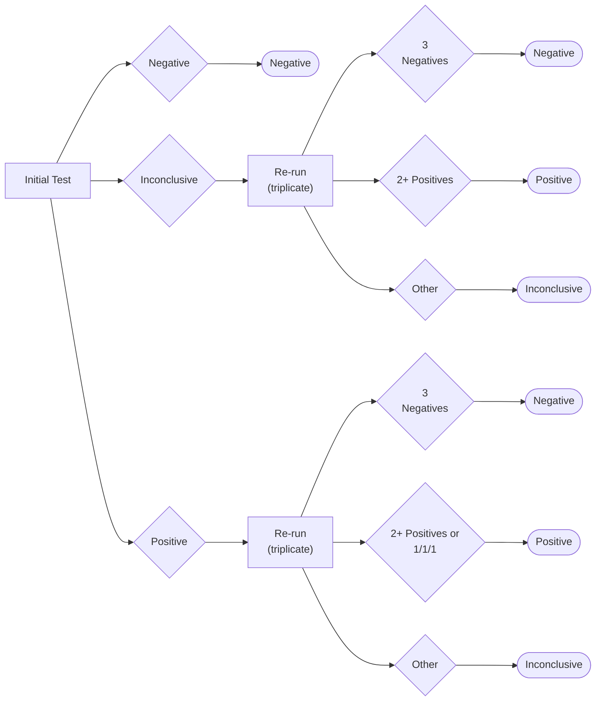

METADATA
last updated: 2026-03-13_065635
file_name: _archive-combined-files_guides_140k.md
category: guides
subcategory: NA
gfile_url: **FLAGGED - TBD user-facing Google-hosted public file URL**
words: 
tokens: 

CONTENT

# _archive-combined-files_guides_140k (54 files, 140,376 tokens)

METADATA
last updated: 2026-03-13_065635
file_name: _archive-combined-files_manufacturing_14k.md
category: guides
subcategory: manufacturing
gfile_url: **FLAGGED - TBD user-facing Google-hosted public file URL**
words: 
tokens: 

CONTENT

# _archive-combined-files_manufacturing_14k (7 files, 13,685 tokens)

# 3,429  _AI_Reagent Concentrations.md
METADATA
last updated: 2026-02-17 RT initial creation
file_name: _AI_Reagent Concentrations.md
file_date: 2026-02-17
title: FloodLAMP Reagent Concentrations Reference
category: guides
subcategory: manufacturing
tags: 
source_file_type: md
xfile_type: NA
gfile_url: https://docs.google.com/document/d/1gOeoQK0CY2kBKjLJ50EB9ObVzu74yotF_wSNu4nXYLs
xfile_github_download_url: https://raw.githubusercontent.com/FocusOnFoundationsNonprofit/floodlamp-archive/main/guides/manufacturing/Reagent%20Concentrations.md
pdf_gdrive_url: NA
pdf_github_url: NA
conversion_input_file_type: NA
conversion: NA
license: CC BY 4.0 - https://creativecommons.org/licenses/by/4.0/
tokens: 3429
words: 1768
notes: Created by Opus 4.6 during archive preparation. **NOT HUMAN VERIFIED - MAY CONTAIN ERRORS** Concentrations were extracted from manufacturing SOPs, process flow diagrams, and cost models in the FloodLAMP archive, with verification calculations shown. Source documents include: SOP-202-A_1 (100XIS Manufacturing), SOP-201-A_2 (PGS48 Manufacturing), SOP-101-A_2 (1XISS Prep), SOP-102-A_2 (Reaction Mix Prep), SOP-105-A_1/B_1 (QuickColor Test Diagrams/Signage), Assay and Reagent Manufacturing Diagrams, Cost Model, and LAMP Primers spreadsheet.
summary_short: The FloodLAMP Reagent Concentrations Reference provides final concentrations and verification calculations for all key FloodLAMP assay reagents: 100X Inactivation Solution (TCEP 0.25M, EDTA 0.1M, NaOH 1.15N), Primer-Guanidine Solution (primers 2.38X, guanidine-HCl 95.2mM), 1X Inactivation Saline Solution (TCEP 2.5mM, EDTA 1.0mM, NaCl ~153mM), CLAMP Reaction Mix composition, and Twist Positive Control dilution series. Concentrations are derived from manufacturing SOPs, process flow diagrams, and cost models in the archive with full calculation work shown.

CONTENT

## Overview
This reference document consolidates the final concentrations of all key FloodLAMP reagents in one place. Concentrations are extracted from manufacturing SOPs, process flow diagrams (Assay and Reagent Manufacturing Diagrams), and cost models in the FloodLAMP archive. Where concentrations are not explicitly stated in the source documents, they are calculated from batch recipes with full work shown.

## 100X Inactivation Solution (100XIS)

### Final Concentrations
| Component | Concentration |
|-----------|---------------|
| TCEP | 0.25 M |
| EDTA | 0.1 M |
| NaOH | 1.15 N |
||

Source: Assay and Reagent Manufacturing Diagrams, Slide 16 (100X Inactivation Solution Diagram, Standard). Concentrations are stated directly in the slide description.

### Verification from XL Batch Recipe (SOP-202-A_1)
The XL batch recipe calls for:
- 75.0 g TCEP
- 667.5 mL NF water
- 209.4 mL of 0.5M EDTA
- 120 mL of 10N NaOH

Total volume: 667.5 + 209.4 + 120 = 996.9 mL (plus the small volume displaced by dissolved TCEP, bringing total to ~1,000 mL).

**TCEP**: 75 g / 286.65 g/mol (MW from TCEP SDS) = 0.2617 mol in ~1 L = **0.262 M** (matches ~0.25M stated; slight excess due to total volume being marginally under 1L before TCEP displacement).

**EDTA**: 209.4 mL x 0.5 M = 104.7 mmol in ~1 L = **0.105 M** (matches ~0.1M stated).

**NaOH**: 120 mL x 10 N = 1,200 meq in ~1 L = **1.20 N** (matches ~1.15N stated; the small discrepancy reflects the actual total volume being slightly greater than 1L after TCEP dissolves).

### Additional Confirmation
The Cost Model (operations archive) independently lists the same concentrations:
- TCEP stock concentration: 0.5M, final in 100XIS: 0.25M
- EDTA source: 0.5M, final in 100XIS: 0.1M
- NaOH source: 10N, final in 100XIS: 1.15N

### Raw Materials
| Component | Source Product | Source Concentration |
|-----------|---------------|----------------------|
| TCEP | GoldBio TCEP25 (25g bottle) | Solid, MW 286.65 g/mol |
| EDTA | Thermo 15575020 | 0.5 M |
| NaOH | Sigma SX0607N | 10 N |
| NF Water | Thermo 10977015 | N/A |
||

Storage: -20°C in 5 mL screw cap vials (standard batch) or 1 mL aliquots in 1.5 mL tubes (standard batch from Slide 16).

## Primer-Guanidine Solution (PGS)

### Final Concentrations
| Component | Concentration in PGS |
|-----------|----------------------|
| LAMP Primers (each of 3 sets: As1e, N2, E1) | 2.38X per set |
| Guanidine-HCl | 95.2 mM |
||

Source: Assay and Reagent Manufacturing Diagrams, Slide 10 (Primer-Guanidine Solution Diagram). PGS specs stated as: Primers 2.38X, GUD 95.2 mM.

### Verification from PGS48 Manufacturing Recipe (SOP-201-A_2)
The PGS48 batch recipe calls for:
- 28.2 mL NF Water (refrigerated >1 hr)
- 600 µL of 6M Guanidine-HCl
- 9 tubes of LAMP primers (3 sets x 3 tubes each), each resuspended in 1,000 µL NF Water = 9.0 mL total primer volume

Total volume: 28.2 + 0.6 + 9.0 = **37.8 mL**

**Guanidine-HCl**: 600 µL x 6 M = 3,600 µmol = 3.6 mmol. In 37.8 mL: 3.6 / 37.8 = **95.2 mM** (matches stated spec).

**Primers**: Each primer set has 3 tubes resuspended at 30X premix concentration (per LAMP Primers spreadsheet). Per set: 3 tubes x 1,000 µL = 3,000 µL at 30X. Diluted into 37,800 µL total: 3,000 x 30 / 37,800 = **2.38X per set** (matches stated spec).

### LAMP Primer Sets
The three SARS-CoV-2 LAMP primer sets used in PGS, each containing 6 primers at 30X premix concentration:

| Set | Target | Gene |
|-----|--------|------|
| As1e | ORF1ab | SARS-CoV-2 |
| N2 | N gene | SARS-CoV-2 |
| E1 | E gene | SARS-CoV-2 |
||

Each 30X premix contains (per the LAMP Primers spreadsheet):

| Primer Type | 30X Concentration (µM) |
|-------------|------------------------|
| FIP | 48.0 |
| BIP | 48.0 |
| F3 | 6.0 |
| B3 | 6.0 |
| LF | 12.0 |
| LB | 12.0 |
||

At 1X (final reaction), concentrations are: FIP/BIP 1.6 µM, F3/B3 0.2 µM, LF/LB 0.4 µM.

### PGS Aliquot Sizes
| Aliquot Volume | Reactions per Aliquot | Designation |
|----------------|----------------------|-------------|
| 92 µL | 8 | PGS8 |
| 275 µL | 24 | PGS24 |
| 550 µL | 48 | PGS48 |
| 1,120 µL | 96 | PGS96 |
||

Storage: -20°C in 1.5 mL screw cap tubes.

## CLAMP Reaction Mix

### Component Volumes by Reaction Scale
| Reactions | PGS (µL) | CLAMP MM (µL) | Total RM (µL) |
|-----------|----------|---------------|---------------|
| 8 | 92 | 109 | 201 |
| 16 | 183 | 218 | 401 |
| 24 | 275 | 328 | 603 |
| 48 | 550 | 655 | 1,205 |
||

Source: SOP-102-A_2 (Reaction Mix Prep), SOP-105-A_1 (QuickColor Test Diagrams), SOP-105-B_1 (QuickColor Test Signage). All three documents report the same volumes.

### Per-Reaction Composition
Each reaction: 23 µL reaction mix dispensed per well + 2 µL sample = **25 µL total reaction volume**.

Using the 48-reaction scale for calculation:
- PGS per reaction: 550 / 48 = **11.46 µL**
- CLAMP MM per reaction: 655 / 48 = **13.65 µL**
- Total RM per reaction: 25.1 µL (~10% overage built into the scale-up)

### Final Concentrations in the 25 µL Reaction
| Component | Concentration in Source | Dilution Factor | Final in Reaction |
|-----------|------------------------|-----------------|-------------------|
| LAMP Primers (each set) | 2.38X (in PGS) | 11.46/25 = 0.458 | ~1.09X (~1X target) |
| Guanidine-HCl | 95.2 mM (in PGS) | 11.46/25 = 0.458 | ~43.6 mM |
| NEB M1804 CLAMP MM | 2X (NEB standard) | 13.65/25 = 0.546 | ~1.09X (~1X target) |
||

Note: NEB M1804 (WarmStart Colorimetric LAMP Master Mix) is a proprietary commercial product. Its internal composition (Bst 2.0 WarmStart DNA polymerase, WarmStart RTx reverse transcriptase, dNTPs, MgSO4, phenol red pH indicator, buffer) is not specified in the FloodLAMP archive. NEB supplies it as a 2X concentrate.

### Reaction Mix Usage
- Dispense 23 µL per well (at bottom, no blowout, no tip touch)
- Add 2 µL sample per well (pipet up and down 5X, blowout in liquid, tip touch)
- Amplify at 65°C for 25 min
- Expiration: 4 weeks after prep or if discolored

## 1X Inactivation Saline Solution (1XISS)

### Preparation Protocol
1XISS is prepared by diluting 100XIS 1:100 into 0.9% saline (SOP-101-A_2).

| Saline Volume | 100XIS Volume | Resulting 1XISS Volume |
|---------------|---------------|------------------------|
| 5 mL | 50 µL | ~5 mL |
| 15 mL | 150 µL | ~15 mL |
| 50 mL | 500 µL | ~50 mL |
||

Source: SOP-105-B_1 (QuickColor Test Signage) and SOP-101-A_2 (1XISS Prep Table Form).

### Calculated Final Concentrations
These concentrations are not explicitly stated in the archive documents but are derived from the 1:100 dilution of 100XIS into 0.9% saline.

Starting materials:
- 100XIS: TCEP 0.25M, EDTA 0.1M, NaOH 1.15N
- 0.9% NaCl saline: 9 g/L NaCl, MW 58.44 g/mol = 154 mM NaCl

| Component | 100XIS Concentration | Dilution (1:100) | Final in 1XISS |
|-----------|----------------------|-------------------|----------------|
| TCEP | 0.25 M | /100 | 2.5 mM |
| EDTA | 0.1 M | /100 | 1.0 mM |
| NaOH | 1.15 N | /100 | 11.5 mN (0.0115 N) |
| NaCl | 154 mM (from saline) | x 99/100 | ~152.5 mM (~0.89%) |
||

The 2.5 mM TCEP concentration is independently confirmed in the Cost Model (operations archive), which lists "TCEP Rxn Conc mM = 2.5".

### 1XISS Usage
- Add 1 mL of 1XISS to each pooled dry swab sample tube
- Vortex 10 sec (individual tubes) or 30 sec (tubes in rack)
- Heat inactivation: Water bath 99°C for 8 min then cool 10 min, OR dry heat block 95°C for 5 min then cool 5 min
- Expiration: 2 weeks after preparation

## Twist Positive Control (TPC)

### Dilution Series
| Stock | Concentration | Volume | Storage |
|-------|---------------|--------|---------|
| Twist 102019 (source RNA) | ~1 x 10^6 cp/µL | 100 µL | -80°C |
| Total Human RNA (carrier) | 50 ng/µL | 100 µL | -80°C |
| TSPC (source aliquots) | (concentrated) | 5 µL x 19 | -80°C |
| TRPC (source stock) | 1,000 cp/µL | 490 µL x 10 | -80°C |
| TFPC (intermediate) | (intermediate) | 20 µL x 24 | -80°C |
| TPC (working aliquots) | 125 cp/µL | 10 µL x 16 | -80°C |
||

Source: Assay and Reagent Manufacturing Diagrams, Slide 7 (Twist Positive Control Diagram).

### Carrier Buffer
Twist Synthetic SARS-CoV-2 RNA Control is supplied in TE buffer (per Twist SDS-001038):

| Buffer Component | Concentration |
|------------------|---------------|
| Tris | 10 mM, pH 8.0 |
| EDTA | 0.1 mM |
| RNA | ≤1% |
||

### In-Use Preparation
For PGS verification runs (SOP-301): TPC100 is thawed for 30 sec, then 20 µL of ultra pure water is added to create TPC50 (~50 cp/µL). 2 µL of TPC50 is added per positive control well, delivering approximately **100 copies** of synthetic SARS-CoV-2 RNA per reaction.

## Comprehensive Summary Table
| Reagent | Component | Concentration |
|---------|-----------|---------------|
| **100XIS** | TCEP | 0.25 M |
| **100XIS** | EDTA | 0.1 M |
| **100XIS** | NaOH | 1.15 N |
| **PGS** | LAMP Primers (per set) | 2.38X |
| **PGS** | Guanidine-HCl | 95.2 mM |
| **1XISS** | TCEP | 2.5 mM |
| **1XISS** | EDTA | 1.0 mM |
| **1XISS** | NaOH | 11.5 mN |
| **1XISS** | NaCl | ~153 mM (~0.89%) |
| **Reaction (25 µL)** | LAMP Primers (per set) | ~1X |
| **Reaction (25 µL)** | Guanidine-HCl | ~43.6 mM |
| **Reaction (25 µL)** | NEB M1804 CLAMP MM | ~1X (from 2X) |
| **TPC (working)** | Synthetic SARS-CoV-2 RNA | 125 cp/µL |
| **TPC50 (in-use)** | Synthetic SARS-CoV-2 RNA | ~50 cp/µL |
||

## Source Documents
The concentrations in this reference were extracted and verified from the following FloodLAMP archive documents:
- Assay and Reagent Manufacturing Diagrams (guides/manufacturing) — Slides 5, 6, 7, 10, 11, 16
- SOP-202-A_1: 100XIS Manufacturing Run Form (guides/manufacturing)
- SOP-201-A_2: PGS48 Manufacturing Run Form (guides/manufacturing)
- SOP-101-A_2: 1XISS Prep Table Form (guides/qms-sops)
- SOP-102-A_2: Reaction Mix Prep Table Form (guides/qms-sops)
- SOP-105-A_1: QuickColor Test Diagrams (guides/qms-sops)
- SOP-105-B_1: QuickColor Test Signage (guides/qms-sops)
- Cost Model - FloodLAMP (guides/operations)
- LAMP Primers UPDATED 12-17-2020 (guides/operations)
- SDS - TCEP (guides/sds) — for TCEP molecular weight

# 1,669  _context-commentary_guides-manufacturing.md
METADATA
last updated: 2026-02-16 RT
file_name: _context-commentary_guides-manufacturing.md
category: guides
subcategory: manufacturing
gfile_url: **FLAGGED - TDB after review and update of all CC**
words: 1176
tokens: 1669

CONTENT

## Context
The manufacturing subcategory contains the Standard Operating Procedures (SOPs) and process flow diagrams that represented FloodLAMP's most mature approach to producing its two key reagents: the Primer-Guanidine Solution (PGS48) and the 100X Inactivation Solution (100XIS).

PGS48 is the Primer-Guanidine Solution formulated for 48 reactions. It combines LAMP primer sets (As1e, N2, E1) with guanidine hydrochloride and nuclease-free water. The resulting solution is mixed with NEB's colorimetric LAMP master mix to form the reaction mix for the QuickColor LAMP test. The "48" refers to the standardized batch size of 48 reactions, tuned to FloodLAMP's typical customer usage patterns of 20–100+ reactions per session.

100XIS is the 100X Inactivation Solution, a TCEP-based formulation combining TCEP, EDTA, and NaOH. When diluted to 1X Inactivation Saline Solution and added to dry swabs, it extracts and protects the RNA for downstream testing upon heating. Both reagent formulations derive from the Rabe-Cepko protocol.

The subcategory includes five files:

- **Assay and Reagent Manufacturing Diagrams** — A 19-slide presentation containing process flow diagrams for all key reagent manufacturing and assay workflows, covering PGS batching, 100XIS manufacturing, primer preparation, positive control aliquoting, and assay setup at various reaction scales (24, 48, and 96 reactions).
- **SOP-201-A_2: PGS48 Manufacturing Run Form** — Step-by-step manufacturing procedure for PGS48, including primer resuspension, guanidine-HCl mixing, and robotic aliquoting on an OpenTrons liquid handler.
- **SOP-202-A_1: 100XIS Manufacturing Run Form** — Manufacturing procedure for 100XIS, covering TCEP weighing, component mixing in a 1L glass bottle, and aliquoting into 5 mL vials for storage at -20°C.
- **SOP-301: PGS48 Verification Run Form** — Quality verification procedure for PGS48 batches via CLAMP amplification with positive and negative controls, including a plate layout map for tracking results by lot number.
- **SOP-302: 100XIS Verification Run Form** — Quality verification procedure for 100XIS batches via CLAMP amplification.

The term "manufacturing" is used loosely here. FloodLAMP's production was small-scale pilot manufacturing — a small team working in a shared lab space at MBC BioLabs in San Carlos, California, without the infrastructure or experience typical of industrial reagent manufacturing. The team included a PhD scientist who developed the initial batch records and then these SOPs, which represented the most controlled and streamlined versions of the processes FloodLAMP achieved.

These SOPs were preceded by a less formal system of batch records. The transition to SOPs was substantially but not fully complete by early 2022 (January–February), with the PGS48 and 100XIS procedures being the primary ones formalized. The PGS48 manufacturing process used an OpenTrons liquid handling robot for aliquoting, along with custom 3D-printed tube holders.

Over its operating period, FloodLAMP produced approximately 100,000 reactions worth of PGS and 150,000–200,000 samples worth of 100X Inactivation Solution. The PGS48 process yielded 3,264 reactions per lot (68 tubes at 550 µL each) and could produce roughly 10,000 reactions per hour once setup was complete, though setup time was significant. The 100XIS was produced in much larger lots — approximately 108,000 reactions per lot (216 five-mL tubes), achievable in a few hours with setup time dominating the run.

No formal stability study was conducted on PGS, as it was stored frozen and used same-day to make the reaction mix. The more pressing stability issue was the reaction mix itself: when sites stored pre-made reaction mix, the deep pink color of the colorimetric LAMP reaction would sometimes fade or turn orange. FloodLAMP provided clear instructions to avoid storing pre-made reaction mix when possible, and to verify the deep pink color before use. A cursory stability study was performed on the 1X Inactivation Saline Solution (1XISS) using PCR as the endpoint, measuring over a period of two weeks. No significant loss of signal was observed, so two weeks was specified as the usage window for 1XISS.

These documents connect to other parts of the archive: the reagents produced here were shipped to FloodLAMP's pilot program customers (documented in the Pilots collection), and the testing protocols that use these reagents are covered in other Guides subcategories.

## Commentary
These SOPs and the reagent formulations they document were among the most important operational achievements at FloodLAMP. They represented a significant step in simplifying and standardizing the reagent production process. The Primer-Guanidine Solution, in particular, was a meaningful improvement — premixing the primers with guanidine hydrochloride eliminated a step for the end user, and we confirmed through testing that this premixing did not cause degradation. We also put considerable thought into the volumes and tube sizes to minimize waste while providing enough reagent for a typical testing session of 20 to several hundred reactions.

The OpenTrons robot was used for PGS48 aliquoting, and we had custom 3D-printed tube holders to support the workflow. In hindsight, the robotic aliquoting was overkill for the volumes we actually produced. We over-indexed on process improvements at a time when the bottleneck was elsewhere — we couldn't scale the rest of our operations (ordering, logistics, customer support) to match the demand during the Omicron surge in late 2021 and early 2022. We had on the order of half a million reactions worth of primers on hand. The process control was a step in the right direction, but the investment in automation wasn't justified by our actual throughput.

That said, the formulation work itself — consolidating into PGS, tuning the volumes, and standardizing at 48 reactions — was genuinely valuable. That's the endpoint worth preserving from what we did here.

The broader lesson for the field is about the reagent supply chain. Small organizations like FloodLAMP should not be manufacturing their own reagents if there's any way to avoid it. What's needed is for reagent manufacturers — the actual producers like New England Biolabs, not the white-label diagnostic companies — to produce low-cost, high-volume reagent kits for the most widely used open protocols. This has to go hand in hand with establishing open EUA protocols and rights of reference so that multiple parties can legally use and distribute these reagents to run validated, consensus testing protocols.

The bottleneck during the Omicron surge was not reagent manufacturing itself but the overall kit and supplies preparation, shipment, tracking, and coordination. The system involved over 100 parts, many requiring qualification and preparation. Preparing, delivering, and supporting the complete testing systems was a large burden for a small team. The process didn't fully mature until FloodLAMP's last pilot (Abrome) mid 2022, where a cart-and-drawers system worked well. Beyond the physical logistics, the digital side — apps, data tracking, troubleshooting — was a constant challenge with significant downtime and outages.

The model to follow is SalivaDirect, which contracted with Eurofins to produce commercially available SalivaDirect kits, which were available for general order and not restricted to clinical labs designated under Saliva Direct's open EUA. When we ordered those kits, they arrived next day, were well formulated, and a relatively inexperienced lab tech was able to run the protocol successfully on a PCR machine. That combination — simplified protocol, commercially manufactured reagents, fast shipping — is what decentralized testing needs. Having individual labs or small companies mix their own reagents is a dead end for scale.

# 1,958  Assay and Reagent Manufacturing Diagrams.md
METADATA
last updated: 2026-02-15 RT initial conversion
file_name: Assay and Reagent Manufacturing Diagrams.md
file_date: 2022-02-01
title: FloodLAMP Assay and Reagent Manufacturing Diagrams
category: guides
subcategory: manufacturing
tags: 
source_file_type: gslide
xfile_type: pptx
gfile_url: https://docs.google.com/presentation/d/10kiok18TcbatUeareNyUyrcr90_ib0gT56NpWsIh58U
xfile_github_download_url: https://raw.githubusercontent.com/FocusOnFoundationsNonprofit/floodlamp-archive/main/guides/manufacturing/Assay%20and%20Reagent%20Manufacturing%20Diagrams.pptx
pdf_gdrive_url: https://drive.google.com/file/d/1uyKevLkDpU1De9Gl8Y2fi1CHgNfvMl7f
pdf_github_url: https://github.com/FocusOnFoundationsNonprofit/floodlamp-archive/blob/main/guides/manufacturing/Assay%20and%20Reagent%20Manufacturing%20Diagrams.pdf
conversion_input_file_type: pptx
conversion: msmid
license: CC BY 4.0 - https://creativecommons.org/licenses/by/4.0/
tokens: 1958
words: 925
notes: This is a presentation (pptx/Google Slides) consisting primarily of manufacturing process flow diagrams (images). The markdown content lists slide titles only as placeholders since the slides are image-based diagrams. Refer to the source PDF or pptx for the actual diagrams.
summary_short: The FloodLAMP Assay and Reagent Manufacturing Diagrams is a 19-slide presentation containing process flow diagrams for all key reagent manufacturing and assay workflows. It covers the FloodLAMP Direct RNA Assays (QuickColor LAMP and EasyPCR) at 48- and 96-reaction scales, validation first-run setup, gamma contrived positive preparation, 100X Inactivation Solution manufacturing (standard and XL batches), 1X Inactivation Saline Solution preparation, Twist Positive Control aliquoting, Gamma Blue and 10K dilution series, Primer-Guanidine Solution (PGS) batching, colorimetric CLAMP assay setup, 5X PCR primer preparation, and PCR assay reaction mix preparation.

CONTENT

## Slide 1: FloodLAMP Direct RNA Assays - 48 Reaction Volumes
_Manufacturing process flow diagram showing reagent preparation and assay workflow for 48-reaction scale. Covers 100X Inactivation Solution, 0.9% Saline, Primer-Guanidine Solution (PGS, 550µL), Colorimetric LAMP MM (655µL), PCR Reaction Mix, and both QuickColor LAMP Test (65°C/25min) and EasyPCR Test (qPCR, 80min) pathways._

## Slide 2: FloodLAMP Direct RNA Assays - 96 Reaction Volumes
_Manufacturing process flow diagram showing reagent preparation and assay workflow for 96-reaction scale. Same reagent pathways as Slide 1 but with scaled volumes: PGS (1080µL), Colorimetric LAMP MM (1286µL), CLAMP Reaction Mix (2366µL, 25µL/rxn)._

## Slide 3: Validation: First Run - 24 Reaction Volumes
_Validation run diagram for 24-reaction scale with both CLAMP (PGS 275µL, CLAMP MM 327µL, 602µL total RM) and PCR (5X PCR Primers 105µL, PCR MM 263µL, RT 26.3µL) assay pathways. Includes positive and negative controls in the 24-tube sample plate._

## Slide 4: Gamma Contrived Positive Diagram (v1.3)
_Process flow for preparing Gamma Contrived Positive (GCP) samples. Shows dilution from Gamma Blue Dilution (GBD, 1000 cp/µL) using anterior nares (AN) swabs dried >20 min, with 1X Inactivation Saline Solution elution and standard inactivation procedures._

## Slide 5: 100X Inactivation Solution XL Diagram
_Extended-scale manufacturing diagram for 100X Inactivation Solution. Key source materials: TCEP (25g), 10N NaOH (1L), 0.5M EDTA (100mL). Includes component volume calculation table with Standard and Adjusted columns, plus 0.5M TCEP intermediate preparation step._

## Slide 6: 1X Inactivation Saline Solution Diagram
_Process flow for preparing 1X Inactivation Saline Solution (1XISS). Combines 5M NaCl-derived 0.9% Saline with 100X Inactivation Solution at ~1/100th volume. Shows 50mL Falcon tube aliquoting and reference to Saline Batch Record v1.0 and Inactivation Protocol v5.1._

## Slide 7: Twist Positive Control Diagram
_Aliquoting workflow for Twist Positive Controls (TPC). Key source: Twist 102019 (~1e6 cp/µL, 100µL) and Total Human RNA (50ng/µL, 100µL). Creates TSPC (5µL x 19), TRPC source stock (1000 cp/µL, 490µL x 10), TFPC (20µL x 24), and TPC working aliquots (125 cp/µL, 10µL x 16). All stored at -80°C._

## Slide 8: Gamma Blue Dilution (GBD) Diagram
_Dilution workflow from BEI gamma-irradiated SARS-CoV-2 (NR-52287, 1.75e6 cp/µL). Creates GBEI aliquots (5µL x 100 in PCR strip tubes), then dilutes to GBD (1000 cp/µL) in 30mL Chub (8.75mL), and final aliquots in 1.5mL tubes (83 x 105µL). Reference: Gamma Blue Dil Batch Record v1.1._

## Slide 9: Gamma 10K Dilution (G10K) Diagram
_Dilution workflow from BEI source (1.75e6 cp/µL) to 10,000 cp/µL working stock. Creates GBEI aliquots (5µL x 100), then G10K in 1.5mL screw cap (875µL at 10,000 cp/µL), and final aliquots (32 x 27µL). Reference: Gamma 10K Dil Batch Record vX._

## Slide 10: Primer-Guanidine Solution (PGS) Diagram
_Manufacturing diagram for PGS batches. Combines dry LAMP primer sets (As1e, N2, E1) resuspended in NFWater with 6M Guanidine-HCl (200µL) to create 10X LAMP Primer Mix, then dilutes to PGS. Aliquot options: 92µL x 136 (8 rxn), 275µL x 45 (24 rxn), or 1120µL x 11 (96 rxn). PGS specs: Primers 2.38X, GUD 95.1nM. Reference: Batch Record v2.0._

## Slide 11: Colorimetric Assay Diagram - 24 and 96 Reactions (CLAMP Assay v2.5)
_CLAMP reaction mix preparation for 24-rxn (PGS 275µL + CLAMP MM 327µL = 602µL RM, 73µL/tube fill strips) and 96-rxn (PGS 1080µL + CLAMP MM 1286µL = 2366µL RM, 290µL/tube fill strips) scales. Each CLAMP reaction: 23µL MM + 2µL sample._

## Slide 12: Colorimetric Assay Diagram - 48 Reactions (CLAMP Assay v2.5)
_CLAMP reaction mix preparation for 48-reaction scale. Uses PGS and Colorimetric LAMP MM from frozen storage. Fill strip volumes at 146µL/tube. Note: some volume fields marked "FIX" in original._

## Slide 13: 5X PCR Primers Diagram
_Manufacturing diagram for 5X PCR Primer working stocks. Combines source primers with 11.562mL NFWater to create 12.5mL bulk in 30mL Chub. Aliquots to 1.5mL tubes (105.6µL x 10, 24 rxn, 10% over) and 5mL tubes (1.1mL x 11). References: 5X PCR Primer Source Stock v1.1 and Working Stock v1.0._

## Slide 14: PCR Assay Diagram (PCR Assay v1.3)
_PCR reaction mix preparation for 24-reaction scale. Combines Luna PCR MM (from NEB E3006 Kit), LUNA RT (26.4µL from 100µL aliquot), 5X PCR Primers (105.6µL), and NFWater (79.2µL) into 472.5µL total RM in 1.5mL tube. Fill strip at 57µL/well. Each PCR reaction: 18µL MM + 2µL sample._

## Slide 15: EXTRA
_Blank/placeholder slide._

## Slide 16: 100X Inactivation Solution Diagram (Standard)
_Standard-scale manufacturing diagram for 100X Inactivation Solution. Shows preparation of intermediate stocks: 0.5M TCEP (in 250mL glass bottle + 100mL NFWater), 3.83N NaOH (in 250mL glass bottle + 74mL NFWater), and 0.5M EDTA. Aliquoting to 30mL Chubs and 15mL Falcons, then combining into 100XIS (TCEP 0.25M, EDTA 0.1M, NaOH 1.15N) in 30mL Chub, with final 1mL x 24 aliquots in 1.5mL tubes at -20°C. References batch records for TCEP v1.1, NaOH v1.0, EDTA v1.0, and 100XIS v1.0._

## Slide 17: FloodLAMP Overview - Streamlined Sample Prep
_Overview diagram showing the complete FloodLAMP workflow: 100X Inactivation Solution → 1X Inactivation Saline Solution → sample processing → dual test paths. QuickColor LAMP Test (high sensitivity 90%, ultra-high throughput, ideal for serial screening). EasyPCR Test (very high sensitivity 98%, medium throughput 1.5 hours/94, ideal for diagnostics/reflex/confirm). Highlights streamlined sample prep with upfront swab pooling and same sample for both tests._

## Slide 18: Streamlined Sample Prep (Simplified)
_Simplified version of the overview diagram showing the three main workflow blocks: Streamlined Sample Prep → QuickColor LAMP Test → EasyPCR Test._

## Slide 19: FloodLAMP Lab Playbook
_Diagram showing reflex testing workflow: Positives or Invalids from QuickColor COVID-19 Test reflexed using FloodLAMP EasyPCR COVID-19 Test._

# 1,444  SOP-201-A_2 PGS48 Manufacturing - Run Form.md
METADATA
last updated: 2026-02-16 BA after RT initial conversion
file_name: SOP-201-A_2 PGS48 Manufacturing - Run Form.md
file_date: 2022-02-26
title: FloodLAMP QMS SOP-201-A_2 PGS48 Manufacturing - Run Form
category: guides
subcategory: manufacturing
tags: 
source_file_type: gdoc
xfile_type: docx
gfile_url: https://docs.google.com/document/d/1OE4rCaCn2htHdlq_Q_Nk9Mu-MpMgTtwO
xfile_github_download_url: https://raw.githubusercontent.com/FocusOnFoundationsNonprofit/floodlamp-archive/main/guides/manufacturing/SOP-201-A_2%20PGS48%20Manufacturing%20-%20Run%20Form.docx
pdf_gdrive_url: https://drive.google.com/file/d/1QPBDtkL4h9dFd4yP_X8J5ZpmaJNkUPYJ
pdf_github_url: https://github.com/FocusOnFoundationsNonprofit/floodlamp-archive/blob/main/guides/manufacturing/SOP-201-A_2%20PGS48%20Manufacturing%20-%20Run%20Form.pdf
conversion_input_file_type: docx
conversion: pandoc
license: CC BY 4.0 - https://creativecommons.org/licenses/by/4.0/
tokens: 1444
words: 842
notes: 
summary_short: The FloodLAMP QMS SOP-201-A_2 is a manufacturing run form for producing PGS48 (Primer-Guanidine Solution, 48-reaction aliquots). It covers preparation, safety procedures, step-by-step PGS mixing instructions (primer resuspension, guanidine-HCl addition, vortexing), materials checklist with product/lot tracking, and robotic aliquoting on an Opentrons liquid handler. The form includes write-in fields for location, operator, date, and lot tracking, plus startup/shutdown procedures for the Opentrons robot.

CONTENT

FloodLAMP Biotechnologies
**Document Number:** SOP-201-A
**Effective Date:** 02/26/2022
**Version:** 2

***INTERNAL TITLE:*** PGS48 Manufacturing - Run Form

## PREP
- Safety Procedures:
  - Work in PCR Box or BSC
  - **Designated CLEAN** Lab coat, gloves, face mask, and face shield/goggles
- Wipe down all work surfaces, tube racks, and all items used with 10% bleach solution followed by ethanol (as needed)
- Turn on UV lamp for 15 minutes in PCR Box or BSC (at start or end of prev run)
- Check to ensure you have **sufficient amounts of all materials** for number of lots to be created ([Calculator](https://docs.google.com/spreadsheets/d/13lsSll6-xEt3S978Hygg-NN1sRpHmo3qctL8WpOq_JU/edit?gid=0#gid=0))
- With Scale (USSolid1), **measure 28.2mL of NF Water** in 50mL Falcon Tube, leave **in the refrigerator > 1hr** (prep ahead).
- **Ensure Primer Resuspension NF Water is also in refrigerator > 1 hr** (prep ahead).
- **Do Startup** of the Opentrons (last page).
- **Load Opentrons software**, open protocol "iPGS48_x68_SOP-201-B_2.json"

## PREP USER WRITE IN
_QR Code_ PGS48 Manuf SOP
[Log Form Link](https://docs.google.com/forms/d/1WZ_MRSIV70tB_JvaW4fMwJGhpsMDjF50mVi8yF8p3nA/edit?usp=drive_web&ouid=111730229766683196858)
Location:
Name:
Date and Time:
PGS48 Lots Created:

Materials
- 50mL Falcon Tube (1)
  - Confirm Product ID & Lot in Log Form
- 1.5mL S.C. Tubes (67)
  - Confirm Product ID & Lot in Log Form
- Nuclease-free Water (2)
  - Confirm Product ID & Lot in Log Form
- FloodLAMP Primer Tubes (9)
  - Confirm Product ID & Lot in Log Form
- 6M Guanidine HCl
  - Confirm Product ID & Lot in Log Form
- Pipette ID
  - Confirm Product ID & Lot in Log Form
- 1000uL micropipette tips
  - Confirm Product ID & Lot in Log Form
- Robot tips (Opentrons 1000uL Filter Tip)

Equipment in AirClean Box
- Mini-centrifuge
- Vortex
- Timer
- 50mL & 1.5mL tube racks
- Tip waste bin

## MAKE PGS
- **Thaw three tubes of each primer set for 10-30min after pulling from freezer**
- Spin down primer tubes after thawing
- Get 50mL Falcon Tube of NF water (at least 10mL), put in rack in hood.
- Add 1000uL of Primer Resuspension NF Water to each tube of primers
  - Do NOT stick pipette tip into tube, primers will stick to tip
  - Air drop (no contact) dispense into tubes, no tip change
- **Vortex for 10s** to dissolve
- **Let sit 1min**, then vortex again 10s
- **Centrifuge** tubes briefly
- Retrieve NF water aliquot from fridge, check that volume appears ~28.2mL
- **Add 600uL of 6M Guanidine-HCl** to NF water in 50mL Falcon Tube
- **Mix** by vortexing 10s
- **Add the full volume of all nine tubes of Primer sets** to the 50mL Falcon Tube
  - Careful to get last bit of liquid (look)
- **Mix well** by vortexing 30s
- Remove cap and pipet any liquid in the cap and add back into the tube
- **Keep PGS mix in refrigerator** until aliquoting or aliquot within 5min

## ALIQUOT ON OPENTRONS
- **Arrange the robot deck** according to deck layout shown below
  - Remove lid from tip box, **verify that there is a tip in the back-left position**
  - Fill the back and front row of each of the six tube racks with 1.5mL SC tubes, uncapped
  - Place the 50mL PGS reservoir tube in the plate at position "8"
- **Click** "Proceed to Calibrate" button
- **Follow on-screen instructions** to complete calibration procedure
- **Click** "Start Run"
- When protocol has finished, **cap all tubes** inside the Opentrons hood
- **Transfer tubes** to cryobox, store at -20C.
- Label cryobox lid with "PGS48" & Lot#.
- **Click** "Reset Run" on OpenTrons software

Notes:
- Make sure the caps are not obstructing the openings of the neighboring tubes.
- Ensure that the 50mL tube is fully seated in the holder with 10mL mark just showing.
- Calibration procedure necessary only on the first run. Subsequent runs won't require re-calibration until the robot is disconnected/reconnected or a different program is run. Calibrate 1.5mL tube with tube out and center XY with respect to rack hole.
- Note that the final 1-2 tubes may be short on volume. These should be either used to do QC verification of the batch or discarded. Write with a marker a "•" on the top of any short tubes.
- Measure remaining volume in Falcon tube: if outside 450uL +/- 10uL, weigh all tubes individually. Spec is X to Y g, reject any tubes outside spec.

_[Deck Layout Diagram - see source PDF for image]_

## OpenTrons Startup
1. Turn on rocker power switch in back left (-- mark).
2. Press flashing blue button on front, wait until solid.
3. If not already open, launch OpenTrons application with shortcut on desktop.
4. Start Hepa unit and put at setpoint.
5. Take lid tipbox cover off.
6. Ensure tip is in back left position of tipbox.
7. Open json protocol.
8. Run calibration.
9. Leave front panel closed (down) when running.

## OpenTrons Shutdown
1. Place lid tipbox cover on.
2. Turn off Hepa unit.
3. Turn off OpenTrons rocker power switch (O mark).
4. Close front panel.

# 496  SOP-202-A_1 100XIS Manufacturing - Run Form.md
METADATA
last updated: 2026-02-15 BA after RT initial conversion
file_name: SOP-202-A_1 100XIS Manufacturing - Run Form.md
file_date: 2022-01-21
title: FloodLAMP QMS SOP-202-A_1 100XIS Manufacturing - Run Form
category: guides
subcategory: manufacturing
tags: 
source_file_type: gdoc
xfile_type: docx
gfile_url: https://docs.google.com/document/d/1pzBrcBLajWdFH0M_ib3bILgtN7EN5h4G2KROieLmN78
xfile_github_download_url: https://raw.githubusercontent.com/FocusOnFoundationsNonprofit/floodlamp-archive/main/guides/manufacturing/SOP-202-A_1%20100XIS%20Manufacturing%20-%20Run%20Form.docx
pdf_gdrive_url: https://drive.google.com/file/d/1Th-fjY0mqBwXC74ZZwirwFW-iHAPIZ8F
pdf_github_url: https://github.com/FocusOnFoundationsNonprofit/floodlamp-archive/blob/main/guides/manufacturing/SOP-202-A_1%20100XIS%20Manufacturing%20-%20Run%20Form.pdf
conversion_input_file_type: docx
conversion: pandoc
license: CC BY 4.0 - https://creativecommons.org/licenses/by/4.0/
tokens: 496
words: 262
notes: 
summary_short: The FloodLAMP QMS SOP-202-A_1 is a manufacturing run form for producing 100X Inactivation Solution (100XIS). It provides step-by-step instructions for combining TCEP, nuclease-free water, EDTA, and NaOH in a 1L glass bottle, followed by aliquoting 5 mL into labeled screw cap vials for storage at -20°C. The form includes safety procedures (fume hood, PPE), a materials checklist with lot/product ID tracking fields, equipment requirements, and write-in fields for operator documentation.

CONTENT

FloodLAMP Biotechnologies
**Document Number:** SOP-202-A
**Effective Date:** 01/21/2022
**Version:** 1

***INTERNAL TITLE:*** 100XIS Manufacturing - Run Form

## PREP
- Wipe down all work surfaces, tube racks, and other items used with 10% bleach solution followed by ethanol (as needed)
- Label 5mL screw cap vials with 100XIS labels
- Safety Procedures:
  - Work in fume hood
  - Lab coat, gloves, face mask, and face shield/goggles

## PREP USER WRITE IN
_QR Code_ 100XIS Manuf SOP
Form Link
Location:
Name:
Date and Time:

**Material**
- 5mL screw cap vials (200) LOT#:
  (Eppendorf)
- TCEP 25 g bottle (3) LOT#
  (GoldBio TCEP25) EXP:
- Nuclease-free Water LOT#:
  (Thermo 10977015) EXP:
- 0.5M EDTA LOT#
  (Thermo 15575020) EXP:
- 10N NaOH LOT#
  (Sigma SX0607N) EXP:

**Equipment**
- 1 L glass bottle with cap
- Scale
- Graduated cylinder or 50mL volumetric pipet
- Bottle top dispenser for 500mL bottle

**Notes:**

## MAKE 100XIS
- **Weigh 75.0 g of TCEP**
- Add TCEP to cleaned and sanitized 1L glass bottle
- **Add 667.5 mL of NF water to the glass bottle**
- **Cap and swirl bottle to dissolve 75 g of TCEP (do not shake)**
- **Add 209.4 mL EDTA**
- **Add 120 mL NaOH solution**
- **Cap and swirl to mix**
  - Wrap cap with parafilm
- **Aliquot 5 mL into labeled 5mL screw cap vials**
  - Prime the pump ~2-3 times into a waste container until it dispenses smoothly
  - Keep the 5mL tube under the dispenser nozzle when withdrawing the plunger to catch drips
- **Place 100XIS vials into the -20C freezer**

# 1,198  SOP-301 PGS48 Verification - Run Form.md
METADATA
last updated: 2026-02-16 BA after RT initial conversion
file_name: SOP-301 PGS48 Verification - Run Form.md
file_date: 2022-01-01
title: FloodLAMP QMS SOP-301 PGS48 Verification - Run Form
category: guides
subcategory: manufacturing
tags: 
source_file_type: gdoc
xfile_type: docx
gfile_url: https://docs.google.com/document/d/1mVuPCxzU2bUILebEfg7gvHwjzD6DwGqv
xfile_github_download_url: https://raw.githubusercontent.com/FocusOnFoundationsNonprofit/floodlamp-archive/main/guides/manufacturing/SOP-301%20PGS48%20Verification%20-%20Run%20Form.docx
pdf_gdrive_url: https://drive.google.com/file/d/1W7vkFU0raZso77GsFPm3LWNDMkqKmwm1
pdf_github_url: https://github.com/FocusOnFoundationsNonprofit/floodlamp-archive/blob/main/guides/manufacturing/SOP-301%20PGS48%20Verification%20-%20Run%20Form.pdf
conversion_input_file_type: docx
conversion: pandoc
license: CC BY 4.0 - https://creativecommons.org/licenses/by/4.0/
tokens: 1198
words: 671
notes: 
summary_short: The FloodLAMP QMS SOP-301 is a verification run form for testing PGS48 (Primer-Guanidine Solution) batches via CLAMP amplification. It covers preparation of reaction mixes (46 µL PGS + 55 µL CLAMP MM per tube), positive/negative control setup, and a plate layout map for tracking POS/NEG results by PGS lot number. The second half includes an Amp Run Sheet Short with standard amplification procedures, heater settings (65°C for 25 min), and write-in fields for operator documentation and result logging.

CONTENT

FloodLAMP Biotechnologies
**Document Number:** SOP-301-A
**Effective Date:** 01/XX/2022
**Version:** 1

***INTERNAL TITLE:*** PGS48 Verification - Run Form

## PREP
- Amp heaters on (Heat indicator lit!)
- Map out plate layout
- Printout these 2 pages out separate
- Label Reaction Mix tubes
  - 1.5mL EDLB tubes
  - 4 rxn per RM tube
  - 1 RM tubes per PGS batch (#68)
- Calc amount of CLAMP MM needed
  - 55 µL x # batches = \_\_\_\_\_\_\_\_\_
  - Use single source tube
  - If larger run combine MM tubes
- Label strip8 tubes (or use plate)
- Make 1mL 1XISS (fill out on next pg)

## PREP USER WRITE IN
_QR Code_ Validation PGS
[Form Link](https://docs.google.com/forms/d/e/1FAIpQLSdGHu4xGNY6SDBQqnp0ZH3N4lL0r4EnNr7e3cYC8mKiNyIXag/closedform)
Location: MBC
Name:
Date and Time:

## RUN
- Get PCR cold block out 10min before - put plate or strip8 tubes in
- Get blue tube cold block out 10min before - keep all RM tubes in this
- Make Reaction Mixes for all tubes:
1. Add 46 µL of each PGS to each RM tube (making sure to match lot#'s)
2. Add 55 µL of CLAMP MM to each RM Tube
3. Vortex for 10s and centrifuge/shake down
4. Add 23µL of reaction mix to each of 4 wells {at bottom, no blowout, no tip touch}
- After adding RM to all reconfigure POS strips together and NEG strips together
- Add NEG control (1XISS) to those columns/tubes - cap
- Prep Pos Control: TPC100 - thaw 30s, add 20uL of Ultra Pure water (clean glove!)
- Add POS - TPC50 to each POS tube PGS Lot# Prefix \_\_\_\_

|  | POS | NEG | POS | NEG | POS | NEG | POS | NEG | POS | NEG | POS | NEG |
|------|------|------|------|------|------|------|------|------|------|------|------|------|
|  | **1** | **2** | **3** | **4** | **5** | **6** | **7** | **8** | **9** | **10** | **11** | **12** |
| **A 1** | POS 0040 | NEG 0040 |  |  |  |  |  |  |  |  |  |  |
| **B 2** | POS 0040 | NEG 0040 |  |  |  |  |  |  |  |  |  |  |
| **C 3** | POS 0041 | NEG 0041 |  |  |  |  |  |  |  |  |  |  |
| **D 4** | POS 0041 | NEG 0041 |  |  |  |  |  |  |  |  |  |  |
| **E 5** | POS 0042 | NEG 0042 |  |  |  |  |  |  |  |  |  |  |
| **F 6** | POS 0042 | NEG 0042 |  |  |  |  |  |  |  |  |  |  |
| **G 7** |  |  |  |  |  |  |  |  |  |  |  |  |
| **H 8** |  |  |  |  |  |  |  |  |  |  |  |  |
||

## PREP
- Heaters on (Heat indicator lit!)
- 1X Inactivation Saline Soln ready
- Reaction mix strip8/plates ready
- Safety Procedures:
  - lab coat
  - gloves
  - face mask
  - face shield or goggles
- Alcohol wipe sample tubes

## PREP USER WRITE IN
|               | Amp Run Sheet Short Any System | version 1.3mod |
|---------------|-------------------------------|----------------|
|               |                               |                |
|               |                               |                |
|               |                               |                |
||

## AMPLIFICATION REACTION
- Thaw Reaction Mix (if frozen)
- Setup tips to align with reactions
- Add 2μL from each sample tube (pipet up & down 5X, blowout in liquid, tip touch)
- Heat 65°C for 25 min, set timer
- Intake sample tubes in App
- Put sample tubes in fridge
- Remove Reactions and Let cool for 1 min before photo
- Take photo in lightbox
- Crop photo and apply vivid filter
- Update results in App
- Log Run with Form link

## AMPLIFICATION REACTION USER WRITE IN
Amp Heater: Strip8 Tubes or Plates
Reaction Mix: Fresh
CLAMP MM Lot and EXP:
Num Reactions (including controls):
Pos Ctrl ID: TPC50 from TPC\_
Ultrapure Water ID:
Neg Ctrl ID (today's 1XISS):
Initial Inconclusives?:
Notes:

# 499  SOP-302 100XIS Verification - Run Form.md
METADATA
last updated: 2026-02-16 BA after RT initial conversion
file_name: SOP-302 100XIS Verification - Run Form.md
file_date: 2022-01-01
title: FloodLAMP QMS SOP-302 100XIS Verification - Run Form
category: guides
subcategory: manufacturing
tags: 
source_file_type: gdoc
xfile_type: docx
gfile_url: https://docs.google.com/document/d/1OkAplBX1wXaJ0g6SHvMH76DuvRYXXYz7
xfile_github_download_url: https://raw.githubusercontent.com/FocusOnFoundationsNonprofit/floodlamp-archive/main/guides/manufacturing/SOP-302%20100XIS%20Verification%20-%20Run%20Form.docx
pdf_gdrive_url: https://drive.google.com/file/d/17gZaAVN_PZnOG81F7vwaNzTDuR74pjdI
pdf_github_url: https://github.com/FocusOnFoundationsNonprofit/floodlamp-archive/blob/main/guides/manufacturing/SOP-302%20100XIS%20Verification%20-%20Run%20Form.pdf
conversion_input_file_type: docx
conversion: pandoc
license: CC BY 4.0 - https://creativecommons.org/licenses/by/4.0/
tokens: 499
words: 298
notes: 
summary_short: The FloodLAMP QMS SOP-302 is a verification run form for testing 100X Inactivation Solution (100XIS) batches via CLAMP amplification. It covers preparation steps including CLAMP MM volume calculation and 1XISS setup, followed by a standard Amp Run Sheet Short with amplification procedures (65°C for 25 min), positive/negative control handling, imaging, and result logging. The form includes write-in fields for heater IDs, reagent lots, reaction counts, and operator documentation.

CONTENT

FloodLAMP Biotechnologies
**Document Number:** SOP-302-A
**Effective Date:** 01/XX/2022 
**Version:** 1

***INTERNAL TITLE:*** 100XIS Verification - Run Form

## PREP
- Amp heaters on (Heat indicator lit!)
- Calc amount of CLAMP MM needed
  - 55 µL x # batches = \_\_\_\_\_\_\_\_\_
  - Use single source tube
  - If larger run combine MM tubes
- Label strip8 tubes
- Make 1mL 1XISS (fill out on next pg)

## PREP USER WRITE IN
_QR Code_ Validation 100XIS
Form Link
Location:
Name:
Date and Time:

## RUN
- Get PCR cold block out 10min before - put plate or strip8 tubes in

## PREP
- Heaters on (Heat indicator lit!)
- 1X Inactivation Saline Soln ready
- Reaction mix strip8/plates ready
- Safety Procedures:
  - lab coat
  - gloves
  - face mask
  - face shield or goggles
- Alcohol wipe sample tubes

## PREP USER WRITE IN
|               | Amp Run Sheet Short Any System | version 1.3mod |
|---------------|-------------------------------|----------------|
|               |                               |                |
|               |                               |                |
|               |                               |                |
||

## AMPLIFICATION REACTION
- Thaw Reaction Mix (if frozen)
- Setup tips to align with reactions
- Add 2μL from each sample tube (pipet up & down 5X, blowout in liquid, tip touch)
- Heat 65°C for 25 min, set timer
- Intake sample tubes in App
- Put sample tubes in fridge
- Remove Reactions and Let cool for 1 min before photo
- Take photo in lightbox
- Crop photo and apply vivid filter
- Update results in App
- Log Run with Form link

## AMPLIFICATION REACTION USER WRITE IN
Amp Heater: Strip8 Tubes or Plates
Reaction Mix: Fresh
CLAMP MM Lot and EXP:
Num Reactions (including controls):
Pos Ctrl ID: TPC50 from TPC\_
Ultrapure Water ID:
Neg Ctrl ID (today's 1XISS):
Initial Inconclusives?:
Notes:

METADATA
last updated: 2026-03-10_105719
file_name: _archive-combined-files_operations_27k.md
category: guides
subcategory: operations
gfile_url: **FLAGGED - TBD user-facing Google-hosted public file URL**
words: 
tokens: 

CONTENT

# _archive-combined-files_operations_27k (4 files, 26,956 tokens)

# 1,145  _context-commentary_guides-operations.md
METADATA
last updated: 2026-02-16 RT
file_name: _context-commentary_guides-operations.md
category: guides
subcategory: operations
words: 898
tokens: 1145

CONTENT

## Context
The operations subcategory contains three files addressing the organizational and logistical underpinnings of FloodLAMP's testing programs. Unlike the test-site subcategory, which houses the protocols, setup guides, and training materials that front-line test administrators and staff used,  these files capture the higher-level planning: what the economics looked like, what inventory was required, and what primers needed to be ordered.

The Cost Model is a working spreadsheet that modeled cost-of-goods-sold at various production scales. It reflects the iterative process of understanding what decentralized LAMP-based testing would actually cost, tracking the relative weight of each cost driver — from the dominant NEB LAMP master mix down to individual consumables and labor. Multiple versions were produced as the operation evolved; this represents one of the more mature iterations.

The Inventory Dashboard was a practical tracking tool for cataloging everything from pipettes and heat blocks to biohazard bags and collection swabs. It gives a concrete picture of the material complexity involved in running FloodLAMP's pop-up lab model. This involved dozens of distinct items spanning reagents, consumables, equipment, lab supplies, collection materials, and training kits. FloodLAMP also used Airtable and other systems for inventory management; the dashboard here is one view of a broader logistics effort.

The LAMP Primers document specifies the primer sets (derived from the Rabe–Cepko protocol) used for FloodLAMP's SARS-CoV-2 assay, along with ordering and handling specifications. Primer procurement was a key operational step — sourcing HPLC-purified primers at the required quantities and concentrations was not trivial, and this document captures the standardized ordering information that supported that process.

For readers wanting to explore the actual cost breakdowns, inventory details, or primer sequences, the source spreadsheets are included in the archive and are well-suited for AI-assisted exploration.

## Commentary
The operational and supply chain challenges were among the most persistent day-to-day problems we faced. Ideally, we would have contracted with a major distributor — Fisher Scientific, USA Scientific, or similar — to handle the full kitting of our lab supplies. In practice, that was not realistic for FloodLAMP given our volumes and lack of an EUA. No single supplier carried everything we needed, and given our unusual model of deploying pop-up labs in non-laboratory settings with non-laboratory staff, the selection of specific supplies and labware was deliberate. Some items could be substituted without issue, but others would create downstream problems if swapped. We eventually settled on a good set of materials, but the way we managed kitting and distribution was fundamentally not scalable. The scalability problem came from several converging factors: our small organizational size, operational inexperience, lack of established supplier partnerships, and the persistent iteration of kit compositions as the assay and protocols evolved. A more scalable approach would have combined top-down and bottom-up elements — standardized kit specifications and equipment bundles that established suppliers could assemble and ship, paired with clear documentation of acceptable substitutions and flexibility ranges so that smaller labs and pop-up operations could also source and validate their own combinations. 

A good example of this evolution is the tube barcoding process. Early on, we had interns manually applying barcode labels to collection tubes — a tedious, labor-intensive task. We then sourced custom QR-coded tubes from a Chinese manufacturer (Jable), which was a major improvement. However, the minimum order quantity was large and the lead time stretched to several months. During those waiting periods, we still had interns and TaskRabbit workers coming in to manually barcode tubes by hand for days at a time.

The swab and collection tube situation was another significant challenge. Like most testing operations during the pandemic, we had difficulty sourcing swabs. But our specific problem was harder than most: we needed a swab with a breakpoint that would leave the remaining tip and shaft fitting inside a reasonably sized tube, and would accommodate 4 swab tips for pooling. We settled on a 5mL tube as our main collection vessel (the mini system used 1.5mL tubes) and tried many tube-and-swab combinations before finding one that worked. The swab we ultimately adopted was, of all things, a urethral swab. We ended up ordering 100,000 swabs and tubes from Jable. We even hired a consultant to tackle the swab sourcing problem, but that effort didn't produce useful results.

For NEB's colorimetric LAMP master mix — by far our largest single cost item — we arranged for NEB to drop-ship directly to test sites for larger orders, which significantly streamlined logistics.

The core lesson from our operational experience is: simplify relentlessly. Every part you can eliminate reduces cost, training burden, and failure modes. Every standard, off-the-shelf item you can use in place of something custom reduces lead times and sourcing risk. For heating, we found that water baths, dry heat blocks, and even repurposed PCR machines all served as workable heaters — flexibility in equipment selection was critical given our resource-constrained deployments.

On the economics side, the NEB master mix dominated our reagent costs and we had limited leverage on pricing even at higher volumes. This was the key reagent of the test and NEB was a great company overall to work with. The cost model in the archive gives the full picture, and our per-person cost with pooling was competitive for the time. Future effort to bring LAMP-based screening to real scale would need to confront the enzyme cost dependency head-on — whether through alternative sourcing, in-house production, or fundamentally different assay chemistry.

# 11,317  Cost Model - FloodLAMP.md
METADATA
last updated: 2026-02-16 BA after RT initial conversion
file_name: Cost Model - FloodLAMP.md
file_date: 2022-10-29
title: FloodLAMP Cost Model
category: guides
subcategory: operations
tags:
source_file_type: gsheet
xfile_type: xlsx
gfile_url: https://docs.google.com/spreadsheets/d/18F8cJ7T0qBaF9k7fSI5S5kFisnrAayJfrjh1DQRoXuE
xfile_github_download_url: https://raw.githubusercontent.com/FocusOnFoundationsNonprofit/floodlamp-archive/main/guides/operations/Cost%20Model%20-%20FloodLAMP.xlsx
pdf_gdrive_url: NA
pdf_github_url: NA
conversion_input_file_type: xlsx
conversion: msmid
license: CC BY 4.0 - https://creativecommons.org/licenses/by/4.0/
tokens: 11317
words: 5666
notes:
summary_short: The FloodLAMP Cost Model spreadsheet provides detailed cost-of-goods-sold (COGS) analysis for the pooled LAMP-based SARS-CoV-2 screening assay, broken down by reagents (primers, inactivation solution, NEB LAMP master mix), consumables (plastics, tips), collection kits, and labor at various production scales (50K to 1M reactions). It includes supplementary sheets for inactivation/binding solution chemistry costs, primer synthesis pricing, solution preparation recipes, NEB OEM master mix volume pricing, throughput modeling, and example school screening project economics.

CONTENT

## Cost Model
### 0) Details
Pool Size	4
mL per pool	1
450,000	Number of Rxns (Pools)	

### 1) Reagents
|                         |                                                                                                         |            |                          |       |               |             |                 |                  |                 |                                                              |                                                                                             |                                     |  |
|------------------------------------|---------------------------------------------------------------------------------------------------------|------------|--------------------------|-------|---------------|-------------|-----------------|------------------|-----------------|--------------------------------------------------------------|---------------------------------------------------------------------------------------------|-------------------------------------|--|
|                                    |                                                                                                         | Per 1K Rxn |                          |       | Cost / Person | Cost / Pool |                 |                  |                 |                                                              |                                                                                             |                                     |  |
| Saline (6 x 250mL bottles shipped) |                                                                                                         | 1,000      | $9                       | 0.4%  | $0.002        | $0.006      | $2,800          |                  |                 |                                                              |                                                                                             |                                     |  |
| Saline (.9% in 50mL Falcon tubes)  |                                                                                                         | 1,000      | $21                      | 1.4%  | $0.005        | $0.021      | $9,550          |                  |                 |                                                              |                                                                                             |                                     |  |
|                                    | mL per tube                                                                                             |            | $0                       | 50    |               |             |                 |                  |                 |                                                              |                                                                                             |                                     |  |
|                                    | overage to give                                                                                         |            | $0                       | 50%   |               |             | Cost per Source | Amount in Source | Units           | Amount per Pool                                              | Notes                                                                                       |                                     |  |
|                                    | 5M Saline                                                                                               |            | $0                       | 0%    | $0.000        | $0.000      | $141            | 10               | L               | 0.000031                                                     |                                                                                             |                                     |  |
|                                    | MilliQ Water                                                                                            |            | $0                       | 0%    | $0.000        | $0.000      |                 |                  |                 |                                                              | upfront cost then free                                                                      |                                     |  |
|                                    | 50mL Falcon Tube                                                                                        |            | $0                       | 28%   | $0.002        | $0.006      | $100            | 500              | tubes           | 0.020000                                                     |                                                                                             |                                     |  |
|                                    | Label                                                                                                   |            | $0                       | 1%    | $0.000        | $0.000      | $235            | 40,000           | tubes           | 0.020000                                                     | https://www.amazon.com/gp/product/B07D43PPFR/ref=ppx_yo_dt_b_search_asin_title?ie=UTF8&th=1 | not chem one - actually use thermal |  |
|                                    | Labor                                                                                                   |            | $0                       | 71%   | $0.004        | $0.015      | $40             | 80               | tubes per hour  |                                                              | use new dispenser, labels too                                                               |                                     |  |
| Inactivation Soln (100XIS)         |                                                                                                         | 1,000      | $13                      | 0.8%  | $0.003        | $0.013      | $5,662          |                  |                 |                                                              | from 100X Inactiv Soln XL v1.0                                                              |                                     |  |
|                                    | Total volume in batch                                                                                   |            | $0                       | 340   | mL            |             |                 |                  |                 |                                                              |                                                                                             |                                     |  |
|                                    | Amount 100XIS per pool                                                                                  |            | $0                       | 0.01  | mL            |             |                 |                  |                 |                                                              |                                                                                             |                                     |  |
|                                    | overage to give                                                                                         |            | $0                       | 50%   |               |             | Cost per Batch  | Amount in Batch  | Units           |                                                              |                                                                                             |                                     |  |
|                                    | TCEP                                                                                                    |            | $0                       | 52%   | $0.0016       | $0.0065     | $222            | 25               | g               |                                                              |                                                                                             |                                     |  |
|                                    | EDTA                                                                                                    |            | $0                       | 3%    | $0.0001       | $0.0004     | $13             | 70               | mL              |                                                              |                                                                                             |                                     |  |
|                                    | NF Water                                                                                                |            | $0                       | 1%    | $0.0000       | $0.0001     | $4              | 122.5            | mL              |                                                              |                                                                                             |                                     |  |
|                                    | NaOH                                                                                                    |            | $0                       | 1%    | $0.0000       | $0.0001     | $2              | 40               | mL              |                                                              |                                                                                             |                                     |  |
|                                    | 5mL Screw Cap Tubes                                                                                     |            | $0                       | 6%    | $0.0002       | $0.0008     | $26             | 68               | tubes           |                                                              |                                                                                             |                                     |  |
|                                    | Labels                                                                                                  |            | $0                       | 0%    | $0.0000       | $0.0000     | $1              | 68               | labels          |                                                              | https://www.amazon.com/gp/product/B071LBQ1WT/                                               | Ultraduty Avery .5x1.75             |  |
|                                    | Labor                                                                                                   |            | $0                       | 37%   | $0.0012       | $0.0047     | $40             | 4                | hours per batch |                                                              |                                                                                             |                                     |  |
| Primer Soln (PGS)                  |                                                                                                         | 1,000      | $184                     | 12.0% | $0.046        | $0.184      | $83,006         |                  |                 |                                                              |                                                                                             |                                     |  |
|                                    | Num Rxn (Pools) per tube                                                                                | 48         |                          |       |               |             |                 |                  |                 |                                                              |                                                                                             |                                     |  |
|                                    | Tubes per Batch                                                                                         | 66         | for 3 x 3 sets = 9 tubes |       |               |             |                 |                  |                 |                                                              |                                                                                             |                                     |  |
|                                    | Primers                                                                                                 |            | $0                       | 92%   | $0.0424       | $0.1697     | $538            | 3168             | rxn             | Updated 9-27-22 RT                                           |                                                                                             |                                     |  |
|                                    | Guanidine                                                                                               |            | $0                       | 1%    | $0.0003       | $0.0011     | $3              | 600              | uL              |                                                              |                                                                                             |                                     |  |
|                                    | NF Water                                                                                                |            | $0                       | 0%    | $0.0001       | $0.0003     | $1              | 28.2             | mL              |                                                              |                                                                                             |                                     |  |
|                                    | 1.5mL Screw Cap Tubes                                                                                   |            | $0                       | 0%    | $0.0001       | $0.0003     | $1              | 66               | tubes           |                                                              |                                                                                             |                                     |  |
|                                    | Labels                                                                                                  |            | $0                       | 0%    | $0.0001       | $0.0004     | $1              | 66               | labels          |                                                              | https://www.amazon.com/gp/product/B071LBQ1WT/                                               | Ultraduty Avery .5x1.75             |  |
|                                    | Labor                                                                                                   |            | $0                       | 7%    | $0.0032       | $0.0126     | $40             | 1                | hours per batch |                                                              |                                                                                             |                                     |  |
| TPC                                | https://docs.google.com/spreadsheets/d/13JTbg_dRq5daE2OKo-OyOo2dmrQh-BpNlDFkkSvXmQs/edit#gid=1494347568 | 24         | $0.17                    | 0.3%  | $0.000        | $0.004      | $1,836          | 112.5            | plates          | $ total seems low but it's 5 tRNA sources and 1 Twist source |                                                                                             |                                     |  |
| CLAMP MM (NEB 1804 LAMP MM)        |                                                                                                         | 960        | $1,277                   | 86.5% | $0.333        | $1.330      | $598,500        |                  |                 |                                                              |                                                                                             |                                     |  |
| TOTAL REAGENTS                     |                                                                                                         |            |                          |       | $0.38         | $1.54       | $691,805        |
||

### 2) Consumables
|     |                            |            |         |         |               |             |          |          |  |  |  |  |  |
|-------------------|----------------------------|------------|---------|---------|---------------|-------------|----------|----------|--|--|--|--|--|
|                   |                            | Num per 1K | Cost Ea | Cost 1K | Cost / Person | Cost / Pool |          |          |  |  |  |  |  |
| Plastics          |                            |            |         | $205.75 |               | $0.21       |          |          |  |  |  |  |  |
|                   | 8-Well PCR Strip & Cap     | 125        | $0.67   | $83.75  |               |             |          |          |  |  |  |  |  |
|                   | 96-Well PCR Plate          | 15         | $4.92   | $73.80  |               |             |          |          |  |  |  |  |  |
|                   | Reagent Reservoir          | 20         | $0.96   | $19.20  |               |             |          |          |  |  |  |  |  |
|                   | Foil Plate Seal            | 30         | $0.58   | $17.40  |               |             |          |          |  |  |  |  |  |
|                   | 1.5 mL Snap Cap            | 50         | $0.13   | $6.50   |               |             |          |          |  |  |  |  |  |
|                   | 1.5 mL Screw Cap Tube      | 10         | $0.16   | $1.60   |               |             |          |          |  |  |  |  |  |
|                   | 5mL Transport Tube (blank) | 10         | $0.12   | $1.20   |               |             |          |          |  |  |  |  |  |
|                   | 50 mL Tube                 | 10         | $0.20   | $2.00   |               |             |          |          |  |  |  |  |  |
|                   | 15 mL Tube                 | 2          | $0.15   | $0.30   |               |             |          |          |  |  |  |  |  |
| Tips              |                            |            |         | $119.97 |               | $0.12       |          |          |  |  |  |  |  |
|                   | Tips_Univ_10uL             | 12         | $6.25   | $75.00  |               |             |          |          |  |  |  |  |  |
|                   | Tips_Univ_200uL            | 3          | $6.79   | $20.37  |               |             |          |          |  |  |  |  |  |
|                   | Tips_Univ_1000uL           | 3          | $8.20   | $24.60  |               |             |          |          |  |  |  |  |  |
| TOTAL CONSUMABLES |                            |            |         |         | $0.08         | $0.33       |          | Discount |  |  |  |  |  |
|                   |                            |            |         |         | $0.06         | $0.23       | $102,602 | 70%      |
||

### 3) Collection Kits
|                                      |                              |                    |                |                   |               |             |               |                                   |                                                                                                                                   |        |         |       |       |
|--------------------------------------------------------|------------------------------|--------------------|----------------|-------------------|---------------|-------------|---------------|-----------------------------------|-----------------------------------------------------------------------------------------------------------------------------------|--------|---------|-------|-------|
|                                                        |                              |                    |                |                   | Cost / Person | Cost / Pool |               |                                   |                                                                                                                                   | Price  | $4      | $5    | $6    |
| Full 4 Person Collection Kit - Sourced in Blister Pack |                              |                    |                |                   | $0.14         | $0.54       | $243,000      |                                   |                                                                                                                                   | Margin | 35%     | 48%   | 57%   |
| Bulk 4 Person Collection Kit - Sourced                 |                              | Num                | Cost Ea        | Cost SubT         | $0.18         | $0.72       |               |                                   | $0.65                                                                                                                             | $2.58  |         |       |       |
|                                                        | 1.5mL Tube                   | 1                  | $0.17          | $0.17             |               |             |               |                                   | Jable QR coded, 100K order                                                                                                        |        |         |       |       |
|                                                        | Swabs                        | 4                  | $0.07          | $0.28             |               |             |               |                                   | Jable UR 200K order, should come down to 2 cents in volume, but may go back up to 10 or more cents each for sterile medical swabs |        |         |       |       |
|                                                        | Biobag                       | 1                  | $0.05          | $0.05             |               |             |               |                                   | new 2x5 biobag price                                                                                                              |        |         |       |       |
|                                                        | Flyer                        | 1                  | $0.10          | $0.10             |               |             |               |                                   | should come way down to 1 cent or less                                                                                            |        |         |       |       |
|                                                        | Outer Zip Seal Bag           | 1                  | $0.12          | $0.12             |               |             |               |                                   | Need to get Uline price                                                                                                           |        |         |       |       |
| Full 4 Person Collection Kit - FL Made                 |                              | Num                | Cost Ea        | Cost SubT         | $0.23         | $0.93       |               |                                   | $0.70                                                                                                                             | $2.80  |         |       |       |
|                                                        | 1.5mL Tube                   | 1                  | $0.16          | $0.16             |               |             |               |                                   | comes down to 10 cents for SSI                                                                                                    |        |         |       |       |
|                                                        | QR Label                     | 1                  | $0.02          | $0.02             |               |             |               |                                   |                                                                                                                                   |        |         |       |       |
|                                                        | Labor to Apply label         | 1                  | $0.10          | $0.10             |               |             |               |                                   |                                                                                                                                   |        |         |       |       |
|                                                        | Swabs                        | 4                  | $0.08          | $0.32             |               |             |               |                                   | should come down to 2 cents in volume, but may go back up to 10 or more cents each for sterile medical swabs                      |        |         |       |       |
|                                                        | Baggie                       | 1                  | $0.01          | $0.01             |               |             |               |                                   |                                                                                                                                   |        |         |       |       |
|                                                        | Labor to put swabs in baggie | 1                  | $0.08          | $0.08             |               |             |               |                                   |                                                                                                                                   |        |         |       |       |
|                                                        | Biobag                       | 1                  | $0.06          | $0.06             |               |             |               |                                   | should come way down to 1 cent or less                                                                                            |        |         |       |       |
|                                                        | Outer Zip Seal Bag           | 1                  | $0.08          | $0.08             |               |             |               |                                   |                                                                                                                                   |        |         |       |       |
|                                                        | Labor to make CK             | 1                  | $0.10          | $0.10             |               |             |               |                                   |                                                                                                                                   |        |         |       |       |
| Bulk 4 Person Collection Kit - FL Made                 |                              |                    |                |                   | $0.15         | $0.60       |               |                                   | $0.62                                                                                                                             | $2.46  |         |       |       |
|                                                        |                              |                    |                |                   |               |             |               |                                   |                                                                                                                                   |        |         |       |       |
|                                                        |                              |                    |                |                   | Cost / Person | Cost / Pool |               |                                   |                                                                                                                                   |        |         |       |       |
| TOTAL COGS                                             | $1,037,406                   | excluding shipping |                |                   | $0.58         | $2.31       | $1,037,406    |                                   |                                                                                                                                   |        |         |       |       |
| Number Rxns (Pools)                                    | 450,000                      | 1,800,000          |                |                   |               |             | $1,037,406.36 |                                   |                                                                                                                                   |        |         |       |       |
| COGS / Rxn (Pool)                                      | $2.31                        | $0.58              |                |                   |               |             |               |                                   |                                                                                                                                   |        |         |       |       |
|                                                        |                              |                    |                |                   |               |             |               | OLD CALCULATIONS - NEED TO REVIEW |                                                                                                                                   |        |         |       |       |
| Breakdown                                              | per rxn                      | %                  | $ for 450K rxn |                   |               |             |               | Labor to Pick and Ship            | 4                                                                                                                                 | $30.00 | $120.00 | $0.03 | $0.12 |
| Primers Source                                         | $0.17                        | 7.4%               | $76,376        |                   |               |             |               |                                   |                                                                                                                                   |        |         |       |       |
| Other Reagents                                         | $0.04                        | 1.6%               | $16,928        | 100XIS Saline TPC |               |             |               | Price                             | $5.00                                                                                                                             | $6.00  | $7.00   | $8.00 | $9.00 |
| NEB CLAMP MM                                           | $1.33                        | 57.7%              | $598,500       | at least 290K rxn |               |             |               | COGS                              | $2.58                                                                                                                             | $2.80  | $2.80   | $2.80 | $2.80 |
| Lab Consmb (plastics)                                  | $0.23                        | 9.9%               | $102,602       | with 70% discount |               |             |               | Gross Margin                      | 48%                                                                                                                               | 53%    | 60%     | 65%   | 69%   |
| Collection Kit                                         | $0.54                        | 23.4%              | $243,000       |                   |               |             |               |                                   |                                                                                                                                   |        |         |       |       |
|                                                        | $2.31                        | 100.0%             | $1,037,406     |
||

| Number Rxns (Pools)   | 50,000  | 200,000 |               |                   |
|-----------------------|---------|---------|---------------|-------------------|
| COGS / Rxn (Pool)     | $2.64   | $0.66   |               |                   |
|                       |         |         |               |                   |
| Breakdown             | per rxn | %       | $ for 50K rxn |                   |
| Primers Source        | $0.17   | 7.4%    | $8,486        |                   |
| Other Reagents        | $0.04   | 1.6%    | $1,881        | 100XIS Saline TPC |
| NEB CLAMP MM          | $1.57   | 68.1%   | $78,500       | at least 72K rxn  |
| Lab Consmb (plastics) | $0.33   | 14.1%   | $16,286       | no discount       |
| Collection Kit        | $0.54   | 23.4%   | $27,000       |                   |
|                       | $2.64   | 114.6%  | $132,153      |
||

| Breakdown             | 50K   |        | 450K  |       | 1M    |     |
|-----------------------|-------|--------|-------|-------|-------|-----|
| Primers Source        | $0.17 | 100%   | $0.17 | 100%  | $0.17 | 9%  |
| Other Reagents        | $0.04 | 100%   | $0.04 | 100%  | $0.04 | 2%  |
| NEB CLAMP MM          | $1.57 |        | $1.33 |       | $1.13 | 59% |
| Lab Consmb (plastics) | $0.33 | 70%    | $0.23 | 70%   | $0.16 | 8%  |
| Collection Kit        | $0.54 | 100.0% | $0.54 | 80.0% | $0.43 | 22% |
|                       | $2.64 |        | $2.31 |       | $1.93 |
||

## Cost Model OLD
|  | Cost Per Pool | Pool Level | Pools / Day | People / Day | Cost / Sample |
| --- | --- | --- | --- | --- | --- |
| Low Scale | 3.5 | 4 | 2000 | 8000 | 0.875 |
| High Scale | 2.5 | 4 | 8000 | 32000 | 0.625 |
||

### Our Lab
|  |   |  |
| --- | --- | --- |
| Stations | 2 | 2 |
| Hrs / plate | 0.5 | 0.5 |
| Pools / plate | 94 | 90 |
| Pools / hr | 376 | 360 |
| Pools / 24hrs | 9024 | 8640 |
| Plates / 24hrs | 96 | 96 |
| Samples / pool | 4 | 20 |
| Samples / day | 36096 | 172800 |
| Samples / week | 252672 | 1209600 |
|  |  | $0.50 |
| Cost/Day |  | $86,400 |
||

### 1) Assay Consumable Cost (Plate Process)
|   |     |                      |     |                     |                       |                      |                          |       |             |        |
|-------------------------------------------|-----|----------------------|-----|---------------------|-----------------------|----------------------|--------------------------|-------|-------------|--------|
|                                           |     | High Scale $ / Assay |     | Low Scale $ / Assay | High Production Scale | Low Production Scale | Est. High Scale Discount |       |             |        |
| TCEP cost per primary pool (Inactivation) | 1%  | $0.01                | 1%  | $0.01               | estimate 100 g        | 10 g                 | 80%                      |       |             |        |
| Primers per pool                          | 15% | $0.15                | 7%  | $0.15               | 200K nmoles           | 50K nmoles           |                          |       |             |        |
| NEB 1804 LAMP MM                          | 75% | $0.75                | 86% | $1.93               | $1M                   | $20K                 |                          |       | Number Used | 94     |
| Filter Tips                               | 3%  | $0.03                | 2%  | $0.05               |                       |                      | 60%                      | $5.00 | 1           | $5.00  |
| Well Plates                               | 4%  | $0.04                | 3%  | $0.06               |                       |                      | 60%                      | $6.00 | 1           | $6.00  |
| Sealing Film                              | 1%  | $0.01                | 1%  | $0.01               |                       |                      | 60%                      | $0.68 | 2           | $1.36  |
| Tubes                                     | 0%  | $0.00                | 0%  | $0.00               |                       |                      | 60%                      | $0.20 | 1           | $0.20  |
| Reservoirs                                | 0%  | $0.00                | 0%  | $0.01               |                       |                      | 60%                      | $0.50 | 1           | $0.50  |
|                                           |     | $0.99                |     | $2.23               |                       |                      |                          |       |             | $13.06 |
||

### 2) Collection Consumables Cost
|     |                      |                |                 |  |  |  |  |  |  |  |
|-----------------------------------|----------------------|----------------|-----------------|--|--|--|--|--|--|--|
|                                   |                      | Low Pool Level | High Pool Level |  |  |  |  |  |  |  |
| Per Pool Collection Cost (tube)   | $0.20                | 4              | 20              |  |  |  |  |  |  |  |
|                                   | Coll Consmb / Person | Per Low Pool   | Per High Pool   |  |  |  |  |  |  |  |
| Per Person Collection Cost (swab) | $0.03                | $0.32          | $0.60           |  |  |  |  |  |  |  |
|                                   |                      | Per Person     | Per Person      |  |  |  |  |  |  |  |
|                                   |                      | $0.08          | $0.03           |
||

### 1 + 2) Assay + Collection Consumables
|  |                      |                |                 |                |                 |  |  |  |  |  |
|---------------------------------------|----------------------|----------------|-----------------|----------------|-----------------|--|--|--|--|--|
|                                       |                      | High Scale     |                 | Low Scale      |                 |  |  |  |  |  |
|                                       |                      | Low Pool Level | High Pool Level | Low Pool Level | High Pool Level |  |  |  |  |  |
|                                       |                      | 4              | 20              | 4              | 20              |  |  |  |  |  |
|                                       | Coll Consmb / Person | Per Low Pool   | Per High Pool   | Per Low Pool   | Per High Pool   |  |  |  |  |  |
| Per Person Collection Cost (swab)     | $0.03                | $1.31          | $1.59           | $2.55          | $2.83           |  |  |  |  |  |
|                                       |                      | Per Person     | Per Person      | Per Person     | Per Person      |  |  |  |  |  |
|                                       |                      | $0.33          | $0.08           | $0.64          | $0.14           |
||

### 3) Assay Labor
|                         |        |                     |                 |                      |                 |               |  |  |  |  |
|-----------------------------------------|--------|---------------------|-----------------|----------------------|-----------------|---------------|--|--|--|--|
|                                         | $/hr   | overhead            | $net/hr         | Paid hr/shift        | Assay hrs/shift | Salary / year |  |  |  |  |
| Assay Tech                              | $30    | 20%                 | $36             | 8                    | 6               | $60,000       |  |  |  |  |
|                                         |        |                     |                 |                      |                 |               |  |  |  |  |
| 2 techs 2 shifts / day                  | 4      | PLATE BASED PROCESS |                 |                      |                 |               |  |  |  |  |
| assay hrs / day                         | 24     | Low Pool Level      | High Pool Level |                      |                 |               |  |  |  |  |
| PLATE BASED PROCESS                     |        | 4                   | 20              |                      |                 |               |  |  |  |  |
| High Assay Throughput pools/hr (plates) | 94     |                     |                 |                      |                 |               |  |  |  |  |
| Pools/day                               | 2256   | 9,024               | 45,120          | People / Day         |                 | 24            |  |  |  |  |
| Assay Labor / Day                       | $1,152 |                     |                 |                      |                 |               |  |  |  |  |
| Assay Labor / Pool                      | $0.51  | $0.13               | $0.03           | Assay Labor / Person |
||

### 4) Intake + Inactivation Labor
| 4) Intake + Inactivation Labor |       |                |                 |                        |  |  |  |  |  |  |
|--------------------------------|-------|----------------|-----------------|------------------------|--|--|--|--|--|--|
|                                |       | Low Pool Level | High Pool Level |                        |  |  |  |  |  |  |
|                                |       | 4              | 20              |                        |  |  |  |  |  |  |
| Inactiv Throughput Pools / Hr  | 135   |                |                 |                        |  |  |  |  |  |  |
| Inactiv Labor Cost Per Pool    | $0.36 | $0.09          | $0.02           | Collect Labor / Person |
||

### 3 + 4) Assay + Inactiv Labor
|    |       |                |                 |  |  |  |  |  |  |  |
|--------------------------------|-------|----------------|-----------------|--|--|--|--|--|--|--|
|                                |       | Low Pool Level | High Pool Level |  |  |  |  |  |  |  |
|                                |       | 4              | 20              |  |  |  |  |  |  |  |
| Assay + Inactiv Labor / Pool   | $0.87 |                |                 |  |  |  |  |  |  |  |
| Assay + Inactiv Labor / Person |       | $0.22          | $0.04           |
||

### 1 + 2 + 3 + 4) Assay Consumables & Labor + Collection Consumables + Inactiv Labor
| |                      |                |                 |                |                 |  |  |  |  |  |
|-----------------------------------------------------------------------------------|----------------------|----------------|-----------------|----------------|-----------------|--|--|--|--|--|
|                                                                                   |                      | High Scale     |                 | Low Scale      |                 |  |  |  |  |  |
|                                                                                   |                      | Low Pool Level | High Pool Level | Low Pool Level | High Pool Level |  |  |  |  |  |
|                                                                                   |                      | 4              | 20              | 4              | 20              |  |  |  |  |  |
|                                                                                   |                      |                |                 |                |                 |  |  |  |  |  |
|                                                                                   | Coll Consmb / Person | Per Low Pool   | Per High Pool   | Per Low Pool   | Per High Pool   |  |  |  |  |  |
| Per Person Collection Cost (swab)                                                 | $0.03                | $2.18          | $2.46           | $3.42          | $3.70           |  |  |  |  |  |
|                                                                                   |                      | Per Person     | Per Person      | Per Person     | Per Person      |  |  |  |  |  |
|                                                                                   |                      | $0.54          | $0.12           | $0.85          | $0.18           |
||

|                                    | High Scale | %   | Low Scale | %   |
|------------------------------------|------------|-----|-----------|-----|
| Assay Consumables Cost             | $0.99      | 46% | $2.23     | 65% |
| Collection Consumables (swab tube) | $0.32      | 15% | $0.32     | 9%  |
| Assay Labor / Pool                 | $0.51      | 23% | $0.51     | 15% |
| Inactiv Labor Cost Per Pool        | $0.36      | 16% | $0.36     | 10% |
| **TOTAL**                          | **$2.18**  |     | **$3.42** |     |
||

### THROUGHPUT
|  |  | |
| --- | --- | --- |
| Intake and Inactiv Pools / Hr | 135 | |
| Intake and Inactiv Labor Unit | 1 low complexity tech | Bottle top dispenser, P1000 for PI, Water bath / Sous vide |
||

### INDIV CONFIRMATION WITH PCR
|  |  |
| --- | --- |
| 1 PCR Plate every X Hrs | 2 |
| Average pool size | 3.8 |
| Reps | 1 |
| Conf Pools Per Plate | 24 |
| Positivity | 0.05 |
| Screen Pools Per Hour | 240 |
| Conf Intake & Inactiv Per Hour | 47 |
||

There will be a larger intake time due to locating the bags of individual samples to confirm

## Inactiv BS Cost
|                                |       |           |
|------------------------------------------------|--------|-----------|
| Pool Level                                     | 4      |           |
| TCEP Rxn Conc mM                               | 2.5    |           |
| BS Rxn Conc M                                  | 2      | moles / L |
| BS Vol / Sample Vol                            | 0.5    |           |
|                                                |        |           |
|                                                | SALIVA | SWAB      |
| ml per Person                                  | 0.5    |           |
| ml per Pool                                    | 2      | 1         |
|                                                |        |           |
| CONFIG 1 - Inactiv Entire Pool then BS Aliquot |        |           |
| Inactiv Rxn ml                                 | 2      | 1         |
| TCEP cost / pool                               | $0.013 | $0.0064   |
| TCEP cost / person                             | $0.003 | $0.0016   |
|                                                |        |           |
| BS Rxn Vol ml                                  | 0.5    | 0.5       |
| BS ml / rxn                                    | 0.25   |           |
| NaI g / rxn                                    | 0.225  |           |
| BS cost / pool                                 | $0.042 | $0.021    |
| BS cost / person                               | $0.010 | $0.005    |
| Total cost / pool                              | $0.055 | $0.0273   |
| Total cost / person                            | $0.014 | $0.0068   |
||

| Product | Company | Product Number | Cost | Amount | Units | Cost/Unit | MW |
| --- | --- | --- | --- | --- | --- | --- | --- |
| TCEP | Sigma - Millipore | 580567 | 241 | 5 | g | 48.2 | 287 |
| TCEP | Sigma - Calbiochem | C4706-10G | 380 | 10 | g | 38 | 287 |
| TCEP | Sigma | C4706-50G | 1810 | 50 | g | 36.2 |  |
| TCEP - liq 0.5M | Sigma | 646547-10X1ML | 96 | 10 | ml | 9.6 |  |
| TCEP | GoldBio | TCEP100 | 887 | 100 | g | 8.87 | 287 |
||

| Product | Company | Product Number | Cost | Amount | Units | Cost/Unit | MW | g / plate | plates / bottle | $ / plate | $ / rxn |
| --- | --- | --- | --- | --- | --- | --- | --- | --- | --- | --- | --- |
| NaI | Sigma | 793558-100G | 68 | 100 | g | 0.68 | 150 |  |  |  |  |
| NaI | Sigma | 793558-1KG | 338 | 1000 | g | 0.338 | 150 |  |  |  |  |
| NaI | Sigma | 217638-2.5KG | 766 | 2500 | g | 0.3064 | 150 | 23 | 108.695652 | 7.0472 | 0.073408 |
| NaI | Sigma | 383112-12KG | 2230 | 12000 | g | 0.185833 | 150 | 23 | 521.73913 | 4.274167 | 0.044523 |
||

## Example School
EXAMPLE SCHOOL SCREENING PROJECT - PIEDMONT
|              |  |
|------------------------------------|--------|
| Total Population Size              | 3,000  |
| Frequency (per week)               | 2      |
| Days per Week do Screening         | 5      |
| Population Pool Level              | 4      |
| Tubes Run per Day                  | 300    |
|                                    |        |
| Samples per Plate                  | 94     |
| Plates per Day                     | 3.2    |
|                                    |        |
| Collection Cost per 4 Pool         | $0.52  |
| Assay Cost per 4 Pool              | $2.23  |
| Consumables Cost per 4 Pool        | $2.75  |
| Consumables Cost per Plate         | $264   |
|                                    |        |
| Consumables Cost per Day           | $843   |
|                                    |        |
| Assay Techs per day                | 2      |
| Assay Tech Labor Cost / Day        | $576   |
|                                    |        |
| Consumables + AT Labor Cost / Day  | $1,419 |
| Consumables + AT Labor Cost / Week | $7,093 |
||

## Soln Prep
- For plate of dried pellets, to setup LAMP reaction:
- Get WGP from -20 freezer. WGP is water guanidine and primers

|          |          |             |            |  |                   |      |
|--------------------------------------------------------------|----------|-------------|------------|--|-------------------|------|
|                                                              |          | 96          | 10%        |  | 24                | 5%   |
|                                                              | ul / rxn | ul / 96 rxn | ul / plate |  | ml / batch plates |      |
| LAMP rxn volume                                              | 25       | 2,400       | 2,640      |  |                   |      |
|                                                              |          |             |            |  |                   |      |
| Water                                                        | 7.5      | 720         | 792        |  | 19.0              | 19.1 |
| Guanidine 10X .4M                                            | 2.5      | 240         | 264        |  | 6.3               | 6.4  |
| Primers 10X                                                  | 2.5      | 240         | 264        |  | 6.3               | 6.4  |
| WGP                                                          | 12.5     | 1,200       | 1,320      |  | 31.7              |      |
|                                                              |          |             |            |  |                   |      |
| LAMP MM                                                      | 12.5     | 1,200       | 1,320      |  |                   |      |
|                                                              |          |             |            |  |                   |      |
| ALL MM                                                       | 25       | 2,400       | 2,640      |  |                   |      |
|                                                              |          |             |            |  |                   |      |
|                                                              |          |             |            |  |                   |      |
|                                                              |          |             |            |  |                   |      |
| Pools / plate                                                | 92       |
||

### INACTIVATION SOLN
| TCEP                              | 25      | g / source bottle |  | Stable for 3 months at -20C |  |
|-----------------------------------|---------|-------------------|--|-----------------------------|--|
| MW                                | 287     | g / mole          |  |                             |  |
| Stock Conc                        | 0.5     | M                 |  |                             |  |
| Ultrapure Water needed            | 174     | ml                |  |                             |  |
| Final Conc in 100X IS             | 0.25    |                   |  |                             |  |
| Vol of 100X Inactiv Soln / source | 348     | ml                |  |                             |  |
| Vol of 100X Inactiv Soln / pool   | 1       | ml                |  |                             |  |
| uL of 100XISS per pool            | 10      | ul                |  |                             |  |
| Pools / source bottle             | 34,843  | pools             |  |                             |  |
| plates / 25g TCEP source bottle   | 378.7   | plates            |  |                             |  |
| Cost / 25g TCEP source bottle     | $225    |                   |  |                             |  |
| Cost / pool                       | $0.0065 |
||

| EDTA source bottle                | 100  | ml |
|-----------------------------------|------|----|
| Source Conc                       | 0.5  | M  |
| Final Conc in 100X IS             | 0.1  | M  |
| Vol of 100X Inactiv Soln / source | 500  | ml |
| Keying off TCEP for Vol 100X      | 348  | ml |
| EDTA source vol needed            | 69.7 | ml |
| Cost / EDTA 0.5M 100ml source     | $18  |
||

| NaOH source                  | 1000 | ml |
|------------------------------|------|----|
| Source Conc                  | 10   | N  |
| Final Conc in 100X IS        | 1.15 | N  |
| Keying off TCEP for Vol 100X | 348  | ml |
| NaOH source vol needed       | 40.1 | ml |
| Cost / NaOH source           | $55  |    |
| Cost NaOH / Batch IS         | $2   |
||

| Ultrapure Water Source        | 500    | ml |
|-------------------------------|--------|----|
| Keying off TCEP for Vol 100X  | 348    | ml |
| Ultrapure Water needed        | 64     | ml |
| Cost / Ultrapure Water Source | $17    |    |
| Cost Ultrapure / Batch IS     | $2     |    |
|                               |        |    |
| TOTAL COST Per Batch          | $247   |    |
| TOTAL COST Per Pool           | $0.007 |
||

### BINDING SOLN
|                |       |        |
|----------------------------|-------|--------|
| NaI 2.5kg                  | 2,500 | g      |
| Stock Conc                 | 7.6   | M      |
| MilliQ Water Needed        | 2,193 | ml     |
| NaI stock needed per plate | 19.75 | ml     |
| Plates / source            | 111.0 | plates |
| 10% Triton / plate         | 5     | ml     |
| Triton X100 - 50ml         | 50    | ml     |
||

- Use new bottle 500ml Ultrapure - pour out 100ml
- Weigh, add Triton X-100 then add additional water to correct weight
- Store in 5ml ED Screw Cap (not DNA LB)
- Store 250ul HCL 1N in tube

| B.S. used per sample | 0.25                            | ml |                             |    |                       |    |                          |  |                                |      |         |
|----------------------|---------------------------------|----|-----------------------------|----|-----------------------|----|--------------------------|--|--------------------------------|------|---------|
|                      |                                 |    |                             |    |                       |    |                          |  |                                |      |         |
| B.S. Component       | volume prep'd per source bottle |    | volume used per pool/sample |    | volume used per plate |    | plates per source bottle |  | source bottle supply duration: | 3    | months  |
| 7.6 M NaI            | 2193                            | ml | 0.1975                      | ml | 18.96                 | ml | 115.7                    |  |                                | 0.00 | bottles |
| 10% Triton           | 500                             | ml | 0.05                        | ml | 4.8                   | ml | 104.2                    |  |                                | 0.00 | bottles |
| 1N HCl               | 250                             | ml | 0.0025                      | ml | 0.24                  | ml | 1041.7                   |  |                                | 0.00 | bottles |
||

### ETHANOL - 80%
|                  |       |    |
|-------------------------------|-------|----|
| Ethanol - 100%                | 2,000 | ml |
|                               | $105  |    |
| Water for 80%                 | 500   | ml |
|                               | $17   |    |
| Total                         | $122  |    |
| Cost 80% EtOH / L             | $49   |    |
| Amount per pool for EtOH wash | 1     | ml |
| Pools / Batch                 | 2,500 |    |
| EtOH cost / pool              | $0.05 |
||

## NEB OEM M1804B
| Volume (mL) | $/mL   | # tubes    | $/tube  | $/rxn | Discount | total $    | total rxn | lead time | Num Rxn | Cost     |     |
|-------------|--------|------------|---------|-------|----------|------------|-----------|-----------|---------|----------|-----|
| 1,000       | 113.88 | 758        | $150    | $1.57 | 32%      | $113,880   | 72,727    | 3 weeks   |         |          | 85% |
| 2,000       | 104.72 | 1,515      | $138    | $1.44 | 38%      | $209,440   | 145,455   | 3 weeks   | 150,000 | $215,985 | 84% |
| 4,000       | 96.42  | 3,030      | $127    | $1.33 | 43%      | $385,680   | 290,909   | 3 weeks   |         |          | 83% |
| 10,000      | 86.42  | 7,576      | $114    | $1.19 | 48%      | $864,200   | 727,273   | 6 weeks   |         |          | 81% |
| 15,000      | 82.25  | 11,364     | $109    | $1.13 | 51%      | $1,233,750 | 1,090,909 | 6 weeks   |         |          | 80% |
|             |        |            |         |       |          |            |           |           |         |          |     |
|             |        | List Price | $221.40 | $2.31 |          |            |           |           |         |          |     |
|             |        |            |         |       |          |            |           |           |         |          |     |
|             |        |            |         |       |          |            |           |           |         |          |     |
|             |        | 300        | $150    | $1.57 |          | $45,096    |           |           |         |          |     |
|             |        | 200        | $150    | $1.57 |          | $30,064    |           |           |         |          |     |
|             |        | 182        | $150    | $1.57 |          | $27,359    |           |           |         |          |     |
|             |        | 100        | $150    | $1.57 |          | $15,032    |           |           |         |          |     |
|             |        | 81         | $150    | $1.57 |          | $12,176    |
||

# 11,671  Inventory Dashboard - FloodLAMP (Updated Aug 2022).md
METADATA
last updated: 2026-03-03 BA after RT initial conversion
file_name: Inventory Dashboard - FloodLAMP (Updated Aug 2022).md
file_date: 2022-08-29
title: FloodLAMP Inventory Dashboard (Updated Aug 2022)
category: guides
subcategory: operations
tags:
source_file_type: gsheet
xfile_type: xlsx
gfile_url: https://docs.google.com/spreadsheets/d/1nbUmpJf2iGyJ4u03bYdk83R4k4-YOd9NJHYaG-zFV6k
xfile_github_download_url: https://raw.githubusercontent.com/FocusOnFoundationsNonprofit/floodlamp-archive/main/guides/operations/Inventory%20Dashboard%20-%20FloodLAMP%20%28Updated%20Aug%202022%29.xlsx
pdf_gdrive_url: NA
pdf_github_url: NA
conversion_input_file_type: xlsx
conversion: msmid
license: CC BY 4.0 - https://creativecommons.org/licenses/by/4.0/
tokens: 11671
words: 5300
notes:
summary_short: The FloodLAMP Inventory Dashboard (Updated August 2022) tracks all supplies, reagents, equipment, and collection materials for the FloodLAMP pooled SARS-CoV-2 testing program, with current inventory counts at the Portola site, unit and bundle costs, product IDs, and a master inventory log with dates and notes across categories including lab consumables, reagents, equipment, lab supplies, collection materials, misc supplies, and training kits.

CONTENT

## Inventory and Costs
### Full Costs
| Standard System (with initial 1K consumables) |  |  |  |  |  |  $ 6,323  |
|-----------------------------------------------|--|--|--|--|--|-----------|
| Standard System (only)                        |  |  |  |  |  |  $ 2,882  |
| Mini System (with initial 1K consumables)     |  |  |  |  |  |  $ 4,954  |
| Mini System (only)                            |  |  |  |  |  |  $ 1,609  |
| Model 1K Consumables                          |  |  |  |  |  |  $ 3,498  |
||

### Current Inventory
Last Updated: 2022-08-29
By: Gary W

### Lab Consumables
| Description                    | Supply Type        | Inv_Portola | # in Bundle | Bundles | Cost (each) | Cost/Bundle |
|--------------------------------|--------------------|-------------|-------------|---------|-------------|-------------|
| 1000uL Universal Tip Box       | FL Ship - Standard | 77          | 3           | 25      |  $ 8.37     |  $ 25.11    |
| 200uL Universal Tip Box        | FL Ship - Standard | 108         | 3           | 36      |  $ 6.84     |  $ 20.51    |
| 10uL Universal Tip Box (Long)  | FL Ship - Standard | 121         | 10          | 12      |  $ 9.47     |  $ 94.69    |
| 10uL Universal Tip Box (Short) | FL Ship - Standard | 158         | 10          | 15      |  $ 5.68     |  $ 56.75    |
| 50mL Falcon Tube               | FL Ship - Standard | 500         | 10          | 50      |  $ 0.23     |  $ 2.30     |
| 30mL Chub Tube                 | FL Ship - Standard | 425         | 10          | 42      |  $ 0.29     |  $ 2.88     |
| 5mL Snap Tube                  | FL Ship - Standard | 260         | 20          | 13      |  $ 0.20     |  $ 4.01     |
| 1.5mL Snap Cap Tube            | FL Ship - Standard | 400         | 50          | 8       |  $ 0.06     |  $ 2.90     |
| PCR Strip8 Tubes and Caps      | FL Ship - Standard | 3,200       | 128         | 25      |  $ 0.72     |  $ 92.40    |
| 96-Well PCR Plate              | FL Ship - Standard | 1,020       | 10          | 102     |  $ 3.59     |  $ 35.90    |
| Foil Plate Seal                | FL Ship - Standard | 2,000       | 20          | 100     |  $ 1.12     |  $ 22.36    |
| Reagent Reservoir              | FL Ship - Standard | 950         | 10          | 95      |  $ 0.58     |  $ 5.78     |
|                                |                    |             |             |         |             |  $ 337.45   |
||

| FORMULAS                    |  |      |     |
|-----------------------------|--|------|-----|
| Reagent Reservoir           |  | 950  | 10  |
| 5mL Snap Tube               |  | 260  | 20  |
| 1.5mL Snap Cap Tube         |  | 400  | 50  |
| 30mL Chub Tube              |  | 425  | 10  |
| 50mL Falcon Tube            |  | 500  | 10  |
| 96-Well PCR Plate           |  | 1020 | 10  |
| PCR Strip8 Tubes and Caps   |  | 3200 | 128 |
| Foil Plate Seal             |  | 2000 | 20  |
| 1000uL Universal Tips       |  | 77   | 3   |
| 200uL Universal Tips        |  | 108  | 3   |
| 10uL Universal Tips - Long  |  | 121  | 10  |
| 10uL Universal Tips - Short |  | 158  | 10  |
||

| PRODUCT IDS                   |  |      |     |
|-------------------------------|--|------|-----|
| P_Reservoir_10mL_Oly          |  | 200  | 10  |
| P_Reservoir_5mL_H637          |  | 750  | 10  |
| P_Tube_5mL_snap_MTC           |  | 120  | 20  |
| P_Tube_5mL_snap_ED            |  | 100  | 20  |
| P_Tube_5mL_snap_CL            |  | 40   | 20  |
| P_Tube_1.5mL_EDLB             |  | 400  | 50  |
| P_Tube_30mL_ChubSS            |  | 425  | 10  |
| P_Tube_50mL_FalconOC          |  | 500  | 10  |
| P_PCR_96plate_USA200          |  | 1020 | 10  |
| P_PCRStrips_USA               |  | 3200 | 128 |
| P_FoilSeals_MTC               |  | 2000 | 20  |
| P_Tips_Univ_1000uL_Biotix     |  | 45   | 3   |
| P_Tips_Univ_1000uL_Gilson     |  | 32   | 3   |
| P_Tips_Univ_200uL_Biotix      |  | 108  | 3   |
| P_Tips_Univ_10uL_Biotix_long  |  | 121  | 10  |
| P_Tips_Univ_10uL_Oxf_short    |  | 90   | 10  |
| P_Tips_Univ_10uL_Biotix_short |  | 68   | 10  |
||

### Reagents
| Description                       | Supply Type        | Inv_Portola | # in Bundle | Bundles | Cost (each) | Cost/Bundle  |
|-----------------------------------|--------------------|-------------|-------------|---------|-------------|--------------|
| Primer Solution                   | FL Ship - Prep     | 659         | 22          | 29      |  $ 9.02     |  $ 198.44    |
| 100X Inactivation Solution        | FL Ship - Prep     | 204         | 3           | 68      |  $ 6.50     |  $ 19.50     |
| NEB Colorimetric LAMP Master Mix  |                    | 10          | 11          | 0       |  $ 216.00   |  $ 2,376.00  |
| Amplification Positive Control    | FL Ship - Prep     | 303         | 24          | 12      |  $ 0.17     |  $ 4.06      |
| Saline in Falcon tube 50mL        | FL Ship - Prep     | 65          | 10          | 6       |  $ 2.55     |  $ 25.50     |
| Saline in Bottle 250mL            | FL Ship - Standard | 5           | 1           | 5       |  $ 8.99     |  $ 8.99      |
|                                   |                    |             |             |         |             |  $ 2,632.49  |
||

| PRODUCT IDS         |     |       |
|---------------------|-----|-------|
| PF_PGS-48           | 659 | 31632 |
| PF_100XIS_5mL       | 204 |       |
| PF_Saline_50ml      | 65  |       |
| PF_TPC              | 303 |       |
| P_CLAMPMM_NEB_M1804 | 10  |       |
| P_Saline_NA250      | 5   |       |
| PF_GD50_5mL         |     |       |
| PF_GD50_1.5mL       |
||

### Collection Materials
| Description         | Supply Type        | Inv_Portola | # in Bundle | Bundles | Cost (each) | Cost/Bundle |
|---------------------|--------------------|-------------|-------------|---------|-------------|-------------|
| 1.5mL QR Coded Tube | FL Ship - Prep     | 4,700       | 1000        | 4       | $0.07       | $70.00      |
| 5mL QR Coded Tube   | FL Ship - Prep     | 98,000      | 1000        | 98      | $0.15       | $150.00     |
| Collecton Swab      | FL Ship - Standard | 200,000     | 4000        | 50      | $0.07       | $280.00     |
|                     |                    |             |             |         |             | $500.00     |
||

| PRODUCT IDS                  |        |
|------------------------------|--------|
| P_Tube_1.5mL_MBlueScrew      | 4700   |
| P_Swab_JableUR               | 200000 |
| P_ColTubeQR_5mL_Jable1       | 98000  |
| P_Tube_5mL_Transport_MTC     |        |
| P_Tube_1.5mL_SSI             |        |
| P_Bag_Slider_U6x9            |        |
| PF_CollectionPamphlet_v2_PDC |        |
| P_BioHazBag_D2x5             |
||

### Equipment
| Description                 | Supply Type    | Inv_Portola | # in Bundle | Bundles | Cost (each) | Cost/Bundle |
|-----------------------------|----------------|-------------|-------------|---------|-------------|-------------|
| Mini freezer                | Direct Ship    | 0           | 1           | 0       |  $ 241.50   |  $ 241.50   |
| Mini fridge                 | Direct Ship    | 0           | 1           | 0       |  $ 224.97   |  $ 224.97   |
| Water Bath                  | Direct Ship    | 3           | 1           | 3       |  $ 198.99   |  $ 198.99   |
| Dry Heater for Plate        | FL Ship - Prep | 9           | 1           | 9       |  $ 591.00   |  $ 591.00   |
| Mini Heater                 | FL Ship - Prep | 9           | 2           | 4       |  $ 175.99   |  $ 351.98   |
| Mini centrifuge             | Direct Ship    | 2           | 1           | 2       |  $ 87.99    |  $ 87.99    |
| Vortexer                    | Direct Ship    | 4           | 2           | 2       |  $ 100.00   |  $ 200.00   |
| Electric dispenser          |                | 12          | 1           | 12      |  $ 600.00   |  $ 600.00   |
| Manual dispenser            |                |             |             |         |             |             |
| Pipette 10-100 uL           |                | 6           | 1           | 6       |  $ 56.00    |  $ 56.00    |
| Pipette 100-1000uL          |                | 7           | 1           | 7       |  $ 56.00    |  $ 56.00    |
| Pipette Fixed 2uL           |                | 21          | 1           | 21      |  $ 56.00    |  $ 56.00    |
| Pipette 8-Channel  10-100uL |                | 7           | 1           | 7       |  $ 235.00   |  $ 235.00   |
|                             |                |             |             |         |             |  $ 2,899.43 |
||

| FORMULAS                    |  |    |   |
|-----------------------------|--|----|---|
| Mini freezer                |  | 0  | 1 |
| Mini fridge                 |  | 0  | 1 |
| Water Bath                  |  | 3  | 1 |
| Mini centrifuge             |  | 2  | 1 |
| Vortexer                    |  | 4  | 1 |
| Electric dispenser          |  | 12 | 1 |
| Dry Heater for Plate        |  | 9  | 1 |
| Pipette 10-100 uL           |  | 6  | 1 |
| Pipette 100-1000uL          |  | 7  | 1 |
| Pipette Fixed 2uL           |  | 21 | 1 |
| Pipette 8-Channel  10-100uL |  | 7  | 1 |
| Mini Heater                 |  | 9  | 1 |
||

| PRODUCT IDS               |  |    |   |
|---------------------------|--|----|---|
| P_FreezerMini_Whyn        |  | 0  | 1 |
| P_FridgeMini_hOm          |  | 0  | 1 |
| P_WaterBath_IVYX          |  | 3  | 1 |
| P_CentrifugeMini_4Es      |  | 2  | 1 |
| P_Vortexer_4Es            |  | 4  | 2 |
| P_Dispenser_Elec_Scilgx   |  | 12 | 1 |
| P_Dispenser_10mL_Microlit |  |    |   |
| P_HeatBlocks_96PCR_XX     |  | 3  | 1 |
| P_HeaterDry_96_BnchMB2    |  | 6  | 1 |
| P_Pipette_P100_Microlit   |  | 6  | 1 |
| P_Pipette_P1000_Microlit  |  | 7  | 1 |
| P_Pipette_P2F_Microlit    |  | 21 | 1 |
| P_Pipette8Ch_V100         |  | 7  | 1 |
| P_HeaterDry_96_SWSciXX    |  | 3  | 1 |
| P_HeaterDry_Mini_4Es      |  | 9  | 2 |
| P_HeatBlock_MiniPCR_BTL   |  |    |   |
| P_HeatBlock_MiniPCR_GBI   |  |    |   |
| P_HeatBlock_Mini_1.5mL    |  |    |   |
| P_Air_Purifier_Medify     |  |    |   |
| P_SensorPush_Sensor       |  |    |   |
| P_SensorPush_Gateway      |  |    |   |
| P_Cart_Homz               |  |    |   |
| P_Lightbox_D20            |
||

### Lab Supplies
| Description                    | Supply Type | Inv_Portola | # in Bundle | Bundles | Cost (each) | Cost/Bundle |
|--------------------------------|-------------|-------------|-------------|---------|-------------|-------------|
| Flipper racks (separate)       |             | 28          | 2           | 14      |  $ 5.67     |  $ 11.33    |
| Flipper rack blocks - 4 zipped |             | 11          | 1           | 11      |  $ 22.75    |  $ 22.75    |
| Light Blue 5mL 50 tube racks   |             | 10          | 2           | 5       |  $ 4.00     |  $ 7.99     |
| 1.5mL tube racks               |             | 4           | 2           | 2       |  $ 3.57     |  $ 7.13     |
| PCR racks                      |             | 26          | 2           | 13      |  $ 5.98     |  $ 11.96    |
| Hinged Box                     |             | 7           | 1           | 7       |  $ 5.04     |  $ 5.04     |
| 500mL Glass bottle             |             | 21          | 1           | 21      |  $ 12.75    |  $ 12.75    |
| Thermometers freezer           |             | 8           | 2           | 4       |  $ 13.58    |  $ 27.16    |
| Timers                         |             | 29          | 2           | 14      |  $ 1.66     |  $ 3.32     |
| PCR Cold Blocks                |             | 12          | 2           | 6       |  $ 31.53    |  $ 63.06    |
| Versi Rack                     |             | 18          | 1           | 18      |  $ 2.00     |  $ 2.00     |
| 3D LookUp racks 5mL x 48 HALF  |             | 12          | 1           | 12      |  $ 2.00     |  $ 2.00     |
| 3D LookUp racks 5mL x 96 FULL  |             | 19          | 2           | 9       |  $ 4.00     |  $ 8.00     |
|                                |             |             |             |         |             |  $ 184.49   |
||

| PRODUCT IDS               |    |
|---------------------------|----|
| P_ColdBlock_PCR_G         | 12 |
| P_GlassBottle_500mL_KAR   | 21 |
| P_Rack_1.5mL_OLY          | 4  |
| P_Rack_50Tubes_5mL_ULA    | 10 |
| P_Rack_Flipper            | 28 |
| PF_Rack_Flipper_4Block    | 11 |
| P_Rack_HingeBox           | 7  |
| P_Rack_PCR                | 26 |
| PF_Versirack              | 18 |
| P_ThermometersFreezer_ETH | 8  |
| P_Timers_LIN              | 29 |
| PF_Rack_LookUp_48Half_5mL | 12 |
| PF_Rack_LookUp_96Full_5mL | 19 |
| P_Baggies_3x4_SNL         |
||

### Misc Supplies
| Description                            | Supply Type | Inv_Portola | # in Bundle | Bundles | Cost (each) | Cost/Bundle |
|----------------------------------------|-------------|-------------|-------------|---------|-------------|-------------|
| Biohazard Baggies Small                |             | 230         | 50          | 4       | $0.40       | $20.00      |
| Biohazard Baggies Stand                |             | 0           | 1           | 0       | $27.07      | $27.07      |
| Calculator                             |             | 7           | 1           | 7       | $10.29      | $10.29      |
| Clipboard                              |             | 8           | 1           | 8       | $2.70       | $2.70       |
| Foil                                   |             | 27          | 2           | 13      | $9.88       | $19.76      |
| Lab Coat                               |             | 13          | 1           | 13      | $23.00      | $23.00      |
| Lightbox                               | Direct Ship | 0           | 1           | 0       | $16.44      | $16.44      |
| Pen (marked clean)                     |             | 15          | 1           | 15      | $1.56       | $1.56       |
| Razor Blades                           |             | 45          | 10          | 4       | $0.10       | $1.00       |
| Sharpie Twin Tip                       |             | 24          | 1           | 24      | $1.41       | $1.41       |
| Spray Bottle Set                       |             | 12          | 1           | 12      | $5.99       | $5.99       |
| Green Tape                             |             | 0           | 1           | 0       | $4.28       | $4.28       |
| Orange Tape                            |             | 0           | 1           | 0       | $4.28       | $4.28       |
| Tip Bucket                             |             | 6           | 2           | 3       | $3.00       | $6.00       |
| Bleach Concentrated 50mL               |             | 0           | 2           | 0       | $0.50       | $1.00       |
| Cryobox Cardboard                      |             | 0           | 1           | 0       | $1.60       | $1.60       |
| Hooks for Coats                        |             | 15          | 2           | 7       | $1.22       | $2.44       |
| Hooks Little                           |             | 15          | 2           | 7       | $0.42       | $0.84       |
| Signage Printouts in Manila Folder (8) |             | 11          | 1           | 11      | $0.10       | $0.10       |
|                                        |             |             |             |         |             | $149.76     |
||

| PRODUCT IDS              |     |
|--------------------------|-----|
| P_BioTrashBag_S          | 230 |
| P_BioTrashBag_Stand      | 0   |
| P_Calculator             | 7   |
| P_Clipboard              | 8   |
| P_Foil_UltraClean        | 27  |
| P_Gloves_Latex_M         | 11  |
| P_LabCoat_RK_L           | 6   |
| P_LabCoat_RK_M           | 5   |
| P_LabCoat_RK_S           | 0   |
| P_LabCoat_RK_XL          | 2   |
| P_LabWipes_L             | 13  |
| P_LabWipes_S             | 15  |
| P_Pen                    | 15  |
| P_RazorBlade_MBC         | 45  |
| P_SharpieTwinTip         | 24  |
| P_SprayBottle_Set        | 12  |
| P_Tape_Green             | 2   |
| P_Tape_Orange_MBC        | 0   |
| P_TipBucket_PVplastic    | 6   |
| P_BleachConc_50mL        | 0   |
| P_Cyrobox_MBC_Gen        | 0   |
| P_Hooks_Coat             | 15  |
| P_Hooks_Lil              | 15  |
| PF_PrintoutStationaryKit | 11  |
||

## Master Inventory (Raw)
### Reagents
| Delivery           | Product ID          | Description                              | Last Inv. Date | Init | Packs | Units/Pack | Qty.  | Inv Date  | Init | Packs | Units/Pack | Qty. | Current Lot |
|--------------------|---------------------|------------------------------------------|----------------|------|-------|------------|-------|-----------|------|-------|------------|------|-------------|
| FL Ship Reagents   | PF_PGS-48           | LAMP Primer Solution 48 rxns             | 9/13/2022      | GW   |       |            | 1,116 |           |      |       |            |      |             |
| FL Ship Reagents   | PF_100XIS_5mL       | 100X Inactivation Solution - 500 samples | 9/13/2022      | GW   |       |            | 165   |           |      |       |            |      |             |
| Direct Shipped NEB | P_CLAMPMM_NEB_M1804 | Colormetric LAMP Master Mix              | 9/13/2022      | GW   |       |            | 40    |           |      |       |            |      |             |
|                    | PF_Saline_5mL       | 5mL Saline in a Snap Cap                 |                |      |       |            |       | 9/25/2023 | BS   |       |            | 8    |             |
| FL Ship Main       | PF_Saline_50ml      | 0.9% Saline in 50mL Tube - 50 samples    | 9/13/2022      | GW   |       |            | 601   | 9/25/2023 | BS   |       |            | 50   |             |
| FL Ship Main       | P_Saline_NA250      | Saline Bottle 250mL                      | 9/15/2022      | GW   |       |            | 6     | 9/25/2023 | BS   |       |            | 6    |             |
|                    | P_Saline_1L         | 1L Saline Bottle                         |                |      |       |            |       | 9/25/2023 | BS   |       |            | 6    |             |
|                    | PF_Saline_Kit       | Portioned Saline Kit                     |                |      |       |            |       | 9/25/2023 | BS   |       |            | 8    |             |
| FL Ship Reagents   | PF_TPC              | Amp Positive Control (20uL in Strips)    | 9/22/2022      | GW   |       |            | 119   |           |      |       |            |      |             |
| FL Ship Reagents   | PF_GD50_5mL         | GD50 Contrived Positive                  |                |      |       |            |       |           |      |       |            |      |             |
| FL Ship Reagents   | PF_GD50_1.5mL       | GD50 Contrived Positive                  |
||

|  | Rxn/tube | Rxn |
|---|---|---|
| Primer Solution (48 rxn) | 48 | 53,568 |
| 100X Inactiv. Sol. (500 samples) | 500 | 82,500 |
| NEB CLAMP Master Mix (96 rxn) | 96 | 3,840 |
||

### Lab Consumables
| Delivery     | Product ID                           | Description                | Last Inv. Date | Init | Packs | Units/Pack | Qty.  | Inv Date  | Init | Packs | Units/Pack | Qty. | Notes                     |
|--------------|--------------------------------------|----------------------------|----------------|------|-------|------------|-------|-----------|------|-------|------------|------|---------------------------|
|              |                                      |                            |                |      |       |            |       |           |      |       |            |      |                           |
| FL Ship Main | P_Tube_5mL_snap_MTC                  | 5mL Snap Cap Tube          | 9/16/2022      | BS   |       |            | 120   | 9/23/2023 | BS   | 6     | 20         | 120  | 6 packs of 20             |
| FL Ship Main | P_Tube_5mL_snap_ED_mixed (pre split) | 5mL Snap Cap Tube          | 9/16/2022      | BS   |       |            | 160   |           |      |       |            |      |                           |
| FL Ship Main | P_Tube_5mL_snap_CL                   | 5mL Snap Cap Tube          | 9/16/2022      | BS   |       |            | 20    | 9/23/2023 | BS   |       |            | 20   |                           |
|              | P_Tube_5mL_snap_ED_310               |                            |                |      |       |            |       | 9/23/2023 | BS   |       |            | 100  |                           |
|              | P_Tube_5mL_snap_ED_460               |                            |                |      |       |            |       | 9/23/2023 | BS   |       |            | 60   |                           |
| FL Ship Main | P_Tube_1.5mL_EDLB                    | 1.5mL Snap Cap Tube        | 9/16/2022      | BS   |       |            | 350   | 9/23/2023 | BS   |       |            | 250  | Box of 81 going to alpine |
| FL Ship Main | P_Tube_1.5mL_Globe                   | 1.5mL Snap Cap Tube        | 9/16/2022      | BS   |       |            | 200   | 9/25/2023 | BS   | 6     | 25         | 150  |                           |
|              | PF_1.5mL_Tube_Kit                    |                            |                |      |       |            |       | 9/23/2023 | BS   | 5     | 50         | 200  | packs of 50               |
| FL Ship Main | P_Tube_30mL_ChubSS                   | 30mL Chub Tube             | 9/16/2022      | BS   |       |            | 450   | 9/25/2023 | BS   |       |            | 370  |                           |
| FL Ship Main | P_Tube_50mL_FalconOC                 | 50mL Falcon Tube           | 9/16/2022      | BS   |       |            | 425   | 9/25/2023 | BS   | 16    | 25         | 400  |                           |
| FL Ship Main | P_Reservoir_10mL_Oly                 | Reagent Reservoir          | 9/12/2022      | GW   |       |            | 200   | 9/25/2023 | BS   | 2     | 100        | 200  |                           |
| FL Ship Main | P_Reservoir_5mL_H637                 | Reagent Reservoir          | 9/12/2022      | GW   |       |            | 697   | 9/25/2023 | BS   |       |            | 730  |                           |
| FL Ship Main | P_PCR_96plate_USA200                 | 96-Well PCR Plate          | 9/12/2022      | GW   |       |            | 1,010 | 9/25/2023 | BS   |       | 100        | 1040 |                           |
| FL Ship Main | P_PCRStrips_USA                      | PCR Strip8 Tubes and Caps  | 9/12/2022      | GW   |       |            | 2,875 | 9/25/2023 | BS   | 20    | 125        | 2500 |                           |
|              | PF_StripTubeKit_USA48                | kits of 48 strips and caps |                |      |       |            |       | 9/23/2023 | BS   |       |            | 5    |                           |
| FL Ship Main | P_FoilSeals_MTC                      | Foil Plate Seal            | 9/12/2022      | GW   |       |            | 1,950 | 9/25/2023 | BS   | 20    | 100        | 2000 |                           |
| FL Ship Main | P_Tips_Univ_1000uL_Biotix            | 1000uL Universal Tips      | 9/12/2022      | GW   |       |            | 27    | 9/26/2023 | BS   |       | 10         | 4    |                           |
| FL Ship Main | P_Tips_Univ_1000uL_Gilson            | 1000uL Universal Tips      | 9/12/2022      | GW   |       |            | 35    | 9/26/2023 | BS   |       | 10         | 46   |                           |
| FL Ship Main | P_Tips_Univ_200uL_Biotix             | 200uL Universal Tips       | 9/12/2022      | GW   |       |            | 110   | 9/26/2023 | BS   |       | 10         | 103  |                           |
| FL Ship Main | P_Tips_Univ_10uL_Biotix_long         | 10uL Universal Tips        | 9/12/2022      | GW   |       |            | 97    | 9/26/2023 | BS   |       | 10         | 77   |                           |
| FL Ship Main | P_Tips_Univ_10uL_Biotix_short        | 10uL Universal Tips        | 9/12/2022      | GW   |       |            | 67    | 9/26/2023 | BS   | 7     | 10         | 70   |
||

### Equipment
| Delivery              | Product ID                 | Description                 | Last Inv. Date | Init | Packs | Units/Pack | Qty. | Inv Date | Init | Packs | Units/Pack | Qty. | Notes                           |
|-----------------------|----------------------------|-----------------------------|----------------|------|-------|------------|------|----------|------|-------|------------|------|---------------------------------|
| FL Ship Main          | P_Dispenser_Elec_Scilgx    | Electric dispenser          | 9/14/2022      | GW   |       |            | 14   |          |      |       |            |      |                                 |
| FL Ship Main          | P_Dispenser_2.5mL_Microlit | Manual dispenser            | 9/12/2022      | GW   |       |            | 1    |          |      |       |            |      |                                 |
| FL Ship Main          | P_Pipette_P100_Microlit    | Pipette 10-100 uL           | 9/12/2022      | GW   |       |            | 10   |          |      |       |            |      | 3 need calibration              |
| FL Ship Main          | P_Pipette_P1000_Microlit   | Pipette 100-1000uL          | 9/12/2022      | GW   |       |            | 8    |          |      |       |            |      |                                 |
| FL Ship Main          | P_Pipette_PF2_Microlit     | Pipette Fixed 2uL           | 9/12/2022      | GW   |       |            | 20   |          |      |       |            |      |                                 |
| FL Ship Main          | P_Pipette8Ch_V100          | Pipette 8-Channel  10-100uL | 9/12/2022      | GW   |       |            | 7    |          |      |       |            |      |                                 |
| FL Ship Main          | P_HeaterDry_Mini_4Es       | Mini Heater                 | 9/12/2022      | GW   |       |            | 7    |          |      |       |            |      |                                 |
| FL Ship Main          | P_HeaterDry_96_SWSci       | Dry Heater for Plate        | 9/12/2022      | GW   |       |            | 3    |          |      |       |            |      |                                 |
| FL Ship Main          | P_HeaterDry_96_BnchMB2     | Dry Heater for Plate        | 9/12/2022      | GW   |       |            | 6    |          |      |       |            |      |                                 |
| FL Ship Main          | P_HeatBlock_MiniPCR_BTL    | Mini PCR Heat Block         | 9/12/2022      | GW   |       |            | 11   |          |      |       |            |      |                                 |
| FL Ship Main          | P_HeatBlock_MiniPCR_GBI    | Mini PCR Heat Block         | 9/12/2022      | GW   |       |            | 0    |          |      |       |            |      |                                 |
| FL Ship Main          | P_HeatBlock_Mini_1.5mL     | Mini 1.5mL Heat Block       | 9/16/2022      | BS   |       |            | 7    |          |      |       |            |      |                                 |
| Direct Ship Immediate | P_WaterBath_IVYX           | Water Bath                  | 9/12/2022      | GW   |       |            | 1    |          |      |       |            |      | +2 active (1 Alpine, 1 Portola) |
| Direct Ship Immediate | P_CentrifugeMini_4Es       | Mini centrifuge             | 9/12/2022      | GW   |       |            | 4    |          |      |       |            |      |                                 |
| Direct Ship Immediate | P_Vortexer_4Es             | Vortexer                    | 9/12/2022      | GW   |       |            | 4    |
||

### Lab Supplies
| Delivery              | Product ID                | Description                    | Last Inv. Date | Init | Packs | Units/Pack | Qty. | Inv Date | Init | Packs | Units/Pack | Qty. | Notes           |
|-----------------------|---------------------------|--------------------------------|----------------|------|-------|------------|------|----------|------|-------|------------|------|-----------------|
| FL Ship Main          | P_ColdBlock_PCR_G         | PCR Cold Blocks                | 9/12/2022      | GW   |       |            | 11   |          |      |       |            |      | 3 need cleaning |
| FL Ship Main          | P_GlassBottle_250mL_KAR   | 500mL Glass bottle             | 9/16/2022      | BS   |       |            | 21   |          |      |       |            |      |                 |
| FL Ship Main          | P_Rack_1.5mL_OLY          | 1.5mL tube racks               | 9/16/2022      | BS   |       |            | 2    |          |      |       |            |      |                 |
| FL Ship Main          | P_Rack_50Tubes_5mL_ULA    | Light Blue 5mL 50 tube racks   | 9/16/2022      | BS   |       |            | 8    |          |      |       |            |      |                 |
| FL Ship Main          | P_Rack_Flipper            | Flipper racks (separate)       | 9/16/2022      | BS   |       |            | 27   |          |      |       |            |      |                 |
| FL Ship Main          | PF_Rack_Flipper_4Block    | Flipper rack blocks - 4 zipped | 9/12/2022      | GW   |       |            | 8    |          |      |       |            |      |                 |
| FL Ship Main          | P_Rack_HingeBox           | Hinged Box                     | 9/16/2022      | BS   |       |            | 6    |          |      |       |            |      |                 |
| FL Ship Main          | P_Rack_PCR                | PCR racks                      | 9/16/2022      | BS   |       |            | 60   |          |      |       |            |      |                 |
| FL Ship Main          | PF_Versirack              | Versi Rack                     | 9/16/2022      | BS   |       |            | 17   |          |      |       |            |      |                 |
| FL Ship Main          | P_ThermometersFreezer_ETH | Thermometers freezer           | 9/16/2022      | BS   |       |            | 20   |          |      |       |            |      |                 |
| FL Ship Main          | P_Timers_LIN              | Timers                         | 9/16/2022      | BS   |       |            | 27   |          |      |       |            |      |                 |
| FL Ship Main          | PF_Rack_LookUp_48Half_5mL | 3D LookUp racks 5mL x 48 HALF  | 9/16/2022      | BS   |       |            | 20   |          |      |       |            |      |                 |
| FL Ship Main          | PF_Rack_LookUp_96Full_5mL | 3D LookUp racks 5mL x 96 FULL  | 9/12/2022      | BS   |       |            | 23   |          |      |       |            |      |                 |
| FL Ship Main          | P_Baggies_3x4_SNL         | Baggie 3x4                     | 9/16/2022      | BS   |       |            | 950  |          |      |       |            |      |                 |
| Direct Ship Immediate | P_Eyewash_Station         | Eyewash Station                | 9/16/2022      | BS   |       |            | 1    |
||

### Collection Materials
| Delivery     | Product ID                   | Description                                | Last Inv. Date | Init | Packs | Units/Pack | Qty.    | Inv Date | Init | Packs | Units/Pack | Qty. | Notes |
|--------------|------------------------------|--------------------------------------------|----------------|------|-------|------------|---------|----------|------|-------|------------|------|-------|
| FL Ship Main | P_Swab_JableUR               | Jable UR Swabs                             | 9/12/2022      | GW   |       |            | 172,900 |          |      |       |            |      |       |
| FL Ship Main | P_ColTubeQR_5mL_Jable1       | 5mL collection tubes (Jable blue cap)      | 9/12/2022      | GW   |       |            | 89,500  |          |      |       |            |      |       |
| FL Ship Main | PF_ColTubeQR_5mL_M1          | 5mL collection tubes (MTC Bio w our label) | 9/13/2022      | GW   |       |            | 3,000   |          |      |       |            |      |       |
| FL Ship Main | PF_ColTubeQR_1.5mL_BSC1      | 1.5m collection tubes (MTC Blue Screw cap) | 9/12/2022      | GW   |       |            | 500     |          |      |       |            |      |       |
| FL Ship Main | P_Bag_Slider_U6x9            | Collection Kit Outer Bag                   | 9/16/2022      | BS   |       |            | 770     |          |      |       |            |      |       |
| FL Ship Main | PF_CollectionPamphlet_v2_PDC | Pamplet Collection Instructions            | 9/16/2022      | BS   |       |            | 800     |          |      |       |            |      |       |
| FL Ship Main | P_BioHazBag_D2x5             | Biohazard Bags for Collection              | 9/16/2022      | BS   |       |            | 3,200   |
||

### Misc Supplies
| Delivery     | Product ID                   | Description                     | Last Inv. Date | Init | Packs | Units/Pack | Qty. | Inv Date  | Init | Packs | Units/Pack | Qty. | Notes |
|--------------|------------------------------|---------------------------------|----------------|------|-------|------------|------|-----------|------|-------|------------|------|-------|
| FL Ship Main | P_Calculator                 | Calculator                      | 9/16/2022      | BS   |       |            | 6    |           |      |       |            |      |       |
| FL Ship Main | P_Clipboard                  | Clipboard                       | 9/16/2022      | BS   |       |            | 8    |           |      |       |            |      |       |
| FL Ship Main | P_Foil_UltraClean            | Foil                            | 9/16/2022      | BS   |       |            | 23   | 9/25/2023 | BS   | 22    | 1          | 22   |       |
| FL Ship Main | P_Gloves_Latex_S_GenX        | Latex Gloves S                  | 9/16/2022      | BS   |       |            | 0    |           |      |       |            |      |       |
| FL Ship Main | P_Gloves_Latex_M_GenX        | Latex Gloves M                  | 9/16/2022      | BS   |       |            | 5    |           |      |       |            |      |       |
| FL Ship Main | P_Gloves_Latex_L_GenX        | Latex Gloves L                  | 9/16/2022      | BS   |       |            | 0    |           |      |       |            |      |       |
| FL Ship Main | P_LabCoat_RK_S               | Lab Coat                        | 9/16/2022      | BS   |       |            | 1    |           |      |       |            |      |       |
| FL Ship Main | P_LabCoat_RK_M               | Lab Coat                        | 9/16/2022      | BS   |       |            | 0    |           |      |       |            |      |       |
| FL Ship Main | P_LabCoat_RK_L               | Lab Coat                        | 9/16/2022      | BS   |       |            | 4    |           |      |       |            |      |       |
| FL Ship Main | P_LabCoat_RK_XL              | Lab Coat                        | 9/16/2022      | BS   |       |            | 6    |           |      |       |            |      |       |
| FL Ship Main | P_LabWipes_S_VWRLD           | Science Precision wipes         | 9/16/2022      | BS   |       |            | 2    |           |      |       |            |      |       |
| FL Ship Main | P_LabWipes_L_KimGreen        | Science Precision wipes         | 9/16/2022      | BS   |       |            | 14   |           |      |       |            |      |       |
| FL Ship Main | P_Pen                        | Pen                             | 9/16/2022      | BS   |       |            | 8    |           |      |       |            |      |       |
| FL Ship Main | P_RazorBlade_Uline           | Razor Blades                    | 9/16/2022      | BS   |       |            | 11   |           |      |       |            |      |       |
| FL Ship Main | P_SharpieTwinTip             | Sharpie Twin Tip                | 9/16/2022      | BS   |       |            | 70   |           |      |       |            |      |       |
| FL Ship Main | P_SprayBottle_Set            | Spray Bottles                   | 9/16/2022      | BS   |       |            | 34   |           |      |       |            |      |       |
| FL Ship Main | P_Tape_Orange_VWR            | Orange Tape                     | 9/16/2022      | BS   |       |            | 10   |           |      |       |            |      |       |
| FL Ship Main | P_TipBucket_PVplastic        | Tip Bucket                      | 9/16/2022      | BS   |       |            | 4    |           |      |       |            |      |       |
| FL Ship Main | P_BleachConc_50mL            | Bleach Concentrated 50mL        | 9/16/2022      | BS   |       |            | 0    |           |      |       |            |      |       |
| FL Ship Main | P_Cyrobox_Gen                | Cryobox Cardboard               | 9/16/2022      | BS   |       |            | 0    | 9/25/2023 | BS   |       |            | 44   |       |
| FL Ship Main | P_Hooks_Coat                 | Hooks for Coats                 | 9/16/2022      | BS   |       |            | 41   |           |      |       |            |      |       |
| FL Ship Main | P_Hooks_Wire                 | Small Wire Hooks                | 9/16/2022      | BS   |       |            | 17   |           |      |       |            |      |       |
|              | P_BottleShipper_500mL_Orange | Orange shipper for 500mL bottle |                |      |       |            |      | 9/25/2023 | BS   |       |            | 9    |
||

### Training Kit
| Delivery     | Product ID | Description              | Last Inv. Date | Init | Packs | Units/Pack | Qty. | Inv Date | Init | Packs | Units/Pack | Qty. | Notes |
|--------------|------------|--------------------------|----------------|------|-------|------------|------|----------|------|-------|------------|------|-------|
| FL Ship Main |            | Training 1.5mL Tubes     |                |      |       |            |      |          |      |       |            |      |       |
| FL Ship Main |            | Training 30mL Chub Tubes |                |      |       |            |      |          |      |       |            |      |       |
| FL Ship Main |            | Training 5mL Snap Tubes  |                |      |       |            |      |          |      |       |            |      |       |
| FL Ship Main |            | Mock PGS                 |                |      |       |            |      |          |      |       |            |      |       |
| FL Ship Main |            | Mock CLAMPMM             |                |      |       |            |      |          |      |       |            |      |       |
| FL Ship Main |            | Mock 100XIS              |                |      |       |            |      |          |      |       |            |      |       |
| FL Ship Main |            | Mock 50mL Saline         |                |      |       |            |      |          |      |       |            |      |       |
| FL Ship Main |            | Mock TPC                 |                |      |       |            |      |          |      |       |            |      |       |
| FL Ship Main |            | Combo Protocol           |                |      |       |            |      |          |      |       |            |      |       |
| FL Ship Main |            | Protocol Log             |                |      |       |            |      |          |      |       |            |      |       |
| FL Ship Main |            | Run Worksheet            |
||

# 1,630  LAMP Primers UPDATED 12-17-2020.md
METADATA
last updated: 2026-01-21 RT
file_name: LAMP Primers UPDATED 12-17-2020.xlsx
file_date: 2020-12-17
title: LAMP Primers UPDATED 12-17-2020
category: guides
subcategory: operations
tags:
source_file_type: xlsx
xfile_type: xlsx
gfile_url: https://docs.google.com/spreadsheets/d/1yrgBbJJtmFw3edxbjYx7XaO3ecsXNemaOtbrY2RnuoY
xfile_github_download_url: https://raw.githubusercontent.com/FocusOnFoundationsNonprofit/floodlamp-archive/main/guides/operations/LAMP%20Primers%20UPDATED%2012-17-2020.xlsx.xlsx
pdf_gdrive_url: NA
pdf_github_url: NA
conversion_input_file_type: xlsx
conversion: pandas
license: CC BY 4.0 - https://creativecommons.org/licenses/by/4.0/
tokens: 1630
words: 520
notes: 
summary_short: The FloodLAMP LAMP Primers list (updated 12/17/2020) specifies SARS-CoV-2 and human internal control primer sets derived from the Rabe–Cepko protocol, including sequences, mix concentrations, and ordering/handling notes (HPLC purification, resuspension, packaging, and minimum order quantities). It provides premix targets for 30X stock solutions for ORF1ab (AS1e), E gene (E1), N gene (N2), and human controls (RNaseP and ACTB) to support standardized assay preparation and procurement.

CONTENT

***INTERNAL TITLE:*** LAMP Primers UPDATED 12-17-2020

- FloodLAMP Contact Randy True   randy@floodlamp.bio
- from Rabe Cepko | [Proc Natl Acad Sci 2020 Sep 29;117(39):24450-24458. doi: 10.1073/pnas.2011221117. Epub 2020 Sep 8.](https://pubmed.ncbi.nlm.nih.gov/32900935/)
- Harvard University IP

- All oligos 5' to 3'
- 6 Primer per set to be premixed at 30X concentration
- All primers HPLC purified
- Resuspended in DNAse RNAse free water, shipped on cold packs
- Supplied in 1ml tubes
- MOQ 25 x 1ml tubes (10K rxns at 2.5ul per reaction of 10X)

| **As1e - ORF1ab (SARS-CoV-2)**   |                                           |   | 30X μM   | ml   | total nmoles   |
|------------------------------|-----------------------------------------------------|--------------|----------|------|----------------|
| As1e_FIP                     | TCAGCACACAAAGCCAAAAATTTATTTTTCTGTGCAAAGGAAATTAAGGAG | 51.0         | 48.0     | 25.0 | 1200.0         |
| As1e_BIP                     | TATTGGTGGAGCTAAACTTAAAGCCTTTTCTGTACAATCCCTTTGAGTG   | 49.0         | 48.0     |      | 1200.0         |
| As1_F3                       | CGGTGGACAAATTGTCAC                                  | 18.0         | 6.0      |      | 150.0          |
| As1_B3                       | CTTCTCTGGATTTAACACACTT                              | 22.0         | 6.0      |      | 150.0          |
| As1_LF                       | TTACAAGCTTAAAGAATGTCTGAACACT                        | 28.0         | 12.0     |      | 300.0          |
| As1_LB                       | TTGAATTTAGGTGAAACATTTGTCACG                         | 27.0         | 12.0     |      | 300.0          |
|                              |                                                     |              |          |      |                |
|                              |                                                     |              |          |      |                |
| **E1 - E Gene (SARS-CoV-2)**     |                                                     |              |          |      |                |
| E1-FIP                       | ACCACGAAAGCAAGAAAAAGAAGTTCGTTTCGGAAGAGACAG          | 42.0         | 48.0     |      |                |
| E1-BIP                       | TTGCTAGTTACACTAGCCATCCTTAGGTTTTACAAGACTCACGT        | 44.0         | 48.0     |      |                |
| E1-F3                        | TGAGTACGAACTTATGTACTCAT                             | 23.0         | 6.0      |      |                |
| E1-B3                        | TTCAGATTTTTAACACGAGAGT                              | 22.0         | 6.0      |      |                |
| E1-LF                        | CGCTATTAACTATTAACG                                  | 18.0         | 12.0     |      |                |
| E1-LB                        | GCGCTTCGATTGTGTGCGT                                 | 19.0         | 12.0     |      |                |
|                              |                                                     |              |          |      |                |
| **N2 - N Gene (SARS-CoV-2)**     |                                                     |              |          |      |                |
| N2-FIP                       | TTCCGAAGAACGCTGAAGCGGAACTGATTACAAACATTGGCC          | 42.0         | 48.0     |      |                |
| N2-BIP                       | CGCATTGGCATGGAAGTCACAATTTGATGGCACCTGTGTA            | 40.0         | 48.0     |      |                |
| N2-F3                        | ACCAGGAACTAATCAGACAAG                               | 21.0         | 6.0      |      |                |
| N2-B3                        | GACTTGATCTTTGAAATTTGGATCT                           | 25.0         | 6.0      |      |                |
| N2-LF                        | GGGGGCAAATTGTGCAATTTG                               | 21.0         | 12.0     |      |                |
| N2-LB                        | CTTCGGGAACGTGGTTGACC                                | 20.0         | 12.0     |      |                |
|                              |                                                     |              |          |      |                |
| **RNAseP (Human IC)**            |                                                     |              |          |      |                |
| RNP-FIP                      | GTGTGACCCTGAAGACTCGGTTTTAGCCACTGACTCGGATC           | 41.0         | 48.0     |      |                |
| RNP-BIP                      | CCTCCGTGATATGGCTCTTCGTTTTTTTCTTACATGGCTCTGGTC       | 45.0         | 48.0     |      |                |
| RNP-F3                       | TTGATGAGCTGGAGCCA                                   | 17.0         | 6.0      |      |                |
| RNP-B3                       | CACCCTCAATGCAGAGTC                                  | 18.0         | 6.0      |      |                |
| RNP-LF                       | ATGTGGATGGCTGAGTTGTT                                | 20.0         | 12.0     |      |                |
| RNP-LB                       | CATGCTGAGTACTGGACCTC                                | 20.0         | 12.0     |      |                |
|                              |                                                     |              |          |      |                |
| **ActinB (Human IC)**            |                                                     |              |          |      |                |
| ACTB-FIP                     | GAGCCACACGCAGCTCATTGTATCACCAACTGGGACGACA            | 40.0         | 48.0     |      |                |
| ACTB-BIP                     | CTGAACCCCAAGGCCAACCGGCTGGGGTGTTGAAGGTC              | 38.0         | 48.0     |      |                |
| ACTB-F3                      | AGTACCCCATCGAGCACG                                  | 18.0         | 6.0      |      |                |
| ACTB-B3                      | AGCCTGGATAGCAACGTACA                                | 20.0         | 6.0      |      |                |
| ACTB-LF                      | TGTGGTGCCAGATTTTCTCCA                               | 21.0         | 12.0     |      |                |
| ACTB-B                       | CGAGAAGATGACCCAGATCATGT                             | 23.0         | 12.0     |      |                |
||

METADATA
last updated: 2026-03-10_105719
file_name: _archive-combined-files_qms-sops_10k.md
category: guides
subcategory: qms-sops
gfile_url: **FLAGGED - TBD user-facing Google-hosted public file URL**
words: 
tokens: 

CONTENT

# _archive-combined-files_qms-sops_10k (8 files, 9,651 tokens)

# 737  _context-commentary_guides-qms-sops.md
METADATA
last updated: 2026-02-17 RT
file_name: _context-commentary_guides-qms-sops.md
category: guides
subcategory: qms-sops
words: 572
tokens: 737

CONTENT

## Context
The qms-sops subcategory contains seven files that constitute FloodLAMP's formal Quality Management System standard operating procedures for its colorimetric LAMP-based COVID-19 surveillance testing operations. These SOPs were designed as practical, field-ready documents — most were printed and kept in folders or clipboard containers at testing sites for staff to reference during routine testing.

The collection covers the full testing workflow: reagent preparation (SOP-101 for 1X Inactivation Saline Solution, SOP-102 for Reaction Mix), the core amplification assay procedure (SOP-103 Amplification Run Form), training protocols for new operators (SOP-104 Test Training Run Form), quick-reference visual aids (SOP-105-A QuickColor Test Diagrams and SOP-105-B QuickColor Test Signage), and logistics (SOP-030 Shipping Run Form).

The Amplification Run Form (SOP-103) served as the central operational document — the form staff completed for each testing run, which was then scanned to create the Run Form Report (RFR) and entered into a Google Form for record-keeping. The training run form (SOP-104) is the most detailed document in the collection, walking new operators through the complete workflow with specific contamination-control procedures, handling rules, and timing requirements.

Each SOP follows a consistent format with document numbers, effective dates, versioning, and write-in fields for traceability — lot numbers, reagent IDs, operator names, and timestamps. This structure reflected FloodLAMP's approach to maintaining quality documentation while operating under surveillance testing guidance rather than FDA-authorized clinical use.

Related materials can be found in the test-training subcategory (additional training documentation), the test-validation subcategory (assay validation work), and the operations subcategory (broader operational workflows and site management).

## Commentary
These SOPs originated from templates provided by a quality systems consultant. We considered adopting Greenlight Guru, a common quality management software package used in the medical device and diagnostics industry, and worked with a consultant who supported its implementation. Ultimately, I think we wisely decided it was not needed given our size — it would have been overkill for a small operation like ours.

There were primarily two reasons for building a formal QMS. The first was the practical need to understand and control changes to our protocols and files, since we were distributing them to multiple pilot sites. The second was that we applied multiple times for FDA authorization — a process that extended into October 2021, when we received what was our last denial and closure of our submissions. The IRB work and QMS formalization in 2021 were undertaken with the plan of continuing to pursue FDA authorization.

The forms themselves were overall effective in practice. They served their purpose, and we were happy with where they ended up. Most sites used them without complaint or negative feedback. Having the full set of SOPs in place prior to the initial training at a pilot site was helpful. Sites that started with the forms adopted them readily, whereas sites that were already operating when the forms were developed were more reluctant to incorporate them, though I'm not entirely certain about this. One part of the Amplification Run Form that was not frequently used was the lookup map on the second page. These were infrequently used overall and some pilot sites, like Abrome, put participant initials rather than tube IDs into that form. A tool that would have been particularly useful, and this cross-references to the software subcategory, was a way to intake tubes and register their position in the custom tube racks at the same time. This is discussed further in the software context and commentary.

# 592  SOP-030-A_1 Shipping - Run Form.md
METADATA
last updated: 2025-12-15 RT updated metadata after BA fixed inconsistencies
file_name: SOP-030-A_1 Shipping - Run Form.md
file_date: 2022-08-25
title: FloodLAMP QMS SOP-030-A_1 Shipping - Run Form
category: guides
subcategory: qms-sops
tags: operations
source_file_type: gdoc
xfile_type: docx
gfile_url: https://docs.google.com/document/d/1MP7r3NDctnwQJLbl2PKkOQPdX-S789Fw9EvIRoETvnI
xfile_github_download_url: https://raw.githubusercontent.com/FocusOnFoundationsNonprofit/floodlamp-archive/main/guides/qms-sops/SOP-030-A_1%20Shipping%20-%20Run%20Form.docx
pdf_gdrive_url: https://drive.google.com/file/d/1oixE09e0pqHo8uFcBDhzC1OPvf5YzHMT
pdf_github_url: https://github.com/FocusOnFoundationsNonprofit/floodlamp-archive/blob/main/guides/qms-sops/SOP-030-A_1%20Shipping%20-%20Run%20Form.pdf
conversion_input_file_type: docx
conversion: pandoc
license: CC BY 4.0 - https://creativecommons.org/licenses/by/4.0/
tokens: 592
words: 322
notes: 
summary_short: The FloodLAMP QMS SOP-030-A_1 “Shipping - Run Form” is a step-by-step checklist and fill-in template for preparing, labeling, and sending shipments to sites, including inventory/lot and serial tracking and packing list creation. It standardizes the workflow from prep and documentation through carrier label/insurance handling and pickup/dropoff, then follow-up confirmation emails and logging the shipment run.

CONTENT

FloodLAMP Biotechnologies
**Document Number:** SOP-030-A_1
**Effective Date:** 08/25/2022
**Version:** 1

***INTERNAL TITLE:*** Shipping - Run Form

## PREP
- Clean prep table with fresh bleach and ethanol/IPA
- Confirm item list with Manager (description, product ID's, quantities), electronic or paper
- Pick items and enter Lot#/SN's into the Shipping Preparation section of the Inventory tab of Site spreadsheet (can use paper worksheet first)
- Update any modified item info in these columns
- Create Packing List tab for this shipment
(Copy/pasting from Inventory tab)
- Print out Packing Lists (2 versions: Site & Internal)
- With Manager - confirm product ID's and quantities by checking off Internal Packing List
Manager Initials \_\_\_\_\_\_\_\_\_\_\_\_\_
- If any changes, updates are to be made on Inventory tab and then copied to Site Packing List
- Pack checked off items into box
- Put Site Packing List inside box
- Measure box dimensions and weight (record ->)
- When shipment is finalized, copy Ship Qty to Shipping History section of the Inventory tab

## PREP USER WRITE IN
[SOP-030-B_1 Shipping - Log GForm](https://forms.gle/9cGVAe6QAE7yZPFbA)
Date:
Location:

Shipper Name:
Manager Name:

Destination (Site):
Shipment Name:
Shipping Carrier:
Shipping Speed:

Box Dimensions (in):
Box Weight (lbs):
Insurance ($):
Cost ($):
Pickup or Dropoff (circle one)
If Dropoff, Location & Time:

## SHIP
- Create Ship Label in Carrier portal
- Print the Shipping Label
- Cover Ship Label entirely with tape or other clear plastic
- If insured, print 2 copies and leave on front desk for Carrier person to sign
    - Verify Carrier person takes copy and you keep signed copy
- Drop off or wait for pickup as needed (***must request pickup by 2pm***).

## FOLLOWUP
- Email “Ship To Contact” from your support@floodlamp.bio (see “Info” tab of Site spreadsheet), using [Shipping Confirmation Message Template (Ambient)](https://docs.google.com/document/d/1OasH73YK1ID8osBR1rj1gz8mBpQtpkxKnax2Y02Xr2E/edit?usp=sharing)
- Notify FL support staff member for Shipping Confirmation followup:
Name\_\_\_\_\_\_\_\_\_\_\_\_\_\_\_\_\_\_\_\_\_\_\_\_\_\_\_\_\_\_\_\_\_\_ Initials\_\_\_\_\_\_\_\_\_\_\_\_\_
- Log this Run Form with Log GForm link

# 457  SOP-101-A_2 1X Inactivation Saline Solution Prep - Table Form.md
METADATA
last updated: 2025-12-14 RT after BA fixed inconsistencies
file_name: SOP-101-A_2 1X Inactivation Saline Solution Prep - Table Form.md
file_date: 2022-08-24
title: FloodLAMP QMS SOP-101-A_2 1X Inactivation Saline Solution Prep - Table Form
category: guides
subcategory: qms-sops
tags: 
source_file_type: gdoc
xfile_type: docx
gfile_url: https://docs.google.com/document/d/1YiosM1yHUjlkwg_aE_j-xyOyT_9hJk_tyT2OU4qDjW8
xfile_github_download_url: https://raw.githubusercontent.com/FocusOnFoundationsNonprofit/floodlamp-archive/main/guides/qms-sops/SOP-101-A_2%201X%20Inactivation%20Saline%20Solution%20Prep%20-%20Table%20Form.docx
pdf_gdrive_url: https://drive.google.com/file/d/1P9W2Zu3esKwstzSynPQJKBlZu_PPjR0S
pdf_github_url: https://github.com/FocusOnFoundationsNonprofit/floodlamp-archive/blob/main/guides/qms-sops/SOP-101-A_2%201X%20Inactivation%20Saline%20Solution%20Prep%20-%20Table%20Form.pdf
conversion_input_file_type: docx
conversion: pandoc
license: CC BY 4.0 - https://creativecommons.org/licenses/by/4.0/
tokens: 457
words: 266
notes: 
summary_short: The FloodLAMP QMS SOP-101-A_2 provides a table-form protocol and log for preparing 1X Inactivation Saline Solution by diluting 100X Inactivation Solution 1:100 into saline with specified vortexing/mixing steps. It includes fields for lot numbers, freeze/thaw and expiration tracking, “put in use” documentation, and a preparation log table capturing volumes and IDs (1X_MMDD-1). The SOP sets the 1X solution expiration at 2 weeks after preparation.

CONTENT

FloodLAMP Biotechnologies
**Document Number:** SOP-101-A_2
**Effective Date:** 08/24/2022
**Version:** 2

***INTERNAL TITLE:*** 1X Inactivation Saline Solution Prep - Table Form
## 100X Inactivation Solution
Lot (-MMDD):
Freeze EXP (MM-YY):
Thaw EXP (+3 months):

## Put New in Use:
Location:
Name:
Date and Time:

Log Link: SOP-101-B_1 {SITE}
Name:
Date and Time:

## 1X Inactivation Saline Solution Prep Protocol:
1\)  Vortex 100X Inactivation Solution for 10 sec.
2\)  Add 1/100 volume of 100X Inactivation Solution to Saline.
3\)  Vortex for 10 sec, Invert 3 times, and Vortex for 10 more sec.
\* If making Inactivation Solution in a bottle, shake instead of vortexing
4\)  Label tube with 1XISS ID (1X\_MMDD-1).
5\)  EXPIRATION of 1X Inactivation Saline Solution: 2 weeks after prep.

| **Name** | **Date + Time** | **1XISS ID** **(1X_MMDD-1)** | **Saline** **Lot + Exp** | **Saline** **mL** | **100XISS** **µL** |
|----------|----------------|-------------------|-------------------|----------------|-----------------|
| | | | | | |
| | | | | | |
| | | | | | |
| | | | | | |
| | | | | | |
| | | | | | |
| | | | | | |
| | | | | | |
| | | | | | |
| | | | | | |
| | | | | | |
| | | | | | |
| | | | | | |
| | | | | | |
| | | | | | |
| | | | | | |
| | | | | | |
| | | | | | |
||

# 671  SOP-102-A_2 Reaction Mix Prep - Table Form.md
METADATA
last updated: 2025-12-14 RT after BA fixed inconsistencies
file_name: SOP-102-A_2 Reaction Mix Prep - Table Form.md
file_date: 2022-08-26
title: FloodLAMP QMS SOP-102-A_2 Reaction Mix Prep - Table Form
category: guides
subcategory: qms-sops
tags: 
source_file_type: gdoc
xfile_type: docx
gfile_url: https://docs.google.com/document/d/1Imf8TlrMkjeEpDY0buot0fgfkaJpuJApnaZ7Cm9XbOs
xfile_github_download_url: https://raw.githubusercontent.com/FocusOnFoundationsNonprofit/floodlamp-archive/main/guides/qms-sops/SOP-102-A_2%20Reaction%20Mix%20Prep%20-%20Table%20Form.docx
pdf_gdrive_url: https://drive.google.com/file/d/1ajTg1-lEiXJXvt_bZlWTOeTd41GDQ0Xa
pdf_github_url: https://github.com/FocusOnFoundationsNonprofit/floodlamp-archive/blob/main/guides/qms-sops/SOP-102-A_2%20Reaction%20Mix%20Prep%20-%20Table%20Form.pdf
conversion_input_file_type: docx
conversion: pandoc
license: CC BY 4.0 - https://creativecommons.org/licenses/by/4.0/
tokens: 671
words: 359
notes: 
summary_short: The FloodLAMP QMS SOP-102-A_2 provides a table-form protocol and log for preparing Colorimetric LAMP reaction mix by combining PGS with NEB M1804 CLAMP master mix and dispensing 23 µL per well. It includes “put in use” fields, lot/expiration tracking, reaction mix ID labeling (RM_MMDD-1), and a preparation log capturing tube IDs, number of reactions, and calculated component volumes. The SOP sets reaction mix expiration at 4 weeks after preparation or sooner if discoloration occurs.

CONTENT

FloodLAMP Biotechnologies
**Document Number:** SOP-102-A_2
**Effective Date:** 08/26/2022
**Version:** 2

***INTERNAL TITLE:*** Reaction Mix Prep - Table Form
## Colorimetric LAMP MM - NEB M1804
Lot:
EXP (MM-YY):

## Put New in Use:
Location:
Name:
Date and Time:

Log Link: SOP-102-B_1 {SITE}
Name:
Date and Time:

## Reaction Mix Prep
1\)  Thaw PGS and CLAMP MM
2\)  Vortex PGS and CLAMP MM for 3s, centrifuge/shake down
3\)  Add CLAMP MM to PGS tube (or new 1.5mL tube for custom amount)
4\)  Vortex for 10s and centrifuge/shake down
5\)  Add 23µL of reaction mix per well {at bottom, no blowout, no tip touch}
\* optional use reservoir and multichannel
6\)  Check volumes (look at pink liquid) by lifting plate or strip tubes out of rack
7\)  Label with Reaction Mix ID
8\)  EXPIRATION of Reaction Mix: 4 weeks after prep or if it becomes discolored.

|  |  |  |  |  | 48 24 16 8 | 550 275 183 92 | 655 328 218 109 |
| ----- | ----- | ----- | ----- | ----- | ----- | ----- | ----- |
| **Name** | **Date \+ Time** | **Reaction Mix ID (RM\_MMDD-1)** | **CLAMP MM  TubeID (\_MMDD-X)** | **PGS LOT\# \+ EXP** | **Num Rxns** | **PGS  µL** | **CLAMP MM µL** |
|  |  |  |  |  |  |  |  |
|  |  |  |  |  |  |  |  |
|  |  |  |  |  |  |  |  |
|  |  |  |  |  |  |  |  |
|  |  |  |  |  |  |  |  |
|  |  |  |  |  |  |  |  |
|  |  |  |  |  |  |  |  |
|  |  |  |  |  |  |  |  |
|  |  |  |  |  |  |  |  |
|  |  |  |  |  |  |  |  |
|  |  |  |  |  |  |  |  |
|  |  |  |  |  |  |  |  |
|  |  |  |  |  |  |  |  |
|  |  |  |  |  |  |  |  |
|  |  |  |  |  |  |  |  |
|  |  |  |  |  |  |  |  |
||

# 877  SOP-103-A_1 Amplification - Run Form.md
METADATA
last updated: 2025-12-14 RT after BA fixed inconsistencies
file_name: SOP-103-A_1 Amplification - Run Form.md
file_date: 2022-01-22
title: FloodLAMP QMS SOP-103-A_1 Amplification - Run Form
category: guides
subcategory: qms-sops
tags: 
source_file_type: gdoc
xfile_type: docx
gfile_url: https://docs.google.com/document/d/1XFMcUP6L8pzn2crTuWiHZF-UeybzBO64FLrGozo9O3M
xfile_github_download_url: https://raw.githubusercontent.com/FocusOnFoundationsNonprofit/floodlamp-archive/main/guides/qms-sops/SOP-103-A_1%20Amplification%20-%20Run%20Form.docx
pdf_gdrive_url: https://drive.google.com/file/d/1yhaVkXZJYI7PtKd7kGpM0AGN4aA2IPi8
pdf_github_url: https://github.com/FocusOnFoundationsNonprofit/floodlamp-archive/blob/main/guides/qms-sops/SOP-103-A_1%20Amplification%20-%20Run%20Form.pdf
conversion_input_file_type: docx
conversion: pandoc
license: CC BY 4.0 - https://creativecommons.org/licenses/by/4.0/
tokens: 877
words: 473
notes: 
summary_short: The FloodLAMP QMS SOP-103-A_1 is a run form for performing sample inactivation and LAMP amplification, including required PPE, heater setup checks, and step-by-step timing/temperature instructions for water bath or dry heat block inactivation and 65 °C amplification. It provides write-in fields for batch IDs, heater IDs, reagent IDs, control IDs, dispensing method, and run notes to support traceability in the linked site log. The form also includes lookup map tables for recording sample positions in strip tubes or plates.

CONTENT

FloodLAMP Biotechnologies
**Document Number:** SOP-103-A_1
**Effective Date:** 01/22/2022
**Version:** 1

***INTERNAL TITLE:*** Amplification - Run Form
## PREP
Heaters on (Heat indicator lit!)
- 1X Inactivation Saline Soln ready
- Reaction mix strip8/plates ready
- Safety Procedures:
  - lab coat
  - gloves
  - face mask
  - face shield or goggles
- Alcohol wipe sample tubes

## PREP USER WRITE IN
Log Link: SOP-103-B_1 {SITE}
Location:
Name:
Date:
Time:

## INACTIVATION
- Add 1mL of 1X Inactiv Saline Soln to each sample tube
- Vortex 10sec (tubes) or 30sec (rack)
- Water Bath (set 99°C)
  - Heat 8 min then Cool 10 min
- Dry Heat Block (set 95°C)
  - Heat 5 min then Cool 5 min

## INACTIVATION USER WRITE IN
Sample Batch ID (from App):
Inactiv Heater:
1X Inactiv Saline Soln ID:
Dispense: Pipette or Manual Disp or Electric Disp

## AMPLIFICATION REACTION
- Thaw Reaction Mix (if frozen)
- Setup tips to align with reactions
- Add 2μL from each sample tube (pipet up& down 5X, blowout in liquid, tip touch)
- Heat 65°C for 25 min, set timer
- Intake sample tubes in App
- Put sample tubes in fridge
- Remove Reactions and Let cool for 1 min before photo
- Take photo in lightbox
- Crop photo and apply vivid filter
- Update results in App
- Log Run with Form link

## AMPLIFICATION REACTION USER WRITE IN
Amp Heater:
Strip8 Tubes or Plates
Reaction Mix: Frozen or Fresh
Reaction Mix ID:
Num Reactions (including controls):
Pos Ctrl ID:
Neg Ctrl ID (today's 1XISS):
Initial Inconclusives?:
Notes:

## Lookup Map
|         |       |       |       |       |       |       |
|---------|-------|-------|-------|-------|-------|-------|
|         | **1** | **2** | **3** | **4** | **5** | **6** |
| **A 1** |       |       |       |       |       |       |
| **B 2** |       |       |       |       |       |       |
| **C 3** |       |       |       |       |       |       |
| **D 4** |       |       |       |       |       |       |
| **E 5** |       |       |       |       |       |       |
| **F 6** |       |       |       |       |       |       |
| **G 7** |       |       |       |       |       |       |
| **H 8** |       |       |       |       |       |       |
||

|         |       |       |       |        |        |        |
|---------|-------|-------|-------|--------|--------|--------|
|         | **7** | **8** | **9** | **10** | **11** | **12** |
| **A 1** |       |       |       |        |        |        |
| **B 2** |       |       |       |        |        |        |
| **C 3** |       |       |       |        |        |        |
| **D 4** |       |       |       |        |        |        |
| **E 5** |       |       |       |        |        |        |
| **F 6** |       |       |       |        |        |        |
| **G 7** |       |       |       |        |        |        |
| **H 8** |       |       |       |        |        |        |
||

# 1,719  SOP-104-A_1 Test Training - Run Form.md
METADATA
last updated: 2025-12-14 RT after BA fixed inconsistencies
file_name: SOP-104-A_1 Test Training - Run Form.md
file_date: 2022-08-26
title: FloodLAMP QMS SOP-104-A_1 Test Training - Run Form
category: guides
subcategory: qms-sops
tags: 
source_file_type: gdoc
xfile_type: docx
gfile_url: https://docs.google.com/document/d/1Nk586b_UbYKr6iE7Yrhe7NHN1tl4qSttFPYquUHJQJQ
xfile_github_download_url: https://raw.githubusercontent.com/FocusOnFoundationsNonprofit/floodlamp-archive/main/guides/qms-sops/SOP-104-A_1%20Test%20Training%20-%20Run%20Form.docx
pdf_gdrive_url: https://drive.google.com/file/d/1JmcisdqvDVhxCmCFEHRi3YacFW9xYaBB
pdf_github_url: https://github.com/FocusOnFoundationsNonprofit/floodlamp-archive/blob/main/guides/qms-sops/SOP-104-A_1%20Test%20Training%20-%20Run%20Form.pdf
conversion_input_file_type: docx
conversion: pandoc
license: CC BY 4.0 - https://creativecommons.org/licenses/by/4.0/
tokens: 1719
words: 1021
notes: 
summary_short: The FloodLAMP QMS SOP-104-A_1 is an amplification training run form that walks trainees through contamination-control practices, 1XISS preparation, sample inactivation, reaction mix preparation, and the 25-minute LAMP amplification workflow. It includes a checklist-style procedure with specific handling rules (e.g., glove changes, control addition order, timing, and imaging settings) to prevent post-amplification contamination. The form provides write-in fields for batch/heater/reagent/control IDs and lookup tables for tracking sample positions in strip tubes or plates.

CONTENT

FloodLAMP Biotechnologies
**Document Number:** SOP-104-A_1
**Effective Date:** 08/26/2022
**Version:** 1

***INTERNAL TITLE:*** Amplification Training - Run Form
## PREP
 - Pen & sharpie labeled with green tape
 - Separation of Post-Amp area
 - Heaters on (Heat indicator lit!)
 - Safety Procedures:
   - lab coat
   - gloves
   - face mask
   - face shield or goggles
 - Alcohol wipe sample tubes

## PREP USER WRITE IN
Log Link: SOP-104-B_1 {SITE}
Location:
Name:
Date:
Time:

## CONTAMINATION INFRACTIONS
-   PPE lapse/removal
-   Use green labeled pen/marker with bare hands and not putting it to be cleaned afterwards
-   Use unmarked pen/marker with clean gloves (without cleaning gloves after or changing gloves)
-   Bare hands on anything improper, except in desk area
-   Reuse pipette tip improperly
-   Touch pipette tip to anything and then not discard it
-   Touch anything dirty then go back to work (face, mask, uncleaned phone, uncleaned laptop)

## NOTE
It is recommended that 1XISS and Reaction Mix be prepared before the assay run (instructions below).

## DOCUMENTATION
-   Check off each item after completing it
-   Write legibly

## GLOSSARY OF TERMS
**100XIS**………………………….. 100-fold concentrated Inactivation Solution
**1XISS**……………………………. 1X Inactivation Saline Solution
**PGS**………………………………. Primer Guanidine Solution
**CLAMP MM**…………………. Colorimetric Loop-Mediated Isothermal Amplification Master Mix
**RM**………………………………… Reaction Mix (CLAMP MM and PGS)
**TPC**………………………………. Twist Positive Control

## 1XISS PREP
 - Record volumes of saline & 100XIS in 1XISS Prep form prior to pipetting
 - Combine saline and 100XIS in a 50mL falcon tube or 30mL Chub tube, depending on volume
 - Vortex 30 seconds
 - Label tube with 1XISS ID (e.g., "1X_MMDD-1") and record the same ID into the 1XISS Prep Form and the table on this form

## 1XISS PREP USER WRITE IN
Sample Batch ID (from App):
Inactiv Heater:
1X Inactiv Saline Soln ID:
Dispense: Pipette or Manual Disp or Electric Disp

## INACTIVATION
-   Add 1mL of 1XISS to each sample tube
-   Verify that tubes are properly sealed afterward (i.e., not cross-threaded)
-   Vortex 10 sec (if individual tubes) or 30 sec (if tubes-in-rack)
-   Heat 8 min in Water Bath (set to 99°C)
-   Cool 10 min
-   Put in refrigerator before 30 minute mark

## REACTION MIX PREP
-   Complete the entry in the RM Prep Form prior to pipetting
-   Calc volumes correctly for PGS and CLAMP based on number of reactions
-   Remove CLAMP MM and PGS from freezer to thaw, but do not allow them to warm
-   Briefly spin down reagent tubes (removes reagent from the cap and tube walls)
-   Pipette CLAMP MM and PGS into a 1.5mL tube using calculated volumes
-   Promptly return PGS and CLAMP source tubes to freezer
-   Vortex and spin down the RM tube
-   Aliquot 23uL of RM into each reaction tube (plate or strips-of-8)
    -   Pipetting at the bottom of tubes

    -   No blowout while dispensing reaction mix (to prevent bubbles in bottom of well)
-   Visually check the volumes in each reaction tube (that they appear to be even)
-   If using a plate, cover filled tubes with rack lid to prevent dust
-   At this stage, RM reaction tubes can be capped and placed in the freezer for storage if they are not to be used fresh.

## AMPLIFICATION REACTION
- Remove PCR cold block from freezer ~10 min before adding tubes
- Prep RM plate/strips (thawed, not warm)
- Set up tips to align with reactions
- Use a lookup rack to keep track of sample order
  - Tip layout aligns with arrangement of sample tubes in lookup rack & aligns with layout of reaction plate/strips
- Add negative control first (2uL 1XISS)
- Add 2uL of each inactivated sample to reaction tubes, visually checking the volume in the tip each time. Pipette up & down 5X, blow out in liquid, tip touch.
- With each add, verify the correct position (tip vs sample tube vs reaction tube)
- Transfer plate/strip to PCR rack (not cold block - rxns don't go to amp cold)
- Retrieve TPC from freezer, touching only with one hand (consider this hand dirty)
- Add 2uL TPC to pos. ctrl, return TPC to freezer (IMMEDIATELY change glove)
- Cap reaction tubes / seal plate
- Change gloves again after loading tubes/plate onto amp heater
- Set main timer for 25 min
- Set secondary timer for 24 min
- Put sample tubes in fridge
- Remove rxns from amp promptly, wait 1 minute before imaging
- Take photo in lightbox
- For photo apply crop and 'Vivid' filter (or increase saturation 70% for android)
- Log amp run sheet with QR code
- On app: Intake, Process and Result tubes

## AMPLIFICATION REACTION USER WRITE IN
Amp Heater:  
Strip8 Tubes or Plates  
Reaction Mix: Frozen or Fresh  
Reaction Mix ID:  
Num Reactions (including controls):  
Pos Ctrl ID:  
Neg Ctrl ID (today's 1XISS):  
Initial Inconclusives?:  
Notes:

|         |       |       |       |       |       |       |
|---------|-------|-------|-------|-------|-------|-------|
|         | **1** | **2** | **3** | **4** | **5** | **6** |
| **A 1** |       |       |       |       |       |       |
| **B 2** |       |       |       |       |       |       |
| **C 3** |       |       |       |       |       |       |
| **D 4** |       |       |       |       |       |       |
| **E 5** |       |       |       |       |       |       |
| **F 6** |       |       |       |       |       |       |
| **G 7** |       |       |       |       |       |       |
| **H 8** |       |       |       |       |       |       |
||

|         |       |       |       |        |        |        |
|---------|-------|-------|-------|--------|--------|--------|
|         | **7** | **8** | **9** | **10** | **11** | **12** |
| **A 1** |       |       |       |        |        |        |
| **B 2** |       |       |       |        |        |        |
| **C 3** |       |       |       |        |        |        |
| **D 4** |       |       |       |        |        |        |
| **E 5** |       |       |       |        |        |        |
| **F 6** |       |       |       |        |        |        |
| **G 7** |       |       |       |        |        |        |
| **H 8** |       |       |       |        |        |        |
||

# 632  SOP-105-A_1 QuickColor Test Diagrams.md
METADATA
last updated: 2025-12-14 RT
file_name: SOP-105-A_1 QuickColor Test Diagrams.md
file_date: 2022-08-26
title: FloodLAMP QMS SOP-105-A_1 QuickColor Test Diagrams
category: guides
subcategory: qms-sops
tags: 
source_file_type: gdoc
xfile_type: docx
gfile_url: https://docs.google.com/document/d/15oCAL2T0or_BigVAw1kpXS_BojPpcPsMOw8aJ_qw5mA
xfile_github_download_url: https://raw.githubusercontent.com/FocusOnFoundationsNonprofit/floodlamp-archive/main/guides/qms-sops/SOP-105-A_1%20QuickColor%20Test%20Diagrams.docx
pdf_gdrive_url: https://drive.google.com/file/d/1hgxWFnT6RCJRAA6CyJWD1lnAr_5P1vNT
pdf_github_url: https://github.com/FocusOnFoundationsNonprofit/floodlamp-archive/blob/main/guides/qms-sops/SOP-105-A_1%20QuickColor%20Test%20Diagrams.pdf
conversion_input_file_type: docx
conversion: pandoc
license: CC BY 4.0 - https://creativecommons.org/licenses/by/4.0/
tokens: 632
words: 304
notes: 
summary_short: The FloodLAMP QMS SOP-105-A_1 QuickColor Test Diagrams provides step-by-step diagrams for running the FloodLAMP QuickColor COVID-19 pooled saliva test, covering inactivation solution preparation, reaction mix formulation, sample processing, and colorimetric amplification readout. It serves as a visual bench reference for lab technicians performing the assay.

CONTENT

FloodLAMP Biotechnologies
**Document Number:** SOP-105-A_1
**Effective Date:** 08/26/2022
**Version:** 1

***INTERNAL TITLE:*** QuickColor Test Diagrams
Print Format

## FloodLAMP QuickColor COVID-19 Test Flow
_Description based on Diagram_
1\)	**Inactivation solution (prepare)**
  - Combine:
    - Saline
    - 100X Inactivation Solution
  - Apply to: Pooled dry swab samples
  - Heat treatment:
    - 95 °C
      - 5 mL: 8 min
      - 1.5 mL: 5 min
  - Cool down:
    - Let cool
      - 5 mL: 10 min
      - 1.5 mL: 5 min

2\)	**Reaction mix (prepare)**
  - Combine:
    - Primer solution
    - Color LAMP Master Mix

3\)	**Run reaction**
  - Add processed samples to reaction mix
  - Incubate:
    - 65 °C for 25 min

## FloodLAMP QuickColor COVID-19 Test Diagram
_Description based on Diagram_

1\) Make 1X Inactivation Saline Solution  
- **Add 100X Inactivation Solution to 0.9% Saline**

|  |  |
|:----------------------------:|:------------------------:|
| **100X Isol. Saline** **500 µL** | **0.9% Saline** **50 mL** |
||

_Result: 1X Inactivation Saline Solution (~50 mL)_

---

2\) Elute Pooled Dry Swab Samples  
- **Add 1,000 µL of 1X Inactivation Saline Solution to pooled dry swab samples**  
_Result: Eluted sample (1,000 µL)_

---

3\) Heat Inactivate & Cool  
- **Heat at 95°C for 8 min**  
- **Cool at room temperature for 10 min**

---

4\) Make Reaction Mix (CLAMP Reaction Mix)  
- **In a 1.5 mL tube, combine:**

|  |  |  |  |  |
|:----------:|:---------:|:----------:|:----------:|:----------:|
| **Reactions** | **8** | **16** | **24** | **48** |
| **PGS (µL)** | 92 | 183 | 275 | 550 |
| **LAMP MM (µL)** | 109 | 218 | 328 | 655 |
||

---

5\) Set Up Reactions  
- **Dispense 23 µL reaction mix per tube (well)**
- **Add 2 µL sample**
- **Include Positive and Negative controls**

---

6\) Amplify & Read  
- **Heat at 65°C for 25 min**
- _Output: Results (colorimetric readout)_

# 679  SOP-105-B_1 QuickColor Test Signage.md
METADATA
last updated: 2025-12-14 RT after BA fixed inconsistencies
file_name: SOP-105-B_1 QuickColor Test Signage.md
file_date: 2022-08-26
title: FloodLAMP QMS SOP-105-B_1 QuickColor Test Signage
category: guides
subcategory: qms-sops
tags: 
source_file_type: gdoc
xfile_type: docx
gfile_url: https://docs.google.com/document/d/1IO3MjHxGCzMMlYJsnHvZyzYv-ohpRolbGJksY8S08-E
xfile_github_download_url: https://raw.githubusercontent.com/FocusOnFoundationsNonprofit/floodlamp-archive/main/guides/qms-sops/SOP-105-B_1%20QuickColor%20Test%20Signage.docx
pdf_gdrive_url: https://drive.google.com/file/d/1RR_V3e6fn0g7xCESHnX3t-6VYQi3r1NU
pdf_github_url: https://github.com/FocusOnFoundationsNonprofit/floodlamp-archive/blob/main/guides/qms-sops/SOP-105-B_1%20QuickColor%20Test%20Signage.pdf
conversion_input_file_type: docx
conversion: pandoc
license: CC BY 4.0 - https://creativecommons.org/licenses/by/4.0/
tokens: 679
words: 309
notes: 
summary_short: The FloodLAMP QMS SOP-105-B_1 QuickColor Test Signage is a print-ready, step-by-step bench guide for running the QuickColor assay from sample intake through reporting results. It summarizes key workflow actions and parameters, including 1XISS dilution ratios, inactivation heating/cooling times for water bath or dry heat block, reaction mix component volumes for common reaction counts, and 65 °C amplification timing. The signage also highlights contamination-control reminders (cleaning tubes, one tube open at a time) and imaging/logging instructions for reporting.

CONTENT

FloodLAMP Biotechnologies
**Document Number:** SOP-105-B_1
**Effective Date:** 08/26/2022
**Version:** 1

***INTERNAL TITLE:*** QuickColor Test Signage

Print Format

1\) Intake Sample Tubes
---
- **Clean tubes - spray wipe with ethanol/alcohol and wipe tubes**
- **Intake with App (can also do during Amp heating)**

2\) Make 1X Inactivation Saline Solution
---
-   **Add 100X Inactivation Solution to Saline**

|  |  |  |
|:----------------------:|:-----------------------:|:-----------------------:|
| **Saline** **5 mL** | **Saline** **15 mL** | **Saline** **50 mL** |
| **100X IS** **50 μL** | **100X IS** **150 μL** | **100X IS** **500 μL** |
||

3\) Add 1X Inactivation Saline Solution to Sample Tubes
---
-   **Add 1mL of inactivation saline solution (1XISS) to each sample tube**
-   **One sample tube open at a time**

4\) Heat to Inactivate Samples
---
-   **Water Bath (set at 99°C)**
**Heat 8 mintues**
**Cool 10 minutes**
-   **Dry Heat Block for 1.5mL sample tubes (set at 95°C)**
**Heat 5 mintues**
**Cool 5 minutes**

5\) Make Reaction Mix
---
-   **Add CLAMP MM and Primer Soln (PGS) to 1.5mL tube**
-   **Aliquot into Strip8 tubes or 96 well PCR Plate**

|  |  |  |  |
|:--------:|:--------:|:--------:|:--------:|
| **8 Rxns** | **16 Rxns** | **24 Rxns** | **48 Rxns** |
| **PGS** **92 μL** | **PGS** **183 μL** | **PGS** **275 μL** | **PGS** **550 μL** |
| **CLAMP MM** **109 μL** | **CLAMP MM** **218 μL** | **CLAMP MM** **328 μL** | **CLAMP MM** **655 μL** |
||

6\) Add Sample to Reaction
---
-   **Add 2μL from each sample tube to corresponding well**
-   **Pipet up and down 5 times, blowout in liquid, tip touch**

7\) Heat Amp Reactions
---
-   **Heat at 65ºC for 25 min**
-   **Set personal timer (on phone) for 24 min**

8\) Log and Report Results
---
-   **Let samples cool for at least 1 minute before taking photo**
-   **Crop and apply vivid filter**
-   **Log Amp Run Form with QR code link**

METADATA
last updated: 2026-03-10_105719
file_name: _archive-combined-files_sds_30k.md
category: guides
subcategory: sds
gfile_url: **FLAGGED - TBD user-facing Google-hosted public file URL**
words: 
tokens: 

CONTENT

# _archive-combined-files_sds_30k (7 files, 30,046 tokens)

# 10,048  _AI_Waste Disposal and Risk Assessment.md
METADATA
last updated: 2026-02-17 RT initial creation
file_name: _AI_Waste Disposal and Risk Assessment.md
file_date: 2026-02-17
title: FloodLAMP Waste Disposal and Risk Assessment Analysis
category: guides
subcategory: sds
tags: 
source_file_type: md
xfile_type: NA
gfile_url: 
xfile_github_download_url: https://raw.githubusercontent.com/FocusOnFoundationsNonprofit/floodlamp-archive/main/guides/sds/Waste%20Disposal%20and%20Risk%20Assessment.md
pdf_gdrive_url: NA
pdf_github_url: NA
conversion_input_file_type: NA
conversion: NA
license: CC BY 4.0 - https://creativecommons.org/licenses/by/4.0/
tokens: 10048
words: 6214
notes: Created by AI during archive preparation. **NOT HUMAN VERIFIED - MAY CONTAIN ERRORS** AI-generated analysis of FloodLAMP reagent waste disposal under federal RCRA and state regulations, review of the 2022 biological risk assessment, and review of the uFMEA (SOP-004-B). Source documents include: Reagent Concentrations reference, SDS files (TCEP, EDTA, Clorox Bleach, IPA 70%, Twist RNA Control), the FloodLAMP biological risk assessment (January 2022), and the uFMEA spreadsheet (SOP-004-B).
summary_short: The FloodLAMP Waste Disposal and Risk Assessment Analysis provides a chemical-by-chemical evaluation of whether FloodLAMP's testing reagents and waste streams constitute hazardous waste under federal RCRA and state regulations (California, Florida, Texas), reviews the 2022 biological risk assessment commissioned by FloodLAMP, and reviews the use-FMEA (uFMEA, SOP-004-B) document. Key findings: working-concentration solutions (1XISS, reaction mixes, PGS) are not hazardous waste; concentrated 100XIS stock may trigger RCRA D002 corrosivity due to NaOH; biological waste classification under state medical waste regulations is the primary regulatory concern.

CONTENT

## Opus 4.6 MAX - Response
### Prompt (Verbatim)
Okay, your task is to do an updated risk assessment and answer some key questions related to this work and the chemicals and reagents used by FloodLAMP during its COVID testing. So, the key question is how should our pilot sites have disposed of the used reagents? So, I had a PhD bioscientist research this multiple times and concluded that based on our concentrations and the chemicals involved including the TCEP, it was not considered hazardous waste and we could dispose of it in the trash. Is that true? We had sites based in California, Florida, and Texas. So, if you need to look up, you know, tell me what regulations bear on making these kinds of decisions. How should, you know, the question being, how should, you know, chemicals used in, yeah, chemicals used in this context be disposed of. And the, there were so there are two primary waste artifacts or waste, you know, physical things. One is the samples, the inactivated samples. The other is the spent reactions, you know, the completed reaction tubes which were, you know, small volumes usually, you know, PCR strip tubes. The samples were usually 1.5 or 5 mil tubes with one to five milliliters of the 1x inactivation saline solution, along with the swabs and the spines. Yeah. So, the other question is how should the unused concentrated reagents be disposed. You know, it's my understanding that like the PGS, the primer, guanidine, saline solution, could just be disposed of in the trash. The primers, the DNA, they're not hazardous. The other chemicals are in very small concentrations. Now the 100x inactivation saline solution, I was a little more concerned that at the higher concentration of TCEP that that should be disposed of other than just thrown in the trash. But I think that too was determined by our PhD scientist again after multiple iterations of research. But all that was pre AI to be to be safe. I don't have a write up of that assessment, unfortunately. But, but additionally, I do have a write up of this risk assessment. So the second component what I want you to do is to review this risk assessment. And I don't want you to reproduce, you know, a new version of it. It, you know, ultimately ended up it ended up not being useful for us. Because it just wasn't specific enough. It didn't make a final kind of assessment or give us any type of numerical quantification of the risk. And that's what I wanted. So we started to look at doing that. And that's what this UFMEA document is. Remind me and describe what UFMEA is, what it stands for, and what's involved with it. Okay, make sure in your response to not include any personally identifiable information, including the name of the person who did the risk assessment or their company name. I want to keep that totally out of your response. Okay, do all this.

**Files included in context window:**
- Reagent Concentrations.md
- uFMEA FloodLAMP.xlsx
- FloodLAMP risk assessment (January 2022).pdf
- project-description.md
- _archive-combined-files_sds.md

### Prompt (Cleaned)
Your task is to do an updated risk assessment and answer key questions related to the chemicals and reagents used by FloodLAMP during its COVID testing.

The key question is: how should our pilot sites have disposed of the used reagents? I had a PhD bioscientist research this multiple times and concluded that based on our concentrations and the chemicals involved, including TCEP, it was not considered hazardous waste and we could dispose of it in the trash. Is that true? We had sites in California, Florida, and Texas. Tell me what regulations bear on making these kinds of decisions.

There are two primary waste streams: (1) the inactivated samples — usually 1.5 or 5 mL tubes with one to five milliliters of the 1X Inactivation Saline Solution, along with the swabs and spines; and (2) the spent reaction tubes — completed reaction tubes which were small volumes, usually PCR strip tubes.

The other question is: how should the unused concentrated reagents be disposed? My understanding is that the PGS (primer-guanidine solution) could just be disposed of in the trash — the primers (DNA) are not hazardous, and the other chemicals are in very small concentrations. The 100X Inactivation Saline Solution concerned me more because of the higher concentration of TCEP. I think that too was determined by our PhD scientist, after multiple iterations of research, to be non-hazardous. But all of that was pre-AI and I don't have a write-up of that assessment.

Second component: I have a write-up of a biological risk assessment. Review it, but don't reproduce a new version. It ultimately wasn't useful for us because it wasn't specific enough — it didn't make a final assessment or give any numerical quantification of risk. That's what we wanted, so we started a uFMEA. Remind me what uFMEA is, what it stands for, and what's involved.

Do not include any personally identifiable information in your response, including the name of the person who did the risk assessment or their company name.

**Files included in context window:**
- Reagent Concentrations.md
- uFMEA FloodLAMP.xlsx
- FloodLAMP risk assessment (January 2022).pdf
- project-description.md
- _archive-combined-files_sds.md

### Part 1: Waste Disposal Assessment

##### The Two Primary Waste Streams

Based on the reagent concentrations document and the SDSs, FloodLAMP's testing produced two distinct physical waste streams:

**Waste Stream A: Inactivated Sample Tubes**
- 1.5 mL or 5 mL tubes containing 1-5 mL of 1X Inactivation Saline Solution (1XISS) + swabs
- Chemical composition: TCEP 2.5 mM, EDTA 1.0 mM, NaOH 11.5 mN (~0.0115 N), NaCl ~153 mM
- Also contained potentially biohazardous material (nasal swab specimens)

**Waste Stream B: Spent Reaction Tubes**
- PCR strip tubes with ~25 uL per reaction
- Chemical composition: LAMP primers at ~1X (sub-micromolar concentrations), guanidine-HCl ~43.6 mM, NEB colorimetric LAMP master mix components, plus 2 uL of inactivated sample

##### Chemical Hazardous Waste Analysis

The key regulatory framework is the federal **Resource Conservation and Recovery Act (RCRA)**, codified at **40 CFR Part 261**, which defines hazardous waste through two pathways:

1. **Listed wastes** (P-list, U-list, F-list, K-list): Specific chemicals or waste streams explicitly named
2. **Characteristic wastes**: Wastes exhibiting ignitability (D001), corrosivity (D002), reactivity (D003), or toxicity (D004-D043)

Here is the chemical-by-chemical analysis:

**TCEP (tris(2-carboxyethyl)phosphine hydrochloride, CAS 51805-45-9):**
- Not on the RCRA P-list or U-list of listed hazardous wastes
- The SDS classifies it as a corrosive solid (Skin Corr. 1B, Eye Dam. 1) and it ships as UN 3261, Class 8, Packing Group II
- As a neat solid, it is clearly a corrosive hazardous material
- However, the RCRA corrosivity characteristic (D002) for aqueous solutions triggers at pH <= 2.0 or pH >= 12.5
- At 2.5 mM in 1XISS (diluted 1:100 from the stock), this is a very low concentration in a saline solution buffered near neutral pH — it would not trigger the D002 corrosivity characteristic
- Not on the TCLP toxicity characteristic contaminant list (40 CFR 261.24)
- Not a SARA 302 or 313 reportable substance per the SDS

**EDTA (CAS 60-00-4):**
- Not on the RCRA P-list or U-list
- The SDS classifies it only as Category 4 acute inhalation toxicity and Category 2 eye irritation (as a powder)
- At 1.0 mM in aqueous solution, it poses negligible hazard
- Not on the TCLP toxicity characteristic list
- DOT: Not regulated for transport
- CWA reportable quantity is 5,000 lb — far above any volumes involved here

**NaOH:**
- At 1.15 N in the concentrated 100XIS, this could produce a pH above 12.5, potentially triggering D002
- At 11.5 mN (0.0115 N) in the 1XISS working solution, this is far too dilute to produce corrosive pH — the resulting solution would be near neutral
- Not on the TCLP list

**Guanidine-HCl:**
- Not on the RCRA P-list or U-list
- Classified as Category 4 oral and inhalation toxicity (H302, H332), skin irritation (H315), eye irritation (H319)
- At 95.2 mM in PGS stock, and ~43.6 mM in the reaction, these are relatively dilute concentrations
- Not on the TCLP toxicity characteristic contaminant list
- Would not trigger ignitability, corrosivity, or reactivity characteristics in aqueous solution at these concentrations

**LAMP Primers (synthetic oligonucleotides):**
- Synthetic DNA is not classified as hazardous waste under RCRA
- No CAS number listing, not regulated

**NEB Colorimetric LAMP Master Mix:**
- Commercial enzyme/buffer mixture; proprietary but contains standard molecular biology reagents (DNA polymerase, reverse transcriptase, dNTPs, MgSO4, phenol red). None of these are RCRA-listed or characteristic hazardous wastes at working concentrations

**Twist Synthetic RNA Control:**
- Non-hazardous per SDS; synthetic RNA in TE buffer at extremely low concentrations

##### Assessment: Was the PhD Scientist's Determination Correct?

**For the spent reaction tubes and 1XISS sample tubes: Yes, the determination was substantially correct.** At the working concentrations used in FloodLAMP's testing, none of the individual chemical components would trigger RCRA hazardous waste characteristics:

- No components are RCRA-listed wastes (P/U/F/K lists)
- The dilute aqueous solutions would not exhibit corrosivity (pH would be well within the 2.0-12.5 range)
- No ignitability, reactivity, or TCLP toxicity concerns at these concentrations
- The volumes are extremely small (microliters to low milliliters)

**However, there are important caveats:**

1. **Biohazardous waste is a separate question from chemical hazardous waste.** The CDC's November 2020 Lab Advisory explicitly stated that "laboratories and testing sites should treat all waste from suspected or confirmed COVID-19 patient specimens and kit components as biohazardous waste." While FloodLAMP's TCEP-EDTA + heat treatment protocol was designed to inactivate SARS-CoV-2 (and published literature supports its effectiveness), the CDC guidance applied a conservative "out of an abundance of caution" approach. The risk assessment document reviewed here also states that "since the validity of this process cannot be confirmed on every specimen, out of an abundance of caution, all samples should still be considered biohazardous."

2. **State-specific regulations may layer additional requirements:**

   - **California**: Has broader hazardous waste definitions than federal RCRA under Title 22 CCR. California recognizes corrosive solids (RCRA only covers liquids) and has additional "non-RCRA hazardous waste" categories. California DTSC also requires laboratory hazardous waste determinations. However, even under California's stricter criteria, the working dilutions (1XISS at 2.5 mM TCEP, reaction mixes at ~44 mM guanidine-HCl) would not meet the corrosivity pH threshold. The bigger issue in California would be whether the waste is classified as medical waste under the Medical Waste Management Act.

   - **Texas**: The Texas Commission on Environmental Quality (TCEQ) published specific guidance for COVID-19 rapid testing kit disposal from schools, classifying testing waste as regulated medical waste requiring segregation from regular garbage, biohazard containers, and disposal at TCEQ-authorized facilities. This applies to the biological component, not the chemical component.

   - **Florida**: Florida DEP administers RCRA under state authorization. The Florida Department of Health has authority over biomedical waste. COVID testing waste would fall under biomedical waste regulations.

3. **The practical reality**: For small-volume, dilute laboratory waste from point-of-care COVID testing at these concentrations, the chemical component does not constitute RCRA hazardous waste. The biological component (potentially infectious specimens) is where the regulatory burden lies, and that is governed by medical/biomedical waste regulations at the state level, plus CDC and OSHA guidance, not RCRA.

##### The 100X Inactivation Solution (Concentrated Stock)

The instinct to be more cautious about the concentrated 100XIS was well-placed. At stock concentration:

- **TCEP at 0.25 M**: This is a concentrated corrosive substance. The SDS classifies neat TCEP as causing severe skin burns and eye damage.
- **NaOH at 1.15 N**: An aqueous solution at this normality would have a pH well above 12.5, **triggering the D002 corrosivity characteristic**.
- **EDTA at 0.1 M**: Less concerning but still at meaningful concentration.

**The concentrated 100XIS, if disposed of undiluted, would likely qualify as D002 corrosive hazardous waste** due to the NaOH concentration pushing pH above 12.5. This would require disposal as hazardous waste, not regular trash.

However, if only small volumes (a few milliliters in 5 mL vials) were being disposed, this raises the question of generator status. Facilities generating less than 220 pounds (~100 kg) of hazardous waste per month qualify as **Conditionally Exempt Small Quantity Generators (CESQGs)** under federal RCRA, which have reduced regulatory requirements. At FloodLAMP's operational scale, the total volume of concentrated 100XIS being discarded would have been very small.

**For the PGS (Primer-Guanidine Solution)**: At 95.2 mM guanidine-HCl in aqueous solution, this would not trigger corrosivity (neutral pH range) or other RCRA characteristics. The primers are non-hazardous synthetic DNA. Disposal in regular trash is defensible.

##### Summary Table: Disposal Recommendations

| Waste Stream | Chemical Hazard? | Biological Hazard? | Recommended Disposal |
|---|---|---|---|
| Spent reaction tubes (25 uL) | No (too dilute) | Low (post-inactivation) but CDC recommended treating as biohazardous | Biohazardous waste stream per state medical waste regs; chemical component is non-hazardous |
| 1XISS sample tubes (1-5 mL) | No (too dilute) | Moderate (specimens, even if inactivated) | Biohazardous waste stream per state medical waste regs; chemical component is non-hazardous |
| Unused concentrated 100XIS | **Yes** — D002 corrosivity likely due to NaOH pH >12.5 | No | Chemical hazardous waste (but very small quantities; CESQG rules likely apply) |
| Unused PGS stock | No | No | Regular trash acceptable |
|||

##### Relevant Regulations Summary

| Regulation | Jurisdiction | Relevance |
|---|---|---|
| RCRA (40 CFR 261-262) | Federal | Hazardous waste characteristics and generator requirements |
| OSHA Bloodborne Pathogen Standard (29 CFR 1910.1030) | Federal | Handling of potentially infectious materials |
| CDC Lab Advisory (Nov 2020) | Federal guidance | COVID POC testing waste as biohazardous |
| DOT 49 CFR 173.199 | Federal | Transport of Category B infectious substances (UN3373) |
| California Title 22 CCR Div. 4.5 | CA | Broader hazardous waste definitions; Medical Waste Management Act |
| TCEQ Rules, 30 TAC Chapter 326 | TX | Medical waste management |
| Florida Biomedical Waste regulations (Chapter 64E-16 FAC) | FL | Biomedical waste handling and disposal |
|||

### Part 2: Review of the Risk Assessment

The risk assessment document (dated January 2022) is a qualitative biological risk assessment focused on worker safety during FloodLAMP's point-of-care surveillance testing. Here is the review:

**What it does well:**
- Properly identifies the three main hazard categories: biological, chemical, and physical
- Correctly structures the analysis around the testing workflow stages (collection, initial processing, NAAT preparation, waste disposal)
- Appropriately references the NIOSH Hierarchy of Controls framework
- Provides a reasonable comparison table of FloodLAMP's test versus other POC diagnostic/screening tests
- Correctly identifies that FloodLAMP's self-collection model eliminates the highest-risk step (direct worker contact with potentially infected individuals)
- References relevant CDC, WHO, and APHL guidance documents

**What it lacks (and why it was found insufficient):**
- **No numerical risk quantification**: It identifies hazards and describes mitigations but never assigns severity scores, probability estimates, or any numerical risk metric
- **No prioritization**: Without quantification, there is no way to rank which risks are most important to address
- **No residual risk assessment**: It does not evaluate whether the mitigations FloodLAMP implemented actually reduced risk to an acceptable level
- **Generic rather than specific**: The mitigations listed are broadly applicable to any COVID POC test, not specifically tailored to FloodLAMP's particular protocol and reagent set
- **No chemical risk quantification**: While it mentions chemical hazards (TCEP, EDTA, guanidine), it does not analyze concentrations, exposure levels, or compare them to regulatory thresholds
- **No waste disposal analysis**: The waste disposal section discusses biological contamination risks but does not analyze the chemical waste disposal question at all
- **Essentially a literature review with a comparison**: It reads more like a biosafety literature review and comparison document than an actionable risk assessment tool

The document's value was as a general biosafety framing document, but it did not meet the need for a specific, quantified risk assessment with actionable conclusions.

### Part 3: The uFMEA Document

##### What is uFMEA?

**uFMEA** stands for **Use Failure Mode and Effects Analysis**. It is a specialized variant of the traditional FMEA methodology adapted specifically for analyzing use-related risks — that is, risks arising from how users interact with a device, product, or system rather than from inherent design or manufacturing defects.

**Traditional FMEA** (sometimes called dFMEA for "design" or pFMEA for "process") has been a staple of quality engineering since the 1940s-1960s (originating with the U.S. military and later adopted extensively by the automotive and aerospace industries). It systematically identifies:
- **Failure modes**: What can go wrong?
- **Effects**: What happens if it goes wrong?
- **Causes**: Why would it go wrong?

**uFMEA** extends this by focusing specifically on the human-device interface — how users might misuse, misunderstand, or make errors when operating a product. It is particularly important for medical devices and in-vitro diagnostics, where the FDA requires human factors analysis as part of the design validation process under:
- **IEC 62366-1** (Application of usability engineering to medical devices)
- **ISO 14971** (Application of risk management to medical devices)
- **FDA Human Factors guidance** for premarket submissions

##### The Scoring System

The uFMEA uses three numerical ratings on a 1-5 scale, as defined in the "Change History" sheet of the document:

1. **Severity (SEV)**: Impact of the failure on the user or patient
   - 5 = Catastrophic (loss of limb, life-threatening)
   - 4 = Critical (severe long-term injury, potential disability)
   - 3 = Serious (short-term injury requiring additional medical intervention)
   - 2 = Minor (slight inconvenience, little effect on performance)
   - 1 = Negligible (no or negligible risk)

2. **Occurrence/Probability (OCC)**: How likely the failure is
   - 5 = Frequent (>= 1 in 100)
   - 4 = Probable (< 1 in 1,000)
   - 3 = Occasional (< 1 in 10,000)
   - 2 = Remote (< 1 in 100,000)
   - 1 = Improbable (< 1 in 1,000,000)

3. **Detection (DET)**: How likely the failure will be detected before it causes harm
   - 5 = Remote chance of detection (very high likelihood failure reaches patient)
   - 4 = Low chance of detection
   - 3 = Moderate chance of detection
   - 2 = High chance of detection
   - 1 = Very high chance of detection

The **Risk Priority Number (RPN)** = Severity x Occurrence x Detection. Higher RPN = higher priority for risk mitigation. After mitigations are applied, a **residual RPN (rRPN)** is calculated.

##### Review of FloodLAMP's uFMEA

The document (SOP-004-B, Version 0, effective 2021-11-23) covers 11 risk categories (U-1 through U-11) spanning the full testing workflow:

| Risk ID | Category | Entries |
|---|---|---|
| U-1 | Preparation | 11 failure modes |
| U-2 | Transport, Storage, and Handling | 8 failure modes |
| U-3 | Transport, Storage, and Handling (Primers) | 1 failure mode |
| U-4 | Reading the IFU | 1 failure mode |
| U-5 | Sample Preparation | 7 failure modes |
| U-6 | Sample Inactivation | 7 failure modes |
| U-7 | CLAMP Reaction Preparation | 7 failure modes |
| U-8 | Sample Addition and Heating | 7 failure modes |
| U-9 | Results Interpretation | 2 failure modes |
| U-10 | Waste Disposal | 3 failure modes |
| U-11 | Maintenance | 1 failure mode |
|||

**Positive aspects:**
- It uses the correct uFMEA framework with SEV/OCC/DET scoring and RPN calculation
- It covers the testing workflow comprehensively from preparation through waste disposal
- It identifies a wide range of realistic user errors (pipetting errors, temperature errors, contamination, etc.)
- It identifies current controls for each failure mode (IFU, training, SOPs, QC checks)
- It properly includes columns for post-mitigation scores and residual RPN

**Issues and limitations:**
- **Incomplete**: The "Actions Taken" and revised score columns (revised SEV, OCC, DET, rRPN) are all empty. This means the document only captures the pre-mitigation risk assessment. Without completed residual risk scores, the uFMEA does not demonstrate that risks have been reduced to acceptable levels.
- **RPN formulas not evaluated**: The RPN column contains Excel PRODUCT formulas rather than calculated values, suggesting this was a working draft.
- **Relatively narrow severity range**: Most failure modes are scored at Severity 2 (Minor) or 4 (Critical), with very few at 3 (Serious) and none at 5 (Catastrophic). For a surveillance test (not a diagnostic), severity 4 may be over-assigned for delayed diagnosis scenarios.
- **Waste disposal section is thin**: Only 3 failure modes for waste disposal (U-10), and they focus on biological contamination risk (opening tubes post-amplification, removing seals), not on chemical waste disposal. There is one entry about "hazardous chemicals/bio-hazardous materials" but it does not break down the specific chemical disposal considerations.
- **No risk acceptability criteria defined in this document**: While the scoring scales are defined, there is no stated threshold for what RPN level is acceptable vs. requires action (e.g., "RPNs above 24 require mitigation").
- **Version 0**: This is explicitly the first version — a starting point that was never completed or iterated on.

The document represents a solid structural foundation for a uFMEA but is essentially an incomplete working draft — consistent with the assessment that it did not meet the need for a specific, quantified risk assessment with actionable conclusions.

### Summary

The PhD scientist's conclusion about the dilute working solutions being non-hazardous waste from a chemical standpoint was well-founded. The concentrated 100XIS stock warranted more caution due to the NaOH-driven corrosivity, though the small volumes involved likely placed sites well within CESQG thresholds. The more operationally significant waste classification question was always the biological side — state-level medical/biomedical waste regulations — not the chemical side. The risk assessment provided a useful qualitative overview but lacked the quantitative teeth needed, and the uFMEA was structurally correct but never completed beyond Version 0.

## ChatGPT 5.2 Pro Extended - Response
Here’s what I’m going to do in this response: (1) answer the “trash vs regulated waste” questions for **used** and **unused** FloodLAMP reagents using the concentrations you provided, (2) cite the **federal + CA/FL/TX** rules that govern those decisions, and (3) review why the older narrative risk assessment wasn’t giving you the quantitative output you wanted and explain **uFMEA**.

### 1) Key disposal question: “Could used FloodLAMP reagents go in the trash?”

#### The short, practical answer

* **Used/inactivated sample tubes + swabs** and **spent reaction tubes** are **very unlikely to be “hazardous waste” under RCRA based on chemical characteristics** at the working concentrations you described (especially compared to corrosivity thresholds).
* But “not RCRA-hazardous chemically” is **not the same thing** as “OK for regular trash.” Whether **regular trash** was acceptable also depends on:

  1. whether the waste is considered **regulated medical/biomedical waste** in that state and setting, and
  2. whether you’re putting **free liquids** into municipal solid waste (often restricted by local landfill rules even when nonhazardous).

So the PhD bioscientist’s conclusion can be **directionally correct for the *used, diluted* waste from a chemical-hazard standpoint**, but it’s **not a complete disposal determination** unless it also covered medical/biomedical waste rules and practical solid-waste restrictions.

---

### 2) The chemical side: when is it “hazardous waste” (RCRA / state hazardous waste)?

#### The controlling concept

Under federal rules, the **generator** must make a hazardous waste determination **at the point of waste generation, before any dilution or mixing**, using knowledge and/or testing. ([Legal Information Institute][1])

A key “gotcha” for FloodLAMP is corrosivity:

* A waste is corrosive (and therefore hazardous, **D002**) if it’s aqueous and **pH ≤ 2 or ≥ 12.5**. ([Legal Information Institute][2])
  California uses the same pH threshold for corrosivity. ([Legal Information Institute][3])

#### Apply that to your actual FloodLAMP compositions

From your concentrations reference:

* **100X Inactivation Solution (100XIS)**: **TCEP 0.25 M, EDTA 0.1 M, NaOH 1.15 N**.
* **1X Inactivation Saline Solution (1XISS)** (from 1:100 dilution): **TCEP 2.5 mM, EDTA 1.0 mM, NaOH 0.0115 N**, plus ~0.9% saline. Primer‑Guanidine Solution)**: **guanidine‑HCl 95.2 mM + primers**.
* **Final reaction**: guanidine‑HCl ~**43.6 miluted into the 25 µL reaction).

##### What that implies (1XISS + swab + specimen)**

* Chemically: the NaOH is **orders of magnitude lower than the 100X l pH testing shows ≥12.5, it’s **unlikely to be D002 corrosive**. The conservative way to remove doubt is to **measure pH of a representative “worst-case” waste sample** (freshly made 1XISS + typical specimen load). The corrosivity threshold is the regulatory line. ([Legal Information Institute][2])
* So, **chemically**: often **non‑hazardous**.

**B) Used reaction tubes (spent amplification strips)**

* Chemically: ~43.6 mM guanidine-HCl and buffers/enzymes, tiny volumes.
* This is **not a listed RCRA waste**, and typically doesn’t meet RCRA characteristics (ignitable/corrosive/reactive/toxic) at those concentrations. (RCRA toxicity is a specific list of contaminan’t one of the classic D‑list metals/organics.) ([Legal Information Institute][1])

**C) Unused concentrates (this is where the conclusion often flips)**
This is the biggest regulatory trap in what you described:

* If you discard **unused 100XIS** (TCEP 0.25 M + **NaOH 1.15 N**), you must classify it **as discarded**, **before** diluting it. ([Legal Information Institute][1])
* A solution containing ~1 N NaOH is **very likely pH ≥ 12.5** → corrosive characteristic (**D002**) under federal rules, and the same pH threshold exists in CA. ([Legal Information Institute][2])

**Bottom line (chemical regulatory view):**

* **Used 1XISS/specimen waste + spent reactions**: *likely* **not RCRA hazardous** chemically (but verify pH if you want high confidence).
* **Unused 100XIS**: *likely* **hazardous waste (corrosive, D002)** → **not** appropriate for regular trash.

---

### 3) The biomedical/medical waste side (often the real “trash vs not trash” determinant)

Even if a waste is **not** chemically hazardous, it may still be regulated as **medical/biomedical waste** depending on state definitions and what kind of facility is generating it.

#### California (Medical Waste Management Act)

Two key points from the statute:

* **Saliva, sputum, nasal secretions** (and similar) are **generally not medical waste unless visibly contaminated with blood**. ([California Department of Public Health][4])
* If waste *is* “medical waste,” California requires it to be **treated** by specified methods (incineration, steam sterilization/autoclave, or approved alternatives) **prior to disposal as solid waste**. ([California Department of Public Health][4])

Implication for your CA pilot sites:

* If your waste was **nasal/saliva material without visible blood**, CA law provides a pathway where it may **not** be regulated medical waste. ([California Department of Public Health][4])
* But if your program (or a local enforcing agency) treats these as laboratory/diagnostic wastes associated with a communicable disease, they may require a regulated stream anyway (this is where local interpretation and the site’s classification matter).

#### Florida (Chapter 64E‑16)

Florida’s definitions mirror CA in a surprising way:

* “Body excretions… and secretions such as **nasal discharges, saliva, sputum** … **shall not be considered biomedical waste unless visibly contaminated with blood**.” ([Florida Department of Health][5])
* But “biomedical waste” also includes “**laboratory… wastes which contain human disease-causing agents**,” plus sharps, etc. ([Florida Department of Health][5])
  If it is biomedical waste, Florida has detailed **containment/labeling/treatment** requirements (e.g., red bags, sealed packages, treatment prior to disposal, etc.). ([Florida Department of Health][5])

A particularly relevant rule: **biomedical waste mixed with hazardous waste must be managed as hazardous waste**. ([Florida Department of Health][5])
That’s a strong reason to keep **unused 100XIS** out of any biomedical-waste stream.

#### Texas (TCEQ / TAC framework)

Texas defines “medical waste” more narrowly as special waste from health care-related facilities comprised of categories like:

* **bulk human blood/body fluids**, microbiological waste, pathological waste, sharps, etc. ([TCEQ][6])

Texas guidance also emphasizes that **treated medical waste** can be managed as municipal solid waste under specified conditions, and Texas rules include “thermal inactivation” as a recognized treatment method in their health-services rules. ([TCEQ][7])

Implication:

* Small-volume swab tubes (1–5 mL) may or may not be treated as “bulk body fluids” depending on definitions and accumulation practices, and facility classification matters. ([TCEQ][6])

---

### 4) So—how *should* your pilot sites have disposed of the two primary waste streams?

I’ll give you a **best-practice, compliance-robust** answer first, then note where the statutes create flexibility.

#### Waste stream A: inactivated specimen tubes (swab + 1–5 mL of 1XISS)

**Most compliance‑robust approach across CA/FL/TX:**

1. Keep tubes **closed** and place in a **leak‑resistant secondary container** (zip bag or rigid biohazard container), with absorbent if there’s meaningful free liquid risk.
2. Manage as **biomedical/medical waste** (or at least as “potentially infectious diagnostic waste”) via the site’s medical-waste program or a contracted hauler—especially if the site is operating in a “laboratory” posture or under CLIA-like governance.

**Why this is conservative:** even though CA and FL exclude saliva/nasal secretions unless visibly bloody ([California Department of Public Health][4]), the broader “laboratory waste/human disease-causing agents” language can pull diagnostic testing operations into biomedical waste rules depending on interpretation. ([Florida Department of Health][5])

**Where “regular trash” can be defensible:**

* If the specimens are **saliva/nasal secretions without visible blood** and you have a documented basis that they are not regulated medical/biomedical waste under that state’s definition (CA and FL explicitly carve these out). ([California Department of Public Health][4])
* And the waste is not chemically hazardous (e.g., not corrosive by pH). ([Legal Information Institute][2])
* And you prevent leakage/free liquids.

#### Waste stream B: spent reaction tubes (PCR strips, ~25 µL, post‑amplification)

Chemically, these are extremely small-volume aqueous mixes with guanidine-HCl at ~43.6 mM and master mix components.

**Best practice** is to dispose them in the same controlled waste stream as sample tubes (sealed, leak-resistant), because they:

* contained human specimen aliquots, and
* contain amplified nucleic acid (contamination control reasons).

Whether they legally must be regulated medical waste depends on the same state-specific definitions above; but operationally, treating them as controlled lab waste is cleaner.

---

### 5) The separate question: “How should unused concentrated reagents be disposed?”

### Unused 100X Inactivation Solution (100XIS)

This is the one I would *not* be comfortable calling “trash safe.”

* Composition includes **NaOH 1.15 N**.
* Hazardous waste determinations must be made **before** dilution/mixing. ([Legal Information Institute][1])
* If the pH is ≥12.5, it is **corrosive hazardous waste (D002)**. ([Legal Information Institute][2])

**Recommended disposal posture:**

* Treat unused 100XIS as **hazardous chemical waste (corrosive)** unless you have actual pH testing demonstrating otherwise.
* Do **not** put it in regular trash.
* Do **not** dump to drain unless your site has an EHS-approved neutralization/sewer-discharge procedure and the local sewer authority permits it.

### Unused PGS (guanidine‑HCl ~95.2 mM + primers)

* PGS is **not obviously RCRA-hazardous** at that concentration based on typical characteristics (not ignitable, not likely corrosive, not a D-list toxicant).
* But: it’s still a chemical solution. The “right” answer is often **drain disposal with plenowed by local sewer rules*, or collecting as **nonhazardous lab chemical waste**.

If PGS is contaminated with human specimens, then handle it under your biomedical waste logic.

### Primers / DNA

As you noted, primers/DNA themselves are generally not hazardous. The disposal question is usually about the **matrix** they’re in (buffer, salts, any hazardous additives).

---

### 6) What regulations bear on these decisions (the “decision tree” inputs)

### Federal hazardous waste (RCRA)

* Generator must make a hazardous waste determination **at the point of generation, before dilution/mixing**, and keep supporting records. ([Legal Information Institute][1])
* Corrosivity chered by **pH ≤2 or ≥12.5** (D002). ([Legal Information Institute][2])

### California

* California hazardous waste corrosivity threshold mirrors federal (pH ≤2 or ≥12.5). ([Legal Information Institute][3])
* California Medical Waste Management Act contains both:

  * the explicit exclusion for saliva/nasal secretions unless visibly bloody ([California Department of Public Health][4]), and
  * treatment requirements if something is medical waste. ([California Department of Public Health][4])

### Florida

* Florida biomedical waste definitions (including the nasal/saliva exclusion unless blood) ([Florida Department of Health][5])
* Packaging/containment/treatment requirements if waste is biomedical waste ([Florida Department of Health][5])
* Mixing biomedical waste with hazardous waste → manage as hazardous waste ([Florida Department of Health][5])

### Texas

* Texas definition of medical waste (categories; includes bulk blood/body fluids, microbiological wa([TCEQ][6])
* Texas rules/guidance on treatment options including thermal inactivation and on disposal as municipal solid waste when treated and documented ([Legal Information Institute][8])

---

### 7) Review of the older narrative risk assessment you shared (why it didn’t meet your need)

Without repeating any identifying names, here’s what the document does well and why it didn’t give you the “final numeric answer” you wanted:

#### What it does well

* It’s a solid **hazard identification** document for a point-of-care molecular workflow: it calls out the higher-risk steps (specimen handling, pipetting, potential aerosols/splashes, heat steps, disinfectants) and groups mitigations under the **Hierarchy of Controls** framework (elimination → engineering → administrative → PPE).
* It explicitly recognizes that “inactivation” steps can fail and recommends conservative handling assumptions.

#### Why it wasn’t operationally useful for your “so what do we do?” questions

* It’s primarily **qualitative**, not quantitative. It doesn’t produce:

  * a severity/occurrence/detectability scoring model,
  * an overall residual-risk rating, or
  * a prioritized list of “top risks” with numeric justification.
* It stays relatively **high level** on some operational questions (like waste handling/disposal), describing the hazard category but not making a specific classification decision (e.g., “this is regulated medical waste in CA/FL/TX” vs “this can be disposed as solid waste if X and Y are met”).
* It mixes **biosafety** and **chemical safety** concerns, but doesn’t do a concentration-driven waste determination (e.g., the difference between discarding **100X** vs **1X** solutions).

---

### 8) What uFMEA is (what it stands for and what’s involved)

**uFMEA** most commonly means **Use Failure Modes and Effects Analysis** (often also described as **User FMEA**). It’s an FMEA variant focused on **use-related hazards**—what can go wrong when real users perform tasks in real environments. ([Emergo by UL][9])

#### What’s involved in a uFMEA

A uFMEA typically follows this structure:

1. **Define the use process / user tasks**

   * Break the workflow into steps a user performs (collect sample, add reagent, cap tube, heat, load strip, interpret result, dispose waste, etc.).

2. **Identify potential failure modes (“use errors” / “task failures”)**

   * Examples: wrong volume, wrong tube, skipped step, opened tube at the wrong time, mislabeled sample, incorrect disposal, etc.

3. **Identify the effects and harms**

   * Not just “test fails,” but the **harm**: false negative → infected person not isolated; chemical burn; exposure; cross-contamination; etc.

4. **Score risk**

   * Classic FMEA uses ordinal ratings for:

     * **Severity (S)**
     * **Occurrence (O)** (or probability)
     * **Detection (D)** (how likely the failure is caught before harm)
   * Then computes a **Risk Priority Number (RPN = S × O × D)** to prioritize mitigations. ([ASQ][10])

5. **List current controls**

   * Training, labeling, physical constraints, packaging, SOPs, engineered guards, timers, etc.

6. **Define and implement additional actions**

   * And then re-score **residual risk** after controls.

#### Why uFMEA would have been the right move for your complaint

Your complaint about the narrative risk assessment was essentially: “I need **numerical prioritization and a residual risk statement**.” That’s exactly what an FMEA/uFMEA is designed to produce: a prioritized list of failure modes with **quantified (ordinal) risk scores** and a clear “before vs after controls” view.

One important caveat: RPNs are great for **prioritization**, but they are not a perfect measure of absolute risk (the scoring scales and definitions really matter). Many teams pair uFMEA with an explicit **risk acceptability matrix** (e.g., severity × probability) so you can say “acceptable vs not acceptable” rather than only ranking.

---

### A clean “answer” to your original claim

If I translate your PhD scientist’s conclusion into two separate claims:

1. **“Used FloodLAMP tubes are not hazardous waste (chemical).”**
   That is **plausibly true** for the *used, diluted* waste streams (1XISS + specimen, and spent reactions), because they’re unlikely to meet RCRA characteristics like corrosivity at working strength. The way to make this high-confidence is to document the determination basis under the generator rules and (if needed) verify pH. ([Legal Information Institute][1])

2. **“Therefore we can dispose in regular trash.”**
   That is **not automatically true**, because it also depends on (a) state biomedical/medical waste definitions and facility context, and (b) practical solid-waste rules about free liquids. CA and FL explicitly exclude saliva/nasal secretions unless visibly bloody ([California Department of Public Health][4]), which can support a “trash is allowed” pathway in some circumstances, but it’s still a site- and program-specific determination.

And separately:

3. **“Unused 100X inactivation solution can go in trash.”**
   This is the one that is **very likely false**: the **NaOH 1.15 N** stock is likely corrosive and hazardous (D002), and the hazardous waste determination must be made before dilution.  ([Legal Information Institute][1])

If you want, I can also turn this into a one-page “waste determination memo” template (no names, no company identifiers) that a pilot site could have kept on file: waste streams, compositions, hazard characteristics check, state medical waste decision, and final disposal route.

[1]: https://www.law.cornell.edu/cfr/text/40/262.11 "https://www.law.cornell.edu/cfr/text/40/262.11"
[2]: https://www.law.cornell.edu/cfr/text/40/261.22 "https://www.law.cornell.edu/cfr/text/40/261.22"
[3]: https://www.law.cornell.edu/regulations/california/22-CCR-66261.22 "Cal. Code Regs. Tit. 22, § 66261.22 - Characteristic of Corrosivity | State Regulations | US Law | LII / Legal Information Institute"
[4]: https://www.cdph.ca.gov/programs/ceh/drsem/cdph%20document%20library/emb/medicalwaste/medicalwastemanagementact.pdf "https://www.cdph.ca.gov/programs/ceh/drsem/cdph%20document%20library/emb/medicalwaste/medicalwastemanagementact.pdf"
[5]: https://www.floridahealth.gov/wp-content/uploads/2025/08/64E-16.pdf "https://www.floridahealth.gov/wp-content/uploads/2025/08/64E-16.pdf"
[6]: https://www.tceq.texas.gov/permitting/waste_permits/msw_permits/medwaste/medwaste-def?utm_source=chatgpt.com "What is Medical Waste?"
[7]: https://www.tceq.texas.gov/permitting/waste_permits/msw_permits/medwaste/medwaste-disposal "https://www.tceq.texas.gov/permitting/waste_permits/msw_permits/medwaste/medwaste-disposal"
[8]: https://www.law.cornell.edu/regulations/texas/25-Tex-Admin-Code-SS-1-136 "https://www.law.cornell.edu/regulations/texas/25-Tex-Admin-Code-SS-1-136"
[9]: https://www.emergobyul.com/news/10-steps-conducting-use-related-risk-analysis-part-your-human-factors-engineering-process?utm_source=chatgpt.com "10 Steps to Conducting a Use-related Risk Analysis as Part ..."
[10]: https://asq.org/quality-resources/fmea?srsltid=AfmBOoqAZuOIRT8VEXsOfhlGgyJ15ikmCL9wrAVhTKbve4bnzhE93IuP&utm_source=chatgpt.com "What is FMEA? Failure Mode & Effects Analysis"

# 844  _context-commentary_guides-sds.md
METADATA
last updated: 2026-02-17 RT
file_name: _context-commentary_guides-sds.md
category: guides
subcategory: sds
words: 617
tokens: 844

CONTENT

## Context
The SDS subcategory within the Guides collection contains Safety Data Sheets for the key chemicals used in FloodLAMP's LAMP-based COVID-19 testing workflow, along with an original analysis document addressing waste disposal and risk assessment.

The five SDS files cover the chemicals central to FloodLAMP's reagent system:
- **TCEP** (tris(2-carboxyethyl)phosphine hydrochloride) — the reducing agent used in the Inactivation Saline Solution for viral inactivation; classified as a corrosive solid
- **EDTA** (ethylenediaminetetraacetic acid) — the chelating agent also used in the Inactivation Saline Solution; relatively low hazard at working concentrations
- **Clorox Regular Bleach** (sodium hypochlorite 5–10%) — used for decontamination and cleaning at test sites; corrosive with aquatic toxicity concerns
- **Isopropyl Alcohol 70%** — used for surface disinfection; a Class 3 flammable liquid
- **Twist Synthetic SARS-CoV-2 RNA Control** — the non-hazardous synthetic RNA positive control used in test verification

These SDS files were maintained as a convenient reference for FloodLAMP personnel and pilot site operators, providing standardized hazard, handling, PPE, and disposal information for the chemicals they encountered during testing operations.

The sixth file in the subcategory, "Waste Disposal and Risk Assessment," is an original analysis created during archive preparation. It addresses questions that were operationally important during FloodLAMP's active period: whether the used and unused reagents constituted hazardous waste under federal RCRA and state regulations (California, Florida, and Texas), how pilot sites should have disposed of the two primary waste streams (inactivated sample tubes and spent reaction tubes), and what the regulatory landscape looked like for both the chemical and biological components of the waste. The document also reviews a qualitative biological risk assessment that FloodLAMP commissioned in 2022 and the use-FMEA (uFMEA) document (SOP-004-B) that FloodLAMP began developing to obtain the numerical risk quantification the narrative assessment lacked. These disposal and risk questions connect to the manufacturing subcategory (where the reagent formulations are defined) and to the QMS/SOPs subcategory (where the uFMEA and related SOPs reside).

## Commentary
The substantive commentary for this subcategory lives in the "Waste Disposal and Risk Assessment" file, which documents the analysis I wish we had done more rigorously during FloodLAMP's active period. The core issue was straightforward but consequential: we needed to know whether our reagents and testing waste were hazardous, and how pilot sites in three different states should dispose of them. We had a PhD bioscientist research the question multiple times, and the conclusion — that the working-concentration solutions were not hazardous waste — turns out to be substantially correct from a chemical standpoint. But the full picture is more nuanced than we appreciated at the time, particularly around the concentrated 100X Inactivation Solution (which likely qualifies as D002 corrosive hazardous waste due to NaOH concentration) and the biological waste classification question, which is governed by state medical waste regulations rather than RCRA.

The lesson I take from this is about the value of having AI-assisted research tools for these kinds of regulatory and technical questions. All of that earlier research was done pre-AI, without a written record of the reasoning. During archive preparation, I was able to use AI to produce the detailed, chemical-by-chemical analysis with specific regulatory citations that we should have had on file from the start. For any future decentralized testing operation, I would insist on a documented waste determination memo for each site — something that maps each waste stream to the applicable federal and state regulations and reaches an explicit disposal recommendation. AI tools make this kind of thorough, multi-jurisdictional regulatory research dramatically more accessible, even for a small company without in-house regulatory counsel. That is a genuine advancement for the field: the barrier to getting these operational safety and compliance questions properly answered has dropped significantly.

# 4,190  SDS - Clorox Bleach Regular.md
METADATA
last updated: 2025-12-14 RT after BA fixed inconsistencies
file_name: SDS - Clorox Bleach Regular.md
file_date: 2015-06-12
title: Safety Data Sheet - Clorox Bleach Regular
category: guides
subcategory: sds
tags: 
source_file_type: pdf
xfile_type: NA
gfile_url: NA
xfile_github_download_url: NA
pdf_gdrive_url: https://drive.google.com/file/d/1VwgYf7av-AJU_gvS-kpyu0THWaCg2Tvo
pdf_github_url: https://github.com/FocusOnFoundationsNonprofit/floodlamp-archive/blob/main/guides/sds/SDS%20-%20Clorox%20Bleach%20Regular.pdf
conversion_input_file_type: pdf
conversion: ai (claude sonnet 3.5)
license: public domain
tokens: 4190
words: 2755
notes: 
summary_short: The Safety Data Sheet for Clorox® Regular Bleach (sodium hypochlorite 5–10%) outlines hazards, first aid, handling/storage, PPE, and disposal guidance for household disinfecting, sanitizing, and laundry use. It highlights severe skin and eye corrosion risks, toxic gas generation when mixed with acids or ammonia-containing cleaners, and high aquatic toxicity. The sheet also summarizes transport status and key regulatory notes (including EPA pesticide labeling and reportable quantity thresholds).

CONTENT

***INTERNAL TITLE:*** The Clorox Company - Safety Data Sheet

**Issuing Date** January 5, 2015 
**Revision Date** June 12, 2015 
**Revision Number** 1

## 1. Identification of the Substance/Preparation and of the Company/Undertaking
### Product Identifier
**Product Name**: Clorox® Regular-Bleach¹

### Other means of identification
**EPA Registration Number**: 5813-100

### Recommended Use of the Chemical and Restrictions on Use
**Recommended Use**: Household disinfecting, sanitizing, and laundry bleach
**Uses Advised Against**: No information available

### Details of the Supplier of the Safety Data Sheet
**Supplier Address**:
  The Clorox Company
  1221 Broadway
  Oakland, CA 94612

**Phone**: 1-510-271-7000

### Emergency Telephone Number
**Emergency Phone Numbers**:
For Medical Emergencies, call: 1-800-446-1014
For Transportation Emergencies, call Chemtrec: 1-800-424-9300

## 2. Hazards Identification
### Classification
This chemical is considered hazardous by the 2012 OSHA Hazard Communication Standard (29 CFR 1910.1200).
|  |  |
|--------|----------------|
| Skin corrosion/irritation | Category 1 |
| Serious eye damage/eye irritation | Category 1 |
||

### GHS Label Elements, Including Precautionary Statements
#### Emergency Overview
**Signal Word**: Danger
**Hazard Statements**:
Causes severe skin burns and eye damage
Causes serious eye damage
**Appearance**: Clear, pale yellow
**Physical State**: Thin liquid
**Odor**: Bleach

### Precautionary Statements - Prevention
Wash face, hands and any exposed skin thoroughly after handling.
Wear protective gloves, protective clothing, face protection, and eye protection such as safety glasses.

### Precautionary Statements - Response
Immediately call a poison center or doctor.
If swallowed: Rinse mouth. Do NOT induce vomiting.
If on skin (or hair): Take off immediately all contaminated clothing. Rinse skin with water.
Wash contaminated clothing before reuse.
If inhaled: Remove person to fresh air and keep comfortable for breathing.
Specific treatment (see supplemental first aid instructions on this label).
If in eyes: Rinse cautiously with water for several minutes. Remove contact lenses, if present and easy to do. Continue rinsing.

### Precautionary Statements - Storage
Store locked up.

### Precautionary Statements - Disposal
Dispose of contents in accordance with all applicable federal, state, and local regulations.

### Hazards Not Otherwise Classified (HNOC)
Although not expected, heart conditions or chronic respiratory problems such as asthma, chronic bronchitis, or obstructive lung disease may be aggravated by exposure to high concentrations of vapor or mist.

Product contains a strong oxidizer. Always flush drains before and after use.

### Unknown Toxicity
Not applicable.

### Other Information
Very toxic to aquatic life with long lasting effects.

### Interactions with Other Chemicals
Reacts with other household chemicals such as toilet bowl cleaners, rust removers, acids, or products containing ammonia to produce hazardous irritating gases, such as chlorine and other chlorinated compounds.

## 3. Composition/Information on Ingredients
| Chemical Name | CAS-No | Weight % | Trade Secret |
|---------------|--------|----------|--------------|
| Sodium hypochlorite | 7681-52-9 | 5 - 10 | * |
||

*The exact percentage (concentration) of composition has been withheld as a trade secret.

## 4. First Aid Measures
### First Aid Measures
**General Advice**
Call a poison control center or doctor immediately for treatment advice. Show this safety data sheet to the doctor in attendance.

**Eye Contact**
Hold eye open and rinse slowly and gently with water for 15 - 20 minutes. Remove contact lenses, if present, after the first 5 minutes, then continue rinsing eye. Call a poison control center or doctor for treatment advice.

**Skin Contact**
Take off contaminated clothing. Rinse skin immediately with plenty of water for 15-20 minutes. Call a poison control center or doctor for treatment advice.

**Inhalation**
Move to fresh air. If breathing is affected, call a doctor.

**Ingestion**
Have person sip a glassful of water if able to swallow. Do not induce vomiting unless told to do so by a poison control center or doctor. Do not give anything by mouth to an unconscious person. Call a poison control center or doctor immediately for treatment advice.

**Protection of First-Aiders**
Avoid contact with skin, eyes, and clothing. Use personal protective equipment as required. Wear personal protective clothing (see section 8).

### Most Important Symptoms and Effects, Both Acute and Delayed
**Most Important Symptoms and Effects**
Burning of eyes and skin.

### Indication of Any Immediate Medical Attention and Special Treatment Needed
**Notes to Physician**
Treat symptomatically. Probable mucosal damage may contraindicate the use of gastric lavage.

## 5. Fire-Fighting Measures
### Suitable Extinguishing Media
Use extinguishing measures that are appropriate to local circumstances and the surrounding environment.

### Unsuitable Extinguishing Media
CAUTION: Use of water spray when fighting fire may be inefficient.

### Specific Hazards Arising from the Chemical
This product causes burns to eyes, skin, and mucous membranes. Thermal decomposition can release sodium chlorate and irritating gases and vapors.

### Explosion Data
**Sensitivity to Mechanical Impact**: None.
**Sensitivity to Static Discharge**: None.

### Protective Equipment and Precautions for Firefighters
As in any fire, wear self-contained breathing apparatus pressure-demand, MSHA/NIOSH (approved or equivalent) and full protective gear.

## 6. Accidental Release Measures
### Personal Precautions, Protective Equipment and Emergency Procedures
**Personal Precautions**
Avoid contact with eyes, skin, and clothing. Ensure adequate ventilation. Use personal protective equipment as required. For spills of multiple products, responders should evaluate the MSDSs of the products for incompatibility with sodium hypochlorite. Breathing protection should be worn in enclosed and/or poorly-ventilated areas until hazard assessment is complete.

**Other Information**
Refer to protective measures listed in Sections 7 and 8.

### Environmental Precautions
**Environmental Precautions**
This product is toxic to fish, aquatic invertebrates, oysters, and shrimp. Do not allow product to enter storm drains, lakes, or streams. See Section 12 for ecological Information.

### Methods and Material for Containment and Cleaning Up
**Methods for Containment**
Prevent further leakage or spillage if safe to do so.

**Methods for Cleaning Up**
Absorb and containerize. Wash residual down to sanitary sewer. Contact the sanitary treatment facility in advance to assure ability to process washed-down material.

## 7. Handling and Storage
### Precautions for Safe Handling
**Handling**
Handle in accordance with good industrial hygiene and safety practice. Avoid contact with skin, eyes, and clothing. Do not eat, drink, or smoke when using this product.

### Conditions for Safe Storage, Including Any Incompatibilities
**Storage**
Store away from children. Reclose cap tightly after each use. Store this product upright in a cool, dry area, away from direct sunlight and heat to avoid deterioration. Do not contaminate food or feed by storage of this product.

**Incompatible Products**
Toilet bowl cleaners, rust removers, acids, and products containing ammonia.

## 8. Exposure Controls/Personal Protection
### Control Parameters
**Exposure Guidelines**
| Chemical Name | ACGIH TLV | OSHA PEL | NIOSH IDLH |
|---------------|-----------|----------|------------|
| Sodium hypochlorite 7681-52-9 | None | None | None |
||

ACGIH TLV: American Conference of Governmental Industrial Hygienists - Threshold Limit Value
OSHA PEL: Occupational Safety and Health Administration - Permissible Exposure Limits
NIOSH IDLH: Immediately Dangerous to Life or Health

### Appropriate Engineering Controls
**Engineering Measures**
Showers
Eyewash stations
Ventilation systems

### Individual Protection Measures, Such as Personal Protective Equipment
**Eye/Face Protection**
If splashes are likely to occur: Wear safety glasses with side shields (or goggles) or face shield.

**Skin and Body Protection**
Wear rubber or neoprene gloves and protective clothing such as long-sleeved shirt.

**Respiratory Protection**
If irritation is experienced, NIOSH/MSHA approved respiratory protection should be worn. Positive-pressure supplied air respirators may be required for high airborne contaminant concentrations. Respiratory protection must be provided in accordance with current local regulations.

**Hygiene Measures**
Handle in accordance with good industrial hygiene and safety practice. Wash hands after direct contact. Do not wear product-contaminated clothing for prolonged periods. Remove and wash contaminated clothing before re-use. Do not eat, drink, or smoke when using this product.

## 9. Physical and Chemical Properties
### Physical and Chemical Properties
**Physical State** Thin liquid
**Appearance** Clear 
**Color** Pale yellow
**Odor** Bleach
**Odor Threshold** No information available

| Property | Value | Remarks/Method |
|----------|-------|----------------|
| Physical State | Thin liquid | None known |
| Appearance | Clear | None known |
| Color | Pale yellow | None known |
| Odor | Bleach | None known |
| Odor Threshold | No information available | None known |
| pH | ~12 | None known |
| Melting/freezing point | No data available | None known |
| Boiling point / boiling range | No data available | None known |
| Flash Point | Not flammable | None known |
| Evaporation rate | No data available | None known |
| Flammability (solid, gas) | No data available | None known |
| Flammability Limits in Air | | |
| Upper flammability limit | No data available | None known |
| Lower flammability limit | No data available | None known |
| Vapor pressure | No data available | None known |
| Vapor density | No data available | None known |
| Specific Gravity | ~1.1 | None known |
| Water Solubility | Soluble | None known |
| Solubility in other solvents | No data available | None known |
| Partition coefficient: n-octanol/water | No data available | None known |
| Autoignition temperature | No data available | None known |
| Decomposition temperature | No data available | None known |
| Kinematic viscosity | No data available | None known |
| Dynamic viscosity | No data available | None known |
| Explosive Properties | Not explosive | |
| Oxidizing Properties | No data available | |
||

### Other Information
| Property | Value |
|----------|-------|
| Softening Point | No data available |  
| VOC Content (%) | No data available |  
| Particle Size | No data available | 
| Particle Size Distribution | No data available | 
||

## 10. Stability and Reactivity
### Reactivity
Reacts with other household chemicals such as toilet bowl cleaners, rust removers, acids, or products containing ammonia to produce hazardous irritating gases, such as chlorine and other chlorinated compounds.

### Chemical Stability
Stable under recommended storage conditions.

### Possibility of Hazardous Reactions
None under normal processing.

### Conditions to Avoid
None known based on information supplied.

### Incompatible Materials
Toilet bowl cleaners, rust removers, acids, and products containing ammonia.

### Hazardous Decomposition Products
None known based on information supplied.

## 11. Toxicological Information
### Information on Likely Routes of Exposure
#### Product Information
**Inhalation**
Exposure to vapor or mist may irritate respiratory tract and cause coughing. Inhalation of high concentrations may cause pulmonary edema.

**Eye Contact**
Corrosive. May cause severe damage to eyes.

**Skin Contact**
May cause severe irritation to skin. Prolonged contact may cause burns to skin.

**Ingestion**
Ingestion may cause burns to gastrointestinal tract and respiratory tract, nausea, vomiting, and diarrhea.

#### Component Information

| Chemical Name | LD50 Oral | LD50 Dermal | LC50 Inhalation |
|---------------|-----------|-------------|-----------------|
| Sodium hypochlorite 7681-52-9 | 8200 mg/kg (Rat) | >10000 mg/kg (Rabbit) | - |
||

### Information on Toxicological Effects
**Symptoms**
May cause redness and tearing of the eyes. May cause burns to eyes. May cause redness or burns to skin. Inhalation may cause coughing.

### Delayed and Immediate Effects as well as Chronic Effects from Short and Long-Term Exposure
**Sensitization**
No information available.

**Mutagenic Effects**
No information available.

**Carcinogenicity**
The table below indicates whether each agency has listed any ingredient as a carcinogen.
| Chemical Name | ACGIH | IARC | NTP | OSHA |
|---------------|-------|------|-----|------|
| Sodium hypochlorite 7681-52-9 | - | Group 3 | - | - |
||

IARC (International Agency for Research on Cancer)
Group 3 - Not Classifiable as Carcinogenicity in Humans

**Reproductive Toxicity**
No information available.

**STOT - Single Exposure**
No information available.

**STOT - Repeated Exposure**
No information available.

**Chronic Toxicity**
Carcinogenic potential is unknown.

**Target Organ Effects**
Respiratory system, eyes, skin, gastrointestinal tract (GI).

**Aspiration Hazard**
No information available.

### Numerical Measures of Toxicity - Product Information
The following values are calculated based on chapter 3.1 of the GHS document:
**ATEmix (oral)** 
54 g/kg
**ATEmix (inhalation-dust/mist)**
58 mg/L

## 12. Ecological Information
### Ecotoxicity
Very toxic to aquatic life with long lasting effects.

This product is toxic to fish, aquatic invertebrates, oysters, and shrimp. Do not allow product to enter storm drains, lakes, or streams.

### Persistence and Degradability
No information available.

### Bioaccumulation
No information available.

### Other Adverse Effects
No information available.

## 13. Disposal Considerations
### Disposal Methods
Dispose of in accordance with all applicable federal, state, and local regulations. Do not contaminate food or feed by disposal of this product.

### Contaminated Packaging
Do not reuse empty containers. Dispose of in accordance with all applicable federal, state, and local regulations.

## 14. Transport Information
### DOT
Not restricted.

### TDG
Not restricted for road or rail.

### ICAO
Not restricted, as per Special Provision A197, Environmentally Hazardous Substance exception.

### IATA
Not restricted, as per Special Provision A197, Environmentally Hazardous Substance exception.

### IMDG/IMO
Not restricted, as per IMDG Code 2.10.2.7, Marine Pollutant exception.

## 15. Regulatory Information
### Chemical Inventories
**TSCA**
All components of this product are either on the TSCA 8(b) Inventory or otherwise exempt from listing.

**DSL/NDSL**
All components are on the DSL or NDSL.

**TSCA** - United States Toxic Substances Control Act Section 8(b) Inventory
**DSL/NDSL** - Canadian Domestic Substances List/Non-Domestic Substances List

### U.S. Federal Regulations
**SARA 313**
Section 313 of Title III of the Superfund Amendments and Reauthorization Act of 1986 (SARA). This product does not contain any chemicals which are subject to the reporting requirements of the Act and Title 40 of the Code of Federal Regulations, Part 372.

**SARA 311/312 Hazard Categories**
- Acute Health Hazard: Yes
- Chronic Health Hazard: No
- Fire Hazard: No
- Sudden Release of Pressure Hazard: No
- Reactive Hazard: No

**Clean Water Act**
This product contains the following substances which are regulated pollutants pursuant to the Clean Water Act (40 CFR 122.21 and 40 CFR 122.42)
| Chemical Name | CWA - Reportable Quantities | CWA - Toxic Pollutants | CWA - Priority Pollutants | CWA - Hazardous Substances |
|---------------|------------------------------|------------------------|---------------------------|----------------------------|
| Sodium hypochlorite 7681-52-9 | 100 lb | - | - | X |
||

**CERCLA**
This material, as supplied, contains one or more substances regulated as a hazardous substance under the Comprehensive Environmental Response Compensation and Liability Act (CERCLA) (40 CFR 302)
| Chemical Name | Hazardous Substances RQs | Extremely Hazardous Substances RQs | RQ |
|---------------|---------------------------|------------------------------------|----|
| Sodium hypochlorite 7681-52-9 | 100 lb | - | RQ 100 lb final RQ RQ 45.4 kg final RQ |
||

**EPA Statement**
This chemical is a pesticide product registered by the Environmental Protection Agency and is subject to certain labeling requirements under federal pesticide law. These requirements differ from the classification criteria and hazard information required for safety data sheets and for workplace labels of non-pesticide chemicals. Following is the hazard information as required on the pesticide label:

**DANGER: CORROSIVE.** Causes irreversible eye damage and skin burns. Harmful if swallowed. Do not get in eyes, on skin, or on clothing. Wear protective eyewear and rubber gloves when handling this product. Wash thoroughly with soap and water after handling and before eating, drinking, chewing gum, using tobacco, or using the restroom. Avoid breathing vapors and use only in a well-ventilated area.

### US State Regulations
**California Proposition 65**
This product does not contain any Proposition 65 chemicals.

**U.S. State Right-to-Know Regulations**
| Chemical Name | New Jersey | Massachusetts | Pennsylvania | Rhode Island | Illinois |
|---------------|------------|---------------|--------------|--------------|----------|
| Sodium hypochlorite 7681-52-9 | X | X | X | X | - |
| Sodium chlorate 7775-09-9 | X | X | X | - | - |
||

### International Regulations
**Canada**
WHMIS Hazard Class
E - Corrosive material

## 16. Other Information
### NFPA   
Health Hazard: 3
Flammability: 0
Instability: 0
Physical and Chemical Hazards: -

### HMIS   
Health Hazard: 3
Flammability: 0
Physical Hazard: 0
Personal Protection: B

**Prepared By**
Product Stewardship  
23 British American Blvd.  
Latham, NY 12110  
1-800-572-6501

**Revision Date**
June 12, 2015

**Revision Note**
Revision Section 14.

**Reference**
1096036/164964.159  

### General Disclaimer
The information provided in this Safety Data Sheet is correct to the best of our knowledge, information and belief at the date of its publication. The information given is designed only as a guidance for safe handling, use, processing, storage, transportation, disposal, and release and is not to be considered a warranty or quality specification. The information relates only to the specific material designated and may not be valid for such material used in combination with any other materials or in any process, unless specified in the text.

End of Safety Data Sheet

# 3,537  SDS - EDTA.md
METADATA
last updated: 2025-12-14 RT after BA fixed inconsistencies
file_name: SDS - EDTA.md
file_date: 2018-01-18
title: Safety Data Sheet - EDTA
category: guides
subcategory: sds
tags: 
source_file_type: pdf
xfile_type: NA
gfile_url: NA
xfile_github_download_url: NA
pdf_gdrive_url: https://drive.google.com/file/d/1sUCW4idcd041WWuOUOgRoQvt1X5mqoNY
pdf_github_url: https://github.com/FocusOnFoundationsNonprofit/floodlamp-archive/blob/main/guides/sds/SDS%20-%20EDTA.pdf
conversion_input_file_type: pdf
conversion: ai (claude sonnet 3.5)
license: public domain
tokens: 3537
words: 2062
notes: 
summary_short: The Safety Data Sheet for EDTA (ethylenediaminetetraacetic acid, CAS 60-00-4) summarizes hazards, safe handling/storage, exposure controls, and emergency measures for laboratory use. It identifies inhalation (dust/mist) and eye irritation risks with potential respiratory effects from repeated exposure, and provides spill cleanup, fire response, and disposal guidance. The sheet also notes aquatic toxicity, transport as not regulated, and key regulatory/inventory listings and reportable quantity thresholds.

CONTENT

***INTERNAL TITLE:*** ThermoFisher Scientific - Safety Data Sheet

**Creation Date** 02-Jan-2015 
**Revision Date** 18-Jan-2018 
**Revision Number** 6

## 1. Identification
**Product Name:** Ethylenediamine Tetraacetic Acid

**Cat No.:** BP118-500; E478-1; E478-10; E478-500; NC1065691; XXBP118-10KG; NC1163901; XXE478-12KG; NC1253743

**CAS-No:** 60-00-4

**Synonyms:** 
- 3,6-Diazaoctanedioic acid, 3,6-bis(carboxymethy)
- Acetic acid, (Ethylenedinitrilo)tetraacetic acid
- EDTA
- Edetic acid
- Diaminoethanetetraacetic acid

**Recommended Use:** Laboratory chemicals

**Uses advised against:** Not for food, drug, pesticide or biocidal product use

**Details of the supplier of the safety data sheet:**

**Company:**
Fisher Scientific
One Reagent Lane
Fair Lawn, NJ 07410
Tel: (201) 796-7100

**Emergency Telephone Number:**
CHEMTRECÒ, Inside the USA: 800-424-9300
CHEMTRECÒ, Outside the USA: 001-703-527-3887

## 2. Hazard(s) identification
### Classification
This chemical is considered hazardous by the 2012 OSHA Hazard Communication Standard (29 CFR 1910.1200)
|  |  |
|--------|----------|
| Acute Inhalation Toxicity - Dusts and Mists | Category 4 |
| Serious Eye Damage/Eye Irritation | Category 2 |
| Specific target organ toxicity - (repeated exposure) | Category 2 |
| Target Organs - Respiratory system. | - |
||

### Label Elements
**Signal Word:** Warning

**Hazard Statements:**
- Causes serious eye irritation
- Harmful if inhaled
- May cause damage to organs through prolonged or repeated exposure

**Precautionary Statements:**
*Prevention:*
- Use only outdoors or in a well-ventilated area
- Wash face, hands and any exposed skin thoroughly after handling
- Wear eye/face protection
- Do not breathe dust/fume/gas/mist/vapors/spray

*Response:*
- Get medical attention/advice if you feel unwell

*Inhalation:*
- IF INHALED: Remove victim to fresh air and keep at rest in a position comfortable for breathing
- Call a POISON CENTER or doctor/physician if you feel unwell

*Eyes:*
- IF IN EYES: Rinse cautiously with water for several minutes. Remove contact lenses, if present and easy to do. Continue rinsing
- If eye irritation persists: Get medical advice/attention

*Disposal:*
- Dispose of contents/container to an approved waste disposal plant

**Hazards not otherwise classified (HNOC):** None identified

## 3. Composition/Information on Ingredients
| Component | CAS-No | Weight % |
|-----------|--------|----------|
| Ethylenediamine tetraacetic acid (EDTA) | 60-00-4 | > 99 |
||

## 4. First-aid measures
**General Advice:** If symptoms persist, call a physician.

**Eye Contact:** Rinse immediately with plenty of water, also under the eyelids, for at least 15 minutes. Obtain medical attention if irritation persists.

**Skin Contact:** Wash off immediately with plenty of water for at least 15 minutes. If skin irritation persists, call a physician.

**Inhalation:** Move to fresh air. If not breathing, give artificial respiration. Get medical attention if symptoms occur.

**Ingestion:** Clean mouth with water and drink afterwards plenty of water. Get medical attention if symptoms occur.

**Most important symptoms and effects:** None reasonably foreseeable.

**Notes to Physician:** Treat symptomatically

## 5. Fire-fighting measures
**Suitable Extinguishing Media:** Use water spray, alcohol-resistant foam, dry chemical or carbon dioxide.

**Unsuitable Extinguishing Media:** No information available

**Flash Point:** Not applicable

**Method:** No information available

**Autoignition Temperature:** Not applicable 200 °C / 392 °F

**Explosion Limits:**
- Upper: No data available
- Lower: No data available
- Sensitivity to Mechanical Impact: No information available
- Sensitivity to Static Discharge: No information available

**Specific Hazards Arising from the Chemical:** Thermal decomposition can lead to release of irritating gases and vapors. Keep product and empty container away from heat and sources of ignition.

**Hazardous Combustion Products:** Nitrogen oxides (NOx), Carbon monoxide (CO), Carbon dioxide (CO2)

**Protective Equipment and Precautions for Firefighters:** As in any fire, wear self-contained breathing apparatus pressure-demand, MSHA/NIOSH (approved or equivalent) and full protective gear.

**NFPA:**
- Health: 2
- Flammability: 1
- Instability: 0
- Physical hazards: N/A

## 6. Accidental release measures
**Personal Precautions:** Use personal protective equipment. Ensure adequate ventilation. Avoid dust formation.

**Environmental Precautions:** Do not flush into surface water or sanitary sewer system.

**Methods for Containment and Clean Up:** Sweep up or vacuum up spillage and collect in suitable container for disposal. Keep in suitable, closed containers for disposal.

## 7. Handling and storage
**Handling:** Wear personal protective equipment. Ensure adequate ventilation. Avoid dust formation. Do not get in eyes, on skin, or on clothing. Avoid ingestion and inhalation.

**Storage:** Keep in a dry, cool and well-ventilated place. Keep container tightly closed.

## 8. Exposure controls / personal protection
**Exposure Guidelines:** This product does not contain any hazardous materials with occupational exposure limits established by the region-specific regulatory bodies.

**Engineering Measures:** Ensure adequate ventilation, especially in confined areas. Ensure that eyewash stations and safety showers are close to the workstation location.

**Personal Protective Equipment:**
*Eye/face Protection:* Wear appropriate protective eyeglasses or chemical safety goggles as described by OSHA's eye and face protection regulations in 29 CFR 1910.133 or European Standard EN166.

*Skin and body protection:* Long sleeved clothing.

*Respiratory Protection:* Follow the OSHA respirator regulations found in 29 CFR 1910.134 or European Standard EN 149. Use a NIOSH/MSHA or European Standard EN 149 approved respirator if exposure limits are exceeded or if irritation or other symptoms are experienced.

*Hygiene Measures:* Handle in accordance with good industrial hygiene and safety practice.

## 9. Physical and chemical properties
|  |  |
|----------|-------|
| Physical State | Powder Solid |
| Appearance | White |
| Odor | Odorless |
| Odor Threshold | No information available |
| pH | 2.5 10 g/L (23°C) |
| Melting Point/Range | 220 °C / 428 °F |
| Boiling Point/Range | No information available |
| Flash Point | Not applicable |
| Evaporation Rate | Not applicable |
| Flammability (solid,gas) | No information available |
| Flammability or explosive limits | Upper: No data available Lower: No data available |
| Vapor Pressure | 0.013 hPa @ 20 °C |
| Vapor Density | Not applicable |
| Specific Gravity | 0.86 @ 20°C |
| Solubility | Slightly soluble in water |
| Partition coefficient; n-octanol/water | No data available |
| Autoignition Temperature | Not applicable 200 °C / 392 °F |
| Decomposition Temperature | > 150°C |
| Viscosity | Not applicable |
| Molecular Formula | C10 H16 N2 O8 |
| Molecular Weight | 292.23 |
||

## 10. Stability and reactivity
**Reactive Hazard:** None known, based on information available

**Stability:** Stable under normal conditions.

**Conditions to Avoid:** Avoid dust formation. Incompatible products. Excess heat.

**Incompatible Materials:** Strong oxidizing agents, Strong bases, Metals, copper

**Hazardous Decomposition Products:** Nitrogen oxides (NOx), Carbon monoxide (CO), Carbon dioxide (CO2)

**Hazardous Polymerization:** Hazardous polymerization does not occur.

**Hazardous Reactions:** None under normal processing.

## 11. Toxicological information
### Acute Toxicity
**Product Information**
**Component Information**
| Component | LD50 Oral | LD50 Dermal | LC50 Inhalation |
|-----------|-----------|-------------|------------------|
| Ethylenediamine tetraacetic acid (EDTA) | 4500 mg/kg ( Rat ) >2000 mg/kg ( Rat ) | Not listed | 1 mg/l (rat) |
||

**Toxicologically Synergistic Products:** No information available

### Delayed and immediate effects as well as chronic effects from short and long-term exposure
**Irritation:** Irritating to eyes

**Sensitization:** No information available

**Carcinogenicity:** The table below indicates whether each agency has listed any ingredient as a carcinogen.
| Component | CAS-No | IARC | NTP | ACGIH | OSHA | Mexico |
|-----------|--------|------|-----|-------|------|--------|
| Ethylenediamine tetraacetic acid (EDTA) | 60-00-4 | Not listed | Not listed | Not listed | Not listed | Not listed |
||

**Mutagenic Effects:** No information available

**Reproductive Effects:** No information available.

**Developmental Effects:** No information available.

**Teratogenicity:** No information available.

**STOT - single exposure:** None known

**STOT - repeated exposure:** Respiratory system

**Aspiration hazard:** No information available

**Symptoms / effects, both acute and delayed:** No information available

**Endocrine Disruptor Information:** No information available

**Other Adverse Effects:** The toxicological properties have not been fully investigated.

## 12. Ecological information
### Ecotoxicity
Contains a substance which is: The product contains following substances which are hazardous for the environment. Toxic to aquatic organisms.
| Component | Freshwater Algae | Freshwater Fish | Microtox | Water Flea |
|-----------|------------------|-----------------|----------|------------|
| Ethylenediamine tetraacetic acid (EDTA) | EC50: = 1.01 mg/L, 72h (Desmodesmus subspicatus) | LC50: 44.2 - 76.5 mg/L, 96h static (Pimephales promelas) LC50: 34 - 62 mg/L, 96h static (Lepomis macrochirus) | Not listed | EC50: = 113 mg/L, 48h Static (Daphnia magna) |
||

**Persistence and Degradability:** Soluble in water Persistence is unlikely based on information available.

**Bioaccumulation/ Accumulation:** No information available.

**Mobility:** Will likely be mobile in the environment due to its water solubility.

## 13. Disposal considerations
**Waste Disposal Methods:** Chemical waste generators must determine whether a discarded chemical is classified as a hazardous waste. Chemical waste generators must also consult local, regional, and national hazardous waste regulations to ensure complete and accurate classification.

## 14. Transport information
**DOT:** Not regulated

**TDG:** Not regulated

**IATA:** Not regulated

**IMDG/IMO:** Not regulated

## 15. Regulatory information
**International Inventories:**
| Component | TSCA | DSL | NDSL | EINECS | ELINCS | NLP | PICCS | ENCS | AICS | IECSC | KECL |
|-----------|------|-----|------|--------|--------|-----|-------|------|------|-------|------|
| Ethylenediamine tetraacetic acid (EDTA) | X | X | - | 200-449-4 | - |  | X | X | X | X | X |
||

**Legend:**
X - Listed
E - Indicates a substance that is the subject of a Section 5(e) Consent order under TSCA.
F - Indicates a substance that is the subject of a Section 5(f) Rule under TSCA.
N - Indicates a polymeric substance containing no free-radical initiator in its inventory name but is considered to cover the designated polymer made with any free-radical initiator regardless of the amount used.
P - Indicates a commenced PMN substance
R - Indicates a substance that is the subject of a Section 6 risk management rule under TSCA.
S - Indicates a substance that is identified in a proposed or final Significant New Use Rule
T - Indicates a substance that is the subject of a Section 4 test rule under TSCA.
XU - Indicates a substance exempt from reporting under the Inventory Update Rule, i.e. Partial Updating of the TSCA Inventory Data Base Production and Site Reports (40 CFR 710(B).
Y1 - Indicates an exempt polymer that has a number-average molecular weight of 1,000 or greater.
Y2 - Indicates an exempt polymer that is a polyester and is made only from reactants included in a specified list of low concern reactants that comprises one of the eligibility criteria for the exemption rule.

### U.S. Federal Regulations
**TSCA 12(b):** Not applicable

**SARA 313:** Not applicable

**SARA 311/312 Hazard Categories:** See section 2 for more information

**CWA (Clean Water Act):**
| Component | CWA - Hazardous Substances | CWA - Reportable Quantities | CWA - Toxic Pollutants | CWA - Priority Pollutants |
|-----------|----------------------------|-----------------------------|-----------------------|---------------------------|
| Ethylenediamine tetraacetic acid (EDTA) | X | 5000 lb | - | - |
||

**Clean Air Act:** Not applicable

**OSHA Occupational Safety and Health Administration:** Not applicable

**CERCLA:**
| Component | Hazardous Substances RQs | CERCLA EHS RQs |
|-----------|--------------------------|-----------------|
| Ethylenediamine tetraacetic acid (EDTA) | 5000 lb | - |
||

**California Proposition 65:** This product does not contain any Proposition 65 chemicals

**U.S. State Right-to-Know Regulations:**
| Component | Massachusetts | New Jersey | Pennsylvania | Illinois | Rhode Island |
|-----------|---------------|------------|--------------|----------|---------------|
| Ethylenediamine tetraacetic acid (EDTA) | X | X | X | - | - |
||

**U.S. Department of Transportation:**
- Reportable Quantity (RQ): N
- DOT Marine Pollutant: N
- DOT Severe Marine Pollutant: N

**U.S. Department of Homeland Security:** This product does not contain any DHS chemicals.

### Other International Regulations
**Mexico - Grade:** No information available

## 16. Other information
**Prepared By:** 
Regulatory Affairs
Thermo Fisher Scientific
Email: EMSDS.RA@thermofisher.com

**Creation Date:** 02-Jan-2015
**Revision Date:** 18-Jan-2018
**Print Date:** 18-Jan-2018
**Revision Summary:** This document has been updated to comply with the US OSHA HazCom 2012 Standard replacing the current legislation under 29 CFR 1910.1200 to align with the Globally Harmonized System of Classification and Labeling of Chemicals (GHS).

**Disclaimer:**
The information provided in this Safety Data Sheet is correct to the best of our knowledge, information and belief at the date of its publication. The information given is designed only as a guidance for safe handling, use, processing, storage, transportation, disposal and release and is not to be considered a warranty or quality specification. The information
relates only to the specific material designated and may not be valid for such material used in combination with any other
materials or in any process, unless specified in the text

End of SDS

# 4,174  SDS - Isopropyl Alcohol 70 percent.md
METADATA
last updated: 2025-12-14 RT after BA fixed inconsistencies
file_name: SDS - Isopropyl Alcohol 70 percent.md
file_date: 2015-06-15
title: Safety Data Sheet - Isopropyl Alcohol 70 percent
category: guides
subcategory: sds
tags: 
source_file_type: pdf
xfile_type: NA
gfile_url: NA
xfile_github_download_url: NA
pdf_gdrive_url: https://drive.google.com/file/d/1t3nmM5TzDTYJGdCxjStDCkqXa49rh947
pdf_github_url: https://github.com/FocusOnFoundationsNonprofit/floodlamp-archive/blob/main/guides/sds/SDS%20-%20Isopropyl%20Alcohol%2070%20percent.pdf
conversion_input_file_type: pdf
conversion: ai (claude sonnet 3.5)
license: public domain
tokens: 4174
words: 2300
notes: 
summary_short: The Safety Data Sheet for 70% isopropyl alcohol (70% isopropanol, 30% water) summarizes composition, hazards, first aid, handling/storage, exposure controls, and disposal guidance for isopropyl rubbing alcohol. It emphasizes flammability (Class 3 flammable liquid) and irritation/toxic effects from skin, eye, inhalation, or ingestion exposure, including CNS effects at high concentrations. The sheet provides spill and fire response procedures, lists key exposure limits, and notes transport identification as UN 1219 (Isopropanol, solution, PG II).

CONTENT

***INTERNAL TITLE:*** Isopropyl Alcohol, 70% Safety Data Sheet

## Section 1: Chemical Product and Company Identification
**Product Name:** Isopropyl Alcohol, 70%  
**Catalog Codes:** SLI1669  
**CAS#:** Mixture  
**RTECS:** Not applicable  
**TSCA:** TSCA 8(b) inventory: Isopropyl alcohol; Water  
**CI#:** Not available  
**Synonym:** 2-Propanol, 70%; Isoprpanol, 70%; Isopropyl Rubbing Alcohol  
**Chemical Name:** Not applicable  
**Chemical Formula:** Not applicable  

**Contact Information:**  
Breen Laboratories  
841 Sandhill Avenue  
Carson, CA 90746  
Ph: 310-366-7121  
Fx: 310-366-7123  
E-mail: Breenlabs@gmail.com  

**CHEMTREC (24HR Emergency Telephone):** 1-800-424-9300  
**International CHEMTREC:** 1-703-527-3887  
**For non-emergency assistance:** 1-281-441-4400  

## Section 2: Composition and Information on Ingredients
**Composition**
| Name | CAS # | % by Weight |
|------|-------|-------------|
| Isopropyl alcohol | 67-63-0 | 70 |
| Water | 7732-18-5 | 30 |
||

**Toxicological Data on Ingredients:**  
Isopropyl alcohol:  
- ORAL (LD50): Acute: 5045 mg/kg [Rat]. 3600 mg/kg [Mouse]. 6410 mg/kg [Rabbit].  
- DERMAL (LD50): Acute: 12800 mg/kg [Rabbit].

## Section 3: Hazards Identification
**Potential Acute Health Effects:**  
Hazardous in case of skin contact (irritant), of eye contact (irritant), of ingestion. Slightly hazardous in case of skin contact (sensitizer, permeator). Non-corrosive for skin. Non-corrosive to the eyes. Non-corrosive for lungs.

**Potential Chronic Health Effects:**  
CARCINOGENIC EFFECTS: Classified A4 (Not classifiable for human or animal.) by ACGIH, 3 (Not classifiable for human.) by IARC [Isopropyl alcohol]. MUTAGENIC EFFECTS: Not available. TERATOGENIC EFFECTS: Not available. DEVELOPMENTAL TOXICITY: Classified Reproductive system/toxin/female, Development toxin [POSSIBLE] [Isopropyl alcohol]. The substance may be toxic to kidneys, liver, skin, central nervous system (CNS). Repeated or prolonged exposure to the substance can produce target organs damage.

## Section 4: First Aid Measures
**Eye Contact:**  
Check for and remove any contact lenses. In case of contact, immediately flush eyes with plenty of water for at least 15 minutes. Cold water may be used. Get medical attention.

**Skin Contact:**  
In case of contact, immediately flush skin with plenty of water. Cover the irritated skin with an emollient. Remove contaminated clothing and shoes. Cold water may be used. Wash clothing before reuse. Thoroughly clean shoes before reuse. Get medical attention.

**Serious Skin Contact:**  
Wash with a disinfectant soap and cover the contaminated skin with an anti-bacterial cream. Seek medical attention.

**Inhalation:**  
If inhaled, remove to fresh air. If not breathing, give artificial respiration. If breathing is difficult, give oxygen. Get medical attention if symptoms appear.

**Serious Inhalation:**  
Evacuate the victim to a safe area as soon as possible. Loosen tight clothing such as a collar, tie, belt or waistband. If breathing is difficult, administer oxygen. If the victim is not breathing, perform mouth-to-mouth resuscitation. Seek medical attention.

**Ingestion:**  
Do NOT induce vomiting unless directed to do so by medical personnel. Never give anything by mouth to an unconscious person. Loosen tight clothing such as a collar, tie, belt or waistband. Get medical attention if symptoms appear.

**Serious Ingestion:** Not available.

## Section 5: Fire and Explosion Data
**Flammability of the Product:** Flammable.

**Auto-Ignition Temperature:** The lowest known value is 399°C (750.2°F) (Isopropyl alcohol).

**Flash Points:** CLOSED CUP: 18.3°C (64.9°F) - 24 deg. C (75 deg. F)

**Flammable Limits:** The greatest known range is LOWER: 2% UPPER: 12.7% (Isopropyl alcohol)

**Products of Combustion:** These products are carbon oxides (CO, CO2).

**Fire Hazards in Presence of Various Substances:**  
Highly flammable in presence of open flames and sparks, of heat. Flammable in presence of oxidizing materials. Non-flammable in presence of shocks.

**Explosion Hazards in Presence of Various Substances:**  
Slightly explosive in presence of open flames and sparks, of heat. Non-explosive in presence of shocks.

**Fire Fighting Media and Instructions:**  
Flammable liquid, soluble or dispersed in water. SMALL FIRE: Use DRY chemical powder. LARGE FIRE: Use alcohol foam, water spray or fog.

**Special Remarks on Fire Hazards:**  
Vapor may travel considerable distance to source of ignition and flash back. CAUTION: MAY BURN WITH NEAR INVISIBLE FLAME. Hydrogen peroxide sharply reduces the autoignition temperature of Isopropyl alcohol. After a delay, Isopropyl alcohol ignites on contact with dioxgenyl tetrafluorborate, chromium trioxide, and potassium tert-butoxide. When heated to decomposition it emits acrid smoke and fumes. (Isopropyl alcohol)

**Special Remarks on Explosion Hazards:**  
Secondary alcohols are readily autooxidized in contact with oxygen or air, forming ketones and hydrogen peroxide. It can become potentially explosive. It reacts with oxygen to form dangerously unstable peroxides which can concentrate and explode during distillation or evaporation. The presence of 2-butanone increases the reaction rate for peroxide formation. Explosive in the form of vapor when exposed to heat or flame. May form explosive mixtures with air. Isopropyl alcohol + phosgene forms isopropyl chloroformate and hydrogen chloride. In the presence of iron salts, thermal decompositon can occur, which in some cases can become explosive. A homogeneous mixture of concentrated peroxides + isopropyl alcohol are capable of detonation by shock or heat. Barium perchlorate + isopropyl alcohol gives the highly explosive alkyl perchlorates. It forms explosive mixtures with trinitormethane and hydrogen peroxide. It produces a violent explosive reaction when heated with aluminum isopropoxide + crotonaldehyde. Mixtures of isopropyl alcohol + nitroform are explosive.

## Section 6: Accidental Release Measures
**Small Spill:**  
Dilute with water and mop up, or absorb with an inert dry material and place in an appropriate waste disposal container.

**Large Spill:**  
Flammable liquid. Keep away from heat. Keep away from sources of ignition. Stop leak if without risk. Absorb with DRY earth, sand or other non-combustible material. Do not touch spilled material. Prevent entry into sewers, basements or confined areas; dike if needed. Be careful that the product is not present at a concentration level above TLV. Check TLV on the MSDS and with local authorities.

## Section 7: Handling and Storage
**Precautions:**  
Keep away from heat. Keep away from sources of ignition. Ground all equipment containing material. Do not ingest. Do not breathe gas/fumes/vapor/spray. Wear suitable protective clothing. In case of insufficient ventilation, wear suitable respiratory equipment. If ingested, seek medical advice immediately and show the container or the label. Avoid contact with skin and eyes. Keep away from incompatibles such as oxidizing agents, acids.

**Storage:**  
Store in a segregated and approved area. Keep container in a cool, well-ventilated area. Keep container tightly closed and sealed until ready for use. Avoid all possible sources of ignition (spark or flame).

## Section 8: Exposure Controls/Personal Protection
**Engineering Controls:**  
Provide exhaust ventilation or other engineering controls to keep the airborne concentrations of vapors below their respective threshold limit value. Ensure that eyewash stations and safety showers are proximal to the work-station location.

**Personal Protection:**  
Safety glasses. Lab coat. Dust respirator. Be sure to use an approved/certified respirator or equivalent. Gloves (impervious).

**Personal Protection in Case of a Large Spill:**  
Splash goggles. Full suit. Dust respirator. Boots. Gloves. A self contained breathing apparatus should be used to avoid inhalation of the product. Suggested protective clothing might not be sufficient; consult a specialist BEFORE handling this product.

**Exposure Limits:**  
Isopropyl alcohol  
TWA: 983 STEL: 1230 (mg/m3) [Australia]  
TWA: 200 STEL: 400 (ppm) from ACGIH (TLV) [United States] [1999]  
TWA: 980 STEL: 1225 (mg/m3) from NIOSH  
TWA: 400 STEL: 500 (ppm) from NIOSH  
TWA: 400 STEL: 500 (ppm) [United Kingdom (UK)]  
TWA: 999 STEL: 1259 (mg/m3) [United Kingdom (UK)]  
TWA: 400 STEL: 500 (ppm) from OSHA (PEL) [United States]  
TWA: 980 STEL: 1225 (mg/m3) from OSHA (PEL) [United States]  
Consult local authorities for acceptable exposure limits.

## Section 9: Physical and Chemical Properties
- **Physical state and appearance:** Liquid.
- **Odor:** Alcohol like.
- **Taste:** Not available.
- **Molecular Weight:** Not applicable.
- **Color:** Clear Colorless.
- **pH (1% soln/water):** Neutral.
- **Boiling Point:** The lowest known value is 82.5°C (180.5°F) (Isopropyl alcohol). Weighted average: 87.75°C (189.9°F)
- **Melting Point:** May start to solidify at -88.5°C (-127.3°F) based on data for: Isopropyl alcohol.
- **Critical Temperature:** The lowest known value is 235°C (455°F) (Isopropyl alcohol).
- **Specific Gravity:** Weighted average: 0.84 (Water = 1)
- **Vapor Pressure:** The highest known value is 4.4 kPa (@ 20°C) (Isopropyl alcohol). Weighted average: 3.77 kPa (@ 20°C)
- **Vapor Density:** The highest known value is 2.07 (Air = 1) (Isopropyl alcohol). Weighted average: 1.63 (Air = 1)
- **Volatility:** Not available.
- **Odor Threshold:** The highest known value is 22 ppm (Isopropyl alcohol)
- **Water/Oil Dist. Coeff.:** The product is equally soluble in oil and water.
- **Ionicity (in Water):** Not available.
- **Dispersion Properties:** See solubility in water, methanol, diethyl ether, n-octanol, acetone.
- **Solubility:** Easily soluble in cold water, hot water, methanol, diethyl ether, n-octanol, acetone.

## Section 10: Stability and Reactivity Data
- **Stability:** The product is stable.
- **Instability Temperature:** Not available.
- **Conditions of Instability:** Heat, flame, ignition sources, incompatible materials
- **Incompatibility with various substances:** Reactive with oxidizing agents, acids, alkalis.
- **Corrosivity:** Non-corrosive in presence of glass.
- **Special Remarks on Reactivity:** Reacts violently with hydrogen + palladium combination, nitroform, oleum, COCl2, aluminum triisopropoxide, oxidants. Incompatible with acetaldehyde, chlorine, ethylene oxide, isocyanates, acids, alkaline earth, alkali metals, caustics, amines, crotonaldehyde, phosgene, ammonia. Isopropyl alcohol reacts with metallic aluminum at high temperatures. Isopropyl alcohol attacks some plastics, rubber, and coatings. Vigorous reaction with sodium dichromate + sulfuric acid.
- **Special Remarks on Corrosivity:** Not available.
- **Polymerization:** Will not occur.

## Section 11: Toxicological Information
- **Routes of Entry:** Absorbed through skin. Eye contact. Inhalation.
- **Toxicity to Animals:** 
  - Acute oral toxicity (LD50): 5143 mg/kg (Mouse) (Calculated value for the mixture).
  - Acute dermal toxicity (LD50): 18286 mg/kg (Rabbit) (Calculated value for the mixture).
- **Chronic Effects on Humans:** 
  - CARCINOGENIC EFFECTS: Classified A4 (Not classifiable for human or animal.) by ACGIH, 3 (Not classifiable for human.) by IARC [Isopropyl alcohol].
  - DEVELOPMENTAL TOXICITY: Classified Reproductive system/toxin/female, Development toxin [POSSIBLE] [Isopropyl alcohol].
  - May cause damage to the following organs: kidneys, liver, skin, central nervous system (CNS).
- **Other Toxic Effects on Humans:** 
  - Hazardous in case of skin contact (irritant), of ingestion, of inhalation.
  - Slightly hazardous in case of skin contact (sensitizer, permeator).
- **Special Remarks on Toxicity to Animals:** Not available.
- **Special Remarks on Chronic Effects on Humans:** May cause adverse reproductive/teratogenic effects (fertility, fetoxicity, developmental abnormalities) based on animal studies. Detected in maternal milk in human.
- **Special Remarks on other Toxic Effects on Humans:** 
  - Acute Potential Health Effects:
    - Skin: May cause mild skin irritation, and sensitization.
    - Eyes: Can cause eye irritation.
    - Inhalation: Breathing in small amounts of this material during normal handling is not likely to cause harmful effects. However, breathing large amounts may be harmful and may affect the respiratory system and mucous membranes (irritation), behavior and brain (Central nervous system depression - headache, dizziness, drowsiness, stupor, incoordination, unconsciousness, coma and possible death), peripheral nerve and sensation, blood, urinary system, and liver.
    - Ingestion: Swallowing small amounts during normal handling is not likely to cause harmful effects. Swallowing large amounts may be harmful. Swallowing large amounts may cause gastrointestinal tract irritation with nausea, vomiting and diarrhea, abdominal pain. It also may affect the urinary system, cardiovascular system, sense organs, behavior or central nervous system (somnolence, generally depressed activity, irritability, headache, dizziness, drowsiness), liver, and respiratory system (breathing difficulty).

## Section 12: Ecological Information
- **Ecotoxicity:** Not available.
- **BOD5 and COD:** Not available.
- **Products of Biodegradation:** Possibly hazardous short term degradation products are not likely. However, long term degradation products may arise.
- **Toxicity of the Products of Biodegradation:** The product itself and its products of degradation are not toxic.
- **Special Remarks on the Products of Biodegradation:** Not available.

## Section 13: Disposal Considerations
**Waste Disposal:** Waste must be disposed of in accordance with federal, state and local environmental control regulations.

## Section 14: Transport Information
- **DOT Classification:** CLASS 3: Flammable liquid.
- **Identification:** Isopropanol, solution (Isopropyl alcohol) UNNA: 1219 PG: II
- **Special Provisions for Transport:** Not available.

## Section 15: Other Regulatory Information
**Federal and State Regulations:**  
Connecticut hazardous material survey.: Isopropyl alcohol  
Illinois toxic substances disclosure to employee act: Isopropyl alcohol  
Rhode Island RTK hazardous substances: Isopropyl alcohol  
Pennsylvania RTK: Isopropyl alcohol  
Florida: Isopropyl alcohol  
Minnesota: Isopropyl alcohol  
Massachusetts RTK: Isopropyl alcohol  
New Jersey: Isopropyl alcohol  
New Jersey spill list: Isopropyl alcohol  
TSCA 8(b) inventory: Isopropyl alcohol; Water  
TSCA 4(a) final testing order: Isopropyl alcohol  
TSCA 8(a) IUR: Isopropyl alcohol  
TSCA 8(d) H and S data reporting: Isopropyl alcohol: Effective date: 12/15/86 Sunset Date: 12/15/96  
TSCA 12(b) one time export: Isopropyl alcohol  
SARA 313 toxic chemical notification and release reporting: Isopropyl alcohol 70%  

**Other Regulations:**  
OSHA: Hazardous by definition of Hazard Communication Standard (29 CFR 1910.1200).  

**Other Classifications:**

**WHMIS (Canada):**  
CLASS B-2: Flammable liquid with a flash point lower than 37.8°C (100°F).  
CLASS D-2B: Material causing other toxic effects (TOXIC).  

**DSCL (EEC):**  
R11- Highly flammable.  
R36- Irritating to eyes.  
S2- Keep out of the reach of children.  
S46- If swallowed, seek medical advice immediately and show this container or label.  

**HMIS (U.S.A.):**  
Health Hazard: 2  
Fire Hazard: 3  
Reactivity: 0  
Personal Protection: E  

**National Fire Protection Association (U.S.A.):**  
Health: 1  
Flammability: 3  
Reactivity: 0  
Specific hazard:  

**Protective Equipment:**  
Gloves (impervious). Lab coat. Dust respirator. Be sure to use an approved/certified respirator or equivalent. Wear appropriate respirator when ventilation is inadequate. Safety glasses.  

## Section 16: Other Information
- **References:** Not available.
- **Other Special Considerations:** Not available.
- **Created:** 8/11/2011
- **Last Updated:** 6/15/2015

The information above is believed to be accurate and represents the best information currently available to us. However, we make no warranty of merchantability or any other warranty, express or implied, with respect to such information, and we assume no liability resulting from its use. Users should make their own investigations to determine the suitability of the information for their particular purposes. In no event shall ScienceLab.com be liable for any claims, losses, or damages of any third party or for lost profits or any special, indirect, incidental, consequential or exemplary damages, howsoever arising, even if ScienceLab.com has been advised of the possibility of such damages.

# 3,450  SDS - TCEP.md
METADATA
last updated: 2025-12-14 RT after BA fixed inconsistencies
file_name: SDS - TCEP.md
file_date: 2020-12-29
title: Safety Data Sheet - TCEP
category: guides
subcategory: sds
tags: 
source_file_type: pdf
xfile_type: NA
gfile_url: NA
xfile_github_download_url: NA
pdf_gdrive_url: https://drive.google.com/file/d/189DnIKWpB47VrvaCwIgxdtrQpn8uPSHA
pdf_github_url: https://github.com/FocusOnFoundationsNonprofit/floodlamp-archive/blob/main/guides/sds/SDS%20-%20TCEP.pdf
conversion_input_file_type: pdf
conversion: ai (claude sonnet 3.5)
license: public domain
tokens: 3450
words: 2061
notes: 
summary_short: The Safety Data Sheet for TCEP (tris(2-carboxyethyl)phosphine hydrochloride, CAS 51805-45-9) provides hazard classification, first aid, storage, PPE, spill response, and disposal guidance for laboratory and synthesis use. It identifies the substance as strongly corrosive (causes severe skin burns and serious eye damage) and recommends strict protective equipment and locked, dry storage at 2–8 °C. The sheet also lists transport requirements as UN 3261, Class 8, Packing Group II (corrosive solid, acidic, organic, n.o.s.).

CONTENT

***INTERNAL TITLE:*** Sigma-Aldrich - Safety Data Sheet

**Version 6.4**
**Revision Date 12/29/2020**
**Print Date 07/31/2021**

## SECTION 1: Identification of the substance/mixture and of the company/undertaking
### 1.1 Product identifiers
- Product name: Tris(2-carboxyethyl)phosphine hydrochloride
- Product Number: C4706
- Brand: Aldrich
- CAS-No.: 51805-45-9

### 1.2 Relevant identified uses of the substance or mixture and uses advised against
Identified uses: Laboratory chemicals, Synthesis of substances

### 1.3 Details of the supplier of the safety data sheet
- Company: Sigma-Aldrich Inc.
- Address: 3050 SPRUCE ST, ST. LOUIS MO 63103, UNITED STATES
- Telephone: +1 314 771-5765
- Fax: +1 800 325-5052

### 1.4 Emergency telephone
Emergency Phone #: 800-424-9300 CHEMTREC (USA) +1-703-527-3887 CHEMTREC (International) 24 Hours/day; 7 Days/week

## SECTION 2: Hazards identification
### 2.1 Classification of the substance or mixture
**GHS Classification in accordance with 29 CFR 1910 (OSHA HCS)**
- Skin corrosion (Category 1B), H314
- Serious eye damage (Category 1), H318

For the full text of the H-Statements mentioned in this Section, see Section 16.

### 2.2 GHS Label elements, including precautionary statements
**Pictogram**

[Pictogram placeholder]

**Signal word**: Danger

**Hazard statement(s)**:
- H314 Causes severe skin burns and eye damage.

**Precautionary statement(s)**:
- P260 Do not breathe dusts or mists.
- P264 Wash skin thoroughly after handling.
- P280 Wear protective gloves/ protective clothing/ eye protection/ face protection.
- P301 + P330 + P331 IF SWALLOWED: Rinse mouth. Do NOT induce vomiting.
- P303 + P361 + P353 IF ON SKIN (or hair): Take off immediately all contaminated clothing. Rinse skin with water/ shower.
- P304 + P340 + P310 IF INHALED: Remove person to fresh air and keep comfortable for breathing. Immediately call a POISON CENTER/ doctor.
- P305 + P351 + P338 + P310 IF IN EYES: Rinse cautiously with water for several minutes. Remove contact lenses, if present and easy to do. Continue rinsing. Immediately call a POISON CENTER/ doctor.
- P363 Wash contaminated clothing before reuse.
- P405 Store locked up.
- P501 Dispose of contents/ container to an approved waste disposal plant.

### 2.3 Hazards not otherwise classified (HNOC) or not covered by GHS
None

## SECTION 3: Composition/information on ingredients
### 3.1 Substances
- Synonyms: TCEP
- Formula: C₉H₁₅O₆P · HCl
- Molecular weight: 286.65 g/mol
- CAS-No.: 51805-45-9

| Component | Classification | Concentration |
|-----------|----------------|---------------|
| Tris(2-carboxyethyl)phosphine hydrochloride | Skin Corr. 1B; Eye Dam. 1; H314, H318 | <= 100 % |
||

For the full text of the H-Statements mentioned in this Section, see Section 16.

## SECTION 4: First aid measures
### 4.1 Description of first-aid measures
**General advice**:
First aider needs to protect himself. Show this material safety data sheet to the doctor in attendance.

**If inhaled**:
After inhalation: fresh air. Call in physician.

**In case of skin contact**:
In case of skin contact: Take off immediately all contaminated clothing. Rinse skin with water/ shower. Call a physician immediately.

**In case of eye contact**:
After eye contact: rinse out with plenty of water. Immediately call in ophthalmologist. Remove contact lenses.

**If swallowed**:
After swallowing: make victim drink water (two glasses at most), avoid vomiting (risk of perforation). Call a physician immediately. Do not attempt to neutralise.

### 4.2 Most important symptoms and effects, both acute and delayed
The most important known symptoms and effects are described in the labelling (see section 2.2) and/or in section 11

### 4.3 Indication of any immediate medical attention and special treatment needed
No data available

## SECTION 5: Firefighting measures
### 5.1 Extinguishing media
**Suitable extinguishing media**:
Water, Foam, Carbon dioxide (CO2), Dry powder

**Unsuitable extinguishing media**:
For this substance/mixture no limitations of extinguishing agents are given.

### 5.2 Special hazards arising from the substance or mixture
- Carbon oxides
- Oxides of phosphorus
- Hydrogen chloride gas
- Combustible
- Development of hazardous combustion gases or vapours possible in the event of fire.

### 5.3 Advice for firefighters
Stay in danger area only with self-contained breathing apparatus. Prevent skin contact by keeping a safe distance or by wearing suitable protective clothing.

### 5.4 Further information
Suppress (knock down) gases/vapors/mists with a water spray jet. Prevent fire extinguishing water from contaminating surface water or the ground water system.

## SECTION 6: Accidental release measures
### 6.1 Personal precautions, protective equipment and emergency procedures
Advice for non-emergency personnel: Avoid inhalation of dusts. Avoid substance contact. Ensure adequate ventilation. Evacuate the danger area, observe emergency procedures, consult an expert.
For personal protection see section 8.

### 6.2 Environmental precautions
Do not let product enter drains.

### 6.3 Methods and materials for containment and cleaning up
Cover drains. Collect, bind, and pump off spills. Observe possible material restrictions (see sections 7 and 10). Take up dry. Dispose of properly. Clean up affected area. Avoid generation of dusts.

### 6.4 Reference to other sections
For disposal see section 13.

## SECTION 7: Handling and storage
### 7.1 Precautions for safe handling
**Advice on safe handling**:
Protect from moisture.

**Hygiene measures**:
Immediately change contaminated clothing. Apply preventive skin protection. Wash hands and face after working with substance.

For precautions see section 2.2.

### 7.2 Conditions for safe storage, including any incompatibilities
**Storage conditions**:
Tightly closed. Dry.

**Storage stability**:
Recommended storage temperature 2 - 8 °C

**Storage class (TRGS 510)**: 8A: Combustible, corrosive hazardous materials

### 7.3 Specific end use(s)
Apart from the uses mentioned in section 1.2 no other specific uses are stipulated

## SECTION 8: Exposure controls/personal protection
### 8.1 Control parameters
**Ingredients with workplace control parameters**:
Contains no substances with occupational exposure limit values.

### 8.2 Exposure controls
**Appropriate engineering controls**:
Immediately change contaminated clothing. Apply preventive skin protection. Wash hands and face after working with substance.

**Personal protective equipment**:
**Eye/face protection**:
Use equipment for eye protection tested and approved under appropriate government standards such as NIOSH (US) or EN 166(EU). Tightly fitting safety goggles

**Skin protection**:
This recommendation applies only to the product stated in the safety data sheet, supplied by us and for the designated use. When dissolving in or mixing with other substances and under conditions deviating from those stated in EN374 please contact the supplier of CE-approved gloves (e.g. KCL GmbH, D-36124 Eichenzell, Internet: www.kcl.de).

**Full contact**:
- Material: Nitrile rubber
- Minimum layer thickness: 0.11 mm
- Break through time: 480 min
- Material tested: KCL 741 Dermatril® L

**Splash contact**:
- Material: Nitrile rubber
- Minimum layer thickness: 0.11 mm
- Break through time: 480 min
- Material tested: KCL 741 Dermatril® L

**Body Protection**:
Protective clothing

**Respiratory protection**:
Required when dusts are generated.
Our recommendations on filtering respiratory protection are based on the following standards: DIN EN 143, DIN 14387 and other accompanying standards relating to the used respiratory protection system.

**Control of environmental exposure**:
Do not let product enter drains.

## SECTION 9: Physical and chemical properties
### 9.1 Information on basic physical and chemical properties
a) Appearance
   - Form: powder
   - Color: white

b) Odor: No data available
c) Odor Threshold: No data available
d) pH: No data available
e) Melting point/freezing point: Melting point/range: 175 - 177 °C (347 - 351 °F)
f) Initial boiling point and boiling range: No data available
g) Flash point: No data available
h) Evaporation rate: No data available
i) Flammability (solid, gas): No data available
j) Upper/lower flammability or explosive limits: No data available
k) Vapor pressure: No data available
l) Vapor density: No data available
m) Relative density: 1.041 g/cm³ at 25 °C (77 °F)
n) Water solubility: soluble
o) Partition coefficient: n-octanol/water: No data available
p) Autoignition temperature: No data available
q) Decomposition temperature: No data available
r) Viscosity: No data available
s) Explosive properties: No data available
t) Oxidizing properties: No data available

### 9.2 Other safety information
No data available

## SECTION 10: Stability and reactivity
### 10.1 Reactivity
The following applies in general to flammable organic substances and mixtures: in correspondingly fine distribution, when whirled up a dust explosion potential may generally be assumed.

### 10.2 Chemical stability
The product is chemically stable under standard ambient conditions (room temperature).

### 10.3 Possibility of hazardous reactions
Violent reactions possible with: Strong oxidizing agents

### 10.4 Conditions to avoid
No information available

### 10.5 Incompatible materials
No data available

### 10.6 Hazardous decomposition products
In the event of fire: see section 5

## SECTION 11: Toxicological information
### 11.1 Information on toxicological effects
**Acute toxicity**:
- LD50 Oral - Rat - 3,500 mg/kg
- LD50 Oral - Rat - 3,500 mg/kg
  Remarks: (External MSDS)
- Inhalation: No data available
- LD50 Dermal - Rat - > 3,000 mg/kg
- LD50 Dermal - Rat - 3,000 mg/kg
  Remarks: (External MSDS)

**Skin corrosion/irritation**:
No data available

**Serious eye damage/eye irritation**:
No data available

**Respiratory or skin sensitization**:
No data available

**Germ cell mutagenicity**:
No data available

**Carcinogenicity**:
- IARC: No ingredient of this product present at levels greater than or equal to 0.1% is identified as probable, possible or confirmed human carcinogen by IARC.
- NTP: No ingredient of this product present at levels greater than or equal to 0.1% is identified as a known or anticipated carcinogen by NTP.
- OSHA: No component of this product present at levels greater than or equal to 0.1% is on OSHA's list of regulated carcinogens.

**Reproductive toxicity**:
No data available

**Specific target organ toxicity - single exposure**:
No data available

**Specific target organ toxicity - repeated exposure**:
No data available

**Aspiration hazard**:
No data available

### 11.2 Additional Information
Not available

Material is extremely destructive to tissue of the mucous membranes and upper respiratory tract, eyes, and skin.
To the best of our knowledge, the chemical, physical, and toxicological properties have not been thoroughly investigated.

## SECTION 12: Ecological information
### 12.1 Toxicity
No data available

### 12.2 Persistence and degradability
No data available

### 12.3 Bioaccumulative potential
No data available

### 12.4 Mobility in soil
No data available

### 12.5 Results of PBT and vPvB assessment
PBT/vPvB assessment not available as chemical safety assessment not required/not conducted

### 12.6 Other adverse effects
No data available

## SECTION 13: Disposal considerations
### 13.1 Waste treatment methods
**Product**:
Waste material must be disposed of in accordance with the national and local regulations. No mixing with other waste. Handle uncleaned containers like the product. See www.retrologistik.com for processes regarding the return of chemicals and containers, or contact us there if you have further questions.

## SECTION 14: Transport information
**DOT (US)**
- UN number: 3261
- Class: 8
- Packing group: II
- Proper shipping name: Corrosive solid, acidic, organic, n.o.s. (Tris(2-carboxyethyl)phosphine hydrochloride)
- Reportable Quantity (RQ):
- Poison Inhalation Hazard: No

**IMDG**
- UN number: 3261
- Class: 8
- Packing group: II
- EMS-No: F-A, S-B
- Proper shipping name: CORROSIVE SOLID, ACIDIC, ORGANIC, N.O.S. (Tris(2-carboxyethyl)phosphine hydrochloride)

**IATA**
- UN number: 3261
- Class: 8
- Packing group: II
- Proper shipping name: Corrosive solid, acidic, organic, n.o.s. (Tris(2-carboxyethyl)phosphine hydrochloride)

## SECTION 15: Regulatory information
**SARA 302 Components**:
This material does not contain any components with a section 302 EHS TPQ.

**SARA 313 Components**:
This material does not contain any chemical components with known CAS numbers that exceed the threshold (De Minimis) reporting levels established by SARA Title III, Section 313.

**Massachusetts Right To Know Components**:
No components are subject to the Massachusetts Right to Know Act.

## SECTION 16: Other information
**Further information**:
The above information is believed to be correct but does not purport to be all inclusive and shall be used only as a guide. The information in this document is based on the present state of our knowledge and is applicable to the product with regard to appropriate safety precautions. It does not represent any guarantee of the properties of the product. Sigma-Aldrich Corporation and its Affiliates shall not be held liable for any damage resulting from handling or from contact with the above product. See www.sigma-aldrich.com and/or the reverse side of invoice or packing slip for additional terms and conditions of sale.

Copyright 2020 Sigma-Aldrich Co. LLC. License granted to make unlimited paper copies for internal use only.
The branding on the header and/or footer of this document may temporarily not visually match the product purchased as we transition our branding. However, all of the
information in the document regarding the product remains unchanged and matches the
product ordered. For further information please contact mlsbranding@sial.com.

Version: 6.4 Revision Date: 12/29/2020 Print Date: 07/31/2021

# 1,507  SDS - Twist Synthetic SARS-CoV-2 RNA Control Rev7 001038v7.md
METADATA
last updated: 2025-12-14 RT after BA fixed inconsistencies
file_name: SDS - Twist Synthetic SARS-CoV-2 RNA Control Rev7 001038v7.md
file_date: 2015-06-12
title: Safety Data Sheet - Twist Synthetic SARS-CoV-2 RNA Control Rev7 001038v7
category: guides
subcategory: sds
tags: 
source_file_type: pdf
xfile_type: NA
gfile_url: NA
xfile_github_download_url: NA
pdf_gdrive_url: https://drive.google.com/file/d/1B5fQriqklnc_y3yi8kntGGb4s7Nj3HNZ
pdf_github_url: https://github.com/FocusOnFoundationsNonprofit/floodlamp-archive/blob/main/guides/sds/SDS%20-%20Twist%20Synthetic%20SARS-CoV-2%20RNA%20Control%20Rev7%20001038v7.pdf
conversion_input_file_type: pdf
conversion: ai (claude sonnet 3.5)
license: public domain
tokens: 1507
words: 862
notes: 
summary_short: The Safety Data Sheet for Twist Synthetic SARS-CoV-2 RNA Control describes a non-hazardous research-use reagent consisting of ≤1% RNA in TE buffer. It outlines prudent lab handling, first aid, spill cleanup, PPE recommendations, and storage at −80 °C. The sheet notes no transport restrictions and emphasizes disposal per local regulations and standard laboratory practices for materials of unknown toxicity.

CONTENT

***INTERNAL TITLE:*** Twist Bioscience - Safety Data Sheet

**SDS-001038**
**Revision: 7.0**

## SECTION 1: PRODUCT AND COMPANY IDENTIFICATION
### A. PRODUCT IDENTIFIERS
**PRODUCT NAME:** Twist Synthetic SARS-CoV-2 RNA Control  
**PRODUCT NUMBER:** 102019, 102024, 102860, 102862, 102917, 102918, 103087, 103511, 103512, 103513, 103514, 103515, 103533, 103907, 103909, 104043, 104044, 104338  
**SYNONYMS:** Ribonucleic Acid, RNA, Viral RNA Control

### B. DETAILS OF SUPPLIER OF THE SAFETY DATA SHEET
**COMPANY:** Twist Bioscience  
681 Gateway Boulevard  
South San Francisco, CA 94080  
**TELEPHONE:** (415) 216-8966  
**EMERGENCY PHONE #:** In the event of chemical emergencies: Contact CHEMTREC 24 Hour  
Emergency Telephone: In US: 1-800-424-9300;  
International number (Outside the US): +1-703-741-5970

### C. RELEVENT IDENTIFIED USES OF THE SUBSTANCE OR MIXTURE
For research and development purposes only.

## SECTION 2: HAZARD IDENTIFICATION
THIS PRODUCT IS CONSIDERED NON-HAZARDOUS. No components in this product, at the given concentration, are considered to be hazardous. Despite the classification of certain products/components as non-hazardous, we strongly recommend using prudent laboratory practices: avoiding unnecessary contact and use of personal protective equipment, which may include gloves, eye protection, and lab coats, during the use of any laboratory reagent. Twist Bioscience shall not be held liable for any damages resulting from handling or from contact with the above product.

## SECTION 3: COMPOSITION / INFORMATION ON INGREDIENTS
| Mixture | CAS Number | Percentage |
|---------|------------|------------|
| Ribonucleic Acid | N/A | ≤1% |
| TE buffer (Tris 10mM, pH 8.0, EDTA, 0.1mM) | N/A | 99% |
||

## SECTION 4: FIRST AID MEASURES
**SKIN CONTACT:** Remove contaminated clothing. Flush affected area with water and then wash with soap or mild detergent and water. Observe for signs of irritation. If irritation is present, get medical attention.

**EYE CONTACT:** Wash eyes with large amounts of water or normal saline for a minimal time of 15 minutes. If irritation isn't available, seek medical attention.

**INGESTION:** Get medical attention.

**INHALATION:** Remove from exposure area to fresh air immediately. Get medical attention immediately.

**INJECTION:** If accidentally injected, get medical attention.

**NOTE TO PHYSICIAN:** There is no specific antidote. Treat symptomatically and supportively as needed.

## SECTION 5: FIRE FIGHTING MEASURES
**Fire and Explosion Hazard:** None known to exist.

**Fire Extinguishing Media:** Dry chemical, foam, carbon dioxide or water. Warning: Take precaution not to aerosolize the powder, where it could become an inhalation risk.

## SECTION 6: ACCIDENTAL RELEASE MEASURES
**OCCUPATIONAL SPILL:** Wear appropriate protective clothing, safety glasses and chemically compatible gloves. Place contaminated material spillage in appropriate container for waste disposal according to site regulation. Wash contaminated clothing before reuse.

**REPORTABLE QUANTITY (RQ):** N/A

## SECTION 7: HANDLING AND STORING
Observe all federal, state and local regulations. Avoid contact with eyes, skin and clothing. Wash hands thoroughly after handling. Keep tightly closed. Store at -80 °C. Use good laboratory practices for handling and storage of chemical substances of unknown toxicity.

## SECTION 8: EXPOSURE CONTROLS / PERSONAL PROTECTION
**EXPOSURE CONTROLS:** Use good laboratory practices for handling chemical substances of unknown toxicity. Use in a laboratory hood or other ventilated device. OSHA, ACGIH, or NIOSH has not established occupational exposure limits for this substance.

**EYE PROTECTION:** Wear safety goggles to prevent eye contact with this substance.

**CLOTHING:** Wear appropriate protective clothing (laboratory coat with long sleeves) and equipment to prevent skin contact with this material.

**GLOVES:** Wear appropriate protective gloves to prevent contact with this material.

## SECTION 9: PHYSICAL AND CHEMICAL PROPERTIES
**DESCRIPTION:** Clear, colorless, odorless solution  
**PH:** N/A  
**MOLECULAR WEIGHT:** Varies  
**ODOR:** None

## SECTION 10: STABILITY AND REACTIVITY
**STABILITY:** Stable under typical conditions of use and storage.  
**REACTIVITY:** N/A

## SECTION 11: TOXICOLOGICAL INFORMATION
**TOXICITY:** N/A  
**CARCINOGEN STATUS:** N/A

## SECTION 12: ECOLOGICAL INFORMATION
**ENVIRONMENTAL IMPACT RATING (1-4):** No data available  
**ACUTE AQUATIC TOXICITY:** No data available  
**DEGRADABILITY:** No data available  
**LOG BIOCONCENTRATION FACTOR (BCF):** No data available

## SECTION 13: DISPOSAL CONSIDERATIONS
Dispose of in accordance with federal, state and local environmental control regulations.

## SECTION 14: TRANSPORT INFORMATION
Ship as non-regulated material, no transportation restrictions apply.

## SECTION 15: REGULATORY INFORMATION
The toxicological properties of this material have not been investigated. For research and development purposes only.

## SECTION 16: OTHER INFORMATION
### POTENTIAL HEALTH EFFECTS:
**SKIN CONTACT:**  
Short Term Exposure: Possible Irritant  
Long Term Exposure: No information available

**EYE CONTACT:**  
Short Term Exposure: Possible Irritant  
Long Term Exposure: No information available

**INGESTION:**  
Short Term Exposure: Possible Irritant  
Long Term Exposure: No information available

**INHALATION:**  
Short Term Exposure: Possible Irritant  
Long Term Exposure: No information available

**INJECTION:**  
Short Term Exposure: No information available  
Long Term Exposure: No information available

THE AFOREMENTIONED INFORMATION IS BELIEVED TO BE CORRECT BUT DOES NOT PURPORT TO BE ALL INCLUSIVE AND SHALL BE USED ONLY AS A GUIDE. TWIST BIOSCIENCE SHALL NOT BE HELD LIABLE FOR ANY DAMAGE RESULTING FROM HANDLING OR FROM CONTACT WITH THE ABOVE PRODUCT.

## Supplier Information:
Twist Bioscience  
681 Gateway Boulevard, South San Francisco, CA 94080  
Email: customersupport@twistbioscience.com  
Phone: 1-415-216-8966

**Other Information:**  
Information provided herein is believed to be correct but is not deemed to be all inclusive and should only be used as a guide. Twist Bioscience should not be held liable for any damage resulting from handling or from contact with the above product.

METADATA
last updated: 2026-03-10_105719
file_name: _archive-combined-files_software_5k.md
category: guides
subcategory: software
gfile_url: **FLAGGED - TBD user-facing Google-hosted public file URL**
words: 
tokens: 

CONTENT

# _archive-combined-files_software_5k (4 files, 5,377 tokens)

# 859  _context-commentary_guides-software.md
METADATA
last updated: 2026-02-18 RT
file_name: _context-commentary_guides-software.md
category: guides
subcategory: software
words: 709
tokens: 859

CONTENT

## Context
The software subcategory contains three files documenting the FloodLAMP mobile app and admin web portal — the custom software system FloodLAMP developed to manage its decentralized pooled surveillance testing programs.

FloodLAMP built its app on Appivo, a low-code development platform, with the majority of custom code written in JavaScript. The system had three main interfaces serving different user roles: a participant-facing mobile app for onboarding, consent, and sample collection registration; a staff-facing mobile app view for sample intake, processing, and resulting; and an admin web portal for program management, user administration, and data export.

The files in this subcategory include step-by-step guides for the admin web portal and the staff mobile app workflow, as well as instructions for adding minors to household accounts — a feature specific to FloodLAMP's household pooling model. Together, they document the software's role in managing the end-to-end testing workflow: from participant registration and consent, through sample collection and accessioning, to processing, resulting, and notification. Related operational procedures and test site logistics are covered in the operations and test-site subcategories.

## Commentary
The world of software development has changed fundamentally since we built this system, and it's changing fast. With AI-assisted coding now widely available, how a small company would go about developing custom software today is completely different from what we faced. So I think the primary value of our software work for the archive lies not in the technical implementation, but in the specific features and user flows we designed — particularly those tailored to self-collected household pooling, which was central to FloodLAMP's approach.

The app was a critical part of our overall offering, managing everything from participant onboarding and consent to sample tracking and result notification. That said, at least one site — Davie — ran a substantial screening program of hundreds of samples per week entirely without the app, tracking everything manually. So while the software was important, it was not strictly required to operate the testing model.

Most of the features and user flows are described in the files themselves, but one worth highlighting here is the notes field we added to the collection step. During a collection, the sponsor, the person scanning the sample tube and entering which participants contributed swabs to a pooled tube, could use this field to add someone on the fly who wasn't registered in the program. This obviously introduced potential issues: that person may not have consented, their name might be misspelled, and it brought non-registered individuals into the data. But we thought the flexibility was important, and it was pretty widely used in practice. Ideally, you would pair this with post-processing software that could reconcile any unrecognized names added on the fly.

We learned a lot about software development the hard way. We never had any software engineers on staff, and we were building on Appivo, a low-code platform. The FloodLAMP app grew to be quite complex for the Appivo platform at the time, and there were substantial problems on both sides — our inexperience with software and issues with the platform itself. The interaction effects between our app and the Appivo platform created periods of instability, outages, and downtime during critical operational periods, along with persistent bugs. For FloodLAMP being a small biotech company, the software was a constant source of friction.

One particular challenge worth noting was getting the app approved for the Apple App Store. Because of Apple's heightened scrutiny around health apps and COVID-related apps, we were rejected multiple times through the standard review process. It ultimately required reaching out to a high-level contact at Apple, someone I connected with through a COVID testing group call. Without that personal connection, we may not have been able to get the app approved at all. This is an area where there is room for meaningful progress in pandemic preparedness: platform companies like Apple should have expedited review pathways and dedicated attention for pandemic-related applications, rather than subjecting them to impersonal, blanket denials.

One area of software work we planned but never implemented was integrating the program's initial guidance (customized per site), sign-up, consenting, and registration directly into the app itself, so that the entire onboarding flow could be handled in a single streamlined experience rather than across separate systems.

# 250  Adding Minors In the FloodLAMP App - Instructions.md
METADATA
last updated: 2025-12-14 RT updated metadata after BA fixed inconsistencies
file_name: Adding Minors In the FloodLAMP App - Instructions.md
file_date: 2022-09-01
title: Instructions for Adding Minors In the FloodLAMP App
category: guides
subcategory: software
tags: 
source_file_type: gdoc
xfile_type: docx
gfile_url: https://docs.google.com/document/d/1K8CDEafa-U68ia6kPqE3_r6Qd37HyehMN1Ef7BYAzxc
xfile_github_download_url: https://raw.githubusercontent.com/FocusOnFoundationsNonprofit/floodlamp-archive/main/guides/software/Adding%20Minors%20In%20the%20FloodLAMP%20App%20-%20Instructions.docx
pdf_gdrive_url: https://drive.google.com/file/d/1Wuje2Az8mBWCFBU2P0cQzJjWITW1Wpbv
pdf_github_url: https://github.com/FocusOnFoundationsNonprofit/floodlamp-archive/blob/main/guides/software/Adding%20Minors%20In%20the%20FloodLAMP%20App%20-%20Instructions.pdf
conversion_input_file_type: docx
conversion: pandoc
license: CC BY 4.0 - https://creativecommons.org/licenses/by/4.0/
tokens: 250
words: 188
notes: screenshot images omitted from md
summary_short: The “Instructions for Adding Minors In the FloodLAMP App” guide explains how an account holder signs consent in the FloodLAMP App, adds minors to their profile using the minor’s name and birth date, and completes minor consent. It also shows how linked minors appear under the household account in the Collection screen so they can be selected as participants when collecting sample tubes for testing.

CONTENT

***INTERNAL TITLE:*** Consent and Adding Minors in The FloodLAMP App

After creating your account via [floodlamp.bio/register-household/](https://floodlamp.bio/register-household/), log into the FloodLAMP App and then read and sign the Consent Form.
_3 screenshot images_

Next, navigate to the profile screen, scroll to the bottom, and select the option to add minors to your profile. Enter the minor’s name and birth date into the fields that appear and hit “Sign Consent” to be prompted with the minor consent.
_3 screenshot images_

Repeat these steps to add each minor individually until all household minors are added. At this stage, you’re all set up to participate in the program\!

Once the minor(s) have been linked to your profile, you will be able to add them through the app each time you collect samples for testing. In the Collection screen, they will appear under the name of the account to which they were added. To find them, simply search for ***your name*** and their name will appear underneath yours in the search list.
_3 screenshot images_

Please follow these steps to include each minor as a Participant when collecting your sample tube(s) for testing.

# 1,603  Guide - Admin Web Portal (WIP).md
METADATA
last updated: 2025-12-15 RT updated metadata after BA fixed inconsistencies
file_name: Guide - Admin Web Portal (WIP).md
file_date: 2022-08-31
title: FloodLAMP Guide - Admin Web Portal (WIP)
category: guides
subcategory: software
tags: 
source_file_type: gdoc
xfile_type: docx
gfile_url: https://docs.google.com/document/d/16TH6wjOZtRGVMECh5dU7p88Pb2hLBkOeHCjvSKsdGGY
xfile_github_download_url: https://raw.githubusercontent.com/FocusOnFoundationsNonprofit/floodlamp-archive/main/guides/software/Guide%20-%20Admin%20Web%20Portal%20(WIP).docx
pdf_gdrive_url: https://drive.google.com/file/d/1Hv6mrzamP3zl4O4USFQNSjGtElrOGVd0
pdf_github_url: https://github.com/FocusOnFoundationsNonprofit/floodlamp-archive/blob/main/guides/software/Guide%20-%20Admin%20Web%20Portal%20(WIP).pdf
conversion_input_file_type: docx
conversion: pandoc
license: CC BY 4.0 - https://creativecommons.org/licenses/by/4.0/
tokens: 1603
words: 1207
notes: some portions are WIP
summary_short: The FloodLAMP Guide – Admin Web Portal (WIP) explains how program administrators use the web portal and mobile app roles to manage onboarding, user access, kits/tube tracking, and exports. It includes practical workflows for adding users and roles, monitoring consent and setup progress, reviewing results in Kits/Tubes views, and resolving common intake and collection issues.

CONTENT

***INTERNAL TITLE:*** Admin Web Portal Guide
_Note: Some portion are Work In Progress_
Overview
All Roles - Brief Description
Admin - Main Tasks
- Login
- Adding other Users and Granting Staff or Admin roles
- Adding users with csv "Import Users" function
- Monitoring Onboarding
- Using Kits and Tubes views
- Triggering password reset links
- Exporting csv of results

Admin - Troubleshooting
- Troubleshoot tubes that does not intake ("No such barcode exists" error message)
- Troubleshoot user that can't be added at collection step

Admin - Advanced
- Changing Consent (must get written approval from FloodLAMP)
- Adding a new participant group

## Overview
The FloodLAMP Mobile App and Admin Web Portal are a system that manages pooled surveillance testing, including:
-   participant onboarding, as individuals and households;
-   electronic consent signing;
-   self-directed pooled sample collection and accessioning;
-   tracking, processing, and resulting sample tubes;
-   participation and results monitoring.

There are 3 main roles for users of the system and corresponding views of the app and portal.

**Participants** - people submitting samples for testing.
The Participant View of the FloodLAMP Mobile App is used for:
-   updating profile information such as name, email, and phone number;
-   adding minors under a guardian’s account;
-   registering pooled sample collections by listing the names of who is contributing samples;
-   checking the status of previously collected sample tubes.

All users of the system typically have the privileges of the Participant role (able to be added to a collection) whether or not they actually have the role included.

**Staff** - people processing samples (i.e. running the actual test in the lab)
The Staff View of the FloodLAMP Mobile App is used for:
-   intaking collected tubes by scanning their QR codes;
-   batching tubes together for processing;
-   updating the status tubes at various points of processing (optional);
-   entering test results (positive, negative, inconclusive, invalid).

Users who have been granted the Staff role should also be granted the AccessStaff role as well, and the term “Staff” usually refers to the users with both roles. These Staff can access the Staff View where they process tubes without access to Personal Identifiable Information (PII). Staff will require moderate training.

**Admin** - program managers
The Admin Web Portal is only available via desktop/laptop browser and not through the FloodLAMP Mobile App, though both are accessing the same database of information. It is used for:
-   managing the entire testing program;
-   overseeing the onboarding process;
-   adding users and granting roles;
-   customizing messages and information;
-   viewing the status of tubes and participants;
-   reviewing results and participation history.

The FloodLAMP Mobile App runs on the Appivo Platform and typically, admin privileges should be granted in each. The “Admin” role is granted within the FloodLAMP Mobile App (under “My Apps” in the Appivo Platform) and gives access to the Admin Web Portal. “System Administrator” is granted in the Appivo Platform and enables granting roles both within the App and Appivo Platform (see above [Adding Users and Granting Staff and Admin Roles](#adding-users-and-granting-staff-or-admin-roles)). 

## All Roles - Brief Description
**Participant** can be added to collections, only needed if user has no other roles
**Sponsor** can perform collections with approval (ignore if using SuperSponsor for all)
**SuperSponsor** can perform collections on anyone, i.e. see everyone in their group when adding to collection
**Staff** can use the Staff View to process tubes
**AccessStaff** add together with Staff role, used for “Access Groups” of Staff to link to Groups (participants)
**PI** special role that receives email and text notifications with PII for Positive and Inconclusive results
**Administrator** can view and utilize the Admin Web Portal
**System Administrator** (Appivo platform role) can change user roles from the Appivo User view in top right

## Admin - Main Tasks
### Login 
Log in at [https://apps.appivo.com/](https://apps.appivo.com/) - your account must have been granted the “Admin” role by a System Administrator in order to view the Admin Web Portal.

### Adding Users and Granting Staff or Admin roles
Go to the Appivo User view (in top right corner under the head circle icon)
_screenshot_

-   pencil edit icon edits user profile info
-   this is also where you can trigger a Password Reset to be sent to the user **(Triggering password reset links)**
_screenshot_

-   clicking the user name or anywhere in the line opens up the view to edit their roles
_screenshot_

Example Admin:
_screenshot_

Example Staff:
_screenshot_

To get back to the Admin Web Portal:
1\)  click “My Apps” from top right menu bar
2\)  click the “FloodLAMP” logo on the left side
_screenshot_

### Adding users with csv “Import Users” function
Specify role - typically SuperSponsor which includes Participant role privileges (WIP)

### Monitoring Onboarding
From the Users tab, you can check if folks who have signed up through the form or had their accounts created (import or manual) have actually clicked through to set their password, signed into the app (where they are prompted right away to sign the consent), and have added minors.
_screenshot_

### Using Kits and Tubes views
These tabs are used to check the status or result of a tube or participant who added to a collection.

It’s also used to review tubes collected that day and who is in them.

“Kits” shows a view where each line is an individual QR coded tube - which could contain a single sample from an individual or from several people in a pool.

“Tubes” shows a view where each line is a Participant, but this is sorted by the Tube ID so you will see the people in a pool listed together.

Apologies to the mixed up terminology - these will be changed shortly.

Tubes Tab
The Tubes tab shows the results of a screening session. This can be used or to track down a Participant or their sample tube. Each row of the table on this tab represents a unique collection event (i.e., Tube ID + Participant or Tube ID + Minor). The Tubes tab allows you to:
-   Find Participants & Minors within a positive pool
-   View timestamp of Staff collection and results
-   See notes added by the Sponsor
-   Search by name or Tube ID
-   Export all data or a date-limited set of data
_screenshot_

Kits Tab
_screenshot_

### Exporting csv of results
Available from either the Kits or the Tubes tab. 

## Admin - Troubleshooting
### Troubleshoot tubes that do not intake (“No such barcode exists” error message)
-   This is usually because a participant forgot to complete the collect step (on Participant view of App).
-   Can also be caused by the barcode/QRcode being manually typed in and being incorrect (such as having a trailing whitespace character).

### Troubleshoot user that can’t be added at collection step
-   If Minor, it’s likely because they are not searching the Guardian name first. Minors are nested underneath the Guardian user that added them.
-   May be due to the email for the Participant user being entered incorrectly.
-   May be due to the Participant user not being included in the group.

## Admin - Advanced
### Changing Consent (must get written approval from FloodLAMP)
WIP 

### Adding a new participant group
WIP

# 1,351  Guide - Mobile App (Staff).md
METADATA
last updated: 2025-12-15 RT updated metadata after BA
file_name: Guide - Mobile App (Staff).md
file_date: 2022-09-03
title: Mobile App Guide for Test Site Staff
category: guides
subcategory: software
tags: 
source_file_type: gdoc
xfile_type: docx
gfile_url: https://docs.google.com/document/d/1gck3ruk1d_Lcp0M5JMt4FT6kzniqxV3-E443ElkEYUQ
xfile_github_download_url: https://raw.githubusercontent.com/FocusOnFoundationsNonprofit/floodlamp-archive/main/guides/software/Guide%20-%20Mobile%20App%20(Staff).docx
pdf_gdrive_url: https://drive.google.com/file/d/1lMrxJdblUZKo9-9AkB_tIKDt8nxGU7ZV
pdf_github_url: https://github.com/FocusOnFoundationsNonprofit/floodlamp-archive/blob/main/guides/software/Guide%20-%20Mobile%20App%20(Staff).pdf
conversion_input_file_type: docx
conversion: pandoc
license: CC BY 4.0 - https://creativecommons.org/licenses/by/4.0/
tokens: 1351
words: 1018
notes: 
summary_short: The Mobile App Guide for Test Site Staff explains how staff use the FloodLAMP mobile app to move sample tubes through Intake, Process, and Results, including creating or adding to batches and updating tube statuses from “Collected” through “AMP.” It also covers how to enter final results (after any reruns), pull non-negative tubes out of a batch for separate resulting, and notify program administrators (with participant notifications noted as globally disabled for surveillance guidance).

CONTENT

## Overview
The app is used to guide the lab workflow, track the status of collected tubes, and notify the program admin and participants of the completion of the test. The basic steps for the workflow are:
1.  **Intake** – log tubes for processing
2.  **Process** – update status of tubes during the run/set to amp
3.  **Result** – update status of tubes and notify program admin and participants

## Staff App Training
### Accessing the Staff Side 
With an account that has staff privileges (“Staff” and “AccessStaff” roles),, one can change to the Staff Role/View by tapping on the hamburger menu ( ☰ ) in the top left corner.
_Two mobile screenshots showing the hamburger menu (☰) in the top-left corner of the app, and the resulting slide-out menu with the option to switch to "Staff" view._

### Intake Tubes
The Intake step changes the status of tubes from “Collected” to “Received”. Only tubes where the Collection step is completed by the Sponsor will be recognized at the Intake step. Intake can happen before inactivation or while waiting for amplification. Staff can intake tubes into Batches that can be progressed through the system together. Batches are automatically assigned a date-based ID, though you can choose any unique name.
1.  Tap the INTAKE Button
2.  Chose batch action option
    -   NO BATCH: Intake tube individually
    -   CREATE BATCH: Create a new Batch
    -   ADD TO BATCH: Add the tube to an existing batch
3.  Select "CREATE BATCH" and name the new batch or approve the default name
_Three mobile screenshots showing the Staff home screen with the INTAKE button, the batch action options (NO BATCH / CREATE BATCH / ADD TO BATCH), and the batch naming dialog with a default date-based ID._

4.  Scan tubes to add to the batch, or enter the barcode manually (tap “Cancel” to exit the scanner)
5.  Click the **<** button at the top left to return to the home screen
_Two mobile screenshots showing the QR code scanner view for scanning tube barcodes into the batch, and the batch detail view listing the scanned tubes._

### Process Tubes 
The Process view allows staff to update the status of batches or tubes in the run.
-   Tap the PROCESS button on the home page
-   Select the batch or tube (tap the circle to the left) and tap the check button at the bottom of the screen
_Three mobile screenshots showing the PROCESS button on the Staff home screen, the Process view listing batches with selection circles on the left, and the check/confirm button at the bottom of the screen._

Update the status of a batch or tube by selecting an option and tapping "Update status"
-   “RECEIVED” is the status after the Intake step
-   “INACTIVE” is the inactivation step
-   “AMP” is the amplification step – selecting this status moves batches and tubes to the "RESULTS" view

If only processing a single batch of tubes, it’s advised to skip updating the batch for the inactivation stage. You may update to AMP as soon as the samples are on the amplification heater. After doing so, you’ll no longer see the batch in the process screen. Tap the (＜) in the top left to return to the main staff view.
_Two mobile screenshots showing the status update screen with selectable options (RECEIVED, INACTIVE, AMP) and an "Update status" button, and the confirmation view after updating a batch to AMP status._

### Resulting Tubes
At this stage, you have completed running the physical test, and you know the result for every pool. The Result you input into the App is the final result, after any reruns if done (i.e. the final “call”). In most batches, all tubes will be negative. In the instances where this is not the case, you must pull the non-negative tubes out of the batch so that they can be resulted separately.

To pull out a tube from a batch: (see video [App Staff - Pulling tube out of batch](https://vimeo.com/745913329/4239dafd1c))
1.  Tap the right arrow icon (➔) on the right end of the row
2.  Search for the tube(s) with the non-negative result(s)
3.  Press the small red “✕” on the right end of the row to remove the tube from the batch
4.  The tube(s) should now appear in the section below the list of batches in the results screen and can be resulted individually
_Three mobile screenshots showing the batch detail view with the right arrow (➔) icon, the expanded tube list with red "✕" buttons to remove individual tubes, and the Results screen with pulled-out tubes listed separately below the batches._

Tubes or batches marked as "AMP" in the Process step are visible in the Results view
1.  Tap RESULTS on home screen
2.  Select the desired tubes or batches to modify and tap UPDATE at the bottom left of the screen
3.  Tap RESULT in the pop-up screen to update the status of the tube or batch. Result options will appear:
    a.  NULL – no value (this is the default)
    b.  INVALID – If the negative or positive controls do not produce negative and positive results, respectively, then the remaining results cannot be interpreted and the run is considered invalid
    c.  INCONCLUSIVE – test result is neither clearly positive or negative, beyond the edge case colors
    d.  NEGATIVE – a negative result
    e.  POSITIVE – a positive result

**Note:** Marking a tube as positive notifies all listed PIs in the tenant of the result.
Select the result and tap “Update Status.”

4.  On the Result screen, select the desired tubes or batches and tap NOTIFY, then OK if you wish to continue.
    a.  This moves the tube to history and changes participant and sponsor tube status to “completed”.
    b.  *Note: Notifications to Participants are currently turned off globally in the FloodLAMP Mobile App to comply with non-diagnostic surveillance testing guidance.*
_Three mobile screenshots showing the Results view with AMP-status batches/tubes and the UPDATE button, the result selection options (NULL / INVALID / INCONCLUSIVE / NEGATIVE / POSITIVE) with "Update Status" button, and the NOTIFY confirmation dialog._

METADATA
last updated: 2026-03-10_105720
file_name: _archive-combined-files_test-site_22k.md
category: guides
subcategory: test-site
gfile_url: **FLAGGED - TBD user-facing Google-hosted public file URL**
words: 
tokens: 

CONTENT

# _archive-combined-files_test-site_22k (17 files, 21,662 tokens)

# 1,144  _context-commentary_guides-test-site.md
METADATA
last updated: 2026-02-17 RT
file_name: _context-commentary_guides-test-site_WIP.md
category: guides
subcategory: test-site
words: 902
tokens: 1144

CONTENT

## Context
The test-site subcategory contains 16 documents that collectively address the operational side of running FloodLAMP surveillance testing at deployment sites. These files served the people responsible for day-to-day test execution—site administrators, testing staff, and in some cases individuals filling both roles.

There was never a single comprehensive operational manual. FloodLAMP's deployments varied significantly in scale and setting, from municipal programs testing fire and first responder staff in cities like Coral Springs and Davie, Florida, to small school-based programs with limited testing volumes, such as Needham, MA. This variation made a one-size-fits-all document impractical, and the materials in this subcategory reflect that: they are a collection of targeted documents, each addressing a specific aspect of site operations.

The files fall into several functional groupings:

- **Site checklists** — Daily testing procedures, weekly maintenance tasks, and ongoing readiness standards, customized for specific sites (Abrome, Alpine, Portola). These were the core operational documents that staff used each testing day.
- **Setup and logistics** — Facilities requirements, equipment receiving instructions (drop ship template), and the assay cart drawer arrangement guide, which standardized how supplies were organized in the four-drawer rolling carts used at each site.
- **Specimen handling and testing workflows** — Collection kit assembly instructions, the resulting decision charts (both tabular and flow chart formats) defining how to interpret test outcomes through triplicate re-run logic, and decontamination procedures at three severity levels (light, moderate, and heavy).
- **Participant- and family-facing materials** — Consent forms, a school program information flyer template for families explaining how pooled surveillance testing worked, collection guides for participants, and app quick-start guides for sponsors and participants.
- **Results communication** — Guidelines for staff on how to communicate outcomes within the regulatory constraints of non-diagnostic surveillance testing, including templates for notifying sponsors and organizations about positive or inconclusive pools.
- **Best practices** — A do's and don'ts checklist (from the Kent Camp deployment) capturing practical lab handling habits to reduce contamination risk and prevent sample mix-ups.

The backup collection form (a Google Form for the Abrome site) served as a fallback for registering samples when the FloodLAMP mobile app was unavailable.

Several of these documents connect to other parts of the archive. The reagent preparation SOPs referenced in the site checklists are found in the _guides/manufacturing_ subcategory. The test training materials referenced in the Abrome checklist are in _guides/test-training_. The consent language and surveillance framing tie directly to the regulatory materials in _regulatory/surveillance_ and the IRB documentation in _regulatory/irb_.
Additionally the archive file: _various/fl-presentations/Bend Pilot Program Bring-up (12-01-2021).md_ is relevant as a bring-up guide.

## Commentary
These files represent the documents we were most satisfied with and that proved most useful in practice. We had many more operational documents over the course of the project, but what's included here are the ones we think others are most likely to be interested in.

The move to the assay cart drawer arrangement was one of the more impactful operational improvements. Before that, sites kept supplies in bins, or bags on shelves. The four-drawer plastic cart was a significant upgrade. It was easy to clean and keep clean (key for a molecular lab test), the size was right, and having a standardized layout for what went in each drawer made our job and that of the on-site tester easier. For initial site setups, we shipped labeled bags with the contents pre-sorted by drawer, which helped with coordination, training, and standardization across sites.

The fact that there's no single comprehensive operational manual reflects the reality of our deployments. The programs were quite different from each other. A municipal program testing hundreds of first responders in South Florida operates very differently from a small school-based program in Texas. A universal guide would have been either too generic to be useful or too complex to maintain. The site-specific checklists worked better in practice. They were customized to each location's workflow, intake logistics, and communication channels (typically Slack), and they gave testing staff a concrete, step-by-step reference for every testing day. However, this variety made support and maintenance a huge challenge for FloodLAMP. And it was a major barrier to scaling.

The communications guidelines addressed a real constraint of operating under surveillance testing guidance rather than clinical diagnostic authorization. We could not give participants individual diagnostic results. The language in that document was carefully developed to refer participants for follow-up diagnostic testing without crossing that line. It's a good example of how regulatory framing shaped day-to-day operations in ways that wouldn't be obvious from the outside. Some of these documents were adapted from others used for surveillance testing, rather than drafted de novo by FloodLAMP attorneys. We very much appreciate others in the space who shared their documents openly during the pandemic. These were crucial for us at FloodLAMP.
The communications guidelines addressed a real constraint of operating under surveillance testing guidance rather than clinical diagnostic authorization. We could not give participants individual diagnostic results. The language in that document was carefully developed to refer participants for follow-up diagnostic testing without crossing that line. It's a good example of how regulatory framing shaped day-to-day operations in ways that wouldn't be obvious from the outside. Some of these documents were adapted from others used for surveillance testing, rather than drafted de novo by FloodLAMP attorneys. We very much appreciate others in the space who shared their documents openly during the pandemic. These were crucial for us at FloodLAMP.

# 1,272  Abrome Site Checklists INTERNAL COPY BEFORE SHARING.md
METADATA
last updated: 2025-12-14 RT updated metadata
file_name: Abrome Site Checklists INTERNAL COPY BEFORE SHARING.md
file_date: 2022-09-04
title: Testing Site Checklists
category: guides
subcategory: test-site
tags: 
source_file_type: gdoc
xfile_type: docx
gfile_url: https://docs.google.com/document/d/1Plnksj-OwJzUV9f0WIvhQncd_pBCS50HJuw-lSi7IqM
xfile_github_download_url: https://raw.githubusercontent.com/FocusOnFoundationsNonprofit/floodlamp-archive/main/guides/test-site/Abrome%20Site%20Checklists%20INTERNAL%20COPY%20BEFORE%20SHARING.docx
pdf_gdrive_url: https://drive.google.com/file/d/1jy34vLE5VOkjL2RXIq_ATPv92UBJhfgP
pdf_github_url: https://github.com/FocusOnFoundationsNonprofit/floodlamp-archive/blob/main/guides/test-site/Abrome%20Site%20Checklists%20INTERNAL%20COPY%20BEFORE%20SHARING.pdf
conversion_input_file_type: docx
conversion: pandoc
license: CC BY 4.0 - https://creativecommons.org/licenses/by/4.0/
tokens: 1272
words: 704
notes: 
summary_short: Provides the complete operational checklists for running FloodLAMP surveillance tests at testing sites, covering daily test procedures (equipment warm-up, reagent verification, sample processing, result communication), weekly maintenance, and ongoing lab readiness standards. It standardizes the testing workflow to ensure accurate results, proper reagent handling, and timely follow-up on positive/inconclusive pools. This was introduced at the pilot site Abrome.

CONTENT

## Testing Checklist - Abrome v1.1
Last updated: 9-4-2022 by Randy True
Direct any questions to support@floodlamp.bio

### Upon Arrival
- Water bath & amp heater turned on ***at least one hour*** before starting to process samples
  - Can add boiling water from kettle to speed up the process
  - Change water bath water weekly

### During Water Bath Heating
-   Review freezer sensor data to ensure no thawing occurred.
-   Prepare fresh 10% Bleach Solution, preferably daily, but at least every 3 days.
-   Clean Inactivation Table thoroughly - first with 10% bleach, then with 70% ethanol or IPA.
-   Set up Inactivation Table.
-   Verify sufficient 1XISS is prepared (minimum 1 mL per sample, plus extra 5mL) **AND < 2 weeks old**
    -   Otherwise prepare 1XISS: [SOP-101-A\_2 1X Inactivation Saline Solution Prep - Table Form - Abrome.pdf](https://drive.google.com/file/d/1OLXQShwg3ecKP3Os5c2JDuG3UCbrbuiQ/view?usp=sharing)
-   Verify sufficient aliquots of RM (one per sample + two for controls, plus extra) **AND not expired** (< 4 weeks old, no visible discoloration)
    -   Otherwise prepare RM: [SOP-102-A\_2 Reaction Mix Prep - Table Form - Abrome.pdf](https://drive.google.com/file/d/1Qv8Bk1rReWMlm9Z3X3sK9cdq9YcxL8Vt/view?usp=sharing)
    -   RM in strips-of-8 tubes to be used today can be kept in refrigerator until use
    -   Any additional RM in strips-of-8 tubes should be placed immediately in freezer
        -   Verify that caps are tightly sealed!
-   Verify sufficient test consumables for usage (1 mL tips, 10 uL tips, gloves, wipes, aluminum foil)
-   Intake collection tubes, preferably prior to the cutoff time, or during Amp
    -   Ideal would be to intake tubes as people return them, so as to address the uncollected tubes (tubes returned without the collection step completed)
    -   Ideally verify receipt of all expected collection tubes from students and staff
    -   Note any anomalies (e.g., uncollected tubes)
-   Double check water bath is up to temperature (at least 95°C) before starting to process samples

### Running Test 
-   Turn off air purifiers before beginning the test procedure. Keep the door closed.
-   Tie back hair (if applicable).
-   Run test:
    -   Longer Training Amp Run Form: [SOP-104-A\_1 Test Training - Run Form - Abrome.pdf](https://drive.google.com/file/d/1KoCXZzsHXKmg85mVdKIEbzHbFr20deDd/view?usp=sharing)
    -   Standard Amp Run Form: [SOP-103-A\_1 Amplification - Run Form - Abrome.pdf](https://drive.google.com/file/d/1REe5TKDHvmMoiBQUJHJOri5CR1VhO0qk/view?usp=sharing)
-   Rerun test on any positive and inconclusive sample(s) in triplicate using the same inactivated sample(s) kept in the refrigerator.
-   After running the test and any reruns, if any pools have returned positive or inconclusive results:
    -   Communicate ***referrals*** to participants in those pools:
        -   [Surveillance Program Results Communications Guidelines.pdf](https://drive.google.com/file/d/1p7oEPNAbIhwoYzjoO3FkHD6Oiw-Z1sxI/view?usp=sharing)
    -   Enact your internal protocols accordingly.

### Cleanup
-   Return cold blocks to the freezer.
-   Return pipettes, tip boxes, racks.
-   Check that all thawed inactivation solution bottles & vials are covered in foil.
-   Discard sample tubes from refrigerator (neg. in trash, pos. in bag in bottom freezer).
-   Turn off heaters.
-   Empty tip buckets and clean them with bleach and ethanol.

## Weekly Checklist - Abrome - v1.1
Last updated: 9-2-2022 by Gary Withey
Direct any questions to support@floodlamp.bio
-   Change water in water bath weekly.
    -   Preferable to use distilled water.
-   Update complete Inventory according to schedule as agreed with FloodLAMP staff.
-   Check Expiration dates of reagents.
-   Empty trash bins.
-   OPTIONALLY: Prepare reaction tubes for the week, and freeze.

## State Of Readiness Checklist - Abrome - v1.1
Last updated: 9-2-2022 by Gary Withey
Direct any questions to support@floodlamp.bio

The following should be in place at all times to ensure smooth operation of the lab:
-   Glove boxes BOTH in assay prep area AND amplification area (keep separate glove supplies).
-   Wipes present (one active, plus extra on supply shelf).
-   Empty Tip box filled with strip tubes (fill tip box + half source box).
-   Falcon Tubes Filled with strip tube caps (two full falcon tubes, + half source box).
-   1.5mL tubes closed and in cleaned, labeled cryobox (1 active box, Next box fully ready).
-   At least 5 blank Amp run forms, and at least 1 spare of both table forms (1X ISS & RM).
-   Pens and markers clean and in proper place.
    -   Pens tested and functional.
-   Spare tube of inactivation solution in freezer.
-   Freezer thermometer tested and functional.
-   Old non-significant samples clear from fridge.
-   Tip buckets empty.

# 636  Assay Cart Drawer Arrangement with Photos.md
METADATA
last updated: 2025-12-14 RT updated metadata after BA
file_name: Assay Cart Drawer Arrangement with Photos.md
file_date: 2022-09-12
title: Assay Cart Drawer Arrangement with Photos
category: guides
subcategory: test-site
tags: 
source_file_type: gdoc
xfile_type: docx
gfile_url: https://docs.google.com/document/d/1hvCX0wkVYzJ2bgV_zHoNgcqvENygnY97Urr5HYGEB7U
xfile_github_download_url: https://raw.githubusercontent.com/FocusOnFoundationsNonprofit/floodlamp-archive/main/guides/test-site/Assay%20Cart%20Drawer%20Arrangement%20with%20Photos.docx
pdf_gdrive_url: https://drive.google.com/file/d/1wOotzHFPOWPVEB_3xbo3CtBq5xyla-2S
pdf_github_url: https://github.com/FocusOnFoundationsNonprofit/floodlamp-archive/blob/main/guides/test-site/Assay%20Cart%20Drawer%20Arrangement%20with%20Photos.pdf
conversion_input_file_type: docx
conversion: pandoc
license: CC BY 4.0 - https://creativecommons.org/licenses/by/4.0/
tokens: 636
words: 280
notes: photos omitted from md
summary_short: The “Assay Cart Drawer Arrangement with Photos” guide lists the required contents for each of the four drawers in a FloodLAMP assay cart, with configurations for both “strips only” and “plates” setups. It standardizes how tubes, racks, saline/inactivation supplies, pipettes, tips, reservoirs, and plate supplies are organized so test-site staff can stock carts consistently and find materials quickly during runs.

CONTENT

***INTERNAL TITLE:*** FloodLAMP assay cart drawer arrangement
Contents of each of the four drawers to be used in the FloodLAMP assay cart are as described and illustrated in the sections below.

| STRIPS ONLY | PLATES |
|------------|---------|
| **Drawer 1**  - 48 Strip-of-8 tubes in tip box (2) - 12 Strip-of-8 caps in 50 mL Falcon tubes (8) - 50 1.5mL snap cap tubes in cryobox (1) | **Drawer 1**  - 48 Strip-of-8 tubes in tip box (2) - 12 Strip-of-8 caps in 50 mL Falcon tubes (8) - 50 1.5mL snap cap tubes in cryobox (1) |
| **Drawer 2**  - 1.5mL tube rack (1) - Flipper rack (1) - Versirack (1) - PCR racks (2) - Razor blades (10) | **Drawer 2**  - 1.5mL tube rack (2) - Flipper rack (1) - Versirack (1) - PCR racks (2) - Razor blades (10) |
| **Drawer 3**  - Saline filled Falcon tubes (15) - Saline filled 30mL Chub tubes (5) - 100X Inactivation Solution (1) - 50mL Falcon tubes (10) | **Drawer 3**  - Pipette 100-1000uL (1) - Pipette 10-100uL (1) - Pipette fixed 2uL (1) - 1000uL tips (1) - 200uL tips (1) - 10uL tips (1) - Saline filled Falcon tubes (15) - Saline filled 30mL Chub tubes (5) - 100X Inactivation Solution (1) |
| **Drawer 4**  - Pipette 100-1000uL (1) - Pipette 10-100uL (1) - Pipette fixed 2uL (1) - 8 channel pipette (1) - Reagent reservoirs (5) - 1000uL tips (1) - 200uL tips (1) - 10uL tips (1) | **Drawer 4**  - 8 channel pipette (1) - Reagent reservoirs (5) - PCR Plates (10) - Plate Seals (10) - Plate Roller (10) |
||

Drawer 1
_photo of items in Drawer 1_

Drawer 2
_photo of items in Drawer 2_

Drawer 3
_photo of items in Drawer 3_

Drawer 4
_photo of items in Drawer 4_

# 165  Collection Kit Assembly Instructions for Staff.md
METADATA
last updated: 2025-12-15 RT updated metadata after BA fixed inconsistencies
file_name: Collection Kit Assembly Instructions for Staff.md
file_date: 2022-04-19
title: Collection Kit Assembly Instructions for Staff
category: guides
subcategory: test-site
tags: 
source_file_type: gdoc
xfile_type: docx
gfile_url: https://docs.google.com/document/d/1TLE4ChqEiY2n5xBTj0efXt7ygX9NDs-sMJYA8q57_cw
xfile_github_download_url: https://raw.githubusercontent.com/FocusOnFoundationsNonprofit/floodlamp-archive/main/guides/test-site/Collection%20Kit%20Assembly%20Instructions%20for%20Staff.docx
pdf_gdrive_url: https://drive.google.com/file/d/1eW8gsLLEJRJihes-ZUCjVIchpoFxdpOL
pdf_github_url: https://github.com/FocusOnFoundationsNonprofit/floodlamp-archive/blob/main/guides/test-site/Collection%20Kit%20Assembly%20Instructions%20for%20Staff.pdf
conversion_input_file_type: docx
conversion: gdoc markdown
license: CC BY 4.0 - https://creativecommons.org/licenses/by/4.0/
tokens: 165
words: 99
notes: 
summary_short: The “Collection Kit Assembly Instructions for Staff” outlines hygiene and PPE steps for safely assembling at-home or family collection kits. It specifies the exact kit contents (bag, tubes, swabs, bio-bags, instructions, and name-label stickers) and how to place labels for clear identification and distribution.

CONTENT

***INTERNAL TITLE:*** Collection Kit Assembly Instructions
**Before creating kits**
-   Clean all work surfaces with bleach (clorox wipes, etc.) and ethanol/isopropyl alcohol
-   Wash hands thoroughly

**While creating kits**
-   Wear a mask (N95 ideal)
-   Wear gloves (make sure not to touch gloves’s fingers with bare hands)

**Kit contents**
-   1 slider top bag with the following inside:
    -   4 tubes
    -   16 swabs
    -   4 bio-bags
    -   Instruction pamphlet
    -   Sticker labels with family names
        -   Place 1 sticker on outside of slider top bag
        -   Place the remaining stickers inside the bag facing out
_2 Photos_

# 794  Consent Adult and Minor CC3 - RT Ctrl.md
METADATA
last updated: 2025-12-15 RT updated metadata after BA fixed inconsistencies
file_name: Consent Adult and Minor CC3 - RT Ctrl.md
file_date: 2022-04-14
title: Consent Adult and Minor CC3 - RT Ctrl
category: guides
subcategory: test-site
tags: surveillance
source_file_type: gdoc
xfile_type: docx
gfile_url: https://docs.google.com/document/d/1Pf-n0xZRnbGOfqi7SqMR25_3LfaKdTq2fd5vvN3FOP0
xfile_github_download_url: https://raw.githubusercontent.com/FocusOnFoundationsNonprofit/floodlamp-archive/main/guides/test-site/Consent%20Adult%20and%20Minor%20CC3%20-%20RT%20Ctrl.docx
pdf_gdrive_url: https://drive.google.com/file/d/1PTBMz0IaQtJwJ7Ku-X67Ez7rMVPDNzCL
pdf_github_url: https://github.com/FocusOnFoundationsNonprofit/floodlamp-archive/blob/main/guides/test-site/Consent%20Adult%20and%20Minor%20CC3%20-%20RT%20Ctrl.pdf
conversion_input_file_type: docx
conversion: pandoc
license: CC BY 4.0 - https://creativecommons.org/licenses/by/4.0/
tokens: 794
words: 467
notes: 
summary_short: The FloodLAMP “Voluntary Non-Diagnostic Surveillance Test Consent and Waiver” is an adult-and-minor consent form authorizing collection and non-diagnostic molecular surveillance testing for SARS-CoV-2. It explains that individual results are not provided, outlines referral expectations for diagnostic testing if a pool/individual indicates potential infection, and states key limitations (not a CLIA lab, not medical care). It also includes data disclosure terms to public health authorities, liability waivers, revocation instructions, and signature lines for the participant/guardian and listed minors.

CONTENT

***INTERNAL TITLE:*** FloodLAMP Voluntary Non-Diagnostic Surveillance Test Consent and Waiver

I am the "Participant", and parent or legal guardian of each minor child identified on this form, also Participants. Each Participant on this Consent and Waiver understands and agrees to the following:
1.  I grant FloodLAMP Biotechnologies permission to perform a non-diagnostic molecular surveillance test (the "Test") of the Participant's sample to indicate the potential presence of SARS-CoV-2, the virus that causes COVID-19.
2.  I understand that I will not be given individual results from the Test. In the event the Participant's individual or pooled sample indicates the presence of the SARS-CoV-2 virus, I will be referred to have the Participant take a diagnostic test.
3.  If referred to a diagnostic test, I agree to make a best effort at obtaining a diagnostic test for the Participant in a timely manner.
4.  I will not use the referral to a diagnostic test as a substitute for individual diagnostic testing.
5.  I agree not to rely on information received from FloodLAMP surveillance testing for decision making purposes.
6.  I agree not to misrepresent the purpose of this non-diagnostic surveillance Test.
7.  The Test is not being performed in a CLIA laboratory.
8.  The purpose of the Test is to improve public health and to determine appropriate mitigation measures for a population. The Test is not for individual medical or diagnostic purposes.
9.  I understand the Test does not rule out the possibility that the Participant may have been exposed to or is infected with SARS-CoV-2.
10. I understand that FloodLAMP Biotechnologies is not acting as the Participant's medical provider, and that the Test does not replace treatment by a medical provider. I agree that I will seek medical advice, care, and treatment from a medical provider for the Participant if I have questions or concerns.
11. The Participant's sample will be used for the sole, exclusive purpose of performing the Test. Results obtained will be used for the purpose of SARS-CoV-2 public health surveillance, as described herein.
12. I acknowledge and agree that FloodLAMP Biotechnologies may disclose Test results and associated information to appropriate county, state, or other governmental and regulatory entities as may be required or permitted by law.
13. I expressly waive and release FloodLAMP Biotechnologies and its employees and agents from any and all rights, claims, lawsuits or damages of any nature whatsoever arising directly or indirectly from my participation in the Test or testing program.
14. If at any time, I choose to revoke consent as provided here, said revocation must be received by FloodLAMP Biotechnologies in writing or by email at support@floodlamp.bio.

Signature: \_\_\_\_\_\_\_\_\_\_\_\_\_\_\_\_\_\_\_\_\_\_\_\_\_\_\_\_\_\_ Date: \_\_\_\_\_\_\_\_\_\_\_\_\_\_\_\_\_\_\_\_

Print Name: \_\_\_\_\_\_\_\_\_\_\_\_\_\_\_\_\_\_\_\_\_\_\_\_\_\_\_\_\_\_

This form is provided on behalf of the minor children identified as:

Print Name: \_\_\_\_\_\_\_\_\_\_\_\_\_\_\_\_\_\_\_\_\_\_\_\_\_ Print Name: \_\_\_\_\_\_\_\_\_\_\_\_\_\_\_\_\_\_\_\_\_\_\_\_\_\_\_

Print Name: \_\_\_\_\_\_\_\_\_\_\_\_\_\_\_\_\_\_\_\_\_\_\_\_\_ Print Name: \_\_\_\_\_\_\_\_\_\_\_\_\_\_\_\_\_\_\_\_\_\_\_\_\_\_\_

# 888  Decontamination Procedures.md
METADATA
last updated: 2025-12-14 RT updated metadata after BA fixed inconsistencies
file_name: Decontamination Procedures.md
file_date: 2022-10-11
title: Decontamination Procedures
category: guides
subcategory: test-site
tags: 
source_file_type: gdoc
xfile_type: docx
gfile_url: https://docs.google.com/document/d/1v7rhZUefNCPczjkAUY3J8IHDkIn_23ZJ7zA5iTjWv6c
xfile_github_download_url: https://raw.githubusercontent.com/FocusOnFoundationsNonprofit/floodlamp-archive/main/guides/test-site/Decontamination%20Procedures.docx
pdf_gdrive_url: https://drive.google.com/file/d/1fmixGyoyCiyXrQfdTgMft8BYyTwJ3Lgf
pdf_github_url: https://github.com/FocusOnFoundationsNonprofit/floodlamp-archive/blob/main/guides/test-site/Decontamination%20Procedures.pdf
conversion_input_file_type: docx
conversion: pandoc
license: CC BY 4.0 - https://creativecommons.org/licenses/by/4.0/
tokens: 888
words: 624
notes: 
summary_short: The Decontamination Procedures guide defines light, moderate, and draft heavy cleaning workflows for FloodLAMP test-site assay rooms, including PPE requirements and specific steps for surfaces, carts/drawers, racks, floors, and high-touch areas. It standardizes use of 10% bleach followed by 70% ethanol/IPA (with recommended dwell time) and emphasizes contamination control around the amplification area and reagent aliquots.

CONTENT

## Notes
-   For all steps in this document that specify ‘**wiping down**’, this means first wiping down with a 10% bleach solution and then 70% ethanol or IPA.  When practicable, allow the bleach solution to remain on the surface for 5-10 minutes prior to wiping away and then wiping with ethanol/IPA.
-   It can be helpful as a reminder to place tape on the ground near the amplification station if this isn’t already done. This demarcates the line beyond which any materials that enter the amp area do not leave.
-   When in the amp area, be mindful that your lab coat doesn’t touch any of the surfaces.
-   Wash lab coats regularly if they are not disposable.
-   It is advisable to ***decontaminate the amplification area last*** in any given cleaning session.
-   Wear a clean lab coat, gloves, safety glasses, mask during decontamination

## Light Decontamination
-   Prepare fresh 10% bleach solution
-   **Wipe down** all surfaces (any benches, tables, chairs, shelves that are in active use)
-   Remove all items from the four drawers in the cart
-   Thoroughly **wipe down** the inside of the drawers
-   **Wipe down** the pipettes and the outer surfaces of tip boxes
-   Refill the drawers
-   Discard the current 1X Inactivation solution aliquot

## Moderate Decontamination
In addition to all of the Light Decontamination steps above:
-   Prepare a 10% bleach bath for the plastic tube racks
-   Allow plastic tube racks to sit in the bath for 5-10 minutes, then wipe dry
-   Spray the racks thoroughly with ethanol and wipe dry
-   Place cleaned racks in a clean bin for storage
-   Cleaned every tip box (including those not actively in use), and pack into clean bin for storage
-   **Wipe down** all objects on benches and tables (equipment, pens, etc)
-   **Wipe down** all parts of walls & doors that are ever touched (doorknobs, hooks, rails, etc)
-   Within reason, **wipe down** wall surfaces (portions that are reasonably accessible)
-   Sweep the floor of any particles
-   **Wipe down** the floor with a swiffer, mop, or other implement
    -   *Ensure proper ventilation of the space during this step, but do not allow dust or other particulates to blow into the room.*
-   Discard the current aliquot of 100X Inactivation Solution
-   If current supply allows (and depending on how much remains), discard the current aliquot of PGS - this is a judgment call.

## Heavy Decontamination - DRAFT IN PROGRESS
1\)  In a space outside the test room, lay down a clean tarp (if available)
2\)  Remove all furniture and all other equipment and material from the assay room ***except*** the amplification station and place them on the tarp (or other clean floor area)
3\)  Fresh bleach prepared
4\)  Disposable lab coat used
5\)  Put all loose items into bins
6\)  Remove shelves from room
7\)  Removed all bins in room
8\)  Mopped the floors with Bleach (using normal mop)
9\)  Mopped floors with ethanol using swiffer pad made from ethanol soaked shop towels
10\)  All walls and ceiling wiped with bleach soaked shop towels
11\)  All walls and ceiling wiped with ethanol soaked shop towels
    a\)  Take great caution of fumes, especially since windows are not open for cleanliness reasons
12\)  Bench was wiped down
13\)  Shelves were wiped down as they were put back into the test room
14\)  Wiped down mallet was used to adjust shelves
15\)  Outside of all bins were wiped as they were put back onto the shelves
16\)  All Pipettes were wiped down
17\)  Open tip boxes thrown out
18\)  Amp specific spray bottles made
19\)  Amp area bleached and ethanol wiped
20\)  Amp Heater wiped
21\)  Amp lab coat thrown out (disposable)

# 485  Dos and Donts - Kent Camp (June 2021).md
METADATA
last updated: 2026-01-12 BA
file_name: Dos and Donts - Kent Camp (June 2021).md
file_date: 2021-06-28
title: Dos and Donts - Kent Camp (June 2021)
category: guides
subcategory: test-site
tags: 
source_file_type: gdoc
xfile_type: docx
gfile_url: https://docs.google.com/document/d/1Xd88OCuanZ3WnFr68PNmiUvEznPpSUOf
xfile_github_download_url: https://raw.githubusercontent.com/FocusOnFoundationsNonprofit/floodlamp-archive/main/guides/test-site/Dos%20and%20Donts%20-%20Kent%20Camp%20(June%202021).docx
pdf_gdrive_url: https://drive.google.com/file/d/1maMLYydLOYVQXY8FFTemcnoU4chYdVBw
pdf_github_url: https://github.com/FocusOnFoundationsNonprofit/floodlamp-archive/blob/main/guides/test-site/Dos%20and%20Donts%20-%20Kent%20Camp%20(June%202021).pdf
conversion_input_file_type: docx
conversion: gdoc markdown
license: CC BY 4.0 - https://creativecommons.org/licenses/by/4.0/
tokens: 485
words: 391
notes: 
summary_short: The Kent Camp Do’s and Don’ts guide is a side-by-side checklist of lab handling practices for PCR-style testing workflows, covering tube selection, labeling, cleaning steps, pipetting technique, positive control handling, and glove changes. It helps reduce contamination risk and prevent sample or plate mix-ups by standardizing small, high-impact habits (e.g., double-labeling racks/plates, bleach-then-ethanol cleaning, and audible counting during sample loading).

CONTENT

***INTERNAL TITLE:*** KENT CAMP - Do's and Dont's

| DO's | DONT's |
| ----- | ----- |
| use 5mL transport or 30mL chub tubes when you need to go in with a pipette | use 15mL or 50mL when you need to go in with a pipette (don't want to contam pipette shaft) |
| label clean pens and markers w green tape, and keep them clean | use a dirty pen and go back to clean work |
| label look up racks and PCR plates/strip tubes | assume the lookup is clear, label both look up rack and reaction plate/strips so anyone can properly report results |
| clean with bleach and then ethanol/alcohol | use only bleach, it leaves residue and the evaporation of the ethanol more reliably leaves surfaces dry |
| use new TPC for entire camp test session plate |  |
| put remaining TPC back in freezer right away, in indiv ziploc baggie (convention is if it's in a baggie, then it's been used) | leave TPC's out at room temp, or put in cooler with sampled, or put in PCR cold rack (treat as potential source of contam) |
| change gloves after handling positive controls (TPC or GBD), and quick bleach clean freezer door handle after |  |
| on adding 2ul sample, don't stick shaft of pipette into tube | watch bottom and top of pipette tip to make sure the tip is in the liquid and the shaft is not in the tube |
| on adding 2ul sample, visually check to verify approx 2ul of liquid is in the tip | assume it's there |
| when adding samples to strip tubes, do count out loud and have someone looking over your shoulder as an audit | assume you won't get distracted or make mistakes |
| change gloves after recapping TPC positive control and putting back in baggie |  |
| put dedicated clean weight on strip tubes on black Fisher PCR heat block (figure out what to use for this\!) |  |
| label strip tubes on side with 1, 9, 17 etc | forget or rely on super hard to read clear numbers |
| snap strip tubes to get liquid to bottom | flick or vortex to mix after adding sample |
||

# 368  Drop Ship Initial Receiving Instructions - Template.md
METADATA
last updated: 2025-12-15 RT updated metadata after BA fixed inconsistencies
file_name: Drop Ship Initial Receiving Instructions - Template.md
file_date: 2022-08-30
title: Drop Ship Initial Receiving Instructions - Template
category: guides
subcategory: test-site
tags: 
source_file_type: gdoc
xfile_type: docx
gfile_url: https://docs.google.com/document/d/1U6gToUGEZFUz4XcJpMaoGXLZqO7pSyZ9mnrx1fYm8wo
xfile_github_download_url: https://raw.githubusercontent.com/FocusOnFoundationsNonprofit/floodlamp-archive/main/guides/test-site/Drop%20Ship%20Initial%20Receiving%20Instructions%20-%20Template.docx
pdf_gdrive_url: https://drive.google.com/file/d/1dUAWAKOhsDeaNV61Ad3aTu-vScCBzxxQ
pdf_github_url: https://github.com/FocusOnFoundationsNonprofit/floodlamp-archive/blob/main/guides/test-site/Drop%20Ship%20Initial%20Receiving%20Instructions%20-%20Template.pdf
conversion_input_file_type: docx
conversion: gdoc markdown
license: CC BY 4.0 - https://creativecommons.org/licenses/by/4.0/
tokens: 368
words: 244
notes: 
summary_short: The “Drop Ship Initial Receiving Instructions” template is a checklist for confirming and documenting receipt of an initial lab shipment, including quantity verification, damage inspection, and reporting back to FloodLAMP support. It includes a fillable table of expected equipment and supplies (e.g., centrifuge, vortexers, sensors, water bath, light box, saline, freezer/fridge, safety equipment) with columns for received status, expected arrival date, and notes.

CONTENT 

***INTERNAL TITLE:*** Lab Setup - Initial Shipment
You should expect to receive the following equipment in the coming days.  Upon arrival, we request that you please:

- Verify receipt of these items in the quantities specified  
- Check items for any damages during shipment  
- Confirm receipt, quantities & condition to us at support@floodlamp.bio

Please do not unpack items beyond inspecting for damage during shipment - leave these items in their packaging until lab setup (because you will be cleaning them as you set up).

| Description | Qty. | Received? | Expected Arrival Date | Notes |  |
| ----- | :---: | :---: | :---: | ----- | ----- |
| Mini Centrifuge _photo_ | 1 |  |  |  |  |
| Vortexer _photo_ | 2 |  |  | 1 blue, 1 red |  |
| Wireless Temp Sensor _photo_ | 1 |  |  |  |  |
| Wireless Sensor Gateway _photo_ | 1 |  |  |  |  |
| Water Bath _photo_ | 1 |  |  |  |  |
| Light Box _photo_ | 1 |  |  |  |  |
| 250mL Saline _photo_ | 6 |  |  |  |  |
| Freezer | 1 |  |  |  |  |
| Cart | 1 |  |  |  |  |
| Eyewash Station _photo_ | 1 |  |  |  |  |
| Air Purifier _photo_ | 1 |  |  |  |  |
| Fridge | 1 |  |  |  |  |
||

# 353  Facilities Requirements - FloodLAMP.md
METADATA
last updated: 2025-12-14 RT updated metadata after BA
file_name: Facilities Requirements - FloodLAMP.md
file_date: 2022-10-11
title: Facilities Requirements - FloodLAMP
category: guides
subcategory: test-site
tags: 
source_file_type: gdoc
xfile_type: docx
gfile_url: https://docs.google.com/document/d/1W5Me_GTy66gafTKzOFJ1T4MyR_DclZWb_MpSJMdCZ9M
xfile_github_download_url: https://raw.githubusercontent.com/FocusOnFoundationsNonprofit/floodlamp-archive/main/guides/test-site/Facilities%20Requirements%20-%20FloodLAMP.docx
pdf_gdrive_url: https://drive.google.com/file/d/1PLwIec9rLQxcyD8pH9uZMwRTkVaSrWU8
pdf_github_url: https://github.com/FocusOnFoundationsNonprofit/floodlamp-archive/blob/main/guides/test-site/Facilities%20Requirements%20-%20FloodLAMP.pdf
conversion_input_file_type: docx
conversion: pandoc
license: CC BY 4.0 - https://creativecommons.org/licenses/by/4.0/
tokens: 353
words: 239
notes: 
summary_short: The Facilities Requirements – FloodLAMP guide defines the required and preferred facility features for running FloodLAMP surveillance screening, covering access control, workspace layout, power needs, and space for dedicated cold storage and monitoring equipment. It supports site planning by outlining acceptable, preferred, and mobile setup options that maintain an efficient and cleanable testing workflow.

CONTENT

## Introduction
FloodLAMP surveillance screening can be run using a variety of physical setups depending on the resources and space that are available and the volume of tests to be run. The following are lists of ***required*** aspects and ***preferred*** aspects of the test processing space (aka “lab”).

## Testing Space Requirements
-   Controlled access to testing space:
    -   While running assay
    -   Whenever certain testing equipment & materials are not stored / secured elsewhere
-   Large table (6’)
-   Space for dedicated mini-freezer
-   Available power sockets/power strip (standard 110V) for:
    -   Mini-freezer
    -   5 other plugs

## Preferred Testing Space Features
-   Dedicated room with access control (i.e., locks)
-   Non-carpeted floor
-   3 separate table (smooth plastic for easy cleaning)
-   Continuous wifi to enable remote freezer temperature monitoring
-   Space for dedicated mini-refrigerator
-   Power sockets/strip (standard 110V) additionally for:
    -   Mini-refrigerator
    -   Temperature monitoring hub
    -   Light box

## Acceptable Facility Setup
Single table in a room that is dedicated but used for multiple stations
_2 Photos of testing rooms and tables in Bend, Oregon and Coral Springs, Florida_

## Preferred Facility Setup
Dedicated room, controlled access, dedicated tables for different stations
_2 Photos of testing room at NOVA University, Florida_

## Other Setups
_2 Photos of testing rooms and tables in Coral Springs and Davie, Florida_

## Mobile Operation
_3 Photos of testing equipment and supplies in travel case and in home setup_

# 597  FloodLAMP Backup Collection Form - Abrome.md
METADATA
last updated: 2025-12-14 RT
file_name: FloodLAMP Backup Collection Form - Abrome.md
file_date: 2022-08-01
title: FloodLAMP Backup Collection Form - Abrome
category: guides
subcategory: test-site
tags: 
source_file_type: gform
xfile_type: NA
gfile_url: https://docs.google.com/forms/d/14jgRf7MA6dEBkrK8fiPhn5ymCK38ZJqnr9YBAfhIbjc/edit
xfile_github_download_url: NA
pdf_gdrive_url: NA
pdf_github_url: NA
conversion_input_file_type: gform
conversion: ai (chatgpt 5.2 pro)
license: CC BY 4.0 - https://creativecommons.org/licenses/by/4.0/
tokens: 597
words: 349
notes:
summary_short: The FloodLAMP Backup Collection Form is a web-based fallback for registering surveillance test samples when the mobile app is unavailable. It ensures sample metadata (tube ID, contributors, sample type) can still be captured and linked to consent, preventing data loss and maintaining chain-of-custody for pooled testing workflows. It was seldom used and introduced due to outages of the FloodLAMP app.

CONTENT

***INTERNAL TITLE:*** FloodLAMP Backup Collection Form - Abrome

## Description
Please use this form to register your collected samples if you do not have the FloodLAMP mobile App or are having problems. By providing a sample you are providing a legal consent for FloodLAMP to perform surveillance testing under the terms listed in [this link](https://drive.google.com/file/d/1we-2GweFKPAfL220x_4GCVqfeSFcozSx/view).

## Form Settings
- Collects respondent email addresses: Yes

## Questions

### Q1. Email
- **Key:** email
- **Prompt:** Email
- **Required:** Yes
- **Widget:** short_answer
- **Answer type / validation:** email (validated)
- **Placeholder:** Valid email

### Q2. Phone Number
- **Key:** phone_number
- **Prompt:** Phone Number (we need to be able to text you in case time sensitive follow up testing is needed)
- **Required:** Yes
- **Widget:** short_answer
- **Answer type / validation:** text (phone number requested; no explicit validation shown)
- **Placeholder:** Short answer text

### Q3. Collection date and time (if different)
- **Key:** collection_date_time
- **Prompt:** Collection date and time if different from when submitting form (leave blank if you are submitting this form shortly after collecting)
- **Required:** No
- **Widget:** short_answer
- **Answer type / validation:** text (date/time requested; no explicit validation shown)
- **Placeholder:** Short answer text

### Q4. Tube ID
- **Key:** tube_id
- **Prompt:** Tube ID (on label next to QR code, for example "FL19823")
- **Required:** Yes
- **Widget:** short_answer
- **Answer type / validation:** text
- **Placeholder:** Short answer text
- **Example:** FL19823

### Q5. Names of people contributing samples to the pool
- **Key:** contributor_names
- **Prompt:** Names of people contributing samples to the pool
- **Required:** Yes
- **Widget:** short_answer
- **Answer type / validation:** text
- **Placeholder:** Short answer text

### Q6. Sample Type
- **Key:** sample_type
- **Prompt:** Sample Type
- **Required:** Yes
- **Widget:** multiple_choice
- **Answer type / validation:** single_select
- **Options:**
  - Nasal swab
  - Throat swab
  - Saliva
  - Other
- **Other option:** Yes — free text

### Q7. Notes
- **Key:** notes
- **Prompt:** Notes
- **Required:** No
- **Widget:** paragraph
- **Answer type / validation:** long_text
- **Placeholder:** Long answer text

# 719  FloodLAMP Guides - one-pagers for different roles.md
METADATA
last updated: 2025-12-14 RT after BA fixed inconsistencies
file_name: FloodLAMP Guides - one-pagers for different roles.md
file_date: 2021-08-30
title: FloodLAMP Guides - one-pagers for different roles
category: guides
subcategory: test-site
tags: 
source_file_type: gslide
xfile_type: pptx
gfile_url: https://docs.google.com/presentation/d/1zeyY8REZVb95yj9WG-PfppJ51BA3vpYtq5vYOoeRHXU/edit?usp=sharing
xfile_github_download_url: https://raw.githubusercontent.com/FocusOnFoundationsNonprofit/floodlamp-archive/main/guides/test-site/FloodLAMP%20Guides%20-%20one-pagers%20for%20different%20roles.pptx
pdf_gdrive_url: https://drive.google.com/file/d/1n2cKNd7SdqDiiBD7EILRsY-CutJ2vvpX
pdf_github_url: https://github.com/FocusOnFoundationsNonprofit/floodlamp-archive/blob/main/guides/test-site/FloodLAMP%20Guides%20-%20one-pagers%20for%20different%20roles.pdf
conversion_input_file_type: pdf
conversion: ai (claude sonnet 3.5)
license: CC BY 4.0 - https://creativecommons.org/licenses/by/4.0/
tokens: 719
words: 552
notes: 
summary_short: The 'FloodLAMP Guides - one-pagers for different roles' compiles a few different documents: the FloodLAMP Mobile App Quick Start Guide, Guide for Sponsors, and Collection Guide for Participants. It explains how to set up the app, sign consent, and use it to run pooled sample collections by scanning tubes and adding participants. It helps sponsors and participants complete collections correctly and track sample status in the testing program.

CONTENT

***INTERNAL TITLE:*** FloodLAMP Mobile App Quick Start Guide

### 1 Set your password
Set your password online by clicking the link emailed from system@appivo.com with the subject **"Welcome to testing with FloodLAMP."**

### 2 Download the app
Download the FloodLAMP app from either the Apple or Android app stores.

### 3 Sign in
Launch the app and sign in with your email and chosen password.

### 4 Sign the consent
The first time you launch the app, you will be prompted to sign the consent form. You cannot participate in the testing program without providing consent.

**All set!**
You are now ready to sponsor a collection and check the status of your collected samples.

## Guide for Sponsors
### 1 Launch FloodLAMP app
Tap the FloodLAMP app icon on your phone and log in with your account credentials. You should arrive at the homescreen, which will have 3 main buttons: **Collect**, **Return**, and **Status**.

### 2 Begin collection
Tap the **Collect** button and prepare a collection tube with clean hands. Make sure all pool participants follow the instructions in the **Collect your samples screen** and tap **Next** when completed.

\* Participants should add their own swab in the collection, being careful not to touch the flocked ends of the swabs or the tube.

### 3 Scan tube
Scan the tube on the **Scan** screen by tapping the **QR code button**. This will trigger your phone's camera for capture and automatically advance you to the next screen once you scan.

If you have camera problems, enter the code manually in the field below and tap **Next** when done.

### 4 Add participants
You may add up to 4 participants per tube. Tap the Add Participant field to trigger the search window. Tap the search bar to find the participant's name in the system. If you have a problem locating them in the system, type their name into the **Collection Note** field. Let your Site Coordinator or Admin know.

When you have finished adding all participants, tap **Complete Collection**.
You have successfully completed a pooled collection!

## Collection Guide for Participants
### 1 Coordinate with your pool sponsor
You will be pooling samples with up to 3 other people. One of these people will be the pool Sponsor, and they will use the FloodLAMP app to collect and record your pool's sample tube. Make sure you have coordinated with them on where and when to collect your samples.

Your Sponsor or program administrator should be able to help in case you have questions.

### 2 Collect your sample
   - **Sanitize** or wash your hands before you get started.
   - Your sponsor or site coordinator will provide you with a **collection swab**. Make sure not to touch the absorbent end.
   - **Swab your first nostril** in a circular motion, rotating 4 times and twisting the swab as you go.
   - **Swab the other nostril**, repeating the steps from the first side.
   - **Put swab in the collection tube**, if you swab is longer, break it at the break point and drop the swab end in swab first.
     (NOTE: green shaft 2" swabs have no break point)

**That's it!**

### 3 Bonus Points
**Watch the sponsor collect on the app**
   - learn how easy it is so you too can coordinate collections and be a sponsor.

# 1,740  FloodLAMP School Program - Information flyer for families TEMPLATE.md
METADATA
last updated: 2025-12-15 RT updated metadata after BA fixed inconsistencies
file_name: FloodLAMP School Program - Information flyer for families TEMPLATE.md
file_date: 2025-04-22
title: FloodLAMP School Program - Information flyer for families TEMPLATE
category: guides
subcategory: test-site
tags: 
source_file_type: gdoc
xfile_type: docx
gfile_url: https://docs.google.com/document/d/1g9NkXHjJIvmyAXnyXNY7ctofU7yGkKvcXavsalms1jk
xfile_github_download_url: https://raw.githubusercontent.com/FocusOnFoundationsNonprofit/floodlamp-archive/main/guides/test-site/FloodLAMP%20School%20Program%20-%20Information%20flyer%20for%20families%20TEMPLATE.docx
pdf_gdrive_url: https://drive.google.com/file/d/1snjAR6JeRPm3cLRSGODPr7bpsnS714IL
pdf_github_url: https://github.com/FocusOnFoundationsNonprofit/floodlamp-archive/blob/main/guides/test-site/FloodLAMP%20School%20Program%20-%20Information%20flyer%20for%20families%20TEMPLATE.pdf
conversion_input_file_type: docx
conversion: pandoc
license: CC BY 4.0 - https://creativecommons.org/licenses/by/4.0/
tokens: 1740
words: 1347
notes: 
summary_short: The FloodLAMP School Program family flyer template explains how a school-based COVID-19 surveillance testing pilot works, including household pooling (up to 4 nasal swabs per tube), at-home self-collection, app registration/consent, and sample drop-off logistics. It provides plain-language guidance on participation, collection timing, kit replenishment, and what happens after testing (only positive pools are contacted), plus an FAQ and a reference copy of the non-diagnostic consent text.

CONTENT

Dear [School Name] Families,

FloodLAMP is pleased to provide a pilot program of COVID-19 surveillance testing for the [School Name] school and community. FloodLAMP's test supports family sample pooling with up to 4 nasal swabs per tube. This enables you to easily extend testing to other members of your household, including both children and adults. Self collection is done at home (or in the parking lot!), registered with the FloodLAMP Mobile App, and then samples are simply dropped off at the school. Please find additional details below and feel free to contact us with any questions by emailing [[covid support school email address]](mailto:[covid support school email address]).

## [School Name] Pilot Program
### Joining the program
-   Please review the consent below to understand the non-diagnostic nature of surveillance testing and how that works, namely that you do not directly receive test results. Participants in a pool that tests positive will be **immediately contacted** by school administrators for follow up diagnostic testing. Participants in a pool that tests negative **will not be notified**. In the app, you can check that status of your collected sample pools and see that the surveillance testing session has been completed.
-   Sign up for the program at [floodlamp.bio/register-family](https://floodlamp.bio/register-family/) to register everyone in your household who will participate. If you are signing up as an individual, please just fill in the information as the first Guardian. Passcode: SHALOM
-   After submitting the registration form, each registered adult Guardian or Household member will receive a welcome text or email from FloodLAMP Biotechnologies (you may need to check your spam folder). Follow the link in the email or text to set your password, then download the FloodLAMP Mobile App (for iOS or Android).
-   Please log into the app and you will be prompted to electronically sign the consent.
-   If you have children/minors who will be submitting samples, please add them to your profile (accessed by the icon in the upper right corner) and provide your consent. Minors need to be added in the app with the same information as on the registration form in order to be included in sample collections. You'll need to sign the consent for every minor added.

    ***\* Note***: *Only one adult in every household needs to add minors to their account profile. Every participating adult needs to install and log into the app to sign their consent form. If an adult in the household does not have a mobile device, please email us at support@floodlamp.bio for an alternative process.*

### The collection process
-   Collect samples by self-swabbing according to the instructions provided in your collection kit and in the app.
-   The samples are lower nasal swabs, not nasopharyngeal swabs (“brain pokes”).
-   If you are pooling samples, each person participating contributes a swab to the collection tube, up to 4.
-   For each pooled collection event, one registered adult in the family will supervise the collection and submit it through the FloodLAMP app. Please ***DO NOT FORGET TO COMPLETE THE COLLECTION STEP IN THE APP***. Doing so makes the operation run smoothly and reduces the burden on staff running the program.
-   If your child is resistant to their “nose tickle,” even with encouragement, we recommend not forcing it and trying again on the next collection day. We recommend continuing with the pooled collection with the rest of the household, which also provides security for the school and community.
-   Label each sample bag with the first and last name of one adult in the household.
-   Please return samples to TBS during morning drop off. If you can’t bring it then, or forget, please email [[covid support school email address]](mailto:[covid support school email address]) to make a special arrangement. For the current collection schedule, please check the "Returning Your Samples" page in the app, accessed by the menu in the upper left corner. We will communicate any changes with you via email.

### The test
-   Samples will be processed using the FloodLAMP QuickColorTM COVID-19 Test, a molecular RT-LAMP test (similar to PCR).
-   Testing is usually completed within 2 hours of the collection deadline.
-   If there is a positive family pool, the pool sponsor will be contacted for follow up diagnostic testing.
-   In the event no virus is detected in any of the samples, no one will be contacted.

## FloodLAMP FAQ 
### How long before the sample drop off time can I swab and collect?
It's preferable if you swab within a few hours of the sample dropoff time. Sample must be collected no more than 24 hours before the dropoff time.

### How do I get more collection kits?
Collection kits will be available to pick up every 3 weeks. If you need a new kit for some reason, please email [[covid support school email address]](mailto:[covid support school email address]) and a new kit will be sent home with your child.

### What if I have had COVID-19 symptoms or a known exposure?
Follow local public health guidelines and the advice from your medical provider. FloodLAMP surveillance testing is a tool to help communities identify individuals who do not expect that they have COVID-19. It is not a diagnostic medical test and participants should not rely on information received from FloodLAMP surveillance testing for decision making purposes. If you need help finding a PCR or rapid test, please contact [[covid support school email address]](mailto:[covid support school email address])

## FloodLAMP Voluntary Non-Diagnostic Surveillance Test Consent and Waiver
*For reference only, not for signature.*

I am the "Participant", and parent or legal guardian of each minor child identified on this form, also Participants. Each Participant on this Consent and Waiver understands and agrees to the following:
1.  I grant FloodLAMP Biotechnologies permission to perform a non-diagnostic molecular surveillance test (the "Test") of the Participant's sample to indicate the potential presence of SARS-CoV-2, the virus that causes COVID-19.
2.  I understand that I will not be given individual results from the Test. In the event the Participant's individual or pooled sample indicates the presence of the SARS-CoV-2 virus, I will be referred to have the Participant take a diagnostic test.
3.  If referred to a diagnostic test, I agree to make a best effort at obtaining a diagnostic test for the Participant in a timely manner.
4.  I will not use the referral to a diagnostic test as a substitute for individual diagnostic testing.
5.  I agree not to rely on information received from FloodLAMP surveillance testing for decision making purposes.
6.  I agree not to misrepresent the purpose of this non-diagnostic surveillance Test.
7.  The Test is not being performed in a CLIA laboratory.
8.  The purpose of the Test is to improve public health and to determine appropriate mitigation measures for a population. The Test is not for individual medical or diagnostic purposes.
9.  I understand the Test does not rule out the possibility that the Participant may have been exposed to or is infected with SARS-CoV-2.
10. I understand that FloodLAMP Biotechnologies is not acting as the Participant's medical provider, and that the Test does not replace treatment by a medical provider. I agree that I will seek medical advice, care, and treatment from a medical provider for the Participant if I have questions or concerns.
11. The Participant's sample will be used for the sole, exclusive purpose of performing the Test. Results obtained will be used for the purpose of SARS-CoV-2 public health surveillance, as described herein.
12. I acknowledge and agree that FloodLAMP Biotechnologies may disclose Test results and associated information to appropriate county, state, or other governmental and regulatory entities as may be required or permitted by law.
13. I expressly waive and release FloodLAMP Biotechnologies and its employees and agents from any and all rights, claims, lawsuits or damages of any nature whatsoever arising directly or indirectly from my participation in the Test or testing program.
14. If at any time, I choose to revoke consent as provided here, said revocation must be received by FloodLAMP Biotechnologies in writing or by email at support@floodlamp.bio.

# 3,410  Resulting Decision Chart v1.2.md
METADATA
last updated: 2025-12-15 RT after BA fixed inconsistencies
file_name: Resulting Decision Chart v1.2.md
file_date: 2022-12-15
title: Resulting Decision Chart v1.2
category: guides
subcategory: test-site
tags: 
source_file_type: gsheet
xfile_type: xlsx
gfile_url: https://docs.google.com/spreadsheets/d/1hSqrQPAmpFeEcgxNxtFhQyBI904lUhvz1yx7GcAbefo
xfile_github_download_url: https://raw.githubusercontent.com/FocusOnFoundationsNonprofit/floodlamp-archive/main/guides/test-site/Resulting%20Decision%20Chart%20v1.2.xlsx
pdf_gdrive_url: https://drive.google.com/file/d/1gozC_wEeATUHnF8WQhn10YK_sbCZtXdn
pdf_github_url: https://github.com/FocusOnFoundationsNonprofit/floodlamp-archive/blob/main/guides/test-site/Resulting%20Decision%20Chart%20v1.2.pdf
conversion_input_file_type: xlsx
conversion: Excel to Markdown extension
license: CC BY 4.0 - https://creativecommons.org/licenses/by/4.0/
tokens: 3410
words: 2431
notes: multiple versions, using Excel to Md conv
summary_short: The Resulting Decision Chart v1.2 is a set of tabular rules for interpreting FloodLAMP test outcomes using single-triplicate and double-triplicate re-run workflows. It maps initial results and subsequent re-run replicate patterns (positive/negative/inconclusive) to a final reportable call—negative, positive, or inconclusive—so test-site staff can apply consistent decision logic across reruns.

CONTENT

***INTERNAL TITLE:*** FloodLAMP Resulting Decision Chart v1.2
**Document Number:** 
**Effective Date:** 
**Version:** 1.2

## Resulting decision chart (double triplicate rerun) Version 1.2

| Initial test | Decision       | First re-run |   |   | Decision           | Second re-run |   |   | Decision           |
|--------------|----------------|--------------|---|---|--------------------|---------------|---|---|--------------------|
| -            | final negative |              |   |   |                    |               |   |   |                    |
| ?            | re-run         | -            | - | - | final negative     |               |   |   |                    |
| ?            | re-run         | +            | + | + | final positive     |               |   |   |                    |
| ?            | re-run         | +            | + | ? | final positive     |               |   |   |                    |
| ?            | re-run         | -            | - | ? | final negative     |               |   |   |                    |
| ?            | re-run         | +            | + | - | re-run             | -             | - | - | final negative     |
| ?            | re-run         | +            | + | - | re-run             | +             | + | + | final positive     |
| ?            | re-run         | +            | + | - | re-run             | +             | + | ? | final positive     |
| ?            | re-run         | +            | + | - | re-run             | +             | + | - | final positive     |
| ?            | re-run         | +            | + | - | re-run             | -             | - | ? | final inconclusive |
| ?            | re-run         | +            | + | - | re-run             | +             | - | - | final inconclusive |
| ?            | re-run         | +            | + | - | re-run             | +             | ? | ? | final positive     |
| ?            | re-run         | +            | + | - | re-run             | -             | ? | ? | final inconclusive |
| ?            | re-run         | +            | + | - | re-run             | +             | - | ? | final inconclusive |
| ?            | re-run         | +            | + | - | re-run             | ?             | ? | ? | final inconclusive |
| ?            | re-run         | +            | - | - | re-run             | -             | - | - | final negative     |
| ?            | re-run         | +            | - | - | re-run             | +             | + | + | final positive     |
| ?            | re-run         | +            | - | - | re-run             | +             | + | ? | final positive     |
| ?            | re-run         | +            | - | - | re-run             | +             | + | - | final positive     |
| ?            | re-run         | +            | - | - | re-run             | -             | - | ? | final negative     |
| ?            | re-run         | +            | - | - | re-run             | +             | - | - | final inconclusive |
| ?            | re-run         | +            | - | - | re-run             | +             | ? | ? | final inconclusive |
| ?            | re-run         | +            | - | - | re-run             | -             | ? | ? | final inconclusive |
| ?            | re-run         | +            | - | - | re-run             | +             | - | ? | final inconclusive |
| ?            | re-run         | +            | - | - | re-run             | ?             | ? | ? | final inconclusive |
| ?            | re-run         | +            | ? | ? | final inconclusive |               |   |   |                    |
| ?            | re-run         | -            | ? | ? | final inconclusive |               |   |   |                    |
| ?            | re-run         | +            | - | ? | final inconclusive |               |   |   |                    |
| ?            | re-run         | ?            | ? | ? | final inconclusive |               |   |   |                    |
| +            | re-run         | -            | - | - | final negative     |               |   |   |                    |
| +            | re-run         | +            | + | + | final positive     |               |   |   |                    |
| +            | re-run         | +            | + | ? | final positive     |               |   |   |                    |
| +            | re-run         | +            | + | - | final positive     |               |   |   |                    |
| +            | re-run         | -            | - | ? | re-run             | -             | - | - | final negative     |
| +            | re-run         | -            | - | ? | re-run             | +             | + | + | final positive     |
| +            | re-run         | -            | - | ? | re-run             | +             | + | ? | final positive     |
| +            | re-run         | -            | - | ? | re-run             | +             | + | - | final positive     |
| +            | re-run         | -            | - | ? | re-run             | -             | - | ? | final negative     |
| +            | re-run         | -            | - | ? | re-run             | +             | - | - | final inconclusive |
| +            | re-run         | -            | - | ? | re-run             | +             | ? | ? | final inconclusive |
| +            | re-run         | -            | - | ? | re-run             | -             | ? | ? | final inconclusive |
| +            | re-run         | -            | - | ? | re-run             | +             | - | ? | final inconclusive |
| +            | re-run         | -            | - | ? | re-run             | ?             | ? | ? | final inconclusive |
| +            | re-run         | +            | - | - | re-run             | -             | - | - | final negative     |
| +            | re-run         | +            | - | - | re-run             | +             | + | + | final positive     |
| +            | re-run         | +            | - | - | re-run             | +             | + | ? | final positive     |
| +            | re-run         | +            | - | - | re-run             | +             | + | - | final positive     |
| +            | re-run         | +            | - | - | re-run             | -             | - | ? | final inconclusive |
| +            | re-run         | +            | - | - | re-run             | +             | - | - | final inconclusive |
| +            | re-run         | +            | - | - | re-run             | +             | ? | ? | final inconclusive |
| +            | re-run         | +            | - | - | re-run             | -             | ? | ? | final inconclusive |
| +            | re-run         | +            | - | - | re-run             | +             | - | ? | final inconclusive |
| +            | re-run         | +            | - | - | re-run             | ?             | ? | ? | final inconclusive |
| +            | re-run         | +            | ? | ? | re-run             | -             | - | - | final negative     |
| +            | re-run         | +            | ? | ? | re-run             | +             | + | + | final positive     |
| +            | re-run         | +            | ? | ? | re-run             | +             | + | ? | final positive     |
| +            | re-run         | +            | ? | ? | re-run             | +             | + | - | final positive     |
| +            | re-run         | +            | ? | ? | re-run             | -             | - | ? | final negative     |
| +            | re-run         | +            | ? | ? | re-run             | +             | - | - | final inconclusive |
| +            | re-run         | +            | ? | ? | re-run             | +             | ? | ? | final positive     |
| +            | re-run         | +            | ? | ? | re-run             | -             | ? | ? | final inconclusive |
| +            | re-run         | +            | ? | ? | re-run             | +             | - | ? | final inconclusive |
| +            | re-run         | +            | ? | ? | re-run             | ?             | ? | ? | final inconclusive |
| +            | re-run         | -            | ? | ? | re-run             | -             | - | - | final negative     |
| +            | re-run         | -            | ? | ? | re-run             | +             | + | + | final positive     |
| +            | re-run         | -            | ? | ? | re-run             | +             | + | ? | final positive     |
| +            | re-run         | -            | ? | ? | re-run             | +             | + | - | final positive     |
| +            | re-run         | -            | ? | ? | re-run             | -             | - | ? | final negative     |
| +            | re-run         | -            | ? | ? | re-run             | +             | - | - | final inconclusive |
| +            | re-run         | -            | ? | ? | re-run             | +             | ? | ? | final inconclusive |
| +            | re-run         | -            | ? | ? | re-run             | -             | ? | ? | final inconclusive |
| +            | re-run         | -            | ? | ? | re-run             | +             | - | ? | final inconclusive |
| +            | re-run         | -            | ? | ? | re-run             | ?             | ? | ? | final inconclusive |
| +            | re-run         | +            | - | ? | re-run             | -             | - | - | final negative     |
| +            | re-run         | +            | - | ? | re-run             | +             | + | + | final positive     |
| +            | re-run         | +            | - | ? | re-run             | +             | + | ? | final positive     |
| +            | re-run         | +            | - | ? | re-run             | +             | + | - | final positive     |
| +            | re-run         | +            | - | ? | re-run             | -             | - | ? | final inconclusive |
| +            | re-run         | +            | - | ? | re-run             | +             | - | - | final inconclusive |
| +            | re-run         | +            | - | ? | re-run             | +             | ? | ? | final inconclusive |
| +            | re-run         | +            | - | ? | re-run             | -             | ? | ? | final inconclusive |
| +            | re-run         | +            | - | ? | re-run             | +             | - | ? | final inconclusive |
| +            | re-run         | +            | - | ? | re-run             | ?             | ? | ? | final inconclusive |
| +            | re-run         | ?            | ? | ? | re-run             | -             | - | - | final negative     |
| +            | re-run         | ?            | ? | ? | re-run             | +             | + | + | final positive     |
| +            | re-run         | ?            | ? | ? | re-run             | +             | + | ? | final positive     |
| +            | re-run         | ?            | ? | ? | re-run             | +             | + | - | final positive     |
| +            | re-run         | ?            | ? | ? | re-run             | -             | - | ? | final inconclusive |
| +            | re-run         | ?            | ? | ? | re-run             | +             | - | - | final inconclusive |
| +            | re-run         | ?            | ? | ? | re-run             | +             | ? | ? | final positive     |
| +            | re-run         | ?            | ? | ? | re-run             | -             | ? | ? | final inconclusive |
| +            | re-run         | ?            | ? | ? | re-run             | +             | - | ? | final inconclusive |
| +            | re-run         | ?            | ? | ? | re-run             | ?             | ? | ? | final inconclusive |
||

## Resulting decision chart (single triplicate rerun) Version 1.2

| Initial test | Decision       | First re-run |   |   | Decision           |
|--------------|----------------|--------------|---|---|--------------------|
| -            | final negative |              |   |   |                    |
| ?            | re-run         | -            | - | - | final negative     |
| ?            | re-run         | +            | + | + | final positive     |
| ?            | re-run         | +            | + | ? | final positive     |
| ?            | re-run         | -            | - | ? | final inconclusive |
| ?            | re-run         | +            | + | - | final positive     |
| ?            | re-run         | +            | - | - | final inconclusive |
| ?            | re-run         | +            | ? | ? | final positive     |
| ?            | re-run         | -            | ? | ? | final inconclusive |
| ?            | re-run         | +            | - | ? | final inconclusive |
| ?            | re-run         | ?            | ? | ? | final inconclusive |
| +            | re-run         | -            | - | - | final negative     |
| +            | re-run         | +            | + | + | final positive     |
| +            | re-run         | +            | + | ? | final positive     |
| +            | re-run         | +            | + | - | final positive     |
| +            | re-run         | -            | - | ? | final inconclusive |
| +            | re-run         | +            | - | - | final inconclusive |
| +            | re-run         | +            | ? | ? | final positive     |
| +            | re-run         | -            | ? | ? | final inconclusive |
| +            | re-run         | +            | - | ? | final inconclusive |
| +            | re-run         | ?            | ? | ? | final inconclusive |
||

## Key
| Key |              |
|-----|--------------|
| -   | negative     |
| +   | positive     |
| ?   | inconclusive |
||

_Photo Figure 2 Example of Test Results (Left 2 Negative, Right 2 Positive where Negative are bright red in color, and Positive are bright yellow in color)_
_Photo Figure 3 Edge Case Test Results (Left Negative, Right Positive) where Negative is somewhat pink in color compared to bright red, and Positive is somewhat orange in color compared to bright yellow_

# 241  Resulting Decision Flow Chart (Single Triplicate Re-run) v1.2.md
METADATA
last updated: 2025-12-15 RT updated metadata after BA fixed
file_name: Resulting Decision Flow Chart (Single Triplicate Re-run) v1.2.md
file_date: 2023-06-16
title: Resulting Decision Flow Chart (Single Triplicate Re-run) v1.2
category: guides
subcategory: test-site
tags: 
source_file_type: pdf
xfile_type: NA
gfile_url: NA
xfile_github_download_url: NA
pdf_gdrive_url: https://drive.google.com/file/d/1Yzxo03RifzDk05rTzOVQn3MM4mpcoIEK
pdf_github_url: https://github.com/FocusOnFoundationsNonprofit/floodlamp-archive/blob/main/guides/test-site/Resulting%20Decision%20Flow%20Chart%20(Single%20Triplicate%20Re-run)%20v1.2.pdf
conversion_input_file_type: pdf
conversion: ai (claude sonnet 3.5)
license: CC BY 4.0 - https://creativecommons.org/licenses/by/4.0/
tokens: 241
words: 82
notes: uses mermaid diagram
summary_short: The Resulting Decision (Single Triplicate Re-run) Flow Chart v1.2 defines how to assign final Negative, Positive, or Inconclusive results based on an initial test outcome followed by a single triplicate re-run when needed. It standardizes interpretation thresholds (e.g., 2+ positives or specific mixed patterns) so staff can make consistent resulting calls across runs.

CONTENT

***INTERNAL TITLE:*** Resulting Decision Flow Chart (Single Triplicate Re-run)  v1.2

# 836  Site Checklist - Alpine.md
METADATA
last updated: 2025-12-15 RT updated metadata after BA fixed inconsistencies
file_name: Site Checklist - Alpine.md
file_date: 2022-05-24
title: Test Site Checklist - Alpine
category: guides
subcategory: test-site
tags: 
source_file_type: gdoc
xfile_type: docx
gfile_url: https://docs.google.com/document/d/1qeZHKgUPQ7ENf7JxHa9MjvVvWuVkw0IUbxPmbd0U9-A
xfile_github_download_url: https://raw.githubusercontent.com/FocusOnFoundationsNonprofit/floodlamp-archive/main/guides/test-site/Site%20Checklist%20-%20Alpine.docx
pdf_gdrive_url: https://drive.google.com/file/d/1PKufMY-68iBrvLUC6dRfTwBpOqOZSQh-
pdf_github_url: https://github.com/FocusOnFoundationsNonprofit/floodlamp-archive/blob/main/guides/test-site/Site%20Checklist%20-%20Alpine.pdf
conversion_input_file_type: docx
conversion: pandoc
license: CC BY 4.0 - https://creativecommons.org/licenses/by/4.0/
tokens: 836
words: 544
notes: 
summary_short: The Test Site Checklist – Alpine provides step-by-step daily, weekly, and readiness checklists for running FloodLAMP testing at the Alpine site, including setup, reagent/consumables checks, intake logistics, run timing, rerun decision-making, and end-of-day cleanup. It standardizes site operations and communication (via the designated Slack channel) to ensure consistent testing workflow, inventory control, and equipment readiness.

CONTENT

## Testing Checklist - Alpine v1.1
Last updated: 5-24-2022 RT GW BS
For all ***communication*** steps specified below, use the Slack channel: **\# testing-alpine_portola**

### Before Arrival
-   Confirm Heaters turned on (text Randy & Theresa if confirmation not received by 8am)

### Upon Arrival 
Time:
-   Prepare 10% Bleach Solution
-   Double check water bath up to temp
-   Clean Inactivation Table
-   Set up Inactivation Table
-   Check sufficient 1XISS (or make) and Rxn Mix (frozen or source tubes), and *not expired*
-   Check sufficient consumables for usage (1.5mL tubes, strip-8s, tips, reservoirs)
-   Ensure you have expected tubes from staff
-   Check red mailbox for tubes CODE: 513

### At Carillon
Time:
-   Travel to Carillon and set up at drop off point 
-   Intake Collection tubes already dropped off
-   Continue intaking as participants drop off tubes until cut off time 9:05
-   ***Communicate*** intake anomalies (QR code and anomaly description)

### Upon Return to Alpine 
Time: 
-   Turn off air purifiers before beginning the test procedure. Keep the door closed.
-   Run test
-   When on amp, ***communicate*** time expected to remove from amp
-   Check with FL Program Admin if positives are known or unknown. Rerun if unknown.
-   ***Communicate*** Result image & lookup map 
Time:
-   Mark result on lookup map as a circled ‘P’ or ‘I’ at the end of the tube code
-   Wait 5 mins for confirmation of whether any positives are known positives
-   ***Communicate*** re-run plan for all inconclusives and unknown positives
    I.e.: “re-running 1 positive, 1 inconclusive in triplicate”
-   Re-run test
-   ***Communicate*** re-run results ETA
-   ***Communicate*** final results and time
Time:
-   Return cold blocks to freezer
-   Return pipettes, tip boxes, racks
-   Check that all thawed inactivation solution bottles & vials are covered in foil
-   Discard sample tubes from refrigerator (neg. in trash, pos. in bag in bottom freezer)
-   Turn off heaters
-   Empty and clean tip buckets with bleach and ethanol

## Weekly Checklist - Alpine v1.1
-   Update complete Inventory
-   Submit inventory to FL
-   Audit freezer sensor data for anomalies
-   Check Expiration dates of reagents
-   Empty trash bins
-   OPTIONALLY: Prepare reaction tubes for the week, and freeze
-   AS NEEDED: receive deliveries
    -   Use included ship list to verify contents
    -   ***Communicate*** any discrepancies to **\# testing - alpine**
    -   Update Inventory with new materials

## State Of Readiness Checklist - Alpine v1.1
-   Glove boxes BOTH in assay prep room AND amplification area
-   Wipes present (one active, plus extra on supply shelf)
-   Empty Tip box filled with strip tubes (fill tip box + half source box)
-   Falcon Tubes Filled with strip tube caps (two full falcon tubes, + half source box)
-   1.5mL tubes closed and in cleaned, labeled cryobox (1 active box, Next box fully ready)
-   At least 5 blank Amp run forms, and at least 1 spare of both table forms (1X ISS & RM)
-   Pens and markers clean and in proper place
    -   Pens tested and functional
-   Spare tube of inactivation solution in freezer
-   Freezer thermometer tested and functional
-   Lightbox battery charged and functional
-   Old non-significant samples clear from fridge
-   Tip buckets empty

# 974  Site Checklist - Portola.md
METADATA
last updated: 2025-12-15 RT updated metadata after BA fixed inconsistencies
file_name: Site Checklist - Portola.md
file_date: 2022-09-08
title: Test Site Checklist - Portola
category: guides
subcategory: test-site
tags: 
source_file_type: gdoc
xfile_type: docx
gfile_url: https://docs.google.com/document/d/1VjrKcGU7XtUMZuwqIMw1UJnDdK1PEeQb2AfyvthtE6U
xfile_github_download_url: https://raw.githubusercontent.com/FocusOnFoundationsNonprofit/floodlamp-archive/main/guides/test-site/Site%20Checklist%20-%20Portola.docx
pdf_gdrive_url: https://drive.google.com/file/d/1WKJ43rBcsk0E8T4wQjf85n9E5rbS5U53
pdf_github_url: https://github.com/FocusOnFoundationsNonprofit/floodlamp-archive/blob/main/guides/test-site/Site%20Checklist%20-%20Portola.pdf
conversion_input_file_type: docx
conversion: pandoc
license: CC BY 4.0 - https://creativecommons.org/licenses/by/4.0/
tokens: 974
words: 637
notes: 
summary_short: The Test Site Checklist – Portola provides daily, weekly, and site-readiness checklists for running FloodLAMP testing at the Portola location, including setup, cleaning, consumables/reagent verification, tube intake at drop-off points, run execution, rerun handling, and end-of-day shutdown. It standardizes operations and required Slack communications to ensure consistent testing workflow, inventory updates, and equipment readiness.

CONTENT

## Testing Checklist - Portola v1.1
Last updated: 9-8-2022 by GW
For all ***communication*** steps specified below, use the Slack channel: **\# testing-alpine\_portola**

### Before Arrival
-   Confirm Heaters turned on (text Randy & Theresa if confirmation not received by 8am)

### Upon Arrival 
Time:
-   Review freezer sensor data to ensure no thawing occurred
-   Prepare fresh 10% Bleach Solution, preferably daily, but at least every 3 days
-   Clean Inactivation Table thoroughly - first with 10% bleach, then with 70% ethanol or IPA
-   Set up Inactivation Table
-   Check sufficient 1XISS (or make) and Rxn Mix (frozen or source tubes), and *not expired*
-   Verify sufficient test consumables for usage (1 mL tips, 10 uL tips, gloves, wipes, aluminum foil)
-   Verify that you have expected tubes from staff 

### At Carillon / Ormondale
Time:
-   Travel to each class and set up at drop off point
-   Intake Collection tubes already dropped off
-   Note any anomalies (e.g., uncollected tubes)
-   Continue intaking as participants drop off tubes until cut-off time 9:05am
-   ***Communicate*** any intake anomalies (QR code and anomaly description) 

### Upon Return to Portola 
Time:
-   Turn off air purifiers before beginning the test procedure. Keep the door closed
-   Double check water bath / heater is up to temperature (at least 95°C) before starting to process samples
-   Run test
-   When on amp, ***communicate*** time expected to remove from amp
-   Check with FL Program Admin if positives are known or unknown. Rerun if unknown
-   ***Communicate*** Result image & lookup map 
Time:
-   Mark result on lookup map as a circled ‘P’ or ‘I’ at the end of the tube code
-   Wait 5 mins for confirmation of whether any positives are known positives
-   ***Communicate*** re-run plan for all inconclusives and unknown positives
     I.e.: “re-running 1 positive, 1 inconclusive in triplicate”
-   Re-run test
-   ***Communicate*** re-run results ETA
-   ***Communicate*** final results and time 
Time:
-   Return cold blocks to freezer
-   Return pipettes, tip boxes, racks
-   Check that all thawed inactivation solution bottles & vials are covered in foil
-   Discard sample tubes from refrigerator (neg. in trash, pos. in bag in bottom freezer)
-   Turn off heaters
-   Empty and clean tip buckets with bleach and ethanol

## Weekly Checklist - Portola v1.1
Last updated: 9-8-2022 by GW

-   Change water in water bath weekly (at Alpine)
-   Preferable to use distilled water
-   Update complete Inventory, ***communicate*** that Inventory tab has been updated
-   Audit freezer sensor data for anomalies
-   Check Expiration dates of reagents
-   Empty trash bins
-   OPTIONALLY: Prepare reaction tubes for the week, and freeze
-   AS NEEDED: receive deliveries
    -   Use included ship list to verify contents
    -   ***Communicate*** any discrepancies
    -   Update Inventory with new materials

## Site Readiness Checklist - Portola v1.1
Last updated: 9-8-2022 by GW

The following should be in place at all times to ensure smooth operation of the lab:
-   Glove boxes BOTH in assay prep area AND amplification area (keep separate glove supplies)
-   Wipes present (one active, plus extra on supply shelf)
-   Empty Tip box filled with strip tubes (fill tip box + half source box)
-   Falcon Tubes Filled with strip tube caps (two full falcon tubes, + half source box)
-   1.5mL tubes closed and in cleaned, labeled cryobox (1 active box, Next box fully ready)
-   At least 5 blank Amp run forms, and at least 1 spare of both table forms (1X ISS & RM)
-   Pens and markers clean and in proper place
    -   Pens tested and functional
-   Spare tube of inactivation solution in freezer
-   Freezer thermometer tested and functional
-   Lightbox battery charged and functional (if applicable)
-   Old non-significant samples clear from fridge
-   Tip buckets empty

# 538  Surveillance Program Results Communications Guidelines.md
METADATA
last updated: 2025-12-15 RT updated metadata after BA fixed inconsistencies
file_name: Surveillance Program Results Communications Guidelines.md
file_date: 2022-05-24
title: Surveillance Program Results Communications Guidelines
category: guides
subcategory: test-site
tags: surveillance
source_file_type: gdoc
xfile_type: docx
gfile_url: https://docs.google.com/document/d/1qvBfxsHzN5l8vTx4uRy_AD2JZTaYP0LwInrdAJ5JLP8
xfile_github_download_url: https://raw.githubusercontent.com/FocusOnFoundationsNonprofit/floodlamp-archive/main/guides/test-site/Surveillance%20Program%20Results%20Communications%20Guidelines.docx
pdf_gdrive_url: https://drive.google.com/file/d/1YmyeRJUikyfidHVQQR1MJDCun6_hOGNf
pdf_github_url: https://github.com/FocusOnFoundationsNonprofit/floodlamp-archive/blob/main/guides/test-site/Surveillance%20Program%20Results%20Communications%20Guidelines.pdf
conversion_input_file_type: docx
conversion: pandoc
license: CC BY 4.0 - https://creativecommons.org/licenses/by/4.0/
tokens: 538
words: 384
notes: 
summary_short: The Surveillance Program Results Communications Guidelines provides approved language for staff to communicate COVID surveillance screening outcomes without giving patient-specific diagnostic results, covering both pooled and non-pooled testing. It includes templates and talking points for notifying sponsors and organizations about positives or inconclusives and referring participants for follow-up diagnostic testing.

CONTENT

***INTERNAL TITLE:*** Surveillance Program Results Communications Guidelines

**Note for staff:** *Because of the regulatory guidelines governing surveillance testing, we cannot give patient-specific diagnostic results. Please use the language in this document to guide your outgoing communications to participants and program administrators.*

## General Information on Reporting
### Non-pooled testing 
We do not provide diagnostic results (positive or negative) for our COVID surveillance screening program. Participants that test positive will be immediately contacted and referred for follow-up diagnostic testing. Participants that test negative will not be notified. When the surveillance testing session is completed, the status of your collected samples will be updated in the app to “Completed.” Your organization will receive a summary after each testing session.

### Pooled testing
We do not provide diagnostic results (positive or negative) for our COVID surveillance screening program. Participants in a pool that tests positive will be immediately contacted and referred for follow-up diagnostic testing. Participants in a pool that tests negative will not be notified. When the surveillance testing session is completed, the status of your collected sample pool will be updated in the app to “Completed.” Your organization will receive a summary after each testing session.

## Communicating Positives
*In general, we send a text to the sponsor and let them follow up with a phone call as they see fit. We then call the organization’s contact (i.e. the teacher/administrator in charge) and let them know about positives.*

### Text message to sponsor
Hi \[**name**\], this is \[**staff name**\] at \[**FloodLAMP or your organization**\]. I’m writing to let you know that we are referring you and your pool’s participants for follow-up diagnostic testing. Please call or text me if you have any questions. Thank you, \[**staff name**\]

## Communicating Inconclusives
*In cases where we can’t make a clear call, we send additional information to the sponsor and organization about the inconclusive. It’s generally easier to call the sponsor to explain*

### Talking points
-   The inconclusive could be caused by contamination of the sample or a weak positive
-   We are referring you and your pool’s participants for follow up diagnostic testing, usually a lab PCR test or an at-home antigen test. Please note that antigen tests are not as sensitive as FloodLAMP’s molecular test, and so [a negative antigen test does not preclude infection](https://www.fda.gov/medical-devices/safety-communications/home-covid-19-antigen-tests-take-steps-reduce-your-risk-false-negative-fda-safety-communication).

METADATA
last updated: 2026-03-10_105721
file_name: _archive-combined-files_test-training_21k.md
category: guides
subcategory: test-training
gfile_url: **FLAGGED - TBD user-facing Google-hosted public file URL**
words: 
tokens: 

CONTENT

# _archive-combined-files_test-training_21k (4 files, 21,226 tokens)

# 920  _context-commentary_guides-test-training.md
METADATA
last updated: 2026-02-17 RT
file_name: _context-commentary_guides-test-training.md
category: guides
subcategory: test-training
words: 732
tokens: 920

CONTENT

## Context
The test-training subcategory contains materials from FloodLAMP's effort to build a structured, video-based training program for its QuickColor COVID-19 test. The program was designed to enable new operators, including non-laboratory personnel such as firefighters, to learn the full testing workflow independently, from safety and contamination control through sample processing, amplification, and result logging.

The training system used Moodle Cloud as the learning management platform, with EdPuzzle integrated for interactive video content. An administrative guide (CRTT Moodle and EdPuzzle Guide) documented how to manage the platform, including user enrollment, course setup, content creation, activity completion settings, course copying, and learner reporting.

A series of 17 training videos were produced covering the complete testing workflow. The transcripts, preserved in the archive, address: introductory orientation; safety and PPE; contamination protocols for RNase, positive control, sample cross-contamination, and amplicon handling; each procedural step from 1X inactivation saline preparation through inactivation, reaction mix preparation, thawing, adding samples to reactions, intaking samples via the FloodLAMP app, resulting, and run logging; scale-up procedures for larger batches including dispensing and water bath inactivation; and appendices on lab setup, pipette cleaning, and dispenser operation. The videos were narrated walkthroughs filmed in working lab environments, often with real-time interaction between the trainer and site personnel.

A Certification Run Assessment (v1.1) provided a formal pass/fail checklist for evaluating new operators by reviewing a recorded test run. The assessment covered PPE and safety compliance, contamination control practices and common infractions, documentation, and correct execution of each procedural step from inactivation through app-based tube handling, with an optional module for plate-scale testing. The assessment was designed for self-grading. The expectation Was it the trainee would typically go through several iterations on running the test and reviewing the checklist and identifying their mistakes. Then only when the trainee checked all the boxes in the latest assessment would FloodLAMP personnel review the records. This was set up to be highly scalable, being self-driven by the trainee and then only require about 30 minutes of FloodLAMP staff time for certification.

In the end, only a small number of people completed the video-based training program. FloodLAMP's pilot sites generally preferred in-person training from experienced technicians, and the program saw limited adoption relative to the investment required to produce it. The training content itself, however, documents the full testing workflow in considerable procedural detail and provides a record of how a decentralized molecular test was taught to non-laboratory personnel.

These materials connect to the operational guides in the test-site subcategory, which cover site setup and deployment logistics, and to the pilot-sites subcategory, which documents the individual pilot programs where the training was (or was not) used.

## Commentary
The video-based training program was overly ambitious for the scale at which we actually deployed the test. For our last deployment at Abrome, our final pilot site, they chose to pay extra to have one of our experienced test technicians fly out to set up the lab and train their people in person rather than rely on self-guided video training. The handful who did use the videos — notably at the Needham, Massachusetts pilot site — completed it successfully. But overall, I conclude the investment was overkill for the scale we reached.

Beyond the procedures themselves, the video transcripts capture the reasoning behind contamination controls, quality practices, and the practical tips that come from running the test repeatedly — things like why you treat the amplification area as radioactive, how to handle the positive control with one hand, or when to just replace materials rather than trying to track down a contamination source. As a record of how a decentralized molecular test was taught to non-laboratory personnel, including firefighters, this material may have reference value for anyone designing similar programs.

AI completely changes how a program like this would be done today. In addition to or instead of pre-recorded videos and an LMS, a lab testing person would likely be best served by an audio AI assistant that could display information on a screen and answer questions in real time. Such a system could adapt to the operator's pace, respond to specific questions as they arise during a run, and scale both training and ongoing operational support without requiring experienced personnel to be physically present at each site. This is one area where the gap between what we built in 2021-2022 and what would be possible today is particularly striking.

# 1,773  CRTT Moodle and EdPuzzle Guide.md
METADATA
last updated: 2025-12-14 RT updated metadata after BA added image links
file_name: CRTT Moodle and EdPuzzle Guide.md
file_date: 2022-08-03
title: Covid Rapid Test Training (CRTT) Moodle and EdPuzzle Guide
category: guides
subcategory: test-training
tags: 
source_file_type: gdoc
xfile_type: docx
gfile_url: https://docs.google.com/document/d/1GGv3YLSyIv0J8WTbt61FhI57Bh6VmEEjdLQfmKOL79A
xfile_github_download_url: https://raw.githubusercontent.com/FocusOnFoundationsNonprofit/floodlamp-archive/main/guides/test-training/CRTT%20Moodle%20and%20EdPuzzle%20Guide.docx
pdf_gdrive_url: https://drive.google.com/file/d/1W0SeYZ0LcjI0YUo5DO8QK0RzNqwiHDpe
pdf_github_url: https://github.com/FocusOnFoundationsNonprofit/floodlamp-archive/blob/main/guides/test-training/CRTT%20Moodle%20and%20EdPuzzle%20Guide.pdf
conversion_input_file_type: docx
conversion: pandoc
license: CC BY 4.0 - https://creativecommons.org/licenses/by/4.0/
tokens: 1773
words: 769
notes: 
summary_short: The Covid Rapid Test Training (CRTT) Moodle and EdPuzzle Guide outlines how to administer FloodLAMP’s v1 training program in Moodle Cloud and EdPuzzle, including user enrollment, course setup, content creation, activity completion settings, and reporting. It helps training staff maintain a consistent learner experience and troubleshoot common integration issues when building or copying courses.

CONTENT

***INTERNAL TITLE:*** CRTT: Moodle and EdPuzzle Guide
## Table of Contents
|  |  |
|---------|------|
| Purpose of this Guide | 1 |
| Moodle Account Login (Statistics, Billing, Tools) | 2 |
| Video Demo for Admin Login | 2 |
| EdPuzzle Teacher Login | 2 |
| Creating New Users in Moodle | 2 |
| Course Link to Covid Rapid Test Training (CRTT) | 3 |
| User Tours can be Confusing | 3 |
| Creating EdPuzzle Content | 3 |
| EdPuzzle Work Around for Learners | 3 |
| Learner Recordings via Google Forms | 4 |
| Self Assessment Options | 4 |
| • JLX Trying Out a Moodle Lesson | 4 |
| • JLX Showing Options for a Moodle Quiz | 4 |
| Activity Completion Settings | 4 |
| Copying Courses in Moodle | 5 |
| Reporting: Learner Viewing Stats | 5 |
| • Stats on EdPuzzle Videos | 5 |
| • Reporting for Quizzes, Lessons, etc. | 6 |
||

## Purpose of this Guide
The guide is meant to collect all the foundational and fundamental information that FloodLAMP needs to finish the content creation and learning experience development process of their v1 training program.

## Moodle Account Login (Statistics, Billing, Tools)
This is the **GENERIC** Moodle Cloud Login page where you are logging in as a System Admin for any Moodle Cloud:
[https://moodlecloud.com/app/en/login](https://moodlecloud.com/app/en/login)
To log in as ADMIN on this page use:
Username: Floodlamp
Password: ​​LAMPlamp11!!

This is the **FLOODLAMP** Moodle Cloud Login Page where you are logging in as any FLOODLAMP user.
[https://floodlamp.moodlecloud.com/](https://floodlamp.moodlecloud.com/)
To log in as ADMIN on this page use the following, but **NOTE!** this is the SAME USER:
Username: Floodlamp
Password: ​​LAMPlamp11!!

## Video Demo for Admin Login
[https://www.loom.com/share/7f146c8094574642ba369998cef7656b](https://www.loom.com/share/7f146c8094574642ba369998cef7656b)

## EdPuzzle Teacher Login
User: floodlamplab@gmail.com
Pass: FFrT2)#y7=33\_7i

## Creating New Users in Moodle
-   100% self-enrollment - just send any new user sign up Moodle URL:
-   [https://floodlamp.moodlecloud.com/login/signup.php](https://floodlamp.moodlecloud.com/login/signup.php)
-   Walkthrough here: [https://www.loom.com/share/567a9f46dfc948ca8aa70a187c6d2b5e](https://www.loom.com/share/567a9f46dfc948ca8aa70a187c6d2b5e)

## Course Link to Covid Rapid Test Training (CRTT)
[https://floodlamp.moodlecloud.com/course/view.php?id=5](https://floodlamp.moodlecloud.com/course/view.php?id=5)

## User Tours can be Confusing
We’ve disabled the User Tours. When User Tours are used for a large and complex Moodle they might be very useful but in a simple, single course with self-enrollment, the User Tours confused some test users.
How to: [https://moodle.org/mod/forum/discuss.php?d=380051](https://moodle.org/mod/forum/discuss.php?d=380051)
Admin page: [https://floodlamp.moodlecloud.com/admin/tool/usertours/configure.php](https://floodlamp.moodlecloud.com/admin/tool/usertours/configure.php)

## Creating EdPuzzle Content
[https://www.loom.com/share/81c4c711f8bb42cf92a509401d4acba5](https://www.loom.com/share/81c4c711f8bb42cf92a509401d4acba5)
**NOTE!** Once EdPuzzle Content has been LINKED via this integration, if you move the video on Edpuzzle side, rename it, or put it in a new folder the integration won’t be able to find it. It will show a page like this instead: *“This assignment is currently inactive. Ask your teacher if you have any questions.”*
_Screenshot showing the EdPuzzle "inactive assignment" error page that appears when a linked video has been moved, renamed, or placed in a new folder._

## EdPuzzle Work Around for Learners
JLX created directions right in the Moodle Course for the learners.
*It is very easy for them!* [https://floodlamp.moodlecloud.com/mod/page/view.php?id=101](https://floodlamp.moodlecloud.com/mod/page/view.php?id=101)

## Learner Recordings via Google Forms
[https://www.loom.com/share/fca35a9acf004bb9897f0d2579d3eb91](https://www.loom.com/share/fca35a9acf004bb9897f0d2579d3eb91)

## Self Assessment Options
Great forum post discussing Options:
[https://moodle.org/mod/forum/discuss.php?d=394827](https://moodle.org/mod/forum/discuss.php?d=394827)
*(TLDR; Quiz is likely the most efficient option)*

### JLX Trying Out a Moodle “Lesson”:
[https://www.loom.com/share/0bf0f4bb045248d581c98daa477e3b23](https://www.loom.com/share/0bf0f4bb045248d581c98daa477e3b23)

### JLX Showing Options for a Moodle “Quiz”:
[https://www.loom.com/share/a05617d516ee4fbf957b6037c36d4101](https://www.loom.com/share/a05617d516ee4fbf957b6037c36d4101)

## Activity Completion Settings
[How to Page](https://docs.moodle.org/310/en/Activity_completion_settings#:~:text=Default%20activity%20completion%20allows%20you,you%20can%20specify%20this%20here.)

1.  JLX set the current Course to a **Default** Activity Completion for **External Tools** (E.g. EdPuzzle) and **Pages.** This setting changes the default settings from Manual, meaning the student would have to Mark it Complete, to Automatic so that when they’ve viewed it, it shows as Done.
    a.  Be aware as you add any new content that the completion settings are not set to manual (Moodle will show this for manual: “Student can manually mark the activity as completed”)
    b.  Update new content to: “Show activity as complete when conditions are met” which will be followed by: “Student must view this activity to complete it”
2.  JLX already updated **all the current pages in the course** to these settings:
    a.  “Show activity as complete when conditions are met”
    b.  “Student must view this activity to complete it”

_Screenshot showing the Moodle activity completion settings configured to "Show activity as complete when conditions are met" with the condition "Student must view this activity to complete it."_

## Copying Courses in Moodle
[https://www.loom.com/share/f707fec983764f40a949abd3e588722d](https://www.loom.com/share/f707fec983764f40a949abd3e588722d)
**NOTE!** In addition to recreating EdPuzzle video links in the new course, you will ALSO have to create a NEW Google Form to keep the learner videos separated in different folders.

## Reporting: Learner Viewing Stats
### Stats on EdPuzzle Videos:
[https://www.loom.com/share/dec6ebac812a48858ce2dd0c36d80986](https://www.loom.com/share/dec6ebac812a48858ce2dd0c36d80986)

### Reporting for Quizzes, Lessons, etc.:

# 1,144  Certification Run Assessment v1.1.md
METADATA
last updated: 2025-12-15 RT updated metadata after BA fixed inconsistencies
file_name: Certification Run Assessment v1.1.md
file_date: 2022-02-12
title: Test Training - Certification Run Assessment v1.1
category: guides
subcategory: test-training
tags: 
source_file_type: gdoc
xfile_type: docx
gfile_url: https://docs.google.com/document/d/1DhkmEUn15q0MnETtUb3tjp9VcBA5JtLnmHfB_PpRlFw
xfile_github_download_url: https://raw.githubusercontent.com/FocusOnFoundationsNonprofit/floodlamp-archive/main/guides/test-training/Certification%20Run%20Assessment%20v1.1.docx
pdf_gdrive_url: https://drive.google.com/file/d/17ZqwLhedEXXnS4H-lNeOXWmD1MzrCnno
pdf_github_url: https://github.com/FocusOnFoundationsNonprofit/floodlamp-archive/blob/main/guides/test-training/Certification%20Run%20Assessment%20v1.1.pdf
conversion_input_file_type: docx
conversion: pandoc
license: CC BY 4.0 - https://creativecommons.org/licenses/by/4.0/
tokens: 1144
words: 766
notes: 
summary_short: The “Test Training - Certification Run Assessment v1.1” is a pass/fail evaluation checklist for certifying test operators by reviewing a recorded run and logging any deviations with timestamps. It covers PPE/safety, contamination controls and infractions, prep and documentation, inactivation, reaction mix preparation, strip-tube amplification workflow, and app tube handling, with an optional module for plate-scale testing and electric dispenser use.

CONTENT

***INTERNAL TITLE:*** Certification Run Assessment v1.1
## SOP
-   Only approved personnel can perform this assessment
-   Watch video and check items
-   Note timestamp of any deviations
-   Determine PASS or FAIL
-   Log assessment with Form

## User Write In
Certification Run Assessment [Form Link](https://forms.gle/Qs7Jw8qU2ZXTmETD7) version 1.1
Video Link:
Assessor Name:
Date and Time:
PASS or FAIL

### Safety
-   Proper PPE (Gloves, Lab Coat, N-95 Mask, and Goggles / Face Shield)

### Contamination
-   Pen and sharpie labeled with green tape
-   Separation of Post-Amp area

### Contamination Infractions
-   PPE lapse/removal
-   Use green labeled pen/marker with bare hands and not putting it to be cleaned afterwards
-   Use unmarked pen/marker with clean gloves (without cleaning gloves after or changing gloves)
-   Bare hands on anything improper, except in desk area
-   Reuse pipette tip improperly
-   Touch pipette tip to anything and then not discard it
-   Touch anything dirty then go back to work (face, mask, uncleaned phone, uncleaned laptop)

### Prep
-   Turn on heaters, heat indicating light
-   Alcohol wipe the collection tubes

### Documentation
-   Read each item then check it off after completing it
-   Writing legible

### Inactivation
-   Write down on log sheet the amounts of saline and 100X prior to pipetting
-   Label 1XISS and logging the preparation correctly
-   Volumes correct for Saline and 100X IS
-   Mixing correct for 1XISS
-   Volume correct for 1XISS added to samples (1mL)
-   Sample tubes opened and closed properly
-   Vortex of samples correct
-   Timing correct for inactivation heating and cooling

### Reaction Mix Prep (strip8 tubes)
-   Write down entry on log sheet prior to starting prep
-   Calc volumes correctly for PGS and CLAMP based on number of reactions
-   CLAMP and PGS thawed properly, so not to get too warm
-   Spin down reagents and reaction mix
-   Correct volumes for CLAMP and PGS
-   Get PGS and CLAMP source tubes back in freezer quickly
-   Vortex and spin down reaction mix tube
-   Marking the top tube in strip with 1,2,3, etc
-   Correct volume of reaction mix in each pcr tube (23uL)
-   Pipetting at the bottom of tubes
-   No blowout while dispensing reaction mix
-   Volume check strip tubes
-   Keep reactions covered strip tubes with rack lid to prevent dust

### Amp Run (strip8 tubes)
-   Get Cold PCR Block out ~10min before adding tubes
-   Reaction mix tubes ready (thawed but not too warm (<10 min)
-   Strip 8 tubes labeled on top tube of each strip
-   Tips setup properly to align with strips8 tubes to be used
-   Add negative control 1st
-   Using a lookup rack to keep continuity of sample order
-   Visually checking the 2uL in the tip from each inactivated sample
-   Amp pipetting technique correct - pipet up and down 5 times, blowout in liquid, tip touch
-   Well position correct and correspondence between tip, strip tube# and, where sample tube is put in lookup rack
-   Transfer strip to regular PCR block (so they aren’t cold going to Amp)
-   Only touching positive control (TPC) with one hand
-   Glove change after putting the positive control (TPC) back in freezer and before caps
-   Not touching the top of strip8 tubes or inside of a strip8 cap
-   Completely sealed strip tubes - check at eye level
-   Change gloves again after touching loading tubes/plate onto amp heater
-   Set main timer for 25min
-   Set phone timer for 24min
-   Put sample tubes in fridge during amp heating
-   Wait at least 1 minute after pulling off the amp heater
-   Take photo in lightbox
-   For photo apply crop and vivid filter
-   Logging amp run sheet properly with google form entry

### App
-   Intake tubes correctly
-   Process and Result tubes correctly

**ONLY COMPLETE THIS LAST SECTION IF TRAINING FOR PLATE SCALE TESTING**

### Dispenser Demonstration
-   Unpack an electric dispenser
-   Properly prime the dispenser
-   Dispense 1mL into tube without touching the tip

### Amp Run (Abbreviated Plate)
-   Prepare reaction Mix following all previous guidelines
-   Pipette Reaction Mix into a reservoir
-   Use Multichannel Pipette to fill Column 1
-   Fully seal plate with foil seal
-   Pierce B1 to add negative control
-   Pierce C1 - H1 to add samples
-   Pierce A1 to add TPC, following all TPC guidelines
-   Glove change
-   Use a second foil seal on top of the first
-   Tight seal, no delamination
-   Put on Amp heater
-   Glove change

# 16,043  Test Training Video Transcripts.md
METADATA
last updated: 2025-12-17 RT from data/floodlamp/test-training-early/test-training_new17_md/training_new17_md_combined.md
file_name: Test Training Video Transcripts.md
file_date: 2021-08-29
title: FloodLAMP Test Training Video Transcripts
category: guides
subcategory: test-training
tags: 
source_file_type: audio
xfile_type: docx
gfile_url: https://docs.google.com/document/d/1t3yOYBBcFmnzhJSnOp4ZEvxHJlNKTiZf
xfile_github_download_url: https://raw.githubusercontent.com/FocusOnFoundationsNonprofit/floodlamp-archive/main/guides/test-training/Test%20Training%20Video%20Transcripts.docx
pdf_gdrive_url: https://drive.google.com/file/d/1o2YbfHTBGRIiA6UpjDapjHwx9S60jIa6
pdf_github_url: https://github.com/FocusOnFoundationsNonprofit/floodlamp-archive/blob/main/guides/test-training/Test%20Training%20Video%20Transcripts.pdf
conversion_input_file_type: md
conversion: none
license: CC BY 4.0 - https://creativecommons.org/licenses/by/4.0/
tokens: 16043
words: 12311
notes: 
summary_short: FloodLAMP Test Training Video Transcripts compile the narrated walkthroughs for the QuickColor testing workflow, including safety/PPE, contamination control (RNAse, positive control, sample cross-contamination, and amplicon “post-amp” handling), and the end-to-end run process from 1X inactivation saline prep through resulting, app intake, and run logging. The transcripts also cover scale-up procedures (clean/dispense, large-batch inactivation) and plate-based processing, plus setup and cleaning appendices for workspaces, pipettes, and dispensers. They help sites train new operators and standardize repeatable, contamination-resistant runs with consistent documentation.

CONTENT

## FloodLAMP Training Video Transcript 01 - Intro

Test Trainer  [0:00](https://vimeo.com/668273372/14ec57a5d7?ts=0)
All right. Hi there. I'm Randy True with FloodLAMP Biotechnologies, and this is the FloodLAMP testing training program for our QuickColor test. This is a visually read colorimetric LAMP test that can take as little as about 15 minutes of hands-on time to run, and has high sensitivity, molecular quality. This is a great screening test and we're going to be running it here in this setup and the training program is going to cover all the mechanics and the tips and tricks for doing all the steps. We're going to be going through both the steps as well as the run sheets and the way that we log these runs, which are a key part of our quality system. So stay tuned. This is going to be a fun little series here. Thanks.

## FloodLAMP Training Video Transcript 02 - Safety and Contamination

Randy True  [0:00](https://vimeo.com/897312084/c5c9beae9b?ts=0)
So the safety part is about protecting y'all. I do need to give the disclaimers that this is not formal lab or biosafety training and that the site managers and personnel and volunteers, you are all ultimately responsible for maintaining appropriate training and certifications and and also with compliance with local, state and federal regulations. We're providing this information on a best effort basis during this public health emergency. And we're trying to highlight the key things, you know, that we pay attention to on a safety basis. So it's not it's not by any means complete. I included some links here. Y'all are being being an EMS here, you're probably pretty familiar with safety protocols medical protocols. So, basics, basic PPE is involved, mask gloves, lab coats. I usually prefer a face shield to goggles because mine fog up. We do have these listed in our protocol as a checkbox. The key is to have a face shield to stuff in the bunker. Pardon?

Speaker 2  [1:09](https://vimeo.com/897312084/c5c9beae9b?ts=69000)
Sorry, Mandy. We've got goggles in the bunker. As a checkbox. The key... Pardon? Sorry, I didn't...

Speaker 0  [1:12](https://vimeo.com/897312084/c5c9beae9b?ts=72000)
We've got goggles moved up here.

Speaker 2  [1:22](https://vimeo.com/897312084/c5c9beae9b?ts=82000)
And then Randy for masks, is this, I'm assuming N95 to work with this stuff?

Randy True  [1:33](https://vimeo.com/897312084/c5c9beae9b?ts=93000)
We do sometimes use medical masks as well. I prefer N95s especially when I'm at our lab because there are a bunch of other people. From a, Yeah, from an infection control point, the N95s are preferred if you have them. From a contamination, when we get the contamination side, which is about protecting the test, a medical mask is fine. So in terms of sample handling, it's better if the incoming sample tubes are actually in biohazard bags, or if you are doing collection, if you're having all 20 people come to the same place, you could put them in a rack and just put that in a closed bin and save a lot of plastic. Again, some of that is your call in terms of your infection control procedure. The sample tubes, we do call for them to be wiped with alcohol after debagging. So the step with the highest infection control risk is when you open the tubes with the dry swabs for adding the 1X inactivation saline solution. So we prefer to do this in a well ventilated place. The current deployments in Florida are in medical office rooms, which just have windows. And so they aren't doing it like this, where you have an open garage. You know, labs typically have biosafety cabinets or chem hoods. Those are good places to do it. So there's a sort of a few options here, but I think it is important to highlight that this is the step to pay the most attention to is this very first step of opening the tube to add the inactivation solution. After that, it gets vortexed and heated, and then that it's a chemical plus heat inactivation, which denatures all the proteins and lysis the virus. And so it's not even a positive sample would not be infectious after that step. So in terms of chemical safety, I provided a link here to the SDSs involved with our test. And the two main chemicals are TCEP and EDTA, which are the two components of the main components of the inactivation solution. This inactivation solution is at two, You work with it at two concentrations, the 100x, which is what you use to make the inactivation saline solution, which is what you add to the samples. So give extra caution when you handle the 100x inactivation solution. So we provided an eye wash station. And so you should know where that is and and have a sink, but and know where the sink is as well. All this is probably old hat to y'all. Okay, so let's jump into something probably that's not as much old hat to y'all, but it is to Katrina, which is contamination from a molecular biology perspective. So we're going to focus on four types of contamination And contamination control really is the name of the game here with this, this RNA assay. Actually, a high school teacher that we collaborated with very early on, she had never got an RNA assay to work in her lab until we provided her kits last fall. And she tried with her students and she said, didn't work. And I asked her, well, did you use everything that we gave you? Did you use anything from your lab? And she said, oh, we use the water. I said, just only use what we gave you. She did, and then it worked first time and it worked for her students. So what I'm gonna try to do here is kind of convey the kind of the mindset to get into in the key highlights. And it's worth just pausing for a second. And I'd like to click on this link if it's gonna work here. This summarizes the important aspects of RNAs contamination quicker than I can. And then I think helps, will help us kind of make a point.

NEB Narrator  [5:59](https://vimeo.com/897312084/c5c9beae9b?ts=359000)
Preventing RNA degradation is trickier than preventing DNA degradation. RNAses are present in all cell types from prokaryotes to eukaryotes and can sometimes survive prolonged boiling or auto-claving. So what are the major sources of RNAs contamination in the lab? Aqueous solutions and reagents, environmental exposure as RNAs are in the air, on both surfaces and in dust, and from human skin and hair. How can you prevent this contamination? Always wear gloves in the lab and change them often, especially after contact with skin, hair, doorknobs, keyboards, or animals. Use RNAs-free solutions and RNAs-free certified disposable plasticware and filter tips. Maintain a separate area for RNA work and carefully clean the surfaces. Decontaminate glassware by baking at 180 degrees Celsius or higher for several hours or by soaking in freshly prepared 0.1% DEPC water or ethanol for one hour, followed by draining and autocleaning. Decontaminate polycarbonate or polystyrene materials such as electrophoresis tanks by soaking in 3% hydrogen peroxide for 10 minutes. DEPC treatment of solutions is accomplished by adding one ml of any remaining amino acid residue.

Randy True  [7:16](https://vimeo.com/897312084/c5c9beae9b?ts=436000)
I'm intentionally skipping through this because they start talking about a bunch of stuff that's common to normal molecular biology labs. But this gets to a real key point, which is this lab that we have set up next door to y'all is really different from a normal lab because we're only doing one thing there, this COVID test. And this COVID test is quite simple compared to most tests that are done in a clinical lab or certainly most protocols that are done in a molecular biology research lab. So you might be wondering, oh, like, why are we setting up a COVID lab in a molecular RNA assay testing lab in a firehouse. Doesn't that take a real lab? And in some sense, yes, what you're going to have is actually a real lab. But in another sense, it's so pared down and the paring down is what enables us to be successful. I set up a lab in my garage and I did a did a FaceTime call with this Stanford professor that former Stanford professor who is collaborating with another nonprofit and he said, He said, you know, I said, what do you think of the lab I set up? And he's like, he's like, looks great. I was like, do you think I'm going to have problems, contamination, cleanliness? He's like, that's better than almost any lab at a, at a university because it's yours. You have it controlled. It's only for this and you'll be in great shape. And we have been, you know. So the key is to understand kind of how to avoid these several types of contamination. So let's just go through it real fast again. They did it on the video, but RNAs is this enzyme that degrades RNA, which is way more fragile than DNA, and it's everywhere. Getting an RNA assay to work is way harder than getting a DNA assay to work because again this stuff is everywhere and if you contaminate your tube your bag of tubes or any solution or something it can give you unreliable even sometimes intermittently bad results and it can be very frustrating to track down. The place we care about this RNAs contamination is primarily in this amplification reaction. And the reason is because the inactivation reaction, you're putting a nose swab with tons of RNAs in it into that reaction. And that's part of the purpose of it is to degrade RNAs. So we really focus on the second step of this test. How do you know, you know, how do we know if you have this problem? Well, the positive controls won't work. And so another key thing that makes us able to do this test in this kind of environment with newly trained firefighters is the controls, when you use them properly and when you design the test to use the controls, give you a great indication of when the test is working and when it's not. So what are we going to do to avoid the RNAs is, number one, is access control. And I sort of already saw some of this going on. I saw Peter in the lab like leaning over the amp table and I was like, oh no, don't touch anything with your bare hands. So that's the first thing.

Speaker 3  [10:39](https://vimeo.com/897312084/c5c9beae9b?ts=639000)
I'll come back later, Deacon.

Randy True  [10:42](https://vimeo.com/897312084/c5c9beae9b?ts=642000)
That's the first thing is that, you know, I've seen this problem too when we were giving tours, three, four fire chiefs and everybody were coming in and then it's like, oh no, like you don't want to, they can just, if they don't know, they can just touch something and cause a real annoying problem. So I would recommend putting a lock on the door, putting the sign up and just controlling access to it. I mean, do definitely feel free to give tours and stuff, but just make sure people don't touch anything. There is a station, a desk station where you can touch your computer or other stuff without gloves, but it's a certain area. All the rest of the area, you just think you've got to have gloves on. And even in addition to gloves, you really want a lab coat so that you don't even get your forearm touching anything. And it's just better to be extra careful about this and just to get in the mindset where skin doesn't touch anything that's clean in the stations. So I encourage a process to do a good cleaning up front and then keep things clean. Danny Chavez said he cleans his lab every day, and I think that's probably recommended from good lab practice. I actually don't for our lab here because it takes time and I prefer to be extra careful and keep the key things in bins that I keep on a shelf. So you can also use foil to put over things to keep them clean, keep dust off. You want to be extra careful with the reaction plastics and Katrina will help kind of point out what those are. You want to be wary of cross contamination. By cross contamination, I mean you touch a pen with your bare hands, and now you get finger grease on the pen. And then you're wearing gloves, you think you're okay, but then you go and touch something that's greasy, then you can pick up some and transfer. Now, you could drive yourself crazy thinking, well, how many degrees of cross contamination do I got to worry about? Worry about the first degree and just try to get some basic procedures and kind of mindset in place. And then you still got to do the work. You can't drive yourself crazy. Another key thing that we do to deal with RNAs contamination is we just we stage things so that we can just replace them and you can just get in you can you can get a new bottle of saline you can get new bag of tubes and you want to avoid the what I call the matlock trap which is like trying to sleuth and figure out where where the problems are coming from. It's better just to replace things, I could tell you some, I learned this one the hard way. Okay, so That's RNAs contamination. Do you guys have any questions about that?

Speaker 2  [13:51](https://vimeo.com/897312084/c5c9beae9b?ts=831000)
Nope. No, but I'm sure Randy's work, firefighters would probably look a little intimidated by all this stuff. This is not normally our area. Yeah. But I think the takeaway is, yeah, we're touching stuff and make sure we're clean.

Speaker 0  [14:09](https://vimeo.com/897312084/c5c9beae9b?ts=849000)
Yep. Would, would gowns work as well as lab coats?

Randy True  [14:15](https://vimeo.com/897312084/c5c9beae9b?ts=855000)
Yeah, gowns will work fine. Just anything that's kind of covering your skin. I actually jotted down on my follow-up that we should have included a couple of disposable lab coats just to account for multiple people in there. We did provide one kind of regular lab coat. But long sleeve shirt is also better than nothing, particularly if it's clean. Okay, I'll try to hurry quickly through the other kinds of contamination and some of these are best kind of learned along with the protocol. Particularly problematic one is positive control contamination. This is what screwed the CDC on the rollout of their kit and really put our whole country behind the eight ball at the beginning of this pandemic. This manifests as your negative controls aren't negative, they're showing up positive results or in the middle in conclusive results. So it's pretty obvious you have this. It can be hard to rectify because, especially if it's in the manufactured materials. So part of this is on our side. But the part that you worry about on your side is to follow the protocol and there's some special handling steps and procedures when you touch and deal with the positive control tube. You have to use the positive control tube with every heat cycle, every run, because it confirms that the reagents are still good. It's a critical part of the overall quality and assurance. So you do have to touch it and use it for every run. So I have some sort of recommendations in terms of just using one hand. We have a key glove change. And then we also just keep the positive controls in bags in the bottom of the freezer. And these procedures have worked really well for us for a long time now and haven't had any problems. So I think we'll be good to follow those. Okay, so sample cross contamination. By this we mean transferring material from one sample tube to another. So that's like, for example, if you open a tube and there's a drop on the tube and then you get that on your glove and then you open another tube and get that on the other tube on the threads or something in a way that can get inside. You know, if you have this problem, well, actually you don't know that you have this problem if all your tubes are negative, you could be cross contaminating all over the place. And you would never know if they're all negative, But if you do have a positive, you'll see other neighbor tubes get contaminated or come up positive. So a telltale sign of that would be neighbor positives and more than one positive in a batch. Again, following the protocol, being careful when you handle the sample tubes and the lids. If you do get a drop, wipe it up and clean it. And I suggest noting if that happens on a run sheet so that if you do get some positives and you can figure it out, you can look at it more carefully. Okay, so the last contamination I'm going to talk about is amplicon. And this one is really bad. So amplicons are the product of the DNA of the amplification. And they are DNA. They're not actually RNA. Sometimes they're called products. So I showed here the diagram for PCR and I showed the diagram for LAMP. LAMP is an alternative amplification to PCR and it is like biochemistry wizardry. It uses six primers instead of two and it forms these loop structures. And this happens all at a single temperature, whereas for the PCR, you ramp it up and down. And so LAMP produces 10 times as much DNA per volume as PCR in one third the amount of time and at a single temperature. So it's like a nuclear explosion of DNA production, whereas PCR is like a very controlled sort of firecrackers kind of going off. So the key here is that with LAMP, we wanna even be extra careful with amplicon contamination. And the reason I say if you get this, it's death, is because it can contaminate the entire lab and really require you to move the lab and start from scratch. I've even heard horror stories about me to do that in a new building. A lot of times this is because you open the tubes in order to do some other analysis. So I hadn't, you know, I'd never heard of LAMP before last summer. We've run PCR in the lab that I was in charge of at my former company, so totally familiar with PCR, never heard a lamp. And when I reached out to the team that developed the tests that we use, the first thing that the grad student who ran the test told me was never open the tubes. So that's the key thing. I don't see any reason why y'all would. We never have. And we've never had this amplicon contamination, but since it's so bad, I feel like I have to highlight it. And the way we deal with this is that we treat the tubes, the amplified tubes, the heater, the light box, everything in that area as if it's radioactive. And this area is like a black hole, anything that goes into it doesn't come out. So the pens that go in there, the post-it notes, you just leave them over there. And then whenever you touch them, the tubes or the heater, whatever, you again treat it like your gloves are radioactive and you take them off and you throw them away. And so it may feel wasteful, but don't worry about wasting gloves. It's, you will waste way more if you ever get any kind of contamination. It's just a part of the process. Semiconductor industry wastes even more gloves. Glove change is critical. Again, if you follow these rules, I think we won't have a problem. There is actual extra protection from this with a thermo-lay-bio-nucleotide, big words, it's some chemistry protection that helps where these amplicons, if they carry over, they get degraded in the first part of the temperature cycle. So don't worry about that if it doesn't make sense. It's just be aware. The main thing is to be aware of this AMP area and the fact that we just treat it like it's super radioactive. Not radioactive, not because we're worried about it hurting us, but just for this contamination perspective. OK, you all have any questions on the contamination?

## FloodLAMP Training Video Transcript 03 - 1X Inactivation Saline Solution Prep

Test Trainer  [0:00](https://vimeo.com/668089789/24a9d1595b?ts=0)
All right, so we are on step 2 here, which is make the inactivation saline solution, the 1XISS. And we got some amounts here. We'll probably just change this to five. But this is for sort of a small batch, medium batch, and a large batch. I got everything set up over here in my drawers, so it's all handy and easy to access. I highly recommend having some standard sizes. If you're doing these really small runs, five. Actually, I did 5.05 a while ago. Even if you just do five, you'll have enough. And I want to walk through using our log sheets. So what that looks like here is this form. This would be a new one. And so you would write down the ID. In this case it's just a number. This one is not underscore 210427 dash 1214. I actually have another sheet with this one but I'm sort of showing you filling this out. There's a freeze expiration and a thaw expiration. You read that off of the tube. This would be 0422 and this one is it's 0222. This one is 222. So fill out your name here. One, 17. There we go. So the key here is every time you make the 1XISS, you fill out a line. It is 1pm. And we give this a designation 0117-1. Then we put the saline dash one then we put the saline information this one is a SAO underscore 21 10 zero seven dash five mil these are some different names. Oh, I forgot a zero, 10, 07. And this head expiration of 10, 22. So the saline here is 5.05, And then the 100x will be 50.5. So get set up. Oh, look, it's already set at 50.5. Done this recently. So the key here is to write down the amounts first. And I'm going to be using, overall, the run app short form. But I'm going to show you the long form as well. I like to keep the forms underneath. Okay, so here we go. I can start filling this out for the day. Okay, heaters are on and I'm working on making that. Got that. We are in a special setup here, so I'm not able to wear my goggles. So we wipe the tubes. So we're going to come back to this guy. So now this is the short version of the run sheet. I recommend when you start, You start with the long one. This one corresponds to the mini system. We have one for the standard system. And this one has, this is what you're going to be using to practice all of the items that are checked on our certification. So you want your pen labeled with green tape, separation of the post-amp area. Got that. Heaters are on. And now this is an important part. The heater indicator light is lit. If you just turn this on, it's easy to think it's hot, and then it's not, and you go to use it. So all the heaters have a heating indicator light, so know what that is. It looks like little flames coming up there. So you notice these are very similar, except this just has some extra steps. This fits on one page. This is three pages. So it also has the common infractions here, which you'll want to watch out for. So I'm going to keep checking this as we go, Though the one I'm going to fill out mainly is this one for a run. This is what you'll use once you get certified or once you get comfortable. OK, so back to making the 1X. Got our saline. Got our samples here. Let's get those out of the way. Let's get the clipboard out of the way. Actually for the clipboard, what's important is to follow the SOP for making the saline. So it says to vortex the 100X for 10 seconds. Okay and then we're going to add the 100th volume, our 50.5 here. And then we're going to vortex again. We're also going to make sure we label this tube. Well, we'll do it after we go here. So I like to open the tube that's going in first. Oops, do this face up. It's out of the way. It doesn't look like it got all the way down. There you go, 50.5. So you notice here you always want to check the tip, see the liquid fully in the tip, no big air bubbles, no problems. Here you want to be careful because we didn't spin this guy down. So now we vortex this guy. It says for bigger tubes to invert it. Keep vortexing it. There we go. So now I'd like to do this step before the samples come in the door as a part of the morning prep. And then right on the tube. For good hygiene there, put this info here. Okay, check off that you did it. Oh, I'm sorry, we haven't done this step yet. This is adding it. We did the prep. So we'll come back to this in just a sec. OK. We are done with making the 1X.

## FloodLAMP Training Video Transcript 04 - Inactivation Reaction

Test Trainer  [0:00](https://vimeo.com/668089545/f7ec03055b?ts=0)
So we're going to be intaking the sample tubes. I can show you our set of instructions we got here. I got handy printouts. Step 1 of 8, intake sample tubes. It says clean tubes, spray wipe with ethanol. And you can intake at the app at this point but we like to wait to save time so we are going to wait till it's on the amp heating and the reason is if if somebody didn't collect any app or for whatever reason there was a problem we've run it anyway and we try to sort it out later. So here's what we got. So we got a clean surface here. It happens to be a nice metal surface. So we're just going to give these guys quick spray. Sometimes we do this in a bin. Just a few of them we have here. Just then get them nice and dry. Just try to get the fingerprints off. Okay, that's it.

Test Trainer  [1:15](https://vimeo.com/668154271/8db8846029?ts=65000)
So we're on step 3 here, which is add the 1X inactivation saline solution to the sample tubes. It's one mil. So we're going to use our little pipette or pull it to the front, set it at a thousand. This guy's out of the way. We're going to do it one sample tube at a time. If you notice in our short run sheet, it's just one line here. In our longer run sheet here, we did this guy. Got the extra steps described here. So we did these. The volumes are correct. We did 50 for five mils. The way you can think about this is this is 5,000 divided by 100 makes 50 microliters. The mixing was correct. And now we're on to that step. So these are all the things we check. Okay. So this is pretty straightforward. Just going to pop this guy open. We're going to do these, get this guy open. Now this is the step where you're opening the dry sample tubes here. So you don't want to drop the tubes out. You don't want to splash the solution. I like to spin the tubes. I sort of bend these tubes. You may be using a different kind of tube. You may be using a bigger 5-mil tube, and you may be using a dispenser as well for the larger volumes. We're demonstrating the small amount here. And number five. And one thing is, notice we still have a little bit left. That's why we add the .05. You don't strictly need that though because you add 50 microliters. So five and the 50 from the 100X gives you an end of 5.05. But we're going to use this for our negative control. Okay so these guys are all good so we're gonna vortex these. You can do them all in a rack. Just got to be careful not to drop them. It's a little tricky. Okay. Now, we're going to put it in the heater. Turn on the timer. Now we wait.

Test Trainer  [5:42](https://vimeo.com/668226123/14d1448aed?ts=342000)
Okay, it's almost done. Okay. There we go. So pull these guys off. There we go. Got to give it at least five minutes to cool. And per the protocol, the longer protocol, It says make sure to put in the fridge before the 30 minute mark. That would be 30 minutes from when you pull them off. So you don't want to leave them sitting at room temp for more than that. Okay, that's it.

## FloodLAMP Training Video Transcript 05 - Reaction Mix Prep

Test Trainer  [0:00](https://vimeo.com/668261400/fa2b78d5e7?ts=0)
Okay, so this video is going to be to show making the reaction mix and we're going to make enough for 48 reactions. That's how the PGS comes packaged for 48. So you're going to use this whole tube And then this is a new master mix, so we're going to end up using half of this guy. There we go. So these have been thawing about 10 minutes. So if you plan ahead, then you have to hold them less to get them to finish thawing and you sort of want to see. This guy's not quite thawed. That guy not either, but that's okay because I need a few minutes to just get sorted on my strips. So I'm gonna put these into strip tubes. You could also do a plate. I'll show a little bit about that at the end. So I'm going to get out my way, I like to keep the strip tubes in this kind of container. It's just easier to get out. And I'm not going to be marking them. I mark them when we get them out and use them. It just saves time and sometimes you cut them in half. Okay. Trying to Make sure you don't touch the inside as you do this. I don't touch the ends that are sticking out. As soon as you get them done, close that. So, here's our sign for making the reaction mix. It has the set up for eight and for 48. If you end up wanting to do a whole plate 96, you just do 2 48s and add them together. If we look over here at the long run form, and this says mini system but it would be the same, it says to start by writing down the entry on the log sheet prior to starting the prep. So we'll go ahead and do that and show you what that looks like. So here's our reaction mix SOP. I should say, as you can see, we have another entry already. Now this corresponds to this lot number for the master mix, and it's the same lot number. So we don't have to do anything new here. If you end up using all of one line, you switch to another one, then you can retire this form and get a new one. So we're going to just fill this out. 11722 3pm. It's going to be RM_0117-1. And then this is going to be a new master mix ID. So we'll call this one underscore 0117. We do like to identify these guys uniquely. So you'll want a little towel to wipe these guys off so they're not so wet. And to this one, we're going to use up. This one we can write 01 17 there we go So now we know which one we're talking about. And it helps, too, to see that on the cap. It shows that we have used it. So the PGS here, yours will probably have a lot and an expiration. This one's a little bit older, so it doesn't have that. But it says PGS underscore 210604. So same thing, and it has that same expression. And then this is the key part. We're just going to write down what we're doing here. If I'm doing the whole thing. So we have two entries here, kind of just spelled out for you, either 8 reactions or 48. If you're doing, say, three strips instead of just one strip of eight, then you just multiply these numbers by three. If you're doing a whole plate, you just do two PGS tubes. *And that's because this is set up so that the amount is is correct for adding 655 straight to this tube you don't need another intermediate tube.* If you were doing a strip of eight or some intermediate amount you would want to get one of your 1.5 mil tubes and use that and go from both of these into this tube as your as your reaction mix too. Okay so the key here is 655 that's the number in the set. It's going to be the big pipette, P1000. Go down to 655, get ready. 655, there we go. Okay, we've got to get one more thing to be ready. Trough. Actually, we've got a few more things to get ready, but this is one important one. Trough out. Always make sure to have your foil handy. Piece of foil. Pull this guy out. Now the thing that we need is our multi-channel pipette over here. So we're going to have this guy ready for when we're ready to go. Okay, so let's check our reaction mixes. Oh, yep, See it's liquid now. And you want to look at this one to see if there's any ice. Doesn't look like there's any more ice. So you vortex you guys together for about 10 seconds. Okay. Then you pull out the ballast tube here. Put these in opposite. Give this a quick spin. That's all you need. You're just trying to get it from the top. There we go. Okay. And you do want to move reasonably quickly through this so that these guys aren't sitting for a long time. And in fact, you know, I would recommend, especially the first time you do this, to go ahead and get a cold block out. In fact, you know what, I'm gonna just go ahead and do this because I'm gonna freeze these guys afterwards. I'm not gonna use any of them. So normally you want to get your cold block out about 10 minutes before so that it's not freezing. Actually my freezer is set a little bit warmer than standard, so it may not freeze anyway, but I'm going to go ahead and put these in. I'm going to keep this rack handy because this is what I'm going to put them in afterwards. Okay, this guy's here. Keep that here. And then you do want your lid handy too. This lid's a little bit bigger, so it fits nicely. Okay, I think we are ready to go now. So we need to add the 655 to this guy. Open this up. So this is the master mix here. This is new, it's tight. It's the same thing with all these screw cap lids. You want to do that little bend so that they don't flick. You want to be careful here not to stick the pipette or too far down in there when you start because otherwise you'll overflow the tube. Make sure you get the nice full tip. Beautiful color. There you go. Tip touch on the side. There we go. I'm just going to go ahead and get this guy back in the freezer so I don't have to worry about it degrading. Okay give this guy a little pulse and then we're gonna stick him in here so we get all liquid down. You don't want to run short. Okay. There we go. Now we're just going to use this same setting to get it into the reservoir. Oh, don't need that open yet. Okay, So here you want to try to be careful to not create too many bubbles. So I'm just going to go pipette in like that. Oh, so you got a bubble there. Don't worry too much if you do. Okay, there you go. Not too bad with the bubbles. This guy just goes in the trash. Now your multi-channel should just live at 23. That's how much you do for each one. So, there you go. Okay, see, we popped those bubbles. I like to balance this one. I go all the way to the bottom and no blowout. Just be slow and steady. Just be slow and steady. Number three. Number four. Number five. Last one. The last one can be the trickiest because you want to make sure all your tips are full. So if your table's tilted, you can have a problem. If you've created too many bubbles, you can have a problem. And if you do have that problem, What I would recommend you do is go ahead and just get two tips or four tips or whatever you need in order to get you know You need to get some more you can get some more like that See you get a few more reactions if we needed. There's a little bit of overage here. So this is a nice little trick to know. I'll just put this back in here. Okay, so now all we gotta do is cap our tubes and get them in the freezer. 48 reactions worth. So in terms of capping these guys, again you want to make sure to not touch the inside of the caps. So see I'm only grabbing it by the edge there. What I like to do is just kind of press it on like that. I'm gonna come back and press them all down. I think sometimes I move them before I put the caps on because you press hard into the... See how they do on this rack. They can get stuck on these PCR racks. If they do, you just push from below. That's how you kind of get them unstuck. OK. Just avoid touching the other strips. OK. So Now I'm going to come back through here. All nice and clicked flat. There we go. If you don't get this part right, they will turn slightly orange and then you can't use those. Whichever tubes turn orange you can't use. So I'm going to come back a second pass to make sure they're nice and flush. Okay. There we go. Get this guy out. Yeah, they don't get stuck on this. You want to inspect each one as you pull it out. Looking really good. I'm actually going to put them over here. These are all the same, so there's no particular order to them. There we go. Nice looking strip tubes. They're all ready to go. You can do 48, you can do 96, you can do 192, as many as you want. So we need to do a few cleanup things here. We are going to make sure that we label this with the ID here 0117-1. There we go. So I like to just put this, recommend just putting this on the top. You want labels that stay on in the freezer. So if you don't have any, you can recommend some. Okay, there we go. Then finally, put this guy in a Ziploc bag. You don't want to jostle it too much because you want it to freeze with the reaction mix all just down at the bottom. So there you go. Into the freezer. Thanks for watching!

## FloodLAMP Training Video Transcript 06 - Thawing Reactions

Test Trainer  [0:00](https://vimeo.com/668226340/1503f76081?ts=0)
Okay, so while these guys are cooling for the five minutes, we're gonna get out our reaction strips here. We got three left from this batch. You're gonna wanna make sure you don't leave these out for too long. Make sure you keep the freezer door shut while you do this. So these guys just take just about five minutes. Now here's a tip, push them up from the bottom. There you go. Make sure that they're all nice and pink there. If they're not pink that means you've probably got a little air gap on the top seal and you can't use that tube. So here we go. Just going to leave those. Make sure to get these guys back in the freezer before they thaw. There we go. Oh, got our five minute timer again. Stop that guy. Okay. Because we're only doing one strip, we're not going to use the cold block. Because we're going to be able to load this guy and get him on the amp pretty quick. If you were going to do more strips, then even before now, when you get him on the amp heater, you would get out your cold block. Here's the cold block. Because you want the cold block to warm up just a little bit. You don't want it to be totally frozen so that when you put the reactor strips in it they you want to stay cold but not frozen. OK. In terms of our run sheet here, there's where we're at. We're using strip eight tubes. They are frozen. And the reaction mix ID was on there. I can also get it from when I made it. Let's show you what that looks like. Here it is. So it's RM0115-1. I made this just a few days ago and I made all six strips. So that means six strips. I can say two strips left.

## FloodLAMP Training Video Transcript 07 - Adding Samples to Reaction

Test Trainer  [0:00](https://vimeo.com/668227040/c1dd7a8cac?ts=0)
Okay, so we're ready to add the samples and you can actually do this while they're cooling down. Our timer just went off so I'll do this part fast. But what we're going to do is we're going to finish filling out our form here. Number of reactions is going to be seven. Five samples plus the two controls. We will record the positive control ID in just a second. We're going to do two things here. We're going to, just to be careful, we're going to put these in number order. 43. Again, you can do this while they're cooling down, 32, 24, and 23. Okay, There we go. If you want to be extra careful, you can write the numbers down. Spot number three, four, five, six, seven. This is actually when you're Using a larger number of tubes in our lookup rack, this is a little more straightforward. Here with small numbers, I kind of like to have the backup. 23, 24, 32, 43, and 115. Okay so we're going to set up the tips to align with reactions. Should already be set up. I'm just going to use the leftmost column there. Okay, and now we're going to do something important and this is, should be in our protocol here. We already had done that. We'll go through that again. Here we go. This one right here. Strip 8 tube labeled on the top of each strip. So notice this guy isn't labeled, all nice and pink, so we're just going to put a one right there. Okay. Now, I'm going to get a piece of foil. I should keep this shut. A piece of foil for our caps. I like to try and save the caps. That way I don't get a mismatch between tubes and caps. If you do foul the caps or break it or have some problem, then don't worry about it, just get new ones. And here's a little technique tip, especially when these are colder. You do want to wait till it warms up that five minutes, but you kind of twist the first one off. And you're trying to make sure you don't touch the inside as you pull it off. So if your glove is not behaving, then try to fix it. Okay, and what I do here is I grab the tip and I'm pressing on the one behind it. We're not worried about cross-contamination here because there's no samples in here. So let's put that there, keep it nice and clean. Okay, we're going to do the negative control first. That is spot number two. Go down and get that. You always want to make sure you see the liquid in there. Go 12345. Blow out. Put These over here. Oh, don't try not to do that. There we go. Okay, we're gonna keep these guys covered while we work. Okay, get this out of the way, get our samples here ready to go, and we're ready to add them. Just going to put one at a time. Trying to hold the sample tubes over here, so hold them over here. Now these aren't activated, but you still don't want the chance for cross-contamination. So you've got to focus on counting to eight. Here's number three. There we go. Now you can look at the tip to see where you're at. Number four. There, I see it in the tip. Number four. If you lose track of where you are, just look right back over at the tips. That's why we align the tips, or set up the tips, we call it. There we go, number five. Number five. You'll get used to the positions here. If you get lost, look over there. Okay, and one more, six. If you get lost look over there, yeah okay and one more number seven. We're just going to leave that eighth one blank. Okay. Here we go. Keep these guys covered. So if we look at our list here, set up the tips, add the two microliters. You know, it doesn't say to add the positive control, it doesn't say to add the negative control because this is a short version. The long version has that in there. The positive control ID, actually had written down, it's TPC underscore. There we go. And I put quotes here for refer to the 1X. Okay. Got the positive control in the freezer here. So I'm going to be careful with this. I'll try to only touch the tube with my left hand. So what I do here is warm it up for about 30 seconds. So this is SARS-2 RNA, stabilized in total human RNA. This is the most fragile component of the test, meaning if you let it sit out at room temperature for very long, it degrades really fast and it won't work. Okay, so there we go. We're going to go back and get our first tip. We're gonna pipe it up and down to mix it quick. Oh, gotta make sure. That was something, I haven't had it a little too fast. You know, sometimes when you don't get your tip seated properly, it doesn't work. There, that worked. Doesn't work. There, that worked. Okay. And we got this. Okay. Shut this. Put this guy back in his little baggie. Back in the freezer. Okay, and a very important step here, which is to change gloves. If you just touch with your left hand and you're careful, you can just change one glove, but you have to change gloves. It's just a precaution to avoid any positive control cross contamination. So now we have our conveniently pre-loaded strip tubes here. When you grab these, be careful not to touch the inside. Okay, so press down there. There we go. Now, this critical part is you've got to make sure you hear that little pop. You've got to make sure that you're all pressed all the way down. Okay, and when you pull it out, you wanna look, make sure it's nice and flat. Okay, these guys are ready to go over here on the amp. All right, gotta put them in. Now, since I touched the amp area with my right hand, I'm going to change that glove and make sure I've got a timer set. I should have a separate timer over there, which I don't have right now. So let's just stop it a few seconds early since I started a few seconds late. Now I'm gonna show you, show you filling out the form when this comes off. All right.

## FloodLAMP Training Video Transcript 08 - Intaking Samples

Test Trainer  [0:00](https://vimeo.com/668259122/bd0ba696b0?ts=0)
Okay, so we just got our samples on the amp. Our main timer is going over there. So we're going to make sure we do these two parts circled here. Set the phone timer for 24 minutes or however long you need as your buffer to get back, because typically you go do something during this time. The second one is to put the sample tubes in the fridge, but notice here we have the intake sample tubes in the app as well. So we're just gonna go ahead and intake the sample tubes in the app. Here we go, give just a sec. Okay. So pop open the FloodLAMP app. And I'm already logged in on the staff side. If you're not, you switch there. So now we just hit intake, and hit create batch, and that's the batch name. Now notice that this needs to go over here. It's up at the top because you can do it first, but we typically are waiting now until it's on the app to save some time. And it's the date backwards, dash one for the first one. Okay, so we hit submit. And now it just pops straight into the scanner, and we're going to keep these in order. It doesn't like the lighting here. There we go. For some reason it doesn't pick it up for you, usually it helps by moving it back. It's kind of a little counterintuitive there. Okay, so now hit cancel. And now if you wanna linearly process them through, choose your batch, update it, tell it it's on the amp. There you go. And now once it comes off and you're ready to result it, you go into that one, hit update, hit result, and you can result them. If for some reason one of the tubes is positive or inconclusive and you want to result the rest of the batch is negative, you can hit this arrow and you can go scan it. Well, this would be I think to add to the to that batch what we could do is go up to the scanner here and hit no batch. Say this one was positive. We could scan it. There you go. I notice now it pulled that one out of the batch. I think if we do this, I believe, we can add it right back in. So that allows you to flexibly process all the samples together, which typically they're going to be negative. Well, not so much right now, unfortunately, but when you're doing routine screening. And then the few positives that you do get, you can pull out easily. And the result of the rest is negative, and the positive is positive. So we're going to make sure to remember our key step here, get these guys in the fridge. There we go. Thanks for watching!

## FloodLAMP Training Video Transcript 09 - Resulting

Test Trainer  [0:00](https://vimeo.com/668255645/fd27b62f60?ts=0)
Okay, timer is almost done here. Samples are about to come off. My phone timer went off. So I'm at the ready here. Okay, and we want to be tight on that. Here we go. That is what you want to see. Just positive control positive and everything else negative, assuming you're testing your friends and coworkers. So here we did the amp heat reactions. And now log and report results. Let the samples cool for at least a minute. As they cool, the color brightens up a little bit. So again, we'll give this a minute. So to go through the checklist here, when we set this timer, we set a phone timer for 24 minutes. Then we did a second thing, which was put the samples in the fridge. So you want to make sure that you do those two items. The reason the samples go in the fridge is so that if you need to do a rerun, they're preserved. So, important step. Okay, it's been about a minute. So the way we do this, you can do this on an Android or iPhone. If you have a different camera, you'll just have to get the right filter. Take a photo. You can either zoom in on your phone or afterwards. And then we do, if you have an iPhone, we apply the second filter over, it's called Vivid. We'll crop it a little bit more. Okay. There we go. And so now that's done.

## FloodLAMP Training Video Transcript 10 - Logging Run

Test Trainer  [0:00](https://vimeo.com/668260417/9a1877e852?ts=0)
So we finished our run and we got our photo. Everything went smooth. We had no surprise positives. So we will update in the app here. Let's do that first. We got our batch here of five tubes, and then we hit update, we hit result, negative, update status, select the same one, and we hit notify, and this won't actually send out notifications. This is a remnant of when we did do that. We did design the app to do that, I should say. OK, so now we have updated the results in the app. Check that guy off. And we just got one last thing to do here, and that is to log the run with the form link. So we're gonna go in here to that guy. Put in my name. Put in my FloodLAMP address. Whichever email address you use, just try to stick with the same one so we know who you are. We are at MBC Biolabs in San Carlos. We had five samples. Our batch ID was 220117-1. And now we hit this and choose to take a photo. Okay. And center it there. Now we have a record of this. We upload it. Okay. Now we did not use a lookup, a run lookup. If you want to, notice there's a map that you can write in on the back. So we didn't use that, but we could. We always want to do a photo of the results. There we go. It's a boring set of photos. Usually it's some fun photos of the kids. There we go. Okay. Didn't have any initial inconclusives. No notes to report. Pretty standard run. And there you go. And so now that's registered. Alright. And I can check this off and file this away. All right. There we go. Now we're done. Another run under our belt. Thanks for watching!

## FloodLAMP Training Video Transcript 11 - Large Scale Clean and Dispense

Test Trainer  [0:00](https://vimeo.com/668274931/5db248e4a5?ts=0)
Okay, so we're going to handle the sample so I'm going to get on my canary gown. I just leave it tight at the neck and put on over my lab coat. Oh, I got a tear. Oh, got a tear. There we go. That's not ideal, but we're gonna roll with it. We're going to roll with it Okay. All right. So got a dispenser all set up. Just, I guess go ahead and take, and take the samples over here. Try and wear my face shield again. It just keeps fogging up. Okay. So here we go. I've been asking people not to write their names on because it makes me think that they haven't collected in the app, but So far that's not been persuasive. So this part can be a little bit time consuming, so if you have a helper, this is a good thing to have them help with. In fact, if they're on site, you could even have them start this before the collection cutoff time because most people have deposited right now. Let's see, it's not going to work. Okay. So, two tubes here. We have about 35 mostly preschool families. So this could be over 100 people. I can't see it here so I'll just turn this like this. Way. Here's a big bag. Small tube in a big bag. How did that happen? We'll use this to put small bags. Lots of bags. Lots of bags. Pretty exciting, huh? Some folks skip the big outer individual bio bags and just put tubes straight in racks. And then I do recommend if you do that keeping them in a bin that says biohazard just to be extra careful. Okay. Alright, another giant bag. I've got a few different ways of collection kits that I've got out. Probably a faster way to do this, but you usually have help for this. Maybe we should give Carillon a rack, huh? It'll make this a lot easier. Given the state of things, the prevalence of the virus seems a little silly to put asymptomatic screening samples in a bunch of plastic, but we're following the rules. I'm gonna go ahead and just double check the lids. This is being extra cautious but We're just going to spray these with ethanol. I don't want to crank these down too tight. I should have counted them. I didn't. Well, hopefully we'll have enough inactivation solution. Okay, so the quick way to do this is spray them and then dry them as we pull them out. Oops. Probably get another rack for out here. We can probably just put them... Set them here.

Test Trainer  [8:04](https://vimeo.com/668274931/5db248e4a5?ts=484000)
Do two at once. We should go get a rack. Natasha, you want to pause and go grab us a rack? I can actually just hold it while... If you want to keep rolling Christine, you want to say I can hold the camera while she does that? Sure. I think that one maybe you could stop and do a second cut or something. I don't know. Just because it's synced up. Synced up. Yeah, you're right. You're right. Okay. This is a little tedious. You grab the blue one, the blue big, the big blue one, Natasha. There we go. Clean in tubes. Exciting stuff here. And then there's a bin on the shelf that has a few more orange ones like that. Can you grab those? Maybe just, even just one more? Let's just do this the right way and put these in a rack. It's much more civilized. That way I won't knock them all over like that. Fantastic. You can put them over there on the left. Thank you. How many do you think we had? 36? 35? 35. That looks right. There we go. Okay. All right, 35. Okay so now starts the fun dispensing process. I'll try my visor again, we'll see. Okay. Catch that drip. Get faster at this at this. Got it on the side. Now that's just one exit activation solution. This one is drippy. That's probably faster. Put these over here. Over here. So that was an air bubble and this is why we have the pipette handy. Because we are going to need to use our overflow to top off. So, I'm going to eyeball it. Just a little more. Hopefully we won't get too many of those. So, I'm just going to prime it first, just to make sure. Not getting anything weird. Just to make sure I'm not getting anything weird. What happened here? Got an air bubble. Got an air bubble. There we go. You can also do it this way. I might need to be faster that way. There we go. Well, that's not gonna work. Well, that's not going to work. Check out this tube. Okay. Pop it off. I think I need to fix the tube down there. Oops, I should leave that behind. Make sure you get the caps on Nice and tight here.

## FloodLAMP Training Video Transcript 12 - Large Scale Inactivation

Test Trainer  [0:00](https://vimeo.com/668290807/3c156973e9?ts=0)
So, okay, so we got them all dispensed here and we're ready to vortex. So I'm just going to put this off the table because this is a... Don't want this to rattle around. Here we go. There we go. You know what, same with this guy. These guys are all done. There we go. Okay. So now, just to the side. So we're going to do 30 seconds here. There we go, same here. There we go. Just turn this off. Okay. There we go. Okay. Now I'm going to go ahead and change gloves. Here we go. Here we go. I'm going to put this up here. I'm just going to put these in here. Easy transport. Okay, now we go into the lab. There we go. I'm just going to put these in the water bath. So let me put this over here. Before you do any of that, Do you want me to get the other camera in here? Nope, nope. We'll just do it with this one. Okay. The biggest danger is steam burns here, so you kind of let the water drip like that. Then, I'm just going to put these in. There we go. We're going to start our timer. That way we'll pull the first ones out. Kind of go across. Okay. Okay. Okay. All right, now we let these cook for eight minutes.

## FloodLAMP Training Video Transcript 13 - Reaction Plate Prep

Test Trainer  [0:00](https://vimeo.com/668272376/be640d2258?ts=0)
Okay, so we're gonna just show quickly here. We're not gonna actually do it, but we're gonna show the steps for doing a whole plate. It's very similar to the strip tube, except you can do the whole plate, you can do half the plate. So if you have partial plates, I do recommend storing them in foil. I have this in a foil in a bag. That way you keep them clean, even cleaner than the inside of a plastic bag. So the plates, they're all a little bit different. You'll probably have two or three different types that we have going. You'll see A1 is in the upper left. So you want to get it in the cold block like that. Then use a cold block lid to keep it covered. Get the rest of the plates away. This is why it's so handy to have the set of drawers right here. It cost about $30, but super helpful. Okay, so now this would be set up and we'd do just like we did before go into all the columns there once that's filled then you want to get a plate seal. So here you go and see how I do on this. Just want to start one edge, pull it across. You just want to make sure it gets fully covered. I was close there. You can see I started a little too far on the right. And then this sealer here, this plate has a little bit of a raised lip, so we're going to do it from both sides. There you go, and you just want to see all of the spots. Okay, you want to take this and again put it in a plastic bag. Okay, there's your sealed plate. You may also have, or if you don't, and it's a convenient format for you, you can request these. These are little 24 blocks, so they're basically plates that have been chopped up but are certified DNAase, RNAase free. And so in that case, you would want to take your plate seal, and with scissors you bleached and ethanoled cut sections that are sort of just big enough to cover these guys. And you can seal them the same way. Okay, that's the little plate setup here.

## FloodLAMP Training Video Transcript 14 - Plate Processing

Test Trainer  [0:01](https://vimeo.com/897312968/f8511e8b9d?ts=1000)
Now, he's ready to pipette into. So get this stuff out of the way, get your two microliter pipette, and get comfortable. It's going to take about 30 minutes to pipette a plate. But just keep in mind that you are testing about 400 people trying to find that needle in a haystack of unknown infected person before they spread it. That's the whole goal here. So as you're getting bored doing this, remind yourself that. So I'm a little bit cramped on space here. Let's see. I'm just gonna Let's see, I'm gonna just get some stuff out of the way that I'm not gonna be using. So I would move these guys probably. Yikes. These guys probably. Yikes. So we're just gonna want to draw. Probably have them end up set up like this. And then again you're going to come here you would have dispensed probably into a like a 1.5 mill tube, one ml of the inactivation solution that you used for adding to the samples. And so you would do that guy first, again in position number two. I think in the last video I forgot to show doing that positive control so but showed that on the first one so so this would be position number two right there I'm sorry that's position B1 okay then you get that guy back out of the way. Now that gives you a reference point to start. And again, I would go ahead and set up your pipette tips. In this case, you probably have a new box and it would have them going all the way across and you just would have taken out the second one. So it would look like this except going all the way across. So now we're ready to get comfortable and start pipetting. I don't know if there's any liquid in here. So the key here is getting sorted out on your lookup. So you make sure that this goes in the right spot. And notice we got our batch label on here, and then we can, ideally these batch labels will be smaller labels, and you can put this on the plate or make sure it rides along with the plate. Okay, so you get the idea here. Making sure you're lined up tip to spoil spot. You're going all the way down to the bottom, doing your five pipette up and downs, and then above the liquid blowout and tip touch. There you go. So you just keep going. So you just keep going. Then, once you finish, so you go all the way across, then you get another plate seal. And you follow the same operation you did before. You peel this one back and you put it across and you seal the whole plate back up. Make sure to do your positive control last here, same way we did it before. Okay, that is how you do a plate.

## FloodLAMP Training Video Transcript 15 - (Appendix) Setup

Test Trainer  [0:00](https://vimeo.com/668087884/5a89ad015f?ts=0)
Okay, I'm just getting my space organized here. Now this is a bit of an unconventional setup because normally you have your your amp heater on a separate table here we have this all together for for a demonstration. What I've done is I've taped off the amp area because regardless, you should have that taped off because that's the black hole where stuff goes in and does it come out and we treat it like it's radioactive. So I've cleaned this whole table already with bleach and then ethanol. And now I'm getting, setting the stuff from the new table, my main table I'm going to clean here. So I got the bleach, got some towels I can set up here. And typically I prefer to spray the towel kind of away from the work area. And that's, so you just don't want a lot of bleach overspray. I wipe even stuff I'm gonna have around, including the pens and markers. This is really important. The green tape means it's clean. At the beginning of the day, it's a good idea to clean them again. If you do ever touch these with your bare hands, you need to put them somewhere where you know to clean them, like a box that says to clean or something. So we're going to kind of clean this in sections here so I can move this stuff over. Okay, so that's my bleach. Now I'm just going to do the same thing with ethanol. The ethanol displaces the bleach, leaves it a little bit cleaner. You don't want to leave stuff wet, you want it to dry pretty fast. So anything you're going to touch while you're working, it's just nice at the beginning to clean it and keep it clean. Okay, so now I've got this section clean, so I'm going to move my stuff over. There we go. There we go. Same thing with ethanol. Okay. Hit this with ethanol as well. Okay, I might be touching my camera here. I will be touching my phone, so I'm going to bleach my phone. It's good not to be distracted by your phone while you're working, but if you're going to end up needing it for photos or other things, good to bleach it. Just wipe it. Also usually bleach wipe the top of my chair. Okay, now ethanol.

## FloodLAMP Training Video Transcript 16 - (Appendix) Pipette Cleaning

Test Trainer  [0:00](https://vimeo.com/668088713/534352aaf0?ts=0)
So we just cleaned our table and we're gonna go through cleaning the pipettes real fast. Bring them over here. I'm just gonna wipe the outside of the boxes as well. So it's kind of nice to do this in an area usually kind of away from your work area. Just get over here. These I do just give a spray. You don't want this to get everywhere. Flip them over. Get them kind of top to bottom. So I wipe them in between. Make sure to get the top thumb part, and I give this guy a little like that, wipe spot. Just kind of keep wiping. Just got to get them nice and dry. I don't know if the manufacturers recommend this or not, or if they're worried about bleach. This is what I've been doing though. Okay, same thing with ethanol. Give a quick spray. Flip them over. Okay, and wipe. Okay, and wipe. There we go. Surface. There we go. Surface. Let's try to get it nice and dry. If your towel gets too wet, just get another one. You should have plenty of towels. Okay. I've done plenty of towels. Okay and one more quick bleach wipe. These guys, It's kind of where you touch them. Especially the thumb part. And then, look, one towel left, perfect. Okay, these guys. These guys. Okay. Here we go. These guys are all ready to go and I just put them on top of where they go. Make sure they... Oops. There we go. Actually, I'm just going to get these way out of the way. Alright, so now I get my stuff over here to the right. Tip bucket in the middle. Get these guys set up. Okay, now we're good to go. We're all set up, clean, pipette's clean, table clean, accoutrement's clean, we're good.

## FloodLAMP Training Video Transcript 17 - (Appendix) Dispensers

Test Trainer  [0:00](https://vimeo.com/668273690/40c8936544?ts=0)
All right. We are getting prepared to do a run here. And first I'm going to go through setting up the dispenser. So we got it in a handy little Tupperware here. Got our 500 mil bottle and we just, I've got the whole controls. I just leave everything plugged in. It's easiest this way. Okay, and then I'm gonna stretch this cord across. There we go. And I just stick the whole head in a plastic bag to keep it clean. But before I do, I'm going to put our saline. Actually, I'm sorry, this is our 1X inactivation solution we just made. It's 50 mils for 35 samples. Should be enough overage. Oops. I should have my mask on when handling this. It's okay. Got a little drip. Okay, now we can go ahead and stick this guy on. Alright, all sealed up. Now we're gonna get this set up. This over here. This set up back here. Okay, actually you know what? We probably want to set this up on the other side because of the cord. Once we get it started we're not going to need a change. Nope. I think I can get it. Nope. See the plug right there. This thing does have batteries, so you can't operate it for a while without the plug. We are going to go ahead and plug it in though. System test. Okay. Everything's set up. One mil dispense, 10 iterations. Let's go ahead and prime it. Let's also get this cord out. Let's do a little cord management here. There we go. Okay, it's looking good. Okay, ready to go. Alright, so our dispenser is all set up. In case we need to catch a drip. Looks like there's a drip right there. Okay. All right.

METADATA
last updated: 2026-03-10_105721
file_name: _archive-combined-files_test-validation_11k.md
category: guides
subcategory: test-validation
gfile_url: **FLAGGED - TBD user-facing Google-hosted public file URL**
words: 
tokens: 

CONTENT

# _archive-combined-files_test-validation_11k (3 files, 11,051 tokens)

# 1,195  _context-commentary_guides-test-validation.md
METADATA
last updated: 2026-02-17 RT
file_name: _context-commentary_guides-test-validation.md
category: guides
subcategory: test-validation
words: 842
tokens: 1195

CONTENT

## Context
This subcategory contains two formal protocol documents — the Clinical Eval Guide (March 2021) and the Test Validation Guide v1.0 (June 2021) — both derived from FloodLAMP's draft Instructions for Use (IFU) for its COVID-19 molecular assays. They are the most self-contained, externally-facing technical documents in the archive.

Both documents share a common parent: the draft IFUs for FloodLAMP's EasyPCR and QuickColor COVID-19 tests. Large sections of bench procedure — sample preparation, sample inactivation, amplification reaction preparation, and sample addition — are nearly word-for-word identical between them. The core protocol steps (1 mL sample transfer, 100X Inactivation Solution, 30-second vortex, 8 minutes at 100°C, 10-minute cool-down, 2 µL sample addition into prepared reaction mixes) are shared verbatim. Per-reaction volumes are the same: 18 µL reaction mix + 2 µL sample = 20 µL for EasyPCR; 23 µL reaction mix + 2 µL sample = 25 µL for QuickColor (Colorimetric LAMP).

The Clinical Eval Guide was written for a specific clinical evaluation at Stanford University's clinical laboratory in March 2021, immediately before the FDA EUA submission. It covers three assays — EasyPCR, QuickColor (Colorimetric LAMP), and QuickFluor (Fluorimetric LAMP) — and includes the full recipe for preparing the 100X Inactivation Solution from raw components (TCEP, EDTA, NaOH, nuclease-free water) as well as the Primer-Guanidine Solution from 10X LAMP Primer Mix and Guanidine HCl. The equipment and materials lists are organized simply by what the lab provides versus what FloodLAMP ships.

The Test Validation Guide v1.0, dated June 2021, represents a later and more mature version of the protocol. It covers only two assays — EasyPCR and QuickColor — having dropped the Fluorimetric LAMP assay (QuickFluor). The fluorimetric readout was redundant: if a site had a PCR machine, EasyPCR already served that role. FloodLAMP seldom ran the fluorimetric test internally, and none of the pilot sites used it. Key differences from the earlier guide include: pre-made 100X Inactivation Solution and pre-mixed Primer-Guanidine Solution (PGS) shipped as part of a formalized validation kit, eliminating the need for sites to prepare these reagents from raw components; detailed kit contents with photos, catalog numbers, exact amounts, concentrations, and number of reactions supported; a structured two-run validation process (Run 1: alternating positive and negative amplification controls in strip tubes; Run 2: contrived positive sample with LoD dilution series in 48-reaction plates); performance data from the EUA submission (LoD of 3,100 cp/mL for EasyPCR and 12,500 cp/mL for QuickColor; clinical sensitivity of 97.5% and 90.0% respectively; 100% specificity for both); Ct-value thresholds and color interpretation criteria for result reporting; thermal cycling parameters for the Bio-Rad CFX96; and 24-reaction scale volumes alongside the 96-reaction scale.

The progression from the Clinical Eval Guide to the Test Validation Guide reflects FloodLAMP's maturation over several months — from a bench protocol for generating clinical evaluation data at one specific lab to a polished, kit-based validation document designed for broader distribution to potential partner labs and organizations.

Connections to other parts of the archive: The clinical evaluation data generated using the Clinical Eval Guide formed the core of the March 22, 2021 FDA EUA submissions, which are documented in the fl-fda-submissions subcategory along with sample sizes, concordance results, and other validation data. The manufacturing processes for the reagents referenced here (100X Inactivation Solution, PGS, primer stocks) are detailed in the manufacturing subcategory. The pilot sites that eventually ran these assays are documented in the pilot-sites subcategory.

## Commentary
These two documents are among the most important in the entire archive. They're self-contained, formal, and written for scientists and diagnostic professionals — the kind of documents you could hand to a qualified lab and they could run the test. That's exactly what happened with the Clinical Eval Guide: Stanford's clinical lab ran the test successfully on the first attempt using this guide and the materials we provided. That was a significant validation — not just of the assay performance, but of the documentation itself.

The Clinical Eval Guide dates to March 2021, right before the FDA submission, and it still required the receiving lab to prepare the 100X Inactivation Solution and Primer-Guanidine Solution from raw components. By the time the Test Validation Guide was written in June 2021, the protocol had matured substantially. We were shipping pre-made reagents — the 100X Inactivation Solution and PGS — as part of a formalized validation kit with catalog numbers, photos, and exact quantities. The fluorimetric LAMP assay (QuickFluor) had been dropped — it was redundant because EasyPCR already covered the PCR-machine use case, and we seldom ran it. None of our pilot sites used the PCR test either.

The Test Validation Guide was not just for our own test sites. It was created for potential partnerships and external sharing, including with one major US healthcare company.

Looking at these two documents together, you can see the evolution from a lab-specific bench protocol to a transferable validation package. The core procedures remained the same, but everything around them — the kit design, the result interpretation criteria, the validation run structure — became more rigorous and more self-sufficient.

# 3,507  2021-03-10_Clinical Eval Guide - from FloodLAMP IFU DRAFTS.md
METADATA
last updated: 2025-12-16 BA updated metadata after BA fixed inconsistencies
file_name: 2021-03-10_Clinical Eval Guide - from FloodLAMP IFU DRAFTS.md
file_date: 2021-03-10
title: Clinical Eval Guide - from FloodLAMP IFU DRAFTS
category: guides
subcategory: test-validation
tags: 
source_file_type: gdoc
xfile_type: docx
gfile_url: https://docs.google.com/document/d/1Sss5KtnmrR1csGJSlSSKshiTlS4El3k_CljpIJOR41Y
xfile_github_download_url: https://raw.githubusercontent.com/FocusOnFoundationsNonprofit/floodlamp-archive/main/guides/test-validation/2021-03-10_Clinical%20Eval%20Guide%20-%20from%20FloodLAMP%20IFU%20DRAFTS.docx
pdf_gdrive_url: https://drive.google.com/file/d/1hfNOLRB8Ll70VGhYW8gJIky-nywqM9TF
pdf_github_url: https://github.com/FocusOnFoundationsNonprofit/floodlamp-archive/blob/main/guides/test-validation/2021-03-10_Clinical%20Eval%20Guide%20-%20from%20FloodLAMP%20IFU%20DRAFTS.pdf
conversion_input_file_type: docx
conversion: pandoc
license: CC BY 4.0 - https://creativecommons.org/licenses/by/4.0/
tokens: 3507
words: 2181
notes: 
summary_short: The Clinical Eval Guide from FloodLAMP IFU drafts outlines step-by-step procedures, reagents, controls, and equipment for clinical evaluation of FloodLAMP COVID-19 PCR, colorimetric LAMP, and fluorimetric LAMP assays. It standardizes sample inactivation, amplification setup, and control handling to support consistent clinical testing and regulatory review.

CONTENT

***INTERNAL TITLE:*** FloodLAMP COVID-19 Tests
   **EasyPCR(TM)**
   **QuickColor(TM)**
   **QuickFluor(TM)**

Excerpts from DRAFT Instructions for Use 

Equipment & Materials for Clinical Evaluation

www.floodlamp.bio
FloodLAMP Biotechnologies, PBC | 930 Brittan Ave. San Carlos, CA 94070 USA

## Inactivation Solution Preparation
A 100X Inactivation Solution is prepared by mixing the components in the table below and vortexing for 30 seconds. Equivalent preparations utilizing components with different source concentrations may be used such that the final 100X Concentration is achieved. Aliquots of 100X Inactivation Solution should be stored in the dark at -20°C for up to 3 months. Upon thaw, working aliquots of 100X Inactivation Solution should be stored in the dark at room temperature for up to 1 month.

### 100X Inactivation Solution
| Component | Source Concentration | Volume (100 Samples) | Volume (2000 Samples) | 100X Concentration |
| --- | :---: | :---: | :---: | :---: |
| TCEP | 0.5 M | 500 µL | 10 mL | 250 mM |
| EDTA | 0.5 M | 200 µL | 4 mL | 100 mM |
| NaOH | 10 N | 117 µL | 2.3 mL | 1.15 N |
| Nuclease-free Water |  | 183 µL | 3.7 mL |  |
| **TOTAL VOLUME** |  | **1000 µL** | **20 mL** |  |
||

## Sample Preparation (wet swabs)
\* For wet swab specimens (swabs in saline or unprocessed swab elution):
1.  If samples are frozen, thaw unless no ice crystals are present and then keep on ice, cold block or at 4°C.
2.  Pulse vortex each sample and briefly spin down in a centrifuge to collect the liquid at the bottom of the tube.
3.  Wipe the outside of the sample tube with 70% ethanol.

## Sample Inactivation
1.  Place the inactivation heater (a thermal cycler, water bath, dry heat bath or equivalent) in the BSC, turn on, and **set the temperature to hold at 100°C.**
2.  **Transfer 1 mL** or available volume of each sample to an appropriately labeled 1.5 mL or 5mL tube and securely cap.
3.  **Add 10μL per 1 mL sample volume of 100X Inactivation Solution, or 2μL per 0.1 mL sample volume of 50X Inactivation Solution** to each sample tube.
4.  **Vortex for 30 seconds**.
5.  Place sample tubes into the inactivation **heater for 8 minutes**.
6.  Remove sample tubes from the inactivation heater and let **cool at room temperature for 10 minutes**.
7.  Place sample tubes on ice, in the refrigerator, or on a cold block at **4°C until ready** to perform amplification reaction.
Note: Testing of inactivated specimens **must be conducted the same day** inactivation is performed. For long term storage, keep the original specimen at ≤-70°C.

## Preparing to Run Assay for the First Time
For PCR and Fluorimetric LAMP tests that use RT-PCR Instruments, complete this section of the corresponding IFU prior to continuing.

## Amplification Reaction Preparation
Common to all 3 assays:
1.  Place a 96-well PCR plate or PCR strip tubes onto a **cold block** or ice.
2.  **Thaw frozen reagents** until ice crystals are not present.
3.  Pulse vortex thawed reagents for 3 seconds and briefly spin down in a centrifuge to collect the liquid at the bottom of the tube.
4.  Store reagents on ice, in the refrigerator, or on a cold block at 4°C until ready to use.
5.  Prepare 96-well PCR plate or PCR strip tubes with amplification reaction mix

NOTE: For Colorimetric LAMP, optionally seal 96-well PCR plate with foil seal and add sample by piercing seal.

NOTE: Ensure that positive and negative controls are included in each batch run (i.e. in each PCR plate or group of strip tubes that are heated together).

NOTE: Colorimetric LAMP Negative Control must be prepared from 0.9% Saline and 100X Inactivation Solution.

### Controls
|  | PCR | Colorimetric LAMP | Fluorimetric LAMP |
| ----- | :---: | :---: | :---: |
| Positive Control | same, see IFU | same, see IFU | same, see IFU |
| Negative Control | nuclease-free water | 0.9% saline with 1X Inactivation Solution | nuclease-free water |
| Primers  (Tube Label) | PCRP (5X PCR Primer Stock) | LP (10X LAMP Primer Mix) | LP (10X LAMP Primer Mix) |
||

## PCR Amplification Reaction Preparation
1.  Prepare the PCR Amplification Reaction Mix by combining the components listed in the table below.
*NOTE FOR CLINICAL EVAL: Use a 5 mL tube to accommodate the SUBTOTAL VOLUME of 2300 µL.*
NOTE: Component volumes should be scaled proportionally for the number of reactions.
2.  Vortex the PCR Amplification Reaction Solution for 10 seconds and briefly spin down in a centrifuge to collect the liquid at the bottom of the tube.
3.  Add 18 µL of the PCR Amplification Reaction Solution into the wells of the PCR plate or PCR strip tubes.

### PCR Amplification Reaction Mix
| **Component** | **Volume (1 reaction)** | **Volume (1 reaction x 100)** **1 x 96-plate w/ 4% overage** |
| :---: | :---: | :---: |
| 5X PCR Primer Stock | 4 µL | 400 µL |
| Nuclease-free Water | 3 µL | 300 µL |
| PCR Master Mix | 10 µL | 1000 µL |
| PCR RT | 1 µL | 100 µL |
| **SUBTOTAL VOLUME** | **18 µL** | **1800 µL** |
| Sample | 2 µL |  |
| **REACTION VOLUME** | **20 µL** |  |
||

## Sample Addition
NOTE: Ensure that positive and negative controls are included in each batch run (i.e. in each PCR plate or group of strip tubes that are heated together).
1.  Add 2 uL of each sample into a separate tube in the amplification reaction PCR plate or strip tubes.
2.  Mix by pipetting.
3.  If using PCR plate optical seal (optionally using heat sealer). If using PCR strip tubes, cap strips.
4.  Pulse vortex and briefly spin down in a centrifuge to collect the liquid at the bottom of the tube.

Continue to section “Run the Assay” on pg. 20 of FloodLAMP EasyPCR(TM) COVID-19 Test IFU.

## Colorimetric LAMP Amplification Reaction
1.  Combine components of Primer-Guanidine Solution per volumes listed in Table 7, or proportionally scaled for the number of reactions to be run.
*NOTE FOR CLINICAL EVAL: Use a 5 mL tube to accommodate the SUBTOTAL VOLUME of 2300 µL. The Colorimetric LAMP MM should be added to the tube the Primer-Guanidine Solution is prepared in.*
NOTE: Component volumes should be scaled proportionally for the number of reactions.
NOTE: The Primer-Guanidine Solution may be prepared in advance and stored at -20°C for up to 1 month.
2.  Pulse vortex and briefly spin down in a centrifuge.
3.  Prepare the Colorimetric LAMP Amplification Reaction Mix by adding the Colorimetric LAMP MM to the Primer-Guanidine Solution per the volumes listed in Table 8.
4.  Vortex the Colorimetric LAMP Amplification Reaction Solution by for 10 seconds and briefly spin down in a centrifuge to collect the liquid at the bottom of the tube.
5.  Add 23 µL of the Colorimetric LAMP Amplification Reaction Solution into the wells of the PCR plate or PCR strip tubes.
NOTE: Reaction plates/strip tubes comprising the Colorimetric LAMP Amplification Reaction Solution may be prepared in advance, capped/sealed, and stored at -20°C for up to 3 days prior to addition of the sample.

### Primer-Guanidine Solution
| **Component** | **Volume (1 reaction)** | **Volume (1 reaction x 100)** **1 x 96-plate w/ 4% overage** |
| --- | :---: | :---: |
| 10X LAMP Primer Mix | 2.5 µL | 250 µL |
| Guanidine HCl (400 mM) | 2.5 µL |  |
| Guanidine HCl (6 M) |  | 16.7 µL |
| Nuclease-free Water | 5.5 µL | 783 µL |
| **TOTAL VOLUME** | **10.5 µL** | **1050 µL** |
||

### Colorimetric LAMP Amplification Reaction
| **Component** | **Volume (1 reaction)** | **Volume (1 reaction x 100)** **1 x 96-plate w/ 4% overage** |
| :---: | :---: | :---: |
| Primer-Guanidine Solution | 10.5 µL | 1050 µL |
| Colorimetric LAMP MM | 12.5 µL | 1250 µL |
| **SUBTOTAL VOLUME** | **23 µL** | **2300 µL** |
| Sample | 2 µL |  |
| **REACTION VOLUME** | **25 µL** |  |
||

## Sample Addition and Heating
NOTE: Ensure that positive and negative controls are included in each batch run (i.e. in each PCR plate or group of strip tubes that are heated together).

1.  Turn on the amplification heater (a thermal cycler, water bath, dry heat bath or equivalent) and set the temperature to hold at 65°C.
NOTE: Amplification heater should be located in a separate, dedicated BSC or area of the lab. Proper cross contamination prevention practices are required, such as glove changes, to prevent amplicon contamination.
2.  Add 2 μL of each sample into a separate tube in the amplification reaction PCR plate or strip tubes.
3.  Mix by pipetting.
4.  If using PCR plate, seal with foil seal, optical seal (optionally using heat sealer). If using PCR strip tubes, cap strips.
5.  Pulse vortex and briefly spin down in a centrifuge to collect the liquid at the bottom of the tube.
6.  Place the plate or strip tubes in the heater and set timer for 25 minutes.
7.  Remove the plate or strip tubes from the heater after 25 minutes.
8.  Let cool for 1 minute and then interpret the test results.

Continue to section "Test Controls" on pg. 17 of FloodLAMP QuickColor(TM) COVID-19 Test IFU. 

## Fluorimetric LAMP Amplification Reaction Preparation
1.  Prepare the Fluorimetric LAMP Amplification Reaction Mix by combining the components listed in the table below.
2.  Vortex the Colorimetric LAMP Amplification Reaction Solution for 10 seconds and briefly spin down in a centrifuge to collect the liquid at the bottom of the tube.
3.  Add 23 µL of the Fluorimetric LAMP Amplification Reaction Solution into the wells of the PCR plate or PCR strip tubes.

### Fluorimetric LAMP Amplification Reaction
| **Component** | **Volume (1 reaction)** | **Volume (1 reaction x 100)** **1 x 96-plate w/ 4% overage** |
| :---: | :---: | :---: |
| 10X LAMP Primer Mix | 2.5 µL | 250 µL |
| Nuclease-Free Water | 7.5 µL | 750 µL |
| Fluorimetric LAMP MM | 12.5 µL | 1250 µL |
| Fluorescent Dye | .5 µL | 50 µL |
| **SUBTOTAL VOLUME** | **23 µL** | **2300 µL** |
| Sample | 2 µL |  |
| **REACTION VOLUME** | **25 µL** |  |
||

## Sample Addition
NOTE: Ensure that positive and negative controls are included in each batch run (i.e. in each PCR plate or group of strip tubes that are heated together).

1.  Add 2 uL of each sample into a separate tube in the amplification reaction PCR plate or strip tubes.
2.  Mix by pipetting.
3.  If using PCR plate optical seal (optionally using heat sealer). If using PCR strip tubes, cap strips.
4.  Pulse vortex and briefly spin down in a centrifuge to collect the liquid at the bottom of the tube.

Continue to section “Run the Assay” on pg. 22 of FloodLAMP QuickFluor(TM) COVID-19 Test IFU.

## Contact
email: randy@floodlamp.bio phone: 415-269-2974

## Equipment & Materials for Clinical Evaluation
### Equipment Provided by Lab
Thermal Cycler - set at 65°C for LAMP Amplification Reaction (do not use heated lid)
BioRad CFX96 RT-PCR Instrument

### Equipment Provided by FloodLAMP
Water Bath backup - set 99.9°C for Inactivation, included rack for tubes

### Reagents Provided by FloodLAMP (room temp)
0.9% Saline Solution - in 1.5 mL screw tube labeled "Saline", for creating Color LAMP neg control by adding 1/100th volume of 100X Inactivation Solution
TCEP (.5M ) - glass ampule vial
EDTA (.5M) - in 1.5 mL screw tube labeled "EDTA"
NaOH (10N) - in 1.5 mL screw tube labeled "NaOH"
Guanidine HCl (6M) - in 1.5 mL screw tube labeled "GUD"
Nuclease-free Water - in 1.5 mL screw tube labeled "dH20"

### Reagents Provided by FloodLAMP (4°C/cold pack)
Positive Control - in single PCR tube
5X PCR Primer Stock - in 1.5 mL screw tube labeled "PCRP"
10X LAMP Primer Mix - in 2 x 1.5 mL screw tube labeled "LP"
Colorimetric LAMP MM - in 1.5 mL screw (NEB source tube, M1804)
Fluorimetric LAMP MM - in 1.5 mL screw (NEB source tube, E1700)
Fluorescent Dye - in 1.5 mL screw (NEB source tube, E1700)
PCR Master Mix - in 1.5 mL screw (NEB source tube, E3006)
PCR RT - in 1.5 mL screw (1.5mL screw tube labeled “RT”

### Consumables Provided by FloodLAMP
5 mL transport tubes - MTCBio \[100\] for samples
1.5 mL tubes \[5\] spare
5 mL snap cap tubes \[3\] for Master Mix preparation
PCR Plates - Eppendorf \[1\] for Colorimetric LAMP
PCR Plates - Applied Bio \[2\]for PCR and Fluorimetric LAMP
Optical Plate Seals - ABI \[3\]for PCR and Fluorimetric LAMP
Foil Plate Seals - Excel \[2\] for Colorimetric LAMP

### Miscellaneous Provided by FloodLAMP
Separate Flipper Racks (5 orange)
PCR cold blocks

## Notes and Suggestions

# 5,382  FloodLAMP Test Validation Guide v1.0.md
METADATA
last updated: 2025-12-15 RT updated metadata after BA fixed inconsistencies
file_name: FloodLAMP Test Validation Guide v1.0.md
file_date: 2021-06-28
title: FloodLAMP Test Validation Guide v1.0
category: guides
subcategory: test-validation
tags: 
source_file_type: gdoc
xfile_type: docx
gfile_url: https://docs.google.com/document/d/1WMik-eNoPiJdfQMnzxj9BeptxJUZa_mPFeR--8nbLrI
xfile_github_download_url: https://raw.githubusercontent.com/FocusOnFoundationsNonprofit/floodlamp-archive/main/guides/test-validation/FloodLAMP%20Test%20Validation%20Guide%20v1.0.docx
pdf_gdrive_url: https://drive.google.com/file/d/1hhysHVm8TlpmvASuxvPQV5w4SSZmgKdH
pdf_github_url: https://github.com/FocusOnFoundationsNonprofit/floodlamp-archive/blob/main/guides/test-validation/FloodLAMP%20Test%20Validation%20Guide%20v1.0.pdf
conversion_input_file_type: docx
conversion: gdoc markdown
license: CC BY 4.0 - https://creativecommons.org/licenses/by/4.0/
tokens: 5382
words: 3480
notes: 
summary_short: The FloodLAMP Test Validation Guide v1.0 outlines the validation workflow for the QuickColor and EasyPCR COVID-19 assays, including required equipment, kit reagents/supplies, inactivation and amplification procedures, and control/result interpretation criteria. It summarizes key performance metrics (LoD, clinical sensitivity/specificity) and defines two validation runs (controls-only and contrived-positive LoD series) to standardize qualification and troubleshooting across sites.

CONTENT

***INTERNAL TITLE:*** FloodLAMP Test Validation Guide
**EasyPCR(TM) COVID-19 Test**
**QuickColor(TM) COVID-19 Test**

Excerpts from DRAFT Instructions for Use\*

Protocol & Materials for Test Validation

\* Tests have been submitted to the FDA but have not been authorized or approved. 

www.floodlamp.bio
FloodLAMP Biotechnologies, PBC | 930 Brittan Ave. San Carlos, CA 94070 USA

## Overview
FloodLAMP’s QuickColor(TM) and EasyPCR(TM) COVID-19 Tests are streamlined, direct extraction-free molecular assays for the qualitative detection of RNA from the SARS-CoV-2 virus in upper respiratory specimens. They are validated for use with nasal swabs and full EUAs have been submitted to the FDA, including all *in silico*, wet testing, and clinical evaluation data. A summary of the EUA validation data is below. In addition, a pre-EUA for the FloodLAMP Home Collection Kit DTC was submitted on \[5-10-2021\], describing the clinical study design for unsupervised collection of pooled nasal swabs (up to 5). The clinical study also includes usability testing for the FloodLAMP Mobile App. FloodLAMP will conduct the clinical study under an approved IRB Protocol (from WIRB \#20210401) in coordination with a testing program to enrich for asymptomatic positives.

**FloodLAMP EUA Submission Validation Summary**
|  | EasyPCR(TM) COVID-19 Test | QuickColor(TM) COVID-19 Test |
| ----- | :---: | :---: |
| Limit of Detection | 3,100 copies/mL | 12,500 copies/mL |
| Clinical Sensitivity | 97.5% (39/40) | 90.0% (36/40) |
| Clinical Specificity | 100% (40/40) | 100% (40/40) |
||

The FloodLAMP QuickColor(TM) and EasyPCR(TM) COVID-19 Tests use the same inactivated sample, making validation and troubleshooting more straightforward. The inactivation process consists of adding freshly prepared 1X Inactivation Saline Solution, produced by adding 100X Inactivation Solution to 0.9% Saline. 1 mL of 1X Inactivation Saline Solution is used in each tube of up to 5 dry nasal swabs. The tube is vortexed for 30 seconds to elute the specimen from the swab. Next it's heated at a nominal 95°C for minutes and allowed to cool at room temperature for 10 minutes. The inactivated sample is then ready to be added to a prepared amplification reaction mix.

The tests only require a single pipette step and one filter tip per pool and the 1X Inactivation Saline Solution is efficiently dispensed by bottle top dispenser.  Small batch sizes can be run in as little as 45 minutes from sample to result for the QuickColor(TM) test, 1 hour and 40 min for EasyPCR(TM).

A team of 4 newly trained technicians can process approximately 2,500 tubes per 8 hr shift, totaling 10K people screened in pools of 4. Given the low infrastructure needed to run the QuickColor(TM) LAMP test, a distributed network of basic labs or processing sites can be supplied from a single lab that prepares ready to use assay plates and controls in bulk.

 FloodLAMP’s QuickColor(TM) and EasyPCR(TM) COVID-19 tests have very low consumable cost, on a per reaction and per person basis. Additionally, both tests are supply chain robust, using readily available chemicals and supplies.   
_Diagram of FloodLAMP Direct RNA Assays_

## Validation Runs
The FloodLAMP validation process for the EasyPCR(TM) and QuickColor(TM) tests comprises 2 runs:

- **1st Run** -  alternating positive and negative amplification controls and only materials provided in the FloodLAMP Validation Kit. 8 reactions in a single strip tube.
- **2nd Run** - inactivation of a contrived positive sample and preparation of dilution series between 100 and 1 cp/ul. Run consists of a preliminary LoD (full dilution series in triplicate) and a confirmatory LoD of 22 reps at 12.5 cp/µL for LAMP QuickColor(TM) and and 3 cp/µL for EasyPCR(TM).  48 reactions in each PCR plate.

The contrived positive in the 2nd Run is made by spiking a self-collected nasal swab sample with inactivated virus ( provided, gamma-irradiated SARS-CoV-2 virus cell lysate BEI NR-52287). The spiked sample is inactivated along with 3 unspiked samples, which are used together to make a dilution series to be used for the complete preliminary and confirmatory LoD runs (see Dilution Series spreadsheet, LoD plate map, and GCP100 Batch Record below). A positive and negative amplification control is also included in the 2nd Run. 
_Screenshot of Validation Kit Prep: Dilution Series_
_Screenshot of Table for QuickColor and EasyPCR LoD Configuration_
_Screenshot of GCP100 Batch Record v1.3_

## Equipment & Materials for Test Validation
### Equipment Required but not Provided
- Pipettors and filter pipette tips  
- Thermal Cycler or Heat Block - set at 65°C for LAMP Amplification Reaction (do not use heated lid)  
- BioRad CFX96 RT-PCR Instrument (or similar, see EasyPCRTMIFU for instructions on BioRad CFX96, QuantStudio 7 Pro and QuantStudio6 Flex)  
- Water Bath or Heater - set 99.9°C for Inactivation, prepare rack to hold 5ml transport tubes securely (recommend 4-way flipper racks). For heat block, it must hold 16mm tubes properly.  
- Bottletop Dispenser (optional) - typically used for larger runs (\> 100 samples)  
- Vortexer  
- Centrifuge

### Reagents Provided in FloodLAMP Validation Kit (room temp)
| Reagent Name (Label) | Photo | Amount | Conc. | Num Rxns | Purpose |
| ----- | :---: | :---: | :---: | :---: | :---: |
| 0.9% Saline Solution | _photo_ | 50 mL | 0.9% \= 154 mM | 50 at  1 mL/rxn | Making 1X Inactivation Saline Solution |
| 5M NaCl Thermo 24740011 | _photo_ | 15 mL | 5M | 500 | Source for making 0.9% Saline Solution (1 part 5M NaCl to 31.5 water)  and then 1X Inactivation Saline Solution |
| 100X Inactivation Solution (100XIS) | _photo_ | 4 x 1 mL | 100X | 400 | Making 1X Inactivation Saline Solution |
| Nuclease-free Water Thermo 10977015 | _photo_ | 1 mL |  |  |  |
||

### Reagents Provided  in FloodLAMP Validation Kit (dry ice)
| Reagent Name (Label) | Storage | Photo | Amount | Conc. | Num Rxns | Purpose |
| ----- | :---: | :---: | :---: | :---: | :---: | :---: |
| 5X PCR Primers (PCRP) Eurofins 12YS-010YST **(PCRP(Label)** | -20°C | _photo_ | 10 x 105µL | 5X | 10 x 24  \= 240 | EasyPCR(TM) Reaction Mix |
| PCR MM (NLMM) NEB Luna E3006 | -20°C | _photo_ | 737µL |  | \~\<72 | EasyPCR(TM) Reaction Mix |
| PCR RT (NLRT) NEB Luna E3006 | -20°C | _photo_ | 74µL |  | \~\<72 | EasyPCR(TM) Reaction Mix |
| Primer-Guanidine Solution for LAMP  (PGS) FloodLAMP PGS\_210427 | -20°C | _photo_ | 10 x 275µL |  | 10 x 24  \= 240 | Colorimetric LAMP QuickColor(TM) Reaction Mix |
| Colorimetric LAMP MM NEB M1804 | -20°C | _photo_ | 1mL | 2X | 72 | Colorimetric LAMP QuickColor(TM) Reaction Mix |
| Amp Positive Control (TPC) Twist 102019 & Thermo 4307281 | -80°C | _photo_ | 10 x 10µL | \~100 cp/µL | 10 x 4 rxn @ 2ul/rxn | Amplification Positive Control (should give \~32 Ct on EasyPCRTM) |
| Inactivated Virus (GBD) BEI NR-52287 | -80°C | _photo_ | 4 x 100µL | 1K cp/µL | 4  | Contrived Positive Sample creation. In 1ml, final conc. is 100 cp/µL |
||

### Assay Supplies Provided by FloodLAMP
| Item Description | Number | Vendor | Catalog Number |
| ----- | :---: | :---: | :---: |
| 8-Well PCR Strip & Cap | 10 | USA Scientific | 1402-2500 |
| 96-Well PCR Plate | 4 | Eppendorf | 951020303 |
| Optical Plate Seal | 3 | Thermo | 4311971 |
| Foil Plate Seal | 3 | Sigma | Z721549 |
| 1.5 mL Snap Cap | 20 | Eppendorf | 022431021 |
| 1.5 mL Screw Cap Tube | 5 | MTC Bio | C3150-SL |
| 5 mL Transport Tubes | 15 | MTC Bio | C1811 |
| 30 mL Tube | 3 | MTC Bio | C2630 |
||

### Nasal Swabs Provided by FloodLAMP
| Item Description | Number |
| ----- | :---: |
| Micro swab | 20 |
||

## Inactivation Solution
100X Inactivation Solution is provided. Active ingredients are TCEP and EDTA.

## Sample Preparation (wet swabs)
\* For wet swab specimens (swabs in saline or unprocessed swab elution): 

1) If samples are frozen, thaw unless no ice crystals are present and then keep on ice, cold block or at 4°C.   
2) Pulse vortex each sample and briefly spin down in a centrifuge to collect the liquid at the bottom of the tube.   
3) Wipe the outside of the sample tube with 70% ethanol.   
   
## Sample Inactivation (wet swabs, previously eluted)
1) Place the inactivation heater (a thermal cycler, water bath, dry heat bath or equivalent) in the BSC, turn on, and **set the temperature to hold at 100°C** .  
2) **Transfer 1 mL** or available volume of each sample to an appropriately labeled 1.5 mL or 5mL tube and securely cap.   
3) **Add 10μL per 1 mL sample volume of 100X Inactivation Solution, or 2μL per 0.1 mL sample volume of 50X Inactivation Solution** to each sample tube.  
4) **Vortex for 30 seconds**.  
5) Place sample tubes into the inactivation **heater for 8 minutes**.  
6) Remove sample tubes from the inactivation heater and let **cool at room temperature for 10 minutes**.  
7) Place sample tubes on ice, in the refrigerator, or on a cold block at **4°C until ready** to perform an amplification reaction. 
Note: Testing of inactivated specimens **must be conducted the same day** inactivation is performed. For long term storage, keep the original specimen at ≤-70°C. 

## Preparing to Run Assay for the First Time
For PCR and Fluorimetric LAMP tests that use RT-PCR Instruments, complete this section of the corresponding IFU prior to continuing. 

## Amplification Reaction Preparation
Common to all assays:
1) Place a 96-well PCR plate or PCR strip tubes onto a **cold block** or ice.  
2) **Thaw frozen reagents** until ice crystals are not present.   
3) Pulse vortex thawed reagents for 3 seconds and briefly spin down in a centrifuge to collect the liquid at the bottom of the tube.  
4) Store reagents on ice, in the refrigerator, or on a cold block at 4°C until ready to use.  
5) Prepare 96-well PCR plate or PCR strip tubes with amplification reaction mix

NOTE: For Colorimetric LAMP, optionally seal 96-well PCR plate with foil seal and add sample by piercing seal.

NOTE: Ensure that positive and negative controls are included in each batch run (i.e. in each PCR plate or group of strip tubes that are heated together).

NOTE: Colorimetric LAMP Negative Control must be prepared from 0.9% Saline and 100X Inactivation Solution. 

### Controls and Primers
|  | PCR | Colorimetric LAMP |
| ----- | :---: | :---: |
| Contrived Positive | Gamma BEI - GCP | Gamma BEI - GCP |
| Amp Positive Control | Twist - TFPC | Twist - TFPC |
| Negative Control | nuclease-free water | 0.9% saline with 1X Inactivation Solution |
| Primers  (Tube Label) | PCRP (5X PCR Primer Stock) | PGS (Primer-Guanidine Solution) |
||

## EasyPCR(TM) Amplification Reaction Preparation
1) Prepare the PCR Amplification Reaction by combining the components listed in the table below. 

     *NOTE: Component volumes should be scaled proportionally for the number of reactions.*  
     *NOTE: For 24 reaction scale, the PCR Master Mix and RT should be added to the tube*   
*containing the 5X PCR Primer Stock.*   

2) Vortex the PCR Amplification Reaction Solution for 10 seconds and briefly spin down in a centrifuge to collect the liquid at the bottom of the tube.  
3) Add 18 µL of the PCR Amplification Reaction Solution into the wells of the PCR plate or strip tubes.

### EasyPCR(TM) Amplification Reaction Mix
| Component | Volume  (1 reaction) | Volume  (1 x 24 rxn w/ 9% overage) | Volume  (1 x 96 rxn w/ 4% overage) |
| ----- | :---: | :---: | :---: |
| 5X PCR Primer Stock | 4 µL | 105 µL | 400 µL |
| Nuclease-free Water | 3 µL | 79 µL | 300 µL |
| PCR Master Mix | 10 µL | 263 µL | 1000 µL |
| PCR RT | 1 µL | 26.3 µL | 100 µL |
| **SUBTOTAL VOLUME** | **18 µL** | **473 µL** | **1800 µL** |
| Sample | 2 µL | - | - |
| **REACTION VOLUME** | **20 µL** | - | - |
||

## Sample Addition (EasyPCRTM)
NOTE: Ensure that amp positive control and negative control are included in each batch run (i.e. in each PCR plate or group of strip tubes that are heated together).

1) Add 2 uL of each sample into a separate tube in the amplification reaction PCR plate or strip tubes.   
2) Mix by pipetting.  
3) If using PCR plate, optical seal (optionally using heat sealer). If using PCR strip tubes, cap strips.  
4) Pulse vortex and briefly spin down in a centrifuge to collect the liquid at the bottom of the tube.

Continue to section “Run the Assay” on pg. 20 of FloodLAMP EasyPCR(TM) PCR COVID-19 Test IFU.

### Thermal cycling and plate read steps for the Bio-Rad CFX96 TouchTM
| Stage | Temperature | Time | Reps |
| :---: | :---: | :---: | :---: |
| 1 | 52° C | 10 min | 1 |
| 2 | 95° C | 2 min | 1 |
| 3 | 95° C | 10 sec | 44 |
| 3 | 55° C \* | 30 sec | 44 |
||

## Test Controls (EasyPCRTM)
All test controls should be examined prior to interpretation of patient specimen results. If the controls are not valid and the expected result, the specimen results cannot be interpreted. Target results for the controls will be interpreted according to the table below.

- The “No Template” (Negative) Control (NTC) should yield a negative “not detected” result for both the N1 and RNaseP targets.  
- The Positive Template Control should yield a positive “detected” result for the N1 target and a negative “not detected” for the RNaseP control.  
- The Internal Process Control should yield a positive "detected" result for RNaseP. Detection of RNaseP is required to report a negative SARS-CoV-2 result. 

In the event of a failure of either the positive or negative control, the lab should discard some or all of the consumables utilized for associated run, including the filter tips, tubes, plates, seals, and aliquots of reagents. Additionally, all pipettes, BSC, and appropriate lab surfaces should be thoroughly cleaned with freshly made 10% bleach solution, 70% ethanol, and (optionally) RNAseZAP(TM) product. In the event of the failure of the positive control, the working aliquot of positive control material should be discarded. Additionally, the lab should review the expiration of the batch of positive control aliquots and verify their integrity by performing qualification reactions of one or more positive control aliquots. If controls continue to fail, labs should not perform additional tests on clinical specimens or report results. Invalid test results should be repeated by performing another amplification reaction.

## Patient Specimen Results Interpretation (EasyPCRTM)
NOTE: Patient specimen results can only be interpreted if the positive and negative controls in the plate or group of strip tubes have the expected results. Use the below to assign a result to each sample.  

### EasyPCRTM: Interpretation of Assay Results
| ABI QuantStudio(TM) 7 Pro |  |  |
| :---: | :---: | :---: |
| **Result** | **Ct Value: N1** | **Ct Value RP** |
| Positive | \<38.0 | Any Value |
| Negative | ≥38.0 | \<35.0 |
| \*Invalid | ≥38.0 | ≥35.0 |
| **Bio-Rad CFX96 Touch(TM) ABI QuantStudio(TM) 6 Flex** |  |  |
| **Result** | **Ct Value: N1** | **Ct Value RP** |
| Positive | \<40.0 | Any Value |
| Negative | ≥40.0 | \<35.0 |
| \*Invalid | ≥40.0 | ≥35.0 |
||

## QuickColor(TM) Colorimetric LAMP Amplification Reaction
1) Prepare the Colorimetric LAMP Amplification Reaction Mix by adding the Colorimetric LAMP MM to the Primer-Guanidine Solution per the volumes listed in the Table below. 

     *NOTE: Component volumes should be scaled proportionally for the number of reactions.*  
     *NOTE: For 24 reaction scale, the LAMP MM should be added to the tube containing the*   
*Primer-Guanidine Solution.* 

2) Vortex the Colorimetric LAMP Amplification Reaction Solution by for 10 seconds and briefly spin down in a centrifuge to collect the liquid at the bottom of the tube.  
3) Add 23 µL of the Colorimetric LAMP Amplification Reaction Solution into the wells of the PCR plate or PCR strip tubes.

NOTE: Reaction plates/strip tubes comprising the Colorimetric LAMP Amplification Reaction Solution may be prepared in advance, capped/sealed, and stored at -20°C for up to 3 days prior to addition of the sample.

### QuickColor(TM) Colorimetric LAMP Amplification Reaction

| Component | Volume  (1 reaction) | Volume  (1 x 24 rxn w/ 9% overage) | Volume  (1 x 96 rxn w/ 9% overage) |
| ----- | :---: | :---: | :---: |
| Primer-Guanidine Solution | 10.5 µL | 275 µL | 1100 µL |
| Colorimetric LAMP MM | 12.5 µL | 327 µL | 1310 µL |
| **SUBTOTAL VOLUME** | **23 µL** | **602 µL** | **2420 µL** |
| Sample | 2 µL | - | - |
| **REACTION VOLUME** | **25 µL** | - | - |
||

## Sample Addition and Heating (QuickColorTM)
NOTE: Ensure that positive and negative controls are included in each batch run (i.e. in each PCR plate or group of strip tubes that are heated together).

1) Turn on the amplification heater (a thermal cycler, water bath, dry heat bath or equivalent) and set the temperature to hold at 65°C.
NOTE: Amplification heater should be located in a separate, dedicated BSC or area of the lab. Proper cross contamination prevention practices are required, such as glove changes, to prevent amplicon contamination.
2) Add 2 μL of each sample into a separate tube in the amplification reaction PCR plate or strip tubes.   
3) Mix by pipetting.  
4) If using PCR plate, seal with foil seal, optical seal (optionally using heat sealer). If using PCR strip tubes, cap strips.  
5) Pulse vortex and briefly spin down in a centrifuge to collect the liquid at the bottom of the tube.  
6) Place the plate or strip tubes in the heater and set timer for 25 minutes.  
7) Remove the plate or strip tubes from the heater after 25 minutes.  
8) Let cool for 1 minute and then interpret the test results.

Continue to section "Test Controls" on pg. 17 of FloodLAMP QuickColor(TM) COVID-19 Test IFU.

## Patient Specimen Results Interpretation (QuickColorTM)
NOTE: Patient specimen results can only be interpreted if the positive and negative controls in the plate or group of strip tubes have the expected results.

Test results should be read at least 1 minute and no more than 8 hours after plates or tubes have been removed from heat. Test results may be determined directly from visual inspection of the color of the reaction tubes: 

- yellow - result is positive  
- bright pink or red - result is negative  
- any other color - result is invalid. 

Examples are shown below. Edge cases for positive and negative results are shown below. Any color variance stronger than the edge cases should be interpreted as inconclusive. In order to reduce the chance of both false negative and false positive results, this window for color variance is intentionally set to be small.

If the initial test is inconclusive, then one of the following should be performed:  
1) repeat the Colorimetric LAMP Amplification Reaction on the inactivated sample. If the repeat test has a positive result then the final interpretation of the test is positive. If the repeat test has a negative or another inconclusive result, then the final interpretation is inconclusive.  
2) follow-up test the inactivated sample with the FloodLAMP EasyPCR(TM) COVID-19 Test or another high sensitivity EUA authorized test that comprises the same inactivation protocol. The final interpretation is the result of the follow-up test.

If the final interpretation of the test result is inconclusive, then "Inconclusive" should be reported and retesting of the individual is recommended.

_Photo Figure 2 Example of Test Results (Left 2 Negative, Right 2 Positive where Negative are bright red in color, and Positive are bright yellow in color)_
_Photo Figure 3 Edge Case Test Results (Left Negative, Right Positive) where Negative is somewhat pink in color compared to bright red, and Positive is somewhat orange in color compared to bright yellow_

**Figure 2. Example of Test Results (Left 2 Negative, Right 2 Positive)**

**Figure 3. Edge Case Test Results (Left Negative, Right Positive)**

## Validation Kit Photos
_photo showing Room Temperature Box, Inactivation & Assay Box (-dry ice), and PositiveControl Box (dry ice)_

## Contact
email: randy@floodlamp.bio		phone: 415-269-2974

## Notes and Suggestions
