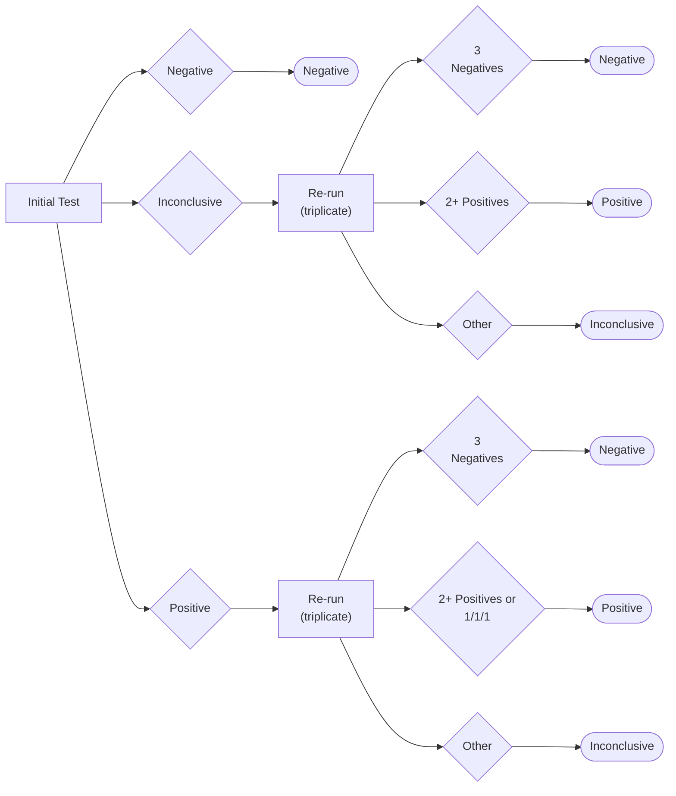

# ===== START OF FILE _archive-combined-files_test-site_22k.md =====
# test-site (17 files, 21,720 tokens)

# 1,144  _context-commentary_guides-test-site.md
METADATA
last updated: 2026-02-17 RT
file_name: _context-commentary_guides-test-site_WIP.md
category: guides
subcategory: test-site
words: 902
tokens: 1144

CONTENT

## Context
The test-site subcategory contains 16 documents that collectively address the operational side of running FloodLAMP surveillance testing at deployment sites. These files served the people responsible for day-to-day test execution—site administrators, testing staff, and in some cases individuals filling both roles.

There was never a single comprehensive operational manual. FloodLAMP's deployments varied significantly in scale and setting, from municipal programs testing fire and first responder staff in cities like Coral Springs and Davie, Florida, to small school-based programs with limited testing volumes, such as Needham, MA. This variation made a one-size-fits-all document impractical, and the materials in this subcategory reflect that: they are a collection of targeted documents, each addressing a specific aspect of site operations.

The files fall into several functional groupings:

- **Site checklists** — Daily testing procedures, weekly maintenance tasks, and ongoing readiness standards, customized for specific sites (Abrome, Alpine, Portola). These were the core operational documents that staff used each testing day.
- **Setup and logistics** — Facilities requirements, equipment receiving instructions (drop ship template), and the assay cart drawer arrangement guide, which standardized how supplies were organized in the four-drawer rolling carts used at each site.
- **Specimen handling and testing workflows** — Collection kit assembly instructions, the resulting decision charts (both tabular and flow chart formats) defining how to interpret test outcomes through triplicate re-run logic, and decontamination procedures at three severity levels (light, moderate, and heavy).
- **Participant- and family-facing materials** — Consent forms, a school program information flyer template for families explaining how pooled surveillance testing worked, collection guides for participants, and app quick-start guides for sponsors and participants.
- **Results communication** — Guidelines for staff on how to communicate outcomes within the regulatory constraints of non-diagnostic surveillance testing, including templates for notifying sponsors and organizations about positive or inconclusive pools.
- **Best practices** — A do's and don'ts checklist (from the Kent Camp deployment) capturing practical lab handling habits to reduce contamination risk and prevent sample mix-ups.

The backup collection form (a Google Form for the Abrome site) served as a fallback for registering samples when the FloodLAMP mobile app was unavailable.

Several of these documents connect to other parts of the archive. The reagent preparation SOPs referenced in the site checklists are found in the _guides/manufacturing_ subcategory. The test training materials referenced in the Abrome checklist are in _guides/test-training_. The consent language and surveillance framing tie directly to the regulatory materials in _regulatory/surveillance_ and the IRB documentation in _regulatory/irb_.
Additionally the archive file: _various/fl-presentations/Bend Pilot Program Bring-up (12-01-2021).md_ is relevant as a bring-up guide.

## Commentary
These files represent the documents we were most satisfied with and that proved most useful in practice. We had many more operational documents over the course of the project, but what's included here are the ones we think others are most likely to be interested in.

The move to the assay cart drawer arrangement was one of the more impactful operational improvements. Before that, sites kept supplies in bins, or bags on shelves. The four-drawer plastic cart was a significant upgrade. It was easy to clean and keep clean (key for a molecular lab test), the size was right, and having a standardized layout for what went in each drawer made our job and that of the on-site tester easier. For initial site setups, we shipped labeled bags with the contents pre-sorted by drawer, which helped with coordination, training, and standardization across sites.

The fact that there's no single comprehensive operational manual reflects the reality of our deployments. The programs were quite different from each other. A municipal program testing hundreds of first responders in South Florida operates very differently from a small school-based program in Texas. A universal guide would have been either too generic to be useful or too complex to maintain. The site-specific checklists worked better in practice. They were customized to each location's workflow, intake logistics, and communication channels (typically Slack), and they gave testing staff a concrete, step-by-step reference for every testing day. However, this variety made support and maintenance a huge challenge for FloodLAMP. And it was a major barrier to scaling.

The communications guidelines addressed a real constraint of operating under surveillance testing guidance rather than clinical diagnostic authorization. We could not give participants individual diagnostic results. The language in that document was carefully developed to refer participants for follow-up diagnostic testing without crossing that line. It's a good example of how regulatory framing shaped day-to-day operations in ways that wouldn't be obvious from the outside. Some of these documents were adapted from others used for surveillance testing, rather than drafted de novo by FloodLAMP attorneys. We very much appreciate others in the space who shared their documents openly during the pandemic. These were crucial for us at FloodLAMP.
The communications guidelines addressed a real constraint of operating under surveillance testing guidance rather than clinical diagnostic authorization. We could not give participants individual diagnostic results. The language in that document was carefully developed to refer participants for follow-up diagnostic testing without crossing that line. It's a good example of how regulatory framing shaped day-to-day operations in ways that wouldn't be obvious from the outside. Some of these documents were adapted from others used for surveillance testing, rather than drafted de novo by FloodLAMP attorneys. We very much appreciate others in the space who shared their documents openly during the pandemic. These were crucial for us at FloodLAMP.

# 1,272  Abrome Site Checklists INTERNAL COPY BEFORE SHARING.md
METADATA
last updated: 2025-12-14 RT updated metadata
file_name: Abrome Site Checklists INTERNAL COPY BEFORE SHARING.md
file_date: 2022-09-04
title: Testing Site Checklists
category: guides
subcategory: test-site
tags: 
source_file_type: gdoc
xfile_type: docx
gfile_url: https://docs.google.com/document/d/1Plnksj-OwJzUV9f0WIvhQncd_pBCS50HJuw-lSi7IqM
xfile_github_download_url: https://raw.githubusercontent.com/FocusOnFoundationsNonprofit/floodlamp-archive-wip/main/guides/test-site/Abrome%20Site%20Checklists%20INTERNAL%20COPY%20BEFORE%20SHARING.docx
pdf_gdrive_url: https://drive.google.com/file/d/1jy34vLE5VOkjL2RXIq_ATPv92UBJhfgP
pdf_github_url: https://github.com/FocusOnFoundationsNonprofit/floodlamp-archive-wip/blob/main/guides/test-site/Abrome%20Site%20Checklists%20INTERNAL%20COPY%20BEFORE%20SHARING.pdf
conversion_input_file_type: docx
conversion: pandoc
license: CC BY 4.0 - https://creativecommons.org/licenses/by/4.0/
tokens: 1272
words: 704
notes: 
summary_short: Provides the complete operational checklists for running FloodLAMP surveillance tests at testing sites, covering daily test procedures (equipment warm-up, reagent verification, sample processing, result communication), weekly maintenance, and ongoing lab readiness standards. It standardizes the testing workflow to ensure accurate results, proper reagent handling, and timely follow-up on positive/inconclusive pools. This was introduced at the pilot site Abrome.

CONTENT

## Testing Checklist - Abrome v1.1
Last updated: 9-4-2022 by Randy True
Direct any questions to support@floodlamp.bio

### Upon Arrival
- Water bath & amp heater turned on ***at least one hour*** before starting to process samples
  - Can add boiling water from kettle to speed up the process
  - Change water bath water weekly

### During Water Bath Heating
-   Review freezer sensor data to ensure no thawing occurred.
-   Prepare fresh 10% Bleach Solution, preferably daily, but at least every 3 days.
-   Clean Inactivation Table thoroughly - first with 10% bleach, then with 70% ethanol or IPA.
-   Set up Inactivation Table.
-   Verify sufficient 1XISS is prepared (minimum 1 mL per sample, plus extra 5mL) **AND < 2 weeks old**
    -   Otherwise prepare 1XISS: [SOP-101-A\_2 1X Inactivation Saline Solution Prep - Table Form - Abrome.pdf](https://drive.google.com/file/d/1OLXQShwg3ecKP3Os5c2JDuG3UCbrbuiQ/view?usp=sharing)
-   Verify sufficient aliquots of RM (one per sample + two for controls, plus extra) **AND not expired** (< 4 weeks old, no visible discoloration)
    -   Otherwise prepare RM: [SOP-102-A\_2 Reaction Mix Prep - Table Form - Abrome.pdf](https://drive.google.com/file/d/1Qv8Bk1rReWMlm9Z3X3sK9cdq9YcxL8Vt/view?usp=sharing)
    -   RM in strips-of-8 tubes to be used today can be kept in refrigerator until use
    -   Any additional RM in strips-of-8 tubes should be placed immediately in freezer
        -   Verify that caps are tightly sealed!
-   Verify sufficient test consumables for usage (1 mL tips, 10 uL tips, gloves, wipes, aluminum foil)
-   Intake collection tubes, preferably prior to the cutoff time, or during Amp
    -   Ideal would be to intake tubes as people return them, so as to address the uncollected tubes (tubes returned without the collection step completed)
    -   Ideally verify receipt of all expected collection tubes from students and staff
    -   Note any anomalies (e.g., uncollected tubes)
-   Double check water bath is up to temperature (at least 95°C) before starting to process samples

### Running Test 
-   Turn off air purifiers before beginning the test procedure. Keep the door closed.
-   Tie back hair (if applicable).
-   Run test:
    -   Longer Training Amp Run Form: [SOP-104-A\_1 Test Training - Run Form - Abrome.pdf](https://drive.google.com/file/d/1KoCXZzsHXKmg85mVdKIEbzHbFr20deDd/view?usp=sharing)
    -   Standard Amp Run Form: [SOP-103-A\_1 Amplification - Run Form - Abrome.pdf](https://drive.google.com/file/d/1REe5TKDHvmMoiBQUJHJOri5CR1VhO0qk/view?usp=sharing)
-   Rerun test on any positive and inconclusive sample(s) in triplicate using the same inactivated sample(s) kept in the refrigerator.
-   After running the test and any reruns, if any pools have returned positive or inconclusive results:
    -   Communicate ***referrals*** to participants in those pools:
        -   [Surveillance Program Results Communications Guidelines.pdf](https://drive.google.com/file/d/1p7oEPNAbIhwoYzjoO3FkHD6Oiw-Z1sxI/view?usp=sharing)
    -   Enact your internal protocols accordingly.

### Cleanup
-   Return cold blocks to the freezer.
-   Return pipettes, tip boxes, racks.
-   Check that all thawed inactivation solution bottles & vials are covered in foil.
-   Discard sample tubes from refrigerator (neg. in trash, pos. in bag in bottom freezer).
-   Turn off heaters.
-   Empty tip buckets and clean them with bleach and ethanol.

## Weekly Checklist - Abrome - v1.1
Last updated: 9-2-2022 by Gary Withey
Direct any questions to support@floodlamp.bio
-   Change water in water bath weekly.
    -   Preferable to use distilled water.
-   Update complete Inventory according to schedule as agreed with FloodLAMP staff.
-   Check Expiration dates of reagents.
-   Empty trash bins.
-   OPTIONALLY: Prepare reaction tubes for the week, and freeze.

## State Of Readiness Checklist - Abrome - v1.1
Last updated: 9-2-2022 by Gary Withey
Direct any questions to support@floodlamp.bio

The following should be in place at all times to ensure smooth operation of the lab:
-   Glove boxes BOTH in assay prep area AND amplification area (keep separate glove supplies).
-   Wipes present (one active, plus extra on supply shelf).
-   Empty Tip box filled with strip tubes (fill tip box + half source box).
-   Falcon Tubes Filled with strip tube caps (two full falcon tubes, + half source box).
-   1.5mL tubes closed and in cleaned, labeled cryobox (1 active box, Next box fully ready).
-   At least 5 blank Amp run forms, and at least 1 spare of both table forms (1X ISS & RM).
-   Pens and markers clean and in proper place.
    -   Pens tested and functional.
-   Spare tube of inactivation solution in freezer.
-   Freezer thermometer tested and functional.
-   Old non-significant samples clear from fridge.
-   Tip buckets empty.

# 636  Assay Cart Drawer Arrangement with Photos.md
METADATA
last updated: 2025-12-14 RT updated metadata after BA
file_name: Assay Cart Drawer Arrangement with Photos.md
file_date: 2022-09-12
title: Assay Cart Drawer Arrangement with Photos
category: guides
subcategory: test-site
tags: 
source_file_type: gdoc
xfile_type: docx
gfile_url: https://docs.google.com/document/d/1hvCX0wkVYzJ2bgV_zHoNgcqvENygnY97Urr5HYGEB7U
xfile_github_download_url: https://raw.githubusercontent.com/FocusOnFoundationsNonprofit/floodlamp-archive-wip/main/guides/test-site/Assay%20Cart%20Drawer%20Arrangement%20with%20Photos.docx
pdf_gdrive_url: https://drive.google.com/file/d/1wOotzHFPOWPVEB_3xbo3CtBq5xyla-2S
pdf_github_url: https://github.com/FocusOnFoundationsNonprofit/floodlamp-archive-wip/blob/main/guides/test-site/Assay%20Cart%20Drawer%20Arrangement%20with%20Photos.pdf
conversion_input_file_type: docx
conversion: pandoc
license: CC BY 4.0 - https://creativecommons.org/licenses/by/4.0/
tokens: 636
words: 280
notes: photos omitted from md
summary_short: The “Assay Cart Drawer Arrangement with Photos” guide lists the required contents for each of the four drawers in a FloodLAMP assay cart, with configurations for both “strips only” and “plates” setups. It standardizes how tubes, racks, saline/inactivation supplies, pipettes, tips, reservoirs, and plate supplies are organized so test-site staff can stock carts consistently and find materials quickly during runs.

CONTENT

***INTERNAL TITLE:*** FloodLAMP assay cart drawer arrangement
Contents of each of the four drawers to be used in the FloodLAMP assay cart are as described and illustrated in the sections below.

| STRIPS ONLY | PLATES |
|------------|---------|
| **Drawer 1**  - 48 Strip-of-8 tubes in tip box (2) - 12 Strip-of-8 caps in 50 mL Falcon tubes (8) - 50 1.5mL snap cap tubes in cryobox (1) | **Drawer 1**  - 48 Strip-of-8 tubes in tip box (2) - 12 Strip-of-8 caps in 50 mL Falcon tubes (8) - 50 1.5mL snap cap tubes in cryobox (1) |
| **Drawer 2**  - 1.5mL tube rack (1) - Flipper rack (1) - Versirack (1) - PCR racks (2) - Razor blades (10) | **Drawer 2**  - 1.5mL tube rack (2) - Flipper rack (1) - Versirack (1) - PCR racks (2) - Razor blades (10) |
| **Drawer 3**  - Saline filled Falcon tubes (15) - Saline filled 30mL Chub tubes (5) - 100X Inactivation Solution (1) - 50mL Falcon tubes (10) | **Drawer 3**  - Pipette 100-1000uL (1) - Pipette 10-100uL (1) - Pipette fixed 2uL (1) - 1000uL tips (1) - 200uL tips (1) - 10uL tips (1) - Saline filled Falcon tubes (15) - Saline filled 30mL Chub tubes (5) - 100X Inactivation Solution (1) |
| **Drawer 4**  - Pipette 100-1000uL (1) - Pipette 10-100uL (1) - Pipette fixed 2uL (1) - 8 channel pipette (1) - Reagent reservoirs (5) - 1000uL tips (1) - 200uL tips (1) - 10uL tips (1) | **Drawer 4**  - 8 channel pipette (1) - Reagent reservoirs (5) - PCR Plates (10) - Plate Seals (10) - Plate Roller (10) |
||

Drawer 1
_photo of items in Drawer 1_

Drawer 2
_photo of items in Drawer 2_

Drawer 3
_photo of items in Drawer 3_

Drawer 4
_photo of items in Drawer 4_

# 165  Collection Kit Assembly Instructions for Staff.md
METADATA
last updated: 2025-12-15 RT updated metadata after BA fixed inconsistencies
file_name: Collection Kit Assembly Instructions for Staff.md
file_date: 2022-04-19
title: Collection Kit Assembly Instructions for Staff
category: guides
subcategory: test-site
tags: 
source_file_type: gdoc
xfile_type: docx
gfile_url: https://docs.google.com/document/d/1TLE4ChqEiY2n5xBTj0efXt7ygX9NDs-sMJYA8q57_cw
xfile_github_download_url: https://raw.githubusercontent.com/FocusOnFoundationsNonprofit/floodlamp-archive-wip/main/guides/test-site/Collection%20Kit%20Assembly%20Instructions%20for%20Staff.docx
pdf_gdrive_url: https://drive.google.com/file/d/1eW8gsLLEJRJihes-ZUCjVIchpoFxdpOL
pdf_github_url: https://github.com/FocusOnFoundationsNonprofit/floodlamp-archive-wip/blob/main/guides/test-site/Collection%20Kit%20Assembly%20Instructions%20for%20Staff.pdf
conversion_input_file_type: docx
conversion: gdoc markdown
license: CC BY 4.0 - https://creativecommons.org/licenses/by/4.0/
tokens: 165
words: 99
notes: 
summary_short: The “Collection Kit Assembly Instructions for Staff” outlines hygiene and PPE steps for safely assembling at-home or family collection kits. It specifies the exact kit contents (bag, tubes, swabs, bio-bags, instructions, and name-label stickers) and how to place labels for clear identification and distribution.

CONTENT

***INTERNAL TITLE:*** Collection Kit Assembly Instructions
**Before creating kits**
-   Clean all work surfaces with bleach (clorox wipes, etc.) and ethanol/isopropyl alcohol
-   Wash hands thoroughly

**While creating kits**
-   Wear a mask (N95 ideal)
-   Wear gloves (make sure not to touch gloves’s fingers with bare hands)

**Kit contents**
-   1 slider top bag with the following inside:
    -   4 tubes
    -   16 swabs
    -   4 bio-bags
    -   Instruction pamphlet
    -   Sticker labels with family names
        -   Place 1 sticker on outside of slider top bag
        -   Place the remaining stickers inside the bag facing out
_2 Photos_

# 794  Consent Adult and Minor CC3 - RT Ctrl.md
METADATA
last updated: 2025-12-15 RT updated metadata after BA fixed inconsistencies
file_name: Consent Adult and Minor CC3 - RT Ctrl.md
file_date: 2022-04-14
title: Consent Adult and Minor CC3 - RT Ctrl
category: guides
subcategory: test-site
tags: surveillance
source_file_type: gdoc
xfile_type: docx
gfile_url: https://docs.google.com/document/d/1Pf-n0xZRnbGOfqi7SqMR25_3LfaKdTq2fd5vvN3FOP0
xfile_github_download_url: https://raw.githubusercontent.com/FocusOnFoundationsNonprofit/floodlamp-archive-wip/main/guides/test-site/Consent%20Adult%20and%20Minor%20CC3%20-%20RT%20Ctrl.docx
pdf_gdrive_url: https://drive.google.com/file/d/1PTBMz0IaQtJwJ7Ku-X67Ez7rMVPDNzCL
pdf_github_url: https://github.com/FocusOnFoundationsNonprofit/floodlamp-archive-wip/blob/main/guides/test-site/Consent%20Adult%20and%20Minor%20CC3%20-%20RT%20Ctrl.pdf
conversion_input_file_type: docx
conversion: pandoc
license: CC BY 4.0 - https://creativecommons.org/licenses/by/4.0/
tokens: 794
words: 467
notes: 
summary_short: The FloodLAMP “Voluntary Non-Diagnostic Surveillance Test Consent and Waiver” is an adult-and-minor consent form authorizing collection and non-diagnostic molecular surveillance testing for SARS-CoV-2. It explains that individual results are not provided, outlines referral expectations for diagnostic testing if a pool/individual indicates potential infection, and states key limitations (not a CLIA lab, not medical care). It also includes data disclosure terms to public health authorities, liability waivers, revocation instructions, and signature lines for the participant/guardian and listed minors.

CONTENT

***INTERNAL TITLE:*** FloodLAMP Voluntary Non-Diagnostic Surveillance Test Consent and Waiver

I am the "Participant", and parent or legal guardian of each minor child identified on this form, also Participants. Each Participant on this Consent and Waiver understands and agrees to the following:
1.  I grant FloodLAMP Biotechnologies permission to perform a non-diagnostic molecular surveillance test (the "Test") of the Participant's sample to indicate the potential presence of SARS-CoV-2, the virus that causes COVID-19.
2.  I understand that I will not be given individual results from the Test. In the event the Participant's individual or pooled sample indicates the presence of the SARS-CoV-2 virus, I will be referred to have the Participant take a diagnostic test.
3.  If referred to a diagnostic test, I agree to make a best effort at obtaining a diagnostic test for the Participant in a timely manner.
4.  I will not use the referral to a diagnostic test as a substitute for individual diagnostic testing.
5.  I agree not to rely on information received from FloodLAMP surveillance testing for decision making purposes.
6.  I agree not to misrepresent the purpose of this non-diagnostic surveillance Test.
7.  The Test is not being performed in a CLIA laboratory.
8.  The purpose of the Test is to improve public health and to determine appropriate mitigation measures for a population. The Test is not for individual medical or diagnostic purposes.
9.  I understand the Test does not rule out the possibility that the Participant may have been exposed to or is infected with SARS-CoV-2.
10. I understand that FloodLAMP Biotechnologies is not acting as the Participant's medical provider, and that the Test does not replace treatment by a medical provider. I agree that I will seek medical advice, care, and treatment from a medical provider for the Participant if I have questions or concerns.
11. The Participant's sample will be used for the sole, exclusive purpose of performing the Test. Results obtained will be used for the purpose of SARS-CoV-2 public health surveillance, as described herein.
12. I acknowledge and agree that FloodLAMP Biotechnologies may disclose Test results and associated information to appropriate county, state, or other governmental and regulatory entities as may be required or permitted by law.
13. I expressly waive and release FloodLAMP Biotechnologies and its employees and agents from any and all rights, claims, lawsuits or damages of any nature whatsoever arising directly or indirectly from my participation in the Test or testing program.
14. If at any time, I choose to revoke consent as provided here, said revocation must be received by FloodLAMP Biotechnologies in writing or by email at support@floodlamp.bio.

Signature: \_\_\_\_\_\_\_\_\_\_\_\_\_\_\_\_\_\_\_\_\_\_\_\_\_\_\_\_\_\_ Date: \_\_\_\_\_\_\_\_\_\_\_\_\_\_\_\_\_\_\_\_

Print Name: \_\_\_\_\_\_\_\_\_\_\_\_\_\_\_\_\_\_\_\_\_\_\_\_\_\_\_\_\_\_

This form is provided on behalf of the minor children identified as:

Print Name: \_\_\_\_\_\_\_\_\_\_\_\_\_\_\_\_\_\_\_\_\_\_\_\_\_ Print Name: \_\_\_\_\_\_\_\_\_\_\_\_\_\_\_\_\_\_\_\_\_\_\_\_\_\_\_

Print Name: \_\_\_\_\_\_\_\_\_\_\_\_\_\_\_\_\_\_\_\_\_\_\_\_\_ Print Name: \_\_\_\_\_\_\_\_\_\_\_\_\_\_\_\_\_\_\_\_\_\_\_\_\_\_\_

# 888  Decontamination Procedures.md
METADATA
last updated: 2025-12-14 RT updated metadata after BA fixed inconsistencies
file_name: Decontamination Procedures.md
file_date: 2022-10-11
title: Decontamination Procedures
category: guides
subcategory: test-site
tags: 
source_file_type: gdoc
xfile_type: docx
gfile_url: https://docs.google.com/document/d/1v7rhZUefNCPczjkAUY3J8IHDkIn_23ZJ7zA5iTjWv6c
xfile_github_download_url: https://raw.githubusercontent.com/FocusOnFoundationsNonprofit/floodlamp-archive-wip/main/guides/test-site/Decontamination%20Procedures.docx
pdf_gdrive_url: https://drive.google.com/file/d/1fmixGyoyCiyXrQfdTgMft8BYyTwJ3Lgf
pdf_github_url: https://github.com/FocusOnFoundationsNonprofit/floodlamp-archive-wip/blob/main/guides/test-site/Decontamination%20Procedures.pdf
conversion_input_file_type: docx
conversion: pandoc
license: CC BY 4.0 - https://creativecommons.org/licenses/by/4.0/
tokens: 888
words: 624
notes: 
summary_short: The Decontamination Procedures guide defines light, moderate, and draft heavy cleaning workflows for FloodLAMP test-site assay rooms, including PPE requirements and specific steps for surfaces, carts/drawers, racks, floors, and high-touch areas. It standardizes use of 10% bleach followed by 70% ethanol/IPA (with recommended dwell time) and emphasizes contamination control around the amplification area and reagent aliquots.

CONTENT

## Notes
-   For all steps in this document that specify ‘**wiping down**’, this means first wiping down with a 10% bleach solution and then 70% ethanol or IPA.  When practicable, allow the bleach solution to remain on the surface for 5-10 minutes prior to wiping away and then wiping with ethanol/IPA.
-   It can be helpful as a reminder to place tape on the ground near the amplification station if this isn’t already done. This demarcates the line beyond which any materials that enter the amp area do not leave.
-   When in the amp area, be mindful that your lab coat doesn’t touch any of the surfaces.
-   Wash lab coats regularly if they are not disposable.
-   It is advisable to ***decontaminate the amplification area last*** in any given cleaning session.
-   Wear a clean lab coat, gloves, safety glasses, mask during decontamination

## Light Decontamination
-   Prepare fresh 10% bleach solution
-   **Wipe down** all surfaces (any benches, tables, chairs, shelves that are in active use)
-   Remove all items from the four drawers in the cart
-   Thoroughly **wipe down** the inside of the drawers
-   **Wipe down** the pipettes and the outer surfaces of tip boxes
-   Refill the drawers
-   Discard the current 1X Inactivation solution aliquot

## Moderate Decontamination
In addition to all of the Light Decontamination steps above:
-   Prepare a 10% bleach bath for the plastic tube racks
-   Allow plastic tube racks to sit in the bath for 5-10 minutes, then wipe dry
-   Spray the racks thoroughly with ethanol and wipe dry
-   Place cleaned racks in a clean bin for storage
-   Cleaned every tip box (including those not actively in use), and pack into clean bin for storage
-   **Wipe down** all objects on benches and tables (equipment, pens, etc)
-   **Wipe down** all parts of walls & doors that are ever touched (doorknobs, hooks, rails, etc)
-   Within reason, **wipe down** wall surfaces (portions that are reasonably accessible)
-   Sweep the floor of any particles
-   **Wipe down** the floor with a swiffer, mop, or other implement
    -   *Ensure proper ventilation of the space during this step, but do not allow dust or other particulates to blow into the room.*
-   Discard the current aliquot of 100X Inactivation Solution
-   If current supply allows (and depending on how much remains), discard the current aliquot of PGS - this is a judgment call.

## Heavy Decontamination - DRAFT IN PROGRESS
1\)  In a space outside the test room, lay down a clean tarp (if available)
2\)  Remove all furniture and all other equipment and material from the assay room ***except*** the amplification station and place them on the tarp (or other clean floor area)
3\)  Fresh bleach prepared
4\)  Disposable lab coat used
5\)  Put all loose items into bins
6\)  Remove shelves from room
7\)  Removed all bins in room
8\)  Mopped the floors with Bleach (using normal mop)
9\)  Mopped floors with ethanol using swiffer pad made from ethanol soaked shop towels
10\)  All walls and ceiling wiped with bleach soaked shop towels
11\)  All walls and ceiling wiped with ethanol soaked shop towels
    a\)  Take great caution of fumes, especially since windows are not open for cleanliness reasons
12\)  Bench was wiped down
13\)  Shelves were wiped down as they were put back into the test room
14\)  Wiped down mallet was used to adjust shelves
15\)  Outside of all bins were wiped as they were put back onto the shelves
16\)  All Pipettes were wiped down
17\)  Open tip boxes thrown out
18\)  Amp specific spray bottles made
19\)  Amp area bleached and ethanol wiped
20\)  Amp Heater wiped
21\)  Amp lab coat thrown out (disposable)

# 485  Dos and Donts - Kent Camp (June 2021).md
METADATA
last updated: 2026-01-12 BA
file_name: Dos and Donts - Kent Camp (June 2021).md
file_date: 2021-06-28
title: Dos and Donts - Kent Camp (June 2021)
category: guides
subcategory: test-site
tags: 
source_file_type: gdoc
xfile_type: docx
gfile_url: https://docs.google.com/document/d/1Xd88OCuanZ3WnFr68PNmiUvEznPpSUOf
xfile_github_download_url: https://raw.githubusercontent.com/FocusOnFoundationsNonprofit/floodlamp-archive-wip/main/guides/test-site/Dos%20and%20Donts%20-%20Kent%20Camp%20(June%202021).docx
pdf_gdrive_url: https://drive.google.com/file/d/1maMLYydLOYVQXY8FFTemcnoU4chYdVBw
pdf_github_url: https://github.com/FocusOnFoundationsNonprofit/floodlamp-archive-wip/blob/main/guides/test-site/Dos%20and%20Donts%20-%20Kent%20Camp%20(June%202021).pdf
conversion_input_file_type: docx
conversion: gdoc markdown
license: CC BY 4.0 - https://creativecommons.org/licenses/by/4.0/
tokens: 485
words: 391
notes: 
summary_short: The Kent Camp Do’s and Don’ts guide is a side-by-side checklist of lab handling practices for PCR-style testing workflows, covering tube selection, labeling, cleaning steps, pipetting technique, positive control handling, and glove changes. It helps reduce contamination risk and prevent sample or plate mix-ups by standardizing small, high-impact habits (e.g., double-labeling racks/plates, bleach-then-ethanol cleaning, and audible counting during sample loading).

CONTENT

***INTERNAL TITLE:*** KENT CAMP - Do's and Dont's

| DO's | DONT's |
| ----- | ----- |
| use 5mL transport or 30mL chub tubes when you need to go in with a pipette | use 15mL or 50mL when you need to go in with a pipette (don't want to contam pipette shaft) |
| label clean pens and markers w green tape, and keep them clean | use a dirty pen and go back to clean work |
| label look up racks and PCR plates/strip tubes | assume the lookup is clear, label both look up rack and reaction plate/strips so anyone can properly report results |
| clean with bleach and then ethanol/alcohol | use only bleach, it leaves residue and the evaporation of the ethanol more reliably leaves surfaces dry |
| use new TPC for entire camp test session plate |  |
| put remaining TPC back in freezer right away, in indiv ziploc baggie (convention is if it's in a baggie, then it's been used) | leave TPC's out at room temp, or put in cooler with sampled, or put in PCR cold rack (treat as potential source of contam) |
| change gloves after handling positive controls (TPC or GBD), and quick bleach clean freezer door handle after |  |
| on adding 2ul sample, don't stick shaft of pipette into tube | watch bottom and top of pipette tip to make sure the tip is in the liquid and the shaft is not in the tube |
| on adding 2ul sample, visually check to verify approx 2ul of liquid is in the tip | assume it's there |
| when adding samples to strip tubes, do count out loud and have someone looking over your shoulder as an audit | assume you won't get distracted or make mistakes |
| change gloves after recapping TPC positive control and putting back in baggie |  |
| put dedicated clean weight on strip tubes on black Fisher PCR heat block (figure out what to use for this\!) |  |
| label strip tubes on side with 1, 9, 17 etc | forget or rely on super hard to read clear numbers |
| snap strip tubes to get liquid to bottom | flick or vortex to mix after adding sample |
||

# 368  Drop Ship Initial Receiving Instructions - Template.md
METADATA
last updated: 2025-12-15 RT updated metadata after BA fixed inconsistencies
file_name: Drop Ship Initial Receiving Instructions - Template.md
file_date: 2022-08-30
title: Drop Ship Initial Receiving Instructions - Template
category: guides
subcategory: test-site
tags: 
source_file_type: gdoc
xfile_type: docx
gfile_url: https://docs.google.com/document/d/1U6gToUGEZFUz4XcJpMaoGXLZqO7pSyZ9mnrx1fYm8wo
xfile_github_download_url: https://raw.githubusercontent.com/FocusOnFoundationsNonprofit/floodlamp-archive-wip/main/guides/test-site/Drop%20Ship%20Initial%20Receiving%20Instructions%20-%20Template.docx
pdf_gdrive_url: https://drive.google.com/file/d/1dUAWAKOhsDeaNV61Ad3aTu-vScCBzxxQ
pdf_github_url: https://github.com/FocusOnFoundationsNonprofit/floodlamp-archive-wip/blob/main/guides/test-site/Drop%20Ship%20Initial%20Receiving%20Instructions%20-%20Template.pdf
conversion_input_file_type: docx
conversion: gdoc markdown
license: CC BY 4.0 - https://creativecommons.org/licenses/by/4.0/
tokens: 368
words: 244
notes: 
summary_short: The “Drop Ship Initial Receiving Instructions” template is a checklist for confirming and documenting receipt of an initial lab shipment, including quantity verification, damage inspection, and reporting back to FloodLAMP support. It includes a fillable table of expected equipment and supplies (e.g., centrifuge, vortexers, sensors, water bath, light box, saline, freezer/fridge, safety equipment) with columns for received status, expected arrival date, and notes.

CONTENT 

***INTERNAL TITLE:*** Lab Setup - Initial Shipment
You should expect to receive the following equipment in the coming days.  Upon arrival, we request that you please:

- Verify receipt of these items in the quantities specified  
- Check items for any damages during shipment  
- Confirm receipt, quantities & condition to us at support@floodlamp.bio

Please do not unpack items beyond inspecting for damage during shipment - leave these items in their packaging until lab setup (because you will be cleaning them as you set up).

| Description | Qty. | Received? | Expected Arrival Date | Notes |  |
| ----- | :---: | :---: | :---: | ----- | ----- |
| Mini Centrifuge _photo_ | 1 |  |  |  |  |
| Vortexer _photo_ | 2 |  |  | 1 blue, 1 red |  |
| Wireless Temp Sensor _photo_ | 1 |  |  |  |  |
| Wireless Sensor Gateway _photo_ | 1 |  |  |  |  |
| Water Bath _photo_ | 1 |  |  |  |  |
| Light Box _photo_ | 1 |  |  |  |  |
| 250mL Saline _photo_ | 6 |  |  |  |  |
| Freezer | 1 |  |  |  |  |
| Cart | 1 |  |  |  |  |
| Eyewash Station _photo_ | 1 |  |  |  |  |
| Air Purifier _photo_ | 1 |  |  |  |  |
| Fridge | 1 |  |  |  |  |
||

# 353  Facilities Requirements - FloodLAMP.md
METADATA
last updated: 2025-12-14 RT updated metadata after BA
file_name: Facilities Requirements - FloodLAMP.md
file_date: 2022-10-11
title: Facilities Requirements - FloodLAMP
category: guides
subcategory: test-site
tags: 
source_file_type: gdoc
xfile_type: docx
gfile_url: https://docs.google.com/document/d/1W5Me_GTy66gafTKzOFJ1T4MyR_DclZWb_MpSJMdCZ9M
xfile_github_download_url: https://raw.githubusercontent.com/FocusOnFoundationsNonprofit/floodlamp-archive-wip/main/guides/test-site/Facilities%20Requirements%20-%20FloodLAMP.docx
pdf_gdrive_url: https://drive.google.com/file/d/1PLwIec9rLQxcyD8pH9uZMwRTkVaSrWU8
pdf_github_url: https://github.com/FocusOnFoundationsNonprofit/floodlamp-archive-wip/blob/main/guides/test-site/Facilities%20Requirements%20-%20FloodLAMP.pdf
conversion_input_file_type: docx
conversion: pandoc
license: CC BY 4.0 - https://creativecommons.org/licenses/by/4.0/
tokens: 353
words: 239
notes: 
summary_short: The Facilities Requirements – FloodLAMP guide defines the required and preferred facility features for running FloodLAMP surveillance screening, covering access control, workspace layout, power needs, and space for dedicated cold storage and monitoring equipment. It supports site planning by outlining acceptable, preferred, and mobile setup options that maintain an efficient and cleanable testing workflow.

CONTENT

## Introduction
FloodLAMP surveillance screening can be run using a variety of physical setups depending on the resources and space that are available and the volume of tests to be run. The following are lists of ***required*** aspects and ***preferred*** aspects of the test processing space (aka “lab”).

## Testing Space Requirements
-   Controlled access to testing space:
    -   While running assay
    -   Whenever certain testing equipment & materials are not stored / secured elsewhere
-   Large table (6’)
-   Space for dedicated mini-freezer
-   Available power sockets/power strip (standard 110V) for:
    -   Mini-freezer
    -   5 other plugs

## Preferred Testing Space Features
-   Dedicated room with access control (i.e., locks)
-   Non-carpeted floor
-   3 separate table (smooth plastic for easy cleaning)
-   Continuous wifi to enable remote freezer temperature monitoring
-   Space for dedicated mini-refrigerator
-   Power sockets/strip (standard 110V) additionally for:
    -   Mini-refrigerator
    -   Temperature monitoring hub
    -   Light box

## Acceptable Facility Setup
Single table in a room that is dedicated but used for multiple stations
_2 Photos of testing rooms and tables in Bend, Oregon and Coral Springs, Florida_

## Preferred Facility Setup
Dedicated room, controlled access, dedicated tables for different stations
_2 Photos of testing room at NOVA University, Florida_

## Other Setups
_2 Photos of testing rooms and tables in Coral Springs and Davie, Florida_

## Mobile Operation
_3 Photos of testing equipment and supplies in travel case and in home setup_

# 597  FloodLAMP Backup Collection Form - Abrome.md
METADATA
last updated: 2025-12-14 RT
file_name: FloodLAMP Backup Collection Form - Abrome.md
file_date: 2022-08-01
title: FloodLAMP Backup Collection Form - Abrome
category: guides
subcategory: test-site
tags: 
source_file_type: gform
xfile_type: NA
gfile_url: https://docs.google.com/forms/d/14jgRf7MA6dEBkrK8fiPhn5ymCK38ZJqnr9YBAfhIbjc/edit
xfile_github_download_url: NA
pdf_gdrive_url: NA
pdf_github_url: NA
conversion_input_file_type: gform
conversion: ai (chatgpt 5.2 pro)
license: CC BY 4.0 - https://creativecommons.org/licenses/by/4.0/
tokens: 597
words: 349
notes:
summary_short: The FloodLAMP Backup Collection Form is a web-based fallback for registering surveillance test samples when the mobile app is unavailable. It ensures sample metadata (tube ID, contributors, sample type) can still be captured and linked to consent, preventing data loss and maintaining chain-of-custody for pooled testing workflows. It was seldom used and introduced due to outages of the FloodLAMP app.

CONTENT

***INTERNAL TITLE:*** FloodLAMP Backup Collection Form - Abrome

## Description
Please use this form to register your collected samples if you do not have the FloodLAMP mobile App or are having problems. By providing a sample you are providing a legal consent for FloodLAMP to perform surveillance testing under the terms listed in [this link](https://drive.google.com/file/d/1we-2GweFKPAfL220x_4GCVqfeSFcozSx/view).

## Form Settings
- Collects respondent email addresses: Yes

## Questions

### Q1. Email
- **Key:** email
- **Prompt:** Email
- **Required:** Yes
- **Widget:** short_answer
- **Answer type / validation:** email (validated)
- **Placeholder:** Valid email

### Q2. Phone Number
- **Key:** phone_number
- **Prompt:** Phone Number (we need to be able to text you in case time sensitive follow up testing is needed)
- **Required:** Yes
- **Widget:** short_answer
- **Answer type / validation:** text (phone number requested; no explicit validation shown)
- **Placeholder:** Short answer text

### Q3. Collection date and time (if different)
- **Key:** collection_date_time
- **Prompt:** Collection date and time if different from when submitting form (leave blank if you are submitting this form shortly after collecting)
- **Required:** No
- **Widget:** short_answer
- **Answer type / validation:** text (date/time requested; no explicit validation shown)
- **Placeholder:** Short answer text

### Q4. Tube ID
- **Key:** tube_id
- **Prompt:** Tube ID (on label next to QR code, for example "FL19823")
- **Required:** Yes
- **Widget:** short_answer
- **Answer type / validation:** text
- **Placeholder:** Short answer text
- **Example:** FL19823

### Q5. Names of people contributing samples to the pool
- **Key:** contributor_names
- **Prompt:** Names of people contributing samples to the pool
- **Required:** Yes
- **Widget:** short_answer
- **Answer type / validation:** text
- **Placeholder:** Short answer text

### Q6. Sample Type
- **Key:** sample_type
- **Prompt:** Sample Type
- **Required:** Yes
- **Widget:** multiple_choice
- **Answer type / validation:** single_select
- **Options:**
  - Nasal swab
  - Throat swab
  - Saliva
  - Other
- **Other option:** Yes — free text

### Q7. Notes
- **Key:** notes
- **Prompt:** Notes
- **Required:** No
- **Widget:** paragraph
- **Answer type / validation:** long_text
- **Placeholder:** Long answer text

# 719  FloodLAMP Guides - one-pagers for different roles.md
METADATA
last updated: 2025-12-14 RT after BA fixed inconsistencies
file_name: FloodLAMP Guides - one-pagers for different roles.md
file_date: 2021-08-30
title: FloodLAMP Guides - one-pagers for different roles
category: guides
subcategory: test-site
tags: 
source_file_type: gslide
xfile_type: pptx
gfile_url: https://docs.google.com/presentation/d/1zeyY8REZVb95yj9WG-PfppJ51BA3vpYtq5vYOoeRHXU/edit?usp=sharing
xfile_github_download_url: https://raw.githubusercontent.com/FocusOnFoundationsNonprofit/floodlamp-archive-wip/main/guides/test-site/FloodLAMP%20Guides%20-%20one-pagers%20for%20different%20roles.pptx
pdf_gdrive_url: https://drive.google.com/file/d/1n2cKNd7SdqDiiBD7EILRsY-CutJ2vvpX
pdf_github_url: https://github.com/FocusOnFoundationsNonprofit/floodlamp-archive-wip/blob/main/guides/test-site/FloodLAMP%20Guides%20-%20one-pagers%20for%20different%20roles.pdf
conversion_input_file_type: pdf
conversion: ai (claude sonnet 3.5)
license: CC BY 4.0 - https://creativecommons.org/licenses/by/4.0/
tokens: 719
words: 552
notes: 
summary_short: The 'FloodLAMP Guides - one-pagers for different roles' compiles a few different documents: the FloodLAMP Mobile App Quick Start Guide, Guide for Sponsors, and Collection Guide for Participants. It explains how to set up the app, sign consent, and use it to run pooled sample collections by scanning tubes and adding participants. It helps sponsors and participants complete collections correctly and track sample status in the testing program.

CONTENT

***INTERNAL TITLE:*** FloodLAMP Mobile App Quick Start Guide

### 1 Set your password
Set your password online by clicking the link emailed from system@appivo.com with the subject **"Welcome to testing with FloodLAMP."**

### 2 Download the app
Download the FloodLAMP app from either the Apple or Android app stores.

### 3 Sign in
Launch the app and sign in with your email and chosen password.

### 4 Sign the consent
The first time you launch the app, you will be prompted to sign the consent form. You cannot participate in the testing program without providing consent.

**All set!**
You are now ready to sponsor a collection and check the status of your collected samples.

## Guide for Sponsors
### 1 Launch FloodLAMP app
Tap the FloodLAMP app icon on your phone and log in with your account credentials. You should arrive at the homescreen, which will have 3 main buttons: **Collect**, **Return**, and **Status**.

### 2 Begin collection
Tap the **Collect** button and prepare a collection tube with clean hands. Make sure all pool participants follow the instructions in the **Collect your samples screen** and tap **Next** when completed.

\* Participants should add their own swab in the collection, being careful not to touch the flocked ends of the swabs or the tube.

### 3 Scan tube
Scan the tube on the **Scan** screen by tapping the **QR code button**. This will trigger your phone's camera for capture and automatically advance you to the next screen once you scan.

If you have camera problems, enter the code manually in the field below and tap **Next** when done.

### 4 Add participants
You may add up to 4 participants per tube. Tap the Add Participant field to trigger the search window. Tap the search bar to find the participant's name in the system. If you have a problem locating them in the system, type their name into the **Collection Note** field. Let your Site Coordinator or Admin know.

When you have finished adding all participants, tap **Complete Collection**.
You have successfully completed a pooled collection!

## Collection Guide for Participants
### 1 Coordinate with your pool sponsor
You will be pooling samples with up to 3 other people. One of these people will be the pool Sponsor, and they will use the FloodLAMP app to collect and record your pool's sample tube. Make sure you have coordinated with them on where and when to collect your samples.

Your Sponsor or program administrator should be able to help in case you have questions.

### 2 Collect your sample
   - **Sanitize** or wash your hands before you get started.
   - Your sponsor or site coordinator will provide you with a **collection swab**. Make sure not to touch the absorbent end.
   - **Swab your first nostril** in a circular motion, rotating 4 times and twisting the swab as you go.
   - **Swab the other nostril**, repeating the steps from the first side.
   - **Put swab in the collection tube**, if you swab is longer, break it at the break point and drop the swab end in swab first.
     (NOTE: green shaft 2" swabs have no break point)

**That's it!**

### 3 Bonus Points
**Watch the sponsor collect on the app**
   - learn how easy it is so you too can coordinate collections and be a sponsor.

# 1,740  FloodLAMP School Program - Information flyer for families TEMPLATE.md
METADATA
last updated: 2025-12-15 RT updated metadata after BA fixed inconsistencies
file_name: FloodLAMP School Program - Information flyer for families TEMPLATE.md
file_date: 2025-04-22
title: FloodLAMP School Program - Information flyer for families TEMPLATE
category: guides
subcategory: test-site
tags: 
source_file_type: gdoc
xfile_type: docx
gfile_url: https://docs.google.com/document/d/1g9NkXHjJIvmyAXnyXNY7ctofU7yGkKvcXavsalms1jk
xfile_github_download_url: https://raw.githubusercontent.com/FocusOnFoundationsNonprofit/floodlamp-archive-wip/main/guides/test-site/FloodLAMP%20School%20Program%20-%20Information%20flyer%20for%20families%20TEMPLATE.docx
pdf_gdrive_url: https://drive.google.com/file/d/1snjAR6JeRPm3cLRSGODPr7bpsnS714IL
pdf_github_url: https://github.com/FocusOnFoundationsNonprofit/floodlamp-archive-wip/blob/main/guides/test-site/FloodLAMP%20School%20Program%20-%20Information%20flyer%20for%20families%20TEMPLATE.pdf
conversion_input_file_type: docx
conversion: pandoc
license: CC BY 4.0 - https://creativecommons.org/licenses/by/4.0/
tokens: 1740
words: 1347
notes: 
summary_short: The FloodLAMP School Program family flyer template explains how a school-based COVID-19 surveillance testing pilot works, including household pooling (up to 4 nasal swabs per tube), at-home self-collection, app registration/consent, and sample drop-off logistics. It provides plain-language guidance on participation, collection timing, kit replenishment, and what happens after testing (only positive pools are contacted), plus an FAQ and a reference copy of the non-diagnostic consent text.

CONTENT

Dear [School Name] Families,

FloodLAMP is pleased to provide a pilot program of COVID-19 surveillance testing for the [School Name] school and community. FloodLAMP's test supports family sample pooling with up to 4 nasal swabs per tube. This enables you to easily extend testing to other members of your household, including both children and adults. Self collection is done at home (or in the parking lot!), registered with the FloodLAMP Mobile App, and then samples are simply dropped off at the school. Please find additional details below and feel free to contact us with any questions by emailing [[covid support school email address]](mailto:[covid support school email address]).

## [School Name] Pilot Program
### Joining the program
-   Please review the consent below to understand the non-diagnostic nature of surveillance testing and how that works, namely that you do not directly receive test results. Participants in a pool that tests positive will be **immediately contacted** by school administrators for follow up diagnostic testing. Participants in a pool that tests negative **will not be notified**. In the app, you can check that status of your collected sample pools and see that the surveillance testing session has been completed.
-   Sign up for the program at [floodlamp.bio/register-family](https://floodlamp.bio/register-family/) to register everyone in your household who will participate. If you are signing up as an individual, please just fill in the information as the first Guardian. Passcode: SHALOM
-   After submitting the registration form, each registered adult Guardian or Household member will receive a welcome text or email from FloodLAMP Biotechnologies (you may need to check your spam folder). Follow the link in the email or text to set your password, then download the FloodLAMP Mobile App (for iOS or Android).
-   Please log into the app and you will be prompted to electronically sign the consent.
-   If you have children/minors who will be submitting samples, please add them to your profile (accessed by the icon in the upper right corner) and provide your consent. Minors need to be added in the app with the same information as on the registration form in order to be included in sample collections. You'll need to sign the consent for every minor added.

    ***\* Note***: *Only one adult in every household needs to add minors to their account profile. Every participating adult needs to install and log into the app to sign their consent form. If an adult in the household does not have a mobile device, please email us at support@floodlamp.bio for an alternative process.*

### The collection process
-   Collect samples by self-swabbing according to the instructions provided in your collection kit and in the app.
-   The samples are lower nasal swabs, not nasopharyngeal swabs (“brain pokes”).
-   If you are pooling samples, each person participating contributes a swab to the collection tube, up to 4.
-   For each pooled collection event, one registered adult in the family will supervise the collection and submit it through the FloodLAMP app. Please ***DO NOT FORGET TO COMPLETE THE COLLECTION STEP IN THE APP***. Doing so makes the operation run smoothly and reduces the burden on staff running the program.
-   If your child is resistant to their “nose tickle,” even with encouragement, we recommend not forcing it and trying again on the next collection day. We recommend continuing with the pooled collection with the rest of the household, which also provides security for the school and community.
-   Label each sample bag with the first and last name of one adult in the household.
-   Please return samples to TBS during morning drop off. If you can’t bring it then, or forget, please email [[covid support school email address]](mailto:[covid support school email address]) to make a special arrangement. For the current collection schedule, please check the "Returning Your Samples" page in the app, accessed by the menu in the upper left corner. We will communicate any changes with you via email.

### The test
-   Samples will be processed using the FloodLAMP QuickColorTM COVID-19 Test, a molecular RT-LAMP test (similar to PCR).
-   Testing is usually completed within 2 hours of the collection deadline.
-   If there is a positive family pool, the pool sponsor will be contacted for follow up diagnostic testing.
-   In the event no virus is detected in any of the samples, no one will be contacted.

## FloodLAMP FAQ 
### How long before the sample drop off time can I swab and collect?
It's preferable if you swab within a few hours of the sample dropoff time. Sample must be collected no more than 24 hours before the dropoff time.

### How do I get more collection kits?
Collection kits will be available to pick up every 3 weeks. If you need a new kit for some reason, please email [[covid support school email address]](mailto:[covid support school email address]) and a new kit will be sent home with your child.

### What if I have had COVID-19 symptoms or a known exposure?
Follow local public health guidelines and the advice from your medical provider. FloodLAMP surveillance testing is a tool to help communities identify individuals who do not expect that they have COVID-19. It is not a diagnostic medical test and participants should not rely on information received from FloodLAMP surveillance testing for decision making purposes. If you need help finding a PCR or rapid test, please contact [[covid support school email address]](mailto:[covid support school email address])

## FloodLAMP Voluntary Non-Diagnostic Surveillance Test Consent and Waiver
*For reference only, not for signature.*

I am the "Participant", and parent or legal guardian of each minor child identified on this form, also Participants. Each Participant on this Consent and Waiver understands and agrees to the following:
1.  I grant FloodLAMP Biotechnologies permission to perform a non-diagnostic molecular surveillance test (the "Test") of the Participant's sample to indicate the potential presence of SARS-CoV-2, the virus that causes COVID-19.
2.  I understand that I will not be given individual results from the Test. In the event the Participant's individual or pooled sample indicates the presence of the SARS-CoV-2 virus, I will be referred to have the Participant take a diagnostic test.
3.  If referred to a diagnostic test, I agree to make a best effort at obtaining a diagnostic test for the Participant in a timely manner.
4.  I will not use the referral to a diagnostic test as a substitute for individual diagnostic testing.
5.  I agree not to rely on information received from FloodLAMP surveillance testing for decision making purposes.
6.  I agree not to misrepresent the purpose of this non-diagnostic surveillance Test.
7.  The Test is not being performed in a CLIA laboratory.
8.  The purpose of the Test is to improve public health and to determine appropriate mitigation measures for a population. The Test is not for individual medical or diagnostic purposes.
9.  I understand the Test does not rule out the possibility that the Participant may have been exposed to or is infected with SARS-CoV-2.
10. I understand that FloodLAMP Biotechnologies is not acting as the Participant's medical provider, and that the Test does not replace treatment by a medical provider. I agree that I will seek medical advice, care, and treatment from a medical provider for the Participant if I have questions or concerns.
11. The Participant's sample will be used for the sole, exclusive purpose of performing the Test. Results obtained will be used for the purpose of SARS-CoV-2 public health surveillance, as described herein.
12. I acknowledge and agree that FloodLAMP Biotechnologies may disclose Test results and associated information to appropriate county, state, or other governmental and regulatory entities as may be required or permitted by law.
13. I expressly waive and release FloodLAMP Biotechnologies and its employees and agents from any and all rights, claims, lawsuits or damages of any nature whatsoever arising directly or indirectly from my participation in the Test or testing program.
14. If at any time, I choose to revoke consent as provided here, said revocation must be received by FloodLAMP Biotechnologies in writing or by email at support@floodlamp.bio.

# 3,410  Resulting Decision Chart v1.2.md
METADATA
last updated: 2025-12-15 RT after BA fixed inconsistencies
file_name: Resulting Decision Chart v1.2.md
file_date: 2022-12-15
title: Resulting Decision Chart v1.2
category: guides
subcategory: test-site
tags: 
source_file_type: gsheet
xfile_type: xlsx
gfile_url: https://docs.google.com/spreadsheets/d/1hSqrQPAmpFeEcgxNxtFhQyBI904lUhvz1yx7GcAbefo
xfile_github_download_url: https://raw.githubusercontent.com/FocusOnFoundationsNonprofit/floodlamp-archive-wip/main/guides/test-site/Resulting%20Decision%20Chart%20v1.2.xlsx
pdf_gdrive_url: https://drive.google.com/file/d/1gozC_wEeATUHnF8WQhn10YK_sbCZtXdn
pdf_github_url: https://github.com/FocusOnFoundationsNonprofit/floodlamp-archive-wip/blob/main/guides/test-site/Resulting%20Decision%20Chart%20v1.2.pdf
conversion_input_file_type: xlsx
conversion: Excel to Markdown extension
license: CC BY 4.0 - https://creativecommons.org/licenses/by/4.0/
tokens: 3410
words: 2431
notes: multiple versions, using Excel to Md conv
summary_short: The Resulting Decision Chart v1.2 is a set of tabular rules for interpreting FloodLAMP test outcomes using single-triplicate and double-triplicate re-run workflows. It maps initial results and subsequent re-run replicate patterns (positive/negative/inconclusive) to a final reportable call—negative, positive, or inconclusive—so test-site staff can apply consistent decision logic across reruns.

CONTENT

***INTERNAL TITLE:*** FloodLAMP Resulting Decision Chart v1.2
**Document Number:** 
**Effective Date:** 
**Version:** 1.2

## Resulting decision chart (double triplicate rerun) Version 1.2

| Initial test | Decision       | First re-run |   |   | Decision           | Second re-run |   |   | Decision           |
|--------------|----------------|--------------|---|---|--------------------|---------------|---|---|--------------------|
| -            | final negative |              |   |   |                    |               |   |   |                    |
| ?            | re-run         | -            | - | - | final negative     |               |   |   |                    |
| ?            | re-run         | +            | + | + | final positive     |               |   |   |                    |
| ?            | re-run         | +            | + | ? | final positive     |               |   |   |                    |
| ?            | re-run         | -            | - | ? | final negative     |               |   |   |                    |
| ?            | re-run         | +            | + | - | re-run             | -             | - | - | final negative     |
| ?            | re-run         | +            | + | - | re-run             | +             | + | + | final positive     |
| ?            | re-run         | +            | + | - | re-run             | +             | + | ? | final positive     |
| ?            | re-run         | +            | + | - | re-run             | +             | + | - | final positive     |
| ?            | re-run         | +            | + | - | re-run             | -             | - | ? | final inconclusive |
| ?            | re-run         | +            | + | - | re-run             | +             | - | - | final inconclusive |
| ?            | re-run         | +            | + | - | re-run             | +             | ? | ? | final positive     |
| ?            | re-run         | +            | + | - | re-run             | -             | ? | ? | final inconclusive |
| ?            | re-run         | +            | + | - | re-run             | +             | - | ? | final inconclusive |
| ?            | re-run         | +            | + | - | re-run             | ?             | ? | ? | final inconclusive |
| ?            | re-run         | +            | - | - | re-run             | -             | - | - | final negative     |
| ?            | re-run         | +            | - | - | re-run             | +             | + | + | final positive     |
| ?            | re-run         | +            | - | - | re-run             | +             | + | ? | final positive     |
| ?            | re-run         | +            | - | - | re-run             | +             | + | - | final positive     |
| ?            | re-run         | +            | - | - | re-run             | -             | - | ? | final negative     |
| ?            | re-run         | +            | - | - | re-run             | +             | - | - | final inconclusive |
| ?            | re-run         | +            | - | - | re-run             | +             | ? | ? | final inconclusive |
| ?            | re-run         | +            | - | - | re-run             | -             | ? | ? | final inconclusive |
| ?            | re-run         | +            | - | - | re-run             | +             | - | ? | final inconclusive |
| ?            | re-run         | +            | - | - | re-run             | ?             | ? | ? | final inconclusive |
| ?            | re-run         | +            | ? | ? | final inconclusive |               |   |   |                    |
| ?            | re-run         | -            | ? | ? | final inconclusive |               |   |   |                    |
| ?            | re-run         | +            | - | ? | final inconclusive |               |   |   |                    |
| ?            | re-run         | ?            | ? | ? | final inconclusive |               |   |   |                    |
| +            | re-run         | -            | - | - | final negative     |               |   |   |                    |
| +            | re-run         | +            | + | + | final positive     |               |   |   |                    |
| +            | re-run         | +            | + | ? | final positive     |               |   |   |                    |
| +            | re-run         | +            | + | - | final positive     |               |   |   |                    |
| +            | re-run         | -            | - | ? | re-run             | -             | - | - | final negative     |
| +            | re-run         | -            | - | ? | re-run             | +             | + | + | final positive     |
| +            | re-run         | -            | - | ? | re-run             | +             | + | ? | final positive     |
| +            | re-run         | -            | - | ? | re-run             | +             | + | - | final positive     |
| +            | re-run         | -            | - | ? | re-run             | -             | - | ? | final negative     |
| +            | re-run         | -            | - | ? | re-run             | +             | - | - | final inconclusive |
| +            | re-run         | -            | - | ? | re-run             | +             | ? | ? | final inconclusive |
| +            | re-run         | -            | - | ? | re-run             | -             | ? | ? | final inconclusive |
| +            | re-run         | -            | - | ? | re-run             | +             | - | ? | final inconclusive |
| +            | re-run         | -            | - | ? | re-run             | ?             | ? | ? | final inconclusive |
| +            | re-run         | +            | - | - | re-run             | -             | - | - | final negative     |
| +            | re-run         | +            | - | - | re-run             | +             | + | + | final positive     |
| +            | re-run         | +            | - | - | re-run             | +             | + | ? | final positive     |
| +            | re-run         | +            | - | - | re-run             | +             | + | - | final positive     |
| +            | re-run         | +            | - | - | re-run             | -             | - | ? | final inconclusive |
| +            | re-run         | +            | - | - | re-run             | +             | - | - | final inconclusive |
| +            | re-run         | +            | - | - | re-run             | +             | ? | ? | final inconclusive |
| +            | re-run         | +            | - | - | re-run             | -             | ? | ? | final inconclusive |
| +            | re-run         | +            | - | - | re-run             | +             | - | ? | final inconclusive |
| +            | re-run         | +            | - | - | re-run             | ?             | ? | ? | final inconclusive |
| +            | re-run         | +            | ? | ? | re-run             | -             | - | - | final negative     |
| +            | re-run         | +            | ? | ? | re-run             | +             | + | + | final positive     |
| +            | re-run         | +            | ? | ? | re-run             | +             | + | ? | final positive     |
| +            | re-run         | +            | ? | ? | re-run             | +             | + | - | final positive     |
| +            | re-run         | +            | ? | ? | re-run             | -             | - | ? | final negative     |
| +            | re-run         | +            | ? | ? | re-run             | +             | - | - | final inconclusive |
| +            | re-run         | +            | ? | ? | re-run             | +             | ? | ? | final positive     |
| +            | re-run         | +            | ? | ? | re-run             | -             | ? | ? | final inconclusive |
| +            | re-run         | +            | ? | ? | re-run             | +             | - | ? | final inconclusive |
| +            | re-run         | +            | ? | ? | re-run             | ?             | ? | ? | final inconclusive |
| +            | re-run         | -            | ? | ? | re-run             | -             | - | - | final negative     |
| +            | re-run         | -            | ? | ? | re-run             | +             | + | + | final positive     |
| +            | re-run         | -            | ? | ? | re-run             | +             | + | ? | final positive     |
| +            | re-run         | -            | ? | ? | re-run             | +             | + | - | final positive     |
| +            | re-run         | -            | ? | ? | re-run             | -             | - | ? | final negative     |
| +            | re-run         | -            | ? | ? | re-run             | +             | - | - | final inconclusive |
| +            | re-run         | -            | ? | ? | re-run             | +             | ? | ? | final inconclusive |
| +            | re-run         | -            | ? | ? | re-run             | -             | ? | ? | final inconclusive |
| +            | re-run         | -            | ? | ? | re-run             | +             | - | ? | final inconclusive |
| +            | re-run         | -            | ? | ? | re-run             | ?             | ? | ? | final inconclusive |
| +            | re-run         | +            | - | ? | re-run             | -             | - | - | final negative     |
| +            | re-run         | +            | - | ? | re-run             | +             | + | + | final positive     |
| +            | re-run         | +            | - | ? | re-run             | +             | + | ? | final positive     |
| +            | re-run         | +            | - | ? | re-run             | +             | + | - | final positive     |
| +            | re-run         | +            | - | ? | re-run             | -             | - | ? | final inconclusive |
| +            | re-run         | +            | - | ? | re-run             | +             | - | - | final inconclusive |
| +            | re-run         | +            | - | ? | re-run             | +             | ? | ? | final inconclusive |
| +            | re-run         | +            | - | ? | re-run             | -             | ? | ? | final inconclusive |
| +            | re-run         | +            | - | ? | re-run             | +             | - | ? | final inconclusive |
| +            | re-run         | +            | - | ? | re-run             | ?             | ? | ? | final inconclusive |
| +            | re-run         | ?            | ? | ? | re-run             | -             | - | - | final negative     |
| +            | re-run         | ?            | ? | ? | re-run             | +             | + | + | final positive     |
| +            | re-run         | ?            | ? | ? | re-run             | +             | + | ? | final positive     |
| +            | re-run         | ?            | ? | ? | re-run             | +             | + | - | final positive     |
| +            | re-run         | ?            | ? | ? | re-run             | -             | - | ? | final inconclusive |
| +            | re-run         | ?            | ? | ? | re-run             | +             | - | - | final inconclusive |
| +            | re-run         | ?            | ? | ? | re-run             | +             | ? | ? | final positive     |
| +            | re-run         | ?            | ? | ? | re-run             | -             | ? | ? | final inconclusive |
| +            | re-run         | ?            | ? | ? | re-run             | +             | - | ? | final inconclusive |
| +            | re-run         | ?            | ? | ? | re-run             | ?             | ? | ? | final inconclusive |
||

## Resulting decision chart (single triplicate rerun) Version 1.2

| Initial test | Decision       | First re-run |   |   | Decision           |
|--------------|----------------|--------------|---|---|--------------------|
| -            | final negative |              |   |   |                    |
| ?            | re-run         | -            | - | - | final negative     |
| ?            | re-run         | +            | + | + | final positive     |
| ?            | re-run         | +            | + | ? | final positive     |
| ?            | re-run         | -            | - | ? | final inconclusive |
| ?            | re-run         | +            | + | - | final positive     |
| ?            | re-run         | +            | - | - | final inconclusive |
| ?            | re-run         | +            | ? | ? | final positive     |
| ?            | re-run         | -            | ? | ? | final inconclusive |
| ?            | re-run         | +            | - | ? | final inconclusive |
| ?            | re-run         | ?            | ? | ? | final inconclusive |
| +            | re-run         | -            | - | - | final negative     |
| +            | re-run         | +            | + | + | final positive     |
| +            | re-run         | +            | + | ? | final positive     |
| +            | re-run         | +            | + | - | final positive     |
| +            | re-run         | -            | - | ? | final inconclusive |
| +            | re-run         | +            | - | - | final inconclusive |
| +            | re-run         | +            | ? | ? | final positive     |
| +            | re-run         | -            | ? | ? | final inconclusive |
| +            | re-run         | +            | - | ? | final inconclusive |
| +            | re-run         | ?            | ? | ? | final inconclusive |
||

## Key
| Key |              |
|-----|--------------|
| -   | negative     |
| +   | positive     |
| ?   | inconclusive |
||

_Photo Figure 2 Example of Test Results (Left 2 Negative, Right 2 Positive where Negative are bright red in color, and Positive are bright yellow in color)_
_Photo Figure 3 Edge Case Test Results (Left Negative, Right Positive) where Negative is somewhat pink in color compared to bright red, and Positive is somewhat orange in color compared to bright yellow_

# 241  Resulting Decision Flow Chart (Single Triplicate Re-run) v1.2.md
METADATA
last updated: 2025-12-15 RT updated metadata after BA fixed
file_name: Resulting Decision Flow Chart (Single Triplicate Re-run) v1.2.md
file_date: 2023-06-16
title: Resulting Decision Flow Chart (Single Triplicate Re-run) v1.2
category: guides
subcategory: test-site
tags: 
source_file_type: pdf
xfile_type: NA
gfile_url: NA
xfile_github_download_url: NA
pdf_gdrive_url: https://drive.google.com/file/d/1Yzxo03RifzDk05rTzOVQn3MM4mpcoIEK
pdf_github_url: https://github.com/FocusOnFoundationsNonprofit/floodlamp-archive-wip/blob/main/guides/test-site/Resulting%20Decision%20Flow%20Chart%20(Single%20Triplicate%20Re-run)%20v1.2.pdf
conversion_input_file_type: pdf
conversion: ai (claude sonnet 3.5)
license: CC BY 4.0 - https://creativecommons.org/licenses/by/4.0/
tokens: 241
words: 82
notes: uses mermaid diagram
summary_short: The Resulting Decision (Single Triplicate Re-run) Flow Chart v1.2 defines how to assign final Negative, Positive, or Inconclusive results based on an initial test outcome followed by a single triplicate re-run when needed. It standardizes interpretation thresholds (e.g., 2+ positives or specific mixed patterns) so staff can make consistent resulting calls across runs.

CONTENT

***INTERNAL TITLE:*** Resulting Decision Flow Chart (Single Triplicate Re-run)  v1.2

# 836  Site Checklist - Alpine.md
METADATA
last updated: 2025-12-15 RT updated metadata after BA fixed inconsistencies
file_name: Site Checklist - Alpine.md
file_date: 2022-05-24
title: Test Site Checklist - Alpine
category: guides
subcategory: test-site
tags: 
source_file_type: gdoc
xfile_type: docx
gfile_url: https://docs.google.com/document/d/1qeZHKgUPQ7ENf7JxHa9MjvVvWuVkw0IUbxPmbd0U9-A
xfile_github_download_url: https://raw.githubusercontent.com/FocusOnFoundationsNonprofit/floodlamp-archive-wip/main/guides/test-site/Site%20Checklist%20-%20Alpine.docx
pdf_gdrive_url: https://drive.google.com/file/d/1PKufMY-68iBrvLUC6dRfTwBpOqOZSQh-
pdf_github_url: https://github.com/FocusOnFoundationsNonprofit/floodlamp-archive-wip/blob/main/guides/test-site/Site%20Checklist%20-%20Alpine.pdf
conversion_input_file_type: docx
conversion: pandoc
license: CC BY 4.0 - https://creativecommons.org/licenses/by/4.0/
tokens: 836
words: 544
notes: 
summary_short: The Test Site Checklist – Alpine provides step-by-step daily, weekly, and readiness checklists for running FloodLAMP testing at the Alpine site, including setup, reagent/consumables checks, intake logistics, run timing, rerun decision-making, and end-of-day cleanup. It standardizes site operations and communication (via the designated Slack channel) to ensure consistent testing workflow, inventory control, and equipment readiness.

CONTENT

## Testing Checklist - Alpine v1.1
Last updated: 5-24-2022 RT GW BS
For all ***communication*** steps specified below, use the Slack channel: **\# testing-alpine_portola**

### Before Arrival
-   Confirm Heaters turned on (text Randy & Theresa if confirmation not received by 8am)

### Upon Arrival 
Time:
-   Prepare 10% Bleach Solution
-   Double check water bath up to temp
-   Clean Inactivation Table
-   Set up Inactivation Table
-   Check sufficient 1XISS (or make) and Rxn Mix (frozen or source tubes), and *not expired*
-   Check sufficient consumables for usage (1.5mL tubes, strip-8s, tips, reservoirs)
-   Ensure you have expected tubes from staff
-   Check red mailbox for tubes CODE: 513

### At Carillon
Time:
-   Travel to Carillon and set up at drop off point 
-   Intake Collection tubes already dropped off
-   Continue intaking as participants drop off tubes until cut off time 9:05
-   ***Communicate*** intake anomalies (QR code and anomaly description)

### Upon Return to Alpine 
Time: 
-   Turn off air purifiers before beginning the test procedure. Keep the door closed.
-   Run test
-   When on amp, ***communicate*** time expected to remove from amp
-   Check with FL Program Admin if positives are known or unknown. Rerun if unknown.
-   ***Communicate*** Result image & lookup map 
Time:
-   Mark result on lookup map as a circled ‘P’ or ‘I’ at the end of the tube code
-   Wait 5 mins for confirmation of whether any positives are known positives
-   ***Communicate*** re-run plan for all inconclusives and unknown positives
    I.e.: “re-running 1 positive, 1 inconclusive in triplicate”
-   Re-run test
-   ***Communicate*** re-run results ETA
-   ***Communicate*** final results and time
Time:
-   Return cold blocks to freezer
-   Return pipettes, tip boxes, racks
-   Check that all thawed inactivation solution bottles & vials are covered in foil
-   Discard sample tubes from refrigerator (neg. in trash, pos. in bag in bottom freezer)
-   Turn off heaters
-   Empty and clean tip buckets with bleach and ethanol

## Weekly Checklist - Alpine v1.1
-   Update complete Inventory
-   Submit inventory to FL
-   Audit freezer sensor data for anomalies
-   Check Expiration dates of reagents
-   Empty trash bins
-   OPTIONALLY: Prepare reaction tubes for the week, and freeze
-   AS NEEDED: receive deliveries
    -   Use included ship list to verify contents
    -   ***Communicate*** any discrepancies to **\# testing - alpine**
    -   Update Inventory with new materials

## State Of Readiness Checklist - Alpine v1.1
-   Glove boxes BOTH in assay prep room AND amplification area
-   Wipes present (one active, plus extra on supply shelf)
-   Empty Tip box filled with strip tubes (fill tip box + half source box)
-   Falcon Tubes Filled with strip tube caps (two full falcon tubes, + half source box)
-   1.5mL tubes closed and in cleaned, labeled cryobox (1 active box, Next box fully ready)
-   At least 5 blank Amp run forms, and at least 1 spare of both table forms (1X ISS & RM)
-   Pens and markers clean and in proper place
    -   Pens tested and functional
-   Spare tube of inactivation solution in freezer
-   Freezer thermometer tested and functional
-   Lightbox battery charged and functional
-   Old non-significant samples clear from fridge
-   Tip buckets empty

# 974  Site Checklist - Portola.md
METADATA
last updated: 2025-12-15 RT updated metadata after BA fixed inconsistencies
file_name: Site Checklist - Portola.md
file_date: 2022-09-08
title: Test Site Checklist - Portola
category: guides
subcategory: test-site
tags: 
source_file_type: gdoc
xfile_type: docx
gfile_url: https://docs.google.com/document/d/1VjrKcGU7XtUMZuwqIMw1UJnDdK1PEeQb2AfyvthtE6U
xfile_github_download_url: https://raw.githubusercontent.com/FocusOnFoundationsNonprofit/floodlamp-archive-wip/main/guides/test-site/Site%20Checklist%20-%20Portola.docx
pdf_gdrive_url: https://drive.google.com/file/d/1WKJ43rBcsk0E8T4wQjf85n9E5rbS5U53
pdf_github_url: https://github.com/FocusOnFoundationsNonprofit/floodlamp-archive-wip/blob/main/guides/test-site/Site%20Checklist%20-%20Portola.pdf
conversion_input_file_type: docx
conversion: pandoc
license: CC BY 4.0 - https://creativecommons.org/licenses/by/4.0/
tokens: 974
words: 637
notes: 
summary_short: The Test Site Checklist – Portola provides daily, weekly, and site-readiness checklists for running FloodLAMP testing at the Portola location, including setup, cleaning, consumables/reagent verification, tube intake at drop-off points, run execution, rerun handling, and end-of-day shutdown. It standardizes operations and required Slack communications to ensure consistent testing workflow, inventory updates, and equipment readiness.

CONTENT

## Testing Checklist - Portola v1.1
Last updated: 9-8-2022 by GW
For all ***communication*** steps specified below, use the Slack channel: **\# testing-alpine\_portola**

### Before Arrival
-   Confirm Heaters turned on (text Randy & Theresa if confirmation not received by 8am)

### Upon Arrival 
Time:
-   Review freezer sensor data to ensure no thawing occurred
-   Prepare fresh 10% Bleach Solution, preferably daily, but at least every 3 days
-   Clean Inactivation Table thoroughly - first with 10% bleach, then with 70% ethanol or IPA
-   Set up Inactivation Table
-   Check sufficient 1XISS (or make) and Rxn Mix (frozen or source tubes), and *not expired*
-   Verify sufficient test consumables for usage (1 mL tips, 10 uL tips, gloves, wipes, aluminum foil)
-   Verify that you have expected tubes from staff 

### At Carillon / Ormondale
Time:
-   Travel to each class and set up at drop off point
-   Intake Collection tubes already dropped off
-   Note any anomalies (e.g., uncollected tubes)
-   Continue intaking as participants drop off tubes until cut-off time 9:05am
-   ***Communicate*** any intake anomalies (QR code and anomaly description) 

### Upon Return to Portola 
Time:
-   Turn off air purifiers before beginning the test procedure. Keep the door closed
-   Double check water bath / heater is up to temperature (at least 95°C) before starting to process samples
-   Run test
-   When on amp, ***communicate*** time expected to remove from amp
-   Check with FL Program Admin if positives are known or unknown. Rerun if unknown
-   ***Communicate*** Result image & lookup map 
Time:
-   Mark result on lookup map as a circled ‘P’ or ‘I’ at the end of the tube code
-   Wait 5 mins for confirmation of whether any positives are known positives
-   ***Communicate*** re-run plan for all inconclusives and unknown positives
     I.e.: “re-running 1 positive, 1 inconclusive in triplicate”
-   Re-run test
-   ***Communicate*** re-run results ETA
-   ***Communicate*** final results and time 
Time:
-   Return cold blocks to freezer
-   Return pipettes, tip boxes, racks
-   Check that all thawed inactivation solution bottles & vials are covered in foil
-   Discard sample tubes from refrigerator (neg. in trash, pos. in bag in bottom freezer)
-   Turn off heaters
-   Empty and clean tip buckets with bleach and ethanol

## Weekly Checklist - Portola v1.1
Last updated: 9-8-2022 by GW

-   Change water in water bath weekly (at Alpine)
-   Preferable to use distilled water
-   Update complete Inventory, ***communicate*** that Inventory tab has been updated
-   Audit freezer sensor data for anomalies
-   Check Expiration dates of reagents
-   Empty trash bins
-   OPTIONALLY: Prepare reaction tubes for the week, and freeze
-   AS NEEDED: receive deliveries
    -   Use included ship list to verify contents
    -   ***Communicate*** any discrepancies
    -   Update Inventory with new materials

## Site Readiness Checklist - Portola v1.1
Last updated: 9-8-2022 by GW

The following should be in place at all times to ensure smooth operation of the lab:
-   Glove boxes BOTH in assay prep area AND amplification area (keep separate glove supplies)
-   Wipes present (one active, plus extra on supply shelf)
-   Empty Tip box filled with strip tubes (fill tip box + half source box)
-   Falcon Tubes Filled with strip tube caps (two full falcon tubes, + half source box)
-   1.5mL tubes closed and in cleaned, labeled cryobox (1 active box, Next box fully ready)
-   At least 5 blank Amp run forms, and at least 1 spare of both table forms (1X ISS & RM)
-   Pens and markers clean and in proper place
    -   Pens tested and functional
-   Spare tube of inactivation solution in freezer
-   Freezer thermometer tested and functional
-   Lightbox battery charged and functional (if applicable)
-   Old non-significant samples clear from fridge
-   Tip buckets empty

# 538  Surveillance Program Results Communications Guidelines.md
METADATA
last updated: 2025-12-15 RT updated metadata after BA fixed inconsistencies
file_name: Surveillance Program Results Communications Guidelines.md
file_date: 2022-05-24
title: Surveillance Program Results Communications Guidelines
category: guides
subcategory: test-site
tags: surveillance
source_file_type: gdoc
xfile_type: docx
gfile_url: https://docs.google.com/document/d/1qvBfxsHzN5l8vTx4uRy_AD2JZTaYP0LwInrdAJ5JLP8
xfile_github_download_url: https://raw.githubusercontent.com/FocusOnFoundationsNonprofit/floodlamp-archive-wip/main/guides/test-site/Surveillance%20Program%20Results%20Communications%20Guidelines.docx
pdf_gdrive_url: https://drive.google.com/file/d/1YmyeRJUikyfidHVQQR1MJDCun6_hOGNf
pdf_github_url: https://github.com/FocusOnFoundationsNonprofit/floodlamp-archive-wip/blob/main/guides/test-site/Surveillance%20Program%20Results%20Communications%20Guidelines.pdf
conversion_input_file_type: docx
conversion: pandoc
license: CC BY 4.0 - https://creativecommons.org/licenses/by/4.0/
tokens: 538
words: 384
notes: 
summary_short: The Surveillance Program Results Communications Guidelines provides approved language for staff to communicate COVID surveillance screening outcomes without giving patient-specific diagnostic results, covering both pooled and non-pooled testing. It includes templates and talking points for notifying sponsors and organizations about positives or inconclusives and referring participants for follow-up diagnostic testing.

CONTENT

***INTERNAL TITLE:*** Surveillance Program Results Communications Guidelines

**Note for staff:** *Because of the regulatory guidelines governing surveillance testing, we cannot give patient-specific diagnostic results. Please use the language in this document to guide your outgoing communications to participants and program administrators.*

## General Information on Reporting
### Non-pooled testing 
We do not provide diagnostic results (positive or negative) for our COVID surveillance screening program. Participants that test positive will be immediately contacted and referred for follow-up diagnostic testing. Participants that test negative will not be notified. When the surveillance testing session is completed, the status of your collected samples will be updated in the app to “Completed.” Your organization will receive a summary after each testing session.

### Pooled testing
We do not provide diagnostic results (positive or negative) for our COVID surveillance screening program. Participants in a pool that tests positive will be immediately contacted and referred for follow-up diagnostic testing. Participants in a pool that tests negative will not be notified. When the surveillance testing session is completed, the status of your collected sample pool will be updated in the app to “Completed.” Your organization will receive a summary after each testing session.

## Communicating Positives
*In general, we send a text to the sponsor and let them follow up with a phone call as they see fit. We then call the organization’s contact (i.e. the teacher/administrator in charge) and let them know about positives.*

### Text message to sponsor
Hi \[**name**\], this is \[**staff name**\] at \[**FloodLAMP or your organization**\]. I’m writing to let you know that we are referring you and your pool’s participants for follow-up diagnostic testing. Please call or text me if you have any questions. Thank you, \[**staff name**\]

## Communicating Inconclusives
*In cases where we can’t make a clear call, we send additional information to the sponsor and organization about the inconclusive. It’s generally easier to call the sponsor to explain*

### Talking points
-   The inconclusive could be caused by contamination of the sample or a weak positive
-   We are referring you and your pool’s participants for follow up diagnostic testing, usually a lab PCR test or an at-home antigen test. Please note that antigen tests are not as sensitive as FloodLAMP’s molecular test, and so [a negative antigen test does not preclude infection](https://www.fda.gov/medical-devices/safety-communications/home-covid-19-antigen-tests-take-steps-reduce-your-risk-false-negative-fda-safety-communication).

# ===== END OF FILE _archive-combined-files_test-site_22k.md =====
