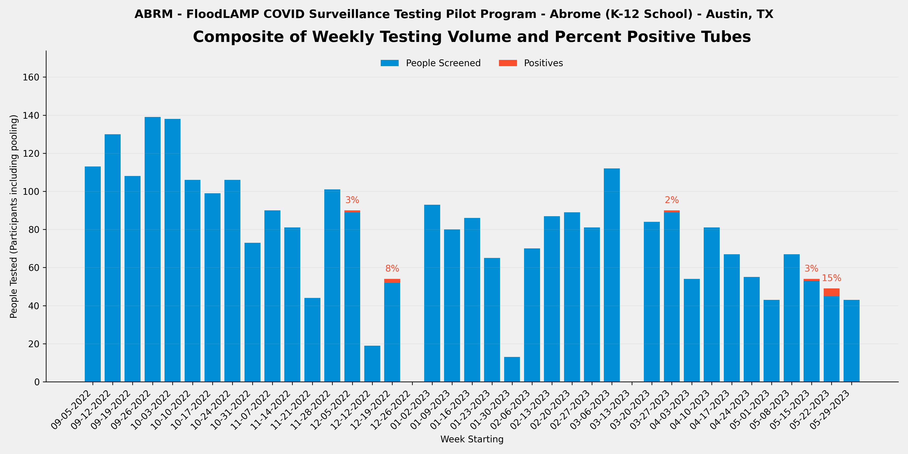
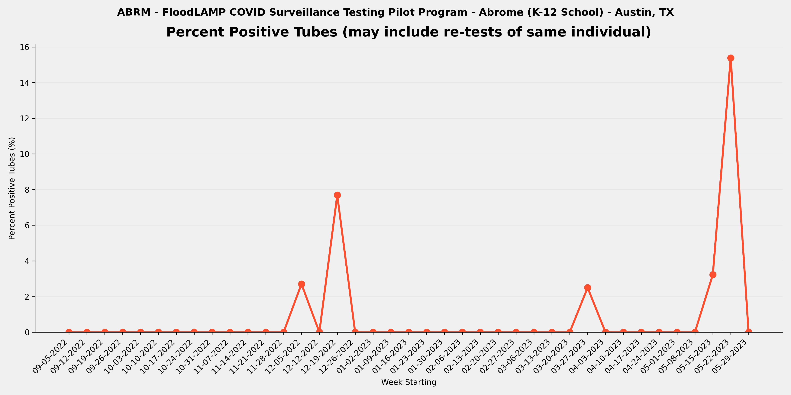
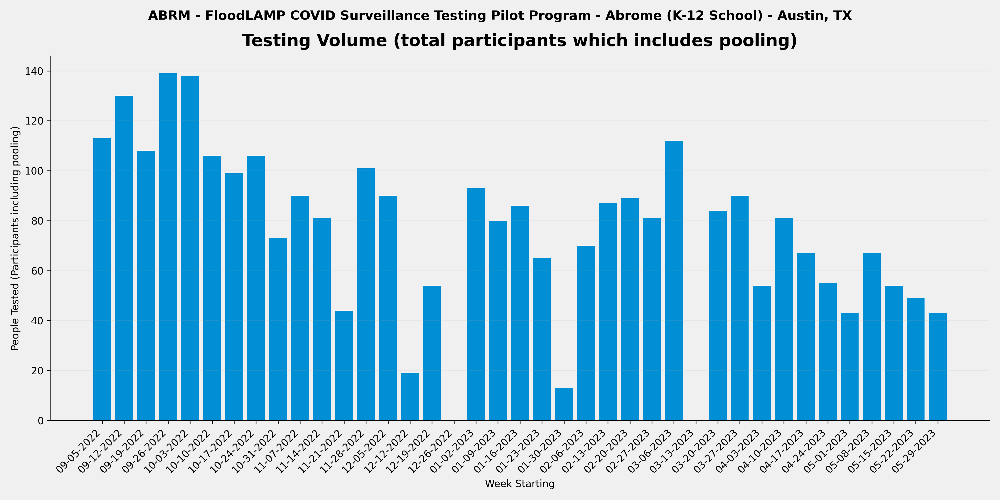

METADATA
last updated: 2026-01-25
file_name: ABRM_pilot-data_summary.md
file_date: 2023-006-02
title: ABRM Pilot Data Summary
category: pilots
subcategory: pilot-data
tags: 
source_file_type: csv
xfile_type: xlsx
gfile_url: NA
xfile_github_download_url: https://raw.githubusercontent.com/FocusOnFoundationsNonprofit/floodlamp-archive/main/pilots/pilot-data/ABRM_xlsx_downloads
pdf_gdrive_url: NA
pdf_github_url: NA
license: CC BY 4.0 - https://creativecommons.org/licenses/by/4.0/
words: 2841
tokens: 4842
notes: 
summary_short: Abrome (ABRM) was a small K-12 school in Austin, TX that used FloodLAMP for pooled household self-collection testing, with on-site test processing by school staff using a mini water bath configuration. The program tested students, staff, and their families over 9 months (2022-09-05 to 2023-06-02), often multiple times per week, running 1,379 tubes with 2,954 participant results and 8 positive tubes detected.

CONTENT

## Plots

### Composite

### Percent Positive Tubes

### Volume

## Files

### Google Sheets URLs
- [ABRM_APS_deID_PUB](https://docs.google.com/spreadsheets/d/140IAw1sI2nPQztTAXY9-XJxd4lPpOhpeXb-IXXnWUZk/edit?usp=drive_link)
- [ABRM_RFR_deID_PUB](https://docs.google.com/spreadsheets/d/1zddUuVUJJRU2gSW45EBK2qlD8uYIW8B5jm-kziiklHU/edit?usp=drive_link)
- [ABRM_RTR_deID_PUB](https://docs.google.com/spreadsheets/d/1g_chl4UPvP70E16V_OTjW4KxlFPRvJ7uKc1vB1X15gQ/edit?usp=drive_link)

### Curated CSVs
- Curated CSV folder: `ABRM_curated_csvs/`
- Stats key-values CSV: [ABRM_APS_stats_key-values.csv](ABRM_curated_csvs/ABRM_APS_stats_key-values.csv)
- Weekly summary CSV: [ABRM_APS_weekly-summary.csv](ABRM_curated_csvs/ABRM_APS_weekly-summary.csv)
- Referral tests by person CSV: [ABRM_RTR_referral-tests-by-person.csv](ABRM_curated_csvs/ABRM_RTR_referral-tests-by-person.csv)

### XLSX downloads:
- [ABRM_APS_deID_PUB.xlsx](ABRM_xlsx_downloads/ABRM_APS_deID_PUB.xlsx)
- [ABRM_RFR_deID_PUB.xlsx](ABRM_xlsx_downloads/ABRM_RFR_deID_PUB.xlsx)
- [ABRM_RTR_deID_PUB.xlsx](ABRM_xlsx_downloads/ABRM_RTR_deID_PUB.xlsx)

## Key tables

### Stats key-values

| section | metric | value | value_status | details | comments | source_sheet | source_row |
| --- | --- | --- | --- | --- | --- | --- | --- |
| Files | RFR File | ABRM_RFR_deID_PUB | ok |  |  | Stats | 1 |
| Files | RTR File | ABRM_RTR_deID_PUB | ok |  |  | Stats | 2 |
| Files | RSR File | NONE | ok |  |  | Stats | 3 |
| Overall | Number of Tubes Tested (initial only - no re-runs) | 1,379 | ok | initial run tubes only so excludes re-runs |  | Stats | 5 |
| Overall | Number of Tube Tests Run (includes re-runs) | 1,519 | ok | includes re-runs |  | Stats | 6 |
| Overall | Number of Initial Runs | 184 | ok |  |  | Stats | 7 |
| Overall | Number of APS Only Tubes run | 100 | ok |  |  | Stats | 8 |
| Overall | Number of Test Reactions (RFR plus APS only tubes run) | 1,730 | ok | includes technical replicates (the same tube sample in multiple reactions in the same run) |  | Stats | 9 |
| Overall | Number of Participant Results | 2,954 | ok | counts individual samples in pools and excludes re-runs |  | Stats | 11 |
| Overall | Number of ARF Tubes | 22 | ok | tubes run and present in RFR but not in Appivo - created tube IDs that start with ARF |  | Stats | 12 |
| Overall | Sum of Participant Results plus ARF Tubes | 2,976 | ok | Will be equal to the number of tubes tested if no pooling. |  | Stats | 13 |
| Overall | Average Pool Level (excludes ARF) | 2.2 | ok |  |  | Stats | 14 |
| Re-runs | Number of Run Tubes (re-runs only) | 140 | ok | from RFR Audit Num Run Tubes |  | Stats | 17 |
| Re-runs | Number of Reactions (re-runs only) | 331 | ok | from RFR Audit Num rxns (excl ctrls) |  | Stats | 18 |
| Re-runs | Re-run % of Tubes | 10.2% | ok | re-run / initial |  | Stats | 19 |
| Re-runs | Number of Initial Runs with Re-runs | 78 | ok |  |  | Stats | 20 |
| Re-runs | % Initial Runs with Re-runs | 42.4% | ok |  |  | Stats | 21 |
| Positives | Number of Tubes with Final Result Positive | 8 | ok |  |  | Stats | 24 |
| Positives | % of Tubes Positives (Final Result) | 0.6% | ok |  |  | Stats | 25 |
| Positives | Number of Cases with Final Result Positive (Indiv or Pool) | 3 | ok | Subtract off Re-tests |  | Stats | 26 |
| Positives | Known Positive Cases | 2 | ok | Previous tested (including by FloodLAMP test) or reported positive |  | Stats | 27 |
| Positives | Unknown Positive Cases | 1 | ok |  |  | Stats | 28 |
| Inconclusives | Number of Tubes with Final Result Inconclusive | 3 | ok |  |  | Stats | 31 |
| Inconclusives | Number of Tubes in RFR Audit Inconclusive not in Appivo Final Results | 0 | ok |  |  | Stats | 32 |
| Inconclusives | Total Number of Inconclusive Tubes | 3 | ok |  |  | Stats | 33 |
| Inconclusives | % of Tubes Inconclusive | 0.2% | ok |  |  | Stats | 34 |
| Inconclusives | Number of Inconclusive Tubes resolved Positive by Referral Test or Correspondence | 0 | ok |  |  | Stats | 35 |
| Inconclusives | % Inconclusives resolved Positive by Referral Tests | 0.0% | ok |  |  | Stats | 36 |
| Inconclusives | Number of Inconclusive Tubes with Referral Test or Correspondence Negative | 0 | ok |  |  | Stats | 37 |
| Inconclusives | Number of Inconclusive Tubes with no Referral Test result or Correspondence | 3 | ok |  | Likely Negative - otherwise admin would have reported a positive referral test result. Perhaps they were not follow up referral tested at all, which may have been the case for 1 of these 3 which was resulted as Neg in the app. | Stats | 38 |
| Inconclusives | Number of Tubes with Initial Inconclusives and Re-run Negative | 4 | ok | Count Result Correction Code=2.5 in preDel col AJ, or from RFR preExcl if not resulted as Incl in App |  | Stats | 39 |
| Inconclusives | Number of Inconclusive Test Run Calls | 48 | ok | includes re-runs - from RFR Audit only and excludes any APS only resulted inconclusives |  | Stats | 40 |
| Inconclusives | % Tube Tests Run Called Inconclusive | 3.2% | ok | includes re-runs |  | Stats | 41 |
| Referrals and Correspondence | Number of FloodLAMP Cases with Referral Tests or Correspondence | 1 | ok | Indiv or Pool, Cases used instead of Person to account for people being contracting COVID multiple times, and instead of Results to exclude re-tests | Only Case Cluster 1 has Referral data shared with FloodLAMP | Stats | 44 |
| Referrals and Correspondence | Number of Referral Confirmed FloodLAMP Positives | 1 | ok | Sometimes also termed Agree Positives - Include initial Inconclusive with Referral or Correspondence Positive | All were FL pos and confirmed with referral tests | Stats | 45 |
| Referrals and Correspondence | FL Inconclusives with Referral / Correspondence Positive | 0 | ok |  |  | Stats | 46 |
| Referrals and Correspondence | % FloodLAMP Positive or Inconclusive with Referral / Correspondence Positive | 100.0% | ok |  |  | Stats | 47 |
| Referrals and Correspondence | FL Inconclusives but Referral / Correspondence Negative | 0 | ok |  |  | Stats | 48 |
| Referrals and Correspondence | FL Inconclusives with No Referral Tests or Correspondence | 3 | ok |  |  | Stats | 49 |
| Comparison to Antigen | Number of FloodLAMP Test Person Cases with Referral Antigen Tests (including non-Same Day) | 0 | ok |  |  | Stats | 52 |
| Comparison to Antigen | Number of FloodLAMP Test Person Cases with Same Day Referral Antigen Tests | 0 | ok |  |  | Stats | 53 |
| Comparison to Antigen | Number of FloodLAMP Positive Test Person Cases with Same Day Antigen Negative | 0 | ok | Agree with Referral Test Positive (usually PCR or later Antigen) but Initial Antigen Negative |  | Stats | 54 |
| Comparison to Antigen | % Confirmed FloodLAMP Positives with Same Day Antigen Negative |  | denom_zero |  | denom zero | Stats | 55 |
| Comparison to Antigen | Number of FloodLAMP Positive Test Person Cases confirmed with Referral Tests but Antigen and Other Non-Antigen Test Negative | 0 | ok |  |  | Stats | 56 |
| Comparison to Antigen | % Confirmed FloodLAMP Positives that were Antigen and Other Non-Antigen Test Negative |  | denom_zero |  | denom zero | Stats | 57 |
| False Calls | False Positives Final Results | 0 | ok | From reviewing APS/Pos and Incl tab Unconfirmed FL Positives |  | Stats | 60 |
| False Calls | False Negative Final Results (Suspected) | 0 | ok | From reviewing Referral Tests by Person and correspondence with Program Admin |  | Stats | 61 |
| People | Number of Unique Individuals Tested | 87 | ok | Includes UnknownPerson additions but not ARF tubes |  | Stats | 64 |
| People | Number of Unique Sponsors | 17 | ok | People who collect using the app |  | Stats | 65 |
| Positivity | Number of Unique Individual Tested FloodLAMP Positive | 5 | ok | includes Inconclusive FloodLAMP result confirmed Positive by follow-up or Referral |  | Stats | 68 |
| Positivity | % of Population FloodLAMP Positive (excluding pools not deconv) | 5.7% | ok |  |  | Stats | 69 |
| Positivity | Number of Unique Individual Tested FloodLAMP Positive (including if in a positive pool) | 10 | ok |  |  | Stats | 70 |
| Positivity | % of Population FloodLAMP Positive (including everyone in a positive pool) | 11.5% | ok |  |  | Stats | 71 |
| Dates | Start Run Date | 2022-09-05 | ok |  |  | Stats | 74 |
| Dates | End Run Date | 2023-06-02 | ok |  |  | Stats | 75 |
| Info | Test Operator | Abrome School | ok | Who ran the actual testing (running LAMP reactions) |  | Stats | 78 |
| Info | Test Processing Site | Office | ok | Where the test processing (running LAMP reactions) was done |  | Stats | 79 |
| Info | Population Tested | Students, Staff, Families | ok | Description of the participants |  | Stats | 80 |
| Info | Configuration | Mini w water bath | ok | Equipment set used for test processing (relates to throughput and type of test tube used) |  | Stats | 81 |
| Info | Collection Type | Pooled Household | ok |  Pooled, Individual, or Both |  | Stats | 82 |
| Info | Self or HCW Collected | Self | ok | HCW is Health Care Worker |  | Stats | 83 |
| Info | App Used? | Yes | ok | Was the FloodLAMP Mobile App and Admin Portal utilized in the program |  | Stats | 84 |
| Info | Bring-up Type | In Person | ok | How the initial setup and validation of the testing site was done |  | Stats | 85 |
| Info | Program Name | Abrome | ok | Shorthand name used internally at FloodLAMP and in other documents for this program |  | Stats | 86 |
| Info | Site | Abrome School | ok | Broader physical space where the testing was done and/or where participants congregated |  | Stats | 87 |
| Info | Site Type | K-12 School | ok | Type of entity or organization receiving the testing program |  | Stats | 88 |
| Info | Location | Austin, TX | ok | Geographical location of where the FloodLAMP testing program occurred |  | Stats | 89 |

### Weekly summary

| week_start_date | week_end_date | participants_n | tubes_n | positive_tubes_n | inconclusive_tubes_n | pct_positive | pct_positive_status |
| --- | --- | --- | --- | --- | --- | --- | --- |
| 2022-09-05 | 2022-09-11 | 113 | 61 | 0 | 0 | 0.0% | ok |
| 2022-09-12 | 2022-09-18 | 130 | 52 | 0 | 0 | 0.0% | ok |
| 2022-09-19 | 2022-09-25 | 108 | 48 | 0 | 0 | 0.0% | ok |
| 2022-09-26 | 2022-10-02 | 139 | 59 | 0 | 0 | 0.0% | ok |
| 2022-10-03 | 2022-10-09 | 138 | 59 | 0 | 0 | 0.0% | ok |
| 2022-10-10 | 2022-10-16 | 106 | 46 | 0 | 0 | 0.0% | ok |
| 2022-10-17 | 2022-10-23 | 99 | 46 | 0 | 0 | 0.0% | ok |
| 2022-10-24 | 2022-10-30 | 106 | 48 | 0 | 0 | 0.0% | ok |
| 2022-10-31 | 2022-11-06 | 73 | 34 | 0 | 0 | 0.0% | ok |
| 2022-11-07 | 2022-11-13 | 90 | 41 | 0 | 0 | 0.0% | ok |
| 2022-11-14 | 2022-11-20 | 81 | 41 | 0 | 0 | 0.0% | ok |
| 2022-11-21 | 2022-11-27 | 44 | 25 | 0 | 0 | 0.0% | ok |
| 2022-11-28 | 2022-12-04 | 101 | 43 | 0 | 0 | 0.0% | ok |
| 2022-12-05 | 2022-12-11 | 90 | 37 | 1 | 0 | 2.7% | ok |
| 2022-12-12 | 2022-12-18 | 19 | 13 | 0 | 0 | 0.0% | ok |
| 2022-12-19 | 2022-12-25 | 54 | 26 | 2 | 0 | 7.7% | ok |
| 2022-12-26 | 2023-01-01 | 0 | 0 | 0 | 0 |  | denom_zero |
| 2023-01-02 | 2023-01-08 | 93 | 38 | 0 | 0 | 0.0% | ok |
| 2023-01-09 | 2023-01-15 | 80 | 39 | 0 | 2 | 0.0% | ok |
| 2023-01-16 | 2023-01-22 | 86 | 40 | 0 | 1 | 0.0% | ok |
| 2023-01-23 | 2023-01-29 | 65 | 29 | 0 | 0 | 0.0% | ok |
| 2023-01-30 | 2023-02-05 | 13 | 7 | 0 | 0 | 0.0% | ok |
| 2023-02-06 | 2023-02-12 | 70 | 33 | 0 | 0 | 0.0% | ok |
| 2023-02-13 | 2023-02-19 | 87 | 39 | 0 | 0 | 0.0% | ok |
| 2023-02-20 | 2023-02-26 | 89 | 40 | 0 | 0 | 0.0% | ok |
| 2023-02-27 | 2023-03-05 | 81 | 37 | 0 | 0 | 0.0% | ok |
| 2023-03-06 | 2023-03-12 | 112 | 47 | 0 | 0 | 0.0% | ok |
| 2023-03-13 | 2023-03-19 | 0 | 0 | 0 | 0 |  | denom_zero |
| 2023-03-20 | 2023-03-26 | 84 | 37 | 0 | 0 | 0.0% | ok |
| 2023-03-27 | 2023-04-02 | 90 | 40 | 1 | 0 | 2.5% | ok |
| 2023-04-03 | 2023-04-09 | 54 | 28 | 0 | 0 | 0.0% | ok |
| 2023-04-10 | 2023-04-16 | 81 | 39 | 0 | 0 | 0.0% | ok |
| 2023-04-17 | 2023-04-23 | 67 | 39 | 0 | 0 | 0.0% | ok |
| 2023-04-24 | 2023-04-30 | 55 | 33 | 0 | 0 | 0.0% | ok |
| 2023-05-01 | 2023-05-07 | 43 | 22 | 0 | 0 | 0.0% | ok |
| 2023-05-08 | 2023-05-14 | 67 | 31 | 0 | 0 | 0.0% | ok |
| 2023-05-15 | 2023-05-21 | 54 | 31 | 1 | 0 | 3.2% | ok |
| 2023-05-22 | 2023-05-28 | 49 | 26 | 4 | 0 | 15.4% | ok |
| 2023-05-29 | 2023-06-04 | 43 | 25 | 0 | 0 | 0.0% | ok |

### Referral tests by person

| participant_id | num_sequential_referral_tests | num_floodlamp_results_pos_or_incl | floodlamp_tube_id | floodlamp_test_result | floodlamp_test_date | first_referral_test_date | referral_overall_result | first_referral_test_type | first_referral_test_result | second_referral_test_type | second_referral_test_result | third_referral_test_type | third_referral_test_result | antigen_neg_with_other_positive_flag | referral_eval |
| --- | --- | --- | --- | --- | --- | --- | --- | --- | --- | --- | --- | --- | --- | --- | --- |
| ABRM582390 | 1 | 2 | AG173 | Positive | 2022-12-08 | REFERRAL TEST COLLECTION DATE | REFERRAL TEST RESULT | REFERRAL TEST TYPE | REFERRAL TEST RESULT |  |  |  |  | 0 | Not same day positive but other person in pool was - became referral test positive in following days (no indiv FL deconv) |
| ABRM771013 | 7 | 0 | not found | not found | not found | 2022-12-08 | Positive | Rapid PCR | Positive |  |  |  | Positive | 1 | Person in Referral Test Data Antigen Pos on 12-11 did FL test with Neg result on 12-6, 12-7, and 12-8 but they nested neg by Rapid PCR (Mesa) on 12-8, and Antigen Neg on 12-9 and 12-10 before becoming Antigen pos on 12-11 |
| ABRM805764 | -1 | 2 | AG173 | Positive | 2022-12-08 | 2022-12-08 | Positive | Rapid PCR | Positive |  |  |  |  | 0 | Only same day positive from pool but other people in pool became pos in next few days |
