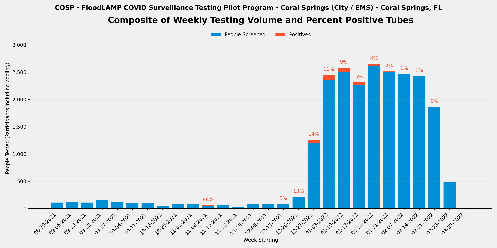
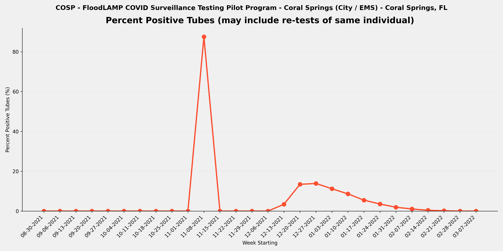
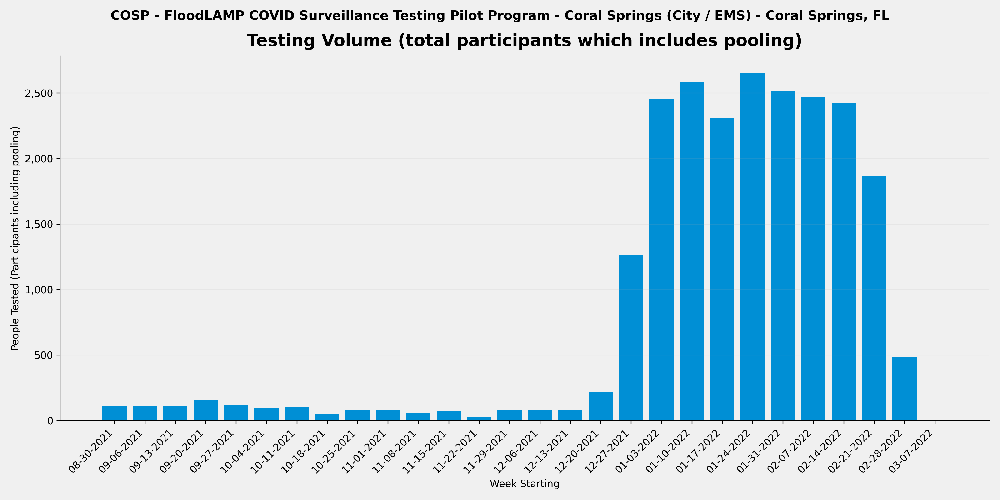

METADATA
last updated: 2026-01-25
file_name: COSP_pilot-data_summary.md
file_date: 2022-03-07
title: COSP Pilot Data Summary
category: pilots
subcategory: pilot-data
tags: 
source_file_type: csv
xfile_type: xlsx
gfile_url: NA
xfile_github_download_url: https://raw.githubusercontent.com/FocusOnFoundationsNonprofit/floodlamp-archive-wip/main/pilots/pilot-data/COSP_xlsx_downloads
pdf_gdrive_url: NA
pdf_github_url: NA
license: CC BY 4.0 - https://creativecommons.org/licenses/by/4.0/
words: 2451
tokens: 3961
notes: 
summary_short: Coral Springs (COSP) was a city/EMS program in Coral Springs, FL where city staff operated FloodLAMP for pooled self-collection testing of EMS, first responders, and city employees, with test processing done on-site using a double standard configuration. The program ran over 6 months (2021-08-31 to 2022-03-07), testing 7,146 tubes from 22,643 participant results (avg pool size 3.2) with 347 positive tubes detected.

CONTENT

## Plots

### Composite

### Percent Positive Tubes

### Volume

## Files

### Google Sheets URLs
- [COSP_APS_deID_PUB](https://docs.google.com/spreadsheets/d/1LnTBrjaiG5Eg8uDSXU7C4sAcKxiF978MzCWPg-VDtx4/edit?usp=drive_link)
- [COSP_RSR_deID_PUB](https://docs.google.com/spreadsheets/d/1H7Dgq-RRdBbd3pMm9Fynb8sPu-mzpb-kdFqzOEUVkZI/edit?usp=drive_link)

### Curated CSVs
- Curated CSV folder: `COSP_curated_csvs/`
- Stats key-values CSV: [COSP_APS_stats_key-values.csv](COSP_curated_csvs/COSP_APS_stats_key-values.csv)
- Weekly summary CSV: [COSP_APS_weekly-summary.csv](COSP_curated_csvs/COSP_APS_weekly-summary.csv)
- Referral tests by person CSV: _not available_

### XLSX downloads:
- [COSP_APS_deID_PUB.xlsx](COSP_xlsx_downloads/COSP_APS_deID_PUB.xlsx)
- [COSP_RSR_deID_PUB.xlsx](COSP_xlsx_downloads/COSP_RSR_deID_PUB.xlsx)

## Key tables

### Stats key-values

| section | metric | value | value_status | details | comments | source_sheet | source_row |
| --- | --- | --- | --- | --- | --- | --- | --- |
| Files | RFR File | NONE | ok |  |  | Stats | 1 |
| Files | RTR File | NONE | ok |  |  | Stats | 2 |
| Files | RSR File | COSP_RSR_deID_PUB | ok |  |  | Stats | 3 |
| Overall | Number of Tubes Tested (initial only - no re-runs) | 7,146 | ok | initial run tubes only so excludes re-runs |  | Stats | 5 |
| Overall | Number of Tube Tests Run (includes re-runs) | 7,146 | ok | includes re-runs | no RFR so no info on re-runs | Stats | 6 |
| Overall | Number of Initial Runs | 123 | ok |  | use collection date assuming all tubes run same day | Stats | 7 |
| Overall | Number of APS Only Tubes run | 7,146 | ok |  | No RFR so all tubes are APS Only | Stats | 8 |
| Overall | Number of Test Reactions (RFR plus APS only tubes run) | 7,146 | ok | includes technical replicates (the same tube sample in multiple reactions in the same run) |  | Stats | 9 |
| Overall | Number of Participant Results | 22,643 | ok | counts individual samples in pools and excludes re-runs |  | Stats | 11 |
| Overall | Number of ARF Tubes | 0 | ok | tubes run and present in RFR but not in Appivo - created tube IDs that start with ARF |  | Stats | 12 |
| Overall | Sum of Participant Results plus ARF Tubes | 22,643 | ok | Will be equal to the number of tubes tested if no pooling. |  | Stats | 13 |
| Overall | Average Pool Level (excludes ARF) | 3.2 | ok |  |  | Stats | 14 |
| Re-runs | Number of Run Tubes (re-runs only) |  | not_available | from RFR Audit Num Run Tubes |  | Stats | 17 |
| Re-runs | Number of Reactions (re-runs only) |  | not_available | from RFR Audit Num rxns (excl ctrls) |  | Stats | 18 |
| Re-runs | Re-run % of Tubes |  | not_available | re-run / initial |  | Stats | 19 |
| Re-runs | Number of Initial Runs with Re-runs |  | not_available |  |  | Stats | 20 |
| Re-runs | % Initial Runs with Re-runs |  | not_available |  |  | Stats | 21 |
| Positives | Number of Tubes with Final Result Positive | 347 | ok |  |  | Stats | 24 |
| Positives | % of Tubes Positives (Final Result) | 4.9% | ok |  |  | Stats | 25 |
| Positives | Number of Cases with Final Result Positive (Indiv or Pool) |  | not_available | Subtract off Re-tests | Not Available - Data provided to FloodLAMP by does not enable us to calculate this | Stats | 26 |
| Positives | Known Positive Cases |  | not_available | Previous tested (including by FloodLAMP test) or reported positive | Not Available - Coral Springs did not report this in RSR forms | Stats | 27 |
| Positives | Unknown Positive Cases |  | not_available |  | Not Available - Coral Springs did not report this in RSR forms | Stats | 28 |
| Inconclusives | Number of Tubes with Final Result Inconclusive | 1 | ok |  | from RSR - Run Summary Report that draws from google form of weekly testing summary provided by test Admin | Stats | 31 |
| Inconclusives | Number of Tubes in RFR Audit Inconclusive not in Appivo Final Results |  | not_available |  |  | Stats | 32 |
| Inconclusives | Total Number of Inconclusive Tubes | 1 | ok |  |  | Stats | 33 |
| Inconclusives | % of Tubes Inconclusive | 0.0% | ok |  |  | Stats | 34 |
| Inconclusives | Number of Inconclusive Tubes resolved Positive by Referral Test or Correspondence | 0 | ok |  |  | Stats | 35 |
| Inconclusives | % Inconclusives resolved Positive by Referral Tests | 0.0% | ok |  |  | Stats | 36 |
| Inconclusives | Number of Inconclusive Tubes with Referral Test or Correspondence Negative |  | not_available |  |  | Stats | 37 |
| Inconclusives | Number of Inconclusive Tubes with no Referral Test result or Correspondence |  | not_available |  |  | Stats | 38 |
| Inconclusives | Number of Tubes with Initial Inconclusives and Re-run Negative | 12 | ok | Count Result Correction Code=2.5 in preDel col AJ, or from RFR preExcl if not resulted as Incl in App | Conclude the "Other Per Week" column was Initial Inconclusives and Final Inconclusives were reported in App (Run Summary Form had an Inconclusives question field) | Stats | 39 |
| Inconclusives | Number of Inconclusive Test Run Calls | 12 | ok | includes re-runs - from RFR Audit only and excludes any APS only resulted inconclusives |  | Stats | 40 |
| Inconclusives | % Tube Tests Run Called Inconclusive | 0.2% | ok | includes re-runs |  | Stats | 41 |
| Referrals and Correspondence | Number of FloodLAMP Cases with Referral Tests or Correspondence | 0 | ok | Indiv or Pool, Cases used instead of Person to account for people being contracting COVID multiple times, and instead of Results to exclude re-tests |  | Stats | 44 |
| Referrals and Correspondence | Number of Referral Confirmed FloodLAMP Positives | 0 | ok | Sometimes also termed Agree Positives - Include initial Inconclusive with Referral or Correspondence Positive | Not Available | Stats | 45 |
| Referrals and Correspondence | FL Inconclusives with Referral / Correspondence Positive | 0 | ok |  | Not Available | Stats | 46 |
| Referrals and Correspondence | % FloodLAMP Positive or Inconclusive with Referral / Correspondence Positive |  | not_available |  | Not Available | Stats | 47 |
| Referrals and Correspondence | FL Inconclusives but Referral / Correspondence Negative |  | not_available |  | Not Available | Stats | 48 |
| Referrals and Correspondence | FL Inconclusives with No Referral Tests or Correspondence |  | not_available |  | Not Available | Stats | 49 |
| Comparison to Antigen | Number of FloodLAMP Test Person Cases with Referral Antigen Tests (including non-Same Day) |  | not_available |  | Not Available | Stats | 52 |
| Comparison to Antigen | Number of FloodLAMP Test Person Cases with Same Day Referral Antigen Tests |  | not_available |  | Not Available | Stats | 53 |
| Comparison to Antigen | Number of FloodLAMP Positive Test Person Cases with Same Day Antigen Negative |  | not_available | Agree with Referral Test Positive (usually PCR or later Antigen) but Initial Antigen Negative | Not Available | Stats | 54 |
| Comparison to Antigen | % Confirmed FloodLAMP Positives with Same Day Antigen Negative |  | not_available |  | Not Available | Stats | 55 |
| Comparison to Antigen | Number of FloodLAMP Positive Test Person Cases confirmed with Referral Tests but Antigen and Other Non-Antigen Test Negative |  | not_available |  | Not Available | Stats | 56 |
| Comparison to Antigen | % Confirmed FloodLAMP Positives that were Antigen and Other Non-Antigen Test Negative |  | not_available |  | Not Available | Stats | 57 |
| False Calls | False Positives Final Results | 0 | ok | From reviewing APS/Pos and Incl tab Unconfirmed FL Positives |  | Stats | 60 |
| False Calls | False Negative Final Results (Suspected) | 0 | ok | From reviewing Referral Tests by Person and correspondence with Program Admin |  | Stats | 61 |
| People | Number of Unique Individuals Tested | 1,074 | ok | Includes UnknownPerson additions but not ARF tubes |  | Stats | 64 |
| People | Number of Unique Sponsors | 264 | ok | People who collect using the app |  | Stats | 65 |
| Positivity | Number of Unique Individual Tested FloodLAMP Positive | 347 | ok | includes Inconclusive FloodLAMP result confirmed Positive by follow-up or Referral |  | Stats | 68 |
| Positivity | % of Population FloodLAMP Positive (excluding pools not deconv) | 32.3% | ok |  |  | Stats | 69 |
| Positivity | Number of Unique Individual Tested FloodLAMP Positive (including if in a positive pool) | 347 | ok |  |  | Stats | 70 |
| Positivity | % of Population FloodLAMP Positive (including everyone in a positive pool) | 32.3% | ok |  |  | Stats | 71 |
| Dates | Start Run Date | 2021-08-31 | ok |  |  | Stats | 74 |
| Dates | End Run Date | 2022-03-07 | ok |  |  | Stats | 75 |
| Info | Test Operator | City of Coral Springs | ok | Who ran the actual testing (running LAMP reactions) |  | Stats | 78 |
| Info | Test Processing Site | Office Space | ok | Where the test processing (running LAMP reactions) was done |  | Stats | 79 |
| Info | Population Tested | EMS, First Responders, City Staff | ok | Description of the participants |  | Stats | 80 |
| Info | Configuration | Double Standard | ok | Equipment set used for test processing (relates to throughput and type of test tube used) |  | Stats | 81 |
| Info | Collection Type | Pooled | ok |  Pooled, Individual, or Both |  | Stats | 82 |
| Info | Self or HCW Collected | Self | ok | HCW is Health Care Worker |  | Stats | 83 |
| Info | App Used? | Yes | ok | Was the FloodLAMP Mobile App and Admin Portal utilized in the program |  | Stats | 84 |
| Info | Bring-up Type | In Person | ok | How the initial setup and validation of the testing site was done |  | Stats | 85 |
| Info | Program Name | Coral Springs | ok | Shorthand name used internally at FloodLAMP and in other documents for this program |  | Stats | 86 |
| Info | Site | Municipal Building | ok | Broader physical space where the testing was done and/or where participants congregated |  | Stats | 87 |
| Info | Site Type | City / EMS | ok | Type of entity or organization receiving the testing program |  | Stats | 88 |
| Info | Location | Coral Springs, FL | ok | Geographical location of where the FloodLAMP testing program occurred |  | Stats | 89 |

### Weekly summary

| week_start_date | week_end_date | participants_n | tubes_n | positive_tubes_n | inconclusive_tubes_n | pct_positive | pct_positive_status |
| --- | --- | --- | --- | --- | --- | --- | --- |
| 2021-08-30 | 2021-09-05 | 111 | 32 | 0 | 0 | 0.0% | ok |
| 2021-09-06 | 2021-09-12 | 113 | 35 | 0 | 0 | 0.0% | ok |
| 2021-09-13 | 2021-09-19 | 110 | 33 | 0 | 0 | 0.0% | ok |
| 2021-09-20 | 2021-09-26 | 153 | 44 | 0 | 0 | 0.0% | ok |
| 2021-09-27 | 2021-10-03 | 116 | 32 | 0 | 0 | 0.0% | ok |
| 2021-10-04 | 2021-10-10 | 98 | 31 | 0 | 0 | 0.0% | ok |
| 2021-10-11 | 2021-10-17 | 100 | 30 | 0 | 0 | 0.0% | ok |
| 2021-10-18 | 2021-10-24 | 49 | 14 | 0 | 0 | 0.0% | ok |
| 2021-10-25 | 2021-10-31 | 84 | 23 | 0 | 0 | 0.0% | ok |
| 2021-11-01 | 2021-11-07 | 79 | 21 | 0 | 0 | 0.0% | ok |
| 2021-11-08 | 2021-11-14 | 61 | 16 | 14 | 0 | 87.5% | ok |
| 2021-11-15 | 2021-11-21 | 69 | 18 | 0 | 0 | 0.0% | ok |
| 2021-11-22 | 2021-11-28 | 30 | 9 | 0 | 0 | 0.0% | ok |
| 2021-11-29 | 2021-12-05 | 81 | 23 | 0 | 0 | 0.0% | ok |
| 2021-12-06 | 2021-12-12 | 76 | 20 | 0 | 0 | 0.0% | ok |
| 2021-12-13 | 2021-12-19 | 84 | 29 | 1 | 2 | 3.4% | ok |
| 2021-12-20 | 2021-12-26 | 216 | 67 | 9 | 0 | 13.4% | ok |
| 2021-12-27 | 2022-01-02 | 1263 | 418 | 58 | 0 | 13.9% | ok |
| 2022-01-03 | 2022-01-09 | 2451 | 828 | 93 | 0 | 11.2% | ok |
| 2022-01-10 | 2022-01-16 | 2580 | 858 | 74 | 0 | 8.6% | ok |
| 2022-01-17 | 2022-01-23 | 2310 | 746 | 41 | 0 | 5.5% | ok |
| 2022-01-24 | 2022-01-30 | 2649 | 844 | 30 | 0 | 3.6% | ok |
| 2022-01-31 | 2022-02-06 | 2512 | 773 | 15 | 0 | 1.9% | ok |
| 2022-02-07 | 2022-02-13 | 2469 | 744 | 8 | 0 | 1.1% | ok |
| 2022-02-14 | 2022-02-20 | 2424 | 734 | 3 | 0 | 0.4% | ok |
| 2022-02-21 | 2022-02-27 | 1865 | 570 | 1 | 0 | 0.2% | ok |
| 2022-02-28 | 2022-03-06 | 488 | 153 | 0 | 0 | 0.0% | ok |
| 2022-03-07 | 2022-03-13 | 2 | 1 | 0 | 0 | 0.0% | ok |
