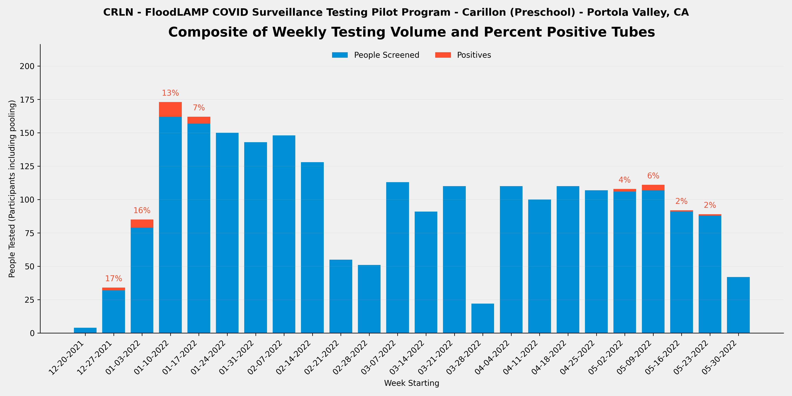
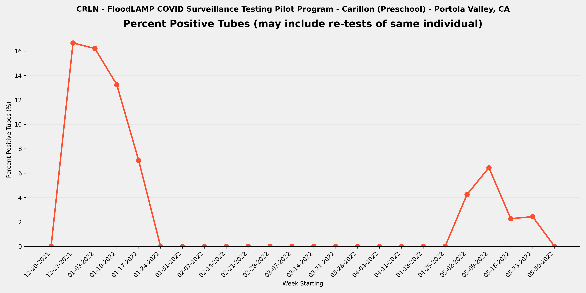
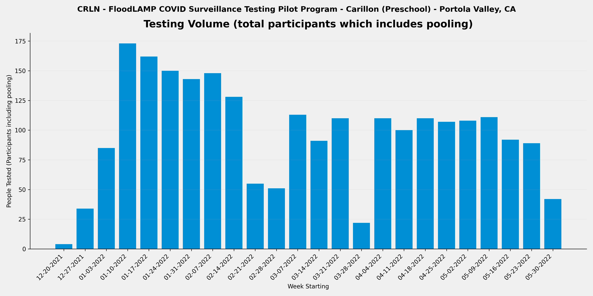

METADATA
last updated: 2026-01-27
file_name: CRLN_pilot-data_summary.md
file_date: 2022-05-31
title: CRLN Pilot Data Summary
category: pilots
subcategory: pilot-data
tags: 
source_file_type: csv
xfile_type: xlsx
gfile_url: NA
xfile_github_download_url: https://raw.githubusercontent.com/FocusOnFoundationsNonprofit/floodlamp-archive-wip/main/pilots/pilot-data/CRLN_xlsx_downloads
pdf_gdrive_url: NA
pdf_github_url: NA
license: CC BY 4.0 - https://creativecommons.org/licenses/by/4.0/
words: 3986
tokens: 6598
notes: 
summary_short: Site CRLN FloodLAMP pilot data summary based on curated CSV extracts.

CONTENT

## Plots

### Composite

### Percent Positive Tubes

### Volume

## Files

### Google Sheets URLs
- [FLMP_APS_deID_PUB](https://docs.google.com/spreadsheets/d/1ni39vn-fdXq0HrOgHbim_FK0OZidUv-YBLvzPwhhlFQ/edit?usp=drive_link)
- [FLMP_RFR_deID_PUB](https://docs.google.com/spreadsheets/d/16CwPJ9LeknD8lJFTr-gJSx916WZaGEMbN6iKnlVx4dI/edit?usp=drive_link)
- [FLMP_RTR_deID_PUB](https://docs.google.com/spreadsheets/d/16R3LlannlrGfiIIJq4T3EWjbtFLZrtPC4gkKycu8RXc/edit?usp=drive_link)

### Curated CSVs
- Curated CSV folder: `CRLN_curated_csvs/`
- Stats key-values CSV: [CRLN_APS_stats_key-values.csv](CRLN_curated_csvs/CRLN_APS_stats_key-values.csv)
- Weekly summary CSV: [CRLN_RFR_weekly-summary.csv](CRLN_curated_csvs/CRLN_RFR_weekly-summary.csv)
- Referral tests by person CSV: [CRLN_RTR_referral-tests-by-person.csv](CRLN_curated_csvs/CRLN_RTR_referral-tests-by-person.csv)

### XLSX downloads:
- [FLMP_APS_deID_PUB.xlsx](../FLMP_pilot-data/FLMP_xlsx_downloads/FLMP_APS_deID_PUB.xlsx)
- [FLMP_RFR_deID_PUB.xlsx](../FLMP_pilot-data/FLMP_xlsx_downloads/FLMP_RFR_deID_PUB.xlsx)
- [FLMP_RTR_deID_PUB.xlsx](../FLMP_pilot-data/FLMP_xlsx_downloads/FLMP_RTR_deID_PUB.xlsx)

## Key tables

### Stats key-values

| section | metric | value | details | comments | source_sheet | source_row |
| --- | --- | --- | --- | --- | --- | --- |
| Files | RFR File | FLMP_RFR_deID_PUB |  |  | Stats | 1 |
| Files | RTR File | FLMP_RTR_deID_PUB |  |  | Stats | 2 |
| Files | RSR File | NONE |  |  | Stats | 3 |
| Overall | Number of Tubes Tested (initial only - no re-runs) | 1,016 | initial run tubes only so excludes re-runs |  | Stats | 5 |
| Overall | Number of Tube Tests Run (includes re-runs) | 1,086 | includes re-runs |  | Stats | 6 |
| Overall | Number of Initial Runs | 79 |  | divide CRLN by time period 1-2 to 5-31 | Stats | 7 |
| Overall | Number of APS Only Tubes run | 111 |  | divide CRLN by time period 1-2 to 5-31 | Stats | 8 |
| Overall | Number of Test Reactions (RFR plus APS only tubes run) | 1,130 | includes technical replicates (the same tube sample in multiple reactions in the same run) | divide CRLN by time period 1-2 to 5-31 - 135 is num FLSP tubes in CRLN time period and 1290 is num RFR audit rxns during CRLN time period | Stats | 9 |
| Overall | Number of Participant Results | 2,340 | counts individual samples in pools and excludes re-runs |  | Stats | 11 |
| Overall | Number of ARF Tubes | 48 | tubes run and present in RFR but not in Appivo - created tube IDs that start with ARF | all during CRLN period so assign to CRLN | Stats | 12 |
| Overall | Sum of Participant Results plus ARF Tubes | 2,388 | Will be equal to the number of tubes tested if no pooling. |  | Stats | 13 |
| Overall | Average Pool Level (excludes ARF) | 2.4 |  |  | Stats | 14 |
| Re-runs | Number of Run Tubes (re-runs only) | 70 | from RFR Audit Num Run Tubes |  | Stats | 17 |
| Re-runs | Number of Reactions (re-runs only) | 205 | from RFR Audit Num rxns (excl ctrls) |  | Stats | 18 |
| Re-runs | Re-run % of Tubes | 6.9% | re-run / initial |  | Stats | 19 |
| Re-runs | Number of Initial Runs with Re-runs | 31 |  |  | Stats | 20 |
| Re-runs | % Initial Runs with Re-runs | 39.2% |  |  | Stats | 21 |
| Positives | Number of Tubes with Final Result Positive | 32 |  | count from VALUES Pos and Incl | Stats | 24 |
| Positives | % of Tubes Positives (Final Result) | 3.1% |  |  | Stats | 25 |
| Positives | Number of Cases with Final Result Positive (Indiv or Pool) | 13 | Subtract off Re-tests |  | Stats | 26 |
| Positives | Known Positive Cases | 3 | Previous tested (including by FloodLAMP test) or reported positive |  | Stats | 27 |
| Positives | Unknown Positive Cases | 10 |  |  | Stats | 28 |
| Inconclusives | Number of Tubes with Final Result Inconclusive | 4 |  |  | Stats | 31 |
| Inconclusives | Number of Tubes in RFR Audit Inconclusive not in Appivo Final Results | 0 |  |  | Stats | 32 |
| Inconclusives | Total Number of Inconclusive Tubes | 4 |  |  | Stats | 33 |
| Inconclusives | % of Tubes Inconclusive | 0.4% |  |  | Stats | 34 |
| Inconclusives | Number of Inconclusive Tubes resolved Positive by Referral Test or Correspondence | 1 |  | 2022-05-08T00:00:00 | Stats | 35 |
| Inconclusives | % Inconclusives resolved Positive by Referral Tests | 25.0% |  | 2/4 unknown and 1 of those was in household of positives | Stats | 36 |
| Inconclusives | Number of Inconclusive Tubes with Referral Test or Correspondence Negative | 1 |  |  | Stats | 37 |
| Inconclusives | Number of Inconclusive Tubes with no Referral Test result or Correspondence | 2 |  |  | Stats | 38 |
| Inconclusives | Number of Tubes with Initial Inconclusives and Re-run Negative | 33 | Count Result Correction Code=2.5 in preDel col AJ, or from RFR preExcl if not resulted as Incl in App | No 2.5 correction code, Sum AE - AF = 36 | Stats | 39 |
| Inconclusives | Number of Inconclusive Test Run Calls | 40 | includes re-runs - from RFR Audit only and excludes any APS only resulted inconclusives |  | Stats | 40 |
| Inconclusives | % Tube Tests Run Called Inconclusive | 3.7% | includes re-runs |  | Stats | 41 |
| Referrals and Correspondence | Number of FloodLAMP Cases with Referral Tests or Correspondence | 10 | Indiv or Pool, Cases used instead of Person to account for people being contracting COVID multiple times, and instead of Results to exclude re-tests |  | Stats | 44 |
| Referrals and Correspondence | Number of Referral Confirmed FloodLAMP Positives | 9 | Sometimes also termed Agree Positives - Include initial Inconclusive with Referral or Correspondence Positive |  | Stats | 45 |
| Referrals and Correspondence | FL Inconclusives with Referral / Correspondence Positive | 1 |  | 2022-05-08T00:00:00 | Stats | 46 |
| Referrals and Correspondence | % FloodLAMP Positive or Inconclusive with Referral / Correspondence Positive | 100.0% |  |  | Stats | 47 |
| Referrals and Correspondence | FL Inconclusives but Referral / Correspondence Negative | 1 |  | 2022-02-14T00:00:00 | Stats | 48 |
| Referrals and Correspondence | FL Inconclusives with No Referral Tests or Correspondence | 2 |  |  | Stats | 49 |
| Comparison to Antigen | Number of FloodLAMP Test Person Cases with Referral Antigen Tests (including non-Same Day) | 8 |  |  | Stats | 52 |
| Comparison to Antigen | Number of FloodLAMP Test Person Cases with Same Day Referral Antigen Tests | 8 |  |  | Stats | 53 |
| Comparison to Antigen | Number of FloodLAMP Positive Test Person Cases with Same Day Antigen Negative | 4 | Agree with Referral Test Positive (usually PCR or later Antigen) but Initial Antigen Negative |  | Stats | 54 |
| Comparison to Antigen | % Confirmed FloodLAMP Positives with Same Day Antigen Negative | 50.0% |  |  | Stats | 55 |
| Comparison to Antigen | Number of FloodLAMP Positive Test Person Cases confirmed with Referral Tests but Antigen and Other Non-Antigen Test Negative | 0 |  |  | Stats | 56 |
| Comparison to Antigen | % Confirmed FloodLAMP Positives that were Antigen and Other Non-Antigen Test Negative | 0.0% |  |  | Stats | 57 |
| False Calls | False Positives Final Results |  | From reviewing APS/Pos and Incl tab Unconfirmed FL Positives |  | Stats | 60 |
| False Calls | False Negative Final Results (Suspected) |  | From reviewing Referral Tests by Person and correspondence with Program Admin |  | Stats | 61 |
| People | Number of Unique Individuals Tested | 142 | Includes UnknownPerson additions but not ARF tubes |  | Stats | 64 |
| People | Number of Unique Sponsors | 51 | People who collect using the app |  | Stats | 65 |
| Positivity | Number of Unique Individual Tested FloodLAMP Positive | 17 | includes Inconclusive FloodLAMP result confirmed Positive by follow-up or Referral |  | Stats | 68 |
| Positivity | % of Population FloodLAMP Positive (excluding pools not deconv) | 12.0% |  |  | Stats | 69 |
| Positivity | Number of Unique Individual Tested FloodLAMP Positive (including if in a positive pool) | 40 |  |  | Stats | 70 |
| Positivity | % of Population FloodLAMP Positive (including everyone in a positive pool) | 28.2% |  |  | Stats | 71 |
| Dates | Start Run Date | 2021-12-24 |  |  | Stats | 74 |
| Dates | End Run Date | 2022-05-31 |  |  | Stats | 75 |
| Info | Test Operator | FloodLAMP | Who ran the actual testing (running LAMP reactions) |  | Stats | 78 |
| Info | Test Processing Site | Garage Dedicated Room | Where the test processing (running LAMP reactions) was done |  | Stats | 79 |
| Info | Population Tested | Students, Staff, Families | Description of the participants |  | Stats | 80 |
| Info | Configuration | Standard | Equipment set used for test processing (relates to throughput and type of test tube used) |  | Stats | 81 |
| Info | Collection Type | Pooled Household, Individual | Pooled, Individual, or Both |  | Stats | 82 |
| Info | Self or HCW Collected | Self | HCW is Health Care Worker |  | Stats | 83 |
| Info | App Used? | Yes | Was the FloodLAMP Mobile App and Admin Portal utilized in the program |  | Stats | 84 |
| Info | Bring-up Type | In Person | How the initial setup and validation of the testing site was done |  | Stats | 85 |
| Info | Program Name | Carillon | Shorthand name used internally at FloodLAMP and in other documents for this program |  | Stats | 86 |
| Info | Site | Preschool | Broader physical space where the testing was done and/or where participants congregated |  | Stats | 87 |
| Info | Site Type | Preschool | Type of entity or organization receiving the testing program |  | Stats | 88 |
| Info | Location | Portola Valley, CA | Geographical location of where the FloodLAMP testing program occurred |  | Stats | 89 |
| Pooling | Number of Initial FloodLAMP Positive Pools | 10 |  |  | Stats | 92 |
| Pooling | Number of Initial FloodLAMP Positive Pools with Indiv Deconvolution | 5 |  |  | Stats | 93 |
| Pooling | Number of Initial FloodLAMP Positive Pools Confirmed by Referral Testing | 6 |  |  | Stats | 94 |
| Pooling | Number of Initial Confirmed FL Pools where the organization member (i.e. parent or other child) was Positive | 4 |  |  | Stats | 95 |
| Pooling | Number of Initial Confirmed FL Pools where Positive Individual was not the organization member (i.e. parent or other child) | 2 |  |  | Stats | 96 |
| Pooling | % Confirmed Positive Pools where Positive Individual was not the organization member (i.e. parent or other child) | 33.3% |  |  | Stats | 97 |

### Weekly summary

| week_start_date | week_end_date | participants_n | tubes_n | positive_tubes_n | inconclusive_tubes_n | pct_positive | pct_positive_status |
| --- | --- | --- | --- | --- | --- | --- | --- |
| 2021-12-20 | 2021-12-26 | 4 | 1 | 0 | 0 | 0.0% | ok |
| 2021-12-27 | 2022-01-02 | 34 | 12 | 2 | 0 | 16.7% | ok |
| 2022-01-03 | 2022-01-09 | 85 | 37 | 6 | 0 | 16.2% | ok |
| 2022-01-10 | 2022-01-16 | 173 | 83 | 11 | 1 | 13.3% | ok |
| 2022-01-17 | 2022-01-23 | 162 | 71 | 5 | 0 | 7.0% | ok |
| 2022-01-24 | 2022-01-30 | 150 | 62 | 0 | 0 | 0.0% | ok |
| 2022-01-31 | 2022-02-06 | 143 | 58 | 0 | 0 | 0.0% | ok |
| 2022-02-07 | 2022-02-13 | 148 | 60 | 0 | 0 | 0.0% | ok |
| 2022-02-14 | 2022-02-20 | 128 | 54 | 0 | 1 | 0.0% | ok |
| 2022-02-21 | 2022-02-27 | 55 | 21 | 0 | 0 | 0.0% | ok |
| 2022-02-28 | 2022-03-06 | 51 | 25 | 0 | 0 | 0.0% | ok |
| 2022-03-07 | 2022-03-13 | 113 | 52 | 0 | 0 | 0.0% | ok |
| 2022-03-14 | 2022-03-20 | 91 | 42 | 0 | 0 | 0.0% | ok |
| 2022-03-21 | 2022-03-27 | 110 | 44 | 0 | 0 | 0.0% | ok |
| 2022-03-28 | 2022-04-03 | 22 | 9 | 0 | 0 | 0.0% | ok |
| 2022-04-04 | 2022-04-10 | 110 | 43 | 0 | 0 | 0.0% | ok |
| 2022-04-11 | 2022-04-17 | 100 | 40 | 0 | 0 | 0.0% | ok |
| 2022-04-18 | 2022-04-24 | 110 | 47 | 0 | 0 | 0.0% | ok |
| 2022-04-25 | 2022-05-01 | 107 | 42 | 0 | 0 | 0.0% | ok |
| 2022-05-02 | 2022-05-08 | 108 | 47 | 2 | 0 | 4.3% | ok |
| 2022-05-09 | 2022-05-15 | 111 | 62 | 4 | 2 | 6.5% | ok |
| 2022-05-16 | 2022-05-22 | 92 | 44 | 1 | 0 | 2.3% | ok |
| 2022-05-23 | 2022-05-29 | 89 | 41 | 1 | 0 | 2.4% | ok |
| 2022-05-30 | 2022-06-05 | 42 | 19 | 0 | 0 | 0.0% | ok |

### Referral tests by person

| participant_id | num_sequential_referral_tests | num_floodlamp_results_pos_or_incl | floodlamp_tube_id | floodlamp_test_result | floodlamp_test_date | first_referral_test_date | referral_overall_result | first_referral_test_type | first_referral_test_result | second_referral_test_type | second_referral_test_result | third_referral_test_type | third_referral_test_result | antigen_neg_with_other_positive_flag | referral_eval |
| --- | --- | --- | --- | --- | --- | --- | --- | --- | --- | --- | --- | --- | --- | --- | --- |
| FLMP132170 | 6 | 0 | MA100A | Negative | 2022-05-02 | 2022-05-04 | Negative | Antigen | Negative | Antigen | Negative | Antigen | Negative | False | FL pos pool of 3 in morning then indiv deconvl with FL and this person was neg but there was 1 FL deconv pos that was confirmed by PCR (neg by antigen initally then pos 2 days later) |
| FLMP147333 | 5 | 2 | FLT1433 | Positive | 2022-01-02 | 2022-01-09 | Positive | Antigen | Positive | PCR | Positive |  |  | False | known pos that tested pos by FL - not sure if they told us about antigen result before FL test |
| FLMP172687 | 0 | 1 | FLB5889 | Positive | 2022-01-06 | REFERRAL TEST COLLECTION DATE | NA - Return Test | REFERRAL TEST TYPE | REFERRAL TEST RESULT |  |  |  |  | NA - Return Test | FL test (pos) was test to return after anitgen pos test 7 days prior |
| FLMP254321 | 1 | 0 | FLE269 | Negative | 2022-05-09 | 2022-05-02 |  | PCR | Positive |  |  |  |  | False | FL incl pool of 3, then indiv deconv and 1 of 3 pos, this one was FL neg and also neg by PCR and antigen |
| FLMP290315 | 32 | 0 | NO FL testing |  |  | 2022-05-08 | Unknown | Antigen | Unknown |  |  |  |  | False |  |
| FLMP302189 | 2 | 4 | FLB6845 | Positive | 2022-01-02 | 2022-01-06 | Positive | PCR | Negative | Antigen | Positive |  |  | False | parent tested neg by antigen so did indiv deconv FL test and was pos |
| FLMP322473 | 0 | 0 | AH679 | Negative | 2022-05-09 | 2022-05-05 | Positive | Antigen | Positive |  |  |  |  | False |  |
| FLMP325595 | 0 | 0 | AH245 | Negative | 2022-05-09 | 2022-05-05 | Positive | Antigen | Positive |  |  |  |  | False |  |
| FLMP330127 | 3 | 2 | FLT1433 | Positive | 2022-01-02 | 2022-01-07 | Positive | Antigen | Positive | PCR | Positive |  |  | False | known pos that tested pos by FL - not sure if they told us about antigen result before FL test |
| FLMP464138 | 6 | 0 | MA82 | Negative | 2022-05-02 | 2022-01-04 | Negative | Antigen | Negative | PCR | Positive | Antigen | Negative | True | FL pos pool of 3 in morning then indiv deconvl with FL and this person was neg but there was 1 FL deconv pos that was confirmed by PCR (neg by antigen initally then pos 2 days later) |
| FLMP472803 | 6 | 1 | MA57 | Negative | 2022-05-02 | 2022-01-14 | Negative | Antigen | Negative | Antigen | Negative | Antigen | Negative | False | FL pos pool of 3 in morning then indiv deconvl with FL and this person was neg but there was 1 FL deconv pos that was confirmed by PCR (neg by antigen initally then pos 2 days later) |
| FLMP473007 | 1 | 0 | FLB5852 | Negative | 2022-01-06 | 2022-12-30 | Positive | Antigen | Positive |  |  |  |  | False | Only initial FL positive pool - no indiv deconv |
| FLMP549529 | 0 | 1 | FLB5830 | Positive | 2022-01-06 | REFERRAL TEST COLLECTION DATE | NA - Return Test | REFERRAL TEST TYPE | REFERRAL TEST RESULT |  |  |  |  | NA - Return Test | FL test (pos) was test to return after anitgen pos test 5 days prior |
| FLMP552537 | 1 | 2 | FLE202 | Positive | 2022-05-09 | 2022-05-02 |  | Antigen | Negative |  |  |  |  | False | FL incl pool of 3, then indiv deconv and 1 of 3 pos, this one was confrimed by PCR and antigen |
| FLMP601970 | 0 | 1 | FLT1433 | Positive | 2022-01-02 | 2022-01-14 | Negative | Antigen | Negative |  |  |  |  | False | this was a later return test - the CRLN child did not test on 1-10 with parents |
| FLMP608363 | 0 | 2 | AH365 | Positive | 2022-05-09 | 2022-05-05 | Positive | Antigen | Positive |  |  |  |  | False | CRLN child (no symptomys) - FL pos pool of 4 then indiv deconv by FL with 1 of 4 pos and this one confimed by PCR |
| FLMP652238 | 1 | 1 | FLT1136 | Positive | 2022-01-06 | 2022-12-29 | Positive | Antigen | Positive |  |  |  |  | False | Only initial FL positive pool - no indiv deconv |
| FLMP687722 | 7 | 2 | MA108 | Positive | 2022-05-02 | 2022-01-15 | Positive | Antigen | Positive | Antigen | Positive | Antigen | Negative | True | FL pos pool of 3 in morning then indiv deconvl with FL and this person was pos that was confirmed by PCR (neg by antigen initally then pos 2 days later) - other 3 in pool neg by PCR and antigen |
| FLMP705416 | 1 | 0 | FLB5969 | Negative | 2022-05-09 | 2022-05-04 |  | Antigen | Positive |  |  |  |  | False | FL incl pool of 3, then indiv deconv and 1 of 3 pos, this one was FL neg and also neg by antigen byt pos by PCR |
| FLMP776278 | 2 | 3 | FLB5889 | Positive | 2022-01-06 | 2022-12-30 | Positive | Antigen | Positive | Antigen | Positive |  |  | False | Non-CRLN child that test pos by antigen so no indiv deconv FL test |
| FLMP779627 | 0 | 0 | AJ9253 | Negative | 2022-05-09 | 2022-05-05 | Positive | Antigen | Positive |  |  |  |  | False |  |
| FLMP828735 | 3 | 3 | FLB6845 | Positive | 2022-01-02 | 2022-01-03 | Positive | Antigen | Positive | PCR | Positive |  |  | False | CRLN child that test pos by antigen so no indiv deconv FL test |
| FLMP857562 | 2 | 2 | FLB6845 | Positive | 2022-01-02 | 2022-01-06 | Positive | PCR | Positive | Antigen | Positive |  |  | False | parent tested neg by antigen so did indiv deconv FL test and was pos |
| FLMP858721 | -1 | 1 | FLT1136 | Positive | 2022-01-06 | 2022-12-29 | NA - Return Test | Antigen | Positive |  |  |  |  | NA - Return Test | FL test (pos) was test to return after anitgen pos test 8 days prior |
| FLMP876455 | 0 | 0 | FLT1433 | Positive | 2022-01-02 | 2022-01-14 | Negative | Antigen | Negative |  |  |  |  | False | FL pos pool of 3 in morning then indiv deconvl with FL and this person was neg along with one other both by PCR, and 3rd pool person was PCR pos |
| FLMP887888 | 3 | 2 | FLT1433 | Positive | 2022-01-02 | 2022-01-14 | Positive | PCR | Positive |  |  |  |  | False | FL pos pool of 3 in morning then indiv deconvl with FL and only this person was pos (other 2 FL and the referral PCR neg) - ignore neg antigen tests for analysis because they were 6 days before and 5 days after FL tests |
| FLMP915544 | 1 | 0 | FLB6845 | Positive | 2022-01-02 | REFERRAL TEST COLLECTION DATE | Positive | REFERRAL TEST TYPE | REFERRAL TEST RESULT |  |  |  |  | False | Only initial FL positive pool - no indiv deconv |
| FLMP939793 | 0 | 0 | FLB5852 | Negative | 2022-01-06 | REFERRAL TEST COLLECTION DATE | NA - Return Test | REFERRAL TEST TYPE | REFERRAL TEST RESULT |  |  |  |  | NA - Return Test | FL test (neg) was test to return after anitgen pos test 7 days prior |
| FLMP942437 | 0 | 0 | NO FL testing |  |  | 2022-05-08 | Unknown | Antigen | Unknown |  |  |  |  | False |  |
| FLMP969044 | 0 | 0 | FLT1433 | Positive | 2022-01-02 | 2022-01-14 | Negative | Antigen | Negative |  |  |  |  | False | FL pos pool of 3 in morning then indiv deconvl with FL and this person was neg along with one other both by PCR, and 3rd pool person was PCR pos |
| FLMP987142 | 3 | 2 | AG721 | Positive | 2022-05-02 | 2022-05-05 | Positive | Antigen | Positive | Antigen | Unknown | PCR | Positive | True | Partner tested pos by antigen then this partner tested neg by antigen 3 days in a row then next day was FL pos, which was confirmed by PCR collected same day and resulted 2 days later (this was a teacher - so FL screening likely stopped spread!) |
