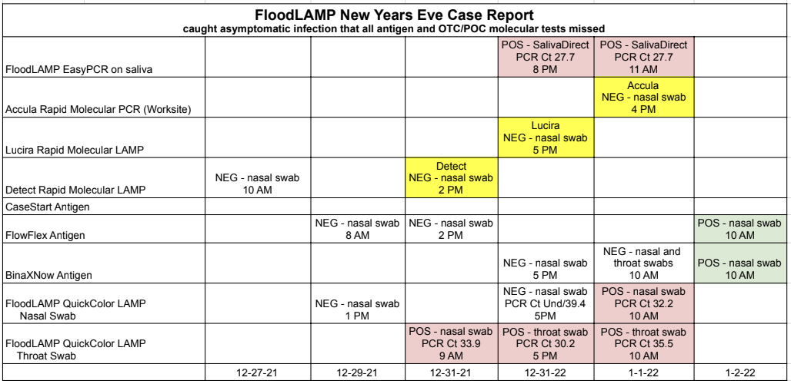

METADATA
last updated: 2026-02-25 BA
file_name: 2022-01-01_Case Report - New Years Eve.md
file_date: 2022-01-01
title: FloodLAMP Case Report - New Years Eve
category: pilots
subcategory: pilot-data
tags:
source_file_type: pdf
xfile_type: NA
gfile_url: NA
xfile_github_download_url: NA
pdf_gdrive_url: https://drive.google.com/file/d/1hdTOuLxX7SnE7VL9Rdw61PeU-HE4ylli/
pdf_github_url: https://github.com/FocusOnFoundationsNonprofit/floodlamp-archive-wip/blob/main/pilots/pilot-data/2022-01-01_Case%20Report%20-%20New%20Years%20Eve.pdf
conversion_input_file_type: pdf
conversion: msmid
license: CC BY 4.0 - https://creativecommons.org/licenses/by/4.0/
tokens: 1174
words: 679
notes: 
summary_short: FloodLAMP New Years Eve Case Report documenting how FloodLAMP detected an asymptomatic SARS-CoV-2 infection that all antigen and OTC/POC molecular tests missed, tracking 19 tests across 8 different test types (FloodLAMP QuickColor LAMP, FloodLAMP EasyPCR/SalivaDirect, Accula, Lucira, Detect, FlowFlex, CareStart, BinaXNow) from 12-27-21 to 01-02-22, with FloodLAMP returning the first positive on 12-31-21 while same-day antigen and rapid molecular tests were negative.

CONTENT

| Date Collected | Time Collected | Test | Sample Type | CLAMP | Tube Code | Swab ID | Logged? | PCR Ct |
| --- | --- | --- | --- | --- | --- | --- | --- | --- |
| 12-27-21 | 9:37 AM | Detect | nasal swab | NEG |  |  |  |  |
| 12-29-21 | 7:48 AM | FlowFlex Antigen | nasal swab | NEG |  |  |  |  |
| 12-29-21 | 1:00 PM | FloodLAMP | nasal swab | NEG | MAX398 | JUR |  |  |
| 12-31-21 | 9:00 AM | FloodLAMP | nasal swab | POS | MAX288 | JUR |  | 33.9 |
| 12-31-21 | 2:01 PM | FlowFlex Antigen | nasal swab | NEG |  |  |  |  |
| 12-31-21 | 2:10 PM | Detect | nasal swab | NEG |  |  |  |  |
| 12-31-21 | 4:52 PM | Lucira | nasal swab | NEG |  |  |  |  |
| 12-31-21 | 5:00 PM | FloodLAMP | nasal swab | NEG | MAX340 | JUR |  | 2 Und, 1 39.4 |
| 12-31-21 | 5:00 PM | FloodLAMP | throat swab | POS | MAX347 | JUR |  | 30.2 |
| 12-31-21 | 5:00 PM | BinaXNow Antigen | nasal swab | NEG |  |  |  |  |
| 12-31-21 | 8:00 PM | FloodLAMP | saliva |  | MAX368 |  | logged in form | 27.7 |
| 01-01-22 | 11:00 AM | FloodLAMP | saliva |  | MA4 |  |  | 29.0 |
| 01-01-22 | 10:28 AM | BinaXNow | nasal swab | NEG |  |  |  |  |
| 01-01-22 | 10:33 AM | BinaXNow | throat swab | NEG |  |  |  |  |
| 01-01-22 | 10:45 AM | FloodLAMP | nasal swab | POS | MA63 | JUR |  | 32.2 |
| 01-01-22 | 10:50 AM | FloodLAMP | throat swab | POS | MA92 | JUR |  | 35.5 |
| 01-01-22 | 4:22 PM | Accula (Worksite) | nasal swab | NEG |  |  |  |  |
| 01-02-22 | 10:30 AM | CareStart | nasal swab | POS |  |  |  |  |
| 01-02-22 | 10:30 AM | BinaXNow | nasal swab | POS |  |  |  |  |
||

### FloodLAMP New Years Eve Case Report
caught asymptomatic infection that all antigen and OTC/POC molecular tests missed

|  |  |  | |  |  |  |
|---|---|---|---|---|---|---|
| FloodLAMP EasyPCR on saliva | | | | POS - SalivaDirect PCR Ct 27.7, 8 PM | POS - SalivaDirect PCR Ct 27.7, 11 AM | |
| Accula Rapid Molecular PCR (Worksite) | | | | | Accula NEG - nasal swab, 4 PM | |
| Lucira Rapid Molecular LAMP | | | | Lucira NEG - nasal swab, 5 PM | | |
| Detect Rapid Molecular LAMP | NEG - nasal swab, 10 AM |  | Detect NEG - nasal swab, 2 PM | | | |
| CaseStart Antigen | | | | | | |
| FlowFlex Antigen | | NEG - nasal swab, 8 AM | NEG - nasal swab, 2 PM | | | POS - nasal swab, 10 AM |
| BinaxNow Antigen | | | | NEG - nasal swab, 5 PM | NEG - nasal and throat swabs, 10 AM | POS - nasal swab, 10 AM |
| FloodLAMP QuickColor LAMP Nasal Swab | | NEG - nasal swab, 1 PM | | NEG - nasal swab PCR Ct Und/39.4, 5PM | POS - nasal swab PCR Ct 32.2, 10 AM | |
| FloodLAMP QuickColor LAMP Throat Swab | | | POS - nasal swab PCR Ct 33.9, 9 AM | POS - throat swab PCR Ct 30.2, 5 PM | POS - throat swab PCR Ct 35.5, 10 AM | |
|  | 12-27-21 | 12-29-21 | 12-31-21 | 12-31-22 | 1-1-22 | 1-2-22 |
||
