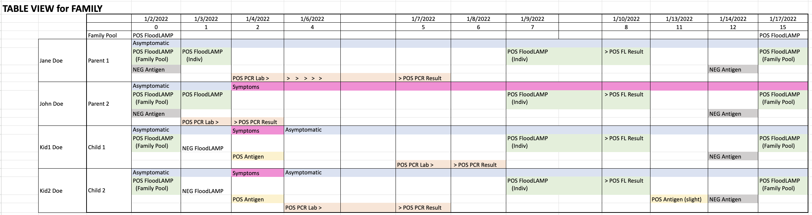

METADATA
last updated: 2026-02-25 BA
file_name: 2022-01-02_Carillon Case Report of Asymptomatic Positive Family Pool.md
file_date: 2022-01-02
title: FloodLAMP Case Report - Carillon Asymptomatic Positive Family Pool
category: pilots
subcategory: pilot-data
tags:
source_file_type: gsheet
xfile_type: xlsx
gfile_url: https://docs.google.com/spreadsheets/d/1eWD8z2MqoZEVoTFPJWcxr7-UsxcyYGklwmAUhEuawbM/
xfile_github_download_url: https://raw.githubusercontent.com/FocusOnFoundationsNonprofit/floodlamp-archive/main/pilots/pilot-data/2022-01-02_Carillon%20Case%20Report%20of%20Asymptomatic%20Positive%20Family%20Pool.xlsx
pdf_gdrive_url: NA
pdf_github_url: NA
conversion_input_file_type: xlsx
conversion: msmid
license: CC BY 4.0 - https://creativecommons.org/licenses/by/4.0/
tokens: 4849
words: 2430
notes: 
summary_short: FloodLAMP Carillon preschool case report documenting a family pool (2 parents, 2 children) where FloodLAMP detected an asymptomatic SARS-CoV-2 infection on 2022-01-02 through pooled household testing while same-day BinaxNow antigen tests were negative for both parents. Individual FloodLAMP follow-up confirmed both parents positive on 01-03, and children developed symptoms and tested positive by home antigen on 01-04, followed by confirmatory PCR lab tests for all family members. The family remained FloodLAMP-positive through 01-17.

CONTENT

## Example Data
### FLOODLAMP DATA with EXTRA COLUMNS ADDED
| TUBE ID | SPONSOR  | PARTICIPANT | MINOR | NOTE | RESULT   | COLLECTION DATE | COLLECTION TIME | RESULT DATE | TEST TYPE | TEST MODEL   | SYMPTOMS | POOLED | TAT     | NOTES |
|---------|----------|-------------|-------|------|----------|-----------------|-----------------|-------------|-----------|--------------|----------|--------|---------|-------|
| FLT1134 | Jane Doe | Kid1 Doe    |       |      | Negative | 11/28/2021      |                 | 11/28/2021  | Molecular | FloodLAMP QC |          | 1      |         |       |
| FLY1134 | Jane Doe | Kid1 Doe    |       |      | Negative | 11/28/2021      |                 | 11/28/2021  | Molecular | FloodLAMP QC |          | 1      |         |       |
| FLT1134 | Jane Doe | Kid2 Doe    |       |      | Negative | 11/28/2021      |                 | 11/28/2021  | Molecular | FloodLAMP QC |          | 1      |         |       |
| FLY1134 | Jane Doe | Kid2 Doe    |       |      | Negative | 11/28/2021      |                 | 11/28/2021  | Molecular | FloodLAMP QC |          | 1      |         |       |
| FLT1134 | Jane Doe | John Doe    |       |      | Negative | 11/28/2021      |                 | 11/28/2021  | Molecular | FloodLAMP QC |          | 1      |         |       |
| FLY1134 | Jane Doe | John Doe    |       |      | Negative | 11/28/2021      |                 | 11/28/2021  | Molecular | FloodLAMP QC |          | 1      |         |       |
| FLT1134 | Jane Doe | Jane Doe    |       |      | Negative | 11/28/2021      |                 | 11/28/2021  | Molecular | FloodLAMP QC |          | 1      |         |       |
| FLY1134 | Jane Doe | Jane Doe    |       |      | Negative | 11/28/2021      |                 | 11/28/2021  | Molecular | FloodLAMP QC |          | 1      |         |       |
| FLE484  | Jane Doe | Kid1 Doe    |       |      | Negative | 12/6/2021       |                 | 12/7/2021   | Molecular | FloodLAMP QC |          | 1      |         |       |
| FLE484  | Jane Doe | Kid2 Doe    |       |      | Negative | 12/6/2021       |                 | 12/7/2021   | Molecular | FloodLAMP QC |          | 1      |         |       |
| FLE484  | Jane Doe | John Doe    |       |      | Negative | 12/6/2021       |                 | 12/7/2021   | Molecular | FloodLAMP QC |          | 1      |         |       |
| FLE484  | Jane Doe | Jane Doe    |       |      | Negative | 12/6/2021       |                 | 12/7/2021   | Molecular | FloodLAMP QC |          | 1      |         |       |
| FLT1433 | Jane Doe | Kid1 Doe    |       |      | Positive | 1/2/2022        |                 | 1/2/2022    | Molecular | FloodLAMP QC |          | 1      | 2 hours |       |
| FLT1433 | Jane Doe | Kid2 Doe    |       |      | Positive | 1/2/2022        |                 | 1/2/2022    | Molecular | FloodLAMP QC |          | 1      | 2 hours |       |
| FLT1433 | Jane Doe | John Doe    |       |      | Positive | 1/2/2022        |                 | 1/2/2022    | Molecular | FloodLAMP QC |          | 1      | 2 hours |       |
| FLT1433 | Jane Doe | Jane Doe    |       |      | Positive | 1/2/2022        |                 | 1/2/2022    | Molecular | FloodLAMP QC |          | 1      | 2 hours |       |
| FLT1570 | Jane Doe | Kid1 Doe    |       |      | Negative | 1/3/2022        |                 | 1/3/2022    | Molecular | FloodLAMP QC |          | 0      | 1 hour  |       |
| FLT14   | Jane Doe | Kid2 Doe    |       |      | Negative | 1/3/2022        |                 | 1/3/2022    | Molecular | FloodLAMP QC |          | 0      | 1 hour  |       |
| FLT1128 | Jane Doe | John Doe    |       |      | Positive | 1/3/2022        |                 | 1/3/2022    | Molecular | FloodLAMP QC |          | 0      | 1 hour  |       |
| FLE810  | Jane Doe | Kid1 Doe    |       |      | Positive | 1/9/2022        |                 | 1/10/2022   | Molecular | FloodLAMP QC |          | 0      | 2 hours |       |
| FLE885  | Jane Doe | Kid2 Doe    |       |      | Positive | 1/9/2022        |                 | 1/10/2022   | Molecular | FloodLAMP QC |          | 0      | 2 hours |       |
| FLE895  | Jane Doe | John Doe    |       |      | Positive | 1/9/2022        |                 | 1/10/2022   | Molecular | FloodLAMP QC |          | 0      | 2 hours |       |
| FLE812  | Jane Doe | Jane Doe    |       |      | Positive | 1/9/2022        |                 | 1/10/2022   | Molecular | FloodLAMP QC |          | 0      | 2 hours |       |
| FLB7156 | Jane Doe | Kid1 Doe    |       |      | Positive | 1/17/2022       |                 | 1/17/2022   | Molecular | FloodLAMP QC |          | 1      | 3 hours |       |
| FLB7156 | Jane Doe | Jane Doe    |       |      | Positive | 1/17/2022       |                 | 1/17/2022   | Molecular | FloodLAMP QC |          | 1      | 3 hours |       |
| FLB7156 | Jane Doe | Kid2 Doe    |       |      | Positive | 1/17/2022       |                 | 1/17/2022   | Molecular | FloodLAMP QC |          | 1      | 3 hours |       |
| FLB7156 | Jane Doe | John Doe    |       |      | Positive | 1/17/2022       |                 | 1/17/2022   | Molecular | FloodLAMP QC |          | 1      | 3 hours |
||

### NON FLOODLAMP TEST DATA (can be from before or after FloodLAMP test)
| PARTICIPANT | MINOR | NOTE | RESULT   | COLLECTION DATE | COLLECTION TIME | RESULT DATE | TEST TYPE | TEST MODEL | SYMPTOMS | POOLED | TAT       | NOTES                   |
|-------------|-------|------|----------|-----------------|-----------------|-------------|-----------|------------|----------|--------|-----------|-------------------------|
| John Doe    |       |      | Negative | 1/2/2022        |                 | 1/2/2022    | Antigen   | BinaXNow   | Asym     | 0      | immediate | evening after referral  |
| Jane Doe    |       |      | Negative | 1/2/2022        |                 | 1/2/2022    | Antigen   | BinaXNow   | Asym     | 0      | immediate | evening after referral  |
| John Doe    |       |      | Positive | 1/3/2022        |                 | 1/4/2022    | Molecular | PCR Lab    |          | 0      | 1 day     |                         |
| Kid2 Doe    |       |      | Positive | 1/4/2022        |                 | 1/4/2022    | Antigen   | Unknown    | Sympt    | 0      | immediate |                         |
| Kid1 Doe    |       |      | Positive | 1/4/2022        |                 | 1/4/2022    | Antigen   | Unknown    | Sympt    | 0      | immediate |                         |
| Jane Doe    |       |      | Positive | 1/4/2022        |                 | 1/7/2022    | Molecular | PCR Lab    |          | 0      | 3 days    |                         |
| Kid2 Doe    |       |      | Positive | 1/6/2022        |                 | 1/7/2022    | Molecular | PCR Lab    |          | 0      | 1 day     |                         |
| Kid1 Doe    |       |      | Positive | 1/7/2022        |                 | 1/8/2022    | Molecular | PCR Lab    |          | 0      | 1 day     |                         |
| Kid2 Doe    |       |      | Positive | 1/13/2022       |                 | 1/13/2022   | Antigen   | Unknown    |          | 0      | immediate | slight second line      |
| John Doe    |       |      | Negative | 1/14/2022       |                 | 1/14/2022   | Antigen   | Unknown    |          | 0      | immediate |                         |
| Jane Doe    |       |      | Negative | 1/14/2022       |                 | 1/14/2022   | Antigen   | Unknown    |          | 0      | immediate |                         |
| Kid2 Doe    |       |      | Negative | 1/14/2022       |                 | 1/14/2022   | Antigen   | Unknown    |          | 0      | immediate |                         |
| Kid1 Doe    |       |      | Negative | 1/14/2022       |                 | 1/14/2022   | Antigen   | Unknown    |          | 0      | immediate |
||

### COMBINED TEST DATA
| PARTICIPANT | MINOR | NOTE | RESULT   | COLLECTION DATE | COLLECTION TIME | RESULT DATE | TEST TYPE | TEST MODEL   |  | POOLED | TAT       | NOTES                   |  | DAY SP |
|-------------|-------|------|----------|-----------------|-----------------|-------------|-----------|--------------|--|--------|-----------|-------------------------|--|--------|
| Kid1 Doe    |       |      | Positive | 1/2/2022        |                 | 1/2/2022    | Molecular | FloodLAMP QC |  | 1      | 2 hours   |                         |  | 0      |
| Kid2 Doe    |       |      | Positive | 1/2/2022        |                 | 1/2/2022    | Molecular | FloodLAMP QC |  | 1      | 2 hours   |                         |  | 0      |
| John Doe    |       |      | Positive | 1/2/2022        |                 | 1/2/2022    | Molecular | FloodLAMP QC |  | 1      | 2 hours   |                         |  | 0      |
| John Doe    |       |      | Negative | 1/2/2022        |                 | 1/2/2022    | Antigen   | BinaXNow     |  | 0      | immediate | evening after referral  |  | 0      |
| Jane Doe    |       |      | Positive | 1/2/2022        |                 | 1/2/2022    | Molecular | FloodLAMP QC |  | 1      | 2 hours   |                         |  | 0      |
| Jane Doe    |       |      | Negative | 1/2/2022        |                 | 1/2/2022    | Antigen   | BinaXNow     |  | 0      | immediate | evening after referral  |  | 0      |
| Kid1 Doe    |       |      | Negative | 1/3/2022        |                 | 1/2/2022    | Molecular | FloodLAMP QC |  | 0      | 1 hour    |                         |  | 1      |
| Kid2 Doe    |       |      | Negative | 1/3/2022        |                 | 1/3/2022    | Molecular | FloodLAMP QC |  | 0      | 1 hour    |                         |  | 1      |
| John Doe    |       |      | Positive | 1/3/2022        |                 | 1/3/2022    | Molecular | FloodLAMP QC |  | 0      | 1 hour    |                         |  | 1      |
| John Doe    |       |      | Positive | 1/3/2022        |                 | 1/4/2022    | Molecular | PCR Lab      |  | 0      | 1 day     |                         |  | 1      |
| Jane Doe    |       |      | Positive | 1/4/2022        |                 | 1/7/2022    | Molecular | PCR Lab      |  | 0      | 3 days    |                         |  | 2      |
| Kid2 Doe    |       |      | Positive | 1/4/2022        |                 | 1/4/2022    | Antigen   | Unknown      |  | 0      | immediate |                         |  | 2      |
| Kid1 Doe    |       |      | Positive | 1/4/2022        |                 | 1/4/2022    | Antigen   | Unknown      |  | 0      | immediate |                         |  | 2      |
| Kid2 Doe    |       |      | Positive | 1/6/2022        |                 | 1/7/2022    | Molecular | PCR Lab      |  | 0      | 1 day     |                         |  | 4      |
| Kid1 Doe    |       |      | Positive | 1/7/2022        |                 | 1/8/2022    | Molecular | PCR Lab      |  | 0      | 1 day     |                         |  | 5      |
| Kid1 Doe    |       |      | Positive | 1/9/2022        |                 | 1/10/2022   | Molecular | FloodLAMP QC |  | 0      | 2 hours   |                         |  | 7      |
| Kid2 Doe    |       |      | Positive | 1/9/2022        |                 | 1/10/2022   | Molecular | FloodLAMP QC |  | 0      | 2 hours   |                         |  | 7      |
| John Doe    |       |      | Positive | 1/9/2022        |                 | 1/10/2022   | Molecular | FloodLAMP QC |  | 0      | 2 hours   |                         |  | 7      |
| Jane Doe    |       |      | Positive | 1/9/2022        |                 | 1/10/2022   | Molecular | FloodLAMP QC |  | 0      | 2 hours   |                         |  | 7      |
| Kid2 Doe    |       |      | Positive | 1/13/2022       |                 | 1/13/2022   | Antigen   | Unknown      |  | 0      | immediate | slight second line      |  | 11     |
| Kid1 Doe    |       |      | Negative | 1/14/2022       |                 | 1/14/2022   | Antigen   | Unknown      |  | 0      | immediate |                         |  | 12     |
| Kid2 Doe    |       |      | Negative | 1/14/2022       |                 | 1/14/2022   | Antigen   | Unknown      |  | 0      | immediate |                         |  | 12     |
| John Doe    |       |      | Negative | 1/14/2022       |                 | 1/14/2022   | Antigen   | Unknown      |  | 0      | immediate |                         |  | 12     |
| Jane Doe    |       |      | Negative | 1/14/2022       |                 | 1/14/2022   | Antigen   | Unknown      |  | 0      | immediate |                         |  | 12     |
| Kid1 Doe    |       |      | Positive | 1/17/2022       |                 | 1/17/2022   | Molecular | FloodLAMP QC |  | 1      | 3 hours   |                         |  | 15     |
| Kid2 Doe    |       |      | Positive | 1/17/2022       |                 | 1/17/2022   | Molecular | FloodLAMP QC |  | 1      | 3 hours   |                         |  | 15     |
| John Doe    |       |      | Positive | 1/17/2022       |                 | 1/17/2022   | Molecular | FloodLAMP QC |  | 1      | 3 hours   |                         |  | 15     |
| Jane Doe    |       |      | Positive | 1/17/2022       |                 | 1/17/2022   | Molecular | FloodLAMP QC |  | 1      | 3 hours   |                         |  | 15     |
||

### TABLE VIEW for FAMILY

| | | 1/2/2022 (0) | 1/3/2022 (1) | 1/4/2022 (2) | 1/6/2022 (4) | 1/7/2022 (5) | 1/8/2022 (6) | 1/9/2022 (7) | 1/10/2022 (8) | 1/13/2022 (11) | 1/14/2022 (12) | 1/17/2022 (15) |
|---|---|---|---|---|---|---|---|---|---|---|---|---|
| | Family Pool | POS FloodLAMP | | | | | | | | | | POS FloodLAMP |
| Jane Doe | Parent 1 | Asymptomatic POS FloodLAMP (Family Pool) NEG Antigen | POS FloodLAMP (Indiv) | POS PCR Lab > | > > > > > | > POS PCR Result | | POS FloodLAMP (Indiv) | > POS FL Result | | NEG Antigen | POS FloodLAMP (Family Pool) |
| John Doe | Parent 2 | Asymptomatic POS FloodLAMP (Family Pool) NEG Antigen | POS FloodLAMP POS PCR Lab > | Symptoms > POS PCR Result | | | | POS FloodLAMP (Indiv) | > POS FL Result | | NEG Antigen | POS FloodLAMP (Family Pool) |
| Kid1 Doe | Child 1 | Asymptomatic POS FloodLAMP (Family Pool) | NEG FloodLAMP | Symptoms POS Antigen | Asymptomatic | POS PCR Lab > | > POS PCR Result | POS FloodLAMP (Indiv) | > POS FL Result | | NEG Antigen | POS FloodLAMP (Family Pool) |
| Kid2 Doe | Child 2 | Asymptomatic POS FloodLAMP (Family Pool) | NEG FloodLAMP | Symptoms POS Antigen | Asymptomatic POS PCR Lab > | | > POS PCR Result | POS FloodLAMP (Indiv) | > POS FL Result | POS Antigen (slight) | NEG Antigen | POS FloodLAMP (Family Pool) |
||

### CALENDAR INFO from PEOPLE
**Jan 2nd**
- FloodLAMP pool samples – Positive result as a household
- Abbott BinaxNow Home antigen test – John & Jane, Negative result

**Jan 3rd**
- FloodLAMP individual samples provided – John & Jane positive, Kid2 Kid1 negative
- John PCR test taken

**Jan 4th**
- Jane PCR test taken
- John PCR test results – Positive
- Kid2 & Kid1 home antigen test taken – Positive

**Jan 6th**
- Kid2 PCR test taken

**Jan 7th**
- Kid1 PCR test taken
- Kid2 PCR results – Positive
- Jane PCR results – Positive

**Jan 8th**
- Kid1 PCR results – Positive

**Jan 13th**
- Kid2 home antigen test – Mostly negative with a slight second line

**Jan 14th**
- John, Kid2, Kid1, Jane home antigen test – Negative (no slight second line)

**Jan 17th**
- FloodLAMP pool samples dropped off – still detected positive as a household
