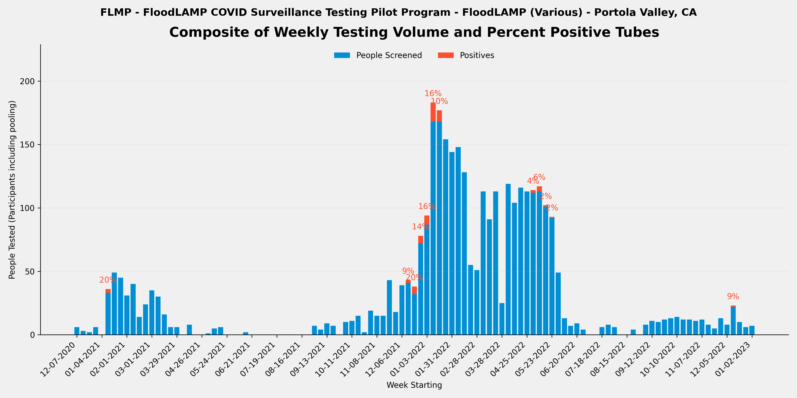
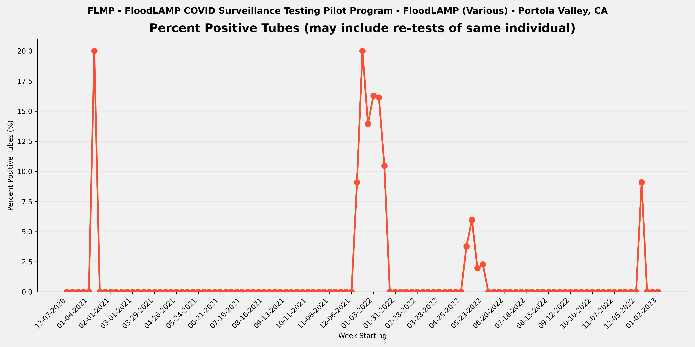
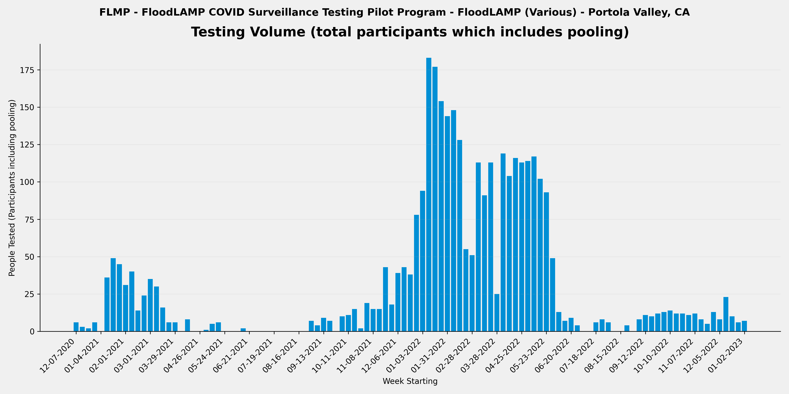

METADATA
last updated: 2026-01-27
file_name: FLMP_pilot-data_summary.md
file_date: 2023-01-02
title: FLMP Pilot Data Summary
category: pilots
subcategory: pilot-data
tags: 
source_file_type: csv
xfile_type: xlsx
gfile_url: NA
xfile_github_download_url: https://raw.githubusercontent.com/FocusOnFoundationsNonprofit/floodlamp-archive/main/pilots/pilot-data/FLMP_xlsx_downloads
pdf_gdrive_url: NA
pdf_github_url: NA
license: CC BY 4.0 - https://creativecommons.org/licenses/by/4.0/
words: 3788
tokens: 7091
notes: 
summary_short: FloodLAMP (FLMP) was the organization's home-base testing in Portola Valley, CA, where FloodLAMP staff tested themselves and their working colleagues along with their household members. The testing used pooled household and individual self-collection across various sites and configurations. The program ran for over 2 years (2020-12-11 to 2023-01-02), testing 1,540 tubes with 3,399 participant results and 57 positive tubes detected. The files for FLMP include all data for the 2 programs Carillon, a local preschool where FloodLAMP founders kids attended (CRLN), and all other FloodLAMP internal and local testing, termed "FloodLAMP Staff Plus" (FLSP). These 2 programs were intermingled and utilized the same FloodLAMP app tenant (instance of the application).

CONTENT

## Plots

### Composite

### Percent Positive Tubes

### Volume

## Files

### Google Sheets URLs
- [FLMP_APS_deID_PUB](https://docs.google.com/spreadsheets/d/1ni39vn-fdXq0HrOgHbim_FK0OZidUv-YBLvzPwhhlFQ/edit?usp=drive_link)
- [FLMP_RFR_deID_PUB](https://docs.google.com/spreadsheets/d/16CwPJ9LeknD8lJFTr-gJSx916WZaGEMbN6iKnlVx4dI/edit?usp=drive_link)
- [FLMP_RTR_deID_PUB](https://docs.google.com/spreadsheets/d/16R3LlannlrGfiIIJq4T3EWjbtFLZrtPC4gkKycu8RXc/edit?usp=drive_link)

### Curated CSVs
- Curated CSV folder: `FLMP_curated_csvs/`
- Stats key-values CSV: [FLMP_APS_stats_key-values.csv](FLMP_curated_csvs/FLMP_APS_stats_key-values.csv)
- Weekly summary CSV: [FLMP_APS_weekly-summary.csv](FLMP_curated_csvs/FLMP_APS_weekly-summary.csv)
- Referral tests by person CSV: _not available_

### XLSX downloads:
- [FLMP_APS_deID_PUB.xlsx](FLMP_xlsx_downloads/FLMP_APS_deID_PUB.xlsx)
- [FLMP_RFR_deID_PUB.xlsx](FLMP_xlsx_downloads/FLMP_RFR_deID_PUB.xlsx)
- [FLMP_RTR_deID_PUB.xlsx](FLMP_xlsx_downloads/FLMP_RTR_deID_PUB.xlsx)

## Key tables

### Stats key-values

| section | metric | value | details | comments | source_sheet | source_row |
| --- | --- | --- | --- | --- | --- | --- |
| Files | RFR File | FLMP_RFR_deID_PUB |  |  | Stats | 1 |
| Files | RTR File | FLMP_RTR_deID_PUB |  |  | Stats | 2 |
| Files | RSR File | NONE |  |  | Stats | 3 |
| Overall | Number of Tubes Tested (initial only - no re-runs) | 1,540 | initial run tubes only so excludes re-runs |  | Stats | 5 |
| Overall | Number of Tube Tests Run (includes re-runs) | 1,618 | includes re-runs |  | Stats | 6 |
| Overall | Number of Initial Runs | 243 |  | divide CRLN by time period 1-2 to 5-31 | Stats | 7 |
| Overall | Number of APS Only Tubes run | 436 |  | divide CRLN by time period 1-2 to 5-31 | Stats | 8 |
| Overall | Number of Test Reactions (RFR plus APS only tubes run) | 1,915 | includes technical replicates (the same tube sample in multiple reactions in the same run) | divide CRLN by time period 1-2 to 5-31 - 135 is num FLSP tubes in CRLN time period and 1290 is num RFR audit rxns during CRLN time period | Stats | 9 |
| Overall | Number of Participant Results | 3,399 | counts individual samples in pools and excludes re-runs |  | Stats | 11 |
| Overall | Number of ARF Tubes | 48 | tubes run and present in RFR but not in Appivo - created tube IDs that start with ARF | all during CRLN period so assign to CRLN | Stats | 12 |
| Overall | Sum of Participant Results plus ARF Tubes | 3,447 | Will be equal to the number of tubes tested if no pooling. |  | Stats | 13 |
| Overall | Average Pool Level (excludes ARF) | 2.3 |  |  | Stats | 14 |
| Re-runs | Number of Run Tubes (re-runs only) | 78 | from RFR Audit Num Run Tubes |  | Stats | 17 |
| Re-runs | Number of Reactions (re-runs only) | 230 | from RFR Audit Num rxns (excl ctrls) |  | Stats | 18 |
| Re-runs | Re-run % of Tubes | 5.1% | re-run / initial |  | Stats | 19 |
| Re-runs | Number of Initial Runs with Re-runs | 37 |  |  | Stats | 20 |
| Re-runs | % Initial Runs with Re-runs | 15.2% |  |  | Stats | 21 |
| Positives | Number of Tubes with Final Result Positive | 57 |  | count from VALUES Pos and Incl | Stats | 24 |
| Positives | % of Tubes Positives (Final Result) | 3.7% |  |  | Stats | 25 |
| Positives | Number of Cases with Final Result Positive (Indiv or Pool) | 19 | Subtract off Re-tests |  | Stats | 26 |
| Positives | Known Positive Cases | 3 | Previous tested (including by FloodLAMP test) or reported positive |  | Stats | 27 |
| Positives | Unknown Positive Cases | 16 |  |  | Stats | 28 |
| Inconclusives | Number of Tubes with Final Result Inconclusive | 4 |  |  | Stats | 31 |
| Inconclusives | Number of Tubes in RFR Audit Inconclusive not in Appivo Final Results | 0 |  |  | Stats | 32 |
| Inconclusives | Total Number of Inconclusive Tubes | 4 |  |  | Stats | 33 |
| Inconclusives | % of Tubes Inconclusive | 0.3% |  |  | Stats | 34 |
| Inconclusives | Number of Inconclusive Tubes resolved Positive by Referral Test or Correspondence | 1 |  | 2022-05-08T00:00:00 | Stats | 35 |
| Inconclusives | % Inconclusives resolved Positive by Referral Tests | 25.0% |  | 2/4 unknown and 1 of those was in household of positives | Stats | 36 |
| Inconclusives | Number of Inconclusive Tubes with Referral Test or Correspondence Negative | 1 |  |  | Stats | 37 |
| Inconclusives | Number of Inconclusive Tubes with no Referral Test result or Correspondence | 2 |  |  | Stats | 38 |
| Inconclusives | Number of Tubes with Initial Inconclusives and Re-run Negative | 36 | Count Result Correction Code=2.5 in preDel col AJ, or from RFR preExcl if not resulted as Incl in App | No 2.5 correction code, Sum AE - AF = 36 | Stats | 39 |
| Inconclusives | Number of Inconclusive Test Run Calls | 43 | includes re-runs - from RFR Audit only and excludes any APS only resulted inconclusives |  | Stats | 40 |
| Inconclusives | % Tube Tests Run Called Inconclusive | 2.7% | includes re-runs |  | Stats | 41 |
| Referrals and Correspondence | Number of FloodLAMP Cases with Referral Tests or Correspondence | 15 | Indiv or Pool, Cases used instead of Person to account for people being contracting COVID multiple times, and instead of Results to exclude re-tests |  | Stats | 44 |
| Referrals and Correspondence | Number of Referral Confirmed FloodLAMP Positives | 14 | Sometimes also termed Agree Positives - Include initial Inconclusive with Referral or Correspondence Positive |  | Stats | 45 |
| Referrals and Correspondence | FL Inconclusives with Referral / Correspondence Positive | 1 |  | 2022-05-08T00:00:00 | Stats | 46 |
| Referrals and Correspondence | % FloodLAMP Positive or Inconclusive with Referral / Correspondence Positive | 100.0% |  |  | Stats | 47 |
| Referrals and Correspondence | FL Inconclusives but Referral / Correspondence Negative | 1 |  | 2022-02-14T00:00:00 | Stats | 48 |
| Referrals and Correspondence | FL Inconclusives with No Referral Tests or Correspondence | 2 |  |  | Stats | 49 |
| Comparison to Antigen | Number of FloodLAMP Test Person Cases with Referral Antigen Tests (including non-Same Day) | 11 |  |  | Stats | 52 |
| Comparison to Antigen | Number of FloodLAMP Test Person Cases with Same Day Referral Antigen Tests | 11 |  |  | Stats | 53 |
| Comparison to Antigen | Number of FloodLAMP Positive Test Person Cases with Same Day Antigen Negative | 5 | Agree with Referral Test Positive (usually PCR or later Antigen) but Initial Antigen Negative |  | Stats | 54 |
| Comparison to Antigen | % Confirmed FloodLAMP Positives with Same Day Antigen Negative | 45.5% |  |  | Stats | 55 |
| Comparison to Antigen | Number of FloodLAMP Positive Test Person Cases confirmed with Referral Tests but Antigen and Other Non-Antigen Test Negative | 1 |  |  | Stats | 56 |
| Comparison to Antigen | % Confirmed FloodLAMP Positives that were Antigen and Other Non-Antigen Test Negative | 9.1% |  |  | Stats | 57 |
| False Calls | False Positives Final Results | 0 | From reviewing APS/Pos and Incl tab Unconfirmed FL Positives |  | Stats | 60 |
| False Calls | False Negative Final Results (Suspected) | 0 | From reviewing Referral Tests by Person and correspondence with Program Admin |  | Stats | 61 |
| People | Number of Unique Individuals Tested | 212 | Includes UnknownPerson additions but not ARF tubes |  | Stats | 64 |
| People | Number of Unique Sponsors | 60 | People who collect using the app |  | Stats | 65 |
| Positivity | Number of Unique Individual Tested FloodLAMP Positive | 26 | includes Inconclusive FloodLAMP result confirmed Positive by follow-up or Referral |  | Stats | 68 |
| Positivity | % of Population FloodLAMP Positive (excluding pools not deconv) | 12.3% |  |  | Stats | 69 |
| Positivity | Number of Unique Individual Tested FloodLAMP Positive (including if in a positive pool) | 52 |  |  | Stats | 70 |
| Positivity | % of Population FloodLAMP Positive (including everyone in a positive pool) | 24.5% |  |  | Stats | 71 |
| Dates | Start Run Date | 2020-12-11 |  |  | Stats | 74 |
| Dates | End Run Date | 2023-01-02 |  |  | Stats | 75 |
| Info | Test Operator | FloodLAMP | Who ran the actual testing (running LAMP reactions) |  | Stats | 78 |
| Info | Test Processing Site | Various | Where the test processing (running LAMP reactions) was done |  | Stats | 79 |
| Info | Population Tested | Staff, Students, Families, Community | Description of the participants |  | Stats | 80 |
| Info | Configuration | Various | Equipment set used for test processing (relates to throughput and type of test tube used) |  | Stats | 81 |
| Info | Collection Type | Pooled Household, Individual | Pooled, Individual, or Both |  | Stats | 82 |
| Info | Self or HCW Collected | Self | HCW is Health Care Worker |  | Stats | 83 |
| Info | App Used? | Yes | Was the FloodLAMP Mobile App and Admin Portal utilized in the program |  | Stats | 84 |
| Info | Bring-up Type | In Person | How the initial setup and validation of the testing site was done |  | Stats | 85 |
| Info | Program Name | FloodLAMP | Shorthand name used internally at FloodLAMP and in other documents for this program |  | Stats | 86 |
| Info | Site | Various | Broader physical space where the testing was done and/or where participants congregated |  | Stats | 87 |
| Info | Site Type | Various | Type of entity or organization receiving the testing program |  | Stats | 88 |
| Info | Location | Portola Valley, CA | Geographical location of where the FloodLAMP testing program occurred |  | Stats | 89 |
| Pooling | Number of Initial FloodLAMP Positive Pools | 13 |  |  | Stats | 92 |
| Pooling | Number of Initial FloodLAMP Positive Pools with Indiv Deconvolution | 8 |  |  | Stats | 93 |
| Pooling | Number of Initial FloodLAMP Positive Pools Confirmed by Referral Testing | 9 |  |  | Stats | 94 |
| Pooling | Number of Initial Confirmed FL Pools where the organization member (i.e. parent or other child) was Positive | 5 |  |  | Stats | 95 |
| Pooling | Number of Initial Confirmed FL Pools where Positive Individual was not the organization member (i.e. parent or other child) | 4 |  |  | Stats | 96 |
| Pooling | % Confirmed Positive Pools where Positive Individual was not the organization member (i.e. parent or other child) | 44.4% |  |  | Stats | 97 |

### Weekly summary

| week_start_date | week_end_date | participants_n | tubes_n | positive_tubes_n | inconclusive_tubes_n | pct_positive | pct_positive_status |
| --- | --- | --- | --- | --- | --- | --- | --- |
| 2020-12-07 | 2020-12-13 | 6 | 2 | 0 | 0 | 0.0% | ok |
| 2020-12-14 | 2020-12-20 | 3 | 1 | 0 | 0 | 0.0% | ok |
| 2020-12-21 | 2020-12-27 | 2 | 1 | 0 | 0 | 0.0% | ok |
| 2020-12-28 | 2021-01-03 | 6 | 2 | 0 | 0 | 0.0% | ok |
| 2021-01-04 | 2021-01-10 | 0 | 0 | 0 | 0 |  | denom_zero |
| 2021-01-11 | 2021-01-17 | 36 | 15 | 3 | 0 | 20.0% | ok |
| 2021-01-18 | 2021-01-24 | 49 | 24 | 0 | 0 | 0.0% | ok |
| 2021-01-25 | 2021-01-31 | 45 | 19 | 0 | 0 | 0.0% | ok |
| 2021-02-01 | 2021-02-07 | 31 | 11 | 0 | 0 | 0.0% | ok |
| 2021-02-08 | 2021-02-14 | 40 | 13 | 0 | 0 | 0.0% | ok |
| 2021-02-15 | 2021-02-21 | 14 | 4 | 0 | 0 | 0.0% | ok |
| 2021-02-22 | 2021-02-28 | 24 | 9 | 0 | 0 | 0.0% | ok |
| 2021-03-01 | 2021-03-07 | 35 | 11 | 0 | 0 | 0.0% | ok |
| 2021-03-08 | 2021-03-14 | 30 | 9 | 0 | 0 | 0.0% | ok |
| 2021-03-15 | 2021-03-21 | 16 | 6 | 0 | 0 | 0.0% | ok |
| 2021-03-22 | 2021-03-28 | 6 | 2 | 0 | 0 | 0.0% | ok |
| 2021-03-29 | 2021-04-04 | 6 | 2 | 0 | 0 | 0.0% | ok |
| 2021-04-05 | 2021-04-11 | 0 | 0 | 0 | 0 |  | denom_zero |
| 2021-04-12 | 2021-04-18 | 8 | 3 | 0 | 0 | 0.0% | ok |
| 2021-04-19 | 2021-04-25 | 0 | 0 | 0 | 0 |  | denom_zero |
| 2021-04-26 | 2021-05-02 | 0 | 0 | 0 | 0 |  | denom_zero |
| 2021-05-03 | 2021-05-09 | 1 | 1 | 0 | 0 | 0.0% | ok |
| 2021-05-10 | 2021-05-16 | 5 | 2 | 0 | 0 | 0.0% | ok |
| 2021-05-17 | 2021-05-23 | 6 | 6 | 0 | 0 | 0.0% | ok |
| 2021-05-24 | 2021-05-30 | 0 | 0 | 0 | 0 |  | denom_zero |
| 2021-05-31 | 2021-06-06 | 0 | 0 | 0 | 0 |  | denom_zero |
| 2021-06-07 | 2021-06-13 | 0 | 0 | 0 | 0 |  | denom_zero |
| 2021-06-14 | 2021-06-20 | 2 | 2 | 0 | 0 | 0.0% | ok |
| 2021-06-21 | 2021-06-27 | 0 | 0 | 0 | 0 |  | denom_zero |
| 2021-06-28 | 2021-07-04 | 0 | 0 | 0 | 0 |  | denom_zero |
| 2021-07-05 | 2021-07-11 | 0 | 0 | 0 | 0 |  | denom_zero |
| 2021-07-12 | 2021-07-18 | 0 | 0 | 0 | 0 |  | denom_zero |
| 2021-07-19 | 2021-07-25 | 0 | 0 | 0 | 0 |  | denom_zero |
| 2021-07-26 | 2021-08-01 | 0 | 0 | 0 | 0 |  | denom_zero |
| 2021-08-02 | 2021-08-08 | 0 | 0 | 0 | 0 |  | denom_zero |
| 2021-08-09 | 2021-08-15 | 0 | 0 | 0 | 0 |  | denom_zero |
| 2021-08-16 | 2021-08-22 | 0 | 0 | 0 | 0 |  | denom_zero |
| 2021-08-23 | 2021-08-29 | 0 | 0 | 0 | 0 |  | denom_zero |
| 2021-08-30 | 2021-09-05 | 7 | 4 | 0 | 0 | 0.0% | ok |
| 2021-09-06 | 2021-09-12 | 4 | 2 | 0 | 0 | 0.0% | ok |
| 2021-09-13 | 2021-09-19 | 9 | 6 | 0 | 0 | 0.0% | ok |
| 2021-09-20 | 2021-09-26 | 7 | 4 | 0 | 0 | 0.0% | ok |
| 2021-09-27 | 2021-10-03 | 0 | 0 | 0 | 0 |  | denom_zero |
| 2021-10-04 | 2021-10-10 | 10 | 7 | 0 | 0 | 0.0% | ok |
| 2021-10-11 | 2021-10-17 | 11 | 5 | 0 | 0 | 0.0% | ok |
| 2021-10-18 | 2021-10-24 | 15 | 8 | 0 | 0 | 0.0% | ok |
| 2021-10-25 | 2021-10-31 | 2 | 2 | 0 | 0 | 0.0% | ok |
| 2021-11-01 | 2021-11-07 | 19 | 9 | 0 | 0 | 0.0% | ok |
| 2021-11-08 | 2021-11-14 | 15 | 6 | 0 | 0 | 0.0% | ok |
| 2021-11-15 | 2021-11-21 | 15 | 6 | 0 | 0 | 0.0% | ok |
| 2021-11-22 | 2021-11-28 | 43 | 12 | 0 | 0 | 0.0% | ok |
| 2021-11-29 | 2021-12-05 | 18 | 8 | 0 | 0 | 0.0% | ok |
| 2021-12-06 | 2021-12-12 | 39 | 19 | 0 | 0 | 0.0% | ok |
| 2021-12-13 | 2021-12-19 | 43 | 22 | 2 | 0 | 9.1% | ok |
| 2021-12-20 | 2021-12-26 | 38 | 30 | 6 | 0 | 20.0% | ok |
| 2021-12-27 | 2022-01-02 | 78 | 43 | 6 | 0 | 14.0% | ok |
| 2022-01-03 | 2022-01-09 | 94 | 43 | 7 | 0 | 16.3% | ok |
| 2022-01-10 | 2022-01-16 | 183 | 93 | 15 | 1 | 16.1% | ok |
| 2022-01-17 | 2022-01-23 | 177 | 86 | 9 | 0 | 10.5% | ok |
| 2022-01-24 | 2022-01-30 | 154 | 65 | 0 | 0 | 0.0% | ok |
| 2022-01-31 | 2022-02-06 | 144 | 59 | 0 | 0 | 0.0% | ok |
| 2022-02-07 | 2022-02-13 | 148 | 60 | 0 | 0 | 0.0% | ok |
| 2022-02-14 | 2022-02-20 | 128 | 54 | 0 | 1 | 0.0% | ok |
| 2022-02-21 | 2022-02-27 | 55 | 21 | 0 | 0 | 0.0% | ok |
| 2022-02-28 | 2022-03-06 | 51 | 25 | 0 | 0 | 0.0% | ok |
| 2022-03-07 | 2022-03-13 | 113 | 52 | 0 | 0 | 0.0% | ok |
| 2022-03-14 | 2022-03-20 | 91 | 42 | 0 | 0 | 0.0% | ok |
| 2022-03-21 | 2022-03-27 | 113 | 47 | 0 | 0 | 0.0% | ok |
| 2022-03-28 | 2022-04-03 | 25 | 12 | 0 | 0 | 0.0% | ok |
| 2022-04-04 | 2022-04-10 | 119 | 47 | 0 | 0 | 0.0% | ok |
| 2022-04-11 | 2022-04-17 | 104 | 43 | 0 | 0 | 0.0% | ok |
| 2022-04-18 | 2022-04-24 | 116 | 53 | 0 | 0 | 0.0% | ok |
| 2022-04-25 | 2022-05-01 | 113 | 48 | 0 | 0 | 0.0% | ok |
| 2022-05-02 | 2022-05-08 | 114 | 53 | 2 | 0 | 3.8% | ok |
| 2022-05-09 | 2022-05-15 | 117 | 67 | 4 | 2 | 6.0% | ok |
| 2022-05-16 | 2022-05-22 | 102 | 51 | 1 | 0 | 2.0% | ok |
| 2022-05-23 | 2022-05-29 | 93 | 44 | 1 | 0 | 2.3% | ok |
| 2022-05-30 | 2022-06-05 | 49 | 22 | 0 | 0 | 0.0% | ok |
| 2022-06-06 | 2022-06-12 | 13 | 7 | 0 | 0 | 0.0% | ok |
| 2022-06-13 | 2022-06-19 | 7 | 5 | 0 | 0 | 0.0% | ok |
| 2022-06-20 | 2022-06-26 | 9 | 3 | 0 | 0 | 0.0% | ok |
| 2022-06-27 | 2022-07-03 | 4 | 3 | 0 | 0 | 0.0% | ok |
| 2022-07-04 | 2022-07-10 | 0 | 0 | 0 | 0 |  | denom_zero |
| 2022-07-11 | 2022-07-17 | 0 | 0 | 0 | 0 |  | denom_zero |
| 2022-07-18 | 2022-07-24 | 6 | 3 | 0 | 0 | 0.0% | ok |
| 2022-07-25 | 2022-07-31 | 8 | 4 | 0 | 0 | 0.0% | ok |
| 2022-08-01 | 2022-08-07 | 6 | 3 | 0 | 0 | 0.0% | ok |
| 2022-08-08 | 2022-08-14 | 0 | 0 | 0 | 0 |  | denom_zero |
| 2022-08-15 | 2022-08-21 | 0 | 0 | 0 | 0 |  | denom_zero |
| 2022-08-22 | 2022-08-28 | 4 | 1 | 0 | 0 | 0.0% | ok |
| 2022-08-29 | 2022-09-04 | 0 | 0 | 0 | 0 |  | denom_zero |
| 2022-09-05 | 2022-09-11 | 8 | 3 | 0 | 0 | 0.0% | ok |
| 2022-09-12 | 2022-09-18 | 11 | 4 | 0 | 0 | 0.0% | ok |
| 2022-09-19 | 2022-09-25 | 10 | 4 | 0 | 0 | 0.0% | ok |
| 2022-09-26 | 2022-10-02 | 12 | 4 | 0 | 0 | 0.0% | ok |
| 2022-10-03 | 2022-10-09 | 13 | 5 | 0 | 0 | 0.0% | ok |
| 2022-10-10 | 2022-10-16 | 14 | 5 | 0 | 0 | 0.0% | ok |
| 2022-10-17 | 2022-10-23 | 12 | 4 | 0 | 0 | 0.0% | ok |
| 2022-10-24 | 2022-10-30 | 12 | 8 | 0 | 0 | 0.0% | ok |
| 2022-10-31 | 2022-11-06 | 11 | 5 | 0 | 0 | 0.0% | ok |
| 2022-11-07 | 2022-11-13 | 12 | 5 | 0 | 0 | 0.0% | ok |
| 2022-11-14 | 2022-11-20 | 8 | 5 | 0 | 0 | 0.0% | ok |
| 2022-11-21 | 2022-11-27 | 5 | 3 | 0 | 0 | 0.0% | ok |
| 2022-11-28 | 2022-12-04 | 13 | 5 | 0 | 0 | 0.0% | ok |
| 2022-12-05 | 2022-12-11 | 8 | 3 | 0 | 0 | 0.0% | ok |
| 2022-12-12 | 2022-12-18 | 23 | 11 | 1 | 0 | 9.1% | ok |
| 2022-12-19 | 2022-12-25 | 10 | 6 | 0 | 0 | 0.0% | ok |
| 2022-12-26 | 2023-01-01 | 6 | 3 | 0 | 0 | 0.0% | ok |
| 2023-01-02 | 2023-01-08 | 7 | 3 | 0 | 0 | 0.0% | ok |
