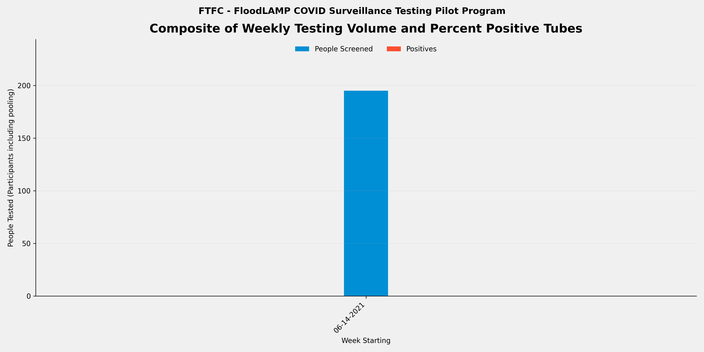
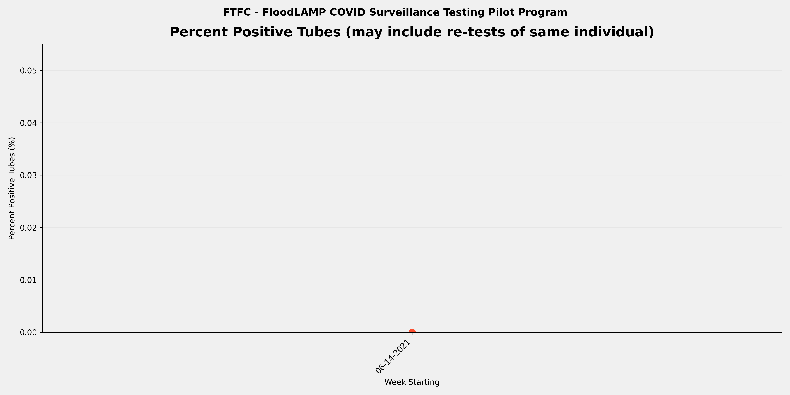
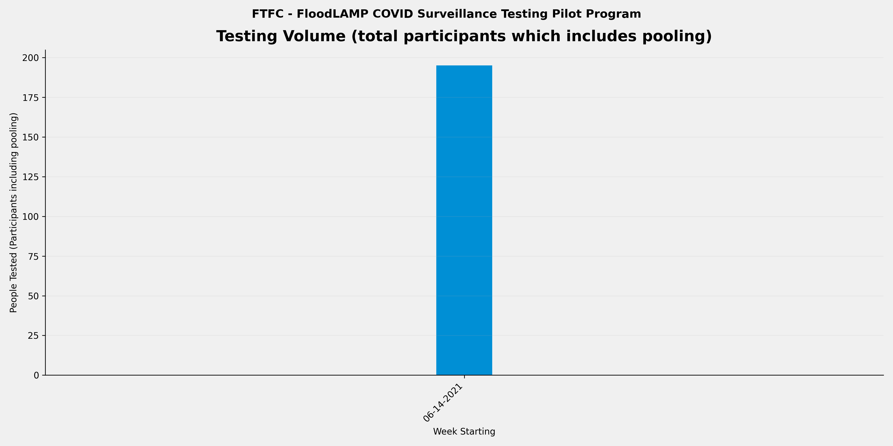

METADATA
last updated: 2026-01-25
file_name: FTFC_pilot-data_summary.md
file_date: 2021-06-18
title: FTFC Pilot Data Summary
category: pilots
subcategory: pilot-data
tags: 
source_file_type: csv
xfile_type: xlsx
gfile_url: NA
xfile_github_download_url: https://raw.githubusercontent.com/FocusOnFoundationsNonprofit/floodlamp-archive/main/pilots/pilot-data/FTFC_xlsx_downloads
pdf_gdrive_url: NA
pdf_github_url: NA
license: CC BY 4.0 - https://creativecommons.org/licenses/by/4.0/
words: 1891
tokens: 2679
notes: 
summary_short: FTFC was a conference-based pilot at the FTFC Eagles EMS Leadership Conference in Ft. Lauderdale, FL, where FloodLAMP staff provided pooled and individual self-collection testing for EMS personnel and conference attendees at the Hard Rock Hotel, Fort Lauderdale. The short 5-day program (2021-06-14 to 2021-06-18) tested 61 tubes from 195 participants with no positive tubes detected. The pop-up "lab" was brought out in a suitcase and setup in a hotel storage room where the sample processing was done.

CONTENT

## Plots

### Composite

### Percent Positive Tubes

### Volume

## Files

### Google Sheets URLs
- [FTFC_STS_PUB](https://docs.google.com/spreadsheets/d/17BcQljnvgzdSLB2KzgH0rrUvjOd44f9CfTAL5_9CTS4/edit?usp=drive_link)

### Curated CSVs
- Curated CSV folder: `FTFC_curated_csvs/`
- Stats key-values CSV: [FTFC_STS_stats_key-values.csv](FTFC_curated_csvs/FTFC_STS_stats_key-values.csv)
- Weekly summary CSV: _not available_
- Referral tests by person CSV: _not available_

### XLSX downloads:
- [FTFC_STS_PUB.xlsx](FTFC_xlsx_downloads/FTFC_STS_PUB.xlsx)

## Key tables

### Stats key-values

| section | metric | value | value_status | details | comments | source_sheet | source_row |
| --- | --- | --- | --- | --- | --- | --- | --- |
| Files | RFR or APS Files | NONE | ok |  |  | Stats | 1 |
| Files | RTR File | NONE | ok |  |  | Stats | 2 |
| Files | RSR File | NONE | ok |  |  | Stats | 3 |
| Overall | Number of Tubes Tested (initial only - no re-runs) | 61 | ok | initial run tubes only so excludes re-runs | all data from gsheet: Data Stats - Compilation PRE DP - Compilation tab (APS RAW data not available) | Stats | 5 |
| Overall | Number of Tube Tests Run (includes re-runs) | 61 | ok | includes re-runs |  | Stats | 6 |
| Overall | Number of Initial Runs |  | not_available |  |  | Stats | 7 |
| Overall | Number of APS Only Tubes run |  | not_available |  |  | Stats | 8 |
| Overall | Number of Test Reactions (RFR plus APS only tubes run) | 61 | ok | includes technical replicates (the same tube sample in multiple reactions in the same run) |  | Stats | 9 |
| Overall | Number of Participant Results | 195 | ok | counts individual samples in pools and excludes re-runs |  | Stats | 11 |
| Overall | Number of ARF Tubes | 0 | ok | tubes run and present in RFR but not in Appivo - created tube IDs that start with ARF |  | Stats | 12 |
| Overall | Sum of Participant Results plus ARF Tubes | 195 | ok | Will be equal to the number of tubes tested if no pooling. |  | Stats | 13 |
| Overall | Average Pool Level (excludes ARF) | 3.2 | ok |  |  | Stats | 14 |
| Re-runs | Number of Run Tubes (re-runs only) |  | not_available | from RFR Audit Num Run Tubes |  | Stats | 17 |
| Re-runs | Number of Reactions (re-runs only) |  | not_available | from RFR Audit Num rxns (excl ctrls) |  | Stats | 18 |
| Re-runs | Re-run % of Tubes |  | not_available | re-run / initial |  | Stats | 19 |
| Re-runs | Number of Initial Runs with Re-runs |  | not_available |  |  | Stats | 20 |
| Re-runs | % Initial Runs with Re-runs |  | not_available |  |  | Stats | 21 |
| Positives | Number of Tubes with Final Result Positive | 0 | ok |  |  | Stats | 24 |
| Positives | % of Tubes Positives (Final Result) | 0.0% | ok |  |  | Stats | 25 |
| Positives | Number of Cases with Final Result Positive (Indiv or Pool) | 0 | ok | Subtract off Re-tests |  | Stats | 26 |
| Positives | Known Positive Cases | 0 | ok | Previous tested (including by FloodLAMP test) or reported positive |  | Stats | 27 |
| Positives | Unknown Positive Cases | 0 | ok |  |  | Stats | 28 |
| Inconclusives | Number of Tubes with Final Result Inconclusive | 0 | ok |  |  | Stats | 31 |
| Inconclusives | Number of Tubes in RFR Audit Inconclusive not in Appivo Final Results |  | not_available |  | Not Applicable - No RFR | Stats | 32 |
| Inconclusives | Total Number of Inconclusive Tubes | 0 | ok |  |  | Stats | 33 |
| Inconclusives | % of Tubes Inconclusive | 0.0% | ok |  |  | Stats | 34 |
| Inconclusives | Number of Inconclusive Tubes resolved Positive by Referral Test or Correspondence | 0 | ok |  |  | Stats | 35 |
| Inconclusives | % Inconclusives resolved Positive by Referral Tests |  | denom_zero |  | denom zero | Stats | 36 |
| Inconclusives | Number of Inconclusive Tubes with Referral Test or Correspondence Negative | 0 | ok |  |  | Stats | 37 |
| Inconclusives | Number of Inconclusive Tubes with no Referral Test result or Correspondence | 0 | ok |  |  | Stats | 38 |
| Inconclusives | Number of Tubes with Initial Inconclusives and Re-run Negative | 0 | ok | Count Result Correction Code=2.5 in preDel col AJ, or from RFR preExcl if not resulted as Incl in App |  | Stats | 39 |
| Inconclusives | Number of Inconclusive Test Run Calls | 0 | ok | includes re-runs - from RFR Audit only and excludes any APS only resulted inconclusives |  | Stats | 40 |
| Inconclusives | % Tube Tests Run Called Inconclusive | 0.0% | ok | includes re-runs |  | Stats | 41 |
| Referrals and Correspondence | Number of FloodLAMP Cases with Referral Tests or Correspondence | 0 | ok | Indiv or Pool, Cases used instead of Person to account for people being contracting COVID multiple times, and instead of Results to exclude re-tests |  | Stats | 44 |
| Referrals and Correspondence | Number of Referral Confirmed FloodLAMP Positives | 0 | ok | Sometimes also termed Agree Positives - Include initial Inconclusive with Referral or Correspondence Positive |  | Stats | 45 |
| Referrals and Correspondence | FL Inconclusives with Referral / Correspondence Positive | 0 | ok |  |  | Stats | 46 |
| Referrals and Correspondence | % FloodLAMP Positive or Inconclusive with Referral / Correspondence Positive |  | denom_zero |  | denom zero | Stats | 47 |
| Referrals and Correspondence | FL Inconclusives but Referral / Correspondence Negative | 0 | ok |  |  | Stats | 48 |
| Referrals and Correspondence | FL Inconclusives with No Referral Tests or Correspondence | 0 | ok |  |  | Stats | 49 |
| Comparison to Antigen | Number of FloodLAMP Test Person Cases with Referral Antigen Tests (including non-Same Day) |  | not_available |  | Not Applicable - no positives | Stats | 52 |
| Comparison to Antigen | Number of FloodLAMP Test Person Cases with Same Day Referral Antigen Tests |  | not_available |  | Not Applicable - no positives | Stats | 53 |
| Comparison to Antigen | Number of FloodLAMP Positive Test Person Cases with Same Day Antigen Negative |  | not_available | Agree with Referral Test Positive (usually PCR or later Antigen) but Initial Antigen Negative | Not Applicable - no positives | Stats | 54 |
| Comparison to Antigen | % Confirmed FloodLAMP Positives with Same Day Antigen Negative |  | not_available |  | Not Applicable - no positives | Stats | 55 |
| Comparison to Antigen | Number of FloodLAMP Positive Test Person Cases confirmed with Referral Tests but Antigen and Other Non-Antigen Test Negative |  | not_available |  | Not Applicable - no positives | Stats | 56 |
| Comparison to Antigen | % Confirmed FloodLAMP Positives that were Antigen and Other Non-Antigen Test Negative |  | not_available |  |  | Stats | 57 |
| False Calls | False Positives Final Results | 0 | ok | From reviewing APS/Pos and Incl tab Unconfirmed FL Positives |  | Stats | 60 |
| False Calls | False Negative Final Results (Suspected) | 0 | ok | From reviewing Referral Tests by Person and correspondence with Program Admin |  | Stats | 61 |
| People | Number of Unique Individuals Tested | 195 | ok | Includes UnknownPerson additions but not ARF tubes |  | Stats | 64 |
| People | Number of Unique Sponsors | 4 | ok | People who collect using the app |  | Stats | 65 |
| Positivity | Number of Unique Individual Tested FloodLAMP Positive | 0 | ok | includes Inconclusive FloodLAMP result confirmed Positive by follow-up or Referral |  | Stats | 68 |
| Positivity | % of Population FloodLAMP Positive (excluding pools not deconv) | 0.0% | ok |  |  | Stats | 69 |
| Positivity | Number of Unique Individual Tested FloodLAMP Positive (including if in a positive pool) | 0 | ok |  |  | Stats | 70 |
| Positivity | % of Population FloodLAMP Positive (including everyone in a positive pool) | 0.0% | ok |  |  | Stats | 71 |
| Dates | Start Run Date | 2021-06-14 | ok |  |  | Stats | 74 |
| Dates | End Run Date | 2021-06-18 | ok |  |  | Stats | 75 |
| Info | Test Operator | FloodLAMP | ok | Who ran the actual testing (running LAMP reactions) |  | Stats | 78 |
| Info | Test Processing Site | Hotel Storage Room | ok | Where the test processing (running LAMP reactions) was done |  | Stats | 79 |
| Info | Population Tested | EMS, Conference Attendees | ok | Description of the participants |  | Stats | 80 |
| Info | Configuration | Standard | ok | Equipment set used for test processing (relates to throughput and type of test tube used) |  | Stats | 81 |
| Info | Collection Type | Pooled & Individual | ok | Pooled, Individual, or Both |  | Stats | 82 |
| Info | Self or HCW Collected | Self | ok | HCW is Health Care Worker |  | Stats | 83 |
| Info | App Used? | Yes | ok | Was the FloodLAMP Mobile App and Admin Portal utilized in the program |  | Stats | 84 |
| Info | Bring-up Type | In Person | ok | How the initial setup and validation of the testing site was done |  | Stats | 85 |
| Info | Program Name | FTFC | ok | Shorthand name used internally at FloodLAMP and in other documents for this program |  | Stats | 86 |
| Info | Site | Hard Rock Hotel | ok | Broader physical space where the testing was done and/or where participants congregated |  | Stats | 87 |
| Info | Site Type | Conference | ok | Type of entity or organization receiving the testing program |  | Stats | 88 |
| Info | Location | Ft. Lauderdale, FL | ok | Geographical location of where the FloodLAMP testing program occurred |  | Stats | 89 |
| Info | Event | FTFC Eagles - EMS Leadership Conference | ok |  |  | Stats | 90 |

### Weekly summary

_Weekly summary CSV not found for this site._
