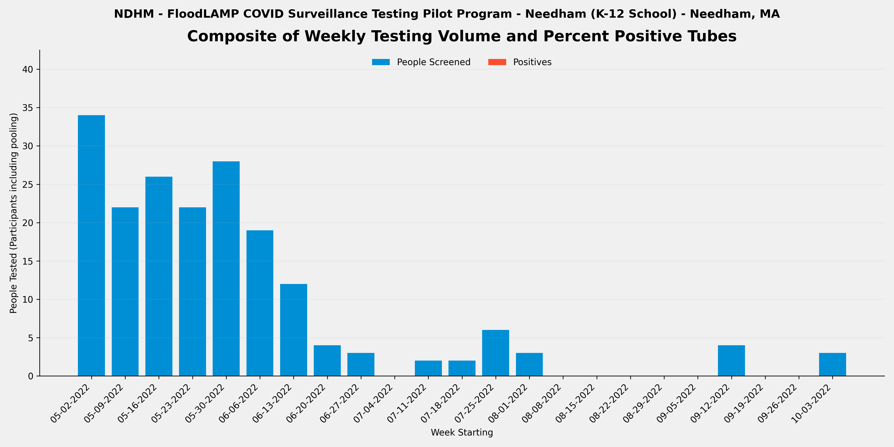
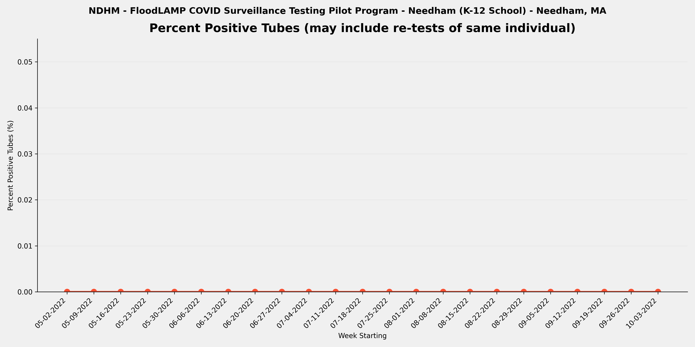
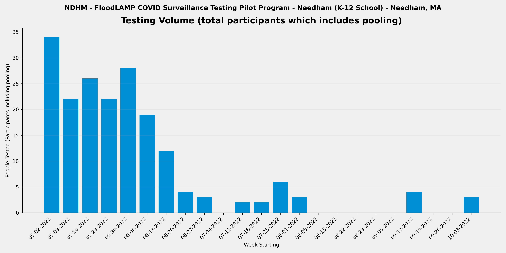

METADATA
last updated: 2026-01-25
file_name: NDHM_pilot-data_summary.md
file_date: 2022-10-03
title: NDHM Pilot Data Summary
category: pilots
subcategory: pilot-data
tags: 
source_file_type: csv
xfile_type: xlsx
gfile_url: NA
xfile_github_download_url: https://raw.githubusercontent.com/FocusOnFoundationsNonprofit/floodlamp-archive-wip/main/pilots/pilot-data/NDHM_xlsx_downloads
pdf_gdrive_url: NA
pdf_github_url: NA
license: CC BY 4.0 - https://creativecommons.org/licenses/by/4.0/
words: 2266
tokens: 3629
notes: 
summary_short: Needham Beth Shalom School (NDHM) was a K-12 school in Needham, MA that used FloodLAMP for pooled household self-collection testing, with on-site test processing by school staff using a standard configuration. The program tested students, staff, and their families over 5 months (2022-05-02 to 2022-10-03), running 80 tubes from 190 participant results with no positive tubes detected.

CONTENT

## Plots

### Composite

### Percent Positive Tubes

### Volume

## Files

### Google Sheets URLs
- [NDHM_APS_deID_PUB](https://docs.google.com/spreadsheets/d/19gjZ2g6wjAQfB0WsPoEvDEr3R4sIK6sjT3g2ofL9Qeo/edit?usp=drive_link)
- [NDHM_RFR_deID_PUB](https://docs.google.com/spreadsheets/d/1SUcXSa-1wQggm8krA_VdFDp4_FCO_v1Xfrp78ITCjjQ/edit?usp=drive_link)

### Curated CSVs
- Curated CSV folder: `NDHM_curated_csvs/`
- Stats key-values CSV: [NDHM_APS_stats_key-values.csv](NDHM_curated_csvs/NDHM_APS_stats_key-values.csv)
- Weekly summary CSV: [NDHM_APS_weekly-summary.csv](NDHM_curated_csvs/NDHM_APS_weekly-summary.csv)
- Referral tests by person CSV: _not available_

### XLSX downloads:
- [NDHM_APS_deID_PUB.xlsx](NDHM_xlsx_downloads/NDHM_APS_deID_PUB.xlsx)
- [NDHM_RFR_deID_PUB.xlsx](NDHM_xlsx_downloads/NDHM_RFR_deID_PUB.xlsx)

## Key tables

### Stats key-values

| section | metric | value | value_status | details | comments | source_sheet | source_row |
| --- | --- | --- | --- | --- | --- | --- | --- |
| Files | RFR File | NDHM_RFR_deID_PUB | ok |  |  | Stats | 1 |
| Files | RTR File | NONE | ok |  |  | Stats | 2 |
| Files | RSR File | NONE | ok |  |  | Stats | 3 |
| Overall | Number of Tubes Tested (initial only - no re-runs) | 80 | ok | initial run tubes only so excludes re-runs |  | Stats | 5 |
| Overall | Number of Tube Tests Run (includes re-runs) | 85 | ok | includes re-runs |  | Stats | 6 |
| Overall | Number of Initial Runs | 15 | ok |  |  | Stats | 7 |
| Overall | Number of APS Only Tubes run | 0 | ok |  |  | Stats | 8 |
| Overall | Number of Test Reactions (RFR plus APS only tubes run) | 109 | ok | includes technical replicates (the same tube sample in multiple reactions in the same run) |  | Stats | 9 |
| Overall | Number of Participant Results | 190 | ok | counts individual samples in pools and excludes re-runs |  | Stats | 11 |
| Overall | Number of ARF Tubes | 2 | ok | tubes run and present in RFR but not in Appivo - created tube IDs that start with ARF |  | Stats | 12 |
| Overall | Sum of Participant Results plus ARF Tubes | 192 | ok | Will be equal to the number of tubes tested if no pooling. |  | Stats | 13 |
| Overall | Average Pool Level (excludes ARF) | 2.4 | ok |  |  | Stats | 14 |
| Re-runs | Number of Run Tubes (re-runs only) | 5 | ok | from RFR Audit Num Run Tubes |  | Stats | 17 |
| Re-runs | Number of Reactions (re-runs only) | 18 | ok | from RFR Audit Num rxns (excl ctrls) |  | Stats | 18 |
| Re-runs | Re-run % of Tubes | 6.2% | ok | re-run / initial |  | Stats | 19 |
| Re-runs | Number of Initial Runs with Re-runs | 3 | ok |  |  | Stats | 20 |
| Re-runs | % Initial Runs with Re-runs | 20.0% | ok |  |  | Stats | 21 |
| Positives | Number of Tubes with Final Result Positive | 0 | ok |  |  | Stats | 24 |
| Positives | % of Tubes Positives (Final Result) |  | not_available |  |  | Stats | 25 |
| Positives | Number of Cases with Final Result Positive (Indiv or Pool) | 0 | ok | Subtract off Re-tests |  | Stats | 26 |
| Positives | Known Positive Cases | 0 | ok | Previous tested (including by FloodLAMP test) or reported positive |  | Stats | 27 |
| Positives | Unknown Positive Cases | 0 | ok |  |  | Stats | 28 |
| Inconclusives | Number of Tubes with Final Result Inconclusive | 0 | ok |  |  | Stats | 31 |
| Inconclusives | Number of Tubes in RFR Audit Inconclusive not in Appivo Final Results | 0 | ok |  |  | Stats | 32 |
| Inconclusives | Total Number of Inconclusive Tubes | 0 | ok |  |  | Stats | 33 |
| Inconclusives | % of Tubes Inconclusive |  | not_available |  |  | Stats | 34 |
| Inconclusives | Number of Inconclusive Tubes resolved Positive by Referral Test or Correspondence | 0 | ok |  |  | Stats | 35 |
| Inconclusives | % Inconclusives resolved Positive by Referral Tests |  | not_available |  |  | Stats | 36 |
| Inconclusives | Number of Inconclusive Tubes with Referral Test or Correspondence Negative | 0 | ok |  |  | Stats | 37 |
| Inconclusives | Number of Inconclusive Tubes with no Referral Test result or Correspondence | 0 | ok |  |  | Stats | 38 |
| Inconclusives | Number of Tubes with Initial Inconclusives and Re-run Negative | 3 | ok | Count Result Correction Code=2.5 in preDel col AJ, or from RFR preExcl if not resulted as Incl in App |  | Stats | 39 |
| Inconclusives | Number of Inconclusive Test Run Calls | 4 | ok | includes re-runs - from RFR Audit only and excludes any APS only resulted inconclusives |  | Stats | 40 |
| Inconclusives | % Tube Tests Run Called Inconclusive | 4.7% | ok | includes re-runs |  | Stats | 41 |
| Referrals and Correspondence | Number of FloodLAMP Cases with Referral Tests or Correspondence | 0 | ok | Indiv or Pool, Cases used instead of Person to account for people being contracting COVID multiple times, and instead of Results to exclude re-tests |  | Stats | 44 |
| Referrals and Correspondence | Number of Referral Confirmed FloodLAMP Positives | 0 | ok | Sometimes also termed Agree Positives - Include initial Inconclusive with Referral or Correspondence Positive |  | Stats | 45 |
| Referrals and Correspondence | FL Inconclusives with Referral / Correspondence Positive | 0 | ok |  |  | Stats | 46 |
| Referrals and Correspondence | % FloodLAMP Positive or Inconclusive with Referral / Correspondence Positive |  | denom_zero |  | denom zero | Stats | 47 |
| Referrals and Correspondence | FL Inconclusives but Referral / Correspondence Negative | 0 | ok |  |  | Stats | 48 |
| Referrals and Correspondence | FL Inconclusives with No Referral Tests or Correspondence | 0 | ok |  |  | Stats | 49 |
| Comparison to Antigen | Number of FloodLAMP Test Person Cases with Referral Antigen Tests (including non-Same Day) |  | not_available |  | Not Applicable - no positives | Stats | 52 |
| Comparison to Antigen | Number of FloodLAMP Test Person Cases with Same Day Referral Antigen Tests |  | not_available |  | Not Applicable - no positives | Stats | 53 |
| Comparison to Antigen | Number of FloodLAMP Positive Test Person Cases with Same Day Antigen Negative |  | not_available | Agree with Referral Test Positive (usually PCR or later Antigen) but Initial Antigen Negative | Not Applicable - no positives | Stats | 54 |
| Comparison to Antigen | % Confirmed FloodLAMP Positives with Same Day Antigen Negative |  | not_available |  | Not Applicable - no positives | Stats | 55 |
| Comparison to Antigen | Number of FloodLAMP Positive Test Person Cases confirmed with Referral Tests but Antigen and Other Non-Antigen Test Negative |  | not_available |  | Not Applicable - no positives | Stats | 56 |
| Comparison to Antigen | % Confirmed FloodLAMP Positives that were Antigen and Other Non-Antigen Test Negative |  | not_available |  |  | Stats | 57 |
| False Calls | False Positives Final Results | 0 | ok | From reviewing APS/Pos and Incl tab Unconfirmed FL Positives |  | Stats | 60 |
| False Calls | False Negative Final Results (Suspected) | 0 | ok | From reviewing Referral Tests by Person and correspondence with Program Admin |  | Stats | 61 |
| People | Number of Unique Individuals Tested | 130 | ok | Includes UnknownPerson additions but not ARF tubes |  | Stats | 64 |
| People | Number of Unique Sponsors | 19 | ok | People who collect using the app |  | Stats | 65 |
| Positivity | Number of Unique Individual Tested FloodLAMP Positive | 0 | ok | includes Inconclusive FloodLAMP result confirmed Positive by follow-up or Referral |  | Stats | 68 |
| Positivity | % of Population FloodLAMP Positive (excluding pools not deconv) | 0.0% | ok |  |  | Stats | 69 |
| Positivity | Number of Unique Individual Tested FloodLAMP Positive (including if in a positive pool) | 0 | ok |  |  | Stats | 70 |
| Positivity | % of Population FloodLAMP Positive (including everyone in a positive pool) | 0.0% | ok |  |  | Stats | 71 |
| Dates | Start Run Date | 2022-05-02 | ok |  |  | Stats | 74 |
| Dates | End Run Date | 2022-10-03 | ok |  |  | Stats | 75 |
| Info | Test Operator | Needham Beth Shalom School | ok | Who ran the actual testing (running LAMP reactions) |  | Stats | 78 |
| Info | Test Processing Site | Office Space | ok | Where the test processing (running LAMP reactions) was done |  | Stats | 79 |
| Info | Population Tested | Students, Staff, Families | ok | Description of the participants |  | Stats | 80 |
| Info | Configuration | Standard | ok | Equipment set used for test processing (relates to throughput and type of test tube used) |  | Stats | 81 |
| Info | Collection Type | Pooled Household | ok | Pooled, Individual, or Both |  | Stats | 82 |
| Info | Self or HCW Collected | Self | ok | HCW is Health Care Worker |  | Stats | 83 |
| Info | App Used? | Yes | ok | Was the FloodLAMP Mobile App and Admin Portal utilized in the program |  | Stats | 84 |
| Info | Bring-up Type | In Person & Remote | ok | How the initial setup and validation of the testing site was done |  | Stats | 85 |
| Info | Program Name | Needham | ok | Shorthand name used internally at FloodLAMP and in other documents for this program |  | Stats | 86 |
| Info | Site | Needham Beth Shalom School | ok | Broader physical space where the testing was done and/or where participants congregated |  | Stats | 87 |
| Info | Site Type | K-12 School | ok | Type of entity or organization receiving the testing program |  | Stats | 88 |
| Info | Location | Needham, MA | ok | Geographical location of where the FloodLAMP testing program occurred |  | Stats | 89 |

### Weekly summary

| week_start_date | week_end_date | participants_n | tubes_n | positive_tubes_n | inconclusive_tubes_n | pct_positive | pct_positive_status |
| --- | --- | --- | --- | --- | --- | --- | --- |
| 2022-05-02 | 2022-05-08 | 34 | 17 | 0 | 0 | 0.0% | ok |
| 2022-05-09 | 2022-05-15 | 22 | 9 | 0 | 0 | 0.0% | ok |
| 2022-05-16 | 2022-05-22 | 26 | 10 | 0 | 0 | 0.0% | ok |
| 2022-05-23 | 2022-05-29 | 22 | 8 | 0 | 0 | 0.0% | ok |
| 2022-05-30 | 2022-06-05 | 28 | 13 | 0 | 0 | 0.0% | ok |
| 2022-06-06 | 2022-06-12 | 19 | 8 | 0 | 0 | 0.0% | ok |
| 2022-06-13 | 2022-06-19 | 12 | 4 | 0 | 0 | 0.0% | ok |
| 2022-06-20 | 2022-06-26 | 4 | 2 | 0 | 0 | 0.0% | ok |
| 2022-06-27 | 2022-07-03 | 3 | 1 | 0 | 0 | 0.0% | ok |
| 2022-07-04 | 2022-07-10 | 0 | 0 | 0 | 0 |  | denom_zero |
| 2022-07-11 | 2022-07-17 | 2 | 1 | 0 | 0 | 0.0% | ok |
| 2022-07-18 | 2022-07-24 | 2 | 1 | 0 | 0 | 0.0% | ok |
| 2022-07-25 | 2022-07-31 | 6 | 3 | 0 | 0 | 0.0% | ok |
| 2022-08-01 | 2022-08-07 | 3 | 1 | 0 | 0 | 0.0% | ok |
| 2022-08-08 | 2022-08-14 | 0 | 0 | 0 | 0 |  | denom_zero |
| 2022-08-15 | 2022-08-21 | 0 | 0 | 0 | 0 |  | denom_zero |
| 2022-08-22 | 2022-08-28 | 0 | 0 | 0 | 0 |  | denom_zero |
| 2022-08-29 | 2022-09-04 | 0 | 0 | 0 | 0 |  | denom_zero |
| 2022-09-05 | 2022-09-11 | 0 | 0 | 0 | 0 |  | denom_zero |
| 2022-09-12 | 2022-09-18 | 4 | 1 | 0 | 0 | 0.0% | ok |
| 2022-09-19 | 2022-09-25 | 0 | 0 | 0 | 0 |  | denom_zero |
| 2022-09-26 | 2022-10-02 | 0 | 0 | 0 | 0 |  | denom_zero |
| 2022-10-03 | 2022-10-09 | 3 | 1 | 0 | 0 | 0.0% | ok |
