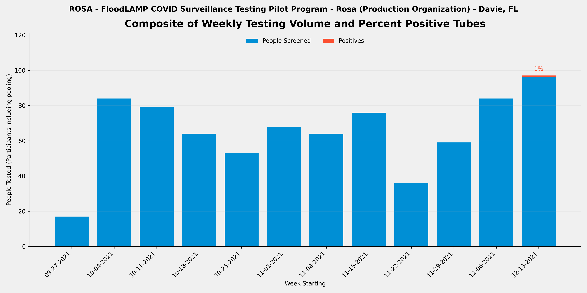
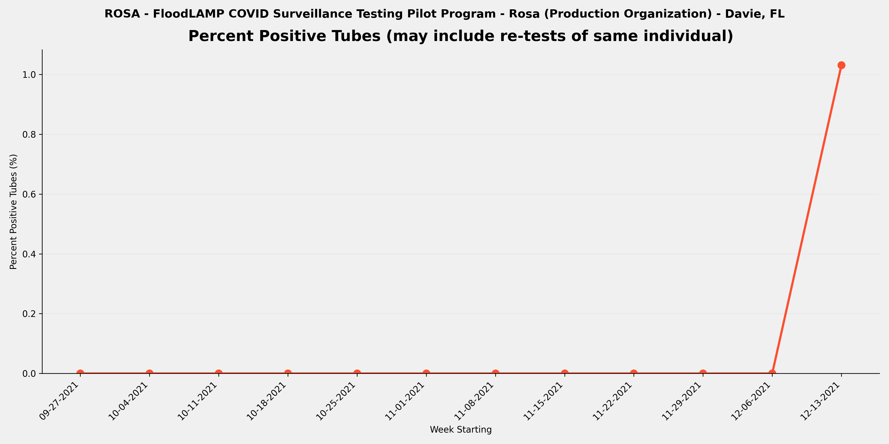
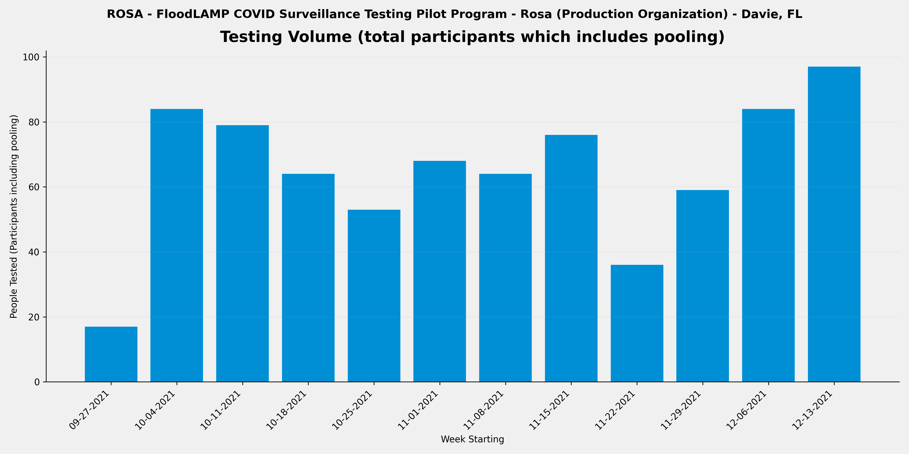

METADATA
last updated: 2026-01-25
file_name: ROSA_pilot-data_summary.md
file_date: 2021-12-17
title: ROSA Pilot Data Summary
category: pilots
subcategory: pilot-data
tags: 
source_file_type: csv
xfile_type: xlsx
gfile_url: NA
xfile_github_download_url: https://raw.githubusercontent.com/FocusOnFoundationsNonprofit/floodlamp-archive-wip/main/pilots/pilot-data/ROSA_xlsx_downloads
pdf_gdrive_url: NA
pdf_github_url: NA
license: CC BY 4.0 - https://creativecommons.org/licenses/by/4.0/
words: 2179
tokens: 3349
notes: 
summary_short: Rosa (ROSA) was a TV production FloodLAMP supported pilot program in Davie, FL, where Davie Fire and Rescue operated surveillance testing for individual (non-pooled) HCW-collected testing of TV production staff at the production set. The program ran over 3 months (2021-09-28 to 2021-12-17), testing 781 tubes from 156 unique individuals with 1 positive tube detected, which was confirmed with antigen testing.

CONTENT

## Plots

### Composite

### Percent Positive Tubes

### Volume

## Files

### Google Sheets URLs
- [ROSA_APS_deID_PUB](https://docs.google.com/spreadsheets/d/1pUr7UFD7gL4bUr6uBSe-H4rqQol5CwoGmRylvzEodEc/edit?usp=drive_link)
- [ROSA_RSR_deID_PUB](https://docs.google.com/spreadsheets/d/12oIWiJjYQ8z--l4YUoXnmq9m-1pF0feO6-mnHIsSdiA/edit?usp=drive_link)

### Curated CSVs
- Curated CSV folder: `ROSA_curated_csvs/`
- Stats key-values CSV: [ROSA_APS_stats_key-values.csv](ROSA_curated_csvs/ROSA_APS_stats_key-values.csv)
- Weekly summary CSV: [ROSA_APS_weekly-summary.csv](ROSA_curated_csvs/ROSA_APS_weekly-summary.csv)
- Referral tests by person CSV: _not available_

### XLSX downloads:
- [ROSA_APS_deID_PUB.xlsx](ROSA_xlsx_downloads/ROSA_APS_deID_PUB.xlsx)
- [ROSA_RSR_deID_PUB.xlsx](ROSA_xlsx_downloads/ROSA_RSR_deID_PUB.xlsx)

## Key tables

### Stats key-values

| section | metric | value | value_status | details | comments | source_sheet | source_row |
| --- | --- | --- | --- | --- | --- | --- | --- |
| Files | RFR File | NONE | ok |  |  | Stats | 1 |
| Files | RTR File | NONE | ok |  |  | Stats | 2 |
| Files | RSR File | ROSA_RSR_deID_PUB | ok |  |  | Stats | 3 |
| Overall | Number of Tubes Tested (initial only - no re-runs) | 781 | ok | initial run tubes only so excludes re-runs | only indiv testing - no pools. total 785 from RSR - Run Summary Report that draws from google form of weekly testing summary provided by test Admin | Stats | 5 |
| Overall | Number of Tube Tests Run (includes re-runs) | 781 | ok | includes re-runs | no RFR so no info on re-runs | Stats | 6 |
| Overall | Number of Initial Runs | 53 | ok |  | use collection date assuming all tubes run same day | Stats | 7 |
| Overall | Number of APS Only Tubes run | 781 | ok |  | No RFR so all tubes are APS Only | Stats | 8 |
| Overall | Number of Test Reactions (RFR plus APS only tubes run) | 781 | ok | includes technical replicates (the same tube sample in multiple reactions in the same run) |  | Stats | 9 |
| Overall | Number of Participant Results | 781 | ok | counts individual samples in pools and excludes re-runs |  | Stats | 11 |
| Overall | Number of ARF Tubes | 0 | ok | tubes run and present in RFR but not in Appivo - created tube IDs that start with ARF |  | Stats | 12 |
| Overall | Sum of Participant Results plus ARF Tubes | 781 | ok | Will be equal to the number of tubes tested if no pooling. |  | Stats | 13 |
| Overall | Average Pool Level (excludes ARF) | 1.0 | ok |  |  | Stats | 14 |
| Re-runs | Number of Run Tubes (re-runs only) |  | not_available | from RFR Audit Num Run Tubes |  | Stats | 17 |
| Re-runs | Number of Reactions (re-runs only) |  | not_available | from RFR Audit Num rxns (excl ctrls) |  | Stats | 18 |
| Re-runs | Re-run % of Tubes |  | not_available | re-run / initial |  | Stats | 19 |
| Re-runs | Number of Initial Runs with Re-runs |  | not_available |  |  | Stats | 20 |
| Re-runs | % Initial Runs with Re-runs |  | not_available |  |  | Stats | 21 |
| Positives | Number of Tubes with Final Result Positive | 1 | ok |  |  | Stats | 24 |
| Positives | % of Tubes Positives (Final Result) | 0.1% | ok |  |  | Stats | 25 |
| Positives | Number of Cases with Final Result Positive (Indiv or Pool) | 1 | ok | Subtract off Re-tests |  | Stats | 26 |
| Positives | Known Positive Cases | 0 | ok | Previous tested (including by FloodLAMP test) or reported positive |  | Stats | 27 |
| Positives | Unknown Positive Cases | 1 | ok |  |  | Stats | 28 |
| Inconclusives | Number of Tubes with Final Result Inconclusive | 0 | ok |  | from RSR - Run Summary Report that draws from google form of weekly testing summary provided by test Admin | Stats | 31 |
| Inconclusives | Number of Tubes in RFR Audit Inconclusive not in Appivo Final Results |  | not_available |  | Not Applicable - No RFR | Stats | 32 |
| Inconclusives | Total Number of Inconclusive Tubes | 0 | ok |  |  | Stats | 33 |
| Inconclusives | % of Tubes Inconclusive | 0.0% | ok |  |  | Stats | 34 |
| Inconclusives | Number of Inconclusive Tubes resolved Positive by Referral Test or Correspondence | 0 | ok |  |  | Stats | 35 |
| Inconclusives | % Inconclusives resolved Positive by Referral Tests |  | denom_zero |  | denom zero | Stats | 36 |
| Inconclusives | Number of Inconclusive Tubes with Referral Test or Correspondence Negative | 0 | ok |  |  | Stats | 37 |
| Inconclusives | Number of Inconclusive Tubes with no Referral Test result or Correspondence | 0 | ok |  |  | Stats | 38 |
| Inconclusives | Number of Tubes with Initial Inconclusives and Re-run Negative | 1 | ok | Count Result Correction Code=2.5 in preDel col AJ, or from RFR preExcl if not resulted as Incl in App |  | Stats | 39 |
| Inconclusives | Number of Inconclusive Test Run Calls | 1 | ok | includes re-runs - from RFR Audit only and excludes any APS only resulted inconclusives |  | Stats | 40 |
| Inconclusives | % Tube Tests Run Called Inconclusive | 0.1% | ok | includes re-runs |  | Stats | 41 |
| Referrals and Correspondence | Number of FloodLAMP Cases with Referral Tests or Correspondence | 1 | ok | Indiv or Pool, Cases used instead of Person to account for people being contracting COVID multiple times, and instead of Results to exclude re-tests | Single pos case was confirmed with same day pos antigen test (RT Jan26 email) | Stats | 44 |
| Referrals and Correspondence | Number of Referral Confirmed FloodLAMP Positives | 1 | ok | Sometimes also termed Agree Positives - Include initial Inconclusive with Referral or Correspondence Positive |  | Stats | 45 |
| Referrals and Correspondence | FL Inconclusives with Referral / Correspondence Positive | 0 | ok |  |  | Stats | 46 |
| Referrals and Correspondence | % FloodLAMP Positive or Inconclusive with Referral / Correspondence Positive | 100.0% | ok |  |  | Stats | 47 |
| Referrals and Correspondence | FL Inconclusives but Referral / Correspondence Negative | 0 | ok |  |  | Stats | 48 |
| Referrals and Correspondence | FL Inconclusives with No Referral Tests or Correspondence | 1 | ok |  |  | Stats | 49 |
| Comparison to Antigen | Number of FloodLAMP Test Person Cases with Referral Antigen Tests (including non-Same Day) | 1 | ok |  | Single pos case was confirmed with same day pos antigen test (RT Jan26 email) | Stats | 52 |
| Comparison to Antigen | Number of FloodLAMP Test Person Cases with Same Day Referral Antigen Tests | 1 | ok |  | Single pos case was confirmed with same day pos antigen test (RT Jan26 email) | Stats | 53 |
| Comparison to Antigen | Number of FloodLAMP Positive Test Person Cases with Same Day Antigen Negative | 0 | ok | Agree with Referral Test Positive (usually PCR or later Antigen) but Initial Antigen Negative |  | Stats | 54 |
| Comparison to Antigen | % Confirmed FloodLAMP Positives with Same Day Antigen Negative | 0.0% | ok |  |  | Stats | 55 |
| Comparison to Antigen | Number of FloodLAMP Positive Test Person Cases confirmed with Referral Tests but Antigen and Other Non-Antigen Test Negative | 0 | ok |  |  | Stats | 56 |
| Comparison to Antigen | % Confirmed FloodLAMP Positives that were Antigen and Other Non-Antigen Test Negative | 0.0% | ok |  |  | Stats | 57 |
| False Calls | False Positives Final Results | 0 | ok | From reviewing APS/Pos and Incl tab Unconfirmed FL Positives |  | Stats | 60 |
| False Calls | False Negative Final Results (Suspected) | 0 | ok | From reviewing Referral Tests by Person and correspondence with Program Admin |  | Stats | 61 |
| People | Number of Unique Individuals Tested | 156 | ok | Includes UnknownPerson additions but not ARF tubes |  | Stats | 64 |
| People | Number of Unique Sponsors | 2 | ok | People who collect using the app |  | Stats | 65 |
| Positivity | Number of Unique Individual Tested FloodLAMP Positive | 1 | ok | includes Inconclusive FloodLAMP result confirmed Positive by follow-up or Referral |  | Stats | 68 |
| Positivity | % of Population FloodLAMP Positive (excluding pools not deconv) | 0.6% | ok |  |  | Stats | 69 |
| Positivity | Number of Unique Individual Tested FloodLAMP Positive (including if in a positive pool) | 1 | ok |  |  | Stats | 70 |
| Positivity | % of Population FloodLAMP Positive (including everyone in a positive pool) | 0.6% | ok |  |  | Stats | 71 |
| Dates | Start Run Date | 2021-09-28 | ok |  |  | Stats | 74 |
| Dates | End Run Date | 2021-12-17 | ok |  |  | Stats | 75 |
| Info | Test Operator | Davie Fire and Rescue | ok | Who ran the actual testing (running LAMP reactions) |  | Stats | 78 |
| Info | Test Processing Site | Office | ok | Where the test processing (running LAMP reactions) was done |  | Stats | 79 |
| Info | Population Tested | TV Production Staff | ok | Description of the participants |  | Stats | 80 |
| Info | Configuration | Standard | ok | Equipment set used for test processing (relates to throughput and type of test tube used) |  | Stats | 81 |
| Info | Collection Type | Individual | ok | Pooled, Individual, or Both |  | Stats | 82 |
| Info | Self or HCW Collected | HCW | ok | HCW is Health Care Worker |  | Stats | 83 |
| Info | App Used? | Yes | ok | Was the FloodLAMP Mobile App and Admin Portal utilized in the program |  | Stats | 84 |
| Info | Bring-up Type | In Person | ok | How the initial setup and validation of the testing site was done |  | Stats | 85 |
| Info | Program Name | Rosa | ok | Shorthand name used internally at FloodLAMP and in other documents for this program |  | Stats | 86 |
| Info | Site | Production Set / Fire Station | ok | Broader physical space where the testing was done and/or where participants congregated |  | Stats | 87 |
| Info | Site Type | Production Organization | ok | Type of entity or organization receiving the testing program |  | Stats | 88 |
| Info | Location | Davie, FL | ok | Geographical location of where the FloodLAMP testing program occurred |  | Stats | 89 |

### Weekly summary

| week_start_date | week_end_date | participants_n | tubes_n | positive_tubes_n | inconclusive_tubes_n | pct_positive | pct_positive_status |
| --- | --- | --- | --- | --- | --- | --- | --- |
| 2021-09-27 | 2021-10-03 | 17 | 17 | 0 | 0 | 0.0% | ok |
| 2021-10-04 | 2021-10-10 | 84 | 84 | 0 | 0 | 0.0% | ok |
| 2021-10-11 | 2021-10-17 | 79 | 79 | 0 | 0 | 0.0% | ok |
| 2021-10-18 | 2021-10-24 | 64 | 64 | 0 | 0 | 0.0% | ok |
| 2021-10-25 | 2021-10-31 | 53 | 53 | 0 | 0 | 0.0% | ok |
| 2021-11-01 | 2021-11-07 | 68 | 68 | 0 | 0 | 0.0% | ok |
| 2021-11-08 | 2021-11-14 | 64 | 64 | 0 | 0 | 0.0% | ok |
| 2021-11-15 | 2021-11-21 | 76 | 76 | 0 | 0 | 0.0% | ok |
| 2021-11-22 | 2021-11-28 | 36 | 36 | 0 | 0 | 0.0% | ok |
| 2021-11-29 | 2021-12-05 | 59 | 59 | 0 | 0 | 0.0% | ok |
| 2021-12-06 | 2021-12-12 | 84 | 84 | 0 | 0 | 0.0% | ok |
| 2021-12-13 | 2021-12-19 | 97 | 97 | 1 | 0 | 1.0% | ok |
