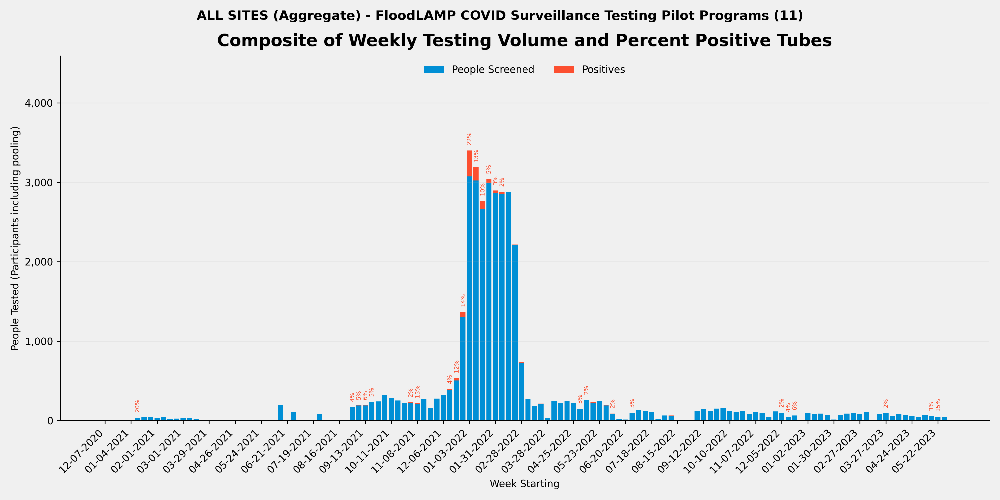
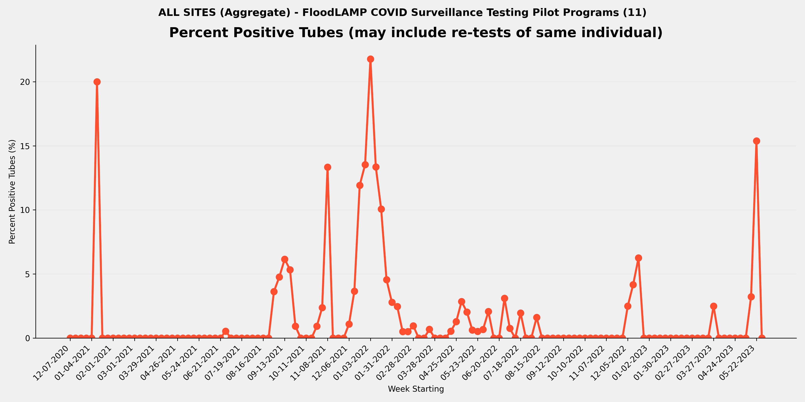
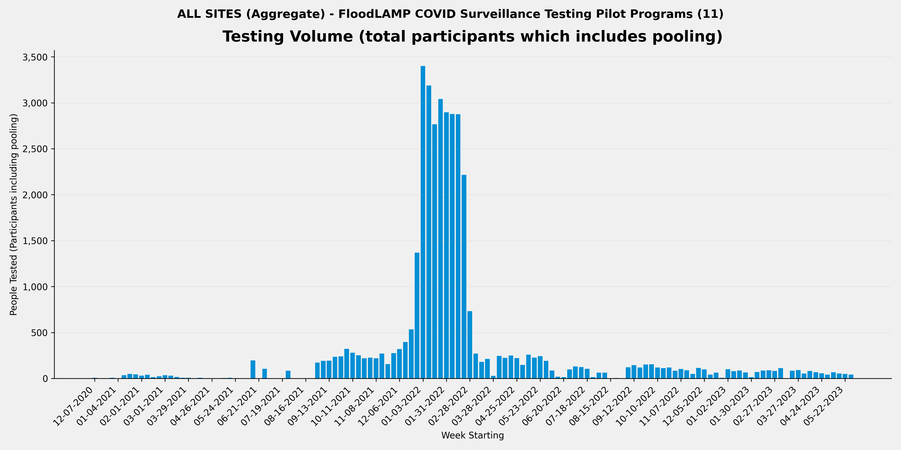

METADATA
last updated: 2026-01-25
file_name: aggregate_pilot-data_summary.md
file_date: 2026-01-25
title: Aggregate Pilot Data Summary
category: pilot-data
subcategory: aggregate
tags: 
source_file_type: csv
xfile_type: xlsx
gfile_url: https://docs.google.com/spreadsheets/d/1b1uWHNGBL9yatTUNnzrbOTdWOMlD-XYVsn4V6pSYmmk
xfile_github_download_url: https://raw.githubusercontent.com/FocusOnFoundationsNonprofit/floodlamp-archive/main/pilots/pilot-data/Aggregate%20Pilot%20Data%20Summary.xlsx
pdf_gdrive_url: NA
pdf_github_url: NA
license: CC BY 4.0 - https://creativecommons.org/licenses/by/4.0/
words: 4917
tokens: 9387
notes: Aggregated statistics across all FloodLAMP pilot sites.
summary_short: Aggregate FloodLAMP pilot data summary across all sites. Total tubes run: 16715; Total positive tubes: 889; Total participants: 37200; Date range: 2020-12-07 to 2023-06-04.

CONTENT

## Plots

### Composite

### Percent Positive Tubes

### Volume

## Files

### Aggregate CSVs
- Aggregate CSV folder: `aggregate_pilot-data/`
- Stats key-values CSV: [aggregate_pilot-data_stats_key-values.csv](aggregate_pilot-data_stats_key-values.csv)
- Weekly summary CSV: [aggregate_pilot-data_weekly-summary.csv](aggregate_pilot-data_weekly-summary.csv)
- Referral agreement CSV: [aggregate_pilot-data_stats_referral-agreement.csv](aggregate_pilot-data_stats_referral-agreement.csv)

## Key tables

### Stats key-values

| section | metric | value | value_status | value_formula | sites_included_n | sites_missing_n | source_sheet | source_row |
| --- | --- | --- | --- | --- | --- | --- | --- | --- |
| Overall | Number of Tubes Tested (initial only - no re-runs) | 16,209 | ok | sum(site values) | 10 | 0 | AGGREGATE |  |
| Overall | Number of Tube Tests Run (includes re-runs) | 16,484 | ok | sum(site values) | 10 | 0 | AGGREGATE |  |
| Overall | Number of Initial Runs | 795 | partial | sum(site values) | 9 | 1 | AGGREGATE |  |
| Overall | Number of APS Only Tubes run | 8,727 | partial | sum(site values) | 9 | 1 | AGGREGATE |  |
| Overall | Number of Test Reactions (RFR plus APS only tubes run) | 17,096 | ok | sum(site values) | 10 | 0 | AGGREGATE |  |
| Overall | Number of Participant Results | 37,706 | ok | sum(site values) | 10 | 0 | AGGREGATE |  |
| Overall | Number of ARF Tubes | 386 | ok | sum(site values) | 10 | 0 | AGGREGATE |  |
| Overall | Sum of Participant Results plus ARF Tubes | 38,092 | ok | participant_results + arf_tubes | 10 | 0 | AGGREGATE |  |
| Overall | Average Pool Level (excludes ARF) | 2.4 | ok | participant_results / (tubes_tested_initial - arf_tubes) | 10 | 0 | AGGREGATE |  |
| Re-runs | Number of Run Tubes (re-runs only) | 275 | partial | sum(site values) | 6 | 4 | AGGREGATE |  |
| Re-runs | Number of Reactions (re-runs only) | 705 | partial | sum(site values) | 6 | 4 | AGGREGATE |  |
| Re-runs | Re-run % of Tubes | 1.7% | partial | rerun_tubes / tubes_tested_initial | 6 | 4 | AGGREGATE |  |
| Re-runs | Number of Initial Runs with Re-runs | 148 | partial | sum(site values) | 6 | 4 | AGGREGATE |  |
| Re-runs | % Initial Runs with Re-runs | 18.6% | partial | initial_runs_with_reruns / initial_runs | 6 | 4 | AGGREGATE |  |
| Positives | Number of Tubes with Final Result Positive | 884 | ok | sum(site values) | 10 | 0 | AGGREGATE |  |
| Positives | % of Tubes Positives (Final Result) | 5.5% | ok | positive_tubes_final / tubes_tested_initial | 10 | 0 | AGGREGATE |  |
| Positives | Number of Cases with Final Result Positive (Indiv or Pool) | 87 | partial | sum(site values) | 8 | 2 | AGGREGATE |  |
| Positives | Known Positive Cases | 337 | partial | sum(site values) | 9 | 1 | AGGREGATE |  |
| Positives | Unknown Positive Cases | 134 | partial | sum(site values) | 9 | 1 | AGGREGATE |  |
| Inconclusives | Number of Tubes with Final Result Inconclusive | 14 | ok | sum(site values) | 10 | 0 | AGGREGATE |  |
| Inconclusives | Number of Tubes in RFR Audit Inconclusive not in Appivo Final Results | 3 | partial | sum(site values) | 6 | 4 | AGGREGATE |  |
| Inconclusives | Total Number of Inconclusive Tubes | 17 | partial | inconclusive_tubes_final + inconclusive_not_in_aps | 10 | 4 | AGGREGATE |  |
| Inconclusives | % of Tubes Inconclusive | 0.1% | partial | total_inconclusive_tubes / tubes_tested_initial | 10 | 4 | AGGREGATE |  |
| Inconclusives | Number of Inconclusive Tubes resolved Positive by Referral Test or Correspondence | 4 | partial | sum(site values) | 9 | 1 | AGGREGATE |  |
| Inconclusives | % Inconclusives resolved Positive by Referral Tests | 23.5% | partial | inconclusive_resolved_pos / total_inconclusive_tubes | 9 | 4 | AGGREGATE |  |
| Inconclusives | Number of Inconclusive Tubes with Referral Test or Correspondence Negative | 3 | partial | sum(site values) | 8 | 2 | AGGREGATE |  |
| Inconclusives | Number of Inconclusive Tubes with no Referral Test result or Correspondence | 9 | partial | sum(site values) | 9 | 1 | AGGREGATE |  |
| Inconclusives | Number of Tubes with Initial Inconclusives and Re-run Negative | 68 | partial | sum(site values) | 9 | 1 | AGGREGATE |  |
| Inconclusives | Number of Inconclusive Test Run Calls | 159 | ok | sum(site values) | 10 | 0 | AGGREGATE |  |
| Inconclusives | % Tube Tests Run Called Inconclusive | 1.0% | ok | inconclusive_run_calls / tube_tests_run_total | 10 | 0 | AGGREGATE |  |
| Referrals and Correspondence | Number of FloodLAMP Cases with Referral Tests or Correspondence | 127 | ok | sum(site values) | 10 | 0 | AGGREGATE |  |
| Referrals and Correspondence | Number of Referral Confirmed FloodLAMP Positives | 121 | ok | sum(site values) | 10 | 0 | AGGREGATE |  |
| Referrals and Correspondence | FL Inconclusives with Referral / Correspondence Positive | 4 | ok | sum(site values) | 10 | 0 | AGGREGATE |  |
| Referrals and Correspondence | % FloodLAMP Positive or Inconclusive with Referral / Correspondence Positive | 98.4% | ok | (agree_positives + incl_ref_pos) / cases_with_referral | 10 | 0 | AGGREGATE |  |
| Referrals and Correspondence | FL Inconclusives but Referral / Correspondence Negative | 2 | partial | sum(site values) | 9 | 1 | AGGREGATE |  |
| Referrals and Correspondence | FL Inconclusives with No Referral Tests or Correspondence | 12 | partial | sum(site values) | 9 | 1 | AGGREGATE |  |
| Comparison to Antigen | Number of FloodLAMP Test Person Cases with Referral Antigen Tests (including non-Same Day) | 68 | partial | sum(site values) | 6 | 4 | AGGREGATE |  |
| Comparison to Antigen | Number of FloodLAMP Test Person Cases with Same Day Referral Antigen Tests | 62 | partial | sum(site values) | 6 | 4 | AGGREGATE |  |
| Comparison to Antigen | Number of FloodLAMP Positive Test Person Cases with Same Day Antigen Negative | 15 | partial | sum(site values) | 6 | 4 | AGGREGATE |  |
| Comparison to Antigen | % Confirmed FloodLAMP Positives with Same Day Antigen Negative | 24.2% | partial | positive_same_day_antigen_neg / positive_same_day_antigen | 6 | 4 | AGGREGATE |  |
| Comparison to Antigen | Number of FloodLAMP Positive Test Person Cases confirmed with Referral Tests but Antigen and Other Non-Antigen Test Negative | 1 | partial | sum(site values) | 6 | 4 | AGGREGATE |  |
| Comparison to Antigen | % Confirmed FloodLAMP Positives that were Antigen and Other Non-Antigen Test Negative |  | not_available | positive_antigen_other_neg / positive_antigen_other | 0 | 10 | AGGREGATE |  |
| False Calls | False Positives Final Results | 0 | ok | sum(site values) | 10 | 0 | AGGREGATE |  |
| False Calls | False Negative Final Results (Suspected) | 0 | ok | sum(site values) | 10 | 0 | AGGREGATE |  |
| People | Number of Unique Individuals Tested | 2,752 | partial | sum(site values) | 9 | 1 | AGGREGATE |  |
| People | Number of Unique Sponsors | 481 | partial | sum(site values) | 9 | 1 | AGGREGATE |  |
| Positivity | Number of Unique Individual Tested FloodLAMP Positive | 444 | partial | sum(site values) | 9 | 1 | AGGREGATE |  |
| Positivity | % of Population FloodLAMP Positive (excluding pools not deconv) | 16.1% | partial | unique_positive / unique_individuals | 9 | 1 | AGGREGATE |  |
| Positivity | Number of Unique Individual Tested FloodLAMP Positive (including if in a positive pool) | 475 | partial | sum(site values) | 9 | 1 | AGGREGATE |  |
| Positivity | % of Population FloodLAMP Positive (including everyone in a positive pool) | 17.3% | partial | unique_positive_incl_pool / unique_individuals | 9 | 1 | AGGREGATE |  |
| Dates | Start Run Date | 2020-12-11 | ok | min(site values) | 10 | 0 | AGGREGATE |  |
| Dates | End Run Date | 2023-06-02 | ok | max(site values) | 10 | 0 | AGGREGATE |  |

### Weekly summary

| week_start_date | week_end_date | participants_n | tubes_n | positive_tubes_n | inconclusive_tubes_n | pct_positive | pct_positive_status | pct_positive_formula | sites_included_n | sites_total_n |
| --- | --- | --- | --- | --- | --- | --- | --- | --- | --- | --- |
| 2020-12-07 | 2020-12-13 | 6 | 2 | 0 | 0 | 0.0% | ok | positive_tubes_n / tubes_n | 1 | 10 |
| 2020-12-14 | 2020-12-20 | 3 | 1 | 0 | 0 | 0.0% | ok | positive_tubes_n / tubes_n | 1 | 10 |
| 2020-12-21 | 2020-12-27 | 2 | 1 | 0 | 0 | 0.0% | ok | positive_tubes_n / tubes_n | 1 | 10 |
| 2020-12-28 | 2021-01-03 | 6 | 2 | 0 | 0 | 0.0% | ok | positive_tubes_n / tubes_n | 1 | 10 |
| 2021-01-04 | 2021-01-10 | 0 | 0 | 0 | 0 |  | denom_zero | positive_tubes_n / tubes_n | 1 | 10 |
| 2021-01-11 | 2021-01-17 | 36 | 15 | 3 | 0 | 20.0% | ok | positive_tubes_n / tubes_n | 1 | 10 |
| 2021-01-18 | 2021-01-24 | 49 | 24 | 0 | 0 | 0.0% | ok | positive_tubes_n / tubes_n | 1 | 10 |
| 2021-01-25 | 2021-01-31 | 45 | 19 | 0 | 0 | 0.0% | ok | positive_tubes_n / tubes_n | 1 | 10 |
| 2021-02-01 | 2021-02-07 | 31 | 11 | 0 | 0 | 0.0% | ok | positive_tubes_n / tubes_n | 1 | 10 |
| 2021-02-08 | 2021-02-14 | 40 | 13 | 0 | 0 | 0.0% | ok | positive_tubes_n / tubes_n | 1 | 10 |
| 2021-02-15 | 2021-02-21 | 14 | 4 | 0 | 0 | 0.0% | ok | positive_tubes_n / tubes_n | 1 | 10 |
| 2021-02-22 | 2021-02-28 | 24 | 9 | 0 | 0 | 0.0% | ok | positive_tubes_n / tubes_n | 1 | 10 |
| 2021-03-01 | 2021-03-07 | 35 | 11 | 0 | 0 | 0.0% | ok | positive_tubes_n / tubes_n | 1 | 10 |
| 2021-03-08 | 2021-03-14 | 30 | 9 | 0 | 0 | 0.0% | ok | positive_tubes_n / tubes_n | 1 | 10 |
| 2021-03-15 | 2021-03-21 | 16 | 6 | 0 | 0 | 0.0% | ok | positive_tubes_n / tubes_n | 1 | 10 |
| 2021-03-22 | 2021-03-28 | 6 | 2 | 0 | 0 | 0.0% | ok | positive_tubes_n / tubes_n | 1 | 10 |
| 2021-03-29 | 2021-04-04 | 6 | 2 | 0 | 0 | 0.0% | ok | positive_tubes_n / tubes_n | 1 | 10 |
| 2021-04-05 | 2021-04-11 | 0 | 0 | 0 | 0 |  | denom_zero | positive_tubes_n / tubes_n | 1 | 10 |
| 2021-04-12 | 2021-04-18 | 8 | 3 | 0 | 0 | 0.0% | ok | positive_tubes_n / tubes_n | 1 | 10 |
| 2021-04-19 | 2021-04-25 | 0 | 0 | 0 | 0 |  | denom_zero | positive_tubes_n / tubes_n | 1 | 10 |
| 2021-04-26 | 2021-05-02 | 0 | 0 | 0 | 0 |  | denom_zero | positive_tubes_n / tubes_n | 1 | 10 |
| 2021-05-03 | 2021-05-09 | 1 | 1 | 0 | 0 | 0.0% | ok | positive_tubes_n / tubes_n | 1 | 10 |
| 2021-05-10 | 2021-05-16 | 5 | 2 | 0 | 0 | 0.0% | ok | positive_tubes_n / tubes_n | 1 | 10 |
| 2021-05-17 | 2021-05-23 | 6 | 6 | 0 | 0 | 0.0% | ok | positive_tubes_n / tubes_n | 1 | 10 |
| 2021-05-24 | 2021-05-30 | 0 | 0 | 0 | 0 |  | denom_zero | positive_tubes_n / tubes_n | 1 | 10 |
| 2021-05-31 | 2021-06-06 | 0 | 0 | 0 | 0 |  | denom_zero | positive_tubes_n / tubes_n | 1 | 10 |
| 2021-06-07 | 2021-06-13 | 0 | 0 | 0 | 0 |  | denom_zero | positive_tubes_n / tubes_n | 1 | 10 |
| 2021-06-14 | 2021-06-20 | 197 | 63 | 0 | 0 | 0.0% | ok | positive_tubes_n / tubes_n | 2 | 10 |
| 2021-06-21 | 2021-06-27 | 0 | 0 | 0 | 0 |  | denom_zero | positive_tubes_n / tubes_n | 1 | 10 |
| 2021-06-28 | 2021-07-04 | 105 | 374 | 2 | 0 | 0.5% | ok | positive_tubes_n / tubes_n | 2 | 10 |
| 2021-07-05 | 2021-07-11 | 0 | 0 | 0 | 0 |  | denom_zero | positive_tubes_n / tubes_n | 2 | 10 |
| 2021-07-12 | 2021-07-18 | 0 | 0 | 0 | 0 |  | denom_zero | positive_tubes_n / tubes_n | 2 | 10 |
| 2021-07-19 | 2021-07-25 | 0 | 0 | 0 | 0 |  | denom_zero | positive_tubes_n / tubes_n | 2 | 10 |
| 2021-07-26 | 2021-08-01 | 85 | 322 | 0 | 0 | 0.0% | ok | positive_tubes_n / tubes_n | 2 | 10 |
| 2021-08-02 | 2021-08-08 | 0 | 0 | 0 | 0 |  | denom_zero | positive_tubes_n / tubes_n | 1 | 10 |
| 2021-08-09 | 2021-08-15 | 0 | 0 | 0 | 0 |  | denom_zero | positive_tubes_n / tubes_n | 1 | 10 |
| 2021-08-16 | 2021-08-22 | 0 | 0 | 0 | 0 |  | denom_zero | positive_tubes_n / tubes_n | 1 | 10 |
| 2021-08-23 | 2021-08-29 | 0 | 0 | 0 | 0 |  | denom_zero | positive_tubes_n / tubes_n | 1 | 10 |
| 2021-08-30 | 2021-09-05 | 172 | 55 | 2 | 0 | 3.6% | ok | positive_tubes_n / tubes_n | 3 | 10 |
| 2021-09-06 | 2021-09-12 | 192 | 63 | 3 | 1 | 4.8% | ok | positive_tubes_n / tubes_n | 3 | 10 |
| 2021-09-13 | 2021-09-19 | 194 | 65 | 4 | 0 | 6.2% | ok | positive_tubes_n / tubes_n | 3 | 10 |
| 2021-09-20 | 2021-09-26 | 235 | 75 | 4 | 0 | 5.3% | ok | positive_tubes_n / tubes_n | 3 | 10 |
| 2021-09-27 | 2021-10-03 | 240 | 108 | 1 | 0 | 0.9% | ok | positive_tubes_n / tubes_n | 4 | 10 |
| 2021-10-04 | 2021-10-10 | 322 | 171 | 0 | 0 | 0.0% | ok | positive_tubes_n / tubes_n | 4 | 10 |
| 2021-10-11 | 2021-10-17 | 281 | 154 | 0 | 0 | 0.0% | ok | positive_tubes_n / tubes_n | 4 | 10 |
| 2021-10-18 | 2021-10-24 | 251 | 138 | 0 | 0 | 0.0% | ok | positive_tubes_n / tubes_n | 4 | 10 |
| 2021-10-25 | 2021-10-31 | 219 | 108 | 1 | 0 | 0.9% | ok | positive_tubes_n / tubes_n | 4 | 10 |
| 2021-11-01 | 2021-11-07 | 227 | 126 | 3 | 0 | 2.4% | ok | positive_tubes_n / tubes_n | 4 | 10 |
| 2021-11-08 | 2021-11-14 | 220 | 120 | 16 | 0 | 13.3% | ok | positive_tubes_n / tubes_n | 4 | 10 |
| 2021-11-15 | 2021-11-21 | 271 | 141 | 0 | 0 | 0.0% | ok | positive_tubes_n / tubes_n | 4 | 10 |
| 2021-11-22 | 2021-11-28 | 157 | 74 | 0 | 0 | 0.0% | ok | positive_tubes_n / tubes_n | 4 | 10 |
| 2021-11-29 | 2021-12-05 | 275 | 152 | 0 | 0 | 0.0% | ok | positive_tubes_n / tubes_n | 4 | 10 |
| 2021-12-06 | 2021-12-12 | 319 | 183 | 2 | 0 | 1.1% | ok | positive_tubes_n / tubes_n | 5 | 10 |
| 2021-12-13 | 2021-12-19 | 396 | 246 | 9 | 2 | 3.7% | ok | positive_tubes_n / tubes_n | 5 | 10 |
| 2021-12-20 | 2021-12-26 | 535 | 260 | 31 | 0 | 11.9% | ok | positive_tubes_n / tubes_n | 4 | 10 |
| 2021-12-27 | 2022-01-02 | 1368 | 488 | 66 | 0 | 13.5% | ok | positive_tubes_n / tubes_n | 4 | 10 |
| 2022-01-03 | 2022-01-09 | 3400 | 1502 | 327 | 1 | 21.8% | ok | positive_tubes_n / tubes_n | 4 | 10 |
| 2022-01-10 | 2022-01-16 | 3188 | 1251 | 167 | 1 | 13.3% | ok | positive_tubes_n / tubes_n | 4 | 10 |
| 2022-01-17 | 2022-01-23 | 2766 | 1013 | 102 | 0 | 10.1% | ok | positive_tubes_n / tubes_n | 4 | 10 |
| 2022-01-24 | 2022-01-30 | 3041 | 1053 | 48 | 0 | 4.6% | ok | positive_tubes_n / tubes_n | 4 | 10 |
| 2022-01-31 | 2022-02-06 | 2897 | 966 | 27 | 0 | 2.8% | ok | positive_tubes_n / tubes_n | 4 | 10 |
| 2022-02-07 | 2022-02-13 | 2878 | 933 | 23 | 0 | 2.5% | ok | positive_tubes_n / tubes_n | 4 | 10 |
| 2022-02-14 | 2022-02-20 | 2876 | 977 | 5 | 2 | 0.5% | ok | positive_tubes_n / tubes_n | 4 | 10 |
| 2022-02-21 | 2022-02-27 | 2216 | 783 | 4 | 0 | 0.5% | ok | positive_tubes_n / tubes_n | 4 | 10 |
| 2022-02-28 | 2022-03-06 | 732 | 316 | 3 | 0 | 0.9% | ok | positive_tubes_n / tubes_n | 4 | 10 |
| 2022-03-07 | 2022-03-13 | 271 | 165 | 0 | 0 | 0.0% | ok | positive_tubes_n / tubes_n | 4 | 10 |
| 2022-03-14 | 2022-03-20 | 180 | 93 | 0 | 0 | 0.0% | ok | positive_tubes_n / tubes_n | 4 | 10 |
| 2022-03-21 | 2022-03-27 | 212 | 147 | 1 | 0 | 0.7% | ok | positive_tubes_n / tubes_n | 3 | 10 |
| 2022-03-28 | 2022-04-03 | 27 | 14 | 0 | 0 | 0.0% | ok | positive_tubes_n / tubes_n | 3 | 10 |
| 2022-04-04 | 2022-04-10 | 246 | 189 | 0 | 0 | 0.0% | ok | positive_tubes_n / tubes_n | 3 | 10 |
| 2022-04-11 | 2022-04-17 | 225 | 164 | 0 | 0 | 0.0% | ok | positive_tubes_n / tubes_n | 3 | 10 |
| 2022-04-18 | 2022-04-24 | 250 | 187 | 1 | 0 | 0.5% | ok | positive_tubes_n / tubes_n | 3 | 10 |
| 2022-04-25 | 2022-05-01 | 221 | 156 | 2 | 0 | 1.3% | ok | positive_tubes_n / tubes_n | 3 | 10 |
| 2022-05-02 | 2022-05-08 | 148 | 70 | 2 | 0 | 2.9% | ok | positive_tubes_n / tubes_n | 4 | 10 |
| 2022-05-09 | 2022-05-15 | 260 | 197 | 4 | 2 | 2.0% | ok | positive_tubes_n / tubes_n | 4 | 10 |
| 2022-05-16 | 2022-05-22 | 227 | 160 | 1 | 0 | 0.6% | ok | positive_tubes_n / tubes_n | 3 | 10 |
| 2022-05-23 | 2022-05-29 | 243 | 189 | 1 | 0 | 0.5% | ok | positive_tubes_n / tubes_n | 3 | 10 |
| 2022-05-30 | 2022-06-05 | 191 | 149 | 1 | 0 | 0.7% | ok | positive_tubes_n / tubes_n | 3 | 10 |
| 2022-06-06 | 2022-06-12 | 87 | 145 | 3 | 0 | 2.1% | ok | positive_tubes_n / tubes_n | 3 | 10 |
| 2022-06-13 | 2022-06-19 | 19 | 9 | 0 | 0 | 0.0% | ok | positive_tubes_n / tubes_n | 3 | 10 |
| 2022-06-20 | 2022-06-26 | 13 | 5 | 0 | 0 | 0.0% | ok | positive_tubes_n / tubes_n | 3 | 10 |
| 2022-06-27 | 2022-07-03 | 97 | 129 | 4 | 3 | 3.1% | ok | positive_tubes_n / tubes_n | 3 | 10 |
| 2022-07-04 | 2022-07-10 | 131 | 132 | 1 | 0 | 0.8% | ok | positive_tubes_n / tubes_n | 3 | 10 |
| 2022-07-11 | 2022-07-17 | 124 | 124 | 0 | 0 | 0.0% | ok | positive_tubes_n / tubes_n | 3 | 10 |
| 2022-07-18 | 2022-07-24 | 105 | 204 | 4 | 0 | 2.0% | ok | positive_tubes_n / tubes_n | 3 | 10 |
| 2022-07-25 | 2022-07-31 | 14 | 7 | 0 | 0 | 0.0% | ok | positive_tubes_n / tubes_n | 3 | 10 |
| 2022-08-01 | 2022-08-07 | 63 | 90 | 0 | 0 | 0.0% | ok | positive_tubes_n / tubes_n | 3 | 10 |
| 2022-08-08 | 2022-08-14 | 62 | 62 | 1 | 0 | 1.6% | ok | positive_tubes_n / tubes_n | 3 | 10 |
| 2022-08-15 | 2022-08-21 | 0 | 37 | 0 | 0 | 0.0% | ok | positive_tubes_n / tubes_n | 3 | 10 |
| 2022-08-22 | 2022-08-28 | 4 | 1 | 0 | 0 | 0.0% | ok | positive_tubes_n / tubes_n | 2 | 10 |
| 2022-08-29 | 2022-09-04 | 0 | 0 | 0 | 0 |  | denom_zero | positive_tubes_n / tubes_n | 2 | 10 |
| 2022-09-05 | 2022-09-11 | 121 | 64 | 0 | 0 | 0.0% | ok | positive_tubes_n / tubes_n | 3 | 10 |
| 2022-09-12 | 2022-09-18 | 145 | 57 | 0 | 0 | 0.0% | ok | positive_tubes_n / tubes_n | 3 | 10 |
| 2022-09-19 | 2022-09-25 | 118 | 52 | 0 | 0 | 0.0% | ok | positive_tubes_n / tubes_n | 3 | 10 |
| 2022-09-26 | 2022-10-02 | 151 | 63 | 0 | 0 | 0.0% | ok | positive_tubes_n / tubes_n | 3 | 10 |
| 2022-10-03 | 2022-10-09 | 154 | 65 | 0 | 0 | 0.0% | ok | positive_tubes_n / tubes_n | 3 | 10 |
| 2022-10-10 | 2022-10-16 | 120 | 51 | 0 | 0 | 0.0% | ok | positive_tubes_n / tubes_n | 2 | 10 |
| 2022-10-17 | 2022-10-23 | 111 | 50 | 0 | 0 | 0.0% | ok | positive_tubes_n / tubes_n | 2 | 10 |
| 2022-10-24 | 2022-10-30 | 118 | 56 | 0 | 0 | 0.0% | ok | positive_tubes_n / tubes_n | 2 | 10 |
| 2022-10-31 | 2022-11-06 | 84 | 39 | 0 | 0 | 0.0% | ok | positive_tubes_n / tubes_n | 2 | 10 |
| 2022-11-07 | 2022-11-13 | 102 | 46 | 0 | 0 | 0.0% | ok | positive_tubes_n / tubes_n | 2 | 10 |
| 2022-11-14 | 2022-11-20 | 89 | 46 | 0 | 0 | 0.0% | ok | positive_tubes_n / tubes_n | 2 | 10 |
| 2022-11-21 | 2022-11-27 | 49 | 28 | 0 | 0 | 0.0% | ok | positive_tubes_n / tubes_n | 2 | 10 |
| 2022-11-28 | 2022-12-04 | 114 | 48 | 0 | 0 | 0.0% | ok | positive_tubes_n / tubes_n | 2 | 10 |
| 2022-12-05 | 2022-12-11 | 98 | 40 | 1 | 0 | 2.5% | ok | positive_tubes_n / tubes_n | 2 | 10 |
| 2022-12-12 | 2022-12-18 | 42 | 24 | 1 | 0 | 4.2% | ok | positive_tubes_n / tubes_n | 2 | 10 |
| 2022-12-19 | 2022-12-25 | 64 | 32 | 2 | 0 | 6.2% | ok | positive_tubes_n / tubes_n | 2 | 10 |
| 2022-12-26 | 2023-01-01 | 6 | 3 | 0 | 0 | 0.0% | ok | positive_tubes_n / tubes_n | 2 | 10 |
| 2023-01-02 | 2023-01-08 | 100 | 41 | 0 | 0 | 0.0% | ok | positive_tubes_n / tubes_n | 2 | 10 |
| 2023-01-09 | 2023-01-15 | 80 | 39 | 0 | 2 | 0.0% | ok | positive_tubes_n / tubes_n | 1 | 10 |
| 2023-01-16 | 2023-01-22 | 86 | 40 | 0 | 1 | 0.0% | ok | positive_tubes_n / tubes_n | 1 | 10 |
| 2023-01-23 | 2023-01-29 | 65 | 29 | 0 | 0 | 0.0% | ok | positive_tubes_n / tubes_n | 1 | 10 |
| 2023-01-30 | 2023-02-05 | 13 | 7 | 0 | 0 | 0.0% | ok | positive_tubes_n / tubes_n | 1 | 10 |
| 2023-02-06 | 2023-02-12 | 70 | 33 | 0 | 0 | 0.0% | ok | positive_tubes_n / tubes_n | 1 | 10 |
| 2023-02-13 | 2023-02-19 | 87 | 39 | 0 | 0 | 0.0% | ok | positive_tubes_n / tubes_n | 1 | 10 |
| 2023-02-20 | 2023-02-26 | 89 | 40 | 0 | 0 | 0.0% | ok | positive_tubes_n / tubes_n | 1 | 10 |
| 2023-02-27 | 2023-03-05 | 81 | 37 | 0 | 0 | 0.0% | ok | positive_tubes_n / tubes_n | 1 | 10 |
| 2023-03-06 | 2023-03-12 | 112 | 47 | 0 | 0 | 0.0% | ok | positive_tubes_n / tubes_n | 1 | 10 |
| 2023-03-13 | 2023-03-19 | 0 | 0 | 0 | 0 |  | denom_zero | positive_tubes_n / tubes_n | 1 | 10 |
| 2023-03-20 | 2023-03-26 | 84 | 37 | 0 | 0 | 0.0% | ok | positive_tubes_n / tubes_n | 1 | 10 |
| 2023-03-27 | 2023-04-02 | 90 | 40 | 1 | 0 | 2.5% | ok | positive_tubes_n / tubes_n | 1 | 10 |
| 2023-04-03 | 2023-04-09 | 54 | 28 | 0 | 0 | 0.0% | ok | positive_tubes_n / tubes_n | 1 | 10 |
| 2023-04-10 | 2023-04-16 | 81 | 39 | 0 | 0 | 0.0% | ok | positive_tubes_n / tubes_n | 1 | 10 |
| 2023-04-17 | 2023-04-23 | 67 | 39 | 0 | 0 | 0.0% | ok | positive_tubes_n / tubes_n | 1 | 10 |
| 2023-04-24 | 2023-04-30 | 55 | 33 | 0 | 0 | 0.0% | ok | positive_tubes_n / tubes_n | 1 | 10 |
| 2023-05-01 | 2023-05-07 | 43 | 22 | 0 | 0 | 0.0% | ok | positive_tubes_n / tubes_n | 1 | 10 |
| 2023-05-08 | 2023-05-14 | 67 | 31 | 0 | 0 | 0.0% | ok | positive_tubes_n / tubes_n | 1 | 10 |
| 2023-05-15 | 2023-05-21 | 54 | 31 | 1 | 0 | 3.2% | ok | positive_tubes_n / tubes_n | 1 | 10 |
| 2023-05-22 | 2023-05-28 | 49 | 26 | 4 | 0 | 15.4% | ok | positive_tubes_n / tubes_n | 1 | 10 |
| 2023-05-29 | 2023-06-04 | 43 | 25 | 0 | 0 | 0.0% | ok | positive_tubes_n / tubes_n | 1 | 10 |

### Referral agreement

| fl_result_category | tubes_n | cases_n | with_ref_or_corresp_n | agree_n | agree_pct | agree_pct_status | disagree_n | disagree_pct | disagree_pct_status | ref_cor_pos_n | incl_gt_pos_pct | incl_gt_pos_pct_status | ref_cor_neg_n | incl_gt_neg_pct | incl_gt_neg_pct_status | source_sheet | source_anchor | agree_pct_formula | disagree_pct_formula | incl_gt_pos_pct_formula | incl_gt_neg_pct_formula | sites_included_n |
| --- | --- | --- | --- | --- | --- | --- | --- | --- | --- | --- | --- | --- | --- | --- | --- | --- | --- | --- | --- | --- | --- | --- |
| Positive | 884 | 87 | 120 | 119 | 99.2% | ok | 1 | 0.8% | ok |  |  |  |  |  |  | AGGREGATE |  | agree_n / with_ref_or_corresp_n | disagree_n / with_ref_or_corresp_n |  |  | 8 |
| Inconclusive | 17 | 16 | 7 |  |  |  |  |  |  | 4 | 57.1% | ok | 2 | 28.6% | ok | AGGREGATE |  |  |  | ref_cor_pos_n / with_ref_or_corresp_n | ref_cor_neg_n / with_ref_or_corresp_n | 8 |
