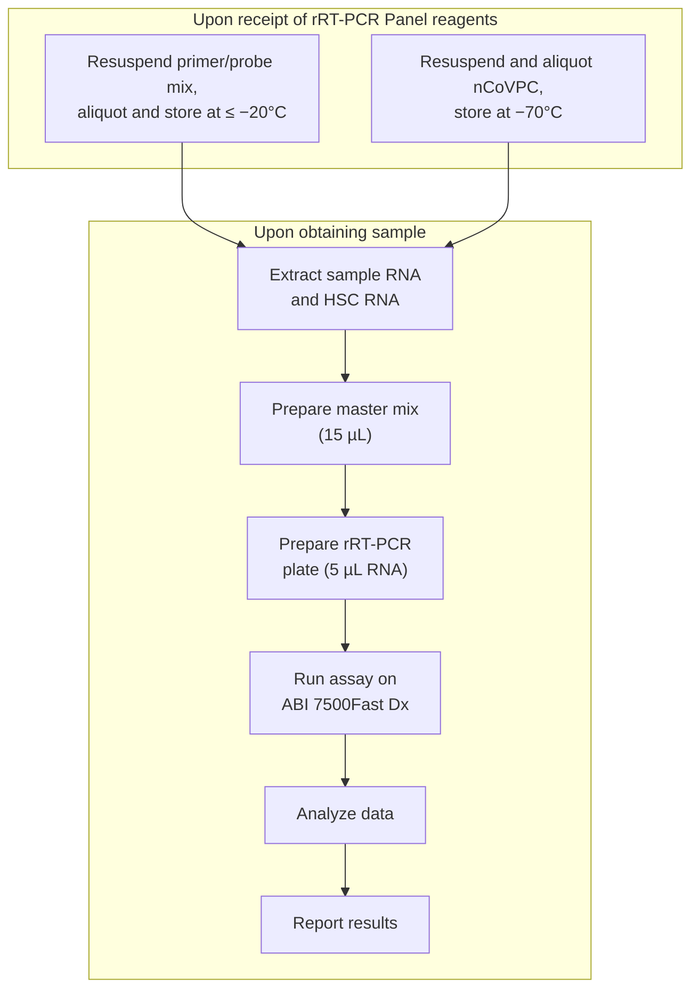
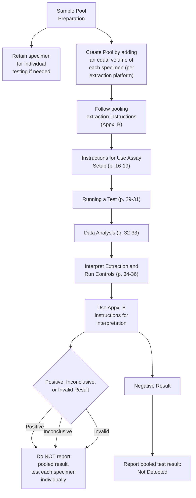
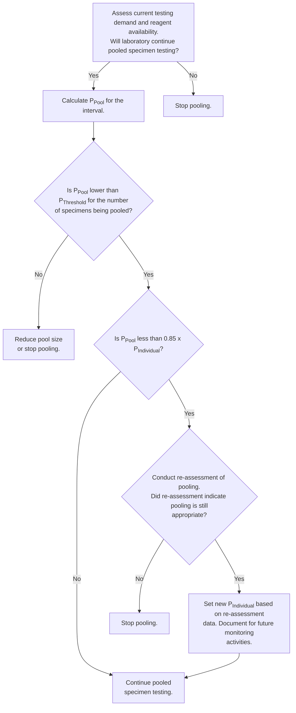

METADATA
last updated: 2026-03-10_105727
file_name: _archive-combined-files_fda-euas_45k.md
category: regulatory
subcategory: fda-euas
gfile_url: **FLAGGED - TBD user-facing Google-hosted public file URL**
words: 
tokens: 

CONTENT

# _archive-combined-files_fda-euas_45k (2 files, 45,416 tokens)

# 725  _context-commentary_regulatory-fda-euas.md
METADATA
last updated: 2026-02-26 RT
file_name: _context-commentary_regulatory-fda-euas.md
category: regulatory
subcategory: fda-euas
words: 502
tokens: 725

CONTENT

## Context
An Emergency Use Authorization (EUA) is a mechanism through which the FDA can authorize the use of unapproved medical products — or unapproved uses of approved products — during a declared public health emergency. During the COVID-19 pandemic, EUAs were the primary pathway by which diagnostic tests reached the market. The EUA process differs from the standard FDA authorization pathways (510(k), PMA, De Novo) in several key respects:

- **Speed**: EUAs are designed for rapid review during emergencies, with timelines measured in weeks rather than months or years
- **Evidence threshold**: EUAs require the FDA to determine that the product "may be effective" based on available evidence, a lower bar than the "reasonable assurance of safety and effectiveness" required for standard authorizations
- **Temporary status**: EUAs are valid only for the duration of the declared emergency and can be revised or revoked
- **Conditions of authorization**: EUA-holders must meet ongoing conditions, including labeling requirements, adverse event reporting, and sometimes performance monitoring

Each EUA includes an Instructions for Use (IFU) document that specifies the authorized specimen types, testing procedures, performance characteristics, interpretation criteria, and conditions of authorization. Some EUAs also include an EUA Summary providing the FDA's review of the submission data.

This subcategory contains a selection of EUA documents that were relevant to FloodLAMP's work — not a comprehensive collection of COVID-19 diagnostic EUAs (of which there were hundreds). The files here were included because FloodLAMP reviewed them during development, because they represent comparable technologies (particularly LAMP-based or isothermal assays), or because they illustrate specific aspects of the EUA landscape. The collection includes IFUs and EUA summaries from tests spanning RT-PCR, isothermal amplification, CRISPR-based detection, and home collection kits.

Two files merit specific mention:

- **Detectachem MobileDetect-BIO BCC19 Test Kit** — This was the EUA most similar to what FloodLAMP was developing: a colorimetric LAMP-based SARS-CoV-2 test designed for point-of-care use. FloodLAMP's assays appeared to achieve significantly higher sensitivity and overall performance than the Detectachem test based on the published performance data.
- **SalivaDirect** (documented primarily in the open-euas subcategory) — Notable as the first and essentially only "open" EUA, meaning the protocol was made freely available for other labs to adopt. The open-euas subcategory covers this in detail.

The CDC's own RT-PCR Diagnostic Panel IFU is also included as a reference document — it was the original FDA-authorized COVID-19 test in the United States and provides a baseline example of an EUA IFU at the highest complexity level.

For broader analysis and commentary on the FDA's EUA process during the pandemic, see the reg-articles-misc subcategory, which includes articles and reports examining how the process functioned. For FloodLAMP's own FDA submissions and correspondence, see the fl-fda-submissions and fl-fda-correspondence subcategories.

Also see the following file, which is an AI generated report sourcing retrospectives on FDA EUAs during the COVID-19 pandemic.
regulatory/reg-articles-misc/_AI_fda-eua-covid-retrospectives_post2022_report.md

## Commentary
See other regulatory subcategories for commentary. FloodLAMP's assessments and lessons learned regarding the EUA process are addressed there where they can be grounded in specific documents and experiences.

# 44,009  2020-12-01_CDC EUA IFU - CDC 2019-Novel Coronavirus (2019-nCoV) Real-Time RT-PCR Diagnostic Panel.md
METADATA
last updated: 2026-03-03 BA fixed html and other glaring issues
file_name: 2020-12-01_CDC EUA IFU - CDC 2019-Novel Coronavirus (2019-nCoV) Real-Time RT-PCR Diagnostic Panel.md
file_date: 2020-12-01
title: CDC EUA IFU - CDC 2019-Novel Coronavirus (2019-nCoV) Real-Time RT-PCR Diagnostic Panel
category: regulatory
subcategory: fda-euas
tags: 
source_file_type: docx
xfile_type: docx
gfile_url: https://docs.google.com/document/d/1rpJvrD1zAgna5KCIAfZx_eNRvP6pZKDe
xfile_github_download_url: https://raw.githubusercontent.com/FocusOnFoundationsNonprofit/floodlamp-archive/main/regulatory/fda-euas/2020-12-01_CDC%20EUA%20IFU%20-%20CDC%202019-Novel%20Coronavirus%20%282019-nCoV%29%20Real-Time%20RT-PCR%20Diagnostic%20Panel.docx
pdf_gdrive_url: https://drive.google.com/file/d/1WKU2z1nZ_L0uZRhSCYpxAMLBp-e2tBtW
pdf_github_url: https://github.com/FocusOnFoundationsNonprofit/floodlamp-archive/blob/main/regulatory/fda-euas/2020-12-01_CDC%20EUA%20IFU%20-%20CDC%202019-Novel%20Coronavirus%20%282019-nCoV%29%20Real-Time%20RT-PCR%20Diagnostic%20Panel.pdf
conversion_input_file_type: docx
conversion: pandoc
license: Public Domain
tokens: 44009
words: 27009
notes: 
summary_short: The CDC “2019-Novel Coronavirus (2019-nCoV) Real-Time RT-PCR Diagnostic Panel” EUA Instructions for Use detail how CLIA high-complexity laboratories perform, analyze, and report the CDC N1/N2/RP RT-PCR assay for SARS-CoV-2 across authorized respiratory specimen types. It provides end-to-end workflows for reagent prep, nucleic acid extraction options, ABI 7500 Fast Dx run setup, controls/interpretation rules, and performance characteristics (including LoD and specificity). It also includes appendices for heat-treatment as an extraction alternative and for pooled testing (up to 4 specimens) with guidance on implementation and ongoing monitoring.

CONTENT

***INTERNAL TITLE:*** CDC 2019-Novel Coronavirus (2019-nCoV)
Real-Time RT-PCR Diagnostic Panel

**For Emergency Use Only**

**Instructions for Use**

**Catalog \# 2019-nCoVEUA-01**

**1000 reactions**

For *In-vitro* Diagnostic (IVD) Use

Rx Only

Centers for Disease Control and Prevention
Division of Viral Diseases
1600 Clifton Rd NE
Atlanta GA 30329

CDC-006-00019, Revision: 06 CDC/DDID/NCIRD/ Division of Viral Diseases Effective: 12/01/2020

## Table of Contents

Intended Use ............................................................................................... 3
Summary and Explanation............................................................................. 4
Principles of the Procedure ........................................................................... 4
Materials Required (Provided)....................................................................... 6
Materials Required (But Not Provided) ........................................................... 7
Warnings and Precautions ........................................................................... 10
Reagent Storage, Handling, and Stability...................................................... 12
Specimen Collection, Handling, and Storage................................................. 12
Specimen Referral to CDC ........................................................................... 13
Reagent and Controls Preparation................................................................ 13
General Preparation ................................................................................... 14
Nucleic Acid Extraction................................................................................ 14
Assay Set Up............................................................................................... 16
Create a Run Template on the Applied Biosystems 7500 Fast Dx Real-time PCR
Instrument (Required if no template exists).................................................. 21
Defining the Instrument Settings .................................................................. 27
Running a Test............................................................................................ 29
Interpretation of Results and Reporting ........................................................ 35
2019-nCoV rRT-PCR Diagnostic Panel Results Interpretation Guide ................ 38
Quality Control............................................................................................ 39
Limitations .................................................................................................. 39
Conditions of Authorization for the Laboratory............................................. 40
Performance Characteristics........................................................................ 42
Disposal...................................................................................................... 52
References .................................................................................................. 52
Revision History .......................................................................................... 53
Contact Information, Ordering, and Product Support .................................... 53
Appendix A: Heat Treatment Alternative to Extraction .................................. 54
Appendix B: Pooled Specimen Preparation and Processing ........................... 58
Appendix C: Implementation and Monitoring of Pooled Specimen Testing..... 67

## Intended Use

The CDC 2019-Novel Coronavirus (2019-nCoV) Real-Time RT-PCR Diagnostic Panel is a real-time RT-PCR test intended for the qualitative detection of nucleic acid from SARS-CoV-2 in upper and lower respiratory specimens (such as nasopharyngeal or oropharyngeal swabs, sputum, lower respiratory tract aspirates, bronchoalveolar lavage, and nasopharyngeal wash/aspirate or nasal aspirate) collected from individuals suspected of COVID-19 by their healthcare provider(1).

This test is also for the qualitative detection of nucleic acid from the SARS-CoV-2 in pooled samples containing up to four of the individual upper respiratory swab specimens (nasopharyngeal (NP), oropharyngeal (OP), NP/OP combined, or nasal swabs) that were collected using individual vials containing transport media from individuals suspected of COVID-19 by their healthcare provider. Negative results from pooled testing should not be treated as definitive. If a patient’s clinical signs and symptoms are inconsistent with a negative result or results are necessary for patient management, then the patient should be considered for individual testing. Specimens included in pools with a positive, inconclusive, or invalid result must be tested individually prior to reporting a result. Specimens with low viral loads may not be detected in sample pools due to the decreased sensitivity of pooled testing.

Testing is limited to laboratories certified under the Clinical Laboratory Improvement Amendments of 1988 (CLIA), 42 U.S.C. § 263a, that meet the requirements to perform high complexity tests.

Results are for the identification of SARS-CoV-2 RNA. SARS-CoV-2 RNA is generally detectable in upper and lower respiratory specimens during infection. Positive results are indicative of active infection with SARS-CoV-2 but do not rule out bacterial infection or co-infection with other viruses. The agent detected may not be the definite cause of disease. Laboratories within the United States and its territories are required to report all results to the appropriate public health authorities.

Negative results do not preclude SARS-CoV-2 infection and should not be used as the sole basis for treatment or other patient management decisions. Negative results must be combined with clinical observations, patient history, and epidemiological information.

Testing with the CDC 2019-nCoV Real-Time RT-PCR Diagnostic Panel is intended for use by trained laboratory personnel who are proficient in performing real-time RT-PCR assays. The CDC 2019-Novel Coronavirus (2019-nCoV) Real-Time RT-PCR Diagnostic Panel is only for use under a Food and Drug Administration’s Emergency Use Authorization.

(1) For this EUA, a healthcare provider includes, but is not limited to, physicians, nurses, pharmacists, technologists, laboratory directors, epidemiologists, or any other practitioners or allied health professionals.

## Summary and Explanation

An outbreak of pneumonia of unknown etiology in Wuhan City, Hubei Province, China was initially reported to WHO on December 31, 2019. Chinese authorities identified a novel coronavirus (2019-nCoV, also referred to as SARS-CoV-2), which has resulted in millions of confirmed human infections globally. Cases of asymptomatic infection, mild illness, severe illness, and deaths have been reported.

The CDC 2019-nCoV Real-Time RT-PCR Diagnostic Panel is a molecular *in vitro* diagnostic test that aids in the detection and diagnosis of SARS-CoV-2 infection and is based on widely used nucleic acid amplification technology. The product contains oligonucleotide primers and dual-labeled hydrolysis probes (TaqMan®) and control material used in rRT-PCR for the *in vitro* qualitative detection of 2019- nCoV RNA in respiratory specimens.

The term “qualified laboratories” refers to laboratories in which all users, analysts, and any person reporting results from use of this device should be trained to perform and interpret the results from this procedure by a competent instructor prior to use.

## Principles of the Procedure

The oligonucleotide primers and probes for detection of 2019-nCoV were selected from regions of the virus nucleocapsid (N) gene. The panel is designed for specific detection of SARS-CoV-2 (two primer/probe sets). An additional primer/probe set to detect the human RNase P gene (RP) in control samples and clinical specimens is also included in the panel.

RNA isolated and purified from upper and lower respiratory specimens is reverse transcribed to cDNA and subsequently amplified in the Applied Biosystems 7500 Fast Dx Real-Time PCR Instrument with SDS version 1.4 software. In the process, the probe anneals to a specific target sequence located between the forward and reverse primers. During the extension phase of the PCR cycle, the 5’ nuclease activity of Taq polymerase degrades the probe, causing the reporter dye to separate from the quencher dye, generating a fluorescent signal. With each cycle, additional reporter dye molecules are cleaved from their respective probes, increasing the fluorescence intensity. Fluorescence intensity is monitored at each PCR cycle by Applied Biosystems 7500 Fast Dx Real-Time PCR System with SDS version 1.4 software.

Detection of viral RNA not only aids in the diagnosis of illness but also provides epidemiological and surveillance information.

### Summary of Preparation and Testing Process

## Materials Required (Provided)

Note: CDC will maintain on its website a list of commercially available lots of primer and probe sets and/or positive control materials that are acceptable alternatives to the CDC primer and probe set and/or positive control included in the Diagnostic Panel. Only material distributed through the CDC International Reagent Resource and specific lots of material posted to the CDC website are acceptable for use with this assay under CDC’s Emergency Use Authorization.

This list of acceptable alternative lots of primer and probe materials and/or positive control materials will be available at: https://www.cdc.gov/coronavirus/2019-nCoV/lab/virus-requests.html

### Primers and Probes:
**Catalog \#2019-nCoVEUA-01 Diagnostic Panel Box \#1:**

| *Reagent Label* | *Part #*          | *Description*                           | *Quantity /Tube* | *Reactions /Tube* |
| --------------- | ----------------- | --------------------------------------- | ---------------- | ----------------- |
| 2019-nCoV_N1    | RV202001 RV202015 | 2019-nCoV_N1 Combined Primer/Probe Mix  | 22.5 nmol        | 1000              |
| 2019-nCoV_N2    | RV202002 RV202016 | 2019-nCoV_N2 Combined Primer/Probe Mix  | 22.5 nmol        | 1000              |
| RP              | RV202004 RV202018 | Human RNase P Combined Primer/Probe Mix | 22.5 nmol        | 1000              |
||

### Positive Control (either of the following products are acceptable):
#### Catalog \#2019-nCoVEUA-01 Diagnostic Panel Box \#2:

| *Reagent Label* | *Part #* | *Description*                                                                                                                                                                                                                                                                                | *Quantity* | *Notes*                            |
| -------------- | -------- | -------------------------------------------------------------------------------------------------------------------------------------------------------------------------------------------------------------------------------------------------------------------------------------------- | ---------- | ---------------------------------- |
| nCoVPC         | RV202005 | 2019-nCoV Positive Control (nCoVPC) for use as a positive control with the CDC 2019-nCoV Real-Time RT-PCR Diagnostic Panel procedure. The nCoVPC contains noninfectious positive control material supplied in a dried state and must be resuspended before use. nCoVPC consists of *in vitro* transcribed RNA. nCoVPC will yield a positive result with each assay in the 2019-nCoV Real-Time RT-PCR Diagnostic Panel including RP. | 4 tubes    | Provides (800) 5 µL test reactions |
||

#### Catalog \#VTC-04 CDC 2019-nCoV Positive Control (nCoVPC)

| *Reagent Label* | *Part #* | *Description*                                                                                                                                                                                                                                                                                | *Quantity* | *Notes*                            |
| -------------- | -------- | -------------------------------------------------------------------------------------------------------------------------------------------------------------------------------------------------------------------------------------------------------------------------------------------- | ---------- | ---------------------------------- |
| nCoVPC         | RV202005 | 2019-nCoV Positive Control (nCoVPC) for use as a positive control with the CDC 2019-nCoV Real-Time RT-PCR Diagnostic Panel procedure. The nCoVPC contains noninfectious positive control material supplied in a dried state and must be resuspended before use. nCoVPC consists of *in vitro* transcribed RNA. nCoVPC will yield a positive result with each assay in the 2019-nCoV Real-Time RT-PCR Diagnostic Panel including RP. | 4 tubes    | Provides (800) 5 µL test reactions |
||

## Materials Required (But Not Provided)
### Human Specimen Control (HSC)

| Description                                                                                                                                                                                                                                                                                                                      | Quantity          | CDC Catalog No. |
| -------------------------------------------------------------------------------------------------------------------------------------------------------------------------------------------------------------------------------------------------------------------------------------------------------------------------------- | ----------------- | --------------- |
| Manufactured by CDC. For use as a nucleic acid extraction procedural control to demonstrate successful recovery of nucleic acid as well as extraction reagent integrity. The HSC consists of noninfectious (beta Propiolactone treated) cultured human cell material supplied as a liquid suspended in 0.01 M PBS at pH 7.2-7.4. | 10 vials x 500 µL | KT0189          |
||

Acceptable alternatives to HSC:

• Negative human specimen material: Laboratories may prepare a volume of human specimen material (e.g., human sera or pooled leftover negative respiratory specimens) to extract and run alongside clinical samples as an extraction control. This material should be prepared in sufficient volume to be used across multiple runs. Material should be tested prior to use as the extraction control to ensure it generates the expected results for the HSC listed in these instructions for use.

• Contrived human specimen material: Laboratories may prepare contrived human specimen materials by suspending any human cell line (e.g., A549, Hela, or 293) in PBS. This material should be prepared in sufficient volume to be used across multiple runs. Material should be tested prior to use as the extraction control to ensure it generates the expected results for the HSC listed in these instructions for use.

CDC will maintain on its website a list of commercially alternative extraction controls, if applicable, that are acceptable for use with this assay under CDC’s Emergency Use Authorization, at: https://www.cdc.gov/coronavirus/2019-nCoV/lab/virus-requests.html

### rRT-PCR Enzyme Mastermix Options

| Reagent                                             | Quantity                      | Catalog No. |
| --------------------------------------------------- | ----------------------------- | ----------- |
| Quantabio qScript XLT One-Step RT-qPCR ToughMix     | 100 x 20 μL rxns (1 x 1 mL)   | 95132-100   |
| Quantabio qScript XLT One-Step RT-qPCR ToughMix     | 2000 x 20 μL rxns (1 x 20 mL) | 95132-02K   |
| Quantabio qScript XLT One-Step RT-qPCR ToughMix     | 500 x 20 μL rxns (5 x 1 mL)   | 95132-500   |
| Quantabio UltraPlex 1-Step ToughMix (4X)            | 100 x 20 µL rxns (500 µL)     | 95166-100   |
| Quantabio UltraPlex 1-Step ToughMix (4X)            | 500 x 20 μL rxns (5 x 500 µL) | 95166-500   |
| Quantabio UltraPlex 1-Step ToughMix (4X)            | 1000 x 20 μL rxns (1 x 5 mL)  | 95166-01K   |
| Promega GoTaq® Probe 1- Step RT-qPCR System         | 200 x 20 μL rxns (2 mL)       | A6120       |
| Promega GoTaq® Probe 1- Step RT-qPCR System         | 1250 x 20 μL rxns (12.5 mL)   | A6121       |
| Thermofisher TaqPath™ 1-Step RT-qPCR Master Mix, CG | 1000 reactions                | A15299      |
| Thermofisher TaqPath™ 1-Step RT-qPCR Master Mix, CG | 2000 reactions                | A15300      |
||

### RNA Extraction Options

For each of the kits listed below, CDC has confirmed that the external lysis buffer is effective for inactivation of SARS-CoV-2.

| Instrument/Manufacturer         | Extraction Kit                                   | Catalog No.                                                                                                               |
| ------------------------------- | ------------------------------------------------ | ------------------------------------------------------------------------------------------------------------------------- |
| QIAGEN                          | (2)QIAmp DSP Viral RNA Mini Kit         | 50 extractions (61904)                                                                                                    |
| QIAGEN                          | (2)QIAamp Viral RNA Mini Kit            | 50 extractions (52904) 250 extractions (52906)                                                                            |
| QIAGEN EZ1 Advanced XL          | (2)EZ1 DSP Virus Kit                    | 48 extractions (62724) Buffer AVL (19073 or 19089) EZ1 Advanced XL DSP Virus Card (9018703)                               |
| QIAGEN EZ1 Advanced XL          | (2)EZ1 Virus Mini Kit v2.0              | 48 extractions (955134) Buffer AVL (19073 or 19089) EZ1 Advanced XL Virus Card v2.0 (9018708)                             |
| Roche MagNA Pure 24             | (2)MagNA Pure 24 Total NA Isolation Kit | 96 extractions (07 658 036 001) External Lysis Buffer (06 374 913 001, 12 239 469 103, 03 246 779 001 or 03 246 752 001)  |
| Roche MagNA Pure 96             | (2)DNA and Viral NA Small Volume Kit    | 576 extractions (06 543 588 001) External Lysis Buffer (06 374 913 001, 12 239 469 103, 03 246 779 001 or 03 246 752 001) |
| (1)Roche MagNA Pure LC | (2)Total Nucleic Acid Kit               | 192 extractions (03 038 505 001)                                                                                          |
| (1)Roche MagNA Pure Compact                                                                                                                                                                                            | (2)Nucleic Acid Isolation Kit I                           | 32 extractions (03 730 964 001)                                                                                                                                                                                                                                      |
| Promega Maxwell® RSC 48 and Maxwell® CSC 48                                                                                                                                                                                     | (3)Maxwell® RSC Viral Total Nucleic Acid Purification Kit | 48 extractions (AS1330) 144 extractions (ASB1330)                                                                                                                                                                                                                    |
| (1)QIAGEN QIAcube                                                                                                                                                                                                      | (2)QIAmp DSP Viral RNA Mini Kit                           | 50 extractions (61904)                                                                                                                                                                                                                                               |
| (1)QIAGEN QIAcube                                                                                                                                                                                                               | (2)QIAamp Viral RNA Mini Kit                              | 50 extractions (52904) 250 extractions (52906)                                                                                                                                                                                                                       |
| (1, 3)bioMérieux NucliSENS® easyMAG® and (1, 3)bioMérieux EMAG® (Automated magnetic extraction reagents sold separately. Both instruments use the same reagents and disposables, with the exception of tips.) |                                                                    | EasyMAG® Magnetic Silica (280133) EasyMAG® Lysis Buffer (280134) EasyMAG® Lysis Buffer, 2 mL (200292) EasyMAG® Wash Buffers 1,2, and 3 (280130, 280131, 280132) EasyMAG® Disposables (280135) Biohit Pipette Tips (easyMAG® only) (280146) EMAG®1000μL Tips (418922) |
||

(1)Equivalence and performance of these extraction platforms for extraction of viral RNA were demonstrated with the CDC Human Influenza Virus Real-Time RT-PCR Diagnostic Panel (K190302). Performance characteristics of these extraction platforms with 2019-nCoV (SARS CoV-2) have not been demonstrated.

(2) CDC has confirmed that the external lysis buffer used with this extraction method is effective for inactivation of SARS CoV-2.

(3) CDC has compared the concentration of inactivating agent in the lysis buffer used with this extraction method and has determined the concentration to be within the range of concentrations found effective in inactivation of SARS-CoV-2.

Alternative to Extraction:
If a laboratory cannot access adequate extraction reagents to support testing demand due to the global shortage of reagents, CDC has evaluated a heat treatment procedure for upper respiratory specimens using the Quantabio UltraPlex 1-Step ToughMix (4X), CG. Though performance was comparable, this method has been evaluated with a limited number of clinical specimens and a potential reduction in sensitivity due to carryover of inhibitory substances or RNA degradation cannot be ruled out. It should only be used when a jurisdiction determines that the testing need is great enough to justify the risk of a potential loss of sensitivity. Heat-treated specimens generating inconclusive or invalid results should be extracted with an authorized extraction method prior to retesting. Details and procedure for the heat treatment alternative to extraction may be found in Appendix A.

## Equipment and Consumables Required (But Not Provided)

- Vortex mixer

- Microcentrifuge

- Micropipettes (2 or 10 μL, 200 μL and 1000 μL)

- Multichannel micropipettes (5-50 μL)

- Racks for 1.5 mL microcentrifuge tubes

- 2 x 96-well -20°C cold blocks

- 7500 Fast Dx Real-Time PCR Systems with SDS 1.4 software (Applied Biosystems; catalog \#4406985 or \#4406984)

- Extraction systems (instruments): QIAGEN EZ1 Advanced XL, QIAGEN QIAcube, Roche MagNA Pure 24, Roche MagNA Pure 96, Promega Maxwell® RSC 48, Roche MagNA Pure LC, Roche MagNA Pure Compact, bioMérieux easyMAG, and bioMérieux EMAG

- Molecular grade water, nuclease-free

- 10% bleach (1:10 dilution of commercial 5.25-6.0% hypochlorite bleach)

- DNA*Zap*(TM) (Ambion, cat. \#AM9890) or equivalent

- RNase AWAY™ (Fisher Scientific; cat. \#21-236-21) or equivalent

- Disposable powder-free gloves and surgical gowns

- Aerosol barrier pipette tips

- 1.5 mL microcentrifuge tubes (DNase/RNase free)

- 0.2 mL PCR reaction plates (Applied Biosystems; catalog \#4346906 or \#4366932)

- MicroAmp Optical 8-cap Strips (Applied Biosystems; catalog \#4323032)

Qualifying Alternative Components:
If a laboratory modifies this test by using unauthorized, alternative components (e.g., extraction methods or PCR instruments), the modified test is not authorized under this EUA. FDA’s Policy for Diagnostic Tests for Coronavirus Disease-2019 during the Public Health Emergency, updated May 11, 2020, does not change this. As part of this policy, FDA does not intend to object when a laboratory modifies an EUA-authorized test, which could include using unauthorized components, without obtaining an EUA or EUA amendment, where the modified test is validated using a bridging study to the EUA-authorized test.

## Warnings and Precautions

- For *in vitro* diagnostic use (IVD).

    - This test has not been FDA cleared or approved; this test has been authorized by FDA under an EUA for use by laboratories certified under CLIA, 42 U.S.C. § 263a, that meet requirements to perform high complexity tests.

    - This test has been authorized only for the detection of nucleic acid from SARS CoV-2, not for any other viruses or pathogens.

    - This test is only authorized for the duration of the declaration that circumstances exist justifying the authorization of emergency use of in vitro diagnostic tests for detection and/or diagnosis of COVID-19 under Section 564(b)(1) of the Federal Food, Drug and Cosmetic Act, 21 U.S.C. § 360bbb-3(b)(1), unless the authorization is terminated or revoked sooner.

- Follow standard precautions. All patient specimens and positive controls should be considered potentially infectious and handled accordingly.

- Do not eat, drink, smoke, apply cosmetics or handle contact lenses in areas where reagents and human specimens are handled.

- Handle all specimens as if infectious using safe laboratory procedures. Refer to Interim Laboratory Biosafety Guidelines for Handling and Processing Specimens Associated with 2019- nCoV https://www.cdc.gov/coronavirus/2019-nCoV/lab-biosafety-guidelines.html.

- Specimen processing should be performed in accordance with national biological safety regulations.

- If infection with 2019-nCoV is suspected based on current clinical and epidemiological screening criteria recommended by public health authorities, specimens should be collected with appropriate infection control precautions.

- Performance characteristics have been determined with human upper respiratory specimens and lower respiratory tract specimens from human patients with signs and symptoms of respiratory infection.

- Perform all manipulations of live virus samples within a Class II (or higher) biological safety cabinet (BSC).

- Use personal protective equipment such as (but not limited to) gloves, eye protection, and lab coats when handling kit reagents while performing this assay and handling materials including samples, reagents, pipettes, and other equipment and reagents.

- Amplification technologies such as PCR are sensitive to accidental introduction of PCR product from previous amplifications reactions. Incorrect results could occur if either the clinical specimen or the real-time reagents used in the amplification step become contaminated by accidental introduction of amplification product (amplicon). Workflow in the laboratory should proceed in a unidirectional manner.

    - Maintain separate areas for assay setup and handling of nucleic acids.

    - Always check the expiration date prior to use. Do not use expired reagents. Do not substitute or mix reagents from different kit lots or from other manufacturers.

    - Change aerosol barrier pipette tips between all manual liquid transfers.

    - During preparation of samples, compliance with good laboratory techniques is essential to minimize the risk of cross-contamination between samples and the inadvertent introduction of nucleases into samples during and after the extraction procedure. Proper aseptic technique should always be used when working with nucleic acids.

    - Maintain separate, dedicated equipment (e.g., pipettes, microcentrifuges) and supplies (e.g., microcentrifuge tubes, pipette tips) for assay setup and handling of extracted nucleic acids.

    - Wear a clean lab coat and powder-free disposable gloves (not previously worn) when setting up assays.

    - Change gloves between samples and whenever contamination is suspected.
    
    - Keep reagent and reaction tubes capped or covered as much as possible.

    - Primers, probes (including aliquots), and enzyme master mix must be thawed and maintained on a cold block at all times during preparation and use.

    - Work surfaces, pipettes, and centrifuges should be cleaned and decontaminated with cleaning products such as 10% bleach, DNA*Zap*™, or RNase AWAY(™) to minimize risk of nucleic acid contamination. Residual bleach should be removed using 70% ethanol.

- RNA should be maintained on a cold block or on ice during preparation and use to ensure stability.

- Dispose of unused kit reagents and human specimens according to local, state, and federal regulations.

## Reagent Storage, Handling, and Stability

- Store all dried primers and probes and the positive control, nCoVPC, at 2-8°C until re-hydrated for use. Store liquid HSC control materials at ≤ -20°C.
Note: Storage information is for CDC primer and probe materials obtained through the International Reagent Resource. If using commercial primers and probes, please refer to the manufacturer’s instructions for storage and handling.

- Always check the expiration date prior to use. Do not use expired reagents.

- Protect fluorogenic probes from light.

- Primers, probes (including aliquots), and enzyme master mix must be thawed and kept on a cold block at all times during preparation and use.

- Do not refreeze probes.

- Controls and aliquots of controls must be thawed and kept on ice at all times during preparation and use.

## Specimen Collection, Handling, and Storage

Inadequate or inappropriate specimen collection, storage, and transport are likely to yield false test results. Training in specimen collection is highly recommended due to the importance of specimen quality. CLSI MM13-A may be referenced as an appropriate resource.

- Collecting the Specimen

    - Refer to Interim Guidelines for Collecting, Handling, and Testing Clinical Specimens for COVID 19 https://www.cdc.gov/coronavirus/2019-nCoV/guidelines-clinical-specimens.html

    - Follow specimen collection device manufacturer instructions for proper collection methods.
    
    - Swab specimens should be collected using only swabs with a synthetic tip, such as nylon or Dacron(®), and an aluminum or plastic shaft. Calcium alginate swabs are unacceptable and cotton swabs with wooden shafts are not recommended. Place swabs immediately into sterile tubes containing 1-3 mL of appropriate transport media, such as viral transport media (VTM).

- Transporting Specimens

    - Specimens must be packaged, shipped, and transported according to the current edition of the International Air Transport Association (IATA) Dangerous Goods Regulation. Follow shipping regulations for UN 3373 Biological Substance, Category B when sending potential 2019-nCoV specimens. Store specimens at 2-8°C and ship overnight to CDC on ice pack. If a specimen is frozen at -70°C or lower, ship overnight to CDC on dry ice.

- Storing Specimens

    - Specimens can be stored at 2-8°C for up to 72 hours after collection.

    - If a delay in extraction is expected, store specimens at -70°C or lower.

    - Extracted nucleic acid should be stored at -70°C or lower.

## Specimen Referral to CDC

For state and local public health laboratories:
- Ship all specimens overnight to CDC.

- Ship frozen specimens on dry ice and non-frozen specimens on cold packs.

- Refer to the International Air Transport Association (IATA - www.iata.org) for requirements for shipment of human or potentially infectious biological specimens. Follow shipping regulations for UN 3373 Biological Substance, Category B when sending potential 2019-nCoV specimens.

- Prior to shipping, notify CDC Division of Viral Diseases (see contact information below) that you are sending specimens.

- Send all samples to the following recipient:

Centers for Disease Control and Prevention c/o STATT
Attention: Unit 66 1600 Clifton Rd., Atlanta, GA 30329-4027
Phone: (404) 639-3931

**The emergency contact number for CDC Emergency Operations Center (EOC) is** **770-488-7100.**

All other laboratories that are CLIA certified and meet requirements to perform high complexity testing:

- Please notify your state and/or local public health laboratory for specimen referral and confirmatory testing guidance.

## Reagent and Controls Preparation

NOTE: Storage information is for materials obtained through the CDC International Reagent Resource.
If using commercial products for testing, please refer to the manufacturer’s instructions for storage, handling, and preparation instructions.

### Primer and Probe Preparation:

1\) Upon receipt, store dried primers and probes at 2-8°C.

2\) Precautions: These reagents should only be handled in a clean area and stored at appropriate temperatures (see below) in the dark. Freeze-thaw cycles should be avoided. Maintain cold when thawed.

3\) Using aseptic technique, suspend dried reagents in 1.5 mL of nuclease-free water and allow to rehydrate for 15 min at room temperature in the dark.

4\) Mix gently and aliquot primers/probe in 300 μL volumes into 5 pre-labeled tubes. Store a single, working aliquot of primers/probes at 2-8°C in the dark. Store remaining aliquots at ≤ -20°C in a non-frost-free freezer. Do not refreeze thawed aliquots (stable for up to 4 months at 2-8°C).

### 2019-nCoV Positive Control (nCoVPC) Preparation:

1\) Precautions: This reagent should be handled with caution in a dedicated nucleic acid handling area to prevent possible contamination. Freeze-thaw cycles should be avoided. Maintain on ice when thawed.

2\) Resuspend dried reagent in each tube in 1 mL of nuclease-free water to achieve the proper concentration. Make single use aliquots (approximately 30 μL) and store at ≤ -70°C.

3\) Thaw a single aliquot of diluted positive control for each experiment and hold on ice until adding to plate. Discard any unused portion of the aliquot.

### Human Specimen Control (HSC) (not provided):

1\) Human Specimen Control (HSC) or one of the listed acceptable alternative extraction controls must be extracted and processed with each specimen extraction run.

2\) Refer to the Human Specimen Control (HSC) package insert for instructions for use. 

### No Template Control (NTC) (not provided):

1\) Sterile, nuclease-free water

2\) Aliquot in small volumes

3\) Used to check for contamination during specimen extraction and/or plate set-up 

## General Preparation

### Equipment Preparation

Clean and decontaminate all work surfaces, pipettes, centrifuges, and other equipment prior to use.
Decontamination agents should be used including 10% bleach, 70% ethanol, and DNA*zap*™, or RNase AWAY(™) to minimize the risk of nucleic acid contamination.

### Nucleic Acid Extraction

**NOTE: The extraction instructions below are for use when testing individual specimens ONLY. When pooling specimens, refer to Appendix B for modified extraction instructions.**

Performance of the CDC 2019-nCoV Real-Time RT-PCR Diagnostic Panel is dependent upon the amount and quality of template RNA purified from human specimens. The following commercially available RNA extraction kits and procedures have been qualified and validated for recovery and purity of RNA for use with the panel:

### Qiagen QIAamp®DSP Viral RNA Mini Kit or QIAamp®Viral RNA Mini Kit

Recommendation(s): Utilize 100 μL of sample and elute with 100 μL of buffer or utilize 140 μL of sample and elute with 140 μL of buffer.

### Qiagen EZ1 Advanced XL

Kit: Qiagen EZ1 DSP Virus Kit and Buffer AVL (supplied separately) for offboard lysis
Card: EZ1 Advanced XL DSP Virus Card
Recommendation(s): Add 120 μL of sample to 280 μL of pre-aliquoted Buffer AVL (total input sample volume is 400 μL). Proceed with the extraction on the EZ1 Advanced XL. Elution volume is 120 μL.

Kit: Qiagen EZ1 Virus Mini Kit v2.0 and Buffer AVL (supplied separately) for offboard lysis
Card: EZ1 Advanced XL Virus Card v2.0
Recommendation(s): Add 120 μL of sample to 280 μL of pre-aliquoted Buffer AVL (total input sample volume is 400 μL). Proceed with the extraction on the EZ1 Advanced XL. Elution volume is 120 μL.

### Roche MagNA Pure 96

Kit: Roche MagNA Pure 96 DNA and Viral NA Small Volume Kit
Protocol: Viral NA Plasma Ext LysExt Lys SV 4.0 Protocol or Viral NA Plasma Ext Lys SV Protocol
Recommendation(s): Add 100 μL of sample to 350 μL of pre-aliquoted External Lysis Buffer (supplied separately) (total input sample volume is 450 μL). Proceed with the extraction on the MagNA Pure 96.

(**Internal Control = None)**. Elution volume is 100 μL.

### Roche MagNA Pure 24

Kit: Roche MagNA Pure 24 Total NA Isolation Kit
Protocol: Pathogen 1000 2.0 Protocol
Recommendation(s): Add 100 µL of sample to 400 µL of pre-aliquoted External Lysis Buffer (supplied separately) (total input sample volume is 500 µL). Proceed with the extraction on the MagNA Pure 24.

(**Internal Control = None**). Elution volume is 100 µL.

### Promega Maxwell® RSC 48 and Maxwell® CSC 48

Kit: Promega Maxwell® Viral Total Nucleic Acid Purification Kit
Protocol: Viral Total Nucleic Acid
Recommendation(s): Add 120 µL of sample to 330 µL of pre-aliquoted External Lysis Buffer (300 µL Lysis Buffer plus 30 µL Proteinase K; supplied within the kit) (total input volume is 450 µL). Proceed with the extraction on the Maxwell® RSC 48. Elution volume is 75 µL.

Equivalence and performance of the following extraction platforms were demonstrated with the CDC Human Influenza Virus Real-Time RT-PCR Diagnostic Panel (K190302) and based on those data are acceptable for use with the CDC 2019-nCoV Real-Time RT-PCR Diagnostic Panel.

### QIAGEN QIAcube

Kit: QIAGEN QIAamp® DSP Viral RNA Mini Kit or QIAamp® Viral RNA Mini Kit
Recommendations: Utilize 140 μL of sample and elute with 100 μL of buffer.

### Roche MagNA Pure LC

Kit: Roche MagNA Pure Total Nucleic Acid Kit
Protocol: Total NA External\_lysis
Recommendation(s): Add 100 μL of sample to 300 μL of pre-aliquoted TNA isolation kit lysis buffer (total input sample volume is 400 μL). Elution volume is 100 μL.

### Roche MagNA Pure Compact

Kit: Roche MagNA Pure Nucleic Acid Isolation Kit I
Protocol: Total\_NA\_Plasma100\_400
Recommendation(s): Add 100 μL of sample to 300 μL of pre-aliquoted TNA isolation kit lysis buffer (total input sample volume is 400 μL). Elution volume is 100 μL.

### bioMérieux NucliSENS® easyMAG® Instrument

Protocol: General protocol (not for blood) using “Off-board Lysis” reagent settings.
Recommendation(s): Add 100 μL of sample to 1000 μL of pre-aliquoted easyMAG lysis buffer (total input sample volume is 1100 μL). Incubate for 10 minutes at room temperature.
Elution volume is 100 μL.

### bioMérieux EMAG® Instrument

Protocol: Custom protocol: **CDC Flu V1** using “Off-board Lysis” reagent settings.
Recommendation(s): Add 100 μL of samples to 2000 μL of pre-aliquoted easyMAG lysis buffer (total input sample volume is 2100 μL). Incubate for 10 minutes at room temperature. Elution volume is 100 μL. The custom protocol, **CDC Flu V1**, is programmed on the bioMérieux EMAG**®** instrument with the assistance of a bioMérieux service representative. Installation verification is documented at the time of installation. Laboratories are recommended to retain a record of the step-by-step verification of the bioMérieux custom protocol installation procedure.

Manufacturer’s recommended procedures (except as noted in recommendations above) are to be followed for sample extraction. HSC must be included in each extraction batch.

***Disclaimer: Names of vendors or manufacturers are provided as examples of suitable product sources. Inclusion does not imply endorsement by the Centers for Disease Control and Prevention**.*

## Assay Set Up

### Reaction Master Mix and Plate Set Up

Note: Plate set-up configuration can vary with the number of specimens and workday organization. NTCs and nCoVPCs must be included in each run.

1\) In the reagent set-up room clean hood, place rRT-PCR buffer, enzyme, and primer/probes on ice or cold-block. Keep cold during preparation and use.

2\) Mix buffer, enzyme, and primer/probes by inversion 5 times.

3\) Centrifuge reagents and primers/probes for 5 seconds to collect contents at the bottom of the tube, and then place the tube in a cold rack.

4\) Label one 1.5 mL microcentrifuge tube for each primer/probe set.

5\) Determine the number of reactions (N) to set up per assay. It is necessary to make excess reaction mix for the NTC, nCoVPC, HSC (if included in the rRT-PCR run), and RP reactions and for pipetting error. Use the following guide to determine N:
- If number of samples (n) including controls equals 1 through 14, then N = n + 1
- If number of samples (n) including controls is 15 or greater, then N = n + 2

6\) For each primer/probe set, calculate the amount of each reagent to be added for each reaction mixture (N = \# of reactions).

### Thermo Fisher TaqPath™ 1-Step RT-qPCR Master Mix

| Step # | Reagent                   | Vol. of Reagent Added per Reaction |
| ------ | ------------------------- | --------------------------------- |
| 1      | Nuclease-free Water       | N x 8.5 µL                        |
| 2      | Combined Primer/Probe Mix | N x 1.5 µL                        |
| 3      | TaqPath(TM            | N x 5.0 µL                        |
|        | Total Volume              | N x 15.0 µL                       |
||

### Promega GoTaq® Probe 1- Step RT-qPCR System

| Step # | Reagent                               | Vol. of Reagent Added per Reaction |
| ------ | ------------------------------------- | ---------------------------------- |
| 1      | Nuclease-free Water                   | N x 3.1 µL                         |
| 2      | Combined Primer/Probe Mix             | N x 1.5 µL                         |
| 3      | GoTaq Probe qPCR Master Mix with dUTP | N x 10.0 µL                        |
| 4      | Go Script RT Mix for 1-Step RT-qPCR   | N x 0.4 µL                         |
|        | Total Volume                          | N x 15.0 µL                        |
||

### Quantabio qScript XLT One-Step RT-qPCR ToughMix

| Step # | Reagent                                   | Vol. of Reagent Added per Reaction |
| ------ | ----------------------------------------- | ---------------------------------- |
| 1      | Nuclease-free Water                       | N x 3.5 µL                         |
| 2      | Combined Primer/Probe Mix                 | N x 1.5 µL                         |
| 3      | qScript XLT One-Step RT-qPCR ToughMix(2X) | N x 10.0 µL                        |
|        | Total Volume                              | N x 15.0 µL                        |
||

### Quantabio UltraPlex 1-Step ToughMix (4X)

| Step # | Reagent                        | Vol. of Reagent Added per Reaction |
| ------ | ------------------------------ | --------------------------------- |
| 1      | Nuclease-free Water            | N x 8.5 µL                        |
| 2      | Combined Primer/Probe Mix      | N x 1.5 µL                        |
| 3      | UltraPlex 1-Step ToughMix (4X) | N x 5.0 µL                        |
|        | Total Volume                   | N x 15.0 µL                       |
||

7\) Dispense reagents into each respective labeled 1.5 mL microcentrifuge tube. After addition of the reagents, mix reaction mixtures by pipetting up and down. ***Do not vortex***.

8\) Centrifuge for 5 seconds to collect contents at the bottom of the tube, and then place the tube in a cold rack.

9\) Set up reaction strip tubes or plates in a 96-well cooler rack.

10\) Dispense 15 µL of each master mix into the appropriate wells going across the row as shown below (**Figure 1**):

**Figure 1: Example of Reaction Master Mix Plate Set-Up**

| **A** | **1** | **2** | **3** | **4** | **5** | **6** | **7** | **8** | **9** | **10** | **11** | **12** |
|----|------|------|------|------|------|------|------|------|------|------|------|------|
|       | N1    | N1    | N1    | N1    | N1    | N1    | N1    | N1    | N1    | N1     | N1     | N1     |
| **B** | N2    | N2    | N2    | N2    | N2    | N2    | N2    | N2    | N2    | N2     | N2     | N2     |
| **C** | RP    | RP    | RP    | RP    | RP    | RP    | RP    | RP    | RP    | RP     | RP     | RP     |
| **D** |       |       |       |       |       |       |       |       |       |        |        |        |
| **E** |       |       |       |       |       |       |       |       |       |        |        |        |
| **F** |       |       |       |       |       |       |       |       |       |        |        |        |
| **G** |       |       |       |       |       |       |       |       |       |        |        |        |
| **H** |       |       |       |       |       |       |       |       |       |        |        |        |
||

11\) Prior to moving to the nucleic acid handling area, prepare the No Template Control (NTC) reactions for column \#1 in the assay preparation area.

12\) Pipette 5 µL of nuclease-free water into the NTC sample wells (**Figure 2**, column 1). Securely cap NTC wells before proceeding.

13\) Cover the entire reaction plate and move the reaction plate to the specimen nucleic acid handling area.

### Nucleic Acid Template Addition

1\) Gently vortex nucleic acid sample tubes for approximately 5 seconds.

2\) Centrifuge for 5 seconds to collect contents at the bottom of the tube.

3\) After centrifugation, place extracted nucleic acid sample tubes in the cold rack.

4\) Samples should be added to columns 2-11 (column 1 and 12 are for controls) to the specific assay that is being tested as illustrated in **Figure 2**. Carefully pipette 5.0 µL of the first sample into all the wells labeled for that sample (i.e. Sample “S1” down column \#2). *Keep other sample wells covered during addition. Change tips after each addition.*

5\) Securely cap the column to which the sample has been added to prevent cross contamination and to ensure sample tracking.

6\) Change gloves often and when necessary to avoid contamination.

7\) Repeat steps \#4 and \#5 for the remaining samples.

8\) If necessary, add 5 µL of Human Specimen Control (HSC) extracted sample to the HSC wells

(**Figure 2**, column 11). Securely cap wells after addition. NOTE: Per CLIA regulations, HSC must be tested at least once per day.

9\) Cover the entire reaction plate and move the reaction plate to the positive template control handling area.

### Assay Control Addition

1\) Pipette 5 µL of nCoVPC RNA to the sample wells of column 12 (**Figure 2**)**.** Securely cap wells after addition of the control RNA.

***NOTE:** If using 8-tube strips,label the TAB of each strip to indicate sample position. **DO NOT *** ***LABEL THE TOPS OF THE REACTION TUBES!***

*2)* Briefly centrifuge reaction tube strips for 10-15 seconds. After centrifugation return to cold rack.

***NOTE**: If using 96-well plates,centrifuge plates for 30 seconds at 500 x g, 4*°*C*.

**Figure 2. 2019-nCoV rRT-PCR Diagnostic Panel: Example of Sample and Control Set-up**

|   | 1   | 2  | 3  | 4  | 5  | 6  | 7  | 8  | 9  | 10 | 11(a ) | 12      |
| - | --- | -- | -- | -- | -- | -- | -- | -- | -- | -- | --------------- | ------- |
| A | NTC | S1 | S2 | S3 | S4 | S5 | S6 | S7 | S8 | S9 | S10             | nCoV PC |
| B | NTC | S1 | S2 | S3 | S4 | S5 | S6 | S7 | S8 | S9 | S10             | nCoV PC |
| C | NTC | S1 | S2 | S3 | S4 | S5 | S6 | S7 | S8 | S9 | S10             | nCoV PC |
| D |     |    |    |    |    |    |    |    |    |    |                 |         |
| E |     |    |    |    |    |    |    |    |    |    |                 |         |
| F |     |    |    |    |    |    |    |    |    |    |                 |         |
| G |     |    |    |    |    |    |    |    |    |    |                 |         |
| H |     |    |    |    |    |    |    |    |    |    |                 |         |
||

(a)Replace the sample in this column with extracted HSC if necessary

## Create a Run Template on the Applied Biosystems 7500 Fast Dx Real-time PCRInstrument (Required if no template exists)

If the template already exists on your instrument, please proceed to the **RUNNING A TEST** section.

1\) Launch the Applied Biosystems 7500 Fast Dx Real-time PCR Instrument by double clicking on the Applied Biosystems 7500 Fast Dx System icon on the desktop.

2\) A new window should appear, select **Create New Document** from the menu.

**Figure 3. New Document Wizard Window**
_Screenshot of a "New Document Wizard" pop-up dialog in the ABI 7500 SDS software (v1.4) where users configure the "Define Document" step. It includes fields for Assay (set to "Standard Curve (Absolute Quantitation)"), Container ("96-Well Clear"), Template ("Blank Document"), and Operator ("Training User"). A callout highlights that the Run Mode must be changed to Standard 7500._

3\) The **New Document Wizard** screen in **Figure 3** will appear. Select:

a\. Assay: **Standard Curve (Absolute Quantitation)**

b\. Container: **96-Well Clear**

c\. Template: **Blank Document**

d\. Run Mode: **Standard 7500**

e\. Operator: ***Your Name***

f\. Comments: **SDS v1.4**

g\. Plate Name: ***Your Choice***

4\) After making selections click **Next** at the bottom of the window.

**Figure 4. Creating New Detectors**

_Screenshot of the "Select Detectors" screen in the ABI 7500 SDS software showing the detector setup interface with a "New Detector" button and fields for detector configuration._
NOTE: ROX is the default passive reference. This will be changed to “none” in step 12.

5\) After selecting next, the ***Select Detectors*** screen (**Figure 4**) will appear.

6\) Click the **New Detector** button (see **Figure 4**).

7\) The **New Detector** window will appear (**Figure 5**). A new detector will need to be defined for each primer and probe set. Creating these detectors will enable you to analyze each primer and probe set individually at the end of the reaction.

**Figure 5. New Detector Window**

_Screenshot of the "New Detector" dialog box with fields for Name, Description, Reporter Dye (FAM), Quencher Dye ((none)), and Color selection._

8\) Start by creating the N1 Detector. Include the following:

a\. Name: **N1**

b\. Description: *leave blank*

c\. Reporter Dye: **FAM**

d\. Quencher Dye: **(none)**

e\. Color: *to change the color of the detector indicator do the following:*

⇒ Click on the color square to reveal the color chart

⇒ Select a color by clicking on one of the squares

⇒ After selecting a color click **OK** to return to the New Detector screen

f\. Click the **OK** button of the New Detector screen to return to the screen shown in **Figure 4**. 9) Repeat step 6-8 for each target in the panel.

| **Name** | **Reporter Dye** | **Quencher Dye** |
|----------|------------------|------------------|
| N1       | FAM              | (none)           |
| N2       | FAM              | (none)           |
| RP       | FAM              | (none)           |
||

10\) After each Detector is added, the **Detector Name**, **Description**, **Reporter** and **Quencher** fields will become populated in the **Select Detectors** screen (**Figure 6**).

11\) Before proceeding, the newly created detectors must be added to the document. To add the new detectors to the document, click **ADD** (see **Figure 6**). Detector names will appear on the right-hand side of the **Select Detectors** window (**Figure 6**).

**Figure 6. Adding New Detectors to Document**

_Two side-by-side screenshots of the "Select Detectors" screen showing the process of adding newly created detectors (N1, N2, RP) to the document using the ADD button. Detector names appear on the right-hand side after being added._

12\) Once all detectors have been added, select **(none)** for **Passive Reference** at the top right-hand drop-down menu (**Figure 7**).

**Figure 7. Select Passive Reference**

_Screenshot of the "Select Detectors" screen with the Passive Reference dropdown menu highlighted and set to "(none)" in the upper right corner._
**Passive reference should be set to “(none)” as described above.**

13)Click **Next** at the bottom of the **Select Detectors** window to proceed to the **Set Up Sample Plate** window (**Figure 8**).

14)In the **Set Up Sample Plate** window (**Figure 8**), use your mouse to select row A from the lower portion of the window, in the spreadsheet (see **Figure 8**).

15)In the top portion of the window, select detector **N1**. A check will appear next to the detector you have selected (**Figure 8**). You will also notice the row in the spreadsheet will be populated with a colored “U” icon to indicate which detector you’ve selected.

16)Repeat step 14-15 for each detector that will be used in the assay.

**Figure 8. Sample Plate Set-up**

_Screenshot of the "Set Up Sample Plate" window showing detector assignment to plate rows, with detector checkboxes in the upper portion and the plate spreadsheet below._

17\) Select **Finish** after detectors have been assigned to their respective rows. (**Figure 9**).

**Figure 9. Finished Plate Set-up**

_Screenshot of the completed "Set Up Sample Plate" window showing all detectors (N1, N2, RP) assigned to their respective plate rows with "Finish" button visible._

18\) After clicking “Finish”, there will be a brief pause allowing the Applied Biosystems 7500 Fast Dx to initialize. This initialization is followed by a clicking noise. ***Note: The machine must be turned on for initialization.***

19\) After initialization, the **Plate** tab of the Setup (**Figure 10)** will appear.

20)Each well of the plate should contain colored U icons that correspond with the detector labels that were previously chosen. To confirm detector assignments, select **Tools** from the file menu, then select **Detector Manager.**

**Figure 10. Plate Set-up Window**

_Screenshot of the Plate tab in the ABI 7500 software showing the 96-well plate layout with colored "U" icons indicating detector assignments for each well._

21\) The Detector Manager window will appear (**Figure 11**).

**Figure 11. Detector Manager Window**

_Screenshot of the Detector Manager window listing detectors N1, N2, and RP, each with Reporter set to FAM and Quencher set to (none)._

22)Confirm all detectors are included and that each target has a **Reporter** set to **FAM** and the **Quencher** is set to **(none)**.

23)If all detectors are present, select **Done**. The detector information has been created and assigned to wells on the plate.

## Defining the Instrument Settings

1\) After detectors have been created and assigned, proceed to instrument set up.

2\) Select the **Instrument** tab to define thermal cycling conditions.

3\) Modify the thermal cycling conditions as follows (**Figure 12**):

**Thermo Fisher TaqPath™ 1-Step RT-qPCR Master Mix, CG**

a\. In Stage 1, Set to 2 min at **25°C**; **1 Rep**.

b\. In Stage 2, Set to 15 min at **50°C**; **1 Rep**.

c\. In Stage 3, Set to 2 min at **95°C, 1 Rep.**

d\. In Stage 4, Step 1 set to **3 sec** at **95°C**.

e\. In Stage 4, Step 2 set to **30 sec** at **55.0°C.**

f\. In Stage 4, Reps should be set to **45.**

g\. Under **Settings** (**Figure 12**), bottom left-hand box, change volume to 20 µL.

h\. Under **Settings**, **Run Mode** selection should be **Standard 7500**.

i\. Step 2 of Stage 4 should be highlighted in yellow to indicate data collection (see **Figure 12**).

**OR** **Quantabio qScript(TM) XLT One-Step RT-qPCR ToughMix or UltraPlex 1-Step ToughMix (4X)**

a\. In Stage 1, Set to 10 min at **50°C**; **1 Rep**.

b\. In Stage 2, Set to 3 min at **95°C, 1 Rep.**

c\. In Stage 3, Step 1 set to **3 sec** at **95°C**.

d\. In Stage 3, Step 2 set to **30 sec** at **55.0°C.**

e\. In Stage 3, Reps should be set to **45.**

f\. Under **Settings** (**Figure 12**), bottom left-hand box, change volume to 20 µL. g. Under **Settings**, **Run Mode** selection should be **Standard 7500**.

h\. Step 2 of Stage 3 should be highlighted in yellow to indicate data collection (see **Figure 12**).

**OR** **Promega GoTaq® Probe 1-Step RT-qPCR System**

a\. In Stage 1, Set to 15 min at **45°C**; **1 Rep**.

b\. In Stage 2, Set to 2 min at **95°C, 1 Rep.**

c\. In Stage 3, Step 1 set to **3 sec** at **95°C**. d. In Stage 3, Step 2 set to **30 sec** at **55.0°C.** e. In Stage 3, Reps should be set to **45.**

f\. Under **Settings** (**Figure 12**), bottom left-hand box, change volume to 20 µL. g. Under **Settings**, **Run Mode** selection should be **Standard 7500**.

h\. Step 2 of Stage 3 should be highlighted in yellow to indicate data collection (see **Figure 12**).

**Figure 12. Instrument Window**

_Screenshot of the Instrument tab showing the thermal cycling protocol with multiple stages, temperature/time settings, and the Settings panel with reaction volume (20 uL) and Run Mode (Standard 7500) configuration._

4\) After making changes to the **Instrument** tab, the template file is ready to be saved. To save the template, select **File** from the top menu, then select **Save As**. Since the enzyme options have different instrument settings, it is recommended that the template be saved with a name indicating the enzyme option.

5\) Save the template as **2019-nCoV Dx Panel TaqPath** or **2019-nCoV Dx Panel Quanta** or **2019-** **nCoV Dx Panel Promega** as appropriate in the desktop folder labeled “***ABI Run Templates***” (*you must create this folder*). Save as type should be SDS Templates (\*.sdt) (**Figure 13**).

**Figure 13. Saving Template**

_Screenshot of the "Save As" dialog box for saving the run template as an SDS Templates (.sdt) file in the "ABI Run Templates" folder._

## Running a Test

1\) Turn on the ABI 7500 Fast Dx Real-Time PCR Instrument.

2\) Launch the Applied Biosystems 7500 Fast Dx Real-time PCR System by double clicking on the 7500 Fast Dx System icon on the desktop.

3\) A new window should appear, select **Open Existing Document** from the menu. 4) Navigate to select your ABI Run Template folder from the desktop.

5\) Double click on the appropriate template file (**2019-nCoV Dx Panel TaqPath** or **2019-nCoV Dx Panel Quanta** or **2019-nCoV Dx Panel Promega)**

6\) There will be a brief pause allowing the Applied Biosystems 7500 Fast Dx Real-Time PCR Instrument to initialize. This initialization is followed by a clicking noise. ***Note: The machine must be turned on for initialization.***

**Figure 14. Plate Set-up Window**

_Screenshot of the plate map showing the 96-well plate layout with pre-configured detector labels and control positions loaded from the template._

7\) After the instrument initializes, a plate map will appear (**Figure 14**). The detectors and controls should already be labeled as they were assigned in the original template.

8\) Click the **Well Inspector** icon (magnifying glass toolbar button) from the top menu.

9\) Highlight specimen wells of interest on the plate map.

10\) Type sample identifiers to **Sample Name** box in the **Well Inspector** window (**Figure 15**).

**Figure 15. Labeling Wells**

_Screenshot of the plate setup with the Well Inspector window open, showing the Sample Name field for entering specimen identifiers for highlighted wells._

11\) Repeat steps 9-10 until all sample identifiers are added to the plate setup.

12\) Once all specimen and control identifiers are added click the **Close** button on the **Well Inspector** window to return to the **Plate** set up tab.

13\) Click the **Instrument** tab at the upper left corner.

14\) The reaction conditions, volumes, and type of 7500 reaction should already be loaded (**Figure 16**).

**Figure 16. Instrument Settings**

_Screenshot of the Instrument tab displaying the thermal cycling protocol graph with temperature stages, timing parameters, and data collection settings for the RT-PCR run._

15\) Ensure settings are correct (refer to the *Defining Instrument Settings*).

16\) Before proceeding, the run file must be saved; from the main menu, select **File,** then **Save As**. Save in appropriate run folder designation.

17\) Load the plate into the plate holder in the instrument. Ensure that the plate is properly aligned in the holder.

18\) Once the run file is saved, click the **Start** button. *Note: The run should take approximately 1 hour and 20 minutes to complete.*

## Data Analysis

1\) After the run has completed, select the **Results** tab at the upper left corner of the software. 2) Select the **Amplification Plot** tab to view the raw data (**Figure 17**).

**Figure 17. Amplification Plot Window**

_Screenshot of the Amplification Plot window showing fluorescence growth curves for all samples, with labeled interface elements: (a) sample selector checkbox, (b) Data dropdown set to Delta Rn vs. Cycle, (c) Detector dropdown, (d) Line Color dropdown, and (e) Manual Ct analysis settings._

3\) Start by highlighting all the samples from the run; to do this, click on the upper left-hand box **(a)** of the sample wells (**Figure 17**). All the growth curves should appear on the graph.

4\) On the right-hand side of the window **(b)**, the **Data** drop down selection should be set to **Delta Rn vs. Cycle**.

5\) Select **N1** from **(c)**, the **Detector** drop down menu, using the downward arrow.
a\. Please note that each detector is analyzed individually to reflect different performance profiles of each primer and probe set.

6\) In the **Line Color** drop down **(d)**, **Detector Color** should be selected.

7\) Under **Analysis Settings** select **Manual Ct (e)**.
**b.** Do not change the **Manual Baseline** default numbers.

8\) Using the mouse, click and drag the red threshold line until it lies within the exponential phase of the fluorescence curves and above any background signal (**Figure 18)**.

**Figure 18. Amplification Plot**

_Screenshot of the amplification plot showing fluorescence curves with annotations indicating the exponential PCR phase, background noise region, and the threshold line positioned within the exponential phase above background signal._

9\) Click the **Analyze** button in the lower right corner of the window. The red threshold line will turn to green, indicating the data has been analyzed.

10\) Repeat steps 5-9 to analyze results generated for each set of markers (N1, N2, RP). 11) Save analysis file by selecting **File** then **Save As** from the main menu.

12\) After completing analysis for each of the markers, select the **Report** tab above the graph to display the Ct values (**Figure 19**). To filter report by sample name in ascending or descending order, simply click on **Sample Name** in the table.

**Figure 19. Report**

_Screenshot of the Report tab displaying a table of Ct values for each sample organized by detector (N1, N2, RP), with columns for Well, Sample Name, Detector, Ct, and other result fields._

## Interpretation of Results and Reporting

**Extraction and Positive Control Results and Interpretation**

**No Template Control (NTC)**

The NTC consists of using nuclease-free water in the rRT-PCR reactions instead of RNA. The NTC reactions for all primer and probe sets should not exhibit fluorescence growth curves that cross the threshold line. If any of the NTC reactions exhibit a growth curve that crosses the cycle threshold, sample contamination may have occurred. Invalidate the run and repeat the assay with strict adherence to the guidelines.

**2019-nCoV Positive Control (nCoVPC)**

The nCoVPC consists of in vitro transcribed RNA. The nCoVPC will yield a positive result with the following primer and probe sets: N1, N2, and RP.

**Human Specimen Control (HSC) (Extraction Control)**

When HSC is run with the CDC 2019-nCoV rRT-PCR Diagnostic Panel (see previous section on Assay Set Up), the HSC is used as a nucleic acid extraction procedural control to demonstrate successful recovery of nucleic acid as well as extraction reagent integrity. The HSC control consists of noninfectious cultured human cell (A549) material. Purified nucleic acid from the HSC should yield a positive result with the RP primer and probe set and negative results with all 2019-nCoV markers.

**Expected Performance of Controls Included in the CDC 2019-nCoV Real-Time RT-PCR Diagnostic Panel**

| Control Type | External Control Name | Used to Monitor                                                                       | 2019 nCoV_N1 | 2019 nCoV_N2 | RP | Expected Ct Values |
| ----------- | -------------------- | ------------------------------------------------------------------------------------ | ----------- | ----------- | -- | ------------------ |
| Positive    | nCoVPC               | Substantial reagent failure including primer and probe integrity                     | +           | +           | +  | < 40.00 Ct         |
| Negative    | NTC                  | Reagent and/or environmental contamination                                           | -           | -           | -  | None detected      |
| Extraction  | HSC                  | Failure in lysis and extraction procedure, potential contamination during extraction | -           | -           | +  | < 40.00 Ct         |
||

**If any of the above controls do not exhibit the expected performance as described, the assay may have been set up and/or executed improperly, or reagent or equipment malfunction could have occurred. Invalidate the run and re-test.**

**RNase P (Extraction Control)**

- All clinical samples should exhibit fluorescence growth curves in the RNase P reaction that cross the threshold line within 40.00 cycles (&lt; 40.00 Ct), thus indicating the presence of the human RNase P gene. Failure to detect RNase P in any clinical specimens may indicate:
    - Improper extraction of nucleic acid from clinical materials resulting in loss of RNA and/or RNA degradation.

    - Absence of sufficient human cellular material due to poor collection or loss of specimen integrity.

    - Improper assay set up and execution.

    - Reagent or equipment malfunction.

- If the RP assay does not produce a positive result for human clinical specimens, interpret as follows:

    - If the 2019-nCoV N1 and N2 are positive even in the absence of a positive RP, the result should be considered valid. It is possible, that some samples may fail to exhibit RNase P growth curves due to low cell numbers in the original clinical sample. A negative RP signal does not preclude the presence of 2019-nCoV virus RNA in a clinical specimen.

    - If all 2019-nCoV markers AND RNase P are negative for the specimen, the result should be considered invalid for the specimen. If residual specimen is available, repeat the extraction procedure and repeat the test. If all markers remain negative after re-test, report the results as invalid and a new specimen should be collected if possible*.*

**2019-nCoV Markers (N1 and N2)**

• When all controls exhibit the expected performance, a specimen is considered negative if all 2019-nCoV marker (N1, N2) cycle threshold growth curves DO NOT cross the threshold line within 40.00 cycles (&lt; 40.00 Ct) AND the RNase P growth curve DOES cross the threshold line within 40.00 cycles (&lt; 40.00 Ct).

• When all controls exhibit the expected performance, a specimen is considered positive for 2019- nCoV if all 2019-nCoV marker (N1, N2) cycle threshold growth curves cross the threshold line within 40.00 cycles (&lt; 40.00 Ct). The RNase P may or may not be positive as described above, but the 2019-nCoV result is still valid.

• When all controls exhibit the expected performance and the growth curves for the 2019-nCoV markers (N1, N2) AND the RNase P marker DO NOT cross the cycle threshold growth curve within 40.00 cycles (&lt; 40.00 Ct), the result is invalid. The extracted RNA from the specimen should be re tested. If residual RNA is not available, re-extract RNA from residual specimen and re-test. If the re-tested sample is negative for all markers and RNase P, the result is invalid and collection of a new specimen from the patient should be considered.

• When all controls exhibit the expected performance and the cycle threshold growth curve for any one marker (N1 or N2, but not both markers) crosses the threshold line within 40.00 cycles (&lt; 40.00 Ct) the result is inconclusive. The extracted RNA should be retested. If residual RNA is not available, re-extract RNA from residual specimen and re-test. If the same result is obtained, report the inconclusive result. Consult with your state public health laboratory or CDC, as appropriate, to request guidance and/or to coordinate transfer of the specimen for additional analysis.

• If HSC is positive for N1 or N2, then contamination may have occurred during extraction or sample processing. Invalidate all results for specimens extracted alongside the HSC. Re-extract specimens and HSC and re-test.

## 2019-nCoV rRT-PCR Diagnostic Panel Results Interpretation Guide

The table below lists the expected results for the 2019-nCoV rRT-PCR Diagnostic Panel. If a laboratory obtains unexpected results for assay controls or if inconclusive or invalid results are obtained and cannot be resolved through the recommended re-testing, please contact CDC for consultation and possible specimen referral. See pages 13 and 53 for referral and contact information.

| 2019nCoV_N1                                | 2019nCoV_N2 | RP | ResultInterpretation(a ) | Report             | Actions                                                                                                                                                                                                                                 |
| ------------------------------------------ | ----------- | -- | --------------------------------- | ------------------ | --------------------------------------------------------------------------------------------------------------------------------------------------------------------------------------------------------------------------------------- |
| +                                          | +           | ±  | 2019-nCoV detected                | Positive 2019-nCoV | Report results to CDC and sender.                                                                                                                                                                                                       |
| If only one of the two targets is positive |             | ±  | Inconclusive Result               | Inconclusive       | Repeat testing of nucleic acid and/or re-extract and repeat rRT-PCR. If the repeated result remains inconclusive, contact your State Public Health Laboratory or CDC for instructions for transfer of the specimen or further guidance. |
| -                                          | -           | +  | 2019-nCoV not detected            | Not Detected       | Report results to sender. Consider testing for other respiratory viruses.(b)                                                                                                                                                   |
| -                                          | -           | -  | Invalid Result                    | Invalid            | Repeat extraction and rRT-PCR. If the repeated result remains invalid, consider collecting a new specimen from the patient.                                                                                                             |
||

**(a)Laboratories should report their diagnostic result as appropriate and in compliance with their specific reporting system.**

**(b)Optimum specimen types and timing for peak viral levels during infections caused by 2019-nCoV have not been determined. Collection of multiple specimens from the same patient may be necessary to detect the virus. The** **possibility of a false negative result should especially be considered if the patient’s recent exposures or clinical**

**presentation suggest that 2019-nCoV infection is possible, and diagnostic tests for other causes of illness (e.g., other respiratory illness) are negative. If 2019-nCoV infection is still suspected, re-testing should be considered**

**in consultation with public health authorities.**

## Quality Control

• Quality control requirements must be performed in conformance with local, state, and federal regulations or accreditation requirements and the user’s laboratory’s standard quality control procedures. For further guidance on appropriate quality control practices, refer to 42 CFR 493.1256.

• Quality control procedures are intended to monitor reagent and assay performance. • Test all positive controls prior to running diagnostic samples with each new kit lot to ensure all reagents and kit components are working properly.

• Good laboratory practice (cGLP) recommends including a positive extraction control in each nucleic acid isolation batch.

• Although HSC is not included with the 2019-nCov rRT-PCR Diagnostic Panel, the HSC extraction control must proceed through nucleic acid isolation per batch of specimens to be tested. • Always include a negative template control (NTC) and the appropriate positive control (nCoVPC) in each amplification and detection run. All clinical samples should be tested for human RNase P gene to control for specimen quality and extraction.

## Limitations

• All users, analysts, and any person reporting diagnostic results should be trained to perform this procedure by a competent instructor. They should demonstrate their ability to perform the test and interpret the results prior to performing the assay independently.

• Performance of the CDC 2019-nCoV Real-Time RT-PCR Diagnostic Panel has only been established in upper and lower respiratory specimens (such as nasopharyngeal or oropharyngeal swabs, sputum, lower respiratory tract aspirates, bronchoalveolar lavage, and nasopharyngeal wash/aspirate or nasal aspirate).

• Negative results do not preclude 2019-nCoV infection and should not be used as the sole basis for treatment or other patient management decisions. Optimum specimen types and timing for peak viral levels during infections caused by 2019-nCoV have not been determined. Collection of multiple specimens (types and time points) from the same patient may be necessary to detect the virus.

• A false-negative result may occur if a specimen is improperly collected, transported or handled.

False-negative results may also occur if amplification inhibitors are present in the specimen or if inadequate numbers of organisms are present in the specimen.

• Positive and negative predictive values are highly dependent on prevalence. False-negative test results are more likely when prevalence of disease is high. False-positive test results are more likely when prevalence is moderate to low.

• Do not use any reagent past the expiration date.

• If the virus mutates in the rRT-PCR target region, 2019-nCoV may not be detected or may be detected less predictably. Inhibitors or other types of interference may produce a false-negative result. An interference study evaluating the effect of common cold medications was not performed.

• Test performance can be affected because the epidemiology and clinical spectrum of infection caused by 2019-nCoV is not fully known. For example, clinicians and laboratories may not know

the optimum types of specimens to collect, and, during the course of infection, when these specimens are most likely to contain levels of viral RNA that can be readily detected. • Detection of viral RNA may not indicate the presence of infectious virus or that 2019-nCoV is the causative agent for clinical symptoms.

• The performance of this test has not been established for monitoring treatment of 2019-nCoV infection.

• The performance of this test has not been established for screening of blood or blood products for the presence of 2019-nCoV.

• This test cannot rule out diseases caused by other bacterial or viral pathogens.

## Conditions of Authorization for the Laboratory

The CDC 2019-nCoV Real-Time RT-PCR Diagnostic Panel Letter of Authorization, along with the authorized Fact Sheet for Healthcare Providers, the authorized Fact Sheet for Patients, and authorized labeling are available on the FDA website: https://www.fda.gov/medical devices/coronavirus-disease-2019-covid-19-emergency-use-authorizations-medical-devices/vitro diagnostics-euas.

However, to assist clinical laboratories using the CDC 2019-nCoV Real-Time RT-PCR Diagnostic Panel

(“your product” in the conditions below), the relevant Conditions of Authorization are listed below:

• Authorized laboratories using your product will include with test result reports, all authorized

Fact Sheets available on the CDC website. Under exigent circumstances, other appropriate methods for disseminating these Fact Sheets may be used, which may include mass media.

• Authorized laboratories using your product will use your product as outlined in the authorized labeling available on the CDC website. Deviations from the authorized procedures, including the authorized RT-PCR instruments, authorized extraction methods, authorized clinical specimen types, authorized control materials, authorized other ancillary reagents and authorized materials required to use your product are not permitted under this authorization.

• Authorized laboratories that receive the commercially manufactured and distributed primer and probe sets identified as acceptable on the CDC website for use with your product, and are not able to obtain the authorized Human Specimen Control and authorized Positive Control for 2019- nCoV (NCoVPC) materials described in your product’s authorized labeling, may use appropriate materials identified as acceptable materials on the CDC website for use with your product.

• Authorized laboratories that receive your product will notify the relevant public health authorities of their intent to run your product prior to initiating testing.

• Authorized laboratories using your product will have a process in place for reporting test results to healthcare providers and relevant public health authorities, as appropriate.

• Authorized laboratories will collect information on the performance of your product and report to DMD/OHT7-OIR/OPEQ/CDRH (via email: CDRH-EUA-Reporting@fda.hhs.gov) and CDC (respvirus@cdc.gov) any suspected occurrence of false positive or false negative results and

significant deviations from the established performance characteristics of the test of which they become aware.

• Authorized laboratories using specimen pooling strategies when testing patient specimens with your product will include with negative test result reports for specific patients whose specimen(s) were the subject of pooling, a notice that pooling was used during testing and that “Patient specimens with low viral loads may not be detected in sample pools due to the decreased sensitivity of pooled testing.”

• Authorized laboratories implementing pooling strategies for testing patient specimens must use the “Implementation and Monitoring of Pooled Specimen Testing” available in the authorized labeling to evaluate the appropriateness of continuing to use such strategies based on the recommendations in the protocol.

• Authorized laboratories will keep records of specimen pooling strategies implemented including type of strategy, date implemented, and quantities tested, and test result data generated as part of the Protocol for Monitoring of Specimen Pooling Testing Strategies. For the first 12 months from the date of their creation, such records will be made available to FDA within 48 business hours (2 business days) for inspection upon request, and will be made available within a reasonable time after 12 months from the date of their creation.

• Authorized laboratories will report adverse events, including problems with your products performance or results, to MedWatch by submitting the online FDA Form 3500

(https://www.accessdata.fda.gov/scripts/medwatch/index.cfm?action=reporting.home) or by calling 1-800-FDA-1088.

• All laboratory personnel using the test must be appropriately trained in RT-PCR techniques and use appropriate laboratory and personal protective equipment when handling this kit and use the test in accordance with the authorized labeling.

• CDC, IRR, manufacturers and distributors of commercial materials identified as acceptable on the CDC website, and authorized laboratories using your product will ensure that any records associated with this EUA are maintained until otherwise notified by FDA. Such records will be made available to FDA for inspection upon request.

## Performance Characteristics

***Analytical Performance:***

*Limit of Detection (LoD):*

LoD studies determine the lowest detectable concentration of 2019-nCoV at which approximately 95% of all (true positive) replicates test positive. The LoD was determined by limiting dilution studies using characterized samples.

The analytical sensitivity of the rRT-PCR assays contained in the CDC 2019 Novel Coronavirus (2019- nCoV) Real-Time RT-PCR Diagnostic Panel were determined in Limit of Detection studies. Since no quantified virus isolates of the 2019-nCoV were available for CDC use at the time the test was developed and this study conducted, assays designed for detection of the 2019-nCoV RNA were tested with characterized stocks of in vitro transcribed full length RNA (N gene; GenBank accession: MN908947.2) of known titer (RNA copies/µL) spiked into a diluent consisting of a suspension of human A549 cells and viral transport medium (VTM) to mimic clinical specimen. Samples were extracted using the QIAGEN EZ1 Advanced XL instrument and EZ1 DSP Virus Kit (Cat# 62724) and manually with the QIAGEN DSP Viral

RNA Mini Kit (Cat# 61904). Real-Time RT-PCR assays were performed using the Thermo Fisher Scientific TaqPath™ 1-Step RT-qPCR Master Mix, CG (Cat# A15299) on the Applied Biosystems™ 7500 Fast Dx Real

Time PCR Instrument according to the CDC 2019-nCoV Real-Time RT-PCR Diagnostic Panel instructions for use.

A preliminary LoD for each assay was determined testing triplicate samples of RNA purified using each extraction method. The approximate LoD was identified by extracting and testing 10-fold serial dilutions of characterized stocks of in vitro transcribed full-length RNA. A confirmation of the LoD was determined using 3-fold serial dilution RNA samples with 20 extracted replicates. The LoD was determined as the lowest concentration where ≥ 95% (19/20) of the replicates were positive.

**Table 4. Limit of Detection Confirmation of the CDC 2019-nCoV Real-Time RT-PCR Diagnostic Panel with QIAGEN EZ1 DSP**

| Targets                       | 2019-nCoV_N1      |                   |                    | 2019-nCoV_N2      |                   |                    |
| ----------------------------- | ----------------- | ----------------- | ------------------ | ----------------- | ----------------- | ------------------ |
| RNA Concentration(1) | 10 (0.5) | 10 (0.0) | 10 (-0.5) | 10 (0.5) | 10 (0.0) | 10 (-0.5) |
| Positives/Total               | 20/20             | 19/20             | 13/20              | 20/20             | 17/20             | 9/20               |
| Mean Ct(2)           | 32.5              | 35.4              | NA                 | 35.8              | NA                | NA                 |
| Standard Deviation (Ct)       | 0.5               | 0.8               | NA                 | 1.3               | NA                | NA                 |
||

(1)Concentration is presented in RNA copies/µL

(2)Mean Ct reported for dilutions that are ≥ 95% positive. Calculations only include positive results. NA not applicable

**Table 5. Limit of Detection Confirmation CDC 2019-nCoV Real-Time RT-PCR Diagnostic Panel with QIAGEN QIAmp DSP Viral RNA Mini Kit**

| Targets                       | 2019-nCoV_N1      |                   |                    | 2019-nCoV_N2      |                   |                    |                    |
| ----------------------------- | ----------------- | ----------------- | ------------------ | ----------------- | ----------------- | ------------------ | ------------------ |
| RNA Concentration(1) | 10 (0.5) | 10 (0.0) | 10 (-0.5) | 10 (0.5) | 10 (0.0) | 10 (-0.5) | 10 (-1.0) |
| Positives/Total               | 20/20             | 20/20             | 6/20               | 20/20             | 20/20             | 20/20              | 8/20               |
| Mean Ct(2)           | 32.0              | 32.8              | NA                 | 33.0              | 35.4              | 36.2               | NA                 |
| Standard Deviation (Ct)       | 0.7               | 0.8               | NA                 | 1.4               | 0.9               | 1.9                | NA                 |
||

(1)Concentration is presented in RNA copies/µL

(2)Mean Ct reported for dilutions that are ≥ 95% positive. Calculations only include positive results. NA not applicable

**Table 6. Limit of Detection of the CDC 2019-nCoV Real-Time RT-PCR Diagnostic Panel**

| Virus                  | Material              | Limit of Detection (RNA copies/∝L) |                              |
| ---------------------- | --------------------- | ---------------------------------- | ---------------------------- |
|                        |                       | QIAGEN EZ1Advanced XL              | QIAGEN DSP ViralRNA Mini Kit |
| 2019 Novel Coronavirus | N Gene RNA Transcript | 10(0.5)                   | 10(0)               |
||

FDA Sensitivity Evaluation: The analytical sensitivity of the test will be further assessed by evaluating an FDA-recommended reference material using an FDA developed protocol if applicable and/or when available.

*FDA SARS-CoV-2 Reference Panel Testing*

The evaluation of sensitivity and MERS-CoV cross-reactivity was performed using reference material (T1), blinded samples and a standard protocol provided by the FDA. The study included a range finding study and a confirmatory study for LoD. Blinded sample testing was used to establish specificity and to confirm the LoD. Samples were extracted using the QIAGEN EZ1 Advanced XL with the QIAGEN EZ1 DSP Virus Kit.

Extracted samples were then tested using the 2019-nCoV Real-Time RT-PCR Diagnostic Panel on the Applied BioSystems 7500 Fast Dx Real-Time PCR Instrument using the ThermoFisher TaqPath™ 1-Step

RT-qPCR Master Mix. The results are summarized in Table 7.

**Table 7: Summary of LoD Confirmation Result using the FDA SARS-CoV-2 Reference Panel**

| Reference Materials Provided by FDA | Specimen Type | Product LoD | CrossReactivity |
| ----------------------------------- | ------------- | ----------- | --------------- |
| SARS-CoV-2                          | NP swab       | N/A         |                 |
| MERS-CoV                            |               | N/A         | ND              |
||

NDU/mL = RNA NAAT detectable units/mL
N/A: Not applicable
ND: Not detected

*In Silico Analysis of Primer and Probe Sequences:*

The oligonucleotide primer and probe sequences of the CDC 2019 nCoV Real-Time RT-PCR Diagnostic Panel were evaluated against 31,623 sequences available in the Global Initiative on Sharing All Influenza

Data (GISAID, https://www.gisaid.org) database as of June 20, 2020, to demonstrate the predicted inclusivity of the 2019-nCoV Real-Time RT-PCR Diagnostic Panel. Nucleotide mismatches in the primer/probe regions with frequencies &gt; 0.1% are shown below. With the exception of one nucleotide mismatch with frequency &gt; 1% (2.00%) at the third position of the N1 probe, the frequency of all mismatches was &lt; 1%, indicating that prevalence of the mismatches were sporadic. Only one sequence

(0.0032%) had two nucleotide mismatches in the N1 probe, and one other sequence from a different isolate (0.0032%) had two nucleotide mismatches in the N1 reverse primer. No sequences were found to have more than one mismatch in any N2 primer/probe region. The risk of these mismatches resulting in a significant loss in reactivity causing a false negative result is extremely low due to the design of the primers and probes, with melting temperatures &gt; 60°C and with annealing temperature at 55°C that can tolerate up to two mismatches.

**Table 8. In Silico Inclusivity Analysis of the CDC 2019-nCoV Real-Time RT-PCR Diagnostic Panel Among**

**31,623 Genome Sequences Available from GISAID as of June 20, 2020**

| Primer/probe           | N1 probe | N1 reverse |      | N2 probe |
| ---------------------- | -------- | ---------- | ---- | -------- |
| Location (5'>3')       | 3        | 15         | 21   | 13       |
| Mismatch Nucleotide    | C>T      | G>T        | T>C  | C>T      |
| Mismatch No.           | 632      | 34         | 71   | 46       |
| Mismatch Frequency (%) | 2.00     | 0.11       | 0.22 | 0.15     |
||

*Specificity/Exclusivity Testing: In Silico Analysis*

BLASTn analysis queries of the 2019-nCoV rRT-PCR assays primers and probes were performed against public domain nucleotide sequences. The database search parameters were as follows: 1) The nucleotide collection consists of GenBank+EMBL+DDBJ+PDB+RefSeq sequences, but excludes EST, STS, GSS, WGS,

TSA, patent sequences as well as phase 0, 1, and 2 HTGS sequences and sequences longer than 100Mb; 2) The database is non-redundant. Identical sequences have been merged into one entry, while preserving the accession, GI, title and taxonomy information for each entry; 3) Database was updated on 10/03/2019; 4) The search parameters automatically adjust for short input sequences and the expect threshold is 1000; 5) The match and mismatch scores are 1 and -3, respectively; 6) The penalty to create and extend a gap in an alignment is 5 and 2 respectively.

2019-nCoV\_N1 Assay:

Probe sequence of 2019-nCoV rRT-PCR assay N1 showed high sequence homology with SARS coronavirus and Bat SARS-like coronavirus genome. However, forward and reverse primers showed no sequence homology with SARS coronavirus and Bat SARS-like coronavirus genome. Combining primers and probe, there is no significant homologies with human genome, other coronaviruses or human microflora that would predict potential false positive rRT-PCR results.

2019-nCoV\_N2 Assay:

The forward primer sequence of 2019-nCoV rRT-PCR assay N2 showed high sequence homology to Bat

SARS-like coronaviruses. The reverse primer and probe sequences showed no significant homology with human genome, other coronaviruses or human microflora. Combining primers and probe, there is no prediction of potential false positive rRT-PCR results.

In summary, the 2019-nCoV rRT-PCR assay N1 and N2, designed for the specific detection of 2019-nCoV, showed no significant combined homologies with human genome, other coronaviruses, or human microflora that would predict potential false positive rRT-PCR results.

In addition to the *in silico* analysis, several organisms were extracted and tested with the CDC 2019-nCoV

Real-Time RT-PCR Diagnostic Panel to demonstrate analytical specificity and exclusivity. Studies were performed with nucleic acids extracted using the QIAGEN EZ1 Advanced XL instrument and EZ1 DSP Virus Kit. Nucleic acids were extracted from high titer preparations (typically ≥ 10(5) PFU/mL or ≥ 10(6) CFU/mL). Testing was performed using the Thermo Fisher Scientific TaqPath™ 1-Step RT-qPCR Master

Mix, CG on the Applied Biosystems™ 7500 Fast Dx Real-Time PCR instrument. The data demonstrate that the expected results are obtained for each organism when tested with the CDC 2019-nCoV Real-Time RT PCR Diagnostic Panel.

**Table 9. Specificity/Exclusivity of the CDC 2019-nCoV Real-Time RT-PCR Diagnostic Panel**

| Virus                       | Strain | Source            | 2019- nCoV_ N1 | 2019- nCoV_ N2 | Final Result |
| --------------------------- | ------ | ----------------- | -------------- | -------------- | ------------ |
| Human coronavirus           | 229E   | Isolate           | 0/3            | 0/3            | Neg.         |
| Human coronavirus           | OC43   | Isolate           | 0/3            | 0/3            | Neg.         |
| Human coronavirus           | NL63   | clinical specimen | 0/3            | 0/3            | Neg.         |
| Human coronavirus           | HKU1   | clinical specimen | 0/3            | 0/3            | Neg.         |
| MERS-coronavirus            |        | Isolate           | 0/3            | 0/3            | Neg.         |
| SARS-coronavirus            |        | Isolate           | 0/3            | 0/3            | Neg.         |
| bocavirus                   | -      | clinical specimen | 0/3            | 0/3            | Neg.         |
| *Mycoplasma pneumoniae*     |        | Isolate           | 0/3            | 0/3            | Neg.         |
| *Streptococcus*             |        | Isolate           | 0/3            | 0/3            | Neg.         |
| Influenza A(H1N1)           |        | Isolate           | 0/3            | 0/3            | Neg.         |
| Influenza A(H3N2)           |        | Isolate           | 0/3            | 0/3            | Neg.         |
| Influenza B                 |        | Isolate           | 0/3            | 0/3            | Neg.         |
| Human adenovirus, type 1    | Ad71   | Isolate           | 0/3            | 0/3            | Neg.         |
| Human metapneumovirus       | -      | Isolate           | 0/3            | 0/3            | Neg.         |
| respiratory syncytial virus | Long A | Isolate           | 0/3            | 0/3            | Neg.         |
| rhinovirus                  |        | Isolate           | 0/3            | 0/3            | Neg.         |
| parainfluenza 1             | C35    | Isolate           | 0/3            | 0/3            | Neg.         |
| parainfluenza 2             | Greer  | Isolate           | 0/3            | 0/3            | Neg.         |
| parainfluenza 3             | C-43   | Isolate           | 0/3            | 0/3            | Neg.         |
| parainfluenza 4             | M-25   | Isolate           | 0/3            | 0/3            | Neg.         |
||

*Endogenous Interference Substances Studies*:

The CDC 2019-nCoV Real-Time RT-PCR Diagnostic Panel uses conventional well-established nucleic acid extraction methods and based on our experience with CDC’s other EUA assays, including the CDC Novel

Coronavirus 2012 Real-time RT-PCR Assay for the presumptive detection of Middle East Respiratory

Syndrome Coronavirus (MERS-CoV) and the CDC Human Influenza Virus Real-Time RT-PCR Diagnostic Panel-Influenza A/H7 (Eurasian Lineage) Assay for the presumptive detection of novel influenza A (H7N9) virus that are both intended for use with a number of respiratory specimens, we do not anticipate interference from common endogenous substances.

*Specimen Stability and Fresh-frozen Testing:*

To increase the likelihood of detecting infection, CDC recommends collection of lower respiratory and upper respiratory specimens for testing. If possible, additional specimen types (e.g., stool, urine) should be collected and should be stored initially until decision is made by CDC whether additional specimen sources should be tested. Specimens should be collected as soon as possible once a PUI is identified regardless of symptom onset. Maintain proper infection control when collecting specimens. Store specimens at 2-8°C and ship overnight to CDC on ice pack. Label each specimen container with the patient’s ID number (e.g., medical record number), unique specimen ID (e.g., laboratory requisition number), specimen type (e.g., nasal swabs) and the date the sample was collected. Complete a CDC

Form 50.34 for each specimen submitted.

***Clinical Performance:***

As of February 22, 2020, CDC has tested 2071 respiratory specimens from persons under investigation

(PUI) in the U.S. using the CDC 2019-nCoV Real-Time RT-PCR Diagnostic Panel. Specimen types include bronchial fluid/wash, buccal swab, nasal wash/aspirate, nasopharyngeal swab, nasopharyngeal/throat swab, oral swab, sputum, oropharyngeal (throat) swab, swab (unspecified), and throat swab.

**Table 10: Summary of CDC 2019-Novel Coronavirus (2019-nCoV) Real-Time RT-PCR Diagnostic Panel Data Generated by Testing Human Respiratory Specimens Collected from PUI Subjects in the U.S.**

| Specimen Type                  | 2019 nCoVNegative | 2019 nCoVPositive | Inconclusive | Invalid | Total |
| ------------------------------ | ----------------- | ----------------- | ------------ | ------- | ----- |
| Bronchialfluid/wash            | 2                 | 0                 | 0            | 0       | 2     |
| Buccal swab                    | 5                 | 1                 | 0            | 0       | 6     |
| Nasalwash/aspirate             | 6                 | 0                 | 0            | 0       | 6     |
| Nasopharyngeal swab            | 927               | 23                | 0            | 0       | 950   |
| Nasopharyngeal swab/throatswab | 4                 | 0                 | 0            | 0       | 4     |
| Oral swab                      | 476               | 9                 | 0            | 0       | 485   |
| Pharyngeal(throat) swab        | 363               | 10                | 0            | 1       | 374   |
| Sputum                         | 165               | 5                 | 0            | 0       | 170   |
| Swab(unspecified)(1 ) | 71                | 1                 | 0            | 0       | 72    |
| Tissue (lung)                  | 2                 | 0                 | 0            | 0       | 2     |
| Total                          | 2021              | 49                | 0            | 1       | 2071  |
||

(1)Actual swab type information was missing from these upper respiratory tract specimens.

Two thousand twenty-one (2021) respiratory specimens of the 2071 respiratory specimens tested negative by the CDC 2019-nCoV Real-Time RT-PCR Diagnostic Panel. Forty-nine (49) of the 2071 respiratory specimens tested positive by the CDC 2019-nCoV Real-Time RT-PCR Diagnostic Panel. Only one specimen (oropharyngeal (throat) swab) was invalid. Of the 49 respiratory specimens that tested positive by the CDC 2019-nCoV Real-Time RT-PCR Diagnostic Panel, seventeen (17) were confirmed by genetic sequencing and/or virus culture (positive percent agreement = 17/17, 95% CI: 81.6%-100%)

During the early phase of the testing, a total of 117 respiratory specimens collected from 46 PUI subjects were also tested with two analytically validated real-time RT-PCR assays that target separate and independent regions of the nucleocapsid protein gene of the 2019-nCoV, N4 and N5 assays. The nucleocapsid protein gene targets for the N4 and N5 assays are different and independent from the nucleocapsid protein gene targets for the two RT-PCR assays included in the CDC 2019-nCoV Real-Time

RT-PCR Diagnostic Panel, N1 and N2. Any positive result from the N4 and/or the N5 assay was further investigated by genetic sequencing.

Performance of the CDC 2019-nCoV Real-Time RT-PCR Diagnostic Panel testing these 117 respiratory specimens was estimated against a composite comparator. A specimen was considered comparator negative if both the N4 and the N5 assays were negative. A specimen was considered comparator positive when the N4 and/or the N5 assay generated a positive result, and the comparator positive result(s) were further investigated and confirmed to be 2019-nCoV RNA positive by genetic sequencing.

**Table 11: Percent Agreement of the CDC 2019-nCoV Real-Time RT-PCR Diagnostic Panel with the Composite Comparator**

| CDC 2019-nCoV Panel Result | Composite Comparator Result |          |
| -------------------------- | --------------------------- | -------- |
|                            | Positive                    | Negative |
| Positive                   | 13(1)              | 0        |
| Inconclusive               | 0                           | 0        |
| Negative                   | 0                           | 104      |
||

(1)Composite comparator results were available for 13 of 49 CDC 2019-nCoV Panel positive specimens only.

Positive percent agreement = 13/13 = 100% (95% CI: 77.2% - 100%)

Negative percent agreement = 104/104 = 100% (95% CI: 96.4% - 100%)

***Enzyme Master Mix Evaluation:***

The limit of detection equivalence between the Thermo Fisher TaqPath™ 1-Step RT-qPCR Master Mix and the following enzyme master mixes was evaluated: Quantabio qScript XLT One-Step RT-qPCR ToughMix, Quantabio UltraPlex 1-Step ToughMix (4X), and Promega GoTaq® Probe 1- Step RT-qPCR System. Serial dilutions of 2019 novel coronavirus (SARS CoV-2) transcript were tested in triplicate with the CDC 2019-nCoV Real-time RT-PCR Diagnostic Panel using all four enzyme master mixes. Both manufactured versions of oligonucleotide probe, BHQ and ZEN, were used in the comparison. The lowest detectable concentration of transcript at which all replicates tested positive using the Quantabio qScript XLT One-Step RT-qPCR ToughMix and Quantabio UltraPlex 1-Step ToughMix (4X) was similar to that observed for the Thermo Fisher TaqPath™ 1-Step RT-qPCR Master Mix. The lowest detectable concentration of transcript when using the Promega GoTaq® Probe 1- Step RT-qPCR System was one dilution above that observed for the other candidates when evaluated with the BHQ version of the CDC assays. The candidate master mixes all performed equivalently or at one dilution below the Thermo

Fisher TaqPath™ 1-Step RT-qPCR Master Mix when evaluated with the ZEN version of the CDC assays.

**Table 12: Limit of Detection Comparison for Enzyme Master Mixes – BHQ Probe Summary Results**

| Copy Number | Thermo Fisher TaqPath™ 1-Step RT qPCR Master Mix |               | Quantabio qScript XLT One-Step RT-qPCR ToughMix |               | Quantabio UltraPlex 1- Step ToughMix (4X) |               | Promega GoTaq® Probe 1- Step RT-qPCR System |               |
| ----------- | ------------------------------------------------ | ------------- | ----------------------------------------------- | ------------- | ----------------------------------------- | ------------- | ------------------------------------------- | ------------- |
|             | 2019- nCoV_N1                                    | 2019- nCoV_N2 | 2019- nCoV_N1                                   | 2019- nCoV_N2 | 2019- nCoV_N1                             | 2019- nCoV_N2 | 2019- nCoV_N1                               | 2019- nCoV_N2 |
| 3/3         | 3/3                                              | 3/3           | 3/3                                             | 3/3           | 3/3                                       | 3/3           | 3/3                                         |               |
| 3/3         | 3/3                                              | 3/3           | 3/3                                             | 3/3           | 3/3                                       | 3/3           | 3/3                                         |               |
| 3/3         | 3/3                                              | 3/3           | 3/3                                             | 3/3           | 3/3                                       | 3/3           | 2/3                                         |               |
| 2/3         | 0/3                                              | 1/3           | 1/3                                             | 1/3           | 1/3                                       | 0/3           | 0/3                                         |               |
||

**Table 13: Limit of Detection Comparison for Enzyme Master Mixes – ZEN Probe Summary Results**

| Copy Number | Thermo Fisher TaqPath™ 1-Step RT qPCR Master Mix |               | Quantabio qScript XLT One-Step RT-qPCR ToughMix |               | Quantabio UltraPlex 1- Step ToughMix (4X) |               | Promega GoTaq® Probe 1- Step RT-qPCR System |               |
| ----------- | ------------------------------------------------ | ------------- | ----------------------------------------------- | ------------- | ----------------------------------------- | ------------- | ------------------------------------------- | ------------- |
|             | 2019- nCoV_N1                                    | 2019- nCoV_N2 | 2019- nCoV_N1                                   | 2019- nCoV_N2 | 2019- nCoV_N1                             | 2019- nCoV_N2 | 2019- nCoV_N1                               | 2019- nCoV_N2 |
| 3/3         | 3/3                                              | 3/3           | 3/3                                             | 3/3           | 3/3                                       | 3/3           | 3/3                                         |               |
| 3/3         | 3/3                                              | 3/3           | 3/3                                             | 3/3           | 3/3                                       | 3/3           | 3/3                                         |               |
| 3/3         | 2/3                                              | 3/3           | 3/3                                             | 3/3           | 2/3                                       | 3/3           | 3/3                                         |               |
| 1/3         | 1/3                                              | 0/3           | 0/3                                             | 0/3           | 1/3                                       | 1/3           | 1/3                                         |               |
||

Retrospective positive (18) and negative (17) clinical respiratory specimens were extracted using the QIAGEN EZ1 Advanced XL instrument and EZ1 DSP Virus Kit and were tested with the CDC 2019-nCoV Real-time RT-PCR Diagnostic Panel using the Quantabio qScript XLT One-Step RT-qPCR ToughMix,

Quantabio UltraPlex 1-Step ToughMix (4X), and Promega GoTaq® Probe 1- Step RT-qPCR System master mixes. All three enzyme master mixes performed equivalently, demonstrating 100% positive and 100% negative agreement with expected results and a 95% confidence interval of 82.4%-100% and 81.6%- 100%, respectively.

**Table 14: Clinical Comparison – Retrospective Study Summary Results**

| CDC 2019-nCoV Real-time RT PCR Diagnostic Panel Result | Quantabio qScript XLT One-Step RT-qPCR ToughMix |          | Quantabio UltraPlex 1-Step ToughMix (4X) |          | Promega GoTaq® Probe 1- Step RT-qPCR System |          |
| ------------------------------------------------------ | ----------------------------------------------- | -------- | ---------------------------------------- | -------- | ------------------------------------------- | -------- |
|                                                        | Positive                                        | Negative | Positive                                 | Negative | Positive                                    | Negative |
| Positive                                               | 18                                              | 0        | 18                                       | 0        | 18                                          | 0        |
| Negative                                               | 0                                               | 17       | 0                                        | 17       | 0                                           | 17       |
||

***Roche MagNA Pure 24 and MagNA Pure 96 Extraction Platform Evaluation:***

Performance of the 2019-CoV Real-time RT-PCR Diagnostic Panel using the Roche MagNA Pure 24 and MagNA Pure 96 extraction platforms was compared to performance with an authorized extraction method. Serial dilutions of quantified inactivated SARS-CoV-2 virus (USA-WA1/2020; 100 RNA copies/µL) in lysis buffer were added to pooled negative upper respiratory tract specimen matrix. Five samples of each dilution were extracted in parallel with the QIAGEN EZ1 Advanced XL (EZ1 DSP Virus Kit Cat# 62724) and the Roche MagNA Pure 24 (MagNA Pure 24 Total NA Isolation Kit Cat# 07658036001) and Roche

MagNA Pure 96 (MagNA Pure 96 DNA and Viral Nucleic Acid Small Volume Kit Cat# 06543588001) extraction platforms and evaluated using the 2019-nCoV Real-Time RT-PCR Diagnostic Panel and ThermoFisher TaqPath™ 1-Step RT-qPCR Master Mix. The observed LoD was defined as the lowest concentration at which 100% (5 out of 5 total) of all replicates tested positive for both primer/probe sets

(N1 and N2) in the CDC 2019-nCoV Real-Time RT-PCR Diagnostic Panel. The acceptance criteria for

equivalence were defined as demonstrating an observed LoD either at the same endpoint or within a 3- fold dilution. The results showed that both the MagNA Pure 24 and MagNA Pure 96 extraction platforms performed equivalently or within one 3-fold dilution of the LoD observed when using the QIAGEN EZ1

Advanced XL extraction platform.

**Table 15. Limit of Detection Comparison between the QIAGEN EZ1 Advanced XL, Roche MagNA Pure 96, and Roche MagNA Pure 24 Extraction Platforms using the CDC 2019-nCoV Real-Time RT-PCR Diagnostic Panel**

| Platform               | Parameter           | 2019-nCoV_N1 Assay |                  |                  | 2019-nCoV_N2 Assay |                  |                  | ObservedLoD(1 ) |
| ---------------------- | ------------------- | ------------------ | ---------------- | ---------------- | ------------------ | ---------------- | ---------------- | ------------------------ |
| QIAGEN EZ1 Advanced XL | RNA copies/µL       | 10(1.0)   | 10(0.5) | 10(0.0) | 10(1.0)   | 10(0.5) | 10(0.0) | 10(0.5)         |
|                        | # pos./total        | 5/5                | 5/5              | 5/5              | 5/5                | 5/5              | 3/5              |                          |
|                        | Mean Ct(2) | 34.0               | 35.0             | 36.3             | 33.9               | 36.6             | NA               |                          |
|                        | Std. Deviation      | 0.2                | 0.8              | 0.2              | 0.4                | 0.9              | NA               |                          |
| Roche MagNA Pure 96    | RNA copies/µL       | 10(1.0)   | 10(0.5) | 10(0.0) | 10(1.0)   | 10(0.5) | 10(0.0) | 10(0.5)         |
|                        | # pos./total        | 5/5                | 5/5              | 5/5              | 5/5                | 5/5              | 2/5              |                          |
|                        | Mean Ct(2) | 33.3               | 34.6             | 36.1             | 33.2               | 35.7             | NA               |                          |
|                        | Std. Deviation      | 0.5                | 0.5              | 0.3              | 0.3                | 0.4              | NA               |                          |
| Roche MagNA Pure 24    | RNA copies/µL       | 10(1.0)   | 10(0.5) | 10(0.0) | 10(1.0)   | 10(0.5) | 10(0.0) | 10(1.0)         |
|                        | # pos./total        | 5/5                | 3/5              | 3/5              | 5/5                | 5/5              | 5/5              |                          |
|                        | Mean Ct(2) | 34.4               | NA               | NA               | 35.2               | 36.9             | 36.2             |                          |
|                        | Std. Deviation      | 0.6                | NA               | NA               | 0.5                | 1.0              | 0.8              |                          |
||

(1)Concentration is presented in RNA copies/µL. The observed LoD is the lowest concentration where both assays showed 100% positive detection.

(2)Mean Ct reported for dilutions that show 100% positivity. Calculations only include positive results. NA = not applicable

Previously characterized clinical remainder specimens (14 positive and 15 negative) were extracted using both the Roche MagNA Pure 96 and MagNA Pure 24 extraction platforms and evaluated using the 2019- nCoV Real-Time RT-PCR Diagnostic Panel and Thermo Fisher TaqPath™ 1-Step RT-qPCR Master Mix. Acceptance criteria for clinical equivalence was defined as demonstrating 100% concurrence with qualitative results shown with the authorized comparator method (QIAGEN EZ1 Advanced XL). Results from this study showed 100% concurrence with the comparator method for both the Roche MagNA Pure 96 and Roche MagNA Pure 24 extraction platforms when used with the CDC 2019-nCoV Real-Time RT PCR Diagnostic panel.

**Table 16. Clinical Comparison Results – Retrospective Study Results**

| Test Platform       | TestPlatformResult | QIAGEN EZ1Advanced XL Result |          | Positive % Agreement (CI)(1 ) | Negative % Agreement (CI)(1 ) |
| ------------------- | ------------------ | ---------------------------- | -------- | -------------------------------------- | -------------------------------------- |
|                     |                    | Positive                     | Negative |                                        |                                        |
| Roche MagNA Pure 96 | Positive           | 14                           | 0        | 100.0 (78.5 – 100.0)                   | 100.0 (79.6 – 100.0)                   |
|                     | Negative           | 0                            | 15       |                                        |                                        |
| Roche MagNA Pure 24 | Positive           | 14                           | 0        | 100.0 (78.5 – 100.0)                   | 100.0 (79.6 – 100.0)                   |
|                     | Negative           | 0                            | 15       |                                        |                                        |
||

(1)CI = 95% confidence interval

***Promega Maxwell® RSC 48 Extraction Platform Evaluation:***

Performance of the 2019-CoV Real-time RT-PCR Diagnostic Panel using the Promega Maxwell® RSC 48 extraction platform was compared to performance with an authorized extraction method. Serial dilutions of quantified inactivated SARS-CoV-2 virus (USA-WA1/2020; 100 RNA copies/µL) in VTM were added to pooled negative upper respiratory tract specimen matrix. Five samples of each dilution were extracted in parallel with the QIAGEN EZ1® Advanced XL (EZ1 DSP Virus Kit Cat# 62724) and the Promega

Maxwell® RSC 48 (Promega Maxwell® Viral Total Nucleic Acid Purification Kit Cat# AS1330) extraction platforms and evaluated using the 2019-nCoV Real-Time RT-PCR Diagnostic Panel and ThermoFisher TaqPath™ 1-Step RT-qPCR Master Mix. The observed LoD was defined as the lowest concentration at which 100% (5 out of 5 total) of all replicates tested positive for both primer/probe sets (N1 and N2) in the CDC 2019-nCoV Real-Time RT-PCR Diagnostic Panel. The acceptance criteria for equivalence were defined as demonstrating an observed LoD either at the same endpoint or within a 3-fold dilution. The results showed that the performance of the Maxwell® RSC 48 extraction platform performed equivalently or within one 3-fold dilution of the LoD observed when using the QIAGEN EZ1® Advanced XL extraction platform.

**Table 17. Limit of Detection Comparison Between the QIAGEN EZ1® Advanced XL and Promega Maxwell® RSC 48 Extraction Platforms Using the CDC 2019-nCoV Real-Time RT-PCR Diagnostic Panel**

| Platform                | Parameter           | 2019-nCoV_N1 Assay |                  |                   | 2019-nCoV_N2 Assay |                  |                   | ObservedLoD(1 ) |
| ----------------------- | ------------------- | ------------------ | ---------------- | ----------------- | ------------------ | ---------------- | ----------------- | ------------------------ |
| QIAGEN EZ1® Advanced XL | RNA copies/µL       | 10(0.5)   | 10(0.0) | 10(-0.5) | 10(0.5)   | 10(0.0) | 10(-0.5) | 10 (0.0)        |
|                         | # pos./total        | 5/5                | 5/5              | 0/5               | 5/5                | 5/5              | 3/5               |                          |
|                         | Mean Ct(2) | 32.27              | 33.80            | NA                | 35.13              | 36.41            | NA                |                          |
|                         | Std. Deviation      | 0.81               | 0.40             | NA                | 0.81               | 0.40             | NA                |                          |
| Promega Maxwell® RSC 48 | RNA copies/µL       | 10(0.5)   | 10(0.0) | 10(-0.5) | 10(0.5)   | 10(0.0) | 10(-0.5) | 10 (0.0)        |
|                         | # pos./total        | 5/5                | 5/5              | 3/5               | 5/5                | 5/5              | 5/5               |                          |
|                         | Mean Ct(2) | 31.11              | 32.97            | NA                | 31.89              | 33.95            | 35.17             |                          |
|                         | Std. Deviation      | 0.24               | 0.34             | NA                | 0.24               | 0.35             | 0.65              |                          |
||

(1)Concentration is presented in RNA copies/µL. The observed LoD is the lowest concentration where both assays showed 100% positive detection.

(2)Mean cycle threshold (Ct) reported for dilutions that show 100% positivity. Calculations only include positive results. NA = not applicable

Previously characterized clinical remainder specimens (15 positive and 15 negative) were extracted using the Promega Maxwell® RSC 48 extraction platform alongside the currently authorized QIAGEN EZ1®

Advanced XL extraction platform and evaluated using the 2019-nCoV Real-Time RT-PCR Diagnostic Panel and Thermo Fisher TaqPath™ 1-Step RT-qPCR Master Mix. Results from the Maxwell® RSC 48 were compared with the QIAGEN EZ1® Advanced XL extraction performed in parallel showing 100% (15/15) qualitative concurrence on positive samples and 93.3% (14/15) qualitative concurrence on negative samples. This evaluation showed that two originally negative (QIAGEN QIAamp® DSP Viral RNA Mini Kit) specimens (Specimens 16 and 24) yielded an inconclusive result after extraction using the QIAGEN EZ1®

Advanced XL. Repeat of the CDC 2019-nCoV Real-Time RT-PCR Diagnostic Panel resolved one of the two specimens (Specimen 24, negative result). The second specimen (Specimen 16) remained inconclusive. Both these specimens yielded a negative result on the Maxwell® RSC 48.

**Table 18. Clinical Comparison Results – Retrospective Study Results**

| Test Platform                      |              | Promega Maxwell(® |          |              | Positive %Agreement (CI)(1 ) | Negative %Agreement (CI)(1 ) |
| ---------------------------------- | ------------ | --------------------- | -------- | ------------ | ------------------------------------- | ------------------------------------- |
|                                    | Result       | Positive              | Negative | Inconclusive |                                       |                                       |
| QIAGEN EZ1(®) Advanced XL | Positive     | 15                    | 0        | 0            | 100.0 (79.6-100.0)                    | 93.3 (70.2-98.9)                      |
|                                    | Negative     | 0                     | 14       | 0            |                                       |                                       |
|                                    | Inconclusive | 0                     | 1        | 0            |                                       |                                       |
||

(1) CI = 95% confidence interval

## Disposal

Dispose of hazardous or biologically contaminated materials according to the practices of your institution.

## References

1\. Ballew, H. C., *et al*. “Basic Laboratory Methods in Virology,” DHHS, Public Health Service 1975 (Revised 1981), Centers for Disease Control and Prevention, Atlanta, Georgia 30333.

2\. Clinical Laboratory Standards Institute (CLSI), “Collection, Transport, Preparation and Storage of Specimens for Molecular Methods: Proposed Guideline,” MM13-A 3\. Lieber, M., *et al*. "A Continuous Tumor Cell Line from a Human Lung Carcinoma with Properties of Type II Alveolar Epithelial Cells." *International Journal of Cancer* 1976, 17(1), 62-70.

## Revision History

| Revision # | Effective Date   | Summary of Revisions                                                                                                                                                                                                                                                                                                                                                                                 |
| ---------- | ---------------- | ---------------------------------------------------------------------------------------------------------------------------------------------------------------------------------------------------------------------------------------------------------------------------------------------------------------------------------------------------------------------------------------------------- |
| 1          | February 4, 2020 | Original Instructions for Use                                                                                                                                                                                                                                                                                                                                                                        |
| 2          | March 15, 2020   | • Intended use update • Removal of N3 primer and probe set from Diagnostic Panel • Performance data update • Addition of alternative nucleic acid extraction platforms • Addition of acceptable alternatives to HSC and addition of QIAGEN RUO extraction reagents • Positive results no longer presumptive. No confirmation of positive results required                                            |
| 3          | March 30, 2020   | • Addition of alternative enzyme master mix options                                                                                                                                                                                                                                                                                                                                                  |
| 4          | June 12, 2020    | • Addition of MagNA Pure 24 extraction method • Addition of performance data for the MagNA Pure 96 extraction method with SARS-CoV-2 • Addition of heat treatment alternative to specimen extraction • Addition of Roche and QIAGEN external lysis buffer alternatives • Acknowledgment of FDA policy permitting end users to qualify alternative components without seeking an EUA or EUA amendment |
| 5          | July 13, 2020    | • Addition of Promega Maxwell® RSC 48 extraction method • Update to*in silico                                                                                                                                                                                                                                                                                                                        |
| 6          | December 1, 2020 | • Addition of specimen pooling instructions and monitoring procedure (Appendices B and C) • Addition of Promega Maxwell CSC 48 extraction instrument • Addition of data for CDC testing of FDA reference panel                                                                                                                                                                                       |
||

## Contact Information, Ordering, and Product Support

For technical and product support, contact the CDC Division of Viral Diseases directly. Send email to: respvirus@cdc.gov

Note: If your laboratory is using reagents sourced from someone other than the CDC International Reagent Resource, please refer to the manufacturer’s instructions provided with the commercial materials.

## Appendix A: Heat Treatment Alternative to Extraction UltraPlex 1-Step ToughMix (4X)

**This procedure is only for use by public health laboratories.**

### Purpose:

In response to a global shortage of nucleic acid extraction reagents causing significant delays in testing, the CDC has investigated the use of a heat treatment method requiring minimal reagents as a specimen processing alternative to nucleic acid extraction for use with the 2019-nCoV Real-Time RT-PCR Diagnostic Panel.

Where possible, laboratories should use qualified RNA or total nucleic acid extraction methods for processing of specimens for subsequent testing by the CDC 2019-nCoV Real-Time RT-PCR Diagnostic Panel. Extraction removes inhibitory substances from specimens that could negatively impact PCR performance.

This procedure for use of heat treatment for specimen processing is only recommended when a shortage of qualified extraction reagents is a limiting factor in a laboratory’s ability to meet urgent

COVID-19 testing demand.

### Precautions/Warnings/Limitations:

• CDC has evaluated this heat treatment process and has determined that this process is effective for inactivation of SARS-CoV-2 in patient specimens.

• Performance was evaluated with only upper respiratory specimens. Heat treatment of lower respiratory specimens for subsequent testing by the CDC 2019-nCoV Real-Time RT-PCR Diagnostic Panel has not been evaluated.

• This procedure for heat treatment of specimens is only for use with the Quantabio UltraPlex 1- Step ToughMix (4X).

• Heat treatment should only be conducted when a lab is ready to test the specimens by PCR. Testing of heat-treated specimens must be conducted the same day.

### Acceptable Specimens:

• Upper respiratory specimens

Note: Do not use heat treatment to process specimens that appear bloody or that contain particulate matter. Such specimens should be extracted using a qualified RNA or TNA extraction method prior to testing.

### Materials Required (not provided):

• 70% ethanol

• 10% bleach, freshly prepared

• 96-well PCR reaction plates (Applied Biosystems catalog \# 4346906, 4366932, 4346907, or equivalent)

• Optical strip caps (Applied Biosystems 4323032, or equivalent)

• 1.5 mL Sarstedt tubes or equivalent

• Aerosol resistant micropipette tips

• Micropipettes

• 96-well cold block

• Cold blocks for 1.5 mL - 2.0 mL tubes

• Vortex mixer

• 96-well plate centrifuge or equivalent

• Thermal cycler or equivalent

• Class II Biological Safety Cabinet (BSC)

### Procedure:

**Sample Preparation**

1\) Decontaminate BSC with 10% bleach followed by 70% ethanol.

2\) If samples are frozen, thaw on ice or at 4°C. Wipe the outside of the sample tube with 70% ethanol. Place thawed sample on cold rack or ice in BSC.

3\) Pulse vortex each sample and briefly spin down in a centrifuge to collect the liquid at the bottom of the tube.

**Heat Treatment**

1\) Place a thermal cycler in the BSC, turn on, and program for 95°C for 1 min followed by 4°C hold.

2\) Place a 96-well PCR plate onto a cold rack or ice in the BSC.

3\) Transfer 100 µL of each sample to the 96-well PCR plate and securely cap each well using optical strip caps.

NOTE: Ensure that an HSC extraction control is included in each batch run as required under CLIA.

4\) Place this 96-well PCR plate on the pre-heated thermal cycler and start run. Leave plate on thermal cycler at 4°C, or place on ice or a cold block.

5\) Remove plate and centrifuge for 1 minute at 500 x *g* to pellet cellular debris.

6\) Place plate on a cold rack or ice and proceed to testing the supernatant by rRT-PCR. 7) Testing of heat-treated specimens must be conducted the same day heat treatment is performed. For long term storage, keep the original specimen at ≤-70°C.

### Special Testing Considerations for Heat Treated Specimens:

**Enzyme Master Mix**

• Testing of specimens that have been processed with heat treatment should be conducted with the **Quantabio UltraPlex 1-Step ToughMix (4X)**, which demonstrated the best performance with heat treated specimens. PCR testing of heat-treated specimens should follow the instructions in the main body of this Instructions for Use document.

**Resolution of Inconclusive and Invalid Results**

• Retesting of heat-treated specimens that generated an inconclusive or invalid result must include extraction of the original specimen with a qualified RNA or total nucleic acid (TNA) extraction method, if available. Do not re-test the heat-treated specimen material to resolve inconclusive or invalid test results.

### Verification:

CDC recommends performance of verification studies for the heat treatment method prior to diagnostic use that includes side-by-side preparation of a panel of positive and negative clinical specimens using a qualified extraction method and this heat treatment method with subsequent testing by the CDC 2019- nCoV Real-Time RT-PCR Diagnostic Panel.

### Performance Characteristics:

*Quantabio UltraPlex 1-Step ToughMix (4X)*

*Limit of Detection Comparison*

Serial dilutions of inactivated SARS-CoV-2 \[SARS-CoV-2 USA-WA1/2020\] were prepared in simulated specimen material (human A549 cells suspended in viral transport medium). Each concentration was prepared side-by-side five times by both EZ1 extraction and by heat treatment. Each extracted or heat treated sample was subsequently tested by the CDC 2019-nCoV Real-Time RT-PCR Diagnostic Panel using the Quantabio UltraPlex 1-Step ToughMix (4X) on the Applied Biosystems 7500 Fast Dx instrument.

Observed detection was similar between the two specimen preparation methods.

**Table 1: UltraPlex Limit of Detection Comparison between QIAGEN EZ1 Advanced XL extraction and heat treatment (95°C for 1 min) method – Summary Results**

| Enzyme                                                  | Platform                 | Parameter           | 2019-nCoV_N1 Assay |                  |                  |                   |                   | 2019-nCoV_N2 Assay |                   |                  |                   |                   | Observed LoD(1 ) |
| ------------------------------------------------------- | ------------------------ | ------------------- | ------------------ | ---------------- | ---------------- | ----------------- | ----------------- | ------------------ | ----------------- | ---------------- | ----------------- | ----------------- | ------------------------- |
| Quantabio UltraPlex 1-Step ToughMix (4X) 5 µL Template Addition | QIAGEN EZ1 Advanced XL      | RNA copies/µL       | 10(1.0)   | 10(0.5) | 10(0.0) | 10(-0.5) | 10(-1.0) | 10(1.0)   | 10(0.5)  | 10(0.0) | 10(-0.5) | 10(-1.0) | 10(0.5)          |
|                                                         |                          | # pos./total        | 5/5                | 5/5              | 4/5              | 4/5               | 3/5               | 5/5                | 5/5               | 5/5              | 2/5               | 2/5               |                           |
|                                                         |                          | Mean Ct(2) | 34.11              | 34.59            | NA               | NA                | NA                |                    | 32.97 33.76 34.70 |                  | NA                | NA                |                           |
|                                                         |                          | Std. Deviation      | 0.75               | 0.99             | NA               | NA                | NA                | 0.33               | 0.72              | 0.98             | NA                | NA                |                           |
|                                                         | Heat Treatment 95°C for 1 min | RNA copies/µL       | 10(1.0)   | 10(0.5) | 10(0.0) | 10(-0.5) | 10-(1.0) | 10(1.0)   | 10(0.5)  | 10(0.0) | 10(-0.5) | 10(-1.0) | 10(0.5)          |
|                                                         |                          | # pos./total        | 5/5                | 5/5              | 4/5              | 5/5               | 1/5               | 5/5                | 5/5               | 4/5              | 2/5               | 1/5               |                           |
|                                                         |                          | Mean Ct(2) | 33.41              | 34.32            | NA               | 36.73             | NA                |                    | 33.45 35.25       | NA               | NA                | NA                |                           |
|                                                         |                          | Std. Deviation      | 0.62               | 0.40             | NA               | 0.82              | NA                | 0.40               | 0.80              | NA               | NA                | NA                |                           |
||

(1)Concentration is presented in RNA copies/µL. The observed LoD is the lowest concentration where both assays showed 100% positive detection.

(2)Mean Ct reported for dilutions that show 100% positivity. Calculations only include positive results.

NA = not applicable

*Clinical Comparison*

A panel of 39 upper respiratory specimens were tested side-by-side using extraction with the Qiagen EZ1 extraction instrument and heat treatment. Extracted and heat-treated specimens were subsequently tested with the CDC 2019-nCoV Real-Time RT-PCR Diagnostic Panel using the Quantabio UltraPlex 1-Step

ToughMix (4X). Qualitative results were compared to demonstrate agreement.

**Table 2: Clinical Comparison Results Summary – Heat Treatment versus QIAGEN EZ1 Advanced XL**

|                       | Test Result  | Heat Treatment |              |          | Total | Positive % Agreement (CI)(1) | Negative % Agreement (CI)(1) |
| --------------------- | ------------ | -------------- | ------------ | -------- | ----- | ------------------------------------- | ------------------------------------- |
|                       |              | Positive       | Inconclusive | Negative |       |                                       |                                       |
| QIAGEN EZ1Advanced XL | Positive     | 18             | 1            | 0        | 19    | 94.7 (75.4-99.1)                      | 100 (83.9-100)                        |
|                       | Inconclusive | 0              | 0            | 0        | 0     |                                       |                                       |
|                       | Negative     | 0              | 0            | 20       | 20    |                                       |                                       |
|                       | Total        | 18             | 1            | 20       | 39    |                                       |                                       |
||

(1)CI = 95% confidence interval

### Questions and Comments:

If you have questions or comments about this procedure, please send by email to: respvirus@cdc.gov

## Appendix B: Pooled Specimen Preparation and Processing

### Purpose:

In response to strong demand for higher throughput testing approaches as well as a global shortage of nucleic acid extraction reagents causing significant delays in testing, the CDC has evaluated specimen pooling and determined that pooling of up to 4 specimens is suitable for use with the 2019-nCoV Real Time RT-PCR Diagnostic Panel.

Specimen pooling may cause a slight reduction in test sensitivity and therefore may be most appropriate for screening or diagnostic testing when laboratory staff, equipment or reagents are insufficient to accommodate testing demand. Specimen pooling only presents a throughput advantage when the disease prevalence is low. Therefore, laboratories should monitor specimen positivity rates over time to determine if pooling of specimens continues to provide a test throughput advantage over individual specimen testing. Please see Appendix C for more detail on implementation considerations.

While this procedure describes the process to prepare, process and test a pool size of up to 4 specimens, specimen pool sizes from 2-4 are authorized for use with the CDC 2019-nCoV Real-Time RT-PCR Diagnostic Panel. When using a pool size less than 4 specimens, please use the following instructions as a model. Pooled specimen input volume and the pooled specimen to lysis buffer volume ratios must remain as prescribed below (not a lower proportion of lysis buffer) to ensure inactivation of SARS-CoV-2 in patient specimens. An N-pool specimen approach should include equal volumes of each of the N specimens pooled together to create the total pooled specimen input volume required under the below pooled specimen extraction instructions.

### Precautions/Warnings/Limitations:

• Pooling of specimens has the potential to decrease sensitivity. The specimens in a pooled procedure are diluted, which could result in a low concentration of viral genetic material below the limit of detection of a given test.

• When pooling specimens, the laboratory cannot ensure the diagnostic integrity of an individual specimen because it is combined with other specimens before testing. Specimen integrity can be affected by the quality of swab specimen collection, which could result in some swabs having limited amounts of viral genetic material for detection. Inadequate individual specimens, including those with limited amounts of viral genetic material, might not be eliminated from the pooled specimen before testing and may be reported as negative through this process.

• Performance of this specimen pooling process was evaluated with nasopharyngeal (NP) swabs.

Pooling of other types of specimens for subsequent testing with the CDC 2019-nCoV Real-Time RT-PCR Diagnostic Panel has not been evaluated, however evidence suggests the Ct value distribution for other upper respiratory swab specimens is similar to that observed for NP swab specimens.

• Pooling should only be implemented in laboratories with a minimum of 10 days experience using the CDC 2019-nCoV Real-time RT-PCR Diagnostic Panel for diagnostic testing in the population of specimens being considered for pooling.

• This procedure for pooling of specimens has only been evaluated for use with the QIAGEN EZ1

Advanced XL, Roche MagNA Pure 96, and the Promega Maxwell RSC 48 instruments. Pooling using other extraction methods is not authorized under this EUA.

• Sufficient volume of specimens must be available to allow subsequent extraction and testing of individual specimens should the specimen pool test positive, inconclusive or invalid. • Appropriate interpretation, reporting and next steps may be different for surveillance testing and are not limited by the diagnostic interpretation instructions below.

• Laboratories are encouraged to revisit the question of whether pooling continues to make sense when testing demand no longer exceeds laboratory capacity and/or when testing reagents are no longer in short supply.

### Acceptable Specimen Types:

• Upper respiratory swabs (e.g., nasopharyngeal (NP) swabs, oropharyngeal (OP) swabs, NP/OP swabs combined, nasal swabs)

Note: Specimens must have adequate volume to support pooled specimen testing and any subsequent individual re-testing.

### Overview of Pooled Specimen Testing:

This flow chart provides an overview of the steps involved in pooled specimen testing and location of the instructions for each step within the document. For those steps that are identical for both individual specimen testing and for pooled specimen testing, instructions are found in the main body of the instructions for use. For steps in which pooled specimen testing differs from individual specimen testing, instructions specific to pooled specimen testing are presented in this Appendix. 

### Procedure:

**Specimen Pool Preparation**

1\) Decontaminate BSC with 10% bleach followed by 70% ethanol.

2\) If specimens are frozen, thaw on ice or at 4°C. Wipe the outside of the specimen tube with 70% ethanol. Place thawed specimen on cold rack or ice in BSC.

3\) Pulse vortex each specimen and briefly spin down in a centrifuge to collect the liquid at the bottom of the tube.

4\) For each specimen pool, add an equal volume of each specimen (depending on total volume needed for extraction platform) to be included into the pool, into a sterile, nuclease-free tube.

5\) Pulse vortex each specimen pool and briefly centrifuge to collect the liquid at the bottom of the tube.

6\) Proceed to extraction using the modified extraction parameters below.

**Extraction Instructions**

**NOTE: These pooled specimen extraction instructions have been modified to optimize**

**recovery of nucleic acid when processing pooled specimens. When testing individual**

**specimens, please follow the individual specimen extraction instructions (p. 14-16).**

**QIAGEN EZ1 Advanced XL**

• Kit: Qiagen EZ1 DSP Virus Kit and Buffer AVL (supplied separately) for offboard lysis

• Card: EZ1 Advanced XL DSP Virus Card

• Instructions: Add 200 μL of pooled specimen to 200 μL of pre-aliquoted Buffer AVL (total input sample volume is 400 μL). Proceed with the extraction on the EZ1 Advanced XL. Elution volume is 60 μL.

**Roche MagNA Pure 96**

• Kit: Roche MagNA Pure 96 DNA and Viral NA Small Volume Kit

• Protocol: Viral NA Plasma Ext LysExt Lys SV 4.0 Protocol or Viral NA Plasma Ext Lys SV Protocol

• Instructions: Add 225 μL of pooled specimen to 225 μL of pre-aliquoted MagNA Pure 96 External Lysis Buffer (supplied separately) for total input sample volume of 450 μL. Proceed with the extraction on the MagNA Pure 96. (Internal Control = none).

• Elution volume is 50 μL.

**Promega Maxwell RSC 48 or Maxwell CSC 48**

• Kit: Promega Maxwell® Viral Total Nucleic Acid Purification Kit

• Protocol: Viral Total Nucleic Acid

• Instructions: Add 240 μL of pooled specimen to 660 μL of pre-aliquoted External Lysis Buffer

(600 μL Lysis Buffer plus 60 μL Proteinase K; supplied within the kit) (total input volume is 900 μL). Proceed with the extraction on the Maxwell® RSC 48 or Maxwell CSC 48.

• Elution volume is 50 μL.

**Testing, Interpretation, and Reporting Instructions**

1\) After extraction, continue PCR testing using the steps outlined in the following sections of the Instructions for Use: Assay Set Up (p. 16-20), Running a Test (p. 29-32) and Data Analysis

(p. 33-34).

2\) Interpret controls and PCR test results as outlined in the following sections of the Instructions for Use: Interpretation of Results and Reporting (p. 35-37), 2019-nCoV rRT-PCR Diagnostic Panel Results Interpretation Guide (p. 38). All extraction and PCR run controls must perform as expected.

A. If a specimen pool generates **negative** results, report “Not Detected” for each specimen included in the pool. The test result report should include a statement that the specimen was tested in a pooled format. No further testing is required.

B. If a specimen pool generates a **positive** result, do not report the result. Test each specimen included in the pool individually, according to the Instructions for Use. Report the individual result for each specimen.

C. If a specimen pool generates an **inconclusive** result, do not report the result. Test each specimen included in the pool individually, according to the Instructions for Use. Report the individual result for each specimen.

D. If a specimen pool generates an **invalid** result, do not report the result. Test each specimen within the pool individually, according to the Instructions for Use. Report the individual result for each specimen.

### Verification:

Verification should be conducted by all laboratories prior to implementing pooling for diagnostic testing.

In addition to method verification studies, verification must include a validation of the accuracy and function of the laboratory’s process of specimen and pool labeling, tracking and reporting through the laboratory information management system(s).

### Performance Characteristics:

*Pooling Validation*

A panel of 20 positive, previously characterized nasopharyngeal (NP) specimens, with 25% (5) representing the weak positive range (Ct 36.00-39.99), were used for evaluation of specimen pooling with the CDC 2019-nCoV Real-Time RT-PCR Diagnostic Panel; 80 negative NP specimens were also included. These specimens were used to create twenty positive 4-specimen pools, by combining one positive specimen with three negative specimens. Twenty negative pools were also created by combining equal volumes of four negative specimens. These pools were tested and qualitative results from pooled-testing were compared with the results from individual-testing to determine the positive and negative percent agreement of the CDC 2019-nCoV Real-Time RT-PCR Diagnostic Panel for testing using 4-specimen pools. The performance of 4-specimen pooling was evaluated using the QIAGEN EZ1®

Advanced XL, the Promega Maxwell RSC 48, or the Roche MagNA Pure 96 platforms. Modifications were made to the input and output volume for each extraction platform, for pooling patient specimen, to compensate for the dilution effect due to pooling.

*QIAGEN EZ1® Advanced XL*

Individual positive panel members and positive and negative pools were extracted using the QIAGEN

EZ1® Advanced XL platform for subsequent testing on the Applied Biosystems 7500 Fast Dx with the Thermo Fisher TaqPath™ 1-Step RT-qPCR Master Mix, CG. Results obtained for twenty, 4- specimen pools were compared with the results from individual testing. Pools containing a positive specimen were considered to be in agreement with results from individual testing if the pool generated positive or inconclusive results (i.e., at least one of the SARS-CoV-2-specific primer and probe sets generated a Ct value less than 40). Negative specimen pools were considered to be in agreement with expected results if the pooled specimen result was negative (i.e., neither SARS-CoV-2-specific primer and probe set generated positive results).

A comparison of qualitative test results from individual testing of panel members with pooled specimen testing is summarized below in Table 1, along with testing agreement with results from individual testing for positive and negative specimen pools. Of the five positive specimen panel members in the weak positive category (determined by original diagnostic results): one returned an inconclusive result when tested individually, but returned a positive result when tested in a 4-specimen pool; one returned a negative result when tested individually, but returned a positive result when tested in a 4-specimen pool; and three were in agreement when tested individually and in 4-specimen pools.

**Table 1 -Summary of Pooled vs. Individual-testing - QIAGEN EZ1® Advanced XL**

| Test Platform            |                          | Individual testing result |                          |          | Positive PoolsPercent Agreement (CI)(1 ) | Negative PoolsPercent Agreement (CI)(1 ) |
| ------------------------ | ------------------------ | ------------------------- | ------------------------ | -------- | ------------------------------------------------- | ------------------------------------------------- |
|                          | Result                   | Positive                  | Inconclusive(†) | Negative |                                                   |                                                   |
| 4-specimenPooling Result | Positive                 | 17                        | 1                        | 1        | 100% (82.4-100)                                   | 95.2% (77.3-99.2)                                 |
|                          | Inconclusive(‡) | 1                         | 0                        | 0        |                                                   |                                                   |
|                          | Negative                 | 0                         | 0                        | 20       |                                                   |                                                   |
||

(1)CI = 95% confidence interval

(†)Inconclusive individually-tested results are not included in the final performance calculations.

(‡)Inconclusive pooled results are considered in agreement with the positive individually-tested results for the final performance calculations.

*Promega Maxwell RSC 48*

Individual positive panel members and positive and negative pools were extracted using the Promega

Maxwell RSC 48 platform for subsequent testing on the Applied Biosystems 7500 Fast Dx with the Thermo Fisher TaqPath™ 1-Step RT-qPCR Master Mix, CG. Results obtained for twenty, 4- specimen pools were compared with the results from individual testing. Pools containing a positive specimen were considered to be in agreement with the results from individual testing if the pooled specimen generated positive or inconclusive results (i.e., at least one of the SARS-CoV-2-specific primer and probe sets generated a Ct value less than 40). Twenty negative specimen pools (made from 4 known negative specimens) were considered to be in agreement with expected results if the pooled specimen result was negative (i.e., neither SARS-CoV-2-specific primer and probe set generated positive results).

A comparison of qualitative test results from individual testing of panel members with pooled specimen testing is summarized below in Table 2, along with testing agreement with results from individual testing for positive and negative specimen pools. Of the five positive specimen panel members in the weak positive category (determined by original diagnostic results): one returned a positive result when tested individually, but returned a negative result when tested in a 4-specimen pool; and four were in agreement when tested individually and in 4-specimen pools. Additionally, one moderate to high positive panel member returned an inconclusive result when tested individually but returned a positive result when tested in a 4-specimen pool.

**Table 2 -Summary of Pooled vs. Individual-testing Results – Promega Maxwell RSC 48**

| Test Platform            |                          | Individual-testing result |                          |          | Positive PoolsPercent Agreement (CI)(1 ) | Negative PoolsPercent Agreement (CI)(1 ) |
| ------------------------ | ------------------------ | ------------------------- | ------------------------ | -------- | ------------------------------------------------- | ------------------------------------------------- |
|                          | Result                   | Positive                  | Inconclusive(†) | Negative |                                                   |                                                   |
| 4-specimenPooling Result | Positive                 | 16                        | 1                        | 0        | 94.7% (75.4-99.1)                                 | 100% (83.9-100)                                   |
|                          | Inconclusive(‡) | 2                         | 0                        | 0        |                                                   |                                                   |
|                          | Negative                 | 1                         | 0                        | 20       |                                                   |                                                   |
||

(1)CI = 95% confidence interval

(†)Inconclusive individually-tested results are not included in the final performance calculations.

(‡)Inconclusive pooled results are considered in agreement with the positive individually-tested results for the final performance calculations.

*MagNA Pure 96*

Individual positive panel members and positive and negative pools were extracted on the MagNA Pure 96 platform for subsequent testing on the Applied Biosystems 7500 Fast Dx using the Thermo

Fisher TaqPath™ 1-Step RT-qPCR Master Mix, CG. Results obtained for twenty, 4-specimen pools were compared with the results from individual testing. Pools containing a positive specimen were considered to be in agreement with the results from individual testing if the pooled specimen generated positive or inconclusive results (i.e., at least one of the SARS-CoV-2-specific primer and probe sets generated a Ct value less than 40). Twenty negative specimen pools (made from 4 known negative specimens) were considered to be in agreement with expected results if the pooled specimen result was negative (i.e., neither SARS-CoV-2-specific primer and probe set generated positive results).

A comparison of qualitative test results from individual testing of panel members with pooled specimen testing is summarized below in Table 3, along with testing agreement with results from individual testing for positive and negative specimen pools. Of the five positive specimen panel members in the weak positive category (determined by original diagnostic results): one returned an inconclusive result when tested individually, but returned a positive result when tested in a 4-specimen pool; and four were in agreement when tested individually and in 4-specimen pools.

**Table 3 -Summary of Pooled vs. Individual-testing Results – Roche MagNA Pure 96**

| Test Platform            |                          | Individual-testing result |                          |          | Positive PoolsPercent Agreement (CI)(1 ) | Negative PoolsPercent Agreement (CI)(1 ) |
| ------------------------ | ------------------------ | ------------------------- | ------------------------ | -------- | ------------------------------------------------- | ------------------------------------------------- |
|                          | Result                   | Positive                  | Inconclusive(†) | Negative |                                                   |                                                   |
| 4-specimenPooling Result | Positive                 | 18                        | 1                        | 0        | 100% (83.2-100)                                   | 100% (83.9-100)                                   |
|                          | Inconclusive(‡) | 1                         | 0                        | 0        |                                                   |                                                   |
|                          | Negative                 | 0                         | 0                        | 20       |                                                   |                                                   |
||

(1)CI = 95% confidence interval

(†)Inconclusive individually-tested results are not included in the final performance calculations.

(‡)Inconclusive pooled results are considered in agreement with the positive individually-tested results for the final performance calculations.

In Silico *Sensitivity*

An *in silico* analysis was conducted to evaluate the effect of 4-sample pooling on the clinical sensitivity of the CDC 2019-Novel Coronavirus Real-Time RT-PCR Diagnostic Panel using the QIAGEN EZ1® Advanced

XL extraction platform. This analysis was conducted by performing a Passing-Bablok regression using the “Pooling Validation” data to calculate the Ct shifts resulting from the dilution effect of 4-specimen pools (1 positive specimen combined with 3 negative specimens) for each target. In the regression analysis, the X-axis displayed individual Ct values for positive specimens and the Y-axis displayed Ct values for the corresponding pools with one positive specimen and 3 negative specimens. The regression analysis was used to calculate an interval of Ct values \[X\*, 40\] where individual specimens with Ct values within this interval would have negative results in 4-specimen pools (1 positive and 3 negative).

The results from individually-tested NP swab specimens processed at the CDC using the QIAGEN EZ1® Advanced XL extraction platform (n= 381), were analyzed to determine an *in silico* PPA for 4-specimen pooling. The number of individual specimens with Ct values ranging from \[X\*, 40\] was determined. The X\* value for the N1 target was 37.2 and the X\* value for the N2 target was 37.5. The results, summarized

Table 4, show that 97.1% (370/381 95% CI 94.9-98.3%) of the specimens would not have negative results when combined into 4-specimen pools.

**Table 4. *in silico* Sensitivity for Pooled Specimens Extracted using the QIAGEN EZ1® Advanced XL**

| n   | N1 Interval [X*, 40] | Number of samples with N1 Ct values in the interval | N2 Interval [X*, 40] | Number of samples with N2 Ct values in the interval | Number of Samples with both target Ct values in intervals | Neg | Inc | Pos | % Positive Percent Agreement* |
| --- | -------------------- | --------------------------------------------------- | -------------------- | --------------------------------------------------- | --------------------------------------------------------- | --- | --- | --- | ----------------------------- |
| 381 | [37.2, 40]           | 16                                                  | [37.5, 40]           | 63                                                  | 11                                                        | 11  | 57  | 313 | 97.1                          |
||

(\*)Since any pool that is not negative is re-tested as individual samples, the Positive Percent Agreement includes all pools that were not negative.

The specimens submitted to CDC for testing included many that had generated inconclusive results in the hands of public health laboratories and were forwarded to CDC for further testing. Thus, specimens received by CDC for testing overrepresent the weak positive category. The CDC also obtained the results of individually-tested NP swab specimens from three additional geographic locations: state lab 1 (n= 2217), state lab 2 (n= 6559), and state lab 3 (n= 2315). These data sets were analyzed with regard to the percent of weak positives (Ct 36.00-39.99) collected at each site. The results, summarized in Table 5, suggest that the percent of weak positive NP specimens received at State Health Department laboratories is smaller than that obtained at CDC. Therefore, the *in silico* analysis, summarized in Table 4, presents a PPA in a scenario where 4-specimen pooling is applied to testing populations with a greater than average number of weak positive specimens.

**Table 5. Percent of Weak Positive Specimens at CDC Compared with Three Geographic Locations**

|         | n    | Ct &lt; 36.0  |               | Ct 36.0 - 39.99 |              |
|---------|------|---------------|---------------|-----------------|--------------|
|         |      | N1            | N2            | N1              | N2           |
| CDC     | 381  | 314 (82.4 %)  | 254 (66.7 %)  | 67 (17.6 %)     | 127 (33.3 %) |
| State 1 | 2217 | 2121 (95.7 %) | 2021 (91.2 %) | 150 (6.8 %)     | 250 (11.3%)  |
| State 2 | 6559 | 6343 (96.7 %) | 5883 (89.7 %) | 216 (3.3%)      | 676 (10.3%)  |
| State 3 | 2315 | 2073 (89.5 %) | 1884 (81.4 %) | 242 (10.5 %)    | 431 (18.6 %) |
||

### References:

1\. Abdalhamid, B., *et al.* “Assessment of Specimen Pooling to Conserve SARS CoV-2 Testing

Resources.” *Am J Clin Path* 2020, 153, 715-718.

### Questions and Comments:

If you have questions or comments about this procedure, please send by email to: respvirus@cdc.gov

## Appendix C: Implementation and Monitoring of Pooled Specimen Testing

Purpose:

These instructions are intended to assist laboratories and jurisdictions to implement and monitor the efficiency and effectiveness of pooled specimen testing over time. A laboratory should have a minimum of 10 days experience performing the CDC 2019-nCoV Real-Time RT-PCR Diagnostic Panel for diagnostic testing within the intended population prior to implementation of a pooling strategy. Laboratories should weigh the potential risks associated with pooling as described in Appendix B against the benefits of pooling for their laboratory and patient population. When pooling has been implemented to address overwhelming testing demands and/or scarcity of testing materials, laboratories should consider a return to individual specimen testing when laboratory capacity and resources permit.

Prior to Implementation of a Specimen Pooling Strategy:

• Determine the individual specimen positivity rate (PIndividual) for your testing population. Before implementation of specimen pooling, evaluate test data from the testing population for the previous 7-10 days to estimate the positivity rate (PIndividual) which is the number of positive results divided by the total number of specimens tested during these 7-10 days. PIndividual will be used to determine if pooling should be considered and will be used to monitor the performance of your pooling strategy.

**Note**: To calculate the efficiency of 4-sample pooling, using PIndividual, apply the formula F=1/(1+ 1/n-(1- PIndividual)(n)), where F is the efficiency and n is the pool size. For example, when PIndividual is 1%, the efficiency, F, is 3.46 for n = 4. This means that 1,000 tests can cover testing of 3,460 patients on average, which translates to a reduction in test volume of 71%. Using this formula, a pool size of n = 3 produces a greater efficiency than n = 4 at PIndividual ≥ 13%.

• Identify your positivity thresholds.

**Table 1: Association Between Individual Specimen Positivity Rates and Reduction in Test Volume with Pooling**

| Specimen Positivity Rate (P) | No. tests with 4 specimen pooling for 300 patients | Reduction in testing volume with 4 specimen pooling | No. tests with 3 specimen pooling for 300 patients | Reduction in testing volume with 3 specimen pooling | No. tests with 2 specimen pooling for 300 patients | Reduction in testing volume with 2 specimen pooling |
| ---------------------------- | -------------------------------------------------- | --------------------------------------------------- | -------------------------------------------------- | --------------------------------------------------- | -------------------------------------------------- | --------------------------------------------------- |
| 1%                           | 87                                                 | 71%                                                 | 109                                                | 64%                                                 | 156                                                | 48%                                                 |
| 2%                           | 98                                                 | 67%                                                 | 118                                                | 61%                                                 | 162                                                | 46%                                                 |
| 3%                           | 109                                                | 64%                                                 | 126                                                | 58%                                                 | 168                                                | 44%                                                 |
| 4%                           | 120                                                | 60%                                                 | 135                                                | 55%                                                 | 174                                                | 42%                                                 |
| 5%                           | 131                                                | 56%                                                 | 143                                                | 52%                                                 | 179                                                | 40%                                                 |
| 6%                           | 141                                                | 53%                                                 | 151                                                | 50%                                                 | 185                                                | 38%                                                 |
| 8%                           | 160                                                | 47%                                                 | 166                                                | 45%                                                 | 191                                                | 36%                                                 |
| 10%                          | 178                                                | 41%                                                 | 181                                                | 40%                                                 | 207                                                | 31%                                                 |
| 11%                          | 187                                                | 38%                                                 | 189                                                | 37%                                                 | 212                                                | 29%                                                 |
| 12%                          | 195                                                | 35%                                                 | 196                                                | 35%                                                 | 218                                                | 27%                                                 |
| 13%                          | 203                                                | 32%                                                 | 202                                                | 33%                                                 | 223                                                | 26%                                                 |
||

| Specimen Positivity Rate (P) | No. tests with 4 specimen pooling for 300 patients | Reduction in testing volume with 4 specimen pooling | No. tests with 3 specimen pooling for 300 patients | Reduction in testing volume with 3 specimen pooling | No. tests with 2 specimen pooling for 300 patients | Reduction in testing volume with 2 specimen pooling |
| ---------------------------- | -------------------------------------------------- | --------------------------------------------------- | -------------------------------------------------- | --------------------------------------------------- | -------------------------------------------------- | --------------------------------------------------- |
| 14%                          | 211                                                | 30%                                                 | 209                                                | 30%                                                 | 228                                                | 24%                                                 |
| 15%                          | 218                                                | 27%                                                 | 216                                                | 28%                                                 | 233                                                | 22%                                                 |
| 16%                          | 226                                                | 25%                                                 | 222                                                | 26%                                                 | 238                                                | 21%                                                 |
| 17%                          | 233                                                | 22%                                                 | 228                                                | 24%                                                 | 243                                                | 19%                                                 |
| 18%                          | 239                                                | 20%                                                 | 235                                                | 22%                                                 | 248                                                | 17%                                                 |
| 19%                          | 246                                                | 18%                                                 | 241                                                | 20%                                                 | 253                                                | 16%                                                 |
| 20%                          | 252                                                | 16%                                                 | 246                                                | 18%                                                 | 258                                                | 14%                                                 |
||

**Note**: Table 1 does not account for running the positive, negative, and extraction controls with each plate. **Note**: Unshaded cells indicate the optimal reduction in testing volume compared to other the pool sizes.

Table 1 presents the estimated increase in efficiency achieved through pooling at different rates of specimen positivity. Laboratories are encouraged to use this table and factor in additional testing necessary to monitor the effectiveness of pooling to determine the specimen positivity thresholds (PThreshold) at which (1) four-specimen pooling is appropriate, (2) smaller specimen pools are appropriate, and (3) the threshold at which specimen pooling offers no testing capacity/reagent consumption advantages. These thresholds should be documented for your laboratory’s pooling monitoring process.

Example: a laboratory might consider a 30% reduction in test volume as the minimum required reduction in test volume to be considered beneficial (this is subjective). Thus, the laboratory would set a positivity threshold (PThreshold) at 12%(2) for 4 specimen pooling, 14% for 3 specimen pooling, and 10% or less for 2 specimen pooling.

NOTE: It is recommended that PThreshold should not be greater than 20% for any pool size.

Moreover, laboratories may choose a threshold positivity rate lower than 20% for when to consider a pooling strategy.

• Define and document a specimen pooling strategy/process for your laboratory.

• Verify laboratory performance of pooled specimen testing (CLIA requirement).

• Establish and implement a pooling monitoring process appropriate to assure the quality of results generated through the laboratory’s pooling strategy. The pooling monitoring process should document the laboratory’s PThreshold for each pool size, PIndividual and the laboratory’s process to address the monitoring requirements below.

• Please note that information from the monitoring process described in this Appendix may not be the only information useful to monitor for pooling performance issues or to aid in decision-making for pooling strategy. Thus, laboratories are encouraged to monitor other sources of COVID-19 prevalence or test positivity rate information for their target population, comparing those trends to (2)At PIndividual ≥ 13%, n=3 offers a greater efficiency than n=4, therefore it is recommended that PThreshold should not be greater than 12% for n=4.

their pooling testing trends, as part of the laboratory’s pooling monitoring process in addition to the approach below.

Monitoring of the Pooling Strategy

At regular intervals (weekly at a minimum, continual analysis with a moving 7-10 day average preferred), laboratories must monitor the positivity rate of specimen pools as described below.

Figure 1: Overview of Pooling Monitoring Process to be Conducted at Defined Intervals

Data Monitoring Steps to Be Conducted at Each Interval

1\. Evaluate need for pooled specimen testing going forward.

Evaluate test demand and testing resource availability. When testing capacity and resource availability are sufficient to meet testing demand without the use of specimen pooling, consider whether the risks of reduced test sensitivity with pooling and extra effort of pooling outweigh the benefits of pooled specimen testing.

2\. Calculate Pooled Percent Positive (PPool) for the interval.

PPool = Specimens tested under pooling strategy generating positive results

Total specimens tested under pooling strategy 3\. Check Interval PPool Against Positivity Threshold (PThreshold) for the pool size in use. Compare the PPool for the current interval to the specimen positivity threshold established during pooling implementation.

• If PPool is greater than PThreshold for the pool size in use, consider a reduction in pool size or discontinuation of specimen pooling until specimen positivity rates decrease in your testing population.

• If PPool is less than PThreshold, proceed to step 4.

4\. Check Interval PPool Against Re-assessment Criteria

Compare PPool to PIndividual.

• If PPool is equal to or greater than 85% of PIndividual. (PPools ≥ 0.85 × PIndividual), then monitoring checks are complete for this interval. Proceed with the current pooling strategy.

• If PPool is less than 85% of PIndividual. (PPools &lt; 0.85 × PIndividual), re-assessment is necessary to determine if pooled-specimen testing process is still acceptable. Please proceed to the Re-assessment of Pooling section below.

5\. Update PIndividual if Indicated by Re-assessment.

If re-assessment is conducted and indicates n-specimen pooling is still acceptable, re-establish PIndividual in your laboratory using the data generated during re-assessment.

If 10 positive specimens were tested during re-assessment: 10 positive specimens used for re-assessment(10) PIndividual = X (The\ total\ number\ of\ specimens\ tested\ to\ reach\ 10\ positive\ specimens\ 11) If 20 positive specimens were tested during re-assessment: 20 positive specimens used for re-assessment(20) PIndividual = X (The\ total\ number\ of\ specimens\ tested\ to\ reach\ 20\ positive\ specimens) 21 This updated new positivity rate should be used as PIndividual in the future monitoring.

Explanation: This calculation attempts to estimate the individual testing positivity rate in the population from which the 10 (or 20) individual positive samples were collected for re assessment. Since the total number of samples (N\*) that needed to be tested to obtain 10 (or

20\) consecutive positive samples for re-assessment is stopped at the 10(th) (or 20(th)) positive sample, then the positivity rate of 10/N\* (or 20/N\*) may be overestimated. PIndividual is corrected in the above calculations by including an appropriate multiplier: estimated positivity rate for 10 positive sample re-assessment data is (10/N\*)×(10/11) and for 20 samples is (20/N\*)×(20/21).

Re-assessment of Pooling:

Re-assessment of pooling should be conducted as indicated by monitoring activities. Two possible approaches are presented below.

*Option 1*

Incoming patient specimens should be tested individually until the collection contains 10 positive specimens.

• Using these specimens, 10 *n*-specimen pools should be created and tested, each with 1 positive and (*n*-1) negative specimens.

• Calculate the PPA between individual testing results and pooled testing results.

**Note:** For the calculation of the PPA, all pools that generate positive or inconclusive result are considered in agreement with the individually-tested positive result.

*Option 2*

Incoming patient specimens can continue to be tested in pools.

• Re-assessment study should start from time T0 and should consist of individual sample testing in parallel with the pooled testing. However, since all non-negative sample pools require individual testing of all individual samples included in the pool as a part of the n-sample pooling and deconvoluting workflow, the re-assessment study essentially consists of testing individual samples from the negative n-sample pools.

• Re-assessment study may pause at time T1 when a minimum of 10 consecutive positive individual results are obtained, including both positive individual results generated from individual testing of samples from the non-negative sample pools following the n-sample pooling and deconvoluting workflow, and positive individual results obtained from individual testing of samples from the negative sample pools for the time period from T0 to T1 \[T0, T1\].

• Considering that number of positive individual sample results among negative pools is K, PPA between testing n-sample pools and assaying single specimens using the candidate test should be calculated as PPA (EUA Test pool vs. EUA Test individual) = 100% x (10-K)/10. It is critical that all consecutive positive samples from time period \[T0, T1\] are included in the PPA calculations. With regard to calculating the PPA, all non-negative results testing pooled samples should be counted as in agreement with positive individually tested results.

*Re-assessment Acceptance Criteria for Option 1 and Option 2*

• If the PPA between pooled-testing results and individual-testing results is ≥ 90% (9 out of 10 or 10 out of 10), then continuation of testing using *n*-specimen pooling is acceptable. • If the PPA between pooled-testing results and individual-testing results is less than 85%: o If PPA ≤ 70% (7 out of 10), reduce the pool size (consider n = 3) and repeat the re assessment testing with the new pool size until PPA of pooled compared to individual testing is ≥ 90% OR consider cessation of pooling patient specimens. o If PPA is 80% (8 out of 10), collect an additional 10 consecutive individually positive samples. Then, calculate the PPA from the combined data of 20 samples, between pooled testing results and individual testing results. If the PPA is ≥ 85%, then implementation of testing using n-sample pooling is acceptable. Or, to compensate for lost sensitivity, reduce the pool size (consider n = 3) and repeat the re-assessment testing with the new pool size until PPA of pooled compared to individual testing is ≥ 85%.

• If PPA of at least 85% cannot be reached for any pool size, cease pooling patient specimens. • If n-sample pooling is acceptable, return to step 5 in “Data Monitoring” to re-establish PIndividual.

Additional Resources: 1\. Abdalhamid, et al., Assessment of Specimen Pooling to Conserve SARS CoV-2 Testing resources, Amer J Clin Pathol., Vol 153, June 2020, Pages 715–718. https://doi.org/10.1093/ajcp/aqaa064.

2\. Advisory on feasibility of using pooled samples for molecular testing of COVID-19. https://www.icmr.gov.in/pdf/covid/strategy/Advisory\_on\_feasibility\_of\_sample\_pooling.pdf 3\. CDC, Interim Guidance for Use of Pooling Procedures in SARS-CoV-2 Diagnostic, Screening and Surveillance Testing. https://www.cdc.gov/coronavirus/2019-ncov/lab/pooling-procedures.html

Questions and Comments:

If you have questions or comments about this procedure, please send by email to: respvirus@cdc.gov.

*Division of Viral Diseases / Respiratory Viruses Branch*
CDC 2019-nCoV Real-Time RT-PCR Diagnostic Panel – Verification Requirements
***\*\*\* DO NOT DISCARD: Important product-specific information \*\*\****

**CDC 2019-nCoV Real-Time RT-PCR Diagnostic Panel – Verification Requirements**

Please consult the following guidance from the Centers for Medicare & Medicaid Services (CMS) regarding diagnostic tests under Emergency Use Authorization (EUA): https://www.cms.gov/Medicare/Provider-Enrollment-and Certification/SurveyCertificationGenInfo/Policy-and-Memos-to-States-and-Regions

Items/QSO18-19-CLIA

**INTENDED USE**

The CDC 2019-Novel Coronavirus (2019-nCoV) Real-Time RT-PCR Diagnostic Panel is a real time RT-PCR test intended for the qualitative detection of nucleic acid from SARS-CoV-2 in upper and lower respiratory specimens (such as nasopharyngeal or oropharyngeal swabs, sputum, lower respiratory tract aspirates, bronchoalveolar lavage, and nasopharyngeal wash/aspirate or nasal aspirate) collected from individuals suspected of COVID-19 by their healthcare provider(1).

This test is also for the qualitative detection of nucleic acid from the SARS-CoV-2 in pooled samples containing up to four of the individual upper respiratory swab specimens

(nasopharyngeal (NP), oropharyngeal (OP), NP/OP combined, or nasal swabs) that were collected using individual vials containing transport media from individuals suspected of COVID-19 by their healthcare provider. Negative results from pooled testing should not be treated as definitive. If a patient’s clinical signs and symptoms are inconsistent with a negative result or results are necessary for patient management, then the patient should be considered for individual testing. Specimens included in pools with a positive, inconclusive, or invalid result must be tested individually prior to reporting a result. Specimens with low viral loads may not be detected in sample pools due to the decreased sensitivity of pooled testing.

Testing is limited to laboratories certified under the Clinical Laboratory Improvement

Amendments of 1988 (CLIA), 42 U.S.C. § 263a, that meet the requirements to perform high complexity tests.

Results are for the identification of SARS-CoV-2 RNA. SARS-CoV-2 RNA is generally detectable in upper and lower respiratory specimens during infection. Positive results are indicative of active infection with SARS-CoV-2 but do not rule out bacterial infection or co-infection with other viruses. The agent detected may not be the definite cause of disease. Laboratories within the United States and its territories are required to report all results to the appropriate public health authorities.

Negative results do not preclude SARS-CoV-2 infection and should not be used as the sole basis for treatment or other patient management decisions. Negative results must be combined with clinical observations, patient history, and epidemiological information.

Testing with the CDC 2019-nCoV Real-Time RT-PCR Diagnostic Panel is intended for use by trained laboratory personnel who are proficient in performing real-time RT-PCR assays. The CDC 2019-Novel Coronavirus (2019-nCoV) Real-Time RT-PCR Diagnostic Panel is only for use under a Food and Drug Administration’s Emergency Use Authorization.

**REQUIRED MATERIALS**

The 2019 novel coronavirus positive control (nCoVPC) is provided with the CDC 2019-nCoV Real-Time RT-PCR Diagnostic Panel and should be prepared according to the Instructions for (1) For this EUA, a healthcare provider includes, but is not limited to, physicians, nurses, pharmacists, technologists, laboratory directors, epidemiologists, or any other practitioners or allied health professionals.

Use. The nCoVPC consists of an RNA transcript of the 2019-nCoV N gene as well as human

RNase P gene segment. nCoVPC will yield a positive result with the following primer and probe sets: 2019-nCoV\_N1, 2019-nCoV\_N2, and RP.

Approximately 2 mL of an upper respiratory specimen (e.g. nasopharyngeal swab (NPS) in transport media) are needed for testing. Specimens may be pooled if less than 2 mL of one specimen is available.

Refer to CDC 2019-nCoV Real-Time RT-PCR Diagnostic Panel package insert (manufacturer instructions) for additional reagents, materials, and instructions.

**PRECAUTIONS**

This reagent should be handled in an approved biosafety level 2 (BSL-2) handling area to avoid contamination of laboratory equipment and reagents that could cause false positive results. This product is an RNA transcript and is non-infectious. However, the nCoVPC should be handled in accordance with Good Laboratory Practices.

Store reagent at appropriate temperatures (see Instructions for Use) and hold on ice when thawed.

Please use standard precautions when handling respiratory specimens.

**INSTRUCTIONS FOR PREPARING SAMPLES BEFORE EXTRACTION WITH THE** **QIAamp(®) DSP VIRAL RNA MINI KIT OR THE QIAamp(®) VIRAL RNA MINI KIT**

• Refer to the 2019-nCoV Real-Time RT-PCR Diagnostic Panel Instructions for Use for reconstitution of the materials for use. RNA should be kept cold during preparation and use. • Make a 1/10 dilution of nCoVPC by adding 5 ∝L of nCoVPC into 45 ∝L of nuclease-free water or 10 mM Tris.

• Aliquot 560 ∝L of lysis buffer into each of nine tubes labeled 1-9.

• Add 140 ∝L of upper respiratory specimen (e.g. NPS in viral transport media) into each of the nine labeled tubes with lysis buffer.

• To prepare samples at a moderate concentration, spike 14 ∝L of undiluted nCoVPC

(rehydrated as described in the CDC 2019-nCoV Real-Time RT-PCR Diagnostic Panel

Instructions for Use) into each tube labeled 1-3 containing lysis buffer and specimen.

• To prepare samples at a low concentration, spike 14 ∝L of 1/10 dilution of nCoVPC into each tube labeled 4-6 containing lysis buffer and specimen.

• To prepare negative samples, spike 14 ∝L of nuclease-free water into each tube labeled 7-9 containing lysis buffer and specimen.

• Perform extractions of all nine samples according to the CDC 2019-nCoV Real-Time RT-PCR Diagnostic Panel Instructions for Use.

**INSTRUCTIONS FOR PREPARING SAMPLES BEFORE EXTRACTION WITH THE QIAGEN EZ1(®) ADVANCED XL**

• Refer to the 2019-nCoV Real-Time RT-PCR Diagnostic Panel Instructions for Use for reconstitution of the materials for use. RNA should be kept cold during preparation and use. • Make a 1/10 dilution of nCoVPC by adding 5 ∝L of nCoVPC into 45 ∝L of nuclease-free water or 10 mM Tris.

• Aliquot 280 ∝L of lysis buffer into each of nine tubes labeled 1-9.

• Add 120 ∝L of upper respiratory specimen (e.g. NPS in viral transport media) into each of the nine labeled tubes with lysis buffer.

• To prepare samples at a moderate concentration, spike 12 ∝L of undiluted nCoVPC

(rehydrated as described in the CDC 2019-nCoV Real-Time RT-PCR Diagnostic Panel

Instructions for Use) into each tube labeled 1-3 containing lysis buffer and specimen.

• To prepare samples at a low concentration, spike 12 ∝L of 1/10 dilution of nCoVPC into each tube labeled 4-6 containing lysis buffer and specimen.

• To prepare negative samples, spike 12 ∝L of nuclease-free water into each tube labeled 7-9 containing lysis buffer and specimen.

• Perform extractions of all nine samples according to the CDC 2019-nCoV Real-Time RT-PCR Diagnostic Panel Instructions for Use.

**INSTRUCTIONS FOR PREPARING SAMPLES BEFORE EXTRACTION WITH THE ROCHE MagNA PURE TOTAL NUCLEIC ACID KIT OR THE ROCHE MagNA PURE NUCLEIC ACID**

**ISOLATION KIT I**

• Refer to the 2019-nCoV Real-Time RT-PCR Diagnostic Panel Instructions for Use for reconstitution of the materials for use. RNA should be kept cold during preparation and use. • Make a 1/10 dilution of nCoVPC by adding 5 ∝L of nCoVPC into 45 ∝L of nuclease-free water or 10 mM Tris.

• Aliquot 300 ∝L of lysis buffer into each of nine tubes labeled 1-9.

• Add 100 ∝L of upper respiratory specimen (e.g. NPS in viral transport media) into each of the nine labeled tubes with lysis buffer.

• To prepare samples at a moderate concentration, spike 12 ∝L of undiluted nCoVPC

(rehydrated as described in the CDC 2019-nCoV Real-Time RT-PCR Diagnostic Panel

Instructions for Use) into each tube labeled 1-3 containing lysis buffer and specimen.

• To prepare samples at a low concentration, spike 12 ∝L of 1/10 dilution of nCoVPC into each tube labeled 4-6 containing lysis buffer and specimen.

• To prepare negative samples, spike 12 ∝L of nuclease-free water into each tube labeled 7-9 containing lysis buffer and specimen.

• Perform extractions of all nine samples according to the CDC 2019-nCoV Real-Time RT-PCR Diagnostic Panel Instructions for Use.

**INSTRUCTIONS FOR PREPARING SAMPLES BEFORE EXTRACTION WITH THE ROCHE**

**MagNA PURE 24 AND TOTAL NUCLEIC ACID ISOLATION KIT**

• Refer to the 2019-nCoV Real-Time RT-PCR Diagnostic Panel Instructions for Use for reconstitution of the materials for use. RNA should be kept cold during preparation and use. • Make a 1/10 dilution of nCoVPC by adding 5 ∝L of nCoVPC into 45 ∝L of nuclease-free water or 10 mM Tris.

• Aliquot 400 ∝L of lysis buffer into each of nine tubes labeled 1-9.

• Add 100 ∝L of upper respiratory specimen (e.g. NPS in viral transport media) into each of the nine labeled tubes with lysis buffer.

• To prepare samples at a moderate concentration, spike 12 ∝L of undiluted nCoVPC

(rehydrated as described in the CDC 2019-nCoV Real-Time RT-PCR Diagnostic Panel

Instructions for Use) into each tube labeled 1-3 containing lysis buffer and specimen.

• To prepare samples at a low concentration, spike 12 ∝L of 1/10 dilution of nCoVPC into each tube labeled 4-6 containing lysis buffer and specimen.

• To prepare negative samples, spike 12 ∝L of nuclease-free water into each tube labeled 7-9 containing lysis buffer and specimen.

• Perform extractions of all nine samples according to the CDC 2019-nCoV Real-Time RT-PCR Diagnostic Panel Instructions for Use.

**INSTRUCTIONS FOR PREPARING SAMPLES BEFORE EXTRACTION WITH THE ROCHE MagNA PURE 96 DNA AND VIRAL NA SMALL VOLUME KIT**

• Refer to the 2019-nCoV Real-Time RT-PCR Diagnostic Panel Instructions for Use for reconstitution of the materials for use. RNA should be kept cold during preparation and use. • Make a 1/10 dilution of nCoVPC by adding 5 ∝L of nCoVPC into 45 ∝L of nuclease-free water or 10 mM Tris.

• Aliquot 350 ∝L of lysis buffer into each of nine tubes labeled 1-9.

• Add 100 ∝L of upper respiratory specimen (e.g. NPS in viral transport media) into each of the nine labeled tubes with lysis buffer.

• To prepare samples at a moderate concentration, spike 12 ∝L of undiluted nCoVPC

(rehydrated as described in the CDC 2019-nCoV Real-Time RT-PCR Diagnostic Panel

Instructions for Use) into each tube labeled 1-3 containing lysis buffer and specimen.

• To prepare samples at a low concentration, spike 12 ∝L of 1/10 dilution of nCoVPC into each tube labeled 4-6 containing lysis buffer and specimen.

• To prepare negative samples, spike 12 ∝L of nuclease-free water into each tube labeled 7-9 containing lysis buffer and specimen.

• Perform extractions of all nine samples according to the CDC 2019-nCoV Real-Time RT-PCR Diagnostic Panel Instructions for Use.

**INSTRUCTIONS FOR PREPARING SAMPLES BEFORE EXTRACTION WITH THE** **PROMEGA MAXWELL(®) RSC 48**

• Refer to the 2019-nCoV Real-Time RT-PCR Diagnostic Panel Instructions for Use for reconstitution of the materials for use. RNA should be kept cold during preparation and use. • Make a 1/10 dilution of nCoVPC by adding 5 ∝L of nCoVPC into 45 ∝L of nuclease-free water or 10 mM Tris.

• Aliquot 330 ∝L of lysis buffer (300 µL of lysis buffer + 30 µL Proteinase K, included in the kit) into each of nine tubes labeled 1-9.

• Add 120 ∝L of upper respiratory specimen (e.g. NPS in viral transport media) into each of the nine labeled tubes with lysis buffer.

• To prepare samples at a moderate concentration, spike 12 ∝L of undiluted nCoVPC

(rehydrated as described in the CDC 2019-nCoV Real-Time RT-PCR Diagnostic Panel

Instructions for Use) into each tube labeled 1-3 containing lysis buffer and specimen.

• To prepare samples at a low concentration, spike 12 ∝L of 1/10 dilution of nCoVPC into each tube labeled 4-6 containing lysis buffer and specimen.

• To prepare negative samples, spike 12 ∝L of nuclease-free water into each tube labeled 7-9 containing lysis buffer and specimen.

• Perform extractions of all nine samples according to the CDC 2019-nCoV Real-Time RT-PCR Diagnostic Panel Instructions for Use.

**INSTRUCTIONS FOR PREPARING SAMPLES BEFORE EXTRACTION WITH THE** **BIOMÉRIEUX NucliSENS easyMAG OR THE BIOMÉRIEUX EMAG**

• Refer to the 2019-nCoV Real-Time RT-PCR Diagnostic Panel Instructions for Use for reconstitution of the materials for use. RNA should be kept cold during preparation and use. • Make a 1/10 dilution of nCoVPC by adding 5 ∝L of nCoVPC into 45 ∝L of nuclease-free water or 10 mM Tris.

• Aliquot 1000 μL or 2000 ∝L of pre-aliquoted easyMAG lysis buffer into each of nine tubes labeled 1-9 for the easyMAG or eMAG, respectively.

• Add 100 ∝L of upper respiratory specimen (e.g. NPS in viral transport media) into each of the nine labeled tubes with lysis buffer.

• To prepare samples at a moderate concentration, spike 12 ∝L of undiluted nCoVPC

(rehydrated as described in the CDC 2019-nCoV Real-Time RT-PCR Diagnostic Panel

Instructions for Use) into each tube labeled 1-3 containing lysis buffer and specimen.

• To prepare samples at a low concentration, spike 12 ∝L of 1/10 dilution of nCoVPC into each tube labeled 4-6 containing lysis buffer and specimen.

• To prepare negative samples, spike 12 ∝L of nuclease-free water into each tube labeled 7-9 containing lysis buffer and specimen.

• Perform extractions of all nine samples according to the CDC 2019-nCoV Real-Time RT-PCR Diagnostic Panel Instructions for Use.

**PROCEDURE**

Follow the CDC 2019-nCoV Real-Time RT-PCR Diagnostic Panel Instructions for Use for testing the nine extracted samples at least once.

**EXPECTED RESULTS**

Moderate nCoVPC samples should be positive for 2019-nCoV.

Low nCoVPC samples should be positive for 2019-nCoV.

Negative upper respiratory samples should be negative for 2019-nCoV.

≥90% of test results should be in agreement with the expected results. If test results are &lt;90% in agreement with expected results, contact CDC at respvirus@cdc.gov.

**LIMITATIONS**

This test has not been FDA cleared or approved.

This test has been authorized by FDA under an EUA for use by authorized laboratories.

This test has been authorized only for the detection of nucleic acid from 2019-nCoV, not for any other viruses or pathogens.

This test is only authorized for the duration of the declaration that circumstances exist justifying the authorization of emergency use of in vitro diagnostics for detection and/or diagnosis of SARS-CoV-2 under Section 564(b)(1) of the Federal Food, Drug, and Cosmetic Act, 21 U.S.C. § 360bbb-3(b)(1), unless the authorization is terminated or revoked sooner.

**QUESTIONS**

Please send questions or comments by email to respvirus@cdc.gov.

**DISTRIBUTION**

Distributed to qualified laboratories by Centers for Disease Control and Prevention, 1600 Clifton Road, Atlanta, GA, 30329 USA

**CDC 2019-nCoV Real-Time RT-PCR Diagnostic Panel**

**For use under EMERGENCY USE AUTHORIZATION (EUA) only. Rx only**

**CATALOG: 2019-nCoVEUA-01**

**KIT LOT:**

**EXPIRATION DATE:**

**INTENDED USE**

The CDC 2019-Novel Coronavirus (2019-nCoV) Real-Time RT-PCR Diagnostic Panel is a real-time RT-PCR test intended for the qualitative detection of nucleic acid from SARS-CoV-2 in upper and lower respiratory specimens (such as nasopharyngeal or oropharyngeal swabs, sputum, lower respiratory tract aspirates, bronchoalveolar lavage, and nasopharyngeal wash/aspirate or nasal aspirate) collected from individuals suspected of COVID-19 by their healthcare provider(1).

This test is also for the qualitative detection of nucleic acid from the SARS-CoV-2 in pooled samples containing up to four of the individual upper respiratory swab specimens (nasopharyngeal (NP), oropharyngeal (OP), NP/OP combined, or nasal swabs) that were collected using individual vials containing transport media from individuals suspected of COVID-19 by their healthcare provider. Negative results from pooled testing should not be treated as definitive. If a patient’s clinical signs and symptoms are inconsistent with a negative result or results are necessary for patient management, then the patient should be considered for individual testing. Specimens included in pools with a positive, inconclusive, or invalid result must be tested individually prior to reporting a result. Specimens with low viral loads may not be detected in sample pools due to the decreased sensitivity of pooled testing.

Testing is limited to laboratories certified under the Clinical Laboratory Improvement Amendments of 1988 (CLIA), 42

U.S.C. § 263a, that meet the requirements to perform high complexity tests.

Results are for the identification of SARS-CoV-2 RNA. SARS-CoV-2 RNA is generally detectable in upper and lower respiratory specimens during infection. Positive results are indicative of active infection with SARS-CoV-2 but do not rule out bacterial infection or co-infection with other viruses. The agent detected may not be the definite cause of disease. Laboratories within the United States and its territories are required to report all results to the appropriate public health authorities.

Negative results do not preclude SARS-CoV-2 infection and should not be used as the sole basis for treatment or other patient management decisions. Negative results must be combined with clinical observations, patient history, and epidemiological information.

Testing with the CDC 2019-nCoV Real-Time RT-PCR Diagnostic Panel is intended for use by trained laboratory personnel who are proficient in performing real-time RT-PCR assays. The CDC 2019-Novel Coronavirus (2019-nCoV) Real-Time

RT-PCR Diagnostic Panel is only for use under a Food and Drug Administration’s Emergency Use Authorization.

**PACKAGE CONTENTS**

| PACKAGING           | COMPONENT                                          | PARTNUMBER | COMPONENT LOT NUMBER | VIALSPER KIT | QUANTITY /VIAL               | STATE |
| ------------------- | -------------------------------------------------- | ---------- | -------------------- | ------------ | ---------------------------- | ----- |
| Oligonucleotide Box | 2019-nCoV_N1 Combined Primer/Probe Mix             |            |                      | 1            | 22.5 nmol                    | Dried |
|                     | 2019-nCoV_N2 Combined Primer/Probe Mix             |            |                      | 1            | 22.5 nmol                    | Dried |
|                     | RP Combined Primer/Probe Mix                       |            |                      | 1            | 22.5 nmol                    | Dried |
| Control Box         | nCoVPC 2019-nCoV Positive Control (non-infectious) |            |                      | 4            | 1 x 10(4) copies/µL | Dried |
||

**IVD**

(1) For this EUA, a healthcare provider includes, but is not limited to, physicians, nurses, pharmacists, technologists, laboratory directors, epidemiologists, or any other practitioners or allied health professionals.

**STORAGE INSTRUCTIONS**

Upon receipt, store at 2-8°C. Refer to the CDC 2019-Novel Coronavirus (2019-nCoV) Real-Time RT-PCR Diagnostic

Panel Instructions for Use before opening and preparing reagents for use.

**PROCEDURE/INTERPRETATION/LIMITATIONS**

Users should refer to the **CDC 2019-Novel Coronavirus (2019-nCoV) Real-Time RT-PCR Diagnostic Panel**

**Instructions for Use** posted on the FDA website for all IVD products used under Emergency Use Authorization, http://www.fda.gov/MedicalDevices/Safety/EmergencySituations/ucm161496.htm.

This test has not been FDA cleared or approved.

This test has been authorized by FDA under an EUA for use by authorized laboratories.

This test has been authorized only for the detection of nucleic acid from 2019-nCoV, not for any other viruses or pathogens.

This test is only authorized for the duration of the declaration that circumstances exist justifying the authorization of emergency use of in vitro diagnostics for detection and/or diagnosis of SARS-CoV-2 under Section 564(b)(1) of the Federal Food, Drug, and Cosmetic Act, 21 U.S.C. § 360bbb-3(b)(1), unless the authorization is terminated or revoked sooner.

**PRECAUTIONS**

This reagent should be handled in an approved BSL-2 handling area to avoid contamination of laboratory equipment and reagents that could cause false positive results. This product is non-infectious. However, this product should be handled in accordance with Good Laboratory Practices.

**REAGENT COMPLAINTS/QUESTIONS**

If you have a question/comment about this product, please contact the CDC Division of Viral Diseases/Respiratory

Viruses Branch by email at respvirus@cdc.gov.

**DISTRIBUTED BY** Manufactured by the Centers for Disease Control and Prevention, 1600 Clifton Road, Atlanta, Georgia, 30329, USA

**IVD**
