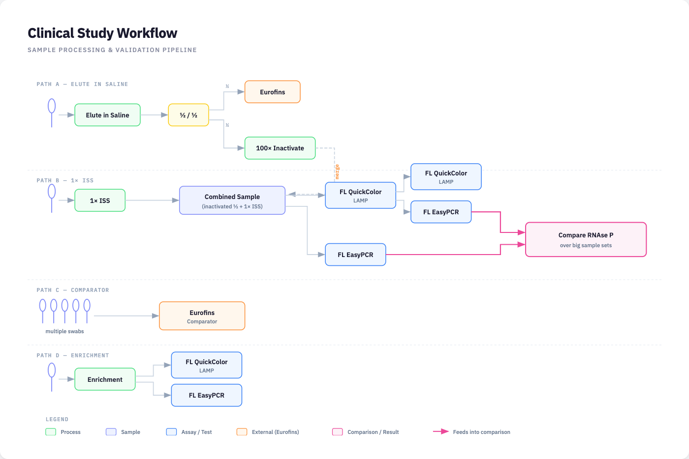
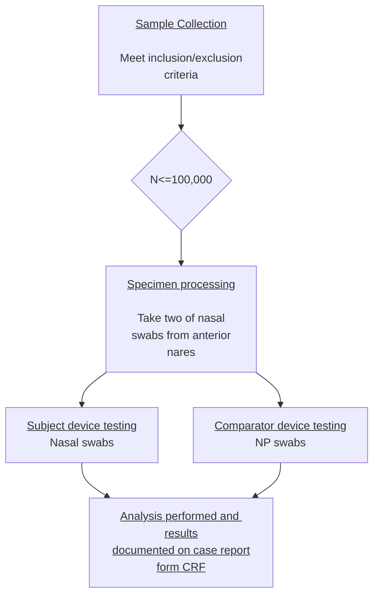

METADATA
last updated: 2026-03-10_105731
file_name: _archive-combined-files_irb_18k.md
category: regulatory
subcategory: irb
gfile_url: **FLAGGED - TBD user-facing Google-hosted public file URL**
words: 
tokens: 

CONTENT

# _archive-combined-files_irb_18k (4 files, 18,063 tokens)

# 6,018  _AI_digestion_irb_new-clinical-study-design.md
METADATA
last updated: 2026-02-28 RT initial creation
file_name: _AI_digestion_irb_new-clinical-study-design.md
file_date: 2026-02-28
title: FloodLAMP Integrated Clinical Study Design - Digestion
category: regulatory
subcategory: irb
tags: clinical-study, enrichment, surveillance, EUA, study-design, cascading-cohort
source_file_type: md
xfile_type: NA
gfile_url: https://docs.google.com/document/d/1kqmFPWjNB7852XZaWs6_SLLt8bdfjE6GSPTmeDcsqBo
xfile_github_download_url: https://raw.githubusercontent.com/FocusOnFoundationsNonprofit/floodlamp-archive/main/regulatory/irb/_AI_digestion_irb_new-clinical-study-design_FULL.md
pdf_gdrive_url: NA
pdf_github_url: NA
conversion_input_file_type: NA
conversion: NA
license: CC BY 4.0 - https://creativecommons.org/licenses/by/4.0/
tokens: 6018
words: 4378
notes: Created by Claude Opus 4.6 Max during archive preparation. **NOT HUMAN VERIFIED - MAY CONTAIN ERRORS** Digestion and analysis of FloodLAMP's integrated clinical study design (~May-August 2022), synthesized from planning notes with whiteboard diagram, associated slide deck/GDoc content, and the original IRB protocol (Protocol 20210401).
summary_short: Digestion of FloodLAMP's integrated clinical study design (~May-August 2022) that merged an active school-based surveillance program with a clinical trial for generating EUA submission data. Covers the enrichment strategy using school exposures and surveillance-detected positives, a cascading cohort structure for maximizing positive specimen yield, comparator testing efficiency, multi-assay validation design, and RNAseP cross-validation, with both internal and external-facing analyses.

CONTENT

## Prompt (Verbatim)
Review the following file and summarize the proposal and try to identify the key reasons for this. This was a new clinical study design that I was trying to figure out and I had an image of it. There, you know, it's not like a single, I don't think it's, I think it's a couple collected kind of associated ideas. But I feel like there's something really important here. I remember thinking this was important and like working on kind of writing it up. I even made a slide deck and it revolved around sort of an integrated, you know, integrating a, like a surveillance program with, doing a clinical study and I think there was like a more comprehensive version of it and a less comprehensive. I'm not really sure. So I want you to kind of summarize, digest, really kind of do a thorough job figuring out what the ideas were, both from the image and from the text and then create a digestion, create the digestion both for me and then also for an external audience, you know, and assume that the external audience is familiar with, you know, diagnostic testing, clinical study designs for testing, etc. So you don't really have to give a background there and just, you know, get to the meat and the key, the key design and ideas behind it. I'm including a project description and a tone here. And you know what? I'm also gonna go ahead and include our IRB. Because that can be some good background info. Okay, do it.

**Files included in context window:**
- _notes_irb_new-clinical-study-design.md
- [hand-drawn whiteboard diagram]
- project-description.md
- tone.md
- IRB - FloodLAMP COVID-19 Biobank and Test Validation Protocol 20210401 v01.md

## Prompt (Cleaned)
Review the following file and summarize the proposal, identifying the key reasons behind it. This was a new clinical study design that I was working on, and I had an image of it. It's not a single idea -- I think it's a collection of associated ideas. I feel like there's something really important here. I remember thinking this was important and working on writing it up. I even made a slide deck, and it revolved around integrating a surveillance program with a clinical study. I think there was a more comprehensive version and a less comprehensive one, but I'm not sure.

Summarize, digest, and do a thorough job figuring out what the ideas were, both from the image and from the text. Create the digestion both for me and for an external audience. Assume the external audience is familiar with diagnostic testing and clinical study designs for testing, so you don't need to provide background -- just get to the key design and ideas behind it.

I'm including a project description and a tone guide. I'm also including our IRB protocol for background context.

**Files included in context window:**
- _notes_irb_new-clinical-study-design.md
- [hand-drawn whiteboard diagram]
- project-description.md
- tone.md
- IRB - FloodLAMP COVID-19 Biobank and Test Validation Protocol 20210401 v01.md

## AI Response - Digestion: FloodLAMP Integrated Clinical Study Design (May 2022)
Done. I created the digestion at `data/floodlamp/regulatory/irb/_digestion_irb_new-clinical-study-design.md` with both an internal and external section.

Here's my read on what was really going on and why it felt important:

**The central idea** was not just a clinical study design but an operational architecture that merged a surveillance program with a clinical trial. Instead of treating these as separate activities (run surveillance over here, run a clinical study over there), the design recognized that a well-structured surveillance program *already contains* most of what you need for a clinical study: consented participants, collection logistics, ongoing testing, and a population with real exposure risk. The study just added the comparator testing, randomization, and formal follow-up protocols on top.

**The enrichment strategy** was the practical engine. Low prevalence was the killer problem for small companies trying to generate clinical data. Instead of brute-force enrolling thousands of people hoping for 20 positives, the design used school exposure events and surveillance-detected positives as triggers to activate intensive serial testing of households. This is much more efficient and avoids the bias concern of re-testing already-confirmed positives from other tests.

**The cascading cohort structure** was the really clever part. One positive pool in a household cascades into daily paired testing of the whole family, catching new infections at onset. Each new positive restarts the cycle. This multiplied the positive specimen yield from each initial detection event, all with properly paired comparator data.

**The RNAseP angle from the whiteboard** adds another layer: by running both FloodLAMP EasyPCR and the Eurofins comparator across large sample sets, you could cross-validate that FloodLAMP's internal sample adequacy control (RNAseP) was reliable. This would strengthen the home collection usability story (proving people collected their swabs properly) and the overall analytical validation.

**The bottom line**: this was a resource-efficient design for a small company that turned the constraint of limited resources into an advantage by making the surveillance program and the clinical study the same thing, with an enrichment strategy that solved the prevalence problem and a cascading cohort structure that maximized data yield per positive event.

### Internal Summary (For the Author)
#### What This Was
This was a clinical study design developed around May-August 2022 to solve several interrelated problems simultaneously. It represented an evolution from the broad, flexible original IRB protocol (which allowed up to 100,000 specimens across multiple collection modes) into a specific, operationally integrated plan. There was a slide deck and at least one detailed planning document associated with it.

#### The Core Insight
The central idea was to merge an active school-based surveillance testing program with a clinical study, so that the surveillance infrastructure (logistics, population, ongoing testing) would serve double duty as the apparatus for generating clinical performance data for EUA submission. Rather than running a standalone clinical trial that required building recruitment, collection, and testing from scratch, the study would ride on top of existing surveillance operations.

This had two major advantages:
1. It solved the recruitment and logistics problem by using an already-running program.
2. It provided direct value to study participants (testing that helped stop spread in classrooms and families), making this genuinely participant-beneficial rather than purely extractive research.

#### The Enrichment Strategy
Low prevalence was the fundamental obstacle to getting enough positive samples. The design addressed this through two enrichment approaches:

1. **Outbreak chasing**: When a school exposure event occurred, recruit the affected families for serial testing. Send collection kits home with the exposed student the same day if possible; collect swabs the next morning and courier them to the lab within hours.

2. **Surveillance-based enrichment**: Pre-recruit families into the study through the surveillance program. When a routine surveillance test came back positive, those families would be activated into the study's formal protocol arms. This was the more systematic, ongoing version.

Both approaches increased the effective positive rate without introducing the kind of bias that would come from, say, only enrolling people who already tested positive elsewhere (which the notes flagged as a concern: "Could/should we ignore how they tested positive? FDA might ding us for bias").

#### The Cascading Cohort Structure
This is where the design got particularly clever. Rather than a single - timepoint collection, it used a cascading structure that multiplied the data yield:

- **Initial Collection**: Pooled family swabs for FloodLAMP + individual comparator swabs. Run QuickColor immediately.
- **Pool Positive path**: Send individual comparator swabs to CLIA lab. Run EasyPCR. Move the family into the Positive Follow Up Cohort.
- **Positive Follow Up Cohort**: The family collects paired individual swabs daily (FloodLAMP + comparator). Also run rapid antigen tests. The logic: other family members were likely exposed and may be developing infections, so continued testing catches new positives as they emerge.
- **Serial Follow Up Cohort**: Willing participants continue daily paired testing. If a new FloodLAMP positive appears, restart the Positive Follow Up protocol for that person.

The net effect: a single initial positive in a household pool could cascade into multiple confirmed positives across family members, each with paired FloodLAMP/comparator data.

#### Cost Optimization
A key practical feature: the expensive comparator PCR did not need to be run on every negative sample. All FloodLAMP-positive pools needed comparator PCR run (to confirm/disconfirm), but for negatives, only a subset (at least 20) required comparator testing. This meant the surveillance testing could scale broadly while keeping comparator costs manageable. The notes mention this as funding-dependent: "Depending on funding we can run larger negative arms that include the comparator PCR, which give greater statistical power."

#### Diagram of Clinical Study Design Ideas
_made with Claude desktop from hand drawn image_

Interactive HTML diagram showing the four sample processing paths in the integrated clinical study design: (A) Elute in Saline, where pooled swabs are split, with half sent to Eurofins as comparator and half through 100x inactivation; (B) 1x ISS, where the inactivated half is combined with 1x ISS and run on both FloodLAMP QuickColor LAMP and EasyPCR; (C) Comparator, where multiple individual swabs are sent to Eurofins; and (D) Enrichment, where enriched individual swabs are run directly on FloodLAMP QC and EasyPCR. Both EasyPCR outputs feed into a cross-validation of RNAseP signal over large sample sets. Based on a hand-drawn whiteboard sketch from the original planning sessions.

#### The Whiteboard Sketch
The whiteboard image shows three tiers of the study:

**Top tier (Main pooled arm)**: Multiple swabs pooled in saline (1X ISS), then split. Half goes to Eurofins (external CLIA lab) as comparator. The other half goes through 100X inactivation, then runs on both FLQC (FloodLAMP QuickColor LAMP) and FLEPCR (FloodLAMP EasyPCR). A key annotation: the Eurofins comparator PCR "Validates RNAseP Signal from our PCR," meaning the external reference data could be used to validate FloodLAMP's internal sample adequacy control (RNAseP) across a large population.

**Middle tier (Individual comparator arm)**: Individual swabs sent to Eurofins, with the specific goal to "Compare RNAseP over big sample sets." This appears to be a dedicated arm for building a large dataset correlating FloodLAMP's RNAseP internal control with the external reference, a useful dataset for demonstrating sample collection and processing quality.

**Bottom tier (Enrichment arm)**: Individual swabs from the enrichment strategy run directly on FloodLAMP QC (QuickColor) and EP (EasyPCR). This is the streamlined path for enriched samples where the focus is on FloodLAMP performance data.

#### What It Was Simultaneously Validating
The study was designed to generate clinical data for multiple claims in a single integrated effort:
1. QuickColor (RT-LAMP) performance
2. EasyPCR (RT-qPCR) performance
3. Pooled vs. individual collection performance
4. Home collection kit usability (with and without the FloodLAMP Mobile App)
5. Asymptomatic testing claim (tests run under moderate complexity)

#### The RNAseP Angle
The whiteboard repeatedly emphasizes RNAseP validation. RNAseP is a human housekeeping gene used as an internal control to confirm that a collected swab actually contains sufficient human cellular material (i.e., the swab was properly collected and processed). By running both FloodLAMP EasyPCR (which detects RNAseP) and the Eurofins comparator across large sample sets, FloodLAMP could validate that its RNAseP signal was a reliable indicator of sample adequacy. This matters for both regulatory submissions and for the usability study (the mobile app arm), where RNAseP signal strength could be used to objectively assess whether participants collected their swabs correctly.

#### Practical Status and Constraints
The August 2022 planning notes show this was being scoped to a single Miami site (Embassy or Nova Southeastern), with one operator (FloodLAMP trained staff member who ran Combate program) running FloodLAMP tests and coordinating the PCR comparator. The comparator was the Abbott M2000 system ($85/test, same-day results but no Ct values). There were open questions about whether EasyPCR could be run at the same site or would need a collaborator (James Roach at Cleveland Clinic Ft. Lauderdale or Mayo). The design acknowledged it could expand to 3 sites for 510K requirements.

#### Why This Felt Important
Looking at it in hindsight, the design's significance was in recognizing that for a small company with limited resources, the path to clinical data did not have to be a traditional standalone trial. By structuring a surveillance program so that it inherently generated clinical-grade data, with proper consent, comparator testing, and enrichment, the company could build toward both EUA submission and a much larger publication-quality dataset using essentially the same operational apparatus. The cascading cohort structure was an efficient way to extract maximum clinical data from a low-prevalence environment. And the RNAseP cross-validation was a genuinely useful secondary dataset that could strengthen both the usability claim and the overall analytical validation story.

### External Digestion (For Audience Familiar with Diagnostic Clinical Study Design)
#### Overview
This document describes a clinical study design developed by FloodLAMP Biotechnologies in mid-2022 for generating clinical performance data for multiple molecular COVID-19 assays (an RT-LAMP test called QuickColor and an RT-qPCR test called EasyPCR), a pooled home collection kit, and an associated mobile application. The design aimed to satisfy EUA submission data requirements while simultaneously establishing infrastructure for a larger dataset suitable for publication and 510(k) submission.

#### Design Rationale
The fundamental challenge was generating sufficient positive clinical specimens during a period of variable and often low SARS-CoV-2 prevalence, using the resources of a small company. The design addressed this by integrating the clinical study into an existing school-based surveillance testing program rather than operating a standalone trial.

#### Integrated Surveillance-Clinical Study Model
The study operated within the framework of an active surveillance program providing serial screening to school populations and their families. This integration served three purposes:

1. **Recruitment pipeline**: Families already participating in surveillance were pre-consented for study participation, eliminating the need for separate recruitment infrastructure.
2. **Enrichment mechanism**: Surveillance testing identified positive individuals and exposure events in real time, enabling targeted activation of clinical study protocols for participants most likely to yield positive specimens.
3. **Participant benefit**: The study provided actionable testing results that helped interrupt transmission within classrooms and households, aligning participant and study interests.

#### Enrichment Strategy
Two enrichment approaches were employed:

- **Exposure-based**: Following a confirmed school exposure event, families of exposed students were recruited for serial testing. Collection kits were distributed same-day when possible, with morning collection and same-day courier to the lab.
- **Surveillance-based**: Families pre-enrolled in the study were activated into the formal clinical protocol when their routine surveillance test returned positive.

Both approaches increased the effective positive specimen rate without selecting for individuals with known positive results from external tests, which would risk introducing ascertainment bias.

#### Cascading Cohort Structure
The study used a multi-stage cohort design that maximized data yield from each positive finding:

1. **Initial Collection**: Participants collected paired specimens: pooled anterior nares swabs for FloodLAMP testing and individual swabs for comparator PCR (high-sensitivity EUA-authorized test at a CLIA lab). Collection order was randomized. QuickColor LAMP was run immediately on the pooled specimen.

2. **Pool Positive Pathway**: If QuickColor detected a positive pool, individual comparator swabs were sent to a CLIA lab (fulfilling the pooled test study arm). FloodLAMP EasyPCR was also run on the same specimen. The family was enrolled in the Positive Follow Up Cohort.

3. **Positive Follow Up Cohort**: All household members collected daily paired individual swabs (FloodLAMP + comparator) plus rapid antigen tests. The rationale: household contacts of newly identified positive individuals were at elevated risk of developing infection, and serial daily testing provided the opportunity to capture new infections at onset, generating additional paired positive specimens with both FloodLAMP and comparator data.

4. **Serial Follow Up Cohort**: Willing participants continued daily paired testing beyond the initial follow-up period. Any new FloodLAMP-positive result restarted the Positive Follow Up protocol for that individual.

This cascading structure meant a single initial positive pool could generate multiple confirmed positive specimens across household members, each with paired investigational and comparator test results.

#### Comparator Testing Efficiency
The design incorporated a cost-optimization: comparator PCR was run on all FloodLAMP-positive specimens but only a defined subset of negatives (minimum 20 for the primary analysis). This allowed surveillance-scale testing volumes without proportional comparator testing costs, while still generating sufficient negative agreement data.

#### Multi-Assay, Multi-Claim Validation
The integrated design simultaneously generated clinical performance data for:
- QuickColor (RT-LAMP) sensitivity and specificity, pooled and individual specimens
- EasyPCR (RT-qPCR) sensitivity and specificity
- Pooled vs. individual collection concordance
- Home collection kit usability (two arms: with and without FloodLAMP Mobile App, assessed via survey, video-recorded collection, and RNAseP-based sample adequacy analysis)
- Asymptomatic screening claim (tests performed under moderate complexity)

#### RNAseP Cross-Validation
A secondary objective involved correlating the RNAseP (human internal control) signal from FloodLAMP EasyPCR against the external comparator across large sample sets. This served dual purposes: validating FloodLAMP's internal sample adequacy metric and providing objective data on self-collection quality, relevant to both the usability study arm and the home collection kit submission.

#### Operational Parameters
The study was planned for a single initial site in the Miami area, with the possibility of expanding to three sites for 510(k) geographic diversity requirements. The comparator assay was the Abbott M2000 real-time PCR system run through a local CLIA lab. The minimum target was 20 prospectively collected positive and 20 negative specimens for the primary EUA analysis, with the surveillance infrastructure positioned to generate a substantially larger dataset over time.

#### Relationship to Prior Protocol
This design operationalized a broader IRB-approved protocol (Protocol 20210401, April 2021) that permitted collection of up to 100,000 specimens across multiple collection modalities. The earlier protocol established the regulatory framework; this design specified how that framework would be executed in practice through integration with surveillance operations.

## Slides - FloodLAMP Clinical Study Design - May 2022
https://docs.google.com/presentation/d/1U6NCayI6slDDV36jrq98A4ScT3X0KzNlIy0CIp348KM

### FloodLAMP Integrated Clinical Study
1) Pooled self collection with the FloodLAMP Pooled Home Collection Kit DTC
2) Tests run under moderate complexity for asymptomatic claim
  - QuickColor
  - EasyPCR
  - Pooled and individual test
3) Usability study of the FloodLAMP Mobile App

The goals of this clinical study are both to obtain the minimum necessary clinical data for EUA submission, as well as put in place the apparatus to obtain a much larger clinical data set, both for publication and for 510K. An enrichment strategy utilizes 1) school exposures, and 2) routine surveillance testing. In both, the clinical study offers value to the participants in providing testing to stop spread within classrooms and families.

### Recruitment
Recruit families for serial testing after school exposure.
Distribute collection materials for FL (pooled and indiv) and comp PCR (likely wet AN swab, pref saline).
if possible send collection kits home with student same day
next morning collection, likely send courier same day (within a few hours)
	
Also run surveillance serial screening program, where families are pre-recruited into the study. For this arm, we use an enrichment strategy where we place families into the study if their surveillance test is positive.

### Initial Collection
Have participants collect 2 swabs shortly after notification of exposure
FloodLAMP is pooled AN swabs (our collection kit)
Comparator PCR is individual AN swab (their collection kit, saline/PBS)
Run FloodLAMP QuickColor immediately

## GDoc - Clinical Study Plan May22 - NEEDS REVIEW AND CLEANUP FOR PUB
https://docs.google.com/document/d/1M9jC0gBEOC1kFlfOWMVSeSfbl2J66zeuLksfuI3MkG4
### 8-2-22 
#### Baseline Assumptions:
* Miami only site (Embassy or Nova)  
  * could extend for 510K req of 3 sites  
* ND running FL and coordinating the PCR comparator  
* QuickColor and EasyPCR tests not the   
* 20 positives and negatives (asymptomatic)  
* Indiv samples (not pooled)  
* Enrichment strategy  
  * Options for recruitment  
    * outbreak chase  
    * outreach to positives from testing programs  
      * them if they are asymp  
      * their contacts  
  * For both Pos and Neg  
    * how to do negs? ads in same venue  
* Comparator must be high sensitivity PCR EUA test not non-EUA LDT

#### Questions
How to run EasyPCR also?

1) freeze inactivated samples and batch up to run all at once? still where??  
2) collaborator such as James Roach at Mayo in FTL

Collection: self collection or HCW collected?  
If/how to include antigen tests?  
If/how to include Combate or other surveillance participants?  
Could/should we ignore how they tested positive? FDA might ding us for bias

- exposure testing serially by antigen tests

Can we run at Embassy?  
Do we want to limit it to Florida and ND running?

Abbott M2000 system \- what ND uses ($85 per test, same day by 9:30pm if submitted by 5:30pm) \- Abbott system does not provide Ct values  
United Clinical Laboratories   
Look for other CLIA labs around Ft Lauderdale

#### Info for Plan
Budget  
Timeframe  
Challenges or Roadblocks

#### To Do's for various people
- [ ] get better understanding of ND's schedule  
- [ ] get info on options for the PCR test, what lab, what assay?  
      
### FloodLAMP Integrated Clinical Study for:
1) Pooled self collection with the FloodLAMP Pooled Home Collection Kit DTC  
2) Tests run under moderate complexity for asymptomatic claim  
   1) QuickColor  
   2) EasyPCR
   3) Pooled and individual test  
3) Usability study of the FloodLAMP Mobile App

The goals of this clinical study are both to obtain the minimum necessary clinical data for EUA submission, as well as put in place the apparatus to obtain a much larger clinical data set, both for publication and for 510K. An enrichment strategy utilizes 1\) school exposures, and 2\) routine surveillance testing. In both, the clinical study offers value to the participants in providing testing to stop spread within classrooms and families.

### Consider including:
* POC for 1XISS in dispenser and reaction mix provided  
* arm for asym people with positive result  
* arm with just our test on repeat swabs and arm with their swab/tube and our test  
* get ND involved when we need another site \- James Roach at Ft. L Cleveland Clinic

### Key Outstanding Questions
- [ ] Do we need a clinical lab to run our QuickColor LAMP test? Or can we run that ourselves in a research lab?

### Recruitment
Recruit families for serial testing after school exposure  
Distribute collection materials for FL (pooled and indiv) and comp PCR (likely wet AN swab, pref saline)

* if possible send home with student same day  
* next morning collection, likely send courier same day (within a few hours)

	  
Also run surveillance serial screening program, where families are pre-recruited into the study. For this arm, we use an enrichment strategy where we place families into the study if their surveillance test is positive.

### Initial Collection
Have participants collect 2 swabs shortly after notification of exposure  
Randomize which swab is done first

- [ ] How to randomize?  
- [ ] Should we consider FloodLAMP first, then 2nd swab for comparator?  
- [ ] Do we need to specify at least 10min and no more than 30min as in our Pre-EUA

FloodLAMP is pooled AN swabs (our collection kit)

- [ ] Is QuickColor & EasyPCR assayed only using pooled AN swabs, or are there multiple arms \- pooled and individual swabs?    
- [ ] Are we comparing pooled AN swabs vs all individual swab comparators in the pool?    
- [ ] In the case of enriched positive samples in the pooled case, are we controlling it so that there is only one positive swab per pool?  If so, how are we sampling the negative swabs? 

Comparator PCR is individual AN swab (their collection kit, saline/PBS)  
Run FloodLAMP QuickColor immediately

#### Pool Positive

If FloodLAMP QuickColor is positive:

* Send indiv comparator PCR swabs to CLIA lab to run. These fulfill the **Pooled Test Study Arm**.  
  * If possible, get frozen aliquot of saline eluted swab (fresh would be difficult, maybe friendly lab).  
* Run fresh FloodLAMP EasyPCR  
* Add family to **Positive Follow Up Cohort** (looking to catch other exposed family members at onset of infection).  
  * Individual swabs for follow up cohort?    
  * QuickColor and EasyPCR?  
  * Comparator swab collected & randomized in the same way?

#### Pool Negative

Select 20 negative pools:

* Send indiv comparator PCR swabs to CLIA lab to run  
* Run fresh FloodLAMP EasyPCR 

If any individual comparator PCR results are positive, move family to Positive Follow Up Cohort

#### Positive Follow Up Cohort

Same day as detecting the positive pool \- have the family collect pairs of individual swabs for FloodLAMP tests and comparator PCR.  
Testing follows the same protocol as initial collection except FloodLAMP swabs are individual instead of pooled.  
Family also collect and each run antigen tests at least 10min after other swabs (document results with photo and time of collection).  
All FloodLAMP QuickColor negatives do not have to be run for the comparator PCR, only a subset (at least 20). Depending on funding we can run larger negative arms that include the comparator PCR, which give greater statistical power to the sensitivity and specificity.

#### Serial Follow Up Cohort

For willing study participants from the Positive Follow Up Cohort, offer to continue serial testing daily per the paired individual swab protocol. The rationale here is that some or all of the family may have been exposed to the likely infected family member(s). By continuing to test them daily in the study, there's the opportunity to pick up a new infection early. Again, the collected PCR swabs only need to be run with the associated cost, if the FloodLAMP QuickColor LAMP test is positive (restart the Positive Follow Up Cohort).  Also running rapid antigen daily as above?  
	

#### Collection Kit Usability Study

See Pre-EUA submitted 5-18-2021, Section H.3  
Includes:

* 12 question survey  
* video recording collection  
* incoming inspection  
* sample adequacy analysis

2 arms, Arm1 without FloodLAMP Mobile App, and Arm2 with the FloodLAMP Mobile App.  
Since all collections for the entire study will be done with the FloodLAMP Mobile App excluding this Arm1, all participants in the study can be given the survey, and their inactivated samples frozen and run on FloodLAMP EasyPCR where the RNAseP signal can be used to assess the sample adequacy. The FDA replied that they did not approve of this but it appears they misunderstood.

### Need to Do/Find
- [ ] Symptom tracker \- maybe rolled into overall daily survey/form, include vaccination/booster status, infection history

### Ideas
- [ ] Get feedback from Dave and others

# 1,560  _context-commentary_regulatory-irb.md
METADATA
last updated: 2026-02-28 RT
file_name: _context-commentary_regulatory-irb.md
category: regulatory
subcategory: irb
words: 1167
tokens: 1560

CONTENT

## Context
An Institutional Review Board (IRB) is an independent ethics committee that reviews and approves research involving human subjects. Any clinical study collecting specimens from human participants, including the clinical performance studies needed for FDA Emergency Use Authorization (EUA) submissions, requires IRB approval before it can begin. The IRB evaluates whether the study design adequately protects participants' rights, safety, and welfare.

This subcategory contains two files from FloodLAMP's IRB process: a clinical study protocol and an informed consent form, both dated April 2021 (Protocol 20210401). The protocol, titled "FloodLAMP COVID-19 Biobank and Test Validation Protocol," outlined a study to collect up to 100,000 consented clinical specimens across multiple U.S. sites to evaluate FloodLAMP's molecular COVID-19 assays (QuickColor RT-LAMP, QuickFluor RT-LAMP, and EasyPCR RT-qPCR) and a home collection kit. The informed consent form documented voluntary participation, specimen handling, de-identification procedures, and participant rights.

The relationship between the IRB and FDA EUA submissions is sequential rather than direct: IRB approval is a prerequisite for conducting a clinical study, and the clinical study generates the performance data that gets submitted to the FDA as part of an EUA application. The IRB itself does not appear in the EUA submission. Rather, it serves as the regulatory gatekeeper that must approve the study before clinical specimens can be collected from human participants. FloodLAMP needed clinical performance data — positive and negative percent agreement against an EUA-authorized high-sensitivity PCR comparator — to support its 2nd round of EUA submissions for pooling, asymptomatic, and the new serial screening claims. Generating that data required running a clinical study on human specimens, and running that study required IRB approval.

Note that this IRB is not related to FloodLAMP's first round of EUA submissions in March of 2021. The Stanford Clinical Lab performed the clinical study for those submissions, using banked samples.

FloodLAMP obtained IRB approval through WCG (formerly Western Institutional Review Board), a well-known commercial IRB. The protocol was broad and flexible, designed to cover three collection modalities: co-located sites adjacent to existing testing programs (such as Stanford or San Francisco city testing sites), independently operated FloodLAMP collection sites, and distributed home collection kits. The study also included provisions for the FloodLAMP Mobile App, pooled specimen collection, and multiple swab types.

Despite obtaining IRB approval and preparing a detailed protocol, FloodLAMP never executed the clinical study, due to the FDA's decision to decline further review of the FloodLAMP EUA and Pre-EUA submissions. The company later developed a more operationally integrated study design in mid-2022 that would have merged clinical data collection with an active school-based surveillance testing program (documented in the companion file `_AI_digestion_irb_new-clinical-study-design.md`), but this design also was not executed before the company ceased operations.

Other parts of the archive document the FDA submission process itself. The fl-fda-submissions and fl-fda-correspondence subcategories in the Regulatory collection contain the EUA applications and related correspondence that these IRB documents were intended to support.

The archive also includes additional IRBs, consent forms, and clinical study designs from other organizations, located in the `IRBs and Consents from Others` subfolder:
- American Cancer Society event LIABILITY WAIVER AND RELEASE OF CLAIMS.pdf
- Arizona Dept of Health Services informed consent.pdf
- Color Genomics IRB.docx
- EmpowerDX (Eurofins) consent form.docx
- Lucira Screenshot_2021-02-17 COVID-19 Test Study.png
- NextEraEnergy PCR Testing Patient Consent Form.pdf
- Stanford Catch Consent.docx
Technical note: These files are not considered primary archive files, and therefore were not converted to markdown and included in the AI-ready combined md files.

## Commentary
The IRB process was handled through WCG (Western Institutional Review Board), with a total cost of approximately $11,360 over two years including a renewal. This was a considerable expense for a small company, made more notable by the fact that the clinical study was never actually conducted. The IRB approval and the detailed protocol it covered remained unused.

The experience highlighted what appeared to be a cumbersome and inefficient process. The IRB pathway felt siloed, with limited templates, examples, or structured support available for small organizations navigating it for the first time, particularly during a public health emergency when speed should have been a priority. For a small company attempting to bring a new diagnostic test through the regulatory pathway during an active pandemic, the combination of IRB costs, the time required to prepare the protocol, and the separate expense of actually running a clinical study created significant barriers to generating the clinical data that the FDA required.

To illustrate the broader cost picture: FloodLAMP received a quote of approximately $100,000 from a clinical research organization to manage participant recruitment and sourcing alone, targeting roughly 40 positive specimens. This did not include running the tests themselves; a separate CLIA laboratory was needed for that. These costs reflected the broader pandemic dynamic, where demand for clinical services far outstripped supply and pricing reflected that imbalance.

The IRB and clinical study process, as experienced, suggests an area where standardization and streamlining could benefit the field, both in routine times and especially during public health emergencies. The barriers to generating clinical performance data disproportionately affect small companies and organizations that lack established clinical trial infrastructure, institutional IRB relationships, or the budgets to absorb six-figure study costs. If decentralized and low-cost diagnostic testing is to play a meaningful role in future pandemic response, the regulatory pathway for generating the required clinical data may need to be correspondingly accessible.

The FDA did recognize elements of this problem. Through a collaboration with the NIH, the Rapid Acceleration of Diagnostics (RADx) program established the Independent Test Assessment Program (ITAP), which provided standardized evaluation protocols, data reporting mechanisms, and targeted outreach to test developers to accelerate regulatory review and authorization. ITAP facilitated the authorization of a number of at-home and point-of-care COVID-19 tests, and the model has since been extended to other diagnostics including multiplex respiratory panels, mpox, and hepatitis. However, ITAP's COVID-19 focus was primarily on rapid antigen tests, and the program's resources and outreach were oriented toward developers with tests already authorized in other markets or at a relatively advanced stage. While ITAP likely accelerated some authorizations, it did not address the more fundamental barriers and inefficiencies of the overall EUA clinical study and IRB process, and it was not readily accessible to smaller, earlier-stage companies and organizations developing novel testing approaches. For more on FloodLAMP's engagement with RADx-related programs, see the archive files in various/fl-proposals subcategory.

Later in FloodLAMP's trajectory, around mid-2022, a new clinical study design was developed that attempted to address some of these constraints. The design integrated clinical data collection into an active school-based surveillance testing program, using an enrichment strategy to solve the low-prevalence problem and a cascading cohort structure to maximize data yield per positive event. This approach would have generated clinical performance data at a fraction of the cost of a standalone trial. The design is documented in a companion file (`_AI_digestion_irb_new-clinical-study-design.md`) and may be of interest to researchers or organizations facing similar challenges in generating clinical data for novel diagnostics during periods of variable disease prevalence.

# 5,914  IRB - FloodLAMP COVID-19 Biobank and Test Validation Protocol 20210401 v01.md
METADATA
last updated: 2026-03-05 by BA
file_name: IRB - FloodLAMP COVID-19 Biobank and Test Validation Protocol 20210401 v01.md
file_date: 2021-04-01
title: IRB - FloodLAMP COVID-19 Biobank and Test Validation Protocol 20210401 v01
category: regulatory
subcategory: irb
tags: 
source_file_type: docx
xfile_type: docx
gfile_url: https://docs.google.com/document/d/1wNnoBzlP1McAloqnas98yz7QE37SgjsI
xfile_github_download_url: https://raw.githubusercontent.com/FocusOnFoundationsNonprofit/floodlamp-archive/main/regulatory/irb/IRB%20-%20FloodLAMP%20COVID-19%20Biobank%20and%20Test%20Validation%20Protocol%2020210401%20v01.docx
pdf_gdrive_url: https://drive.google.com/file/d/1CfEjaewV5HUNElL7qOOUbGFf8OthwZ2E
pdf_github_url: https://github.com/FocusOnFoundationsNonprofit/floodlamp-archive/blob/main/regulatory/irb/IRB%20-%20FloodLAMP%20COVID-19%20Biobank%20and%20Test%20Validation%20Protocol%2020210401%20v01.pdf
conversion_input_file_type: docx
conversion: pandoc
license: CC BY 4.0 - https://creativecommons.org/licenses/by/4.0/
tokens: 5914
words: 4228
notes: 
summary_short: The FloodLAMP COVID-19 Biobank and Test Validation Protocol (Protocol 20210401) lays out an IRB-governed study to collect up to 100,000 consented clinical specimens across multiple U.S. sites to evaluate FloodLAMP’s QuickColor/QuickFluor RT-LAMP assays, EasyPCR RT-qPCR assay, and a home collection kit (including pooled collection and optional mobile app use). It specifies intended use, inclusion/exclusion criteria, collection variations (co-located sites, independent/mobile sites, and distributed “home” kits), specimen handling requirements (e.g., dry swabs within 56 hours or frozen ≤-70°C), QC/control expectations, and comparison to an EUA-authorized high-sensitivity PCR reference method. It describes de-identification and bias-minimization procedures, data collection and statistical analysis plans (PPA/NPA with confidence intervals and call-rate handling), plus monitoring, record retention, deviations, and ethics/safety oversight aligned to GCP and 21 CFR Part 812.

CONTENT

***INTERNAL TITLE:*** FloodLAMP COVID-19 Biobank and Test Validation Protocol

**FloodLAMP COVID-19 Biobank and Test Validation Protocol**

**Protocol Number: 20210401**

## REVISION HISTORY

| **ECR** | **Version Number** | **Date issued** | **Author(s) of changes** | **Details of changes made** |
|-----------|-----------|-----------|-----------------|----------------------|
| N/A | 01 |  |  | Original release ||
||

## KEY STUDY CONTACTS
| **Field** | **Value** |
| :---- | :---- |
| Sponsor | FloodLAMP Biotechnologies, PBC 930 Brittan Ave San Carlos, CA 94070 ||
| Primary Study Contact | Randy True Chief Scientific Officer randy@floodlamp.bio xxx-xxx-xxxx ||
||

## INVESTIGATOR SIGNATURE PAGE

**Protocol Title: FloodLAMP COVID-19 Biobank and Test Validation Protocol**

**Protocol Number: 20210401**

The undersigned confirms that the following protocol has been agreed and accepted. I agree to conduct the trial in compliance with this protocol. I agree to ensure that the confidential information contained in this document will not be used for any other purpose other than the evaluation or conduct of the clinical investigation without the prior written consent of the Sponsor.

I agree to conduct the clinical trial in compliance with the approved protocol and will adhere to the principles outlined in the Declaration of Helsinki, 21 CRF 812.100 General responsibilities of investigators, and the current ICH GCP regulations (ICH E6 (R1) Section 4, the Sponsor’s SOPs (if applicable), National Laws and Regulations, and other regulatory requirements as required.

I certify that I have not been terminated from an investigation due to compliance failure (debarment).

I agree to conduct the investigation(s) in accordance with the investigator agreement, investigational plan, current protocol, applicable regulatory requirements and regulations and conditions of approval imposed by the reviewing IRB.

I agree to personally conduct or supervise the described investigation.

I agree to ensure that all requirements of informed consent are met (if applicable).

I agree to submit sufficient accurate financial disclosure information and to promptly update this information if any relevant changes occur during the course of the investigation and for 1 year following completion of the study.

I agree not to use the device or permit it to be used for any purpose other than the investigational testing specified in the protocol.

I agree not to permit the device to be used before proper training has been given by myself, my study staff members, or sponsor.

I agree to maintain adequate and accurate records and to make those records available for inspection by the sponsor, its representatives, applicable regulatory authorities and the IRB.

I agree to comply with all other requirements regarding the obligations and responsibilities of investigators (21CFR 812.100 General responsibilities of investigators).

|                               |               |          |
|-------------------------------|---------------|----------|
| **Investigator Printed Name** | **Signature** | **Date** |
||

## PROTOCOL SYNOPSIS
|  |  |
| :---- | :---- |
| Clinical Study Protocol Title | FloodLAMP COVID-19 Test Development Study ||
| Protocol Number | 20210401 ||
| Sponsor | FloodLAMP Biotechnologies, PBC 930 Brittan Ave San Carlos, CA 94070 ||
| Investigational Products | FloodLAMP QuickColor TM Test, FloodLAMP QuickFluor TM Test, FloodLAMP EasyPCR TM Test, FloodLAMP Home Collection Kit ||
| Instruments and Software | RT-PCR Instruments, FloodLAMP Mobile App ||
| Controls | Not Provided but necessary: external positive control for the detection of SARS-CoV-2 and to monitor functioning of reagents along with a negative control, to monitor for contamination during sample processing. ||
| Proposed Intended Use | The FloodLAMP COVID-19 Tests comprise several molecular assays that utilize a streamlined sample preparation protocol. The assays include polymerase chain reaction (PCR) and reverse transcriptase loop-mediated isothermal amplification (RT-LAMP). The tests are intended for the qualitative detection of RNA from SARS-CoV-2 in anterior nares (nasal) swab specimens from individuals suspected of COVID-19 by their healthcare provider and from individuals without symptoms or other epidemiological reasons to suspect COVID-19 infection. Testing is limited to laboratories certified under the Clinical Laboratory Improvement Amendments of 1988 (CLIA), 42 U.S.C. §263a, to perform high complexity tests, or by similarly qualified non-U.S. laboratories. Sample pooling is at a baseline level of 4, with on-site and at-home modalities. Pooling of pools to levels greater than 20 will be investigated pending LoD determination and validation studies. Results are for the identification of SARS-CoV-2 RNA. The SARS-CoV-2 RNA is generally detectable in upper respiratory specimens during the acute phase of infection. Positive results are indicative of the presence of SARS-CoV-2 RNA; clinical correlation with patient history and other diagnostic information is necessary to determine patient infection status. Positive results do not rule out bacterial infection or co-infection with other viruses. The agent detected may not be the definite cause of disease. Laboratories within the United States and its territories are required to report all positive results to the appropriate public health authorities. Negative results do not preclude SARS-CoV-2 infection and should not be used as the sole basis for patient management decisions. Negative results must be combined with clinical observations, patient history, and epidemiological information. The assay is intended for use by qualified and trained clinical laboratory personnel specifically instructed and trained in the techniques of real-time PCR and in vitro diagnostic procedures. The assay is only for use under the Food and Drug Administration’s Emergency Use Authorization. Use of the FloodLAMP QuickColor TM Test in a general, asymptomatic screening population is intended to be used as part of an infection control plan that may include additional preventative measures, such as a predefined serial testing plan or directed testing of high-risk individuals. Negative results do not preclude current or future infection obtained through community transmission or other exposures. Negative results must be considered in the context of an individual’s recent exposures, history, and presence of clinical signs and symptoms consistent with COVID-19. ||
| Study Overview | The study will include up to 100,000 unique clinical specimens (will depend on prevalence in the intended population) from across at least 3 geographically diverse testing in the United States. Additional sample collection sites may be brought on to ensure sufficient enrollment for the study. ||
| Clinical Specimen Categories | Fresh Prospective Frozen Prospective ||
| Inclusion/Exclusion Criteria | Inclusion: The specimen is an anterior nasal swab and QR code labeled tube included with the FloodLAMP Home Collection Kit. The swab specimen can be tested within 56 hours or less after collection. If frozen, specimens are to be stored at ≤-70℃ until tested. Subjects with any of the following: Suspected of COVID-19, whether or not symptomatic Not experiencing symptoms and/or who have not notified a physician that they suspect they have COVID-19 Had a positive COVID-19 test within the last 10 days The specimen is from a consenting male or female subject of any age Exclusion: The specimen was not properly collected, identified, transported, processed, or stored according to the instructions provided by the sponsor. The specimen was not collected under informed consent. ||
| Enrollment Dates | Approximately April 1, 2021 through April 1, 2022 ||
| Device Class | Class II, Nonsignificant Risk ||
| Primary Objective | The objective of this study is to generate clinical performance and usability data for the FloodLAMP QuickColor TM , QuickFluor TM , and EasyPCR TM Tests and FloodLAMP Home Collection Kit. ||
| Analysis Method | Upon completion of the clinical validation studies, Positive and Negative Percent Agreement for each target will be calculated and presented in 2x2 tables with the reference vs. subject device including 95% two-sided confidence intervals. ||
||

## 1. INTRODUCTION
### 1.1. BACKGROUND
The COVID-19 pandemic has revealed the value for new modalities of public health focused testing and screening. FloodLAMP's molecular tests and home collection kit combine streamlined extractionless, ultra-low cost, supply chain robust assay protocols with highly scalable at-home and on-site sample collection. Together these enable the new type of mass screening of interacting populations, such as schools and workplaces, to safely reopen society. Furthering this capability is needed (along with vaccines) to ultimately overcome the COVID-19 crisis, first in the U.S., then globally.

The populations most susceptible include the elderly over 65 years old and individuals who have preexisting comorbidities, including diabetes, obesity, and cardiovascular disease.

### 1.2. STUDY RATIONALE
The scope of the study is to validate the FloodLAMP COVID-19 Tests and Home Collection Kit with up to 100,000 unique clinical specimens from across three geographically diverse testing sites in the United States. Number of enrolled patients should be sufficient to ensure at least 20 positive samples are prospectively collected in the intended use populations. The results will be analyzed and compared against results from a CLIA lab that can run an EUA comparator test on dry swabs.

### 1.3. SAMPLE SIZE DETERMINATION
Will depend on the prevalence of SARS-CoV-2 in the intended use populations.

## 2. INVESTIGATIONAL DEVICE PROPOSED INTENDED USE STATEMENT
FloodLAMP QuickColor(TM) COVID-19 Test and FloodLAMP QuickFluor(TM) COVID-19 Test are reverse transcriptase loop-mediated isothermal amplification (RT-LAMP) assay. The FloodLAMP EasyPCR(TM) COVID-19 Test is a real-time reverse transcriptase polymerase chain reaction (RT-qPCR) assay. The tests are intended for the qualitative detection of RNA from SARS-CoV-2 in upper respiratory specimens including nasopharyngeal swabs, anterior nasal and mid-turbinate nasal swabs from individuals suspected of COVID-19 by their healthcare provider and from individuals without symptoms or other epidemiological reasons to suspect COVID-19 infection, when tested at a weekly interval with no more than 9 days between tests. Testing is limited to laboratories certified under the Clinical Laboratory Improvement Amendments of 1988 (CLIA), 42 U.S.C. §263a, to perform high complexity tests, or by similarly qualified non-U.S. laboratories.

Results are for the identification of SARS-CoV-2 RNA. The SARS-CoV-2 RNA is generally detectable in upper respiratory specimens including nasopharyngeal swabs, anterior nasal and mid-turbinate nasal swabs during the acute phase of infection. Positive results are indicative of the presence of SARS-CoV-2 RNA; clinical correlation with patient history and other diagnostic information is necessary to determine patient infection status. Positive results do not rule out bacterial infection or co-infection with other viruses. The agent detected may not be the definite cause of disease. Laboratories within the United States and its territories are required to report all test results to the appropriate public health authorities.

Negative results do not preclude SARS-CoV-2 infection and should not be used as the sole basis for patient management decisions. Negative results must be combined with clinical observations, patient history, and epidemiological information.

The FloodLAMP COVID-19 Tests are intended for use by qualified and trained clinical laboratory personnel specifically instructed and trained in the techniques of *in vitro* diagnostic procedures. The FloodLAMP COVID-19 Tests are only for use under the Food and Drug Administration’s Emergency Use Authorization.

## 3. STUDY OBJECTIVE
The objective of this study is to generate clinical performance data for the FloodLAMP QuickColor(TM) COVID-19 Test, FloodLAMP QuickFluor(TM) COVID-19 Test, FloodLAMP EasyPCR(TM) COVID-19 Test, and the FloodLAMP Home Collection Kit.

## 4. STUDY DESIGN OVERVIEW
### 4.1. PROTOCOL SUMMARY
The purpose of this study is to determine the accuracy and usability of the FloodLAMP COVID-19 Tests and Home Collection Kit in the intended populations compared to a CLIA lab that can run an EUA comparator test on dry swabs. The primary outcome of the study will be to determine the sensitivity and specificity of the FloodLAMP COVID-19 Tests and usability of the Home Collection Kit.

Three modes of sample collection will be stratified:

**Variation 1**: The collection site is co-located with a current testing program for Persons Suspected of COVID that is utilizing a high sensitivity EUA PCR test, e.g., adjacent to Stanford or San Francisco city testing site. After completion of the EUA test specimen collection, the participant would be asked if they would like to participate in the FloodLAMP research study. If the participant accepts, a self-collection kit would be offered, and participants would collect according to printed instructions. Optionally, they may be asked if they would like to download the FloodLAMP app and follow collection instructions through the app. Participants would place the collected specimen tube in a biobag and deposit the biobag in a collection bin.

**Variation 2**: FloodLAMP would independently run a physical or mobile site (e.g., at tent outside the FloodLAMP lab in a parking lot), in the form of a drive thru. A self-collection kit would be picked up by participants or be handed through a car window. Specimens would be collected in the car according to instructions (printed or through app), specimen tubes placed in a biobag, and deposited into a collection bin.

**Variation 3**: Self-collection kits will be distributed, either at the sites described above, other physical locations or through delivery by mail or courier. These are termed "home" collection kits though they may be utilized in a workplace setting, in a car, or at other locations. The home kits will include variations for self-collection of both pooled specimens and individual collected samples. The home collection may include testing of the FloodLAMP app and involve user factors testing with surveys and other interactions with participants.

In all three variations, initial studies will comprise collection of two anterior nares swabs whereby the order of collection is randomized. In Variations 2 & 3, one swab would be sent to a CLIA lab to run an EUA approved Comparator test. The other swab would be used to run the FloodLAMP COVID-19 Tests. Subsequent studies may include collection of other specimen types, including saliva.

Recruitment would be performed online or through other standard means. Optionally, self-collection kits for multiple collections may be provided. Specimens may be pooled for validation studies.

Variations in the self-collection kits will include both supervised and unsupervised versions. Supervision may be provided in person at physical sites or remotely through video for collection in a participant's home or car.

### 4.2. PRIMARY MEASURE OF PERFORMANCE
The results of the FloodLAMP COVID-19 Tests will be compared against results from a reference test for the same set of patient specimens.

***Examination and Interpretation of Patient Specimen Results:***

Assessment of the FloodLAMP COVID-19 Tests of clinical specimen test results should be performed after the positive and negative controls have been examined and determined to be valid and acceptable. If the controls are not valid, the patient results cannot be interpreted. Results will be interpreted according to the Instructions for Use.

### 4.3. ACCEPTANCE CRITERIA
Upon completion of the clinical validation studies, Positive and Negative Agreement for each target will be calculated and data stratified as previously described.

Figure 1: Study Workflow

Dry swabs should be processed within 56 hours from collection.
If frozen, specimens are to be stored at ≤-70°C until tested.

## 5. DEVICE DESCRIPTION
See Instructions for Use: Principles of Procedure

### 5.1. INVESTIGATIONAL USE ONLY KIT CONFIGURATION
See Instructions for Use: Materials Provided but Not Required

### 5.2. REAGENTS, CONSUMABLES AND EQUIPMENT REQUIRED BUT NOT PROVIDED
See Instructions for Use: Standard Lab Equipment and Consumables

### 5.3. REAGENT HANDLING AND STORAGE
See Instructions for Use: Materials Provided but Not Required

### 5.4. CONTROLS
See Instructions for Use: Running Tests - Controls Preparation, Results Interpretation - Test Controls

### 5.5. INSTRUMENTS AND SOFTWARE
See Instructions for Use: Running Tests

## 6. STUDY SPECIMENS
### 6.1. SPECIMEN SELECTION
The enrollment period will span from the date of first specimen is enrolled to the date of last specimen is enrolled at a site as determined by the Sponsor. Valid specimens are those that meet the criteria outlined in sections 7.2 and 7.3. Patient informed consent (documented using forms provided by the site, provided online, or within the FloodLAMP Mobile App) will be required for this study. No results derived from the investigational device will be included as part of any subject patient management diagnostic algorithm.

### 6.2. INCLUSION CRITERIA
Specimens must meet **all** the below criteria to be considered for study enrollment.

1.  The specimen is an anterior nasal swab using the swab and QR code labeled tubes included with the FloodLAMP Home Collection Kit.

2.  The swab specimen can be tested within 56 hours of collection. If frozen, specimens are to be stored at ≤-70℃ until tested.

3.  Subjects with any of the following:

    - Suspected of COVID, whether or not symptomatic

    - Not experiencing symptoms and/or who have not notified a physician that they suspect they have COVID-19

    - Had a positive COVID test within the last 10 days

4.  The specimen is from a consenting male or female subject of any age.

### 6.3. EXCLUSION CRITERIA
Specimens that meet **any** of the below criteria may not be considered for study enrollment.

1.  The specimen was not properly collected, identified, transported, processed, or stored according to the instructions provided by the sponsor.

2.  The specimen was collected at a site which is not covered under the study IRB.

## 7. STUDY PROCEDURE
### 7.1. BLINDING OF THE STUDY AND PROCEDURES TO MINIMIZE BIAS
In order to preserve the confidentiality of subjects, the following procedures will be implemented:

1.  Clinical data will be de-identified.

2.  Available clinical information will be provided in such a way that it does not make the subject identifiable.

3.  No personal identifiers or protected health information (PHI) will be collected or included as part of any study data so the confidentiality of each subject is protected.

4.  Patient specimens will be assigned a unique study number by an individual with no direct involvement in the study (Honest Broker).

5.  Testing personnel will not have access to any prior clinical data or reference method (comparator) results.

### 7.2. SAMPLE TYPES, SAMPLE COLLECTION, PROCESSING AND STORAGE
#### 7.2.1. Specimen Types
**Fresh Prospective**

Best efforts will be made to enroll and test at least 20 fresh, prospectively (FDA guidance for asymptomatic testing) collected, confirmed SARS-CoV-2 positive subjects. A combination of fresh and frozen specimens may be tested to reach the 20 asymptomatic subjects required.

#### 7.2.2. Specimen Collection and Processing
**Refer to the Instructions for Use**

FloodLAMP COVID-19 Test swab samples should preferably not be frozen or refrigerated prior to elution and should be tested within 56 hours from collection. If frozen, specimens are to be stored at ≤-70℃ until tested.

### 7.3. QUALITY CONTROL
***Procedural Control:***

Prior to testing patient specimens, QC for each test system should be run according to local, state and federal regulations and the Instructions for Use.

***External Positive and Negative Controls:***

One positive and one negative control will be included on every 96-well plate with up to 94 samples, or with every batch of strip tubes on each heater. All test controls should be examined prior to interpretation of patient specimen results. If the controls are not valid and the expected result, the specimen results cannot be interpreted. Refer to the Instructions for Use.

### 7.4. REFERENCE METHOD
Results from the subject device will be compared to a high sensitivity purified PCR EUA Authorized test. Reference testing may be performed at one or more of the clinical trial sites or a centralized testing laboratory. If a site is also conducting testing of the subject device, different personnel will be assigned to oversee and perform reference testing.

## 8. RESULTS
### 8.1. RESULTS INTERPRETATION
Refer to the Instructions for Use.

Assessment of the results of FloodLAMP Tests should be performed after the positive and negative controls have been examined and determined to be valid and acceptable. If the controls are not valid, the patient results cannot be interpreted.

### 8.2. DATA COLLECTION
**Demographic Data**

Age/age range, gender and ethnicity will be collected on each subject enrolled in the study.

**Missing Data**

If required data are missing for any subject, then the results of any testing may be excluded from the final data analysis set. An explanation will be provided in the EUA submission.

**Determination of Sample Size**

The total number of subjects that will be included in the study will depend on the prevalence of specimens that meet the inclusion criteria.

## 9. REGULATORY AND ADMINISTRATIVE REQUIREMENTS
### 9.1. PROTOCOL AMENDMENTS
Any modification to the protocol, which may impact on the conduct of the study, including changes of study objectives, study design, patient population, study procedures, and significant administrative aspects, will require a formal amendment to the protocol.

The approval letter, signed/approved by the IRB chairman, must refer specifically to the Investigator, the Sponsor protocol number, the protocol title, the protocol amendment number and the date of the protocol amendment.

Administrative changes to the protocol are minor corrections and/or clarifications that have no impact on the way the study is to be conducted and may not indicate an IRB formal review. These administrative changes will be agreed upon by the Sponsor and the Investigator. The IRB may be notified of administrative changes at the discretion of the Investigator.

### 9.2. DOCUMENTING AND HANDLING OF DEVIATIONS FROM THE PROTOCOL
Deviations to the protocol will be noted in the EUA Submission.

### 9.3. RECORD RETENTION
All records and documents pertaining to the conduct of the study, including but not limited to Electronic Data Record Form for a period of at least two years after the last approval of a marketing application in an ICH region and until there are no pending or contemplated marketing applications in and ICH region or at least two years have elapsed since the formal discontinuation of clinical development of the investigational product. These documents should be retained for a longer period, however, if required by the regulatory requirements or by an agreement with the Sponsor (Good Clinical Practice: Consolidated Guidance (ICH-E6 section 4.9.5)).

### 9.4. CASE REPORT FORMS (CRF)
Individual subject’s data will be recorded. No personal identifiers will be recorded on this form and at no point during the study (including the sample retention period) will the Investigator, study personnel, or the Sponsor, have access to patient identifiers.

### 9.5. MONITORING OF STUDY SITES
The clinical study shall be monitored by the trained clinical study personnel or designated representative via remote communications and/or on-site visits throughout the duration of the study. The study staff member or designated representative shall discuss any issues or problems concerning the conduct of the study with the Investigator and/or Sponsor.

### 9.6. QUALITY ASSURANCE AUDITS
During the study, representatives from the Sponsor may visit the site to carry out an audit of the study. Such an audit will require access to records that are relevant to the study. Sufficient prior notice will be provided to allow the investigator to prepare properly for the audit. Similar auditing procedures may also be conducted by agents of applicable regulatory agencies reviewing the results of the study. Participation in this study implies acceptance of potential inspections by the Sponsor or applicable regulatory authorities.

### 9.7. STUDY COMPLETION AND CLOSE OUT
Upon completion of the study, the Investigator shall notify the IRB of the conclusion of the study. The final report will be sent to the IRB.

## 10. STATISTICAL ANALYSES
Upon completion of the clinical validation studies, Positive and Negative Percent Agreement for each reportable target will be calculated and presented in 2x2 tables with the reference vs. subject device. Data will be combined across sites.

Initial call rates will be calculated. For specimens with invalid results, regardless of the reason, one repeat per specimen will be permitted. Final call rates will then be calculated using the results from the repeat analyses.

**Exclusion of Specimens from Analysis**
Any specimens that do not meet the Inclusion/Exclusion criteria will be removed from the final data set with a rationale provided in the EUA submission.

## 11. RISK ANALYSIS
### 11.1. CLINICAL STUDY SITES AND INFORMED CONSENT
This study has been determined by the Sponsor to be a Nonsignificant Risk. Each site will be responsible for submitting the Clinical Study Protocol and associated templates for institutional/third party IRB review and approval prior to study initiation. Subject recruitment will be performed, and informed consent will be required for this study. The testing personnel and sites will represent the environment for which the device is intended.

## 12. SAFETY
**DEFINITIONS** 
Adverse Event 

An adverse event (AE) is any untoward medical occurrence, unintended disease or injury or any untoward clinical signs (including any abnormal medical finding) in subjects, users, or other persons whether or not related to the investigational medical device.

Serious Adverse Device Effect

Adverse device effect that has resulted in any of the consequences characteristic of a serious adverse event.

Unanticipated Serious Adverse Device Effect (USADE)

Serious adverse device effect which by its nature, incidence, severity or outcome has not been identified in the current version of the risk analysis report.

NOTE: Anticipated: an effect which by its nature, incidence, severity or outcome has been previously identified

## 13. ETHICS
Use of human subjects in this evaluation will be subject to approval by an Institutional Review Board (IRB). Written statements of the IRB approvals of this protocol will be documented in the study file. The current investigation is in accordance with 21 CFR Part 812 (c)(3) and the FDA Information Sheet Guidance for IRBs, Clinical Investigators, and Sponsors (January 2006).

## 14. ASSOCIATED DOCUMENTS
14.1. Instructions for Use FloodLAMP QuickColor(TM) COVID-19 Test v1.0

14.2. Instructions for Use FloodLAMP QuickFluor(TM) COVID-19 Test v1.0

14.3. Instructions for Use FloodLAMP EasyPCR(TM) COVID-19 Test v1.0

14.4. Instructions for Use FloodLAMP Home Collection Kit

14.5. Research Subject Information and Consent Form

14.6. Case Report Form

# 2,965  IRB - FloodLAMP Informed Consent 20210401 v01.md
METADATA
last updated: 2025-12-18 RT
file_name: IRB - FloodLAMP Informed Consent 20210401 v01.md
file_date: 2021-04-01
title: IRB - FloodLAMP Informed Consent 20210401 v01
category: regulatory
subcategory: irb
tags: 
source_file_type: docx
xfile_type: docx
gfile_url: https://docs.google.com/document/d/1C9JnoXGmkyXQDSk4vIbyCnJD1gF7p-U3
xfile_github_download_url: https://raw.githubusercontent.com/FocusOnFoundationsNonprofit/floodlamp-archive/main/regulatory/irb/IRB%20-%20FloodLAMP%20Informed%20Consent%2020210401%20v01.docx
pdf_gdrive_url: https://drive.google.com/file/d/1wtZEiDitbU7cq6MxKyR0HZpld7SeF-Dc
pdf_github_url: https://github.com/FocusOnFoundationsNonprofit/floodlamp-archive/blob/main/regulatory/irb/IRB%20-%20FloodLAMP%20Informed%20Consent%2020210401%20v01.pdf
conversion_input_file_type: docx
conversion: pandoc
license: CC BY 4.0 - https://creativecommons.org/licenses/by/4.0/
tokens: 2965
words: 2013
notes: 
summary_short: The FloodLAMP COVID-19 Biobank and Test Validation Protocol informed consent form explains voluntary participation in donating biospecimens (e.g., blood, saliva, and various swabs) and optional surveys for research and test development. It outlines what participants should expect (no individual results, minimal risks, possible re-contact), how samples/data are coded and de-identified under HIPAA, and who may access or receive shared de-identified data. It also discloses ownership and potential commercialization of specimens/data, participant rights to withdraw, and oversight by an independent IRB.

CONTENT

***INTERNAL TITLE:*** RESEARCH SUBJECT INFORMATION AND CONSENT FORM

**TITLE:**	FloodLAMP COVID-19 Biobank and Test Validation Protocol

**PROTOCOL NO.:**	20210401  
	  
**SPONSOR:**	FloodLAMP Biotechnologies, Public Benefit Corporation

**INVESTIGATOR:**	Randall True  
	FloodLAMP Biotechnologies, PBC  
	930 Brittan Ave  
	San Carlos, CA 94070  
	USA

**STUDY-RELATED**  
**PHONE NUMBER(S):**	xxx-xxx-xxxx between 9:00 AM \- 5:00 PM PST

## Part 1: Information and Consent Form

**Why is this research being done?**

The purpose of this study is to collect biological samples (also called specimens) for research use in FloodLAMP's laboratory. Examples of biological samples include blood, saliva, nasal swabs, throat swabs, nostril swabs, and cheek swabs. These samples may be used to develop new tests and/or evaluate and improve existing tests such as tests to detect viruses such as SARS-CoV-2.

The researchers in this study are employees of and own equity interest in the sponsor company,  
FloodLAMP Biotechnologies, PBC. Please feel free to ask any further questions you might have about this matter.

**How many people will be in this study?**  
We may enroll up to 100,000 people in this research study.

**What will happen if I join this study?**  
We will ask you to sign this Consent Form prior to collection of your biological specimens, and we may ask you to complete a short survey. Your participation in this study is voluntary. You are not required to answer any additional questions and can always say "No". If you choose to participate in this study, we will ask you to affirm that you have read and agree to the study consent form by signing your name.

We will then ask you to provide one or more biological samples including blood, saliva, sputum,  
nasal (nasopharyngeal), throat (oropharyngeal), nostril (anterior nares), and check (buccal).  
Samples will be self-collected and/or collected by trained personnel.

* **Blood Draw:** To donate a blood sample, you will have your blood drawn (about 1  
  tablespoon). It will take you about 10-15 minutes to donate a blood sample.  
* **Saliva Spit:** To donate a saliva sample, you will spit (about 2 teaspoons) directly into a collection container. It will take you about 5 minutes to donate each saliva sample.  
* **Sputum Cough:** To donate a sputum sample, you will first rinse your mouth with water and then produce a deep cough that produces mucus, which you will spit directly into a collection container. It will take you about 5 minutes to donate each sputum sample.  
* **Nasopharyngeal (NP) Swab:** To donate a nasopharyngeal sample you will tilt your head back, and a swab will be inserted in your nostril. The swab will be left in place for several seconds to absorb secretions before removing. This procedure may be performed in both nostrils. It will take you about 5 minutes to donate each nasopharyngeal sample.  
* **Oropharyngeal (Throat) Swab:** To donate an oropharyngeal sample, a swab will be inserted into your mouth and the back and sides of your throat will be swabbed (posterior pharynx and tonsillar areas). It will take you about 5 minutes to donate each oropharyngeal sample  
* **Anterior Nares (AN, Nasal) Swab:** To donate an anterior nares sample, you will insert a swab into your nostril and swab the inside of your nostril. Repeat for the other nostril. It will take you about 5 minutes to donate each anterior nares sample.  
* **Buccal (Cheek) Swab:** To donate a buccal sample, you will insert a swab into your mouth between the cheek and upper gum and swab the inner cheek. It will take you about 5 minutes to donate each buccal swab sample.

At the time of donation, we will also describe the collection method for each sample type in-person. You are not required to provide any or all of the requested sample types, and you can always say "No".

All samples will be collected on an as-needed and volunteer basis. Your sample will not be labeled with any of your identifiable information but will be assigned a unique code for re-contacting purposes. We may re-contact you by phone or email sometime in the future to collect another set of samples. You are not required to provide another set of samples, and you can always say "No".

Your participation in this study involves you giving broad consent. This means that you allow your information and samples to be used for a variety of future research which will be reviewed by an Independent Review Board (IRS), but which cannot be specified at this present time.

**Will I receive results?**  
No, you will not receive any results as part of this research study.

**What are my other options?**  
This is not a treatment trial. You may choose not to participate in this study.

**What are the benefits of participating in the study?**  
There is no direct benefit to you for participating in this research study. However, by participating in this research study, you are contributing to scientific knowledge that may lead to new discoveries that could indirectly benefit you or your family members.

**What are the risks or discomforts of the study?**  
The risk of participating in this study is minimal. For blood draws, you may experience bruising and swelling around the puncture site, dizziness or fainting, or infection (rare) during the blood draw.

For nasal swabs and throat swabs, you may experience some mild pain or feel a little discomfort  
during the collection process. You may gag a little or experience a minor nosebleed after some of the swab collection processes. You can stop or withdraw from providing a sample at any time.

There is a potential risk of breach of confidentiality.

There may be other risks to you that are unknown.

**Will it cost me anything to be in this study?**  
No, there is no cost to you to participate in this research study.

**Will I be paid if I join this study?**  
Participation in this study is voluntary and you are not guaranteed payment. However, some sample collection visits and/or surveys may be eligible for monetary or cash equivalents in the form of gift cards, as compensation for your time, travel, and/or any other inconveniences related to your participation. If you are eligible for a sample collection visit and/or survey that offers compensation, you will be provided additional information about compensation prior to your visit.

**How long is the study?**  
The study does not currently have a set end date, but your active participation ends after completion of specimen collection and the survey. We may re-contact you by phone or email sometime in the future to request another set of samples

**Can I leave the study early?**  
Yes. Your participation in this research study is voluntary. You may choose not to participate or  
change your mind at any time and for any reason without penalty or loss of benefits to which you are otherwise entitled. If you decide to leave the research study, contact FloodLAMP at   
650- 394-5233 between 9:00 AM \- 5:00 PM PST or email support@FloodLAMP.bio. If you withdraw from this study, your samples and the data derived from your samples and other information will be destroyed if possible. Data that are already being used for research cannot be destroyed or removed.

**How will my privacy be protected?**  
The information we gather from you for this study will be kept confidential and managed according to the requirements of HIPAA. These include the right to know who will be able to get your information and why they may be able to get it. Our lab will assign an anonymous identifier to each sample, which will be used in our research. For FloodLAMP research purposes, all individually identifiable information will be de-identified using the HIPAA Safe Harbor method for de-identification of protected health information (see 45 CFR 164.514).

**Who will have access to my information?**  
FloodLAMP will have access to your information. All information will be stored in a secure password protected database or, in the case of paper documents, in a secure location at FloodLAMP. Your sample and information will be de-identified, meaning certain identifying information that associates such samples and information with you will be removed. Samples will be coded with a number which can only be linked to your identifying information by FloodLAMP. FloodLAMP will use information collected through this study for research purposes, including product development and/or improvement.

At FloodLAMP, we believe that sharing scientific data will help accelerate the pace of discoveries. Your deidentified sample and information may be accessed by third-party research institutions. Any identifying information that associates such samples and information with you will be removed.

Your private information and your medical record will be shared with individuals and organizations that conduct or watch over this research, including:

* The research sponsor  
* People who work with the research sponsor  
* The Institutional Review Board (IRB) that reviewed this research

We may publish the results of this research. However, we will keep your name and other identifying information confidential.

We protect your information from disclosure to others to the extent required by law. We cannot promise complete secrecy.

**Potential Commercial Interest**  
By signing this consent, you agree that your specimen and any data associated with such specimen will be owned by FloodLAMP. If a commercial product or service is developed from this study, the commercial product will be owned by FloodLAMP or its designee. By taking part in this study, you agree that FloodLAMP (and other research groups or organizations) are free to apply for and use intellectual property (including patents) relating to any inventions arising from this research.

There are no plans to provide any financial compensation (money) or financial benefit or other benefit to you for such commercialization, and you will not profit financially from any products or services developed from your participation in this study.

**What do I do if I have any questions, concerns, complaints or feel I have a research-related problem about the study?**  
If you have questions, concerns, or complaints, or think this research has hurt you or made you sick, talk to the research team at the phone number listed above on the first page.

FloodLAMP does not expect that any injury will result from your participation in this study. However, if you are injured as a direct result of study procedures, you will receive medical treatment. You and/or your health plan/insurance will be billed for this treatment. FloodLAMP has no plans to pay for this treatment. There are no plans to offer any type of payment for injury. However, by signing this form, you have not given up any of your legal rights. In the unlikely event that an injury does result from your participation in this study, you can contact FloodLAMP at xxx-xxx-xxxx between 9:00 AM \- 5:00 PM PST or email support@FloodLAMP.bio.

**What other things should I know about this research study?**  
This study is approved by Western Institutional Review Board (WIRB). WIRB's objective is to protect the rights and welfare of the people taking part in human research studies. You may contact WIRB if you have questions about your rights as a participant, if you have questions, concerns, or complaints, or if you think you have not been treated fairly, at 360-252-2500 or Help@wirb.com.

## Part II. Certificate of Paper Consent or Signed Electronic Consent  
I have read this Consent Form describing how my information will be stored, used, and disclosed for the FloodLAMP COVID-19 Biobank and Validation Protocol. My sample will be de-identified at the time of collection. I will not receive any results as part of this study. This study is voluntary; I am not required to provide any or all specimens and/or specimen types as part of this study. I have had a chance to ask questions about the storage, use, and disclosure of my information. My questions have been answered to my satisfaction, and I agree to participate in the FloodLAMP COVID-19 Biobank and Validation Protocol Study.

Name of participant: \_\_\_\_\_\_\_\_\_\_\_\_\_\_\_\_\_\_\_\_\_\_\_\_\_\_\_\_\_\_\_   Date: \_\_\_\_\_\_\_\_\_\_\_\_\_\_\_\_

Phone: \_\_\_\_\_\_\_\_\_\_\_\_\_\_\_\_\_\_\_   Email: \_\_\_\_\_\_\_\_\_\_\_\_\_\_\_\_\_\_\_\_\_\_\_\_\_\_\_\_\_\_\_

Home address: \_\_\_\_\_\_\_\_\_\_\_\_\_\_\_\_\_\_\_\_\_\_\_\_\_\_\_\_\_\_\_\_\_\_\_\_\_\_\_\_\_\_\_\_\_\_\_\_

Signature of participant: \_\_\_\_\_\_\_\_\_\_\_\_\_\_\_\_\_\_\_\_\_\_\_\_\_\_\_\_\_   Date: \_\_\_\_\_\_\_\_\_\_\_\_\_\_\_\_

Signature of witness: \_\_\_\_\_\_\_\_\_\_\_\_\_\_\_\_\_\_\_\_\_\_\_\_\_\_\_\_\_\_\_   Date: \_\_\_\_\_\_\_\_\_\_\_\_\_\_\_\_

Signature of person obtaining consent: \_\_\_\_\_\_\_\_\_\_\_\_\_\_\_\_\_\_   Date: \_\_\_\_\_\_\_\_\_\_\_\_\_\_\_\_

\[Agree and Complete Enrollment\]
