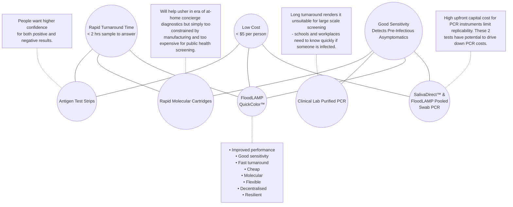
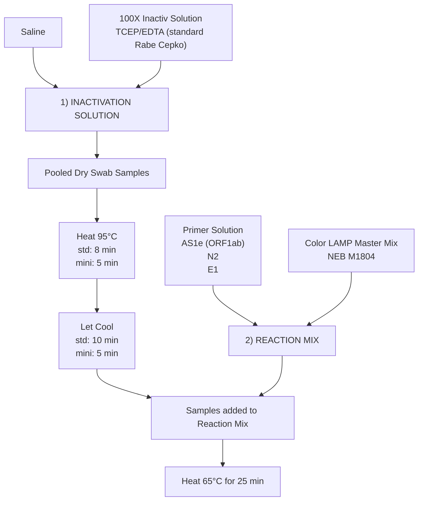
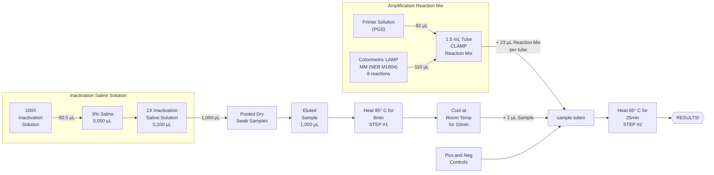
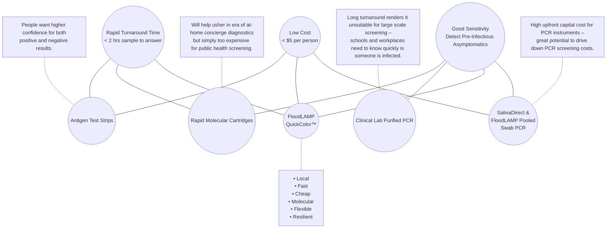
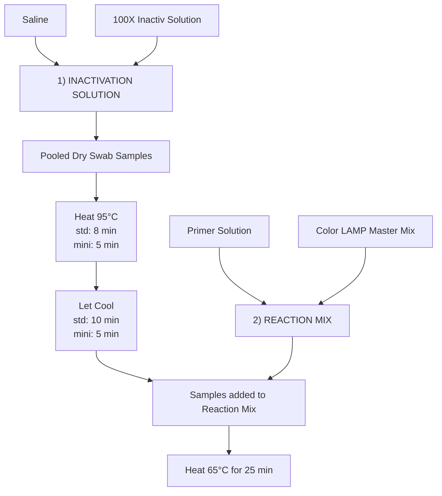
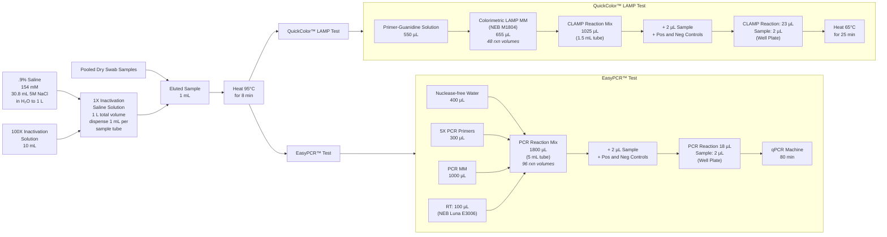
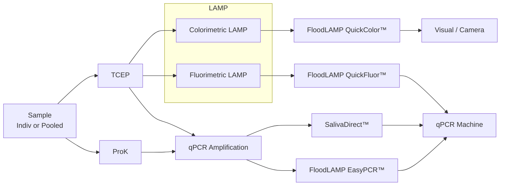
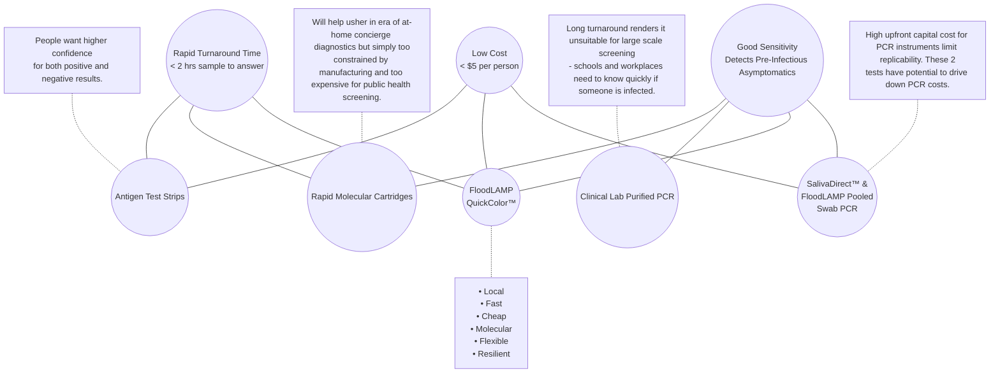
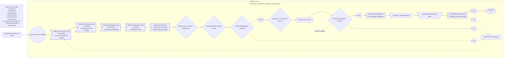

METADATA
last updated: 2026-03-10_105747
file_name: _archive-combined-files_various_409k.md
category: various
subcategory: NA
gfile_url: **FLAGGED - TBD user-facing Google-hosted public file URL**
words: 
tokens: 


CONTENT

# _archive-combined-files_various_409k (74 files, 409,296 tokens)

METADATA
last updated: 2026-03-10_105736
file_name: _archive-combined-files_external-programs-reports_60k.md
category: various
subcategory: external-programs-reports
gfile_url: **FLAGGED - TBD user-facing Google-hosted public file URL**
words: 
tokens: 


CONTENT

# _archive-combined-files_external-programs-reports_60k (12 files, 60,440 tokens)

# 2,429  _AI_RADx Program Overview - NIH Rapid Acceleration of Diagnostics.md
METADATA
last updated: 2026-02-20 RT initial creation
file_name: _AI_RADx Program Overview - NIH Rapid Acceleration of Diagnostics.md
file_date: 2026-02-20
title: RADx Program Overview - NIH Rapid Acceleration of Diagnostics
category: various
subcategory: external-programs-reports
tags: 
source_file_type: md
xfile_type: NA
gfile_url: https://docs.google.com/document/d/13X6tcUSaSfGbyhfCm6BDQK9HW27khP3Ung6iUe5d67k
xfile_github_download_url: https://raw.githubusercontent.com/FocusOnFoundationsNonprofit/floodlamp-archive/main/various/external-programs-reports/RADx%20Program%20Overview%20-%20NIH%20Rapid%20Acceleration%20of%20Diagnostics.md
pdf_gdrive_url: NA
pdf_github_url: NA
conversion_input_file_type: NA
conversion: NA
license: CC BY 4.0 - https://creativecommons.org/licenses/by/4.0/
tokens: 2429
words: 1571
notes: Created by Claude Opus 4.6 Max during archive preparation. **NOT HUMAN VERIFIED - MAY CONTAIN ERRORS** AI-generated overview of the NIH RADx initiative combining information from FloodLAMP archive documents with public web sources (NIH, NIBIB, PMC). Source archive documents include: RADx 2020 Submitted Proposal, RADx 2022 Solicitation, RADx 2022 Submitted Proposal, and 2024-03-01 RADx Tech Report on COVID-19 Diagnostic Technologies. Web sources include NIH RADx program pages, NIBIB RADx Tech timeline, and NIH Director's Blog.
summary_short: An overview of the NIH Rapid Acceleration of Diagnostics (RADx) initiative, covering its $1.5 billion congressional appropriation, four program arms (RADx Tech, RADx-UP, RADx-rad, RADx ATP), milestone-driven innovation funnel structure, key accomplishments including 55 FDA EUAs and 7.8 billion tests of U.S. capacity, and ongoing expansion beyond COVID-19 into multiplex respiratory diagnostics and other public health applications.


CONTENT

## Prompt (Verbatim)
Okay, so here provide a general summary of what RADx was and just have this only be a paragraph. Kind of how long they operated, what agency they were under, and how much funding.

Oh, I meant for you not to just draw from the archive, but overall you can search the web.

Yes - Go ahead and do that search and create the updated information. You know, it can be longer than a paragraph and I think it's going to be better to do some of it as bullet points and structure it in Markdown and start with heading level two, not heading level one. And I think I'm going to pull out the Rad-X stuff and do it as a separate file or a couple of files. It's because it's so important. So for now, in this processed commentary, I'm just going to leave a placeholder for this as a work in progress.

## Prompt (Cleaned)
Provide a general summary of what the NIH RADx program was, structured in markdown with level-two headings. Cover how long it operated, what agency it was under, how much funding it received, and its key accomplishments. Search the web for comprehensive public information in addition to drawing from FloodLAMP archive documents. Use bullet points and structured formatting rather than a single paragraph. This will be saved as a standalone reference file in the archive because the RADx program is important enough to warrant dedicated coverage.

**Files included in context window:**
- _context-commentary_various-fl-proposals_INITIAL.md
- prompt_context-commentary_interview.md
- RADx 2020 Submitted Proposal - FloodLAMP (Aug 2020 - 1M - Not Funded).md
- RADx 2022 Solicitation - High-Performance COVID-19 Rapid Tests (Oct 2022).md
- RADx 2022 Submitted Proposal - FloodLAMP (Oct 2022 - 3M - Not Funded).md
- 2024-03-01_RADx Tech Report on COVID-19 Diagnostic Technologies.md
- prompt_save-ai-response-to-archive-md.md
- Waste Disposal and Risk Assessment.md


## RADx Program Overview

The Rapid Acceleration of Diagnostics (RADx) initiative was launched by the National Institutes of Health (NIH) on April 29, 2020, just five days after Congress appropriated $1.5 billion to NIH for SARS-CoV-2 testing through the Paycheck Protection Program and Health Care Enhancement Act (signed April 24, 2020). The initiative was created to dramatically accelerate the development, validation, and commercialization of COVID-19 diagnostic testing technologies, compressing development timelines from years to months. Funding support later transitioned to the American Rescue Plan Act of 2021.

RADx was led by the National Institute of Biomedical Imaging and Bioengineering (NIBIB), operating in collaboration with the NIH Office of the Director (OD). The program leveraged the existing NIBIB Point-of-Care Technologies Research Network (POCTRN) infrastructure and coordinated closely with the FDA, CDC, BARDA, ASPR, and the Department of Defense. Approximately 900 collaborators from government, academia, and the private sector participated in the RADx Tech network.


## Four RADx Programs

The RADx initiative comprised four distinct programs:

### RADx Tech
The flagship technology development arm, focused on speeding the development, validation, and commercialization of innovative point-of-care and home-based tests, as well as improved clinical laboratory tests. RADx Tech used a competitive, milestone-driven "innovation funnel" that matched test developers with teams of technical, business, manufacturing, and regulatory experts. The first solicitation offered up to $500 million across all phases of development. Three separate solicitation rounds were conducted:

- **RADx Tech I (2020)**: Initial call for rapid COVID-19 testing technologies. Received 716 applications before the portal closed in August 2020. Within the first 24 hours alone, 400 proposals were submitted.
- **RADx Tech II (2021)**: Focused on advanced-readiness technologies including multiplex tests, tests with PCR-comparable performance, and variant-detecting tests. Only considered technologies that could reach market in 2021.
- **RADx Tech III (2022)**: Two sub-solicitations -- one for accessible OTC tests usable by persons with disabilities, and one for high-performance OTC/POC tests with universal design features and performance approaching or exceeding lab-based tests. Funded 25 Work Package 1 projects.

### RADx-UP (Underserved Populations)
Focused on understanding and reducing COVID-19 testing disparities in vulnerable and underserved populations, including racial and ethnic minorities, residents of nursing homes and correctional facilities, rural communities, underserved urban populations, pregnant women, and people experiencing homelessness. RADx-UP established clinical research sites across the country and collaborated with community organizations such as tribal health centers, houses of worship, and homeless shelters. The program supported 142 awarded projects.

### RADx-rad (Radical)
Supported non-traditional, "outside-the-box" approaches to COVID-19 testing and surveillance. The program awarded over $107 million to fund 49 research projects across 43 U.S. institutions. Focus areas included:

- Non-traditional viral screening using biological or physiological markers
- Novel analytical platforms with new chemistries or engineering approaches
- Wastewater detection methods for community-level surveillance
- AI-integrated diagnostic systems
- Breath-based and airborne detection biosensors
- Smell and taste function tests as infection indicators

### RADx ATP (Advanced Technology Platforms)
Supported late-stage development of innovative point-of-care and home-based tests along with improved clinical laboratory tests to increase U.S. testing capacity.

Additionally, the **Independent Test Assessment Program (ITAP)** was launched in collaboration with the FDA to accelerate authorization of tests produced outside the U.S. ITAP independently conducted analytical and clinical validation according to FDA-agreed protocols, allowing the FDA to authorize new tests in a matter of days after data submission. ITAP accounted for approximately half of the increased testing capacity in the U.S.


## Innovation Funnel Structure

The RADx Tech innovation funnel used a stage-gated process to maximize efficiency:

- **Rolling Review**: Proposals evaluated by external expert panels on technical, clinical, regulatory, and commercial feasibility.
- **Deep Dive**: Selected projects underwent a two-week intensive examination by RADx Tech experts to identify risks and develop milestone-driven work plans.
- **Work Package 1 (De-Risking)**: Addressed high-risk barriers to success. Milestone-driven funding with close NIBIB monitoring.
- **Work Package 2 (Implementation)**: Full range of activities for FDA authorization, manufacturing, and commercialization. Funding contingent on WP1 milestone achievement and market competitiveness.

Initial Phase 2 contract awards in 2020:

| Date | Amount | Contracts |
| --- | --- | --- |
| July 31, 2020 | $248.7 million | 7 contracts |
| September 2, 2020 | $129.3 million | 9 contracts |
| October 6, 2020 | $98.4 million | 6 contracts |
| | | |


## Key Accomplishments

As reported in the March 2024 RADx Tech program report:

- Evaluated over 1,000 proposals from 47 states/territories and 23 countries
- Funded over 250 organizations to develop diagnostic technologies
- 242 applications (15-20% of total) underwent in-depth review by RADx expert teams
- 68 projects received funding for de-risking and validation
- 50 projects received funding for authorization and deployment
- Produced 55 FDA Emergency Use Authorization tests
- U.S. capacity exceeding 7.8 billion tests and test products
- First-ever EUA for a COVID-19 OTC diagnostic test (December 2020)
- 18 FDA-authorized OTC COVID-19 tests
- 12 OTC COVID-19 devices authorized through ITAP
- A POC test received an EUA within 10 weeks of program launch
- 125 publications by RADx Tech members and collaborators
- First EUA granted for a test aligned with accessibility design principles
- Best-practice guidelines for accessible test design published June 20, 2023

Monthly U.S. test production scaled rapidly in 2020: from over 16 million in September to over 24 million in December. By February 2022, U.S. testing capacity reached over 1.2 billion tests monthly, with more than 85% being rapid home or point-of-care tests -- compared to fewer than 8 million tests performed in April 2020.


## Community Programs and Distribution

RADx Tech established several programs beyond direct test development:

- **RADx MARS (Mobile At-Home Reporting through Standards)**: Standardized how self-reported home test results are collected and transmitted to state, federal, and local health systems.
- **Make My Test Count**: Website for self-reporting home test results, launched November 2022, replacing manufacturer apps with a single reporting pathway. Supported all FDA-authorized OTC COVID-19 and COVID-19/Flu multiplex tests.
- **Say Yes! COVID Test (SYCT)**: Cooperative effort with state and local health departments, NIH, and CDC that distributed over 2 million free home tests in select communities. Demonstrated that home testing can impact behavior and reduce community transmission. Lessons learned enabled the covidtests.gov nationwide free test distribution.
- **Home Test-to-Treat**: Virtual community health intervention providing free COVID-19 tests, telehealth consultations, and treatments to eligible individuals at home. Later expanded to include influenza testing and treatment.
- **COVID-19 Test Accessibility Program**: Partnership with HHS agencies and disability advocates to develop and publish best-practices for universally accessible test design, hosted on the U.S. Access Board website.


## Ongoing Operations and Expansion

As of the March 2024 program report, RADx Tech continues to operate and has expanded beyond COVID-19. The RADx infrastructure is being leveraged for:

- Multiplex home and POC diagnostic products for COVID-19, Flu, and RSV
- POC multiplex tests for lesion-presenting diseases including Mpox, HSV1/2, VZV, and Syphilis
- POC test for Hepatitis C to support a U.S. elimination program
- Fetal Monitoring Challenge to reduce fetal mortality
- Blueprint MedTech for medical devices addressing pain and nervous system diseases
- Maternal Health Challenge for devices to reduce maternal mortality in underserved settings
- Advanced Platforms for HIV Viral Load Testing at the POC


## Sources
- NIH RADx program pages: https://www.nih.gov/research-training/medical-research-initiatives/radx
- NIBIB RADx Tech timeline: https://www.nibib.nih.gov/covid-19/radx-tech-program/radx-tech-timeline
- NIBIB RADx Tech program: https://www.nibib.nih.gov/programs/radx-tech-program
- RADx Tech March 2024 White Paper: https://www.nih.gov/sites/default/files/research-training/initiatives/radx/RADx-Tech-White-Paper-March-2024.pdf
- NIH news release on RADx-rad: https://www.nih.gov/news-events/news-releases/nih-support-radical-approaches-nationwide-covid-19-testing-surveillance
- PMC article "Radical solutions": https://pmc.ncbi.nlm.nih.gov/articles/PMC8023346/
- FloodLAMP archive: 2024-03-01_RADx Tech Report on COVID-19 Diagnostic Technologies.md


# 822  _context-commentary_various-external-programs-reports.md
METADATA
last updated: 2026-02-18 RT
file_name: _context-commentary_various-external-programs-reports_WIP.md
category: various
subcategory: external-programs-reports
words: 628
tokens: 822


CONTENT

## Context
This subcategory contains a curated selection of external reports and reference documents related to COVID-19 testing programs, particularly K-12 school surveillance testing. None of the files were produced by FloodLAMP Biotechnologies, and the organizations represented had no formal affiliation with the company. The collection is not exhaustive. It represents a fraction of the external reports that FloodLAMP reviewed during its operational period but provides a representative cross-section of how institutions at various levels approached COVID-19 testing in schools.

The majority of the files (seven of ten) focus specifically on school testing. They span from a September 2020 compendium by UnitedHealth Group on safe school reopening strategies, through state- and district-level implementation documents from Massachusetts, San Francisco, Rhode Island, and California, to federal guidance from the CDC on funding and deploying screening testing in K-12 settings. These documents collectively illustrate the evolving operational complexity of school testing programs during the pandemic: early-stage planning frameworks, procurement processes (including a detailed SFUSD RFP and Q&A), pooled testing protocols, "test to stay" policies, and state-level public health guidance for the 2021-22 school year.

Two files sit outside the school-testing focus. The Testing Commons overview from ASU and the Rockefeller Foundation provides a snapshot of the global COVID-19 diagnostic test landscape as of mid-2021, cataloging FDA EUA tests by type and technology. The RADx Tech report from March 2024 summarizes the NIH/NIBIB Rapid Acceleration of Diagnostics program, describing its innovation funnel approach and program outcomes, including 55 FDA EUA tests and a U.S. capacity exceeding 7.8 billion tests and test products.

The final file is a FloodLAMP-compiled index of links and notes on testing programs, playbooks, lab partners, and operational references from various organizations, including Color Genomics, Curative, Ginkgo Bioworks, Mirimus, Poplar Healthcare, and several school districts. This index served as a working reference during FloodLAMP's pilot development and provides a snapshot of the testing program landscape as it appeared in mid-2021.

This subcategory connects to several other parts of the archive. The school testing reports provide context for FloodLAMP's own pilot programs documented in the Pilots collection, particularly the school-based surveillance programs. The regulatory landscape referenced in these documents (FDA EUAs, surveillance vs. clinical testing distinctions) aligns with material in the Regulatory collection, especially the fda-policy and fda-euas subcategories. The Testing Commons and RADx materials relate to the broader diagnostic technology ecosystem in which FloodLAMP operated, relevant to the lamp-tech and papers subcategories in the Various collection.


## Commentary
There were a lot of reports generated during the pandemic, and what's in this subcategory is a small and somewhat arbitrary selection. Most of these documents date from 2020 to 2022, with the exception of the RADx Tech report from March 2024. That means there's likely been considerable additional post-mortem analysis published since 2022 that isn't captured here.

One thing of note is that these reports, taken together with the much larger body of pandemic testing literature that exists, may be an important resource. With AI tools, this material could be systematically sourced, analyzed, and compiled, particularly with a focus on what worked and what didn't for scalable testing and screening programs. The school testing documents in particular capture a specific operational challenge that recurs: how do you set up and sustain high-volume, decentralized testing programs with limited infrastructure and varying levels of institutional readiness? That's the same problem FloodLAMP was working on.

This subcategory is not at all comprehensive. It's more of a snapshot of what we were looking at while building our own programs. But for someone interested in the operational side of pandemic testing at the institutional level, these files provide concrete examples of how school districts, state departments of education, and federal agencies approached the problem at different scales and at different points in the pandemic timeline.


# 13,104  2020-09-01_School Testing_UnitedHealth Group - Safe and Strategic Return to School.md
METADATA
last updated: 2026-03-06 by BA
file_name: 2020-09-01_School Testing_UnitedHealth Group - Safe and Strategic Return to School.md
file_date: 2020-09-01
title: UnitedHealth Group - Safe and Strategic Return to School (Sept 2020)
category: various
subcategory: external-programs-reports
tags: school testing, uhg
source_file_type: pdf
xfile_type: NA
gfile_url: NA
xfile_github_download_url: NA
pdf_gdrive_url: https://drive.google.com/file/d/1pvPDW9TWeag782XHRh4uscIMoZDLJMiN
pdf_github_url: https://github.com/FocusOnFoundationsNonprofit/floodlamp-archive-wip/blob/main/various/external-programs-reports/2020-09-01_School%20Testing_UnitedHealth%20Group%20-%20Safe%20and%20Strategic%20Return%20to%20School.pdf
conversion_input_file_type: pdf
conversion: ai (claude sonnet 3.5)
license: 3rd Party
tokens: 13104
words: 9263
notes: 
summary_short: UnitedHealth Group’s Safe and Strategic Return to School (September 2020) compiles COVID-19-era recommendations for reopening and keeping K–12 schools open, including a community transmission “action level” framework tied to in-person/hybrid/remote models. It lays out practical operational guidance on ventilation, distancing, cleaning, transportation, symptom screening, testing (including pooling), communication, and outbreak response. A “Safe Health Compact” summarizes shared responsibilities for schools and families to support compliance and continuity of instruction.


CONTENT

UNITEDHEALTH GROUP

***INTERNAL TITLE:*** Safe and Strategic Return to School
September 2020

With over 150 million people reliant on UnitedHealth Group (UHG) services, we are committed to using our entire ecosystem to improve the health of the people we serve. The following information is a compendium of sourced recommendations based on local and national guidelines. UHG offers this guidance covering the following topics to support safe and strategic in-person education:
1. **Know the prevalence and risk for your community**
   a. Data for the school's service area should confirm flattening curves (fewer new cases)
   b. Confirm appropriate healthcare system capacity
2. **Support your school system**
   a. Prepare your buildings:
      i. Evaluate traffic flow through common areas to avoid crowding
      ii. Ensure adequate ventilation
      iii. Reset classrooms to create space for learning with social distancing guidelines
   b. Evaluate ancillary processes, such as transportation and meal delivery, to ensure safe delivery of these services
   c. Ensure frequent and open communication with stakeholders, including staff, students, families, and community members
3. **Support your staff, students, and parents**
   a. Develop a social contract to instill mutual trust and accountability
   b. Educate staff on symptoms and risk factors, ensuring adequate protection for high-risk staff
   c. Supply staff with personal protective equipment (PPE)
   d. Supply students with masks
   e. Implement a symptom tracking program, which could include temperature tracking
   f. Consider surveillance testing (if available)
   g. Provide mental health supports for all staff and ensure that robust mental health supports are available for students and families
   h. Educate families on symptoms and risk factors, ensuring that alternative models of education are available for high-risk students
   i. Create protocols for special education students
4. **Take steps to keep your classrooms open**
   a. Create a decision-making process that incorporates local guidance and the Community Action Level for Schools
   b. Evaluate hybrid or wave models to return to the classroom
   c. Review all extracurricular activities and modify for safety
   d. Develop a comprehensive plan to support staff and students if an outbreak occurs

## Introduction
As school leaders prepare for the 2020–2021 academic year, schools will need effective science- and data-driven strategies to form plans to reopen and remain open which balance quality of education with the health and safety of students, teachers, and staff.

Schools are essential to successful communities and long-term disruptions to school can be catastrophic for children. For example, Hurricane Katrina, which closed New Orleans schools for several months in 2005 and displaced thousands of students, had significant consequences for children as they returned to New Orleans. School leaders reported that students returned to school more than two years below grade level, and it took multiple years of individualized attention to resolve learning losses. In 2015, Louisiana topped the nation with the highest number of opportunity youth—ages 16 to 24—who are neither working nor in school and who would have been elementary students when Katrina hit. The COVID-19 pandemic's interruption of education may have a lifetime impact on an entire generation of children. Care must be taken to lessen this impact as much as possible.

However, schools cannot remain open at any cost. The safety of students and staff must be prioritized. A Gallup survey from July 2020 found that 57% of teachers are very concerned about being exposed to coronavirus in the workplace compared to 21% of all other US workers, and 24% of teachers are at heightened risk of COVID-19 infection. Additionally, according to the Kaiser Family Foundation, a majority of mothers worry that their child (77%) or another family member (77%) will get sick if their child returns to school in person and 73% are concerned that schools will be unable to comply with public health recommendations. It is apparent that clear communication strategies paired with accommodations for high-risk individuals are critical for ensuring success and reducing anxiety in order to keep children in the classroom.

With over 150 million people reliant on UnitedHealth Group (UHG) services, we are committed to using our entire ecosystem to improve the health for the people we serve. Health is comprised of the physical, mental, social, financial, and spiritual wellbeing of a person or population, and—according to the World Health Organization—the traditional healthcare system only contributes about 10% to overall health, with the balance being composed of social, environmental, behavioral, and genetic factors. As such, it is important to address all of these aspects of a person's community in order to reduce the risk of future illness and increasing the chance to be a productive member of society. With this aim in mind, UHG offers this guidance covering the following topics to support safe and strategic in-person education:

1. Know the prevalence and risk for your community
2. Support your school system: buildings, classrooms, and processes
3. Support your staff, students, and parents: social contract, education, communication, and protocols
4. Take steps to keep your classrooms open: establishing routines and auditing performance

## 1. Know the Prevalence and Risk for Your Community
Keeping staff and students in schools starts with understanding the infection rate within your community. Stabilizing or declining case counts ("flattening the curve"), testing and contact tracing availability, hospital capacity, and PPE availability, as well as state and local guidelines, will determine whether a community is able to safely continue in-person learning.

UHG's Community Alert Level—Schools (Table #1) provides guidance for levels of community transmission and the appropriate actions that should be taken at each level. Monitoring school and community health department data are also important for identifying potential spikes in infectivity and taking action to anticipate and manage outbreaks.

### Table #1: Community Action Level—Schools
| Sum of New Cases in District Area (last 14 days) | Procedure | People | Symptom Checking | Temperature Testing | Other Protocol (each level is additive) |
|--------------------------------------------------|-----------|--------|-------------------|---------------------|----------------------------------------|
| Level 1 <10/100,000 | In-Person Classes for All Students | Students | Daily | Not required | • Hygiene protocols in place<br>• No groups of more than 50 |
| Level 1 <10/100,000 | In-Person Classes for All Students | Faculty & staff | Daily | Not required | • Hygiene protocols in place<br>• No groups of more than 50 |
| Level 1 <10/100,000 | In-Person Classes for All Students | Delivery/contractors/etc. | Daily | Not required | • Hygiene protocols in place<br>• No groups of more than 50 |
| Level 1 <10/100,000 | In-Person Classes for All Students | Visitors | Day of visit | Not required | • Hygiene protocols in place<br>• No groups of more than 50 |
| Level 2 10-199/100,000 | In-Person Classes for Most Students | Students | Daily, 7 days prior | Not required | • High-risk stay home<br>• Enhanced cleaning protocols in place<br>• Mandatory 6' physical distancing or strict mask use when distancing not possible due to behavior or physical space |
| Level 2 10-199/100,000 | In-Person Classes for Most Students | Faculty & staff | Daily, 7 days prior | Not required | • High-risk stay home<br>• Enhanced cleaning protocols in place<br>• Mandatory 6' physical distancing or strict mask use when distancing not possible due to behavior or physical space |
| Level 2 10-199/100,000 | In-Person Classes for Most Students | Delivery/contractors/etc. | Daily | Not required | • High-risk stay home<br>• Enhanced cleaning protocols in place<br>• Mandatory 6' physical distancing or strict mask use when distancing not possible due to behavior or physical space |
| Level 2 10-199/100,000 | In-Person Classes for Most Students | Visitors | Daily, 7 days prior | Not required | • High-risk stay home<br>• Enhanced cleaning protocols in place<br>• Mandatory 6' physical distancing or strict mask use when distancing not possible due to behavior or physical space |
| Level 3 200-399/100,000 | Hybrid Classes | Students | Daily, 12 days prior | Daily | • High-risk stay home<br>• Hybrid learning using groups rotating 3 days in and 2 days out (3-2) model<br>• Restrictions on common areas<br>• Essential visitors only |
| Level 3 200-399/100,000 | Hybrid Classes | Faculty & staff | Daily, 12 days prior | Daily | • High-risk stay home<br>• Hybrid learning using groups rotating 3 days in and 2 days out (3-2) model<br>• Restrictions on common areas<br>• Essential visitors only |
| Level 3 200-399/100,000 | Hybrid Classes | Delivery/contractors/etc. | Daily | Daily | • High-risk stay home<br>• Hybrid learning using groups rotating 3 days in and 2 days out (3-2) model<br>• Restrictions on common areas<br>• Essential visitors only |
| Level 3 200-399/100,000 | Hybrid Classes | Visitors | Daily, 12 days prior | Day of visit | • High-risk stay home<br>• Hybrid learning using groups rotating 3 days in and 2 days out (3-2) model<br>• Restrictions on common areas<br>• Essential visitors only |
| Level 4 400-599/100,000 | Hybrid Classes | Students | Daily, 14 days prior | Daily | • High-risk stay home<br>• Hybrid learning using groups rotating 4 days in 10 days out (10-4) model<br>• No in-person group extracurricular activities |
| Level 4 400-599/100,000 | Hybrid Classes | Faculty & staff | Daily, 14 days prior | Daily | • High-risk stay home<br>• Hybrid learning using groups rotating 4 days in 10 days out (10-4) model<br>• No in-person group extracurricular activities |
| Level 4 400-599/100,000 | Hybrid Classes | Delivery/contractors/etc. | Daily | Daily | • High-risk stay home<br>• Hybrid learning using groups rotating 4 days in 10 days out (10-4) model<br>• No in-person group extracurricular activities |
| Level 4 400-599/100,000 | Hybrid Classes | Visitors | No visitors | No visitors | • High-risk stay home<br>• Hybrid learning using groups rotating 4 days in 10 days out (10-4) model<br>• No in-person group extracurricular activities |
| Level 5 >=600/100,000 | Distance Learning for All Students | Students | Daily | Daily | • Close facility except for essential workers and essential services |
| Level 5 >=600/100,000 | Distance Learning for All Students | Faculty & staff | Daily | Daily | • Close facility except for essential workers and essential services |
| Level 5 >=600/100,000 | Distance Learning for All Students | Delivery/contractors/etc. | Daily | Daily | • Close facility except for essential workers and essential services |
| Level 5 >=600/100,000 | Distance Learning for All Students | Visitors | No visitors | No visitors | • Close facility except for essential workers and essential services |
||

### Declining Case Counts
Stabilizing the rate of infections is important for preventing ongoing virus transmission and stabilized or declining case counts are required for safely staying in the classroom. School leaders should look at their community's 14-day average case count per hundred thousand population as the primary indicator of viral transmission in the community. This metric is calculated as follows:
1. Divide the population of the school's service area by 100,000
2. Add all new cases in the last 14 days in the service area
3. Divide the total new cases (2) by the output of the first division (1)

This metric could be analyzed at the zip code level or the county level depending on the district area and the data available from the local health department. This metric provides guidance as to whether there are low enough levels of viral transmission to allow for in-person instruction.

#### Testing and Contact Tracing Capacity
Adequate regional capacity for rapid diagnostic testing is crucial for keeping active infections at a safe enough level for remaining in school. This means available testing for (1) hospitalized patients, (2) healthcare workers, (3) all other essential workers in public-facing roles, (4) anyone seeking outpatient care for symptoms, and (5) close contacts of those with confirmed diagnoses. Modeling shows that in populations with adequate physical distancing measures, contact tracing can act synergistically with other containment measures as part of a back-to-work strategy. State health departments may have the most up-to-date information about regional testing and contact tracing.

### Healthcare System Capacity
Regional hospital capacity should be adequate to treat everyone requiring hospitalization at the standard of care, as opposed to a crisis standard of care, as defined by the Institute of Medicine. This should include adequate ICU bed availability and adequate PPE for the healthcare workforce.

Adequate ICU bed availability is defined, according to the Society of Critical Care Medicine, as capacity to expand to 5–7 beds per 10,000 adults, allowing for regional variation and including adequate staffing (with emergency plans in place to increase that number to 30 beds per 10,000 adults in case of a surge). The Centers for Disease Control (CDC) publishes a dashboard on national and state-level hospital bed availability.

Adequate PPE, as recommended by the CDC, includes gloves, N95 respirators, face masks, shields, and isolation gowns for all healthcare providers, along with face masks for patients with confirmed or suspected cases. Many state health departments have the most up-to-date information about regional PPE supply chains.

#### International Guidance
Some countries have returned to in-person education, and the outcomes of these initial openings can be used to inform the development of plans for maintaining in-person education in the US. ISC Research, a provider of English-medium K-12 international school data, is tracking back-to-school plans in the US and internationally and may be a useful source of updates. In addition, the European Union is tracking the responses of its member states for opening schools.

#### State and Local Guidelines

School leadership should evaluate their state and local guidelines for additional guidance, if available.

## 2. Support Your School System
Building and classroom preparation are required. Adequate space to accommodate physical distancing, robust ventilation systems, modified transportation capacity, and frequent cleaning are critical for safely remaining in the classroom.

### Building Capacity to Support Physical Distancing
Classrooms need to be modified to ensure that students and staff have adequate space for physical distancing. Desks and workstations should be spaced or blocked to provide six feet of distance between people working. If workstations are to be occupied by different individuals throughout the school day, the workstations should be fully disinfected between uses. Plexiglass dividers can be used in areas where distancing may not be achievable. Close or modify common areas, gymnasiums, and cafeterias.

Students should avoid unnecessary travel and exposure to other students. Consider having teachers or educators move between classrooms for different subjects whenever possible instead of the traditional movement of students between classrooms. Keeping students in classes or pods can limit transmission if a positive case occurs in the school.

Outside the classroom, consider adding signage to limit the number of people in elevators or other tight spaces. Encourage one-way traffic flow in hallways and stairwells. Signage and floor stickers can remind students and staff of distancing requirements. If possible, modify entrances, cafeterias, and other common spaces to reduce or eliminate crowding. Minimize touchpoints, such as using automated door openings or modifying door handles to allow for pushing doors open.

School leaders should consider modifying start and end times to allow for staggered arrivals to reduce crowding at the beginning and end of each school day as well as during breaks, if transportation and other policies can accommodate.

Conduct routine audits to evaluate the effectiveness of current physical distancing practices. These audits will use current CDC and OSHA guidelines for ongoing best practices. Physical distancing audits could consider how the organization has altered or should continue to alter its personnel policies in order to maintain the lowest risk of virus transmission. These audits would review policies regarding procedures for reintroducing employees into traditional school settings and allowing them to safely remain in these settings, as well as preparedness measures in the event of employees being exposed to COVID-19. Audits of which policies are working may result in revisions to school policy in order to follow best practices, such as dismissal and physical distancing practices.

### Residential Schools
Residential schools should consider additional modifications to living areas. For common areas (shared kitchens, dining rooms, laundry rooms, bathrooms, activity rooms, exercise rooms, etc.), restrict access to a limited number of people at one time and reconfigure space to allow for adequate physical distancing. Shared kitchens and bathrooms merit particularly frequent and careful cleaning.

Residential schools should also provide isolation and quarantine areas for residents who contract or are exposed to COVID-19. If on-campus housing is not feasible, consider off-campus locations for isolation and quarantine. Similar accommodations are recommended for students who live off campus. Any isolation and quarantine facilities must be physically separated from residential spaces and must bear proper signage indicating that they are restricted areas but should not indicate their purpose due to concerns of stigma and FERPA/HIPAA violations. Rooms for isolation and quarantine should have private bathroom facilities and be provided with a thermometer, sanitizing wipes, tissues, soap, hand sanitizer, and toiletries.

### Ventilation
Adequate ventilation is key for reducing aerosol transmission. Consider reviewing the ventilation systems in school buildings in consultation with HVAC professionals to ensure best practices whenever possible, with considerations for local weather and air quality. These can include increasing the percentage of outdoor air circulating in the building by both opening windows (if local air quality permits) and opening minimum outdoor air dampers as high as 100% if systems permit. Increase central air filtration to the highest filtration available and run filtration systems 24/7 whenever possible to ensure continuous air flow. Ventilation is also important when cleaning and disinfection are taking place.

School leaders should explore the feasibility of using other community spaces or outdoor spaces for classrooms, both to increase ventilation and to achieve physical distancing. In Italy, for example, schools are using closed movie theaters, church halls, and tented outdoor space for additional classroom space.

### Hygiene
Signage and handwashing stations can help encourage students and staff to regularly wash their hands and reduce crowding at existing sinks or bathrooms. Use automated soap dispensers whenever possible to reduce touchpoints. The CDC recommends washing with soap and water because it is more effective than hand sanitizers at removing germs and chemicals, especially when hands are dirty. When soap and water are not available, students and staff should have access to hand sanitizer containing at least 60% alcohol. To prevent poisonings from the ingestion of hand sanitizer, place immovable dispensers in highly visible locations where use can be monitored. To preserve skin health and prevent irritation that can accompany frequent hand washing and the use of hand sanitizers and other disinfectants, consider making hypoallergenic hand lotion available. Disinfecting wipes should also be accessible for students and staff to clean desks and keyboards.

### Cleaning Protocols
Cleaning services should regularly disinfect all classrooms, common areas, and workspaces. Consider providing cleaning staff with training or educational materials on the safe handling of cleaning products, adequate protective equipment, and clear protocols for preventing overexposure to chemicals.

The coronavirus has been found to live on glass, metal, ceramic, or paper surfaces for five days, wood for four days, plastics or stainless steel for two to three days, cardboard for one day, copper for four hours, and aluminum for two to eight hours.

Schools should follow research-backed disinfecting practices as closely as possible. The CDC has issued interim recommendations for cleaning and disinfecting community facilities. For disinfecting hard, non-porous surfaces, most common EPA-registered household disinfectants are effective. Household bleach will be effective against coronaviruses when properly diluted (1/3 cup per gallon of water). For soft, porous surfaces such as carpeted floors or rugs, clean with appropriate cleaners indicated for use on those surfaces. If items can be laundered, launder using the warmest appropriate water setting for the items and then dry completely. For electronics, follow the manufacturer's instructions for all cleaning and disinfection and consider use of wipeable covers for electronics. If no manufacturer guidance is available, use alcohol-based wipes or sprays that contain at least 70% alcohol. Dry surfaces thoroughly. Remind employees to adhere to the recommended "wet time" (time the surface must remain wet with the cleaning product in order to kill bacteria, virus, and parasites) for the product used.

Consider providing staff and students with disinfecting wipes to use on their individual workstation to reinforce the importance of cleaning and hygiene.

#### Cleaning after Exposure
When persons suspected or confirmed to have COVID-19 have been in a school facility, that site should be decontaminated. CDC guidelines for cleaning and disinfection of facilities where there have been suspected or confirmed cases recommend closing off areas visited by the ill persons and, if possible, opening outside doors and windows, using ventilating fans to increase air circulation in the area, and then waiting 24 hours or as long as practical before cleaning and disinfecting. Cleaning staff should then clean and disinfect all areas used by the infected persons, focusing on frequently touched surfaces.

Consider using foggers or misting equipment from a professional decontamination service. This would allow a site to be closed for a period of time so the infectious droplets could settle and then be effectively cleaned by standard protocols, or to introduce sufficient ventilation to effectively disperse the infected particles.

Conduct internal sanitation audits regularly to document what is being done correctly or incorrectly and identify areas where improvement is required. Consider noting in any routine sanitation audits any surfaces in the building most likely to harbor germs, including chairs, coffee stations, desks, door handles, light switches, reception areas, tables, elevator buttons, etc., and creating a plan to address any issues identified in the audits.

### Transportation
Evaluate school transportation options to determine what modes of transportation can maintain optimal physical distancing. Buses can be modified to maintain social distancing guidelines. For example, a 77-passenger bus can be modified to hold 13 students at six feet apart, or 26 students at five feet apart. Siblings can sit together, which can increase available capacity. Use signage or tape to mark where students can and cannot sit. Sequential seating should be encouraged, where students take the rear-most available seat. Seating charts can be used to support contact tracing efforts.

If a school district requires families to do symptom checking, parents should complete symptom tracking before they leave for the bus stop. Masks should be required for students while on the bus; extra masks should be available for students if they forget theirs at home. To protect bus drivers, plexiglass can be used as a barrier around the driver's seat. Bus drivers should also wear masks. Whenever possible, windows should be open to encourage air flow. Buses should be disinfected in between uses or as frequently as possible.

Shared transportation in smaller vehicles (such as carpooling or shuttles) should be avoided for both students and employees.

### Meals
Meals should be prepared following standard food safety guidelines. Whenever possible, meals should be delivered to classrooms and students should eat at their individual desk or workstation with sufficient physical distance rather than in a cafeteria setting to minimize exposure to large groups. Re-evaluate "open campus" high school policies that allow teaching staff and older students to leave campus for lunch based on community health data.

Given that food insecurity has increased and that students from lower-income families may have received one or two meals per day at school before distance learning began, schools should consider ways to make lunches available for students to pick up when they are not at school in person. Other than continuing to order from schools' usual food providers, food banks and other community organizations in many areas are partnering with school districts to provide meals to students.

### Communication Plan
Develop and implement an ongoing communication plan to provide training and health and safety information for students, parents, and staff. Consider developing and testing information-sharing systems for schools and parents/guardians so that COVID-19-related information can be communicated quickly and effectively. These information-sharing systems should include the following:
- Day-to-day reporting on disease surveillance (with two-way reporting between schools and parents/guardians)
- The ability to track the occurrence of symptoms
- Connection and access to local health officials

## 3. Support Your Staff, Students, and Parents
A Gallup survey from July 2020 found that 57% of teachers are very concerned about being exposed to coronavirus in the workplace compared to 21% of all other US workers, and 24% of teachers are at heightened risk of COVID-19 infection. Clear communication strategies, paired with accommodations for high risk individuals, are critical to ensure success in maintaining in-person education and reduce anxiety amongst staff. Inviting teachers and staff to participate in the planning process can build shared trust and ensure multiple perspectives are considered.

Students, parents or guardians, and families also need clear communication throughout the school year. Recent polling suggests that 59% of responding parents were not comfortable with returning to school in the fall, yet 66% of parents have concerns about how distance learning will impact their children's mental health. Families should be provided with transparent information throughout the process and be prepared in advance for changes to models throughout the year.

### Social Contract
Develop a social contract that lays out the school, staff, student, and parent/guardian commitment to health and safety. A social contract between administrators, staff, students, and families can build mutual trust, ground decision-making in shared values, and ensure that all perspectives are considered when determining when to return to the classroom. A social contract instills mutual trust and can drive compliance for all participants. The most successful social contracts rely on mutual trust between those involved, rather than formal attestation. People choose to abide by the commitments in a social contract when they believe their leaders demonstrate commitment to those values and see each participant fulfilling their duties as part of the contract.

Social contracts should consider behaviors both at school and outside of school. Viral transmission at large group gatherings are common and even heightened in certain circumstances that could occur outside of school (e.g., choir rehearsals, weddings, sporting events). Although these happen outside of the school day, students and parents need to consider how all their actions impact the school community.

Schools should also consider potential consequences for students who show poor adherence to the school's social contract, such as exclusion from participating in extracurricular activities or from attending school in person.

### Pandemic Education Materials
As part of the social contract, consider providing materials specific to faculty and staff on the school's plans and guidelines to create and maintain a safe and effective learning environment. Also provide age-appropriate educational materials to students and parents to explain the school's plans, guidelines, and expectations. Engage parents as early and as often as possible, both to provide updates and seek input. This includes training/education on updated school safety, hygiene policies, and resources (possibly leveraging CDC or WHO materials).

Content could include the following:
- Respiratory hygiene: The CDC now recommends that all people wear cloth face coverings whenever they leave their homes ("universal masking") in addition to typical guidance for respiratory hygiene (i.e., cover mouth and nose when coughing or sneezing, use tissues and immediately discard the tissue, wash hands or use a hand sanitizer after touching mouth or nose).
- Hand hygiene: Studies show that adequate handwashing (20 seconds with soap) and use of alcohol-based hand sanitizer are key measures for stopping the community spread of infection.
- Physical distancing (based on school guidelines in previous section).
- When to stay at home. This includes assessing paid time off and sick leave policies for staff. To decrease the chance of workplace transmission, these policies should be designed such that employees are not penalized for staying home if they experience symptoms and are not incentivized to continue working if they are sick. The CDC recommends that people stay home if they have ANY of the following:

Major symptoms, as defined by the CDC, include:
- Fever over 100.4 degrees
- New or worsening cough
- Shortness of breath or difficulty breathing
- New loss of taste or smell

Minor symptoms include:
- Fatigue
- Muscle or body aches
- Headache
- Sore throat
- Congestion or runny nose
- Vomiting
- Nausea
- Diarrhea

### High-Risk Identification
School leadership needs to determine policies that accommodate high-risk staff or those with high-risk family members. Staff should be able to self-identify as high risk or as living with a high-risk individual without having to disclose the reasons and without fear of retribution. School leadership needs to determine policies that accommodate high risk students, or those with high risk family members. Educate families on what factors are considered high risk to help families make the best choices for their situations.

The CDC indicates that people of any age with the following conditions are at increased risk of severe illness from COVID-19:
- Cancer
- Chronic kidney disease
- COPD (chronic obstructive pulmonary disease)
- Immunocompromised state (weakened immune system) from solid organ transplant
- Obesity (body mass index of 30 or higher)
- Serious heart conditions, such as heart failure, coronary artery disease, or cardiomyopathies
- Sickle cell disease
- Type 2 diabetes mellitus

Based on what is known at this time, the CDC indicates that people with the following conditions might be at an increased risk for severe illness from COVID-19:
- Asthma (moderate to severe)
- Cerebrovascular disease (affects blood vessels and blood supply to the brain)
- Cystic fibrosis
- Hypertension or high blood pressure
- Immunocompromised state (weakened immune system) from blood or bone marrow transplant, immune deficiencies, HIV, use of corticosteroids, or use of other immune weakening medicines
- Neurologic conditions, such as dementia
- Liver disease
- Pregnancy
- Pulmonary fibrosis (having damaged or scarred lung tissues)
- Smoking
- Thalassemia (a type of blood disorder)
- Type 1 diabetes mellitus

Children who have medical complexity, who have neurologic, genetic, metabolic conditions, or who have congenital heart disease might be at increased risk for severe illness from COVID-19 compared to other children.

Staff that have identified as high risk, or who have identified that they have family members who are high risk, need proper support to successfully work from home. Consider stipends or purchasing programs to provide access to necessary technology and equipment and ensure reliable broadband access. To accommodate high risk children and families, consider offering "virtual school:" an enrollment option for online or distance learning for the entire school year.

### Hygiene Practices
Continually reinforce the importance of personal hygiene practices with students and families. Proper handwashing techniques can be taught in class, and consider incorporating frequent handwashing or hand sanitizing into daily classroom routines.

In addition to masks, remind students and families of proper respiratory hygiene: covering your mouth with your elbow when coughing or sneezing and washing your hands after you cough or sneeze.

### Personal Protective Equipment
#### Provide Staff with PPE
Adequate personal protective equipment will significantly reduce the risk of transmission. Provide surgical N95 masks for all staff with regular contact with students that is fit-tested to ensure optimal usage whenever possible. If N95 face masks are unavailable, surgical face masks or cloth face masks can be worn.

Adequate personal protective equipment will significantly reduce the risk of transmission. Schools should consider requiring students to wear cloth face masks inside the school, with removal only allowed while eating or drinking. Consider providing parents and guardians with information on why face masks reduce transmission and how to care for reusable face masks, as well as teaching students how to wear and not to touch or adjust their face masks.

Beyond providing PPE, educate staff on the importance of PPE and the appropriate use. Teach staff how to use and care for N95 or other face masks. Acknowledge staff's concerns with PPE, which may include ability to speak or use facial expressions.

Face shields alone are not considered adequate protection from potential transmission. The CDC does not recommend their use without also wearing a mask because they do not reliably provide adequate coverage of the nose and mouth and can therefore allow for the spread of airborne particles. In addition, those that are designed for more than a single use need to be regularly sanitized, and frequent sanitization can affect their fit or surface integrity. However, clear face shields may be considered appropriate when teaching the deaf or hard of hearing, ESL students, students with disabilities, or young students learning to read.

#### Supply Students with Masks
Masks are an item to be added to school supply lists for students to bring to school with them. Whenever possible, schools should provide students with masks to wear when at school to ensure that all students have them.

#### Ensure Appropriate Mask-Wearing and Respectful Behavior Toward Those Unable to Wear Masks
In general, students aged five and under should not be required to wear a mask unless recommended by local guidelines, and nor should those with severe cognitive or respiratory impairments who may have trouble tolerating a mask or would have difficulty removing a mask without help. Students aged 12 and above should wear masks under the same conditions and circumstances as adults.

Students who are unable to wear a mask may experience stigma or bullying from other students. Schools should develop a plan to help prevent this from happening and for addressing it as necessary.

### Symptom Tracking
Major COVID-19 symptoms, as defined by the CDC, include:
- Fever over 100.4 degrees
- New or worsening cough
- Shortness of breath or difficulty breathing
- New loss of taste or smell

Minor symptoms include:
- Fatigue
- Muscle or body aches
- Headache
- Sore throat
- Congestion or runny nose
- Vomiting
- Nausea
- Diarrhea

Schools should implement a formal symptom tracking process for all staff and students. This can be done on an honor system or staff and students can be required to report their symptoms each day to clear them to attend school. Parents or guardians need to monitor a student's symptoms daily.

Symptom tracking tools such as ProtectWell™ are designed for employers to use CDC guidelines to assess whether a staff member should go to work that day. Staff members complete a brief symptom questionnaire each morning and are cleared to go to work if they are symptom-free. If they report symptoms, the staff member is guided on a course of action, which can include testing or isolating at home.

Schools using symptom tracking platforms should consider positioning a person at each employee entrance to view and scan each person's phone to ensure that they are able to enter that day. It may be necessary to restrict people to a single entrance to reduce the number of people required to conduct scans. Supply these people with appropriate PPE whenever possible.

Policies and procedures should be reviewed to ensure that employees showing symptoms can stay home without negative consequences. School leadership should implement a plan to ensure that adequate substitute teachers are available to step in if a teacher develops symptoms suddenly.

Before returning to school, students and staff must have passed at least three days (72 hours) since recovery, defined as resolution of fever without the use of fever-reducing medications and improvement in respiratory symptoms (e.g., cough, shortness of breath); and, at least seven days have passed since symptoms first appeared. Alternatively, students and staff must be symptom-free and have had two negative diagnostic tests at least 24 hours apart.

#### Temperature Checking
Encourage or require staff and students to check their temperature each day. Those with temperatures above 100.4 degrees Fahrenheit should be asked to stay at home. This can be done on an honor system or people can be required to report their temperature each day to clear them for in-person attendance. Alternatively, temperature checkers can be placed at each entrance and can use temporal thermometers to quickly check each person entering. However, precautions are necessary to ensure physical distancing if multiple people queue for temperature checks.

#### Testing
School administrators should consider a testing process for staff and students, either when they present with symptoms or for surveillance testing. While surveillance testing is cost-prohibitive for most schools, school administrators should consider a testing process for those who develop symptoms during the day. Schools could look for community partners, such as health systems, to create a seamless workflow for testing.

Consider testing staff and students with a rapid COVID-19 test at a regular frequency of at least every 48 hours. If there is a known exposure within the school or community, they should undergo testing and follow any exposure mitigation protocols. Rapid tests may include point-of-care polymerase chain reaction (PCR) testing, antigen testing, or loop mediated isothermal amplification (LAMP) testing. Given the need to act quickly based on the results, it is recommended to avoid slower-turnaround testing such as mail-out PCR.

#### Test Pooling
As students are kept together in smaller cohorts, it is possible to pool samples to obtain faster, equally accurate results and reduce the amount of testing supplies needed. Point-of-care PCR testing is an option to test an entire classroom with one test. If positive, the cohort can either be re-tested individually or managed at home following positive COVID guidelines and be taught remotely until isolation is completed. This maintains the in-person experience for the rest of the school.

#### Establish Priority Testing Relationship for Expedited Results
Teaming up with the local health department is essential for testing and contact tracing. When there is an outbreak at a school, partnering with local resources to provide rapid testing for teachers and staff will help keep schools open safely.

### Mental Health Support
Supporting staff, student, and family mental health is critical during this time. Building resilience in staff members is important to help them cope with change, operate continually in high stress environments, and prepare for future stressors. Building resilience in students and families is critical to help them adapt to changes and prepare for future stressors.

School staff need access to multiple mental health support tools, which can include mobile applications, web portals, call centers, and in-person or virtual support services (e.g., support groups or learning communities). Tools should assess the user's level of resilience and provide integrated resources based on the user's baseline resilience level as well as specific concerns or areas of interest. School leadership can ensure that mental health supports are not overwhelming for users and are tailored to the school staff population, including cultural and language considerations. Leadership can promote such tools by reinforcing how they will strengthen and support staff rather than framing the need for tools as a weakness. Combating stigma around mental health is critical to drive adoption of support systems.

Students and families need access to multiple, age-appropriate mental health supports in various mediums, including mobile applications, videos, telephonic, and in-person or virtual support groups. Tools should assess the user's level of resilience and offer suggested resources based on the user's baseline resilience level as well as specific concerns or areas of interest. School leadership should ensure that any mental health supports are not overwhelming for users and are tailored to the school population, including cultural and language considerations.

### Students with Individual Education Plans
Schools need to ensure that students have access to the tools and equipment needed to support their education. Students with physical or cognitive disabilities and students with individual education plans need a customized approach to ensure that their education is accessible. Considerations should be made for students who may not tolerate face masks, such as students with sensory or behavioral issues. Face masks with clear windows are available for staff who work with hard-of-hearing students. Cleaning solutions, particularly those with a strong scent, may negatively affect students who are sensitive to smells.

All students can benefit from behavioral reinforcement of new norms, such as frequent handwashing. Using picture schedules, timers, or other visual cues can help students adjust to new expectations.

### Staff Gatherings
Large face-to-face gatherings of staff should be avoided, and many can be replaced with conference calls or video conferencing. Implement reduced capacity in conference rooms and breakrooms to allow for social distancing, with signage to reinforce capacity limits. If large meetings are unavoidable, all participants should wear masks and keep appropriate distance. Consider holding such meetings outdoors to further reduce risk.

### Special Circumstances
School leadership should consider special circumstances, including two-household families, students who move between homes, students who have high-risk family members at home, and dorm life. Ensure that all individuals who are directly involved in students' lives are aware of relevant policies, procedures, and resources.

## 4. Take Steps to Keep Your Classrooms Open
### Decision-Making on In-Person Education
The Community Action List for Schools (Table #1) provides guidance in how community spread should impact learning models. School administrators should partner with local health departments to ensure access to community viral levels and determine if education models need to change based on community transmission. This grid and the associated metrics should be reviewed daily to ensure ongoing safety.

### Hybrid Models
If community caseload levels are not low enough to keep schools fully open, school administrators can consider various hybrid models to allow smaller groups of students in the school. Hybrid models can provide smaller classes and lower bus ridership. One example is two days per week for students. Half of the student population attends class in the school on Monday and Tuesday, and the other half attends class on Thursday and Friday. If a student is not in the classroom, they should be attending school virtually in the other three days. Wednesdays will be used to clean facilities.

A five-day on, ten-day off model includes half of students attending classes in person on Monday, Tuesday, and Wednesday. The second half of students attend class on Thursday, Friday, and the following Monday, Tuesday, and Wednesday. The halves switch every week to ensure that all students attend five school days over a 14-day period. Under this model, ensure extra attention to cleaning and disinfecting on Wednesday nights and weekends, between group switches. Students continue distance learning on days they are not in school physically.

However, hybrid models are not without risk. Students and families in hybrid models may need additional childcare coverage during remote days. Alternative childcare arrangements may increase exposure to other students, thus increasing the potential for transmission.

Staggering the timing of students' return to full-time in-person education is another crucial consideration for maximizing health and safety. Studies suggest that physical distancing measures have the most sustained effect if return to school is staggered. A staggered return is estimated to significantly reduce the median number of infections throughout the first year). In addition, staggered approaches should start with children who are ten years old or younger as transmissibility and attack rates appear to be lower and less aggressive than in older children.

A "wave model" is a way to execute a staggered re-entry for schools. This entails bringing employees and students back in three- to four-week waves, as long as local infection rates continue to decline (with students continuing distance learning until they return in person). The staggered return will also minimize risk for transmission by allowing for greater physical distancing during the earliest stages of reintegration and ensuring more employees and students rejoin the workspace only as community infection rates decline. The wave model resembles the evidence-based tiered strategy:
- Tier 1: School administrators return to test protocols and ensure safety
- Tier 2: School employees to train on new protocols
- Tier 3: Elementary students return for school-day only activities
- Tier 4: Middle- and high-school students return for school-day only activities
- Tier 5: Resume extracurricular activities

### Auditing Performance
Consider documenting through internal sanitation audits what is being done correctly, as well as areas where improvement is required.

Consider the most effective frequency of social distancing audits, and regularly remind students and staff of the best practices for distancing.

### Sports and Extracurricular Activities
Consider whether sports and extracurricular activities should be allowed to resume. Some sports, such as football or wrestling, have a high degree of contact and are not considered safe. In general, outdoor sports are safer, but no event is completely safe. Even for sports where social distancing can be achieved (e.g., cross country, golf), review whether locker rooms can accommodate social distancing and be frequently cleaned.

Non-sport extracurricular activities need review as well. Many clubs or activities can be modified to achieve social distancing and can continue in an adapted fashion. Activities that include verbal projection—such as choirs, musicals, or performances—have a higher degree of risk. Choir rehearsal, or any group singing activity, creates a high risk for viral transmission.

#### Consider Alternative Methods that would Allow for More Activities
Band, choir, theatre, and physical education all involve students producing more droplets into the air and are thus riskier activities. These activities should be moved outside, where possible, or into larger areas in the school. Reducing group sizes participating in those activities will also help mitigate the risk. Musical instruments should not be shared. These activities may also have to be altered or moved online.

### Changing Models
If cases increase, or if a case is diagnosed within a school, schools may need to shift to distance learning abruptly. School administrators should consider the most effective ways to ensure that staff and families are aware of the potential for abrupt changes, and flexibility should be encouraged. Communicating this possibility throughout the school year will help parents and families prepare, and if the decision is made to move to online learning, communication will be essential not only to help families adjust but also to help them understand why the decision was made.

Students and staff attending classes in person must bring required technology and supplies home each day in case of abrupt school closures.

Once cases are consistently decreasing, schools can gradually reopen, shifting from hybrid models to fully in-person models of education. Beyond caseloads, schools should consider whether all of the factors covered in this document are accounted for to the best of their ability before reopening.

#### Build Distance Learning into In-Person Classrooms
With the possibility of quarantine occurring frequently for whole or partial classes or schools, curriculum needs to be built to ensure students that have to stay home are not having a break in education. Teachers cannot be expected to separately teach students both online and in the classroom. If possible, all homework should be able to be completed and turned in online. For students that must remain at home, there should either be learning exercises that help them learn the concepts for the homework or an ability to watch or listen to the lessons remotely should be offered. Schools should also prepare for the possibility of an entire class moving to quarantine at once. All students and staff should prepare for that class to then move entirely online for learning for the duration of that quarantine period.

#### Maintain Continuous Communication with Parents and Students
The uncertainty of school reopening requires flexibility and clear communication with parents and students. A person or team should disseminate all information to parents and students about COVID-19 policies. All expectations and protocols should be clearly disseminated before the problems arise. All parents should understand how they will be notified and what to do in the event a student tests positive in their child's classroom before that event occurs. While student privacy must be maintained, when there is a suspected or confirmed COVID-19 case in the classroom, students and parents should be notified quickly so they can follow quarantine procedures.

#### Provide Consistent Recommendations to Parents and Students About When to Stay Home
One of the best ways to mitigate outbreaks in the school is to keep students that may have COVID-19 at home. The expectations of when to keep students home should be communicated clearly and consistently. All students with symptoms should stay home until 72 hours after recovery from symptoms. If any household member has tested positive for COVID-19, the student should be in quarantine for 14 days.

### Handling Outbreaks
School administrators need to consider a comprehensive plan for handling outbreaks.

If a student or staff member presents with a temperature or with symptoms at the beginning of the day, keep them either outside or quarantined in the school until they can arrange for medical care.

Quarantine students or staff who develop symptoms during the day until they can seek medical care. If testing is recommended, provide guidance on where and how to get tested and consider arranging access to low- or no-cost testing for students or staff without insurance.

If a case of COVID-19 is confirmed, distance learning may need to be implemented only for that student or staff member's cohort if rapid frequent testing or pooled testing had been implemented. Students and staff within the same classroom as the positive case should be encouraged to seek testing and required to isolate until they have a negative test result or for 14 days.

If a full school closure is necessary, school leadership needs to communicate to students, families, and staff immediately. Local health officials will support school leadership in decision-making on the scope and duration of school closures, including extracurricular group activities, school-based afterschool programs, and large events, and support the school to determine what additional steps are needed to ensure a safe return.

Communication with students, families, and the local community is critical. Consider including messages to counter potential stigma and discrimination while maintaining the confidentiality of the infected student or staff member.

To ensure a safe environment after an exposure, consider closing off areas used by any individual diagnosed with COVID-19 for up to 24 hours to reduce exposure by cleaning crews. Open windows and doors whenever possible to increase air circulation and disinfect surfaces as needed.

## References
1. Hill, Paul "What Post-Katrina New Orleans Can Teach Schools about Addressing COVID Learning Losses." Center for Reinventing Public Education, April 2020.

2. Reckdahl, Katy. "The Lost Children of Katrina." The Atlantic. 2 April 2015.

3. K-12 Teachers Worried About COVID-19 on the Job, Gallup, July 24, 2020 https://news.gallup.com/poll/316055/teachers-worried-covid-job.aspx

4. How Many Teachers Are at Risk of Serious Illness If Infected with Coronavirus? https://www.kff.org/coronavirus-covid-19/issue-brief/how-many-teachers-are-at-risk-of-serious-illness-if-infected-with-coronavirus/

5. It's Back to School amid COVID-19, and Mothers Especially Are Feeling the Strain. https://www.kff.org/policy-watch/its-back-to-school-amid-covid-19-and-mothers-especially-are-feeling-the-strain/

6. Gottlieb, Scott, Caitlin Rivers, Mark B. McClellan, Lauren Silvis, and Crystal Watson. 2020. "National Coronavirus Response: A Road Map to Reopening." American Enterprise Institute. https://www.aei.org/wp-content/uploads/2020/03/National-Coronavirus-Response-a-Road-Map-to-Recovering-2.pdf.

7. Kretzschmar, Mirjam E., Ganna Rozhnova, and Michiel E. van Boven. 2020. "Isolation and Contact Tracing Can Tip the Scale to Containment of COVID-19 in Populations with Physical distancing." MedRxiv. April, 2020.03.10.20033738. https://doi.org/10.1101/2020.03.10.20033738.

8. National Academy of Sciences. 2010. "Related IOM Work on Crisis Standards of Care." National Academies Press (US). https://www.ncbi.nlm.nih.gov/books/NBK32749/.

9. Centers for Disease Control: Current Hospital Capacity Estimates. https://www.cdc.gov/nhsn/covid19/report-patient-impact.html

10. Coronavirus COVID-19 Update. https://www.iscresearch.com/coronavirus-covid-19-update

11. Responses from our member States. https://www.coe.int/en/web/education/responses-from-our-member-states

12. Pandemics: Considerations for Social Distancing. https://na.theiia.org/periodicals/Public%20Documents/IIA-Bulletin-Pandemics-Considerations-for-Social-Distancing.pdf

13. Information About Social Distancing. https://www.cidrap.umn.edu/sites/default/files/public/php/185/185_factsheet_social_distancing.pdf

14. Living in Shared Housing https://www.cdc.gov/coronavirus/2019-ncov/daily-life-coping/shared-housing/index.html

15. COVID-19 Guidance for Shared or Congregate Housing

16. Schoen, Lawrence. "Guidance for Building Operations During the COVID-19 Pandemic." ASHRAE Journal. May 2020.

17. Bennhold, Katrin. "Schools Can Reopen, Germany Finds, but Expect a Roller Coaster." The New York Times. 26 August 2020.

18. "Show Me the Science – When & How to Use Hand Sanitizer in Community Settings | Handwashing | CDC." 2020. April 23, 2020. https://www.cdc.gov/handwashing/show-me-the-science-hand-sanitizer.html.

19. Hand washing and hand sanitizer on the skin and COVID-19 infection risk. https://www.the-hospitalist.org/hospitalist/article/219484/aesthetic-dermatology/hand-washing-and-hand-sanitizer-skin-and-covid-19

20. How Long Does the Coronavirus Live on Surfaces? https://www.webmd.com/lung/how-long-covid-19-lives-on-surfaces

21. Cleaning and Disinfection for Community Services. https://www.cdc.gov/coronavirus/2019-ncov/community/organizations/cleaning-disinfection.html

22. The In-House Sanitation Audit. https://www.qualityassurancemag.com/article/the-in-house-sanitation-audit/

23. COVID-19: 7 Best Practices for Cleaning and Sanitizing Your Building. https://home.akitabox.com/blog/covid-19-cleaning-and-sanitizing-practices

24. Daprile, Lucas. "Buses At 17% Capacity, Smaller Recesses: Here's How SC Schools Could Change This Fall." The State, May 6, 2020. https://www.thestate.com/news/coronavirus/article242533756.html.

25. Transfinder Corporation. "Transfinder-NAPT: Going Back to School Before the Kids - An Actual Return to School Roadmap-Part II.." Transfinder Corporation video, May 13, 2020. https://www.youtube.com/watch?v=ahaQj0j1lYI&feature=youtu.be.

26. Coronavirus: Facts, Not Fears. https://www.buses.org/about/consumer-information/coronavirus-facts-not-fears#keep-facilities-clean

27. Interim Guidance for Businesses and Employers Responding to Coronavirus Disease 2019 (COVID-19), May 2020. https://www.cdc.gov/coronavirus/2019-ncov/community/guidance-business-response.html

28. The Impact of the Coronavirus on Child Food Insecurity. https://www.feedingamerica.org/sites/default/files/2020-04/Brief_Impact%20of%20Covid%20on%20Child%20Food%20Insecurity%204.22.20.pdf

29. The Impact of the Coronavirus on Food Insecurity. https://hungerandhealth.feedingamerica.org/wp-content/uploads/2020/03/Brief_Covid-and-Food-Insecurity-3.30.pdf

30. K-12 Teachers Worried About COVID-19 on the Job, Gallup, July 24, 2020 https://news.gallup.com/poll/316055/teachers-worried-covid-job.aspx

31. How Many Teachers Are at Risk of Serious Illness If Infected with Coronavirus? https://www.kff.org/coronavirus-covid-19/issue-brief/how-many-teachers-are-at-risk-of-serious-illness-if-infected-with-coronavirus/

32. CivicScience "Back to School Report." 7 August 2020.

33. UnitedHealth Group Consumer Insights "Back to School Custom Tracking Questions." August 2020.

34. Interim Additional Guidance for Infection Prevention and Control Recommendations for Patients with Suspected or Confirmed COVID-19 in Outpatient Hemodialysis Facilities. https://www.cdc.gov/coronavirus/2019-ncov/hcp/dialysis.html

35. Hand washing and hand sanitizer on the skin and COVID-19 infection risk. https://www.the-hospitalist.org/hospitalist/article/219484/aesthetic-dermatology/hand-washing-and-hand-sanitizer-skin-and-covid-19

36. CDC. 2020. "Coronavirus Disease 2019 (COVID-19)." Centers for Disease Control and Prevention. https://www.cdc.gov/coronavirus/2019-ncov/if-you-are-sick/steps-when-sick.html.

37. CDC. 2020. "Coronavirus Disease 2019 (COVID-19) – Symptoms." Centers for Disease Control and Prevention. https://www.cdc.gov/coronavirus/2019-ncov/symptoms-testing/symptoms.html.

38. ProtectWell mobile application

39. CDC https://www.cdc.gov/coronavirus/2019-ncov/need-extra-precautions/people-with-medical-conditions.html

40. What alternatives to face coverings or masks (e.g., face shields) are being considered or used for non-healthcare workers returning to work sites, who cannot tolerate wearing facial coverings? https://acoem.org/COVID-19-Resource-Center/COVID-19-Q-A-Forum/What-alternatives-to-face-coverings-or-masks-(e-g-,-face-shields)-are-being-considered-or-used-for-n#:~:text=Some%20may%20find%20a%20bandana,who%20cannot%20tolerate%20face%20coverings.

41. Guidance for K-12 School Administrators on the Use of Masks in Schools. https://www.cdc.gov/coronavirus/2019-ncov/community/schools-childcare/cloth-face-cover.html

42. Q&A: Children and masks related to COVID-19. https://www.who.int/news-room/q-a-detail/q-a-children-and-masks-related-to-covid-19#:~:text=WHO%20and%20UNICEF%20advise%20that,transmission%20in%20the%20area.

43. Advice on the use of masks for children in the community in the context of COVID-19. https://www.who.int/publications/i/item/WHO-2019-nCoV-IPC_Masks-Children-2020.1

44. Guidance for K-12 School Administrators on the Use of Masks in Schools. https://www.cdc.gov/coronavirus/2019-ncov/community/schools-childcare/cloth-face-cover.html

45. ProtectWell mobile application

46. Centers for Disease Control "COVID-19 FAQs for Business." https://www.cdc.gov/coronavirus/2019/community/general-business-faqs.hmtl

47. https://www.who.int/docs/default-source/coronaviruse/mental-health-considerations.pdf?sfvrsn=6d3578af_8

48. Centers for Disease Control "Guidance for School Operations." https://www.cdc.gov/coronavirus/2019-ncov/community/schools-childcare/schools.html

49. Hanage, William. "'Hybrid' School Plans Sound Safe, but They're the Riskiest Option We Have." Washington Post. 14 August 2020. https://www.washingtonpost.com/outlook/2020/08/14/hybrid-learning-coronavirus-risk/

50. Opening Up America Again. https://www.whitehouse.gov/openingamerica/

51. The effect of control strategies to reduce social mixing on outcomes of the COVID-19 epidemic in Wuhan, China: a modelling study. https://www.thelancet.com/journals/lanpub/article/PIIS2468-2667(20)30073-6/fulltext

52. Spread of SARS-CoV-2 in the Icelandic Population. https://www.nejm.org/doi/full/10.1056/NEJMoa2006100

53. https://doi.org/10.1093/cid/ciaa450

54. https://www.nature.com/articles/d41586-020-01354-0

55. Centers for Disease Control "Guidance for School Operations." https://www.cdc.gov/coronavirus/2019-ncov/community/schools-childcare/schools.html

## Safe Health Compact
| School Responsibilities | Student, Faculty, & Staff Responsibilities |
|-------------------------|-------------------------------------------|
| Provide a Safe Environment<br>• Give students, faculty, and staff the tools and equipment to be safe<br>• Follow recommendations from health authorities<br>• Create policies that allow students, faculty, and staff to safely return to school<br>• No retribution for employees unable to return to work – offer equal opportunities to all no matter the worksite | Be safe in your actions<br>• Follow all health guidelines for worksite safety and when to return to school<br>• Complete surveys, testing, and use PPE as required<br>• Be honest on when you should not go to school<br>• Your actions impact not just your health, but that of your co-workers, family, friends, and community |
| Educate<br>• Provide up to date information on community health status<br>• Provide up to date information on school programs and policies<br>• Provide material to increase knowledge of students, faculty, and staff | Be Flexible<br>• Stay up to date with educational material and adjustments to policies<br>• Embrace continuous improvement and understand policies will change as community health risk changes |
| Listen and Communicate<br>• Create a safe environment for student, faculty, and staff communication<br>• Be open and non-judgmental to feedback and ideas<br>• Be transparent in school and district status, health goals, etc | Listen and Communicate<br>• Do not stigmatize or judge co-workers or peers based on their health decisions and return to school status<br>• Give constructive, focused feedback to leaders to help the school do better |
| Lead<br>• Manage with our school values at the core of our decision making | |
||


# 1,594  2021-01-08_School Testing_Massachusetts Dept of Education - Memo on Pooled Testing in K-12 Schools.md
METADATA
last updated: 2026-03-06 by BA
file_name: 2021-01-08_School Testing_Massachusetts Dept of Education - Memo on Pooled Testing in K-12 Schools.md
file_date: 2021-01-08
title: Massachusetts Dept of Education - Memo on Pooled Testing in K-12 Schools (Jan 2021)
category: various
subcategory: external-programs-reports
tags: school testing, massachusetts
source_file_type: gdoc
xfile_type: docx
gfile_url: https://docs.google.com/document/d/11ny790H6RTIaqZ5jSNR2HfcDAfQ2VANGJJ9OTznkc6g
xfile_github_download_url: https://raw.githubusercontent.com/FocusOnFoundationsNonprofit/floodlamp-archive-wip/main/various/external-programs-reports/2021-01-08_School%20Testing_Massachusetts%20Dept%20of%20Education%20-%20Memo%20on%20Pooled%20Testing%20in%20K-12%20Schools.docx
pdf_gdrive_url: https://drive.google.com/file/d/1icm3UyACrqmflRPeUPhpVAHVNFR-zX5F
pdf_github_url: https://github.com/FocusOnFoundationsNonprofit/floodlamp-archive-wip/blob/main/various/external-programs-reports/2021-01-08_School%20Testing_Massachusetts%20Dept%20of%20Education%20-%20Memo%20on%20Pooled%20Testing%20in%20K-12%20Schools.pdf
conversion_input_file_type: docx
conversion: pandoc
license: 3rd Party
tokens: 1594
words: 1032
notes: 
summary_short: The Massachusetts Department of Education memo (January 8, 2021) outlines a statewide K–12 COVID-19 pooled PCR screening program, explaining weekly anterior nasal swab pooling with 24–48 hour results and individual follow-up testing (primarily Abbott BinaxNOW) after a positive pool. It describes a no-cost 6-week early launch with a contracted testing service provider supplying kits, logistics, training, software, and support, with optional continuation funded by federal stimulus dollars. The memo also summarizes consent requirements and clarifies that pooled results are not reported to DPH while individual diagnostic follow-up results are.


CONTENT

*Massachusetts Department of*
*Elementary and Secondary Education*

*75 Pleasant Street, Malden, Massachusetts 02148-4906* 
*Telephone: (781) 338-3000* 
*TTY: N.E.T. Relay 1-800-439-2370*

Jeffrey C. Riley
*Commissioner*

## MEMORANDUM
To: Superintendents, Charter School Leaders, and Leaders of Educational Collaboratives and Approved Special Education Schools
From: Jeffrey C. Riley, Commissioner of Elementary and Secondary Education
Date: January 8, 2021
Subject: Pooled Testing in K-12 Schools

In preparation for the start of the 2020-2021 school year, the Department of Elementary and Secondary Education (DESE) released a series of guidance documents outlining the key health and safety requirements for in-person learning. These mitigation requirements include rigorous hygiene and handwashing, use of masks/face coverings, physical distancing, reducing interaction between groups, and staying home when sick. DESE, in collaboration with the Department of Public Health (DPH), has begun to introduce COVID-19 testing in K-12 public schools and approved special education schools as an additional mitigation strategy.

In late fall 2020, DESE announced how districts can request a state-sponsored mobile testing unit if a potential cluster of COVID-19 is identified and transmission appears to have occurred within school. In early November, DESE announced a phased rollout of the Abbott BinaxNOW antigen testing for an initial group of districts and schools, with plans to expand the use in early 2021.

In the coming weeks, DESE and DPH are seeking to introduce COVID-19 screening testing using a pooled strategy in the school setting. This memo provides a brief overview of the pooled testing strategy, a description of the state’s early launch of this initiative, the related reporting and consent requirements, and the role of the testing service provider. If after reviewing this information your district or school is interested in participating, we strongly encourage you to fill out the brief survey below to register for this initiative and attend an optional informational webinar on Tuesday, January 12, from 10:00-11:15 a.m. We will be joined in this webinar by district leaders who are currently using and finding success with pooled testing, and the webinar will be recorded and posted afterward.

### Survey Link
[https://survey.alchemer.com/s3/6123054/Pooled-Testing-Interest-Survey](https://survey.alchemer.com/s3/6123054/Pooled-Testing-Interest-Survey)  
   
Please complete the survey by close of business on January 15 if you are interested in participating.  
   
   
### Optional Informational Webinar
Date: January 12, 2021  
Time: 10:00-11:15 a.m.  
   
[https://us02web.zoom.us/j/86143176665?pwd=bFpSa3B5dHpTeEQyMXVkUFdkRlFQdz09\&from=addon](https://us02web.zoom.us/j/86143176665?pwd=bFpSa3B5dHpTeEQyMXVkUFdkRlFQdz09&from=addon)  
   
### Overview of Pooled Testing
Pooled testing involves mixing several test samples together in a “batch” or “pool” and then testing the pooled sample with a PCR test for detection of SARS-CoV-2\[1\]. This approach increases the number of individuals that can be tested using the same amount of resources as a single PCR test. The test is performed at least once per week with anterior nasal swab for all students and staff members. Results are delivered within approximately 24-48 hours. If a pooled test result is negative, then all individuals within that pool are presumed negative and may continue to remain in school. If a pooled test result is positive, then all individuals in the pool must quarantine until they are retested individually. The Abbott BinaxNOW rapid point-of-care antigen test will be the primary source of this individual follow-up testing. More detailed guidance on protocols addressing positive/negative pooled test results will be available prior to the launch of this program. The test kits, training, and testing software will be provided by a third-party vendor and tests will be analyzed at an authorized laboratory.  
   
### Description of 6-Week Early Launch
During an initial 6-week period, participating districts and schools will receive the test kits, support from a testing service provider, and the testing software to track results, all at no cost to them. In most cases, districts and schools will administer the tests using existing staff resources. Following the initial 6-week launch, districts and schools may continue using pooled testing by purchasing the tests and any other accompanying testing materials, software, or support from a statewide contract using their federal stimulus dollars.  
   
A district or school providing any type of in-person instruction, such as full-in person or hybrid instructional models or in-person services for high needs students, is invited to participate in this initiative. In addition, districts and schools that are currently in a remote instructional model but intend to return to in-person learning are also invited to participate. Private and parochial schools are not able to participate in the early launch, but they are able to purchase tests, materials, and software directly from testing services providers.  
   
### Consent Requirements, Reporting, and Testing Service Providers
*Consent Requirements*  
Individuals may participate in pooled testing only with valid consent. DESE and DPH will provide further information on the consent and authorization that districts and schools participating in this initiative must obtain. This process will include obtaining consent from students’ parents/guardians prior to administering the tests to students.   
   
*Reporting*  
Neither Schools nor Local Boards of Health need to report results from pooled tests to the Department of Public Health. Conversely, schools and Local Boards of Health must provide results from individual diagnostic tests (both positive and negative) done following a positive pooled test result to the Department of Public Health using the established reporting mechanism. Further guidance on reporting is forthcoming.  
   
*Testing Service Provider*  
Under a statewide contract, districts and schools will work with a testing service provider who will manage the logistics (e.g., delivery of tests to schools, operations hardware, and coordination with the testing lab), and provide training for schools and districts, software associated with pooled testing, and technical assistance/customer support to district/school personnel. DESE will assume the costs of the testing service provider and other materials associated with pooled testing for the first 6 weeks of the program. Following the 6 weeks, districts and schools may use their federal stimulus funding to continue the program. In most cases, districts and schools will use existing staff resources to administer the tests and to manage onsite logistics.  
   
### Conclusion
If your district or school is providing any form of in-person instruction (full in-person, hybrid, or services solely for high needs students), you are well positioned to participate in this pooled testing initiative. We hope you will complete [this survey](https://survey.alchemer.com/s3/6123054/Pooled-Testing-Interest-Survey) by January 15 to indicate your interest in participating.

---

\[1\] FDA, Pooled sampled testing and screening for COVID-19, (2020, August 24). Available at: [https://www.fda.gov/medical-devices/coronavirus-covid-19-and-medical-devices/pooled-sample-testing-and-screening-testing-covid-19](https://www.fda.gov/medical-devices/coronavirus-covid-19-and-medical-devices/pooled-sample-testing-and-screening-testing-covid-19)


# 12,124  2021-02-01_School Testing_San Francisco Unified School District - COVID Testing Implementation and Coordination.md
METADATA
last updated: 2026-03-06 by BA
file_name: 2021-02-01_School Testing_San Francisco Unified School District - COVID Testing Implementation and Coordination.md
file_date: 2021-02-01
title: San Francisco Unified School District - COVID Testing Implementation and Coordination (Feb 2021)
category: various
subcategory: external-programs-reports
tags: school testing, san francisco
source_file_type: pdf
xfile_type: NA
gfile_url: NA
xfile_github_download_url: NA
pdf_gdrive_url: https://drive.google.com/file/d/15luDz7Vkgtx7pp-CDt89VE-I3kAkC7zM
pdf_github_url: https://github.com/FocusOnFoundationsNonprofit/floodlamp-archive-wip/blob/main/various/external-programs-reports/2021-02-01_School%20Testing_San%20Francisco%20Unified%20School%20District%20-%20COVID%20Testing%20Implementation%20and%20Coordination.pdf
conversion_input_file_type: pdf
conversion: ai (claude sonnet 3.5)
license: 3rd Party
tokens: 12124
words: 8850
notes: 
summary_short: San Francisco Unified School District’s February 2021 RFP seeks an end-to-end vendor to run a 12–18 month asymptomatic COVID-19 testing program for students and staff, including registration/scheduling/results, staffing and site operations, lab testing, reporting, and billing. It specifies high-volume capacity (up to 1,000–5,000 tests/day initially, with targets up to 10,000–15,000 weekly), 24–48 hour turnaround goals, multilingual access, data integration with district systems, and compliance with HIPAA/FERPA and California reporting standards. The document also lays out the procurement timeline, minimum qualifications checklist, and proposal evaluation criteria for selecting one or more contractors.


CONTENT

San Francisco Unified School District RFP SFC 2021

***INTERNAL TITLE:*** END-TO-END COVID-19 STUDENT & STAFF ASYMPTOMATIC TESTING SERVICES

### Background
The San Francisco Unified School District (SFUSD) seeks to provide student and staff COVID-19 asymptomatic testing for the next 12-18 months to mitigate the spread of the disease and protect the health and safety of the SFUSD community.

To this end, SFUSD seeks a firm to integrate, assemble, and manage end-to-end testing of SFUSD students and staff. The asymptomatic testing program should have the operational flexibility to adapt to multiple testing contexts, populations, and advancements in science and technology. Critical COVID-19 end-to-end testing services include, but are not limited to, the following Scope of Work:
A. Project management, data management, and reporting
B. Registration, Scheduling, Resulting, Reporting
C. Staffing & On-Site Management of test sites
D. Other On-Site Logistics and Supplies
E. Lab Testing
F. Billing

### Anticipated Contract Term
The anticipated contract term for the contract resulting from this RFP is one (1) year, with the option to extend the contract for two (2) additional years. The actual contract term may vary but in no case would last longer than three (3) years. The contract term will depend upon service and project needs and will be at SFUSD's sole discretion. Contractor must be available to commence work on or before March 15, 2021.

### Anticipated Daily COVID-19 Testing Volume
On or before March 15, 2021, the selected end-to-end testing team should be capable of processing up to 1,000-5,000 COVID-19 tests per day, six days per week, at SFUSD sites and mobile units as needed.

Interested parties should follow the link to view and download the bid package:
https://www.sfusd.edu/partnering-sfusd/current-rfps-rfqs-rfos-rfis

Please look for the "RFP for End-to-End Covid-19 Aysmptomatic Testing Services" under "Current RFPs, RFQs, RFOs & RFIs". All related documents for this RFP will be posted here. Responses to the RFP must be received by the District's Purchasing Department, on or before the due date and time specified herein. Proposals received after the due date and time will be rejected.
- Proposals must be submitted electronically as attachments to the District's Director of Procurement at UdomA@sfusd.edu. The RFP number and the name must be included in the subject line of the email. Proposals submitted by any means other than as stipulated here will not be considered.
- Proposers are required to respond according to the instructions indicated in the RFP. Proposers shall respond utilizing the format, forms and other criteria indicated in the RFP. Proposals that do not comply with the format, forms and other instructions indicated, may be rejected.
- The District reserves the right to refuse any and all proposals, and to waive any irregularities or informalities in any proposal. To preserve the integrity of this RFP, the proposers are prohibited from contacting any individual associated with the District, including but not limited to employees and Board members, other than the individual listed herein. The District reserves the right to amend this RFP as necessary.
- All materials submitted to the District in response to this RFP shall remain the property of the District.
- The District shall not be responsible for the costs of preparing any proposal in response to the RFP.

| Schedule* | |
|-------|------|
| RFP Issued | 2.1.2021 |
| Deadline for RFP Questions | 2-8-2021 (1pm PT) |
| RFP Answers available online | 2-10-2021 (5pm PT) |
| Deadline for Email for Intent to Respond | 2-15-2021 (3pm PT) |
| **Deadline for RFP Proposals** | 2.22.2021 (5pm PT) |
| Notice of Intent to Award a Contract | **3.05.2021** |
| Asymptomatic Surveillance testing begins | 03.15.2021 |
||

### Terms and abbreviations used throughout this RFP include:
a. **Asymptomatic Testing** - Testing of individuals who are not exhibiting COVID 19-like symptoms. Asymptomatic testing can be used for surveillance or screening (described below).

b. **Asymptomatic Screening Testing** - Screening testing is indicated for situations associated with higher risk (higher community transmission, individuals at higher risk of transmission (e.g., adults and high school and usually occurs a cadence of every 2 weeks or less frequently, to understand whether schools have higher or lower rates of COVID19 rates than the community, to guide decisions about safety for schools and school administrators, and to inform LHDs about district level in-school rates.

c. **Asymptomatic Surveillance Testing** - Surveillance testing may include frequent regular testing of all staff and students at a regular cadence or periodic testing in a sample of staff or students, as guided by the California Department of Public Health, the San Francisco Department of Public Health, or other state or federal public health authority.

d. **CARES Act** – The Coronavirus Aid, Relief, and Economic Security Act of 2020.

e. **COVID-19** – The disease caused by the new coronavirus that is called SARS-CoV-2, or sometimes "novel coronavirus."

f. **FERPA** - The Family Educational Rights and Privacy Act

g. **Firm** – Any business entity including, but not limited to, companies, nonprofit organizations, educational institutions, and individuals.

h. **HCP** – licensed/certified and trained health care provider.

i. **HIPAA** – The Standards for Privacy of Individually Identifiable Health Information (Privacy Rule) establishes a set of national standards for the protection of certain health information. The U.S. Department of Health and Human Services issued the Privacy Rule to implement the requirement of the Health Insurance Portability and Accountability Act of 1996 (HIPAA).

j. **Patients** - SFUSD staff and students

k. **PPE** – Personal protective equipment (PPE) refers to protective clothing, helmets, gloves, face shields, goggles, facemasks, and/or respirators or other equipment designed to protect the wearer from injury or the spread of infection or illness.

l. **Proposal** – A Proposer's written response submitted in response to this Request for Proposals. Also called a Response.

m. **Proposer** – Any entity and its subcontracted partners that submits a proposal to this Request for Proposals

n. **RFP** – This request for proposals

o. **San Francisco Unified School District or SFUSD** - The San Francisco Unified School District and its departments and divisions. Also called the District.

p. **State** – The State of California

q. **Vendor** – The Proposer(s) and its subconsultants awarded the contract for services under this RFP. Also called a Contractor.

## 1.2 Background of the San Francisco Unified School District
**What is the SFUSD?**
San Francisco Unified School District (SFUSD) is the seventh largest school district in California, educating over 57,000 students every year who speak more than 44 languages across 132 schools in San Francisco. We aim for every student who attends SFUSD schools to discover his or her spark, along with a strong sense of self and purpose, and that all students graduate from high school ready for college and career, and equipped with the skills, capacities and dispositions outlined in SFUSD's Graduate Profile. San Francisco is both a city and a county; therefore, SFUSD administers both the school district and the San Francisco County Office of Education (COE). This makes SFUSD a "single district county."

## 1.3 Statement of Need and Intent
**What Does SFUSD Seek?**
On January 14, 2021, the California Department of Public Health released its guidance on school testing titled [COVID-19 K-12 School Testing Considerations Information 1-14-21](https://www.cdph.ca.gov/Pages/PageNotFoundError.aspx?requestUrl=https://www.cdph.ca.gov/Programs/CID/DCDC/CDPH%20Document%20Library/COVID-19/K12_School_Testing_Considerations_Information.pdf). This release mandates School Districts to adopt a scalable COVID-19 testing program as part of their plans to return to in-person learning. Through this RFP, the District seeks to ensure the availability of accessible student and staff asymptomatic testing for two purposes 1) surveillance COVID-19 testing and 2) screening testing to mitigate the spread of the disease and to protect the health and safety of the SFUSD community. To this end, the District would like obtain one or more contracts with with a firm to integrate, assemble, staff and manage end-to-end testing for its testing program with the operational flexibility to adapt to multiple testing contexts, populations, changing technology, and fluctuating demand during this pandemic based on the Tier the county is in.

The Vendor shall manage all aspects of a comprehensive student and staff asymptomatic testing program for COVID-19, ensure that the solutions across all Work Threads are operationally-integrated, provide testing turnaround times that are between 24-48 hours, manage reporting needs and requests, and be the District's single point of contact for all testing issues under the scope of work. The Vendor must be able to handle high volumes of appointments across multiple collection site types (e.g., walk-through and/or drive-through stationary sites, mobile units). Daily collection volumes will vary by collection site and could range from 2,000-3,000 daily samples across all sites for a total of 10,000 to 15,000 weekly. The volume may decrease as CDPH and SFDPH guidance changes.

The Asymptomatic testing will begin March 15, 2021 and operate for 12-18 months from the start date. The vendor will work with the District to create an Asymptomatic testing calendar and scheduling that will be posted to SFUSD's website for staff to access. The volume of testing will vary based on the County Tier per the [California Department of Public Health](https://www.cdph.ca.gov/Programs/CID/DCDC/CDPH%20Document%20Library/COVID-19/Consolidated_Schools_Guidance.pdf) Consolidate Schools Framework:

- **Red and Purple Tier**: Every 2 weeks asymptomatic screening testing for 5,000 staff and 10,000 students. Bi-Weekly asymptomatic testing assumes the use of a PCR test. If antigen testing is used, testing should be at a twice weekly cadence.
- **Orange & Yellow Tier**: Asymptomatic screening testing per [SFPH school guidelines](https://www.sfdph.org/dph/alerts/covid-guidance/2020-33-Guidance-TK12-Schools.pdf): A sampling of students and staff, frequency to be determined by SFDPH.

Proposers may be a single firm or a partnership of the primary firm and its subcontractor(s) who are able to deliver a complete testing program comprising the Scope of Work described in Section 2.

## 2. Scope of Work
This scope of work is a general guide of the work the District expects to be performed and is not a complete listing of all services that may be required or desired.

### A. Project management, data management, and reporting
The District is seeking a complete, end-to-end, flexible solution for student and staff asymptomatic testing that can meet current and evolving City, State, and Federal guidelines and requirements. Specimen collection testing sites (sites) will vary by testing need and span across various SFUSD facility types and locations. To that end, all proposals must provide the following items which will ensure a cohesive and effective testing experience for the patient.

#### Project Management
1. Planning: project schedules, dependencies and project critical path, implementation plans, and development and management of a project plan with roles, dates, deliverables, milestones, and tasks clearly documented.
2. Project Teams and Subconsultant Management: data integration management, data flow diagrams, resources, technical/information system project components, and project manager coordination; clear roles and responsibilities for Vendor staff and District staff (where necessary); meeting facilitation; agenda development
3. Issue/Risk Management: identification and classification by impact and risk, status and resolution tracking, mitigation, and contingency plans for risks
4. Budget Management: status reports, risk identification, and mitigation
5. Communication: regular status reports detailing metrics and status of Key Performance Indicators as defined by the District.
6. Training and Change Management: development/provision of training resources for staff and families in the SFUSD identified languages, including written and video content; stakeholder engagement and change management strategies to prepare the SFUSD community of staff, families, and students for asymptomatic testing.

#### Data Management
The Vendor shall be required to cooperate, plan, implement, and update key testing data requirements, reporting, and transmission methods as determined by the District to ensure confidential integrated results and reporting within the end-to-end testing and notification process. The District is looking for a Vendor who can provide flexibility in defining and implementing custom data schemes and formats such as extensible mark-up language (XML), eLR standards, Ed-Fi standards, flat file formats, and Excel, as well as various data exchange methodologies with configurable frequency and content to include bi-directional secure file-transfer protocol (FTP), secure web services, APIs, and website data export.

The Vendor shall provide the District with a secure, automated format based on district requirements to extract any and all data fields identified by the District and establish the integration with District systems, in real-time or at a minimum on a nightly or daily scheduled basis. Priority District systems include:

- Return to School data management system powered by Smartsheets
- SFUSD dashboards hosted in Drupal and Tableau at sfusd.edu
- SFUSD operational data store

The Vendor shall provide, at the District's request and on an as-needed basis, secure direct access to and/or downloads of electronic data, documentation, and reporting in a usable format to integrate with District's Return to School data management system with Smartsheets; and will work with the District to ensure accurate data integration

The Vendor shall provide the District with its data structure.
- The data structure must include unique identifiers that can be associated with an individual student, such as Student ID and/or student email. Unique identifiers will be determined by SFUSD in consultation with the vendor.
- The structure must allow for district central staff to access data across testing site locations through a common entry point/portal; and be flexible so that specific, identified data elements can be shared across testing locations for ease of use, scheduling and registration.

All District data shall be stored on secure servers located within the continental United States.

#### Reporting functionality
Robust reporting functionality that encompasses and integrates data from all work streams described in Scope of Work and can be modified on an as-needed basis and integrated SFUSD's Return to School data management system powered by Smartsheets and accessible on SFUSD's district dashboards, when appropriate, hosted at sfusd.edu, a Drupal-based content management system.
1. Daily report on the number of SFUSD staff and students (patients) who did and did not complete their appointments by testing event (specimen collection site and/or population type)
2. Daily summary report of results and patient name and demographics by site location including individual line listed data set of students and staff tested with results, demographics, school, age, grade etc. will be provided to the SFDPH
3. Daily report of patients residing outside of San Francisco who completed appointments
4. Dashboard of testing statistics in aggregate by each location, updated no less than daily
5. Other ad-hoc reports as needed

### B. Registration, Scheduling, Resulting, Reporting
Vendor will create/enable an online patient registration, appointment scheduling, and results notification using a HIPAA-compliant and flexible framework, while adhering to applicable and evolving City, State, and Federal guidelines and requirements. The proposed solution should be user-friendly, have a consistent look and feel, preferably aligned with the District's websites, adhere to the District's [accessibility standards](https://www.sfgov.org/web-accessibility-standards-and-guidelines), be supported on a wide variety of operating systems (e.g., Android, iOS, Windows) and browsers (Chrome, Safari), and be mobile-friendly. Data collected will need to integrate between all Work Threads. Key specifications include but are not limited to the following:
1. **Registration**: This module shall allow for flexible updating of data captured as City, State, and Federal requirements may evolve. Initial data elements for the registration module must include all data fields required by the California Reportable Disease Information Exchange ([CalREDIE](https://www.cdph.ca.gov/Programs/CID/DCDC/Pages/CalREDIE-ELR.aspx)) system and other state and federal reporting agencies and/or as deemed appropriate by the District, including but not limited to the patient' name, address, email, phone number, birthdate/age, sex, race/ethnicity, insurance coverage (if applicable), occupation, primary contacts' information, travel history, presenting symptoms, pre-existing conditions, healthcare provider/service facility, test results, etc. In addition, the registration module must also capture mandated reporting requirements per the CARES Act and State requirements as modified. Additional registration functionality may include but is not limited to the following:
   a. Registration of minors and incorporation of parental approvals
   b. Tracking of patients who are non-San Francisco residents and their county/city of residence
   c. Inclusion of patients' primary contacts' information to assist in timely contact tracing for patients with a positive test result
   d. Distinguishing between patient types (e.g., a District staff member versus a District student)
   e. Minimal barriers to registration and user steps (such that patients without email addresses could register)
   f. Data elements required for billing and claims management
   g. Language translation into Arabic, Chinese, Samoan, Spanish, Tagalog, and Vietnamese
   h. Data elements determined by SFUSD including SFUSD ID, SFUSD email, and other school-related demographics

2. **Scheduling**: This module must be able to schedule for multiple stationary sites and mobile unit locations on a daily basis. Additional scheduling functionality may include but is not limited to the following:
   a. Automatic scheduling and push notification to students and staff to schedule their required asymptomatic test appointment every two weeks.
   b. Status of appointment to ensure students and staff complete their required testing
   c. Ability to schedule a test at any of the sites at district facilities.
   d. Language translation into Arabic, Chinese, Samoan, Spanish, Tagalog, and Vietnamese

3. **Resulting**: This module must comply with Federal/FERPA, State and HIPAA clinical reporting requirements regarding the routing of lab test results by phone and by secure patient portal access. The solution shall support email and text notifications to the patient that results are available in HIPAA-compliant location (e.g., via patient portal, phone). The methods by which results are returned to the patient may change over time and may need to offer some flexibility depending on the population type and level of access to technology.
   a. Both negative and positive results shall be accessible to the patient in their preferred language in a downloadable written record.
   b. The District may also request the downloading and exporting of results to other assigned City entities as needed (e.g., City Department of Public Health (DPH) Contact Tracers, specimen collection sites, other DPH teams).

4. **Staffing of Call Center**: Registration functionality must include a patient help line and a fully staffed call center to support patient registration, scheduling, and resulting.
   a. The call center shall be available during business hours of 8:00 am – 5:00 pm, seven days a week, including holidays.
   b. The call center shall have the ability to register and schedule patients for tests.
   c. The call center shall provide support to patients experiencing issues with using the Registration/Scheduling/Resulting module(s) and/or needing language assistance.
   d. Language translation into Arabic, Chinese, Samoan, Spanish, Tagalog, and Vietnamese

### C. Staffing & On-Site Management of test sites:
- The Vendor shall provide appropriate licensed/certified and trained health care providers (HCPs) and will oversee staff coordination to perform clinical services associated with safe sample collection and cultural sensitivity. Specific health care services and on-site management may include but are not limited to the following:
- Specimen collection and oversight of self-collection methods, including specimen collection as appropriate for students at all ages, grade levels and abilities.
- Setup of stationary, mobile, outdoor, walk-through, and/or drive-through specimen collection sites. Rapidly-deployed sites would need to be set up within a maximum of seven days.
- Greeters to maximize patient flow and to separate out symptomatic patients to create a separate flow for them.
- On-site management, including the development and implementation of safety and security plans to enable the safe execution of specimen collection services and minimize risk exposure.
- Requisition and labeling of sample collection
- Language translation into Arabic, Chinese, Samoan, Spanish, Tagalog, and Vietnamese
- Registration Verification and Support: The Vendor shall verify completed appointment registration upon arrival and may need to provide registration assistance to walk-in patients who may not yet have an appointment. Vendor staff shall verify that all patient registration demographic data required by federal guidelines (e.g., patient age, sex, race, ethnicity, zip code) is successfully entered into the Registration module while maintaining HIPAA compliance. The Vendor will need to supply tablets/laptop stations and Wi-Fi to support onsite registration as needed. The Vendor shall ensure that the patient is successfully registered prior to specimen collection.
- Collection Methods: The Vendor may need to support various specimen collection methods by an appropriate HCP, such as performing nasal swabbing or overseeing patient self-swabbing. Collection methods may vary by testing site and change with evolving technology, and the City may request the Vendor to flexibly support multiple methods.
- Specimen Pick-Up: The Vendor shall ensure that completed specimens are handled, stored, and transferred to the desired lab locations in accordance with lab protocols and requirements.
- Patient Encounter Recording: The Vendor shall record patient encounters so that the District can develop rosters and reports of scheduled versus completed specimen collection of patients to identify staff and students who are not participating in asymptomatic testing schemes. The Vendor may be required to cooperate, plan, and implement key testing data requirements, reporting, and transmission methods as determined by the District to ensure integrated resulting and reporting as specified in Section 2.A - Data management.

### D. Other On-Site Logistics and Supplies:
The Vendor shall provide the following, as needed:

a. Personal Protective Equipment (PPE) for all staff and patients
 - For staff: face coverings, face shields, disposable gloves
 - For patients: Access to disposable face masks

b. Disinfectant and hand sanitizer
c. Site equipment, including, where needed, secure Wi-Fi, laptops/tablets, power generators (as needed), tents, cones, signage, traffic flow support, etc. (in multiple languages as needed)
 - Contractor will be responsible for obtaining permits for gas-powered generators through the San Francisco Fire Department

d. Handwashing station(s)
e. Portable toilets for staff and patients
f. Janitorial services to provide ongoing cleaning and proper waste disposal at the site(s)
g. secure Wi-Fi for online systems

### E. Lab Testing
The objective of Lab Testing Scope of Work is to test and result patient specimen samples retrieved from specimen collection sites in a laboratory setting. The Vendor and/or its subconsultant(s) shall be CLIA-certified and licensed in California and shall follow CLIA regulations regarding collection, transportation, testing, and reporting. The Vendor shall provide the appropriate lab staffing, tools, materials, equipment, travel, and reporting to support efficient and effective testing while adhering to State and Federal guidelines and requirements.

COVID-19 test types, order volumes, and needed result turnaround times may vary by testing projects, by collection site, and/or as the testing technology evolves. SFUSD reserves the right to require new types of FDA-authorized confirmatory COVID-19 tests, after selection of the Vendor. Key lab testing services include but are not limited to the following:
1. **Test Kits and Transport to Lab**: The Vendor shall supply specimen collection kits (including suitable transport media) for specimen collection and courier specimen samples from collection sites to their lab on the same day of collection.
2. **Testing Volumes/Turnaround Times**: The Vendor shall have a proven ability to handle high volumes of tests across multiple concurrent orders with efficient turnaround times. Within one month after contract award, the selected end-to-end testing team should be capable of processing up to 5,000 COVID-19 tests per day, six days per week. Daily volumes may range from a few hundred to up to a several thousand tests by testing project and site. The Vendor shall support testing result turnaround times within ideally 24-48 hours, but no longer than four days for most sites, to support effective contact tracing and minimize COVID-19 spread.
3. **Lab Testing & Quality Assurance**: The Vendor shall, at the minimum, provide molecular, antigen, and/or genomic COVID-19 testing and shall statistically validate assays as needed for any changes to various collection methods (e.g., nasal swab, oral swab, saliva, for supervised or self-collection) and transport media. Certain testing projects and sites may require pooled testing or screening for populations with anticipated lower COVID-19 prevalence. Labs should retest "indeterminant" tests before asking for recollection.

   Prior to awarding the contract, the winning proposer will be required to provide 20 test samples to the San Francisco Department of Public Health lab for results verification. Should DPH not deem validation appropriate, the Proposer may be rejected.

4. **Resulting & Reporting**: The Vendor shall comply with CLIA, State, Federal, HIPAA, and [eLR](https://www.cdc.gov/elr/about.html) clinical reporting requirements and send results to the ordering provider and the California Reportable Disease Information Exchange ([CalREDIE](https://www.cdph.ca.gov/Programs/CID/DCDC/Pages/CalREDIE-ELR.aspx)) system in a timely fashion. Results shall align with [SNOMED](https://confluence.ihtsdotools.org/display/snomed/SNOMED%2BCT%2BCOVID-19%2BRelated%2BContent) coding for ease of interpretation by DPH Epidemiology and Surveillance and other DPH staff. The District may request the i) routing of results to other assigned entities (e.g., stationary testing sites, congregate living facilities, DPH teams, or other counties) as allowable under HIPAA and health orders; and/or ii) the establishment of direct access to the results database for more real-time reporting. The Vendor may be required to cooperate, plan, and implement key testing data requirements, reporting, and transmission methods as determined by the District to ensure integrated resulting and reporting as specified in Section 2.I.B. Data management.

### F. Billing
The objective of the Billing Scope of Work is to have a billing agency/entity that can manage the medical claims processing, billing, follow-up, collection, etc. with commercial insurance and government payors (e.g., Medi-Cal/Medicaid/Medicare) for COVID-19 testing services provided through this RFP. These services may be performed directly by the Vendor and or its subconsultant(s) who rendered the reimbursable testing services. The Vendor and/or its subconsultant(s) shall manage claims for maximum collections in compliance with all commercial and government regulatory billing requirements, using a HIPAA-compliant framework, while adhering to applicable and evolving state and federal guidelines for reimbursement.
1. **Claims Processing**: The Vendor shall integrate appropriate patient and insurance data from the Registration module (See Work Thread #1 – Registration, Scheduling, and Resulting) to extract the required data elements for processing a "1500 Health Insurance Claim Form" (1500 Claim Form) and/or a 837P Electronic Claims file, as per the National Uniform Claim Committee (NUCC) guidelines. The Vendor shall perform the following claims management tasks:
   a. Enrollment in Electronic Data Interchange (EDI) services to obtain a trading partner ID and to transmit and receive 837/835 files with payors
   b. Electronic billing, including producing the 1500 Claim Form and "e-837-P File Form" and receipt of the Claim Acknowledgement (277 File)
   c. Support of paper claim forms, as needed
   d. Receipt of payment determinations or ingesting the "835 Payment File" which provides the claim adjudication (e.g., paid, denied)
   e. Follow-up collection actions such as appeals to conventional insurance companies, Claim Information Forms (CIFs) to Medi-Cal/Medicaid payors and Medicare Claim Adjudication through the Medicare Direct Data Entry (DDE) system
   f. Sending appeals and requested information, as applicable, to appeal non-payments, underpayments, and denials
   g. Rebilling of claims upon discovery of insurance
   h. Identification and tracking of payment by payor, including collecting proof of payment
2. **National Provider Index (NPI)**: The Vendor and/or its subconsultant(s) could maintain its own NPI as an independent agency.
3. **Payors**: The Vendor shall be knowledgeable in government and commercial medical claims processing, guidelines, and regulations for COVID-19 testing and otherwise, and may have significant experience with major commercial insurance providers in California (e.g., Anthem Blue Cross, United Healthcare, Aetna, Cigna, Kaiser), and government payors such as Medi-Cal, Medicaid, and Medicare.
4. **Current and Future Reimbursement Opportunities**: The Vendor shall be knowledgeable on all funding sources and claims procedures for COVID-19 testing available to providers and be able to submit claims for all COVID-19 testing reimbursement programs under:
   a. The Families First Coronavirus Response Act (FFCRA) Relief Fund
   b. The Public Health and Social Services Emergency Fund
   c. The Paycheck Protection Program and Health Care Enhancement Act
   d. The Coronavirus Aid, Relief, and Economic Security (CARES) Act; and
   e. Any other Federal, State, or local program providing reimbursement to providers for COVID-19 testing
5. **Reporting**: The Vendor shall submit regular reports on the progress of their billing claims management as requested and defined by the District.

## 3. District-Proposer Communications
There will not be a Pre-Proposal Conference for this RFP. Proposers are specifically directed NOT to contact any employees or officials of the District other than those specifically designated in this RFP and its Attachments. Unauthorized contact may be cause for rejection of Proposals at the District's sole and absolute discretion.

### 3.1 Deadline for RFP Questions
Please email any questions to Albie Udom, Procurement Director at UdomA@sfusd.edu. No oral questions will be accepted. Questions, in accordance with the below schedule, must be in writing and received before the Deadline for RFP Questions. No questions will be accepted after this time except for those concerning District vendor compliance. All questions and inquiries should include the number and title of the RFP in the subject line of the email. Substantive replies will be memorialized in written addenda to be made part of this RFP. This RFP will only be governed by information provided through written addenda.

### 3.2 Summary of Information Requested and Presented
A summary of all addenda, questions, and answers pertaining to this RFP will be posted on the District's website indicated on the first page. It is the Proposers' responsibility to check this website for any updates. The District recommends that Proposers check the website for updates on a daily basis at a minimum.

### 3.3 Letter of Intent via Email Submission
Please email a Letter of Intent to Albie Udom, Procurement Director at UdomA@sfusd.edu. Letter of Intent must be in writing and received before the Deadline for Email for Intent to Respond, and should include the number and title of this RFP and Proposer's name.

### 3.4 District Communication Following Receipt of Proposals
The District may contact the Proposers for clarification or correction of minor errors or deficiencies in their Proposals prior to deeming a Proposal as non-responsive. Clarifications are "limited exchanges" between the District and a Proposer for the purpose of clarifying certain aspects of the Proposals and do not give a Proposer the opportunity to revise or modify its Proposal. Minor errors or deficiencies are defined as those that do not materially impact the District's evaluation of the Proposal. For information regarding the District's Evaluation Process, see RFP Section 5 – Evaluation Criteria.

## 4. Proposal Submission Requirements
### 4.1 Time and Place for Submission of Proposals
Late submissions will not be considered. Proposals and all related materials, including all CMD forms, must be received by Deadline for RFP Proposals. Proposals must be submitted electronically Via email to UdomA@sfusd.edu

### 4.2 Proposal Checklist
Complete, but concise Proposals, are recommended for ease of review by the Evaluation Team. Proposals should provide a straightforward, concise description of the Proposer's capabilities to satisfy the requirements of the RFP. Marketing and sales type information should be excluded. All parts, pages, figures, and tables should be numbered and clearly labeled.

For word processing documents, the department prefers that text be unjustified (i.e., with a ragged-right margin) and use a clear font (e.g., Arial), that pages have margins of at least 1" on all sides (excluding headers and footers) and that pages be numbered. Please include a Table of Contents.

Please note that there is a page limit of 20 pages including Letter of Introduction, Minimum Qualifications Checklist and Budget Template. If your firm submits more than 20 pages, only the first 20 pages will be evaluated.

### 4.3 Content
Firms interested in responding to this RFP must submit the following information:

1. Introductory Letter
2. Minimum Qualifications Checklist
3. Scope of Work Narrative Section. Click [here](https://docs.google.com/document/d/1xg-jue64zYQ_9_sIo4b6DCHvc2DPUSEQ6_GmbXHRC0M/copy) to make a copy and download the SOW Narrative
4. Cost Proposal. Click [here](https://docs.google.com/spreadsheets/d/17KgkbH1SIbO-vWv4m8XKQfUsbDljbKuFO8mOxhS1m5g/copy) to make a copy and download the COST proposal excel sheet

Proposals received under this RFP that fail to address each of the requested items in sufficient and complete detail to evidence that the Proposer meets the District's minimum qualifications will be deemed non-responsive and will not be evaluated. Note that Proposals stating, "to be provided upon request" or "to be determined" or the like, or that do not otherwise provide the information requested (left blank) are not acceptable and shall be deemed non-responsive.

### 4.4 Public Records
The California Public Records Act (California Government Code Section §6250 et. Seq) provides that public records shall be disclosed upon written request and that any citizen has a right to inspect any public record unless the document is exempted from disclosure. Said section defines a public record as any writing containing information relating to the conduct of the public business.

Proposers should be aware that all information submitted in response to this RFP is itself a public record except to the extent permissible by law, a Proposer's financial information. Additionally, any contract awarded under this RFP is a public record in its entirety.

Submission of any materials in response to this RFP, other than financial information clearly marked "CONFIDENTIAL" constitutes a waiver by the submitting party of any claim that the information is protected from disclosure. By submitting materials, (1) the submitting party is consenting to the release of such materials by the SFUSD if requested under the California Public Records Act without further notice to the submitting party (2) the submitting party agrees to indemnify and hold SFUSD harmless for release of such information.

## 5. Evaluation Criteria
This section describes the guidelines used for analyzing and evaluating the Proposals. Any Proposer(s) selected from this RFP are not guaranteed a contract. This RFP does not in any way limit the District's right to solicit contracts for similar or identical services if, in the District's sole and absolute discretion, it determines the RFP does not meet its needs. As in all contracts, the District reserves the right to accept other than the lowest price offer and reject all proposals that are not responsive to this request.

There are two phases to the evaluation process. District staff first performs an Initial Screening as described in Section 5.1. Proposals that pass the Initial Screening process (5.1) including Minimum Qualifications (5.2) will proceed to the Evaluation of Firms (that met Minimum Qualifications) described in Section 5.3.

District representatives will serve as the Evaluation Team responsible for evaluating the proposals, and the District reserves the right to include subject-matter experts from other public entities and institutions. Specifically, the team will be responsible for the evaluation and scoring of the Proposals, and for interviews, if desired by the District.

### 5.1 Initial Screening
The District will review each Proposal for initial determination on responsiveness and acceptability in an Initial Screening process. Elements reviewed during the Initial Screening include, without limitation: compliance with format requirements, Proposal completeness, compliance with Minimum Qualification requirements (Section 5.2), and inclusion of verifiable Past Project References (Section 5.3.1.C).

Proposals are not scored during the Initial Screening process. Initial Screening is a pass/fail determination as to whether a Proposal meets the threshold requirements described above. Any Proposal that does not demonstrate that Proposer meets requirements in Section 5.1 will not be eligible for consideration in the Evaluation of Firms (that met Minimum Qualifications) described below in Section 5.3. The District reserves the right to request clarification from the Proposer prior to rejecting a Proposal for failure to meet the Initial Screening requirements. Clarifications are "limited exchanges" between the District and a Proposer for the purpose of clarifying certain aspects of the Proposal and will not give a Proposer the opportunity to revise or modify its Proposal.

### 5.2 Minimum Qualifications Checklist
Proposer must check each below requirement either as "Yes" or "No." An answer of "No" will result in failure to meet the Minimum Qualifications. To download a copy of the Minimum Qualifications Document click [here](https://docs.google.com/document/d/1lWb-eQ3lt3eCIWh6YNJ9mKjFmkC4flhrcqu_CGzbFLQ/copy)

| Minimum Qualifications | Yes | No |
|------------------------|-----|-----|
| **Project Management, Data Management, and Reporting** |||
| Will the Proposer provide an end-to-end, flexible solution for student and staff surveillance testing that can meet current and evolving City, State, and Federal guidelines and requirements. | □ | □ |
| Will the Proposer's data structure include unique identifiers that can be associated with an individual student, such as Student ID and/or student email. Unique identifiers will be determined by SFUSD in consultation with the vendor ? | □ | □ |
| Will the Proposer's data structure allow for district central staff to access data across testing site locations through a common entry point/portal; and be flexible so that specific, identified data elements can be shared across testing locations for ease of use, scheduling and registration? | □ | □ |
| Will the Proposer's reporting functionality encompasses and integrates data from all work streams described in Scope of Work which can be modified on an as-needed basis and integrated SFUSD's Return to School data management system powered by Smartsheets and accessible on SFUSD's district dashboards, when appropriate, hosted at sfusd.edu, a Drupal-based content management system? | □ | □ |
| **Registration, Scheduling, Resulting, Reporting** |||
| Will the Proposer and its team possess the licenses, certifications, and/or permits necessary to perform the services specified registration, scheduling, resulting and reporting as required by the laws of the United States and the State of California by the start of the contract? | □ | □ |
| **Staffing & On-Site Management of test sites** |||
| Will the Proposer have the staffing and resources to provide multilingual services for on site management of test sites? | □ | □ |
| **Other On-Site Logistics and Supplies** |||
| Will the proposer have the resources to stand up test sites including provide secure internet and staffing resources for set up and storing as needed? | □ | □ |
| **Lab Testing** |||
| Will the Proposer or all proposed subcontractors lab(s) be CLIA-certified by the proposal due date? Please provide the license/certification ID number or a copy of the certificate/license if already certified. If this certification is in progress, please so indicate and provide evidence that the certification will be obtained by the proposal due date. | □ | □ |
| If the Proposer or any proposed subcontractors is an out-of-state lab, will it be licensed by the California Laboratory Field Services (CA LFS) by the proposal due date? Please provide the license/certification ID number or a copy of the certificate/license if already licensed. If this license is in progress, please so indicate and provide evidence that license will be obtained by the proposal due date. | □ | □ |
| Can the Proposer or its subcontracted lab(s) provide molecular, antigen and/or genomic COVID-19 testing that is FDA approved for asymptomatic screening and surveillance? | □ | □ |
| **Billing** |||
| Will the Proposer's solution support billing and claims management so that employees do not have to pay out of pocket? | □ | □ |
||

### 5.3 Proposal Evaluation Criteria (100 points)
#### Evaluation Team
District representatives, along with potential subject matter experts from other public entities and institutions, will serve as the Evaluation Team responsible for evaluating Proposers. Specifically, the team will be responsible for the evaluation and rating of the Proposals, conducting reference checks, and conducting interviews, if desired by the District.

Each RFP Proposal that meets the Minimum Qualifications will be evaluated in accordance with the criteria below.

#### 5.3.1 Proposer Team Structure and Qualifications – 10 points
**Proposer Team Structure and Qualifications**
- Describe how the Proposer's qualifications can successfully fulfill the objectives and services in the Scope of Work.
- Describe the Proposer's team structure and partnerships with any proposed subconsultant(s). Please describe the project management structure and resourcing.
- Describe no more than two of the Proposer's past projects, experience, and success applicable to the Scope of Work. Discuss how the past project(s) are relevant (e.g., in scale, breadth of scope, subject matter) to this RFP. Provide a reference for each past project discussed.

#### 5.3.2 Approach - 70 points
**Project Management, Data Management, and Reporting - 10 points**
- Describe the Proposer's services and deliverables that meet and/or exceed the Scope of Work. Explain any special resources, procedures, and/or approaches that make your services particularly advantageous for the District.
- How will the Proposer ensure that the solutions and data across the tasks in the Scope of Work are operationally integrated, and testing turnaround times are as efficient as possible?
- How would the Proposer secure, make accessible and/or integrate data across the Scope of Work areas? What standards and APIs does the Proposer employ?
- Describe the Proposer's reporting capabilities and ability to flexibly support updates based on changing needs (e.g., changing logic, new data fields).
- Briefly describe the Proposer's plan and timeline for the implementation of services.

**Registration, Scheduling, Resulting and Reporting - 10 points**
- Describe the Proposer's services and deliverables that meet and/or exceed the Scope of Work for this RFP.
- How would the Proposer support a call center, language translation, and other culturally-sensitive services?
- What is the Proposer's approach to user design/experience?
- How would the Proposer collaborate and/or partner with community based organizations that may partner with SFUSD to support Asymptomatic testing services.

**Staffing & On-Site Management of test sites - 10 points**
- Describe the Proposer's ability to manage and execute specimen collection testing sites that may vary in size, population, and/or context (e.g., stationary, mobile, drive-through, walk-through).
- Describe the Proposer's testing site process details and team staffing for a site collection project and how that may vary by testing context.
- Describe the Proposer's experience and/or approach to testing students of all ages and abilities from pre-K to high school
- Describe the Proposer's capacity to flexibly implement rapidly-deployed mobile units and other stationary sites.
- Describe the Proposer's ability to support various types of sample collection (e.g., nasal swabbing or patient self-swabbing) and evolving technology. Please indicate the type(s) the Proposer currently supports.
- Describe how the Proposer's staff can support language translation and other culturally-sensitive services.

**Other On-Site Logistics and Supplies - 10 points**
- Describe the Proposer's ability to stand up test sites including provide secure internet and staffing resources for set up and storing as needed?

**Lab Testing - 15 points**
- Where is the Proposer's testing lab located? Describe the proposed handling process for specimens collected in San Francisco from collection to testing and resulting.
- Identify which type(s) of COVID-19 testing the Proposer conducts (e.g., molecular, antigen, antibody).
- Describe the Proposer's ability to adapt to new COVID-19 testing methods.
- Please specify whether the Proposer can support pooled testing and/or screening.
- Identify the Proposer's daily lab capacity/throughput after one month after contract award (at a fuller capacity).
- Identify the Proposer's typical result turnaround times range and any guarantees.
- Describe the assays the Proposer is running and their sensitivity. Please provide the Proposer's standard operating procedures for your COVID-19 assays.
- Describe how the Proposer will transport specimens collected at SFUSD sites.
- For the proposer and any subcontractor(s), provide the CLIA-certified license/certification ID number or a copy of the certificate/license if already certified. If this certification is in progress, please so indicate and provide evidence that the certification will be obtained by the proposal due date.
- For the proposer and any subcontractor(s) who are out of State, provide the California Laboratory Field Services (CA LFS) license/certification ID number or a copy of the certificate/license if already certified. If this certification is in progress, please so indicate and provide evidence that the certification will be obtained by the proposal due date.

**Billing - 15 points**
- Indicate the Proposer's level of experience performing medical billing, accounts receivable management, and collection services.
- Describe the Proposer's approach to perform and/or support billing and claims management?
- What is the Proposer's approach with Electronic Data Interchange EDI processes, and does the Proposer have these processes in place?
- Describe how the Proposer would flexibly adhere to evolving federal and state COVID-19 guidelines for claims management.
- Describe how the Proposer would ensure sufficient information is collected from patients being tested to maximize successful insurance billing while maintaining an open testing site for the uninsured.

**Completeness of Proposal Submitted- 5 points**
- Proposal conforms with RFP requirements and concisely but comprehensively addresses RFP requirements within the page limits.
- Proposal is professionally presented and contains organized content and format.

#### 5.3.3 Cost – 15 points
For the purposes of this RFP, develop TOTAL cost proposal combining Part 1A and 1B below:

Part 1A: all-inclusive cost per COVID-19 test for:
- One (1) or more stationary specimen collection District-directed testing sites with walk-through and drive-through capacity and a combined average daily volume of 2,500 tests; and
- One (1) mobile specimen collection unit with walk-through capacity with an average daily volume of 250 tests

For this portion of the cost proposal, costs for use of District directed sites (e.g., leases and permitting) will be covered by the District and should not be included here. Include total start-up costs for the services and supplies outlined in the Scope of Work in RFP as well as monthly cost. The monthly cost should be based on testing operations that would run for one year, six days a week, 6 hours per day. This will be considered the "Base Cost Proposal – Part 1A."

Part 1B: Billing and anticipated billing reimbursements.
Provide a Billing cost structure and proposal that addresses the costs for services included in Scope of Work. Please identify your billing costs, whether you would propose an offset to the per COVID-19 test cost in Part 1A with the reimbursement to the Proposer or reimbursement directly back to the District, and your assumed rate of return (e.g., % of claims accepted within a certain amount of months).

For the purposes of preparing this proposal, Proposers should factor in that approximately 75% of staff surveillance tests administered are for patients with medical insurance and 50% of student surveillance tests are for patients with medical insurance. When considering claim acceptance rates, proposers should project that current federal and state regulations regarding COVID-19 testing remain in place for the duration of the contract.

Part 1A and Part 1B costs will be combined to develop one final cumulative total Total Cost Proposal."

The firm with the lowest pricing across Part 1A and Part 1B will receive all 15 points. Points will be assigned to all other proposals by dividing the lowest "Base Cost Proposal" (for Part 1A and Part 1B) by the other proposal(s) cost and multiplying by 15 points.

Oral Interviews (Optional)
As noted earlier, the District at its sole discretion may decide to conduct interviews as part of this RFP process. If the District decides to conduct oral interviews, the Proposers that met the Minimum Qualifications will be invited to attend the interview before the Evaluation Team. The interview will consist of an oral presentation by the proposer followed by questions and answers. The maximum points possible for the oral interview is 100.

Final Score and Ranking
At the conclusion of the interview (if held), the points awarded for interviews will be combined with the points awarded at the Proposal Evaluation phase to reach a final score for each Proposer. The scores are then ranked from the highest to the lowest.

Reference Checks
Reference checks, including but not limited to prior clients as indicated in SOW Narrative– Prior Project References, may be used to determine the applicability of Proposer experience to the services the District is requesting, the quality of services and staffing provided to prior clients, adherence to schedules/budgets and Proposer's problem-solving, project management and communication abilities, performance on deliverables and outcomes, and effectiveness in meeting or exceeding project objectives. If reference checks deem that information included in a Prior Project References or elsewhere in the Proposal is untruthful, then the District will reject the Proposal.

Release and Waiver Agreement
To effectuate the candid completion of the reference check above, Proposer is required to sign the RFP Attachment I, Section 14, Release of Liability.

### 5.4 Other Terms and Conditions
The selection of any prequalified Proposer for contract negotiations shall not imply acceptance by the District of all terms of the Proposal, which may be subject to further negotiation and approvals before the District may be legally bound thereby.

The District will select the most qualified and responsive Proposer with whom District staff will commence contract negotiations. If a satisfactory contract cannot be negotiated in a reasonable time with the selected Proposer, then the District, in its sole discretion, may terminate negotiations and begin contract negotiations with the next highest scoring Proposer it deems qualified.

The District, in its sole discretion, has the right to approve or disapprove any staff person assigned to a firm's projects before and throughout the contract term. The District reserves the right at any time to approve, disapprove or modify proposed project plans, timelines and deliverables. Such approvals will not be unreasonably withheld.

## 6. Protest Procedures
### 6.1 Protest of RFP Terms
Should a proposer object on any ground to any provision or legal requirement set forth in this RFP, the proposer must, not less than 72 hours prior to the RFP deadline, provide written notice to the District via email to UdomA@sfusd.edu setting forth with specificity the grounds for the objection. The failure of a proposer to object in the manner set forth in this paragraph shall constitute a complete and irrevocable waiver of any such objection.

### 6.2 Protest of Non-Responsiveness Determination
Within five working days of the District's issuance of a notice of non-responsiveness, any firm that has submitted a proposal and believes that the District has incorrectly determined that its proposal is non-responsive may submit a written notice of protest. Such notice of protest must be received by the District on or before the fifth working day following the District's issuance of the notice of non-responsiveness. The notice of protest must include a written statement specifying in detail each and every one of the grounds asserted for the protest. The protest must be signed by an individual authorized to represent the proposer, and must cite the law, rule, local ordinance, procedure or RFP provision on which the protest is based. In addition, the protestor must specify facts and evidence sufficient for the District to determine the validity of the protest.

### 6.3 Protest of Contract Award
Within five working days of the District's issuance of a notice of intent to award the contract, any firm that has submitted a responsive proposal and believes that the District has incorrectly selected another proposer for award may submit a written notice of protest. Such notice of protest must be received by the District on or before the fifth working day after the District's issuance of the notice of intent to award. The notice of protest must include a written statement specifying in detail each and every one of the grounds asserted for the protest. The protest must be signed by an individual authorized to represent the proposer, and must cite the law, rule, local ordinance, procedure or RFP provision on which the protest is based. In addition, the protestor must specify facts and evidence sufficient for the District to determine the validity of the protest.

### 6.4 Delivery of Protests
All protests must be received by the specified dates and time deadlines specified in Section 6.1, 6.2 and 6.3. Protests or notice of protests made orally (e.g., by telephone) or by fax will not be considered.

Protests must be delivered via:
Email: UdomA@sfusd.edu

### 6.5 Protest Review
The District's Purchasing Department will confirm receipt of notice of protest by Proposer which must be submitted in accordance to Section 6.1, 6.2, 6.3, and 6.4.

If a Proposer submits a complete and timely protest, the Purchasing Department will review notice of protest soon after receipt of the protest to determine validity of notice, including but not limited to: i) receipt by due date; ii) inclusion of a written statement specifying in detail each and every one of the grounds asserted for the protest; iii) signed by an individual authorized to represent the Proposer; iv) citation of the law, rule, local ordinance, procedure, or RFP provision on which the protest is based; and v) specification of facts and evidence sufficient for the District to determine the validity of the protest.

A Proposer may not rely on a Protest submitted by another Proposer but must timely pursue its own Protest.

The District, at its discretion, may make a determination regarding a protest without requesting further documents or information from the Proposer who submitted the protest. Accordingly, the initial protest must include all grounds of protest and all supporting documentation or evidence reasonably available to the prospective Proposer at the time the protest is submitted. If the Proposer later raises new grounds or evidence that were not included in the initial protest, but which could have been raised at that time, then the District may not consider such new grounds or new evidence.

If the notice of protest is determined to be valid, the Purchasing Department shall review facts and evidence to determine the outcome of the protest, citing any applicable laws, rules, ordinances, procedures, and/or provisions. The review shall be an informal process conducted by the Purchasing Department or its designee, and will be based upon the information submitted by the Proposer in its protest letter. The Purchasing Department may seek input from the District's Legal Office, and/or other District departments as needed or appropriate. The Controller's Office will notify the Proposer in writing of its decision at the conclusion of the review. The Purchasing Department or its designee shall make the final determination regarding the outcome of the protest. The decision of the Purchasing Department is final.


# 1,517  2021-02-11_School Testing_San Francisco Unified School District - RFP Questions and Answers Document.md
METADATA
last updated: 2026-03-06 by BA
file_name: 2021-02-11_School Testing_San Francisco Unified School District - RFP Questions and Answers Document.md
file_date: 2021-02-11
title: San Francisco Unified School District - RFP Questions and Answers Document (Feb 2021)
category: various
subcategory: external-programs-reports
tags: school testing, san francisco
source_file_type: pdf
xfile_type: NA
gfile_url: NA
xfile_github_download_url: NA
pdf_gdrive_url: https://drive.google.com/file/d/1kr-Bm4mrs53LKJclZH4d5QUvDwvRYgfS
pdf_github_url: https://github.com/FocusOnFoundationsNonprofit/floodlamp-archive-wip/blob/main/various/external-programs-reports/2021-02-11_School%20Testing_San%20Francisco%20Unified%20School%20District%20-%20RFP%20Questions%20and%20Answers%20Document.pdf
conversion_input_file_type: pdf
conversion: ai (claude sonnet 3.5)
license: 3rd Party
tokens: 1517
words: 1133
notes: 
summary_short: San Francisco Unified School District’s February 11, 2021 Q&A addendum clarifies expectations for its RFP for end-to-end student and staff asymptomatic COVID-19 testing services. It confirms the selected vendor must deliver the full stack (data systems, call center, onsite operations, hardware/Wi-Fi, and an identified certified lab partner) and operate testing Monday–Saturday, with multilingual interpretation available via a language vendor. The responses also address testing methodology (PCR required for screening unless antigen is twice-weekly), note BinaxNOW availability subject to inventory, and reiterate that SFUSD will not split scope across multiple contracts or deviate from the stated evaluation criteria.


CONTENT

San Francisco Unified School District

***INTERNAL TITLE:*** RFP for End-to-End Covid-19 Student and Staff Asymptomatic Testing Services

Reply to Questions Received Through February 8, 2021 at 5:00 P.M. (PST)

**Date:** February 11, 2021  
**To:** All Prospective Respondents  
**From:** Albie Udom, Director of Procurement

This notice responds to the questions received by the San Francisco Unified School District regarding the RFP for End-to-End Covid-19 Student and Staff Asymptomatic Testing Services.

---

**Question 1:** Are we expected to provide everything from database, to laboratory subcontracting etc.
**Answer 1:** Yes, the winning proposer would be expected to provide everything from database, to laboratory subcontracting etc.

---

**Question 2:** Lab testing is there a specific lab the tests are being sent to?
**Answer 2:** If this is related to the tests that are completed at the test sites, the answer is that the vendor is to identify the lab that they are sending the tests to for analysis.

---

**Question 3:** 6 days per week, Is it Mondays-Saturdays?
**Answer 3:** The winning proposer would be expected to provide testing six days a week from Monday to Saturday.

---

**Question 4:** How would the Proposer secure, make accessible and/or integrate data across the Scope of Work areas? What standards and APIs does the Proposer employ? (are they expecting us to have a database system or are we logging on to something that has already been created for the project?)
**Answer 4:** There is not a single data management system but rather multiple data systems that the Proposer will need to integrate with. The proposer will need to develop the APIs, or leverage existing APIs, to support the integration of data across the Scope of Work areas. System integrations include:
- Smartsheets for tracking and monitoring contact tracing. Smartsheets provides a data uploader that the Proposer will need to integrate with.
- CA state surveillance system in compliance with its requirements
- SFDPH

---

**Question 5:** Will the Proposer and all proposed subcontractors lab(s) be CLIA-certified by the proposal due date? (is this just for the lab, do we need to have a lab partnership prior to the proposal or are labs applying as well)
**Answer 5:** The request is for end-to-end testing services which includes a partnership with an identified laboratory. It is preferred that the proposer has identified a lab that already has the required certifications (CLIA, CMS, CDPH).

---

**Question 6:** Registration /staffing onsite management: Language translation into Arabic, Chinese, Samoan, Spanish, Tagalog, and Vietnamese (is this in the database system or do we have to have the interpreters at the site or through a language vendor)
**Answer 6:** This can be achieved through a language vendor. The contractor may not need all those languages available at the testing sites but must be able to connect with an interpreter as needed either by telephone or in person.

---

**Question 7:** Staffing or call center 7 days a week (8-5) including holidays- (is this staffed by us or does the city have this vendor)
**Answer 7:** The request is for end-to-end testing services. The winning proposer would have to provide and staff a call center.

---

**Question 8:** Will the vendor need to supply tablets/laptop stations and Wi-Fi to support onsite registration as needed?
**Answer 8:** Yes. SFUSD will not provide technology hardware or support for the testing at sites. By providing its own hardware and WiFi, the contractor can guarantee that their platform is compatible with the required technology and provide the necessary support.

---

**Question 9:** Would SFUSD be open to awarding contracts for "Staffing Only" proposals that would meet the staffing needs of this RFP but not the lab-specific requirements?
**Answer 9:** The request is for end-to-end testing services from one firm with or without subcontractors. SFUSD will award only one contract for the services. SFUSD does not intend to award different contracts for different parts of the scope of work.

---

**Question 10:** Asymptomatic COVID-19 screening via PCR presents several issues: turnaround time means infected individuals continue to spread while awaiting results, and an individual's PCR result may remain positive long after the individual is no longer infectious. Will rapid antigen surveillance testing be given preference over PCR in order to avoid these issues?
**Answer 10:** Antigen testing will not be preferred over PCR as this is an FDA off-label use of antigen tests. For asymptomatic screening testing, the test must be PCR or it can be antigen testing if it is done on a twice weekly cadence. The lower sensitivity of antigen testing is mitigated by frequent testing (i.e., to not miss the early period of infectiousness). The proposer may indicate the testing algorithms they intend to use (e.g., confirmation of antigen with PCR, cadence, using the Ct values,) the reviewers can evaluate.

---

**Question 11:** What is SFUSD's plan for staff and teachers presenting cold or flu-like symptoms in order to rule out COVID-19 infection? Lost time for symptomatic teachers, staff and students is an issue already faced by opened schools. It typically takes 2-4 days for a PCR test to confirm a COVID-19 negative result which could mean the loss of a week of in person school.
**Answer 11:** Please refer to information in the RFP regarding Asymptomatic Testing.

---

**Question 12:** In the case of staffing shortage due to quarantine or illness of teachers or staff, what is SFUSD's plan for rapidly clearing substitutes to safely enter school buildings?
**Answer 12:** Please refer to the information in the RFP regarding Asymptomatic Testing.

---

**Question 13:** Will SFDPH distribute BinaxNOW rapid tests to schools? These tests have proven highly effective in community testing programs here in San Francisco.
**Answer 13:** Yes, subject to inventory levels and compliance with requirements.

---

**Question 14:** Can you provide a specific breakdown of testing numbers and roll out timing for (a) teachers/staff, (b) middle school, (c) high school, (d) elementary school, (e) special education and/or non-age specific groups?
**Answer 14:** Please use the information in the RFP which reflects the information we have currently.

---

**Question 15:** What is the district's budget for the initial term of the contract (first 12 months)?
**Answer 15:** This District will not provide this information at this time because it does not consider this information essential for a proposer to submit their proposal.

---

**Question 16:** We would be proposing a solution that would fulfill the intent of this RFP and not impact surrounding neighborhoods and district property, however, we would be unable to answer 'Yes' to all of the initial evaluation criteria. The instructions clearly state that if we answer 'no' to any of the evaluation criteria, we will be automatically disqualified. How should we go about submitting an alternative proposal?
**Answer 16:** The District will not deviate from the evaluation criteria stated in the RFP.

---


# 4,189  2021-06-31_Testing Commons - ASU and Rockefeller.md
METADATA
last updated: 2026-03-06 by BA
file_name: 2021-06-31_Testing Commons - ASU and Rockefeller.md
file_date: 2021-06-31
title: 2021-06-31_Testing Commons - ASU and Rockefeller
category: various
subcategory: external-programs-reports
tags:
source_file_type: pdf
xfile_type: NA
gfile_url: NA
xfile_github_download_url: https://raw.githubusercontent.com/FocusOnFoundationsNonprofit/floodlamp-archive-wip/main/various/external-programs-reports/2021-06-31_Testing%20Commons%20-%20ASU%20and%20Rockefeller.NA
pdf_gdrive_url: https://drive.google.com/file/d/1m_gTH8wy_efWW3tnJcbfEmDBXwIggf0u
pdf_github_url: https://github.com/FocusOnFoundationsNonprofit/floodlamp-archive-wip/blob/main/various/external-programs-reports/2021-06-31_Testing%20Commons%20-%20ASU%20and%20Rockefeller.pdf
conversion_input_file_type: pdf
conversion: megaparse
license: 3rd Party
tokens: 4189
words: 2048
notes:
summary_short: The TestingCommons.com Pandemic Review is a slide-style overview from Arizona State University’s COVID Diagnostics Commons that summarizes global COVID-19 tests and regulatory statuses, including U.S. FDA EUA categories and key attributes (lab/POC/home, screening, serial screening, pooling). It compiles pandemic-era counts and charts (through 6/30/21) showing distributions by test type and technology, plus related safety actions and communications.


CONTENT

## Slide 1: COVID-19 Testing Commons
**TestingCommons.com**
A one-stop reliable source for comprehensive information about COVID-19 tests worldwide. Search all tests in the market and in the pipeline by multiple parameters including test type, technology, regulatory status, country of origin and more.

TestingCommons.com, part of COVID Diagnostics Commons initiative at Arizona State University's College of Health Solutions Testing Commons is made possible with support from The Rockefeller Foundation

## Slide 2: TestingCommons.com Pandemic Review
_horizontal bar chart showing count (x-axis) by test/authorization status category (y-axis), including FDA EUA, LDT, CE-IVD, Research Use Only, Development, and FDA Revoked._
FDA EUA - Molecular, Antigen, Serology, & T-Cell Tests, Patient Management, Combination Respiratory Panels, and Collection Kits
LDT - Schedule IV notifications & Umbrella Molecular EUAs¹
CE-IVD - EU self-certification
Research Use Only - Authorized by government jurisdiction in country outside of US/EU
Development - Tests & Technologies publicly announced to be under development
FDA Revoked - Revoked, Rejected, Withdrawn, Warning letter, Fraud (DOJ)
1. nla after 10/7/20 when HHS/FDA announced policy to not require authorization for any LDT
2. 19% of tests with approval internationally have been granted EUA by the US FDA

Pandemic Total through 6/30/2021

## Slide 3: US FDA EUA Test Classifications
* Tests:
    * Molecular Tests (including Appendix A LDTS and Flu panels)
    * Antigen Tests (including Flu panels)
    * Patient Management Tests (IL6)
    * Serology (Antibody) Tests (including cellular immunity)
* Collection Kits
    * Home Collection Kits (Nasal Swabs or Saliva)
* Test Attributes:
    * Test Location (Lab VS. POC VS. Home)
    * Screening (Asymptomatic)
    * Serial Screening
    * Pooling
    * OTC VS Prescription

## Slide 4: US FDA Emergency Use Authorizations
_bar chart showing test type (x-axis) versus number of tests (y-axis) for Molecular, Antigen, Antibody, and Other_
Molecular
- 88% RTqPCR
- 9% Isothermal
- 3% Sequencing 
- 1% CRISPR
Antigen
- 88% Lateral Flow
- 8% Chemiluminescence
- 4% other
Antibody
- 60% ELISA
- 31% Lateral Flow
- 6% Chemiluminescence
Other
- Collection Kits
- Flu/RSV Panels
- Patient Management

Pandemic Total through 6/30/2021

## Slide 5: Timeline of EUA Issuances and Amendments
_stacked bar chart showing month (x-axis) versus number of tests (y-axis), broken down by Molecular, Antigen, Antibody, Flu/RSV, and Collection Kit._

## Slide 6: Profile of US FDA - EUA's
Lab Authorized to Analyze Sample
_bar chart showing lab authorization type (x-axis) versus number of tests (y-axis) for labs authorized to analyze samples (CLIA high/moderate complexity, CLIA waived/POC, self test)_
Sample Type Collected(1)
_bar chart showing sample type collected (x-axis) versus number of tests (y-axis) (anterior nasal swab, nasopharyngeal swab, saliva, venous blood, fingerstick blood)_
Person to Collect Sample(2)
_bar chart showing sample collector (x-axis) versus number of tests (y-axis) (healthcare/trained tech vs self)_
1. Only a single Swab type per test counted here, in least to most invasive priority order: Saliva; ANS; lastly NPS/OPS. All PCR tests are sensitive enough to work with nearly all of these swab types: later authorizations: specify ANS in addition to
other swab methods.
2. No specific Healthcare Professional training is required by the EUA (at Laboratory discretion)

## Slide 7: 11 EUA's for Comprehensive At-Home Tests
|               | Molecular Tests (3)                                                                                | Antigen Tests (8)                                                                                                                                                                                                        |
| ------------- | -------------------------------------------------------------------------------------------------- | ------------------------------------------------------------------------------------------------------------------------------------------------------------------------------------------------------------------------ |
| RX Tests (4)  | • Lucira COVID-19 All-In-One Test Kit                                                              | • Abbott BinaxNOW COVID-19 Ag Card Home Test<br>• OraSure InteliSwab COVID-19 Rapid Test Rx<br>• Quidel QuickVue At-Home OTC COVID-19 Test                                                                               |
| OTC Tests (7) | • Cue COVID-19 Test for Home and Over The Counter (OTC) Use<br>• Lucira CHECK-IT COVID-19 Test Kit | • Abbott BinaxNOW COVID-19 Ag Card 2 Home Test<br>• Abbott BinaxNOW COVID-19 Antigen Self Test<br>• Ellume COVID-19 Home Test<br>• OraSure InteliSwab COVID-19 Rapid Test<br>• Quidel QuickVue At-Home OTC COVID-19 Test |
||

Pandemic Total through 6/30/2021

## Slide 8: EUA's for Asymptomatic Screening & Serial Screening
A. PROPOSED INTENDED USE
FDA recommends including the following in the requested intended use:
[...individuals without symptoms or other epidemiological reasons to suspect COVID-19
infection, when tested twice over two (or three) days with at least 24 hours (and no more than
36 hours) between tests.]

Collection Kit, 10 <-- *3 saliva
Antigen Home, 1
Molecular Home, 2
Molecular POC, 36 <-- *4 saliva
Screening (49)

Antigen Home, 5
Antigen POC, 6
Molecular POC, 3 <-- *1 saliva
Serial Screening (14)

## Slide 9: 28 Antigen Tests with EUAS
|                 | CLIA High/Moderate (Laboratory)                                                           | CLIA Waived (Physician Office)                                                                                                                                                                | Home                                                                                                                                                         |
| --------------- | ----------------------------------------------------------------------------------------- | --------------------------------------------------------------------------------------------------------------------------------------------------------------------------------------------- | ------------------------------------------------------------------------------------------------------------------------------------------------------------ |
| Instrument read | Celltrion Sampinute<br>DiaSorin LIAISON<br>Ortho VITROS<br>Qorvo Omnia<br>Quanterix Simoa | BD Veritor<br>BD Veritor + Flu A/B<br>Luminostics Clip<br>LumiraDx<br>Quidel Sofia FIA<br>Quidel Sofia2+Flu                                                                                   | Ellume OTC                                                                                                                                                   |
| Visual read     |                                                                                           | Access Bio CareStart<br>BinaxNOW Card<br>BinaxNOW 2 Card<br>Celltrion DiaTrust<br>InBios SCoV-2<br>OraSure InteliSwab Pro<br>Princeton Status+Flu<br>Salofa Sienna-Clarity<br>Quidel QuickVue | BinaxNOW Home Rx<br>BinaxNOW Self OTC<br>BinaxNOW Telehealth<br>OraSure InteliSwab RX<br>OraSure InteliSwab OTC<br>Quidel QuickVue Rx<br>Quidel QuickVue OTC |
||

Pandemic Total through 6/30/2021

## Slide 10: 18 EUA's for Respiratory Panels (Flu, RSV, etc.)
_bar chart showing test type (x-axis) versus number of tests (y-axis), comparing Molecular and Antigen tests_
Molecular (15)
- 67% Lab
- 33% POC
Antigen (3)
- 100% POC

Pandemic Total through 6/30/2021

## Slide 11: 18 EUA's for Respiratory Panels (Flu, RSV, etc.)
Molecular Respiratory Combination Tests (15)
•Abbott Alinity m Resp-4-Plex 
•BD for BD MAX system
•BioFire Diagnostics Respiratory Panel 2.1 EZ
•Bio-Rad Reliance
•CDC Flu C2 Multiplex Assay
•Cepheid Xpert Xpress
•GenMark ePlex Respiratory Pathogen Panel 2
•Hologic Aptima
•Luminex NxTAG Respiratory Pathogen Panel + SARS-CoV-2 
•NeuMoDx Flu A-B/RSV/SARS-CoV-2 Vantage Assay
•QIAGEN GmbH QIAstat-Dx Respiratory SARS-CoV-2 Panel
•Quest  RC COVID-19+Flu RT-PCR
•Roche cobas
•Roche cobas for use with Liat system
•Thermo Fisher TaqPath

Antigen Respiratory Combination Tests (3)
•BD Veritor System for Rapid Detection of 
SARS-CoV-2 & Flu A+B
•Princeton BioMeditech Corp. Status 
COVID-19/Flu
•Quidel Sofia 2 Flu + SARS Antigen FIA

Pandemic Total through 6/30/2021

## Slide 12: 28 EUA’s for Testing of Pooled Samples
| Pool size    | Tests                                                                                                                                                                                                                                                                                                                                                                                                                                                                                                                                                                                                                                    |
| ------------ | ---------------------------------------------------------------------------------------------------------------------------------------------------------------------------------------------------------------------------------------------------------------------------------------------------------------------------------------------------------------------------------------------------------------------------------------------------------------------------------------------------------------------------------------------------------------------------------------------------------------------------------------- |
| 2 (1 Test)   | BayCare [SARS-CoV-2 RT PCR Assay]                                                                                                                                                                                                                                                                                                                                                                                                                                                                                                                                                                                                        |
| 4 (2 Tests)  | CDC [RT-PCR Diagnostic Panel]<br>Quest [SARS-CoV-2 rRT-PCR]                                                                                                                                                                                                                                                                                                                                                                                                                                                                                                                                                                              |
| 5 (15 Tests) | Abbott [Alinity m SARS-CoV-2 assay]<br>Amazon DTC [Real-Time RT-PCR Test for Detecting SARS-CoV-2]<br>Amazon [Real-Time RT-PCR Test for Detecting SARS-CoV-2]<br>Applied BioCode [SARS-CoV-2 Assay]<br>Enzo [AMPIPROBE SARS-CoV-2 Test System]<br>Hologic [Aptima SARS-CoV-2 assay]<br>Hologic [Panther Fusion SARS-CoV-2 Assay]<br>Labcorp [COVID-19 RT-PCR Test]<br>Labcorp [Pixel Home Collection Kit]<br>OPTI [Sars-CoV-2 RT-PCR Test]<br>PerkinElmer [New COVID Nucleic Acid Detection Kit]<br>SML GENETREE [Ezplex SARS-CoV-2 G Kit]<br>Thermo Fisher TaqPath<br>UCSD [RC SARS-CoV-2 Assay]<br>Viracor Eurofins [SARS-CoV-2 assay] |
| 6 (2 Tests)  | Quest [RC SARS-CoV-2 Assay]<br>Roche [cobas SARS-CoV-2]                                                                                                                                                                                                                                                                                                                                                                                                                                                                                                                                                                                  |
| 7 (1 Test)   | Poplar [TMA Pooling assay]                                                                                                                                                                                                                                                                                                                                                                                                                                                                                                                                                                                                               |
| 8 (2 Tests)  | BioFire [COVID-19 Test]<br>Cepheid [Xpert Xpress SARS-CoV-2]                                                                                                                                                                                                                                                                                                                                                                                                                                                                                                                                                                             |
| 12 (2 Tests) | Quadrant Biosciences [Clarifi COVID-19 Test Kit]<br>Verily [COVID-19 RT-PCR Test]                                                                                                                                                                                                                                                                                                                                                                                                                                                                                                                                                        |
||

Pandemic Total through 6/30/2021

## Slide 13: 16 EUA's for Independent Home Specimen Collection Kits 
Note: Does not include collection kits included with proprietary assays; only kits separately authorized with independent EUA's

_bar chart showing sample type (x-axis) versus number of tests (y-axis), comparing Swab and Saliva tests_
Swab (10)
- 50% Rx
- 50% DTC
Saliva (6)
- 67% Rx
- 33% DTC

Pandemic Total through 6/30/2021

## Slide 14: 16 EUA's for independent Home Specimen Collection Kits
Swab Collection Kits (10)
•binx health At-Home Nasal Swab COVID-19 Sample Collection Kit
•Clinical Enterprises EmpowerDX COVID-19 Home Collection Kit DTC
•Color COVID-19 Self-Swab Collection Kit
•Color COVID-19 Self-Swab Collection Kit DTC
•Color COVID-19 Self-Swab Collection Kit with 
Saline
•Everlywell COVID-19 Test Home Collection Kit
•Everlywell COVID-19 Test Home Collection Kit DTC
•GetMyDNA COVID-19 Test Home Collection Kit
•Kroger Health COVID-19 Test Home Collection Kit
•RapidRona Self-Collection Kit

Saliva Collection Kits (6)
•DNA GenoTech OMNIgene·ORAL OM-505 and OME-505 
(OMNIgene·ORAL) Saliva Collection Device
•DNA GenoTech ORAcollect·RNA OR-100 and 
ORAcollect·RNA ORE-100 Saliva Collection Device
•Phosphorus Diagnostics LLC Pinpoint by Phosphorus COVID-
19 Test Home Collection Kit DTC
•Spectrum Solutions SDNA-1000 Saliva Collection Device
•WREN Laboratories COVID-19 Saliva Test Collection Kit DTC
•Yale School of Public Health SalivaDirect

Pandemic Total through 6/30/2021

## Slide 15: CE-IVD Certified Tests (Mostly Europe)
_bar chart showing test type (x-axis) versus number of tests (y-axis) for Molecular, Antigen, Antibody, and Other_
Molecular
- 91% RTqPCR
- 8% Isothermal 
- 1% Sequencing
Antigen
- 78% Lateral Flow
- 5% ELISA
- 15% Other
Antibody
- 49% Lateral Flow  
- 42% ELISA
- 6% Other
Other
- Collection Kits
- Flu/RSV Panels

Pandemic Total through 6/30/2021

## Slide 16: Research Use Only Tests Authorized outside US & EU
_bar chart showing test type (x-axis) versus number of tests (y-axis) for Molecular, Antigen, Antibody, and Other_
Molecular
- 88% RTqPCR
- 9% Isothermal 
- 1% Sequencing
Antigen
- 69% Lateral Flow
- 27% ELISA
- 4% Other
Antibody
- 51% Lateral Flow  
- 47% ELISA
- 3% Other
Other
- Collection Kits
- Flu/RSV Panels

Pandemic Total through 6/30/2021

## Slide 17: Tests in Development Worldwide
_bar chart showing test type (x-axis) versus number of tests (y-axis) for Molecular, Antigen, Antibody, and Other_
Molecular
- 40% RTqPCR
- 23% Isothermal
- 16% CRISPR
- 14% Sequencing
Antigen
- 56% Lateral Flow
- 18% ELISA
- 10% Breath
- 16% Other
Antibody
- 63% Lateral Flow
- 25% ELISA
- 12% Other
Other
- Breath / VOC
- Mass Spec
- Raman Spec


Pandemic Total through 6/30/2021

## Slide 18: Companies with the largest number of EUAS
_bar chart showing company/vendor (x-axis) versus number of tests (y-axis)_
Abbott
- 4 Molecular
- 5 Antigen
- 3 Antibody
Siemens
- 1 Molecular
- 10 Antibody
Quidel
- 3 Molecular
- 5 Antigen
Roche
- 6 Molecular
- 1 Antigen
- 2 Antibody
Quest
- 6 Molecular
- 1 Antigen
- 2 Antibody
BD
- 4 Molecular
- 1 Antigen
- 2 Antibody
Color Health
- 4 Molecular
- 1 Antigen
- 2 Antibody
Diasorin
- 1 Molecular
- 1 Antigen
- 3 Antibody
Thermo Fisher
- 3 Molecular
- 2 Antibody

Pandemic Total through 6/30/2021

## Slide 19: FDA Revoked EUA's and Other Safety Communications
* Safety Communications: FDA posts Medical Device Safety Communications to describe FDA's analysis of a current issue and provide specific regulatory approaches and clinical recommendations for patient management.

* Letters to Healthcare Providers: FDA posts the letters it sends to health care providers about safety concerns with medical devices used in health care facilities.

_pie chart_
Letters to Healthcare Providers (9)
Safety Communications (5)
Revoked Antigen EUA (5)
Revoked Molecular EUA (7)
Revoked Antibody EUA (167)

Pandemic Total through 6/30/2021

## Slide 20: Other FDA Safety Communications by Subject
_pie chart_
Letters to Health Care Providers
- BD Max
- ThermoFisher
- Roche
Letters to Health Care Providers
- Antibody Testing (2) 
- Transport Media 
- Self Testing / Nasal Swabs
- Rapid Antigen Tests
- Variants 
Safety Communications
- Antibody Testing 
Safety Communications
- Curative 
- Leccurate
- Lepu Medical
- Innova

Pandemic Total through 6/30/2021

## Slide 21: EUA's for Management of COVID-19 Patients
IVDs for Management of COVID-19 Patients (3)
- Roche Diagnostics Elecsys IL-6 (June 2020)
- Beckman Coulter, Inc. Access IL-6 (October 2020)
- Siemens Healthcare Diagnostics Inc. ADVIA Centaur IL6 Assay

Pandemic Total through 6/30/2021

## Slide 22: New EUAS by Technology Q1 2021 (n=41)
Total Q1 2021 New EUA's
_stacked bar chart showing test category (x-axis) versus number of new EUAs in Q1 2021 (y-axis)_
Molecular Tests
1 - Comprehensive At-Home Tests
6 - Flu/RSV Combo Tests
14 - Lab /POC COVID only
Antigen Tests
3 - Comprehensive At-Home Tests
1 - Flu/RSV Combo Tests
3 - Lab /POC COVID only
Serology Tests
10 - Lab /POC COVID only
Collection Kits
3 - Lab /POC COVID only

Collection Kits are listed separately as their own category by Testing Commons

Pandemic Total through 6/30/2021

## Slide 23: New EUAs by Technology Q2 2021 (n=43)
Total Q2 2021 New EUA's
_stacked bar chart showing test category (x-axis) versus number of new EUAs in Q2 2021 (y-axis)_
Molecular Tests
1 - Comprehensive At-Home Tests
6 - Flu/RSV Combo Tests
13 - Lab /POC COVID only
Antigen Tests
2 - Comprehensive At-Home Tests
5 - Lab /POC COVID only
Serology Tests
8 - Lab /POC COVID only
Collection Kits
9 - Lab /POC COVID only


# 6,296  2021-08-02_CDC ELC Reopening Schools - Support for Screening Testing to Reopen and Keep Schools Operating Safely.md
METADATA
last updated: 2026-03-06 by BA
file_name: 2021-08-02_CDC ELC Reopening Schools - Support for Screening Testing to Reopen and Keep Schools Operating Safely.md
file_date: 2021-08-02
title: 2021-08-02_CDC ELC Reopening Schools - Support for Screening Testing to Reopen and Keep Schools Operating Safely
category: various
subcategory: external-programs-reports
tags:
source_file_type: pdf
xfile_type: NA
gfile_url: NA
xfile_github_download_url: https://raw.githubusercontent.com/FocusOnFoundationsNonprofit/floodlamp-archive-wip/main/various/external-programs-reports/2021-08-02_CDC%20ELC%20Reopening%20Schools%20-%20Support%20for%20Screening%20Testing%20to%20Reopen%20and%20Keep%20Schools%20Operating%20Safely.NA
pdf_gdrive_url: https://drive.google.com/file/d/1i5TGAwwAXuU95UQCRN9UKy8VgG-UF_eQ
pdf_github_url: https://github.com/FocusOnFoundationsNonprofit/floodlamp-archive-wip/blob/main/various/external-programs-reports/2021-08-02_CDC%20ELC%20Reopening%20Schools%20-%20Support%20for%20Screening%20Testing%20to%20Reopen%20and%20Keep%20Schools%20Operating%20Safely.pdf
conversion_input_file_type: pdf
conversion: megaparse
license: Public Domain
tokens: 6296
words: 4509
notes:
summary_short: The CDC ELC Reopening Schools guidance (updated 8/2/2021) describes how American Rescue Plan funding (Project E) should support K–12 screening testing and related prevention activities to keep schools open safely during the 2021–2022 school year. It outlines required tasks, allowable costs (including testing supplies, staffing, IT/reporting systems, diagnostics support, and optional prevention measures like HEPA filtration), and reporting expectations for districts and jurisdictions. It also specifies activity requirements for deploying resources, submitting updated K–12 testing plans aligned to CDC guidance, and implementing and monitoring screening programs over time.


CONTENT

***INTERNAL TITLE:*** ELC REOPENING SCHOOLS: SUPPORT FOR SCREENING TESTING TO REOPEN & KEEP SCHOOLS OPERATING SAFELY  

UPDATED GUIDANCE: 8/2/2021
Project E: Emerging Issues
Supported through the American Rescue Plan Act of 2021

## CONTENTS
|                                            |  |
| ------------------------------------------------- | ---: |
| Executive Summary                                 |    1 |
| Background and Purpose                            |    2 |
| Funding Strategy & Support to School Districts    |    2 |
| Allowable Costs                                   |    4 |
| COVID-19 Terms and Conditions                     |    5 |
| Supporting Management of Activities and Resources |    7 |
| Process for Workplan and Budget Submission        |    7 |
| Required Tasks                                    |    8 |
| Activities                                        |    9 |
| Performance Measures                              |   10 |
| Summary of Reporting Requirements                 |   10 |
||

## EXECUTIVE SUMMARY
Since the publication of the ELC Reopening Schools Guidance the pandemic has evolved. While students over 12 years are presently eligible to receive the COVID-19 vaccine, significant numbers of K-12 students still remain unvaccinated or may be ineligible to receive the vaccine due to age. Additionally, because the pandemic has persisted, communities may soon be dealing with seasonal influenza in addition to COVID-19. Because some of the symptoms of flu, COVID- 19, and other respiratory illnesses are similar, the difference between them cannot be made based on symptoms alone. Testing remains critically important to identify and appropriately mitigate the spread of respiratory illness throughout communities.

Updates to the previously published guidance reflect the current needs of recipients as they implement plans to address COVID-19 during the 2021-2022 school year. The red font throughout this guidance indicates new or updated content. A high-level summary of updates includes:
1. Activities now explicitly include both detection and prevention of COVID-19 in schools, with a continuing focus on screening testing as a mitigation strategy. Recipients are expected to utilize CDC guidance to implement the appropriate strategies for detecting and mitigating the spread of COVID-19 in K-12 schools. Please refer to CDC guidance: [Operational Strategy for K-12 Schools](https://www.cdc.gov/coronavirus/2019-ncov/community/schools-childcare/operation-strategy.html).
2. Expansion of allowable costs, in addition to required screening testing activities, to include:
a. Support for diagnostic testing
b. Testing events that may also involve other mitigation activities (e.g., promotion of vaccine) to limit the spread of COVID-19.
c. The promotion of vaccinations as part of testing/contact tracing activities, and when characterized as a mitigation strategy to prevent widespread COVID-19 within the school and the community.
d. Costs related to prevention may also include portable high-efficiency particulate air (HEPA) fan/filtration systems or other small items that may allow for improved air circulation.
3. Required reporting frequency for test volume by school district has been reduced from weekly to monthly. Any weekly data collected after July 5 may be submitted via an attachment in REDCap.
4. Recipients will be required to submit an updated K-12 plan that details screening testing strategies and other activities to reduce the spread of COVID-19 and maintain safe operations in schools as community transmission and/or vaccination rates change. Whenever possible, the proposed plans should align with CDC guidance. Templates for the plan will be provided or information collected via REDCap.

## BACKGROUND AND PURPOSE
To support safe, in-person instruction in kindergarten through grade 12 (K-12) schools, screening testing provides another important layer of prevention to protect students, teachers, and staff, and slow the spread of SARS-CoV-2, the virus that causes Coronavirus Disease 2019 (COVID-19). While it is critical for schools to remain open for academic, social, emotional benefits, it is equally important to do so safely ([Operational Strategy for K-12 Schools](https://www.cdc.gov/coronavirus/2019-ncov/community/schools-childcare/operation-strategy.html)). Since funds were awarded to ELC recipients in April of 2021, made available from the American Rescue Plan Act of 2021, P.L. 117- 2, recipients have been working to integrate screening testing in an overall prevention strategy to allow their schools to safely open for in-person instruction in the Fall, and remain open throughout the 2021-2022 school year. The goal is to maximize in-person learning days.

In addition to the $10 billion provided as a part of this award, approximately $30 billion had already been awarded to public health departments to support activities, including screening testing, through the ELC Enhancing Detection (ED) and ELC ED Expansion supplements. Using those supplemental funds, public health departments increased their ability to provide screening testing broadly to their communities, including congregate settings, like schools. The resources available through this award are aimed at providing support for schools to detect and prevent the transmission of COVID-19 within schools. Recipients should ensure equitable access to the support being provided by this opportunity and where appropriate, coordinate with other initiatives that may already be targeting areas with high Social Vulnerability Index (SVI).

## FUNDING STRATEGY & SUPPORT TO SCHOOL DISTRICTS
As the pandemic has evolved and vaccine coverage increased, strategies used to prevent the spread of COVID-19 continue to be important, including tools like screening testing emphasized in the original iteration of the ELC Reopening Schools guidance.

The objectives and goals of this funding are primarily focused on providing needed resources to implement screening testing programs Recipients should, whenever possible, align their approach with CDC recommendations for K-12 ([Operational Strategy for K-12 Schools](https://www.cdc.gov/coronavirus/2019-ncov/community/schools-childcare/operation-strategy.html)).

As stated in the original guidance, a minimum of 85% of the award total must be allocated to supporting prevention efforts in school districts. This support can include directly providing funds to schools or indirectly by providing support to increase screening testing and support for related prevention strategies in all K-12 schools (public or private) within the recipient’s jurisdiction. Recipients may use a combination of approaches (examples follow below) to successfully provide the necessary support to schools.

Up to 15% may be used by direct recipients for coordination, management, technical assistance, monitoring, and data collection and reporting activities to support K-12 screening testing programs and/or provide necessary support for prevention strategies. These funds may not be applied to expenditures incurred before the date of award. However, recipients can use previously awarded funds for any school screening testing activities that are consistent with those awards and in a way that is not a duplication of effort but an enhancement or complementary effort. School screening testing is an allowable activity under the prior two supplemental awards: ELC Enhancing Detection and ELC Enhancing Detection Expansion.

Examples of providing funding directly to support school districts, public charter schools, and private schools include, but are not limited to:
1. Contracting with testing companies to directly implement programs in K-12 schools and school districts. 
2. Partnering with local or chain pharmacies to provide screening testing for K-12 schools and school districts (e.g., contract or fee-for-service model).
3. Partnering directly with laboratories with or without established regional footprints. 
4. Directly contracting with K-12 schools and school districts within a recipient’s jurisdiction for the completion of the activities in this guidance.
5. Establishing an account or a mechanism to allow K-12 schools and school districts to be reimbursed for costs associated with screening testing.
6. Coordinating with the state or jurisdictional Department of Education to facilitate financial support for K-12 schools and school districts.
7. Sub-awarding to Local Health Departments to support school screening testing directly. 
8. Supporting IT systems to monitor screening testing in K-12 schools and school districts and ensure positive results are linked to public health action.

*Each jurisdiction is different; it is assumed that any proposed approach will align with existing jurisdictional laws, regulations, and business practices, while remaining consistent with this award.

**Examples of indirectly providing materials and services to school districts, public charter schools, and private schools include, but are not limited to:**
1. Recipient using purchasing authorities to obtain screening testing kits, and necessary supplies, and providing them to school districts, public charter schools, and private schools within their jurisdiction.
2. Providing courier services to improve turn-around time for results. 
3. Providing Personal Protection Equipment (PPE) or other items, such as appropriate air filters, directly to the school. 
4. Providing laboratory support. 
5. Personnel support, onsite, such as a screening testing coordinator, for sample collection, or other additional staff needed to implement testing programs, etc.
6. Logistical and operational support, including IT systems and data management, as needed.

Financial expenditures will be monitored and assessed with recipients monthly.

## ALLOWABLE COSTS
The financial resources provided are required, by law, to support school-based screening testing activities intended to support open, in person K-12 school environments during the COVID-19 pandemic. Additionally, these resources may be used to support items or activities aimed at implementation of prevention strategies necessary to curtail the spread of COVID-19. Recipients should review the updated [Operational Strategy for K-12 Schools](https://www.cdc.gov/coronavirus/2019-ncov/community/schools-childcare/operation-strategy.html) and consider requesting the following when revising their ELC Reopening Schools budgets:
1. Personnel (term, temporary, students, overtime, contract staff, etc.). 
2. Laboratory equipment used for COVID-19 testing and necessary maintenance contracts. 
3. Collection supplies, test kits, reagents, consumables, and other necessary supplies for existing testing (screening or diagnostic) or onboarding new platforms to support this testing.
4. Personal Protective Equipment Please see the most current CDC guidance for details ([Operational Strategy for K-12 Schools](https://www.cdc.gov/coronavirus/2019-ncov/community/schools-childcare/operation-strategy.html)).
5. Hygiene and cleaning supplies. 
6. Hardware and software necessary for reporting to public health and communication and coordination of follow up on any positive cases detected.
7. Tools that assist in the rapid identification, electronic reporting, monitoring, analysis, and evaluation of control measures to reduce the spread of COVID-19, that may be translatable to other diseases (e.g., GIS software, visualization dashboards, cloud services).
8. Contracts with academic institutions, private laboratories, other non-commercial healthcare entities, and/or commercial entities that may provide all or part of the screening testing needs. This may include contracts with companies that offer comprehensive support for screening testing in K-12 (e.g., sample collection, screening testing, and reporting). 
9. Software or systems to assist with laboratory resource management (e.g., software for inventory management, temperature notifications, etc.), quality management, biosafety, or training needs.
10. Leasing/purchasing vehicles (e.g., mobile screening testing, providing K-12 screening testing services in underserved areas, etc.). Note: Recipients will need to submit quotes with their revised budgets and receive prior approval from the Office of Grant Services (OGS). If need arises before or after the revised Notice of Grant Award (NOA) is issued, requests for leasing/purchasing must be made through GrantSolutions and include the necessary quotes.
11. Portable high-efficiency particulate air (HEPA) fan/filtration systems or other small items that may allow for improved air circulation
12. Public health events that include students and other community members and are aimed at providing opportunities for increased detection and prevention of COVID-19. Please note that promotion of vaccination may be considered a prevention strategy for preventing further spread of COVID-19; however, recipients are asked to coordinate these activities between ELC and Immunization staff within the jurisdiction. Additionally, coordination with ELC Project Officer and Immunization Project Officer is crucial to ensure there is not duplication between the two sources of financial support.
13. Program incentives may be considered to encourage individuals to participate in screening testing. Recipients interested in exploring this option must submit a plan that covers all of the following elements: (a) justification, (b) cost savings [e.g., how it will defray costs or have a positive return on investment], (c) defined amount (not to exceed $25 per instance), (d) qualifications for issuance, and (e) method of tracking. When submitting the revised budget within 60 days of award issuance, the program incentive plan must be included in the ‘budget justification’ section of the ELC budget workbook and receive CDC approval before implementation. After the revised NOA is issued, any subsequent requests for using funds to support program incentives must be made in GrantSolutions, including the program incentive plan, and must receive CDC approval before implementation.
14. Wrap-around (e.g., hoteling, food, laundry, mental health services, etc.) services for those who test positive. 
15. Expenses associated with outreach and assistance (e.g., support provided through community-based organizations). 
16. Costs associated with transporting individuals to get tested. 
17. Expenses associated with technical assistance to establish school-based screening testing programs (NGOs, academic institutions, foundations, etc.).
18. ELC Reopening Schools funds can be used to cover screening and diagnostic testing costs (e.g., administration, etc.) fully. Recipients should follow all appropriate federal laws and regulations pertaining to testing reimbursements, including assuring that charges are not covered both by ELC funds and other reimbursement sources.
19. Testing events that may also involve other mitigation activities (e.g., promotion of vaccination) to limit the spread of COVID-19. 
20. The promotion vaccinations when characterized as a mitigation strategy to prevent widespread COVID-19 within the school and the community. 
21. Costs related to prevention may also include portable high-efficiency particulate air (HEPA) fan/filtration systems or other small items that may allow for improved air circulation.

The above list covers the anticipated, most relevant costs associated with achieving the activities in this guidance. This list does not represent a full list of allowable costs. Recipients are referred to the cost principles regulation found at 45 CFR Part 75 Subpart E – Cost Principles.

In determining if costs are allowable, consideration must be given to applicable regulations; the overall underlying cooperative agreement (CK19-1904); be considered necessary and reasonable; and be considered allocable (see: 45 CFR 75.403). Any questions about specific budget items should be directed to the OGS and the ELC Project Officer.

Please also note, the CDC is not prescribing the specific tests that may be used for implementing screening testing; however, recipients are encouraged to adhere to CDC and FDA guidance when selecting a test type and determining the approach to testing.

## COVID-19 TERMS AND CONDITIONS
**Coronavirus Disease 2019 (COVID-19) Funds:** A recipient of a grant or cooperative agreement awarded by the Department of Health and Human Services (HHS) with funds made available under the Coronavirus Preparedness and Response Supplemental Appropriations Act, 2020 (P.L. 116-123); the Coronavirus Aid, Relief, and Economic Security Act, 2020 (the “CARES Act”) (P.L. 116-136); the Paycheck Protection Program and Health Care Enhancement Act (P.L. 116- 139); the Consolidated Appropriations Act and the Coronavirus Response and Relief Supplement Appropriations Act, 2021 (P.L. 116-260) and/or the American Rescue Plan of 2021 [P.L. 117-2] agrees, as applicable to the award, to: 1) comply with existing and/or future directives and guidance from the Secretary regarding control of the spread of COVID- 19; 2) in consultation and coordination with HHS, provide, commensurate with the condition of the individual, COVID-19 patient care regardless of the individual’s home jurisdiction and/or appropriate public health measures (e.g., social distancing, home isolation); and 3) assist the United States Government in the implementation and enforcement of federal orders related to quarantine and isolation.

In addition, to the extent applicable, Recipient will comply with Section 18115 of the CARES Act, with respect to the reporting to the HHS Secretary of results of tests intended to detect SARS–CoV–2 or to diagnose a possible case of COVID–19. Such reporting shall be in accordance with guidance and direction from HHS and/or CDC. HHS laboratory reporting guidance is posted at: https://www.hhs.gov/sites/default/files/covid-19-laboratory-data-reporting- guidance.pdf.

Further, consistent with the full scope of applicable grant regulations (45 C.F.R. 75.322), the purpose of this award, and the underlying funding, the recipient is expected to provide to CDC copies of and/or access to COVID-19 data collected with these funds, including but not limited to data related to COVID-19 testing. CDC will specify in further guidance and directives what is encompassed by this requirement.

This award is contingent upon agreement by the recipient to comply with existing and future guidance from the HHS Secretary regarding control of the spread of COVID-19. In addition, in accordance with HHS’ regulatory requirements for pass-through entities at 45 CFR 75.352, recipient is expected to flow down these terms to any subaward, to the extent applicable to activities set out in such subaward.

To achieve the public health objectives of ensuring the health, safety, and welfare of all Americans, Recipient must distribute or administer testing without discriminating on non-public-health grounds within a prioritized group.

**Acknowledgement of Federal Funding:** When issuing statements, press releases, publications, requests for proposal, bid solicitations and other documents --such as tool-kits, resource guides, websites, and presentations (hereafter “statements”)--describing the projects or programs funded in whole or in part with U.S. Department of Health and Human Services (HHS) federal funds, the recipient must clearly state:
1. The percentage and dollar amount of the total costs of the program or project funded with federal money; and,
2. The percentage and dollar amount of the total costs of the project or program funded by non-governmental sources.

When issuing statements resulting from activities supported by HHS financial assistance, the recipient entity must include an acknowledgement of federal assistance using one of the following or a similar statement.

If the HHS Grant or Cooperative Agreement is NOT funded with other non-governmental sources:
- This [project/publication/program/website, etc.] [is/was] supported by the [full name of the OPDIV/STAFFDIV] of the U.S. Department of Health and Human Services (HHS) as part of a financial assistance award totaling $XX with 100 percent funded by [OPDIV/STAFFDIV]/HHS. The contents are those of the author(s) and do not necessarily represent the official views of, nor an endorsement, by [OPDIV/STAFFDIV]/HHS, or the U.S. Government. For more information, please visit [OPDIV/STAFFDIV website, if available].

The HHS Grant or Cooperative Agreement IS partially funded with other nongovernmental sources:
- This [project/publication/program/website, etc.] [is/was] supported by the [full name of the OPDIV/STAFFDIV] of the U.S. Department of Health and Human Services (HHS) as part of a financial assistance award totaling $XX with XX percentage funded by [OPDIV/STAFFDIV]/HHS and $XX amount and XX percentage funded by non-government source(s). The contents are those of the author(s) and do not necessarily represent the official views of, nor an endorsement, by [OPDIV/STAFFDIV]/HHS, or the U.S. Government. For more information, please visit [OPDIV/STAFFDIV website, if available].

The federal award total must reflect total costs (direct and indirect) for all authorized funds (including supplements and carryover) for the total competitive segment up to the time of the public statement.

Any amendments by the recipient to the acknowledgement statement must be coordinated with the HHS Awarding Agency.

If the recipient plans to issue a press release concerning the outcome of activities supported by HHS financial assistance, it should notify the HHS Awarding Agency in advance to allow for coordination.

**Termination**
This award may be terminated in whole or in part consistent with 45 CFR 75.372.

CDC may impose other enforcement actions in accordance with 45 CFR 75.371- Remedies for Noncompliance, as appropriate.

## SUPPORTING MANAGEMENT OF ACTIVITIES AND RESOURCES
There are special reporting requirements (see ‘Summary of Reporting Requirements’ in the ‘Performance Measures and Reporting’ section) which will likely require dedicated personnel resources to ensure timeliness and completeness of data being reported. Please note that these requirements have been updated.

Examples of support in the form of coordination, management, technical assistance, monitoring and reporting, include but are not limited to:
1. Contracting for the development of a web-based platform, linking school districts, public charter schools, and private schools with testing service providers, with a program overview, toolkit and resources, and communication materials (e.g., COVID-19 Educational Testing).
2. Adapting, modifying or implementing testing program toolkits or playbooks to support school districts, public charter schools, and private schools in program design (e.g., The Rockefeller Foundation Playbook for Educators and Leaders).

## PROCESS FOR WORKPLAN AND BUDGET SUBMISSION
At the time of guidance update, recipients should have provided resources to districts and/or determined the method(s) with which support to school districts will be conducted. Please see the ‘Activities’ section of this guidance for details pertaining to the updated required activities under this award. A K-12 plan for implementing screening testing and other measures is required and should be submitted via REDCap (due within 30 calendar days of release of this guidance via GrantSolutions).

This funding was awarded in the ELC Budget Period 2 (BP2) (i.e., August 1, 2020 – July 31, 2021) under CK19-1904. However, recipients should note that this supplemental funding is for a 16-month project period and will end on July 31, 2022. The expanded project period coincides with the end of Budget Period 3 (BP3) (i.e., August 1, 2021 – July 31, 2022) of the ELC Cooperative

Agreement (CK19-1904). Recipients are reminded that expanded authority[1] applies, in terms of carryover of unobligated from one budget period to the next budget period to cover the approved workplan activities.

[1] Expanded Authority is provided to recipients through 45 CFR Part 75.308, which allows carryover of unobligated balances from one budget period to a subsequent budget period. Unobligated funds may be used for purposes within the scope of the project as originally approved. Recipients will report use, or intended use, of unobligated funds in Section 12 "Remarks" of the annual Federal Financial Report.

## REQUIRED TASKS
Note: If a recipient does not meet the below required tasks and has not received written approval for an extension from CDC, recipient may have their funds restricted in the Payment Management System (PMS) for specific costs/activities.

Recurring or repeat non-compliance may result in additional restrictions or other actions being taken, consistent with applicable grant regulations.

In addition to the programmatic activities noted below in further detail, recipient responsibilities include but are not limited to the following:
1. Regular participation in calls with CDC/HHS for technical assistance and monitoring of activities supported through this cooperative agreement. Please note, at the time of guidance update, at least one call with CDC should have taken place.
2. On-time submission of all requisite reporting. This may include but is not limited to reporting of performance measures, progress on milestones, and/or financial updates within REDCap.
3. Report expenditures and unliquidated obligations (ULOs) on a monthly basis. On the 5th day of the month, the expenditures and ULOs from the prior month shall be reported in the REDCap ‘ELC Reopening Schools: COVID Award’ portal under the ‘ELC Reopening Schools Financial Reporting’ page.
4. Documentation of any necessary budget change/reallocation through GrantSolutions and REDCap. 
5. Updated reporting:
In accordance with previous guidance, recipients should have already been reporting the following items on a weekly basis through July 7 via REDCap:
    a. The number of tests conducted by school district; 
    b. Test type; and 
    c. Cases identified.
Testing reporting changes are effective immediately upon publication:
    a. Weekly reporting of test volume data from K-12 schools will be moved to a monthly reporting schedule 
    b. Recipients are required to submit an updated K-12 plan that details strategies used to reduce the spread of COVID-19 and maintain safe operations in schools as community transmission and/or vaccination rates change. All plans must describe the role of screening testing in as it pertains to the changing conditions of the pandemic. Wherever possible, recipients should follow the CDC guidance for K-12 schools ([Operational Strategy for K-12 Schools](https://www.cdc.gov/coronavirus/2019-ncov/community/schools-childcare/operation-strategy.html)). A template will be provided, and the plans should be submitted to REDCap per instruction. Plans will be due within 30 days of publication in GrantSolutions unless otherwise communicated.

The ELC may be add performance reporting on other mitigation/prevention activities, TBD.

## ACTIVITIES
This award has three (3) required overarching activities that are designed to meet the immediate needs to safely reopen schools and the ongoing efforts to keep schools operating safely.

**Activity 1: Rapid deployment of screening testing resources** (At the time of this guidance update, this activity is complete)

The focus for Activity 1 is to jumpstart the ability for jurisdictions to implement school testing (estimated timeframe April to June). A minimum of 85% (direct and indirect) of the award must be allocated to support schools (public or private) that cover all or some K-12 grades within the recipient’s jurisdiction. Recipients may use a combination of mechanisms to successfully provide the necessary support to schools. While not exhaustive, examples of mechanisms to provide financial support are listed in the ‘Funding Strategy’ section above. Additionally, examples of types of support may be found under the ‘Allowable Costs’ section. Recipients will need to support school district implementation with technical assistance and monitoring, as well as identifying public health actions needed based on school screening testing information. Recipients should assure that school districts, public charter schools, and private schools have adequate plans for action when they identify a positive test result.

Recipients may also plan and implement support for screening programs in school-affiliated summer programs, including camps and summer instruction. Recipients can also consider summer programs outside of schools that focus on providing equitable access to educational and recreational activities.

**Updated Activity 2: Development and submission of K-12 screening testing implementation plan**
Please note that support for prevention strategies that extend beyond screening testing have been added as allowable (optional) costs.

Recipients are required to submit an updated K-12 plan that details screening testing strategies and other activities used to reduce the spread of COVID-19 and maintain safe operations in schools as community transmission and/or vaccination rates change. All plans are required to include screening testing in the approach. Wherever possible, recipients should follow the CDC guidance for K-12 schools ([Operational Strategy for K-12 Schools](https://www.cdc.gov/coronavirus/2019-ncov/community/schools-childcare/operation-strategy.html)). A template will be provided, and the plans should be submitted to REDCap per instruction. Unless otherwise communicated, plans will be due within 30 days of the revised guidance being uploaded into GrantSolutions.

**Activity 3: Implementation screening testing action plan**
Using the screening testing plan as a guide, recipients will progress through the stepwise implementation of the plans to support schools safely opening/remaining open for the 2021-2022 school year. The implementation plan should include methods to monitor effectiveness and integrate modifications as needed based on lessons learned over time.

Please note that additional supplemental guidance may be released to recipients based on information collected from performance measures, milestone progress reporting, and/or additional scientific understanding of SARS-CoV-2.

## PERFORMANCE MEASURES
Should additional performance measures be requested beyond the reporting requirements noted below, the ELC will work with recipients to maximize the impact of the measures being collected. Whenever possible the ELC utilizes existing data sources.

## SUMMARY OF REPORTING REQUIREMENTS
The following is an updated summary of reporting requirements for the ELC Reopening Schools award, effective upon publication.
1. For those conducting screening over the summer, weekly test data collected after July 5, may be submitted via an attachment in REDCap.
2. Within 30 days of the revised guidance being uploaded into GrantSolutions , recipients should submit an updated K-12 plan for screening testing and the prevention strategies that will be utilized to prevent the spread of COVID-19 in the 2021-2022 school year. A template for this summary will be made available in REDCap.
3. Monthly reporting of test volume data from K-12 schools. 
4. Monthly fiscal reports, entered in REDCap with final report in GrantSolutions via Grant Note, beginning 30 days after NOAs are issued. On the 5th day of the month, the expenditures and ULOs from the prior month shall be reported in the REDCap ‘ELC Reopening Schools: COVID Award’ portal under the ‘ELC Reopening Schools Financial Reporting’ page.
5. Performance measure data. 
6. CDC may require recipients to develop annual progress reports (APRs). CDC will provide APR guidance and optional templates should they be required.

The ELC will be adding performance reporting on other mitigation/prevention activities, TBD.


# 4,213  2021-12-13_School Test to Stay Playbook from Barrington RI.md
METADATA
last updated: 2026-03-06 by BA
file_name: 2021-12-13_School Test to Stay Playbook from Barrington RI.md
file_date: 2021-12-13
title: School Test to Stay Playbook Barrington RI Dec 13 2021
category: various
subcategory: external-programs-reports
tags:
source_file_type: gdoc
xfile_type: docx
gfile_url: https://docs.google.com/document/d/1c___uJxb_8hCLdgcYhRHAafu65IE8-9xY9wdXMUu-Rc
xfile_github_download_url: https://raw.githubusercontent.com/FocusOnFoundationsNonprofit/floodlamp-archive-wip/main/various/external-programs-reports/2021-12-13_School%20Test%20to%20Stay%20Playbook%20from%20Barrington%20RI.docx
pdf_gdrive_url: https://drive.google.com/file/d/1SNtR9gZ4P5lyF11CKD-9H76MPmWs2vLI
pdf_github_url: https://github.com/FocusOnFoundationsNonprofit/floodlamp-archive-wip/blob/main/various/external-programs-reports/2021-12-13_School%20Test%20to%20Stay%20Playbook%20from%20Barrington%20RI.pdf
conversion_input_file_type: docx
conversion: pandoc
license: CC BY 4.0 - https://creativecommons.org/licenses/by/4.0/
tokens: 4213
words: 3282
notes:
summary_short: The Barrington Public Schools “Test to Stay” playbook (updated Dec. 13, 2021) lays out Rhode Island’s school-based protocol that allows unvaccinated or partially vaccinated close contacts to remain in school if they test negative on a rapid antigen test daily for seven days after exposure and follow strict quarantine rules outside of school. It details eligibility, consent, testing logistics (including weekend activity testing), layered mitigation measures, and quarantine exceptions, with practical examples and Q&A to guide school staff implementation and contact tracing.


CONTENT

***INTERNAL TITLE:*** Rhode Island Test to Stay Playbook - Barrington Public Schools

**Updated: BPS December 13, 2021**

## Table of Contents
[Layered Mitigation Strategies with Test to Stay Program](#layered-mitigation-strategies-with-test-to-stay-program) **3**
[Overview of Test to Stay](#overview-of-test-to-stay) **4**
[Eligibility](#eligibility) **5**
[Testing](#testing) **6**
[Testing Cadence](#testing-cadence) **8**
[Quarantine Guidelines](#quarantine-guidelines) **11**
[Q & A](#q-a) **12**
[Glossary](#glossary) **14**

Our focus is on ensuring a safe in-person learning environment with minimal disruptions, especially among those who have not had access to or have not yet been able to get fully vaccinated. Our goal is to keep students in school while keeping our communities safe.


## Layered Mitigation Strategies with Test to Stay Program
The Rhode Island Department of Health (RIDOH) and the Rhode Island Department of Elementary and Secondary Education (RIDE) encourage schools to continue using the health and safety guidance provided in order to prevent outbreaks and to promote safe indoor practices throughout the Test to Stay Program.
- BPS will promote symptom screening for students and staff.
- Students will be seated at least three feet apart, at all times, and wear a mask, except at lunch.
- BPS understands that the Test to Stay Program is not an alternate protective measure to, or substitution for, vaccination.
- Symptomatic individuals cannot participate in the Test to Stay Program and will be sent home.
- Thorough contact tracing by the district COVID-19 team within 48 hours of the confirmed positive case, regardless of the number of close contacts and positive cases.
- BPS will provide the list of exposed students and staff to RIDOH when an individual gets a positive test result.
- BPS will continue to promote vaccinations for eligible students and staff.


## Overview of Test to Stay
Students participating in Test to Stay may ride school transportation, attend all instructional activities at school, and participate in school-sponsored extracurricular activities, including athletics. Test to Stay is only available to those individuals who have been identified as close contacts due to exposure to COVID-19 in the school setting. It does not allow anyone who has tested positive to stay in school.

**Test to Stay is only available to individuals who are not yet fully vaccinated; individuals who have not received any COVID-19 vaccination dose or have only received their first dose of the Moderna or Pfizer vaccine may participate.**

Individuals who are participating in Test to Stay will not have to quarantine if they are identified as a close contact due to school exposure. If participating in Test to Stay, the individual must test negative on a rapid COVID-19 antigen test every day before proceeding to class. If the individual is participating in a school-sponsored activity on the weekend, the individual must test negative on a rapid COVID-19 antigen test before participating in the activity. The individual will participate in daily testing for a minimum of seven days from exposure. In the case that an individual participating in Test to Stay has a second close contact exposure during their initial Test to Stay testing period, the testing sequence must be restarted for the most recent close contact. The student should monitor for symptoms for 14 days following the last exposure.

**Test to Stay does not change self-isolation requirements for those who have tested positive for COVID-19 and are within the infectious period.**

**If an individual participating in Test to Stay exhibits COVID-19 symptoms requiring self-isolation, the individual must self-isolate at home pending confirmation of a negative PCR test for COVID-19. If COVID-19 is confirmed, then self-isolation continues for 10 days following the day that symptoms began.**


## Eligibility
- Students in pre-kindergarten through 6th grade identified as a close contact due to a school exposure, who do not have COVID-19 symptoms, and who have consented to testing.
- Symptomatic students and staff must stay home, isolate, and get tested for COVID-19. Symptomatic individuals may not participate in Test to Stay.
- Test to Stay is only available to individuals who are not yet fully vaccinated; individuals who have not received any COVID-19 vaccination dose or have only received their first dose of the Moderna or Pfizer vaccine may participate.

**Key Considerations**
- Students in prekindergarten through 6th grade are recently eligible to receive COVID vaccinations, while older students have been eligible since May 2021. The best way to protect students against COVID-19 is vaccination; thus, schools should strongly promote vaccination amongst students as the primary strategy to reduce quarantines and keep students safe.
- Elementary school students identified as close contacts have been expected to quarantine at a very high rate (97%). Getting these students vaccinated will greatly reduce the number of missed school days due to quarantine.

**COVID-19 Symptoms**
- Fever or chills;
- Cough (new);
- Shortness of breath or difficulty breathing;
- Fatigue;
- Muscle or body aches;
- Headache;
- Sore throat;
- New loss of taste or smell;
- Congestion or runny nose (new);
- Nausea or vomiting; or
- Diarrhea.


## Testing
If not fully vaccinated, close contacts of COVID-19 infectious individuals have two options. The primary option is participation in a Test to Stay program. Individuals opting not to participate in Test to Stay must quarantine at home to help stop the spread of COVID-19, which is the secondary option.
- Students who choose to participate in the Test to Stay program must be tested at school (on school days) for quick and easy verification.
- Weekend testing is required for students when participating in school activities over the weekend. Weekend testing will either be administered at school sites or via home testing.
- Students identified as a close contact who are participating in the Test to Stay program must quarantine when at home and cannot attend non-related school activities.

**Key Considerations**
- Weekend testing: In order to safely support students who participate in extracurricular activities, participants of the program must follow the same protocol as when attending school: 1) get tested before participating in an activity or attending a class during the weekend and 2) wear a mask indoors. (There must be adult supervision to ensure mask-wearing.)
- It is recommended schools consider having tests on hand to conduct PCR testing when students or staff become symptomatic to expedite results and case identification.

**Visual Testing Examples**
_Page of diagrams illustrating testing cadence timelines for Test to Stay program scenarios, showing day-by-day testing schedules for students identified as close contacts._


## Testing Cadence
- A rapid antigen test will be administered at the start of the school day for up to seven days from the date of exposure.
- If the seventh day of quarantine falls on the weekend or on a holiday, the student is required to get tested the next day at school.

**Key Considerations**
Seven-day antigen testing is required:
- Serial testing with rapid antigen tests results in the likelihood of a higher Positive Predictive Value (PPV) than one-time testing.
- Daily testing is easier to implement, and it is easier to track students who require tests.

**Testing Cadence Examples**
**Example 1: Testing begins on Tuesday, no participation in weekend extracurriculars**
Scenario: An individual began showing symptoms on Monday, and received a positive result on their PCR test that same day. Their close contacts are identified and notified, and those who opt-in begin participating in the Test to Stay program on Tuesday.

Below is an example of a student who will receive a rapid test when they arrive at school on Tuesday through Friday and the following Monday. S/he does not participate in any school extracurricular activities on the weekend, so s/he will quarantine at home when the student’s school day ends and for the two weekend days. His/her last day of rapid testing will be on Monday, assuming all tests are negative, and no other student or staff test positive during the testing period. The student will continue to monitor for symptoms for a full 14 days from last exposure.

**Example 2: Testing begins on Tuesday, with a long weekend and no participation in extracurriculars**
Scenario: An individual began showing symptoms on Monday, and receives a positive result on their PCR test that same day. Their close contacts are identified and notified, and those who opt in begin participating in the Test to Stay program on Tuesday.

Below is an example of a student who will receive a rapid test when they arrive at school on Tuesday through Friday and the following Tuesday. S/he does not participate in any school extracurricular activities on the weekend and there is no school on Monday, so s/he will quarantine at home when the student’s school day ends and at home for those 3 days. His/her last day of rapid testing will be the following Tuesday, assuming all tests are negative and no other students or staff are identified during the testing period. The student will continue to monitor for symptoms for a full 14 days from last exposure.

**Example 3: Testing begins on Friday, and student participates in weekend extracurriculars**
Scenario: An individual began showing symptoms on Tuesday, and receives a positive result on their PCR test on Thursday. Their close contacts are identified and notified, and those who opt in begin participating in the Test to Stay program on Friday.

Below is an example of a student who will receive a rapid test when they arrive at school on Friday, on Saturday before his/her sports practice, and the following Monday through Thursday. S/he does not participate in any school extracurricular activities on the Sunday, so s/he will quarantine at home for that day. His/her last day of rapid testing will be on Thursday, assuming all tests are negative. The student must quarantine when not participating in school related activities and monitor for symptoms for the 14 days from the last exposure.

**Example 4: Student is identified as a close contact again, while still during initial testing period**
Scenario: an individual began showing symptoms on Tuesday, and receives a positive result on their PRC test that same day. Their close contacts are identified and notified, and those who opt in begin participating in the Test to Stay program on Wednesday. The student began testing daily via Test to Stay on Wednesday. S/he does not participate in any school extracurricular activities on the Sunday, so s/he will quarantine at home for that day.

Though the student’s last day of testing would have been on Tuesday, s/he was identified as a close contact of a second positive case and was exposed on Friday but was not aware until Monday. Because s/he was a close contact a second time and exposed on Friday, s/he would participate in testing through the following Friday.


## Quarantine Guidelines
Students who choose to participate in the Test to Stay program:

- May attend school and school-related extracurricular activities where there is adult supervision to ensure mask-wearing;
- May take the school bus to and from school;
- May attend before and after-school care that is sponsored or regulated by RIDE where there is adult supervision to ensure mask-wearing;
- May not attend non-school-related activities (e.g., Girl Scouts, club sports, etc.); and
- Must abide by quarantine guidelines outside of school.

Individuals who are exempt from quarantine should not participate in TTS. Exemptions to quarantine are:
- People with documented COVID-19 infection in the last 90 days;
- Fully vaccinated individuals;
- Those who meet the PreK-12 Close Contact Quarantine Exception criteria;
- PreK-12 students or staff and the exposure happened during outdoor recess at school; or
- Were exposed on a PreK-12 school bus when windows were open, everyone wore face masks, and both the driver and at least one additional adult were present to confirm proper mask use and open windows.

**Key Considerations**
- Close contact is in quarantine when not at school: The student is still at risk of testing positive, and attending non-school related activities is a risk for community transmission.
- School-run transportation
  - School-run transportation is a key support for some children to be able to attend school and is an equity issue.
  - All riders on the bus must continuously wear a face mask and windows should be open.
- Participation in school-related extracurricular activities only 
  - School-related extracurricular activities have, and enforce, layered mitigation strategies which help to minimize risk of spreading to the community.
  - The purpose of this initiative is to enable children to attend school and reduce education gaps.
- Attendance at in-district/in-school childcare only. 
  - There are some complexities involved in operationalizing the use of facilities that are not run by schools as they must be notified by RIDOH.

**PreK-12 Student Close Contact Exception**
A PreK-12 student exposed to another PreK-12 student infected with COVID-19 doesn’t need to quarantine if all of the following are true:
- Both the infected person and exposed close contact are Pre K-12 students;
- The exposure occurred in an indoor Pre K-12 classroom or structured outdoor pre K-12 setting where mask use can be observed;
- Both the exposed close contact student and the infected student wore face masks at all times during the close contact exposure; and
- At least three feet of physical distance was maintained at all times during the exposure.


## Q & A
**1. How is this different from the way that students can already test out of quarantine?**
According to Executive Order 21-105, students who don’t have symptoms can shorten the quarantine period to 7 days (from 10) if they get a negative result from a lab-processed PCR test taken at least 5 days after the exposure. In this case, the person would be required to stay home for 7 days, returning to school and activities on the eighth day.

**2. If parents/guardians have already given consent for surveillance testing, are districts required to obtain new consent for students' participation in Test to Stay?**
Yes, parents/guardians must provide consent specifically to Test to Stay, as it is not the same program nor testing frequency as other testing that may already be conducted at the school.

**3. Must all students in PreK through 6th grade participate in Test to Stay?**
No, the TTS program is available for districts to implement in PreK through 6th grade, but it is at the discretion of the implementing district regarding which of these grade levels they will make TTS available for, given school configurations and staffing availability. Additionally, only students who are unvaccinated and/or partially vaccinated may participate in TTS.

**4. If a student is notified that they’re a close contact during the school day, do they need to get tested that same day?**
No. If students are notified that they’re close contacts during a school day, they will begin their seven days of antigen testing on the next school day. If initial notification occurs on a Friday, and the students have a school-related event over the weekend, they’ll either be sent home with tests to administer over the weekend or be tested on-site before their weekend school event.

**5. Can students participating in TTS take the bus to school?**
Yes. Students participating in TTS are permitted to use school-run transportation. Students must wear a mask and sit in their assigned seat while riding the bus.

**6. Can students participate in extracurricular activities when in TTS?**
Students who remain asymptomatic and test negative may attend school-related extracurricular activities. However, they must continue to follow quarantine guidelines outside of school and shall not attend non-school related activities during their quarantine period

**7. Can students get tested outside of school for TTS?**
No. Students must be tested at school to participate in TTS.

**8. What if a student in TTS starts having symptoms of COVID-19?**
Any student who isn’t feeling well must follow existing school sick policies and stay home until they’ve completed the testing and isolation requirements for symptoms of COVID-19.

**9. If the school is participating in TTS, can we go back to the way things were before COVID-19?**
No. The purpose of TTS is to ensure that students can attend in-person learning as much as possible. This program reduces the number of instructional days missed because it allows students to remain at school, as long as they do not have symptoms of COVID-19, and get negative test results every day during their seven-day quarantine period. TTS is not a substitute for other safety and mitigation practices used in schools. To ensure student and staff safety, we will still need to ensure proper mask-wearing and distancing, screen for symptoms daily, keep students in cohorts, improve ventilation, maintain seating charts, and track student movement throughout the building for contact tracing purposes.

**10. What if students participating in TTS are late to school?**
School staff are responsible for ensuring that students participating in TTS and identified as close contacts get tested before proceeding to class. If a student is late to school, the school must have a process for verifying their participation in TTS upon arrival and ensuring they get tested.

**11. What happens if a student is absent and misses one of their days of testing?**
Only asymptomatic students are eligible to participate in TTS. If a student is asymptomatic and is absent from school, they will continue daily testing when they return to school the following day.

If a student is symptomatic and is absent from school due to this reason, they should stay home, isolate, and get tested for COVID-19. They may not resume participation in TTS if they are absent due to symptoms.


## Glossary
**Close contact:** Being within six feet of an infected person (with or without a face mask) for a total of 15 minutes, in a 24-hour period or having unprotected direct contact with secretions or excretions of a person with confirmed COVID-19 during the infectious period in either an indoor or outdoor setting.

**Confirmed case:** A person who has tested positive for SARS-CoV-2 infection (the virus that causes COVID-19).

**Contact tracing:** Process of identifying individuals who have had close contact (see definition above) with someone infected with COVID-19.

**COVID-19:** Abbreviation for the disease caused by the novel coronavirus SARS CoV-2.

**Infectious period:** Time during which an infected person is contagious and most likely to spread sears to others.
- ​​Infectious period for asymptomatic cases: Two days prior to testing (the date of the swabbing was conducted) until CDC criteria to discontinue isolation are met.
- Infectious period for symptomatic cases: Two days before symptom onset until CDC criteria to discontinue isolation are met.

**Isolation:** The process of separating someone who is sick or who tested positive for COVID-19 away from others by staying home from school, work, and/or other activities while infectious. Isolation lasts a minimum of:
- 10 days from symptom onset if symptomatic.
- 10 days from the date of specimen collection (test) is asymptomatic.
- 20 days for individuals with severely immunocompromising conditions.

**Quarantine:** Process of separating and restricting the movement of individuals who were in close contact with someone who tested positive or had symptoms of COVID-19. Persons in quarantine should self-monitor for 14 days for symptoms and seek medical advice as needed. RIDOH recommends all close contacts of people with COVID-19 get tested on day 5 of quarantine or later.

**RIDE:** Rhode Island Department of Education

**RIDOH:** Rhode Island Department of Health

**Symptomatic individual:** A person who is experiencing one or more of the symptoms of COVID-19 as defined in [CDC guidelines](https://www.cdc.gov/coronavirus/2019-ncov/symptoms-testing/symptoms.html).

**Testing:** Three types of tests are available to detect COVID-19: viral tests, antigen tests, and antibody tests.
- Viral tests and antigen tests indicate if you have a current infection For viral tests there are two types: molecular tests, often referred to as PCR tests, and antigen tests
- Antibody tests indicate a previous infection.


# 3,760  2022-04-06_California State CDPH - COVID-19 Public Health Guidance for K-12 Schools California.md
METADATA
last updated: 2026-03-06 by BA
file_name: 2022-04-06_California State CDPH - COVID-19 Public Health Guidance for K-12 Schools California.md
file_date: 2022-04-06
title: COVID-19 Public Health Guidance for K-12 Schools in California, 2021-22 School Year
category: various
subcategory: external-programs-reports
tags:
source_file_type: website
xfile_type: NA
gfile_url: NA
xfile_github_download_url: https://raw.githubusercontent.com/FocusOnFoundationsNonprofit/floodlamp-archive-wip/main/various/external-programs-reports/2022-04-06_California%20State%20CDPH%20-%20COVID-19%20Public%20Health%20Guidance%20for%20K-12%20Schools%20California.NA
pdf_gdrive_url: https://drive.google.com/file/d/1IPVclmnG6SrTMCy-5laoa4LL4iQ3i0MR
pdf_github_url: NA
web_url: https://www.cdph.ca.gov/Programs/CID/DCDC/Pages/COVID-19/K-12-Guidance-2021-22-School-Year.aspx
conversion_input_file_type: 
conversion: manual copy and paste
license: Public Domain
tokens: 3760
words: 2783
notes:
summary_short: California Department of Public Health guidance for K-12 schools during the 2021-22 school year, providing comprehensive safety measures including masking recommendations, physical distancing, ventilation, testing, isolation protocols, and extracurricular activity guidelines to maintain safe in-person instruction during the COVID-19 pandemic.


CONTENT

***INTERNAL TITLE:*** COVID-19 Public Health Guidance for K-12 Schools in California, 2021-22 School Year

**State of California—Health and Human Services Agency**  
**California Department of Public Health**

**April 6, 2022**

**TO:** All Californians

**SUBJECT:** COVID-19 Public Health Guidance for K-12 Schools in California, 2021-22 School Year

This guidance is no longer in effect and is for historical purposes only. See the 2022/23 K-12 School Guidance for updated information.

**Related Materials:**
- Group-Tracing Approach to Students Exposed to COVID-19 in K-12 Setting
- 2021-2022 K-12 Schools Guidance Q&A
- CDPH Guidance for the Use of Face Coverings
- K-12 Schools Testing Framework 2021-2022 (PDF)
- Safe Schools for All Hub
- American Academy of Pediatrics COVID-19 Guidance for Safe Schools
- More Languages

The following guidance is designed to keep California K-12 schools open for in-person instruction safely during the COVID-19 pandemic, consistent with the current scientific evidence. The foundational principles are ensuring access to safe and full in-person instruction for all students and keeping equity at the core of all efforts described below. In-person schooling is critical to the mental and physical health and development of our students.

COVID-19 has impacted children in both direct and indirect ways, and California's response to conditions in schools has adapted to the dynamic challenges of the pandemic, based on humility and the evolving scientific understanding of the virus. To-date during the 2021-22 school year, the state has weathered two COVID-19 surges while prioritizing the safety of students and staff and in-person instruction. Hospitalizations for COVID-19 (including pediatric hospitalizations) and disruptions to in-person learning, although never inconsequential, have been substantially lower in California than in comparable states. As the most recent surge wanes and we collectively move forward, the next phase of mitigation in schools focuses on long-term prevention and our collective responsibility to preserve safe in-person schooling.

SARS-CoV-2, the virus that causes COVID-19, is transmitted primarily by inhalation of respiratory aerosols. To mitigate in-school transmission, a multi-layered strategy continues to be important, including but not limited to getting vaccinated, wearing a mask, staying home when sick, isolating if positive, getting tested, and optimizing indoor air quality.

COVID-19 vaccination for all eligible people in California, including teachers, staff, students, and all eligible individuals sharing homes with members of our K-12 populations is crucial to protecting our communities. More information on how to promote vaccine access and uptake is available on the California Safe Schools Hub and Vaccinate All 58 – Let's Get to Immunity.

On February 28, 2022, California announced that, based on a review of epidemiologic indicators and modeling projections, the universal indoor mask mandate in K-12 school settings would transition to a strong recommendation after March 11, 2022.

Masks remain one of the most simple and effective safety mitigation layers to prevent transmission of SARS-CoV-2. High quality masks, particularly those with good fit and filtration, offer protection to the wearer and optimal source control to reduce transmission to others. To best protect students and staff against COVID-19, CDPH currently strongly recommends continuing to mask indoors in school settings.

CDPH will continue to assess conditions on an ongoing basis to determine if updates to K-12 school guidance are needed, with consideration of the indicators and factors noted below, as well as transmission patterns, global surveillance, variant characteristics, disease severity, available effective therapeutics, modeling projections, impacts to the health system, vaccination efficacy and coverage, and other indicators.

## General Considerations
The guidance below is designed to help K-12 schools continue to formulate and implement plans for safe, successful, and full in-person instruction during the 2021-22 school year. It applies recommendations provided by the Centers for Disease Control and Prevention (CDC) and the American Academy of Pediatrics (AAP) to the California context. The guidance is effective immediately, unless otherwise stated, and will continue to be reviewed regularly by the California Department of Public Health (CDPH). Additional guidance, including additional requirements, may be issued by local public health officials, local educational agencies, and/or other authorities.

This guidance includes mandatory requirements, in addition to recommendations and resources to inform decision-making. Implementation requires training and support for staff and adequate consideration of student and family needs.

When applying this guidance, consideration should be given to the direct school population and the surrounding community. Factors include: (1) community level indicators of COVID-19 and their trajectory; (2) COVID-19 vaccination coverage in the community and among students, teachers, and staff; (3) local COVID-19 outbreaks or transmission patterns; (4) indoor air quality at relevant facilities; (5) availability and accessibility of resources, including masks and tests; (6) ability to provide therapeutics in a timely and equitable manner as they become available; (7) equity considerations, including populations disproportionately impacted by and exposed to COVID-19; (8) local demographics, including serving specialized populations of individuals at high risk of severe disease and immunocompromised populations; and (9) community input, including from students, families, and staff.

In workplaces, employers are subject to the Cal/OSHA COVID-19 Emergency Temporary Standards (ETS) or in some workplaces the Cal/OSHA Aerosol Transmissible Diseases Standard, and should consult those regulations for additional applicable requirements.

## Safety Measures for K-12 Schools
1. Masks
   a. No person can be prevented from wearing a mask as a condition of participation in an activity or entry into a school, unless wearing a mask would pose a safety hazard (e.g., watersports).

   b. CDPH strongly recommends that all persons (e.g., students and staff) wear masks in K-12 indoor settings, with consideration of exemptions per CDPH face mask guidance.

   c. Persons exempted from wearing a face covering due to a medical condition are strongly recommended to wear a non-restrictive alternative, such as a face shield with a drape on the bottom edge, as long as their condition permits it.

   d. Schools must develop and implement local protocols to provide masks to students who inadvertently fail to bring a face covering to school and desire to use one.

   e. Public schools should be aware of the requirements in AB 130 (Chapter 44 of the Statutes of 2021) to offer independent study programs for the 2021-22 school year.

   f. In situations where use of masks is challenging due to pedagogical or developmental reasons, (e.g., communicating or assisting young children or those with special needs), a face shield with a drape (per CDPH guidelines) (PDF) may be considered instead of a mask while in the classroom.

2. Physical distancing
   a. CDPH recommends focusing on the other mitigation strategies provided in this guidance instead of implementing minimum physical distancing requirements for routine classroom instruction.

3. Ventilation recommendations
   a. For indoor spaces, indoor air quality should be optimized, which can be done by following CDPH Guidance on Ventilation of Indoor Environments and Ventilation and Filtration to Reduce Long-Range Airborne Transmission of COVID-19 and Other Respiratory Infections: Considerations for Reopened Schools (PDF), produced by the CDPH Air Quality Section.

4. Recommendations for staying home when sick and getting tested
   a. Follow the strategy for Staying Home when Sick and Getting Tested from the CDC.
   b. Get tested for COVID-19 when symptoms are consistent with COVID-19.
   c. Advise staff members and students with symptoms of COVID-19 infection not to return for in-person instruction until they have met the following criteria:
      1. At least 24 hours have passed since resolution of fever without the use of fever-reducing medications; AND
      2. Other symptoms are improving; AND
      3. They have a negative test for SARS-CoV-2, OR a healthcare provider has provided documentation that the symptoms are typical of their underlying chronic condition (e.g., allergies or asthma) OR a healthcare provider has confirmed an alternative named diagnosis (e.g., Streptococcal pharyngitis, Coxsackie virus), OR at least 10 days have passed since symptom onset.
      4. If the student or staff member tests positive for SARS-CoV-2, follow the guidance for isolation in Section #10 below.
5. Screening testing recommendations
   a. CDPH has a robust State- and Federally-funded school testing program and subject matter experts available to support school decision making, including free testing resources to support screening testing programs (software, test kits, shipping, testing, etc.).
   1. Resources for schools interested in testing include: California's Testing Task Force K-12 Schools Testing Program, K-12 school-based COVID-19 testing strategies (PDF) and Updated Testing Guidance; The Safe Schools for All state technical assistance (TA) portal; and the CDC K-12 School Guidance screening testing considerations (in Section 1.4 and Appendix 2) that are specific to the school setting.

6. Case investigation and reporting
a. Per AB 86 (2021) and California Code Title 17, section 2500, schools are required to report COVID-19 cases to the local public health department.
b. Schools or LEAs should have a COVID-19 liaison to assist the local health department with activities related to COVID-19.

7. Recommendations for Students exposed to COVID-19
Schools may consider permitting asymptomatic exposed students, regardless of their COVID-19 vaccination status or location of exposure, to continue to take part in all aspects of K-12 schooling, including sports and extracurricular activities, unless they develop symptoms or test positive for COVID-19. It is strongly recommended that exposed students wear a well-fitting mask indoors around others for at least 10 days following the date of last exposure, if not already doing so.
   a. Exposed students, regardless of COVID-19 vaccination status, should get tested for COVID-19 with at least one diagnostic test (e.g., an FDA-authorized antigen diagnostic test, PCR diagnostic test, or pooled PCR test) obtained within 3-5 days after last exposure, unless they had COVID-19 within the last 90 days.
   1. Exposed students who had COVID-19 within the last 90 days do not need to be tested after exposure but should monitor for symptoms. If symptoms develop, they should isolate and get tested with an antigen test.
   2. If the exposed student has symptoms consistent with COVID-19, they should stay home, get tested and follow the guidance in Section #4 above.
   3. If the exposed student tests positive for COVID-19, follow the guidance for isolation in Section #10 below.

   b. Follow the Group Tracing Guidance for notification recommendations for exposures that occur in a school setting.

Sections 8-9 have been retired.

10. Isolation recommendations
a. Everyone who is infected with COVID-19, regardless of vaccination status, previous infection or lack of symptoms, follow the recommendations listed in Table 1 (Isolation) of the CDPH Guidance on Isolation and Quarantine for the General Public.

11. Hand hygiene recommendations
a. Teach and reinforce washing hands, avoiding contact with one's eyes, nose, and mouth, and covering coughs and sneezes among students and staff.
b. Promote hand washing throughout the day, especially before and after eating, after using the toilet, and after handling garbage or removing gloves.
c. Ensure adequate supplies to support healthy hygiene behaviors, including soap, tissues, no-touch trashcans, face coverings, and hand sanitizers with at least 60 percent ethyl alcohol for staff and children who can safely use hand sanitizer.

12. Cleaning recommendations
a. In general, routine cleaning is usually enough to sufficiently remove potential virus that may be on surfaces. Disinfecting (using disinfectants on the U.S. Environmental Protection Agency COVID-19 list) removes any remaining germs on surfaces, which further reduces any risk of spreading infection.
b. For more information on cleaning a facility regularly, when to clean more frequently or disinfect, cleaning a facility when someone is sick, safe storage of cleaning and disinfecting products, and considerations for protecting workers who clean facilities, see Cleaning and Disinfecting Your Facility.
c. If a facility has had a sick person with COVID-19 within the last 24 hours, clean AND disinfect the spaces occupied by that person during that time.
d. Drinking fountains may be open and used by students and staff. Routine cleaning is recommended.

13. Food service recommendations
a. Maximize physical distance as much as possible while eating (especially indoors). Using additional spaces outside of the cafeteria for mealtime seating such as classrooms or the gymnasium can help facilitate distancing. Arrange for eating outdoors as much as feasible.
b. Per routine practice, surfaces that come in contact with food should be washed, rinsed, and sanitized before and after meals.
c. There is no need to limit food service approaches to single use items and packaged meals.

14. Vaccination verification considerations
a. To inform implementation of prevention strategies that vary by vaccination status (testing, contact tracing efforts, and quarantine and isolation practices), refer to the CDPH vaccine verification recommendations.

15. COVID-19 Safety Planning Transparency Recommendations
a. In order to build trust in the school community and support in-person instruction, it is a best practice to provide transparency to the school community regarding the school's safety plans. At a minimum, it is recommended that all local educational agencies (LEAs) post a safety plan that communicates the safety measures in place for 2021-22, on the LEA's website and at schools and disseminate the plan to families.

**Note:** With the approval of the federal American Rescue Plan, each local educational agency receiving Elementary and Secondary School Emergency Relief (ARP ESSER) funds is required to adopt a Safe Return to In-Person Instruction and Continuity of Services Plan and review it at least every six months for possible revisions. The plan must describe how the local educational agency will maintain the health and safety of students, educators and other staff. Reference the Elementary and Secondary School Relief Fund (ESSER III) Safe Return to In-Person Instruction Local Educational Agency Plan Template (PDF).

16. School-Based Extracurricular Activities
The requirements and recommendations in this guidance apply to all extracurricular activities that are operated or supervised by schools, and all activities that occur on a school site, whether or not they occur during school hours, including, but not limited to, sports, band, chorus, and clubs.

Indoor mask use remains an effective layer in protecting against COVID-19 infection and transmission, including during sports, music, and related activities, especially activities with increased exertion and/or voice projection, or prolonged close face-face contact. Accordingly:
- Masks are strongly recommended indoors at all times for teachers, referees, officials, coaches, and other support staff.
- Masks are strongly recommended indoors for all spectators and observers.
- Masks are strongly recommended indoors at all times when participants are not actively practicing, conditioning, competing, or performing. Masks are also strongly recommended indoors while on the sidelines, in team meetings, and within locker rooms and weight rooms.
- When actively practicing, conditioning, performing, or competing indoors, masks are strongly recommended by participants even during heavy exertion, as practicable. Individuals using instruments indoors that cannot be played with a mask (e.g., wind instruments) are strongly recommended to use bell coverings and maintain a minimum of 3 feet of physical distancing between participants. If masks are not worn (or bell covers are not used) due to heavy exertion, it is strongly recommended that individuals undergo screening testing at least once weekly, unless they had COVID-19 in the past 90 days. An FDA-authorized antigen test, PCR test, or pooled PCR test is acceptable for evaluation of an individual's COVID-19 status.

## Additional considerations or other populations
1. Recommendations for students with disabilities or other health care needs
a. When implementing this guidance, schools should carefully consider how to address the legal requirements related to provision of a free appropriate public education and requirements to reasonably accommodate disabilities, which continue to apply.
b. For additional recommendations for students with disabilities or other health care needs, refer to guidance provided by the CDC, AAP, and the Healthy Kids Collaborative.

2. Visitor recommendations
a. Schools should review their rules for visitors and family engagement activities.
b. Schools should limit nonessential visitors, volunteers, and activities involving external groups or organizations with people who are not fully vaccinated.
c. Schools should not limit access for direct service providers, but can ensure compliance with school visitor polices.
d. Schools should continue to emphasize the importance of staying home when sick. Anyone, including visitors, who have symptoms of infectious illness, such as influenza or COVID-19, should stay home and seek testing and care.

3. Boarding schools may operate residential components under the following guidance
a. Strongly recommend policies and practices to ensure that all eligible students, faculty and staff have ample opportunity to get vaccinated.
b. Strongly recommend that unvaccinated students and staff be offered regular COVID-19 screening testing.
c. Consider students living in multi-student rooms as a "household cohort." Household cohort members, regardless of vaccination status, do not need to wear masks when they are together without non-household cohort members nearby. If different "household cohorts" are using shared indoor space when together during the day or night, continue to strongly recommend mask use, and healthy hygiene behaviors for everyone.

The non-residential components of boarding schools (e.g., in-person instruction for day students) are governed by the guidelines as other K-12 schools, as noted in this document.

Childcare settings and providers remain subject to separate guidance.

*Originally published on July 12, 2021*


# 2,970  2024-03-01_RADx Tech Report on COVID-19 Diagnostic Technologies.md
METADATA
last updated: 2026-03-06 by BA
file_name: 2024-03-01_RADx Tech Report on COVID-19 Diagnostic Technologies.md
file_date: 2024-03-01
title: 2024-03-01_RADx Tech Report on COVID-19 Diagnostic Technologies
category: various
subcategory: external-programs-reports
tags:
source_file_type: pdf
xfile_type: NA
gfile_url: NA
xfile_github_download_url: https://raw.githubusercontent.com/FocusOnFoundationsNonprofit/floodlamp-archive-wip/main/various/external-programs-reports/2024-03-01_RADx%20Tech%20Report%20on%20COVID-19%20Diagnostic%20Technologies.NA
pdf_gdrive_url: https://drive.google.com/file/d/1IxhDP2ttrDYCNVxOTbddeqZnULhi-rrs
pdf_github_url: https://github.com/FocusOnFoundationsNonprofit/floodlamp-archive-wip/blob/main/various/external-programs-reports/2024-03-01_RADx%20Tech%20Report%20on%20COVID-19%20Diagnostic%20Technologies.pdf
conversion_input_file_type: pdf
conversion: megaparse
license: Public Domain
tokens: 2970
words: 2269
notes:
summary_short: The RADx Tech March 2024 report summarizes NIH/NIBIB’s Rapid Acceleration of Diagnostics program, describing its stage-gated “innovation funnel,” ITAP collaboration with FDA, and partnerships used to validate, authorize, and scale COVID-19 tests. It highlights program outcomes (e.g., dozens of EUAs, billions of tests/test products enabled, and major shifts to at-home/POC testing) and outlines ongoing expansion into multiplex and accessibility-focused diagnostics for future public health needs.


CONTENT

***INTERNAL TITLE:*** RADx Tech: Delivering COVID-19 Diagnostic Technologies at Unprecedented Speed and Scale
MARCH 2024

## Table of Contents
Executive Summary .......................................................... 2
Program Overview and Structure ............................................. 2
Program Accomplishments .................................................... 4
Community Engagement ....................................................... 5
Impact and the Path Moving Forward ........................................ 7
Conclusion ................................................................ 8

## Executive Summary
The Rapid Acceleration of Diagnostics (RADx ®) Tech program was launched in April 2020 as a collaboration between the Office of the Director (OD) and the National Institute of Biomedical Imaging and Bioengineering (NIBIB). As a part of the overall RADx initiative, RADx Tech's focus was to generate a robust pipeline of innovative diagnostic technologies to provide tests for COVID-19 to the nation. This effort enabled the validation, de-risking, manufacturing, scale-up, and deployment of novel at-home and point-of-care (POC) tests through an optimized pipeline in as little as six months. As a result, RADx Tech produced a U.S. capacity of over 7.8 billion tests and test products during the pandemic and shifted testing from labs to home and POC. RADx Tech continues to develop tests that target unmet needs, such as multiplex tests for respiratory illnesses and more accessible home tests that can be used independently by persons with disabilities.

## Program Overview and Structure
NIBIB established the RADx Tech innovation funnel, a milestone-driven funding structure, to maximize the efficiency of developing and deploying COVID-19 testing technologies. It compressed the customary technology development process from years to months. The program leveraged the existing NIBIB Point-of-Care Technologies Research Network (POCTRN) infrastructure, including three core resource centers that support test validation, clinical studies, and test deployment.

The RADx Tech innovation funnel is structured to provide escalating support to awardees in a stage-gated manner. Technology proposals undergo a highly competitive, accelerated three- phase review and selection process to identify the best candidates for over the counter (OTC), POC tests, lab tests, and test products for COVID-19. Test developers are matched with technical, business, and manufacturing experts to guide the development process and increase the chance of success.

Over 900 collaborators from government, academia, and the private sector partnered to make the funnel mechanism a success. The program began with a national call for applications, seeking innovative diagnostic technologies that could be readied for regulatory authorization within months. Subsequent solicitations to meet emerging needs has led to more than 1,000 submissions to date. Applications were evaluated by a diverse team of external consultants and experts from across the NIH.

Projects that were deemed promising by a panel based on proposed technical, clinical, regulatory, and commercial factors then underwent an intensive review process. The first step in this process was a two-week examination during which a team of RADx Tech experts worked closely with developers to understand all aspects of the technology and its promise for rapid deployment to the market. Technologies that were approved by the practitioners then moved into a de-risking phase, where detailed, milestone-driven workplans were developed and executed to mitigate technology risk. RADx Tech experts worked closely with companies during this phase and coordinated independent analytical and clinical validation through the RADx Tech resource cores. Successful projects moved into the final deployment phase, during which studies were conducted to support Food and Drug Administration (FDA) Emergency Use Authorization (EUA). During this phase, RADx worked with the companies to support and accelerate manufacturing and commercialization.

Since launching in 2020, there have been three separate solicitations from RADx Tech, each with a different focus to spur innovation and commercialization of testing technologies. The first instance of the RADx Tech innovation funnel urged all scientists and inventors with a rapid testing technology to compete in a national COVID-19 testing challenge for a share of up to $500 million over all phases of development. The goal of this first call for applications was to make millions of accurate and easy-to-use tests per week available to all Americans by the end of summer 2020. The second RADx Tech solicitation sought proposals to further advance SARS- CoV-2 testing technologies in order to accelerate validation, manufacturing scale up, and commercialization of innovative COVID-19 testing capabilities including multiplex tests, tests with better performance such as a level of detection comparable to lab-based tests, and tests that could detect variants. This solicitation only considered proposals for technologies in an advanced stage of readiness that could reach the market in 2021. The most recent funnel, RADx Tech III, had two distinct solicitations that applicants could apply to. The first solicitation was for accessible OTC tests that can be used by persons with disabilities, specifically blindness, low vision, fine motor skill difficulties, and aging-related disabilities. The second solicitation focused on improving performance of OTC and POC tests as well as integrating universal design features to ensure ease of use. Tests should aim to minimize or eliminate the need for serial testing and performance should be unaffected by variants. RADx Tech III has recently completed application review and has funded a total of 25 Work Package 1 projects (WP1s).

RADx Tech adopted elements of the Innovation Funnel in 2021 to greatly expand the U.S. test market by accelerating FDA authorization of tests that were already being produced and sold in other countries. In close collaboration with the FDA, RADx Tech launched the Independent Test Acceleration Program (ITAP) to rapidly validate the performance of non-U.S. tests and shave weeks to months off the regulatory authorization timeline. ITAP independently conducted analytical and clinical analysis of tests according to protocols agreed upon by the FDA, allowing the FDA to authorize new tests in a matter of days after submission of the RADx data.


## Program Accomplishments
Since launching in 2020, the RADx Tech program has yielded 55 FDA EUA tests and, as of April 2023, has produced a U.S. capacity of more than 7.8 billion tests and test products. By producing an abundance of OTC tests, RADx Tech enabled the shift of testing away from central labs and into peoples’ homes. Other notable achievements include:
* Evaluation of 1,042 proposals, submitted from 47 different states/territories and 23 
countries 
* Over 250 organizations were funded to develop diagnostic technologies 
* 242 applications (15-20% of total applications) were reviewed in depth by RADx 
expert teams 
* 68 projects received funding for de-risking and validation 
* 50 projects received funding for authorization and deployment 
* A POC test received an EUA within 10 weeks of the program launch
* The first ever EUA for a COVID-19 OTC diagnostic-test in December 2020 
* 18 FDA-authorized OTC COVID-19 tests 
* Best practice guidelines published on June 20, 2023, for accessible test designs that 
can be used independently by people with disabilities 
* The first EUA granted for a test that aligns with accessibility design principles 
* 125 publications by RADx Tech members and collaborators 

Coordination with other federal agencies has been key to the success of this program. The ITAP partnership between the NIH and the FDA is an extension of RADx Tech and streamlines regulatory authorization of mature technologies. To date, 12 OTC COVID-19 diagnostic devices have received authorization with support from ITAP. ITAP accounts for approximately half of the increased testing capacity in the U.S.

Close coordination with Administration for Strategic Preparedness and Response (ASPR) and Biomedical Advanced Research and Development Authority (BARDA) resulted in securing supplies and other material resources for RADx-supported projects, while collaboration with the Department of Defense (DoD) early in the pandemic helped overcome supply chain bottlenecks.

## Community Engagement
In April 2022, in response to public demand, NIBIB partnered with Health & Human Services (HHS) agencies and other organizations to address the need for COVID-19 home tests that could be used independently by people with disabilities. Working closely with disability advocates and design experts, the RADx COVID-19 Test Accessibility program published a best-practices document (hosted on the [U.S. Access Board website](https://www.access-board.gov/tad/radx/)) with universal design recommendations for test developers. Additionally, RADx Tech launched its third innovation funnel to support the development of accessible and high-performance tests. To date, RADx Tech has funded five projects that aim to improve accessibility for test users and recently supported an EUA for the first at-home COVID-19 test to conform to accessible design principles. Efforts are ongoing to bring more widely accessible tests to the market. 

In addition to working closely with other federal agencies and advocacy groups, the RADx Tech program established multiple programs to aid in COVID-19 test distribution and case tracking throughout the U.S.. The RADx Mobile At-Home Reporting through Standards (MARS) program promotes an approach built on IT communication standards to report COVID-19 self- test results and establishes best practices for future reporting of remote diagnostics. By standardizing how self-reported test results are collected, RADx MARS can transmit the data to state, federal, and local health systems. The Make My Test Count website for self-reporting results of home tests launched in November 2022 and effectively replaced manufacturer apps to provide a single reporting pathway for home test results to state and federal databases. The site currently supports reporting for all FDA-authorized/cleared OTC tests for COVID-19 and COVID-19/Flu multiplex tests, with over 152,000 test results self-reported to date.

Say Yes! COVID Test (SYCT) was a cooperative effort with state and local health departments, NIH, and Centers for Disease Control and Prevention (CDC). The program offered access to free, rapid, at-home COVID-19 testing in select communities throughout the U.S. The goal was to pilot test distribution mechanisms and understand if access to frequent, at-home testing for COVID-19 impacts community spread of the virus. Through SYCT, more than 2 million COVID-19 home tests have been distributed and results demonstrated that home testing can impact behavior and reduce transmission in a community. Lessons learned from this effort, along with increased test availability through ITAP, enabled the USG [covidtest.gov](https://www.covidtest.gov/) distribution of free tests nationwide. More recently, the RADx Tech program launched the Home Test-to-Treat program: an entirely virtual community health intervention that provides free COVID-19 tests, telehealth consultations, and treatments to eligible individuals in their own homes. The program initially launched in three geographically targeted areas and has since expanded to eligible participants nationwide and added influenza testing and treatment in addition to COVID-19.

Home Test to Treat is a collaboration between NIBIB, ASPR, and CDC. The goal of this program is to better understand how technologies such as at-home tests and telemedicine can improve healthcare access for individuals across the country.

## Impact and the Path Moving Forward
The success of RADx Tech can be attributed in part to three key factors. First, providing an interdisciplinary consulting team to each test developer allowed projects to quickly accelerate past development hurdles and gave each team rapid access to in-kind program resources, such as analytical and clinical testing, as the needs arose. Second, the availability of flexible, rapid, and responsive funding mechanisms allowed stage-gated funding that focused increasing resources on the most successful projects. Third, close partnerships with HHS and other federal agencies created synergies that accelerated the entire development and deployment timeline across the domains of individual agencies. The ITAP collaboration with the FDA and the supply chain partnership with the DoD are notable examples of the power of government partnership to speed the path of new technologies to the public. While these relationships initially took time, they helped rapidly accelerate progress once established. Keeping a “warm base” of engagement in non-emergency times could help accelerate future efforts and avoid starting from square one.

Another important lesson learned in RADx Tech is the importance of universal design principles in developing technologies for home use. Many of the RADx Best Practices for Accessible Design can be applied to any technology marketed to the public and serve as a unique resource to the entire home medical device industry. Consideration of these principles benefits everyone through greater simplicity and usability and ensures that everyone can use home medical devices independently.

The RADx Tech Innovation Funnel and ITAP approaches can be effectively applied beyond COVID-19 to address a range of unmet health needs. RADx has expanded to develop multiplex home and POC diagnostic products for COVID-19, Flu, and RSV. ITAP has enabled two EUAs for multiplex COVID/flu tests to date. ITAP has also enabled the first EUA for a POC Mpox (formally known as monkeypox) diagnostic and has submitted an EUA package for an Mpox home self-swabbing kit. By maintaining the RADx infrastructure, NIBIB is leveraging funding from government and non-government organizations to solve other pressing health needs, including:
* POC multiplex tests for the detection of lesion-presenting diseases including Mpox, 
HSV1/2, VZV, and Syphilis 
* A POC test for Hepatitis C to support a program to eliminate the disease in the U.S.  
* A Fetal Monitoring Challenge to accelerate development of technologies to reduce fetal 
mortality 
* Blueprint MedTech, a program to develop groundbreaking medical devices for pain and 
diseases of the nervous system 
* A Maternal Health Challenge to develop devices to reduce maternal mortality in 
underserved settings 
* Advanced Platforms for HIV Viral Load Testing at the POC to reduce HIV transmission

## Conclusion
The RADx Tech program has been extremely successful in accelerating the development and availability of COVID-19 diagnostics. The RADx Tech infrastructure has been adapted to develop and translate technologies to address a range of other public health concerns, such as fetal and maternal health, nervous system disorders, Mpox, Hepatitis-C, and HIV. RADx Tech will continue to support meaningful projects, such as the Home Test-to-Treat and Test Accessibility programs, to help address community health inequity issues within our nation. RADx Tech is well-positioned to adapt to future needs within the COVID-19 landscape, and, through funding partnerships, to respond to other emerging pathogens and health emergencies beyond COVID-19.


# 2,202  FL INDEX_Testing Programs and Playbooks Index SHARED.md
METADATA
last updated: 2026-03-06 by BA
file_name: FL INDEX_Testing Programs and Playbooks Index SHARED.md
file_date: 2021-05-21
title: Compilation of Links to Testing Programs and Playbooks - Index SHARED (May 2021)
category: various
subcategory: external-programs-reports
tags: compilation, testing programs
source_file_type: gdoc
xfile_type: docx
gfile_url: https://docs.google.com/document/d/1-lsLymVsCkU4KMHzpcGr4qheCq72AmtfbHixyGN8Ebo
xfile_github_download_url: https://raw.githubusercontent.com/FocusOnFoundationsNonprofit/floodlamp-archive-wip/main/various/external-programs-reports/FL%20INDEX_Testing%20Programs%20and%20Playbooks%20Index%20SHARED.docx
pdf_gdrive_url: https://drive.google.com/file/d/1lJMDVc_xYGFM6ooIBGRfhw5va45H8wNi
pdf_github_url: https://github.com/FocusOnFoundationsNonprofit/floodlamp-archive-wip/blob/main/various/external-programs-reports/FL%20INDEX_Testing%20Programs%20and%20Playbooks%20Index%20SHARED.pdf
conversion_input_file_type: docx
conversion: pandoc
license: CC BY 4.0 - https://creativecommons.org/licenses/by/4.0/
tokens: 2202
words: 604
notes: 
summary_short: The “Testing Programs and Playbooks” index is a curated compilation of links and brief notes on COVID-19 testing strategies, school surveillance programs, pooled-testing pilots, lab partners, and related guidance (national and state). It’s useful for quickly finding comparable playbooks, vendor/program examples, and operational references when designing or evaluating a testing program.


CONTENT

### National Links
[https://www.whitehouse.gov/wp-content/uploads/2021/01/National-Strategy-for-the-COVID-19-Response-and-Pandemic-Preparedness.pdf](https://www.whitehouse.gov/wp-content/uploads/2021/01/National-Strategy-for-the-COVID-19-Response-and-Pandemic-Preparedness.pdf)
[https://covidactiongroup.net/](https://covidactiongroup.net/)
[https://www.covidcollaborative.us/](https://www.covidcollaborative.us/)
[Rockefeller new plan](https://www.prnewswire.com/news-releases/the-rockefeller-foundations-new-plan-provides-covid-19-testing-strategy-to-open-all-of-americas-public-schools-by-march-301194114.html)

### CALIF State Testing Lab
[https://testing.covid19.ca.gov/wp-content/uploads/sites/332/2020/11/CDPH-Valencia-Branch-Laboratory-Playbook.pdf](https://testing.covid19.ca.gov/wp-content/uploads/sites/332/2020/11/CDPH-Valencia-Branch-Laboratory-Playbook.pdf)
Perkin Elmer lab - sesntive PCR test (swab only based?)
Color providing digital - just raised $167M for last mile healthcare
CA Safe Schools $2B [https://youtu.be/DmHNwJalkPg?t=1000](https://youtu.be/DmHNwJalkPg?t=1000)
Naomi Bardoch point person from UCSF
[https://www.cdph.ca.gov/Programs/OSPHLD/LFS/Pages/COVID-19Guidance.aspx#](https://www.cdph.ca.gov/Programs/OSPHLD/LFS/Pages/COVID-19Guidance.aspx#)
[https://testing.covid19.ca.gov/covid-19-testing-task-force-laboratory-list/](https://testing.covid19.ca.gov/covid-19-testing-task-force-laboratory-list/)

### Memphis and Poplar
[https://covid19.memphistn.gov/test-to-protect/](https://covid19.memphistn.gov/test-to-protect/)
Lists Poplar and 2 other labs
[Home swabbing video](https://www.youtube.com/watch?v=Qs8FMxchFC8)
Looks like they are using Steripak swabs
[https://dailymemphian.com/article/17167/how-memphis-medical-lab-poplar-healthcare-mobilized-to-right-covid](https://dailymemphian.com/article/17167/how-memphis-medical-lab-poplar-healthcare-mobilized-to-right-covid)
Dr. Manoj Jain, a local infectious disease physician, advising the city on its COVID-19 response
Jim Sweeney - CEO Poplar
[https://www.phc-covid.com/organization/pod-testing/](https://www.phc-covid.com/organization/pod-testing/)  

### Ginkgo
5 week pilot 100's [https://twitter.com/jrkelly/status/1341852769918078976](https://twitter.com/jrkelly/status/1341852769918078976)
Ned says internall called pooled swabbing "Randy method"
Shared them on detailed prodecured for swabbing and on-site pooling (get link)
Looks like they are using green shaft cleanroom swabs (\*ask Christina)
[https://www.concentricbyginkgo.com/our-plan-to-provide-simple-affordable-testing-to-every-school-in-america/](https://www.concentricbyginkgo.com/our-plan-to-provide-simple-affordable-testing-to-every-school-in-america/)
Looks like they are planning this as a sample collection program far beyond their own NGS test
"Scalable: Existing labs running individual molecular tests (i.e. PCR) can also run pooled samples. This means pooling could multiply our existing testing capacity by twenty times or more"

_X/Twitter Screenshots_
Matt Condon Retweeted

Kim Driscoll @MayorDriscoll · Jan 3
Starting tomorrow, thru Jan 6th all @SalemSchoolsk12 students + family members living in the same household are able to participate in FREE COVID-19 testing. This testing is a saliva based model. A sample pic of the test kit is below - it’s super easy - just spit in the tube!
_Photos of testing kits, before and after usage_

Matt Condon @condonmatt · Dec 24, 2020
@Ginkgo Bioworks Launches COVID-19 Pooled Classroom Testing Pilot for K-12 Schools. Collins Middle @cmshappenings was one of the first schools to provide testing for our scholars. @SalemSchoolsk12 @SzrikeSPS #LEGACY 🦨

Ginkgo Bioworks Launches COVID-19 Pooled Clas…
/PRNewswire/ – Today Ginkgo Bioworks, the organism company, announced the launch of its pil…
prnewswire.com

Dueling projects, Salem has connections

### NSV
[https://www.glenbard87.org/covid-19-surveillance-faq/](https://www.glenbard87.org/covid-19-surveillance-faq/)
[https://www.safeguardscreeningllc.com/](https://www.safeguardscreeningllc.com/) Ed Campbell saliva LAMP testing company

### JCMA
provides software and logistics solution for school testing, takes care of running entire program and delivers tubes to labs to run
[Google Doc on JCMA](https://docs.google.com/document/d/1HGp-SwfV8PWSnnsy_t4GnQydNxCyQUOGnByHy52Z1mw/edit?usp=sharing)

### Darwin Biosceinces
Colorado

### O'Connor
[https://openresearch.labkey.com/wiki/Coven/page.view?name=field-testing](https://openresearch.labkey.com/wiki/Coven/page.view?name=field-testing)
[https://openresearch.labkey.com/wiki/Coven/page.view?name=antigen\_testing\_schools](https://openresearch.labkey.com/wiki/Coven/page.view?name=antigen_testing_schools)

### Wellesley Schools in Mass
[https://wellesleyps.org/viral-testing/](https://wellesleyps.org/viral-testing/)
“WPS COVID-19 Pool Surveillance Testing”
*“DO YOUR PART: Help Schools Start & Stay in Person”*
Contracted with [Mirimus Saliva Clear website](https://www.salivaclear.com/)

Once a week, on a designated morning, each staff member and student picks up their barcoded SalivaClear sample collection kit from school. They register it via a Google Form, entering in their barcode number and their consent agreement. They then **self-collect** their saliva sample (guided by visual and video instruction materials), seal it, and immediately return it to the school staff.

The samples are then transported to a Mirimus clinical lab, where they are **pooled and tested the same day**. Any pools that test positive will be immediately retested at a pool level of 2 samples.

The school is notified of any pair of samples that contains a positive result, and the 2 people in that pair are directed to obtain a physician’s order for a diagnostic COVID test. The diagnostic tests may be performed by Mirimus (which uses the [MeentaSafe reporting platform](https://marketplace.meenta.io/)) or by another clinical lab.

### Mirimus
[Mirimus Saliva Clear website](https://www.salivaclear.com/)
uses the [MeentaSafe reporting platform](https://marketplace.meenta.io/)

### Mass Schools
[Massachusetts Dept of Education Memo - Jan 8](https://docs.google.com/document/d/1nyWydcwPYk9sM5kbzpk2WDA0ZELwS7wD1reLOcoXWII/edit?usp=sharing)
[https://covidedtesting.com/pooled-testing-in-watertown-public-schools](https://covidedtesting.com/pooled-testing-in-watertown-public-schools)

### UnitedHealth Group Visby School Pilot

### UnitedHealth Group Calculator and Plans
[https://calculator.unitedinresearch.com/complex\_dashboard](https://calculator.unitedinresearch.com/complex_dashboard)

### Rockefeller
[Rockefeller - Dec20 Plan SHARED](https://drive.google.com/file/d/15I8sCoo7J_-jg4P9Emdygejyw3CHxlwZ/view?usp=sharing)
[Covid-19 Antigen Testing in K-12 Schools: Early Lessons from Six Pilot Sites](https://www.rockefellerfoundation.org/report/covid-19-antigen-testing-in-k-12-schools-early-lessons-from-six-pilot-sites/)

### ICGEB NEB Gates LAMP project in Africa
[https://www.icgeb.org/gates-foundation-to-fund-icgeb-collaboration-with-new-england-biolabs/](https://www.icgeb.org/gates-foundation-to-fund-icgeb-collaboration-with-new-england-biolabs/)
[https://www.icgeb.org/icgeb-cape-town-covid-19-diagnostic-testing-activities/](https://www.icgeb.org/icgeb-cape-town-covid-19-diagnostic-testing-activities/)
[https://www.icgeb.org/wp-content/uploads/2020/03/Protocol002\_Covid19\_RT\_qPCR.pdf](https://www.icgeb.org/wp-content/uploads/2020/03/Protocol002_Covid19_RT_qPCR.pdf)

[https://www.cnbc.com/2020/04/29/coronavirus-testing-chief-says-no-way-on-earth-us-can-test-5-million-a-day.html](https://www.cnbc.com/2020/04/29/coronavirus-testing-chief-says-no-way-on-earth-us-can-test-5-million-a-day.html)

### Recent Papers
[Curative NP Comparison](https://www.medrxiv.org/content/10.1101/2021.01.26.21250523v1.full.pdf)
[BinaxNow MD DPH](https://www.medrxiv.org/content/10.1101/2021.01.09.21249499v1)


METADATA
last updated: 2026-03-10_105736
file_name: _archive-combined-files_fl-patent_56k.md
category: various
subcategory: fl-patent
gfile_url: **FLAGGED - TBD user-facing Google-hosted public file URL**
words: 
tokens: 


CONTENT

# _archive-combined-files_fl-patent_56k (3 files, 55,798 tokens)

# 8,307  _AI_FloodLAMP Patent Application - US20240139745A1 - Technical Digest.md
METADATA
last updated: 2026-02-23 AI
file_name: _AI_FloodLAMP Patent Application - US20240139745A1 - Technical Digest.md
file_date: 2026-02-23
title: FloodLAMP Patent Application (US 2024/0139745 A1) - Technical Digest
category: various
subcategory: fl-patent
tags: patent; decentralized testing; LAMP; isothermal amplification; microfluidics; sample-to-answer; heater-reader; point-of-need; pooled testing; AI-generated
source_file_type: md
xfile_type: NA
gfile_url: https://docs.google.com/document/d/1gMt_pu_5AXWGKBUXVoAFJSykRRXgmaAyAWVjPK4NPn8
xfile_github_download_url: https://raw.githubusercontent.com/FocusOnFoundationsNonprofit/floodlamp-archive/main/various/fl-patent/_AI_FloodLAMP%20Patent%20Application%20-%20US20240139745A1%20-%20Technical%20Digest.md
pdf_gdrive_url: NA
pdf_github_url: NA
conversion_input_file_type: NA
conversion: NA
license: CC BY 4.0 - https://creativecommons.org/licenses/by/4.0/
tokens: 8307
words: 5656
notes: Created by GPT-5.2 Pro Extended during archive preparation. **NOT HUMAN VERIFIED - MAY CONTAIN ERRORS** Technical digest of FloodLAMP Biotechnologies' patent application US 2024/0139745 A1 ("Platform for Decentralized Testing"), using the provided merged Markdown version plus the provided PDF and DOCX, and cross-referencing the FloodLAMP archive project description for context.
summary_short: FloodLAMP Patent Application (US 2024/0139745 A1) - Technical Digest summarizes the invention's container-coupling reaction caps (CCUs) and multi-slot heater/reader systems that meter sample into sealed reaction chambers for isothermal amplification (e.g., LAMP) with optical readout and optional app-based sample tracking for decentralized testing programs.


CONTENT

## Prompt (Verbatim)
Your task is to create a thorough digestion of the following patent application for the project that's included in the project description. So I've included three different versions of the patent application, a Markdown, a PDF, and a Docx. Use them as you see fit. And in terms of format, use the following. Markdown file is included as a prompt and save your response to a Markdown file that I can download. And in terms of the content for the response, again, it should be a thorough digestion and primarily for a scientific and industry audience. And then have the response be at two levels, you know, one or two phases where one is a shorter summary, almost like an executive summary. And then what follows is the more thorough detailed digestion. Okay, do it.

**Files included in context window:**
- project-description.md
- FloodLAMP Patent Application - US20240139745A1 - FLP002USRG01_Spec_Final - AS FILED.docx
- FloodLAMP Patent Application - US20240139745A1.md
- FloodLAMP Patent Application - US20240139745A1.pdf
- prompt_save-ai-response-to-archive-md.md

## Prompt (Cleaned)
Create a thorough technical digest of the FloodLAMP patent application, using the provided Markdown, PDF, and DOCX versions as needed.

Format the output as a Markdown document saved to a downloadable file. The document should be written for a scientific and industry audience and presented in two layers:
1) A short executive summary.
2) A more detailed, technical digestion that follows.

**Files included in context window:**
- project-description.md
- FloodLAMP Patent Application - US20240139745A1 - FLP002USRG01_Spec_Final - AS FILED.docx
- FloodLAMP Patent Application - US20240139745A1.md
- FloodLAMP Patent Application - US20240139745A1.pdf
- prompt_save-ai-response-to-archive-md.md

## Executive Summary

### What this patent application is about
US 2024/0139745 A1 ("Platform for Decentralized Testing") describes a modular hardware-and-workflow platform for decentralized biochemical testing (with emphasis on molecular tests such as LAMP/RT-LAMP). The core concept is to combine:

- A **sample container** (e.g., a standard collection tube holding sample + buffer/inactivation fluid), and
- A **container coupling unit (CCU)** (also called a **reaction cap**) that contains one or more **internal reaction chambers** pre-loaded with reagents, and
- A reusable **heater/reader** that can incubate and optically read many reaction containers in parallel, often **asynchronously** (each slot can start at its own time).

The CCU is designed to **transfer and meter** a controlled portion of sample fluid from the sample container into a sealed internal chamber, then **isolate** that chamber for incubation and readout.

### Why it matters (scientific + industrial framing)
The application targets a known bottleneck in decentralized molecular testing: achieving PCR-like (or at least molecular-test-like) sensitivity with a workflow that is simple enough for low-training operators (or even consumers), while avoiding the cost and complexity of single-use, proprietary cartridges.

The disclosed architecture tries to reduce cost and user complexity by:
- Using **low-cost disposable CCUs** (small plastic parts) rather than complex integrated cartridges.
- Leveraging **standard or semi-standard tubes** for collection and transport.
- Minimizing or eliminating **pipetting** and open transfers, thereby reducing skill requirements and contamination risk.
- Using a **reusable multi-slot heater/reader** to amortize instrumentation cost across many tests and support screening programs (schools, workplaces, events) where throughput and turnaround time matter.

### High-level novelty claims (in plain engineering terms)
1. **A cap-like consumable ("CCU")** that couples to a sample container and contains a reaction chamber plus a fluidic pathway enabling sample metering into that chamber.
2. **Multiple mechanical strategies** for sample transfer/metering and sealing: inversion-driven flow, capillary action, droplet metering, plungers, rotating transfer chambers/valves, gate valves, vents/snorkels, diffusion-limiting geometries, and check-valve-like features (e.g., a floating ball).
3. **Asynchronous multi-slot incubation/readout**: a heater/reader that detects insertion, starts timing per slot, maintains temperature, and reads test outcomes optically (endpoint or time-series), with optional identification, software, and result reporting.

### Practical takeaways for industry readers
- The filing is broad: it describes a family of related consumable designs and an instrumentation concept, with many variants intended to cover manufacturable implementations.
- It is primarily a **mechanical / system integration** patent. It does not attempt to claim specific primer sequences or proprietary chemistry; instead it claims a way to operationalize assays like LAMP in a decentralized setting with simplified handling.
- If you are evaluating this as a technology platform, focus on:
  - **Metering accuracy and repeatability** of sample transfer into the reaction chamber.
  - **Leak-proof sealing** and prevention of back-diffusion/contamination.
  - **Thermal and optical performance** in a multi-slot heater/reader (uniformity, calibration, drift).
  - **Human factors**: what a minimally trained user must do, and what steps are error-prone.
  - **Manufacturability**: tolerance stack-up for seals and moving parts (plunger/rotating disc), and reagent loading/stability in the internal chamber(s).

## Detailed Technical Digest

### 1. Context within the FloodLAMP project
The FloodLAMP archive project describes work from FloodLAMP Biotechnologies (2020-2023) focused on decentralized, low-cost molecular testing for COVID-19 and deployment in real-world screening programs. The archive is positioned as a closeout/open publication of that work rather than an ongoing product effort.

This patent application can be read as the "hardware platform" layer that attempts to make field-deployable LAMP-like testing operationally and economically viable: low-cost consumables, minimal manual steps, and a scalable instrument for on-site screening.

### 2. Problem statement captured by the application

#### 2.1 The core unmet need
The background positions the problem as a gap between:
- Convenience but lower sensitivity of antigen tests, and
- High sensitivity but centralized, costly PCR workflows.

The filing emphasizes "point-of-need" screening programs (schools, workplaces) where **turnaround time** and **testing frequency** drive epidemiological impact, and where operators may have little lab training.

#### 2.2 Constraints implied by the target settings
From the described use cases and workflows, the platform implicitly optimizes for:
- Low training burden (avoid micropipettes, complex transfers).
- Low contamination risk (closed-tube processing).
- Low consumable cost (simple plastic parts; pre-loaded reagents).
- Throughput (multi-slot incubation; asynchronous loading).
- Traceability (optional identifiers, apps, server workflows).

### 3. Architecture overview: what the patent is building

#### 3.1 Key building blocks
The system is built around a few defined objects:

- **Sample container / collection container:** holds the biological specimen in fluid (buffer and/or inactivation solution). Can be rigid or squeezable; different volumes and geometries are contemplated.
- **Container coupling unit (CCU) / reaction cap:** couples to the sample container and provides:
  - One or more **internal chambers** containing reaction material (e.g., lyophilized, dried, frozen, liquid reagents).
  - One or more **fluidic pathways** connecting sample fluid to the internal chamber(s).
  - Optional **metering structures** (transfer chambers, droppers) and **valving/sealing mechanisms**.
- **Reaction container:** the assembly of CCU + sample container (and sometimes includes additional collars or adapters for thermal conduction).
- **Reaction container receiver (heater/reader):** multi-slot block/rack for heating and optical measurement, with per-slot timing and sensing.

#### 3.2 Key conceptual move: decouple "reagent chamber" from "bulk sample"
Instead of turning the whole sample container into a reaction vessel (which can be large volume, inhibitor-laden, variable), the CCU provides a small, controlled volume reaction chamber with pre-loaded reagents. The CCU meters an aliquot from the bulk sample fluid into that chamber.

This is the mechanism by which the platform aims to achieve:
- Controlled reaction conditions (volume, reagent ratios),
- Reduced user steps (no pipetting),
- Reduced contamination risk (limited open operations).


### 3.3 Key quantitative ranges and example dimensions (selected)
The filing provides both broad ranges (to cover design space) and example dimensions (to anchor feasibility). The table below consolidates commonly referenced numbers.

| Parameter | Values described in the application | Notes for implementers |
| --- | --- | --- |
| CCU internal chamber volume | ~1 uL to 1 mL (broad range) | Realistic molecular tests are typically in the ~10-50 uL range, but the filing intentionally spans micro to macro volumes. |
| Sample container volume | ~50 uL to 50 mL (broad range) | Covers small vials through larger tubes. |
| Ratio: internal chamber volume : container volume | ~1:50,000 to 1:1 | This ratio frames "aliquot into reaction chamber" behavior; high dilution ratios imply strong inhibitor tolerance requirements. |
| Sample aliquot transferred to chamber | ~1 uL to 1 mL | Metering mechanism must operate reliably across this span. |
| Incubation temperature/time (example) | ~65C for ~25-60 minutes | Example is consistent with many LAMP workflows; actual time depends on assay. |
| Heat inactivation step (example) | ~95C for ~5 minutes | Optional workflow step; drives heater requirements and consumable temperature tolerance. |
| Example CCU overall size | Diameter ~14-21 mm; height ~15-20 mm | Dimensions are compatible with tube-cap form factors and multi-slot blocks. |
| Rotational CCU: rotating disc height | ~3-6 mm | Implies thin part with gasket interfaces; tolerance control is important. |
| Rotational CCU: fluidic pathway diameter | ~2-4 mm (if circular) | Relatively large compared to microfluidic chips; reflects manufacturability and clog-resistance. |
| Side-plunger example transfer chamber | Diameter ~3 mm; metered length X ~5 mm | Metered volume approximately pi*(1.5 mm)^2*(5 mm) ~35 uL (order-of-magnitude), before accounting for meniscus and tolerances. |
| Receiver slot count (examples/embodiments) | >1, 3, 11, 23, 47, 95 | Reinforces intent for parallel processing and SBS-like scalability. |

|||
### 4. Container Coupling Unit (CCU): functional requirements and design space

#### 4.1 Minimal definition (what the CCU must do)
The CCU is characterized by:
- A coupling interface (threads, snap-fit, interference fit, gasket-based seal),
- At least one internal chamber containing reaction material,
- A fluidic pathway between the outside volume (ultimately the sample container's internal volume) and the internal chamber.

From there, the remainder of the design space is devoted to:
- How sample fluid is moved into the internal chamber,
- How the transferred volume is controlled,
- How the internal chamber is sealed/isolated after filling,
- How the internal chamber is read optically and heated effectively.

#### 4.2 Internal chamber and reagent storage modes
The internal chamber can be pre-loaded with reaction reagents in a variety of stabilization states:
- Lyophilized
- Dried
- Frozen (with cold-chain assumptions)
- Liquid

The internal chamber geometry is explicitly designed, in some embodiments, to support optical measurement (e.g., optical path through the reaction volume) and to support mixing/elution of dried reagents after sample entry.

Practical engineering implications:
- Lyophilized/dried reagents reduce cold-chain burden but raise questions about moisture control, sealing during storage, and rehydration kinetics.
- Frozen reagents can simplify formulation but impose packaging, logistics, and thawing constraints.

#### 4.3 Fluidic pathway engineering: more than "a hole"
A recurring theme is that the "fluidic pathway" is used not only to connect volumes, but also to implement:
- Capillary action or controlled wetting (hydrophilic coatings).
- Flow restriction to prevent unintended transfer.
- Diffusion limitation (geometry, hydrophobic coating, air gaps).
- Seal interfaces across multi-part assemblies.

The patent enumerates geometric variants (widening, narrowing, constrictions, grooves, multiple parallel paths). This is typical of patent strategy (cover many geometries) but also reflects a real design trade: the pathway is doing the job of both a microfluidic channel and a valve, without complex machining.

#### 4.4 Strategies for moving sample into the chamber (actuation)
The application contemplates several actuation mechanisms:

1. **Inversion + gravity + tapping/flicking**
   - User inverts tube so fluid contacts CCU opening and pathway.
   - Tapping/flicking provides transient acceleration to overcome surface tension.
   - Works best when pathway and chamber are designed for wetting.

2. **Capillary action / wetting-driven fill**
   - Hydrophilic coatings or geometry promotes spontaneous fill.

3. **Pressure differentials**
   - Manual deformation of tube (squeeze), thermal expansion of air, or pressure gradients.

4. **Plunger-based displacement (side plunger or central plunger)**
   - A transfer chamber fills with sample; plunger motion then pushes a defined volume into the internal chamber.
   - Enables volumetric metering via piston displacement.

5. **Rotationally loaded transfer chamber (rotating disc)**
   - A rotating element aligns sequentially with:
     - The sample container (to fill a transfer volume), then
     - The internal chamber (to deliver that volume), and finally
     - A closed state (to isolate).

6. **Dropper metering**
   - Squeezable tube + nozzle produces droplets; user dispenses a specified number of drops into reaction chamber.
   - Optional plunger seals after dispensing.

7. **Piercing features for bottom-attachment workflows**
   - CCU attaches to the bottom of a container with a pierceable foil seal; a nozzle pierces the seal and provides pathway into the internal chamber.

Each mechanism is intended to remove the need for pipetting while still achieving a reasonably controlled aliquot.

#### 4.5 Metering and volume control: what is actually being controlled?
The platform needs to control:
- Total reaction volume in internal chamber, and
- Ratio of sample aliquot to reagent volume (critical for inhibitor tolerance and assay performance).

The patent provides multiple physical ways to approximate a fixed aliquot:
- Fixed-volume transfer chamber in the rotating disc.
- Defined piston displacement volume (plunger + transfer chamber dimensions).
- Droplet volume defined by nozzle geometry and surface chemistry.
- Constrictions/stop features that fill a known chamber volume.

Engineering note: these approaches produce different metering performance profiles:
- Piston displacement can be accurate but sensitive to seal friction, air compression, and manufacturing tolerances.
- Droplet metering is simple but can be sensitive to viscosity/surfactants and user technique.
- Rotational transfer volumes can be accurate but introduce multi-part assembly and sealing complexity.

#### 4.6 Sealing/isolation after filling: preventing backflow and diffusion
A major set of embodiments is dedicated to preventing:
- Backflow of sample/reagents between internal chamber and bulk sample volume.
- Diffusion-driven leakage of reaction mix out of the chamber (which can deplete reagents and/or contaminate bulk volume).
- Aerosol contamination into the external environment.

Mechanisms described include:
- Rotating disc positions that physically break alignment between pathways (valve-like behavior).
- Plunger-based sealing (pressing plunger to close the transfer pathway).
- Gate valves that switch between open/closed states.
- Hydrophobic coatings or narrow channels that impede fluid movement.
- Vents that self-seal (e.g., swelling after wetting) or snorkel vents that stay above fluid level.
- A floating low-density ball that rises to block an opening when the chamber fills (check valve behavior).
- Air gaps that serve as diffusion barriers.

In practice, the sealing strategy is likely to be one of the decisive determinants of manufacturable performance.

### 5. Representative CCU embodiments (by engineering archetype)

Below is a synthesis of the main CCU archetypes described (not an exhaustive list).

| CCU archetype | How sample is metered | How chamber is sealed/isolated | Relative complexity | Typical risk points |
| --- | --- | --- | --- | --- |
| Monolithic cap (no moving parts) | Geometry + inversion/tapping; capillary action | Diffusion-limiting pathway geometry; coatings; air gaps | Low | Metering variability; back-diffusion |
| Side plunger-loaded | Piston displacement from a transfer chamber (dimensions X/Y) | Plunger lock; restricted pathway; optional vents | Medium | Seal friction; trapped bubbles; user actuation errors |
| Rotationally loaded (3-part: top chamber + rotating disc + cap base) | Fixed transfer volume in rotating disc | Rotate to closed state; gasket seals at interfaces | Medium-high | Multi-part tolerance stack-up; leakage across gaskets; user rotation step |
| Dropper-type (squeezable tube + nozzle + reagent chamber) | Droplet volume x number of drops | Optional side plunger seal; nozzle closure | Medium | Drop size variability; user counting; splashing/foaming |
| Bottom-attach piercing CCU | Pathway via piercing nozzle | Gasket seal before piercing; geometry-based isolation | Medium | Seal integrity during piercing; leakage; manufacturing sharp features |
| Integrated container (no separate CCU) | Container-integrated chamber + pathway | Similar to CCU strategies but molded into tube | Medium | Tooling complexity; compatibility with standard tubes |

|||

#### Gas management: vents, snorkels, and fill dynamics
Several embodiments recognize a practical microfluidic issue: when you push liquid into a closed chamber, displaced gas must go somewhere. If it cannot vent, you can get incomplete fills, bubbles, or uncontrolled back-pressure that breaks metering assumptions.

The application describes venting approaches such as:
- A dedicated venting channel that allows air to escape but is designed so liquid does not flow freely through it (e.g., by small diameter, hydrophobic coating, bends, or placement of the vent opening).
- A vent "snorkel" tube extending into the attached container so that, when inverted, the snorkel remains above the liquid level and can pass air back to the container volume.
- Self-sealing vents where exposure to liquid causes the vent pathway to close after the intended fill occurs (e.g., via swelling of a dehydrated material).

Why this matters: in practice, assay reliability is often dominated by fill consistency and bubble management rather than nominal channel geometry.

#### Diffusion and cross-contamination control mechanisms
Beyond macroscopic leakage, the patent explicitly worries about diffusion of reaction mix out of the internal chamber (and/or diffusion of inhibitors in). It therefore describes multiple diffusion barriers:

- Narrow/long channels (increased diffusion path length; reduced cross-section).
- Hydrophobic coatings that discourage wetting and create an energy barrier to flow.
- Geometric "loops" or vertical rises that require additional pressure head to traverse.
- Air gaps between reaction mix and bulk sample volume.
- Mechanical sealing (plungers, valves, rotating closures).
- A floating low-density ball (or similar feature) that rises with the liquid level to block an opening once the chamber is sufficiently filled, acting like a passive check valve.

From an industrial perspective, these diffusion-control concepts are essential to maintaining reagent concentrations, limiting carryover contamination, and improving biosafety in high-throughput screening settings.

#### Multi-chamber designs: controls and multiplexing
The CCU can include two or more internal chambers. The filing contemplates using additional chambers for:
- A positive control reaction (e.g., a chamber pre-loaded with a nucleic acid template) to verify reagent integrity and operator handling.
- A second assay (e.g., multiplexing across pathogens such as COVID/flu) with different reagents and potentially different incubation requirements.
- Different reagent volumes or chemistries within the same consumable.

This multi-chamber concept is operationally attractive in screening programs because it can deliver internal QC and reduce the need for separate control runs.

#### Multi-step reagent addition workflows
While one goal is a "single closed unit," the application also describes scenarios where multiple fluids are added sequentially to the internal chamber, using:

- Two (or more) side plungers that inject defined volumes from separate transfer chambers.
- A workflow where the CCU is coupled to one container, injects fluid, then is moved to another container and injects a second fluid (with optional rinsing in between).
- A two-dropper workflow where fluid is transferred dropwise from one container to another and then into a reagent chamber.

These embodiments broaden the platform beyond a single-step test and imply compatibility with assays requiring staged reagent addition, dilution, or wash-like steps (albeit still simplified relative to laboratory protocols).

#### Mechanical coupling, locking, and tamper-resistance
Several embodiments include locking features so that, once the CCU is coupled to the sample container, it cannot be removed or loosened (e.g., interlocking teeth). This is relevant for:
- Biosafety and containment (discouraging opening after potentially infectious sample contact).
- Chain-of-custody in programs where samples might be transported.
- Preventing user error (accidental loosening leading to leaks).

### 6. Workflow engineering: how the user actually performs a test

#### 6.1 Use case scenario: workplace screening with household pooled sample
The application includes a detailed scenario where a user:
1. Collects nasal swabs for household members into QR-coded tubes pre-filled with inactivation solution.
2. At the workplace, removes standard cap and attaches CCU containing lyophilized LAMP reagents.
3. Inverts and taps to load sample into internal chamber.
4. Scans/registers the sample using a smartphone app and/or the heater/reader scanner.
5. Inserts the reaction container into one slot of a multi-slot heater/reader.
6. Heater/reader verifies seating, runs incubation, performs optical readout (real-time or endpoint).
7. Result is delivered to phone(s), including potentially to multiple people in the pooled household.

Two important design intents are embedded in this scenario:
- **Asynchronous parallelism**: each slot can start when a new tube is inserted (no batch start needed).
- **Traceability + automation**: scanning ties a tube to a person/group; the system routes results.

#### 6.2 Disease testing workflow patterns (one-step and two-step)
The patent outlines workflows that vary by when inactivation/buffer is added and whether there is a 95C heat inactivation step.

Common pattern:
- Sample collection into tube.
- Inactivation/buffer addition (pre-filled or added after collection).
- Optional 95C/5 min heat inactivation step.
- Replace standard cap with reaction cap.
- Induce sample aliquot into internal chamber (inversion/tapping/squeeze/plunger).
- Incubate at assay temperature (example given: ~65C for up to 25-60 min).
- Read result visually or with sensor.

For productization, these workflows highlight where usability and safety requirements concentrate:
- Managing a 95C step (if required) in non-lab environments.
- Ensuring the "cap swap" step is easy and low contamination.
- Ensuring consistent aliquot transfer without precision tools.

#### 6.3 RT-LAMP workflow simplification (explicitly framed as pipette removal)
The patent references a published RT-LAMP workflow and emphasizes that replacing pipetting with the CCU (e.g., dropper cap delivering ~5 uL equivalent) materially reduces operator skill requirements and reduces contamination risk by keeping the process closed after the cap swap.

#### Pooling as a first-class workflow
Pooling appears as a deliberate operational target, not an afterthought. The filing explicitly describes:
- Combining samples from two or more people into one pooled sample and testing the pool.
- Following up positives with individual tests to identify infected individuals.
- Using pooling most effectively when positivity rates are expected to be low, and adjusting pool size accordingly.

In practice, the CCU-based approach can support pooling in at least two ways:
- Pooling at collection (multiple swabs into one tube).
- Pooling at processing (transfer aliquots from multiple tubes into one chamber) - this is only loosely implied and would require careful contamination controls and very clear user workflows.

### 7. Heater/reader system: incubation + optical measurement at scale

#### 7.1 Multi-slot receiver for reaction containers
The heater/reader is described as a reaction container receiver with one or more slots (examples include 24+; embodiments include values like >1, 3, 11, 23, 47, or 95).

The system supports:
- Per-slot sensing of insertion/proper seating.
- Per-slot indicators (LEDs or display status).
- Asynchronous test timing (each slot starts when loaded).

#### 7.2 Thermal architecture
The heater can be:
- A dry bath/block heater (metal block with formed slots).
- A hot plate or water bath depending on embodiment.
- Controlled via standard control loops (e.g., PID) using thermocouples/heaters.

Important practical issues:
- Thermal uniformity across slots and across time.
- Heat transfer into the reaction volume (the patent contemplates thermal interface materials, conductive collars, or aluminum parts).
- Operation of electronics (PCBs, sensors) at elevated temperatures (up to 95C is contemplated in some embodiments).

#### 7.3 Optical architecture
The patent describes several optical readout strategies:
- LED + photodiode across the reaction chamber (transmission measurement).
- Camera-based imaging of multiple samples/positions.
- Light source array + photodetector array (potentially one per slot or multiplexed).

Measurement can be:
- Endpoint (single time point at target test time).
- Time-series (real-time signal at intervals like 1 min or 10 s).

From an engineering standpoint, the optical design must consider:
- Stray light and cross-talk between adjacent slots.
- Calibration of LED intensity and detector response across manufacturing variation.
- Path length consistency, and optical clarity of the chamber material.
- Temperature dependence of LEDs, photodiodes, and camera sensors.

#### 7.4 "No fluid communication / no electrical coupling" as a design principle
Some system embodiments explicitly specify that the system does not have fluid communication with the sample fluid and does not electrically couple with the reaction container. This reinforces the modular cost model: disposable containers remain passive, and the instrument only heats and senses externally.

#### Measurement modality flexibility: absorbance, color, fluorescence, imaging
While the exemplar narrative often implies colorimetric LAMP (visual color change / absorbance), the filing is written to cover optical readouts more generally:
- Transmission/absorbance (LED + photodiode).
- Imaging-based classification (camera capturing the chamber; algorithmic or visual inspection).
- Potential fluorescence-based readouts (not the primary emphasis, but compatible with the broader "optical measurement" language).

This flexibility matters because assay developers may prefer different reporters depending on performance requirements, IP position, cost, and manufacturing constraints.

### 8. Data, identification, and reporting workflows

#### 8.1 Identification
The patent anticipates sample identification via:
- QR codes, barcodes, RFID.
- Scanning using a mobile device camera or integrated scanner in the heater/reader.
- Potentially position-based inference (most recent scan corresponds to inserted slot) or per-slot scanners.

#### 8.2 Data routing and software architecture
A representative system includes:
- A mobile app for registration and result receipt.
- Heater/reader firmware/software for timing, sensing, and analysis.
- Optional back-end server for coordination, storage, and access control.

This makes the platform suitable for:
- Workplace/school programs needing participant management.
- Household pooled testing (multiple people linked to one tube).
- Programmatic reporting to organizations or public health entities (subject to implementation and policy).

#### Data integrity and operational scalability considerations
Although the filing is not a full LIMS specification, its workflow implies several program-scale needs:
- Preventing slot/sample mismatches (e.g., a "last scanned tube" assumption can fail in crowded settings unless there are per-slot identifiers or robust UI confirmations).
- Supporting household pools (one result routed to multiple recipients).
- Auditability (timestamps, instrument IDs, operator IDs) for enterprise deployments.

A mature implementation would likely add:
- Per-slot scanning or automatic ID capture.
- Confirmation prompts in the app for slot selection.
- Explicit error states for ambiguous scans, duplicate IDs, or improper seating.

### 9. Embodiment sets and claim strategy (how the filing is structured)

This section translates the filing's embodiment sets into a functional map. It is a technical reading guide, not legal advice.

#### 9.1 Embodiment Set A: the CCU itself
Set A defines the CCU broadly: coupling interface + internal chamber(s) + fluidic pathway. It then layers on variants:
- Coupling methods (threads, snap-fit, gasket seals, locking).
- Chamber volumes and ratios.
- Reagent states (frozen/lyophilized/dried/liquid).
- Multi-chamber designs (controls, multiplexed assays).
- Actuation and diffusion-prevention features (transfer chambers, vents, coatings, valves, plungers, etc.).
- Dimensional constraints (e.g., FP lengths, diameters, and other geometric parameters).

Interpretation: this set aims to cover the consumable as a flexible platform element and prevent easy design-around by swapping one metering/sealing mechanism for another.

#### 9.2 Embodiment Sets B1-B3: instrumentation timing + measurement (system/method/CRM)
These sets focus on:
- A reaction container receiver with slots.
- Sensors and processors.
- Per-slot timing relative to test start time.
- Receiving measurement information after a test time period close to a target test time.
- Multi-sample asynchronous operation.

Interpretation: this is the claim scaffold around the heater/reader's asynchronous operation and measurement logic.

#### 9.3 Embodiment Sets C1-C3: performing tests and reading results (instrumented + visual)
These sets describe:
- Methods for coupling CCU to container, transferring sample to internal chamber, inserting into receiver, heating, measuring, and determining results.
- Variants including removal of CCU after filling and placing CCU alone into a receiver (decoupling from the bulk container).
- Visual inspection workflows and camera-based imaging workflows.

Interpretation: this broadens coverage from purely instrumented systems to manual/visual readouts and hybrid approaches.

#### 9.4 Embodiment Set D: integrate the "CCU" into the container itself
Set D describes a container that includes:
- A first volume for sample fluid,
- An internal chamber separated by a fluidic pathway,
- An opening for receiving a sample.

Interpretation: this is the "design it into the tube" option. It anticipates a design-around where there is no separate reaction cap; instead, the tube itself incorporates the chamber and pathway.

### 10. Engineering feasibility and productization considerations

This section is an applied reading of the patent: what you would need to solve to make it work at scale.

#### 10.1 Metering performance and assay tolerance
Key technical question: how tight does the aliquot need to be?

- LAMP/RT-LAMP tolerances depend on inhibitor load and reagent buffering.
- The system's metering method must be consistent enough to keep reaction conditions within the validated envelope.

Tradeoffs by metering method:
- Fixed transfer chambers (rotational) may deliver consistent volume if channels fill reproducibly.
- Plungers can deliver consistent displacement but require good seals and user actuation.
- Droppers simplify hardware but are sensitive to viscosity and surfactants.

#### 10.2 Sealing and leakage control
Leakage matters for:
- Biohazard containment (especially prior to inactivation).
- Cross-contamination and false positives.
- Reagent stability (water ingress, evaporation).

Multi-part CCUs (rotating disc) can leak at interfaces if gasket compression and surface finish are not controlled.

#### 10.3 Reagent loading and stability
If reagents are pre-loaded in the internal chamber:
- Manufacturing must include metered reagent dispensing and stabilization (drying/lyophilization/freezing).
- Packaging must prevent moisture ingress and preserve enzyme activity.
- Shelf-life and transport conditions become central.

If reagents are loaded by end users (optional in some embodiments), usability and contamination risk increase.

#### 10.4 Thermal management
Maintaining target temperatures across many slots requires:
- Good heat spreading (metal block, consistent slot contact).
- Adequate insulation and control algorithm tuning.
- Consideration of how the reaction container interfaces thermally (plastic is insulating; collars or inserts can help).

Electronics operating at elevated temperatures must be selected and designed accordingly (PCB materials, LEDs, sensors).

#### 10.5 Optical robustness and calibration
Optical measurement can be simplified (endpoint absorbance/color) or more quantitative (real-time curves). Either way, manufacturing and field deployment require:
- Calibration strategy (factory, per-instrument, per-slot).
- Drift management with temperature and LED aging.
- Algorithms resilient to ambient light and handling artifacts.

#### 10.6 Human factors and program operations
The filing assumes minimal training, but several steps remain user-dependent:
- Inversion/tapping motions.
- Number of drops delivered (dropper workflow).
- Correct rotation positions (rotational workflow).
- Proper insertion into heater/reader.

A productized system would need:
- Strong affordances (mechanical stops, tactile/audible clicks, clear indicators).
- Error detection (sensing seating, maybe sensing fill state).
- Instructions that minimize variability.

#### Suggested verification and validation focus areas (engineering test plan sketch)
If you reduce the platform to an engineering test plan, the highest-leverage validation blocks would include:

1. **Aliquot metering reproducibility**
   - Across manufacturing lots, temperatures, and sample viscosities (saliva vs swab eluate).
   - Across user actuation patterns (squeeze force, tapping intensity, rotation completeness).

2. **Seal integrity and leak testing**
   - Under inversion, tapping, and transport.
   - At relevant temperatures (ambient, ~65C incubation, optional ~95C inactivation).
   - With relevant surfactants and solvents (many buffers reduce surface tension and can worsen leakage).

3. **Bubble management and fill completeness**
   - Frequency and size of trapped bubbles in the reaction chamber.
   - Impact on optical readout and amplification kinetics.

4. **Thermal uniformity**
   - Slot-to-slot temperature deltas.
   - Time-to-temperature and recovery under repeated insertions/removals.

5. **Optical measurement repeatability**
   - Baseline stability; drift with temperature.
   - Cross-talk between adjacent slots.
   - Endpoint classification accuracy under realistic ambient light conditions (for camera-based systems).

6. **Contamination and carryover**
   - Aerosol containment during cap swap (if any).
   - Cross-contamination risk from external surfaces (operator gloves, heater slots).

### 11. What the patent does not try to claim (useful boundary-setting)
From a scientific reader's perspective, note that the application:
- Does not hinge on a novel amplification chemistry; it is compatible with known isothermal methods (e.g., LAMP).
- Does not disclose assay primer/probe sequences as core IP.
- Focuses on the "sample-to-answer" operationalization: consumable geometry, metering, sealing, heating, optical measurement, and workflow integration.

This can be important when evaluating freedom-to-operate questions: the patent is likely strongest around the mechanical and workflow integration elements rather than core molecular biology.

### 12. Potential application domains beyond COVID-like respiratory pathogens
The patent frames the platform for "pathogens, biomarkers, or nucleic acids" and for biological or environmental samples. Technically, the same hardware and workflow patterns could be adapted to:

- Other infectious diseases (respiratory panels, STI screening, veterinary pathogens).
- Environmental monitoring (water quality indicators, pathogen surveillance).
- Food safety testing (pathogen detection in wash fluids).
- Biomarker tests where a colorimetric or optical readout is feasible.

In most cases the limiting factor is not the mechanical platform but the assay validation, sampling logistics, and regulatory pathway.

### 13. Glossary of key terms as used in the application
- **CCU (Container Coupling Unit):** a cap-like device that couples to a sample container and includes internal reaction chamber(s) plus fluidic pathway(s).
- **Reaction cap:** a CCU configured specifically for running the assay.
- **Internal chamber:** a small chamber holding reaction reagents and the metered aliquot of sample fluid where amplification and detection occur.
- **Fluidic pathway (FP):** a channel connecting sample container volume to an internal chamber (and sometimes including transfer/metering segments).
- **Coupling interface (CI):** the mechanical interface (threads/snap-fit/etc.) that joins CCU to sample container.
- **Reaction container:** the assembled unit (sample container + CCU) that is incubated/read.
- **Reaction container receiver:** the heater/reader physical structure holding multiple reaction containers (slots).
- **Asynchronous processing:** each slot/test can start at its own insertion time rather than batch processing all samples together.

### Appendix A: Figure and drawing map (reader's guide)
The filing includes a large number of figures that collectively define the design space. A quick "what to look at" map:

- **Figs. 1-3**: CCU cross-sectional geometries; multi-chamber example.
- **Figs. 4-5**: CCU states showing open vs closed alignment of pathways.
- **Fig. 6; Figs. 22-26; Figs. 30-36**: Plunger-based transfer and multi-reagent workflows.
- **Figs. 10-18**: Rotationally loaded CCU (top chamber + rotating disc + cap base; gasket; rotational stops).
- **Figs. 19-21; Fig. 46**: Dropper-type CCU workflows (single and two-dropper).
- **Fig. 27; Fig. 33**: Venting and snorkel concepts.
- **Figs. 37-39**: Ball-based passive sealing/check-valve behavior.
- **Figs. 41-42**: Gate valves and reaction container receiver slot designs.
- **Figs. 47-48**: Optical readout architectures (camera vs light source/photodetector arrays).
- **Figs. 49-50**: Alternative form factors; integrating CCU-like features into container bottoms.
- **Fig. 45; Fig. 51**: System communication schematic and generic computer system.


# 872  _context-commentary_various-fl-patent.md
METADATA
last updated: 2026-02-18 RT
file_name: _context-commentary_various-fl-patent.md
category: various
subcategory: fl-patent
words: 655
tokens: 872


CONTENT

## Context
This subcategory contains a single patent application filed by FloodLAMP Biotechnologies: US 2024/0139745 A1, titled "Platform for Decentralized Testing," published May 2, 2024. The application was filed June 28, 2023, claiming priority to a provisional application from June 29, 2022. It has since been abandoned and is now in the public domain.

The application describes systems, methods, and apparatus for sample testing using container coupling units (CCUs), reaction caps designed to attach to standard sample collection containers. The core concept is that a reusable heater/reader instrument processes low-cost, disposable CCU consumables, enabling decentralized molecular testing (particularly LAMP-based) without specialized laboratory equipment or pipetting steps. The application covers a wide range of embodiments: rotating caps, plunger mechanisms, dropper-type designs, gate valves, anti-diffusion features, multi-chamber configurations, and integrated optical readout systems. It also describes multi-slot instruments for asynchronous processing of multiple samples and automated result capture and communication.

The driving motivation behind the application was simplifying the LAMP testing workflow: removing pipetting steps, enabling walk-away operation, and reducing per-test costs through reusable readers and inexpensive consumables. Lyophilized (freeze-dried) reaction mixes were a key component of several embodiments, as they would eliminate cold-chain requirements and further simplify the workflow. New England BioLabs' acquisition of a lyophilization company may represent progress toward making lyophilized LAMP reagents commercially available.

FloodLAMP filed several patent applications between 2020 and 2022, covering topics including pooled self-collection and software. All have been abandoned and entered the public domain. The other applications can be found through standard patent searches using "FloodLAMP" as the organizational search term and "Randall True" as the inventor name. Of these, only this device-focused application is considered potentially relevant for future work in the field.

Related materials in the FloodLAMP archive include the lamp-tech subcategory, which covers broader LAMP technology background, and the fl-proposals subcategory, which contains the RADx 2022 solicitation and submitted proposal that drew on some of the device concepts described in this patent application.

An AI digestion of the patent application has been created with ChatGPT 5.2 Pro Extended and is contained in the following archive file.
_AI_FloodLAMP Patent Application - US20240139745A1 - Technical Digest.md


## Commentary
This patent application was originally intended to cover IP protection for a small number of device ideas. As is common with the patent process, it expanded considerably, ultimately encompassing a large number of embodiments covering many variations of container coupling units, fluidic mechanisms, heater/reader configurations, and testing workflows. Now that the application has been abandoned, it can be stated candidly that many of the described device designs have significant practical problems and would be unworkable as described. The application is best understood as a broad exploration of the design space rather than a set of ready-to-build specifications, though some of the core concepts, particularly around eliminating pipetting and using low-cost consumables with reusable instruments, may still hold value for others working in decentralized testing.

At a broader level, filing patents was in tension with FloodLAMP's open-source mission as a Public Benefit Corporation. The decision to file the first application in late 2020, which covered self-collection and pooling methods, was prompted by seeing another company adopt approaches and ideas that FloodLAMP had shared through a mutual contact. While that experience made IP protection feel necessary at the time, in retrospect, filing patent applications was a mistake. The process was a significant drain on both financial and time resources during a period when both were scarce. More fundamentally, it represented a departure from the open-source ethos that was central to FloodLAMP's identity and mission. The resources spent on patent prosecution would have been better directed toward advancing the core work, and the commitment to open-source principles should have been maintained without exception. The abandonment of all FloodLAMP patent applications and their entry into the public domain ensures that these ideas are now freely available to anyone who might find them useful.

We recommend use of AI to parse the patent application.


# 45,623  FloodLAMP Patent Application - US20240139745A1.md
METADATA
last updated: 2026-03-06 by BA
file_name: FloodLAMP Patent Application - US20240139745A1 (merged).md
file_date: 2024-05-02
title: FloodLAMP Patent Application - US20240139745A1
category: various
subcategory: fl-patent
tags: 
source_file_type: pdf
xfile_type: gdoc
gfile_url: https://docs.google.com/document/d/1qCMKaD3VpHZepjkgqFffkutlxha_aYyQ
xfile_github_download_url: NA
pdf_gdrive_url: https://drive.google.com/file/d/19qoJLj-dDQs0_ksksWlYg-l-eEssrmyX
pdf_github_url: https://github.com/FocusOnFoundationsNonprofit/floodlamp-archive-wip/blob/main/various/fl-patent/FloodLAMP%20Patent%20Application%20-%20US20240139745A1%20%28merged%29.pdf
conversion_input_file_type: pdf
conversion: mixed
license: Public Domain
tokens: 45623
words: 34846
notes: gdoc is different than pdf, for conversion merged in gdoc md text with converted google patents pdf
summary_short: The "Platform for Decentralized Testing" patent application (US 2024/0139745 A1) describes container-coupling reaction caps and heater/reader systems that move a measured portion of sample into sealed reaction chambers for amplification tests (e.g., LAMP) with optical readout. It details multiple cap and fluidic designs (rotating, plunger, dropper, valves, anti-diffusion features) plus multi-slot instruments for asynchronous processing and automated result capture/communication. This supports low-training, point-of-need and at-home testing workflows with reusable readers and low-cost consumables.


CONTENT

## US 20240139745A1
(19) **United States**
(12) **Patent Application Publication TRUE et al.**
(10) **Pub. No.: US 2024/0139745 A1**
(43) **Pub. Date: May 2, 2024**
(54) **PLATFORM FOR DECENTRALIZED TESTING**
(71) Applicant: **FloodLAMP Biotechnologies, PBC,** Portola Valley, CA (US)
(72) Inventors: **Randall James TRUE,** Portola Valley, CA (US); **Gary David WITHEY, JR.,** San Francisco, CA (US)
(73) Assignee: **FloodLAMP Biotechnologies, PBC,** Portola Valley, CA (US)
(21) Appl. No.: **18/343,268**
(22) Filed: **Jun. 28, 2023**

#### Related U.S. Application Data
(60) Provisional application No. 63/367,313, filed on Jun. 29, 2022.

#### Publication Classification
(51) **Int. CI.**
***B0IL3/00***    (2006.01)
(52) **U.S. CI.**
CPC ........ ***BOIL3/50851*** (2013.01); BOIL 2200/02 (2013.01); BOIL 2300/0663 (2013.01); BOIL 2300/12 (2013.01); BOIL 2300/1805 (2013.01)

### (57) ABSTRACT
Systems, methods, and apparatus for sample testing, including biochemical testing for pathogens, biomarkers, or nucleic acids, are provided. These systems, methods, and apparatus may permit asynchronous testing of two or more samples. The apparatus may include a test reaction cap configured to permit sample testing, including instances in which the test reaction cap is coupled to a sample container. The systems, methods, and apparatus may permit testing of a fluid in a sample container using a heating unit with optical detection of sample test results.

## PLATFORM FOR DECENTRALIZED TESTING

### CROSS-REFERENCE TO RELATED APPLICATION

[0001] This application claims benefit of priority to U.S. Provisional Patent App. No. 63/367,313, filed on Jun. 29, 2022, which is hereby incorporated by reference herein in its entirety for all purposes.

### BACKGROUND
Field of the Disclosure

[0002] This disclosure relates to the field of biological or environmental sample collection processes, sample testing, and test reporting workflows.
[0003] The COVID-19 pandemic has revealed the need for significant progress in many aspects of public health and emergency response. In some cases, such as the rapid development of mRNA vaccines, advances in biotechnology have exceeded timeline expectations and been highly successful. However, in the critical area of diagnostics and testing, the field has fallen far short of its potential. Testing based on the detection of molecules and/or biochemicals, e.g., including proteins, hormones (for example, hCG), DNA or RNA segments (for example, from an animal, virus, bacteria, amoeba), is a fundamental technology of critical importance. Testing provides essential information, both at the individual and at the societal levels. Biochemical/molecular testing may be utilized for: human and animal disease testing, medical screening (e.g., pregnancy), contamination detection (e.g., for water quality), environmental monitoring, etc. Currently, options in the bio-testing space continue to be inadequate for containing the spread of a pandemic level pathogen such as SARS-CoV-2.
[0004] In the interest of preparedness for future outbreaks of various diseases, it is vitally important to have accurate, reliable, fast, low-cost options for diagnostic (medical) and non-diagnostic (public health) testing by untrained individuals in the home, school, or place of business, or other venue. There exists a need for accurate tests (e.g., molecular tests) configured for widespread use in non-laboratory and possibly austere settings, especially with the capability to process many samples easily and quickly.
[0005] The most widely available testing options are either over-the-counter antigen tests or central lab-based PCR tests. Antigen tests provide convenience but greatly sacrifice accuracy. One of the best studies in the subject measured a 23% positive detection rate of a top antigen test compared to a standard polymerase chain reaction (PCR) test (see:  \[https://doi.org/10.1101/2022.02.27.22271090\]). PCR testing, though more accurate, requires an expensive instrument, and thus incentivizes the centralization of testing. Access to PCR testing has been hampered by long wait times for results and high costs. The central lab processing model has proven to be especially inadequate during times of infection surges, when testing is needed most. 
[0006] New rapid at-home molecular tests, utilizing the detection of DNA and/or RNA rather than proteins (which antigen tests detect), marry speed, accuracy, and convenience, but are cost prohibitive for most people and circumstances. Fast, accessible, and accurate testing results are critical for managing spread, preventing outbreaks, and helping individuals and organizations to make appropriate decisions in the interest of public health. Newer isothermal amplification chemistries, e.g., Loop-mediated Isothermal Amplification (LAMP), have matured during the pandemic and offer great hope for the future. Because isothermal tests may run at a single temperature and can be configured to give a visual readout, instrumentation may not be needed, making decentralization possible. However, prices for these range from $40-$70 per test, limiting their accessibility for routine testing. Also limiting is the fact that many of these tests utilize complex consumables that are configured for use only serially in single heaters and/or readers, e.g., heater/readers.
[0007] Coordinated efforts that utilize any of the above test types or others, aka "testing programs", are often implemented by organizations or entities, such as schools, businesses, or communities, and can offer on-demand testing, scheduled routine screening, or a combination of both. "Screening" usually refers to a type of testing for people who have no symptoms and no known, suspected, or reported close contact exposure, and helps to identify unknown infections that may cause additional infections. Screening may refer to repeated testing, and participants in a screening program may develop symptoms or have an exposure and be tested.
[0008] The decentralized testing paradigm covers the range comprising 1\) at-home/OTC devices, typically designed for the completely lay user, and provided as a single one time use package that can be run anywhere in less than an hour, ideally less than 30 minutes; and 2\) "point-of-care" (POC) systems which are usually instruments that take test cartridges and are usually designed for clinics and doctor's offices. Many of these POC systems utilize ultra-high sensitivity PCR with expensive instrument and cartridge price points. Many of the current POC systems are serial instruments where only one test per instrument can be run at a time, typically taking between 15 minutes to 1 hour or more. 
[0009] Decentralized testing has expanded during the COVID-19 pandemic to include organization based routine screening programs (e.g., at schools and workplaces) where the processing is on-site or near-site at either non-traditional labs or austere settings. In this model, newly trained test operators may run dozens or a hundred or more tests per day. Sometimes this is referred to as "point-of-need" testing rather than point-of-care because the intended use of the testing is for public health (e.g., outbreak suppression) rather than individual medical/diagnostic purposes. The newly trained operators may have little or no laboratory background and may never have performed biotesting of any type.
[0010] Instruments for processing biochemical, e.g., molecular, tests frequently comprise a means of heating and performing optical measurements. The heating may involve thermal cycling such as in a quantitative PCR instrument, which ramps the temperature up and down between about 50 degrees C. and 95 degrees C. every approximately 30 to 90 seconds, making an optical measurement, e.g., of a fluorescence reporter, at each well position for each thermal cycle. Isothermal amplification chemistries, such as LAMP, do not need thermal cycling and therefore instruments used or designed for isothermal tests are typically less complex and less costly than those for PCR. A so-called plate reader may be utilized, and in the case of a colorimetric isothermal test, an absorbance measurement may be made at regular intervals such as 30 seconds or 1 minute, or more simply at a single time point marking the end of the test, a so-called "end point" measurement. For both PCR and isothermal tests, the heating may be performed on a separate unit compared to the reading or optical measurements. There are pros and cons and tradeoffs to utilizing separate units or integrating the heating and reading functions. 
[0011] A distinction usually exists between instruments, which typically accept consumables, either standard such as PCR tubes, or custom such as proprietary cartridges, and a device, which usually refers to a single unit that is used to perform a single test. Instruments may accept a few custom cartridges or one or many standard tubes, sometimes attached together in spacings such as standards set by the Society for Biomolecular Screening (SBS), e.g., 96 plate format. 
[0012] Frequently, a goal of testing programs is to reduce spread within the organization and its interacting population. The two primary levers for reducing spread are the frequency of testing and sensitivity (accuracy) of the test. A more sensitive test offers more advance notice of when a person may be likely to infect others around them. The true turnaround time of the test, measured as time between when the sample is collected and when result is delivered, is a key metric. In many cases, people in organizations and congregate settings may be interacting and exposed to each other, therefore a faster true turnaround time results in knowing sooner if someone is infected, which can limit the amount of exposure to others around them. This can be especially important for critical personnel, such as first responders or hospital staff, where outbreaks in the workplace can have large negative consequences for an entire community. In some circumstances, individual samples or sample batches collected at the same time can be run on-demand, allowing for asynchronous test start times. This on-demand capability can minimize the true turnaround time of a testing system.
[0013] An area for progress in testing programs is household-based screening. Very few testing programs routinely screen entire households due to the high cost and logistical demands. Intra-household transmission, however, is one of the main vectors for disease spread. In epidemiologic context, people within a household, such as a family, have a high degree of exposure to each other and are typically likely to transmit an infectious disease to each other. Further, each member of a household also has exposure to others they interact with in congregate settings outside the home, such as schools and workplaces. Testing the household together, either each person individually or with samples combined in a sample "pool," provides an extra degree of assurance for an organization-based testing program. 
[0014] New testing paradigms and efficiencies are needed in order to more holistically utilize testing in a way that helps to suppress transmission rather than to simply diagnose it. This is paramount for an aerosolized, asymptomatically transmitting virus. Progress in testing would offer far reaching improvements to human health.

### SUMMARY OF THE DISCLOSURE

[0015] Some embodiments described below permit simple testing workflows using reaction containers which may be processed for specimen testing using heater/reader systems. In some embodiments, reaction containers may comprise container coupling units ("CCUs") with one or more internal reaction chambers and/or fluidic pathways and/or other features. CCUs may be coupled and decoupled from sample containers in various steps of the testing process. The heating/reading systems may be separate systems or integrated into a single system. After the specimen testing is complete, the reaction container may be removed from the heater/reader system, and the heater/reader system may be reused for additional testing of other specimens in other reaction containers. The cost of consumables for specimen testing is reduced by virtue of reusing the heating/reading systems. The cost of the consumed CCUs or reaction containers may be reduced based on the described CCU designs and manufacturing flows. In some embodiments, multiple reaction containers (for one or more tests) may be created from a single sample container by serially coupling different CCUs. 
[0016] In some embodiments, the CCU size and geometry is designed to be compatible with a heater/reader, and for example, the CCU may be only slightly larger than the sample container, such that when combined, multiple of these combined reaction containers may fit into a multi-processing heater/reader system in a space efficient manner (e.g., with different CCU container assemblies starting tests asynchronously). Overall system cost reduction and increased test throughput may be achieved.
[0017] In some embodiments, CCUs comprise one or more inner chambers whereby biochemical reactions occur. Such inner chambers may comprise dimensions to accommodate a range of reaction volumes that improve the performance of a test or the manufacturability of the CCUs. In some embodiments the design of the CCU comprises components to encourage the flow of liquid, e.g., a sample liquid, into the inner chambers, and limit the flow out, e.g., to prevent back flow or diffusion of reaction chemicals into another liquid in an attached volume. 
[0018] In some embodiments, the CCU comprises a reaction cap which may be configured to be coupled to the top of a sample container, such that during coupling, at least a portion of fluid in the sample container is positioned below the reaction cap. In some embodiments, the CCU is configured to couple to a sample container with the CCU positioned below. Having described the embodiments wherein a CCU couples to a sample container, additional embodiments may comprise similar designs whereby one or more internal chambers and/or one or more fluidic pathways (and associated features) are integrated into the sample container, e.g., a container tube. In some of these additional embodiments, the sample container may be capped with a standard cap. 
[0019] Testing workflows may be simplified by some of the embodiments described below. For example, the use of CCUs may simplify the workflow by removing specialized equipment such as micropipettors. The integration of a heating unit and reading unit (e.g., a unit with a sensor for sample fluid measurement) into a single unit may allow for workflows wherein the test operator's direct attention is required only until the reaction container is inserted into the heater/reader. In some embodiments, measurements of the reaction result may take place at multiple time intervals or time points, or at the endpoint of the reaction at a single specified time. Integration of the heating unit with the reading unit may relieve the test operator of the responsibility to attend the reaction during and at the end point of incubation since the measurements may be automated. In addition, the communication of results may also be automated in the reader, e.g., if integrated with the heater, to enable a truly on-demand, walk away system. This capability may offer many advantages including cost reduction, a compact instrument footprint, reduced test operator labor requirements, reduced administrator overhead, and shorter turnaround times on test results. 
[0020] Integration of the heating unit with the reading unit to the extent that measurements may be taken at individual positions in the heater/reader independently of all other positions may allow for asynchronous incubation of multiple reaction containers in the heater/readers. In this case, it may not be required that reaction containers be batched for parallel processing with the same start time. This may allow for more flexible use cases and reduced turnaround time from sample collection to delivery of results. In some embodiments, batches of samples of different sizes, e.g., from 2 samples to 500 or more, may be supported, with methods and systems optimized for efficiency, performance, or quality. 
[0021] In some embodiments, two or more test subjects may pool their respective biological specimens together and perform the test on the pooled sample. If the test result indicates a "positive" result for the pooled sample, one or more test subjects from the pool may perform the test individually to identify any test subjects that are positive. If the test result is "negative" for the pooled sample, all the test subjects that contributed to the pooled sample may be deemed to be negative based on the negative pooled sample result. In some embodiments, a pooled testing workflow may be utilized in instances in which the population being tested is expected to have a low positive (e.g., disease infection) rate. In some embodiments, the size of the test pool may be adjusted based on the expected positivity rate.
[0022] In summary, some embodiments of the invention described herein offer a multitude of highly advantageous improvements to systems and methods related to biochemical testing.

### BRIEF DESCRIPTION OF THE DRAWINGS

[0023] FIGS. 1A-O illustrate various exemplary CCU geometries in cross-section.
[0024] FIG. 2 illustrates an exemplary CCU in cross-section.
[0025] FIGS. 3A-D illustrate different views of an exemplary CCU with three internal chambers.
[0026] FIGS. 4A, B illustrate an exemplary CCU in two states with one of the two states allowing sample fluid to enter an internal chamber.
[0027] FIGS. 5A-I illustrate three exemplary designs for a CCU (A-B; C-D; E-F) with insets (H, I) showing offset/closed and aligned/open states schematically, respectively, of the CCU.
[0028] FIGS. 6A-H illustrate different views of an exemplary CCU with a plunger design with 6A-C depicting CCU component assembly, 6D, E showing different states of the plunger, and 6F-I illustrating motion of sample fluid as the plunger is depressed.
[0029] FIGS. 7A-F illustrate an exemplary CCU configured to be tested separately from a sample container.
[0030] FIG. 8 illustrates assembly of an exemplary two-part CCU.
[0031] FIGS. 9A-G illustrate views of various embodiments showing arrangements of one or more sensors, one or more light sources, and CCUs with one or more internal chambers to measure optical properties of a sample fluid in an internal chamber.
[0032] FIG. 9H shows a configuration for measuring test results from various samples using a camera.
[0033] FIGS. 10, 11, 12A-C show various views of an exemplary rotationally loaded CCU.
[0034] FIG. 13A-C shows a top-down view of an exemplary rotationally loaded CCU with a rotating cap oriented so that the transfer chamber may accept sample fluid volume from an attached sample container.
[0035] FIG. 14A-C shows a top-down view of an exemplary rotationally loaded CCU with a rotating cap oriented so that the transfer chamber may deliver sample fluid volume to an internal chamber of the top chamber.
[0036] FIG. 15A-C shows a top-down view of an exemplary rotationally-loaded CCU with a rotating cap oriented so that the transfer chamber does not align with either of the fluidic pathway portions in the cap base or the top chamber–fluidic pathway between all three parts of the CCU is sealed.
[0037] FIG. 16 shows a view of an exemplary rotationally loaded CCU with a rotational notch to constrain the motion of the rotating disc.
[0038] FIG. 17 shows an exemplary rotationally loaded CCU coupled to a sample container.
[0039] FIG. 18A-B shows a gasket for use between a cap base and a rotating disc of an exemplary rotationally loaded CCU.
[0040] FIG. 19A-F shows an exemplary workflow for using a dropper-type CCU.
[0041] FIG. 20A-E shows an exemplary dropper-type CCU configured to deliver a controlled sample volume to an internal chamber.
[0042] FIG. 21A-B shows an exemplary dropper-type CCU with a plunger.
[0043] FIGS. 22-26 illustrate the use of a plunger to move sample fluid from a sample container to an internal chamber.
[0044] FIG. 27 illustrates an exemplary CCU with a "snorkel" vent port for an internal chamber.
[0045] FIG. 28A-C illustrates an exemplary CCU and sample container with a "snorkel" vent port for an internal chamber.
[0046] FIG. 29 illustrates an exemplary CCU with a plunger coupled to a sample container.
[0047] FIGS. 30A-D illustrate the motion of a plunger to move sample fluid into an internal chamber.
[0048] FIGS. 31A, B illustrate two embodiments of a fluidic pathway between a transfer chamber and an internal chamber.
[0049] FIGS. 32A-C illustrate various embodiments of exemplary CCUs to control the volume of sample fluid transferred into an internal chamber.
[0050] FIGS. 33A, B illustrate an exemplary CCU with a vent for an internal chamber.
[0051] FIGS. 34A, B illustrate two exemplary embodiments of plunger designs.
[0052] FIGS. 35A-F illustrate an exemplary multi-reagent addition workflow using a two side plunger CCU.
[0053] FIGS. 36A-F illustrate another exemplary multi-reagent addition workflow using a two side plunger CCU.
[0054] FIG. 37 illustrates a cross-section view of an exemplary CCU with a ball in an internal chamber.
[0055] FIGS. 38A, B illustrate a cross-section view of the exemplary CCU from FIG. 37 (A) after the two parts forming the CCU are joined and a cross-section view of the CCU attached to a collection container (B).
[0056] FIG. 39 illustrates a cross-section view of the CCU attached to the collection container after the sample fluid has entered the internal chamber (and the ball has floated to the top of the internal chamber).
[0057] FIG. 40A-I illustrates assembly of an exemplary two-part CCU.
[0058] FIGS. 41A-D illustrate two exemplary designs of CCUs with gate valves in two different states.
[0059] FIGS. 42A, B and 42C-E illustrate two embodiments of a reaction container receiver.
[0060] FIGS. 43A, B illustrate an exemplary CCU in two states that may be used to introduce sample fluid into an internal chamber.
[0061] FIGS. 44A-C illustrate an exemplary CCU configured to attach to the bottom of a sample container.
[0062] FIG. 45 shows a schematic of components and of communication between components in an exemplary system implementing an embodiment.
[0063] FIGS. 46A-D illustrate an exemplary two-dropper workflow using dropper-type CCUs.
[0064] FIG. 47 illustrates a configuration for using a camera to record sample positions and to take measurements of test results from samples.
[0065] FIG. 48 illustrates a configuration for using a light source array and a photodetector array on two sides of samples to take measurements of test results from samples.
[0066] FIGS. 49A, B illustrate two exemplary CCUs with different aspect ratios relative to sample containers.
[0067] FIGS. 50A-D illustrate four exemplary CCUs designed into the bottom of sample containers.
[0068] FIGS. 50E, F illustrate two exemplary CCUs configured to be used with multi-part sample containers.
[0069] FIG. 51 shows a schematic of an exemplary computer system used to implement an embodiment.

### DETAILED DESCRIPTION

[0070] A container coupling unit (CCU) may be coupled to a sample container wherein the CCU includes one or more internal chambers. In some embodiments, a CCU comprises a "reaction cap," and in some instances the reaction cap couples to the top of the sample container. In some embodiments, a sample container is referred to as a "collection container."  In some instances, "sample" is used to refer to a biological specimen (e.g., nasal mucus that is collected on swab) or a portion of a biological specimen that is dispersed in a fluid.
[0071] In some embodiments, the inventions described herein may be used for testing for the presence of a pathogen or other biomarker in a specimen from a single individual. In some embodiments, two or more individuals may combine their biological specimens into a single pool for testing. In some embodiments, based on the test result from a pooled sample, individuals from the testing pool may follow up pooled testing with individual tests. 
[0072] In some embodiments, a test subject may contribute one or more biological specimens for testing that may comprise biological fluid or other biological material collected using an anterior nasal swab, mid turbinate swab, nasopharyngeal swab, oropharyngeal swab, oral epithelial cell swab, or other swab type. In some embodiments, the swab may be placed into a collection container at the point of sampling. In some embodiments, the swab may be solid or may be designed to break-away in order to fit into a smaller collection container. In some embodiments, the collection end of the swab may be made of spun polyester, structured polypropylene, or other standard material or process. In some embodiments, the biological specimen or specimens may comprise a biological fluid such as saliva, mucus, ear wax, blood, pus, lymph fluid, urine, feces, semen, vaginal fluid, skin flakes, hair or hair follicles that is collected into a collection container. In some embodiments, an individual test subject may place their biological specimen individually into one or more collection containers. In some embodiments, multiple test subjects may place their biological specimens into the same collection container or collection containers.
[0073] In some embodiments, the biological specimen may be processed or tested in the original collection container that is used at the point of sampling. In some embodiments, the biological specimen may be transferred to a separate collection container or collection containers before further processing or testing. In some embodiments, a collection container used as a part of the processing or testing may be a standard container provided by a third-party manufacturer. In some embodiments, a collection container used as a part of the processing or testing may be a custom or proprietary container. In some embodiments, the collection container may be a tube made from polypropylene, polystyrene, polyethylene, or similar plastic. In some embodiments, the collection container may be a tube made of glass. In some embodiments, the collection container may be a tube that is conical-bottom, v-bottom, round-bottom, stand-up, or other standard bottom geometry. In some embodiments, the collection container may be rigid in its construction. In some embodiments, the collection container may be flexible, squeezable, or otherwise deformable. In some embodiments, the collection container may be a centrifuge tube, blood tube, swab collection tube, or similar tube type. In some embodiments, the collection container may have a volume of 0.2 mL, 0.5 mL, 1.5 mL, 2 mL, 3 mL, 5 mL, 15 mL, 30 mL, or 50 mL.
[0074] In some embodiments the biological specimen may be placed into a dry collection container. In some embodiments after transferring a biological specimen to the dry collection container, a volume of buffer, inactivation solution, or other collection medium may be added to the collection container to inactivate, preserve, or otherwise prepare the biological material from the biological specimen. In some embodiments, the collection container may be pre-filled with buffer, inactivation solution, or other collection medium to inactivate, preserve and/or otherwise prepare the biological material from the biological specimen prior to adding a biological specimen to the collection container. In some embodiments, after transferring a biological specimen to the collection container, the collection container is capped with a standard cap. In some embodiments, after transferring a biological specimen to the collection container, the collection container is coupled to a CCU.
[0075] In some embodiments, the operator who runs the test may run the test for only their own biological sample. In some embodiments, the test operator may run the test for their own sample as well as for the biological samples of other individuals. In some embodiments, the test operator may run the test for the biological samples of other individuals and not for themselves. In some embodiments, sample testing may be performed in the home. In some embodiments, the sample testing site may be a dedicated, stand-alone mobile or stationary location for testing. In some embodiments, the testing site may be a dedicated station or area in the school, workplace, hospital, shopping center, event venue, other public space, or other place of gathering.
[0076] In some embodiments, the system for testing may be single use where there may be no need for sample tracking since only a single sample is run. In some embodiments, the identification and tracking of the samples being tested may be facilitated by using a collection container, CCU, or internal chamber within a CCU that has an identifier (e.g., an alpha-numeric container ID or QR code), and the container identifier is retained by the test subject for later reference, for example, by searching a test result database using the container identifier to retrieve the test result. In some embodiments, the collection container, CCU, or internal chamber within a CCU may carry a label on which the test subject(s) can write identifying information. In some embodiments, the collection container, CCU, or internal chamber within a CCU may have an identifier (e.g., an alpha-numeric container ID or QR code) that may be scanned into a personal device (e.g., phone, tablet, laptop, etc. associated with one or more test subjects). In some embodiments, the collection container, CCU, or internal chamber within a CCU may have one or more copies of an identifier (e.g., with an alpha-numeric containerID, QR code) that can be removed and retained by test subject(s) and a copy of the identifier that remains on the container for sample identification and tracking by matching. In some embodiments, where samples from multiple test subjects are pooled into a single reaction container, the identifier \- which may include any of the various identifiers specified herein or any other identification method \- may include identifying information for any or all of the individuals contributing samples into the sample pool.
[0077] In some embodiments, the test may be performed at the site of collection whether that site is in the home or elsewhere. In some embodiments, after placing the biological specimen into the collection container, the collection container may be sent by mail or courier service to the testing site. In some embodiments, after placing the biological specimen into the collection container, the collection container may be placed into a drop-off receptacle at the testing site. In some embodiments, after placing the biological specimen into the collection container, the collection container may be placed directly into the testing apparatus, e.g., an incubator rack, at the testing site.
[0078] In some embodiments, the test may be run on a single-use basis with no required registration, for example, a test being conducted for the benefit of the test subject for determining the end of an isolation or quarantine period with the test subject "standing by" the reader/heater for results. In some embodiments, the identifying information of test subject(s) is registered with the testing system. In some embodiments, the identifying information of the test sample, e.g., a container identifier, a CCU identifier, is registered with the testing system. In some embodiments, the test subject(s) contributing to the test sample are identified as one or more registered test subjects in the testing system. In some embodiments, the testing system coordinates delivery of test results to test subject(s) – for example, the testing system relates a test result (from an internal chamber) to a container or CCU identifier which is then related to a test sample identifier which is then related to the test subject(s) that contributed to the test sample. In some embodiments, the test subject(s) query the testing system (e.g., using a container identifier, a CCU identifier) to get test results.
[0079] In some embodiments, testing of the biological sample may be performed without inactivating the sample in any way. In some embodiments, sample inactivation may be accomplished in the collection medium at the point of placing biological specimen into the collection container that contains the collection medium. In some embodiments, sample inactivation may be accomplished by the addition of inactivation solution or other reagent to the collection tube containing the biological specimen. In some embodiments, sample inactivation may take place in a saline and/or buffer solution such as Tris borate buffer or may contain other reagents including but not limited to proteinase K, EDTA, surfactants such as Tween-20, Triton X-100, NP-40, or Pluronic, reducing agents such as TCEP or DTT, RNA stabilizing agents such as Ribolock, or other reagents such as BSA. In some embodiments, sample inactivation may be accomplished by heating the collection tube containing the biological specimen in the presence or absence of inactivation solution or other reagents.
[0080] In some embodiments, the CCU may be attached to the collection container after placing the biological sample into the collection container. In some embodiments, the CCU may be attached to the collection container after inactivation solution or other collection medium is added to the biological sample in the collection container. In some embodiments, the CCU may be attached to the collection container after one or more heating steps, e.g., heat incubation for sample inactivation.
[0081] In some embodiments, the volume of CCU internal chamber may be between 1uL and 1mL. In some embodiments, the volume of collection container may be between 50uL and 50mL. In some embodiments, the ratio of the volume of CCU internal chamber to the volume of collection container may be between 1:50,000 and 1:1. In some embodiments, the CCU may contain an inner volume (e.g., fluidic pathway) that connects the internal chamber volume with the volume of the collection container when the CCU is attached to the collection container. The ratio of the inner volume to the volume of the collection container may be between 2:1 and 1:50,000.
[0082] In some embodiments, the volume of sample transferred to the internal chamber may be between 1uL and 1mL. In some embodiments, the total sample volume may be between 50uL and 50mL. In some embodiments, the ratio of the volume of the sample transferred to the internal chamber and the total sample volume may be between 1:50,000 and 1:1.
[0083] In some embodiments, the CCU may be composed on one or more pieces; each piece may be composed of one or more materials including plastic, metal, wax, rubber, and/or glass. In some embodiments, the CCU may be designed to fit any of a variety of standardized collection container types. In some embodiments, the CCU may be designed to fit any of a variety of custom collection containers. In some embodiments, the CCU or the collection container may include feature(s) such as interlocking teeth or ridges that lock the CCU in place once it has been attached to the collection container so that it cannot be removed. In some embodiments, the CCU may contain a single internal chamber and a single fluidic pathway from the inner surface of the CCU to the internal chamber. In some embodiments, the CCU may contain two or more internal chambers, each connected to the inner surface of the CCU by a fluidic pathway. In some embodiments, the CCU may be a monolithic piece. In some embodiments, the CCU may include two or more interconnected pieces with one or more pieces that can move relative to another piece; motion of the one or more pieces may permit fluidic pathway(s) to the internal chamber(s) to be opened and/or closed and/or to add volume(s) of biological sample(s) from the collection container into the internal chamber(s). Any of these variations may include various geometries for the internal chamber(s), the fluidic pathway(s), the notch(es), and the CCU itself. In some embodiments, one or more CCU surface portions, e.g., fluidic pathway(s), internal chamber(s), may be treated with a coating such as a hydrophilic or hydrophobic coating. 
[0084] In some embodiments, the sample fluid may be induced to travel from the collection container into internal chamber(s) when induced by a physical motion such as tapping the tube on a surface with the CCU down, a snapping motion, or other physical motion. In some embodiments, the sample fluid may be induced to travel from the collection container into internal chamber(s) based on gravitational force. In some embodiments, the sample fluid may be induced to travel from the collection container into internal chamber(s) based on capillary action. In some embodiments, the sample fluid may be induced to travel from the collection container into internal chamber(s) by positive or negative pressure gradients. In some embodiments, the transfer of sample fluid from the collection container into internal chamber(s) may be induced by a pressure gradient caused by manual deformation or other physical manipulation of the collection container and/or CCU. In some embodiments, the transfer of fluid containing biological material from the collection container into internal chamber(s) may be induced by a pressure gradient induced by thermal expansion of air within the collection container. In some embodiments, the sample fluid may be forced into the internal chamber(s) using a plunger mechanism, see, for example, FIGS. 6, 22-25. In some embodiments, the CCU may be designed so that an internal chamber includes a vent that permits air in the internal chamber to vent as sample fluid enters the internal chamber. The vent in the internal chamber may be self-sealing after a given volume of fluid has entered the internal chamber – for example, the volumetric expansion of a dehydrated vent after fluid contacts it may seal the vent closed. In some embodiments, the CCU may be designed so that a vent in the internal chamber includes a tube (or "snorkel") that extends into an attached container, for example, the original collection container to which the CCU is coupled. The tube may be of a length such that it rises above the level of any fluid that may be in the attached container when the CCU assembly is inverted; the tube may allow for transfer of air from the internal chamber to the attached container as sample fluid displaces the air in the internal chamber – see FIG. 27, below. 
[0085] In some embodiments, the CCU may be designed so that diffusion of reaction mix volume from the internal chamber(s) (e.g., to the collection container volume) is limited or prevented by the geometry of the fluidic pathway between the internal chamber(s) and the collection container volume. In some embodiments, the CCU may be designed so that diffusion of reaction mix volume from the internal chamber(s) (e.g., to the collection container volume) is limited or prevented by a surface coating, such as a hydrophobic coating. In some embodiments, the CCU may be designed so that diffusion of reaction mix volume from the internal chamber(s) (e.g., to the collection container volume) is limited or prevented by a sealing mechanism. In some embodiments, the CCU may be designed so that diffusion of reaction mix volume from the internal chamber(s) (e.g., to the collection container volume) is limited or prevented by positive or negative pressure gradients. In some embodiments, the CCU may be designed so that diffusion of reaction mix volume from the internal chamber(s) (e.g., to the collection container volume) is limited or prevented by gravitational force. In some embodiments, the CCU may be designed so that diffusion of reaction mix volume from the internal chamber(s) (e.g., to the collection container volume) is limited or prevented by an air gap between the reaction mix and the collection container volume. 
[0086] In some embodiments, the CCU may be removed from the collection container after a volume of sample is transferred to internal chamber(s) in the CCU. The removed CCU may be then attached to another component such as a fresh tube, a plug, or similar piece. This component may serve several functions including but not limited to preventing contamination of other components of the system (e.g., heating system, sensing system) by the reaction mix in the internal chamber(s), preventing contamination of the reaction mix in the internal chamber(s) by an external material or reagent, preventing evaporation of any reaction mix in the internal chamber(s), preventing removal of any reaction mix from the internal chamber(s), or preventing any other interference with the contents or performance of the reaction. In some embodiments, the CCU or internal chamber(s) may include one or more features (e.g., notch) that permit optical characterization of a portion of reaction mix in one or more internal chamber(s). The result of the test may be read using a light source (e.g., LED, OLED) and photosensor arranged so that the optical pathway travels through a feature. In some embodiments, the CCU and internal chamber(s) may feature a light pipe to couple light from a light source through the internal chamber to a photosensor. In some embodiments, the CCU may have a flat top/outer surface. In some embodiments, the result of the test may be read by using a camera that images the top/outer surface of the CCU through which the internal chamber(s) is/are visible. In some embodiments, the CCU may be made partially or entirely from optically clear plastic or glass.
[0087] In some embodiments, an amplification reaction may be used to detect the presence of a pathogen, biomarker, or sequence of DNA or RNA in the biological material. In some embodiments, the amplification reaction may be an isothermal amplification reaction including but not limited to a loop-mediated isothermal amplification (LAMP) reaction. In some embodiments, the amplification reaction (if used) may be but not limited to a polymerase chain reaction (PCR), Recombinant Polymerase Amplification (RPA), Rolling Circle Amplification (RCA), Nucleic Acid Sequence-based Amplification (NASBA), RAMP, Transcription-mediated Amplification (TMA), Nicking and Extension Amplification Reaction (NEAR), Multiple Displacement Amplification (MDA), Helicase Dependent Amplification (HAD), or similar amplification reactions. Exemplary readout techniques that may be used in amplification reactions are described in the following article including section 3 (pages 98, 101-103, 106), section 5 (pages 118-128), section 6 (pages 134, 135):  \[https://abrf.memberclicks.net/assets/JBT/September\_2021\_Early\_Access/New\_additions/JBT%2032-3%20Review%20Article.pdf\].
[0088] In some embodiments, the readout of a reaction in an internal chamber may be colorimetric and may further be able to be visually read by the naked eye as a simple color change. The colorimetric readout may rely on a pH-dependent dye such as phenol red in which case the color of the reaction solution may change between pink and yellow as the pH of the reaction solution changes over the course of the amplification reaction,or it may utilize a Mg2+-dependent dye such as  hydroxynaphthol blue (HNB) in which case the color of the reaction solution may change between violet and blue as the Mg2+ concentration in the reaction solution changes over the course of the reaction. In some embodiments, the readout of a reaction in an internal chamber may utilize fluorescence of one or more molecules in the internal chamber (e.g., detected by a photosensor sensitive to a fluorescent wavelength). In some embodiments, the readout of a reaction in an internal chamber may be based on the peak wavelength in the transmitted light spectrum though a portion of sample fluid in the internal chamber. In some embodiments, the readout of a reaction may utilize sequence specific methods, such as molecular beacons. In some embodiments, the readout of the reaction may be based on comparing the final color (after a heating step) of a portion of a sample in the internal chamber to a target color (e.g., based on proximity to a target color point in color space, for example, CIELUV) and may optionally separately track the initial color of a portion of a sample in the internal chamber. In some embodiments, the readout may be based detecting a change in color (e.g., distance between initial and final color in color space, for example, CIELUV) of a portion of a sample in the internal chamber before and after a heating step. In some embodiments, the any of the reaction readouts described herein or any other reaction readout may indicate a positive assay result, a negative assay result, inconclusive assay result, an error, or some other result, 
[0089] In some embodiments, the readout may be visual to the naked eye as a change in appearance of the reaction solution, such as a turbidity change. In some embodiments, the readout of a reaction in an internal chamber may be non-optical such as a conductivity measurement, an impedance measurement, an acoustic measurement, or a thermal measurement.
[0090] In some embodiments, the end-user may receive unfilled CCUs that they then may load with the desired reagent(s), including but not limited to amplification master mix and primer solutions. The end-user may load reagents into the CCU using a manual pipette, an automated pipette, a semi-automated or fully automated fluid handling robot, a plate filler, a fluid handling assembly-line process, by using a loading mechanism that is built into the CCU itself, or by some similar means. The user may use the CCUs fresh, freeze them for storage, dry them for storage, lyophilize them for storage, or stabilize by using a process for storage. In some embodiments, the CCUs may be pre-loaded with the desired reagent(s). Loading may be accomplished by manual pipette, by automated pipette, by semi-automated or fully automated fluid handling robot, by plate filler, fluid handling assembly-line process, or the like known in the field to accomplish such tasks. In some embodiments, the pre-loaded reagent(s) may be dried, lyophilized, frozen, or stabilized using a process for storage. In some embodiments, the CCU may comprise two or more parts where one or more parts of the CCU are first loaded with the desired reagent(s) and then attached to other part(s), e.g., to form the complete CCU. The loaded reagent(s) may be dried, lyophilized, frozen, or otherwise stabilized prior to attaching the loaded part of the CCU to other part(s). The loaded reagent(s) may be dried, lyophilized, frozen, or otherwise stabilized after attaching the loaded part of the CCU to other part(s).
[0091] In some embodiments, a test kit received by the end user may include swabs, collection containers, collection containers pre-filled with inactivation solution or other collection media, separate containers of inactivation solution or other collection media to be added to the collection container by the end user, funnels or straws intended to facilitate transfer of saliva or other biological fluid into the collection containers, CCUs pre-filled with dried, lyophilized, frozen, or otherwise stabilized amplification reagents, CCUs without amplification reagents, separate containers, pellets, or other form of dried, lyophilized, frozen, or otherwise stabilized amplification reagents to be added to the CCUs by the end user, and instructions for use.
[0092] In some embodiments, heating of reaction mix in an internal chamber of a CCU may be accomplished using a heat block, a coil-based heating unit, an oven, an incubator, a chemical reaction, a water bath, a sand bath, a bead block, or other heating element. In some embodiments, the heating unit may comprise an adaptor module such as a heat block, water bath, sand bath, bead block or similar element to couple with standard dimensions and design specifications of a standardized heating unit. In some embodiments, the heating unit may be a custom-designed or closed system. In some embodiments, the heating unit may have the capacity to accommodate one or more CCUs simultaneously. In some embodiments, a reaction may take place in a single container (e.g., a combination of sample fluid and amplification reagents in the collection container makes up the reaction mix) when the reaction container is placed into the heating unit. In some embodiments, the heating unit may comprise discrete positions in which each reaction container may be placed as in the case of a heat block. In some embodiments, only a portion of the CCU or other reaction container may be inserted into the reaction container receiver (e.g., the heat block slot). In some embodiments, the entire CCU or other reaction container may be inserted into the reaction container receiver. In some embodiments, the CCU and a portion or all of a plug that is coupled to the CCU may be inserted into the reaction container receiver. In some embodiments, the CCU and a portion or all of a sample container that is coupled to the CCU may be inserted into the reaction container receiver. In some embodiments, after inserting the reaction container into the reaction container receiver, a thermal lid may be applied that encloses the reaction container in the reaction container receiver and may promote efficient thermal transfer to the reaction container. In some embodiments, the heating unit may comprise an incubation chamber wherein the placement of the reaction containers is not fixed, e.g., using an open water bath, sand bath, bead block, or oven. In some embodiments, the heating unit may comprise an incubation chamber wherein the placement of the reaction containers is determined by a physical rack with fixed positions and this rack is placed into the incubation chamber. In some embodiments, the heating unit may accommodate a single reaction container. In some embodiments, the heating unit may accommodate two or more reaction containers. A single heating unit may accommodate 4, 12, 24, 48, or 96 reaction containers, as examples. 
[0093] In some embodiments, the heating unit may be integrated together with a reading unit that measures the result of the test in a reaction container placed into the heating unit. In some embodiments, the heating unit may serve only the function of heating the reaction container while other functions such as ensuring proper placement of the reaction container in the heating unit, controlling the temperature of the heating unit, detection of the reaction result, and collection of data are performed either manually or by a separate unit or units. In some embodiments, the heating adaptor module or unit may include one or more integrated printed circuit boards (PCBs). In some embodiments, the PCBs may serve various functions including but not limited to controlling and powering heating elements, sensing and indicating proper placement of the reaction container into the heating unit, detection of the reaction result, and/or data relay to a computer. The heater/reader system may integrate a single PCB that serves one or more of these functions, a single PCB that serves all of these functions, or multiple PCBs that each serve one or more of these functions. In some embodiments, the PCBs may be designed to conduct heat to the heating unit or between different parts of the heating unit. In some embodiments, the PCBs may be designed to operate at temperatures up to 45°C, up to 55°C, up to 65°C, up to 75°C, up to 85°C, or up to 95°C. 
[0094] In some embodiments, a heater/reader system may include a sensor at each position in which a reaction container may be placed; the sensor may sense whether the reaction container is properly seated in position. Such a sensor may be integrated into one or more PCBs. An indication that the reaction container is properly seated may be provided (e.g., on a display, an LED, a light bulb). This indicator may be used to inform the test operator whether or not the reaction container is properly seated in position in the heating unit for incubation. In some embodiments, there may be indicators (e.g., on a display, an LED, a light bulb) to indicate at any position in the reaction container receiver that the test has started, that the test is in process, that the test has finished, that the test has experienced an error, that a test result has been determined, that a test result has been transmitted, or result of the test. In some embodiments, a thermal interface material (e.g., thermal paste, thermal pad) may be present between the reaction container and a portion of the heating unit to ensure proper heating of the reaction mix. In some embodiments, the thermal interface material may be attached to the reaction container before the reaction container is placed on the heating unit. In some embodiments, the thermal interface material may remain attached to the reaction container after the reaction container is removed from the heating unit (e.g., at the end of the heating stage) – leaving no residue at the heating unit site. In some embodiments, the thermal interface material may be attached to the reaction container before a CCU is coupled with the collection container. In some embodiments, the heating unit may include a clamp (e.g., manual clamp engaged by the test operator, computer actuated clamp) to secure a portion of the CCU or the collection container to the heating unit before the start of the heating process. 
[0095] In some embodiments, a portion of the reaction container may be made from a thermally conductive material (e.g., aluminum). In some embodiments, the reaction container may be fitted with a secondary cap or collar that is made of a thermally conductive material (e.g., aluminum) before placing the reaction container into a heating unit. In some embodiments, the secondary cap or collar may be reusable after, optionally, a cleaning or sterilization process. In some embodiments, the secondary cap or collar may be integrated into a heating unit. In some embodiments, a heater/reader may include a sensor (e.g., a camera, QR code or other barcode reader, RFID sensor, or comparable detector) capable of capturing identifying information from the reaction container. The sensor may be a single unit built into the heater/reader unit, a separate module connected to the heater/reader unit either directly or through an interfacing device such as a smartphone, tablet, laptop or desktop computer, or integrated into the PCB at one or more positions in the heater/reader. The test operator may scan, image, or otherwise detect identifying information from a reaction container prior to placing the reaction container into the heater/reader unit. The reaction container may be scanned, imaged, or otherwise identified upon placing the reaction container into position in the heater/reader unit by a scanner, camera, or other device integrated into the PCB at that position. 
[0096] In some embodiments, a PCB of the heater/reader unit may include one or more integrated optical detectors in order to read the reaction result at one or more positions in the heating unit where each position can accommodate a reaction container. The PCB may comprise a single optical detector at a single position in the heating unit, multiple optical detectors at a single position in the heating unit, a single optical detector at multiple positions in the heating unit, or multiple optical detectors at multiple positions in the heating unit. In some embodiments, the optical detector(s) may include photosensors, photodiodes, cameras, fluorescence detectors, or other commonly utilized optical detection components or systems. In some embodiments, the optical pathway used by the detector(s) run parallel to the PCB, perpendicular to the PCB, at an angle relative to the PCB that is between zero and ninety degrees, or any combination thereof. The optical pathway may travel into or through the reaction mix in an internal chamber of the CCU or through a feature in the CCU that contains some or all of the internal chamber volume. In some embodiments, properties of the reaction mix (e.g., optical measurement indicating color of reaction mix) in one or more internal chambers may be measured continuously over the course of the heating process. In some embodiments, properties of the reaction mix in one or more internal chambers may be measured at specified time intervals during the heating process (e.g., every 1, 2, 5, 8, or 10 minutes). 
[0097] In some embodiments, properties of the reaction mix in one or more internal chambers may be measured at the end of the heating process. The properties may comprise optical properties, e.g., absorbance, fluorescence, color, or turbidity. In some embodiments, the reading unit may be separate from the heating unit. Sample tubes and/or reaction containers may be transferred from the heating unit to a separate reading unit for measurement of the test result(s). In some embodiments, data (e.g., reaction container identifying information, properties of reaction mix, test results, and other information) may be relayed from a computer system associated with a heating unit or a computer system associated with a reading unit to one or more computer systems associated with the testing system. In some embodiments, one or more computer systems associated with the testing system may communicate with one or more communication or computing devices (e.g., smartphones, tablets, laptops or desktop computers) associated with test subject(s) to receive test registration information or to provide test results. In some embodiments, one or more computer systems may communicate with each other over a network including wired or wireless connectivity. 
[0098] In some embodiments, a heating unit or reading unit may be designed to be re-usable for running multiple tests on the same unit at the same slot/position. In some embodiments, a heating unit or reading unit may include one or more slots/positions to permit multiple tests/measurements to be made concurrently. In some embodiments, a heat block may be designed so that heat is transferred from the walls of each slot in the heat block to the sides of a reaction container. In some embodiments, the bottom of a heat block may be open or otherwise transparent so that the result of a test may be read by imaging a reaction container through the bottom face of the heat block. For example, the result of the test may be read by imaging a reaction container through a water bath from underneath the water bath. The result of the test may be read by imaging the reaction container through the water bath from underneath the water bath. In some embodiments, heating may be achieved by placing one or more reaction containers in a water bath. In some embodiments, reaction containers may be first placed into a fixture, such as a floating rack, and then the fixture is placed into the water bath, heat block, or other heating unit. The reading unit may include a camera that is separate from the heating unit. In some embodiments, reaction containers may be transferred from the heating unit to the separate reading unit for measurement of test results.

#### Exemplary Use Case Scenario:

[0099] An individual, who in this example is the test subject and the test operator, intends to test themself for the presence of an infectious pathogen upon entering a controlled space, such as their place of work. They may have received a test kit from their employer that contains nasal swabs, collection tubes that are QR-coded and pre-filled with an inactivation solution, and separately packaged CCUs. Before leaving the home, they and their household members each self-collect a specimen using a nasal swab and place the swabs into a collection tube that contains an inactivation solution. After placing the nasal swab into the inactivation solution and swirling several times, they discard the swabs and CCU the collection tube using a standard cap. The collection tube contains the inactivation solution and biological material collected from the biological specimens collected from the individual and their family members. 
[0100] Upon reaching their place of work, the individual removes the standard cap and fastens a CCU onto the collection tube. In the CCU is embedded an internal chamber that contains: (1) the lyophilized reagents needed to perform a LAMP reaction, and (2) volume to accommodate the desired amount of sample for the test. There is a fluidic pathway between the internal chamber and the inner surface of the CCU to allow a portion of the inactivation solution and biological material to pass through the fluidic pathway into the internal chamber. The fluidic pathway may also limit the diffusion of reaction mix from inside the internal chamber back into the collection tube. The individual inverts the CCU coupled to the sample container (e.g., the reaction container) and taps it on a solid surface to induce flow from the collection tube through the fluidic pathway and into the internal chamber. 
[0101] Next, the individual uses a dedicated testing application on their smartphone to scan in and register their sample, optionally including registering the individual test subjects who contributed samples to the sample pool, using a QR code printed on the CCU or collection tube. They then go to the heater/reader unit which might be set up in the atrium or reception area of their workplace. They scan their tube there a second time using a scanner that is either connected to or integrated into the heater/reader, and they then place the reaction container, with the CCU oriented down into one position of the heater/reader for incubation to run an assay. The heater/reader might contain 24 or more positions for multiple assays to be run in parallel. There is a sensor in each position of the heater/reader that senses when a reaction container is placed into it and whether it has been placed properly. 
[0102] In some embodiments, if the reaction container is seated properly in position, an indicator light at that position (or an indication on an attached display) turns green in order to provide that verification to the individual. In some embodiments, if the reaction container is not seated properly in position, an indicator light at that position (or an indication on an attached display) may turn yellow to provide a warning that the reaction container is not yet properly seated for the test to proceed. Having been the most recent tube scanned, the system knows the identity of the tube that has been placed in that position. Alternatively, a scanner could be built into each individual position to detect the reaction container (e.g., using a QR code, RFID, etc.). In either case, once the reaction container has been properly inserted a timer starts for that position and the individual can either wait or take appropriate precautions such as masking and/or social distancing until a result is delivered. 
[0103] While the reaction container is incubating on the heater/reader, other employees may arrive, similarly scan their own samples into their own smartphones using the QR code on their reaction caps or collection tubes, scan their tubes on the scanner at the heater/reader, and place their own tube reaction container into another position of the heater/reader to begin incubation of their own sample. In this way, samples can be processed asynchronously.
[0104] An LED/photodiode is activated at each loaded position and along with a detector is used to determine the result of the corresponding reaction. The detection may be accomplished wherein a "real time" signal from the detector is acquired at a preset time interval, such as once per minute or once per 10 seconds. Alternately an endpoint measurement can be made a single predetermined time such as 20 minutes, or 30 minutes. Light from the LED is passed through a notch, protruding from the reaction container made from optically clear plastic, including at least a portion of the assay volume and is detected at the photodiode on the other side. A signal from the photodiode is interpreted by the heater/reader to infer a test result that is then relayed (directly or through an intermediary computer system) to the individual's smartphone through the app and may optionally also relay test results to the smartphone of other test subjects who contributed samples to the sample pool.
[0105] An indicator light on the heater/reader may indicate that the tube that has just finished processing and can be removed from this position of the heater/reader, then discarded either by an attendant in the lobby or the next subject. This will open up that position for re-use by a subsequent test subject.

#### Exemplary RT-LAMP-Based Detection Process:

[0106] In some embodiments, a test process may utilize a variation of the assay described in the following paper:  \[https://www.pnas.org/doi/10.1073/pnas.2011221117\] (see, for example, FIG. 5A of the paper). Compared to the medium-to-high complexity assay described in FIG. 5A of the paper, the disclosed test process is a more simple, low-complexity assay. In a two-step process that is analogous to the process described in the paper, the collection tube may be pre-loaded with an inactivation solution. The sample such as a nasal swab might be taken and added to the tube. The tube may then be capped with a standard cap, and the tube is heated to 95°C to complete the inactivation process.
[0107] The purification steps described may then be skipped, opting instead for the direct protocol illustrated in Figure 5A of the paper. Whereas the process described in the paper next involves the addition of 5uL of inactivated sample to total a 25uL RT-LAMP reaction, which requires the use of a micro pipettor, using an embodiment of the system described herein, the user may replace the standard cap with one of the reaction cap designs described herein, for example, use the dropper cap. The internal chamber of the dropper cap may come pre-loaded with a frozen volume of reagents that contains the enzymes, dNTPs, buffer components, primers and other reagents required to perform the RT-LAMP reaction. The user may invert the tube, squeeze a drop of sample into the internal chamber, press the side plunger to seal the internal chamber, and place the collection tube cap-down into a heater/reader unit for incubation and measurement of the test result. Depending on many factors such as the volume of the RT-LAMP reaction reagents, the dropper nozzle dimensions and shape, the chemical composition of the sample fluid including inactivation reagents and any other reagents such as surfactants, and the optimization of any of the reagent components or compositions, the dropper could be configured to deliver the required volume of sample to the overall reaction solution in order to achieve acceptable performance.
[0108] The removal of the process step utilizing a micropipettor is a significant factor in reducing the complexity of the test and putting the test process within reach of an unskilled novice. A micropipettor must be periodically calibrated and relies on technique and a degree of familiarity in order to operate reliably. The procedure described in the paper involves multiple stages of additions and transfers from one container to another, multiple steps of opening and closing and otherwise physically manipulating the containers. This higher degree of physical processing and exposure of container contents to the outside environment increases the risk of contamination that could negatively impact assay performance.
[0109] In comparison, the test procedure described herein may occur nearly entirely in a closed container. After initial sample collection, there may be only a single step where the user removes the standard cap and replaces it with a reaction cap. This is a simple step that requires no manipulation of the volume inside the container (addition, removal, or mixing) and so involves little risk of contamination. All other parts of the procedure may take place while the sample and the reaction volume are closed off from the outside environment, providing relatively little opportunity for contamination of the test.

#### Exemplary Disease Testing Workflows:

[0110] One-step with post-collection addition \[Dry Swab\]:
[0111] In some embodiments, the workflow begins with the test subject(s) procuring a biological specimen, (e.g., saliva specimen, blood, or other bodily fluid/matter using a nasal swab, an oral swab, etc.), and placing the biological specimen(s) into an empty collection tube and sealing it with a standard tube cap. The test operator, who may or may not be one of the test subjects, then removes the standard tube cap from the collection tube containing the biological specimen(s). The standard tube cap may be discarded. The test operator then adds a defined volume of an inactivation solution or buffer that, in some embodiments, renders the biological specimen(s) non-infectious and further compatible with the subsequent steps of the test. In some embodiments, the biological material in the biological specimen is dispersed into the inactivation solution, making the biological material accessible to downstream molecular biology. The inactivation solution containing the dispersed biological material is hereafter referred to in this section as the "sample fluid". The test operator then caps the tube with a reaction cap. The reaction cap is a specialized cap as described in one or more embodiments disclosed herein. In some embodiments, the reaction cap has an internal chamber that is pre-loaded with reaction mix that may be in the form of a frozen fluid, a lyophilized pellet, or other stabilized form. The internal chamber also has additional capacity to accept a volume of fluid of the sample fluid. In some embodiments, the test operator induces a volume of the sample fluid to travel into the internal chamber by inverting the tube, squeezing the tube, tapping or striking the reaction cap-down on a surface, or the like. In some embodiments, the inverted tube is then heated to or above a target temperature for or more than a target duration of time, e.g., to amplify the concentration of a detection molecule in the internal chamber. In some embodiments, the reaction cap may be heated to a temperature of 65°C for up to 25, 30, 35, 45, or 60 minutes. In some embodiments, the inverted tube is placed into a heating unit, dry bath, or water bath. In some embodiments, to determine the result of the test the state of the internal chamber is read visually based on an inspection by the test operator or read based on a signal from a sensor in an instrument to determine the result of the test. In some embodiments, the heating system and sensing system are integrated in a single instrument.
Two-step with post-collection addition \[Dry Swab\] – see description above for common steps:
[0112] In some embodiments, the workflow begins with the test subject(s) procuring a biological specimen and placing the biological specimen(s) into an empty collection tube and sealing it with a standard tube cap. The test operator, who may or may not be one of the test subjects, then removes the standard cap from the collection tube, adds a defined volume of inactivation solution, and then re-caps the tube with the standard cap. In some embodiments, the test operator then places the tube in a heater at 95°C for 5 minutes in either a water bath or dry bath (1st step). The combination of inactivation solution and heating will render the biological specimen(s) non-infectious and further compatible with the subsequent steps of the test by dispersing biological material into the inactivation solution, making the biological material accessible to downstream molecular biology, and removing or inactivating components that may degrade the target molecules or interfere with downstream molecular biology. In some embodiments, the test operator waits 5 minutes for the sample fluid to cool, then removes the standard cap and caps the tube with a reaction cap. The inverted tube (with a volume of sample fluid in the internal chamber of the reaction cap) is then heated at the necessary temperature for the required duration of time (2nd step). The state of the internal chamber is then read to infer the result of the test.
One-step with pre-collection addition \[wet swabs\] – see description above for common steps:
[0113] In some embodiments, the workflow begins with the test subject(s) procuring a biological specimen and then placing the biological specimen(s) in an open collection tube that is pre-filled with an inactivation solution, retaining the standard cap. The test subject(s) mix the biological specimen(s), e.g., swirl nasal swab(s), in the inactivation solution to render the biological specimen(s) non-infectious and further compatible with the subsequent steps of the test by dispersing biological material into the inactivation solution and making the biological material accessible to downstream molecular biology, and then re-cap the tube with the standard cap. The test operator, who may or may not be one of the test subjects, removes the standard cap and replaces it with a reaction cap. The inverted tube (with a volume of sample fluid in the internal chamber of the reaction cap) is then heated at the necessary temperature for the required duration of time. The state of the internal chamber is then read to infer the result of the test.
Two-step with pre-collection addition \[wet swabs\] – see description above for common steps:
[0114] In some embodiments, the workflow begins with the test subject(s) procuring a biological specimen and then placing the biological specimen(s) in an open collection tube that is pre-filled with an inactivation solution, retaining the standard cap. The test subject(s) mix the biological specimen(s), e.g., swirl nasal swab(s), in the inactivation solution and then re-cap the tube using the standard cap. In some embodiments, the test operator, who may or may not be one of the test subjects, then places the collection tube in a heater at 95°C for 5 minutes in either a water bath or dry bath (1st step). In some embodiments, the test operator waits 5 minutes for the sample to cool, then removes the standard cap and caps the tube with a reaction cap. The inverted tube (with a volume of sample fluid in the internal chamber of the reaction cap) is then heated at the necessary temperature for the required duration of time (2nd step). The state of the internal chamber is then read to infer the result of the test.
[0115] Figures 1A-O (arranged left to right, top to bottom as:  A-C, D-F, G-I, J-L, M-O) illustrate various geometries that may be used for a CCU, including internal chamber indicted by (+) and fluidic pathway indicated by (\*) – shown in cross-sectional profile view. In these embodiments, the illustrations depict monolithic pieces with no moving parts; however, similar variations in design may be employed in other example designs described herein, including those that are composed of multiple pieces or those with moving parts. The CCU may feature a fluidic pathway that widens from the inner surface of the CCU to the internal chamber, that narrows from the inner surface of the CCU to the internal chamber, that narrows at any point between the inner surface of the CCU and the internal chamber, that widens at any point between the inner surface of the CCU and the internal chamber with constrictions on each end, or that is a constant width from the inner surface of the CCU to the internal chamber. The cross-sectional view of the fluidic pathway itself may be rounded such as a circle or oval. Or, it may be flat-edged such as squared, rectangular or hexagonal. The fluidic pathway may contain one or more dividing walls to create two or more parallel fluidic pathways. It may contain one or more grooves that run lengthwise along the primary pathway. The CCU may include a protrusion or notch from its top outer surface where some or all of the internal chamber is nested inside the notch. Any portion of the internal chamber that is not nested within the notch may be of the same width as the portion of the internal chamber that is nested within the notch or it may be wider or more narrow (only the wider version is depicted above). In the examples above, the illustrations depict largely squared geometries in cross-sectional view, however in some embodiments these geometries may be rounded.
[0116] In some embodiments, the CCU may include a coupling interface, e.g., an opening, wherein the CCU is configured to couple to the sample container via the coupling interface. In some embodiments, a CCU may be coupled to a collection container (e.g., collection tube) using a screw interface on the top of the collection container and a coupling interface comprising a screw interface on the CCU. In some embodiments, a CCU may be coupled to a collection container using a coupling interface comprising a press-fit interface on the CCU mated to a corresponding interface on the collection container. In some embodiments, a CCU may be connected (e.g., via a hinge) to the collection container. In some embodiments, a CCU or a collection container may contain a gasket to mitigate leaks from the coupling interface once the CCU is coupled to the collection container.
[0117] Figure 2 illustrates a cross-sectional view of an exemplary CCU design. In some embodiments, the dimensions (A-K) may be varied to optimize the function and performance of the CCU, as well as one angle that may be varied (L). Dimensions M and N may be varied based on the sample container to which the CCU is coupled. Comparable adjustments may be made to any of the other possible CCU designs described herein, including to angles not depicted in this instance, for example, the angle used in the case where the fluidic pathway widens in the direction from the inner surface of the CCU to the internal chamber.
[0118] As illustrated in FIGS. 3A-D, the CCU may include one or more internal chambers, each connected to the inner surface of the CCU via a fluidic pathway. An embodiment with three internal chambers (1-3) in a CCU is depicted in FIG. 3\. In FIG. 3D (compared to FIG. 3C), the rear internal chamber (chamber 1\) has been removed for clarity. The multiple internal chambers may be used to test for multiple biomarkers in parallel (e.g., one internal chamber configured to test for COVID19, another internal configured to test for the flu, remaining internal chamber configured as a negative control). In some embodiments, testing on different internal chambers may proceed in series (instead of proceeding in parallel) – e.g., first internal chamber heated at 45°C for 20 min followed by a read of results for the first internal chamber (e.g., testing for flu) followed by second internal chamber heated at 65°C for 30 min followed by a read of results for the second internal chamber. The multiple internal chambers may be used to provide additional confidence in the result of the test by providing multiple replicates of the same assay (e.g., all internal chambers configured to test for COVID19). 
[0119] The multiple internal chambers may be used to provide additional confidence in the result of the test by providing an opportunity to include positive and/or negative controls in parallel with the test. In some embodiments, a positive control may be configured to result in a color change matching the expected color change for a "positive" test result. In some embodiments, a negative control may be configured to result in no color change matching the expected color change for a "negative" test result.
[0120] In some embodiments, the assay parameters applied to each internal chamber including but not limited to the test start time, test time period, target test time, measurement type (e.g., optical, conductivity, impedance, acoustic), measurement parameters (e.g., wavelength) may be the same. In some embodiments, the assay parameters applied to each internal chamber may be different.
[0121] In some embodiments, an internal chamber may be used as a control to confirm the heating process in a single step testing flow. In some embodiments, a reaction mix not sampled from the collection container may be used to confirm the heating process – the reaction mix to confirm the heating process may be designed to change color if the CCU heating process matches a target heating process (e.g., heating at 65°C for 25 minutes).
[0122] The CCU may consist of two or more interconnected parts that move in relation to one another as illustrated in FIGS. 4A, B. Such movement may open and or seal the fluidic pathway between the internal chamber (in the top part) and the inner surface of the CCU (in the bottom part). In the embodiment, two parts to the CCU each contain one part of the fluidic pathway. When the two parts (top part, bottom part) are in a specific orientation relative to one another, these parts align (FIG. 4A), and the fluidic pathway is open. When one part is then rotated with respect to the other, these parts become misaligned (FIG. 4B), and the fluidic pathway is sealed.
[0123] In some embodiments, as illustrated in FIGS. 5 & 43 above, a CCU may be designed to have configurable fluidic communication between an internal chamber and the volume of a collection container. The exemplary CCUs illustrated in FIG. 5 consists of a primary part that surrounds a secondary sliding part – designs A, B, and C. The secondary sliding part contains a through-hole. This through-hole can be aligned with the fluidic pathway rendering it open (top image of A, B; middle image of C) or it can be misaligned with the fluidic pathway rendering it closed (bottom image of A, B, C; top image of C). These states can be achieved by sliding the secondary part relative to the primary part. In some embodiments, the secondary part may nest entirely inside the primary part when pressed inward (designs B and C). Inset image shows top view of the CCU in closed/offset and open/aligned states. An exemplary CCU illustrated in FIG. 43 shows a case where in a first position (A), the through-hole in the secondary sliding part aligns with the lower through-hole in the primary part that connects to the collection container internal volume when coupled with the collection container (collection container not illustrated). When in this first position, sample fluid from the collection container may enter the through-hole in the secondary sliding part. The secondary sliding part may then be moved to a second position (B) by inserting this secondary sliding part into the primary part. In this second position, the through-hole in the secondary sliding part aligns with the upper through-hole in the primary part that connects to the internal chamber. When in this second position, sample fluid from the through-hole in the secondary sliding part may enter the internal chamber.
[0124] The exemplary CCU system shown in FIG. 6A consists of a plunger (1), a sheath-tube assembly (2), and an optional spacer collar (shown in 3, with plunger (1) inserted part way into the sheath-tube assembly (2)). The plunger includes an internal chamber with a fluidic pathway. The sheath-tube includes a tube with an open top (for inserting the plunger) and an opening for sample fluid intake on the side. The illustration in 3 shows the assembled CCU before it is coupled to a collection container; for CCU assembly, the plunger is inserted into the sheath-tube, and an optional spacer collar may be used to maintain the bottom of the plunger above a portion of the side opening in the sheath-tube.
[0125] In the illustrated example shown in 6B, the sheath-tube screws onto the collection container top. In the configuration shown in 6B, fluid in the collection container (light gray) enters the "tube" portion of the sheath-tube via the side opening (shown as dark gray). With the optional spacer collar removed (as shown in 6C), images 6D, 6E, and 6F show the plunger moving down to the bottom of the sheath-tube. In the plunger positions shown between 6D and 6E, the plunger displaces the fluid inside the sheath-tube back into the collection container. As the plunger moves from the position shown in 6E to 6F, with the fluid in the sheath-tube no longer able to move back to the collection container (with plunger bottom below the side opening in the sheath-tube), the fluid from the sheath-tube is displaced into the fluidic pathway in the plunger (indicated by up-pointing arrow in 6F) and into the internal chamber – as shown in 6C. In some embodiments, there may be a locking mechanism to secure the depressed plunger in the "down" state and prevent it from moving back up. With the fluid in the internal chamber, the reaction container may be inverted and inserted into a heating unit.
[0126] Figures 37-39 illustrate the assembly and function of a CCU that incorporates a low-density ball that is included inside the internal chamber. Importantly, the diameter of the low-density ball is greater than the diameter of the circular opening that separates the internal chamber from the volume of the collection container, and the density of the ball is lower than the density of the sample fluid so that the ball floats when immersed in the sample fluid. Incorporation of the low-density ball inside the internal chamber may be achieved by producing the CCU in two parts (see FIG. 37\) and incorporating the low-density sphere during assembly and bonding of the two parts together. When the tube is inverted and sample fluid enters the internal chamber, the low-density ball floats on top of the fluid that is inside the internal chamber (see FIG. 38). When the volume of fluid in the internal chamber increases sufficiently to cause the low-density ball to rise and come into contact with the circular opening, it may form an effective barrier to prevent diffusion of reagents or movement of fluid between the internal chamber and the collection container (see FIG. 39).
[0127] As depicted in FIGS. 41A-D, a gate valve may be used to close off the opening between the internal chamber and the collection container volume after the internal chamber has been filled with sample fluid. In order to form an effective seal, there may be a recess on the far side of the opening in which the gate valve may fit (see FIGS. 41A, B). In this case there may be an exit channel (depicted with a dotted line above) that runs along the recess and provides fluid in the recess to escape back into the collection container side as the gate valve displaces this volume (see FIGS. 41A, B). In some embodiments, the gate valve and the portion of the CCU that houses the gate valve may feature ridges and grooves to guide or control the movement of the gave valve, see, for example, FIG. 34\. In some embodiments, the ridges and grooves may be used to prevent the gate valve from being withdrawn from the CCU. In some embodiments, the ridges and grooves may be used to lock the gate valve in position after it has been inserted into the CCU thereby preventing it from being withdrawn.
[0128] In some embodiments, a CCU may be attached to the bottom of a collection container. An exemplary case is shown in FIG. 44A with the collection container having a pierceable foil seal at its base. The CCU may be attached to the base using a press-fit, snap-cap, screwcap, or other attachment method. In some embodiments, a ring gasket may be included on the inner surface of the CCU where it may contact the collection container as shown in FIG. 44A. In some embodiments, a ring gasket may be included on the outer surface of the base of the collection container where it may contact the CCU (not depicted). The CCU may include a piercing nozzle that protrudes from the inner surface of the CCU, see FIG. 44A. This piercing nozzle may contain a fluidic pathway that connects to the internal chamber inside the CCU, see FIG. 44A. As the CCU is applied and before the piercing nozzle pierces the foil seal (see FIG. 44B), the ring gasket may form a seal between the collection container and the CCU in order to prevent leakage of the sample fluid from the collection container / CCU assembly when the foil seal is pierced. When applied further (see FIG. 44C), the piercing nozzle may pierce the foil seal and sample fluid may enter the internal chamber via the fluidic pathway within the piercing nozzle.
[0129] In some embodiments, CCUs may comprise a variety of aspect ratios, sizes, and shapes. For example, Figure 49A depicts an embodiment wherein the CCU is of a greater depth and width compared to other embodiments previously described, featuring multiple internal chambers. Figure 49B depicts an embodiment wherein the CCU is of a different aspect ratio, having a greater width and a shallow depth, and a narrow channel along the width of the CCU that connects to an internal chamber. In some embodiments, the reaction container, which may comprise a sample container coupled to a CCU, may be an independent unit that may feature an integrated heating and/or reading unit. In some embodiments, the reaction container, which may comprise a sample container coupled to a CCU, may be inserted into a heater/reader which may include a hot plate or water bath. In some embodiments, two or more reaction containers (e.g., sample container coupled to a CCU) may be processed asynchronously in a multi-slot heater/reader unit. In some embodiments, the assay result may be visually read or read optically by a reading unit.
[0130] In some embodiments, features described herein that may be used to sequester a portion of sample fluid from the total volume of sample fluid including but not limited to internal chambers, fluidic pathways, transfer chambers, plungers, gate valves, constrictions, etc. may be designed to be a part of or integrate with the sample container. In some embodiments, these features may be designed into any part of the sample container including the bottom, the walls, the rim, etc. Figure 50 shows exemplary embodiments that may be designed into the bottom of the sample container. FIG. 50A depicts a simple fluidic pathway with a constriction that leads to an internal chamber. FIG. 50B depicts a side-plunger-loaded design that is similar to the CCU embodiment depicted in FIG. 29, whereas in this example the features are designed into the bottom of the sample container. The plunger mechanism may be used to inject a volume of sample fluid into the internal chamber in a manner similar to that described previously. After adding sample fluid to the sample container, the sample containers depicted in FIGS. 50A & 50B may be capped with a standard cap. In some embodiments, a portion of the internal chamber may be provided as a separate part that may be filled with reaction reagents. These reaction reagents may be dried, lyophilized, frozen, or stabilized by some other means. The separate internal chamber part may be attached to the sample container to form a sealed internal chamber. Figure 50C depicts an embodiment in which the fluidic pathway and a portion of the internal chamber, similar to those depicted in FIG. 50A, are designed into the bottom of the sample container and another portion of the internal chamber is provided as a separate part. Reaction reagents for an amplification reaction may be included in the separate internal chamber part, referred to as an "internal chamber cap", (FIG. 50C). The internal chamber cap may then be attached to the bottom of the sample container to seal the completed internal chamber (FIG. 50D). After sample fluid has been added to the sample container, the sample container may be capped with a standard cap. In some embodiments, the sample container may comprise a tube with multiple openings (Figures 50E & 50F). In some embodiments, a CCU may be coupled to one or more openings of a tube with multiple openings. In some embodiments, a standard cap may be used to cap one or more openings of a tube with multiple openings. Attachment of the one or more CCUs, the one or more standard caps, and addition of sample fluid to the sample container may occur in any sequence. Figures 50E and 50F depict CCUs with similar design features to those depicted in Figures 50A and 50B, respectively. In some embodiments, the test operator may first attach the CCUs depicted in Figures 50E and 50F to one end of the tube that features openings on both ends. Sample fluid may then be added to the sample container with at least a portion of the CCU below the sample fluid. The sample container may then be capped on the other end with a standard cap. The test operator may then induce a volume of sample to transfer to the internal chamber of the CCU by methods previously described.
[0131] As illustrated in FIG. 7, after inducing sample fluid to enter the internal chamber of an exemplary CCU, possibly by inverting the tube and tapping it on a hard surface such as a tabletop (steps A-C), the CCU may be removed from the collection container (step D). The separate CCU may then be sealed by attaching it to another container, plug, or other piece used to seal the contents of the internal chamber inside the CCU (step E). The resulting CCU assembly (step F) may be tested as described herein. This system could be combined with a mechanism to seal the volume within the internal chamber after sample fluid is transferred to the internal chamber, such as the side-plunger mechanism described in Figure 21 to close the constriction in the CCU.
[0132] There are several possible benefits to this approach. One such benefit is in reducing the risk that the contents of the internal chamber might diffuse into the larger sample volume of the collection container during the course of the reaction incubation. Another possible benefit is that the same sample fluid may be added to multiple, different CCUs in series. By adding the same sample fluid to multiple, different CCUs, the user may test for multiple biomarkers in parallel from the same sample. The multiple CCUs may also be used to provide additional confidence in the result of an individual test by providing multiple replicates of the same assay. The multiple CCUs may be used to provide additional confidence in the result of the test by providing an opportunity to include positive and/or negative controls to be run in parallel with the test.
[0133] A CCU may be produced in multiple parts that are then combined at a later manufacturing step as illustrated in exemplary process in FIG. 8\. As illustrated above, the internal chamber part (A) may be produced separately from the lower part of the CCU (B). The internal chamber part A may be made of optically clear plastic. The lower part of the CCU B may be made of optically clear plastic, polypropylene, or some other material such as another plastic. The internal chamber part A may be filled with the reagents necessary for the amplification reaction using a manual pipette, a fluid handling robot, assembly-line fluid handling process, or the like. Multiple CCUs may be placed into a tray that fits on a deck position of a fluid handling robot to be filled in parallel by the fluid handling robot. The amplification reagents may be lyophilized inside the internal chamber part A. Pre-lyophilized reagent may be added to the internal chamber part A. Amplification reagents may be frozen or otherwise stabilized after being added to the internal chamber part A. After amplification reagents are added to the internal chamber part A, the internal chamber part A may be glued, melted, bonded, or otherwise attached to the lower part of the CCU B.
[0134] Similarly, as illustrated in FIG. 40, the internal chamber part, labeled as the "inner chamber cap", may be designed as a simple container that is optionally made of optically clear plastic and may be press-fit or screw-fit onto the lower part or cap body. There may be a gasket between the internal chamber part and the cap body in order to prevent leaking of any fluid from the CCU. There may be a locking mechanism such as interlocking plastic protrusions or indentations on the adjacent surfaces of the internal chamber part and the cap body to irreversibly hold the internal chamber part in place after being attached to the cap body. The internal chamber part can be filled with reagents necessary for the amplification reaction using a manual pipette, a fluid handling robot, assembly-line fluid handling process, or the like. Multiple CCUs may be placed into a tray that fits on a deck position of a fluid handling robot to be filled in parallel by the fluid handling robot. The amplification reagents may be lyophilized inside the internal chamber part. Pre-lyophilized reagent may be added to the internal chamber part. Amplification reagents may be frozen or otherwise stabilized after being added to the internal chamber part. After amplification reagents are added to the internal chamber part, the internal chamber part may be press-fit, screwed onto, glued to, melted to, bonded to, or otherwise attached to the CCU.
[0135] As illustrated in FIG. 42, the heating unit may include a heat block (FIG. 42A, top) that is comprised of a block of material, such as aluminum, with through-holes that allow the reaction container, which may be a CCU/collection container assembly or a reaction tube, to fit inside as well as a PCB (FIG. 42A, bottom) that integrates any of several functions including but not limited to control of heating of the heat block, sensing placement of reaction containers into the various slots in the heat block, and taking optical measurements of the reaction at certain timepoints. The PCB substrate may be made in large part of a thermally conductive material such as aluminum or copper. The heat block and the PCB assemble together (FIG. 42B), and that assembly may in turn be fit into a powered heating unit. In some embodiments, the heat block / PCB assembly may include a heat block with through-holes (FIG. 42C, top), a PCB with through-holes (FIG. 42C, middle), and a lower heat block with raised discs (FIG. 42C, bottom) that are designed to fit into the through-holes in the PCB when these two lower parts are assembled (FIG. 42D). This may provide more efficient heating to the reaction container. When fully assembled (FIG. 42E), the PCB layer is between the two heat block parts, and this assembly can then be fit into a powered heating unit.
[0136] When placed into the reading unit that may or may not be the same as the heating unit, some or all of one or more of the internal chambers may protrude externally from the CCU surface into a part of the reading system where there is a light source (e.g., LED)/photosensor pair (FIG. 9A, B). The light source/photosensor pair may be arranged so that they are on opposite sides of the notch (FIG. 9A). The light source/photosensor pair may be arranged so that they are on the same surface and a reflective surface or reflective surfaces are used to guide the optical pathway between the pair to pass through the internal chamber notch (FIG. 9B). In some embodiments, there may be multiple internal chambers in a single reaction container (FIG. 9C-G). Measurements may be performed on each internal chamber individually using light source-photosensor pairs that are arranged so that the internal chamber is in the optical pathway between the light source and the photosensor (FIG. 9C-G).
[0137] In some embodiments, a light pipe may be used to guide the optical pathway from a light source through the internal chamber and to a photosensor (FIG. 9C). In some embodiments, a single light source or a single photosensor may be used to illuminate or to measure, respectively, different internal chambers – for example, by placing a single photosensor in the center of the design variation based on FIG. 9C; the single photosensor measuring the light from LEDs 1-3 (one at a time) to measure data for the 3 internal chambers. Such coupling using light pipes may be arranged for each internal chamber. In some embodiments, there may be an aspect to the reaction container design such as an asymmetry or shape that does not allow for free rotation or unconstrained placement of the reaction container into the reading unit (FIG. 9D, E). This design feature may be used to ensure that each internal chamber is placed optimally for measurement of the test result. Measurement of the test result may be performed by camera (FIG. 9H).
[0138] In some embodiments, the incubation may take place in a water bath such that the internal chambers in the reaction container are visible from underneath and can be imaged from beneath the water bath. In some embodiments, multiple reaction containers may be placed in a tray that is placed into a heat block, water bath, or similar incubation device. In some embodiments, the reaction containers may be transferred from the heat block, water bath, or similar incubation device to an imaging station where a camera is used to measure the result of the test. In some embodiments (not illustrated above), the measurement of the reaction result from multiple internal chambers in a single reaction container may be performed using a single LED as the light source and a separate photodetector for each internal chamber. In some embodiments (not illustrated above), the measurement of the reaction result from multiple internal chambers in a single reaction container may be performed using a single photodetector and a separate LED as a light source for each internal chamber.
[0139] In some embodiments, as illustrated in FIG. 47, a camera that may be in communication with the system may be positioned above a heating unit to perform the functions of both registering the positions of reaction containers in the heating unit and taking measurements of the assay results. After preparing a reaction container, which may include a sample container, the user may register the reaction container or sample container with the system by scanning a QR code containing identifying information for that sample (e.g., identifying information for the test subject(s) who contributed specimen(s) to the sample) using a camera or other scanning instrument that may be in communication with the system. This may or may not be the same camera that performs the functions of both registering the position of reaction containers and taking assay measurements. The user may then place the reaction container onto the heating unit for incubation of the reaction. The camera that may be positioned above the heating unit may also be in communication with a computing device (not depicted) that may contain image processing software that may allow it to detect the position of a reaction container that was most-recently placed into the heating unit. The computing device may also be in communication with the heating unit and the additional camera/scanner (if any is present). The computing device may identify the most-recently placed reaction container with the sample container that was most recently scanned into the system via its QR code. In some embodiments, the camera's depth of field or focal plane may be adjusted to image an internal chamber in the reaction chamber. In some embodiments, the camera may image an optical property (e.g., color, turbidity) of a portion of the internal chamber to determine a test result associated with the imaged internal chamber.
[0140] The system may also include a lens array that may hinge, rotate, slide, or otherwise move between at least two configurations. When the lens array is in the first configuration, the heating unit may be unobstructed so that a user can place a reaction container into a position of the heating unit. When the lens array is in the second configuration, a lens may be directly above each position of the heating unit. Each lens may be less than 10mm, 5mm, 2mm, 1mm, or 0.1mm distance from the top of a reaction container placed in the respective position of the heating unit. Each lens may guide light from the reaction container, when present, in the respective position of the heating unit to the camera in order to facilitate taking a measurement of the assay result in that reaction container. Illumination of the reaction containers may come from a light source that may be positioned above the heating unit. In some embodiments, the light source may be an LED or array of LEDs that is integrated into the lens array. The lens array may be constructed of plastic, glass, metal, or any combination thereof. In some embodiments, the lenses may be shaped lenses or diffraction gratings. In some embodiments, the lens array may be attached or fit to a PCB that contains holes at each lens position. In some embodiments, the PCB may feature the LED or array of LEDs that may be used to provide illumination of samples. After each reaction container is placed into the heating unit, the camera that may be positioned above the heating unit may capture images for assay measurement at pre-determined time points or time intervals at the beginning of the assay, at the end of the assay, and at any interval in between the beginning and end of the assay. Image processing software in the computing device may be used to interpret the images captured and to infer assay result(s). The result(s) may be communicated to the user or test subject(s) to their personal device(s) via a network.
[0141] In some embodiments, as illustrated in FIG. 48, the heat block may comprise reaction container slots or holes that are through-holes cut into the block. In some embodiments, these through-holes may narrow in diameter from top to bottom. In some embodiments, the diameter of the through-hole in the bottom of the block may be less than 20mm, 10mm, 5mm, 4mm, 3mm, 2mm, 1mm, or 0.5mm. In some embodiments a light source such as an LED or LED array may be positioned above the heat block and illuminate the reaction container from above when taking measurement(s) of the assay(s). In some embodiments, there may be an array of photodetectors underneath the heat block. These photodetectors may be arranged so that they are aligned with the through-holes that are cut through the heat block. In some embodiments, the photodetectors may be integrated into a PCB. In some embodiments, the photodetectors provide an optical measurement, e.g., absorbance measurement, color measurement. In some embodiments, the individual photodetectors in the array may be wired to an external bus. In some embodiments, the photodetector array may be thermally conductive in order to allow for efficient heat transfer to the heat block. In some embodiments, there may be one or more optical sensors, e.g., one or more cameras, underneath the heat block. In some embodiments, the photodetector or optical sensor may detect a change in an optical property of an internal chamber of the reaction container. In some embodiments, the detected change of the optical property may be used to determine a test result associated with the imaged internal chamber.
[0142] FIG. 22 illustrates a partial cross-section view of an exemplary CCU showing the collection container side (top), a transfer chamber (middle), and an internal chamber (bottom). The CCU illustrated in FIG. 22 includes the transfer chamber, the internal chamber, and a plunger (right) which is movable in the horizontal direction. The transfer chamber is connected to the collection container side on the right (top). The transfer chamber is connected to the internal chamber on the left (bottom). In some embodiments, the fluid with the biological material on the collection container side may not transfer into the internal chamber when the collection container with the CCU is inverted (e.g., due to air/gas trapped in portions of the internal chamber or portions of the transfer chamber).
[0143] In some embodiments, the dimensions or other aspects of the fluidic pathways between the collection container and the transfer chamber and between the transfer chamber and the internal chamber may be adjusted to promote the transfer of sample fluid into the transfer chamber by gravitational force or tapping on a surface while not allowing the sample fluid to continue into the internal chamber until the plunger is depressed. For example, the fluidic pathway between the collection container and the transfer chamber may be wider than the fluidic pathway between the transfer chamber and the internal chamber, or the fluidic pathway between the collection container and the transfer chamber may be treated with a hydrophilic coating and the fluidic pathway between the transfer chamber and the internal chamber may be treated with a hydrophobic coating.
[0144] If some fluid with the biological material moves into the transfer chamber (with plunger located at the right as shown in FIG. 22), a portion of that fluid (with the biological material) may be moved into the internal chamber using the plunger as illustrated in FIGS. 22-25 below. As the plunger is moved from the right to the left (as illustrated in sequence shown in FIGS. 22-25), some of the fluid that is inside the transfer chamber may be displaced into the internal chamber. In some embodiments, after moving the plunger from the right to the left as illustrated in FIGS. 22-25, the plunger may be moved back to the right as illustrated in FIG. 26, for example, to move some of the air/gas (if present) from the internal chamber into the transfer chamber; any fluid transferred into the internal chamber based on the motion of the plunger would rest at the bottom of the internal chamber (not shown). A test may be performed using the fluid transferred into the internal chamber, for example, with the plunger in the state shown in FIG. 25 or 26\. See also FIGS. 29 to 36A-F.
[0145] As shown in FIGS. 27 & 28, in some embodiments, a venting tube or "snorkel" may be used to facilitate the flow of air from the internal chamber as it is displaced by a volume of sample fluid. In some embodiments, the tube may be directly connected to the CCU and inserted into the collection container when the CCU is attached to the collection container (FIG. 27). In some embodiments, there may be a snorkel attached to the inner wall of the collection container that aligns with another portion of the snorkel (FIG. 28), which may in some embodiments be a tube or in some embodiments be a channel that may be built into the CCU, when the CCU is attached to the collection container. In some embodiments, the snorkel may be of a sufficient length that when the CCU / collection container assembly is inverted, the top of the snorkel protrudes above the fluid level of the sample fluid that may be in the collection container.

#### Exemplary Side Plunger-Loaded CCU

[0146] In some embodiments, the CCU may consist of two or more parts including a primary housing part that may contain one or more internal chambers, fluidic pathways, and transfer chambers as well as one or more plungers. In some embodiments, the transfer chamber may be connected to the inner surface of the CCU by a channel that may be sufficiently wide to allow fluid to travel freely into the transfer chamber when the reaction container is inverted, optionally using a flicking, snap-down, tapping or other physical manipulation to induce fluid to travel into the transfer chamber.
[0147] Figure 29 shows an exemplary side plunger-loaded reaction cap coupled to a collection container. The exemplary side-plunger loaded CCU may have a diameter in the range of 14-21 mm and a total height of 15-20 mm. The transfer chamber may be 3 mm in diameter and the length of the transfer chamber that contains fluid that will be injected into the internal chamber (depicted as "X" in FIG. 32\) may be 5mm. FIGS. 30A-D illustrate the motion of a plunger to displace sample fluid from a container to an internal chamber. As the plunger moves from its position in FIG. 30A to its position in FIG. 30B, sample fluid travels back to the container. Once the plunger reaches the position shown in FIG. 30C, the trapped sample fluid traves ("is pushed") into the internal chamber as shown in FIG. 30D. Figure 31A illustrates an embodiment in which a fluidic pathway between a transfer chamber and an inner chamber is sufficiently narrow that fluid will not travel through the fluidic pathway until induced to do so using a plunger. Figure 31B illustrates an embodiment in which a feature may be included in a fluidic pathway (e.g., an upward loop, hydrophobic coating) to impede the travel of fluid through the fluidic pathway until induced to do so using a plunger.
[0148] In some embodiments, the transfer chamber may be connected to the internal chamber by a fluidic pathway that may not allow fluid to travel easily from the transfer chamber to the internal chamber. This may be achieved using a narrow diameter, a surface coating such as a hydrophobic coating, one or more bends in the pathway, an obstruction that can be cleared by the user, or some other means. Fluid may only travel to the internal chamber when forced into it by actuation of the side plunger. There may be a portion of the transfer chamber of a defined volume in which fluid may be trapped when the plunger is inserted sufficiently far into the transfer chamber to block the channel that connects the transfer chamber to the volume of the collection container. This fluid may be forced through the fluidic pathway into the internal chamber as the side plunger continues to be pressed inward. Certain dimensions of the transfer chamber may be adjusted to adjust the volume of fluid that may be injected into the internal chamber when the side plunger is inserted. Two example dimensions that may be adjusted are illustrated in Figure 32A (including zoomed inset) and labeled as "X" (length) and "Y" (diameter). Figure 32B shows an embodiment in which the dimension marked "X" is increased relative to the embodiment of FIG. 32A. Figure 32C shows an embodiment in which the dimension marked "Y" is decreased relative to the embodiment of FIG. 32A.
[0149] In some embodiments, there may be a venting channel as illustrated in Figures 33A, B that may allow air (displaced by the sample fluid introduced into the internal chamber by the plunger) to escape the internal chamber and travel into the volume of the collection container, into a separate chamber, or out of the reaction container. This venting channel may be designed so that fluid cannot travel through it freely. This may be achieved using a narrow diameter, the placement of the channel terminal in the internal chamber, a surface coating such as a hydrophobic coating, one or more bends in the pathway, an obstruction that can be cleared by the user, or some other means.
[0150] In some embodiments, the plunger and the channel that houses the plunger may contain ridges and grooves that may be used to guide or lock the movement or position of the plunger in the channel. They may be used to prevent the plunger from being pulled out of the channel entirely or to keep the plunger locked in place once fully inserted, as examples. The ridges and grooves may be on the plunger and channel, respectively, or vice versa, compare, for example, FIGS. 34A, B. Ridges and grooves in the plunger and the channel through which the plunger moves may be used to guide or lock the movement or position of the plunger in the channel. They may be used to prevent the plunger from being pulled out of the channel entirely or to keep the plunger locked in place once fully inserted, as examples. The ridges and grooves may be on the plunger and channel, respectively (top) or vice versa (bottom).
[0151] In some embodiments, there may be two or more transfer chambers, plungers, fluidic pathways, and internal chambers. Two or more transfer chambers, plungers, and fluidic pathways may connect to a single internal chamber. Two or more transfer chambers and plungers may be of the same dimension in order to each deliver the same fluid volume to the internal chamber or they may be of different dimensions in order to each deliver a different fluid volume to the internal chamber.
[0152] Figures 35A-F illustrate an exemplary multi-reagent addition workflow using a two side plunger / transfer chamber / fluidic pathway CCU. Both plungers begin in the open position (FIG. 35A), the CCU is attached to a sample container that contains a first reagent fluid (FIG. 35B). A first plunger is pressed to inject a first volume of a first reagent fluid into the internal chamber (FIG. 35C). If only a single reagent workflow is used, the second plunger may be pressed to seal off the internal chamber after the configuration shown in FIG. 35C. Continuing with the multi-reagent process, the CCU is then removed from the first sample container and optionally rinsed (FIG. 35D). The CCU is then attached to a second sample container that contains a second reagent fluid (FIG. 35E). A second plunger is pressed to inject a second volume of a second reagent fluid into the internal chamber (FIG. 35F).
[0153] In some embodiments, plungers may be designed so that they cannot be retracted after they have been pressed into the CCU. Plungers may be designed so that they can be retracted and pressed in at will. In multi-step workflows involving the injection of multiple different fluids into the internal chamber, a plunger may be pressed and inserted in order to seal that transfer chamber from being used for the current fluid.
[0154] Figures 36A-F illustrate another exemplary multi-reagent addition workflow using a two side plunger / transfer chamber / fluidic pathway CCU and sealing of fluidic pathways to prevent unwanted injection of sample fluid into the internal chamber. A first plunger begins in an open position and a second plunger begins in a sealed position (FIG. 36A), the CCU is attached to a sample container that contains a first reagent fluid (FIG. 36B). The first plunger is pressed to inject a first volume of a first reagent fluid into the internal chamber (FIG. 36C). The CCU is then removed from the first sample container, optionally rinsed, and the second plunger is retracted into an open position (FIG. 36D). The CCU is then attached to a second sample container that contains a second reagent fluid (FIG. 36E). The second plunger is pressed to inject a second volume of a second reagent fluid into the internal chamber (FIG. 36F).
[0155] In some embodiments, multiple transfer chambers, plungers, and fluidic pathways may be used to deliver multiple different fluid types into the internal chamber(s) including but not limited to water, buffer, saline, lysis solution, inactivation solution, reaction solution, primer solution, sample fluid, or other reagents. These multiple additions may be made by attaching the CCU to a first collection container or other reagent container, inverting the assembly, inducing the fluid to travel into the transfer chamber and injecting the fluid in that container by pressing and inserting one or more of the plungers. The CCU may then be removed from that container, optionally washed or rinsed with water, buffer, or other reagent, and then attached to a second collection container or other reagent container. After inverting the CCU plus container assembly and inducing the fluid to travel into the transfer chamber, the fluid in the second container can then be injected by pressing and inserting one or more of the remaining plungers. Multiple additions may continue to be added as desired. Optionally, in the case where a plunger is designed to be retracted and re-inserted, a single plunger, transfer chamber, and fluidic pathway may be used to add multiple different reagents to the same internal chamber. The internal chamber may be designed so that fluid is not extracted from the internal chamber if a plunger is retracted.

#### Exemplary Rotationally Loaded CCU

[0156] An exemplary rotationally loaded CCU may comprise three primary components as illustrated in FIGS. 10-12 and labeled as the Top chamber, the Rotating disc, and the Cap base. Figure 11 shows a cross section view, and FIG. 12 shows a top-down view of Top chamber (top), Rotating disc (middle), and Cap base (bottom). An assembled rotationally loaded CCU coupled to a sample container is shown in FIG. 17\. The Top chamber may house the internal chamber and amplification reagents (when loaded) as well as a portion of the fluidic pathway that connects to the internal chamber. The Rotating disc may contain another portion of the fluidic pathway that may be referred to as a transfer chamber. This transfer chamber may transfer a fixed volume of sample from the collection container to the internal chamber. The Cap base may contain another portion of the fluidic pathway that connects to the volume inside the collection container. The Cap base may attach to the collection container by means of a screwcap, snap-cap, press-fit, or other attachment mechanism. Some approximate dimensions of an exemplary CCU are a total diameter of 14-21mm, a total height from the bottom of the Cap base to the top of the Top chamber of 15-20mm, a height for the Rotating disc part of 3-6mm, and a fluidic pathway diameter of 2-4mm if circular in cross-section.
[0157] In an exemplary assembly of the Rotationally loaded reaction cap, the Top chamber may stack on the Rotating disc and the Rotating disc may stack on the Cap base. The Top chamber and the Cap base may be attached and fixed in position relative to one another by a shaft that runs through a center through-hole in the Rotating disc, and the Rotating disc may rotate around the axis of the shaft. The shaft may be rigid and fixed and may not allow the Top chamber or the Cap base to move or rotate relative to one another. At the interface between the Top chamber and Rotating disc or at the interface between the Rotating disc and the Cap base, there may be an o-ring gasket to prevent sample fluid from leaking from the CCU at the respective interface. The gasket may be an o-ring gasket near the edge (around the circumference) of the CCU. There may be a recess in the Top chamber, Rotating disc, and/or Cap base on the face that is at the interface with the other parts in order for the o-ring gasket to partly nest inside. In some embodiments, the gasket at either of the two interfaces between the three components may be a mat-type gasket with through-holes cut to allow for sample fluid to pass through the fluidic pathway segments when aligned – see FIG. 18\. In some embodiments, there may be optional gaskets (not shown) that encircle the fluidic pathway at the two interfaces where the three components interface one another in order to prevent leaking via the fluidic pathway. In some embodiments, there may be alignment pegs in the Top chamber, Rotating disc, and/or Cap base and corresponding holes in a gasket mat in which the alignment pegs may insert when the gasket is nested inside the part face. These alignment pegs and holes may facilitate proper assembly and prevent the gasket from rotating with respect to one or more of the three components. In some embodiments, the gasket may be thicker than the groove or recess is deep, or the alignment peg(s) are tall so as to provide a tight seal at the interface. In some embodiments, there may be an asymmetry in the joining shaft that may facilitate proper assembly and prevent the gasket from rotating with respect to one or more of the three components. In some embodiments, a portion of the joining shaft may include a gasket to prevent fluid transfer from the Rotating disc/Cap base interface to the Top chamber/Rotating disc interface.
[0158] In some embodiments, the top surface of the Top chamber may feature a protruding notch that houses some or all of the one or more internal chambers. In some embodiments, an internal chamber may contain reagents needed for amplification. In some embodiments, reagents in the internal chamber may be in lyophilized, dried, frozen, or other stabilized form. In some embodiments, the Top chamber may feature at its base part or all of the shaft that joins it to the Cap base or a fixture where the shaft that is part of the Cap base can attach. In some embodiments, a fluidic pathway inside the Top chamber may connect the internal chamber to an area on the base surface of the Top chamber that may be between the shaft or shaft fixture and the gasket. In this way, the fluidic pathway may be off-center where it meets the base surface of the Top chamber. In some embodiments, the inner walls of the fluidic pathway and internal chamber may be coated with a hydrophilic coating to promote wetting by fluid and therefore promote the transfer of sample fluid into the internal chamber through the fluidic pathway. In some embodiments, there may be a concave groove that surrounds the perimeter of the base surface of the Top chamber. This may allow a gasket to partially nest and form a seal with the top surface of the Rotating disc without creating a space between the base surface of the Top chamber and the top surface of the Rotating disc. In some embodiments, the face of the Top chamber that interfaces with the Rotating disc may be recessed to allow for a gasket mat to nest into this face and form a tight seal with the Rotating disc when assembled. In some embodiments, the face of the Top chamber may feature one or more alignment pegs that may align with alignment holes in a gasket mat in order to facilitate assembly and prevent the gasket mat from rotating with respect to the Top chamber. In some embodiments, the Top chamber may be composed partially or entirely of optically clear plastic.
[0159] In some embodiments, the Rotating disc may feature a through-hole that allows the shaft that joins the Top chamber to the Cap base to pass through. In some embodiments, the Rotating disc may feature an off-center through-hole that is of an inner volume equivalent to the volume of sample that is desired to be delivered into the internal chamber. This may form another part of the fluidic pathway between the collection container and the internal chamber. In some embodiments, this portion of the fluidic pathway may be coated with a hydrophilic coating to promote wetting by fluid and therefore promote the transfer of sample fluid from the collection tube through the Cap base and into this portion of the fluidic pathway. In some embodiments, there may be a concave groove that surrounds the perimeter of the top and/or base surface(s) of the Rotating disc. This may allow a gasket to partially nest and form a seal with the bottom surface of the Top chamber and/or the top surface of the Cap base without creating a space between the top and/or base surfaces of the Rotating disc and the adjacent surface(s) of the Top chamber and/or Cap base. In some embodiments, one or both faces of the Rotating disc may be recessed to allow for a gasket mat to nest into the Rotating disc face and form a tight seal with the Top chamber or Cap base when assembled. In some embodiments, one or both faces of the Rotating disc may feature one or more alignment pegs that may align with alignment holes in a gasket mat in order to facilitate assembly and prevent the gasket mat from rotating with respect to the Rotating disc. In some embodiments, the Rotating disc may be designed to rotate with respect to the Top Chamber and Cap base, rotating around the joining shaft. At one position of rotation, the portion of the fluidic pathway in the Rotating disc may align with the portion of the fluidic pathway in the Top chamber. At another position of rotation, the portion of the fluidic pathway in the Rotating disc may align with the portion of the fluidic pathway in the Cap base. The assembled cap may be designed so that at no rotational position might the portion of the fluidic pathway in the Rotating disc be aligned with the portion of the fluidic pathway in the Top chamber and the portion of the fluidic pathway in the Cap base simultaneously. In some embodiments (not illustrated), the Top Chamber, Rotating disc, and Cap base may be designed such that a fluidic pathway aligns between the Cap base and the Top Chamber simultaneously. Once a portion of the sample is in the internal chamber of the Top Chamber, the Rotating disc may be rotated to close off the fluidic pathway from being aligned between the Cap base and the Top Chamber – thereby isolating the portion of the sample in the internal chamber of the reaction cap.
[0160] In some embodiments, the Cap base may feature on its top surface part or all of the shaft that joins it to the Top chamber, or a fixture where the shaft that is part of the Top chamber can attach. In some embodiments, the Cap base may feature an off-center through-hole that may form another part of the fluidic pathway between the collection container and the internal chamber. In some embodiments, this portion of the fluidic pathway may be coated with a hydrophilic coating to promote wetting by fluid and therefore promote the transfer of sample fluid from the collection tube through the Cap base and into the Rotating disc portion of the fluidic pathway. In some embodiments, there may be a concave groove that surrounds the perimeter of the top surface of the Cap base. This may allow a gasket to partially nest and form a seal with the base surface of the Rotating disc without creating a space between the top surface of the Cap base and the base surface of the Rotating disc. In some embodiments, the face of the Cap base that interfaces with the Rotating disc may be recessed to allow for a gasket mat to nest into this face and form a tight seal with the Rotating disc when assembled, see, for example, FIG. 18\. In some embodiments, the face of the Cap base may feature one or more alignment pegs that may align with alignment holes in a gasket mat in order to facilitate assembly and prevent the gasket mat from rotating with respect to the Cap base. In some embodiments, the base portion of the Cap base may be designed to attach to the collection container. This attachment may be by a snap-cap, a press-fit, a screwcap, or other attachment method. In some embodiments, the Cap base and/or sample container may comprise features such as interlocking teeth or some other mechanism such that after the CCU and sample container have been coupled, they cannot be separated or loosened.
[0161] In some embodiments, the assembled CCU may be designed so that the rotational positions of the Rotating disc are constrained to a desired range – see FIG. 16\. This may be accomplished by including a rotational notch that may protrude from the joining shaft and a rotational track that is embedded into the through-hole in the Rotating disc. When the CCU is assembled, the Rotating disc may be constrained to rotate only along the positions where the rotational notch moves within the rotational track. The relative positions of the rotational notch, the rotational track, and the portions of the fluidic pathway in the Cap base, the Rotating disc, and the Top chamber may be arranged so that at one end of the rotational track the portion of the fluidic pathway in the Rotating disc aligns with the portion of the fluidic pathway in the Cap base, and at the other end of the rotational track the portion of the fluidic pathway in the Rotating disc aligns with the portion of the fluidic pathway in the Top chamber. In some embodiments, there may be a locking mechanism such as a protrusion at one end of the rotational track so that when the Rotating disc is rotated so that the portion of the fluidic pathway in the Rotating disc aligns with the portion of the fluidic pathway in the Top chamber it can no longer be rotated to any other position. In some embodiments, any or all of the Top chamber, the Rotating disc, and the Cap base may feature markings to indicate the intended rotational position of the Rotating disc at different steps during use of the CCU.

#### Example workflow – Rotationally-Loaded CCU

[0162] After obtaining a biological specimen such as an anterior nares swab and swirling it in an inactivation solution in the collection tube, the user takes a CCU and screws it onto the collection tube. Once coupled to the sample container, interlocking teeth lock the CCU in place and prevent it from being de-coupled from the sample container. The Rotating disc begins in a position that is furthest clockwise on the rotating track (when looking down at it from above), and this is illustrated by indicating marks. For example, the Rotating disc may have a vertical double-arrow pointing above and below at the number "1" that is displayed at this first position on the Top chamber and the Cap base. In this position, the fluidic pathway in the Rotating disc aligns with the fluidic pathway in the Cap base – see FIG. 13\. The user inverts the tube and may tap it on a hard surface or use a flicking motion to induce the sample fluid to fill the portion of the fluidic pathway inside the Rotating disc. With the tube remaining inverted, the user then turns the Rotating disc to the opposite end of the rotational track where the double-arrow on the Rotating disc will align with the number "2" that is displayed at that second position on the Top chamber and the Cap base. In this position, the fluidic pathway in the Rotating disc – which is now filled with sample fluid – aligns with the fluidic pathway in the Top chamber – see FIG. 14\. The user again may either tap the tube (CCU side down) on hard surface or use a flicking motion to induce the sample fluid to travel down the fluidic pathway and into the internal chamber. The user then agitates the CCU by shaking or flicking to elute the lyophilized reagents in the internal chamber into the sample fluid. The user then places the tube CCU down into a slot in the heater/reader for incubation of the amplification reaction and measurement of the result.

#### Exemplary Dropper–type CCU

[0163] In some embodiments, an exemplary Dropper reaction cap may consist of three primary components including a Squeezable collection container that may be made from a flexible plastic, a Dropper cap that may fit on the collection container and that may feature a nozzle that may be used to administer a volume of sample fluid by squeezing the attached collection container, and a Reagent cap/internal chamber that may fit onto the nozzle of the Dropper cap and that may contain reagents needed for an amplification reaction.
[0164] In some embodiments, the Squeezable collection container may be composed of flexible plastic. In some embodiments, the Squeezable collection container may be cylindrical in shape. In some embodiments, the Squeezable collection container may feature an elongated cross-section such that it has the shape of a partially flattened cylinder. In some embodiments, the Squeezable collection container may feature a portion of the collection container that is more flexible and easily squeezed than other portions of the collection container. In some embodiments, the Squeezable collection container may be sufficiently long and wide to fit one or more swabs inside the collection container.
[0165] In some embodiments, the Dropper cap may be composed of plastic. In some embodiments, the Dropper cap may attach to the Squeezable collection container by screwcap, snap-cap, press-fit, or other attachment mechanism. In some embodiments, the Dropper cap may feature a nozzle with a through-hole that forms a fluidic pathway between the Squeezable collection container and the Reagent cap/internal chamber. In some embodiments, the Dropper cap may feature a side plunger that may be used to seal the fluidic pathway after the desired volume of sample fluid has been transferred to the Reagent cap/internal chamber.
[0166] In some embodiments, the Reagent cap/internal chamber may be composed of optically clear plastic. In some embodiments, the Reagent cap/internal chamber may be cylindrical in shape. In some embodiments, the Reagent cap/internal chamber may have squared edges. In some embodiments, the Reagent cap/internal chamber may be filled with reagents needed for an amplification reaction. In some embodiments, these reagents may be lyophilized, dried, frozen, or stabilized using a process. In some embodiments, the Reagent cap/internal chamber may be attached to the nozzle cap by screwcap, snap-cap, press-fit, or glued or bonded during manufacture. In some embodiments, the Reagent cap/internal chamber may feature a score mark or other marking to indicate the desired fill volume to provide guidance to the user on what volume of sample to add to the internal chamber via the Dropper cap.
[0167] In some embodiments, the measurements for the Reagent cap/internal chamber, the Dropper cap and their relative positioning may be chosen in order to facilitate filling the internal chamber with the intended volume of sample fluid. In some embodiments, the nozzle of the Dropper cap may be designed with a specific geometry and specific dimensions to control the size of a drop that is released from the nozzle. In some embodiments, the inner diameter of the nozzle through-hole, the outer diameter of the nozzle tip, the shape of the tip (e.g., pointed vs blunt, high aspect ratio), and any surface coatings such as hydrophobic or hydrophilic coatings inside or outside of the nozzle may be selected based on the size of the desired droplet to be released. In some embodiments, certain additives such as surfactants may be used in the sample fluid in order to affect the droplet size that is released from the nozzle. In some embodiments, the droplet size may be adjusted so that the user could be instructed to deliver a single droplet or a specified number of droplets into the internal chamber. In some embodiments, the distance between the tip of the nozzle of the Dropper cap and the end of the Reagent cap/internal chamber (labeled as "X" below, see FIG. 20\) may be chosen so that a certain sample volume can be consistently delivered into the internal chamber. In some embodiments, the nozzle may be positioned so that after delivering a drop or drops of sample fluid into the internal chamber and upon releasing pressure on the Squeezable collection container, excess volume of sample fluid may be withdrawn from the internal chamber and a specific volume may remain in the internal chamber. The Dropper cap may incorporate a side-plunger mechanism to seal the dropper after the desired volume of fluid has been delivered into the internal chamber – see FIG. 21\. 
[0168] In some embodiments, the Dropper cap may incorporate a side-plunger mechanism to seal the dropper after the desired volume of fluid has been delivered into the internal chamber – see FIG. 21\. In some embodiments, there may be a hole that extends from the side of the Dropper cap and intersects with the through-hole that connects the Squeezable collection tube inner reservoir to the internal chamber. In some embodiments, this hole may have a plunger inserted part-way into it with the remaining portion of the plunger protruding from the side of the Dropper cap. In some embodiments, the plunger may be composed of rubber, silicone, or some similar material that can form a seal in the hole that is both water-tight and air-tight so that the function of the Dropper cap may not be hindered. In some embodiments, the inner end of the plunger may be wider than the rest of the plunger and there may be a constriction at the mouth of the plunger hole so that the plunger cannot be easily removed. This may prevent sample from leaking through the side hole of the Dropper cap. In some embodiments, other mechanisms may be used to prevent the plunger from being readily removed from the side hole in the Dropper cap. In some embodiments, after transferring the desired volume of sample fluid from the Squeezable collection tube into the internal chamber (Steps 1-3 above), the plunger may be pressed into the side of the Dropper cap (Step 4). This may seal the through-hole to the nozzle and prevent further transfer of fluid between the Squeezable collection container and the internal chamber in either direction.

#### Example Workflow – Dropper-Type CCU

[0169] After obtaining a biological specimen such as an anterior nares swab and swirling it in an inactivation solution in the Squeezable collection tube, the user takes an assembled Dropper cap/Reagent cap/internal chamber and screws it onto the collection tube. The user then inverts the tube and gently squeezes the tube to administer one or more drops of sample fluid into the internal chamber as specified. Optionally, the user then presses the side plunger into the side of the Dropper cap to seal it and prevent further sample fluid transfer. The user then agitates the cap by shaking or flicking to elute the lyophilized reagents in the internal chamber into the sample fluid and to ensure that it is well-mixed. The user then places the tube cap-side down into a slot in the heater/reader for incubation of the amplification reaction and measurement of the result.
[0170] In some embodiments, as shown in FIG. 46A-D, the workflow may consist of first discarding a standard sample container cap and replacing it with a first dropper cap (FIG. 46A), then inverting the collection tube / first dropper cap assembly and administering one or more drops of sample fluid into a second sample container that may be pre-filled with a second fluid (FIG. 46B). There may optionally be a heat inactivation step either prior to step A or after step B during which there may be a standard cap attached to the sample container. Following step B and optionally following a heat inactivation step, a second dropper cap may be attached to the second sample container (FIG. 46C). This second dropper cap may be as described in the "Exemplary dropper reaction cap" section (see FIG. 19), consisting of a dropper cap and a reagent cap / reaction chamber. In some embodiments, the reagent cap / reaction chamber may be pre-filled with amplification reagents that are dried, lyophilized, frozen, or stabilized by another process. In some embodiments, the reagent cap / reaction chamber may be a separate part that is loaded with amplification reagents by the end user and then attached to the dropper cap before use. After attaching the second dropper cap to the second sample container, the user may invert and squeeze the tube to transfer one or more drops of the fluid from the second sample container to the reagent cap / reaction chamber (FIG. 46D). The user may then shake, flick, or otherwise agitate the reagent cap / reaction chamber in order to mix the added fluid with the amplification reagents in the reagent cap / reaction chamber. The user may then place the reaction container onto a heater/reader for incubation of the test and measurement of the test result. In some embodiments, the reaction chamber may be a container that remains separate from the dropper cap throughout the workflow. In such embodiments, the second dropper cap may be used to administer one or more drops of fluid from the second sample container to a separate container that may be mixed and then may be capped, plugged, or otherwise sealed and then may be placed onto a heater/reader for incubation of the test and measurement of the test result.
[0171] As illustrated in FIG. 45, components of an exemplary system may include one or more of:  a reading system, a heating system (may be integrated with a reading system), a mobile device (e.g., associated with a test subject), or a back-end server. Each of these components may comprise at least one processor, software code, at least one memory, optionally a display or indicator (e.g., indicator LEDs), and input/output devices such as a keyboard, keypad, touchscreen, and/or mouse. The reading system may communicate with a light source or a photosensor via a digital-analog converter (DAC). The reading system may communicate with a camera or other scanning device to be able to receive information (e.g., to scan identifying information from a reaction container). The heating system may communicate with a thermocouple or a heating element via a DAC. The heating system may utilize a control algorithm (e.g., a proportional integral derivative (PID) loop) in order to maintain a target temperature for the incubation of an isothermal amplification reaction. The mobile device may contain a camera that may be used to receive information (e.g., to scan identifying information from a reaction container). The mobile device (e.g., app on the mobile device) may be used to register a sample contained in the reaction container with an individual or group of individuals associated with that sample. The mobile device may be used to receive test results when available from the reading system or the back-end server via the network. 
[0172] The back-end server may be used to relay information between the other devices over a network. The back-end server may track information related to one or more of:  individuals providing test samples, individuals performing testing at reader or heater systems, reaction containers, data collected from reaction containers (e.g., data for internal chambers under test in a reader system), test status/progress (e.g., based on information related to individual providing sample for test, reaction container ID, etc. (e.g., test group created, reaction container received); based on information from reader system; based on information from heater system), or test results. The back-end server may provide access to any of the tracked information to:  individuals providing test samples, individuals associated with individuals providing test samples (e.g., family members (e.g., parents, guardians), household members, close contacts), individuals managing testing (e.g., operating or processing samples at a reader system or heater system), organizations managing testing of organization members (e.g., including family members or close contacts of an organization member), or local/county/state/federal government entities. In some embodiments, data from one or more devices (e.g., test results) or tracked information (e.g., identification of individual providing sample in identified reaction container) may be logged manually (e.g., on paper) and then transferred to data/information structures stored on one or more devices (e.g., back-end server).
[0173] Figure 51 illustrates an example of a computer system 800 that may be used to execute program code stored in a non-transitory computer readable medium (e.g., memory) in accordance with embodiments of the disclosure. The computer system includes an input/output subsystem 802, which may be used to interface with human users and/or other computer systems depending upon the application. The I/O subsystem 802 may include, e.g., a keyboard, mouse, graphical user interface, touchscreen, or other interfaces for input, and, e.g., an LED or other flat screen display, or other interfaces for output, including application program interfaces (APIs). 
[0174] Program code may be stored in non-transitory computer-readable media such as persistent storage in secondary memory 810 or main memory 808 or both. Main memory 808 may include volatile memory such as random-access memory (RAM) or non-volatile memory such as read only memory (ROM), as well as different levels of cache memory for faster access to instructions and data. Secondary memory may include persistent storage such as solid-state drives, hard disk drives or optical disks. One or more processors 804 reads program code from one or more non-transitory media and executes the code to enable the computer system to accomplish the methods performed by the embodiments herein. Those skilled in the art will understand that the processor(s) may ingest source code and interpret or compile the source code into machine code that is understandable at the hardware gate level of the processor(s) 804\. The processor(s) 804 may include dedicated processors such as microcontrollers running firmware. The processor(s) 804 may include specialized processing units (e.g., GPUs) for handling computationally intensive tasks. 
[0175] The processor(s) 804 may communicate with external networks via one or more communications interfaces 807, such as a network interface card, WiFi transceiver, etc. A bus 805 communicatively couples the I/O subsystem 802, the processor(s) 804, peripheral devices 806, communications interfaces 807, memory 808, and persistent storage 810\. Embodiments of the disclosure are not limited to this representative architecture. Alternative embodiments may employ different arrangements and types of components, e.g., separate buses for input-output components and memory subsystems. Elements of embodiments of the disclosure, such as one or more servers (e.g., in the cloud) communicating with an app, may be implemented with at least some of the components (e.g., processor 804, memory 808, communication interfaces 807\) of a computer system like that of computer system 800\.
[0176] Those skilled in the art will understand that some or all of the elements of embodiments of the disclosure, and their accompanying operations, may be implemented wholly or partially by one or more computer systems including one or more processors and one or more memory systems like those of computer system 800\. Some elements and functionality may be implemented locally and others may be implemented in a distributed fashion over a network through different servers, e.g., in client-server fashion, for example. 
[0177] In some embodiments, an application may be an application executing in a mobile operating system (e.g., iOS from Apple, Android from Google). In some embodiments, an application may be a desktop application designed to run in an operating system such as macOS from Apple, Windows 10 or 11 from Microsoft, ChromeOS from Google, etc. In some embodiments, a browser may be a browser such as Chrome from Google, Edge from Microsoft, Firefox from Mozilla, etc. or a browser extension designed to run on such a browser in an operating system (e.g., macOS, Windows 10 or 11, ChromeOS, etc.). Any of these executables may run on a computer system such as computer system 800\. In some embodiments, a system may comprise one or more mobile applications executing on respective mobile devices and one or more server applications executing on one or more servers (e.g., in the cloud – Microsoft Azure, Amazon AWS, Google Cloud Platform, etc.).
[0178] Those skilled in the art will recognize that, in some embodiments, some of the operations described herein (e.g., acquiring a specimen from a participant, inserting a reaction container into a slot in a reaction container receiver) that do not involve data processing may be performed by human implementation, or through a combination of automated and manual means.
[0179] Although the disclosure may not expressly disclose that some embodiments or features described herein may be combined with other embodiments or features described herein, this disclosure should be read to describe any such combinations that would be practicable by one of ordinary skill in the art. The user of "or" in this disclosure should be understood to mean non-exclusive or, i.e., "and/or," unless otherwise indicated herein. 
[0180] In the embodiments or claims below, an embodiment or claim reciting "any one of embodiments/claims X-Y" shall refer to any one of embodiments or claims from embodiment/claim X and ending with embodiment/claim Y (inclusive). For example, "The system of any one of claims 7-11" refers to the system of any one of claims 7, 8, 9, 10, and 11\.
[0181] Each embodiment below corresponds to one or more embodiments of the disclosure. Unless indicated otherwise, dependencies below refer back to embodiments within the same set (e.g., Embodiment Set A, Embodiment Set B1, Embodiment Set B2, Embodiment Set B3, Embodiment Set C1, Embodiment Set C2, Embodiment Set C3, Embodiment Set D). Comments included in brackets referencing exemplary figures are not to be interpreted as limiting the scope of the respective embodiment.
[0182] In embodiments described in combination with one or more parent embodiments, an embodiment element having a name that matches a corresponding, identically-named element in any of the one or more parent embodiments correspond to the same element – for example, in Embodiment Set A, in embodiment 36 based on embodiment 35, the "the FP cross-sectional area" of embodiment 36 corresponds to "an FP cross-sectional area" of embodiment 35 and "an FP cross-sectional area" of embodiment 36\.
[0183] Embodiments that are incomplete or not practicable as a result of nested use of multiple dependent embodiments may be ignored. For example, in Embodiment Set A, embodiment 34 recites "CI cross-sectional area." However, the set of embodiments 34 depending on embodiment 31 depending on any one of embodiments 1-27 may be ignored because embodiments 1-27, 31 do not recite "CI cross-sectional area."

#### Embodiment Set A

[0184] 1\. A container coupling unit (CCU) configured to couple to a sample container, the CCU comprising:
[0185] one or more internal chambers, wherein at least a first internal chamber of the one or more internal chambers is configured to receive reaction material, and the first internal chamber is separated from a volume outside the CCU via a fluidic pathway (FP); and
[0186] a coupling interface (CI), wherein the CCU is configured to couple to the sample container via the CI. \[See, e.g., at least FIGS. 1-3\]
[0187] 2\. The CCU of embodiment 1, wherein the sample container is a tube having a diameter equal to or less than 40 mm, 20 mm, 15 mm, 10 mm, or 5 mm.
[0188] 3\. The CCU of embodiment 1 or 2, wherein the CI is configured to couple to the sample container using screw threads.
[0189] 4\. The CCU of embodiment 1 or 2, wherein the CI is configured to couple to the sample container via an interference-fit or a snap-fit.
[0190] 5\. The CCU of any one of the preceding embodiments, wherein the CI comprises a gasket-based seal.
[0191] 6\. The CCU of any one of the preceding embodiments, wherein an opening of the sample container, through which fluid in the sample container is accessible with the CCU coupled to the sample container, couples to the CI.
[0192] 7\. The CCU of embodiment 6, wherein the opening is used to introduce sample material into the sample container.
[0193] 8\. The CCU of embodiment 6 or 7, wherein the CI of the CCU is configured to couple to the opening of the sample container with, during coupling, at least a portion of fluid in the sample container positioned below the CCU.
[0194] 9\. The CCU of any one of embodiments 6-8, wherein the opening of the sample container is the only opening permitting access to fluid in the sample container.
[0195] 10\. The CCU of any one of the preceding embodiments, wherein the CCU, once coupled with the sample container, is configured to lock in a coupled state.
[0196] 11\. The CCU of any one of the preceding embodiments, wherein the CCU is a single part. \[See, e.g., at least FIGS. 1-3\]
[0197] 12\. The CCU of embodiment 11, wherein the single part is formed by injection molding or 3D-printing. \[See, e.g., at least FIGS. 1-3\]
[0198] 13\. The CCU of any one of the preceding embodiments, wherein the reaction material is provided in the first internal chamber, and the reaction material is provided by dispensing a liquid or adding a pellet.
[0199] 14\. The CCU of embodiment 13, wherein the reaction material is provided by dispensing the liquid, and the reaction material is dried from a liquid form.
[0200] 15\. The CCU of any one of embodiments 1-10, wherein the CCU comprises two or more parts, a first part of the two or more parts is configured to form at least a portion of the first internal chamber, the first part is configured to receive the reaction material in the portion of the first internal chamber, and a second part of the two or more parts is configured to couple with the first part to form at least a portion of the CCU. \[See, e.g., at least FIGS. 8, 40\]
[0201] 16\. The CCU of embodiment 15, wherein the first part and the second part are coupled together using one or more of:  an adhesive, heat, or mechanical coupling.
[0202] 17\. The CCU of embodiment 15 or 16, wherein the reaction material is provided in the portion of the first internal chamber.
[0203] 18\. The CCU of embodiment 17, wherein the reaction material is provided using one or more of:  manual liquid dispensing, automated liquid dispensing, or adding a pellet.
[0204] 19\. The CCU of embodiment 17 or 18, wherein the reaction material is dispensed as a liquid, and the reaction material is dried from a liquid form.
[0205] 20\. The CCU of any one of the preceding embodiments, wherein the CCU comprises a movable part configured to move relative to another part of the CCU. \[See, e.g., at least FIGS. 6, 22-26, 29-36\]
[0206] 21\. The CCU of embodiment 20, wherein, during use, the movable part is configured to result in movement of a volume of fluid to the first internal chamber.
[0207] 22\. The CCU of any one of embodiments 1-19, the CCU further comprising:
one or more transfer chambers, wherein, with the CCU in a first configuration, at least a first transfer chamber of the one or more transfer chambers is in fluidic communication with the volume outside the CCU, with the CCU in a second configuration, the first transfer chamber is in fluidic communication with the first internal chamber, and the fluidic pathway comprises the first transfer chamber. \[See, e.g., at least FIGS. 4, 10-18\]
[0208] 23\. The CCU of embodiment 22, wherein the CCU in the first configuration is changed to the second configuration by rotating or translating a movable part of the CCU relative to another part of the CCU.
[0209] 24\. The CCU of any one of embodiments 1-21, wherein, the first internal chamber comprises a component that is configured to float. \[See, e.g., at least FIG. 37-39\]
[0210] 25\. The CCU of any one of embodiments 1-21, 24, wherein the fluidic pathway permits fluidic communication between the first internal chamber and the volume outside the CCU with the CCU in a first configuration, and the fluidic pathway restricts fluidic communication between the first internal chamber and the volume outside the CCU with the CCU in a second configuration.
[0211] 26\. The CCU of embodiment 25, wherein the CCU in the first configuration is changed to the second configuration based on a position of a movable part. \[See, e.g., at least FIG. 5, 21-26, 29-36, 41\]
[0212] 27\. The CCU of any one of the preceding embodiments, wherein, during use, the CCU is configured to use pressure in the sample container, with the CCU coupled to the sample container, to transfer fluid from the sample container into the first internal chamber. \[See, e.g., at least FIGS. 19-21\]
[0213] 28\. The CCU of any one of the preceding embodiments, wherein the CI has a CI cross-sectional area spanning a CI larger dimension and a CI shorter dimension, and the CI larger dimension is between 4 mm and 35 mm, 5 mm and 25 mm, or 6 mm and 20 mm. \[See, e.g., at least FIG. 2, element M\]
[0214] 29\. The CCU of embodiment 28, wherein, during use, fluid from the sample container contacts an area of the CCU excluding the one or more internal chambers that is more than 50%, 75%, 80%, 90% or 95% of the CI cross-sectional area.
[0215] 30\. The CCU of embodiment 28 or 29, wherein the CI cross-sectional area is a circle, and the CI larger dimension and the CI shorter dimension are the same.
[0216] 31\. The CCU of any one of the preceding embodiments, wherein the CCU has a CCU outer cross-sectional area spanning a CCU larger dimension and a CCU shorter dimension, and the CCU larger dimension is less than 35 mm, 30 mm, 25 mm, 20 mm, 15 mm, or 10 mm. \[See, e.g., at least FIG. 2, element N\]
[0217] 32\. The CCU of any one of embodiments 28-30, wherein the CCU has a CCU outer cross-sectional area spanning a CCU larger dimension and a CCU shorter dimension, and the CCU larger dimension is less than 2, 1.8, 1.5, 1.4, 1.3, 1.2, or 1.1 times the CI larger dimension. \[See, e.g., at least FIG. 2, elements M, N\]
[0218] 33\. The CCU of embodiment 31 or 32, wherein the CCU outer cross-sectional area is a circle, and the CCU larger dimension and the CCU shorter dimension are the same.
[0219] 34\. The CCU of any one of embodiments 28-33, wherein the fluidic pathway has a minimum cross-sectional area referenced as an FP cross-sectional area, and the FP cross-sectional area is less than 25%, 20%, 10%, 5%, 2%, or 1% of the CI cross-sectional area. \[See, e.g., at least FIG. 2, elements A, M\]
[0220] 35\. The CCU of any one of embodiments 31-33, wherein the fluidic pathway has a minimum cross-sectional area referenced as an FP cross-sectional area, and the FP cross-sectional area is less than 25%, 20%, 10%, 5%, 2%, or 1% of the CCU outer cross-sectional area. \[See, e.g., at least FIG. 2, elements A, N\]
[0221] 36\. The CCU of any one of the preceding embodiments, wherein the fluidic pathway has a minimum cross-sectional area referenced as an FP cross-sectional area, the FP cross-sectional area spans an FP larger dimension and an FP shorter dimension, and the FP larger dimension is less than 5 mm, 4 mm, 3 mm, 2 mm, 1.5 mm, 1.2 mm, 1 mm, 0.8 mm, or 0.5 mm. \[See, e.g., at least FIG. 2, element A\]
[0222] 37\. The CCU of embodiment 36, wherein the FP shorter dimension is more than 0.25 mm, 0.5 mm, 0.8 mm, 1 mm, 1.2 mm, 1.5 mm, 2 mm, 3 mm, or 4 mm.
[0223] 38\. The CCU of any one of the preceding embodiments, wherein the fluidic pathway has an FP length, and the FP length is less than 6 mm, 5 mm, 4 mm, 3 mm, 2 mm, or 1 mm.
[0224] 39\. The CCU of any one of the preceding embodiments, wherein the CCU comprises a second internal chamber, the second internal chamber is configured to receive a second reaction material, and the second internal chamber is separated from the volume outside the CCU via a second fluidic pathway.
[0225] Additional CCU embodiments of Embodiment Set A include, without limitation, the CCU of any one of embodiments 1-39 described above together with any combination of the following variations:
[0226] 1. First inner chamber volume less than:  1 mL, 500 uL, 200 uL, 100 uL, 50 uL, 20 uL, 10 uL, 5 uL, 2 uL, or 1 uL
[0227] 2. Reaction material in first internal chamber is:
[0228]    a. Frozen, CCU refrigerated during storage/transport; may be thawed before use
[0229]    b. Lyophilized
[0230]    c. Dried
[0231]    d. In liquid state
[0232]       i. With removable barrier (peel-off, screw off, etc.) in place unit CCU is ready to be used \[See, e.g., at least FIGS. 7E, 7F for description of plug or other piece that may be coupled to the CCU, e.g., for storage, prior to use\]
[0233]       ii. Dropper embodiment with restriction of dropper opening maintaining reaction material in the first internal chamber
[0234] 3. First internal chamber geometry/design configured to permit, during use, optical measurement of at least a portion of fluid in first internal chamber
[0235] 4. CCU configured to mechanically couple (e.g., via threads, via press fit, via snap fit) to top (with fluid in sample container located below CCU; CCU functions like a "cap" for the sample container) or bottom (with fluid in sample container located above CCU) of sample container \[See, e.g., at least FIGS. 6, 7, 17, 19, 28, 29, 44\]
[0236] 5. First internal chamber optionally configured with a vent to permit gas in first internal chamber to exit as fluid enters the first internal chamber
[0237]    a. Vent in first internal chamber is self-sealing \[See, e.g., at least FIGS. 37-39\]
[0238]    b. Vent and fluidic pathway are separate \[See, e.g., at least FIGS. 27, 28, 33, 35\]\]
[0239] 6. Optional second internal chamber of the one or more internal chambers provided with reaction material and additionally provided with biological or synthetic material that functions as a basis of control for the reaction being performed in the first internal chamber
[0240]    a. For example, optional second internal chamber provided with reaction material and additionally provided with nucleic acid positive control template molecules such that the second internal chamber functions as a positive control for an amplification reaction (e.g., isothermal amplification reaction) being performed in the first internal chamber
[0241] 7. Optional second internal chamber of the one or more internal chambers provided with a different reaction material (another test, e.g., for flu, with COVID-19 test in first internal chamber) or a different amount of reaction material – e.g., using different test time, temperature, etc. for different tests in different internal chambers
[0242] 8. CCU usage options:
[0243]    a. CCU coupled to the sample container having a fluid, e.g., CCU at top, fluid at bottom of sample container
[0244]    b. CCU \+ sample container assembly flipped to introduce a portion of the fluid into the first internal chamber
[0245]    c. Placed on heater unit – CCU side down
[0246]       i. Heater unit type:
[0247]          1. Hot plate or dry bath/block heater with a heat block \[See, e.g., at least FIG. 42\]
[0248]          2. Heating coil – resistive heating of a CCU \+ sample container
[0249]          3. Chemical reaction produces heat – e.g., 2 components being combined in exothermic reaction
[0250]          4. Oven – CCU \+ sample container heated together
[0251]          5. Liquid bath – portion of CCU in bath
[0252]          6. Dry bath, e.g., using sand, granular particles – potion of CCU in bath
[0253]       ii. Optional:
[0254]          1. CCU \+ sample container assembly pulled into contact with heater
[0255]          2. Thermal interface material (e.g., thermal pad, thermal paste) between CCU \+ sample container assembly and heater – to improve thermal coupling
[0256]    d. Placed on reader unit to capture information re portion of fluid in the first internal chamber (e.g., following thermal cycling)
[0257]       i. Detecting color of portion of fluid in the first internal chamber
[0258]          1. Light source (LED) \+ photo detector (photodiode, etc.)
[0259]          2. Light source \+ camera
[0260]       ii. Detecting the absorption of light of one or more wavelengths
[0261]       iii. Detecting fluorescence from portion of fluid in the first internal chamber
[0262]          1. Illuminate portion of fluid with photons with a given wavelength; detect reemitted photons (fluorescence signal), e.g., at a different wavelength
[0263]       iv. If more than one internal chamber, identify internal chamber for each measured result
[0264]       v. Reader unit may be integrated with heater unit
[0265] 9. Optional fluid properties
[0266]    a. Fluid includes material from swab(s) – e.g., swab nasal cavity, throat cavity
[0267]    b. Fluid includes material from saliva, urine, blood, etc.
[0268]    c. Fluid includes material formed by reacting with material on swab(s), saliva, etc.
[0269]    d. Fluid may include material from one or more individuals, "pooled sample" if more than one individual contributes
[0270] 10. Result tracking options
[0271]     a. Optional IDs for use in test tracking:
[0272]        i. ID on cap
[0273]        ii. ID on sample container
[0274]        iii. ID for sample – may include information re individuals contributing samples
[0275]        iv. ID for internal chamber in CCU – e.g., 1, 2, 3, …; A, B, C, …
[0276]     b. Exemplary workflow:
[0277]        i. Register CapID or ContainerID with individual(s) under test (e.g., using SampleID)
[0278]        ii. Record CapID or ContainerID at heater unit
[0279]        iii. Record CapID or ContainerID at sensor unit
[0280]        iv. Record result from sensor unit (e.g., CapID or ContainerID \+ internal chamber ID (if more than one internal chamber))
[0281]     c. Exemplary results:

| TestGroupID | ContainerID | CCUID | ChamberID | Result |
| :---- | :---- | :---- | :---- | :---- |
| 203132 | 501325 | 834321 | A | Positive |
| 203132 | 501325 | 834321 | B | Negative |
| 203132 | 501325 | 834321 | C | Positive |
| 208149 |  | 835116 | A | Negative |
| 208149 |  | 835116 | B | Positive |
| 208149 |  | 835116 | C | \-Error- |
| 210486 |  | 837749 |  | Negative |
| 213578 | 534768 |  | A | Positive |
| 213578 | 534768 |  | B | Positive |
| 215912 |  |  | A | Positive |
| 215912 |  |  | B | \-Error- |
|  | 573298 |  | A | Negative |
|  |  | 878328 | A | Positive |
||

[0282]    d. Options for how test results (e.g., Positive, Negative, Inconclusive, Error, etc.) may be detected:
[0283]        i. Change in color (e.g., initial to final distance in (u,v) space)
[0284]        ii. Final color (e.g., point in (u,v) space)
[0285]           1. Optional:  separate tracking relative to initial color
[0286]        iii. Peak wavelength in transmitted light spectrum (through portion of test sample fluid in internal chamber; detecting change in absorption of test sample fluid)
[0287]        iv. Intensity of transmitted light (e.g., from light source) at a given wavelength – e.g., at end of test, compare intensity from beginning of test to intensity at end of test
[0288]        v. Integrated intensity of transmitted light (e.g., from light source) over one or more wavelengths – e.g., at end of test, compare intensity from beginning of test to intensity at end of test
[0289]        vi. Detecting change in absorbance of test sample fluid (e.g., in internal chamber)
[0290] 11. Exemplary workflow:  One or more individuals create a test group (e.g., using an app on a mobile device) identifying individual(s) who are contributing to a sample or a pooled sample
[0291]     a. For each member of the test group, test group information includes one or more of:
[0292]        i. Member name
[0293]        ii. Member email address
[0294]        iii. Member phone number
[0295]        iv. Member date of birth
[0296]        v. Member address
[0297]     b. Test group may be identified by a TestGroupID
[0298] 12. Exemplary workflow:  TestGroupID is associated with a reaction container, reaction container may be identified by a ContainerID or CCUID; reaction container contains samples from test group members that have contributed to the sample fluid to be tested – may be done before or after test sample is tested
[0299]     a. An individual associates the reaction container with the test group (e.g., scanning QR code on reaction container (ContainerID or CCUID) (e.g., using an app) and associating it with TestGroupID, recording correspondence on a paper log)
[0300]        i. Individual may be one of the individuals in the test group
[0301] 13. Exemplary workflow:  CCU (e.g., with CCUID) is associated with the reaction container (e.g., reaction container having ContainerID) or test group (e.g., test group having TestGroupID) – may be done before or after test sample is tested
[0302]     a. CCUID identifies one or more internal chambers associated with the CCU, may include test process for each of the one or more internal chambers, e.g., process parameters (heating temperature and duration) for each internal chamber
[0303]     b. An individual associates the CCU with the reaction container (e.g., scanning QR code on CCU (CCUID) using app and associating it with ContainerID) or test group (e.g., scanning QR code on CCU (CCUID) using app and associating it with TestGroupID)
[0304]        i. Individual may be one of the individuals in the test group
[0305] 14. Individual brings reaction container (CCU \+ container) with sample fluid to testing station (reader unit, heater unit)
[0306]     a. Individual registers reaction container with the testing station, e.g., using one or more of:  TestGroupID, ContainerID, or CCUID
[0307]     b. Testing station tests one or more internal chambers (e.g., using the respective process parameters associated with each internal chamber)
[0308]     c. Testing system (e.g., including app, testing station, backend) relates the results from each of the tested internal chambers to one or more of the associated TestGroupID, ContainerID, or CCUID
[0309] 15. Testing system provides one or more test results to the members of the test group (e.g., using one or more of TestGroupID, ContainerID, or CCUID)
[0310]     a. For example:
[0311]        i. Members John and Sara of test group with TestGroupID 213578 may receive test results in the associated app, by email, or by phone
[0312]        ii. Results for container with ContainerID 573298 or for CCU with CCUID 878328 may be provided to an individual that has associated the respective ContainerID or CCUID with their account in the Testing System
[0313]        iii. Testing station may display the results of the test (e.g., for container with ContainerID 573298, for CCU with CCUID 878328\) locally (e.g., on a display, using indicator LEDs) to an individual who may not have registered as a user of the Testing System

#### Embodiment Set B1

[0314] 1\. A system for measuring data related to a test performed on a portion of sample fluid in a reaction container, the system comprising:
[0315] a reaction container receiver having one or more slots, wherein the reaction container receiver is configured to receive reaction containers in each slot of the one or more slots, and the one or more slots include a first slot;
[0316] one or more memories storing instructions;
[0317] one or more sensors including a first sensor; one or more processors, operably coupled to the one or more memories and operably coupled to the one or more sensors, for executing the instructions to cause:
[0318] receiving, from the first sensor, first information associated with the portion of sample fluid in the reaction container, wherein at least a portion of the reaction container is in the first slot, the test starts at a test start time, the first information is received after a test time period has elapsed since the test start time, a target test time is based at least in part upon the test performed on the portion of sample fluid in the reaction chamber, and the test time period is within less than 5 minutes, 2 minutes, 1 minute, 30 seconds, 10 seconds, or 5 seconds of the target test time.
[0319] 2\. The system of embodiment 1, wherein the start of the test is associated with insertion of the reaction container in the first slot.
[0320] 3\. The system of embodiment 1 or 2, wherein the instructions, when executed, cause: receiving, from the first sensor, second information associated with the portion of the sample fluid in the reaction container, wherein the second information is received within less than 5 minutes, 2 minutes, 1 minute, 30 seconds, 10 seconds, or 5 seconds of the test start time.
[0321] 4\. The system of any one of the preceding embodiments, wherein the instructions, when executed, cause: receiving, from the first sensor, additional information associated with the portion of the sample fluid in the reaction container, wherein the additional information is received less than every 5 minutes, 2 minutes, 1 minute, 30 seconds, 10 seconds, or 5 seconds, and the additional information is received one or more times before the first information is received.
[0322] 5\. The system of any one of the preceding embodiments, wherein a second test is performed on a second portion of a second sample fluid in a second reaction container, at least a portion of the second reaction container is in a second slot of the one or more slots, and the instructions, when executed, cause:
[0323] receiving, from a second sensor of the one or more sensors, third information associated with the second portion of second sample fluid in the second reaction container in the second slot, wherein the second test starts at a second test start time, the third information is received after a second test time period has elapsed since the second test start time, a second target test time is based at least in part upon the second test performed on the second portion of second sample fluid in the second reaction container, the second test time period is within less than 5 minutes, 2 minutes, 1 minute, 30 seconds, 10 seconds, or 5 seconds of the second target test time, and the test start time and the second test start time are different.
[0324] 6\. The system of any one of the preceding embodiments, wherein the test is based at least in part upon an amplification reaction performed on the portion of sample fluid in the reaction container.
[0325] 7\. The system of any one of the preceding embodiments, wherein the first information is based on an optical measurement performed on the portion of sample fluid in the reaction container.
[0326] 8\. The system of any one of the preceding embodiments, wherein the reaction container receiver has more than 1, 3, 11, 23, 47, or 95 slots.
[0327] 9\. The system of any one of the preceding embodiments, wherein the first information is received after the portion of the sample fluid in the reaction container is heated for at least the test time period.
[0328] 10\. The system of embodiment 9, wherein the portion of the sample fluid in the reaction container receiver is heated using an externally controlled heater.
[0329] 11\. The system of embodiment 9, the system further comprising: a heating unit, operably coupled to the one or more processors, wherein the instructions, when executed, cause:
[0330] providing fourth information to cause the heating unit to provide heat to the portion of the sample fluid in the reaction container.
[0331] 12\. The system of any one of the preceding embodiments, wherein the instructions, when executed, cause:
[0332] providing fifth information to cause an indication to be displayed, wherein the indication is displayed after the test is started.
[0333] 13\. The system of any one of the preceding embodiments, wherein the instructions, when executed, cause:
[0334] providing sixth information to cause a second indication to be displayed, wherein the second indication is displayed after the first information is received.
[0335] 14\. The system of any one of the preceding embodiments, wherein the instructions, when executed, cause:
[0336] providing seventh information to cause a third indication to be displayed, wherein the third indication is displayed if the reaction container is not inserted in the first slot properly.
[0337] 15\. The system of any one of the preceding embodiments, wherein the instructions, when executed, cause:
[0338] receiving eighth information associated with the reaction container, wherein the eighth information is associated with information identifying a component of the reaction container or information identifying a source of the sample fluid.
[0339] 16\. The system of any one of the preceding embodiments, the system further comprising: one or more light sources, each operably coupled to the one or more processors, including a first light source, wherein the instructions, when executed, cause:
[0340] provide ninth information to cause the first light source to illuminate, wherein the first sensor is a photo sensor, light from the illuminated first light source is transmitted through the portion of sample fluid in the reaction container, the transmitted light impinges on the photo sensor, and the first information is based at least in part on a signal generated by the photo sensor in response to the impinging transmitted light.
[0341] 17\. The system of any one of the preceding embodiments, wherein the reaction container receiver comprises a part fabricated from Aluminum.
[0342] 18\. The system of any one of the preceding embodiments, wherein at least the first sensor is mounted on a metal core PCB.
[0343] 19\. The system of any one of the preceding embodiments, wherein the instructions, when executed, cause:
[0344] determining a test result based at least in part upon the first information; and providing tenth information to cause a fourth indication to be displayed, wherein the fourth indication is associated with the test result.
[0345] 20\. The system of any one of the preceding embodiments, wherein the reaction container is removed from the first slot after the first information is received, and a third reaction container is placed in the first slot, after the reaction container is removed, for a third test to be performed on a portion of third sample fluid in the third reaction container.
[0346] 21\. The system of any one of the preceding embodiments, wherein at least one of the first information, the second information, the third information, fourth information, fifth information, sixth information, seventh information, eighth information, ninth information, tenth information, additional information, or test result is transmitted to another computing device via a network.
[0347] 22\. The system of any one of the preceding embodiments, wherein the reaction container comprises:
[0348] a sample container having the sample fluid; and
[0349] a CCU described in any one of the embodiments of Embodiment Set A, wherein the CCU is coupled to the sample container having the sample fluid, the CCU comprises one or more internal chambers, and the portion of the sample fluid in the reaction container is in a first internal chamber of the one or more internal chambers.
[0350] 23\. The system of embodiment 22, wherein the reaction container receiver is configured to orient the one or more internal chambers of the CCU to permit identification of each of the respective internal chambers.
[0351] 24\. The system of embodiment 22 or 23, wherein the portion of the sample fluid in the first internal chamber remains in the first internal chamber during the test.
[0352] 25\. The system of any one of embodiments 1-21, wherein the reaction container comprises:
[0353] a plug; and
[0354] a CCU described in any one of the embodiments of Embodiment Set A, wherein the CCU is coupled to the plug, the CCU comprises one or more internal chambers, and the portion of the sample fluid is in a first internal chamber of the one or more internal chambers. \[See, e.g., at least FIGS. 7E, 7F\]
[0355] 26\. The system of any one of embodiments 1-21, wherein the reaction container comprises: one or more internal chambers, wherein the portion of the sample fluid is in a first internal chamber of the one or more internal chambers, the first internal chamber is configured to receive reaction material, the reaction container comprises a first volume, a second portion of the sample fluid is in the first volume, and a ratio of the portion of the sample fluid in the first internal chamber to the second portion of the sample fluid is less than 1:2, 1:5, 1:10, 1:20, 1:50, 1:100, 1:200, 1:500, 1:1000, 1:2000, 1:5000, 1:10000, 1:20000, or 1:50000.
[0356] 27\. The system of embodiment 26, wherein the reaction container comprises two or more parts, wherein a first part of the two or more parts comprises the first volume, a second part of the two or more parts comprises at least a portion of the first internal chamber, and the first part and the second part are coupled together to form at least a portion of the reaction container.
[0357] 28\. The system of embodiment 26 or 27, wherein the first internal chamber is as described in any one of the embodiments in Embodiment Set A without incorporating the coupling limitation of the CI.
[0358] 29\. The system of any one of embodiments 26-28, wherein the reaction container comprises components or features, used to transfer sample fluid from the first volume to the first internal chamber, described in any one of the embodiments in Embodiment Set A.
[0359] 30\. The system of any one of embodiments 26-29, wherein the components or features comprise the first transfer chamber from embodiment 22 or 23 of Embodiment Set A, and the container is configurable in the first configuration and the second configuration.
[0360] 31\. The system of any one of embodiments 26-29, wherein the container is configurable in the first configuration and the second configuration described in embodiment 25 or 26 of Embodiment Set A.

#### Embodiment Set B2

[0361] 1\. A method for measuring data related to a test performed on a portion of sample fluid in a reaction container, the method comprising:
[0362] receiving, at a processor, first information associated with the portion of sample fluid in the reaction container, wherein at least a portion of the reaction container is in a first slot of one or more slots of a reaction container receiver, the test starts at a test start time, the first information is received after a test time period has elapsed since the test start time, a target test time is based at least in part upon the test performed on the portion of sample fluid in the reaction chamber, and the test time period is within less than 5 minutes, 2 minutes, 1 minute, 30 seconds, 10 seconds, or 5 seconds of the target test time.
[0363] Note:  Additional method embodiments include, at least and without limitation, the method described above in Embodiment Set B2 together with any combination of the system embodiments 2-31 from Embodiment Set B1 converted to a corresponding method form.

#### Embodiment Set B3

[0364] 1\. One or more non-transitory computer-readable media (CRM) storing instructions for measuring data related to a test performed on a portion of sample fluid in a reaction container, wherein the instructions, when executed by one or more computing devices, cause:
receiving, at a processor, first information associated with the portion of sample fluid in the reaction container, wherein at least a portion of the reaction container is in a first slot of one or more slots of a reaction container receiver, the test starts at a test start time, the first information is received after a test time period has elapsed since the test start time, a target test time is based at least in part upon the test performed on the portion of sample fluid in the reaction chamber, and the test time period is within less than 5 minutes, 2 minutes, 1 minute, 30 seconds, 10 seconds, or 5 seconds of the target test time.
[0365] Note:  Additional CRM embodiments include, at least and without limitation, the CRM described above in Embodiment Set B3 together with any combination of the system embodiments 2-31 from Embodiment Set B1 converted to a corresponding CRM form.

#### Embodiment Set C1

[0366] 1\. A method for performing one or more tests on a sample fluid, the method comprising: coupling a CCU with a sample container, wherein the sample container includes the sample fluid, the CCU comprises one or more internal chambers including a first internal chamber, and the CCU coupled with the sample container is referred to as a reaction container; placing at least a portion of the CCU of the reaction container into a first slot of a reaction container receiver;
[0367] receiving, from a first sensor coupled to a processor, first information associated with the first internal chamber, wherein the first information relates to a measurement made on at least a portion of a volume of sample fluid in the first internal chamber; and
[0368] determining, using a processor, a first test result associated with the first internal chamber based at least in part upon the first information.
[0369] 2\. The method of embodiment 1, wherein the first internal chamber includes the volume of sample fluid prior to insertion of the portion of the CCU into the first slot.
[0370] 3\. The method of embodiment 1 or 2, wherein, during coupling of the CCU with the sample container, at least a portion of the sample fluid in the sample container is positioned below the CCU, the method further comprising:
[0371] inverting the reaction container, to orient the CCU so that at least the portion of the CCU is below the portion of the sample fluid, prior to placing the portion of the CCU into the first slot.
[0372] 4\. A method for performing one or more tests on a sample fluid, the method comprising: coupling a CCU with a sample container, wherein the sample container includes the sample fluid, and the CCU comprises one or more internal chambers including a first internal chamber;
[0373] after a volume of sample fluid is included in the first internal chamber, uncoupling the CCU from the sample container;
[0374] placing at least a portion of the CCU into a first slot of a reaction container receiver, wherein the first internal chamber includes at least a portion of the volume of sample fluid when the CCU is inserted into the first slot;
[0375] receiving, from a first sensor coupled to a processor, first information associated with the first internal chamber, wherein the first information relates to a measurement made on the portion of the volume of sample fluid in the first internal chamber; and
[0376] determining, using a processor, a first test result associated with the first internal chamber based at least in part upon the first information.
[0377] 5\. The method of embodiment 4, further comprising: coupling the CCU with a plug prior to placing the portion of the CCU into the first slot, and the CCU coupled with the plug is referred to as a reaction container. \[See, e.g., at least FIGS. 7E, 7F\]
[0378] 6\. The method of any one of the preceding embodiments, wherein the first information is based at least in part upon an optical measurement made on the portion of the volume of sample fluid in the first internal chamber.
[0379] 7\. The method of any one of the preceding embodiments, further comprising: heating the portion of the CCU for a target test time period prior to receiving the first information.
[0380] 8\. The method of embodiment 7, wherein the target test time period starts within 5 minutes, 2 minutes, 1 minute, 30 seconds, 10 seconds, or 5 seconds of placing the portion of the CCU into the first slot.
[0381] 9\. The method of embodiment 7 or 8, further comprising:
[0382] receiving, from the first sensor, second information associated with the first internal chamber within less than 5 minutes, 2 minutes, 1 minute, 30 seconds, 10 seconds, or 5 seconds after placing the portion of the CCU into the first slot, wherein the second information relates to a measurement made on the portion of the volume of sample fluid in the first internal chamber, and the first test result is based at least in part upon the second information.
[0383] 10\. The method of embodiment 9, wherein the first test result is based at least in part upon a change in an optical measurement made on the portion of the volume of sample fluid in the first internal chamber, and the change is associated with a difference between the first information and the second information.
[0384] 11\. The method of any one of the preceding embodiments, wherein the CCU comprises a second internal chamber including a second volume of the sample fluid, the method further comprising: receiving, from a second sensor coupled to a processor, third information associated with the second internal chamber, wherein the third information relates to a measurement made on at least a portion of the second volume of sample fluid in the second internal chamber; and determining, using a processor, a second test result associated with the second internal chamber based at least in part upon the third information.
[0385] 12\. The method of any one of the preceding embodiments, further comprising: removing the CCU from the first slot after receiving the first information.
[0386] 13\. The method of embodiment 12, further comprising: placing at least a portion of another CCU into the first slot to perform another test using a different sample fluid.
[0387] 14\. The method of embodiment 4, further comprising:
[0388] after uncoupling the CCU from the sample container, coupling another CCU with the sample container, wherein the sample container includes at least a portion of the sample fluid, and the other CCU comprises one or more internal chambers including a second internal chamber; placing at least a portion of the other CCU into a second slot of the reaction container receiver, wherein the second internal chamber includes a second volume of the portion of the sample fluid;
[0389] receiving, from a second sensor coupled to a processor, second information associated with the second internal chamber, wherein the second information relates to a measurement made on at least a portion of the second volume of sample fluid in the second internal chamber; and determining, using a processor, a second test result associated with the second internal chamber based at least in part upon the second information.
[0390] 15\. The method of embodiment 14, wherein the first slot and the second slot are the same, the first sensor and the second sensor are the same, and the portion of the other CCU is placed into the first slot after the CCU is removed from the first slot.
[0391] 16\. The method of any one of the preceding embodiments, wherein the test result is based at least part upon a change in optical absorbance of the portion of the volume of sample fluid in the first internal chamber.
[0392] 17\. The method of any one of the preceding embodiments, wherein the test result is based at least part upon a change in visual color of the portion of the volume of sample fluid in the first internal chamber.
[0393] 18\. The method of any one of the preceding embodiments, wherein the test result is based at least part upon a change in turbidity of the portion of the volume of sample fluid in the first internal chamber.
[0394] 19\. The method of any one of the preceding embodiments, wherein the CCU or the other CCU is described by any one of the embodiments of Embodiment Set A.
[0395] 20\. A method for performing one or more tests on a sample, the method comprising: adding a sample to a reaction container, wherein the reaction container comprises one or more internal chambers including a first internal chamber;
[0396] placing at least a portion of the reaction container into a first slot of a reaction container receiver; receiving, from a first sensor coupled to a processor, first information associated with the first internal chamber, wherein the first information relates to a measurement made on at least a portion of a volume of a fluid in the first internal chamber, wherein the fluid comprises material from the sample; and
[0397] determining, using a processor, a first test result associated with the first internal chamber based at least in part upon the first information.

#### Embodiment Set C2

[0398] 1\. A method for performing one or more tests on a sample fluid, the method comprising: coupling a CCU with a sample container, wherein the sample container includes the sample fluid, the CCU comprises one or more internal chambers including a first internal chamber, and the CCU coupled with the sample container is referred to as a reaction container;
[0399] receiving, from a first sensor coupled to a processor, first information associated with the first internal chamber, wherein the first information relates to a measurement made on at least a portion of a volume of sample fluid in the first internal chamber; and
[0400] determining, using a processor, a first test result associated with the first internal chamber based at least in part upon the first information.
[0401] 2\. The method of embodiment 1, wherein the first information is based at least in part upon an optical measurement made on the portion of the volume of sample fluid in the first internal chamber.
[0402] 3\. The method of embodiment 1 or 2, further comprising:
[0403] heating at least a portion of the CCU for a target test time period prior to receiving the first information.
[0404] 4\. The method of any one of the preceding embodiments, further comprising:
[0405] receiving, from a second sensor coupled to a processor, second information associated with the first internal chamber prior to heating the portion of the CCU, wherein the second information relates to a measurement made on at least the portion of the volume of sample fluid in the first internal chamber, and the first test result is based at least in part upon the second information.
[0406] 5\. The method of embodiment 4, wherein the first test result is based at least in part upon a change in an optical measurement made on the portion of the volume of sample fluid in the first internal chamber, and the change is associated with a difference between the first information and the second information.
[0407] 6\. The method of embodiment 4 or 5, wherein the first sensor and the second sensor are the same.
[0408] 7\. The method of any one of the preceding embodiments, wherein the test result is based at least part upon a change in optical absorbance of the portion of the volume of sample fluid in the first internal chamber.
[0409] 8\. The method of any one of the preceding embodiments, wherein the test result is based at least part upon a change in visual color of the portion of the volume of sample fluid in the first internal chamber.
[0410] 9\. The method of any one of the preceding embodiments, wherein the test result is based at least part upon a change in turbidity of the portion of the volume of sample fluid in the first internal chamber.
[0411] 10\. The method of any one of the preceding embodiments, wherein the CCU is described by any one of the embodiments of Embodiment Set A.

#### Embodiment Set C3

[0412] 1\. A method for performing one or more tests on a sample fluid, the method comprising: coupling a CCU with a sample container, wherein the sample container includes the sample fluid, the CCU comprises one or more internal chambers including a first internal chamber, and the CCU coupled with the sample container is referred to as a reaction container; and
[0413] visually inspecting, by an individual, the first internal chamber to infer a test result associated with the test performed on at least a portion of a volume of sample fluid in the first internal chamber.
[0414] 2\. A method for performing one or more tests on a sample fluid, the method comprising: coupling a CCU with a sample container, wherein the sample container includes the sample fluid, the CCU comprises one or more internal chambers including a first internal chamber, and the CCU coupled with the sample container is referred to as a reaction container; and
[0415] capturing, using a sensor operably coupled to a processor, an image of the first internal chamber, wherein the first internal chamber includes at least a portion of a volume of sample fluid.
[0416] 3\. The method of embodiment 2, further comprising:
[0417] analyzing, using a processor, the image to infer a test result associated with the test performed in the first internal chamber.
[0418] 4\. The method of embodiment 2, wherein the image is visually inspected by an individual to infer a test result associated with the test performed in the first internal chamber.
[0419] 5\. The method of any one of the preceding embodiments, wherein the test result is based at least part upon a change in optical absorbance of the portion of the volume of sample fluid in the first internal chamber.
[0420] 6\. The method of any one of the preceding embodiments, wherein the test result is based at least part upon a change in visual color of the portion of the volume of sample fluid in the first internal chamber.
[0421] 7\. The method of any one of the preceding embodiments, wherein the test result is based at least part upon a change in turbidity of the portion of the volume of sample fluid in the first internal chamber.
[0422] 8\. The method of any one of the preceding embodiments, wherein the CCU is described by any one of the embodiments of Embodiment Set A.

#### Embodiment Set D

[0423] 1\. A container configured to perform a biochemical test, the container comprising: a first volume, wherein the first volume is configured to receive a sample fluid;
[0424] one or more internal chambers, wherein at least a first internal chamber of the one or more internal chambers is configured to receive reaction material, and the first internal chamber is separated from the first volume via a fluidic pathway (FP); and
[0425] an opening, wherein the container is configured to receive a sample introduced via the opening. \[See, e.g., at least FIG. 50\]
[0426] 2\. The container of embodiment 1, wherein the sample is introduced into the sample fluid, and the biochemical test is performed on a portion of the sample fluid after the sample is introduced into the sample fluid.
[0427] 3\. The container of embodiment 1 or 2, wherein a ratio of a volume of the first internal chamber to the first volume is less than 1:2, 1:5, 1:10, 1:20, 1:50, 1:100, 1:200, 1:500, 1:1000, 1:2000, 1:5000, 1:10000, 1:20000, or 1:50000
[0428] 4\. The container of any one of embodiments 1-3, wherein the first internal chamber is as described in any one of the embodiments in Embodiment Set A without incorporating the coupling limitation of the CI.
[0429] 5\. The container of any one of embodiments 1-4, wherein the container comprises components or features, used to transfer sample fluid from the first volume to the first internal chamber, described in any one of the embodiments in Embodiment Set A.
[0430] 6\. The container of embodiment 5, wherein the components or features comprise the first transfer chamber from embodiment 22 or 23 of Embodiment Set A, and the container is configurable in the first configuration and the second configuration.
[0431] 7\. The container of embodiment 5, wherein the container is configurable in the first configuration and the second configuration described in embodiment 25 or 26 of Embodiment Set A.
1\. A system for measuring data related to a test performed on a portion of sample fluid in a reaction container, the system comprising:
a reaction container receiver having one or more slots, wherein the reaction container receiver is configured to receive reaction containers in each slot of the one or more slots, and the one or more slots include a first slot;
one or more memories storing instructions;
one or more sensors including a first sensor;
one or more processors, operably coupled to the one or more memories and operably coupled to the one or more sensors, for executing the instructions to cause:
receiving, from the first sensor, first information associated with the portion of sample fluid in the reaction container, wherein at least a portion of the reaction container is in the first slot, the test starts at a test start time, the start of the test is associated with insertion of the reaction container in the first slot, the first information is received after a test time period has elapsed since the test start time, a target test time is based at least in part upon the test performed on the portion of sample fluid in the reaction chamber, and the test time period is within less than 5 minutes, 2 minutes, 1 minute, 30 seconds, 10 seconds, or 5 seconds of the target test time.
2\. The system of claim 1, wherein no component of the system is configured to have fluid communication with the sample fluid in the reaction container.
3\. The system of claim 1, wherein no component of the system is operable to electrically couple with the reaction container.
4\. The system of claim 1, wherein the system is configured to maintain the reaction container receiver at substantially a first temperature from the test start time until the test time period has elapsed, wherein the reaction container receiver is maintained at the first temperature within \+/- 10, 5, 3, 2, or 1 degree C.
5\. The system of claim 1, wherein the test is based at least in part upon an isothermal amplification reaction performed on the portion of sample fluid in the reaction container.
6\. The system of claim 1, wherein the reaction container receiver has more than 1, 3, 11, 23, 47, or 95 slots.
7\. The system of claim 1, wherein the system is configured to perform a second test on a second portion of a second sample fluid in a second reaction container with at least a portion of the second reaction container in a second slot of the one or more slots, and the instructions, when executed, cause:
receiving, from a second sensor of the one or more sensors, second information associated with the second portion of second sample fluid in the second reaction container in the second slot, wherein the second test starts at a second test start time, the start of the second test is associated with insertion of the second reaction container in the second slot, the second information is received after a second test time period has elapsed since the second test start time, a second target test time is based at least in part upon the second test performed on the second portion of second sample fluid in the second reaction container, the second test time period is within less than 5 minutes, 2 minutes, 1 minute, 30 seconds, 10 seconds, or 5 seconds of the second target test time, and the test start time and the second test start time are different.
8\. The system of claim 1, wherein the reaction container receiver comprises a part with the one or more slots formed in a metal piece.
9\. The system of claim 1, wherein at least the first sensor is mounted on a PCB.
10\. The system of claim 1, wherein an externally controlled heater is configured to heat the portion of the sample fluid in the reaction container receiver.
11\. The system of claim 1, the system further comprising:
a heating unit, operably coupled to the one or more processors, wherein the instructions, when executed, cause:
providing second information to cause the heating unit to provide heat, wherein the portion of the sample fluid in the reaction container is heated by the heat provided by the heating unit.
12\. The system of claim 1, wherein the reaction container comprises one or more internal chambers, wherein the portion of the sample fluid is in a first internal chamber of the one or more internal chambers during the test, the first internal chamber is configured to receive reaction material, the reaction container comprises a first volume, a second portion of the sample fluid is in the first volume during the test, and a ratio of the portion of the sample fluid in the first internal chamber to the second portion of the sample fluid is less than 1:2, 1:5, 1:10, 1:20, 1:50, 1:100, 1:200, 1:500, 1:1000, 1:2000, 1:5000, 1:10000, 1:20000, or 1:50000.
13\. The system of claim 12, wherein the reaction container comprises two or more parts, wherein a first part of the two or more parts comprises the first volume, a second part of the two or more parts comprises at least a portion of the first internal chamber, and the first part and the second part are coupled together to form at least a portion of the reaction container.
14\. The system of claim 1, wherein the reaction container comprises:
a sample container having the sample fluid; and
a container coupling unit (CCU), wherein the CCU is configured to couple to the sample container having the sample fluid, the CCU comprises one or more internal chambers, the portion of the sample fluid in the reaction container is in a first internal chamber of the one or more internal chambers during the test, and the portion of the sample fluid in the first internal chamber remains in the first internal chamber during the test.
15\. The system of claim 1, wherein the instructions, when executed, cause:
receiving, from the first sensor, second information associated with the portion of the sample fluid in the reaction container, wherein the second information is received within less than 5 minutes, 2 minutes, 1 minute, 30 seconds, 10 seconds, or 5 seconds of the test start time.
16\. The system of claim 1, wherein the instructions, when executed, cause:
determining a test result based at least in part upon the first information; and
transmitting the test result to another computing device via a network.
17\. The system of claim 1, wherein the instructions, when executed, cause:
receiving second information associated with the reaction container, wherein the second information is associated with information identifying a component of the reaction container or information identifying a source associated with the sample fluid.
18\. The system of claim 1, wherein the first information is based on an optical measurement performed on the portion of sample fluid in the reaction container.
19\. The system of claim 1, the system further comprising:
one or more light sources, each operably coupled to the one or more processors, including a first light source, wherein the instructions, when executed, cause:
provide second information to cause the first light source to illuminate, wherein the first sensor is a photo sensor, light from the illuminated first light source is transmitted through the portion of sample fluid in the reaction container, the transmitted light impinges on the photo sensor, and the first information is based at least in part on a signal generated by the photo sensor in response to the impinging transmitted light.
20\. The system of claim 1, wherein the instructions, when executed, cause:
providing second information to cause an indication to be displayed, wherein the indication is displayed after the reaction container is inserted into the first slot.
21\. A method for measuring data related to a test performed on a portion of sample fluid in a reaction container, the method comprising:
receiving, at a processor, first information associated with the portion of sample fluid in the reaction container, wherein at least a portion of the reaction container is in a first slot of one or more slots of a reaction container receiver, the test starts at a test start time, the start of the test is associated with insertion of the reaction container in the first slot, the first information is received after a test time period has elapsed since the test start time, a target test time is based at least in part upon the test performed on the portion of sample fluid in the reaction chamber, and the test time period is within less than 5 minutes, 2 minutes, 1 minute, 30 seconds, 10 seconds, or 5 seconds of the target test time.
22\. One or more non-transitory computer-readable media (CRM) storing instructions for measuring data related to a test performed on a portion of sample fluid in a reaction container, wherein the instructions, when executed by one or more computing devices, cause:
receiving, at a processor, first information associated with the portion of sample fluid in the reaction container, wherein at least a portion of the reaction container is in a first slot of one or more slots of a reaction container receiver, the test starts at a test start time, the start of the test is associated with insertion of the reaction container in the first slot, the first information is received after a test time period has elapsed since the test start time, a target test time is based at least in part upon the test performed on the portion of sample fluid in the reaction chamber, and the test time period is within less than 5 minutes, 2 minutes, 1 minute, 30 seconds, 10 seconds, or 5 seconds of the target test time.


METADATA
last updated: 2026-03-10_105736
file_name: _archive-combined-files_fl-presentations_51k.md
category: various
subcategory: fl-presentations
gfile_url: **FLAGGED - TBD user-facing Google-hosted public file URL**
words: 
tokens: 


CONTENT

# _archive-combined-files_fl-presentations_51k (10 files, 50,836 tokens)

# 1,159  _context-commentary_various-fl-presentations.md
METADATA
last updated: 2026-02-18 RT
file_name: _context-commentary_various-fl-presentations_WIP.md
category: various
subcategory: fl-presentations
words: 819
tokens: 1159


CONTENT

## Context
The fl-presentations subcategory contains eight files: six slide decks and two one-page summary documents (the quad charts and a COVID-19 tests summary sheet). Together they document how FloodLAMP presented itself and its technology to different external audiences between mid-2021 and mid-2022.

The presentations were prepared for specific occasions and audiences:

- The **BARDA Market Research deck** (March 7, 2022) was prepared for a formal market research call with BARDA and is the single most comprehensive presentation in the subcategory. It covers the full FloodLAMP platform: assay technology (QuickColor LAMP and EasyPCR), real-world deployment data, the "point of need" operating model, digital tools, clinical evaluation results from Stanford, the open EUA regulatory strategy, and the case for variant resilience through multi-gene molecular testing.
- The **New England BioLabs (NEB) seminar deck** (March 3, 2022) was prepared just four days earlier for an invited talk at NEB's facilities in Massachusetts. It shares substantial content with the BARDA deck but includes additional operational detail on specific pilot sites, a detailed preschool family screening case report, a New Year's Eve case report demonstrating early detection versus antigen and other rapid molecular tests, and more technical content on LAMP assay components, training workflows, and quality systems.
- The **FDA Reagan-Udall Foundation deck** (April 21, 2022) was given during their monthly call, and presents a condensed version of FloodLAMP's vision and platform, emphasizing regulatory framing: the "open protocol" EUA concept, real-world surveillance data through the Omicron surge, and clinical evaluation results.
- The **FTFC EMS Conference deck** (June 14, 2021) is the earliest presentation in the set, prepared for a talk at a fire/EMS leadership conference. It covers the core assay technology, clinical evaluation data, the school screening model, regulatory pathways and challenges, the open EUA comparison table, and the competitive landscape for K-12 screening providers.
- The **Florida EMS Departments deck** (August 2022) targets EMS organizations and focuses on practical "point of need" deployment: FloodLAMP's advantages over CLIA-dependent and antigen-based alternatives, the turnkey solution including pooled collection, mobile app, training and quality system, and operational mechanics for an EMS employer screening program.
- The **Quad Chart v1** (December 2021) and **Quad Chart v2** (January 2022) are structured one-page briefs summarizing objectives, deployments, performance metrics, milestones, risks, and funding structure for potential government or institutional funders.
- The **COVID-19 Tests Summary** (May 2021) is a single-page overview of the two FloodLAMP tests, digital tools, clinical evaluation status, and regulatory posture.

There is considerable content overlap across the presentations, particularly between the BARDA and NEB decks. This is typical for a small company adapting a core pitch for different audiences. Collectively the presentations show FloodLAMP's evolution from an early-stage pitch (FTFC conference in mid-2021) through increasingly data-rich and operationally detailed presentations (BARDA and NEB in early 2022) to the later Florida EMS outreach (mid-2022). Recurring themes include the "sweet spot" positioning of LAMP between antigen tests and centralized PCR, the open EUA strategy, real-world pilot data, and the vision for decentralized "point of need" molecular testing.

Related materials include the proposals in various/fl-proposals, pilot program documentation in pilots/pilot-data and pilots/pilot-sites, the regulatory submissions in regulatory/fl-fda-submissions, the preschool whitepaper in various/fl-whitepapers, the open EUA concept explored in regulatory/open-euas, and the gLAMP consortium review paper in various/glamp.


## Commentary
Communicating FloodLAMP's full picture, from the science to the operational model to the regulatory vision, was a persistent challenge. The company was attempting something unusual: not just a new test, but a complete decentralized screening platform with an open-source regulatory strategy, and that combination was difficult to convey in a slide deck. The presentations in this subcategory reflect that struggle, as well as the shifting strategic priorities as the company moved from pursuing FDA EUA authorization to building surveillance programs to seeking government funding and partnerships.

The overlap between presentations illustrates both the core consistency of what FloodLAMP was building and the incremental adaptations made for each audience. The BARDA deck and NEB seminar, prepared days apart in early March 2022, represent the most mature articulation of the platform. By that point FloodLAMP had accumulated meaningful real-world data from multiple pilot sites and could present concrete screening statistics, nearly 30,000 people screened and hundreds of positives detected, alongside the clinical evaluation results from Stanford.

The audience for these presentations ranged widely: BARDA officials evaluating market readiness, NEB scientists interested in LAMP chemistry, EMS leaders wanting practical deployment details, and FDA-adjacent stakeholders focused on regulatory innovation. The open EUA concept, which was central to FloodLAMP's strategy, required particularly careful framing because it challenged fundamental assumptions about how diagnostic tests are commercialized.

The earlier FTFC EMS conference deck (June 2021) is notable for carrying a more overtly commercial tone, reflecting a period when FloodLAMP was still positioning for growth. By the time of the BARDA and NEB presentations in early 2022, the framing had changed. The later Florida EMS deck (August 2022) returned to a more practical, deployment-focused pitch.


# 12,077  BARDA Market Research - FloodLAMP Presentation (2022-03-07).md
METADATA
last updated: 2026-03-06 by BA
file_name: BARDA Market Research - FloodLAMP Presentation (2022-03-07).md
file_date: 2022-03-07
title: BARDA Market Research - FloodLAMP Presentation (2022-03-07)
category: various
subcategory: fl-presentations
tags:
source_file_type: gslide
xfile_type: pptx
gfile_url: https://docs.google.com/presentation/d/1lv_tXtw7Q8OPwji6TB_aq1aPFF-616rdeIvVkBWr_AM
xfile_github_download_url: https://raw.githubusercontent.com/FocusOnFoundationsNonprofit/floodlamp-archive-wip/main/various/fl-presentations/BARDA%20Market%20Research%20-%20FloodLAMP%20Presentation%20%282022-03-07%29.pptx
pdf_gdrive_url: https://drive.google.com/file/d/1Sp3L8CDqbgKZSwP5pnEArSbJWVted2MY
pdf_github_url: https://github.com/FocusOnFoundationsNonprofit/floodlamp-archive-wip/blob/main/various/fl-presentations/BARDA%20Market%20Research%20-%20FloodLAMP%20Presentation%20%282022-03-07%29.pdf
conversion_input_file_type: pdf
conversion: megaparse
license: CC BY 4.0 - https://creativecommons.org/licenses/by/4.0/
tokens: 12077
words: 6626
notes:
summary_short: The “Extending the Reach of LAMP” BARDA market research deck (March 7, 2022) presents FloodLAMP’s case for a globally accessible, decentralized molecular screening platform built around pooled collection, an instrument-free QuickColor LAMP assay paired with a sister PCR assay, and wraparound digital, training, and quality systems. It summarizes real-world municipal/EMS and school pilots, argues for “open EUA” regulatory pathways with full component disclosure to enable interoperable “generic” diagnostics, and outlines the operational assets (kits, portable lab setups, mobile app/admin portal) needed to scale rapid community screening.


CONTENT

## Slide 1: FloodLAMP Biotechnologies, PBC
Extending the Reach of LAMP: A platform for globally accessible disease screening

BARDA Market Research = March 7, 2022
Randy True, Founder and CEO | randy@floodlamp.bio


## Slide 2: FloodLAMP's Mission
**FloodLAMP's mission is to improve global health and resiliency through universal access to rapid molecular testing.**
1. New testing technology
2. Turnkey screening programs
3. Disruptive open source strategy


## Slide 3: 2) Platform - Wraparound program components
_Diagram grid summarizing the FloodLAMP platform—applications across diseases, core modules split into physical and digital components, product offerings, and network partner groups._

### Applications
- COVID Response
- Emerging Threats (Pandemic Prep)
- TB / Zikka
- Influenza / STD’s / Cancer

### Core Modules
#### Physical
- Reagent Test Kits
- Collection Kits
- Standard Consumables
- Standard Equipment

#### Digital
- App
- Admin Portal
- Training Program
- Quality Management System

### Network
- EMS & Municipalities
- Schools and Businesses
- U.S. Federal Agencies (BARDA, ASPR, CDC, DoD, FEMA)
- International Governments

### Products
- All-in Test Kits
- Sample Processing Sites (Labs)
- Service, Support, Consulting
- Testing Program Management


## Slide 4: PCR and LAMP Sister Assays
### Streamlined Sample Prep
_Drawing of 4 swabs in tubes being eluted_
- Shelf stable TCEP/EDTA inactivation solution
- Added directly to dry swabs

- Same sample for both tests
- 2µL sample volume

### QuickColor(TM) LAMP Test
_Drawing on 6 reaction tubes with the first one showing a yellow positive LAMP reaction and the other 5 pink for negative_
- Colorimetric LAMP reaction
- 3 primer sets mixed (AS1e, N2, E1)
- 25 minutes at 65°C

### EasyPCR(TM) Test
_Drawing of a PCR machine_
- Multiple PCR Master Mixes Validated
- CDC primers in SalivaDirect config (N1, RNAseP)


## Slide 5: The Performance Sweet Spot
_Diagram (Venn-style) contrasting rapid turnaround, low cost, and good sensitivity, with FloodLAMP positioned as the “sweet spot” relative to antigen strips, rapid cartridges, and clinical lab PCR._



## Slide 6: Addressing Current Vulnerabilities
1. Antigen Tests are at Risk of Failure with New Variants

2. Multi-Gene Molecular Tests are Resilient to New Variants
- Test combines primer sets for 3 genes
  - ORF1ab ; N2 ; E1

- LAMP uses 6 primers and is highly tolerant to mismatches
  - (see recent NEB preprint analyzing our primers)

3. Reagent Based Molecular Tests are Adaptable and Scalable
- Primers swapped quickly and cheaply.
  - Other test components remain the same. 

- Primers produced in large volumes and distributed quickly.
  - 10s of M of reactions / production run.

4. FloodLAMP can deliver Prepositioned Assets
- For rapid response, scaling & surge capability
- Our systems comprise of ordinary, low-cost lab equipment
  - Offering best-in-class capacity per cost
- We deliver custom-designed wraparound components
  - E.g: digital tools, QA, training


## Slide 7: Operating Programs in the Real World
### ✅ EMS Leadership Conference Screening
- 1,000 attendees

### ✅ Municipal & EMS Deployments
- Coral Springs, FL (approx. 132,000)
- Davie, FL (approx. 104,000)
- Bend, OR (approx. 94,000)

### ✅ Preschool Screening with Family Pooling
- Approx. 40 families
- 65-105 people per bi-weekly screening

**FloodLAMP Surveillance Testing Stats (Thru Mar 2, 2022)**

| Org | Pools | People | Positives |
|---|---:|---:|---:|
| FL FF | 1,107 | 1,779 | 44 |
| FL FTFC | 61 | 195 | 0 |
| Kent Summer Camp | 190 | 696 | 0 |
| Coral Springs City | 7,400 | 21,676 | 348 |
| Davie Fire Rescue | 2,235 | 4,226 | 55 |
| Pink Shoes Production | 671 | 671 | 1 |
| Bend Fire Rescue | 617 | 617 | 215 |
| **TOTAL** | **12,281** | **29,860** | **663** |
||


## Slide 8: FloodLAMP's successful response to surges
Town of Davie, FL
_Bar chart collage showing weekly screening volumes and positive results/positivity during the Omicron surge, with peaks in early 2022._

Coral Springs, FL
_Bar chart collage showing weekly screening volumes and positive results/positivity during the Omicron surge, with peaks in early 2022._


## Slide 9: FloodLAMP's successful response to surges
Bend, OR
_Bar chart plotting week starting date (x-axis) versus number of people (y-axis), showing people screened with positives overlaid (percent positive labeled)_

Preschool, CA
_Bar chart plotting week starting date (x-axis) versus number of people (y-axis), showing people screened with positives overlaid (percent positive labeled)_


## Slide 10: Case Report: Pre-School Screening
- Several infections detected by FloodLAMP 1-2 days before symptoms or antigen tests
- In 3 different cases, family members of the preschool student were detected, showing the advantage of family pooling in protecting spread in a congregate setting such as schools and workplaces.

| Person/Test | 1/2/22 (Day 0) | 1/3/22 (Day 1) | 1/4/22 (Day 2) | 1/6/22 (Day 4) | 1/7/22 (Day 5) | 1/8/22 (Day 6) | 1/9/22 (Day 7) | 1/10/22 (Day 8) | 1/13/22 (Day 11) | 1/14/22 (Day 12) | 1/17/22 (Day 15) |
|---|---|---|---|---|---|---|---|---|---|---|---|
| Family Pool | POS FloodLAMP |  |  |  |  |  |  |  |  |  | POS FloodLAMP |
| Parent 1 | Asymptomatic<br>POS FloodLAMP (Family Pool)<br>NEG Antigen | POS FloodLAMP (Indiv) | POS PCR Lab (sent) |  | POS PCR Result |  | POS FloodLAMP (Indiv) | POS FL Result |  | NEG Antigen | POS FloodLAMP (Family Pool) |
| Parent 2 | Asymptomatic<br>POS FloodLAMP (Family Pool)<br>NEG Antigen | POS FloodLAMP<br>POS PCR Lab (sent) | Symptoms<br>POS PCR Result |  |  |  | POS FloodLAMP (Indiv) | POS FL Result |  | NEG Antigen | POS FloodLAMP (Family Pool) |
| Child 1 | Asymptomatic<br>POS FloodLAMP (Family Pool) | NEG FloodLAMP | Symptoms<br>POS Antigen | Asymptomatic | POS PCR Lab (sent) | POS PCR Result | POS FloodLAMP (Indiv) | POS FL Result |  | NEG Antigen | POS FloodLAMP (Family Pool) |
| Child 2 | Asymptomatic<br>POS FloodLAMP (Family Pool) | NEG FloodLAMP | Symptoms<br>POS Antigen | Asymptomatic<br>POS PCR Lab (sent) | POS PCR Result |  | POS FloodLAMP (Indiv) | POS FL Result | POS Antigen (slight) | NEG Antigen | POS FloodLAMP (Family Pool) |
||


## Slide 11: Case Report: New Year's Eve
Detection of an asymptomatic infection that was missed by 3 expensive OTC/POC rapid molecular tests 
- Detect, Lucira, Mesa Accula were negative
- BinaxNOW wasn't positive until 2 days later.
- All FloodLAMP positive samples confirmed by PCR

| Test | 12-27-21 | 12-29-21 | 12-31-21 | 12-31-22 | 1-1-22 | 1-2-22 |
|---|---|---|---|---|---|---|
| FloodLAMP EasyPCR on saliva |  |  |  | POS - SalivaDirect<br>PCR Ct 27.7<br>8 PM | POS - SalivaDirect<br>PCR Ct 29.0<br>11 AM |  |
| Accula Rapid Molecular PCR (Worksite) |  |  |  |  | Accula<br>NEG - nasal swab<br>4 PM |  |
| Lucira Rapid Molecular LAMP |  |  |  | Lucira<br>NEG - nasal swab<br>5 PM |  |  |
| Detect Rapid Molecular LAMP | NEG - nasal swab<br>10 AM |  | Detect<br>NEG - nasal swab<br>2 PM |  |  |  |
| CaseStart Antigen |  |  |  |  |  |  |
| FlowFlex Antigen |  | NEG - nasal swab<br>8 AM | NEG - nasal swab<br>2 PM |  |  | POS - nasal swab<br>10 AM |
| BinaxNow Antigen |  |  |  | NEG - nasal swab<br>5 PM | NEG - nasal and throat swabs<br>10 AM | POS - nasal swab<br>10 AM |
| FloodLAMP QuickColor LAMP Nasal Swab |  | NEG - nasal swab<br>1 PM |  | NEG - nasal swab<br>PCR Ct Und/39.4<br>5PM | POS - nasal swab<br>PCR Ct 32.2<br>10 AM |  |
| FloodLAMP QuickColor LAMP Throat Swab |  |  | POS - nasal swab<br>PCR Ct 33.9<br>9 AM | POS - throat swab<br>PCR Ct 30.2<br>5 PM | POS - throat swab<br>PCR Ct 35.5<br>10 AM |  |
||


## Slide 12: Open EUAS
- Provide a path to establishing generics in diagnostics (direct opposition to typical IVD EUA).
- FloodLAMP has submitted 2 Full EUAS + pre-EUA as open protocol.

| Question | Typical IVD EUA | CDC EUA | SalivaDirect™ | SHIELD | FloodLAMP EasyPCR™ | FloodLAMP QuickColor™ |
|---|---|---|---|---|---|---|
| Disclosure of all chemicals and reagents? | No | Yes | Yes | Yes | Yes | Yes |
| Chemical and reagents available from multiple vendors? | No | Yes | Yes | No | Yes | Yes |
| Disclosure of primer sequences? | No | Yes (std for PCR) | Yes | No (Proprietary Thermo) | Yes | Yes |
| Primers commercially available from multiple vendors? | No | Yes | Yes (CDC Primers) | No (Proprietary Thermo) | Yes (CDC SD Primers) | Yes (Available but not launched) |
| Supply chain robust? | No | No/Maybe | Yes | No/Maybe | Yes | Yes |
| EUA Sponsor Organization Type | For Profit Company | Govt | Academic Not for Profit | Academic Not/For Profit ? | Public Benefit Corp | Public Benefit Corp |
| Designation of CLIA labs | Kit Sales | N/A open RoR | Impact & Expansion | Impact & Expansion | Impact & Expansion | Impact & Expansion |
||


## Slide 13: Support for Further Implementation
Federal support is required for rapid deployment to both a number of interested organizations
(e.g. EMS, early child-care hospitals) and to the communities most in need.

### Rapid Response Surge Screening
- Immediately deployable to hotspots
- Highly replicable with low capital cost (unlike most PCR based mobile testing)
- Partner with local community groups for building trust and driving adoption

### Sustained Community Assurance Screening
- Anchored in schools and workplaces
- Expand to entire communities with flexible and convenient options
- Marry with policies such as test-to-stay that drive adoption

### Multi-Site Study
Compare to antigen studies on key endpoints:
- Additional reduction in Rt from Screening Program
- % participation in program 
- Participant satisfaction in program
- School/work days saved by program (test-to-stay)

### Network of EMS Surveillance Screening Sites
High need for screening critical first-responders  owing to the large degree of  vaccine hesitancy in this population
- FloodLAMP has established relationships with EMS leadership (facilitates rapid expansion)
- Ideal group to expand screening to schools and businesses (EMS has community trust)


## Slide 14: FloodLAMP Team
#### Randy True
Founder & CEO
Founder TMI Inc. Acq. Affymetrix
Former VP of R&D at. Affymetrix
bit.ly/biosketch-randalltrue
co-author global LAMP consortium review: bit.ly/GLAMP-review.
https://abrf.memberclicks.net/ibt-2021-september-issue

#### Theresa Ling
UX/Design Lead

#### Gary Withey, Ph.D.  
Vice President of Research & Development

#### Dr. Peter Antevy, MD
Program Medical Director 

#### Brandon Smith
Lab Assistant

### Scientific Advisory Board
Anne Wyllie
Yale, Lead Researcher SalivaDirect

Bill Hyun
UC San Francisco, Genoa Ventures

### Industry Advisors
Tim Lugo
William Blair Biotechnology Group Head

Zarak Khurshid
Asymmetry Capital, Top MDx Analyst

John Edge
Oxford Internet Institute, Blue Field Labs, ID2020

### Acknowledgments
Antanas Sadunas, Sam Fogelberg, Carey Tan,
Esmé Thornhill-Davis, Jeff Huber, Cliff Wang,
Chris Mason, Simon Johnson, Brett Johnson,
Mike Finney, Ron Cook
NSVD: Vincent Law, Michael Wells, Katrina
Brandis, Gaby Hartley, Tim Earley, Nasreen Haque
Research-Aid Networks: Jeremy Rossman
EMS deployments: Adam, Danny, Alex, Petar, Dr.
Paul Pepe
Thanks too to all of our advisors, volunteers &
former employees!


## Slide 15: APPENDIX
_Presentation Section Separator Slide_


## Slide 16: Quad Chart
### Upper Left Quadrant
#### Objective:
FloodLAMP's mission is to improve global health and resiliency through universal access to rapid molecular testing. We have developed a key capability that can help realize the enormous potential of the field of diagnostics in ending this pandemic, preparing for the next one, and improving human health globally. Our near term objective is to deploy hundreds of sites delivering easy to use, flexible, fast turnaround COVID surveillance screening to drive durable adoption in the communities most in need. 

#### Description of effort:
- Fully integrated turnkey surveillance programs comprising all equipment, consumables, test kits, pooled collection kits, digital tools, training, and support;
- Systems cost of $2K gives 20K/day capacity, at low cost of <$2 pp (incl labor);
- Currently 8 systems deployed with EMS departments in 3 states, 11 staff trained to run test (5 with no experience), 5,600 people screened, 36 unknown positive cases detected, 44 known confirmed (100%), no known FN;
- Full FDA EUAs submitted for 2 tests, duplex PCR and colorimetric LAMP, as open source protocol EUAs, clinical evaluation by Stanford CLIA lab with 98% (PCR) and 90% (LAMP) sensitivity, and 100% specificity, pre-EUA sub for pooled home collection w/ FloodLAMP Mobile App, IRB approved.
- Key advisors, collaborators and industry connections (Anne Wyllie of SalivaDirect, Robby Sikka's Sports & Society call, gLAMP consortium, NEB, LGC)

### Lower Left Quadrant
#### Benefits:
- Scalable and replicable high quality molecular screening, deployable anywhere;
- Rapid response to hot spots: 10K/day capacity bringup in 24hrs;
- Outbreak risk reduction and disease suppression in high-need communities;
- Acceleration of return-to-normal and economic activity;
- Increased adoption over DIY antigen tests through convenience to end user;
- Improved mitigation effectiveness of pooling at the family/household level;
- Establishment of critical new regulatory paradigm – the generics of diagnostics through open source protocol FDA authorized tests, LAMP primer standards, and point-of-need flexible public health testing.

#### Challenges:
- Regulatory barriers – access to FDA review as a startup;
- Supply chain and staffing;
- Educating the public and political leaders of the benefits of frequent screening.

#### Maturity of Technology:
- Demonstrated real world success of full programs at multiple sites;
- Test system clinical evaluation successful and FDA EUA validations completed;
- Patent filings and licenses in place to secure control of key IP; 
- Pilot manufacturing of test reagents (40K reactions/day);
- Reagent supply partners in place (LGC Biosearch and New England Biolabs);
- Quality system and training program in development.

### Upper Right Quadrant
#### FloodLAMP Mobile App:
- At home collection of family pools;
- Lightweight LIMS for tracking and reporting;
- Admin for mgmt, results, and metrics.
_Screenshot of the FloodLAMP Mobile App interface used for at-home family pool collection, tracking, and reporting._

#### QuickColor(TM) COVID-19 Test and Turnkey Screening Program:
- Instrument free rapid molecular test,
- 2 hrs to setup and validate site,
- 10K+/day throughput at <$5K cost.
_Photo of a QuickColor™ testing setup showing reaction tubes/plate and simple lab supplies for an instrument-free rapid molecular screening workflow._

### Lower Right Quadrant
#### Major Milestones:
##### Milestone 1 - State level contract for all EMS sites screening first responders:
- Hub and spoke model for smaller departments;
- Pilot expansion to under served communities, schools and workplaces.

##### Milestone 2 - FDA open source protocol EUAs for pooled direct LAMP and PCR:
- Complete asymptomatic clinical trial with enrichment strategy;
- EUA for DTC pooled collection kit using FloodLAMP Mobile App;
- Quality and training systems completed;
- U.S. FDA EUA enables global distribution and copy cats.

##### Milestone 3 - Full suite of open source resources:
- Modern website with all information, tools, products for various scales;
- Includes quality and training systems.

##### Milestone 4 - 5M tests deployed:
- Key reagents are in-hand, ready to kit and distribute.

#### Proposed Funding:
- Phase 0: 1 week – deep dive due diligence;
- Phase 1: 2-4 weeks – workplan incl Milestone 1 and TBD based on feedback;
- Phase 2: 2-6 weeks – workplan incl Milestones 1, 2, 3  and TBD based on feedback.


## Slide 17: Filling a Gap in the Testing Landscape
At Home OTC -> Point of Care -> Point of Need -> CLIA Labs

Current testing paradigms cannot stem a pandemic caused by an asymptomatically transmitted, aerosolized pathogen.

- Scaling a single test up to very high levels offers opportunities for innovation in sampling, test chemistry, and program configuration.
- A "Point of Need" modality of testing is needed that combines the scalability and low cost of liquid reagent processing with the ease, flexibility and decentralized nature of POC/At-Home.
- Public Health processing sites can fill the gap between CLIA labs and DIY at home tests.
- Want this new capability to be additive and not cannibalize the clinical diagnostic infrastructure.


## Slide 18: Open EUA's-2 Full Submissions + Pre EUA
_Screenshots of three document cover pages representing regulatory materials: QuickColor™ and EasyPCR™ COVID-19 test “Instructions for Use” plus a pooled swab collection kit document._
### FloodLAMP QuickColor(TM) COVID-19 Test
Instructions for Use v1.2
IVD
COVID-19 Emergency Use Authorization Only
For in vitro diagnostic (IVD) Use

### FloodLAMP EasyPCR(TM) COVID-19 Test
Instructions for Use v1.1
IVD
COVID-19 Emergency Use Authorization Only
For in vitro diagnostic (IVD) Use

FloodLAMP
Biotechnologies
A Public Benefit Corporation

### FloodLAMP Pooled Swab Collection Kit DTC
For use with the FloodLAMP Mobile App
www.floodlamp.bio
FloodLAMP Biotechnologies, PBC 930 Brittan Ave. San Carlos, CA 94070 USA


## Slide 19: Open EUA - Disclosure of Components
_Table collage showing disclosed Open EUA components: validated reagent list, primer names/sequences, and preparation tables for primer–guanidine solution and the colorimetric LAMP reaction mix._
### Table 1: Validated reagents used with the Test
| Item | Concentration | Chemical Composition | Vendor | Catalog Number |
|---|---|---|---|---|
| TCEP | .5 M | tris(2-carboxyethyl)phosphine hydrochloride | Sigma-Aldrich / Millipore Sigma | 646547-10X1ML |
| EDTA | .5 M | Ethylenediaminetetraacetic acid | Thermo Fisher | 15575020 |
| NaOH | 10 N | Sodium Hydroxide | Sigma-Aldrich | SX0607N-6 |
| Nuclease-free Water |  | Ultrapure Water, nuclease-free | Thermo Fisher | 10977015 |
| NaCl | 5 M | Sodium Chloride | Thermo Fisher | 24740011 |
| Guanidine HCl | 6 M | Guanidine Hydrochloride | Sigma-Aldrich | SRE0066 |
| Colorimetric LAMP MM* |  | Colorimetric LAMP Master Mix | New England Biolabs | M1804 |
||

### Table 2: Primer names and sequences
| Primer Name | Sequence (5’-3’) |
|---|---|
| **ORF1ab gene (AS1e)** |  |
| Orf1ab_FIP | TCAGCACACAAAGCCAAAAATTTATTTTTCTGTGCAAAGGAAATTAAGGAG |
| Orf1ab_BIP | TATTGGTGGAGCTAAACTTAAAGCCTTTTCTGTACAATCCCTTTGAGTG |
| Orf1ab_F3 | CGGTGGACAAATTGTCAC |
| Orf1ab_B3 | CTTCTCTGGATTTAAACACACTT |
| Orf1ab_LF | TTACAAGCTTAAAGAATGTCTGAACACT |
| Orf1ab_LB | TTGAATTTAGGTGAAACATTTGTCACG |
| **N Gene (N2)** |  |
| N2_FIP | TTCCGAAGAACGCTGAAGCGGAACTGATTACAAACATTGGCC |
| N2_BIP | CGCATTGGCATGGAAGTCACAATTTGATGGCACCTGTGTA |
| N2_F3 | ACCAGGAACTAATCAGACAAG |
| N2_B3 | GACTTGATCTTTGAAATTTGGATCT |
| N2_LF | GGGGGCAAATTGTGCAATTTG |
| N2_LB | CTTCGGGAACGTGGTTGACC |
||

### Table 7: Primer-Guanidine: Solution
| Component | Volume (1 reaction) | Volume (1 reaction x 100) 1 x 96-plate w/ 4% overage |
|---|---:|---:|
| 10X LAMP Primer Mix | 2.5 µL | 250 µL |
| Guanidine HCl (400 mM) | 2.5 µL |  |
| Guanidine HCl (6 M) |  | 16.7 µL |
| Nuclease-free Water | 5.5 µL | 783 µL |
| **TOTAL VOLUME** | **10.5 µL** | **1050 µL** |
||

### Table 8: Colorimetric LAMP Amplification Reaction
| Component | Volume (1 reaction) | Volume (100 reactions) |
|---|---:|---:|
| Primer–Guanidine Solution | 10.5 µL | 1050 µL |
| Colorimetric LAMP MM | 12.5 µL | 1250 µL |
| **SUBTOTAL VOLUME** | **23 µL** | **2300 µL** |
| Sample | 2 µL |  |
| **REACTION VOLUME** | **25 µL** |  |
||


## Slide 20: Push for Regulatory Progress
_Screenshot of Excerpt from PREVENT Pandemics Act legislation_
**Prepare for and Respond to Existing Viruses, Emerging New Threats, and Pandemics Act (PREVENT Pandemics Act)**  

| Section | Topic | Key provisions |
|---|---|---|
| Sec. 505 | Facilitating the use of real world evidence | Requires FDA to issue or revise guidance on the use of real-world data and real-world evidence to support regulatory decisionmaking, including with respect to real-world data and real-world evidence from products authorized for emergency use. |
| Sec. 506 | Advanced platform technologies | Creates an advanced platform technology designation to expedite the development and review of new treatments and countermeasures that use cutting-edge, adaptable platform technologies that can be incorporated or used in more than one drug or biological product.<br><br>Requires FDA to issue guidance on the implementation of the new designation. |
| Sec. 507 | Increasing EUA decision transparency | Provides FDA with authority to share more safety and effectiveness information with the public about products authorized for emergency use. |
| Sec. 508 | Improving FDA guidance and communication | Requires publication of a report identifying best practices across the FDA and other applicable agencies for the development, issuance, and use of guidance documents and for communications with product sponsors and other stakeholders, and a plan for implementing such best practices.<br><br>Requires FDA to publish a report on the agency’s best practices for communicating with medical product sponsors and other stakeholders, and a plan for implementing such best practices. |
| Sec. 509 | GAO study and report on hiring challenges at FDA | Directs GAO to issue a report assessing FDA’s hiring, recruiting, and retention practices, policies, and processes, and their impact on FDA’s ability to carry out its public health mission, particularly in light of the COVID-19 pandemic. |
||

https://www.help.senate.gov/imo/media/doc/PREVENT%20Pandemics%20discussion%20draft%20sxs%20final.pdf

https://reaganudall.org/research-funding-opportunity


## Slide 21: LAMP EUAS for SARS-COV2
| EUA Date | Test | Diagnostic | Target | IC | Detection | Extraction | Amplification | LOD spike | LOD GE/3ml swab |
|---|---|---|---|---|---|---|---|---|---:|
| Nov-17 | Lucira (At Home POC) | Lucira COVID-19 All-In-One Test Kit | N, N | External + IC | Colorimetric | ~Direct | Lucira device | Inactivated virus | 2,700 |
| Oct-05 | Seasun (2 duplex) | AQ-TOP COVID-19 Rapid Detection Kit PLUS | orf1ab, N | Human RNaseP | PNA Probe | Manual (Qiagen_60704 or Seasun_SS-1300) or Automated (Panagene_PNAK-1001 on PanaMax48) | BioRad_CFX96 or ABI7500 | NCCP_43326 genomic RNA | 3000 |
| Sep-01 | Detectachem | MobileDetect Bio BCC19 (MD-Bio BCC19) Test Kit | N, E | only external controls | Colorimetric | Direct (1µl of transport media into LAMP) | heat block or qPCR (MD-Bio heater or BioRad_T100 or AB_Veriti or …) | Twist_MT007544.1 synthetic gRNA | 225,000 |
| Aug-31 | Mammoth | SARS-CoV-2 DETECTR Reagent Kit | N | Human RNaseP | CRISPR Probe | Automated (Qiagen_955134 on Qiagen_EZ1AdvancedBenchtop) | ABI7500 | SeraCare_AccuPlex_0505-0168 IVT encapsulated RNA | 60,000 |
| Aug-13 | Pro-Lab | Pro-AmpRT SARS-CoV-2 Test | RdRP | only external controls | Probe | Direct (swab into 0.1ml) or kit (swab into 1ml then Pro-lab_PLM-2000) | Optigene_GenieHT | BEI_NR-52287 inactivated virus | 125* |
| Jul-09 | UCSF/Mammoth | SARS-CoV-2 RNA DETECTR Assay | N | Human RNaseP | CRISPR Probe | automated (Qiagen_955134 on Qiagen_EZ1) | ABI7500 | SeraCare_AccuPlex_0505-0126 (lot 10480311) IVT RNA | 60,000 |
| May-21 | Seasun (1 duplex) | AQ-TOP COVID-19 Rapid Detection Kit | orf1ab | Human RNaseP | PNA Probe | manual (Qiagen_60704) | BioRad_CFX96 or ABI7500 | NCCP_43326 gRNA | 21,000 |
| May-18/Aug31 | Color | Color Genomics SARS-CoV-2 RT-LAMP Diagnostic Assay | N, E, nsp3 | Human RNaseP | Colorimetric | automated (PerkinElmer_CMG-1033 on PerkinElmer_Chemagic360) | plate reader (Biotek_NEO2), Hamilton_Star | ATCC_VR-1986D (gRNA) | 2,250 |
| May-06 | Sherlock BioSci | Sherlock CRISPR SARS-CoV-2 Kit | orf1ab, N | Human RNaseP | CRISPR Probe | Manual (ThermoFisher_12280050) | heat block or qPCR, Plate reader (BioTek_NEO2) | gRNA | 20,250 |
| Apr-10 | Atila BioSystems | iAMP COVID-19 Detection Kit | orf1ab, N | human GAPDH | Probe | Direct (swab into 350µl, 15min RT then 3µl to LAMP) | BioRad_CFX96 or ABI7500 or Roche_LightCycler480II or Atila_PG9600 | SeraCare_AccuPlex_0505-0129 pseudovirus (recombinant alphavirus) | 3,500* |
||

Just in 2020!
from Matt McFarlane
(twitter @mattmcfar)


## Slide 22: Saliva Direct most unique EUA" - FDA
_Screenshot of the SalivaDirect™ FDA EUA lab authorization request form, illustrating an open-protocol model where Yale can designate CLIA labs to run the assay._
- Is a protocol not a product
- Open Access - any CLIA can use
- Lots of clone assays being used

- Yale can "designate" CLIA labs

### SalivaDirect: Lab authorization request form
SalivaDirect received Emergency Use Authorization (EUA) from the Food and Drug
Administration (FDA) on August 15th, 2020.

The SalivaDirect FDA EUA is for a Laboratory Developed Test, but we have the right to designate other labs its use.

Only high complexity CLIA-certified labs in the United States C I become authorized to ru un SalivaDirect. Please fill out this form if you would like to receive more information on how to become a designated lab.

Do you have access to at least 5x SARS-COV-2 positive and 5x negative saliva samples for CLIA verification?*

Would you be open to collaboration on bridging studies for your automation
systems?


## Slide 23: Test Diagrams
### FloodLAMP QuickColor(TM) COVID-19 Test




## Slide 24: Test Diagrams
### FloodLAMP QuickColor(TM) COVID-19 Test
_Diagram of detailed process flow with volumes and steps for preparing inactivation saline, inactivating pooled swabs, mixing reaction components, loading tubes/controls, and incubating to results._



## Slide 25: Primer Comparison
_Bar charts comparing amplification time across three primer sets (A/N/E) and purification methods (HPLC vs desalted) at two input concentrations, showing faster performance for selected HPLC primers._
All 3 primer sets chosen by HPLC purification

Run with NEB E1700 Fluorimetric LAMP on QuantStudio7

Sample is contrived positive with Gamma BEI spiked into negative clinical sample

A = AS1e primer Rabe-Cepko set for ORFlab
N = N2 primer set
E = E1 primer set
"H" = HPLC purified
"D" = Desalted


## Slide 26: Successful Commercial Pilots
- Commercial deployments in 3 states.

- On-site, rapid mass molecular testing performed and operated by EMS staff.

2 cities have opted for mandatory FloodLAMP testing. Prioritizing it over antigen and PCR alternatives.

"FloodLAMP's testing program is a total game-changer. I didn't know this was possible. I've been blown away.
- President of Production Company for FloodLAMP Pilot program “ROSA”

"It's been a godsend!"
- EMS Training Director running the FloodLAMP program


## Slide 27: Town of Davie, FL
_Bar chart showing weekly screening volumes and positive results/positivity during the Omicron surge, with peaks in early 2022._


## Slide 28: Coral Springs, FL
_Bar chart showing weekly screening volumes and positive results/positivity with rapid increase in testing in early January 2022 and sustained high levels of testing through the end of February._


## Slide 29: Coral Springs, FL and Davie, FL
### Coral Springs, FL
_Photo collage of an on-site screening workspace and a PPE-clad tester, paired with a second photo of a Davie Fire Rescue room used for FloodLAMP COVID surveillance screening program operations._
A novice (but dedicated) tester is
able to screen 1000 critical city
employees.

### Davie, FL
_Photo of a small office/testing workspace at Davie Fire Rescue, with desks, supplies, and department insignia visible._


## Slide 30: Bend, OR
_Bar chart plotting week starting date (x-axis) versus number of people (y-axis), showing people screened with positives overlaid (percent positive labeled)_


## Slide 31: Preschool, CA
_Bar chart plotting week starting date (x-axis) versus number of people (y-axis), showing people screened with positives overlaid (percent positive labeled)_


## Slide 32: Pre-School Screening
_Photo of the Mon 1/10 preschool screening run, showing labeled sample tubes/plates and a mix of pooled versus individual specimens prepared for testing._
Mon 1-10

_Photo of the Thu 1/13 follow-up preschool screening run, showing additional self-collected individual and family-pool samples processed through the same workflow._
Thurs 1-13

Mix of self collected individuals and family pools


## Slide 33: Collaboration with University of Antioquia (Medellin, Colombia)
_Photo/map or logo slide highlighting collaboration with the University of Antioquia in Medellín, Colombia._
Joint NEB/FloodLAMP project


## Slide 34: Reagent Kits
_Photo collage of FloodLAMP reagent kit components (labeled tubes, assay reagents, and consumables) laid out for QuickColor™/EasyPCR™ workflows._


## Slide 35: Collection Kits
_Photo collage of participant collection kit materials (swabs, tubes/saline, labels, and packaging) used for pooled or individual sampling._


## Slide 36: Collection Instructions
_Photo of printed/graphic collection instructions showing how to swab, label, and package samples for submission._


## Slide 37: Training Program - Interactive Video
_Screenshot collage of the interactive training program (video modules with embedded questions using platform EdPuzzle) used to train and standardize operators._


## Slide 38: Training Program - Assessment for Certification
_Flowchart diagram of the certification pathway in Moodle/EdPuzzle, showing video modules, quizzes, pass/fail loops, practice runs, staff review, and final certification._


## Slide 39: Quality Management System
_Screenshot collage of QMS forms and run sheets (with QR codes) illustrating ISO 13485-style documentation and log capture._
- Implementing ISO 13485 QMS
- QR Form Driven Logs


## Slide 40: New Site Validation Run
_Photo of a validation run layout with multiple labeled reaction tube strips, showing control and pool identifiers for a site validation check._
FloodLAMP Coral Springs Validation Run 8-2-21

Pool1
Pool2
Pool3
ZCP25
ZCP25
ZCP25
NC
TPC

GCP100
GCP100
GCP100
NC
FPNC
FPNC
FPNC
TPC


## Slide 41: Equipment and Supplies
_Photo collage of packed equipment and consumables in boxes and bins(pipettes, racks, heat blocks, PPE, and disposables) used to run FloodLAMP tests, illustrating the supplies shipped/organized for site setup._


## Slide 42: "Lab"
_Photo collage of a small “lab” room setup and a stocked supply cabinet used for on-site processing._


## Slide 43: Portable System
_Photo collage of a portable hard-case system and its organized contents (pipettes, racks, consumables) for deploying a testing site._


## Slide 44: Portable System -in action
_Photo collage of the portable system in a home use case, showing the pipettes, tubes, and heater on a kitchen counter._


## Slide 45: Prepared Cart
_Photo collage of a prepared drawer cart with labeled bins and close-ups of organized consumables (tips, tubes, racks) ready for rapid setup and ease of use in processing._


## Slide 46: Clinical Evaluation Data
Clinical evaluation performed by the Stanford CLIA Lab, with excellent results and praise on the "really straightforward" protocol.

### EasyPCR(TM) Test
- 3 copies/µl LoD
- 98% sensitivity (PPA 39/40)
- 100% Specificity (40/40)
- No false positives

### QuickColor(TM)  LAMP Test
- 12 copies/µl LoD
- 90% Sensitivity (PPA 36/40)
- Missed positives only high Ct (>36 with direct PCR)
- 100% Specificity (40/40)
- No false positives

_Scatter plot of FloodLAMP EasyPCR(TM) preliminary LoD showing Ct (y-axis) versus target concentration in copies/mL (x-axis), with Ct decreasing from ~37 to ~32 as copies/mL increases up to 100,000._
Gamma inactivated cell lysate from BEI spiked into raw clinical negative sample

| FloodLAMP SwabDirect PCR Result | Comparator Positive | Comparator Negative | Total |
|---|---:|---:|---:|
| Positive | 39 | 0 | 39 |
| Negative | 1 | 40 | 41 |
| Invalid | 0 | 0 | 0 |
| **Total** | **40** | **40** | **80** |
||

- Positive Agreement: **97.5% (39/40)**; 95% CI: **86.8% to 99.9%**
- Negative Agreement: **100% (40/40)**; 95% CI: **91.2% to 100%**


| FloodLAMP QuickColor Test Result | Comparator Positive | Comparator Negative | Total |
|---|---:|---:|---:|
| Positive | 36 | 0 | 36 |
| Negative | 4 | 40 | 44 |
| **Total** | **40** | **40** | **80** |
||

- Positive Agreement: **90.0% (36/40)**; 95% CI: **76.3% to 97.2%**
- Negative Agreement: **100% (40/40)**; 95% CI: **91.2% to 100%**

Source of Specimens: Stanford COVID-19 Clinical Testing Program
Specimen Type: Anterior Nares Swab in PBS, previously tested and frozen
Comparator Test: Hologic Panther Fusion SARS-CoV-2 Assay and Hologic Panther Aptima SARS-CoV-2 Assay


## Slide 47: Clinical Evaluation by Stanford CLIA Lab
_Screenshot/photo from the Stanford CLIA Lab evaluation microtiter wellplate of LAMP reactions._


## Slide 48: Clinical Evaluation by Stanford CLIA Lab
_Bar chart of Stanford CLIA QuickColor™ evaluation outcomes for 40 positive and 40 negative samples, showing positives, inconclusives (high Ct/low viral load), and negatives among true positives and zero false positives in true negatives._
### 40 Clinical Positive Samples:
29 Positive by FloodLAMP QuickColor(TM) Test
  7 Inconclusive (all high Ct, low viral load)
  4 Negative (all > 36 Ct, very low viral load)

### 40 Clinical Negative Samples:
40 Negative by FloodLAMP QuickColor(TM) Test


## Slide 49: Clinical Evaluation by Stanford CLIA Lab
### Clinical Evaluation: 40 SARS-CoV2 Positive Remnant Samples
_Scatter Plot with Direct PCR (FloodLAMP EasyPCR) thawed after 2 months Ct values (y-axis) vs (Comparator Purified PCR (Hologic Fusion) original fresh sample Ct values (x-axis)_
One sample Undetermined (not detected) by FloodLAMP(TM) EasyPCR

Detected in FloodLAMP EasyPCR(TM)
Not detected by FloodLAMP QuickColor(TM) 
(EasyPCR(TM) PPA   39/40  97.5%)

Detected in both FloodLAMP EasyPCR(TM) and  QuickColor(TM) Colorimetric LAMP test
(QuickColor(TM) PPA   36/40   90%)
* includes initial inconclusive resolved by PCR

Both FloodLAMP EasyPCR(TM) and  QuickColor(TM) had no false positives
(NPA   40/40  100%)


## Slide 50: Clinical Evaluation by Stanford CLIA Lab
### FloodLAMP Stanford Clinical Evaluation - All 3 Tests: Fluorimetric LAMP, Colorimetric LAMP, and PCR
_Scatter Plot with FloodLAMP QuickFluor LAMP Ct (minutes) vs FloodLAMP EasyPCR Ct_
One sample not detected by
FloodLAMP EasyPCR(TM)
(PPA 39/40 97.5%)

6 Positives Not Detected by
FloodLAMP QuickFluor(TM) test
(PPA 34/40 85%)

Positives detected not by
FloodLAMP QuickColor(TM) test
(PPA 36/40 90%)
* includes initial inconclusives resolved by
PCR

All 3 Tests:
No false positives
- FloodLAMP EasyPCR(TM)
- QuickColor(TM) LAMP
- QuickFluor(TM) LAMP
(NPA 40/40 100%)


## Slide 51: Antigen Tests Headlines and Paper
_Screenshot collage of a news article and medRxiv preprint excerpt summarizing rapid antigen test performance for Omicron versus Delta in asymptomatic serial self-testing._

HEALTH
Several common rapid antigen tests work well for Omicron, according to a new study.
The new findings are from an ongoing U.S. study that began in October and was designed to assess the performance of rapid antigen tests in asymptomatic people.
By Emily Anthes
March 1, 2022

medRxiv
THE PREPRINT SERVER FOR HEALTH SCIENCES
CSH (Cold Spring Harbor Laboratory) • BMJ • Yale

Comparison of Rapid Antigen Tests’ Performance between Delta (B.1.617.2;AY.X) and Omicron (B.1.1.529;BA.1) Variants of SARS-CoV-2: Secondary Analysis from a Serial Home Self-Testing Study
Apurv Soni; Carly Herbert; Andreas Filippaios; John Broach; Andres Colubri; Nisha Fahey; Kelsey Woods; Janvi Nanavati; Colton Wright; Taylor Orwig; Karen Gilliam; Vik Kheterpal; Tejas Suvarna; Chris Nowak; Summer Schrader; Honghuang Lin; Laurel O’Connor; Caitlin Pretz; Didem Ayturk; Elizabeth Orvek; Julie Flahive; Peter Lazar; Qiming Shi; Chad Achenbach; Robert Murphy; Matthew Robinson; Laura Gibson; Pamela Stamegna; Nathaniel Hafer; Katherine Luzuriaga; Bruce Barton; William Heetderks; Yukari C. Manabe; David McManus
doi: https://doi.org/10.1101/2022.02.27.22271090

Results From the 7,349 participants enrolled in the parent study, 5,506 met the eligibility criteria for this analysis. **A total of 153 participants were RT-PCR+ (61 Delta, 92 Omicron); among this group, 36 (23.5%) tested Ag-RDT+ on the same day and 36 (23.5%) tested Ag-RDT+ within 48 hours as first RT-PCR+.** The differences in sensitivity between variants were not statistically significant (same-day: Delta 16.4% [95% CI: 8.2-28.1] vs Omicron 28.2% [95% CI: 19.4-38.6]; and 48-hours: Delta 45.9% [33.1-59.2] vs.


## Slide 52: App
For program participants
_Screenshot collage of the participant-facing mobile app showing registration/check-in, sample accessioning (e.g., QR codes), and result notifications._


## Slide 53: App
For the lab
_Screenshot collage of the lab-facing app workflow for scanning samples, tracking runs, and recording/reporting results._


## Slide 54: Admin portal
Tools for program administrators
_Screenshot of the admin portal dashboard used by program administrators to manage participants, sites, and testing/reporting logistics._


## Slide 55: Team Effort!
_Photo collage of lab staff at benches and close-up shots of personnel in PPE performing sample handling and labeling tasks._


# 6,435  Bend Pilot Program Bring-up (12-01-2021).md
METADATA
last updated: 2026-03-06 by BA
file_name: Bend Pilot Program Bring-up (12-01-2021).md
file_date: 2021-12-01
title: Bend Pilot Program Bring-up (12-01-2021)
category: various
subcategory: fl-presentations
tags:
source_file_type: gslide
xfile_type: pptx
gfile_url: https://docs.google.com/presentation/d/1-6cdPCi1TGpxUowlCVG9cgHKF19nxUwdvIG3BtBM-14/
xfile_github_download_url: https://raw.githubusercontent.com/FocusOnFoundationsNonprofit/floodlamp-archive-wip/main/various/fl-presentations/Bend%20Pilot%20Program%20Bring-up%20%2812-01-2021%29.pptx
pdf_gdrive_url: https://drive.google.com/file/d/1NIYwqnYtGal_UQnkMBksdBGFH8weP9Ne/
pdf_github_url: https://github.com/FocusOnFoundationsNonprofit/floodlamp-archive-wip/blob/main/various/fl-presentations/Bend%20Pilot%20Program%20Bring-up%20%2812-01-2021%29.pdf
conversion_input_file_type: pptx
conversion: msmid
license: CC BY 4.0 - https://creativecommons.org/licenses/by/4.0/
tokens: 6435
words: 3756
notes:
summary_short: Bend Fire and Rescue site bring-up training deck (December 1, 2021) covering FloodLAMP's technology overview, QuickColor™ LAMP and EasyPCR™ clinical evaluation results from the Stanford CLIA lab, real-world deployment case studies, the Open EUA regulatory strategy, and hands-on lab training sections including safety highlights, contamination procedures, test system overview, and a validation run protocol with training kit inventory.


CONTENT

## Slide 1: FloodLAMP Biotechnologies, PBC
Delivering the testing our world needs (and people want)
For COVID-19 and beyond
Randy True, Founder and CEO | randy@floodlamp.bio | 415-269-2974

Bend Fire and Rescue - Site Bring Up
12-01-2021

Special Thanks to:
- Katrina Brandis! Volunteer from Bend Science Station
- Kevin Schallert! FloodLAMP COO and Founder NSVD


## Slide 2: Today's Agenda
|  |  |  |  |
|---|---|---|---|
| 1 | Intros | 5 min | 9:30 am start |
| 2 | FloodLAMP Overview | 10 min | |
| 3 | Safety Highlights | 5 min | |
| 4 | Contamination Procedures | 10 min | 10:00 am |
| 5 | Test System Overview | 10 min | |
| 6 | Validation Run - Katrina | 80 min | 11:30 am |
| 7 | Training Kit Overview | 20 min | |
| 8 | Cleanup / Wrapup | 10 min | 12:00 noon |
||


## Slide 3: We Still Need Better Testing
FloodLAMP's mission is to improve global health and resiliency through universal access to rapid molecular testing.

### FloodLAMP delivers:
- New testing technology that does not require any instrumentation or clinical lab overhead - it can be done at scale anywhere by anyone.
- Turnkey screening programs with all of the wraparound components that give people and organizations what they want.
- Disruptive open source strategy that unlocks molecular testing for our country and the world.


## Slide 4: Technology Readiness - TRL 6/8
### Successful real world programs:
- With EMS departments in 3 states, screening first responders and city employees;
- Commercial contract screening TV production crew 3X per week with <2hr TAT;
- Local community pre-school testing program with at-home family pooling enabled by the FloodLAMP Mobile App.

### Regulatory progress and potential:
- EMS programs green-lit as surveillance by top officials at FDA and CMS;
- 2 full FDA EUA submissions for open source protocol EUA's (direct PCR and LAMP);
- Successful clinical evaluation from Stanford CLIA Lab;
- Pre-EUA for Pooled Swab Collection Kit DTC with FloodLAMP Mobile App;
- IRB approved for clinical study of pooling, home collection and App;
- Experienced consultants and advisors on board, including Anne Wyllie (SalivaDirect).

### Key IP protection:
- Broad coverage of pooling and digital integration;
- License to core assay chemistry from Harvard Medical School (Rabe-Cepko protocol);
- New game-changing platform IP in development.

### Pilot manufacturing:
- Relationships with top reagent suppliers;
- 1.3M reactions of primers ready-to-go in freezers (for 5M people with 4X pooling).


## Slide 5: Performance in All Dimensions



### FloodLAMP QuickColor™
- LOW COST: < $5 per person
- GOOD SENSITIVITY: Detect Pre-Infectious Asymptomatics
- RAPID TURNAROUND TIME: < 2 hrs sample to answer
- Local, Fast, Cheap, Molecular, Flexible, Resilient

### Antigen Test Strips
People want higher confidence for both positive and negative results.

### Rapid Molecular Cartridges
Will help usher in era of at-home concierge diagnostics but simply too expensive for public health screening.

### SalivaDirect & FloodLAMP Pooled Swab PCR
High upfront capital cost for PCR instruments – great potential to drive down PCR screening costs.

### Clinical Lab Purified PCR
Long turnaround renders it unsuitable for large scale screening – schools and workplaces need to know quickly is someone is infected.


## Slide 6: Our Solution
Unique Combination of Advantages in a Fully Integrated Program

_Photo of a pooled swab collection kit_
### Pooled Swab Collection
- Up to 4 nasal swabs per sample tube

_Photo of FloodLAMP's mobile app interface_
### FloodLAMP Mobile App
- Custom app supports both self and sponsored collection
- Results can be reported directly to participants and administrators
- Lab staff interface for batch processing

_Photo of a rack of colorimetric LAMP reaction tube strips_
### FloodLAMP QuickColor™ Test
- RT-LAMP "PCR-like" molecular amplification
- No instruments required to run test or analyze results
- Low cost and easy to run
- Results in 45 minutes with only 15 minutes hands-on time


## Slide 7: Core Assay Technology
FloodLAMP has fully validated 2 complementary tests that are best-of-breed with EUAs submitted to the FDA. Pooled home collection kit was also submitted for interactive review. The test workflow and collection kit has been designed to expand to non-COVID-19 targets in the future.

### Streamlined Sample Prep
_Drawing of swabs in tubes being eluted_
- Upfront swab pooling
- Highly scalable, integrated processing
- Same sample for both tests

### QuickColor™ LAMP Test
_Photo of a rack of colorimetric LAMP reaction tube strips, showing pink (not detected) and yellow (detected) results_
- High sensitivity (90%)
- Ultra-high throughput
- Ideal for serial screening
- Uniquely scales without capital intensive instruments
*Licensed from Harvard Medical School (Rabe Cepko Protocol)*

### EasyPCR™ Test
_Drawing of a standard RT-qPCR instrument_
- Very high sensitivity (98%)
- Medium throughput (1.5 hrs/94)
- Ideal for diagnostics/reflex/confirm


## Slide 8: Clinical Evaluation Data
Clinical evaluation performed by the Stanford CLIA Lab, with excellent results and praise on the "really straightforward" protocol.

### EasyPCR™ Test
- 3 copies/µl LoD
- 98% sensitivity (PPA 39/40)
- 100% Specificity (40/40)
- No false positives

### QuickColor™ LAMP Test
- 12 copies/µl LoD
- 90% Sensitivity (PPA 36/40)
- Missed positives only high Ct (>36 with direct PCR)
- 100% Specificity (40/40)
- No false positives

_Scatter plot of FloodLAMP EasyPCR(TM) preliminary LoD showing Ct (y-axis) versus target concentration in copies/mL (x-axis), with Ct decreasing from ~37 to ~32 as copies/mL increases up to 100,000._

| FloodLAMP SwabDirect PCR Result | Comparator Positive | Comparator Negative | Total |
|---|---|---|---|
| Positive | 39 | 0 | 39 |
| Negative | 1 | 40 | 41 |
| Invalid | 0 | 0 | 0 |
| Total | 40 | 40 | 80 |
| Positive Agreement | 97.5% (39/40) 95% CI: 86.8% to 99.9% |||
| Negative Agreement | 100% (40/40) 95% CI: 91.2% to 100% |||
||

| FloodLAMP QuickColor Test Result | Comparator Positive | Comparator Negative | Total |
|---|---|---|---|
| Positive | 36 | 0 | 36 |
| Negative | 4 | 40 | 44 |
| Total | 40 | 40 | 80 |
| Positive Agreement | 90.0% (36/40) 95% CI: 76.3% to 97.2% |||
| Negative Agreement | 100% (40/40) 95% CI: 91.2% to 100% |||
||

Source of Specimens: Stanford COVID-19 Clinical Testing Program
Specimen Type: Anterior Nares Swab in PBS, previously tested and frozen
Comparator Test: Hologic Panther Fusion SARS-CoV-2 Assay and Hologic Panther Aptima SARS-CoV-2 Assay


## Slide 9: Case Studies
### Florida Municipal & EMS Deployments
- Davie and Coral Springs FL EMS Depts purchased systems to routinely screen first responders and city staff.
- Full-time light duty firefighters dedicated to running FloodLAMP.
- Unknown positive cases detected and many positives confirmed.
- Clearance from CMS and FDA to operate non-diagnostic "surveillance" testing program.
- Reordered test kits and expanding programs.

### Teen Summer Camp
- Screened entire camp, 2 cohorts, 300 and 400 campers.
- Remote bringup and processing by local academic volunteers.
- FloodLAMP screening brought up early after 1 positive case identified on Day2.
- Positive case confirmed by FloodLAMP.
- Daily surveillance screened bunkmates and contacts post exposure.

### EMS Leadership Conference Screening
- Pop-up lab at conference venue - Hard Rock Hotel Ft. Lauderdale.
- Setup and validation complete in 3 hrs.
- Screened conference attendees on-site in pools of 2-4.
- Same day training of volunteers to run test.
- No positive or invalid results.
- 69 minute average turnaround time in lab.

### Preschool At-home Family Pooled Collection
- Pilot underway with onboarding and first testing sessions successful.
- Implementing "holy grail" of at-home self-collection of entire families.
- Using FloodLAMP Mobile App for distributed collection and processing.
- Convenient drop-off at school.
- 75min true turnaround-time from dropoff cutoff time to results.


## Slide 10: Open EUAs
### Path to establishing generics in Dx
|  | Typical IVD EUA | CDC EUA | SalivaDirect™ | SHIELD | FloodLAMP EasyPCR™ | FloodLAMP QuickColor™ |
|---|---|---|---|---|---|---|
| Disclosure of all chemicals and reagents? | No | Yes | Yes | Yes | Yes | Yes |
| Chemical and reagents available from multiple vendors? | No | Yes | Yes | No | Yes | Yes, *except NEB LAMP MM |
| Disclosure of primer sequences? | No | Yes std for PCR | Yes | No ProptryThermo | Yes | Yes |
| Primers commercially available from multiple vendors? | No | Yes | Yes CDC Primers | No ProptryThermo | Yes CDC SD Primers | Yes Available but not launched |
| Supply chain robust? | No | No/Maybe | Yes | No/Maybe | Yes | Yes |
| EUA Sponsor Organization Type | For Profit Company | Govt | Academic Not for Profit | Academic Not/For Profit ? | Public Benefit Corp | Public Benefit Corp |
| Designation of CLIA labs | Kit Sales | N/A open RoR | Impact & Expansion | Impact & Expansion | Impact & Expansion | Impact & Expansion |
||


## Slide 11: Team
Mission driven and execution experience, with a growing network of influential advisors and collaborators.

#### Randy True
Founder & CEO
- Founder TMI Inc. - Acq. Affymetrix 25MM
- VP of R&D at Affymetrix

#### Kevin Schallert
COO
- Co-Director covid19sci.org, National Volunteer Scientist DB
- Founder & COO of VineEye

#### Theresa Ling
UX/Design Lead
Former Uber, New Relic, R/GA

#### Gary Withey, Ph.D.
Director Process Development
- Current Associate Director, Atreca Inc.
- Former Pilot Production Manager, Affymetrix

#### Brandon Smith
Lab Assistant
- Silicon Valley CTE Graduate

### Scientific Advisory Board
Anne Wyllie
Yale, Lead Researcher – SalivaDirect
Bill Hyun
UC San Francisco, Genoa Ventures
Prof. Connie Cepko (former)
Harvard, Harvard Medical School, Genetics Department, Co-Dir Trans Med Program, HHMI

### Industry Advisors
Tim Lugo
William Blair Biotechnology Group Head
Zarak Khurshid
Asymmetry Capital, Top MDx Analyst
John Edge
Oxford Internet Institute, Blue Field Labs, ID2020

### Collaborators
gLAMP Group
Global LAMP consortium of 200+ Academic and industry scientists
OpenCOVIDScreen
Jeff Huber (Google, Grail)


## Slide 12: Safety Highlights - Protecting You!
Disclaimers:
- This is not a substitute for formal Lab and Biosafety Training.
- Site managers, site personnel, and volunteers are responsible for maintaining appropriate trainings and certifications, and for compliance with local, state, and federal regulations.
- FloodLAMP's safety information is provided on a best-effort basis during this Public Health Emergency.

Resources:
- [UCLA Online Slides/PDFs](https://ucla.app.box.com/v/ehs-handout-bio-bsl2-slides) - [UCLA Root Site](https://www.ehs.ucla.edu/training-support/courses/biosafety)
- [Yale - Laboratory Chemical Training by Yale (40 min) - free video based](https://ehs.yale.edu/trainings/laboratory-chemical-training)
- Yale - BioSafety Level 2 Training [Part1 (25 min)](https://ehs.yale.edu/trainings/biological-safety-training-part-1) [Part2 (50min)](https://ehs.yale.edu/trainings/biological-safety-training-part-ii)
- [UC Davis Training ~1 hour online - must request access](https://safetyservices.ucdavis.edu/training/biological-safety)
- [OSHA Requirements on Hazardous Chemicals in the Workplace](https://ohsonline.com/Articles/2018/09/01/Your-Blueprint-for-Chemical-Safety-Training.aspx?Page=1)


## Slide 13: Safety Highlights - PPE
_Photos of gloves, lab coat, safety glasses, and face mask_

### Amp Run Sheet Short Any System
PREP
[ ] Heaters on (Heat indicator lit!)
[ ] 1X Inactivation Saline Soln ready
[ ] Reaction mix strip8/plates ready
**[ ] Safety Procedures:**
- lab coat
- gloves
- face mask
- face shield or goggles

[ ] Alcohol wipe sample tubes


## Slide 14: Safety Highlights - Sample Handling
_Photo showing setup for proper sample handling_

- Incoming Sample Tubes should be in biohazard bags or in a rack in a closed bin.
- Samples tubes should be wiped with 70% alcohol or ethanol after debagging.
- Step with the highest risk of infectious exposure is opening the tube with dry swab for addition of the 1X Inactivation Saline Solution (1st step of the Inactivation protocol).
  - Recommend performing this step in biosafety cabinet, chem hood, or well ventilated location.

### Amp Run Sheet Short Any System
PREP
[ ] Heaters on (Heat indicator lit!)
[ ] 1X Inactivation Saline Soln ready
[ ] Reaction mix strip8/plates ready
[ ] Safety Procedures:
- lab coat
- gloves
- face mask
- face shield or goggles

**[ ] Alcohol wipe sample tubes**


## Slide 15: Safety Highlights - Chem Safety - TCEP Inactivation Solution
FloodLAMP Safety Data Sheets - [bit.ly/floodlamp-sds](https://bit.ly/floodlamp-sds)

### TCEP - Tris(2-carboxyethyl)phosphine hydrochloride
- Causes severe skin burns / eye damage if contact
- Ingestion / breathing in TCEP is dangerous
- Use in well ventilated area with appropriate PPE

### EDTA - Ethylenediamine Tetraacetic Acid
- Causes serious eye irritation / Harmful if inhaled / May cause damage to organs through prolonged or repeated exposure
- Use in well ventilated area with appropriate PPE

|  | 100X IS | 1X ISS (Sample) |
|---|---|---|
| TCEP | 250 mM | 2.5 mM |
| EDTA | 100 mM | 1 mM |
| NaOH | 1.15 N | 11 mM |
||

**Give extra care when handling the 100X Inactivation Solution!**

### Eye Wash Station
- Know location
- Familiarize with use

### Sink
- Know location of nearest
- Ensure stocked with soap


## Slide 16: Contamination Procedures - Protecting the Tests!
### Focus on 4 Types of Contamination:
1. RNAse Contamination
2. Positive Control Contamination
3. Sample Cross Contamination
4. Amplicon Contamination = Death!


## Slide 17: Contamination Procedures - RNAse Contamination
https://www.neb.com/tools-and-resources/usage-guidelines/avoiding-ribonuclease-contamination

### What is RNAse and why do we care?
- Enzymes that destroy DNA and RNA, which is what our test detects
- Produced by every living organism in every living cell
- Creates unreliability in test results

**RNAse is EVERYWHERE!!**

### What do we do about it?
- Access Control - only people who know the rules can come in the room.
- Gloves, Gloves, Gloves - don't touch anything except the desk station without gloves.
- Always Wear Lab Coat - to avoid forearm slime from getting everywhere.
- Clean then Keep Clean - use bins, bags and foil to keep things clean and you life easier.
- Be Extra Careful w Reaction Plastics - clean gloves only, don't reach in bags, don't touch inside of caps when opening.
- Be Wary of Cross Contamination.
- Stage to Replace - avoid Matlock trap, keep stash clean and secure, and replace if problems.

### When and where do we care?
- Primarily in Amp Reaction

### How do we know?
- Positive Controls don't hit (pink or orange)
- BUT this is usually degraded Positive Control - tricky!


## Slide 18: Contamination Procedures - Positive Control Contamination
_Photos of CDC contamination incident news article - CDC coronavirus test kits were likely contaminated, federal review confirms_
_"It was at this stage of the manufacture, when the bulk reagent materials for the test kits were processed and tested at [the respiratory virus lab], that they were most likely exposed to positive control material."_

### How do we know?
- Negative control hit positive (yellow) or inconclusive (orange)
- Suspiciously high number of positive or inconclusive samples

### What do we do about it?
- Follow Protocol - there are specific procedures and steps explicitly described in the protocol steps and shown in training to take extra care in the handling of the positive controls (TPC and Zeptos).
- Handle tiny TPC tube carefully, open with left hand, keep right hand you pipet with clean.
- Change gloves right after putting TPC back in it's baggie in the freezer.
- Keep positive controls on bottom shelf in freezer, in bags.


## Slide 19: Contamination Procedures - Sample Cross Contamination
Means transferring material from one sample tube to another.
For example, a drop from the cap gets on your glove and then you touch the inside of another cap.

### How do we know?
- You won't if all samples in batch are negative, which is usually the case!
- Get multiple positives in a batch, especially neighbor tubes. You always confirm positives so if some aren't confirmed but some are, that would indicate sample cross contamination.

### What do we do about it?
- Follow Protocol - there are specific procedures and steps explicitly described in the protocol steps and shown in training to take extra care to avoid sample cross contamination.
- Do initial wipe of sample tubes with alcohol/ethanol.
- Be careful with caps when opening inactivated samples - we are not spinning them down in a centrifuge so there can be liquid on the cap.
- If you get sample drip/drop, stop and wipe it up carefully, change gloves, clean spot/area with bleach+alcohol. Note sample ID in "notes" on run sheet.


## Slide 20: Contamination Procedures - Amplicon Contamination
_Illustrations showing PCR and LAMP amplification process_

### What are amplicons?
- Amplicons refer to the large amount of DNA produced in a positive amplification reactions. AKA "products".

### Why Death?
- Can contaminate entire lab and require start from scratch, sometimes in new building!

### How do we avoid Death?
- NEVER OPEN THE TUBES! - after amplification.
- Treat the tubes, the heater, the lightbox (anything in the Amp area) as if it's radioactive.
- Amp Area is a Black Hole - anything that goes in does not come out: pen, marker, post-it notes.
- Change Gloves - after touching amp'd tubes and Amp area.
- Follow these rules and you should be able to avoid amplicon death. Our NEB LAMP Master Mix uses a UDG thermolabile nucleotide (like an extra life, but don't want to use it!).


## Slide 21: Test System Overview
2 x 2 x 2:
2 Solution Preps
2 Components Each
2 Heat Steps

### FloodLAMP QuickColor(TM) COVID-19 Test



## Slide 22: Test System Overview
### FloodLAMP QuickColor(TM) COVID-19 Test
_Diagram of detailed process flow with volumes and steps for preparing inactivation saline, inactivating pooled swabs, mixing reaction components, loading tubes/controls, and incubating to results._


## Slide 23: Test System Overview
_Detailed protocol workflow diagram continued, showing amplification and readout steps._



## Slide 24: Validation Run
Will create "contrived positive" sample by spiking inactivated virus into the 1XISS
(Zeptos 50uL = 50 cp/uL in ZCP)
Run this in triplicate along with your pooled samples.
Have cold chain concern over reagent shipment - fingers crossed!

_Photos of the Coral Springs validation run (8-2-21): strip layout with tube positions labeled and lab testing setup_
Single Strip8:
1. TPC
2. NC
3. ZCP50
4. ZCP50
5. ZCP50
6. Pool1
7. Pool2
8. Pool3


## Slide 25: Training Kit
Learn and practice without burning or contaminating real reagents.

| Line # | Item Description | Quantity |
|---:|---|---:|
| 1 | Training 1.5mL Tubes | 30 |
| 2 | Training 30mL Chub Tubes | 2 |
| 3 | Training 5mL Snap Tubes | 2 |
| 4 | Mock PGS | 10 |
| 5 | Mock CLAMPMM | 5 |
| 6 | Mock 100XIS | 1 |
| 7 | Mock 50mL Saline | 2 |
| 8 | Mock TPC | 8 |
||


# 4,526  FDA Reagan Udall Foundation - FloodLAMP Presentation (4-21-2022).md
METADATA
last updated: 2026-03-06 by BA
file_name: FDA Reagan Udall Foundation - FloodLAMP Presentation (4-21-2022).md
file_date: 2022-04-21
title: FDA Reagan Udall Foundation - FloodLAMP Presentation (4-21-2022)
category: various
subcategory: fl-presentations
tags:
source_file_type: gslide
xfile_type: pptx
gfile_url: https://docs.google.com/presentation/d/1G2mQNd9SNX_LEmKA44T5HkA6pNQehwSxgqfGX8JUf-I
xfile_github_download_url: https://raw.githubusercontent.com/FocusOnFoundationsNonprofit/floodlamp-archive-wip/main/various/fl-presentations/FDA%20Reagan%20Udall%20Foundation%20-%20FloodLAMP%20Presentation%20%284-21-2022%29.pptx
pdf_gdrive_url: https://drive.google.com/file/d/1NwPXR4erWkITYhW0qKe4FzAKeOl10v6l
pdf_github_url: https://github.com/FocusOnFoundationsNonprofit/floodlamp-archive-wip/blob/main/various/fl-presentations/FDA%20Reagan%20Udall%20Foundation%20-%20FloodLAMP%20Presentation%20%284-21-2022%29.pdf
conversion_input_file_type: pdf
conversion: megaparse
license: CC BY 4.0 - https://creativecommons.org/licenses/by/4.0/
tokens: 4526
words: 2392
notes:
summary_short: Slide deck overview of FloodLAMP’s vision and platform for decentralized, low-cost molecular screening (targeting ~$1/person) using extraction-free colorimetric RT-LAMP plus a mobile app and pooled/household collection workflows. Presents clinical evaluation results (Stanford CLIA), real-world surveillance outcomes (Omicron surge deployments), and the regulatory strategy (two full EUA submissions + a pre-EUA; “open protocol” disclosure of components to enable broader adoption and potential generic-like interoperability).


CONTENT


## Slide 1: FloodLAMP Biotechnologies, PBC
_Title Slide_
Decentralized, Rapid Molecular Disease Screening for $1
Randy True, Founder and CEO, randy@floodlamp.bio


## Slide 2: The Unknowable and How to Prepare for it
_Screenshot from David Deutsch YouTube video referenced below_
_Image of book title for Bill Gates - "How to Prevent the Next Pandemic"_
David Deutsch, "The Unknowable & how to prepare for it" at TEDx Brussels - ([YouTube](https://youtu.be/SVgGYQ_5ID8))


## Slide 3: We still don't know how to prepare for another variant OR the next pandemic
_Line Chart from Our World in Data showing daily new confirmed COVID-19 cases per million people from March 1st, 2020 through April 19th, 2022 for the European Union, United Kingdom, United States and China. Shows COVID case surges for EU, UK, and US but China is at near zero._


## Slide 4: Ideal Profile of Screening Tests
1. Decentralized
- Local control, scalable during surge

2. Rapid
- <1hr turn around time

3. Molecular
- Greater accuracy compared to antigen tests
- More quickly adaptable to new targets

4. $1
- Low cost is critical for accessibility and wide distribution

1 Antigen tests catch only 23% of new asymptomatic infections same day as PCR; 47% within 48 hrs [Comparison of Rapid Antigen Tests' Performance between Delta (B. 1.61. 7: AYX) and Omicron (B.1.1.529: BA1) Variants of SARS-CoV-2: Secondary Analysis from a Serial Home Self-7 Testing Study](https://www.medrxiv.org/content/10.1101/2022.02.27.22271090v1?utm_source=pocket_mylist)


## Slide 5: What This Looks Like
_Photo showing wide angle of pop-up FloodLAMP testing room at NOVA University with 2 tables, signage on walls, and small shelf of supplies_
Programs operating in the real world, at the price of $1.25 per person


## Slide 6: A Disease Screening Program for Resiliency
1. At-home Accessioned Collection with Mobile App
_Drawing of swabs, collected tubes, and mobile app_
- Streamlines test processing

2. Family/Household Pooling
_Drawing of family_
- Extends protection

3.Rapid Molecular LAMP Test
_Drawing of LAMP test reaction plate_
- <1hr True TAT 

_Drawing of map with routes and pins_
- Run On or Near Site


## Slide 7: LAMP: Loop-Mediated Isothermal Amplification
- Alternative molecular amplification technology
- LAMP generates 10X more DNA product in 1/3 time compared to PCR
- Can be formulated for easy visual/camera-based readout
- Becoming an increasingly important part of diagnostics - many LAMP COVID EUAS!

| Category | qPCR | LAMP |
|---|---|---|
| Equipment | qPCR machine (thermal cycler & optics) | simple heat block or water bath (isothermal) |
| Time | 90 min | 30 min |
| Capital Cost | $30K-100K | $300 |
||

_Image showing PCR amplification process_
_Image showing LAMP amplification process_

Recommend NEB website and
global LAMP consortium review (FloodLAMP co-author)
[gLAMP Global Consortium - JBT Review Paper (Sept 2021).pdf](https://drive.google.com/file/d/1qdf-dL2cmbB7aK4rw57CgjPmWQ9K5X0F)
_FLOODLAMP ARCHIVE FILE PATH:_ various/glamp/gLAMP Global Consortium - JBT Review Paper (Sept 2021).md


## Slide 8: Molecular Assay Atlas
| PEOPLE | SAMPLE | INACTIV | PURIFIC | AMPLIF | READOUT |
|---|---|---|---|---|---|
| Individual | Nasopharyngeal Swab (NP) | **TCEP (Chem) + Heat** *(Rabe Cepko, HUDSON)* | **Glass Milk** *(Rabe Cepko)* | qPCR | qPCR Machine *(Fluorescence)* |
| Pool: 2–20 | Cheek Swab | Proteinase K (Enzyme) + Heat *(Saliva Direct)* | Mag Beads *(Kellner, Yu)* | **LAMP** *(Colorimetric, Fluorimetric)* | **Visual / Camera** *(Color Change)* |
| | **Anterior Nares Swab (AN)** | Heat Only | **Skip (Direct)** | Misc *(RPA, CRISPR, etc.)* | Plate Reader *(Absorbance, Color Genomics)* |
| | Saliva | Commercial *(Zymo, Lucigen)* | Commercial *(Thermo, Zymo, Kingfisher, Qiagen)* | | Lateral Flow Strip |
||


## Slide 9: FloodLAMP Tests
SAMPLE -> INACTIV -> AMPLIF -> READOUT




## Slide 10: Direct PCR and LAMP Tests
### Streamlined Sample Prep
_Drawing of 4 swabs in tubes being eluted_
- Shelf stable TCEP/EDTA inactivation solution
- Added directly to dry swabs

- Same sample for both tests
- 2µL sample volume

### QuickColor(TM) LAMP Test
_Drawing on 6 reaction tubes with the first one showing a yellow positive LAMP reaction and the other 5 pink for negative_
- Colorimetric LAMP reaction
- 3 primer sets mixed (AS1e, N2, E1)
- 25 minutes at 65°C

### EasyPCR(TM) Test
_Drawing of a PCR machine_
- Multiple PCR Master Mixes Validated
- CDC primers in SalivaDirect config (N1, RNAseP)


## Slide 11: Ideal for Austere Sites
_**Photos showing FloodLAMP pop-up Point of Need decentralized testing setups, in offices, a fire station, and a mobile kit in a small hard case for easy travel.**_
_Photo of a compact field lab bench with step-by-step wall signage, tube racks, and basic instruments set up for sample intake and inactivation._
_Photo of a temporary testing/processing room with folding tables, laptops, and supplies under a fire department/EMS emblem, showing an on-site setup in municipal facilities._
_Photo of a large indoor event with many attendees seated at tables, representing high-throughput screening in crowded community/workforce settings._
_Photo close-up of FloodLAMP reagent boxes labeled “100X Inactivation Solution” and “Primer Solution (PGS) + LAMP Master Mix,” staged for field use._
_Photo of a technician in PPE (mask, face shield, gown, gloves) pipetting/handling samples during on-site testing._
_Photo of an open rugged carry case stocked with micropipettes, a tip rack, tubes, and consumables—illustrating a portable “lab-in-a-box” kit for austere sites._


## Slide 12: FloodLAMP Platform
_Diagram grid summarizing the FloodLAMP platform—applications across diseases, core modules split into physical and digital components, product offerings, and network partner groups._

### Applications
- COVID Response
- Emerging Threats (Pandemic Prep)
- TB / Zikka
- Influenza / STD’s / Cancer

### Core Modules
#### Physical
- Reagent Test Kits
- Collection Kits
- Standard Consumables
- Standard Equipment

#### Digital
- App
- Admin Portal
- Training Program
- Quality Management System

### Network
- EMS & Municipalities
- Schools and Businesses
- U.S. Federal Agencies (BARDA, ASPR, CDC, DoD, FEMA)
- International Governments

### Products
- All-in Test Kits
- Sample Processing Sites (Labs)
- Service, Support, Consulting
- Testing Program Management


## Slide 13: Scale Up During Omicron Surge
_Bar chart collage (four panels) showing weekly screening volumes and positive results/positivity across sites (Davie FL, Coral Springs FL, Bend OR, Bay Area CA) during the Omicron surge, with peaks in early 2022._
**Davie, FL**
EMS and Muni

**Coral Springs, FL**
EMS and Muni

**Bend, OR**
EMS

**Bay Area, CA**
Preschool


## Slide 14: Real World Data
_Table and callout layout summarizing real-world surveillance outcomes (diagnostic follow-up highlights plus a “FloodLAMP Surveillance Testing Stats” table with totals for pools, people, and positives through Mar 2, 2022)._
### Comparison with diagnostic followup data in progress
- 22 FloodLAMP positives one day in late Dec and only 1 positive on BinaxNOW. All 22 became positive over next few days (reported).
- One site has 100% concordance of FloodLAMP positives with reflex PCR (34/34).

### Known adverse results in >10K tests
- 1 suspected false negative (lower instance than discordant lab PCR to FloodLAMP and antigen)
- 2 suspected false positives
- <1% to 5% rerun rate (initial inconclusives that rerun as negative)

### FloodLAMP Surveillance Testing Stats (Thru Mar 2, 2022)
| Org | Pools | People (Instances) | Positives (incl repeat indiv) |
|---|---:|---:|---:|
| Staff, Preschool, Community | 1,107 | 1,779 | 44 |
| Conference | 61 | 195 | 0 |
| Summer Camp | 190 | 696 | 1 |
| Coral Springs, FL | 7,400 | 21,676 | 348 |
| Davie, FL | 2,235 | 4,226 | 55 |
| Bend Fire, OR | 617 | 617 | 215 |
| **TOTAL** | **11,610** | **29,189** | **663** |
||


## Slide 15: Clinical Evaluation Data
Clinical evaluation performed by the Stanford CLIA Lab, with excellent results and praise on the "really straightforward" protocol.

### EasyPCR(TM) Test
- 3 copies/µl LoD
- 98% sensitivity (PPA 39/40)
- 100% Specificity (40/40)
- No false positives

### QuickColor(TM)  LAMP Test
- 12 copies/µl LoD
- 90% Sensitivity (PPA 36/40)
- Missed positives only high Ct (>36 with direct PCR)
- 100% Specificity (40/40)
- No false positives

_Scatter plot of FloodLAMP EasyPCR(TM) preliminary LoD showing Ct (y-axis) versus target concentration in copies/mL (x-axis), with Ct decreasing from ~37 to ~32 as copies/mL increases up to 100,000._
Gamma inactivated cell lysate from BEI spiked into raw clinical negative sample

| FloodLAMP SwabDirect PCR Result | Comparator Positive | Comparator Negative | Total |
|---|---:|---:|---:|
| Positive | 39 | 0 | 39 |
| Negative | 1 | 40 | 41 |
| Invalid | 0 | 0 | 0 |
| **Total** | **40** | **40** | **80** |
||

- Positive Agreement: **97.5% (39/40)**; 95% CI: **86.8% to 99.9%**
- Negative Agreement: **100% (40/40)**; 95% CI: **91.2% to 100%**


| FloodLAMP QuickColor Test Result | Comparator Positive | Comparator Negative | Total |
|---|---:|---:|---:|
| Positive | 36 | 0 | 36 |
| Negative | 4 | 40 | 44 |
| **Total** | **40** | **40** | **80** |
||

- Positive Agreement: **90.0% (36/40)**; 95% CI: **76.3% to 97.2%**
- Negative Agreement: **100% (40/40)**; 95% CI: **91.2% to 100%**

Source of Specimens: Stanford COVID-19 Clinical Testing Program
Specimen Type: Anterior Nares Swab in PBS, previously tested and frozen
Comparator Test: Hologic Panther Fusion SARS-CoV-2 Assay and Hologic Panther Aptima SARS-CoV-2 Assay


## Slide 16: EUA Submissions - 2 Full + Pre EUA
_Screenshots of three document cover pages representing regulatory materials: QuickColor™ and EasyPCR™ COVID-19 test “Instructions for Use” plus a pooled swab collection kit document._
### FloodLAMP QuickColor(TM) COVID-19 Test
Instructions for Use v1.2
IVD
COVID-19 Emergency Use Authorization Only
For in vitro diagnostic (IVD) Use

### FloodLAMP EasyPCR(TM) COVID-19 Test
Instructions for Use v1.1
IVD
COVID-19 Emergency Use Authorization Only
For in vitro diagnostic (IVD) Use

FloodLAMP
Biotechnologies
A Public Benefit Corporation
### FloodLAMP Pooled Swab Collection Kit DTC

For use with the FloodLAMP Mobile App

www.floodlamp.bio
FloodLAMP Biotechnologies, PBC 930 Brittan Ave. San Carlos, CA 94070 USA


## Slide 17: Open EUA - Disclosure of Components
_Table collage showing disclosed Open EUA components: validated reagent list, primer names/sequences, and preparation tables for primer–guanidine solution and the colorimetric LAMP reaction mix._
### Table 1: Validated reagents used with the Test
| Item | Concentration | Chemical Composition | Vendor | Catalog Number |
|---|---|---|---|---|
| TCEP | .5 M | tris(2-carboxyethyl)phosphine hydrochloride | Sigma-Aldrich / Millipore Sigma | 646547-10X1ML |
| EDTA | .5 M | Ethylenediaminetetraacetic acid | Thermo Fisher | 15575020 |
| NaOH | 10 N | Sodium Hydroxide | Sigma-Aldrich | SX0607N-6 |
| Nuclease-free Water |  | Ultrapure Water, nuclease-free | Thermo Fisher | 10977015 |
| NaCl | 5 M | Sodium Chloride | Thermo Fisher | 24740011 |
| Guanidine HCl | 6 M | Guanidine Hydrochloride | Sigma-Aldrich | SRE0066 |
| Colorimetric LAMP MM* |  | Colorimetric LAMP Master Mix | New England Biolabs | M1804 |
||

### Table 2: Primer names and sequences
| Primer Name | Sequence (5’-3’) |
|---|---|
| **ORF1ab gene (AS1e)** |  |
| Orf1ab_FIP | TCAGCACACAAAGCCAAAAATTTATTTTTCTGTGCAAAGGAAATTAAGGAG |
| Orf1ab_BIP | TATTGGTGGAGCTAAACTTAAAGCCTTTTCTGTACAATCCCTTTGAGTG |
| Orf1ab_F3 | CGGTGGACAAATTGTCAC |
| Orf1ab_B3 | CTTCTCTGGATTTAAACACACTT |
| Orf1ab_LF | TTACAAGCTTAAAGAATGTCTGAACACT |
| Orf1ab_LB | TTGAATTTAGGTGAAACATTTGTCACG |
| **N Gene (N2)** |  |
| N2_FIP | TTCCGAAGAACGCTGAAGCGGAACTGATTACAAACATTGGCC |
| N2_BIP | CGCATTGGCATGGAAGTCACAATTTGATGGCACCTGTGTA |
| N2_F3 | ACCAGGAACTAATCAGACAAG |
| N2_B3 | GACTTGATCTTTGAAATTTGGATCT |
| N2_LF | GGGGGCAAATTGTGCAATTTG |
| N2_LB | CTTCGGGAACGTGGTTGACC |
||

### Table 7: Primer-Guanidine: Solution
| Component | Volume (1 reaction) | Volume (1 reaction x 100) 1 x 96-plate w/ 4% overage |
|---|---:|---:|
| 10X LAMP Primer Mix | 2.5 µL | 250 µL |
| Guanidine HCl (400 mM) | 2.5 µL |  |
| Guanidine HCl (6 M) |  | 16.7 µL |
| Nuclease-free Water | 5.5 µL | 783 µL |
| **TOTAL VOLUME** | **10.5 µL** | **1050 µL** |
||

### Table 8: Colorimetric LAMP Amplification Reaction
| Component | Volume (1 reaction) | Volume (100 reactions) |
|---|---:|---:|
| Primer–Guanidine Solution | 10.5 µL | 1050 µL |
| Colorimetric LAMP MM | 12.5 µL | 1250 µL |
| **SUBTOTAL VOLUME** | **23 µL** | **2300 µL** |
| Sample | 2 µL |  |
| **REACTION VOLUME** | **25 µL** |  |
||


## Slide 18: Open EUAs
Provides a path to establishing generics in diagnostics.
Enables global dissemination of highly respected FDA authorized tests.
_Table comparing “open EUA” transparency and supply-chain criteria across EUA types and programs (Typical IVD, CDC, SalivaDirect™, SHIELD, and FloodLAMP EasyPCR™/QuickColor™), with program logos along the header row._

| Question | Typical IVD EUA | CDC EUA | SalivaDirect™ | SHIELD | FloodLAMP EasyPCR™ | FloodLAMP QuickColor™ |
|---|---|---|---|---|---|---|
| Disclosure of all chemicals and reagents? | No | Yes | Yes | Yes | Yes | Yes |
| Chemical and reagents available from multiple vendors? | No | Yes | Yes | No | Yes | Yes |
| Disclosure of primer sequences? | No | Yes (std for PCR) | Yes | No (ProprtyThermo) | Yes | Yes |
| Primers commercially available from multiple vendors? | No | Yes | Yes (CDC Primers) | No (ProprtyThermo) | Yes (CDC SD Primers) | Yes (Available but not launched) |
| Supply chain robust? | No | No/Maybe | Yes | No/Maybe | Yes | Yes |
| EUA Sponsor Organization Type | For Profit Company | Govt | Academic Not for Profit | Academic Not/For Profit ? | Public Benefit Corp | Public Benefit Corp |
| Designation of CLIA labs | Kit Sales | N/A open RoR | Impact & Expansion | Impact & Expansion | Impact & Expansion | Impact & Expansion |
||


## Slide 19: FloodLAMP Biotechnologies, PBC

**Decentralized, Rapid, Molecular, Disease Screening for $1**

Randy True, Founder and CEO | randy@floodlamp.bio


# 5,454  FTFC EMS Conference - FloodLAMP Talk Slides (6-14-2021).md
METADATA
last updated: 2026-03-06 by BA
file_name: FTFC EMS Conference - FloodLAMP Talk Slides (6-14-2021).md
file_date: 2021-06-14
title: FTFC EMS Conference - FloodLAMP Talk Slides (6-14-2021)
category: various
subcategory: fl-presentations
tags:
source_file_type: gslide
xfile_type: pptx
gfile_url: https://docs.google.com/presentation/d/1yLSZzyeon7EjZfsQ99zS7Eb5JGhlGnlKspPeFWb81b4
xfile_github_download_url: https://raw.githubusercontent.com/FocusOnFoundationsNonprofit/floodlamp-archive-wip/main/various/fl-presentations/FTFC%20EMS%20Conference%20-%20FloodLAMP%20Talk%20Slides%20%286-14-2021%29.pptx
pdf_gdrive_url: https://drive.google.com/file/d/16HGtBrJGdEIwbDZD9C1DS1pY9XkE-5Be
pdf_github_url: NA
conversion_input_file_type: pdf
conversion: megaparse
license: CC BY 4.0 - https://creativecommons.org/licenses/by/4.0/
tokens: 5454
words: 3105
notes:
summary_short: The “Deploying Mass Scale Molecular Testing” slide deck summarizes FloodLAMP’s instrument-free LAMP surveillance testing workflow, reported Stanford clinical evaluation results for QuickColor LAMP and EasyPCR, and the end-to-end screening program model for schools and other groups using pooled collection and same-day reporting. It positions FloodLAMP as a “sweet spot” between low-sensitivity antigen testing and slow centralized PCR, and highlights operational elements like distributed pop-up labs, digital program management tools, and an “open EUA” strategy amid evolving regulatory hurdles.


CONTENT

## Slide 1: Deploying Mass Scale Molecular Testing
_Logos of 3 collaborating organizations: FloodLAMP Biotechnologies, Research Aid Networks, NSVD - COVID-19 Nation Scientist Volunteer Database_

Randy True, CEO FloodLAMP Biotechnologies
randy@floodlamp.bio


## Slide 2: Today's Results
Pooled collection of as AN swabs.
Surveillance testing in pop up FloodLAMP lab.

This is what you want to see!
Pink is not detected.
Last yellow is positive control.
_Photo of two strips of reaction tubes showing mostly pink (not detected) with a single yellow positive-control tube at the end._


## Slide 3: Reaction Plate Photo
_Photo of a labeled multiwell sample reaction plate showing colorimetric test reactions — most wells are pink with a few yellow wells scattered across the grid._


## Slide 4: Clinical Evaluation Successful
Clinical evaluation performed by the Stanford CLIA Lab, with excellent results and praise on the "really straightforward" protocol.

### EasyPCR(TM) Test
- 3 copies/µl LoD
- 98% sensitivity (PPA 39/40)
- 100% Specificity (40/40)
- No false positives

### QuickColor(TM)  LAMP Test
- 12 copies/µl LoD
- 90% Sensitivity (PPA 36/40)
- Missed positives only high Ct (>36 with direct PCR)
- 100% Specificity (40/40)
- No false positives
_Scatter plot of FloodLAMP EasyPCR(TM) preliminary LoD showing Ct (y-axis) versus target concentration in copies/mL (x-axis), with Ct decreasing from ~37 to ~32 as copies/mL increases up to 100,000._

Gamma inactivated cell lysate from BEI spiked into raw clinical negative sample

| FloodLAMP SwabDirect PCR Result | Comparator Positive | Comparator Negative | Total |
|---|---:|---:|---:|
| Positive | 39 | 0 | 39 |
| Negative | 1 | 40 | 41 |
| Invalid | 0 | 0 | 0 |
| **Total** | **40** | **40** | **80** |
||

- Positive Agreement: **97.5% (39/40)**; 95% CI: **86.8% to 99.9%**
- Negative Agreement: **100% (40/40)**; 95% CI: **91.2% to 100%**


| FloodLAMP QuickColor Test Result | Comparator Positive | Comparator Negative | Total |
|---|---:|---:|---:|
| Positive | 36 | 0 | 36 |
| Negative | 4 | 40 | 44 |
| **Total** | **40** | **40** | **80** |
||

- Positive Agreement: **90.0% (36/40)**; 95% CI: **76.3% to 97.2%**
- Negative Agreement: **100% (40/40)**; 95% CI: **91.2% to 100%**

Source of Specimens: Stanford COVID-19 Clinical Testing Program
Specimen Type: Anterior Nares Swab in PBS, previously tested and frozen
Comparator Test: Hologic Panther Fusion SARS-CoV-2 Assay and Hologic Panther Aptima SARS-CoV-2 Assay


## Slide 5: Thank You!
Thank You! Peter Antevy, Eagles and FTFC for invitation and your service.

FloodLAMP Biotechnologies

Randy True
Founder and CEO
randy@floodlamp.bio
xxx-xxx-xxxx


## Slide 6: Accessible Testing for the Genomics Age
FloodLAMP Biotechnologies

FloodLAMP helps people to take control of their health and lets labs grow into new public health markets by unlocking access to molecular testing. Our core product is a mass screening system built around a highly scalable, instrument-free LAMP test, a home collection kit, and a novel digital health app.


## Slide 7: Problem
The current diagnostics model is built around expensive, doctor prescribed, insurance reimbursable tests. This does not scale. The COVID crisis has exposed critical problems in testing, however they also have negative consequences far beyond the pandemic.

Molecular tests are so expensive and - inaccessible that they are vastly underutilized to improve health and save lives.


## Slide 8: Opportunity
Huge govt investment in COVID-19 testing has created a once in a lifetime opportunity for rapid adoption of new modalities. FloodLAMP is using the opportunity for impact and growth in the short term, and as a beachhead to lead a future of accessible molecular testing using commodity chemistries. 

_Photo/graphic split background showing a masked student/classroom scene for “During COVID” and a DNA helix motif for “Post COVID.”_

### During COVID
- Deploy FloodLAMP best-in-class mass screening program
- Focus on COVID-19 school screening processed by  independent labs
- Grow lab network, sales channels and FloodLAMP adoption
- Use volume to reduce FloodLAMP adoption friction

### Post COVID
- Key enabler for emerging multi-target molecular screening market 
- Apply digital, processing and sourcing infrastructure to high volume clinical and non-clinical molecular applications
- Low prevalence, high consequence screening for public health intelligence, designed for the genomics age
- Excel as an operator built for industry cost compression and commoditization via suite of enabling technologies  


## Slide 9: Solution
FloodLAMP's COVID-19 screening program is an end-to-end solution that makes it easy and affordable to protect interacting groups such as schools, offices, or factories by providing sensitive and rapid turnaround testing.

How FloodLAMP Screening Works

_Diagram with three icon-topped steps (home pooled collection → school drop-off → same-day results) illustrating how FloodLAMP screening works._

### 1) Collect Samples
- pooled swabs
- at-home with family/household 
- on-site with pod
- FloodLAMP app to register samples
- fast and easy

### 2) Return Samples
- pick up or courier to lab/processing site
- low overhead and friction for organizations

### 3) Same Day Results
- app for students and parents
- web portal for school admins


## Slide 10: Advantages
FloodLAMP has licensed best-in-class LAMP amplification chemistry and sample prep from Harvard Medical School. Our streamlined workflow is optimized for mass screening for COVID-19 and beyond.

FloodLAMP in the Lab

_Diagram-style three-column layout with icons highlighting distributed lab/sites, streamlined workflow, and molecular tests._
### Distributed Lab/Sites
- reach to underserved communities
- almost all labs already have needed equipment
- local control
- same day turnaround times
- expandable and replicable

### Streamlined Workflow
- simple direct assays
- minimal hands-on time
- modular design
- instrument free
- highly efficient operationally

### Molecular Tests
- high sensitivity and specificity
- rapid results from LAMP
- deconvolute with LAMP or PCR
- target flexibility 


## Slide 11: LAMP: Loop-Mediated Isothermal Amplification
- Detects viral RNA
- LAMP generates 10X more DNA in 1/3 time compared to PCR
- Easy visual / camera-based readout

_Diagram and photo illustrating LAMP primer/loop mechanisms and a colorimetric tube readout, alongside a qPCR-vs-LAMP comparison table emphasizing faster, lower-cost LAMP setup._

| Category | qPCR | LAMP |
|---|---|---|
| Equipment | qPCR machine (thermal cycler & optics) | simple heat block or water bath (isothermal) |
| Time | 90 min | 30 min |
| Capital Cost | $30K-100K | $300 |
||


## Slide 12: Clinical Sample Plate
_Photo of a clinical sample plate showing mostly pink (negative) wells with scattered yellow (positive) reactions._


## Slide 13: Core Assay Technology
FloodLAMP has fully validated 2 complementary tests that are best-of-breed. Emergency Use Authorizations for the tests have been submitted to the FDA, along with the game-changing FloodLAMP Pooled Swab Collection Kit DTC, for interactive review. The IRB for the clinical studies has been approved. The test workflow and collection kit has been designed to expand to non COVID-19 targets in the future. 

_Diagram showing streamlined sample prep branching to QuickColor™ colorimetric LAMP (visual readout) and EasyPCR™ RT-qPCR (instrument readout), with small inset photos of the tube strip and a qPCR machine._

### Streamlined Sample Prep
- Upfront swab pooling
- Highly scalable, integrated processing
- Same sample for both tests

### QuickColor(TM) LAMP Test
- High sensitivity (90%)
- Ultra-high throughput
- Ideal for serial screening
- Uniquely scales without capital intensive instruments

### EasyPCR(TM) Test
- Very high sensitivity (98%)
- Medium throughput (1.5 hrs/94)
- Ideal for diagnostics/reflex/confirm


## Slide 14: Core Digital Technology
FloodLAMP’s digital suite is anchored on a powerful mobile tool for complete screening program management.

_Screenshot collage of the FloodLAMP mobile UI: a participant-facing app for collection/return/results and a lab-facing tool for QR scanning and batch workflow control._

### Easy, smooth UI for participants.
- Easy, shareable sign up
- Electronic consent
- Anywhere pooled collection
- Results notifications and reporting

### Powerful, lightweight tool for the lab.
- Rapid QR code scanning
- Pre-accessioned, pre-pooled sample tubes
- Batch flow control
- Can replace LIS
- Can interface w LIS thru API


## Slide 15: Testing Landscape
FloodLAMP's solution hits the sweet spot for mass screening. Low-sensitivity antigen tests and long turnaround times for centralized lab tests mean more pre-symptomatic, infectious cases in schools. FloodLAMP brings high performance molecular tests to a much broader range of labs.

_Infographic comparing antigen tests, centralized pooled PCR, and FloodLAMP on sensitivity and time-to-results, positioning FloodLAMP as the high-sensitivity/fast-turnaround “sweet spot.”_

| Testing Method | Sensitivity | Time to Results | Prevent Cases in School |
|----------------|-------------|-----------------|-------------------------|
| FloodLAMP | 4/5 | 4/5 | 4/5 |
| Antigen | 2/5 | 5/5 | 2/5 |
| Centralized Lab Processing (pooled PCR) | 5/5 | 3/5 | 2/5 |
||

FloodLAMP provides rapid, high sensitivity results with distributed local labs and processing sites. 

Poor sensitivity of antigen tests means they need to be run every day to protect a school, adding large cost and overhead.

The > 24hr turnaround on a classroom PCR pool is a deal breaker for most schools.

"The key is it's all about turnaround time ... [instead of just the lab time] we're redefining turnaround time to be swab to results."
\- Mara Aspinall, Advisor and lead author on Rockefeller Foundation National Testing Plan Report


## Slide 16: Team
Proven biotech and software experience
Multiple startup exits
Large network of influential advisors and collaborators

### FloodLAMP Leadership Team
#### Randy True  Founder & CEO
Founder TMI Inc. - Acq. Affymetrix 25MM
VP of R&D at Affymetrix

#### Kevin Schallert COO
Co-Director covid19sci.org, National Volunteer Scientist DB
Founder & COO of VineEye

#### Theresa Ling   UX Design
Design Lead at Uber and New Relic

### Research Aid Networks
Jeremy Rossman  ED, Virologist

### Volunteers
Vincent Law, Daria Tames, Amanda

### Scientific Advisory Board
Anne Wyllie 		Yale, Lead Researcher - SalivaDirect
Prof. Connie Cepko  	Harvard, Harvard Medical School, Genetics Department, 
Co-Dir Trans Med Program, HHMI
Bill Hyun 		UC San Francisco, Genoa Ventures

### Industry Advisors
Tim Lugo	   	William Blair Biotechnology Group Head 
Zarak Khurshid  	Asymmetry Capital, Top MDx Analyst 
Michael Hite	   	Parachute Therapeutics, Founder
John Edge 	   	Oxford Internet Institute, Blue Field Labs, ID2020

### Collaborators
gLAMP Group 	   	Global LAMP consortium of 200+ Academic and industry scientists
OpenCOVIDScreen 	Jeff Huber (Google, Grail),  Cliff Wang (former Stanford) 


## Slide 17: Qualification Run
Pooled collection of as AN swabs.
Surveillance testing in pop up FloodLAMP lab.
3 hours from showing up with luggage to results.

### 6-13-2021 FTFC Pop up FloodLAMP lab qual run
_Photo of a pop-up lab qualification run showing a strip of reaction tubes with pink negatives and yellow positives/controls._

Yellow is positive (detected).
Pink is negative (not detected).
Full process controls with spiked inactivated virus.


## Slide 18: Molecular Assay Atlas
_Diagram (“Molecular Assay Atlas”) mapping the end-to-end pipeline PEOPLE → SAMPLE → INACTIVATION → PURIFICATION → AMPLIFICATION → READOUT with example method options at each stage._
| PEOPLE | SAMPLE | INACTIV | PURIFIC | AMPLIF | READOUT |
|---|---|---|---|---|---|
| Individual | Nasopharyngeal Swab (NP) | **TCEP (Chem) + Heat** *(Rabe Cepko, HUDSON)* | **Glass Milk** *(Rabe Cepko)* | qPCR | qPCR Machine *(Fluorescence)* |
| Pool: 5–10 | Cheek Swab | Proteinase K (Enzyme) + Heat *(Saliva Direct)* | **Mag Beads** *(Kellner, Yu)* | **LAMP** *(Colorimetric, Fluorimetric)* | **Visual / Camera** *(Color Change)* |
| **Pool of Pools: 20–100** | **Anterior Nares Swab (AN)** | Heat Only | **Skip (Direct)** | Misc *(RPA, CRISPR, etc.)* | Plate Reader *(Absorbance, Color Genomics)* |
| | **Saliva** | Commercial *(Zymo, Lucigen)* | Commercial *(Thermo, Zymo, Kingfisher, Qiagen)* | | Lateral Flow Strip |
||


## Slide 19: FloodLAMP Tests
_Flowchart showing how a shared sample splits into TCEP or ProK prep and then into colorimetric/fluorimetric LAMP or qPCR, yielding products like QuickColor™, QuickFluor™, EasyPCR™, and SalivaDirect™ with visual/camera or qPCR-machine readout._

SAMPLE -> INACTIV -> AMPLIF -> READOUT


## Slide 20: Viral Load and Infectious Detection
Threshold for "Capable to Infect Others" ~ 1e6/ml

Pooling uses assay sensitivity to scale up coverage - and detect unknown infectious people in interacting populations
_Line chart of within-person virus kinetics over days since infection, contrasting “live virus” vs “viral RNA copies” and highlighting how test sensitivity relates to a short infectious window (~10^6/mL threshold)._

Source: Michael Mina, UCSF Grand Rounds 8-13-20
https://youtu.be/Ew2MEF4XX8w?t=761


## Slide 21: Viral Load and Infectious Detection
_Line chart with histogram relating cycle threshold to viral load and cumulative percent of virions, with vertical markers showing detection limits for antigen/RT-LAMP and FloodLAMP (QuickColor and direct PCR) versus high-sensitivity RT-PCR._

| Cycle Threshold (with CU-E Primers) | Saliva Viral Load (virion/mL) | TaqPath Ct | FL Direct PCR |
|---:|---:|---:|---:|
| 13.2 | 10^12 | 7 | 14 |
| 18.2 | 10^10 | 12 | 19 |
| 23.3 | 10^8 | 17 | 24 |
| 28.3 | 10^6 | 22 | 29 |
| 33.3 | 10^4 | 27 | 34 |
| 38.4 | 10^2 | 32 | 39 |
||

Source: Sara Sawyer Preprint https://doi.org/10.1101/2021.03.01.21252250


## Slide 22: FL School Screening
1. At-Home Pooled Samples
2. Collected at Local Schools
3. Processed by FloodLAMP 
Network of Labs

**Same Day Results**

_Map-style diagram showing at-home pooled samples collected at schools and routed to a processing site/lab network for same-day reporting._


## Slide 23: Current Screening Providers
Includes incumbent and upstart players. Products vary by sensitivity, level of integration and regional focus. 

WHO PROVIDES TESTING: LAB FOOTPRINT FOR SCALING K-12 TESTING
_Map-style bubble chart of the U.S. showing overlapping geographic lab-footprint coverage areas for current K–12 screening providers, annotated with company logos. Source: Rockefeller Foundation_


## Slide 24: My CTE Classroom
_Photo collage of a classroom electronics build (large breadboard with wiring/LEDs) and rows of student kits/workstations laid out on tables._


## Slide 25: Regulatory Pathways
1. FDA EUA - Emergency Use Authorization (IVD)
- LDT for labs and IVD for manufacturers

2. CLIA Lab LDT - Lab Developed Test

3) IRB = Internal Review Board
- typically at universities
- needed for EUAS

4) Non-Dx Surveillance
- not under CLIA
- no individual diagnostic results
- reflex positives to CLIA test


## Slide 26: Regulatory Challenges & Hurdles
- Complexity of regulatory space
- FDA approves test systems not protocols
- Accessing clinical samples
- Performing clinical studies
- Submission paperwork 
- Changing priorities


## Slide 27: Open EUAs
_Table comparing “open EUA” transparency and supply-chain criteria across EUA types and programs (Typical IVD, CDC, SalivaDirect™, SHIELD, and FloodLAMP EasyPCR™/QuickColor™), with program logos along the header row._

|  | Typical IVD EUA | CDC EUA | SalivaDirect™ | SHIELD | FloodLAMP EasyPCR™ | FloodLAMP QuickColor™ |
|---|---|---|---|---|---|---|
| Disclosure of all chemicals and reagents? | No | Yes | Yes | Yes | Yes | Yes |
| Chemical and reagents available from multiple vendors? | No | Yes | Yes | No | Yes | Yes |
| Disclosure of primer sequences? | No | Yes (std for PCR) | Yes | No (Proprietary Thermo) | Yes | Yes |
| Primers commercially available from multiple vendors? | No | Yes | Yes (CDC Primers) | No (Proprietary Thermo) | Yes (CDC SD Primers) | Yes (Available but not launched) |
| Supply chain robust? | No | No/Maybe | Yes | No/Maybe | Yes | Yes |
| EUA Sponsor Organization Type | For Profit Company | Govt | Academic Not for Profit | Academic Not/For Profit ? | Public Benefit Corp | Public Benefit Corp |
| Designation of CLIA labs | Kit Sales | N/A open RoR | Impact & Expansion | Impact & Expansion | Impact & Expansion | Impact & Expansion |
||


## Slide 28: LAMP EUAS
| EUA Date | Test | Diagnostic | Target | IC | Detection | Extraction | Amplification | LOD spike | LOD GE/3ml swab |
|---|---|---|---|---|---|---|---|---|---:|
| Nov-17 | Lucira (At Home POC) | Lucira COVID-19 All-In-One Test Kit | N, N | External + IC | Colorimetric | ~Direct | Lucira device | Inactivated virus | 2,700 |
| Oct-05 | Seasun (2 duplex) | AQ-TOP COVID-19 Rapid Detection Kit PLUS | orf1ab, N | Human RNaseP | PNA Probe | Manual (Qiagen_60704 or Seasun_SS-1300) or Automated (Panagene_PNAK-1001 on PanaMax48) | BioRad_CFX96 or ABI7500 | NCCP_43326 genomic RNA | 3000 |
| Sep-01 | Detectachem | MobileDetect Bio BCC19 (MD-Bio BCC19) Test Kit | N, E | only external controls | Colorimetric | Direct (1µl of transport media into LAMP) | heat block or qPCR (MD-Bio heater or BioRad_T100 or AB_Veriti or …) | Twist_MT007544.1 synthetic gRNA | 225,000 |
| Aug-31 | Mammoth | SARS-CoV-2 DETECTR Reagent Kit | N | Human RNaseP | CRISPR Probe | Automated (Qiagen_955134 on Qiagen_EZ1AdvancedBenchtop) | ABI7500 | SeraCare_AccuPlex_0505-0168 IVT encapsulated RNA | 60,000 |
| Aug-13 | Pro-Lab | Pro-AmpRT SARS-CoV-2 Test | RdRP | only external controls | Probe | Direct (swab into 0.1ml) or kit (swab into 1ml then Pro-lab_PLM-2000) | Optigene_GenieHT | BEI_NR-52287 inactivated virus | 125* |
| Jul-09 | UCSF/Mammoth | SARS-CoV-2 RNA DETECTR Assay | N | Human RNaseP | CRISPR Probe | automated (Qiagen_955134 on Qiagen_EZ1) | ABI7500 | SeraCare_AccuPlex_0505-0126 (lot 10480311) IVT RNA | 60,000 |
| May-21 | Seasun (1 duplex) | AQ-TOP COVID-19 Rapid Detection Kit | orf1ab | Human RNaseP | PNA Probe | manual (Qiagen_60704) | BioRad_CFX96 or ABI7500 | NCCP_43326 gRNA | 21,000 |
| May-18/Aug31 | Color | Color Genomics SARS-CoV-2 RT-LAMP Diagnostic Assay | N, E, nsp3 | Human RNaseP | Colorimetric | automated (PerkinElmer_CMG-1033 on PerkinElmer_Chemagic360) | plate reader (Biotek_NEO2), Hamilton_Star | ATCC_VR-1986D (gRNA) | 2,250 |
| May-06 | Sherlock BioSci | Sherlock CRISPR SARS-CoV-2 Kit | orf1ab, N | Human RNaseP | CRISPR Probe | Manual (ThermoFisher_12280050) | heat block or qPCR, Plate reader (BioTek_NEO2) | gRNA | 20,250 |
| Apr-10 | Atila BioSystems | iAMP COVID-19 Detection Kit | orf1ab, N | human GAPDH | Probe | Direct (swab into 350µl, 15min RT then 3µl to LAMP) | BioRad_CFX96 or ABI7500 or Roche_LightCycler480II or Atila_PG9600 | SeraCare_AccuPlex_0505-0129 pseudovirus (recombinant alphavirus) | 3,500* |
||

from Matt McFarlane mdmcfar@uvic.ca @mattmcfar 


## Slide 29: LAMP! RAPID RESULTS
New test for koala chlamydia
_Photo of a cute koala._


# 525  FloodLAMP - COVID-19 Tests Summary.md
METADATA
last updated: 2026-03-06 by BA
file_name: FloodLAMP - COVID-19 Tests Summary.md
file_date: 2021-05-20
title: FloodLAMP - COVID-19 Tests Summary
category: various
subcategory: fl-presentations
tags:
source_file_type: pdf
xfile_type: NA
gfile_url: NA
xfile_github_download_url: https://raw.githubusercontent.com/FocusOnFoundationsNonprofit/floodlamp-archive-wip/main/various/fl-presentations/FloodLAMP%20-%20COVID-19%20Tests%20Summary.NA
pdf_gdrive_url: https://drive.google.com/file/d/1Y8Q09VdMMTB1PnBQv2xJuvRAuvq8yv1-
pdf_github_url: https://github.com/FocusOnFoundationsNonprofit/floodlamp-archive-wip/blob/main/various/fl-presentations/FloodLAMP%20-%20COVID-19%20Tests%20Summary.pdf
conversion_input_file_type: pdf
conversion: megaparse
license: CC BY 4.0 - https://creativecommons.org/licenses/by/4.0/
tokens: 525
words: 321
notes:
summary_short: The FloodLAMP Biotechnologies one-page overview presents its low-cost, open-source molecular testing platform for infectious disease mass screening, combining an extraction-free colorimetric LAMP assay (QuickColor) and a higher-sensitivity RT-qPCR assay (EasyPCR) with a purpose-built digital system for pooled collection, accessioning, and reporting. It highlights claimed performance metrics (e.g., sensitivity/specificity and LoD), scaling advantages without capital-intensive instruments, and digital workflow features for participants and labs. It summarizes validation and regulatory posture (Stanford CLIA evaluation, EUAs and a pre-EUA submitted, IRB approval) and includes a clear statement that the tests were not FDA cleared/approved/authorized at the time.


CONTENT

***INTERNAL TITLE:*** FloodLAMP Biotechnologies Unlocking mass screening for infectious disease

FloodLAMP is a public benefit corporation advancing public health with low cost, open-source, widely accessible molecular testing. We have developed key innovations in testing program administration, the underlying tests themselves, and the test supply chain. FloodLAMP’s flagship test is an isothermal, colorimetric, direct LAMP assay. FloodLAMP has reimagined molecular amplification workflows by pairing our tests with a purpose-built digital solution to streamline sample collection, accession and reporting. FloodLAMP provides a low overhead path for labs to enter the COVID-19 mass screening market today, and is a platform that enables expansion to other targets in the future.


## Tests
### Streamlined Sample Prep
- Direct extraction-free assay 
- Individual and pooled swabs 
- Highly scalable, integrated processing 
- Same sample for both tests

### QuickColor(TM) COVID-19 Test
- High sensitivity (90%) 
- 100% specificity 
- 12 copies/µL LoD 
- Ideal for serial screening 
- Uniquely scales without capital intensive instruments

### EasyPCR(TM) COVID-19 Test
- Very high sensitivity (98%) 
- 100% specificity 3 copies/µL LoD 
- Ideal for diagnostics/reflex/confirm


## Digital Tools
### Easy, smooth UI for participants
- Easy, shareable sign up 
- Electronic consent
- Anywhere pooled collection 
- Results notifications and reporting

### Powerful, lightweight tool for the lab 
- Rapid QR code scanning Pre-accessioned, pre-pooled sample tubes 
- Batch flow control
- Optimized for confirming negatives in screening (can replace LIS)
- Can interface w LIS thru API


## Validation
### Validation kits
- Kits and guide available upon request


### Clinical evaluation
- Performed by Stanford University CLIA lab 
- 100% specificity for both tests (no FP) 
- Praise for "really straightforward" protocol


### Regulatory status
- Full EUAs for QuickColorTM and EasyPCR(TM) COVID-19 Tests submitted to FDA
- FloodLAMP Pooled Swab Home Collection Kit DTC pre-EUA submitted to FDA 
- IRB approved for clinical studies

**Tests have not been cleared, approved, or authorized by the FDA.**


# 2,728  Florida EMS Departments - FloodLAMP Slides (Aug 2022).md
METADATA
last updated: 2026-03-06 by BA
file_name: Florida EMS Departments - FloodLAMP Slides (Aug 2022).md
file_date: 2022-08-04
title: Florida EMS Departments - FloodLAMP Slides (Aug 2022)
category: various
subcategory: fl-presentations
tags:
source_file_type: gslide
xfile_type: pptx
gfile_url: https://docs.google.com/presentation/d/1JaW4ytBV3mgA3MwDnlcT4SDGRddbIAJ-VH0XIQkAkHE
xfile_github_download_url: https://raw.githubusercontent.com/FocusOnFoundationsNonprofit/floodlamp-archive-wip/main/various/fl-presentations/Florida%20EMS%20Departments%20-%20FloodLAMP%20Slides%20%28Aug%202022%29.pptx
pdf_gdrive_url: https://drive.google.com/file/d/1zxaNPPWdDhXZwH3_vwMCBINOAeid6M3O
pdf_github_url: https://github.com/FocusOnFoundationsNonprofit/floodlamp-archive-wip/blob/main/various/fl-presentations/Florida%20EMS%20Departments%20-%20FloodLAMP%20Slides%20%28Aug%202022%29.pdf
conversion_input_file_type: pdf
conversion: megaparse
license: CC BY 4.0 - https://creativecommons.org/licenses/by/4.0/
tokens: 2728
words: 1676
notes:
summary_short: The FloodLAMP platform overview deck describes a low-cost, decentralized molecular screening system designed for rapid “point of need” deployment using pooled sample collection, standard lab equipment, and integrated digital tools, training, and quality processes. It highlights two core assays (a visual RT-LAMP test and a high-sensitivity RT-qPCR option) with reported clinical performance and frames the approach as supply-chain resilient and adaptable to future pathogens by swapping primer sets.


CONTENT

## Slide 1: FloodLAMP Biotechnologies, PBC
Delivering the testing our world needs For COVID-19 and beyond
Randy True, Founder and CEO randy@floodlamp.bio


## Slide 2: Addressing Current Vulnerabilities
### Antigen Tests are at Risk of Failure with New Variants
- Preliminary observational reports of antigen test failures in multiple outbreaks (BinaxNOW)
- Even if current antigen tests prove to detect Omicron, we're at risk of that not being the case with the next VOC

### Multi-Gene Molecular Tests are Resilient to New Variants
- Our test combines primer sets for 3 genes: ORF1ab, N2 and E1
- LAMP uses 6 primers and is highly tolerant to mismatches ( see recent NEB preprint analyzing our primers)

### Reagent Based Molecular Tests are Adaptable
- Primers can be swapped out quickly and cheaply, with all other test components remaining the same
- Primers can be produced in large volumes and distributed quickly (10's of M of reactions per production run)

### FloodLAMP can deliver Prepositioned Assets
- For distributed, rapid response surge capability
- Our systems comprise ordinary low cost lab equipment and offer best-in-class capacity per cost
- We deliver custom-designed wraparound components (digital tools, QA, training) that enable rapid scaling 


## Slide 3: Bypassing Typical Limitations
### Not limited by CLIA labs
- Non-Dx "surveillance" screening permitted by FDA and CMS but potential has not yet been realized at scale.
- Huge advantage in flexibility for deployment to widely distributed bare-bones test processing sites, which minimizes turnaround time and give highly valued local control and resiliency.

### Not limited by need for certified clinical lab techs
- Staffing shortages in the testing field are stifling. We can bring on and train new test operators very quickly while simultaneously ensuring test safety, reliably, and traceability.

### Not limited by upfront capital equipment
- $2K of standard, non-proprietary equipment gives 20K/day screening capacity.
- Sites can typically operate far under max capacity, and then quickly surge with addition of extra labor.

### Not limited by centralized manufacturing and sole sources
- Our test use standard consumables and has reagent supplier redundancy.


## Slide 4: Filling a Gap in the Testing Landscape
At Home OTC -> Point of Care -> Point of Need -> CLIA Labs

Current testing paradigms cannot stem a pandemic caused by an asymptomatically transmitted, aerosolized pathogen.

- Scaling a single test up to very high levels offers opportunities for innovation in sampling, test chemistry, and program configuration.
- A "Point of Need" modality of testing is needed that combines the scalability and low cost of liquid reagent processing with the ease, flexibility and decentralized nature of POC/At-Home.
- Public Health processing sites can fill the gap between CLIA labs and DIY at home tests.
- Want this new capability to be additive and not cannibalize the clinical diagnostic infrastructure.


## Slide 5: Performance in All Dimensions
_Diagram (Venn-style) comparing testing modalities by low cost, good sensitivity, and rapid turnaround time, with FloodLAMP QuickColor at the central overlap and a callout list of “Local/Fast/Cheap/Molecular/Flexible/Resilient” benefits._



## Slide 6: FLOODLAMP PLATFORM
_Diagram grid summarizing the FloodLAMP platform—applications across diseases, core modules split into physical and digital components, product offerings, and network partner groups._

### Applications
- COVID Response
- Emerging Threats (Pandemic Prep)
- TB / Zikka
- Influenza / STD’s / Cancer

### Core Modules
#### Physical
- Reagent Test Kits
- Collection Kits
- Standard Consumables
- Standard Equipment

#### Digital
- App
- Admin Portal
- Training Program
- Quality Management System

### Network
- EMS & Municipalities
- Schools and Businesses
- U.S. Federal Agencies (BARDA, ASPR, CDC, DoD, FEMA)
- International Governments

### Products
- All-in Test Kits
- Sample Processing Sites (Labs)
- Service, Support, Consulting
- Testing Program Management


## Slide 7: Our Unique Solution 
Standalone Components and Fully Integrated Program

### Pooled Swab Collection
_Photo of a labeled sample tube with a QR code, representing pooled swab collection for at-home family pooling._
**At-home Family Pooling**  
- Up to 4 nasal swabs per sample tube 
- Upfront at-home and on-site pooling makes lab processing far more efficient

### FloodLAMP Mobile App
_Screenshot of the FloodLAMP mobile app showing the collection workflow steps and a participant/results list for decentralized accessioning._
**Decentralized Accessioning**  
- Supports both self and sponsored collection
- Results can be reported directly to participants and administrators
- Lab staff and program admin interfaces

### Turnkey Complete Packages
**1000's Samples/Day Anywhere**  
- Everything needed to bringup program from empty room with 3 tables
- Comprises calibrated standard equipment, supplies, consumables, and test reagent kits (50+ SKUs, many pre-prepped for ease of use)

### Quality System
**Streamlined traceability**  
- In development with top QMS consulting group
- Covers suppliers, manufacturing, and test

### FloodLAMP QuickColor(TM) Test
_Photo of a tube rack with colorimetric RT-LAMP results (pink/yellow), illustrating the QuickColor visual readout._
**Molecular Performance**  
- RT-LAMP "PCR-like" molecular amplification 
- No instruments to run test or analyze results 
- Low cost and easy to run 
- Results in 45 minutes with only 15 min hands-on

### Training Program
**Remote certification**  
- In development with top learning experience consulting group
- Assessment for understanding and compliance 
- Enables rapid growth while maintaining quality 


## Slide 8: Core Assay Technology
FloodLAMP has fully validated 2 complementary tests that are best-of-breed with EUAs submitted to the FDA. Pooled home collection kit was also submitted for interactive review. The test workflow and collection kit has been designed to expand to other disease targets in the future.

_Flowchart diagram of streamlined sample prep feeding two complementary assays: QuickColor™ LAMP with visual tube readout and EasyPCR™ run on a standard RT‑qPCR instrument._

### Streamlined Sample Prep
- Upfront swab pooling 
- Highly scalable, integrated processing 
- Same sample for both tests

### QuickColor(TM) LAMP Test
- High sensitivity (90%) 
- Ultra-high throughput 
- Ideal for serial screening 
- Uniquely scales without capital intensive instruments
* Licensed from Harvard Medical School (Rabe Cepko - "SARS-CoV-2 detection using isothermal amplification and a rapid, inexpensive protocol for sample inactivation and purification" PNAS 09-29-2020, MGH Clinical Validation Preprint) 

### EasyPCR(TM) Test 
- Very high sensitivity (98%) 
- Medium throughput (1.5 hrs/94) 
- Ideal for diagnostics and confirmatory reflex


## Slide 9: Clinical Evaluation Data 
Clinical evaluation performed by the Stanford CLIA Lab, with excellent results and praise on the "really straightforward" protocol.

### EasyPCR(TM) Test
- 3 copies/µl LoD
- 98% sensitivity (PPA 39/40)
- 100% Specificity (40/40)
- No false positives

### QuickColor(TM)  LAMP Test
- 12 copies/µl LoD
- 90% Sensitivity (PPA 36/40)
- Missed positives only high Ct (>36 with direct PCR)
- 100% Specificity (40/40)
- No false positives

_G_Scatter plot of FloodLAMP EasyPCR(TM) preliminary LoD showing Ct (y-axis) versus target concentration in copies/mL (x-axis), with Ct decreasing from ~37 to ~32 as copies/mL increases up to 100,000._
Gamma inactivated cell lysate from BEI spiked into raw clinical negative sample


| FloodLAMP SwabDirect PCR Result | Comparator Positive | Comparator Negative | Total |
|---|---:|---:|---:|
| Positive | 39 | 0 | 39 |
| Negative | 1 | 40 | 41 |
| Invalid | 0 | 0 | 0 |
| **Total** | **40** | **40** | **80** |
||

- Positive Agreement: **97.5% (39/40)**; 95% CI: **86.8% to 99.9%**
- Negative Agreement: **100% (40/40)**; 95% CI: **91.2% to 100%**

| FloodLAMP QuickColor Test Result | Comparator Positive | Comparator Negative | Total |
|---|---:|---:|---:|
| Positive | 36 | 0 | 36 |
| Negative | 4 | 40 | 44 |
| **Total** | **40** | **40** | **80** |
||

- Positive Agreement: **90.0% (36/40)**; 95% CI: **76.3% to 97.2%**
- Negative Agreement: **100% (40/40)**; 95% CI: **91.2% to 100%**

Source of Specimens: Stanford COVID-19 Clinical Testing Program
Specimen Type: Anterior Nares Swab in PBS, previously tested and frozen
Comparator Test: Hologic Panther Fusion SARS-CoV-2 Assay and Hologic Panther Aptima SARS-CoV-2 Assay

## Slide 10: Program mechanics
### EMS/Employer program
- On-site employee pooled collection
- Multiple collection points 
- Courier service to lab (10-30 minutes)
- On-site lab
- Case study of hundreds of employees screened daily by one tester in 2 hrs
- Cost $2 per person
- Flexibility for follow up testing of families and contacts
- Case study of asymptomatic town manager testing positive, and using FloodLAMP to immediately test his family, picking up 2 asymptomatic positive kids and stopping exposure in their schools

_Flowchart diagram where multiple collection sites send pooled samples via 10–30 minute couriers to a centralized on-site FloodLAMP lab for processing._


# 11,561  New England Biolabs (NEB) Presentation - FloodLAMP (3-3-2022).md
METADATA
last updated: 2026-03-06 by BA
file_name: New England Biolabs (NEB) Presentation - FloodLAMP (3-3-2022).md
file_date: 2022-03-03
title: New England Biolabs (NEB) Presentation - FloodLAMP (3-3-2022)
category: various
subcategory: fl-presentations
tags:
source_file_type: gslide
xfile_type: pptx
gfile_url: https://docs.google.com/presentation/d/1QBPpyxR3BLBtEJphxWNJvpULa3HWpWayMXFdh_skWq8
xfile_github_download_url: https://raw.githubusercontent.com/FocusOnFoundationsNonprofit/floodlamp-archive-wip/main/various/fl-presentations/New%20England%20Biolabs%20%28NEB%29%20Presentation%20-%20FloodLAMP%20%283-3-2022%29.pptx
pdf_gdrive_url: https://drive.google.com/file/d/1KZle6FJf4pdFdkO1VRVxWKqIuMFOB0Ks
pdf_github_url: https://github.com/FocusOnFoundationsNonprofit/floodlamp-archive-wip/blob/main/various/fl-presentations/New%20England%20Biolabs%20%28NEB%29%20Presentation%20-%20FloodLAMP%20%283-3-2022%29.pdf
conversion_input_file_type: pdf
conversion: megaparse
license: CC BY 4.0 - https://creativecommons.org/licenses/by/4.0/
tokens: 11561
words: 6211
notes:
summary_short: NEB seminar deck (Mar 3, 2022) presenting FloodLAMP’s “point-of-need” platform to extend LAMP’s reach for globally accessible disease screening. Covers real-world deployments (EMS, municipal workforces, preschool family pooling), workflow + kit/instrument/app stack, QA/QMS and training, clinical evaluation results (Stanford CLIA), and the “open protocol” regulatory vision (open EUA disclosures) positioning FloodLAMP’s QuickColor LAMP and sister PCR assay as a low-cost, decentralized alternative between OTC/home tests and centralized CLIA PCR.


CONTENT

## Slide 1: FloodLAMP Biotechnologies, PBC
Extending the Reach of LAMP:
the FloodLAMP platform for globally accessible disease screening

New England Biolabs Seminar - March 3, 2022
Randy True, Founder and CEO | randy@floodlamp.bio


## Slide 2: David Deutsch's Deep Optimism

"A much more general truth, namely that, for people, problems are inevitable. So let us carve that in stone:

**PROBLEMS ARE INEVITABLE**

It is inevitable that we face problems, but no particular problem is inevitable. We survive, and thrive, by solving each problem as it comes up. And, since the human ability to transform nature is limited only by the laws of physics, none of the endless stream of problems will ever constitute an impassable barrier. So a complementary and equally important truth about people and the physical world is that problems are soluble. By 'soluble' I mean that the right knowledge would solve them. It is not, of course, that we can possess knowledge just by wishing for it; but in principle it is accessible to us. So let us carve that in stone too:

**PROBLEMS ARE SOLUBLE**"

— *The Beginning of Infinity* by David Deutsch


## Slide 3: We still need better testing! 
_Screenshot collage of COVID-19 testing news headlines (e.g., Bloomberg Businessweek and other outlets) highlighting demand, shortages, and the call for “better testing.”_
### "All Anyone Wants for Christmas Is a Covid Test"

### Bloomberg Businessweek
"Want to go to a restaurant?
**We need better testing**
A sports event? A movie?
**We need better testing**
Travel somewhere? Anywhere?
**We need better testing**
Go to a wedding? A funeral? A party?
**We need better testing**
Send your kids back to an actual school?
**We need better testing**
A normal-ish life before there’s a vaccine?
**We need better testing**"

### "Covid has created a capitalist nightmare"
"Big Tech and Big Pharma are more powerful than ever"

### The New York Times
"Biden Promised 500 Million Free Tests. Then He Had To Find Them."
"Demand for Covid-19 testing is falling, but experts caution it's as important as ever"


## Slide 4: “FloodLAMP's mission is to improve global health and resiliency through universal access to rapid molecular testing.”
1. New testing technology
2. Turnkey screening programs
3. Disruptive open source strategy


## Slide 5: 1) Real World Programs
_Presentation Section Separator Slide_


## Slide 6: Operating Programs in the Real World
_Photo montage introducing FloodLAMP’s real-world screening programs (EMS deployments, municipal workforces, and preschool family pooling)._
### EMS Leadership Conference Screening
- 1,000 attendees

### Municipal & EMS Deployments
- Coral Springs, FL (approx. 132,000)
- Davie, FL (approx. 104,000)
- Bend, OR (approx. 94,000)

### Preschool Screening with Family Pooling
- Approx. 40 families
- 65-105 people per bi-weekly screening


## Slide 7: Town of Davie, FL
_Bar chart showing weekly screening volumes and positive results/positivity during the Omicron surge, with peaks in early 2022._

## Slide 8: Coral Springs, FL
_Bar chart showing weekly screening volumes and positive results/positivity with rapid increase in testing in early January 2022 and sustained high levels of testing through the end of February._


## Slide 9: Coral Springs, FL and Davie, FL
### Coral Springs, FL
_Photo collage of an on-site screening workspace and a PPE-clad tester, paired with a second photo of a Davie Fire Rescue room used for FloodLAMP COVID surveillance screening program operations._
A novice (but dedicated) tester is
able to screen 1000 critical city
employees.

### Davie, FL
_Photo of a small office/testing workspace at Davie Fire Rescue, with desks, supplies, and department insignia visible._


## Slide 10: Test Diagrams
### FloodLAMP QuickColor(TM) COVID-19 Test


## Slide 11: Bend, OR
_Bar chart plotting week starting date (x-axis) versus number of people (y-axis), showing people screened with positives overlaid (percent positive labeled)_


## Slide 12: Nova, Southeastern University Lab
Lab setup (Jan 2022)
_Photo collage of the Nova Southeastern University lab setup (Jan 2022), including bench layout, equipment, and supplies for running FloodLAMP assays._


## Slide 13: FloodLAMP accepted into Levan Innovation Center
_Photo(s) documenting FloodLAMP’s acceptance into the Levan Innovation Center (announcement/facility context)._


## Slide 14: Early Childcare COVID-19 Family Screening Pilot: Carillon Preschool
### Screenshot of Cover Page for FloodLAMP Whitepaper
**Protecting young children during the Omicron surge**

Prepared by:
Randy True - CEO, FloodLAMP Biotechnologies, PBC
randy@floodlamp.bio

Theresa Ling - User Experience and Design, FloodLAMP Biotechnologies, PBC
theresa@floodlamp.bio

_Photos of children at preschool_

### Quotes from Parents and School Staff
"I really appreciate this process. D tested positive on antigen test at home today and is now showing symptoms, so I truly appreciate the surveillance program picking this up!
Thank you again!!!"
\- Parent of a student who was referred to follow up testing while negative on antigen and
pre-symptomatic

"Thank you so much for helping to get our kids tested and doing what you can to keep them safely in school! We are all so lucky to have you as part of our community!"
\- Parent of a student and MD, wrote to school administrators' to move to mandatory testing
with FloodLAMP

"I thought \[FloodLAMP\] was perfect. Easy and convenient."
\- Parent of a student and restaurant owner who later wanted to extend FloodLAMP testing to
her restaurant employees

"You are a godsend to our community. I cannot begin to thank you for all of your support and love in keeping our community safe in this difficult time.
\- Preschool teacher and administrator

### Link for Preschool Pilot Description
[FloodLAMP Whitepaper - California Preschool Family Pooled Screening Pilot (June 2022)n](https://docs.google.com/document/d/1TOnklq-65XUX-v-li018rteK9jeL8NgqbNrtbndgD_o)
_FLOODLAMP ARCHIVE FILE PATH:_ various/fl-whitepapers/FloodLAMP Whitepaper - California Preschool Family Pooled Screening Pilot (June 2022).md


## Slide 15: Preschool, CA
_Bar chart plotting week starting date (x-axis) versus number of people (y-axis), showing people screened with positives overlaid (percent positive labeled)_


## Slide 16: Pre-School Screening - Case Report
- Several infections detected by FloodLAMP 1-2 days before symptoms or antigen tests
- In 3 different cases, family members of the preschool student were detected, showing the advantage of family pooling in protecting spread in a congregate setting such as schools and workplaces.

| Person/Test | 1/2/22 (Day 0) | 1/3/22 (Day 1) | 1/4/22 (Day 2) | 1/6/22 (Day 4) | 1/7/22 (Day 5) | 1/8/22 (Day 6) | 1/9/22 (Day 7) | 1/10/22 (Day 8) | 1/13/22 (Day 11) | 1/14/22 (Day 12) | 1/17/22 (Day 15) |
|---|---|---|---|---|---|---|---|---|---|---|---|
| Family Pool | POS FloodLAMP |  |  |  |  |  |  |  |  |  | POS FloodLAMP |
| Parent 1 | Asymptomatic<br>POS FloodLAMP (Family Pool)<br>NEG Antigen | POS FloodLAMP (Indiv) | POS PCR Lab (sent) |  | POS PCR Result |  | POS FloodLAMP (Indiv) | POS FL Result |  | NEG Antigen | POS FloodLAMP (Family Pool) |
| Parent 2 | Asymptomatic<br>POS FloodLAMP (Family Pool)<br>NEG Antigen | POS FloodLAMP<br>POS PCR Lab (sent) | Symptoms<br>POS PCR Result |  |  |  | POS FloodLAMP (Indiv) | POS FL Result |  | NEG Antigen | POS FloodLAMP (Family Pool) |
| Child 1 | Asymptomatic<br>POS FloodLAMP (Family Pool) | NEG FloodLAMP | Symptoms<br>POS Antigen | Asymptomatic | POS PCR Lab (sent) | POS PCR Result | POS FloodLAMP (Indiv) | POS FL Result |  | NEG Antigen | POS FloodLAMP (Family Pool) |
| Child 2 | Asymptomatic<br>POS FloodLAMP (Family Pool) | NEG FloodLAMP | Symptoms<br>POS Antigen | Asymptomatic<br>POS PCR Lab (sent) | POS PCR Result |  | POS FloodLAMP (Indiv) | POS FL Result | POS Antigen (slight) | NEG Antigen | POS FloodLAMP (Family Pool) |
||


## Slide 17: Pre-School Screening
_Photo of the Mon 1/10 preschool screening run, showing labeled sample tubes/plates and a mix of pooled versus individual specimens prepared for testing._
Mon 1-10

_Photo of the Thu 1/13 follow-up preschool screening run, showing additional self-collected individual and family-pool samples processed through the same workflow._
Thurs 1-13

Mix of self collected individuals and family pools


## Slide 18: New Year's Eve Case Report
- FloodLAMP caught asymptomatic infection of advisor that 3 expensive OTC/POC rapid molecular tests missed (Detect, Lucira, and Mesa Accula)
- BinaX now wasn't positive until 2 days later.
- All FloodLAMP positive samples confirmed by PCR

**FloodLAMP New Years Eve Case Report**
caught asymptomatic infection that all antigen and OTC/POC molecular tests missed
| Test | 12-27-21 | 12-29-21 | 12-31-21 | 12-31-22 | 1-1-22 | 1-2-22 |
|---|---|---|---|---|---|---|
| FloodLAMP EasyPCR on saliva |  |  |  | POS - SalivaDirect<br>PCR Ct 27.7<br>8 PM | POS - SalivaDirect<br>PCR Ct 29.0<br>11 AM |  |
| Accula Rapid Molecular PCR (Worksite) |  |  |  |  | Accula<br>NEG - nasal swab<br>4 PM |  |
| Lucira Rapid Molecular LAMP |  |  |  | Lucira<br>NEG - nasal swab<br>5 PM |  |  |
| Detect Rapid Molecular LAMP | NEG - nasal swab<br>10 AM |  | Detect<br>NEG - nasal swab<br>2 PM |  |  |  |
| CaseStart Antigen |  |  |  |  |  |  |
| FlowFlex Antigen |  | NEG - nasal swab<br>8 AM | NEG - nasal swab<br>2 PM |  |  | POS - nasal swab<br>10 AM |
| BinaxNow Antigen |  |  |  | NEG - nasal swab<br>5 PM | NEG - nasal and throat swabs<br>10 AM | POS - nasal swab<br>10 AM |
| FloodLAMP QuickColor LAMP Nasal Swab |  | NEG - nasal swab<br>1 PM |  | NEG - nasal swab<br>PCR Ct Und/39.4<br>5PM | POS - nasal swab<br>PCR Ct 32.2<br>10 AM |  |
| FloodLAMP QuickColor LAMP Throat Swab |  |  | POS - nasal swab<br>PCR Ct 33.9<br>9 AM | POS - throat swab<br>PCR Ct 30.2<br>5 PM | POS - throat swab<br>PCR Ct 35.5<br>10 AM |  |
||


## Slide 19: Surveillance Testing Stats
**FloodLAMP Surveillance Testing Stats (Thru Mar 2, 2022)**

| Org | Pools | People | Positives |
|---|---:|---:|---:|
| FL FF | 1,107 | 1,779 | 44 |
| FL FTFC | 61 | 195 | 0 |
| Kent Summer Camp | 190 | 696 | 0 |
| Coral Springs City | 7,400 | 21,676 | 348 |
| Davie Fire Rescue | 2,235 | 4,226 | 55 |
| Pink Shoes Production | 671 | 671 | 1 |
| Bend Fire Rescue | 617 | 617 | 215 |
| **TOTAL** | **12,281** | **29,860** | **663** |
||

Avg Pool Size 2.4


## Slide 20: 2) Platform - Wrap Around Components
_Presentation Section Separator Slide_


## Slide 21: 2) Platform – Wraparound program components 
_Diagram grid summarizing the FloodLAMP platform—applications across diseases, core modules split into physical and digital components, product offerings, and network partner groups._

### Applications
- COVID Response
- Emerging Threats (Pandemic Prep)
- TB / Zikka
- Influenza / STD’s / Cancer

### Core Modules
#### Physical
- Reagent Test Kits
- Collection Kits
- Standard Consumables
- Standard Equipment

#### Digital
- App
- Admin Portal
- Training Program
- Quality Management System

### Network
- EMS & Municipalities
- Schools and Businesses
- U.S. Federal Agencies (BARDA, ASPR, CDC, DoD, FEMA)
- International Governments

### Products
- All-in Test Kits
- Sample Processing Sites (Labs)
- Service, Support, Consulting
- Testing Program Management


## Slide 22: Reagent Kits
_Photo collage of FloodLAMP reagent kit components (labeled tubes, assay reagents, and consumables) laid out for QuickColor™/EasyPCR™ workflows._


## Slide 23: Collection Kits
_Photo collage of participant collection kit materials (swabs, tubes/saline, labels, and packaging) used for pooled or individual sampling._


## Slide 24: Collection Instructions
_Photo of printed/graphic collection instructions showing how to swab, label, and package samples for submission._


## Slide 25: Equipment and Supplies
_Photo collage of packed equipment and consumables in boxes and bins(pipettes, racks, heat blocks, PPE, and disposables) used to run FloodLAMP tests, illustrating the supplies shipped/organized for site setup._


## Slide 26: "Lab"
_Photo collage of a small “lab” room setup and a stocked supply cabinet used for on-site processing._


## Slide 27: Portable System
_Photo collage of a portable hard-case system and its organized contents (pipettes, racks, consumables) for deploying a testing site._


## Slide 28: Portable System - in action
_Photo collage of the portable system in a home use case, showing the pipettes, tubes, and heater on a kitchen counter._


## Slide 29: Prepared Cart
_Photo collage of a prepared drawer cart with labeled bins and close-ups of organized consumables (tips, tubes, racks) ready for rapid setup and ease of use in processing._

## Slide 30: App
For program participants
_Screenshot collage of the participant-facing mobile app showing registration/check-in, sample accessioning (e.g., QR codes), and result notifications._


## Slide 31: App
For the lab
_Screenshot collage of the lab-facing app workflow for scanning samples, tracking runs, and recording/reporting results._


## Slide 32: Admin portal
Tools for program administrators
_Screenshot of the admin portal dashboard used by program administrators to manage participants, sites, and testing/reporting logistics._


## Slide 33: Test Diagrams
### FloodLAMP QuickColor(TM) COVID-19 Test
_Diagram of detailed process flow with volumes and steps for preparing inactivation saline, inactivating pooled swabs, mixing reaction components, loading tubes/controls, and incubating to results._


## Slide 34: Training Program - Interactive Video
_Screenshot collage of the interactive training program (video modules with embedded questions using platform EdPuzzle) used to train and standardize operators._


## Slide 35: Training Program - Assessment for Certification
_Flowchart diagram of the certification pathway in Moodle/EdPuzzle, showing video modules, quizzes, pass/fail loops, practice runs, staff review, and final certification._



## Slide 36: Quality Management System
- Implementing ISO 13485 QMS
- QR Form Driven Logs
_Screenshot collage of QMS forms and run sheets (with QR codes) illustrating ISO 13485-style documentation and log capture._


## Slide 37: New Site Validation Run
_Photo of a validation run layout with multiple labeled reaction tube strips, showing control and pool identifiers for a site validation check._
FloodLAMP Coral Springs Validation Run 8-2-21

Pool1
Pool2
Pool3
ZCP25
ZCP25
ZCP25
NC
TPC

GCP100
GCP100
GCP100
NC
FPNC
FPNC
FPNC
TPC


## Slide 38: 3) Open Source "Generic" Tests
_Presentation Section Separator Slide_


## Slide 39: At Sweet Spot of Performance
_Diagram (Venn-style) contrasting rapid turnaround, low cost, and good sensitivity, with FloodLAMP positioned as the “sweet spot” relative to antigen strips, rapid cartridges, and clinical lab PCR._


## Slide 40: Filling a Gap in the Testing Landscape
At Home OTC -> Point of Care -> Point of Need -> CLIA Labs

Current testing paradigms cannot stem a pandemic caused by an asymptomatically transmitted, aerosolized pathogen.

- Scaling a single test up to very high levels offers opportunities for innovation in sampling, test chemistry, and program configuration.
- A "Point of Need" modality of testing is needed that combines the scalability and low cost of liquid reagent processing with the ease, flexibility and decentralized nature of POC/At-Home.
- Public Health processing sites can fill the gap between CLIA labs and DIY at home tests.
- Want this new capability to be additive and not cannibalize the clinical diagnostic infrastructure.


## Slide 41: LAMP EUAS for SARS-COV2
| EUA Date | Test | Diagnostic | Target | IC | Detection | Extraction | Amplification | LOD spike | LOD GE/3ml swab |
|---|---|---|---|---|---|---|---|---|---:|
| Nov-17 | Lucira (At Home POC) | Lucira COVID-19 All-In-One Test Kit | N, N | External + IC | Colorimetric | ~Direct | Lucira device | Inactivated virus | 2,700 |
| Oct-05 | Seasun (2 duplex) | AQ-TOP COVID-19 Rapid Detection Kit PLUS | orf1ab, N | Human RNaseP | PNA Probe | Manual (Qiagen_60704 or Seasun_SS-1300) or Automated (Panagene_PNAK-1001 on PanaMax48) | BioRad_CFX96 or ABI7500 | NCCP_43326 genomic RNA | 3000 |
| Sep-01 | Detectachem | MobileDetect Bio BCC19 (MD-Bio BCC19) Test Kit | N, E | only external controls | Colorimetric | Direct (1µl of transport media into LAMP) | heat block or qPCR (MD-Bio heater or BioRad_T100 or AB_Veriti or …) | Twist_MT007544.1 synthetic gRNA | 225,000 |
| Aug-31 | Mammoth | SARS-CoV-2 DETECTR Reagent Kit | N | Human RNaseP | CRISPR Probe | Automated (Qiagen_955134 on Qiagen_EZ1AdvancedBenchtop) | ABI7500 | SeraCare_AccuPlex_0505-0168 IVT encapsulated RNA | 60,000 |
| Aug-13 | Pro-Lab | Pro-AmpRT SARS-CoV-2 Test | RdRP | only external controls | Probe | Direct (swab into 0.1ml) or kit (swab into 1ml then Pro-lab_PLM-2000) | Optigene_GenieHT | BEI_NR-52287 inactivated virus | 125* |
| Jul-09 | UCSF/Mammoth | SARS-CoV-2 RNA DETECTR Assay | N | Human RNaseP | CRISPR Probe | automated (Qiagen_955134 on Qiagen_EZ1) | ABI7500 | SeraCare_AccuPlex_0505-0126 (lot 10480311) IVT RNA | 60,000 |
| May-21 | Seasun (1 duplex) | AQ-TOP COVID-19 Rapid Detection Kit | orf1ab | Human RNaseP | PNA Probe | manual (Qiagen_60704) | BioRad_CFX96 or ABI7500 | NCCP_43326 gRNA | 21,000 |
| May-18/Aug31 | Color | Color Genomics SARS-CoV-2 RT-LAMP Diagnostic Assay | N, E, nsp3 | Human RNaseP | Colorimetric | automated (PerkinElmer_CMG-1033 on PerkinElmer_Chemagic360) | plate reader (Biotek_NEO2), Hamilton_Star | ATCC_VR-1986D (gRNA) | 2,250 |
| May-06 | Sherlock BioSci | Sherlock CRISPR SARS-CoV-2 Kit | orf1ab, N | Human RNaseP | CRISPR Probe | Manual (ThermoFisher_12280050) | heat block or qPCR, Plate reader (BioTek_NEO2) | gRNA | 20,250 |
| Apr-10 | Atila BioSystems | iAMP COVID-19 Detection Kit | orf1ab, N | human GAPDH | Probe | Direct (swab into 350µl, 15min RT then 3µl to LAMP) | BioRad_CFX96 or ABI7500 or Roche_LightCycler480II or Atila_PG9600 | SeraCare_AccuPlex_0505-0129 pseudovirus (recombinant alphavirus) | 3,500* |
||

Just in 2020!
from Matt McFarlane
(twitter @mattmcfar)


## Slide 42: PCR and LAMP Sister Assays
### Streamlined Sample Prep
_Drawing of 4 swabs in tubes being eluted_
- Shelf stable TCEP/EDTA inactivation solution
- Added directly to dry swabs

- Same sample for both tests
- 2µL sample volume

### QuickColor(TM) LAMP Test
_Drawing on 6 reaction tubes with the first one showing a yellow positive LAMP reaction and the other 5 pink for negative_
- Colorimetric LAMP reaction
- 3 primer sets mixed (AS1e, N2, E1)
- 25 minutes at 65°C

### EasyPCR(TM) Test
_Drawing of a PCR machine_
- Multiple PCR Master Mixes Validated
- CDC primers in SalivaDirect config (N1, RNAseP)


## Slide 43: Clinical Evaluation Data
Clinical evaluation performed by the Stanford CLIA Lab, with excellent results and praise on the "really straightforward" protocol.

### EasyPCR(TM) Test
- 3 copies/µl LoD
- 98% sensitivity (PPA 39/40)
- 100% Specificity (40/40)
- No false positives

### QuickColor(TM)  LAMP Test
- 12 copies/µl LoD
- 90% Sensitivity (PPA 36/40)
- Missed positives only high Ct (>36 with direct PCR)
- 100% Specificity (40/40)
- No false positives

_Scatter plot of FloodLAMP EasyPCR(TM) preliminary LoD showing Ct (y-axis) versus target concentration in copies/mL (x-axis), with Ct decreasing from ~37 to ~32 as copies/mL increases up to 100,000._
Gamma inactivated cell lysate from BEI spiked into raw clinical negative sample

| FloodLAMP SwabDirect PCR Result | Comparator Positive | Comparator Negative | Total |
|---|---:|---:|---:|
| Positive | 39 | 0 | 39 |
| Negative | 1 | 40 | 41 |
| Invalid | 0 | 0 | 0 |
| **Total** | **40** | **40** | **80** |
||

- Positive Agreement: **97.5% (39/40)**; 95% CI: **86.8% to 99.9%**
- Negative Agreement: **100% (40/40)**; 95% CI: **91.2% to 100%**


| FloodLAMP QuickColor Test Result | Comparator Positive | Comparator Negative | Total |
|---|---:|---:|---:|
| Positive | 36 | 0 | 36 |
| Negative | 4 | 40 | 44 |
| **Total** | **40** | **40** | **80** |
||

- Positive Agreement: **90.0% (36/40)**; 95% CI: **76.3% to 97.2%**
- Negative Agreement: **100% (40/40)**; 95% CI: **91.2% to 100%**

Source of Specimens: Stanford COVID-19 Clinical Testing Program
Specimen Type: Anterior Nares Swab in PBS, previously tested and frozen
Comparator Test: Hologic Panther Fusion SARS-CoV-2 Assay and Hologic Panther Aptima SARS-CoV-2 Assay


## Slide 44: Clinical Evaluation by Stanford CLIA Lab
_Screenshot/photo from the Stanford CLIA Lab evaluation microtiter wellplate of LAMP reactions._


## Slide 45: Clinical Evaluation by Stanford CLIA Lab
_Bar chart of Stanford CLIA QuickColor™ evaluation outcomes for 40 positive and 40 negative samples, showing positives, inconclusives (high Ct/low viral load), and negatives among true positives and zero false positives in true negatives._
### 40 Clinical Positive Samples:
29 Positive by FloodLAMP QuickColor(TM) Test
  7 Inconclusive (all high Ct, low viral load)
  4 Negative (all > 36 Ct, very low viral load)

### 40 Clinical Negative Samples:
40 Negative by FloodLAMP QuickColor(TM) Test


## Slide 46: Clinical Evaluation by Stanford CLIA Lab
### Clinical Evaluation: 40 SARS-CoV2 Positive Remnant Samples
_Scatter Plot with Direct PCR (FloodLAMP EasyPCR) thawed after 2 months Ct values (y-axis) vs (Comparator Purified PCR (Hologic Fusion) original fresh sample Ct values (x-axis)_
One sample Undetermined (not detected) by FloodLAMP(TM) EasyPCR

Detected in FloodLAMP EasyPCR(TM)
Not detected by FloodLAMP QuickColor(TM) 
(EasyPCR(TM) PPA   39/40  97.5%)

Detected in both FloodLAMP EasyPCR(TM) and  QuickColor(TM) Colorimetric LAMP test
(QuickColor(TM) PPA   36/40   90%)
* includes initial inconclusive resolved by PCR

Both FloodLAMP EasyPCR(TM) and  QuickColor(TM) had no false positives
(NPA   40/40  100%)


## Slide 47: Clinical Evaluation by Stanford CLIA Lab
### FloodLAMP Stanford Clinical Evaluation - All 3 Tests: Fluorimetric LAMP, Colorimetric LAMP, and PCR
_Scatter Plot with FloodLAMP QuickFluor LAMP Ct (minutes) vs FloodLAMP EasyPCR Ct_
One sample not detected by
FloodLAMP EasyPCR(TM)
(PPA 39/40 97.5%)

6 Positives Not Detected by
FloodLAMP QuickFluor(TM) test
(PPA 34/40 85%)

Positives detected not by
FloodLAMP QuickColor(TM) test
(PPA 36/40 90%)
* includes initial inconclusives resolved by
PCR

All 3 Tests:
FloodLAMP EasyPCR(TM)
QuickColor(TM) LAMP
QuickFluor(TM) LAMP
had no false positives
(NPA 40/40 100%)


## Slide 48: SalivaDirect "most unique EUA" - FDA
_Screenshot of the SalivaDirect™ FDA EUA lab authorization request form, illustrating an open-protocol model where Yale can designate CLIA labs to run the assay._
- Is a protocol not a product
- Open Access - any CLIA can use
- Lots of clone assays being used

- Yale can "designate" CLIA labs

### SalivaDirect: Lab authorization request form
SalivaDirect received Emergency Use Authorization (EUA) from the Food and Drug
Administration (FDA) on August 15th, 2020.

The SalivaDirect FDA EUA is for a Laboratory Developed Test, but we have the right to designate other labs its use.

Only high complexity CLIA-certified labs in the United States C I become authorized to ru un SalivaDirect. Please fill out this form if you would like to receive more information on how to become a designated lab.

Do you have access to at least 5x SARS-COV-2 positive and 5x negative saliva samples for CLIA verification?*

Would you be open to collaboration on bridging studies for your automation
systems?


## Slide 49: Open EUAs - 2 Full Submissions + Pre-EUA
_Screenshots of three document cover pages representing regulatory materials: QuickColor™ and EasyPCR™ COVID-19 test “Instructions for Use” plus a pooled swab collection kit document._
### FloodLAMP QuickColor(TM) COVID-19 Test
Instructions for Use v1.2
IVD
COVID-19 Emergency Use Authorization Only
For in vitro diagnostic (IVD) Use

### FloodLAMP EasyPCR(TM) COVID-19 Test
Instructions for Use v1.1
IVD
COVID-19 Emergency Use Authorization Only
For in vitro diagnostic (IVD) Use

FloodLAMP
Biotechnologies
A Public Benefit Corporation

### FloodLAMP Pooled Swab Collection Kit DTC
For use with the FloodLAMP Mobile App
www.floodlamp.bio
FloodLAMP Biotechnologies, PBC 930 Brittan Ave. San Carlos, CA 94070 USA


## Slide 50: Open EUA - Disclosure of Components
_Table collage showing disclosed Open EUA components: validated reagent list, primer names/sequences, and preparation tables for primer–guanidine solution and the colorimetric LAMP reaction mix._
### Table 1: Validated reagents used with the Test
| Item | Concentration | Chemical Composition | Vendor | Catalog Number |
|---|---|---|---|---|
| TCEP | .5 M | tris(2-carboxyethyl)phosphine hydrochloride | Sigma-Aldrich / Millipore Sigma | 646547-10X1ML |
| EDTA | .5 M | Ethylenediaminetetraacetic acid | Thermo Fisher | 15575020 |
| NaOH | 10 N | Sodium Hydroxide | Sigma-Aldrich | SX0607N-6 |
| Nuclease-free Water |  | Ultrapure Water, nuclease-free | Thermo Fisher | 10977015 |
| NaCl | 5 M | Sodium Chloride | Thermo Fisher | 24740011 |
| Guanidine HCl | 6 M | Guanidine Hydrochloride | Sigma-Aldrich | SRE0066 |
| Colorimetric LAMP MM* |  | Colorimetric LAMP Master Mix | New England Biolabs | M1804 |
||

### Table 2: Primer names and sequences
| Primer Name | Sequence (5’-3’) |
|---|---|
| **ORF1ab gene (AS1e)** |  |
| Orf1ab_FIP | TCAGCACACAAAGCCAAAAATTTATTTTTCTGTGCAAAGGAAATTAAGGAG |
| Orf1ab_BIP | TATTGGTGGAGCTAAACTTAAAGCCTTTTCTGTACAATCCCTTTGAGTG |
| Orf1ab_F3 | CGGTGGACAAATTGTCAC |
| Orf1ab_B3 | CTTCTCTGGATTTAAACACACTT |
| Orf1ab_LF | TTACAAGCTTAAAGAATGTCTGAACACT |
| Orf1ab_LB | TTGAATTTAGGTGAAACATTTGTCACG |
| **N Gene (N2)** |  |
| N2_FIP | TTCCGAAGAACGCTGAAGCGGAACTGATTACAAACATTGGCC |
| N2_BIP | CGCATTGGCATGGAAGTCACAATTTGATGGCACCTGTGTA |
| N2_F3 | ACCAGGAACTAATCAGACAAG |
| N2_B3 | GACTTGATCTTTGAAATTTGGATCT |
| N2_LF | GGGGGCAAATTGTGCAATTTG |
| N2_LB | CTTCGGGAACGTGGTTGACC |
||

### Table 7: Primer-Guanidine: Solution
| Component | Volume (1 reaction) | Volume (1 reaction x 100) 1 x 96-plate w/ 4% overage |
|---|---:|---:|
| 10X LAMP Primer Mix | 2.5 µL | 250 µL |
| Guanidine HCl (400 mM) | 2.5 µL |  |
| Guanidine HCl (6 M) |  | 16.7 µL |
| Nuclease-free Water | 5.5 µL | 783 µL |
| **TOTAL VOLUME** | **10.5 µL** | **1050 µL** |
||

### Table 8: Colorimetric LAMP Amplification Reaction
| Component | Volume (1 reaction) | Volume (100 reactions) |
|---|---:|---:|
| Primer–Guanidine Solution | 10.5 µL | 1050 µL |
| Colorimetric LAMP MM | 12.5 µL | 1250 µL |
| **SUBTOTAL VOLUME** | **23 µL** | **2300 µL** |
| Sample | 2 µL |  |
| **REACTION VOLUME** | **25 µL** |  |
||


## Slide 51: Open EUAs
Provides a path to establishing generics in diagnostics.

_Table comparing “open EUA” transparency and supply-chain criteria across EUA types and programs (Typical IVD, CDC, SalivaDirect™, SHIELD, and FloodLAMP EasyPCR™/QuickColor™), with program logos along the header row._

| Question | Typical IVD EUA | CDC EUA | SalivaDirect™ | SHIELD | FloodLAMP EasyPCR™ | FloodLAMP QuickColor™ |
|---|---|---|---|---|---|---|
| Disclosure of all chemicals and reagents? | No | Yes | Yes | Yes | Yes | Yes |
| Chemical and reagents available from multiple vendors? | No | Yes | Yes | No | Yes | Yes |
| Disclosure of primer sequences? | No | Yes (std for PCR) | Yes | No (Proprietary Thermo) | Yes | Yes |
| Primers commercially available from multiple vendors? | No | Yes | Yes (CDC Primers) | No (Proprietary Thermo) | Yes (CDC SD Primers) | Yes (Available but not launched) |
| Supply chain robust? | No | No/Maybe | Yes | No/Maybe | Yes | Yes |
| EUA Sponsor Organization Type | For Profit Company | Govt | Academic Not for Profit | Academic Not/For Profit ? | Public Benefit Corp | Public Benefit Corp |
| Designation of CLIA labs | Kit Sales | N/A open RoR | Impact & Expansion | Impact & Expansion | Impact & Expansion | Impact & Expansion |
||

## Slide 52: Push for Regulatory Progress
_Screenshot of Excerpt from PREVENT Pandemics Act legislation_
**Prepare for and Respond to Existing Viruses, Emerging New Threats, and Pandemics Act (PREVENT Pandemics Act)**  

| Section | Topic | Key provisions |
|---|---|---|
| Sec. 505 | Facilitating the use of real world evidence | Requires FDA to issue or revise guidance on the use of real-world data and real-world evidence to support regulatory decisionmaking, including with respect to real-world data and real-world evidence from products authorized for emergency use. |
| Sec. 506 | Advanced platform technologies | Creates an advanced platform technology designation to expedite the development and review of new treatments and countermeasures that use cutting-edge, adaptable platform technologies that can be incorporated or used in more than one drug or biological product.<br><br>Requires FDA to issue guidance on the implementation of the new designation. |
| Sec. 507 | Increasing EUA decision transparency | Provides FDA with authority to share more safety and effectiveness information with the public about products authorized for emergency use. |
| Sec. 508 | Improving FDA guidance and communication | Requires publication of a report identifying best practices across the FDA and other applicable agencies for the development, issuance, and use of guidance documents and for communications with product sponsors and other stakeholders, and a plan for implementing such best practices.<br><br>Requires FDA to publish a report on the agency’s best practices for communicating with medical product sponsors and other stakeholders, and a plan for implementing such best practices. |
| Sec. 509 | GAO study and report on hiring challenges at FDA | Directs GAO to issue a report assessing FDA’s hiring, recruiting, and retention practices, policies, and processes, and their impact on FDA’s ability to carry out its public health mission, particularly in light of the COVID-19 pandemic. |
||

https://www.help.senate.gov/imo/media/doc/PREVENT%20Pandemics%20discussion%20draft%20sxs%20final.pdf

https://reaganudall.org/research-funding-opportunity


## Slide 53: Team Effort!
_Photo collage of lab staff at benches and close-up shots of personnel in PPE performing sample handling and labeling tasks._

## Slide 54: FloodLAMP Team - Thank You!
#### Randy True
Founder & CEO
Founder TMI Inc. Acq. Affymetrix
Former VP of R&D at. Affymetrix
bit.ly/biosketch-randalltrue
co-author global LAMP consortium review: bit.ly/GLAMP-review.
https://abrf.memberclicks.net/ibt-2021-september-issue

#### Theresa Ling
UX/Design Lead

#### Gary Withey, Ph.D.  
Vice President of Research & Development

#### Dr. Peter Antevy, MD
Program Medical Director 

#### Brandon Smith
Lab Assistant

### Scientific Advisory Board
Anne Wyllie
Yale, Lead Researcher SalivaDirect

Bill Hyun
UC San Francisco, Genoa Ventures

### Industry Advisors
Tim Lugo
William Blair Biotechnology Group Head

Zarak Khurshid
Asymmetry Capital, Top MDx Analyst

John Edge
Oxford Internet Institute, Blue Field Labs, ID2020

### Acknowledgments
Antanas Sadunas, Sam Fogelberg, Carey Tan,
Esmé Thornhill-Davis, Jeff Huber, Cliff Wang,
Chris Mason, Simon Johnson, Brett Johnson,
Mike Finney, Ron Cook
NSVD: Vincent Law, Michael Wells, Katrina
Brandis, Gaby Hartley, Tim Earley, Nasreen Haque
Research-Aid Networks: Jeremy Rossman
EMS deployments: Adam, Danny, Alex, Petar, Dr.
Paul Pepe
Thanks too to all of our advisors, volunteers &
former employees!


## Slide 55: APPENDIX
_Presentation Section Separator Slide_


## Slide 56: Successful Commercial Pilots
- Commercial deployments in 3 states.

- On-site, rapid mass molecular testing performed and operated by EMS staff.

2 cities have opted for mandatory FloodLAMP testing. Prioritizing it over antigen and PCR alternatives.

"FloodLAMP's testing program is a total game-changer. I didn't know this was possible. I've been blown away.
- President of Production Company for FloodLAMP Pilot program “ROSA”

"It's been a godsend!"
- EMS Training Director running the FloodLAMP program


## Slide 57: Collaboration with University of Antioquia (Medellín, Colombia)
_Photo/map or logo slide highlighting collaboration with the University of Antioquia in Medellín, Colombia._
Joint NEB/FloodLAMP project

## Slide 58: Rapid antigen tests work well for Omicron (study highlights)
_Screenshot collage of a news article and medRxiv preprint excerpt summarizing rapid antigen test performance for Omicron versus Delta in asymptomatic serial self-testing._

HEALTH
Several common rapid antigen tests work well for Omicron, according to a new study.
The new findings are from an ongoing U.S. study that began in October and was designed to assess the performance of rapid antigen tests in asymptomatic people.
By Emily Anthes
March 1, 2022

medRxiv
THE PREPRINT SERVER FOR HEALTH SCIENCES
CSH (Cold Spring Harbor Laboratory) • BMJ • Yale
View current version of this article
Comparison of Rapid Antigen Tests’ Performance between Delta (B.1.617.2;AY.X) and Omicron (B.1.1.529;BA.1) Variants of SARS-CoV-2: Secondary Analysis from a Serial Home Self-Testing Study
Apurv Soni; Carly Herbert; Andreas Filippaios; John Broach; Andres Colubri; Nisha Fahey; Kelsey Woods; Janvi Nanavati; Colton Wright; Taylor Orwig; Karen Gilliam; Vik Kheterpal; Tejas Suvarna; Chris Nowak; Summer Schrader; Honghuang Lin; Laurel O’Connor; Caitlin Pretz; Didem Ayturk; Elizabeth Orvek; Julie Flahive; Peter Lazar; Qiming Shi; Chad Achenbach; Robert Murphy; Matthew Robinson; Laura Gibson; Pamela Stamegna; Nathaniel Hafer; Katherine Luzuriaga; Bruce Barton; William Heetderks; Yukari C. Manabe; David McManus
doi: https://doi.org/10.1101/2022.02.27.22271090

Results From the 7,349 participants enrolled in the parent study, 5,506 met the eligibility criteria for this analysis. **A total of 153 participants were RT-PCR+ (61 Delta, 92 Omicron); among this group, 36 (23.5%) tested Ag-RDT+ on the same day and 36 (23.5%) tested Ag-RDT+ within 48 hours as first RT-PCR+.** The differences in sensitivity between variants were not statistically significant (same-day: Delta 16.4% [95% CI: 8.2-28.1] vs Omicron 28.2% [95% CI: 19.4-38.6]; and 48-hours: Delta 45.9% [33.1-59.2] vs.


## Slide 59: Primer Comparison
_Bar charts comparing amplification time across three primer sets (A/N/E) and purification methods (HPLC vs desalted) at two input concentrations, showing faster performance for selected HPLC primers._
All 3 primer sets chosen by HPLC purification

Run with NEB E1700 Fluorimetric LAMP on QuantStudio7

Sample is contrived positive with Gamma BEI spiked into negative clinical sample

A = AS1e primer Rabe-Cepko set for ORFlab
N = N2 primer set
E = E1 primer set
"H" = HPLC purified
"D" = Desalted


# 999  Quad Chart v1 - FloodLAMP (Dec 2021).md
METADATA
last updated: 2026-03-06 by BA
file_name: Quad Chart v1 - FloodLAMP (Dec 2021).md
file_date: 2021-12-30
title: Quad Chart v1 - FloodLAMP (Dec 2021)
category: various
subcategory: fl-presentations
tags:
source_file_type: gslide
xfile_type: pptx
gfile_url: https://docs.google.com/presentation/d/1eM-vsagiWr9G-0JLx7wHVvbtUbmGt_ustjyLNIwKLNk
xfile_github_download_url: https://raw.githubusercontent.com/FocusOnFoundationsNonprofit/floodlamp-archive-wip/main/various/fl-presentations/Quad%20Chart%20v1%20-%20FloodLAMP%20%28Dec%202021%29.pptx
pdf_gdrive_url: https://drive.google.com/file/d/1loAhvgNA7A5UZhdcz-nodPEShqnAqgfv
pdf_github_url: NA
conversion_input_file_type: pdf
conversion: megaparse
license: CC BY 4.0 - https://creativecommons.org/licenses/by/4.0/
tokens: 999
words: 702
notes:
summary_short: The FloodLAMP Rapid Response Molecular Screening Network brief outlines a plan to scale a distributed network of low-cost, instrument-free molecular surveillance sites using the QuickColor LAMP test and a mobile app/LIMS for pooled collection, tracking, and reporting. It summarizes current deployments and reported performance, then defines milestones for rapidly bringing up local screening sites, securing “open source protocol” EUAs (including a pooled home collection kit and app), and expanding resources, supply chain, and training/QMS to enable multi-million–test deployment.


CONTENT

FloodLAMP Rapid Response Molecular Screening Network 
Randy True (randy@floodlamp.bio), FloodLAMP Biotechnologies, PBC


## Upper Left Quadrant
### Objective:
FloodLAMP's mission is to improve global health and resiliency through universal access to rapid molecular testing. We have developed a key capability that can help realize the enormous potential of the field of diagnostics in ending this pandemic, preparing for the next one, and improving human health globally. Our near term objective is to deploy hundreds of sites delivering easy to use, flexible, fast turnaround COVID surveillance screening to drive durable adoption in the communities most in need. 

### Description of effort:
- Fully integrated turnkey surveillance programs comprising all equipment, consumables, test kits, pooled collection kits, digital tools, training, and support;
- Systems cost of $2K gives 20K/day capacity, at low cost of <$2 pp (incl labor);
- Currently 8 systems deployed with EMS departments in 3 states, 11 staff trained to run test (5 with no experience), 5,600 people screened, 36 unknown positive cases detected, 44 known confirmed (100%), no known FN;
- Full FDA EUAs submitted for 2 tests, duplex PCR and colorimetric LAMP, as open source protocol EUAs, clinical evaluation by Stanford CLIA lab with 98% (PCR) and 90% (LAMP) sensitivity, and 100% specificity, pre-EUA sub for pooled home collection w/ FloodLAMP Mobile App, IRB approved.
- Key advisors, collaborators and industry connections (Anne Wyllie of SalivaDirect, Robby Sikka's Sports & Society call, gLAMP consortium, NEB, LGC)


## Lower Left Quadrant
### Benefits:
- Scalable and replicable high quality molecular screening, deployable anywhere;
- Rapid response to hot spots: 10K/day capacity bringup in 24hrs;
- Outbreak risk reduction and disease suppression in high-need communities;
- Acceleration of return-to-normal and economic activity;
- Increased adoption over DIY antigen tests through convenience to end user;
- Improved mitigation effectiveness of pooling at the family/household level;
- Establishment of critical new regulatory paradigm – the generics of diagnostics through open source protocol FDA authorized tests, LAMP primer standards, and point-of-need flexible public health testing.

### Challenges:
- Regulatory barriers – access to FDA review as a startup;
- Supply chain and staffing;
- Educating the public and political leaders of the benefits of frequent screening.

### Maturity of Technology:
- Demonstrated real world success of full programs at multiple sites;
- Test system clinical evaluation successful and FDA EUA validations completed;
- Patent filings and licenses in place to secure control of key IP; 
- Pilot manufacturing of test reagents (40K reactions/day);
- Reagent supply partners in place (LGC Biosearch and New England Biolabs);
- Quality system and training program in development.


## Upper Right Quadrant
### FloodLAMP Mobile App:
- At home collection of family pools;
- Lightweight LIMS for tracking and reporting;
- Admin for mgmt, results, and metrics.
_Screenshot of the FloodLAMP Mobile App interface used for at-home family pool collection, tracking, and reporting._

### QuickColor(TM) COVID-19 Test and Turnkey Screening Program:
- Instrument free rapid molecular test,
- 2 hrs to setup and validate site,
- 10K+/day throughput at <$5K cost.
_Photo of a QuickColor™ testing setup showing reaction tubes/plate and simple lab supplies for an instrument-free rapid molecular screening workflow._


## Lower Right Quadrant
### Major Milestones:
#### Milestone 1 - State level contract for all EMS sites screening first responders:
- Hub and spoke model for smaller departments;
- Pilot expansion to under served communities, schools and workplaces.

#### Milestone 2 - FDA open source protocol EUAs for pooled direct LAMP and PCR:
- Complete asymptomatic clinical trial with enrichment strategy;
- EUA for DTC pooled collection kit using FloodLAMP Mobile App;
- Quality and training systems completed;
- U.S. FDA EUA enables global distribution and copy cats.

#### Milestone 3 - Full suite of open source resources:
- Modern website with all information, tools, products for various scales;
- Includes quality and training systems.

#### Milestone 4 - 5M tests deployed:
- Key reagents are in-hand, ready to kit and distribute.

### Proposed Funding:
- Phase 0: 1 week – deep dive due diligence;
- Phase 1: 2-4 weeks – workplan incl Milestone 1 and TBD based on feedback;
- Phase 2: 2-6 weeks – workplan incl Milestones 1, 2, 3  and TBD based on feedback.


# 1,100  Quad Chart v2 - FloodLAMP (Jan 2022).md
METADATA
last updated: 2026-03-06 by BA
file_name: Quad Chart v2 - FloodLAMP (Jan 2022).md
file_date: 2022-01-08
title: Quad Chart v2 - FloodLAMP (Jan 2022)
category: various
subcategory: fl-presentations
tags:
source_file_type: gslide
xfile_type: pptx
gfile_url: https://docs.google.com/presentation/d/1u_Qs33LHnoKvucNNd2IrayJ4TYcxtkxWT44ZY5Hy8-I
xfile_github_download_url: https://raw.githubusercontent.com/FocusOnFoundationsNonprofit/floodlamp-archive-wip/main/various/fl-presentations/Quad%20Chart%20v2%20-%20FloodLAMP%20%28Jan%202022%29.pptx
pdf_gdrive_url: https://drive.google.com/file/d/1YOMiDATjQhI2J0nLTT4IQs69x-g5ezwU
pdf_github_url: https://github.com/FocusOnFoundationsNonprofit/floodlamp-archive-wip/blob/main/various/fl-presentations/Quad%20Chart%20v2%20-%20FloodLAMP%20%28Jan%202022%29.pdf
conversion_input_file_type: pdf
conversion: megaparse
license: CC BY 4.0 - https://creativecommons.org/licenses/by/4.0/
tokens: 1100
words: 712
notes: 
summary_short: The FloodLAMP Rapid Molecular Mass Screening Platform brief summarizes a vertically integrated, deployable-in-hours LAMP-based screening system combining turnkey field workflows with a mobile app for program management and pooled collection. It lists near-term deliverables across digital tools, training, QMS, regulatory engagement, sourcing, staffing, and funding, alongside reported performance metrics, pilot deployments with municipal/EMS partners, and scaling needs focused on securing commodity lab equipment and consumables.


CONTENT

FloodLAMP Rapid Molecular Mass Screening Platform
Randy True (randy@floodlamp.bio), FloodLAMP Biotechnologies, PBC


## Upper Left Quadrant
### Solution:
FloodLAMP has developed a vertically integrated platform for rapid molecular disease screening that can quickly scale to massive levels. We've optimized a highly efficient workflow around colorimetric LAMP, and built all the physical and digital components for a turnkey solution that is deployable anywhere in hours.
_Photo: A classroom-style room set up for on-site screening operations, with tables and testing equipment visible._

### Demonstrated Success:
We have commercial deployments in 3 states, soon to be 6+, with **EMS departments and municipalities.** Our programs are very successful and vastly outperforming antigen and lab PCR options. 2 of 3 cities operating FloodLAMP have ramped from testing first responders to mandatory for all employees, multiple times per week.
_Photo: Close-up of a gloved hand handling a rack of labeled sample tubes, suggesting pooled or batch processing._

### Value Proposition:
- Local control over population level serial screening.
- Ideal sensitivity that outperforms antigen on front end and purified PCR on back end of infection.
- Improved health and minimized staffing shortages.
- Multiple flexible configurations including ultra portable.
_Photo: Portable hard case used to transport FloodLAMP testing hardware for field deployment._


## Lower Left Quadrant
### Progress:
- 6,000+ people screened, 8 systems deployed.
- Full FDA EUAs submitted for 2 tests, duplex PCR and colorimetric LAMP, as open source protocol EUAs.
- Pre-EUA submitted for clinical study of pooled home collection w/ FloodLAMP Mobile App, IRB approved.
- FloodLAMP Mobile App available in Apple and Google App stores.
- Key IP filed as PCT, LAMP primers licensed from Harvard.
- Pooled home collection pilot successful with local pre-school, caught 2 families positive, school has moved to mandatory surveillance 2X/week.

### Performance Specs:
- Stanford Clin Eval:
  - 90% sensitivity, 100% specificity, 12 cp/uL LoD (LAMP EUA)
  - 98% sensitivity, 100% specificity, 3 cp/uL LoD (PCR EUA)
- Real World:
  - 100% confirmation of known positives (50+)
  - only 1 potential false positive from EMS deployments, no known FN
- Recent case report 12/31: FloodLAMP caught positive but Detect, Lucira, Accula and BinaXNow all missed, confirmed with PCR and BinaX 2 days later
- TAT 40min minimum, 60-75min on batches

### COGS and Pricing:
- Currently quoting $8/pool ($2 pp) kit price (reagents, plastics, collection kits).
- $20/pool ($5 pp) full service screening.


## Upper Right Quadrant
### Key Deliverables/Risks/Issues:
| Section | Description & Status | Deliverable Date |
|---|---|---|
| Digital | Launched digital program management App and assets for collection and administration of surveillance screening. | 9/30/21 |
| Quality System | Implement phase1 of quality management system across deployments. | 1/14/22 |
| Training | Ship async training and onboarding material to certify new testing staff quickly. | 1/21/22 |
| Regulatory | 2nd deprioritization by FDA for open source EUAs. Seeking support from BARD/RADx. | 2/1/21 |
| Sourcing | Strong relationships with key reagent suppliers. Seeking agency support for sourcing key consumables at scale. | 1/28/21 |
| Staffing | 3 FT, 2 PT, many advisors. Hire 10 new FT staff to support high volume roll out. | 1/14/22 |
| Funding | Sufficiently capitalize to secure supply, staff and manage demand fluctuations. | 1/15/22 |
||


## Lower Right Quadrant
### Risks:
The biggest delivery risks are on commodity components such as basic lab equipment (heat block and pipettes) and lab consumables (tips and PCR plates). We have secured nonstandard components (mastermix, primers, controls, swabs) at large volume, and have creative options for standard unsecured components.

### Funding:
FloodLAMP has raised XXX from seed investors, and done over $100k in sales with local government pilot sites.

### Customers:
FloodLAMP has partnered with Cities of Coral Springs and  Davie Florida, Sacramento Metropolitan Fire District, City of Bend Fire and Rescue Department to protect their critical human infrastructure with locally controlled testing

### Inventory
|  | On Hand | 3 Weeks | 6 Weeks+ |
|---|---|---|---|
| Primers | 450,000 reactions<br>1.8M tests | 1.25M reactions<br>5M tests | 5M+ tests weekly |
| Consumables | 50k tests | 500k tests* | 5M+ tests weekly* |
| Equipment | 20 systems | 100 systems | 1,000+ systems |
||

*pending agency supply chain support


METADATA
last updated: 2026-03-10_105742
file_name: _archive-combined-files_fl-proposals_35k.md
category: various
subcategory: fl-proposals
gfile_url: **FLAGGED - TBD user-facing Google-hosted public file URL**
words: 
tokens: 


CONTENT

# _archive-combined-files_fl-proposals_35k (7 files, 34,835 tokens)

# 1,571  _context-commentary_various-fl-proposals.md
METADATA
last updated: 2026-02-20 RT
file_name: _context-commentary_various-fl-proposals_WIP.md
category: various
subcategory: fl-proposals
words: 1070
tokens: 1571


CONTENT

## Context
This subcategory contains six proposal-related documents spanning FloodLAMP's funding and partnership efforts from 2020 to 2022:

- **RADx 2020 Submitted Proposal** (August 2020, ~$1M requested, not funded): An early-pandemic proposal for a mass screening program using extraction-free colorimetric LAMP with flexible pooling and distributed deployment.
- **RADx 2022 Solicitation** (October 2022): The NIH/NIBIB solicitation for high-performance COVID-19 rapid tests under which FloodLAMP applied.
- **RADx 2022 Submitted Proposal** (October 2022, $3M requested, not funded): A proposal for a next-generation LAMP-based platform with reagent-in-cap test devices, modular instruments, and integrated digital tools.
- **Balvi Proposal 1** (November 2022, $3M requested, not funded): A comprehensive plan for open-source platform publication, clinical studies, regulatory submissions, manufacturing, and governance.
- **Balvi Proposal 2** (December 2022, $300K requested, funded): A reduced-scope plan focusing on open-sourcing program materials, publishing pilot data, and clinical study groundwork.
- **Florida State EMS Proposal** (January 2022, ~$5.3M total for Phases 1-2, did not proceed): A phased plan for statewide deployment of FloodLAMP surveillance testing at EMS agencies.

These proposals document FloodLAMP's evolving strategy over the company's three-year operating period, from early pandemic mass-screening concepts through next-generation device development and open-source business models. They also serve as a record of the funding landscape and partnership dynamics facing a small pandemic diagnostics company during this period.

FloodLAMP Biotechnologies was incorporated in Delaware as a Public Benefit Corporation (PBC) in August 2020, having spun out from a 501(c)(3) STEM education nonprofit. A PBC is a for-profit C corporation with one additional legal feature: enhanced protections for the board of directors when making decisions that support the company's stated public benefit mission, even if those decisions are not in shareholder financial interest. This corporate structure is relevant to broader governance discussions, as several major technology and AI companies have are PBC's.

The company was primarily funded by investments - approximately $1.5M over the three years of operation (summer 2020 through 2023), with the majority ($1M) from founder, Randy True, and $500,000 from angels, all structured as convertible notes. FloodLAMP made ~$250K in revenue from selling systems, kits, and testing services to the pilot programs. Additionally, FloodLAMP received a $300K grant from the open source COVID relief fund BALVI in 2023.

During operations, major expenses included a primer order from LGC BioSearch Technologies of approximately $90,000 for 1.2 million reactions (of which roughly 100,000 were manufactured and approximately 20,000 shipped to customers), laboratory space at approximately $20,000 per month, staffing and salaries, and regulatory consulting. FloodLAMP performed the majority of its regulatory drafting work internally, drawing on examples from collaborators.

FloodLAMP filed patents (see the fl-patent subcategory) but committed to open source through its March 2021 FDA submissions, which included a blanket right of reference to primer validation data (see fl-fda-correspondence and open-euas subcategories under Regulatory). The primers used in FloodLAMP's tests, including the high-performing AS1E set developed in Connie Cepko's lab at Harvard, were subject to the university's standard IP ownership agreement. Harvard provided no-royalty licenses for an initial period, but extended negotiations with the licensing department were never completed. This experience is relevant to discussions about how university IP policies can affect the availability of critical reagents during a public health emergency.


## Commentary
#### RADx
*Work in progress. Detailed RADx commentary is being developed separately. See: data/floodlamp/various/external-programs-reports/RADx Program Overview - NIH Rapid Acceleration of Diagnostics.md*

FloodLAMP submitted two proposals to the NIH RADx program. The first was an August 2020 application for approximately $1M, submitted through the nonprofit Focus on Foundations before FloodLAMP's incorporation as a PBC. It proposed an immediately scalable mass screening program using extraction-free colorimetric LAMP with flexible pooling and distributed deployment. The second, submitted in October 2022 under the RADx Tech III solicitation for high-performance testing, requested $3M for a next-generation platform with reagent-in-cap test devices, modular heater/reader instruments, and integrated digital tools, building on lessons from 11 surveillance deployments. Neither was funded.

#### Florida State
The "Resilient Florida" proposal (January 2022) outlined a phased plan to deploy FloodLAMP's surveillance testing system at EMS departments across the state, starting with 10 sites in Phase 1 (~$966K) and expanding to 50 sites plus mobile capability in Phase 2 (~$4.36M). The proposal grew out of FloodLAMP's relationship with a medical director in South Florida who was instrumental in establishing the two largest pilot sites (Coral Springs and Davie) and was the primary connection point for most of FloodLAMP's EMS pilot deployments and business revenue (see the Pilots category for details on individual sites).

The state-level opportunity appeared highly promising. FloodLAMP's medical director communicated that the state EMS medical director was very interested in a statewide deployment, with messaging that framed the question as how to implement rather than whether to proceed. Within days of booking travel to meet with state leadership, the interest appeared to evaporate. The meeting never materialized. Governor DeSantis made COVID-related announcements during this same period, though the specific factors behind the reversal were not communicated to FloodLAMP.

This coincided with the early 2022 Omicron wave. The variant's rapid spread, combined with a growing consensus that it was less virulent than earlier strains, appeared to sharply reduce institutional urgency around COVID testing broadly. FloodLAMP experienced this shift acutely.

During the same trip, FloodLAMP explored expansion in South Florida, establishing a presence at an accelerator and innovation center at NOVA University. However, the declining trajectory of interest in COVID screening made expansion untenable. The Florida State proposal remains in the archive as a detailed record of how FloodLAMP envisioned scaling its model: turnkey equipment packages, locally trained technicians, weekly kit resupply, and a plug-and-play primer architecture designed to be repurposed for future pathogens.

#### Balvi
FloodLAMP learned about Balvi through the director of Abrome, a school in Austin, TX that was already operating FloodLAMP's COVID screening system with Balvi funding (~$30K). Balvi was a COVID-response funding initiative supported by approximately $100 million from Ethereum co-founder Vitalik Buterin's 2021 pandemic relief donation.

Two proposals were submitted. The first (November 2022) requested approximately $3 million for a comprehensive plan covering open-source platform publication, clinical studies, regulatory submissions, manufacturing scale-up, and corporate governance work. Balvi indicated it could not support that level and asked FloodLAMP to consider a smaller amount. The second (December 2022) requested $300,000, focusing on open-sourcing program materials, publishing pilot data, and groundwork for clinical studies. This second grant was approved and is the funding under which the current archive and publication work is being completed.


# 4,905  Balvi Proposal 1 - FloodLAMP Decentralized COVID Screening (Nov 2022 - 3M - Not Funded).md
METADATA
last updated: 2026-03-06 by BA
file_name: Balvi Proposal 1 - FloodLAMP Decentralized COVID Screening (Nov 2022 - 3M - Not Funded).md
file_date: 2022-11-19
title: Balvi Proposal 1 - FloodLAMP Decentralized COVID Screening (Nov 2022 - 3M - Not Funded)
category: various
subcategory: fl-proposals
tags:
source_file_type: gdoc
xfile_type: docx
gfile_url: https://docs.google.com/document/d/10k0xqcAJwCBVtxANZmFkHGydyyYk7hHn-lTjPRecx7E
xfile_github_download_url: https://raw.githubusercontent.com/FocusOnFoundationsNonprofit/floodlamp-archive-wip/main/various/fl-proposals/Balvi%20Proposal%201%20-%20FloodLAMP%20Decentralized%20COVID%20Screening%20%28Nov%202022%20-%203M%20-%20Not%20Funded%29.docx
pdf_gdrive_url: https://drive.google.com/file/d/1tc0rUxp1KJZQjBn4wV-9h14P9dXoeufL/view?usp=drive_link
pdf_github_url: https://github.com/FocusOnFoundationsNonprofit/floodlamp-archive-wip/blob/main/various/fl-proposals/Balvi%20Proposal%201%20-%20FloodLAMP%20Decentralized%20COVID%20Screening%20%28Nov%202022%20-%203M%20-%20Not%20Funded%29.pdf
conversion_input_file_type: docx
conversion: pandoc
license: CC BY 4.0 - https://creativecommons.org/licenses/by/4.0/
tokens: 4905
words: 2934
notes: has html table instead of pipe md for deliverables
summary_short: The FloodLAMP Balvi Proposal (Balvi ID B57, Nov. 19, 2022) outlines a plan to build open-source, decentralized infectious disease screening using low-cost extraction-free LAMP testing, self-pooled swab collection, and supporting software, arguing that decentralization, openness, and sub-$5 pricing are essential for pandemic preparedness. It summarizes FloodLAMP’s pilot deployments and partnerships (e.g., NEB and SalivaDirect) and proposes deliverables spanning open program dissemination, publication of pilot data, expanded surveillance deployments, clinical studies and open-protocol FDA submissions, manufacturing scale-up, and legal/governance work. It also provides company background, funding needs and budget, and a growth strategy emphasizing open regulatory pathways, scalable manufacturing, and potential licensing/governance models to sustain public-benefit operations.


CONTENT

***INTERNAL TITLE:*** FloodLAMP: open source decentralized infectious disease screening.
Balvi ID: B57

Balvi Proposal - Nov. 19, 2022
FloodLAMP Biotechnologies, PBC
Randy True randy@floodlamp.bio

We think that the best, and perhaps only, way to have stopped the spread of the SARS-CoV-2 virus was with early, broad based testing. The U.S. and the other countries (with the exception of China) still lack the capability to carry out large scale disease screening. As a result, we remain vulnerable to variants and even more worrying, to new, more deadly pathogens. Mass testing should be a cornerstone of pandemic preparedness and response, but many complex, interconnected problems need to be overcome in order to achieve this important capability.

FloodLAMP Biotechnologies is a Public Benefit Corporation solely focused on solving these problems and helping to deliver universally accessible pandemic response screening. Our assumptions are:

1.  **Decentralization** is needed – the central lab model failed in the U.S. during the COVID-19 pandemic. Anyone or any organization needs to be able to purchase and run testing, with no or very streamlined oversight.

2.  **Isothermal molecular** will win – for mass testing programs over antigen, due to better accuracy and flexibility. Molecular is quicker to adapt to new targets and more efficient for groups running point-of-need testing. Isothermal (LAMP) has revolutionary potential but so far the commercial focus is on expensive, single use/one-at-a-time devices. Further developing LAMP modalities can unlock the entire space.

3.  **Cost** must be low – $5 or less per sample, ideally down to $1 (achievable now with self-pooling).

4.  **Open** is needed – the molecular diagnostics industry’s standard business model is siloed, proprietary technology and 80-90% margins. A new paradigm of “open source protocol” FDA approvals that fully disclose chemistry and primer sequences can have huge impact due to global regulatory harmonization.

5.  **Integrated innovation** is needed – achieving mass scale at low cost will require progress on policy, technology, programs, and business models – all planned and executed to work together.

Over the last year and a half, we have completed 11 pilot screening programs that are affordable, locally controlled, and can be scaled in a decentralized manner. We have considered not only assay chemistry but also operational configurations, enabling software, and regulatory pathways. The programs use what we consider to be the best current technology stack: isothermal molecular amplification ([LAMP using NEB Master Mix](https://www.neb.com/applications/dna-amplification-pcr-and-qpcr/isothermal-amplification/loop-mediated-isothermal-amplification-lamp)), extraction-free assay chemistry ([Rabe-Cepko protocol](https://www.pnas.org/doi/10.1073/pnas.2011221117)), and self-pooled swabs. In the majority of these pilots, we provided turn-key, in-house programs that included all of the physical materials, digital tools, training and support, with the partner organizations providing the space and staffing. The largest programs were ~1,000 person municipal workforces in two cities in Florida, run by the Emergency Medical Services departments. They scaled to thousands of samples per week during the Omicron surge, screening all first responders regularly. Both cities made our program mandatory despite having access to PCR testing services and practically unlimited antigen tests. We also have deployed successful school pilots that have used our novel at-home self-pooled sample collection, including Abrome in Austin, TX which received Balvi funding.

We are seeking funding from Balvi to publish our work, expand upon our current programs, and at the same time build the foundation for an enduring entity to help achieve universal access to disease testing, first for all known pandemic-threat pathogens, and then more broadly for improving global health. Key progress on the program and policy fronts can be made, especially with respect to open source FDA approvals and clarity on non-diagnostic testing regulations. On the technical front, our plans include developing a next generation rapid molecular OTC, POC/PON platform (for which we have filed IP and applied for [RADx funding](https://www.poctrn.org/web/radx-tech-high-performance-tests)). There is significant overlap between further developing our current platform and the next gen one, such as bridge assay development work. Please see our [RADx submission](https://docs.google.com/document/d/1dd6XmU5FCCjMfFILdclqgM5yZABerFXfbSB5iPNmSBw/edit?usp=sharing) for details about this as well as information about our pilots, test performance, regulatory filings, and technology development plans.

The following is the set of deliverables we propose. The majority of these have a great deal of groundwork already laid and can proceed in parallel. The timing on several (#3 Expand surveillance programs, \#5 Manufacturing scale up) depend upon the trajectory of the pandemic this winter, and subsequent demand/need for COVID screening. Interest and funding from federal agencies, such as RADx, would also have an impact on priorities and timing.


## Deliverables
| Deliverables | Impact | Estimated Timeline |
|---|---|---|
| **1. Open source programs**<br>1A. Website openly disseminating all program information, guides, and supporting docs.<br>1B. Support for multiple profiles and scales.<br>1C. Web app version of mobile app. | • Enablement of orgs seeking to bring up locally controlled testing.<br>• Initiates broad-based feedback.<br>• Demonstrates new open, cooperative approach. | 1A. 4-10 weeks<br>1B. 8 weeks (beta)<br>1C. 16 weeks |
| **2. Publication**<br>2A. Publish data from 11 pilots programs using LAMP-based COVID surveillance.<br>2B. Preprint + submission to open access peer reviewed journal.<br>2C. Website update and outreach when preprint goes live. | • Opens avenues to obtain help and further funding from PPR allies.<br>• Gets attention of U.S. federal agencies (CDC, ASPR, NSC, OSTP).<br>• Establishes company credibility.<br>• PR opportunity.<br>• Stimulates consideration of mass testing for PPR in U.S. | 4 weeks |
| **3. Expand surveillance programs**<br>3A. 20+ additional deployments in prioritized populations (EMS, Schools)<br>3B. Consider commercial operations for high profit programs (Entertainment)<br>3C. Additional targets (influenza, RSV) | • Reduces disease burden in target populations.<br>• Progress on legal and procedures for non-diagnostic testing.<br>• Pushes on FDA/CMS boundaries to legitimize public health emergency/pandemic testing. | 30 weeks |
| **4. Clinical studies and FDA EUA submissions**<br>4A. Clinical studies to gather data needed to support FDA EUA submissions.<br>4B. EUA submissions as open source protocol tests.<br>4C. Multi-site studies to support 510K. | • Key step to obtaining OS EUA, which<br>  ○ establishes new OS paradigm for IVD diagnostics at FDA;<br>  ○ enables global dissemination.<br>• Proves out new powerful study design that combines non-dx, organization based screening. | 12 weeks |
| **5. Manufacturing scale up**<br>5A. Manufacture reagents for 450K test kits.<br>5B. Purchase consumables & collection kits.<br>5C. Engagement with contract manufacturers. | • Derisks continued operations.<br>• Gives internal capacity for scaling programs in different configurations.<br>• Sets stage for growth of manufacturing capabilities. | 8 weeks |
| **6. Legal agreements and plan for growth**<br>6A. Standard licenses<br>6B. Corporate structure changes, to establish FloodLAMP's creation of public goods and simultaneously support growth | • Provides foundation for the next stage of the company/new entity.<br>• Serves as an example of implementation of key governance, commercial, and IP issues for public goods focused entities. | 6 weeks |
||


## Budget
The budget below is a breakdown of spending to meet the proposed deliverables. A second budget for a set of supplementals includes areas for which we are also seeking funding from RADx. We included a placeholder line item for commercial operations, which we can discuss in the context of the main proposal and Balvi priorities.

[Balvi Proposal 1 - Budget](https://docs.google.com/spreadsheets/d/1QUWxjItRY1k-QHd1DmSPnTbUJQ8SyT5Qfxmqh3FHFjg)

### Budget 11-17
| $730,000 | Open Source Platform                                                   |
|----------|------------------------------------------------------------------------|
| $250,000 | OS Platform - new CYOA website                                         |
|          | $200,000  Web agency - design and dev                                  |
|          |   $50,000   Studio & Video production                                  |
| $80,000  | Legal IP - open license w commercial terms (app and test)              |
| $200,000 | Comms - Publication, Outreach, Community, PR, Summit, Interview Series |
| $200,000 | Web App w open license Non-Comm, Non-govt                              |
||

| $450,000 | Clinical and Regulatory                                    |  |
|----------|------------------------------------------------------------|--|
| $200,000 | 50K Test Kits for Clinical Studies w Surveillance ($4/kit) |  |
| $100,000 | Regulatory Consulting (Arete, SalivaDirect partnership)    |  |
| $150,000 | Clinical Studies Site Bring Up & Maintenance (5 x $30K)    |
||

| $590,000 | Manufacturing Scale Up                                             |
|----------|--------------------------------------------------------------------|
| $300,000 | 400K Test Kits (excluding NEB MM ~$550K)                           |
| $90,000  | Remaining LGC Primers (800K reactions)                             |
| $200,000 | Contract Manufacturing (uncertain estimate for initial engagement) |
||

| $1,320,000 | Staff              | 8        | heads       | 80% | ramp |
|------------|--------------------|----------|-------------|-----|------|
| $788,800   | Employee Salaries  | $116,000 | salaries/mo | 7   | mo   |
| $177,480   | Benefits and Taxes | 22.5%    | overhead    |     |      |
| $350,000   | Contractor Fees    | $50,000  | fees/mo     | 7   | mo   |
||

| $60,000 | Equipment (Internal) |
|---------|----------------------|
| $60,000 | PCR Machines         |
||

| $3,150,000 | TOTAL PROPOSAL |
|------------|----------------|

| $1,210,000 | Next Gen Platform R&D                         |
|------------|-----------------------------------------------|
| $200,000   | Device Prototype Fabrication                  |
| $350,000   | Instrument Prototype                          |
| $660,000   | Next Gen Staff: 3 FTE for 6 mo, 4 contractors |
||

| $220,000 | Assay R&D and Test Improvement |
|----------|--------------------------------|
| $100,000 | Assay Dev Scientist (6 mo)     |
| $50,000  | NEB lyo development            |
| $50,000  | Inactivation Solution Tubing   |
| $20,000  | Droppers                       |
||

| $100,000 | Commercial Team Seed Funds |
|----------|----------------------------|

| $1,530,000 | TOTAL SUPPLEMENTALS |
|------------|---------------------|


## FloodLAMP Company Information
FloodLAMP Biotechnologies was incorporated in Delaware on 8/3/2020 as a Public Benefit Corporation. Our charter states “the specific public benefit that the Corporation will promote is the development of open protocols and the implementation of large scale disease screening for infectious disease for the benefit of the public.”

We are currently 4 employees, 2 full time and 2 part time. Please see the last portion of our recent [RADx funding submission](https://docs.google.com/document/d/1dd6XmU5FCCjMfFILdclqgM5yZABerFXfbSB5iPNmSBw/edit?usp=sharing) for profiles of our team members. Here is a more detailed bio for our CEO and founder, Randy: [Randall True Biosketch](https://drive.google.com/file/d/1hgpfBA99cNOszNrRA9Ft4FFdxUyaAkWp/view?usp=share_link). He is a co-author on the [global LAMP consortium review paper](http://bit.ly/gLAMP-review) which appeared in a [special issue of the Journal of Biomolecular Techniques](https://abrf.memberclicks.net/jbt-2021-september-issue).

Our facility is 2,200 sqft of joint lab and office space in Portola Valley, CA, 10 minutes from Stanford University.

FloodLAMP is majority self-funded, with $975K in SAFE’s ($500K founder, $475K angels) and a $500K founder loan, convertible to a SAFE. Our revenue to date is $234,352.

## Growth
This proposal for funding provides the resources needed to bring much of the work we’ve done during the pandemic to fruition. Many of these are significant accomplishments in their own right, yet they are also steps to building something much bigger and delivering globally impactful solutions in disease detection.

Regarding open EUAs, it should be noted that obtaining the EUAs cited in this proposal will likely require federal agency support due to FDA policy changes in 2021. We think that funding from Balvi, along with publication and outreach, will generate major momentum and galvanize our network, including foundations and NGOs active in pandemic response. We’re hopeful this will lead to support and potential funding from RADx or BARDA. The need for public-private partnerships in COVID/pandemic testing is often highlighted, and we agree. Our goal is to bring many resources to bear on the problem of pandemic testing and help provide efficient avenues to translating funding to actual capability. We are cautiously optimistic as initiatives such as the [White House National Biodefense Plan](https://www.whitehouse.gov/wp-content/uploads/2022/10/National-Biodefense-Strategy-and-Implementation-Plan-Final.pdf) and [World Bank Pandemic Fund](https://www.worldbank.org/en/programs/financial-intermediary-fund-for-pandemic-prevention-preparedness-and-response-ppr-fif) spin up. As was the case during the pandemic, these “plans” are very light on details. We see potential for FloodLAMP to garner attention as we are offering real solutions, both at the level of technology and programs, as well as the systemic/policy level. Publishing our work soon will be key to getting involved with these larger pandemic preparedness and response efforts.

Our IP offers the potential for growth through licensing and partnerships. Our [first patent application](https://drive.google.com/file/d/1QRwe6OzAOEfTtnd8rpgYurZL7dRxpsl-/view?usp=share_link) has been published and has broad coverage of inventions related to on-the-fly (outside the lab) pooled sample collection. We filed this patent as a PCT and received a favorable written opinion from the US patent office, which granted us expedited examination for our regular US patent application. We have filed an additional provisional patent application covering other program related inventions and a 161 page provisional on the next generation platform. Given our open source approach and public benefit mission, we have carefully considered options around IP issues. We included as a deliverable the execution of standard licenses to open up access to our IP while maintaining the option to share in profits with better resourced commercial partners. We will consider non-commercial end-use royalty free licenses and open sourcing the code for our new web app. We do think licensing and IP need to be a core competency of the company, as we see a big opportunity to license test IP from universities and offer a commercialization model that maximizes impact while maintaining a modest royalty structure.

Momentum gained from Balvi funding will allow us to fully capitalize on the many relationships we have developed over the course of our work. In particular, we have developed a good relationship with [New England Biolabs](https://www.neb.com/), the largest manufacturer of enzymes for molecular biology in the world. NEB is a critical global supplier for biosecurity and an outlier in the industry, being so large yet still privately held. They were officially certified as a B corp and actively work globally on mission-driven programs and technology transfer. They have donated reagents for several FloodLAMP pilots and collaborations, both in the U.S. and in Colombia and Brazil. NEB is the recognized leader in LAMP, and while we do plan to diversify and validate our test with other LAMP master mixes (several companies such as Thermo and Meridian have commercialized products during the pandemic), NEB has important IP on the inclusion of thermolabile nucleotides into LAMP amplification. This greatly reduces the impact of any amplicon contamination and we believe is a key enabler for the decentralization of LAMP based testing. In addition they acquired the top lyophilization company, Fluorogenics, last year and so have key expertise and technology for OTC/POC LAMP based devices, such as our next generation platform.

FloodLAMP was invited to the NEB campus in Massachusetts in March of this year and gave a talk on FloodLAMP’s work to the company. We have had multiple meetings with senior management and they have expressed a deep interest in our mission and goals. NEB has provided a [letter of support](https://drive.google.com/file/d/1IPgF-HJRjP2sd0NX_MOf1pSXo2bHeUGO/view?usp=share_link) for grant applications to BARDA. Balvi funding will allow us to collaborate with them on both technical development and commercialization of inexpensive LAMP test kits, and also on regulatory authorizations through the WHO.

Another key collaborator is [Anne Wyllie](https://ysph.yale.edu/profile/anne-wyllie/), a researcher at the Yale School of Public Health, founder of [SalivaDirect](https://ysph.yale.edu/salivadirect/), and a member of our Scientific Advisory Board. Balvi funding will allow us to work with her and the SalivaDirect team on open source protocol FDA approvals. It was through Anne that we learned about this important regulatory development in the fall of 2020. Anne is a force of nature and deeply committed to openness (see [link](https://docs.google.com/document/d/1GKlS-Ln69ZiPpXdfgpHLHMXGCsbkIsIufwRrbJ1WCIg/edit?usp=sharing) for more details). She shared her full EUA submission with us as we were working on our EUAs and fielded many questions. Anne also shared legal agreements for labs and states and joined our call with FDA reviewers in October of 2021. Over the last 2 years she has led more than 20 amendments to the SalivaDirect EUA and formed key industry partnerships. Her experience would be tremendously helpful for our regulatory efforts, and formally partnering with SalivaDirect could lead to sustained engagement with the FDA prior to BARDA/RADx funding. We’ve included a line item in our budget for consulting fees for SalivaDirect, which is in the process of spinning out from Yale to form a non-profit. They would be a great organization for Balvi to consider funding.

FloodLAMP was spun out from a 501(c)3 STEM education non-profit. Operating at the intersection of for-profit and non-profit has been challenging, and we are eager to legally codify our public benefit commitments. A potential scenario that looks promising is forming a DAO. FloodLAMP could stay a PBC or transition to a non-profit, and be governed by the DAO. We have no experience in DAOs, blockchain, or web3, though we do have close contacts with experience. A DAO could align the incentives of a range of people and organizations around the focused mission of universal pandemic testing. Some specific aspects of the space and our goals that may make a DOA structure a good fit are:

- enabling the grass roots pull of testing programs into communities or countries by organizing local support and labor, applying specific geographic and technical knowledge, matching with funding, and facilitating the needed physical and digital resources;
- using the Rights of Reference (ROR) sharing mechanisms for regulatory validation data to expedite and lower the costs for test approvals - ROR are very powerful and seldom used (for more info [see Randy’s discussion on the this with the FDA](https://docs.google.com/document/d/1mU4CYHEAUiRaP3gugs2NxJkAl9yAUxi-hxGZ_o276dg/edit?usp=share_link));
- drawing on the expertise of many scientists in making key decisions about what tests to invest in for regulatory approvals and manufacturing scale up – this could create an influential new voice in the space, but notably one that is executing rather than only advocating;
- automatically distributing resources (via smart contracts) when triggering events occur or governing decisions are made, speeding response in an emergency.

Perhaps most important, the transparency in activities and governance of a DAO, could build much needed trust. Most of this could be accomplished within a standard organizational structure as well, however a DAO could potentially be more impactful.

Linked documents and a few others, including our FDA submissions, are in this openly shared google drive folder:

[Balvi &lt;&gt; FloodLAMP Shared Folder](https://drive.google.com/drive/folders/1Myhwp0Hl18SzGkUGTHkSKfeSzOQTX8kR?usp=share_link).

[FloodLAMP FDA and Regulatory Documents](https://drive.google.com/drive/folders/1Q6lMi3OvjMRYTlGmzRxVLFxe61Y17Nhr?usp=share_link)

[FloodLAMP - COVID-19 Tests Summary.pdf](https://drive.google.com/file/d/1dvyU-HwsN_aRpsMkBTSFVx6Dt82jh5nc/view?usp=share_link)

[FloodLAMP - FDA Foundation Presentation.pdf](https://drive.google.com/file/d/1y0Bb-8Knjqaps2er5MMsg1uimw22bMPP/view?usp=share_link)

[FloodLAMP Preschool Program Description.pdf](https://drive.google.com/file/d/16szPDXq_8QL9epOubYITPbUNepFSUZYN/view?usp=share_link)

We look forward to your feedback and questions!


# 4,512  Balvi Proposal 2 - FloodLAMP Open Source COVID Screening (Dec 2022 - 300K - Funded).md
METADATA
last updated: 2026-03-06 by BA
file_name: Balvi Proposal 2 - FloodLAMP Open Source COVID Screening (Dec 2022 - 300K - Funded).md
file_date: 2022-12-06
title: Balvi Proposal 2 - FloodLAMP Open Source COVID Screening (Dec 2022 - 300K - Funded)
category: various
subcategory: fl-proposals
tags:
source_file_type: gdoc
xfile_type: docx
gfile_url: https://docs.google.com/document/d/1Me5Bteul_3m-gBd3auWEXsnicYbmhiJlZ5WBleMDUy0
xfile_github_download_url: https://raw.githubusercontent.com/FocusOnFoundationsNonprofit/floodlamp-archive-wip/main/various/fl-proposals/Balvi%20Proposal%202%20-%20FloodLAMP%20Open%20Source%20COVID%20Screening%20%28Dec%202022%20-%20300K%20-%20Funded%29.docx
pdf_gdrive_url: https://drive.google.com/file/d/1Q8PUaqxkrT6i0FXEipH-Cpo0J_FrE9MO
pdf_github_url: https://github.com/FocusOnFoundationsNonprofit/floodlamp-archive-wip/blob/main/various/fl-proposals/Balvi%20Proposal%202%20-%20FloodLAMP%20Open%20Source%20COVID%20Screening%20%28Dec%202022%20-%20300K%20-%20Funded%29.pdf
conversion_input_file_type: docx
conversion: pandoc
license: CC BY 4.0 - https://creativecommons.org/licenses/by/4.0/
tokens: 4512
words: 2735
notes: has html table instead of pipe md for deliverables
summary_short: The December 6, 2022 Balvi proposal outlines FloodLAMP’s plan to scale open-source, decentralized infectious disease screening built around extraction-free LAMP testing, self-pooled swab collection, and supporting digital tools, emphasizing decentralization, low cost, and open-protocol regulatory pathways. It summarizes 11 pilot programs (including municipal EMS and school deployments) and requests Balvi funding to open source program materials, publish pilot data, and run clinical studies to support future FDA EUA submissions. It also provides company background, partnerships (notably NEB and SalivaDirect), an IP and licensing approach, and a brief Q&A on licensing intentions and expected funding decision timing.


CONTENT

***INTERNAL TITLE:*** FloodLAMP: open source decentralized infectious disease screening.

Balvi Proposal - December 6, 2022
FloodLAMP Biotechnologies, PBC
Randy True randy@floodlamp.bio

We think that the best, and perhaps only, way to have stopped the spread of the SARS-CoV-2 virus was with early, broad based testing. The U.S. and the other countries (with the exception of China) still lack the capability to carry out large scale disease screening. As a result, we remain vulnerable to variants and even more worrying, to new, more deadly pathogens. Mass testing should be a cornerstone of pandemic preparedness and response, but many complex, interconnected problems need to be overcome in order to achieve this important capability.

FloodLAMP Biotechnologies is a Public Benefit Corporation solely focused on solving these problems and helping to deliver universally accessible pandemic response screening. Our assumptions are:

1.  **Decentralization** is needed – the central lab model failed in the U.S. during the COVID-19 pandemic. Anyone or any organization needs to be able to purchase and run testing, with no or very streamlined oversight.

2.  **Isothermal molecular** will win – for mass testing programs over antigen, due to better accuracy and flexibility. Molecular is quicker to adapt to new targets and more efficient for groups running point-of-need testing. Isothermal (LAMP) has revolutionary potential but so far the commercial focus is on expensive, single use/one-at-a-time devices. Further developing LAMP modalities can unlock the entire space.

3.  **Cost** must be low – $5 or less per sample, ideally down to $1 (achievable now with self-pooling).

4.  **Open** is needed – the molecular diagnostics industry’s standard business model is siloed, proprietary technology and 80-90% margins. A new paradigm of “open source protocol” FDA approvals that fully disclose chemistry and primer sequences can have huge impact due to global regulatory harmonization.

5.  **Integrated innovation** is needed – achieving mass scale at low cost will require progress on policy, technology, programs, and business models – all planned and executed to work together.

Over the last year and a half, we have completed 11 pilot screening programs that are affordable, locally controlled, and can be scaled in a decentralized manner. We have considered not only assay chemistry but also operational configurations, enabling software, and regulatory pathways. The programs use what we consider to be the best current technology stack: isothermal molecular amplification ([LAMP using NEB Master Mix](https://www.neb.com/applications/dna-amplification-pcr-and-qpcr/isothermal-amplification/loop-mediated-isothermal-amplification-lamp)), extraction-free assay chemistry ([Rabe-Cepko protocol](https://www.pnas.org/doi/10.1073/pnas.2011221117)), and self-pooled swabs. In the majority of these pilots, we provided turn-key, in-house programs that included all of the physical materials, digital tools, training and support, with the partner organizations providing the space and staffing. The largest programs were ~1,000 person municipal workforces in two cities in Florida, run by the Emergency Medical Services departments. They scaled to thousands of samples per week during the Omicron surge, screening all first responders regularly. Both cities made our program mandatory despite having access to PCR testing services and practically unlimited antigen tests. We also have deployed successful school pilots that have used our novel at-home self-pooled sample collection, including Abrome in Austin, TX which received Balvi funding.

We are seeking funding from Balvi to publish our work, open source our current programs, and at the same time build the foundation for an enduring entity to help achieve universal access to disease testing, first for all known pandemic-threat pathogens, and then more broadly for improving global health. Key progress on the program and policy fronts can be made, especially with respect to open source FDA approvals and clarity on non-diagnostic testing regulations. On the technical front, our plans include developing a next generation rapid molecular OTC, POC/PON platform (for which we have filed IP and applied for [RADx funding](https://www.poctrn.org/web/radx-tech-high-performance-tests)). There is significant overlap between further developing our current platform and the next gen one, such as bridge assay development work. Please see our [RADx submission](https://docs.google.com/document/d/1FD3-N6AC2PQKKS_WpqtdQ1FnSvZAhJdyZrOcnaXb_AI) for details about this as well as information about our pilots, test performance, regulatory filings, and technology development plans.
_FLOODLAMP ARCHIVE FILE PATH:_ data/floodlamp/various/fl-proposals/RADx 2022 Submitted Proposal - FloodLAMP (Oct 2022 - 3M - Not Funded).md

The following is the set of deliverables we propose. The majority of these have a great deal of groundwork already laid and can proceed in parallel.


## Deliverables
| Deliverables | Impact | Estimated Timeline |
|---|---|---|
| **1. Open source programs**<br>1A. Website openly disseminating all program information, guides, and supporting docs.<br>1B. Support for multiple profiles and scales. | • Enablement of orgs seeking to bring up locally controlled testing.<br>• Initiates broad-based feedback.<br>• Demonstrates new open, cooperative approach. | 1A. 4-10 weeks<br>1B. 8 weeks (beta) |
| **2. Publication**<br>2A. Publish data from 11 pilots programs using LAMP-based COVID surveillance.<br>2B. Preprint + submission to open access peer reviewed journal.<br>2C. Website update and outreach when preprint goes live. | • Opens avenues to obtain help and further funding from PPR allies.<br>• Gets attention of U.S. federal agencies (CDC, ASPR, NSC, OSTP).<br>• Establishes company credibility.<br>• PR opportunity.<br>• Stimulates consideration of mass testing for PPR in the U.S. | 8 weeks |
| **3. Clinical studies and FDA EUA submissions**<br>3A. Clinical studies to gather data needed to support FDA EUA submissions. | • Key step to obtaining OS EUA, which<br>  ○ establishes new OS paradigm for IVD diagnostics at FDA;<br>  ○ enables global dissemination.<br>• Proves out new powerful study design that combines non-dx, organization based screening. | 12 weeks |
||


## Budget
The budget below is a breakdown of spending to meet the proposed deliverables.

[Balvi Proposal 2 - Budget](https://docs.google.com/spreadsheets/d/1vcN4BmShRpY2CXkC9sAJxAGkqjc9My8eEk-Q5Q7dwZ0/edit?usp=drive_link)

### Budget Table 12-6
| $130,000 | Open Source Platform                                                   |
|----------|------------------------------------------------------------------------|
| $90,000  | OS Platform - new CYOA website                                         |
| $25,000  | Legal IP - open license w commercial terms (app and test)              |
| $15,000  | Comms - Publication, Outreach, Community, PR, Summit, Interview Series |
||

| $100,000 | Clinical and Regulatory |
|----------|-----------------------------------------------------------------------|
| $20,000  | 10K Test Kits for Clinical Studies w Surveillance ($2/kit for NEB MM) |
| $50,000  | Regulatory Consulting (Arete, SalivaDirect partnership)               |
| $30,000  | Clinical Studies Site Bring Up & Maintenance                          |
||

| $70,000 | Staff              | 3       | heads       |   |    |
|---------|--------------------|---------|-------------|---|----|
| $60,000 | Employee Salaries  | $20,000 | salaries/mo | 3 | mo |
| $13,500 | Benefits and Taxes | 22.5%   | overhead    |
||

| $300,000 | TOTAL PROPOSAL |
|----------|----------------|


## FloodLAMP Company Information
FloodLAMP Biotechnologies was incorporated in Delaware on 8/3/2020 as a Public Benefit Corporation. Our charter states “the specific public benefit that the Corporation will promote is the development of open protocols and the implementation of large scale disease screening for infectious disease for the benefit of the public.”

We are currently 4 employees, 2 full time and 2 part time. Please see the last portion of our recent [RADx funding submission](https://docs.google.com/document/d/1FD3-N6AC2PQKKS_WpqtdQ1FnSvZAhJdyZrOcnaXb_AI) for profiles of our team members. Here is a more detailed bio for our CEO and founder, Randy: [Randall True Biosketch](https://drive.google.com/file/d/1822shorursMdugM0lk6Xx4RbZpnQjot0/view?usp=sharing). He is a co-author on the [global LAMP consortium review paper](https://drive.google.com/file/d/1qdf-dL2cmbB7aK4rw57CgjPmWQ9K5X0F/view?usp=drive_link) which appeared in a [special issue of the Journal of Biomolecular Techniques](https://abrf.memberclicks.net/jbt-2021-september-issue).
_FLOODLAMP ARCHIVE FILE PATH:_ various/glamp/gLAMP Global Consortium - JBT Review Paper (Sept 2021).md

Our facility is 2,200 sqft of joint lab and office space in Portola Valley, CA, 10 minutes from Stanford University.

FloodLAMP is majority self-funded, with $975K in SAFE’s ($500K founder, $475K angels) and a $500K founder loan, convertible to a SAFE. Our revenue to date is $234,352.


## Growth
This proposal for funding provides the resources needed to bring much of the work we’ve done during the pandemic to fruition. Many of these are significant accomplishments in their own right, yet they are also steps to building something much bigger and delivering globally impactful solutions in disease detection.

Regarding open EUAs, it should be noted that obtaining the EUAs cited in this proposal will likely require federal agency support due to FDA policy changes in 2021. We think that funding from Balvi, along with publication and outreach, will generate major momentum and galvanize our network, including foundations and NGOs active in pandemic response. We’re hopeful this will lead to support and potential funding from RADx or BARDA. The need for public-private partnerships in COVID/pandemic testing is often highlighted, and we agree. Our goal is to bring many resources to bear on the problem of pandemic testing and help provide efficient avenues to translating funding to actual capability. We are cautiously optimistic as initiatives such as the [White House National Biodefense Plan](https://www.whitehouse.gov/wp-content/uploads/2022/10/National-Biodefense-Strategy-and-Implementation-Plan-Final.pdf) and [World Bank Pandemic Fund](https://www.worldbank.org/en/programs/financial-intermediary-fund-for-pandemic-prevention-preparedness-and-response-ppr-fif) spin up. As was the case during the pandemic, these “plans” are very light on details. We see potential for FloodLAMP to garner attention as we are offering real solutions, both at the level of technology and programs, as well as the systemic/policy level. Publishing our work soon will be key to getting involved with these larger pandemic preparedness and response efforts.

Our IP offers the potential for growth through licensing and partnerships. Our [first patent application](https://drive.google.com/file/d/19qoJLj-dDQs0_ksksWlYg-l-eEssrmyX/view?usp=drive_link) 
_FLOODLAMP ARCHIVE FILE PATH:_ various/fl-patent/FloodLAMP Patent Application - US20240139745A1 - from Google Patents.md
has been published and has broad coverage of inventions related to on-the-fly (outside the lab) pooled sample collection. We filed this patent as a PCT and received a favorable written opinion from the US patent office, which granted us expedited examination for our regular US patent application. We have filed an additional provisional patent application covering other program related inventions and a 161 page provisional on the next generation platform. Given our open source approach and public benefit mission, we have carefully considered options around IP issues. We included as a deliverable the execution of standard licenses to open up access to our IP while maintaining the option to share in profits with better resourced commercial partners. We will consider non-commercial end-use royalty free licenses and open sourcing the code for our new web app. We do think licensing and IP need to be a core competency of the company, as we see a big opportunity to license test IP from universities and offer a commercialization model that maximizes impact while maintaining a modest royalty structure.

Momentum gained from Balvi funding will allow us to fully capitalize on the many relationships we have developed over the course of our work. In particular, we have developed a good relationship with [New England Biolabs](https://www.neb.com/), the largest manufacturer of enzymes for molecular biology in the world. NEB is a critical global supplier for biosecurity and an outlier in the industry, being so large yet still privately held. They were officially certified as a B corp and actively work globally on mission-driven programs and technology transfer. They have donated reagents for several FloodLAMP pilots and collaborations, both in the U.S. and in Colombia and Brazil. NEB is the recognized leader in LAMP, and while we do plan to diversify and validate our test with other LAMP master mixes (several companies such as Thermo and Meridian have commercialized products during the pandemic), NEB has important IP on the inclusion of thermolabile nucleotides into LAMP amplification. This greatly reduces the impact of any amplicon contamination and we believe is a key enabler for the decentralization of LAMP based testing. In addition they acquired the top lyophilization company, Fluorogenics, last year and so have key expertise and technology for OTC/POC LAMP based devices, such as our next generation platform.

FloodLAMP was invited to the NEB campus in Massachusetts in March of this year and gave a talk on FloodLAMP’s work to the company. We have had multiple meetings with senior management and they have expressed a deep interest in our mission and goals. NEB has provided a [letter of support](https://drive.google.com/file/d/1IPgF-HJRjP2sd0NX_MOf1pSXo2bHeUGO/view?usp=share_link) for grant applications to BARDA. Balvi funding will lay the groundwork to progress our relationship with NEB, with future areas of work including technical development, commercialization of inexpensive LAMP test kits, and potentially collaboration on regulatory authorizations through the WHO.

Another key collaborator is [Anne Wyllie](https://ysph.yale.edu/profile/anne-wyllie/), a researcher at the Yale School of Public Health, founder of [SalivaDirect](https://salivadirectinc.org/), and a member of our Scientific Advisory Board. Balvi funding will allow us to work with her and the SalivaDirect team on open source protocol FDA approvals. It was through Anne that we learned about this important regulatory development in the fall of 2020. Anne is a force of nature and deeply committed to openness (see [Anne Wyllie Nomination for FDA Foundation 2022 Innovations in Regulatory Science Awards](https://docs.google.com/document/d/16muU80i9sAFPsCQNosyrK6ZYJqMPxf0gSqZcsudqYZM/edit?usp=drive_link) for more details).
_FLOODLAMP ARCHIVE FILE PATH:_ regulatory/open-euas/Anne Wyllie Nomination for FDA Foundation 2022 Innovations in Regulatory Science Awards.md

She shared her full EUA submission with us as we were working on our EUAs and fielded many questions. Anne also shared legal agreements for labs and states and joined our call with FDA reviewers in October of 2021. Over the last 2 years she has led more than 20 amendments to the SalivaDirect EUA and formed key industry partnerships. Her experience would be tremendously helpful for our regulatory efforts, and formally partnering with SalivaDirect could lead to sustained engagement with the FDA prior to BARDA/RADx funding. We’ve included a line item in our budget for consulting fees for SalivaDirect, which is in the process of spinning out from Yale to form a non-profit. They would be a great organization for Balvi to consider funding.

FloodLAMP was spun out from a 501(c)3 STEM education non-profit. Operating at the intersection of for-profit and non-profit has been challenging, and we are eager to legally codify our public benefit commitments. A potential scenario that looks promising is forming a DAO. FloodLAMP could stay a PBC or transition to a non-profit, and be governed by the DAO. We have no experience in DAOs, blockchain, or web3, though we do have close contacts with experience. A DAO could align the incentives of a range of people and organizations around the focused mission of universal pandemic testing. Some specific aspects of the space and our goals that may make a DOA structure a good fit are:

- enabling the grass roots pull of testing programs into communities or countries by organizing local support and labor, applying specific geographic and technical knowledge, matching with funding, and facilitating the needed physical and digital resources;
- using the Rights of Reference (ROR) sharing mechanisms for regulatory validation data to expedite and lower the costs for test approvals - ROR are very powerful and seldom used - for more info [see Randy’s discussion on the this with the FDA](https://docs.google.com/document/d/1jZzEumjRYUOK31Cz-sUQkfONjqOja1f_YqPcNduwHA8/edit?usp=sharing);
_FLOODLAMP ARCHIVE FILE PATH:_ regulatory/fl-fda-correspondence/2020-12-09_FloodLAMP FDA Townhall Engagement on Open Source FDA IVD EUAs and Generic Molecular Tests.md
- drawing on the expertise of many scientists in making key decisions about what tests to invest in for regulatory approvals and manufacturing scale up – this could create an influential new voice in the space, but notably one that is executing rather than only advocating;
- automatically distributing resources (via smart contracts) when triggering events occur or governing decisions are made, speeding response in an emergency.

Perhaps most important, the transparency in activities and governance of a DAO, could build much needed trust. Most of this could be accomplished within a standard organizational structure as well, however a DAO could potentially be more impactful.

Linked documents and a few others, including our FDA submissions, are in this openly shared google drive folder:

FloodLAMP FDA and Regulatory Documents (link replaced with FloodLAMP Archive Folder [Regulatory](https://drive.google.com/drive/folders/1fI06ZIDsGmi5pdxFSrsMEoSDPEzxNW3x?usp=drive_link))

[FloodLAMP - COVID-19 Tests Summary.pdf](https://drive.google.com/file/d/1Y8Q09VdMMTB1PnBQv2xJuvRAuvq8yv1-/view?usp=drive_link)

[FDA Reagan Udall Foundation - FloodLAMP Presentation (4-21-2022)](https://docs.google.com/presentation/d/1y_Svu_c7pa4QZUijkVRCnFmND6Sy5L7LI0LzldVH4A8/edit?usp=drive_link)

[FloodLAMP Whitepaper - California Preschool Family Pooled Screening Pilot (June 2022)](https://docs.google.com/document/d/1TOnklq-65XUX-v-li018rteK9jeL8NgqbNrtbndgD_o/edit?usp=drive_link)

We look forward to your feedback and questions!


## Q&A
*Tas D.: How would the test be licensed? Would you be willing to open source it within some parameters?*

Randy True: Yes, absolutely. We are intending to open up access to this and our other IP, probably through non-exclusive commercial licenses. We included this as a deliverable (6A). We've done some of the legal groundwork for this with a licensing attorney and the Harvard office of technology licensing, around the Rabe Cepko LAMP test IP. The IP for the next gen platform has a different profile that our current tests (Rabe Cepko) because it's a device rather than a liquid phase test. For liquid phase tests, we have the open source protocol FDA pathway.

*Tas D.: When do you expect a decision about this?*

Hopefully by mid December. I'm planning to reach out to a contact who is a program manager at RADx next week to try and learn more about the process.


# 2,915  Florida State EMS Proposal - FloodLAMP (Jan 12 2022).md
METADATA
last updated: 2026-03-06 by BA
file_name: Florida State EMS Proposal - FloodLAMP (Jan 12 2022).md
file_date: 2022-01-12
title: Florida State EMS Proposal - FloodLAMP (Jan 12 2022)
category: various
subcategory: fl-proposals
tags:
source_file_type: gdoc
xfile_type: docx
gfile_url: https://docs.google.com/document/d/1W00pK_W1mP8zCbIniHvOyc1arpFgp8HIss4gpHQJAqQ
xfile_github_download_url: https://raw.githubusercontent.com/FocusOnFoundationsNonprofit/floodlamp-archive-wip/main/various/fl-proposals/Florida%20State%20EMS%20Proposal%20-%20FloodLAMP%20%28Jan%2012%202022%29.docx
pdf_gdrive_url: https://drive.google.com/file/d/10yO6guXCDJG5O01QY8c3FwwtjI7BUIDi/view?usp=drive_link
pdf_github_url: https://github.com/FocusOnFoundationsNonprofit/floodlamp-archive-wip/blob/main/various/fl-proposals/Florida%20State%20EMS%20Proposal%20-%20FloodLAMP%20%28Jan%2012%202022%29.pdf
conversion_input_file_type: docx
conversion: pandoc
license: CC BY 4.0 - https://creativecommons.org/licenses/by/4.0/
tokens: 2915
words: 2007
notes:
summary_short: The “Resilient Florida” proposal outlines a statewide plan to stand up locally operated, non-diagnostic rapid molecular surveillance testing sites at emergency response agencies using FloodLAMP’s pooled colorimetric LAMP system and integrated digital tools. It describes a phased rollout (Phase 1: 10 sites; Phase 2: 50 sites plus mobile; Phase 3: preparedness) including turnkey equipment packages, technician training/certification, weekly kit resupply, and responsibilities split among FloodLAMP, the State, and local agencies. It also provides projected throughput and staffing models and a budget estimating about $966K for Phase 1 and $4.36M for Phase 2, positioning the capability as reusable infrastructure for future pathogens by swapping primer sets.


CONTENT

***INTERNAL TITLE:*** Resilient Florida

A proposal to build locally controlled, rapid molecular disease surveillance capability statewide.

Prepared by:
**Randy True** – CEO, FloodLAMP Biotechnologies, PBC
randy@floodlamp.bio

**Kevin Schallert** – COO, FloodLAMP Biotechnologies, PBC
kevin@floodlamp.bio

## Table of Contents

**[Table of Contents](#table-of-contents) 2**

**[About FloodLAMP](#about-floodlamp) 3**

**[Resilient Florida Overview](#resilient-florida-overview) 3**

**[Proposal Summary](#proposal-summary) 3**

**[Successful Pilots](#successful-pilots) 3**

**[Key Outcomes of Statewide Rollout](#key-outcomes-of-statewide-rollout) 4**

**[Party Responsibilities](#party-responsibilities) 4**

**[Phase 1 Implementation Plan - 10 Sites](#phase-1-implementation-plan---10-sites) 5**

[Systems](#systems) 5

[Test Kits](#test-kits) 5

[Digital Tools](#digital-tools) 6

**[Phase 2 Implementation Plan - 50 Sites plus Mobile](#phase-2-implementation-plan---50-sites-plus-mobile) 7**

**[Phase 3 – Preparedness](#phase-3-preparedness) 7**

**[Proposal Financials](#proposal-financials) 8**

## About FloodLAMP
FloodLAMP’s mission is to enable globally scalable mass disease screening, for COVID-19 and beyond. We are a Public Benefit Corporation focused on affordable, distributed molecular testing. We have innovated on multiple fronts to create a best-in-class platform that is unique in the testing space. We are rapidly expanding to high priority populations during the pandemic to address the acute unmet need for accessible, effective testing.

## Resilient Florida Overview 
FloodLAMP is eager to work with the State of Florida to rapidly develop multi-scale molecular surveillance capability at local emergency response agencies. The State is well positioned to support the bring up of processing sites at local emergency agencies because of the cost and time savings inherent to parallel training and deployment. This capability will provide local agencies another viral suppression tool to protect critical human infrastructure at a low cost during normal operations and in emergency response. State sponsored deployments are well suited to hand off to local agency operation once local staff are trained, and local agencies can source test kits on an as needed basis from their discretionary budgets.

The current configuration of our test system supports non-diagnostic testing of COVID-19. In the future, new disease targets can be added, as required by local and state agencies, by changing out only one component of the test (the primers). This plug-and-play capability is a key feature of molecular tests, however most companies in the industry operate as closed, proprietary systems, keeping their test ingredients secret (including the test chemistry and primer sequences). FloodLAMP takes the opposite approach and as a public benefit company, we have a commitment to open protocols and transparency built into our corporate charter. What this means for the Resilient Florida proposal is that the physical infrastructure deployed along with the experience gained through running surveillance screening programs at scale, in partnership with FloodLAMP, extends far beyond this pandemic and specific virus. We’re helping the State of Florida build a new tool, to use when needed for pathogen detection, pandemic response, and flexible critical workforce disease surveillance screening. Together we're adding to local resilience and positioning communities to self-sufficiently respond to the challenges they face.

## Proposal Summary 
FloodLAMP proposes the State of Florida lead the rapid bring up of sites across the state in a two phase roll out. The State role will be strictly capability building toward local resilience and handoff whereas the local partner agencies will assume financial and program management responsibility. Phase 1 will bring FloodLAMP testing assets in-house to 10 urban, suburban, and rural sites and Phase 2 will expand five–fold. FloodLAMP is equipped to begin Phase 1 immediately and Phase 2 within 10 days of initiation, with completion of both phases within 30 days. The proposal assumes active buy-in from local partner agencies.

## Successful Pilots
FloodLAMP has proven that locally controlled surveillance testing can be quickly developed, cheaply maintained, rapidly expanded and sustainably maintained by local agencies. FloodLAMP partnered with the City of Coral Springs and the Town of Davie to develop in-house non-diagnostic screening capability. In two weeks, FloodLAMP converted empty rooms into processing sites (minimalist labs), trained light duty fire fighters to manage, process, interpret and manage test results. The programs maintained low volume COVID-19 suppression screening during low community prevalence times at a minimal test kit and staff cost. The cities were well equipped to respond to increasing case rates with a max capacity of thousands of people tested per day. This capability has reduced workforce infection spread, time to return to work, and informed clinical referrals and therapeutics. Excitingly, confidence in the core test and program have greatly increased, supplanting central lab PCR testing as the most trusted method. It has led to an order of magnitude of increased testing with cost savings to the city general fund. These pilots have shown the resiliency value afforded to low cost and easy to maintain molecular surveillance capability.

## Key Outcomes of Statewide Rollout
- Independence and flexibility in implementation of highly accurate, high value infectious disease detection;
- Immediate suppression of COVID19 in critical populations including infrastructure and first responders, for improved health and reduced staffing shortages;
- Surge response capacity to seasonality or new variant outbreaks;
- Coordinated network of EMS sites and personnel trained in all aspects of surveillance program implementation;
- Multi-scale capability that spans metro and rural regions;
- Reduce load and costs from clinical PCR tests for screening;
- Transition from state-sponsored buildout to local management, maintenance, and funding.

## Party Responsibilities
- FloodLAMP
  - Deliver test systems and all-in test kits
  - Test technician and participant training
  - Digital app and management software
  - Support and service
  - Quality control
  - Surge staffing

- State of Florida
  - Parallel training and deployment coordination
  - Phase 1 site selection
  - Phase 1 and 2 funding

- Local agency
  - Staffing (need to complete FloodLAMP certification )
  - Space
  - Program management
  - Sample collection logistics
  - Communication of inventory
  - Quality control compliance
  - Resource commitment to fund tests moving past deployment phase

## Phase 1 Implementation Plan - 10 Sites
Phase 1 of the rollout comprises bringing up 10 new sites in counties that have critical human infrastructure testing needs. Sites are at the discretion of Florida state leadership and may be a mix of high population counties and metro areas such as Miami-Dade, Palm Beach and Tampa, as well as lower density regions such as Alachua and Leon counties.

### Systems
Each FloodLAMP site includes all the equipment and supplies for turnkey operations (the “system”). FloodLAMP calibrates the equipment and coordinates the standard manufacturer warranty.

3 different system configurations are provided:

| | Pipettes | Prep Heater | Amp Heater | Pool Level | Max Capacity per 24hrs | Recommended Daily Max Throughput | Recommended Staff (single shift) |
|---|---|---|---|---|---|---|---|
| **System Large** | 2 premium sets | 2 x Water Bath | 2 x 96 Dry Bath | 4 | 40,000 | 10,000 | 6 |
| **System Medium** | 1 premium set | 2 x Water Bath | 1 x 96 Dry Bath | 4 | 20,000 | 6,000 | 4 |
| **System Mobile** | 1 premium set | 1 x 15 Dry Bath | 1 x 40 Dry Bath | 2 | 3,500 | 1,000 | 1 |
||

Rapid stand-up and validation assigns a FloodLAMP staff scientist to synchronously support the remote set up of the site and initial validation runs. This process quickly turns an empty room into a fully operational test processing site with high throughput capability.

Staffing for the sites will be a mix of FloodLAMP Test Technicians (test operators) and newly trained EMS/municipal staff. Technical training and certification is achieved through a remote training course with live, as-needed support to train agency personnel to run the FloodLAMP QuickColor<sup>TM</sup> test system. Completion comes with a FloodLAMP certification.

### Test Kits
FloodLAMP All-in Test Kits are unique in the space because they are inclusive of all components required to run large scale testing programs. The kits include collection materials that test up to four people per pool ($2 per person tested), software, and a digital app to manage collection, operations and reporting, as well as all laboratory consumables and reagents. FloodLAMP manages test kit orders for processing sites so they can easily update expected throughput and have their inventory restocked each week on a per test basis. All-in Test Kits contain all of the reagents (liquids needed for the test) and plastic consumables (tubes, pipette tips, plates), as well as the sample collection kit materials (QR coded tubes and nasal swabs), necessary to run the test. These are provided on a per reaction (or per pool) basis and indexed to the LAMP reaction master mix.

### Digital Tools
FloodLAMP has custom created digital tools to facilitate the testing process. They serve three key user groups:

1.  **Participants**
    - App for iOS and Android
    - Supports at-home collection
    - Collection workflow enables in-app accessioning of tubes (QR code scan) and listing of pool participants per tube
    - Status/history view displays all collection events recorded in the system, and whether the screening is complete.


2.  **Staff**
    - App for iOS and Android
    - Intake and track tubes
    - Set status on test process (visible to participants)
    - Report results on tubes


3.  **Administrative Staff**
    - Desktop web app
    - Manage and update user accounts
    - View comprehensive history of collected samples and status
    - Search individual entries by tube ID or name
    - Control settings for participant app information pages

## Phase 2 Implementation Plan - 50 Sites plus Mobile
Phase 2 builds on the Phase 1 deployments to scale up to 50 sites total. Additionally 10 mobile systems are provided for portable and/or rapid response testing needs.

Selection of deployment sites as well as implementation details will be informed by needs discovered during execution of Phase 1. Critical supplies for Phase 2 are secured by deposits included in Phase 1.

## Phase 3 – Preparedness
FloodLAMP will work directly with local agencies to sustainably manage test capability. FloodLAMP will work with the State of Florida on mobile and pop-up site infrastructure to add capacity during emergency response.

## Proposal Financials
| Item | Unit Type | Unit Cost | Phase 1 | Phase 1 Totals | Phase 2 | Phase 2 Totals |
|---|---|---|---|---|---|---|
| **Systems¹** | | | | | | |
| System Large | Per Site | $18,000 | 4 | $72,000 | 6 | $108,000 |
| System Medium | Per Site | $11,000 | 6 | $66,000 | 34 | $374,000 |
| System Mobile | Per System | $6,000 | | | 10 | $60,000 |
| Rapid Stand Up & Validation | Per Site | $8,000 | 10 | $80,000 | 40 | $320,000 |
| | | | | $218,000 | | $862,000 |
| **Staff²** | | | | | | |
| FloodLAMP Lab Technicians | Per Person Per Week | $5,000 | 20 | $100,000 | 80 | $400,000 |
| Technical Training & Certification | Per Person | $2,000 | 20 | $40,000 | 80 | $160,000 |
| | | | Subtotal | $140,000 | Subtotal | $560,000 |
| **Licenses** | | | | | | |
| FloodLAMP Digital Suite License | 1 year | incl with Test Kit purchase | | | | |
| FloodLAMP QuickColor(TM) COVID19 Test License | 1 year | incl with Test Kit purchase | | | | |
| **All-in Test Kits¹** | | | | | | |
| Reagents and Consumables | Per Reaction/Pool | $8 | 40,000 | $320,000 | 300,000 | $2,400,000 |
| Collection Kit Materials | Per 4 Person Pool | incl w Test Kits | 40,000 | | | |
| | | | Subtotal | $320,000 | Subtotal | $2,400,000 |
| **Deposits** | | | | | | |
| Systems | critical supplies | $1,200 | 40 | $48,000 | 50 | $60,000 |
| Test Kits | critical consumables | $0.80 | 300,000 | $240,000 | 600,000 | $480,000 |
| | | | Subtotal | $288,000 | Subtotal | $540,000 |
| | | | **Phase 1 Total** | **$966,000** | **Phase 2 Total** | **$4,362,000** |
||

**Terms**
(1) delivery 10 days from PO  
(2) as needed and utilized, not to exceed without approval


# 7,513  RADx 2020 Submitted Proposal - FloodLAMP (Aug 2020 - 1M - Not Funded).md
METADATA
last updated: 2026-03-06 by BA
file_name: RADx 2020 Submitted Proposal - FloodLAMP (Aug 2020 - 1M - Not Funded).md
file_date: 2020-08-01
title: RADx 2020 Submitted Proposal - FloodLAMP (Aug 2020 - 1M - Not Funded)
category: various
subcategory: fl-proposals
tags:
source_file_type: pdf
xfile_type: NA
gfile_url: NA
xfile_github_download_url: https://raw.githubusercontent.com/FocusOnFoundationsNonprofit/floodlamp-archive-wip/main/various/fl-proposals/RADx%202020%20Submitted%20Proposal%20-%20FloodLAMP%20%28Aug%202020%20-%201M%20-%20Not%20Funded%29.NA
pdf_gdrive_url: https://drive.google.com/file/d/1zyx0DIASxUxwXYYKExATae43kVWRN7Nv
pdf_github_url: https://github.com/FocusOnFoundationsNonprofit/floodlamp-archive-wip/blob/main/various/fl-proposals/RADx%202020%20Submitted%20Proposal%20-%20FloodLAMP%20%28Aug%202020%20-%201M%20-%20Not%20Funded%29.pdf
conversion_input_file_type: pdf
conversion: megaparse
license: CC BY 4.0 - https://creativecommons.org/licenses/by/4.0/
tokens: 7513
words: 5754
notes: Title says Aug 2020, so used 2020-08-01 as date
summary_short: The RADx Tech “FloodLAMP” Fast-Track application (Application 6207, June–July 2020) proposes scaling an extraction-free, colorimetric RT-LAMP mass screening program using flexible multi-stage pooling, centralized reagent production, and distributed deployment across existing labs to reach population-level throughput at ~$1 per result. It describes a pooled self-collection workflow (saliva or swabs), TCEP/EDTA heat inactivation, silica-based RNA capture to support very large pool sizes, and operational plans for staffing, logistics, data/software, and supply-chain resilience using readily available reagents and standard equipment. It outlines staged work packages focused on SOP hardening, pilot software, EUA submission with a clinical partner, large pilots across prevalence “tiers,” manufacturing scale-up, and training/support to enable rapid national rollout.


CONTENT

***INTERNAL TITLE:*** Flood LAMP - an immediately scalable SARS-COV-2 mass screening program

Application: 6207

Started at: 6/10/2020 08:08 AM Finalized at: 7/15/2020 06:12 PM

### Page: Applicant Information
The Fast-Track process is different from most solicitations to provide a rapid response to the massive and unique challenges created by the COVID-19 crisis. We encourage you to review information at the POCTRN RADX site LINK about the program and Fast-Track process before starting the application. Also, note that:

- Proposals awarded under this solicitation will be treated as a subaward to a cooperative agreement (see
PAR-17-453) and are required to comply with all of the NIH Standard Award Terms and Conditions available at this LINK [https://grants.nih.gov/grants-process/award/awards-conditions-and-information-for-nih-grants]
- You can save your application at any time, exit and return later to complete it.
- All questions marked with a * must be completed before an application can be submitted
- If you need help or have questions about the form, e-mail them to info.radx@poctrn.org and we will respond
as fast as possible.

### Project Title
Flood LAMP an immediately scalable SARS-COV-2 mass screening program

### Confirmation of direct SARS-COV-2 detection
Confirmed

### Proposed Solution Category
Scale-up

### FDA approval vehicle
Emergency Use Authorization

### Link to IFU
https:/www.fda.gov/media/138249/download

### Name of Organization/ Group submitting the application
Focus on Foundations 501(c)3 Nonprofit

### Website?
Yes

### Org/Group URL:
focusonfoundations.org

### Prior Contact with a POCTRN Center
No

### Important Notes About Managing Co-applicants and Submissions
While the Point of Contact is responsible for the work, the person who started this submission is referred to as the "Primary Co-applicant , who:
- Can add other applicants (by clicking on a "Manage Co-applicants" button in upper right of window). Note: You will be asked about project Team Members later.
- Can assign any co-applicant to assume the role.
- Is the only one who can submit an application when complete.

### Given (First) Name
Randall

### Family Name
True

### Title at Organization/ Group
Executive Director

### Preferred e-mail
randy@focusonfoundations.org

### Preferred phone number
+1 415-269-2974

The following questions are to help us understand the responses we are getting so we can improve our outreach they have no impact on our assessment of your application.

### State
California

### Organization/ Group Type
Non-Profit Lab/CRO

### Awareness
Website

### Page: Scale-up

### Scaled-up Testing Overview
The COVID-19 crisis is the worst public health disaster of our time, and the U.S. does not have a comprehensive testing strategy to contain the pandemic. New mass screening needs to be scaled quickly and coordinated with the current testing capacity. Fortunately, no new breakthroughs are needed to achieve this. A major cooperative effort, however, is urgently needed.

We propose a startup-like nonprofit to build the mass screening program, supported by government and academic institutions. The assay/program: - flexibly pools to hundreds of samples per tube - has already demonstrated 10 sample pools on real saliva; - uses standard lab equipment, no complex instrumentation; uses only readily available chemicals for front end inactivation and RNA purification; - uses colorimetric LAMP for fast, easy, binary readout; is 100% additive to current testing; - is extremely inexpensive ($1-2/reaction); - uses saliva or swabs; avoids commercial RNA extraction kits; avoids supply chain problems; has already been clinically validated; - was independently chosen for large scale screening by several groups.

$2.4M covers equipment for 600 stations (nominally 5 stations/lab but flexible). Each station runs 1,000 tubes/day. Central production and distribution of ready-to-use reagents, coupled with extensive training and support, achieve a massive economy of scale.

This new program, in coordination with current testing, enables us to scale to identify almost all active infections, containing outbreaks. At this testing volume, we can effectively end the COVID crisis, first in the U.S., then in the rest of the world.

Please describe the FDA approved test that you propose scaling. If more than one, choose the most common.

### Manufacturer
New England Biolabs

### Product name and model number
WarmStart Colorimetric LAMP 2X master mix M1 800B-1L

### Relationship w/ producer or distributor
The applicant is a different organization

### Relationship overview
Our organization has no affiliation with New England Biolabs or Color Genomics.

### CLIA status
Waived

### Sampling
Saliva, Nasal swab, Oral swab

### PPE/Biosafety Requirements
Safety is a top priority for the program, as are sample integrity and system efficiency. The primary mode of sampling is self collection, either at-home or on-site (i.e. a school or workplace). Routine COVID safety precautions will be practiced: masks, hand washing, and physical distance. A viral inactivation buffer (TCEP/EDTA) and heat step are used, greatly reducing risk. Lab personnel will follow BLS2 level requirements when possible. For on-site collection, personnel will typically inactivate samples prior to transport. If so, they will utilize a gown, N95 mask, and face shield while doing the inactivation, assuming they are available.

Please indicate the demonstrated performance parameters of the test's performance as accepted by the FDA

### Level of Detection (LoD)
Other units (define)

### Units
copies per microliter

### LoD
1

### Sensitivity %
90

### Specificity %
100

### Test time
70

### Any asymptomatic testing?
Don't know

To help us understand the way you propose scaling the throughput capacity of a test, please describe an envisioned scenario at the maximum throughput capacity using a proposed testing configuration. For example, describe this "max use" scenario in settings such as schools, universities, daycares, places of business, etc.

### Current Capacity
450

### Expected increased capacity
6800000

### Scenario
The above throughputs are for a single station and for 616 stations, both running in a pool-of- pools format with 45-50 samples per tube. The relevant metric for the large scale program we are building is the population level that can be screened per day, at what upfront capital cost and running cost. With 5 stations per lab, we can screen approximately 1.3M people per day by adding $20K of readily available, standard equipment to existing labs, at a labor + materials cost of about $30K/day. That would require staffing at each 5-station lab of about 50 technicians. The staffing and preparation of materials is done at a centralized facility for distribution to 100 such labs across the U.S. For the sample collection program, we anticipate large numbers of volunteers helping with coordination of screening their immediate communities.

The above scenario is for "green" populations, where the region or demographic has a prevalence of 1 in 30,000 (or less). Here, the labs receive pre-pooled tubes of 10 samples (0.5ml X 10 = 5ml in a 15ml centrifuge tube). They pull .67ml (13%) from 45 such tubes to make a pool of pools containing samples from 450 individuals. These 30ml are processed in a scaled up version of the Rabe Cepko assay protocol [1], in a 50ml tube. The volumes, pool sizes, and labware are all chosen to optimize lab efficiency.

A cornerstone of the screening program is the pooling flexibility. The same lab station can process tubes screening for the entire range of currently infectious prevalence:

Green: 1 in 30,0000 - 450/10 pooling, 266K people/day Yellow: 1 in 1,000 - 100/10 pooling, 36K people/day Orange: 1 in 100 - 10/1 pooling, 5K people/day Red: 1 in 33 - 5/1 pooling, 3K people/day

The key to achieving this pooling flexibility is the liquid phase nucleic acid binding step, currently accomplished with ultra inexpensive prepared silica microparticles. Alternatively the same can be accomplished with magnetic capture beads, and New Zealand has developed a low cost version of this that may be investigated.

Sampling is done very efficiently with at-home and on-site pooled self collection schemes. For both saliva and swab sample types, participants place their samples into the common pooled tube immediately. Under some high prevalence scenarios and for FDA EUA submission, participants will simultaneously collect individual samples, which will be bagged (barcode matching pooled tube), stored, and then only accessed if the pool is positive.

Samples are inactivated with TCEP/EDTA at a drop-off location or on-site. Pooled, inactivated tubes are delivered to the lab where processing proceeds with secondary pooling, followed by the assay protocol consisting of silica "glass milk" RNA purification and concentration, then the RT- LAMP reaction. Importantly, the highly pooled concentrated sample can go into a PCR reaction instead of LAMP, making the whole front end infrastructure plug-and-play with current PCR capacity.

[1] Rabe B, Cepko C. medXriv preprint 4-23-20 https://www.medrxiv.org/content/10.1101/2020.04.23.20076877V1

### Set-up
No

### Labor required
Role: Sample Collection Coordinator Description of duties: Oversees the sample collection at staffed drop off locations. Provides tubes and consumables. Ensure safety procedures are followed. Prepares collected tubes for safe transport back to the lab by courier. Expected level of training required: Can be certified with short on-line course Number required: 4400

Role: Courier Description of duties: Transports sample tubes in proper containment vessels (biosafety case), from sample collection site to lab. Using a separate courier to do this allows the Site Coordinator to continue to supervising the next batch of samples from the same site or to drive to a new site. Expected level of training required: No training Number required: 900

Role: Lab Technician Description of duties: Perform assay in the lab. Pipetting and standard incubation steps. Cleanliness and attention to detail a must. Since it's a single protocol with a small number of step, training of new technicians can be accomplished in one week. Expected level of training required: Requires professional training Number required: 5000

### Capital costs
10000000

### Cost per individual result
1

### Availability of consumables
Overall this proposal has very favorable supply chain characteristics. "Since the required reagents are easily manufactured by multiple manufacturers, access to this test does not rely on traditional commercial diagnostic supply chains that have hindered the broad distribution of SARS- CoV-2 testing. In addition, there is no need for de novo manufacturing. The reagents needed for this assay can be purchased by any laboratory from a number of sources, except for the colorimetric RT-LAMP master mix where the manufacturer has large-scale production in place with millions of reactions worth of product available." [2]. "A single lab can prepare enough for tens of millions of purifications in a day at a cost of less than $45 per 1 million purifications." [1] Primary bulk reagents needed are: TCEP, EDTA, Tris, PBS, EtOH, Nal, NaCL.

The Immediate pooling of 10 samples greatly saves on plastic tubes and tips. A wide variety of tubes may be used for the sample collection. For saliva, straws and widemouth tubes are used for collection, and transfer pipettes for self pooling. For nasal swabs, a variety of products can be validated. LAMP reactions are carried out in readily available 0.2ml PCR strip tubes. The supply chain for these will be investigated and dedicated manufacturing secured if necessary.

[2] Anahtar M. Clinical assessment and validation of a rapid and sensitive SARS-COV-2 test using reverse-transcription loop-mediated isothermal amplification. medXriv preprint 5-12-20. https://www.medrxiv.org/content/10.1101/2020.05.12.20095638V1

### Time to results
2

### Handling data
Data will be handled in the standard channels for clinical diagnostic testing, adding sample pooling information. Custom software will be used for sample registration, lab tracking, and results communication. Existing LIMS will be used for the lab.

The primary data generated will be name and contact information of the participants and the day/time of sample collection. Data sharing will be the subject of agreements and may vary by jurisdiction or group. Typically, transparency will be desirable and opt-in disclosure urged for members of groups that coordinate to be tested together because they belong to the same school or workplace. We will facilitate classification of participants into risk groups for optimal pooling through the use of transparent software tools, potentially including an anonymous version.

The important non-PII data from the screening program will be the geographic regions, participating organizations, and frequency of screening. The program will strongly encourage all participants to share this information in a legal way, and will create data visualizations and api access. This high degree of transparency will facilitate public trust in the program and encourage widespread adoption. Further, it will encourage volunteer efforts.

### What is needed?
What is crucially needed to realize this program is immediate support, in the form of 1) funding to rapidly grow the team and 2) connections to help the program integrate with existing public health efforts. Because there are no technical or scientific barriers, our efforts will primarily be focused on execution: scaling through sample pooling and launching an ambitious communications and sample collection scheme. The full Rabe Cepko assay protocol has been clinically validated [2 Anahtar reference above]. The RT-LAMP step is well proven, with an EUA by Color Genomics on 5/18. More recently, on 7/9 NEB launched an improved formulation of the master mix along with a new RUO product - SARS-CoV-2 Rapid Colorimetric LAMP Assay Kit. LAMP is exploding, being used at universities across the country and around the world (Univ of SC, Cornell, Univ of Vienna, Columbia to name just a few).

Funding Proper funding will dramatically accelerate all parts of the program in parallel: the pooling level LOD characterization, the clinical validation with partners toward IVD and LDT EUA's, the central lab production scale up of ready-to-go kits for distribution, the component stability studies, the pilot programs, the app and website development, the user testing for sample collection modes, the recruitment of labs across the country, the production of training materials, and the outreach to ready the public for participation.

Connections and Integration Connections with public health stakeholders and government decision makers will enable us to lead an an awareness campaign of the program's capability and create a distributed pull for its success. LAMP-based screening will likely have a significant impact on testing over the next 6 months, however with RADX support of this program, it can have a massive impact over the next 2 months, in time for school openings in the fall. We believe that a coordinated, realistic effort for identifying current infections and catching new ones will sway public sentiment and change the national dialogue from one of confusion and fear to one of collective effort and optimism. The vaccine is the long term solution. This mass screening program is the near term solution.

Acceptance of Sample Pooling China tested 9M people in 10 days in May. Amazon is building a central mega lab with 50K/day capacity, intending to test 1M employees. Both China and Amazon are doing pooling. They understand that pooling is critical to achieve the scale needed to identify active infections among a large population. The importance of pooling as a means for effectively screening large populations has been understood by some in the U.S. at least since early April. Stanford demonstrated it and published a preprint. However, they have not used it and recently stated they have no plans to because of their current excess unused capacity, running at the 20- 25% uti ilization of their 5K/day. Other high throughput academic labs have had similar low utilization of their capacity (CZI/UCSF).

This low utilization is because these labs' capacities have not been mated to ambitious, scalable sample collection programs and also because, in many cases, these labs are running expensive tests or have components with supply chain bottlenecks. Some testing companies are looking into pooling (Color) but the financial incentives are not in place. CMS high throughput reimbursement is $100/individual test, which is what companies and labs have invested in setting up. They are not incentivized to deviate from their current business plans and invest in modifying their protocols for pooling, especially with insistence from the FDA in their June 26th pooled guidance that pooled tests have sensitivities close to the gold standard PCR level.

The U.S. currently has a testing capacity of 600K/day, but because that capacity is fractured, uncoordinated, and poorly prioritized, it has been far less effective at stopping the spread than it otherwise could be. Moreover, we have not deployed pooling except in a few small instances (Nebraska). Pooling could be used to great effect to screen large metro areas or hot spot states. The costs that American society is paying for our failures in COVID testing is immense. Emergency action is overdue.

One path forward, probably the best one, is top down control of all clinical diagnostic testing, via the War Production Act. Assuming that's not likely, the best alternative is quickly building new testing capacity that is totally additive and does not cannibalize the current diagnostic supply chain. The proposed program does that.

Program Staffing and Support The sooner this program is brought online, the greater the impact. What is needed to make this happen quickly is to bring other complete teams onboard. Those teams need to have the experience and cohesion to execute on discrete chunks, and strong leadership to integrate and coordinate with the overall program. A good source of such teams is other RADX applicants, ones that are passionate about the cause and hungry for funding their teams. It is likely that many of them have the expertise needed and could be financially incentivized to pivot for a discrete time frame.

We seek assistance from other major biomedical nonprofits and research institutes, such as CZI, Gates, and the Broad, who could greatly accelerate progress. These institutions already have funding, facilities, and very knowledgeable staff. The hope is that by making the details of this program public, along with strong support from the NIH and BARDA through RADX, such groups would be galvanized into action. Those organizations alone could catalyze this plan, but collectively we can reach the goal much faster. The U.S. needs a viable plan out of this crisis, one that calls upon government, scientific, and philanthropic institutions to collaborate in the service of our return to a thriving, open society. If we act now, we can conceivably end COVID-19 in the U.S. and reopen our schools safely this Fall. This proposal, with RADX support, can achieve this goal.

### Page: Work Packages
A full description of how we are using Work Packages enable the Fast-Track program is at LINK. To speed the process, we are NOT now asking for detailed work plans - that will come later. We are just asking for the result of the work you expect to complete in discrete "Deliverables" or outputs of your work. If you are selected we will work with you to finalize plans, including access to needed resources.

To be completed in under about 4 weeks and address key implementation risks So that the chances of Work Package #2 being successful are increased.

### WP #1 Budget
1000000

### WP #1 Duration
4

### WP #1 Deliverables
Domain: Technical/Science Deliverable: Standard operating procedure of inactivation and assay protocol % of Budget: 5% Success: The SOP is a success if newly trained lab techs can routinely run it successfully after just a day of training (or few days depending on previous wet lab experience). The protocol is currently being optimized for throughput, robustness and sensitivity. Success of the SOP further means it meets the target specs of 1hr pipelined patches, < 2hr sample to answer turnaround, <5% failure rate, and < 1 copy/ul LOD.

Domain: Commercial Deliverable: Pilot mobile app for registration, sample collection, results % of Budget: 5% Success: The initial pilot app will be created on a secure and rapid, low-code development platform with a current collaborator, Appivo. Research and design have already started, including the user journey story boards and mock-up prototypes. Success involves implementing an iterative process starting with a basic app for pilot studies, obtaining valuable user feedback, and making changes as necessary. The mobile app will support a wide variety of Apple and Android devices to maximize outreach/penetration.

Domain: Regulatory Deliverable: LDT EUA submitted with clinical partner % of Budget: 10% Success: Success is meeting the criteria described in the FDA guidance for pooled SARS-COV-2 testing (July 6) and filing and LDT EUA with a clinical partner. Specifically, that is identifying a single positive sample in a pool with N-1 negative samples in 30 different pools, and also getting a negative result for 30 pools with all negative samples. Measuring a LOD capable of identifying weak positive samples, i.e. an analytical sensitivity close to the gold standard RT-PCR. Screening can being right away by the CLIA lab of the clinical partner with an accompanying LDT EUA submission.

Domain: Clinical/Workflow Deliverable: Large pilots using multiple pooling strategies % of Budget: 78% Success for the pilots involve smooth execution, devoid of hiccups such as running out of key % of Budget: 5% Success: Success for the pilots involve smooth execution, devoid of hiccups such as running out of key supplies, errors with reagents that result in scrapped samples, and problems with the website or software. Ultimately success means the participants are satisfied with the experience, and both they and us have confidence in the results they receive. Some of the pilots will be run under IRB's and we will investigate the performance at various pool levels, including 2 stage pooling for populations with very low prevalence (< 1:30,000 "green" threshold).

Domain: Commercial Deliverable: Pilot mobile app for registration, sample collection, results % of Budget: 5% Success: Success here means that independent experts have thoroughly vetted the scaling plan. The plan involves expanding lab capacity to run this assay in 3 ways: 1) utilizing existing equipment already in place in a lab, augmenting parts if necessary; 2) the installation of new equipment sets; and 3) creating an equipment loaner program for other labs to place equipment into a pool that can be accessed by those labs running this assay. Success is a clear description of those 3 ways which outsiders judge to be a viable plan.

To be completed so that the "scale-up" solutions can be deployed iby the summer and the "new" solutions by the fall of 2020.

### WP #2 Budget
10000000

### WP #2 Duration
6

### WP #2 Deliverables
Domain: Commercial Deliverable: Product App and Website % of Budget: 5% Success: The app will be further enhanced with features and additional cloud compute resources. Success means capturing customer data, ongoing sample collection data and displaying results. We will also have a sharing component which will be successful if used by 30% of participants.

Domain: Regulatory Deliverable: IVD EUA Submission % of Budget: 5% Success: The additional requirements for an IVD EUA submission will be determined and provided, such as the Fact Sheet for Healthcare Providers, Fact Sheet for Patients, and the Instructions For Use. The FDA's "Molecular Diagnostic Template for Commercial Manufacturers" will be closely followed to produce an IVD EUA submission.

Domain: Commercial Deliverable: 4M Reactions % of Budget: 50% Success: Pilot manufacturing of assay components such as the inactivation solution, binding solution, glass milk, and LAMP+primer reaction plate will already be underway. This next phase entails the scale up under good manufacturing practices. Consultants with experience in IVD manufacturing will be utilized and we will engage a CMO for the volume production runs.

Domain: Commercial Deliverable: 600 Stations Buildout % of Budget: 30% Success: Many labs will already have the necessary equipment for running this assay (pipettors, heaters, centrifuges). Regardless, we will budget for and procure all of the equipment necessary to run at the designed throughput. In additional, we'll launch an equipment donation and loaner program for biotech companies and academic labs to help the cause.

Domain: Commercial Deliverable: Training and support program % of Budget: 10% Success: A suite of training materials will be produced for all aspects of the program. These will be used by our own staff and made publicly available for groups for use in standing up their own labs, whether in the U.S. or international. Videographers, animators, and web graphic designers will create material to be incorporated into active learning, mastery based modules. 24/7 phone and web support will be put in place with experienced staff on hand to help troubleshoot problems labs may be having. Success is thousands of lab techs trained and successfully running the assay.

### Page: Resources

### Overview of Team and Environment:
The team currently consists of Randy True, Theresa Ling, and Zach Scott in collaboration with Brian Rabe and Connie Cepko at Harvard (who developed the assay) and Jeff Huber (founder of OpenCOVIDScreen). With RADX funding we will immediately expand, accreting entire other teams, taking over an entire section of the new MBC Biolabs, and seeding many parallel efforts. With support, we can roll out mass screening for the Bay Area in a week, and nationally, within a few weeks.

The situation with COVID is beyond the scope of what any of us have experienced, and I am going to make a departure from typical grant proposals to share my personal experience. When things shut down in the Bay Area in March, I thought there was an Apollo-scale project underway on both the vaccine and testing. Because I used to work in the field of molecular diagnostics, I knew that we could quickly, in a matter of weeks, adapt current ubiquitous PCR capability to test for the virus. I thought one of the key reasons we were sheltered-in-place was to do just that and identify all of the active infections, so we could cautiously resume normal life."

That would have brought the epidemic under control very quickly, and then our trajectory would more resemble that of other countries that have had better containment outcomes, such as China or South Korea or even Australia. When China saw a few dozen cases in Wuhan in May, they briefly shut the city down, tested a million people/day over a week, and eliminated the cluster before it became an, outbreak.

It is hard to grapple with the knowledge that we could have done this in March, that we already had the technology to do it, and that it didn't take some nanotechnology breakthrough. There will be time for that retrospective later, but for now, we need to focus on solving the problem at hand. We need to shift everyone's attention to doing their part in making this happen now.

Partnerships We have been in very promising discussions with multiple organizations who share our vision and desired outcomes. With RADX backing this project I believe these partners will fully lend their weight behind our effort. We will likely be starting one or more pilots shortly.

Why us? We have a fast moving startup mindset in a nonprofit structure, which allows us to be open to ask for and receive a great deal of help. Unlike a company with proprietary technology, we can and already are encouraging and enabling other groups to bring up this assay in their labs.

Although we have a small team now, we already have many pieces in place to grow and execute quickly. We can scale right away at MBC Biolabs where we have lab space. Beyond that, it will be important to scale to Bay Area military labs. The military can help us execute quickly and their Involvement and even leadership is very welcome.

There are a number of teams, companies, professors, and NGOS that are well positioned to take on such a project. However, there are no other known groups at this point who have identified this path forward. Institutional thinking and overhead for consensus can often slow down these larger groups, which is why we propose supporting our nimble nonprofit start-up effort in the

interest of maximizing speed for the public good. It is likely that larger organizations will lend support once we gain traction, and some will be able to massively accelerate the speed and size of our program as welcome collaborators and partners.

As the director of this nonprofit effort, I (Randy True) am personally forgoing a salary. I pledge to direct the spending of the money to execute as quickly as possible, and to be guided by the pursuit of the greatest positive outcomes in the effort against COVID-19 in the U.S. With a large sum of capital and the executive power to grant it, I can immediately hire capable teams with shifts to work 24hrs/day to deliver key components of the integrated system. I welcome the point that this program grows beyond what I can individually manage and is integrated into a broad national effort.

Mission Driven We are a mission driven team that feels deeply compelled to do everything we can to help in this unprecedented crisis. Building this mass screening program is an opportunity to make what will likely be the biggest humanitarian contribution of our lives. Doing this as a nonprofit aligns with our values and enables complete openness, which will be very beneficial in rallying the public behind the prioritized, need based approach.

Of paramount importance is opening schools safely in the fall. Many, if not most states, have growing outbreaks that will prevent that without a significant turnaround. Along with essential workers, we believe students and teachers are high priority groups to screen with our new program. Deploying this screening for schools will have beneficial ripple effects and is a key motivator for our hard work.

RADX funding will allow us to aggressively pursue maximizing the public health benefit of this work with the financial incentives necessary to scale our team and contract with individuals and companies to propel the work. This combination of being both practical and mission driven will be a key to the team's success in this important endeavor.

### Key Team Members
Team Member: Randy True Role on Team: Director Level of Effort: 100% Relevant Experience:

Randy True is a successful biotech entrepreneur and science generalist whose molecular diagnostics background and philanthropic efforts make him uniquely suited for driving and executing on this effort. He is the Director of Focus on Foundations, a nonprofit dedicated to improving educational outcomes through improved STEM curricula and mastery based learning.

Randy holds 2 degrees from Stanford: a Bachelors in Physics with Honors (including awards for course work, lab research and service), and a Masters in Electrical Engineering (focus on semiconductor device physics). 3 years of research at Stanford in a low temperature condensed matter physics lab building quantum electronic devices. An early career in MEMS microdevices for the semiconductor industry led a transition into BIOMEMS.

In 2005, he invented a new type of encoded silica microparticle for highly multiplexed bioassays. Randy engineered the technology from inception to be highly scalable, both in codespace and manufacturing volumes. His startup, True Materials Inc., was incubated in the first round of companies in the QB3 Garage, the original biotech incubator on the UCSF Campus at Mission Bay. Within a year, the startup grew to 5 full time employees occupying half the total lab space, had an academic collaboration on microRNA analysis, and had successfully transferred to a foundry for high volume manufacturing of the particles. True Materials was acquired by Affymetrix in 2008, where Randy became a VP of R&D, leading a 20 person team through pilot manufacturing of high throughput encoded microparticle liquid arrays.

**CV or Capability Doc LINK**

Team Member: Theresa Ling Role on Team: User experience Strategist Level of Effort: 50% Relevant Experience:

Theresa Ling is a user experience and product design Director and Strategist with experience across a wide range of industries and organizations, spanning Fortune 500 companies (Nike, L'Oreal, Walmart), new and mature startups that have gone public (New Relic, Uber), and nonprofit and arts organizations (Freelancers Union, The Metropolitan Museum of Art). She has participated in the inception and launch of multiple large scale software efforts spanning different platforms and industries, and she has a passion for human-centered design, simplifying complexity, and ecosystem-level thinking.

Key projects in her career include a global retail sales web and iOS application for Nike's Global Sales department (pilot program sales exceeded $1B), designing and launching New Relic's Infrastructure product, and devising a unifying web access strategy for Uber's many, disparate apps in advance of their IPO.

Theresa holds a BA from Barnard College, Columbia University and a Master's degree from NYU's ITP program where she was awarded a full fellowship for the duration of the program. Before transitioning to a career in UX and design, Theresa worked as a New York-based modern dancer and choreographer. She has performed and presented her own work throughout the US and internationally. Her background in the performing arts strengthens her ability to see connections between people and the programs, devices, spaces, and tools they use.

**CV or Capability Doc LINK**

### Support Requested:
Clinical validation, Access to Samples, Regulatory Commercialization Manufacturing I Supply Chain, Teaming

### resources
RADX likely has access to clinical partners who can move much faster than our current academic collaborators. RADX funding and support will almost certainly accelerate our current efforts. However given the importance of the program and previous clinical validation of the assay chemistry, it would be best to proceed in parallel with the RADX partners. In addition, regulatory expertise, especially from people with strong FDA connections, will help fast track our EUA preparation and approval. Multistep, flexible pooling and dynamic configuration of pooling levels to address different prevalences is not explicitly outlined in the EUA guidance or template. Nor is the roadmap for the adoption of no-instrument LAMP by pop-up non-CLIA labs, which are already being used in screening communities under IRB approved studies. Strategic regulatory help is needed to navigate these waters.

RADX likely has capable companies lined up for contract IVD manufacturing, and we'd appreciate engaging with them right away. The front end chemistry has been chosen to avoid supply constraints but nonetheless, supply chain expertise is essential for success of a program at this massive scale. We are aware of only one commercial source of the colorimetric RT-LAMP, New England Biolabs. Negotiating a secure supply from NEB as well as a 2nd source, are items RADX manufacturing experts can help with. Sourcing the TCEP, Nal, silica, and primers are additional supply issues where help is needed. Alternatives to these primary inactivation chemistry and silica for purification will be investigated, and again RADX expertise here would be helpful.

### Page: Submit
When all the required fields are complete, the "Primary Co-applicant can submit the application by clicking the "Save and Finalize" box in the lower right. This will bring you to any unfinished required field, or will close the form to editing and move it to a rolling screening and review step.

We will get back to the "Primary Co-applicant" as quickly as possible with the goal of less than a few days.

**Thank you for your efforts!**

### Re-submission?


# 2,061  RADx 2022 Solicitation - High-Performance COVID-19 Rapid Tests (Oct 2022).md
METADATA
last updated: 2026-03-06 by BA
file_name: RADx 2022 Solicitation - High-Performance COVID-19 Rapid Tests (Oct 2022).md
file_date: 2022-10-01
title: RADx 2022 Solicitation - High-Performance COVID-19 Rapid Tests (Oct 2022 - 5M - Not Funded)
category: various
subcategory: fl-proposals
tags:
source_file_type: gdoc
xfile_type: docx
gfile_url: https://docs.google.com/document/d/1n-zVjY9Sqp9nAQadvJX3jM9D7OTXn3GbSX68JfjNeB4
xfile_github_download_url: https://raw.githubusercontent.com/FocusOnFoundationsNonprofit/floodlamp-archive-wip/main/various/fl-proposals/RADx%202022%20Solicitation%20-%20High-Performance%20COVID-19%20Rapid%20Tests%20%28Oct%202022%29.docx
pdf_gdrive_url: https://drive.google.com/file/d/1anxBJ4Gc3hX5cKiWkit2VeRp9263DOYf
pdf_github_url: https://github.com/FocusOnFoundationsNonprofit/floodlamp-archive-wip/blob/main/various/fl-proposals/RADx%202022%20Solicitation%20-%20High-Performance%20COVID-19%20Rapid%20Tests%20%28Oct%202022%29.pdf
conversion_input_file_type: docx
conversion: pandoc
license: CC BY 4.0 - https://creativecommons.org/licenses/by/4.0/
tokens: 2061
words: 1444
notes: 
summary_short: The RADx Tech “High-Performance COVID-19 Rapid Tests” solicitation describes NIH/NIBIB’s fast-track program to fund next-generation OTC and point-of-care COVID-19 tests with substantially improved performance, accessibility, and digital reporting readiness. It outlines the multi-stage process (rolling review, Deep Dive, Work Packages 1–2), evaluation criteria, timeline, and application pathways for teams seeking milestone-driven support toward FDA authorization and commercialization.


CONTENT

***INTERNAL TITLE:*** Solicitation High-Performance COVID-19 Rapid Tests Fast-Track Program to Advance U.S. COVID-19 Testing Capabilities

## Overview
The RADx Coordination Center at CIMIT, on behalf of the National Institute of Biomedical Imaging and Bioengineering (NIBIB) of the National Institutes of Health (NIH), is soliciting proposals to further advance next-generation *(next-gen)* over-the-counter (OTC) and point-of-care (POC) testing technologies for COVID-19 under its Rapid Acceleration of Diagnostics (RADx) fast-track program.

## Program Description
*Under this RADx Tech Performance solicitation, NIBIB is seeking to accelerate the development of next Next-Gen COVID-19 diagnostic technologies with a focus on performance innovations: Innovations that provide significantly improved clinical and technical performance compared to current, best-in-class OTC/POC technologies. These platforms must also integrate universal design features in order to ensure the broadest possible ease of use and accessibility for all populations. Test platforms should return results quickly, demonstrate potential for integration with digital health reporting standards, and be capable of achieving regulatory clearance during both pandemic and non-pandemic periods.*

The availability of OTC and POC COVID-19 tests has greatly assisted the nation in dealing with the SARS-CoV-2 pandemic. However, the SARS-CoV-2 virus has continued to evolve, spreading and mutating into new variants. The emergence of these variants can potentially impact test performance, depending on the type and design of the tests and the prevalence of the variants circulating in the population. Serial testing over multiple days has been recommended for tests currently on the market to maximize performance in infected populations. Further benefit could be gained from OTC/POC tests with higher performance that approaches or exceeds the level of lab-based tests.

Therefore, NIBIB is seeking to accelerate the development of Next-Gen COVID-19 diagnostic technologies with *significantly* improved performance and features compared to current widely available platforms. Tests with superior analytical, technical, and clinical performance in terms of absolute detection limits (e.g. genome copies per mL, moles of proteins), variant agnostic capabilities, and real-world clinically significant and relevant performance are needed to improve convenience, reduce time to result, and minimize if not eliminate the need for serial testing.

RADx has assembled a national network of expert technical, clinical, business, manufacturing, and regulatory advisors who will provide individualized assistance for funded projects. Funding for projects selected for this program *will be dependent* on successfully meeting aggressive project milestones. NIBIB will provide financial and in-kind support to accelerate commercialization of projects that meet milestones. To ensure that innovations are available to the public as quickly as possible, NIH will leverage established partnerships with federal agencies, such as FDA, CDC, CMS, and ASPR/BARDA, as well as commercial and private entities to propel technologies developed with RADx support toward FDA approval and widespread use.

### Submissions will follow a multi-stage process:
#### STAGE: ROLLING REVIEW
Scope of Work: Project proposals will be accepted and reviewed through the online RADx Tech portal beginning on September 20, 2022. Proposals will be reviewed by an external panel of experts for technical, clinical, regulatory, and commercialization feasibility based on the Project Review Criteria stated below. NIBIB will make the final determination about which proposals will advance to the “Deep Dive” stage for work package development based on review criteria and competitiveness of the proposal.

#### STAGE: DEEP DIVE - WORK PACKAGE DEVELOPMENT
Scope of Work: Following the Review, projects selected for further consideration by RADx Tech will be assigned a team of commercialization and subject matter experts to do a Deep Dive into the project with the applicant team. The Deep Dive will identify key risk factors that may impede the deployment of the proposed solution, as well as clear milestones that address these risks. During the Deep Dive, a group of experts will help identify additional resources needed to accelerate the project, including partnerships and/or collaborations with other applicants and/or outside organizations as appropriate. The output of the Deep Dive will be a proposal for two Work Packages (Work Package \#1 and Work Package \#2).

The proposed Work Packages will be reviewed by an external panel of experts for technical, clinical, regulatory, and commercialization feasibility based on the Project Review Criteria stated below. NIBIB will make the final determination about which proposals will advance to the Work Package implementation stage, with approved work beginning as soon as possible.

The proposed Work Packages will cover the full range of activities needed to re-risk, develop, verify, and validate the solution and to be ready for FDA regulatory review, manufacturing, and commercialization.

#### STAGE: WORK PACKAGE #1 - DE-RISKING
Scope of Work: Work Package \#1 is intended to address high-risk barriers to success which, when successfully resolved, will enable Work Package \#2 which will focus on implementation. Project teams will work to meet the established milestones, aimed toward demonstrating that the solution is feasible within an accelerated timeframe.

The RADx Tech Deep Dive team will continue to support project teams during Work Package \#1, and NIBIB and RADx Tech will provide milestone-driven financial and in-kind resources to maximally accelerate progress. NIBIB will closely monitor progress during Work Package \#1, assess milestone achievements, determine if any adjustments are warranted, and evaluate the need for continued funding based on the achievement of milestones.

#### STAGE: WORK PACKAGE \#2 - IMPLEMENTATION
Scope of Work: Work Package \#2 will cover the full range of activities needed to be ready for FDA regulatory authorization, manufacturing, and commercialization. Funding for Work Package \#2 will be contingent on meeting the milestones of Work Package \#1, having a well-resourced commercialization plan, and the market competitiveness of the solution as assessed by the NIBIB.

The RADx Tech Deep Dive team will continue to support project teams during Work Package \#2, and NIBIB and RADx Tech will provide milestone-driven financial and in-kind resources to maximally accelerate progress. NIBIB will closely monitor progress during Work Package \#2, assess milestone achievements, determine if any adjustments are warranted, and evaluate the need for continued funding.

Budgets for this phase of the work are expected to be substantial. NIBIB will supply funding, partnerships, and in-kind resources needed for the solution to be ready for regulatory authorization, manufacturing, and commercialization. NIBIB will negotiate cost sharing with for-profit institutions as appropriate.

## Project Review Criteria
Each application will be reviewed by an independent external expert panel. All applications must:

- Clearly describe how the proposed technology will *significantly* improve clinical and technical performance compared to current, best-in-class OTC/POC technologies.
- Integrate universal design features for the broadest possible ease-of-use and accessibility for all populations

Applications must provide details on how performance in terms of absolute detection limits (e.g. genome copies per mL, moles of proteins), variant agnostic capabilities, and real-world clinically significant and relevant results will be accomplished and verified.

Additional factors that should be addressed and will be considered:

- Time to commercialization readiness and ability to meet regulatory requirements for intended use (OTC and/or POC): submissions for EUA within 24 to 36 months and standard clearance within 24 months

- Innovations that can potentially reduce manufacturing costs and retail prices, facilitate rapid scale-up during surge demands, and improve supply chain resilience
- Support for digital health platforms including ability to communicate results to appropriate healthcare providers and, as appropriate or required, public health authorities

- Ability to work with/adapt to rapidly changing variants and be multiplexed and/or adapted for multiple pathogens/diseases

- Experience, resources, and commitment of the team and applicant organization

## Timeline
There will be a rolling submission and selection period beginning on September 20, 2022 that is currently planned to continue until October 14, 2022.

## Award Information
Proposals submitted to RADx Tech will be reviewed rapidly as applications are received (see Project Review Criteria). Based on meritorious review, RADx Tech will select projects for a multi-phase process described above. Each phase will have a separate funded budget and deliverables that must be reached to move to the next phase. Successful completion of a phase does not guarantee funding for the next phase as this is a competitive program with limited funds.

Awards are milestone-based and selected teams must work collaboratively with assigned RADx experts and associated web-based tools, including the CIMIT's [GAITS platform](http://gaits.org/) to continue. Full Federal overhead rates apply.

## How to Apply
Applicants may [preview the application content here](https://www.poctrn.org/documents/461099/0/RADx+Tech+High+Performance+Application+Preview.docx/69468216-16f7-87f4-9d41-57bca460ad43?t=1663685182706).

To submit an application you can:
1.  [Use our online submission tool](https://colab.secure-platform.com/a/solicitations/111/home).
2.  Download our [accessible Excel application form](https://www.poctrn.org/documents/461099/0/RADx+Tech+High+Performance+Application+Form.xlsx/cc2f815c-00a8-cc65-4815-e006f8f7a983?t=1663683708373) for an application with enhanced accessibility.

More detailed instructions are provided in the online submission tool and the Excel application form. For additional accessibility assistance or questions please email info.radx@poctrn.org.

Please do not send applications to this address.

## Frequently Asked Questions
If you have questions please visit our [Frequently Asked Questions page](https://www.poctrn.org/web/radx-tech-high-performance-tests/faqs).

For other programmatic or technical questions please contact info.radx@poctrn.org.


# 7,818  RADx 2022 Submitted Proposal - FloodLAMP (Oct 2022 - 3M - Not Funded).md
METADATA
last updated: 2026-03-06 by BA
file_name: RADx 2022 Submitted Proposal - FloodLAMP (Oct 2022 - 3M - Not Funded).md
file_date: 2022-10-31
title: RADx 2022 Submitted Proposal - FloodLAMP (Oct 2022 - 3M - Not Funded)
category: various
subcategory: fl-proposals
tags:
source_file_type: gdoc
xfile_type: docx
gfile_url: https://docs.google.com/document/d/1FD3-N6AC2PQKKS_WpqtdQ1FnSvZAhJdyZrOcnaXb_AI
xfile_github_download_url: https://raw.githubusercontent.com/FocusOnFoundationsNonprofit/floodlamp-archive-wip/main/various/fl-proposals/RADx%202022%20Submitted%20Proposal%20-%20FloodLAMP%20%28Oct%202022%20-%203M%20-%20Not%20Funded%29.docx
pdf_gdrive_url: https://drive.google.com/file/d/1E75bmMN2ddomYiFTMdJC7rnz7uPzdebr/view?usp=drive_link
pdf_github_url: https://github.com/FocusOnFoundationsNonprofit/floodlamp-archive-wip/blob/main/various/fl-proposals/RADx%202022%20Submitted%20Proposal%20-%20FloodLAMP%20%28Oct%202022%20-%203M%20-%20Not%20Funded%29.pdf
conversion_input_file_type: docx
conversion: pandoc
license: CC BY 4.0 - https://creativecommons.org/licenses/by/4.0/
tokens: 7818
words: 5797
notes:
summary_short: The FloodLAMP RADx submission outlines a next-generation, low-cost LAMP-based screening platform pairing reagent-in-cap test devices with modular heater/reader instruments and an integrated mobile app/admin portal for pooled, decentralized testing programs. It summarizes pilot experience (~35,000 samples across 11 surveillance deployments), projected performance and costs, and an open-source business model built around disclosed chemistry, Rights of Reference, and broad licensing for interoperability. It also proposes a two-phase RADx work plan to prototype devices/instruments, run multi-site clinical studies, pursue EUA/510(k) pathways, and scale manufacturing and digital infrastructure for pandemic-ready screening.


CONTENT

***INTERNAL TITLE:*** FloodLAMP RADx Submission 10-31-2022

[https://www.poctrn.org/web/radx-tech-high-performance-tests](https://www.poctrn.org/web/radx-tech-high-performance-tests)


## Abstract (50)
*Please provide a brief description of the problem and solution being addressed*

Recent advances in diagnostics are not yet configured for population-level pandemic response. Despite large amounts of COVID-19 response funding in the space, the market for true pandemic screening products and services remains highly unstable. We propose a durable next generation molecular platform with isothermal test devices and flexible heater-reader designs.


## Solution Summary (200) 
*Provide a brief solution overview*

FloodLAMP’s new platform combines key innovations in diagnostic testing technology and modalities that have matured during the COVID-19 pandemic: isothermal amplification (LAMP), direct extraction-free assays, and sample pooling. Our new test device comprises a reagent-containing cap that is coupled to a standard collection tube. The tube is inserted into a compact instrument that both heats and reads the assay signal optically, wirelessly transmitting results for walkaway operation. Heating and reading subunits of the instrument are decoupled to leverage low cost, high volume manufacturing of PCB’s and standard dry bath heaters. The heater-reader versions comprise one for a single device and anotherst version accepting up to 60 asynchronously. We’re also planning a device version with visual readout.

The new device and instrument are combined with program components optimized over the last 16 months in 11 LAMP surveillance pilots. We’ve developed self-pooled collection kits, registered on-the-fly with our mobile app which is integrated with onboarding and program administration tools.

We are innovating in a third domain, using a public benefit corporate structure and open source business model. We have committed to fully disclosing the test chemistry and primer sequences in all of our FDA submissions, granting ROR’s, and widely licensing for interoperability.


## Technical Characteristics (200)
*Briefly describe technical characteristics of the solution including how clinical performance approaching PCR levels is achieved*

Our new test system is anticipated to have an LOD and clinical sensitivity in the range of other COVID-19 EUA tests that use similar LAMP chemistry. We use 3 primer sets (18 oligos) combined in one reaction. These primers have demonstrated good performance in a clinical study by Stanford (March 2021), in silico, and importantly in extensive real world testing (~35,000 samples at 10 sites).

The per sample cost is anticipated to be approximately \$1, based on current all-in test kit COGS <\$.50 (collection kit, consumables, reagents - for pool of 4). The device design uses a reduced reaction volume to the 10-50 uL range, minimizing the enzymes needed which are the cost driver. The single instrument is expected to cost $50-100, and the 60-wide version, ~$1000.

For the POC/PON intended use, throughput is important and a primary design consideration. We’ve modeled the hands-on time to be 12 seconds per tube, and anticipate ~30 minute total turnaround time. The instrument runs asynchronously, with results transmitted wirelessly. Thus, one operator can process ~1,000 samples per hour (average pool size 3). The ease of use of the system means minimal training is needed for the POC operator.


## Key Performance Parameters
**Sensitivity (This is a required field).**
88-96% (anticipated, based on comparables and FloodLAMP's QuickColor COVID-19 LAMP test performance in real world and clinical study)

**Specificity (This is a required field).**
98-100% (anticipated, based on comparables and FloodLAMP's QuickColor COVID-19 test performance in real world and clinical study)

**Level of detection (This is a required field).**
300 - 3,000 copies per swab (anticipated, based on comparables and FloodLAMP's QuickColor COVID-19 test performance in real world and clinical study)

**Time to run a single test (This is a required field).**
30 minutes (anticipated, based on comparables and FloodLAMP's QuickColor COVID-19 test)

**Production cost of the test (This is a required field).**
$3-5 individual sample, $0.80-1.25 per sample with pool of 4 (anticipated)

**Production cost of the instrument (put n/a if not applicable) (This is a required field).**
$1,000 for 60-sample version, $50 single sample version (anticipated)


## Prior Work and Current Status (750)
*Describe the current status of your proposed solution and any additional information you would like reviewers to consider. (750 words or less)*

FloodLAMP has run 11 end-to-end COVID-19 surveillance screening pilots using our current extraction-free LAMP test and other program components, with ~35,000 samples tested. We supported many of these programs through the 2021/22 Omicron surge, including three EMS departments, two 1,000 person municipal workforces, and a preschool that used at-home pooled sample collection. The inspiration and design objectives of the new platform are drawn directly from the experience and lessons learned from implementing these pilot surveillance screening programs over the last 2 years.

Pilots stats:
- 11 programs, 10 sites in 5 states, from Dec 2020 to present;
- 35,184 samples tested total; 15,748 pools; 3,587 individuals tested;
- 550 positive samples;
- 23 test operators trained, majority with no prior experience;
- 483 users collecting with our mobile app.

The FloodLAMP Mobile App and Admin Web Portal were launched in the spring of 2021 and are available in the Apple and Google app stores. All but one of our surveillance pilots have used them. They were designed as a holistic digital suite for decentralized, organization and community based disease screening. The app has 3 interfaces, 1) for participants to manage their profile, collect pooled samples, and view test status; 2) for testing staff to intake, track, and result tubes; and 3) for program administrators to onboard users, manage permissions, and view results. A novel capability is the self-registration of participants in pooled sample collections. We filed broad IP in this area in 2020 (published application US20220208394A1), and received a favorable written opinion from the USPTO on our PCT, enabling prioritized examination of our regular US patent application. We filed a followup provisional patent covering additional inventions on digital components of screening programs.

The new test devices and reader instrument work is currently at the design stage. We seek RADx support to build initial prototypes, and also to carry out clinical studies on other components of the test system. These include the OTC pooled collection kit and our mobile app. FloodLAMP has filed a 161 page provisional patent, broadly covering many embodiments of the new platform components, systems, and methods.

Our pilots provided critical feedback in improving our program components. Several program administrators commented that once they had their “lab” set up and were comfortable running the test, the logistics of coordinating sample collection and transfer was far more work. Both of our EMS+municipal workforce programs used a hub and spoke model, with 7-10 sites around the city where samples were aggregated then shuttled 5-30 minutes away to the single processing site. With the flexibility of both single and many device instruments, our new platform can span a range of volumes of screening at different levels of decentralization. We see the organizational based, point-of-need modality as important for workplaces and schools, especially during surges. We’re planning to enable both individual/single household at-home and POC/PON screening with the same platform.

Overall in the space, we see the need for a fully vertically integrated company to hit the low price need for pandemic screening, which needs to both rapidly scale and maintain readiness. We commercialized our in-house surveillance at the price point of $5 per pool ($1.25 per sample). The COGS are $1.93 per pool at the 1M scale, including the collection kit, reagents, all consumables, and digital license. FloodLAMP provided all of the materials, training, and support to bring up the in-house pilot programs. Our service pilots were the white-glove model. We intend to offer the same end-to-end programs built around our new platform, while at the same time extensively partnering and licensing.

During the pandemic, we have been involved with many projects and groups and made a number of connections that will bring support during our next stage. These include: the executive leadership at New Englands Biolabs (see below), the global LAMP consortium and Professor Chris Mason of Cornell Weill, Anne Wyllie (Yale, Saliva Direct), Jeff Huber (Grail, Open COVID Screen), Simon Johnson (MIT, MA testing), Robby Sikka and the Sports and Society Working Group, Taylor Sexton (Todd Strategy Group, formerly ASPR).

Our focus to date has been in building and piloting screening programs that have the characteristics needed for resilient, decentralized pandemic preparedness and response. With the filing of IP on this next generation platform and upcoming publication of our work, we are transitioning to fundraising and outreach. We are eager to engage with RADx and hope our work may be of help in a national and global pandemic testing strategy.


## Regulatory Status (200)
*Provide an overview of regulatory status (FDA and CLIA approvals) (200 words or less)*

FloodLAMP has filed a Pre-EUA on our pooled self-collection kit + mobile app, and 2 full EUA submissions, as “open source protocol” tests, the most recent in October 2021. We received written feedback and had a conference call, attended by myself, Anne Wyllie of SalivaDIrect (a close advisor to FloodLAMP), several reviewers, and Kris Roth from the FDA. The FDA declined to continue our review, it’s our understanding due to FloodLAMP not being a large manufacturer or experienced developer. We have concluded based on the FDA November 2021 guidance that agency support is required for further engagement or review by the FDA.

Submission information:
PEUA210313 FloodLAMP Pooled Swab Collection Kit DTC
EUA210581 FloodLAMP EasyPCR COVID-19 Test
EUA210582 FloodLAMP QuickColor COVID-19 Test

We have an active IRB protocol (WCG 20210401) for 3 variations of prospective clinical studies of asymptomatic subjects, including user factors regarding the collection kit and mobile app.

We have implemented initial modules of an ISO 13485 compliant QMS system, supported by consultants at Rook Quality Systems. We have also contracted with regulatory consultants at Arete Biosciences in support of our EUA submissions and IRB.

We have not undertaken steps toward regulatory approval for our new platform.


## Performance Testing (200)
*Provide an overview of performance testing done to date (200 words or less)*

The performance testing done to date has been with the moderate complexity, pipet based version of our colorimetric LAMP assay. We expect the technical performance of the new platform to meet or exceed that of our current test system, while greatly improving the usability and reducing contamination concerns. Our new platform will likely use the same 3 primer sets as our current test, with similar LAMP reaction chemistry.

A clinical evaluation of our direct PCR and colorimetric LAMP tests was completed on March 10, 2021 by the Stanford Clinical lab, in preparation for our first EUA submissions. A summary of analytical and clinical results follow:

Direct Colorimetric LAMP:
- analytical LOD: 12,000 copies/mL;
- no cross reactivity;
- expected results on interfering substances;
- 90% clinical sensitivity (PPA 36/40);
- 100% specificity (40/40);
- no false positives;
- missed positives only high Ct (>36 with PCR).

Direct PCR:
- analytical LOD: 3,000 copies/mL;
- 98% clinical sensitivity (PPA 39/40);
- 100% specificity (40/40);
- no false positives.

The real world performance of our surveillance LAMP test has been excellent, robustly identifying new infections early. That will improve with the convenience and portability of the new platform, thus reducing barriers to routine testing.


## Implementation and Production (200)
*Provide a summary of your implementation and production plans (including projected monthly production capacity) (200 words or less)*

FloodLAMP’s implementation plans include initiating prototype development for the new device and instrument (see Work Package #1). Simultaneously we will execute on 2 sets of deliverables that can both have independent impact in the field and are on the critical path of the overall plan of developing pandemic screening using the new platform. The first is gaining EUA for the OTC pooled collection kit and app, which we plan to broadly license and partner around. The second is assay work to translate our current test to POC format, comprising lyophilizing our current test, optimizing a 1-step chemistry, sourcing single reaction dispensers of the inactivation solution, and a dropper cap. These steps bridge to our new platform and offer significant workflow improvements that may themselves warrant scale up.

Regarding production, we will utilize multiple suppliers and manufacturers and partner for US and global distribution, starting with companies with which we have existing relationships. We completed an order from LGC for a 1.2M reactions of our primer sets and are working with the OEM team at NEB.

Post COVID-19, we will source primers and assay technology IP from academic labs, offering a commercialization model that facilitates scale through open access.


## Other Information (750)
*Provide other relevant information including handling variants, accessibility for individuals with disabilities, support for telemedicine and communications of results, platform and/or multiplexing capabilities, avoidance of common supply chain issues, addressing unmet needs of traditionally underserved and underprivliged populations, and scalability of production.*

### Multiplexing
Some new device designs incorporate multiple reaction chambers to multiplex targets. Additionally, some device designs utilize swappable reaction components to enable different pathogens to be tested from the same sample tube. Multicolor detection by the instrument is also possible but adds complexity and cost.

### Variants
Our current LAMP test and primers are very robust to variants. We use 3 primer sets (18 oligos) all combined in the same reaction. The primers comprise 2 open sets (N2, E1) and 1 proprietary set “Rabe-Cepko AS1e” (ORF1ab). We used the NEB Primer Monitoring for our Evaluation of Impact of Viral Mutations section of our October 2021 EUA Submission. Further, NEB completed a large, comprehensive wet study earlier this year of the effect of mutations in our same 3 primer sets, finding “no effect on detection sensitivity at positions equivalent to those that significantly impact RT-qPCR assays.” FloodLAMP has an option to the exclusive license on Rabe-Cepko IP and is in late stage license negotiations with Harvard Medical School.

These 3 primers have performed well in real world surveillance programs and our Stanford clinical study, offering high sensitivity and a low false positivity rate. Over 500 positive samples have been detected and confirmed, the vast majority Omicron variants.

### Accessibility
The core of our new platform is ease of use, which in turn enables accessibility and scale. We have minimized the number of steps and components in the new test workflows. All actions of manipulating the consumables require low physical effort and have a high tolerance for error with no lab training necessary. We will provide alternative instruction materials in accordance with ADA guidelines in order to make them accessible to those with visual, audio, or other impairments.

### Telemedicine Support
We have an API to our digital platform that can automate all required federal, state and local reporting requirements, as well as interface to any 3rd party digital health platform or EMR system.

### Supply Chain
A key aspect of the primary device designs is that they utilize standard sample tubes, allowing us to leverage existing supplies and manufacturing capacity. The main instrument design also leverages existing systems, using a drop-in replacement of a standard sized dry block that is inserted into dry bath heaters.

### Production Scalability
The device design is relatively simple, facilitating large-scale production of the plastic cap units. An advantage is the enablement of distributed 2nd stage manufacturing of the reagent component, through a 2 part design that can be loaded by pipette, or at various production scales using liquid handlers. The low cost plastic components of the consumable device can be supplied to testing centers in LMICs as prepositioned assets to reduce supply chain risk during health emergencies. It also supports redundant domestic manufacturing.

U.S. based reagent manufacturing is anticipated to use lyophilization. FloodLAMP is thankful to New England Biolabs, one of the largest enzyme producers globally, with whom we have a close relationship and multiple collaborations on community testing, including early childcare screening in the U.S., and 2 with universities in South America. We have had multiple meetings with the leadership team of NEB, which is also a Public Benefit Corporation, and they have provided us with a letter of support for federal funding that includes early access and recommendations, specifically for lyophilized formats.

### Underserved Populations
Our new platform addresses underserved populations through the combination of low cost and scalability. A primary motivation for the new platform, and FloodLAMP’s work in general, has been to translate the on-demand rapid molecular programs enjoyed by sports and entertainment to the rest of society. It’s important that underprivileged communities have access to reliable tests for screening, which currently means molecular. One day in December 2021, our Coral Springs program had 22 positives in one run. They reran the plate, getting the same results. Per protocol, all LAMP positives were immediately tested with BinaXNow. Only 1 came back antigen positive. This caused some of the positive firefighters, paramedics, and police officers to question the LAMP test. Over the next few days of serial testing, all 22 turned antigen positive. Doubt in the reliability of antigen tests has been cited in studies as a primary reason for not participating in free screening programs.

We see the potential for innovation on incentives to drive adoption in underserved communities, and we hope to work in this area as well in the future. Further advances in ease of use and cost, along with digital and program integration, are needed first to provide the foundational decentralized screening capacity.

*We are not now asking for detailed work plans - that will come later.*

*Describe the result of the work you expect to complete in discrete "Deliverables" or outputs of your work. If you are selected we will work with you to finalize plans, including access to needed resources.*

***Work Package #1 is intended to address high-risk barriers to success which, when successfully resolved, will enable Work Package #2 which will focus on implementation***

## Work Package #1 (200)
*Budget – Please indicate your expected direct budget (including labor and all expenses with full Federal OH rates) – Short answer*
*Duration – What is the expected duration of WP #1 (in weeks) – Short answer*
*Deliverables (200 words or less)*

Budget - $3M
Duration - 16 weeks
Deliverables:

We first propose to publish the results of our EMS and school pilots, with feedback and support from the RADx team.

To de-risk key elements of the new platform, we propose the following deliverables:

1.  Prototypes of new device designs and instrument:
    a.  devices built at Stanford Nanofabrication Lab and CRO;
    b.  instrument design and build (subcontract).

2.  Large scale, multi-site clinical studies:
    a.  for OTC pooled collection kit and FloodLAMP Mobile App;
    b.  for 2 moderate complexity tests - direct LAMP and PCR;
    c.  leverages current surveillance program infrastructure;
    d.  uses enrichment strategy in surveillance population and site/household exposure;
    e.  daily serial testing to evaluate performance in identifying new infections;
    f.  comparison against both antigen tests and high sensitivity lab PCR;
    g.  single site fast-tracked for EUA’s;
    h.  expansion to multiple sites for 510K data collection;
    i.  sites primed for clinical studies using new platform prototypes;
    j.  proposal for adjunct funding (RADx-UP) for saturation screening in 10,000+ person population (endpoint outcomes: disease burden reduction, staff/student outage, and adoption rate, comparing different incentives).

3.  FDA EUA submissions for tests, pooled collection kit, and app.

4.  Bridge assay development.

5.  Manufacturing partnerships:
    a.  NEB, LGC, Twist, and CMO;
    b.  manufacturing and kitting of 1st 800,000 LAMP test kits.

6.  Fully integrated digital suite for program execution and management.


## Work Package #2 (200)
*Budget – Please indicate your expected direct budget (including labor and all expenses with full Federal OH rates) – Short answer*
*Duration – What is the expected duration of WP #2 (in weeks) – Short answer*
*Deliverables (200 words or less)*

Budget - $20M
Duration - 76 weeks
Deliverables

The following deliverables form the core of the operational aspects of commercialization, including FDA full market approval. Business deliverables will be funded from additional sources and are excluded below.

1.  510K approvals for all components of new platform and current moderate complexity tests:
    1.  completion of optimized devices, including both visually read and instrument read versions;
    2.  multi-site clinical studies with the new platform;

2.  Pilot manufacturing run of new platform consumables, including cap components and loaded reagents.
    1.  implementation of full ISO13485 QMS system.

3.  Completion of commercialization-ready instrument:
    1.  one or more manufacturing partners identified and supply agreements negotiated.

4.  Full suite of commercialized digital tools:
    1.  program Admin Web Portal;
    2.  participant Web Portal (onboarding and communications);
    3.  FloodLAMP Mobile App (native and web app versions);
    4.  infrastructure upgrades to support scale.


## Overview of Team and Environment (200)
*Please provide an overview of the team members and why they collectively have the expertise and access to resources to be successful in achieving a deployable solution. (200 words or less)*

Our core team has a successful track record of technology innovation in assay platforms, microfabrication, fluidics, and molecular biology with applications in diagnostics. We’ve demonstrated the ability to carry research and development projects forward into production as exemplified by Randy and Gary’s work at Affymetrix.

We have expertise in design and execution of clinical studies through our medical advisor, Dr. Peter Antevy who is experienced in clinical study protocol design and recruitment.

We also have deep expertise in digital design and user experience, both on our team and in our network.

Our extended team of investors and advisors include individuals in diagnostics, biotech finance, venture capital, academic research, and clinical medicine.

Anne Wiley, founder of SalivaDirect and pioneer of the first open source protocol EUA, is on our Scientific Advisory Board, as well as being a friend and mentor on all FDA matters.

Being based in Silicon Valley and 10 minutes from Stanford University, FloodLAMP is in a prime location physically and in our development to bring human and financial resources to bear on the problem of pandemic-level disease screening.


## Team Member - Randy (200)
Team Member Name – Randy True
Role on Team – Founder and CEO
Level of Effort – 100%

### Relevant Experience
Randy brings a broad background in science, engineering, and management to the company, as well as specialized experience in molecular detection technology, including DNA and RNA bioassay development and microfabrication. His particular strengths are in innovation and integration, drawing on engineering skills spanning hardware, software, and materials. He has led the rapid execution of multidisciplinary projects, design at scale, and successfully transfer processes to high volume manufacturing facilities. Randy is the inventor of ten issued US patents.

Randy has been an advisor and consultant across many industries. In 2018, he founded Focus on Foundations, a science education 501(c)3 non-profit whose mission is to develop innovative, impactful STEM curricula by connecting hands-on learning and practical skills with deep theoretical knowledge.

Randy has a B.S. in Physics and M.S. in Electrical Engineering from Stanford University. While at Stanford, he did research on quantum electronic devices, training at the Stanford Nanofabrication Facility. He worked in startups and the semiconductor industry, and as a microfabrication consultant at the Stanford Nanofab for 10+ years. This extensive experience in rapid iteration on designing, building, and testing microdevices is well suited to development of the new platform.

### Current or most recent position - Include start and end dates, title and position description
FloodLAMP Biotechnologies, PBC
August 2020 - present, Founder and CEO

As FloodLAMP’s CEO, Randy is responsible for the key executive functions of fundraising and recruiting. He also leads the regulatory and communications strategy. Being a startup, Randy also contributes to engineering and design, as well as overseeing the company’s training program and quality system.

### Past position #1 - Include start and end dates, title and position description
True Materials Inc. and Affymetrix
December 2005 - 2010, Founder and CEO, VP R&D

Randy previously founded the biotech startup True Materials, Inc., which developed a barcoded microparticle technology with a variety of applications including particle-based DNA microarrays for genetic analysis and molecular diagnostics. Randy built the microparticle prototypes at the Stanford Nanofabrication Facility and successfully transferred production to a high volume semiconductor foundry. True Materials was incubated in the first cohort of companies at UCSF/QB3 Garage at Mission Bay.

True Materials was acquired by Affymetrix in 2008 where Randy served as VP of R&D, Liquid Arrays. He built and managed an interdisciplinary team of 20 that brought the technology to pilot production, prior to the Affymetrix sale to Thermo Fisher.

### Past position #2 - Include start and end dates, title and position description
Shaper Tools, Inc
January 2016 - January 2018, Technical and Business Advisor
Technical consulting, fundraising, and patent strategy.


## Team Member - Gary (200)
Team Member Name – Gary Withey
Role on Team – VP of R&D
Level of Effort – Full-time

### Relevant Experience (up to 200 words)
Gary brings fifteen years of industrial biotech experience in technology development, invention, process development, and product development. He has broad expertise spanning diagnostic platforms, therapeutic discovery platforms, microfluidics, semiconductor microfabrication, rapid prototyping, automated liquid handling, molecular biology, and data science. He is the inventor of three U.S. patents and two patent applications in the fields of microfluidics, diagnostics, molecular biology, and single-cell sequencing.

In his work at Atreca and Gigagen, Gary has designed and constructed droplet microfluidic devices and associated emulsion chemistry and molecular biology for high throughput single cell screening and analysis. This work included rapid prototyping via 3D printing and CNC machining of custom components and extensive design and execution of experiments to optimize droplet stability and performance of biomolecular assays on single cells. He also performed downstream bioinformatic analysis of large single cell sequencing datasets.

At Affymetrix, he developed a process to produce DNA-labeled, barcoded microparticles for highly customizable, low-to-mid-plex, particle-based DNA microarrays for genetic and transcriptomic applications in diagnostics and research. He served as company liaison at a semiconductor microfabrication core to produce barcoded microparticles. He designed and managed a pilot production facility to conjugate particles to synthetic DNA via high throughput, automated liquid handling.

### Current or most recent position - Include start and end dates, title and position description (198)
FloodLAMP Biotechnologies, PBC
Nov 2020 - present, VP of R&D

Gary has helped to adapt and optimize the current extraction-free colorimetric LAMP assay that is the workhorse of our disease screening programs. He devised many of FloodLAMP’s custom reagent formulations and created the system for their production and quality control that has over time evolved into a mature quality management system. He integrated robot liquid handling to scale reagent preparation and kitting capacity of FloodLAMP reagents. He has rapidly prototyped and produced custom labware components such as tube racks for which there exist no suitable standard products. He has designed and implemented systems for inventory control, lab operations and decontamination procedures, and project management.

Gary has played a key role in overseeing the initiation and ongoing operational support of multiple of FloodLAMP’s surveillance testing deployments, including training and knowledge transfer, transfer of materials and inventory management, lab setup, technical troubleshooting in the laboratory and digital spaces, and support related to data management and program management.

Gary also led the IP effort for our new platform technology, contributing many of the core design aspects of the consumable cap and the heater/reader instrument to our provisional patent application.

### Past position #1 - Include start and end dates, title and position description (123)
Atreca, Inc
July 2013 - March 2022, Associate Director of Engineering, Head of Engineering

Gary’s responsibilities included the construction of a microfluidic system for high-throughput single-cell transcriptome analysis. This involved fabrication of custom microfluidic components through collaboration with external partners as well as hands-on fabrication of device components using CNC machining, laser cutters, 3D printers, milling machines, and other standard workshop equipment. He performed extensive studies to optimize complex emulsion-based RT-PCR reactions to enable a phage display technology built on this microfluidic system for the discovery of promising antibodies for immuno-oncological therapeutics. Gary also performed bioinformatic analysis and protein engineering based on sequencing pipeline data in order to optimize antibody synthesis yield. He developed IP that led to three issued patents and one patent application.

### Past position #2 - Include start and end dates, title and position description (108)
GigaGen, Inc
March 2011 - July 2013, Director of Engineering

Gary designed and assembled microfluidic chips and custom hardware into a system for high-throughput genetic analysis of single cells. His design work included rapid prototyping of microfluidic chip designs in PDMS before then translating design features into glass chips. He performed studies to optimize oil/surfactant formulations for both thermostability and compatibility with emulsion PCR in the presence of cell lysate. He also performed studies to optimize emulsion based RT-PCR for next-gen sequencing library preparation. He also developed software for device control of system components. Gary also contributed to IP development in microfluidic chip design and single-cell sequencing applications.


## Team Member - Theresa (200)
Team Member Name – Theresa Ling
Role on Team – Lead, Design and Program Experience
Level of Effort – Part-time

### Relevant Experience
Theresa Ling is a Product and Experience Design professional seasoned in creating systems and tools for complex information and interactions. Her work has spanned projects for Fortune 500 companies, startups, and nonprofit organizations, and she has participated in the inception and launch of multiple large scale software efforts spanning different platforms and industries. Notable projects prior to joining FloodLAMP include creating a new sales platform for Nike’s Global Sales department (pilot program sales exceeded $1B), designing and launching New Relic’s Infrastructure product, and devising a unifying web access strategy for Uber’s many, disparate apps in advance of their IPO. Before transitioning to design, Theresa worked in the performing arts as a dancer and choreographer. This background informs her human-centered design approach and strengthens her ability to see the connections between people and the programs, spaces, and tools they use.

### Current or most recent position - Include start and end dates, title and position description
FloodLAMP Biotechnologies, PBC
August 2020 - present, Program Experience and Design

Theresa has contributed extensively to the user experience of FloodLAMP’s testing program. This includes product design for the digital tool set (app, most web tools), site and population considerations with respect to usability and collection challenges, and developing outbound communications for participating organizations and test subjects (i.e. collection kit instructions, signage, program overviews). She acted as Program Manager for FloodLAMP’s first preschool pilot with at-home family pooling, managing all communications, site planning and scheduling with an eye toward reducing the friction and pain points associated with COVID testing for busy families.

Theresa has integrated user feedback into ongoing improvements in the app design, including streamlining the core participant flow and updating interaction patterns for the staff user, and continued to design new tools for program registration. Theresa additionally manages the company website and communications, and will be leading the user experience and design of the new platform. Theresa also contributed to the IP effort for FloodLAMP’s digital tools featuring pooled self-collection as well as the followup provisional application covering additional inventions on digital components of screening programs.

### Past position #1 - Include start and end dates, title and position description
Uber
November 2017 - May 2019, UX Lead

Hybrid IC/manager managing several designers within the web team as well as leading key design initiatives. Key projects include leading the creation of web design system templates for Uber’s international operations workforce, and designing and planning a new web portal experience to unify a fragmented app ecosystem prior to IPO.

### Past position #2 - Include start and end dates, title and position description
New Relic
February 2016 - June 2017, Senior Product Designer

Principal designer for the new Infrastructure product working in an agile framework. Established design system for new product within an existing product suite, conducted all user research on Beta and synthesized findings into design updates per sprint, worked in step with engineering team to ensure design to spec, supported product launch and advised on roadmap.


## Team Member - Peter (200)
Team Member Name – Dr. Peter Antevy
Role on Team – Medical Director
Level of Effort – Part-time
Relevant Experience (up to 200 words)

Dr. Antevy is a Pediatric Emergency Medicine Physician at Joe DiMaggio Children’s Hospital in South Florida and the Founder & CMO of Handtevy Pediatric Emergency Standards Inc. He serves as the Medical Director for Coral Springs Fire Department, Davie Fire-Rescue, Southwest Ranches Fire Rescue and American Ambulance, and is the Associate Medical Director for several other agencies. He is also a longstanding medical director for two paramedic training programs and several mobile integrated healthcare (MIH) programs. Dr. Antevy has authored studies and spearheaded a system used to expedite resuscitative care for children. He is involved in his departments’ continuous quality improvement (CQI) programs and has seen dramatic improvements in the outcomes of cardiac arrest patients. This year, he helped bring the Seattle Resuscitation Academy to Florida and has demonstrated a significant impact on prehospital cardiac arrest outcomes.

### Current or most recent position - Include start and end dates, title and position description
FloodLAMP Biotechnologies, PBC
December 2021 - present, Medical Director

Peter serves as FloodLAMP’s Medical Director, where he has been instrumental in building both the relationships and program protocols to make FloodLAMP’s EMS COVID-19 surveillance programs successful. As a nationally recognized leader in EMS, Peter provides important connections to EMS departments at state and regional levels. In addition, he advises on testing procedures, communications, and clinical studies.

### Past position #1 - Include start and end dates, title and position description
Handtevy - Pediatric Emergency Standards, Inc
January 2010 - present, Founder & Chief Medical Officer

Peter founded Handtevy with the mission to improve pediatric resuscitation and reduce medical errors in EMS Agencies and Emergency Departments around the country. Handtevy is succeeding in this mission with programs in all 50 states. The Handtevy product is a simple and responsive web based system that can intake patient information and rapidly develop a treatment plan, allowing EMS personnel to act precisely and effectively. Patient data is properly stored according to HIPPA regulations and all resuscitative actions are completely documented automatically. The emphasis on user experience on all platforms reduces the chance of mis inputs or misuse, increasing rates of correct pediatric dosing to over 85%.

Peter founded and built Handtevy from the ground up. He currently serves as Handtevy’s Chief Medical Director, managing key staff as well as leading high level outreach to state health departments and other stakeholders.

### Past position #2 - Include start and end dates, title and position description
C3MD, LLC
December 2014 - Present, President

Peter is Principal and President of 3CMD, which is engaged in various medical business activities. 3CMD is a provider of the EcoTest COVID-19 IgG/IgM Rapid Test Device - an in-vitro immunoassay for the direct and qualitative detection of anti-SARS-CoV-2 IgM and anti-SARS-CoV-2 IgG in human whole blood, serum or plasma.


METADATA
last updated: 2026-03-10_105742
file_name: _archive-combined-files_fl-whitepapers_12k.md
category: various
subcategory: fl-whitepapers
gfile_url: **FLAGGED - TBD user-facing Google-hosted public file URL**
words: 
tokens: 


CONTENT

# _archive-combined-files_fl-whitepapers_12k (4 files, 12,157 tokens)

# 2,141  _AI_Comparable Programs Survey - Household Pooled COVID-19 Testing.md
METADATA
last updated: 2026-02-22 AI
file_name: _AI_Comparable Programs Survey - Household Pooled COVID-19 Testing.md
file_date: 2026-02-22
title: FloodLAMP Comparable Programs Survey - Household Pooled COVID-19 Testing
category: various
subcategory: fl-whitepapers
tags: comparable-programs, household-pooling
source_file_type: md
xfile_type: NA
gfile_url: https://docs.google.com/document/d/14WBw9ClWZa9ATj2VJzPOWphDMR1ldbQo-HvDkCPmxvo
xfile_github_download_url: https://raw.githubusercontent.com/FocusOnFoundationsNonprofit/floodlamp-archive/main/various/fl-whitepapers/Comparable%20Programs%20Survey%20-%20Household%20Pooled%20COVID-19%20Testing.md
pdf_gdrive_url: NA
pdf_github_url: NA
conversion_input_file_type: NA
conversion: NA
license: CC BY 4.0 - https://creativecommons.org/licenses/by/4.0/
tokens: 2141
words: 1372
notes: Created by AI (model not specified by user) during archive preparation. **NOT HUMAN VERIFIED - MAY CONTAIN ERRORS** Survey identifying publicly documented COVID-19 testing programs with operational characteristics comparable to the FloodLAMP preschool pilot, drawing from government guidance, peer-reviewed articles, and K-12 testing implementation reports.
summary_short: Survey of publicly documented COVID-19 testing programs comparable to the FloodLAMP preschool pilot's combination of at-home self-collection, household-level pooling, fast molecular turnaround, and decentralized near-site processing. Ranks six programs by overall similarity, provides a feature comparison matrix, and concludes that the full four-part combination appears rare in public documentation, especially in early childcare/preschool settings.


CONTENT

## Prompt (Cleaned)
Identify publicly documented COVID-19 testing programs most similar to the FloodLAMP preschool pilot's specific combination of: (1) self-collected samples at home/household, (2) household-level pooling, (3) fast-turnaround molecular testing (PCR/NAAT/LAMP), and (4) decentralized near-site processing.]

**Files included in context window:**
FloodLAMP Whitepaper - California Preschool Family Pooled Screening Pilot (June 2022).md

## Overview
Below are the closest publicly documented programs found that resemble the FloodLAMP preschool pilot's specific combination of:

- Self-collected samples (especially collected at home / in household)
- Household-level pooling (pooling by family/household rather than classroom-only/random pooling)
- Fast-turnaround molecular testing (PCR/NAAT/LAMP with rapid operational turnaround)
- Decentralized near-site processing (on-site/near-site rather than "send to a central lab and wait")

Programs are ranked by overall similarity to that full combination (not by prestige or scale).

---

## Most Similar Programs Found (Ranked)

### 1) Abrome (Austin, Texas) -- Daily Onsite "Pooled Household" LAMP Surveillance Testing
Abrome publicly described a program where each family/household submits a pooled household sample and the pooled samples are used for LAMP surveillance testing, with language indicating it was an on-site daily testing approach.

**Why it's highly similar:**
- Household-level pooling ✅
- Molecular/LAMP ✅
- On-site/near-site processing ✅ (described as "on-site" / onsite daily program)
- Self-collection ✅ (framed as household submission; materials describe household pooling as the unit of collection)

**Key caveat vs FloodLAMP preschool description:**
- The public materials found do not clearly publish an operational "sample-to-answer" turnaround time (e.g., <2 hours). They emphasize the structure (household pooling + LAMP + on-site/daily) more than a quantified turnaround SLA.

---

### 2) University of Cambridge (UK) -- Pooled PCR Screening Where Pools Corresponded to "Student Households"
This was a real, large-scale asymptomatic screening program (autumn 2020) in which students self-administered swabs in their own accommodation, and swabs from up to 10 students were pooled, with pools generally corresponding to student households. Samples were dropped off at college sites and delivered the same day; the program aimed for results within 24 hours, and positive pools triggered same-day individual confirmatory PCR.

**Why it's highly similar:**
- Self-collected (in residence) ✅
- Household-level pooling ✅ (student households)
- Molecular PCR ✅
- Decentralized processing ✅ (university's own PCR testing center)
- Operational speed ✅-ish (results within 24h, with same-day confirmatory for positives)

**Key difference vs FloodLAMP preschool pilot:**
- Turnaround was described as within ~24 hours, not the sub-2-hour near-site turnaround emphasized in the preschool pilot narrative.

---

### 3) UK Health Security Agency (England/Scotland) -- "Cohort Pool Testing" Pilot for Student Households
The UK ran a pooled-testing pilot aimed at student households, with testing self-administered and completed in the household, using groups up to 5 people. The pooled kit (multiple swabs into a single tube) was dropped off to the university the same day so it could be sent to a lab.

**Why it's similar:**
- Household pooling ✅
- Self-administered in household ✅
- Molecular testing ✅ (PCR pathway; framed as lab testing)

**Key differences vs FloodLAMP preschool pilot:**
- Processing is explicitly "send to the lab," not a decentralized near-site model.
- Turnaround is not described as near-real-time; it's tied to lab logistics.

---

### 4) "Pooling in a Pod" (Washington, DC Independent PreK-12 School) -- Weekly On-Site Point-of-Care NAAT Pooled Testing
A Washington, DC preschool-grade 12 school implemented weekly on-site point-of-care pooled NAAT testing ("pooling in a pod"). Staff and older students self-collected anterior nares samples; younger students were collected by trained staff. The school selected a portable Visby Medical NAAT run on-site with ~30-minute turnaround and reported an average 40 minutes from collection to result.

**Why it's similar:**
- Pooled testing ✅
- Molecular NAAT ✅
- Decentralized on-site processing ✅
- Very fast operational turnaround ✅ (tens of minutes)

**Key differences vs FloodLAMP preschool pilot:**
- Pooling is by pods/classroom/social cohorts, not households.
- Collection is primarily at school (under observation), not at-home household collection.

---

### 5) One City Schools (Madison, Wisconsin) -- At-Home Saliva Collection + On-Site RT-LAMP
The Rockefeller Foundation's "early adopters" review describes One City Schools using saliva collected at home and processed on-site using RT-LAMP in a pop-up lab model.

**Why it's similar:**
- At-home collection ✅
- Molecular (RT-LAMP) ✅
- Decentralized/on-site processing ✅

**Key difference vs FloodLAMP preschool pilot:**
- This is not described as household pooling (it's primarily individual saliva samples in the sources found).

---

### 6) New York School Programs Using NewNorm + Mirimus -- At-Home Saliva Collection + Pooled PCR, Off-Site Lab Processing
The Rockefeller Foundation report describes programs where families/students collect saliva at home, samples are pooled (e.g., 24 per pool), and then shipped by courier to Mirimus Clinical Labs for pooled PCR; turnaround was described as typically <24 hours (sometimes ~12 hours), with a 48-hour guarantee in one described configuration.

**Why it's similar:**
- At-home collection ✅
- Pooled molecular testing ✅

**Key differences vs FloodLAMP preschool pilot:**
- Pooling is not household-based (pooled across larger groups).
- Processing is off-site at an external lab (not near-site decentralized processing at/near the school).
- Turnaround is "fast for PCR," but not near-real-time (<2 hours).

---

## Quick Similarity Matrix
Legend: ✅ = clearly described in public sources; ◐ = partially/indirectly; ❌ = not described / opposite

| Rank | Program | Self-collected (at home/household) | Household pooling | Molecular | Near-site processing | Operational turnaround described |
| --- | --- | --- | --- | --- | --- | --- |
| 1 | Abrome (Austin, TX) | ✅ | ✅ | ✅ (LAMP) | ✅ (on-site described) | ◐ (not clearly quantified) |
| 2 | Univ. of Cambridge (UK) | ✅ | ✅ | ✅ (PCR) | ✅ (university testing center) | ✅ (~<24h; same-day confirmatory) |
| 3 | UKHSA "cohort pool testing" pilot | ✅ | ✅ | ✅ (PCR) | ❌ (sent to lab) | ◐ (depends on lab) |
| 4 | Pooling in a Pod (DC school) | ◐ (self-collected, but at school) | ❌ | ✅ (NAAT) | ✅ (on-site) | ✅ (~30--40 min) |
| 5 | One City Schools (WI) | ✅ | ❌ | ✅ (RT-LAMP) | ✅ (on-site) | ◐ (not "<2h" in the summary) |
| 6 | NewNorm + Mirimus (NY) | ✅ | ❌ | ✅ (PCR) | ❌ (off-site lab) | ✅-ish (~12--24h typical) |
| | | | | | | |

---

## What Was Not Found
Across the sources located (government guidance, peer-reviewed/PMC articles, and major K-12 testing implementation reports), no clearly documented childcare/preschool program was found that simultaneously had:

- At-home self-collection
- Household pooling
- Rapid molecular turnaround on the order of hours (not 12--48h)
- Decentralized near-site processing

The closest "full-combination" matches found are:

- **Abrome** (K-12 school, US) describing pooled household LAMP with on-site daily testing in public materials.
- **University programs** (Cambridge; plus UK national pilot) where pooling aligned to "households," with self-collection in residences, but PCR lab processing and turnaround closer to same-day/next-day rather than hours.

---

## Additional Context Supporting Rarity of Household Pooling
A Belgian national public health advisory (Sciensano/RAG Testing) explicitly discusses "household pooling" as a concept, recommends piloting it in real-life settings, and notes that (as of that advisory) the only country they identified where household-type pooling had been piloted was the UK, adding that they could not find results of that UK pilot.

That is not proof no other programs existed, but it is a strong signal that household pooling (as a distinct operational approach) was uncommon and not widely documented, even in expert guidance.

---

## Bottom Line
- There is publicly available information describing programs with the same distinctive "household pooling + self-collection" structure, notably the UK university pilot guidance and the University of Cambridge implementation (household-aligned pooling).
- However, the full "FloodLAMP-style" combination -- at-home household pooling plus near-site decentralized processing plus very fast molecular turnaround measured in ~hours or less -- appears rare in public documentation, especially in early childcare/preschool settings. The best "near-complete" analogs outside FloodLAMP were:
    - **Cambridge** (household pooling + self-collection + local PCR testing center; ~<24h results), and
    - **Pooling in a Pod** (very fast on-site molecular pooled testing; but not household pooling and not at-home collection).


# 777  _context-commentary_various-fl-whitepapers.md
METADATA
last updated: 2026-02-22 RT
file_name: _context-commentary_various-fl-whitepapers_WIP.md
category: various
subcategory: fl-whitepapers
words: 602
tokens: 777


CONTENT

## Context
This subcategory contains two white papers produced by FloodLAMP Biotechnologies documenting its surveillance screening programs.

The first, "California Preschool Family Pooled Screening Pilot" (June 2022), is a polished, self-contained document describing FloodLAMP's at-home family pooled COVID-19 surveillance testing program at a California preschool. It covers program onboarding, at-home collection and drop-off workflows, near-site processing, and reporting practices. The document presents detailed case studies comparing FloodLAMP's molecular LAMP test to rapid antigen tests (Abbott BinaxNOW and iHealth), outcomes from the 2021–2022 school year including the Omicron surge period, and community feedback. It is one of the most complete single-document descriptions of a FloodLAMP program in operation.

The second, "EMS and Municipal Screening Pilots," is an unfinished draft documenting FloodLAMP's surveillance programs with EMS departments and municipal workers in Coral Springs and Davie, Florida, and Bend, Oregon. The document contains a partially written narrative, placeholder data requests, internal outlines, and editorial notes indicating sections that were never completed. Despite its incomplete state, it captures the operational framework and early outcomes of these deployments, including the rapid scaling that occurred during the Omicron surge.

Detailed data and documentation from FloodLAMP's pilot programs, including the preschool and EMS programs referenced in these white papers, can be found in the Pilots category of the FloodLAMP archive.

An AI comparison to other screening programs during the pandemic has been created with ChatGPT 5.2 Pro Extended and is contained in the following archive file.
_AI_Comparable Programs Survey - Household Pooled COVID-19 Testing.md


## Commentary
The California preschool whitepaper captures what may have been a unique approach to COVID-19 surveillance during the pandemic. While other programs employed pooled testing, most notably classroom-level pooling of 10–20 student samples sent to a central lab, we are not aware of any other program that combined self-collected samples, household-level pooling, fast-turnaround molecular testing, and decentralized near-site processing. Each of these elements existed in some programs individually, but their combination in a single real-world program may have been distinctive to FloodLAMP.

A key advantage of the household pooling approach was that it extended surveillance coverage beyond the enrolled students to their family and household members. By testing the entire household, typically the nuclear family but sometimes including extended family or household staff, the program caught infections in individuals who were not themselves part of the school community. Of the six case clusters for which deconvolution or referral data are available, three involved a non-student family member as the initially positive individual, often a sibling. Because household members are in close and sustained contact, an undetected asymptomatic case in one person is likely to spread to others in the home. Catching a positive household member, such as a sibling or parent, through routine screening gave the family the opportunity to isolate and monitor before the enrolled student became infected or, if already infected, before that student attended school and transmitted to classmates. This provided a meaningful increase in the school's ability to prevent incoming cases from individuals who would otherwise arrive asymptomatic and contagious, and it allowed families to quarantine or test-to-stay rather than discover the infection after exposure had already occurred in the school setting.

The EMS whitepaper remained unfinished and was never published. It contains valuable fragments, particularly the case studies and the data on absenteeism rates during the Omicron surge (approximately 12% at Coral Springs and Davie compared to 30–35% in neighboring departments), but the internal outlines, data requests, and placeholder sections. The draft preserves the working state of this effort and may still serve as a useful reference for the operational model and early outcomes of EMS-based in-house molecular screening.


# 4,192  FloodLAMP Whitepaper - California Preschool Family Pooled Screening Pilot (June 2022).md
METADATA
last updated: 2026-03-06 by BA
file_name: FloodLAMP Whitepaper - California Preschool Family Pooled Screening Pilot (June 2022).md
file_date: 06-30-2022
title: FloodLAMP Whitepaper - California Preschool Family Pooled Screening Pilot (June 2022)
category: various
subcategory: fl-whitepapers
tags: whitepaper
source_file_type: gdoc
xfile_type: docx
gfile_url: https://docs.google.com/document/d/1TOnklq-65XUX-v-li018rteK9jeL8NgqbNrtbndgD_o
xfile_github_download_url: https://raw.githubusercontent.com/FocusOnFoundationsNonprofit/floodlamp-archive-wip/main/various/fl-whitepapers/FloodLAMP%20Whitepaper%20-%20California%20Preschool%20Family%20Pooled%20Screening%20Pilot%20%28June%202022%29.docx
pdf_gdrive_url: https://drive.google.com/file/d/13SD5Rw_TGwIU_lrhvFahxA8VSoRIImdH
pdf_github_url: https://github.com/FocusOnFoundationsNonprofit/floodlamp-archive-wip/blob/main/various/fl-whitepapers/FloodLAMP%20Whitepaper%20-%20California%20Preschool%20Family%20Pooled%20Screening%20Pilot%20%28June%202022%29.pdf
conversion_input_file_type: docx
conversion: pandoc
license: CC BY 4.0 - https://creativecommons.org/licenses/by/4.0/
tokens: 4192
words: 3049
notes: 
summary_short: The “FloodLAMP Preschool Pilot Whitepaper” describes a California preschool’s at-home family pooled COVID-19 surveillance testing program using FloodLAMP’s QuickColor molecular LAMP test, including onboarding, collection/drop-off workflows, near-site processing, and reporting practices. It documents pilot outcomes across the 2021–2022 school year (including the Omicron period), presents case studies comparing FloodLAMP to rapid antigen tests, and summarizes participation, turnaround time, and community impact with supporting figures and feedback.


CONTENT

***INTERNAL TITLE:*** Early Childcare COVID-19 Surveillance: At Home Family Pooled Testing Pilot in a California Preschool
Protecting young children during the pandemic through innovations in disease screening

**Randy True** – CEO, FloodLAMP Biotechnologies, PBC
**Theresa Ling** – Program Experience and Design, FloodLAMP Biotechnologies, PBC

contact@floodlamp.bio

*Special thanks to New England Biolabs for support and generous donation of reagents.*

## Table of Contents
|  |  |
|---------|------|
| **About FloodLAMP** | **3** |
| **Importance of Preschool and Early Childcare Screening** | **3** |
| **Overview of FloodLAMP Surveillance Screening** | **3** |
| **California Preschool Pilot Details** | **4** |
| **Omicron Surge** | **5** |
| **Case Study: FloodLAMP vs BinaXNow Ag** | **6** |
| **Case Study: FloodLAMP vs iHealth Ag** | **6** |
| **Program summary: how it works** | **7** |
| &nbsp;&nbsp;&nbsp;&nbsp;Program onboarding | 7 |
| &nbsp;&nbsp;&nbsp;&nbsp;At-home collection | 7 |
| &nbsp;&nbsp;&nbsp;&nbsp;Drop off at school | 8 |
| &nbsp;&nbsp;&nbsp;&nbsp;Near-site processing and true turnaround time | 8 |
| **Program administration** | **8** |
| &nbsp;&nbsp;&nbsp;&nbsp;Testing schedule | 8 |
| &nbsp;&nbsp;&nbsp;&nbsp;Notification and Reporting | 8 |
| &nbsp;&nbsp;&nbsp;&nbsp;Admin portal | 8 |
| **Testing Data** | **9** |
| **Impact and feedback from the community** | **10** |
||

## About FloodLAMP
FloodLAMP’s mission is to enable globally scalable mass disease screening, for COVID-19 and beyond. We are a Public Benefit Corporation focused on distributing accurate and affordable molecular testing. We have innovated on multiple fronts to create a best-in-class platform that is unique in the testing space. The test chemistry is an instrument-free, extraction-free rapid molecular LAMP test that is visually read with a simple color change. We are expanding to high priority populations during the pandemic to address the acute unmet need for accessible, effective testing. For more about our programs, plans, mission and how you can get involved, please contact us through the website at [floodlamp.bio](http://www.floodlamp.bio).

## Importance of Preschool and Early Childcare Screening
There are over 23 million children in the US who are under 5 and are only recently eligible for the COVID-19 vaccine. Despite Omicron’s overall reduced severity, the 2021/2022 winter surge resulted in a sharp [rise in hospitalizations of young children to record levels](https://www.nytimes.com/2022/01/07/health/covid-children-hospitals.html). This is concerning and should prompt a committed response to better protect this vulnerable group. Additionally, the stress and practical problems that result from preschool outbreaks have taken a severe toll on families and communities, as described in many articles.[1][2]

[1] [*The omicron surge is causing chaos and anguish for parents of kids under 5,*](https://docs.google.com/document/d/185R7gPFNOYWvCvMVRlWOph5UYHjKG8RHd0XBfMXoaDM/edit#) Rachel Swan, SF Chronicle, Jan. 20, 2022

[2] [The Agony of Parents With Kids Under 5](https://slate.com/technology/2022/01/kids-under-5-vaccine-parents.html?utm_source=pocket_mylist), Jaime Green, Slate, Jan 11, 2022

## Overview of FloodLAMP Surveillance Screening
“Surveillance” is the technical term for testing that is non-diagnostic and not medical. Surveillance testing or screening looks for infection in a population or community, and has expanded greatly during the COVID-19 Public Health Emergency. The information from surveillance testing can be used for the purpose of stopping the spread of the disease and for managing risk mitigation measures for the group. No exchange of personal health information is required for surveillance. Further, a much greater degree of flexibility in where and how testing is implemented enables programs such as FloodLAMP’s to improve safety and enable groups to interact naturally and confidently.

FloodLAMP has successfully operated 10 surveillance programs in 4 states, screening first responders, entire municipal workforces, preschools, and other organizations. The programs span a wide range of scales and configurations that include both FloodLAMP staff and partner/customer staff doing the administration and running the tests. During the Omicron surge, we supported the rapid ramping up of test volume, especially for our EMS and municipal workers programs, and FloodLAMP became the go-to testing modality over slower, expensive lab PCR and less accurate antigen tests. These programs use the FloodLAMP Mobile App to register who is in the sample pools, which are typically co-workers collecting on-site at their workplaces or families collecting at home. The program is optimized to be run from barebones locations that can be on- or near-site, which significantly shortens sample-to-answer turnaround time.

Recently in our California preschool pilot, we’ve deployed at-home pooled collection by families in what, to our knowledge, is a first of its kind program. Pooled testing has grown during COVID however it consists primarily of pooling random samples at a central lab. Programs utilizing the pooling of student samples from a single classroom, at the levels of 10-20, have been largely ineffective and unpopular due to the delay and disruption from finding out someone in a classroom was positive 1-2 days ago.

FloodLAMP takes a different approach with family/household pooling. This increases the protection of the interacting group, such as a school or workplace, by extending coverage to another population layer, and thus giving advance warning or infection risk for the group member. The advantages of family pooling are especially important during high prevalence, where the standard guidance is that pooling isn’t appropriate or effective. Having a program that continues to perform efficiently and effectively in the face of rising cases is game changing. Inter-household transmission remains the primary vector for community spread. Picking up a positive in the family provides an early warning signal, giving the family the opportunity to use a brief quarantine or test-to-stay to stop spread in the school itself. Our decentralized, local screening model gives the flexibility to quickly deconvolute positive pools on the same day, finding which family members are infected and allowing them to take precautions to protect other family members and their community. In both our FloodLAMP operated programs and those run by our EMS partners, we have used this successfully to stop the pernicious asymptomatic spread within first responders, offices, schools, and even households.

_Overview diagram or photo illustrating FloodLAMP surveillance screening, family pooling, or decentralized near-site testing workflow._

We believe the program described below is among the most effective COVID-19 suppression approaches utilized in schools or any other setting. It rivals and potentially exceeds that of very expensive testing programs used in sports and entertainment. Through working with a number of collaborators and partners, we’ve shown what’s possible when disease screening is reconsidered from the ground up. We are actively working to disseminate our programs nationally and globally as a model of this cornerstone capability of pandemic preparedness and response.

## California Preschool Pilot Details
Approximately 40 families attend the California preschool that participated in FloodLAMP’s pilot program. The school has programs serving kids as young as 18 months up to pre-K. Since early 2020, they have taken a proactive approach to safeguarding the school: limiting class pod sizes, purchasing and installing air purifiers, providing ample ventilation, and primarily holding class activities outdoors when the weather permits. FloodLAMP first engaged with the preschool to begin a pooled family testing pilot program after the 2021 November/Thanksgiving break.

The program began with voluntary participation with bi-weekly testing on Mondays and Tuesdays. The voluntary participation rate was around 25% initially, but increased to about 50% by the end of the year. SARS-CoV-2 was not detected in any samples during the November and December 2021 timeframe.

## Omicron Surge
As the school went into Winter Recess, the Omicron surge was hitting the US, prompting the school to “strongly encourage” participation in the program. Over the break, several additional families opted into the program. At this point FloodLAMP had not yet picked up any positive results from the school.

This changed after the break. On Sunday January 2nd, FloodLAMP tested 12 family pools. **Of these pools, 2 were unknown new positives.** The families were referred to follow-up diagnostic testing and the school administrators were immediately notified. The 2 positive families were asymptomatic and unaware that they had contracted COVID-19.

At about 9pm, Carillon administrators made the decision to move to **mandatory testing** for all returning students. They would not accept antigen test results, requiring molecular testing by either PCR or FloodLAMP. The county-sponsored community PCR testing offered at the local middle school took 4 days to return results from samples taken on Monday, January 3. That same day FloodLAMP returned results in 75 minutes.

FloodLAMP continued 2x/week mandatory testing for Carillon from January to June. The preschool has maintained a 100% participation rate (excluding individuals within their 90 day post-infection “testing holiday”). **There was a single exposure warning in May of 2022 (resulting in increased testing), zero closures, or no outbreaks at the school for the entire 2021-2022 school year.**

*Results from Monday 1/10/22*
_Photo of FloodLAMP test tubes or strips from Monday 1/10/22 run: yellow indicates positive, pink negative; includes positive control and confirmation samples._

*Results from Thursday 1/13/22*
_Photo of FloodLAMP test tubes or strips from Thursday 1/13/22 run: yellow indicates positive, pink negative._

*Yellow = positive (each run has 1 positive control; several individual samples included for confirmation 1/10/22)*
*Pink = negative*	

## Case Study: FloodLAMP vs BinaXNow Ag
One of the families referred to follow-up diagnostic testing on 1/2/22 had no symptoms and no known exposure. Following FloodLAMP’s referral:
-   The parents tested with Abbott BinaXNow antigen tests that evening – both returned negative results.
-   On 1/3/22, FloodLAMP re-tested all 4 family members individually. Both parents’ samples were positive and the 2 children negative. The parents were once again referred to follow-up diagnostic testing and the family isolated.
-   On 1/9/22, both children subsequently tested positive by FloodLAMP. The chart below details the case progression and testing history for each family member:

_Chart showing case progression and testing history for each of the four family members; blue indicates negative and red indicates positive by date._
*Blue = negative; Red = positive*

This example illustrates the improved performance of the FloodLAMP test over antigen test strips in finding new infections early and thus stopping spread. Our other deployments have also seen many instances of the FloodLAMP test picking up new cases 1-2 days before antigen tests. This case study also highlights the power of family pooling. Testing students once a week by even 24 hour turnaround PCR leaves significant opportunity for outbreaks and all the negative downstream consequences.

## Case Study: FloodLAMP vs iHealth Ag
On Monday 5/2/2022, FloodLAMP tested 24 families and found 1 positive pool. Families had previously been screened Thursday 4/28. All 4 family members (who were asymptomatic) were referred to follow-up diagnostic testing and school administrators were immediately notified. Following the referral:
-   The student was picked up before noon, while school was still in session.
-   All 4 family members retested with iHealth antigen tests within an hour of the referral from their positive surveillance test. All antigen test results were negative.
-   All 4 family members submitted samples for lab based PCR testing early in the afternoon, being told results would take at least 24 hours.
-   FloodLAMP deconvoluted the pool with individual testing of 3 of the family members early in the afternoon and the 4th in the evening. Running the 3 samples took less than 10 minutes of hands-on time and costs less than $10.
-   Only one family member (the elementary school age sibling of the preschool student) was found to be positive by the deconvolution FloodLAMP testing and referred again to follow up diagnostic testing.
-   The sibling was isolated at home on Monday afternoon awaiting the PCR results and further antigen testing.
-   On Wed morning, the sibling tested positive by antigen test. The PCR results were received that morning as well, confirming FloodLAMP’s results of the single positive within family.
-   The positive sibling remained asymptomatic throughout.
-   No other family members tested positive in further testing over the next week, by both antigen and FloodLAMP surveillance testing. They were able to effectively quarantine and mask, preventing inter-household transmission due to the early detection.

This case again illustrates the benefit of accurate, frequent and flexible surveillance screening in both preventing outbreaks in the school setting and disruption from potential exposure. Additionally, through family pooling and the early identification of an asymptomatic case, even intra-household transmission was prevented.

## Program summary: how it works
### Program onboarding
There are 2 parts to the program onboarding:
-   **Consent** – All participants submitting samples must sign a consent form. In this pilot, this has been done by individual parents/caregivers who also consent on their minors’ behalf. This may also be administered by the school for efficiency.
-   **App account set up** – All program participants are required to create FloodLAMP accounts, but only 1 adult per household is required to actively use the FloodLAMP Mobile App to record and submit samples. Program administrators create and manage the accounts. Alternatively, families may sign up through a web form.

_Screenshot or photo of consent form or consent process._
_Screenshot of FloodLAMP account creation or sign-up (web or app)._
_Screenshot of FloodLAMP Mobile App interface for recording or submitting samples._
_Screenshot of program administrator view for creating or managing participant accounts._

### At-home collection
Families pick up collection kits on campus. Each kit includes instructions and all the tubes and swabs needed for sample pools of 4. Families **collect at home using the app**. They must collect within 24 hours of the drop off time.

### Drop off at school 
There is an on-site drop box for returning samples. The return schedule generally coincides with the regular school drop off time for convenience. The teachers help to check that students entering the classroom have submitted samples on testing days.

### Near-site processing and true turnaround time
Samples are picked up and run for processing near-site (5 minutes away). This near-site model ensures the fast turnaround time, which is essential to managing and preventing outbreaks. Turnaround time for samples has usually come in **under 2 hours**, with results available well before school is out.

## Program administration
### Testing schedule
Testing for the majority of the school year was twice per week, on Monday and Thursday mornings. We determined that 2X/week was an optimal balance of very high protection without being too onerous. This extra protection is due to a combination of factors in our program: 1) mandatory participation, 2) family pooling, 3) the accuracy of our molecular test in picking up early infections (in contrast to antigen test strips), and 4) the rapid 2 hour or less turnaround time (in contrast to central lab PCR).

Samples were dropped off by 9am when classes start. After holidays (Thanksgiving, Christmas/New Years, and MLK), testing was performed the evening before school resumed. This holiday protocol helps a great deal because students attending class that first day back have had their entire families test negative by a high accuracy molecular test within the last 24 hours. It does however have the tradeoff of needing families to make an extra trip to drop off samples on a Sunday. Convenience for families is a major part of our approach to program design. We strive to make all aspects of FloodLAMP testing as easy as possible, so people continue to participate and have a satisfying experience. However, there are tradeoffs such as Sunday evening testing, which can be decided along with other mitigation protocols, such as masking Monday mornings.

### Notification and Reporting 
We operate under the CMS regulatory framework of Surveillance Screening. As such, FloodLAMP does not provide results to program participants. Instead, positives are referred to follow-up diagnostic testing and negatives are not notified. The FloodLAMP app has a status list that will indicate to program participants when the surveillance screening is complete. Following each screening, the FloodLAMP program administrator sends a complete report of participation and results to the school administration. It is up to the school to enforce their COVID-19 policies based on the reports.

### Admin portal 
The app platform portal enables program administrators to manage users, check kit statuses, look up tubes by ID or name, and edit information pages in the app.
_Screenshot of the FloodLAMP admin portal showing user management, kit statuses, tube lookup, or information page editing._

## Testing Data
_Chart or graph of testing data over the pilot period showing positive results clustered in January and May 2022 surges._
*Positives clustered during Jan and May surges.*

_Chart or table showing composition of positive pools: proportion that included a student on campus versus parents or siblings only, illustrating advance warning from family pooling._
*Only 1 positive pool included a student that was on campus. For the truly unknown asymptomatic cases, all but this one were parents or siblings of the preschool student, providing the critical advance warning and extra protection of family pooling.*

## Impact and feedback from the community
Unlike most nearby preschools and childcare centers, the piloting school has not had any COVID-19-related closures since FloodLAMP began its surveillance screening program. Positivity rates dramatically climbed in January 2022 and again in early May, however, the program has effectively suppressed potential outbreaks.

No school-based transmission has been reported and families have been able to test-to-return and test-to-stay, allowing for the highest possible in-person attendance. FloodLAMP and the school are now close partners, and they have come to rely on FloodLAMP for guidance around protocols and safety.

Importantly, the program has helped to quell some of the pandemic-driven anxiety in the community (which is especially acute for families with children under 5), and the feedback has been overwhelmingly positive:

*“I really appreciate this process. \[Name\] tested positive on an antigen test at home today and is now showing symptoms, so I truly appreciate the surveillance program picking this up! Thank you again!!!”*

-   Parent of a student who was referred to follow-up testing while negative on antigen and pre-symptomatic

*“Thank you so much for helping to get our kids tested and doing what you can to keep them safely in school! We are all so lucky to have you as part of our community!”*

-   Parent of a student and MD, wrote to school administrators to move to mandatory testing with FloodLAMP

*“I thought \[FloodLAMP\] was perfect. Easy and convenient.”*

-   Parent of a student and restaurant owner who later wanted to extend FloodLAMP testing to her restaurant employees

*“You are a godsend to our community. I cannot begin to thank you for all of your support and love in keeping our community safe in this difficult time.”*

-   Preschool teacher and administrator


# 3,504  FloodLAMP Whitepaper - EMS and Municipal Screening Pilots DRAFT WIP.md
METADATA
last updated: 2026-03-06 by BA
file_name: FloodLAMP Whitepaper - EMS and Municipal Screening Pilots DRAFT WIP.md
file_date: 2022-05-09
title: FloodLAMP Whitepaper - EMS and Municipal Screening Pilots DRAFT WIP
category: various
subcategory: fl-whitepapers
tags: whitepaper
source_file_type: gdoc
xfile_type: docx
gfile_url: https://docs.google.com/document/d/1cy1jJfdq3YQdIZII3_f0FEe1_XVrv0O-YWX6M3UbyEM
xfile_github_download_url: https://raw.githubusercontent.com/FocusOnFoundationsNonprofit/floodlamp-archive-wip/main/various/fl-whitepapers/FloodLAMP%20Whitepaper%20-%20EMS%20and%20Municipal%20Screening%20Pilots%20DRAFT%20WIP.docx
pdf_gdrive_url: https://drive.google.com/file/d/1TIcfX_lUYoYx_UW9kYgKSk79vcU3DHFj
pdf_github_url: https://github.com/FocusOnFoundationsNonprofit/floodlamp-archive-wip/blob/main/various/fl-whitepapers/FloodLAMP%20Whitepaper%20-%20EMS%20and%20Municipal%20Screening%20Pilots%20DRAFT%20WIP.pdf
conversion_input_file_type: docx
conversion: pandoc
license: CC BY 4.0 - https://creativecommons.org/licenses/by/4.0/
tokens: 3504
words: 2548
notes: This is an unfinished DRAFT WIP document. It contains highlighted editorial notes, placeholder data requests, and internal outlines for sections that were never completed. The document was likely written in early-mid 2022 based on internal references to the Omicron surge (Dec 2021 - Jan 2022).
summary_short: An unfinished draft whitepaper describing FloodLAMP's EMS and municipal COVID-19 surveillance screening programs in Coral Springs/Davie, FL and Bend, OR, including program setup, Omicron surge response, case studies comparing FloodLAMP to antigen testing, and impact on workforce absenteeism. The document includes internal outlines and data requests for sections that were never completed.


CONTENT

***INTERNAL TITLE:*** EMS and Municipal COVID-19 Screening: Protecting first responders and city workers during the pandemic

Real world data from LAMP surveillance programs

Prepared by:

**Randy True** – Founder and CEO, FloodLAMP Biotechnologies, PBC
randy@floodlamp.bio

**Theresa Ling** – Program Experience and Design, FloodLAMP Biotechnologies, PBC
theresa@floodlamp.bio

## Table of Contents
| | |
|---------|------|
| **Table of Contents** | **2** |
| **About FloodLAMP** | **3** |
| **Overview of FloodLAMP Surveillance Screening** | **3** |
| **FloodLAMP and EMS** | **3** |
| **Early stages** | **3** |
| &nbsp;&nbsp;&nbsp;&nbsp;Coral Springs and Davie | 3 |
| &nbsp;&nbsp;&nbsp;&nbsp;Bend | 4 |
| **Omicron Surge** | **4** |
| &nbsp;&nbsp;&nbsp;&nbsp;Coral Springs and Davie | 4 |
| &nbsp;&nbsp;&nbsp;&nbsp;Bend | 5 |
| **Case Study 1: Fast turnaround time to stop spread** | **5** |
| **Case Study 2: Accuracy of FloodLAMP vs Antigen** | **6** |
| **Program summary: how it works** | **6** |
| &nbsp;&nbsp;&nbsp;&nbsp;Set up: lab and staff training | 6 |
| &nbsp;&nbsp;&nbsp;&nbsp;Processing and turnaround time | 7 |
| **Impact and outcomes** | **7** |
||

## About FloodLAMP
FloodLAMP's mission is to enable globally scalable mass disease screening, for COVID-19 and beyond. We are a Public Benefit Corporation focused on accurate, accessible, decentralized molecular testing. We have innovated on multiple fronts to create a best-in-class platform that is unique in the testing space. The test itself is instrument-free, extraction-free rapid molecular LAMP. The results are visually read with a simple color change. We are expanding to high priority populations during the pandemic to address the acute unmet need for accessible, effective testing. For more about our programs, plans, mission and how you can get involved, please contact us through our website at [floodlamp.bio](http://www.floodlamp.bio).

## Overview of FloodLAMP Surveillance Screening
"Surveillance" is the technical term for testing that is non-diagnostic and not medical. Surveillance testing or screening looks for infection in a population or community, and has expanded greatly during the COVID Public Health Emergency. The information from surveillance testing can be used for the purpose of stopping the spread of the disease and for managing risk mitigation measures for the group. No exchange of personal health information is required for surveillance. Further, a much greater degree of flexibility in where and how testing is implemented enables programs such as FloodLAMP's to better meet the needs of groups looking to interact more safely.

## FloodLAMP and EMS
The capability FloodLAMP enables has found a natural fit with the EMS community. The importance of low absenteeism for first responders cannot be overstated, as there are multiple negative downstream effects of reduced staffing such as longer 9-1-1 call wait times, longer ambulance response times or disruptions in fire services.

FloodLAMP has 3 EMS surveillance programs operating in 2 states, screening first responders and municipal workers: Coral Springs, FL, the town of Davie, FL, and Bend, OR. These departments adopted and scaled an ambitious in-house program for rapid molecular screening to enable resiliency, local control, and the ability to test on their own custom schedule. The outcomes of the programs have resulted in reduced staff outages, increased safety, and further investment in this capability. We believe the program described below is among the most effective and affordable COVID suppression approaches. It rivals and potentially exceeds expensive testing programs used in sports and entertainment, and can serve as a model to be scaled nationally and globally.

## Early stages
### Coral Springs and Davie
In June 2021, FloodLAMP, in partnership with NSVD (National Scientist Volunteer Database) and Research Aid Networks, provided COVID screening for an EMS leadership conference.

One EMS leader then used FloodLAMP to successfully screen a teen summer camp his children were attending in July 2021. Based on that experience, he made the decision as Chief Medical Officer for the EMS departments in Coral Springs and the Town of Davie, FL in Broward County to institute FloodLAMP's screening program for these departments in early August 2021. On November 15, 2021, the Town of Davie made the decision to extend voluntary screening to all municipal workers.

### Bend
The EMS department at Bend, OR was aware of the successful screening program running at Coral Springs and Davie. They became interested in bringing up in-house screening to screen a small number of samples per week from unvaccinated individuals to remain in compliance with COVID guidelines. The convenience and affordability of the FloodLAMP program was a good fit for this need and helped to reduce costs incurred by PCR testing. Bend's entire lab set up and training was supported remotely by FloodLAMP staff in early December 2021, in collaboration with a volunteer scientist from *a local education nonprofit*.

## Omicron Surge
### Coral Springs and Davie
Between late September to early December 2021, both Coral Springs and Davie experienced low prevalence and did not detect any unknown positives with FloodLAMP. This quickly changed with the rise of the Omicron surge in early-mid December. Because the screening capability was already in place, they were able to quickly ramp up testing to meet the sharp surge demand, scaling from **[low number]** to **[high number]** with the addition of **[how many staff? What kind of schedule?]**. This proved to be incredibly valuable in protecting their critical human infrastructure and minimizing outages.

_Bar chart for FloodLAMP COVID testing activity in Davie, FL from late September 2021 through early January 2022, measuring people tested, sample tubes run, known positives confirmed, and unknown positives found. Testing volume remained minimal for months before surging dramatically in late December 2021, with confirmed positives spiking to ~1,500._

In terms of reliability, FloodLAMP's screening became the go-to testing modality over slower, expensive lab PCR and less accurate antigen tests during this surge. Turnaround time for PCR results in this area was averaging **x-x days between date- date.**

### Bend
The introduction of Bend's screening program happened to coincide with the period just before the Omicron wave. Bend's timing on establishing their screening capability could not have been better planned to handle the Omicron surge. For their first three weeks in operation, they screened a small number of weekly samples, but immediately following the Christmas holidays, the surge hit and they were able to more than quadruple their testing because of their established set up, finding dozens of unknown positives and protecting their workforce. This was achieved with minimal additional labor and a single re-order of supplies from FloodLAMP.

*[chart placeholder: 0 unknown positives from Dec. 7-Dec. 27 to 171 from Dec. 28-Jan. 24]*

"It's been a godsend," their EMS Training Officer running the program told FloodLAMP. Every positive they have screened has been confirmed by PCR.

## Case Study 1: Fast turnaround time to stop spread
A member of top leadership at the Town of Davie turned positive. His entire family was immediately sampled.
1 of 2 children positive, that child kept home from school, potentially stopping spread in school.
Need dates, any other testing performed?

## Case Study 2: Accuracy of FloodLAMP vs Antigen
Described in recorded interview in Jan 2022:
22 positives in 1 day
Thought it was a mistake, reran all samples – all positive
All participants reflexed to antigen (BinaxNow) – only 1 came back positive
All people returned to work
1-2 days later, all were positive by antigen (how many days?)

## Program summary: how it works
### Set up: lab and staff training
Securing appropriate space on-site and in-house staff to run the test were the first steps in kicking off these projects. Both departments were able to allocate a single empty room for lab space and one light-duty firefighter to run the assay. FloodLAMP staff were on-site at kick off to consult on lab set up and provide training for running the assay. Consultation and training are now also available as remote services and certifications.

### Program management
Each deployment has a functional Program Administrator who manages the organizational aspects of the screening program, including onboarding for participants, sample collection, clinical referrals, and reporting. Each department has customized aspects of the program to fit their staff profile and needs. These functions may be assisted by FloodLAMP's digital tools.

*FloodLAMP app for (pooled) sample collection*

_FloodLAMP mobile app interface for pooled sample collection, featuring screens for collecting and returning kits, scanning QR codes, adding participants, and viewing results with color-coded timelines._

*Admin Portal for account management and reporting*

_Admin portal for account management and reporting, with a user directory showing names, emails, phone numbers, and group assignments alongside tools for importing users and managing consent logs._

### Processing and turnaround time
In-house lab staff process the samples on the collection schedule determined by the Program Administrator. Our deployments have been able to routinely turnaround results in **under 2 hours**.

## Impact and outcomes
All 3 deployments have been able to successfully screen and capture unknown positives to protect the safety and health of their workforce through the Omicron surge.

At the peak of the surge for Coral Springs and Davie, these departments experienced about 12% absenteeism vs. roughly 30-35% absenteeism in neighboring departments.

*Tube pics?*
_Two sets of FloodLAMP test tubes are shown in racks. The left image shows several yellow-tipped positive samples among the pink negatives, while the right image displays predominantly pink negative results._

*Yellow = positive (each run has 1 positive control)*
*Pink = negative*

FloodLAMP's program was already well regarded by each deployment in terms of its cost-effectiveness and convenience before Omicron. After Omicron hit, however, the program's surge capability exceeded expectations and each deployment was able to scale quickly to meet the needs of its population. The feedback from each deployment and the people they serve has been overwhelmingly positive:

*"FloodLAMP has saved us countless hours of our staff waiting in lines to get tested. This has given many families peace of mind or forewarning. If testing is easy and prompt, people will do it."*
- EMS Training Officer and Paramedic

*"I'm done with PCR."*
- Fire Chief running FloodLAMP

*"This allows me to bring in PCR-level quality testing that we can run within an hour ... I can test thousands of people if I want to."*
- Chief Medical Director at Coral Springs and Davie

### Outline (CS and Davie)
Introduction
- These first 2 depts boldly adopted ambitious in-house program for rapid molecular screening. This enables:
    - Resiliency
    - Local control
    - Ability to test on a custom schedule
    - Reduced staff outages
    - Increased safety

How it began
- FloodLAMP tested the EMS leadership conference in June 2021 with partners at NSVD and Research Aid Networks.
- This led to important connections. One leader took system to summer camp to test kids.
- Based on that experience, he brought FloodLAMP to his EMS departments in FL, early August 2021 *(Delta surge?)*
- *Numbers of people screened per week? Schedule? Was is mandatory?*

Omicron
- Went from optional to mandatory
- Scaled up to meet demand
- Depts have moved to FL as go-to testing over antigen and PCR (can we cite reasons why? Do we have data for failures of antigen and PCR?)

Case studies (Omicron)
Leader @ Davie
- Person turned positive. His entire family was immediately sampled.
- 1 of 2 children positive, that child kept home from school, potentially stopping spread in school.
- Need dates, any other testing performed?

Tester @ CS
- 22 positives in 1 day
- Thought it was a mistake, reran all samples – all positive
- All participants reflexed to antigen (BinaxNow) – only 1 came back positive
- All people returned to work
- 1-2 days later, all were positive by antigen *(how many days?)*

Outcomes
- Further investment in this capability
- Model for other EMS departments, we have multiple inquiries and increased demand
- X staff members trained *(do we have exact number?)*
- *Do we have data for plot chart similar to Carillon write up? Pics of tubes, plates? Comparison with antigen?*
- *Chart with the testing increase with positivity*
- Able to move from nonDx test to Dx test to therapeutics as needed *(number of people hospitalized?)*

*\*\* From Medical Director*
*He will connect us with Data Scientist at CS*
- *Keeping tabs on HR/data since beginning of pandemic*
- *Uptick in usage of FL*
- *About 12% at peak of employee absenteeism (heard it was somewhere in 30-35% absenteeism that led to shut downs)*
    - *Lauderdale, a few other places*
    - *Coral Springs has about 1200 people across area*
    - *Never had to shut down a station*
IRB – friends of broward county, anonymized, 20 cities in this area, 5-7 question survey
- Absenteeism (week by week) during Omicron
- Model used for testing/suppression
- Look for patterns in conjunction with modality
- Look back at information for the next wave in terms of best practices

Sunrise (Broward County) – they went full herd immunity
- Fire chief is getting raw data from this city
City of Hollywood

Good stories:
- Kept city open
- People avoiding long lines and long waits for results
- Therapeutics access from early infection detection (hospitalization) – CS Data Scientist has # of people who got therapeutics

### Outline (Bend)
How it started
- Invested in capability before Omicron
- They were checking a compliance box – low cost alternative to expensive PCR ($100 pp/test)
    - FL charged $6/reaction (can pool to 2 with mini system but they have only run individual)
- Mandatory for unvaxxed people
- Ran 20 samples/week

During Omicron
- Ramped up to meet demand
- Reorder
- "Godsend"

Outcome
- Ability to immediately move to testing entire fire department when surge was needed
- With existing capability, were able to increase to meet demand (just involved moderate amount of additional staff time)

### Can we get from Medical Director: (by city)
- Total ppl screened over time + test positivity and absenteeism
- \# people referred to therapeutics, vaccination status and hospitalization rates of those people
- Leader @ Davie's story of showing up positive on FL
    - Do we have data from his and his family's follow up tests?
        - FL: result, date sample was taken
        - Antigen: brand and result, date sample was taken
        - PCR: result, date sample was taken, date result received
- We also want the larger data set on follow up tests for positive screens from FL
    - FL: result, date sample was taken
    - Antigen: brand and result, date sample was taken
    - PCR: result, date sample was taken, date result received

- Additional information
    - From Coral Springs Tester
        - story about 22 positives (is that number right?)
            - Can we pull data from FL and follow up tests:
                - FL: result, date sample was taken
                - Antigen: brand and result, date sample was taken
                - PCR: result, date sample was taken, date result received
        - Do we have pics of tubes from those days?
    - Number trained at CS
    - Total people trained to run assay at start of program
    - Total people trained to run at present
        - Were additional people trained during Omicron surge?
        - How long did that training take?
    - What was screening schedule at start of program?
    - What was screening schedule during surge?
    - Was there a change in schedule during Delta surge?


METADATA
last updated: 2026-03-10_105743
file_name: _archive-combined-files_glamp_85k.md
category: various
subcategory: glamp
gfile_url: **FLAGGED - TBD user-facing Google-hosted public file URL**
words: 
tokens: 


CONTENT

# _archive-combined-files_glamp_85k (4 files, 85,428 tokens)

# 3,048  _AI_Global LAMP Consortium (gLAMP) - Public Information Survey.md
METADATA
last updated: 2026-02-23 AI
file_name: _AI_Global LAMP Consortium (gLAMP) - Public Information Survey.md
file_date: 2026-02-23
title: FloodLAMP Global LAMP Consortium (gLAMP) - Public Information Survey
category: various
subcategory: glamp
tags: glamp, consortium, chris-mason, public-information
source_file_type: md
xfile_type: NA
gfile_url: https://docs.google.com/document/d/1PGwuuKgfutn7BCQn8G2GRbe1U19wStXEzrnt3WkDFvw
xfile_github_download_url: https://raw.githubusercontent.com/FocusOnFoundationsNonprofit/floodlamp-archive/main/various/glamp/_AI_Global%20LAMP%20Consortium%20(gLAMP)%20-%20Public%20Information%20Survey.md
pdf_gdrive_url: NA
pdf_github_url: NA
conversion_input_file_type: NA
conversion: NA
license: CC BY 4.0 - https://creativecommons.org/licenses/by/4.0/
tokens: 3048
words: 1442
notes: Created by AI (model not specified -- response was from a separate AI conversation) during archive preparation. **NOT HUMAN VERIFIED - MAY CONTAIN ERRORS** Survey of publicly visible information about the Global LAMP Consortium (gLAMP), including web presence, the major JBT review paper, peer-reviewed citations/acknowledgments, media coverage, and industry write-ups.
summary_short: Survey of publicly visible information about the Global LAMP Consortium (gLAMP) founded by Chris Mason in April 2020. Covers the gLAMP Hub documentation site, the major Moore et al. JBT review paper (2021), peer-reviewed papers acknowledging gLAMP weekly calls, and media/industry coverage from NEB, Promega, and Wired.


CONTENT

## Prompt (Verbatim)
[Original prompt not available -- the AI response was generated in a separate conversation and provided as pasted text for archiving.]

**Files included in context window:**
- [Not available -- response was from a separate AI conversation]

## Prompt (Cleaned)
Identify and compile publicly visible information about the Global LAMP Consortium (gLAMP), including its web presence, documentation, the major review paper, peer-reviewed citations and acknowledgments, media and industry coverage, and any other public mentions.

**Files included in context window:**
- [Not available -- response was from a separate AI conversation]

## 1) gLAMP's Own Public Web Presence

### The "gLAMP Hub" (live)
There is a publicly accessible GitBook site titled "gLAMP Hub" that functions as the consortium's documentation hub. It describes gLAMP as:

- **Founded in April 2020** during COVID-19
- A **diverse stakeholder group** (scientists, engineers, physicians, educators, government officials, etc.)
- **300+ members** (as of the page's last update)
- Meeting **virtually every week** (at least during the core pandemic period)
- Sharing **IRB protocols, best practices, pilot results, reagent suppliers, and logistics experiences**
- With the goal of an **open environment** to accelerate optimal SARS-CoV-2 testing deployment ([docs.lamp.bio][1])

### The gLAMP "Index" Page (live) Lists Collaboration Infrastructure
The Hub's Index page is especially useful because it lists what the group considered the "locations of note," including:

- An "overall homepage" at **lamp.bio** (see note below)
- The documentation hub **docs.lamp.bio**
- A Google Drive folder ("LAMP Resources")
- A Zotero **group library**
- A Google Group mailing list ("primary email-based hub")
- A Slack workspace (described as a chat-based review hub)
- A recurring events schedule (writing call / regular call / FDA town hall) and later schedule changes (calls reduced from weekly to monthly; writing calls no longer on fixed schedule after the review submission) ([docs.lamp.bio][2])

**Key URLs listed on the gLAMP Index page** ([docs.lamp.bio][2]):

```text
Documentation hub (gLAMP Hub)
https://docs.lamp.bio/
https://docs.lamp.bio/index

"Overall homepage" (listed, but see note below)
https://lamp.bio/

Google Group (mailing list/forum)
https://groups.google.com/g/glamp

Zotero group library (references)
https://www.zotero.org/groups/2644850/glamp_consortium

Zoom links are also listed on the Index page (writing call + regular call)
(They are Weill Cornell zoom URLs shown on the Index page)
```

### Note on lamp.bio Availability
The gLAMP Index page calls **lamp.bio** "the overall homepage," but when attempted to fetch via browsing tool, it failed (server/tool error). It cannot be reliably confirmed whether it's currently down, blocked, or intermittently available. The important point is: **the consortium itself publicly referenced lamp.bio as the homepage** on its Index page. ([docs.lamp.bio][2])

### Zotero Group Visibility
The Zotero group exists publicly (and at least the **member list** is visible). ([Zotero][3])
(The "items" listing page content could not be loaded, so this does not assert what specific papers/items are inside -- only that the group exists and is publicly reachable.)


## 2) The "Big Review Paper"

**"Loop-Mediated Isothermal Amplification Detection of SARS-CoV-2 and Myriad Other Applications"**

- **Lead author:** Keith J. M. Moore
- **Journal:** *Journal of Biomolecular Techniques (JBT)*
- **Publication date:** 2021 Sep (Vol 32, Issue 3)
- **DOI:** 10.7171/jbt.21-3203-017
- It explicitly frames the authors as the **global LAMP (gLAMP) Consortium**, describing it as an international collective meeting regularly to share experiences and best practices. ([PubMed][4])

It's also **openly available** via PubMed/PMC:

```text
PubMed record
https://pubmed.ncbi.nlm.nih.gov/35136384/

PubMed Central full text
https://pmc.ncbi.nlm.nih.gov/articles/PMC8802757/
```

([PubMed][4])

### The Review Paper Itself Points to gLAMP Infrastructure
The review includes a table of "Open Science and Collaborative organizations" that lists **Global LAMP R&D Consortium (gLAMP)** and points to the **groups.google.com/g/glamp** hub as the location for "various LAMP protocols and methods." ([abrf.memberclicks.net][5])


## 3) Peer-Reviewed Papers/Preprints That Mention gLAMP (Public Trail in the Literature)

Beyond the big review, gLAMP shows up publicly in **acknowledgments** and "community context" across multiple COVID RT-LAMP papers -- especially clustered around the 2020-2021 development wave and a JBT special issue.

A few concrete examples (all publicly accessible):

### Papers Explicitly Thanking the Weekly Calls / Mason's Role

- **Accessible LAMP-Enabled Rapid Test (ALERT)** thanks "those who participated in the weekly Global LAMP calls hosted by Chris Mason at Weill Cornell..." ([PMC][6])
- **Rapid, Affordable, and Scalable SARS-CoV-2 Detection From Saliva** thanks Chris Mason "for establishing the Global LAMP Consortium (GLAMP)" and the members for shared troubleshooting/experience. ([PMC][7])
- A medRxiv preprint (**SARS-CoV-2 Detection...**) thanks/mentions the **Global LAMP R&D Consortium led by Christopher Mason** among groups providing support/resources. ([MedRxiv][8])

### JBT/ABRF Ecosystem Papers Acknowledging gLAMP as the Collaborative Space

Several papers associated with *Journal of Biomolecular Techniques*' COVID/LAMP collection mention gLAMP, for example:

- **Development of a saliva-optimized RT-LAMP assay** thanks the gLAMP consortium for open dialogue and collaboration. ([PMC][9])
- **Direct detection of SARS-CoV-2 RNA using high-contrast pH-sensitive dyes** acknowledges Chris Mason and the gLAMP consortium (among others) for discussions/insights. ([jbt.abrf.org][10])
- **Real-time optical analysis of a colorimetric LAMP assay...** states the work was part of a global initiative "referred to as gLAMP." ([abrf.memberclicks.net][11])
- **Homebrew reagents for low-cost RT-LAMP** thanks the gLAMP consortium (and JOGL OpenCOVID) for advice and shared information. ([abrf.memberclicks.net][12])

### Longer-Tail Citations / "Retrospective" Usage

Later articles discussing COVID diagnostic alternatives sometimes explicitly cite the gLAMP Consortium review as the comprehensive review of RT-LAMP alternatives, e.g.:

- A 2024 article in **Frontiers in Molecular Biosciences** points readers to "the article by the Global LAMP (gLAMP) Consortium (Moore et al., 2021)" for a comprehensive review of RT-LAMP alternatives for SARS-CoV-2 detection. ([PMC][13])

And gLAMP continues to show up in acknowledgments in later open-science/diagnostics educational work (examples in 2024-2025), indicating the name persists as a recognizable community reference point. ([PLOS][14])


## 4) Non-Academic Write-Ups and Public Mentions (Industry + Media)

These are the kinds of "write-ups" describing the group itself, not just LAMP generally.

### New England Biolabs (NEB): Interview + Feature Article

- **NEB video/interview transcript**: Mason describes starting a **weekly call** due to inbox overload, naming it **Global LAMP Consortium / GLAMP**, and describes it as an open "pre-competitive" exchange; he also explicitly mentions a **Slack channel and Google group**. ([NEB][15])
- **NEB feature article (Aug 13, 2020)**: says Mason founded a global LAMP R&D working group called **gLAMP**, meeting weekly by video conferencing, framed as "pre-competitive," emphasizing sharing what worked and what didn't. ([NEB][16])

### Promega Blog

A Promega Connections write-up (Oct 2020) describes Mason organizing the **Global LAMP working group (gLAMP)**, gives a membership size estimate at the time (250+), and describes weekly virtual meetings and the purpose (share protocols, suppliers, logistics, successes/failures). ([Promega Connections][17])

### Wired (Popular Press)

A Wired article (July 23, 2020) describes an informal group Mason calls **"gLAMP" / Global LAMP Working Group**, calling it a "pre-competitive space" for sharing data/methods across universities/companies. ([WIRED][18])


## 5) Slides/Presentations That Publicly Reference gLAMP

A publicly posted PDF slide deck (Christopher Mason presentation hosted by clinicalmetagenomics.org) includes a direct link to **groups.google.com/g/glamp** and references a "global group." ([clinicalmetagenomics.org][19])


## 6) What Was Not Found

Based on what could be located quickly and reliably:

- No single authoritative "official organization webpage" was found beyond the **gLAMP Hub (docs.lamp.bio)** + the (possibly unavailable) **lamp.bio** homepage reference. ([docs.lamp.bio][2])
- gLAMP was not found featured in major **governmental** COVID response reports in a way that's easily discoverable by name (e.g., CDC/WHO retrospective documents specifically discussing gLAMP). What *does* exist is strong **academic + industry/community** documentation and citations (papers, acknowledgments, interviews, blogs, and media coverage). ([PMC][13])


## 7) Practical "How to Find More" (High-Signal Search Terms)

To expand beyond what was surfaced (and avoid irrelevant "gLAMP" hits like the unrelated "in-gel LAMP" acronym), these queries tend to be the cleanest:

- `"Global LAMP calls" "Chris Mason"`
- `"Global LAMP Consortium" "Weill Cornell"`
- `"gLAMP consortium" acknowledgments`
- `"groups.google.com/g/glamp"` (to find slides/papers that cite the hub)
- `"gLAMP" "pre-competitive"` (often pulls the NEB/Wired-style descriptions)

[1]: https://docs.lamp.bio/ "gLAMP Hub: About"
[2]: https://docs.lamp.bio/index "Index | gLAMP Hub"
[3]: https://www.zotero.org/groups/2644850/glamp_consortium/members "Zotero | Groups > gLAMP Consortium > Members"
[4]: https://pubmed.ncbi.nlm.nih.gov/35136384/ "Loop-Mediated Isothermal Amplification Detection of SARS ..."
[5]: https://abrf.memberclicks.net/assets/JBT/September_2021_Early_Access/New_additions/JBT%2032-3%20Review%20Article.pdf "2021 September Loop-Mediated Isothermal Amplification ..."
[6]: https://pmc.ncbi.nlm.nih.gov/articles/PMC8146324/ "Accessible LAMP-Enabled Rapid Test (ALERT) for Detecting ..."
[7]: https://pmc.ncbi.nlm.nih.gov/articles/PMC8730515/ "Rapid, Affordable, and Scalable SARS-CoV-2 Detection From ..."
[8]: https://www.medrxiv.org/content/10.1101/2021.03.31.21254634v2.full-text "SARS-CoV-2 Detection in the Nasopharyngeal Swabs and ..."
[9]: https://pmc.ncbi.nlm.nih.gov/articles/PMC8730519/ "Development of a Saliva-Optimized RT-LAMP Assay for SARS ..."
[10]: https://jbt.abrf.org/article/151871-direct-detection-of-sars-cov-2-rna-using-high-contrast-ph-sensitive-dyes.pdf "JBTX20213203007_proof.pdf"
[11]: https://abrf.memberclicks.net/assets/JBT/September_2021_Early_Access/Real-time%20optical%20analysis%20of%20a%20colorimetric%20LAMP%20assay%20for%20SARS-CoV-2%20in%20saliva.pdf "JBTX20213203011_proof.pdf"
[12]: https://abrf.memberclicks.net/assets/JBT/September_2021_Early_Access/Homebrew%20reagents%20for%20low-cost%20RT-LAMP.pdf "JBTX20213203006_proof.pdf"
[13]: https://pmc.ncbi.nlm.nih.gov/articles/PMC11377848/ "Cross comparison of alternative diagnostic protocols including ..."
[14]: https://journals.plos.org/plosone/article?id=10.1371%2Fjournal.pone.0297081 "An Open One-Step RT-qPCR for SARS-CoV-2 detection"
[15]: https://www.neb.com/en-us/tools-and-resources/video-library/covid-19-researcher-spotlight-interview-with-chris-mason "COVID-19 Researcher Spotlight: Interview with Chris Mason"
[16]: https://www.neb.com/en-gb/tools-and-resources/feature-articles/many-initiatives-turning-to-rt-lamp-as-alternative-to-pcr-for-rapid-covid-19-screening-assays "Many Initiatives Turning to RT-LAMP as Alternative to PCR ..."
[17]: https://www.promegaconnections.com/mason-lab-covid-19-testing/ "Rapid COVID-19 Testing, International Collaboration, and ..."
[18]: https://www.wired.com/story/a-wisconsin-city-experiments-with-a-faster-diy-covid-19-test/ "A Wisconsin City Experiments With a Faster, DIY Covid-19 ..."
[19]: https://clinicalmetagenomics.org/wp-content/uploads/2020/10/Christopher-Mason-presentation.pdf "Strain evolution and host response in patients"


# 1,671  _context-commentary_various-glamp.md
METADATA
last updated: 2026-02-24 RT
file_name: _context-commentary_various-glamp.md
category: various
subcategory: glamp
words: 1193
tokens: 1671


CONTENT

## Context
#### The Global LAMP Consortium (gLAMP)
The Global LAMP Consortium, known as gLAMP, was founded by Chris Mason of Weill Cornell Medicine in April 2020 during the early months of the COVID-19 pandemic. It was an international, pre-competitive forum bringing together scientists, engineers, physicians, educators, government officials, and industry representatives to share protocols, methods, and practical experience related to loop-mediated isothermal amplification (LAMP) for SARS-CoV-2 detection. The consortium grew to over 300 members and met virtually on a weekly basis during the core pandemic period. Its infrastructure included a Google Group mailing list, a Slack workspace, a Zotero reference library, a GitBook documentation hub (docs.lamp.bio), and recurring calls for general discussion, writing coordination, and FDA town hall sessions. gLAMP was explicitly structured as a space for open exchange before commercialization, modeled on how NIST convenes standards groups, and participants shared not only successes but also failures, which were considered critical during a rapidly evolving pandemic. The consortium also maintained connections to related efforts including Just One Giant Lab (JOGL) and the COVID testing XPRIZE. For a fuller survey of gLAMP's public footprint, including citations, media coverage, and infrastructure links, see the companion file `_AI_Global LAMP Consortium (gLAMP) - Public Information Survey.md`.

#### NEB Podcast Interview with Chris Mason (August 2020)
Mason, a researcher at Weill Cornell Medicine, discusses a broader set of LAMP-related activities including head-to-head comparisons of LAMP with RT-PCR and RNA sequencing on clinical samples from the first 735 COVID-positive patients at his hospital. He describes founding the gLAMP consortium, a pre-competitive forum for academic, industry, and nonprofit researchers to share protocols, methods, and failures on a weekly call with a Slack channel and Google group. Mason also discusses saliva-based testing as a more practical alternative to nasopharyngeal swabs for large-scale surveillance ("Saliva Is The Future"), metagenomics sampling of NYC subway stations and hospital surfaces, and the role of pre-print servers in accelerating pandemic science. He mentions Color Genomics scaling a LAMP protocol to over 10,000 samples per day in San Francisco with FDA EUA approval.

#### gLAMP Consortium Review Paper (JBT, September 2021)
The major published output of the gLAMP consortium was a comprehensive review article in the *Journal of Biomolecular Techniques*: "Loop-Mediated Isothermal Amplification (LAMP) Detection of SARS-CoV-2 and Myriad Other Applications" (Moore et al., 2021). Led by Keith J. M. Moore of Ateneo de Manila University in the Philippines and co-first-authored with Jeremy Cahill, the paper lists over 50 co-authors representing the breadth of the consortium, including Randy True of FloodLAMP Biotechnologies, Nathan Tanner of New England Biolabs, and Anne Wyllie of Yale School of Public Health. The review covers the full landscape of LAMP-based testing: pre-analytical sample processing, target amplification and primer design, amplicon detection chemistries, hardware and software for deployment, and the regulatory environment in both the U.S. and EU. It includes first-person case studies from consortium members and concludes with practical recommendations for building fit-for-purpose LAMP tests across a range of settings, from resource-limited environments to high-throughput clinical labs. The paper is openly available through PubMed Central and has been cited in subsequent literature as the comprehensive reference on RT-LAMP alternatives for SARS-CoV-2 detection.


## Commentary
See related archive files:
`various/xprize/_AI_Global LAMP Consortium (gLAMP) - pre-competitive vs open-source.md`
`various/xprize/_archive-combined-files_various-xprize.md`

#### The Weekly Calls
FloodLAMP connected to the gLAMP consortium early in its development, when the company was still a project within its parent nonprofit. The weekly call quickly became one of the most valuable recurring commitments of the entire effort. The information density was consistently high, with presentations covering the latest LAMP research, troubleshooting from the field, and updates on screening program implementation and decentralized testing approaches.

The group was predominantly academic, with researchers in testing and diagnostics from institutions across the globe, but it also included participants from industry, startups, and larger companies. The University of Vienna group behind rtlamp.org was especially active and productive (see also the Kellner et al. references in the papers-lamp subcategory). JOGL (Just One Giant Lab), an open-science organization, was also a regular presence. There was significant overlap between gLAMP participants and the COVID testing XPRIZE competition (see various/xprize).

Through the gLAMP network, FloodLAMP's founder attempted to establish an Open EUA consortium, an effort to collectively develop and share the regulatory submissions needed for FDA authorization of LAMP-based tests. The idea gained some initial interest but did not sustain momentum (see regulatory/open-euas for documentation of that effort).

#### gLAMP Central and the Review Paper
Beginning roughly in the fall of 2020 and continuing into 2021, a subset of gLAMP participants organized what became known as "gLAMP Central," an effort to distill the group's collective knowledge and best practices into a tangible output. There was early brainstorming about what form this could take. The effort ultimately produced the consortium's major published work: the JBT review paper, "Loop-Mediated Isothermal Amplification (LAMP) Detection of SARS-CoV-2 and Myriad Other Applications" (Moore et al., 2021).

Keith J. M. Moore of Ateneo de Manila University in the Philippines served as the primary coordinator. A core group of roughly five to ten people drove the effort. FloodLAMP's founder contributed to the drafting of the regulatory landscape section (Section 07 of the paper), alongside Anne Wyllie of SalivaDirect, Thomas Kunstman, and several others.

Supporting infrastructure was established through the gLAMP Hub, a GitBook documentation site at docs.lamp.bio with links to shared resources including a Google Drive folder, a Zotero reference library, a Slack workspace, and a Google Group mailing list. In practice, the Hub and its associated infrastructure did not see heavy ongoing use after the initial framework was set up. Details and links are documented in the companion file `_AI_Global LAMP Consortium (gLAMP) - Public Information Survey.md`.

#### Open Protocols vs. the Paper
The review paper was a genuine accomplishment, a comprehensive and practical reference that continues to be cited in the literature. Given that the majority of gLAMP participants were academics, it is understandable that the group's central effort coalesced around a peer-reviewed publication.

That said, FloodLAMP had advocated for gLAMP Central to focus instead on the open development of one or a few consensus LAMP protocols, including the regulatory and FDA submission work needed to make them deployable. The model was something like what SalivaDirect achieved for saliva-based RT-PCR: an open, validated protocol with regulatory authorization that other labs could adopt. Applied to LAMP, such an effort could potentially have produced an open EUA backed by the collective validation data and technical expertise of the consortium's 300+ members.

This did not happen, and the reasons were practical rather than principled. Academic incentives favor publications. Coordinating a multi-institution regulatory submission is a fundamentally different kind of work than writing a review paper. The Open EUA Consortium effort that FloodLAMP pursued through the same network did not gain sufficient sustained commitment (see regulatory/open-euas).

Whether the gLAMP consortium represented a missed opportunity for open, collectively developed diagnostic infrastructure, or whether the review paper was the most realistic and valuable product the group could have produced, is a question worth considering. For future pandemic preparedness efforts, the tension between academic output and deployable infrastructure is one of the more consequential design choices a consortium can face.


# 6,980  2020-08-31_NEB Podcast - Interview with Chris Mason.md
METADATA
last updated: 2026-03-06 by BA
file_name: 2020-08-31_NEB Podcast - Interview with Chris Mason.md
file_date: 2020-08-31
title: NEB Podcast - Interview with Chris Mason
category: various
subcategory: glamp
tags: 
youtube_url: https://youtu.be/LKt9C6SWjGA
source_file_type: webcopy
xfile_type: 
gfile_url: https://docs.google.com/document/d/1-FrI-HBBQkli8bhwnqcTqCukUKJOi71rxfkuGZi9JZo
xfile_github_download_url: https://raw.githubusercontent.com/FocusOnFoundationsNonprofit/floodlamp-archive-wip/main/various/glamp/2020-08-31_NEB%20Podcast%20-%20Interview%20with%20Chris%20Mason.
pdf_gdrive_url: https://drive.google.com/file/d/1FDO5Sr95bjfHXPh8C671UP-_tqyXMaPz
pdf_github_url: https://github.com/FocusOnFoundationsNonprofit/floodlamp-archive-wip/blob/main/various/glamp/2020-08-31_NEB%20Podcast%20-%20Interview%20with%20Chris%20Mason.pdf
conversion_input_file_type: webcopy
conversion: manual cut and paste
license: 3rd Party
tokens: 6980
words: 5170
notes: date converted 2026-02-23. Transcript obtained from NEB website video library page.
web_url: https://www.neb.com/en-us/tools-and-resources/video-library/covid-19-researcher-spotlight-interview-with-chris-mason
audio_file_name: 
summary_short: The NEB COVID-19 Researcher Spotlight Series video captures an interview with Dr. Chris Mason of Weill Cornell Medicine discussing LAMP-based SARS-CoV-2 detection, metagenomics sampling of NYC subways and hospitals, the GLAMP consortium for pre-competitive sharing of LAMP protocols, saliva-based testing as a more accessible alternative to nasopharyngeal swabs, and the value of pre-print servers during a pandemic.


CONTENT

***INTERNAL TITLE:*** NEB COVID-19 Researcher Spotlight Series: Interview with Chris Mason

https://www.neb.com/en-us/tools-and-resources/video-library/covid-19-researcher-spotlight-interview-with-chris-mason

## Transcript

**Interviewers: Lydia Morrison**, *Marketing Communications Writer & Podcast Host, New England Biolabs, Inc.*  
**Eileen Dimalanta**, *Associate Director of Applications and Product Development, New England Biolabs, Inc.*  
**Interviewee: Chris Mason***, Ph.D., Weill Cornell Medicine*

**Lydia Morrison:** Welcome to the COVID-19 Researcher Spotlight series. Today I'm joined by NEB Associate Director of Applications and Product Development, Eileen Dimalanta and her long time collaborator Dr. [Chris Mason](https://masonlab.net/) of [Weill Cornell Medicine](https://weill.cornell.edu/) in New York City. Chris really hit the ground running when the coronavirus pandemic began its global spread, and he started with metagenomics studies in Grand Central and Times Square subway stations, but he didn't stop there. He's now receiving public transit samples from around the globe. Chris has also been instrumental in bringing [loop-mediated isothermal amplification, or LAMP](https://www.neb.com/applications/dna-amplification-pcr-and-qpcr/isothermal-amplification/loop-mediated-isothermal-amplification-lamp) based SARS-CoV-2 detection methods to communities and he's giving new meaning to the word glamp. Chris, thanks so much for joining Eileen and I today.

**Chris Mason:** Oh, thanks for having me. It's a pleasure to be here.

**Eileen Dimalanta:** Thank you.

**Lydia Morrison:** I was hoping that you could tell our listeners a bit about your COVID-related research.

**Chris Mason:** Yeah, happy to, happy as well as exhausted to tell you about it. So I'd say it's been a really crazy few months ever since late February, when it was really clear that the wave was coming our way in New York City, we got hit as most people know, particularly hard. It really started with just ramping up [RT-PCR](https://www.neb.com/applications/dna-amplification-pcr-and-qpcr/qpcr-and-rt-qpcr) and methods for diagnostics, basic diagnostics at our pathology core and then also at the hospital.

**Chris Mason:** The big ramp up in the early days, was to get basic PCR methods up and running, but actually in discussions with [NEB](https://www.neb.com/) scientists like Eileen and others, Nathan Tanner, some the early discussions, even in February, were well are there other ways we could do fast diagnostics and testing. Some scientists from NEB and also researchers in China had a pre-print out using LAMP, which is a loop-mediated isothermal amplification method, that had showed that it worked on ... it was only the first seven patients tested on, but showed it that it was a possible way to detect SARS-CoV-2 in patient samples and looked really intriguing. So that launched, a whole flurry of activity for the past three months on thinking about LAMP for hospitals, looking at environmental sampling in subways, looking at patient samples, partnering with other academic groups, industry groups, nonprofits, all getting a variety of methods out for a rapid testing, which is LAMP, which we'll probably talk about a little bit more, but then also a more in-depth profiling of patient samples.

**Chris Mason:** So for every one of the first patients that came through the hospital, the first 735, we did for almost all of them RT-PCR and then LAMP, and then also RNA sequencing with [NEBNext](https://www.neb.com/products/next-generation-sequencing-library-preparation) kits for a ribodepletion and look at the total transcriptome, to see everything from the NP swabs, the nasal pharyngeal swabs, what's happening at the site of infection and what can we learn about the virus, the host response, and also the RNA biology, really what's happening of where the infection rate is occurring. So all that's happened, almost all of it with NEB reagents actually. So it's all really been powered by a lot of the supplies for rapid testing, as well as in-depth transcriptome profiling.

**Lydia Morrison:** Well, that's great. So how does those different methods compare? How does does the LAMP method compare to the qPCR?

**Chris Mason:** This is one of our first questions is, LAMP was first published by Japanese Group in 2000. So in some ways, it's decades old. It's not as old as say PCR methods in terms of development, but it's an amplification method that is a cousin of PCR in concept, except that as the name implies, it's isothermo, so you don't have to cycle through different temperatures. You can do it at the same temperature. There's even a Twitter post of someone who did it in his kitchen last week, who if you heat a certain ... seven deciliters of water to boiling and you add three deciliters of cold water, then you can actually run it on your stove top. So it's very portable and amenable to low resource settings. But, because it is in some sense simpler, there's been a question of, well, how would it compare?

**Chris Mason:** So we did comparisons to RNA sequencing and RT-PCR, and found a correlation around .8 or 0.9, depending on which subsets we looked at. So it was very correlated in terms of a high viral abundance or medium or low, you could see pretty good correlation. We also observed that, obviously it's faster. The only difference was that you'd have to look at very low viral abundant samples, we'd start to see more variation, but that's true for any method. So if you look at RNA-Seq, or LAMP, or other diagnostic approaches, when you get low copies of any molecule, you get more noise as you get towards that sensitivity threshold.

**Chris Mason:** But we put this online, worked again with multiple NEB scientists and some are on this call. So we put it online and actually eventually worked with [Color Genomics](https://www.color.com/). They also took early versions of the protocol and got it working at scale on Hamilton robots and it got FDA EUA approval, so now it's being used for diagnosing actually over 10,000 samples per day in San Francisco.

**Lydia Morrison:** Oh, that's incredible. I didn't know they were up to that scale now.

**Chris Mason:** Yeah, yeah, well allegedly, by text, up to 14,000 was the maximum per day. But that was actually why we really wanted to start to work with other groups and researchers, academic sites, commercial sites, is we've even started a consortium of LAMP researchers if anyone's interested because I kept ... My inbox was full of questions about our pre-print and ideas and so I said, "How about we just have a weekly call with everybody because I keep having lots of emails with the same questions?" And so now we have a Global LAMP Consortium or GLAMP, which is like glamor camping. It's kind of like that, but nothing like that it's very-

**Chris Mason:** It's just the name, but it's been an extraordinary time because everyone, almost everyone, not everyone, but almost everyone is sharing protocols, methods, techniques, ideas, their failures, which are very important in this stage of a pandemic, okay, well what worked, what didn't work? Even on the call just last week, ways to do enrichments. We all know that SDS and other surfactants are bad for LAMP reaction, but someone was using Ficoll enrichment last week, which was kind of an ah-ha moment on the call and I was like, "Wow, never thought to even try Ficoll for ... " offer basically nucleating the reaction and increasing the stoichiometric density, so the reaction goes more efficiently, which is like, "Oh, that's a good idea." So it's been lots of long hours, but lots of fun collaborations.

**Eileen Dimalanta:** Chris, you mentioned your pre-print and collaborations and we've had calls in the past few months, as you said. I think the pandemic's really forced global collaborations. Can you speak a bit about what you think the value of these pre-print services are, especially during the pandemic and how do you see them being used long-term in the future?

**Chris Mason:** Yeah, it's been really interesting on Twitter, which is a major platform for presidential policy now as well as a great place for science exchange. It has been really extraordinary to watch the speed with which science has moved. It's an essential platform, as I think most pronounced in evidence of it is that Nature ... when we submitted the paper to Nature, you have to submit it to a pre-print server when you submit to Nature. I don't know how many other journals have had this policy, but one of the flagship journals of all science is requiring it now. So it's interesting that I had an email exchange with, I will just call an old school professor, in that he's over 60. I don't know, I'm getting close to old school, I'm like mid school.

**Chris Mason:** He was actually insisting by email that he didn't want to put it on a pre-print server yet because he had this really big repository of NP swabs and other a clinical metadata. I said, "Well actually Nature requires you to," and he couldn't believe it, so it's really ... I think for anyone that's been thinking about science in the past two decades or even century, that idea is really, is new, at least in the biological sciences, but keep in mind for physics they've been using [arXiv](https://arxiv.org/), the pre-print server actually since the late '80s. It's interesting and it really depends on the field you're in. The biological and medical science is a little bit more new to this idea, but in the physical sciences, they have been doing it for a long time.

**Chris Mason:** But in the case of a pandemic, it's both good and bad because really sensational reports can come out and then people get distracted. But the better thing is within a matter of days usually, there's enough comments. It's pretty much clear the field has commented on something, whereas it's actually worse and slower for most journals. The chloroquine, hydroxychloroquine, trials that this random group called Surgisphere, they published a paper in The Lancet and then didn't release any of their data, any of their methods. It flew through peer review, it didn't really get peer reviewed because no one could look at the data. It is actually, if anything, it's further highlighted the challenges of the current publishing system that it's not ... I mean, no system is perfect, but in the case of pre-prints, the corrections are a matter of days where with papers, it can take weeks sometimes, or months, or even years. So I think it's been great, it's been essential. Mostly great.

**Lydia Morrison:** So you mentioned that a lot of your work was on nasopharyngeal swabs, have you tested other sample types as well?

**Chris Mason:** Yes. So since then, and even in the pre-print that we put online, there was some oropharyngeal, there is an ongoing debate about what is the best place of the body to trace the virus and even our fundamental knowledge of the tropism of the virus, or where's the density of the virus in the different parts of the body, the tropism just refers to the tissue specificity of where the virus goes and populates. We're still learning about that about SARS-CoV-2. But we know at least from ... there's a group, Anne Wyllie at [Yale](https://www.yale.edu/), published a paper saying that saliva is better than NP swabs. Other groups have said that NP swabs are better than any other collection site. They might both be right, because it might just depend on your state of infection and where you are on the trajectory of your infection.

**Chris Mason:** So basically, the earlier time points have a lot more virus for almost all parts of the body, but the virus has been seen in stool as well. So we've begun looking at stool samples, including sewage and there, most of the virus does not seem to be infectious, but you can see it in people even weeks after they have no symptoms. So, we've seen in other parts of the body, but we're focusing almost exclusively on saliva. Actually, the slogan for our working group now is Saliva Is The Future, that's Ted David who said that that day, but we're hoping ... it's just so much easier to collect. So we know it can be useful and is either as good or maybe slightly worse than NP swabs. If you think about testing, people going back to college, elementary school kids, large employee populations from whole companies and municipalities, you can't jam a swab up people's nose, it's risk to the healthcare worker, it's uncomfortable. It's the equivalent of a cranial colonoscopy with no sedative, is what I like to call it, which is totally gross but I think illustrative of the process.

**Eileen Dimalanta:** Colorful.

**Lydia Morrison:** Yeah, it does sound illustrative of the process, yeah. I think everybody would really appreciate having to do that less in terms of testing.

**Chris Mason:** For sure.

**Lydia Morrison:** So you also tested samples from subways to look at the metagenomics data. How did you collect those samples?

**Chris Mason:** Those were at Grand Central and Times Square and that was being done right at the beginning of the outbreak in early March. I have a penchant for subway sampling ever since 2013, when my daughter would put things in her mouth that she grabbed on the subway or lick subway poles, I became immensely curious. One of the best parts about science is just to be very curious about things, because it leads you to interesting places. So that's been part of an ongoing study to look at the genomics and also RNA viruses that are in different surfaces around the world, in public transit spaces. So there, we so far had tested negative. There was actually one LAMP reaction that turned slightly orange, but it didn't show up when we sequenced it. So we think it was maybe ... Really, even by LAMP or RNA sequencing, we don't really see much evidence of the virus in the early days.

**Chris Mason:** However, we did just finish a big hospital study with NorthWell looking at patient rooms before and after they check out that are COVID positive and we're using LAMP right there to test it in the room and then also doing sequencing and RT-PCR, and we can for sure see some of it in the hospitals. It's not surprising, there are patients there, but the other thing we're putting on piloting out is getting it so you could work, so you can maybe do a really quick test in a room with LAMP to see, "Okay, is it here? Yes or no." We're working on that with NorthWell now, but the subway is a part of a broader project, it's called [MetaSUB](https://metasub.org/), which is the metagenomics and really ... it used to be called metagenomics, but now it's really meta-transcriptomics because we're looking at RNA.

**Chris Mason:** So I think we have to recall consortium or rename it as metaomics of subways and urban biomes, is what it stands for, MetaSUB and then it links to ... within that group, there's a MetaMed, so looking at medical environments, MetaSew which is sewage, MetaCats, looking at how many cats are carrying coronavirus. We're launching that this week, so if people want to know what's in their cats, I think ... Well, I'm curious, we have two cats. I've looked at them suspiciously ever since we knew that cats can carry it. Although to be clear, there's no evidence of feline to human transmission yet, it's usually the other way around. Usually we're just spewing it onto our cats apparently, but there's very limited data. So anyway, yeah, we've done a little bit of subways that's in review as well and more work coming from the hospitals we use with the same protocols.

**Eileen Dimalanta:** Do you think the subway study will go global?

**Chris Mason:** Oh, it is. It will go viral. So it has already actually we have now 12 different hospitals repeating the MetaMed study and should be 51 cities who'll repeat the surface sampling. We just got some of the first plates back from Krakow in Poland and we're getting some from the UK tomorrow. So we're going to do a uniform extraction processing, actually that's also with the NEBNext ribodepletion RNA-Seq kit. So we're doing LAMP on them, basically aliquoting and doing LAMP and then RNA-Seq and we just got the first 300 samples back actually, that was a lot of .... Using the low input hospital samples. The only challenge with low input RNA is you have to do a little bit more PCR to actually ... there's not that much material. So we've been doing 18 cycles. So it increases the duplication rate when you do sequencing, this is a bit of technical, I don't know who's going to be in the audience for this podcast, but as a caveat, when you go to low amounts of RNA, the only challenge is you have to amplify more and then you get a little bit more duplication rate. But I just got a link last night from David Danko in the lab who's working on the data and you can very clearly see though the RNA-Seq picking up the SARS-CoV-2 from the hospital samples.

**Eileen Dimalanta:** Wow.

**Chris Mason:** So we'll get more from that global ... We'll probably finish all the extraction in the next few weeks and the next sequencing over the summer, but it'll be a really big global data set of what's on the surfaces during a once in a century pandemic.

**Eileen Dimalanta:** Wow. Are you finding it in places that are unexpected, even in hospitals? Like, "Wow. I didn't think it would be there."

**Chris Mason:** Yeah actually, interesting ... maybe at some point I have to give a talk with slides to show but interestingly, one of the more surprising places was ... we see it for example, the bedpans in the patient rooms and we had actually just got the updated draft of this paper. So again, this will probably be at least in a pre-print for ... depending on when this comes live, we could send a link to it, but we can see it, next to the bedpan, when the patients go to the bathroom, it's in their bathroom, when their COVID positive, it looks like it's ... it seems to be somewhat correlated with the CT threshold that was found in the patient but not always, sometimes people are super spreaders, but don't have as much, it seems in their NP swab.

**Eileen Dimalanta:** Oh interesting.

**Chris Mason:** But the surprising thing was really that in the bathroom, you'd think, where would it be? It's definitely there, but the place that had it the most was actually on the ceiling and we think it's because most of the toilets and hospitals are open, so when you flush it, you basically just aerosolize whatever's in the stool and I think it goes to the ceiling. So we actually swabbed the-

**Chris Mason:** So yeah, you're making an appropriately gross face. I don't know what to call it for ... you know like nuclear fallout can happen. It's like fecal fallout is what I think... Yeah, so that was surprising and we're looking more into that, but we're sequencing those samples as well as the RT-PCR.

**Lydia Morrison:** Yeah, that's disgusting.

**Chris Mason:** There's is a big debate about should men close the toilet lid down or not, and men don't do it or who should do it? There's no ambiguity or everyone should just close the toilet, there's no-

**Lydia Morrison:** Everyone shut the, yeah.

**Chris Mason:** ... anyone who doesn't do it is failing humanity. So just everyone put the lid down, please.

**Lydia Morrison:** I couldn't agree more. So you mentioned briefly that you're involved in some COVID research consortiums you've gotten together some ... I mean, I know you have a lot of collaborations, so you mentioned GLAMP or is it glamping?

**Chris Mason:** The GLAMP consortium I suppose, yeah and MetaSUB.

**Lydia Morrison:** Could you tell us a little bit more about those groups that you're involved with?

**Chris Mason:** Yes. So, the GLAMP consortium is a public private partnership, if you will. Anyone's welcome actually, explicitly defined as a pre-competitive space for people to share ideas. So people may take some of those ideas and commercialize them or optimize them, tweak them, that's great. It's similar to what actually ... NIST does this for some standards groups, the National Institute of Standards and Technology. They often define their work as a pre competitive space. So, get all the industry players together, the government groups, the academics, and say, "This is a place for exchange of ideas that is before you go out to try and commercialize something." That is the ethos and the structure behind the GLAMP group. It's open to anyone. It's just a call to share ideas. There's a Slack channel, a Google group and an exchange.

**Chris Mason:** It really is meant to be an open forum for, for thinking about ways to address the pandemic, so that's been ... Again, it just started because I kept emailing people. So I just took everyone I was emailing with and made one big list and said, "Okay, let's all I'll talk once a week," but also we've been chatting a lot with Eileen and other NEB scientists also very frequently, sometimes daily depending on protocol iterations, to think about how we get saliva to work. It's been a really great collaboration within NEB and our lab, and then also with the whole consortium. There's one other group called Testing For America, which is a nonprofit I helped found a month ago during the pandemic to help also invest in more testing methods. So that's a philanthropic effort just to get more investment in, variations of LAMP for example, or another protocol called a LAMP-Seq, where you actually can do a quick LAMP reaction with a barcode or a swab seq, or even Nanopore methods we've been looking at, just came out, which we had some data about three weeks ago and then [Oxford Nanopore](https://nanoporetech.com/) had a LamPORE protocol that just got released.

**Chris Mason:** I mean, I think in the early stages of this pandemic, we don't know what's going to be the best protocol, what's going to be the most scalable. So it's a lets launch as many ships as possible and support them all at launch and then we don't know which ones will make it the farthest in the ocean of uncertainty, I guess, is where this metaphor is going. But we want to have a exchange where everyone can at least launch their boats and then get as far as they can.

**Lydia Morrison:** Absolutely. Thank you so much for, I think your efforts in that, certainly the coronavirus pandemic has brought to light the importance of global collaborations, I think.

**Chris Mason:** Yeah, definitely.

**Lydia Morrison:** Yeah, and a lot of the individual scientists wouldn't be able to make the great leaps and bounds, I think in discovery, without the immediate sharing of information from the pre-prints and without these global collaborations. And thank you for setting up consortiums to help answer everybody's questions and to help drive the research forward.

**Chris Mason:** Yeah. Well, I feel like it's my duty as a human, I think, but it's also a sanity check. It's much more efficient to have a call with a hundred people interested rather than a hundred individual calls. So some of it was just for my own sanity I suppose. But also it's been really great to see people ... it's exactly, I think what when we were all kids thinking, "Oh, I want to be a scientist," and science is collaborative and you have ideas and there's no ego, and everyone's just hoping to make the world a better place. It's maybe the closest I've seen to that ideal scientist space that scientists have ever been, but there's still egos and still people trying to do the best of one thing, or get the fastest or best paper or method, or some people also trying to ... a lot of people are trying to pivot their business to somehow surviving COVID. So people that have companies, some of them are in this because they need to do something, whatever business model they had before may no longer be relevant, or it won't be relevant for another six months. So it's a really unusual time, but it has been the most selfless I've ever seen the entire global research community. It has been really inspiring.

**Lydia Morrison:** Yeah. Some silver linings amid the crisis. Nice to see. Thank you so much for taking time out of your schedule to join us today, Chris.

**Chris Mason:** Great. Well, thank you. It's a pleasure and thanks for making so many awesome reagents and putting them onto fountains that you can grab enzymes on. I've heard rumors that there's fountains of enzymes on campus that just shoot up and you can take a cup of and get your enzyme, is that true?

**Eileen Dimalanta:** Yes, totally, yeah.

**Chris Mason:** Okay, good. That's what I've heard, good.

**Eileen Dimalanta:** There's another one about unicorns, that too.

**Chris Mason:** Great.

**Lydia Morrison:** You'll have to come see for yourself.

**Chris Mason:** Yes. Yeah. I would love to come back. I've been there a few times, I guess, more than three times I think. So I'd love to come back, once we can start to see other humans again in person I'd love to go back, yes.

**Lydia Morrison:** Well, we'd love to have you. Thanks again Chris.

**Chris Mason:** Great. Thank you very much.

**Lydia Morrison:** Hope you enjoyed this episode of the COVID-19 Researcher Spotlight Series. Catch our new episode in a couple of weeks when we switch back to podcast format and I interview Dr. [Naama Geva-Zatorsky](https://geva-zatorsky-lab.net.technion.ac.il/) of [Technion](https://www.technion.ac.il/en/), the Israel Institute of Technology. Naama's group developed a protocol for detection of SARS-CoV-2 RNA directly from nose and throat swabs, as well as self-collected saliva samples without the requirement for RNA purification. This method utilizes reverse transcription loop-mediated isothermal amplification, offering rapid results to enable successful community surveillance.

## AI Summary
Opus 4.6

**Timeline & Initial Response**
- NYC got hit hard starting late February 2020 — Mason's lab immediately ramped up RT-PCR diagnostics at Weill Cornell's pathology core and hospital
- Even in February, conversations with NEB scientists (Eileen Dimalanta, Nathan Tanner) were already exploring alternatives to PCR for faster diagnostics
- A Chinese pre-print using LAMP on just 7 patients showed it could detect SARS-CoV-2 — that kicked off months of LAMP-focused work

**LAMP vs RT-PCR Performance**
- Correlation of ~0.8–0.9 with RT-PCR depending on subsets examined
- High and medium viral load samples tracked very well; low viral abundance introduced more noise, but that's true for any method (RNA-Seq, LAMP, etc.)
- Key advantage: faster, simpler, no thermal cycling — someone literally ran it on a stovetop by mixing boiling and cold water to hit the right temp

**Scale-Up & FDA Path**
- Color Genomics took their early protocol, got it running on Hamilton robots at scale
- Color received FDA EUA approval — doing up to ~14,000 saliva LAMP tests/day in San Francisco by the time of this interview
- First 735 hospital patients at Weill Cornell got RT-PCR, LAMP, and full RNA-Seq (NEBNext ribodepletion) — triple-method comparison

**GLAMP Consortium**
- Started because Mason's inbox was flooded with duplicate questions about their pre-print — he just combined everyone into one weekly call
- Explicitly structured as a **pre-competitive space** (modeled on how NIST runs standards groups) — academics, industry, government all welcome
- Open forum: Slack channel, Google group, weekly calls
- People sharing protocols, methods, failures (failures emphasized as critical during a pandemic)
- Specific example: someone on a recent call suggested **Ficoll (??) enrichment** to nucleate the LAMP reaction and increase stoichiometric density — a genuine "ah-ha" moment nobody had thought of
- SDS and surfactants known to be bad for LAMP — consortium was actively troubleshooting these kinds of issues collectively
- ~100 people on calls; far more efficient than 100 individual email threads
- Mason described it as the closest he'd ever seen to the idealized "no ego, collaborative science" space — the most selfless moment in his career from the global research community
- Acknowledged reality: still egos, people racing for papers, companies pivoting business models to survive COVID

**Saliva Is The Future**
- Working group slogan coined by Ted David
- Saliva either as good or slightly worse than NP swabs depending on infection stage
- The practical argument: you can't jam swabs up noses for college students, elementary schoolers, entire company workforces, municipalities
- Risk to healthcare workers, uncomfortable for patients — Mason's line: "cranial colonoscopy with no sedative"
- Early infection time points show more virus across almost all body sites

**Sample Types & Tropism**
- Tested NP swabs, oropharyngeal, saliva, stool, sewage, environmental surfaces
- Virus seen in stool even weeks post-symptom resolution, but mostly non-infectious there
- Ongoing debate about optimal collection site — Anne Wyllie (Yale) published saliva > NP swabs; other groups found the opposite; both may be right depending on infection stage

**MetaSUB / Hospital Environmental Sampling**
- Ongoing subway metagenomics project since 2013 (started because Mason's daughter licked subway poles)
- Grand Central and Times Square sampled in early March 2020 — essentially negative for SARS-CoV-2
- Hospital study with NorthWell: swabbed patient rooms before and after checkout using LAMP on-site plus RNA-Seq and RT-PCR
- Virus clearly detected in hospital rooms — correlated somewhat with patient CT values, but not always (super-spreader discrepancies)
- **Surprise finding: highest viral signal in bathrooms was on the ceiling** — open-lid toilet flushing aerosolizes stool contents upward ("fecal fallout")
- Mason's public health takeaway: everyone should close the toilet lid, no debate
- MetaSUB going global: 51 cities repeating surface sampling, 12 hospitals repeating MetaMed study
- First international plates arriving from Krakow, Poland and UK
- Low-input RNA required 18 PCR cycles → higher duplication rate in sequencing, but SARS-CoV-2 clearly visible in RNA-Seq from hospital samples

**Other Initiatives**
- **Testing For America**: nonprofit Mason co-founded ~1 month prior to help invest in more testing methods philanthropically
- Supporting multiple approaches: LAMP, LAMP-Seq (barcoded LAMP), SwabSeq, Nanopore methods
- Oxford Nanopore had just released their LamPORE protocol
- Philosophy: "launch as many ships as possible" — nobody knows which protocol will be most scalable, so support them all

**Pre-prints & Publishing**
- Nature required pre-print submission alongside journal submission — shocked some "old school" collaborators
- Physics had arXiv since the late '80s; biology/medicine much newer to this
- Pre-print corrections happen in days vs. weeks/months for journals
- Cited the Surgisphere/Lancet hydroxychloroquine scandal as evidence that traditional peer review also fails — that paper flew through review with no data release
- Net assessment: pre-prints are "essential, mostly great" during a pandemic despite the risk of sensational reports


# 72,247  gLAMP Global Consortium - JBT Review Paper (Sept 2021).md
METADATA
last updated: 2026-03-06 by BA
file_name: gLAMP Global Consortium - JBT Review Paper (Sept 2021).md
file_date: 2021-09-01
title: gLAMP Global Consortium - JBT Review Paper (Sept 2021)
category: various
subcategory: glamp
tags:
source_file_type: pdf
xfile_type: NA
gfile_url: NA
xfile_github_download_url: https://raw.githubusercontent.com/FocusOnFoundationsNonprofit/floodlamp-archive-wip/main/various/glamp/gLAMP%20Global%20Consortium%20-%20JBT%20Review%20Paper%20%28Sept%202021%29.NA
pdf_gdrive_url: https://drive.google.com/file/d/1qdf-dL2cmbB7aK4rw57CgjPmWQ9K5X0F
pdf_github_url: https://github.com/FocusOnFoundationsNonprofit/floodlamp-archive-wip/blob/main/various/glamp/gLAMP%20Global%20Consortium%20-%20JBT%20Review%20Paper%20%28Sept%202021%29.pdf
conversion_input_file_type: pdf
conversion: megaparse
license: 3rd Party
tokens: 72247
words: 39865
notes:
summary_short: The gLAMP Consortium review article (Journal of Biomolecular Techniques, Sept. 2021) surveys RT-LAMP methods for SARS-CoV-2 detection and broader pathogen testing, covering sample types, inactivation and extraction-free workflows, primer/enzyme design, detection chemistries, contamination control, and deployment hardware/software. It compiles practical protocols and case studies from an international group, including open-source approaches to reagents and devices, and compares testing configurations across settings from low-resource sites to high-throughput labs. It also summarizes the evolving regulatory landscape (EUA/LDT/IRB/surveillance) and provides design tradeoffs and recommendations for building fit-for-purpose LAMP tests.


CONTENT

Journal of Biomolecular Techniques
Volume 32(3); 2021 September

***INTERNAL TITLE:*** Loop-Mediated Isothermal Amplification (LAMP) Detection of SARS-CoV-2 and Myriad Other Applications

**Authors: Keith J. M. Moore(49,\*), Jeremy Cahill(48,\*), Guy Aidelberg(4,5), Rachel Aronoff(5,6,7), Ali  Bektaş(8), Daniela Bezdan(10,11,12,13), Daniel J. Butler(1,2), Sridar V. Chittur(16), Martin Codyre(17), Fernan Federici(19), Nathan A. Tanner(29), Scott W. Tighe(43), Randy True(44), Sarah B. Ware(5,45,46), Anne L. Wyllie(47)** Evan E. Afshin(1,2,3), Andres Bendesky(9), Connie B. Chang(14,15),  Richard II Dela Rosa(49), Eran Elhaik(18), David Erickson(51), Andrew S. Goldsborough(20), George  Grills(48), Kathrin Hadasch(4,21,22,23), Andrew Hayden(16), Seong-Young Her(24), Julie A. Karl(25), Chang  Hee Kim(26), Alison J. Kriegel(52), Thomas Kunstman(27), Zeph Landau(28), Kevin Land(40), Bradley W.  Langhorst(29), Ariel B. Lindner(4), Benjamin E. Mayer(21,22), Lee A. McLaughlin(30), Matthew T.  McLaughlin(25), Jenny Molloy(31), Christopher Mozsary(1,2), Jerry L. Nadler(32), Melinee D’Silva(32), David Ng(33), David H. O'Connor(25), Jerry E. Ongerth(34), Olayinka Osuolale(35), Ana Pinharanda(36),  Dennis Plenker(37), Ravi Ranjan(38), Michael Rosbash(39), Assaf Rotem(40), Jacob Segarra(41), Stephan Schürer(48), Scott Sherrill-Mix(42), Helena Solo-Gabriele(48), Shaina To(49), Merly C. Vogt(36), Albert D. Yu(39), The gLAMP Consortium, **Christopher E. Mason(1,2,3,50,\#)**

## Affiliations
1\. Department of Physiology and Biophysics, Weill Cornell Medicine, New York, NY, USA
2\. The HRH Prince Alwaleed Bin Talal Bin Abdulaziz Alsaud Institute for Computational Biomedicine, Weill Cornell Medicine, New York, NY, USA 
3\. The WorldQuant Initiative for Quantitative Prediction, Weill Cornell Medicine, New York, NY, USA 
4\. Université de Paris, INSERM U1284, Center for Research and Interdisciplinarity (CRI), F-75006 Paris, France 
5\. Just One Giant Lab, Centre de Recherches Interdisciplinaires (CRI), Paris, France
6\. Action for Genomic integrity through Research\! (AGiR\!), Lausanne, Switzerland
7\. Association Hackuarium, Lausanne, Switzerland 
8\. Oakland Genomics Center, CA 
9\. Department of Ecology, Evolution and Environmental Biology, Columbia University, New York, NY, USA 
10\. Institute of Medical Genetics and Applied Genomics, University of Tübingen, Tübingen, Germany.
11\. NGS Competence Center Tübingen (NCCT), University of Tübingen, Tübingen, Germany 
12\. Poppy Health, Inc., San Francisco, USA 
13\. Institute of Medical Virology and Epidemiology of Viral Diseases, University Hospital, Tubingen, Germany 
14\. Department of Chemical and Biological Engineering, Montana State University, Bozeman, MT, USA 
15\. Center for Biofilm Engineering, Montana State University, Bozeman, MT, USA
16\. Center for Functional Genomics, Department of Biomedical Sciences, School of Public Health, University at Albany, State University of New York, Rensselaer, NY, USA 
17\. GiantLeap Biotechnology Ltd 
18\. Department of Biology, Lund University, Sölvegatan 35, Lund, Sweden 
19\. ANID – Millennium Science Initiative Program- Millennium Institute for Integrative Biology (iBio), Institute for Biological and Medical Engineering, Schools of Engineering, Biology and Medicine, Pontificia Universidad Católica de Chile, Santiago, Chile 
20\. RNAssist Ltd, Cambridge UK. 
21\. Department of Biology, Membrane Biophysics, Technische Universität Darmstadt, Darmstadt, Germany 
22\. Lab³ e.V. \- Labspace Darmstadt, Darmstadt, Germany 
23\. IANUS Verein für Friedensorientierte Technikgestaltung e.V. Darmstadt, Germany
24\. Metamer Labs, Boston, MA, USA 
25\. Department of Pathology and Laboratory Medicine, School of Medicine and Public Health, University of Wisconsin-Madison, WI, USA 
26\. GoDx, Inc., Madison, WI, USA 
27\. University of Colorado Boulder, CO, USA 
28\. Dept. of Computer Science, University of California, Berkeley, CA, USA 
29\. New England Biolabs, Ipswich, MA 
30\. IC Mobile Lab Ltd 
31\. Department of Chemical Engineering and Biotechnology, University of Cambridge, Cambridge, UK 
32\. Department of Pharmacology, New York Medical College, Valhalla, NY, USA
33\. Zuckerman Mind Brain Behavior Institute, Columbia University, New York, NY, USA
34\. University of Wollongong, Environmental Engineering 
35\. Applied Environmental Metagenomics and Infectious Diseases Research (AEMIDR), Department of Biological Sciences, Elizade University, Ilara Mokin, Nigeria 
36\. Department of Biological Sciences, Columbia University, New York, NY, USA
37\. Cold Spring Harbor Laboratory, Cold Spring Harbor, New York, USA 
38\. Genomics Resource Laboratory, Institute for Applied Life Sciences, University of Massachusetts Amherst, MA, USA 
39\. Howard Hughes Medical Institute and Department of Biology, Brandeis University, Waltham, MA,  USA 
40\. School of Engineering and Applied Sciences, Harvard University, MA, USA
41\. Metamer Labs, Boston, MA 
42\. Department of Microbiology, University of Pennsylvania, Philadelphia, PA, USA
43\. University of Vermont, Burlington, VT, USA 
44\. FloodLAMP Biotechnologies, San Carlos, CA, USA  
45\. BioBlaze Community Bio Lab, 1800 W. Hawthorne Ln., Suite J-1, West Chicago, IL 60185
46\. Blossom Bio Lab, 1800 W. Hawthorne Ln., Suite K-2, West Chicago, IL 60185
47\. Department of Epidemiology of Microbial Diseases, Yale School of Public Health, CT 06510
48\. University of Florida, Miami, FL, 33146 
49\. School of Science and Engineering, Ateneo de Manila University, Manila, Philippines
50\. The Feil Family Brain and Mind Research Institute, Weill Cornell Medicine, New York, NY, USA
51\. Sibley School of Mechanical and Aerospace Engineering, Cornell University, Ithaca, NY, 14850
52\. Medical College of Wisconsin, Milwaukee, WI, 53226 
\*First Authors 
\# Corresponding author 

## 01 Abstract
As the 2nd year of the COVID-19 pandemic begins, it remains clear that a massive increase in the ability to test for SARS-CoV-2 infections in a myriad of settings is critical to control the pandemic and to prepare for future outbreaks. The current gold standard for molecular diagnostics is the polymerase chain reaction (PCR), but the extraordinary and unmet demand for testing in a variety of environments means that both complementary and supplementary testing solutions are still needed. This review highlights the role that loop-mediated isothermal amplification (LAMP) has had in filling this global testing need, providing a faster and easier means of testing, and what it can do for future applications, pathogens, and to prepare for future outbreaks.

The review lays out the current state of the art for research of LAMP-based SARS-CoV-2 testing, as well as its implications for other pathogens and testing. The authors represent the global LAMP (gLAMP) Consortium - an international research collective that has regularly met to share their experiences on LAMP deployment and best practices; sections are devoted to all aspects of LAMP testing, including preanalytical sample processing, target amplification and amplicon detection, then the hardware and software required for deployment, and finally a summary of the current regulatory landscape. Included as well are a series of first-person accounts of LAMP method development and deployment. The final conclusions and recommendations section provides the reader with a distillation of the most validated testing methods and their paths to implementation.

The review aims to provide practical information and insight for a range of audiences: for a research audience to help accelerate research through sharing of best practices, for an implementation audience to help get testing up and running quickly, and for public health, clinical, and policy audience to help convey the breadth of impact that LAMP methods have to offer.

## 02 Introduction
The need to expand molecular testing options beyond that which PCR can cost-effectively deliver has been put into sharp focus by the COVID-19 pandemic. Resource-poor and resource- rich countries alike need to be able to track the virus in real-time to mitigate its spread. Here, we show how LAMP-based testing solutions have become a major part of that expansion and highlight other applications. This includes cost-effective expansion-by-volume (more tests per day), expansion-by-location (more, smaller testing centers to expand the geographical reach of testing) and bringing the test closer to the patient (point-of-care and home testing). The collection of LAMP methods presented here provide a toolbox to construct testing solutions for most real-world applications. LAMP is by no means the only testing method to augment PCR, but its relative ease of implementation, lower cost, and simple equipment requirements mean it can be broadly, quickly, and cheaply established.

No method is without its flaws; reverse transcription and LAMP (RT-LAMP) is certainly no exception and valuable scientific work continues to improve specificity, sensitivity, scalability, and usability. Yet, a tipping point has been reached: progress over the last year has led to the development of many useful variations on a core SARS-CoV-2 RT-LAMP assay; wide-scale LAMP-based testing has moved from being aspirational to being deployed at state and national levels. Multiple tests have been approved by regulators (Table S1), including a colorimetric LAMP test being approved for home use ([Lucira Health](https://www.fda.gov/media/143808/download)) and many more under review. Here, we provide a methodologically useful guide for developing and deploying a LAMP-based test for COVID-19 and more broadly to bring us closer to a world of democratized diagnostics where everyone can benefit from advances in modern genomics to address public health challenges.

### 02.01 Tour of the Review
Our emphasis is primarily methodological and although focused on LAMP, many aspects are applicable to other isothermal methods ([Piepenburg et al. 2006](https://journals.plos.org/plosbiology/article?id=10.1371/journal.pbio.0040204); [Li et al. 2018](https://pubs.rsc.org/en/content/articlelanding/2019/an/c8an01621f); [Niemz, 2011](https://www.cell.com/trends/biotechnology/abstract/S0167-7799(11)00018-7?_returnURL=https%3A%2F%2Flinkinghub.elsevier.com%2Fretrieve%2Fpii%2FS0167779911000187%3Fshowall%3Dtrue), [Yu et al. 2021](https://www.mdpi.com/2075-4418/11/1/53) ; [Eftekhari et al. 2021](https://www.mdpi.com/2076-2607/9/2/232) ; [Chaouch, 2021](https://onlinelibrary.wiley.com/doi/10.1002/rmv.2215) ; [Tran et al. 2021](https://www.biorxiv.org/content/10.1101/2020.05.24.113423v2)). The review provides readers new to the field with an *Introduction* to SARS-CoV-2 testing and the underlying isothermal technology, the *Preanalytical sample processing*, *Target Amplification* and *Amplicon Detection* while considering the *Infrastructure* required for deployment in the current *Regulatory landscape*. The *Discussion* considers the current state of the art and future directions, methodologically and from a public health perspective. The main text is augmented with four **Topic Boxes A-D** that address specialist topics in greater depth.

We have highlighted the different lenses and perspectives through which researchers can view LAMP technology, depending on whether they provide one-to-one patient care in a remote rural environment or conversely frequent mass testing for surveillance and epidemiology in a large public health laboratory. The series of choices (and corresponding compromises) that one makes to create a test that is fit for a specific purpose is a common theme: regardless of one's setting, budget or scale of testing, *‘there is a LAMP for that’* (**Figure 1**).

#### RT-LAMP Design Options
| STRATEGY | SAMPLING | INACTIVATION & RELEASE | EXTRACTION & PURIFICATION | AMPLIFICATION | READOUT | INSTRUMENT |
|---|---|---|---|---|---|---|
| **Individual**<br><br>**Pools** | **Swab**<br>1. NPS<br>2. ANS<br>3. OPS<br><br>**Liquid biopsy**<br>1. Saliva<br>2. Gargle/wash<br><br>**Wastewater** | Heat Only<br><br>Heat ± TCEP/EDTA<br><br>Proteinase K ± TCEP/EDTA<br><br>Commercial | Silica Beads<br><br>Magnetic Beads<br><br>Commercial extraction kit<br><br>None (Direct) | **DIY Enzyme LAMP**<br><br>**Commercial Enzyme LAMP** | **Colorimetric**<br>1. Phenol red<br>2. HNB<br>3. LCV<br><br>**Fluorimetric - sequence independent**<br>E.g SYTO9<br><br>**Fluorimetric - sequence specific**<br>1. DARQ<br>2. QUASR<br>3. OSD<br>4. MolBeac<br>5. Displ. Probe | qPCR<br><br>Tube / Plate Reader<br><br>Smartphone / camera<br><br>Naked eye<br><br>**Microfluidic**<br>1. Channel<br>2. Paper |
||

***Figure 1. “We have a LAMP for that”: major design choices when developing RT-LAMP tests.** At each stage in the design process, a series of decisions impact the final configuration of the test, be that for an individual patient or for surveillance testing with pooled screening. The inherent flexibility and comparative simplicity of LAMP means that for almost all settings and use cases there is one configuration of the LAMP toolbox that is fit-for-purpose. LAMP tests for use in any two settings or geographies can be dramatically different. Nasopharngeal Swab (NPS), Anterior Nares Swab (ANS), oralpharyngeal swab (OPS), tris(2-carboxyethyl) phosphine (TCEP), Ethylenediamine tetraacetic acid (EDTA), Do-it-yourself (DIY), Hydroxy naphthol blue (HNB), leuco crystal violet (LCV), Dark Quenching technique (DARQ), Quenching of Unincorporated Amplification Signal Reporters (QUASR), oligonucleotide strand exchange (OSD), Molecular Beacons (MolBeac).*

### COVID-19 Testing
The emergence of a cluster of acute respiratory syndrome cases in Wuhan City, China drew worldwide attention in January 2020, with rapid epidemiological investigation identifying a novel coronavirus, SARS-CoV-2 as the causative agent of coronavirus disease 2019 (COVID- 19). Once the viral genomic RNA sequence was released, the global scientific community began myriad investigations with a particular focus on diagnostic testing and vaccine development. The potential for global spread was clear and the ability to rapidly and accurately detect SARS-CoV- 2 became paramount to tracing infection and controlling what quickly became a global pandemic. Researchers from Charité Berlin reported a quantitative reverse transcription polymerase chain reaction (RT-qPCR) test for the novel coronavirus in January with the protocol and primers being endorsed by the World Health Organization; the United States Centers for Disease Control and Prevention (CDC) followed suit with its own PCR test and began limited distribution in early February 2020 (Abraham et al. 2020).

The rapid production of these tests and the ability to begin testing in diagnostic laboratories was an impressive and valuable achievement. However, limited access to these tests - coupled with an overwhelming demand by healthcare systems overwhelmed by cases of COVID-19 - it became clear that relying only on traditional clinical testing infrastructures would be insufficient to track and contain the growing public health threat from SARS-CoV-2. Antigen and antibody test development began in earnest for broadening surveillance capabilities, but the need for alternative sensitive molecular methods remained. PCR tests have long been the reference method for molecular diagnostics, but the typical test workflow presents limitations to testing. Specifically, a conventional workflow has significant accessible, wide-scale requirements for nucleic acid extraction from samples, sophisticated and expensive real-time fluorescence thermocyclers, and trained personnel in certified Biosafety Level 2 (BSL2) or BSL3 testing laboratories.

### 02.03 Loop-Mediated Isothermal Amplification (LAMP)
Nucleic acid amplification techniques that avoid such constraints and hold promise as a companion method to RT-qPCR testing have been developed. Notable amongst these is reverse transcription loop-mediated isothermal amplification (RT-LAMP). First described in 2000 (Notomi 2000), LAMP utilizes six target-specific primers for highly specific and fast amplification ([Nagamine et al. 2002](https://www.sciencedirect.com/science/article/abs/pii/S0890850802904159?via%3Dihub)). The method is based on a unique primer design that creates a “dumbbell” shaped, looped DNA structure that is self-priming. The DNA polymerase used in LAMP can displace bound strands of DNA as it advances, and thus there is no need to thermocycle the reaction for the DNA to be amplified. The cycling steps characteristic of qPCR are functionally replaced by the enzymatic strand-displacement activity of the Bst polymerase. This means that LAMP reactions operate at a single temperature (usually a single temperature 63-67°C), which greatly simplifies the methodology and required instrumentation. When combined with relatively straightforward optical detection, these properties have enabled LAMP to be used for point-of-care and field diagnostics (e.g. (Calvert et al. 2017), ([Cook et al. 2015](https://link.springer.com/article/10.1186/s12936-015-0573-y)), ([TINY paper](https://www.nature.com/articles/s41551-018-0286-y)), ([da Silva Gonçalves et al. 2019](https://pubmed.ncbi.nlm.nih.gov/31416478/))).

The detailed mechanism underpinning DNA amplification in LAMP is complex. This arises largely from the multiple sites of polymerase initiation, itself being a consequence of using six primers to target multiple locations on the target DNA (rather than two as in PCR, **Figure 2**). The more complex elongation cycle is described in **Supplementary S1** while the Reader may find this [animation](https://www.youtube.com/watch?v=L5zi2P4lggw) more intuitive.

***Figure 2. LAMP Mechanism.** LAMP employs two sets of primers, forward/backward internal primers: FIP and BIP, and outer primers F3 and B3, to target six distinct regions (F1c, F2c, F3c sites on one end and B1, B2, B3 sites on the other). The reaction is initiated by the binding of FIP to the F2c region on the double-stranded DNA. As the polymerase elongates the DNA from the FIP, the outer primer F3 which is shorter in length and lower in concentration than the FIP then binds onto its complementary region on the DNA and starts to displace the newly synthesized DNA. The replaced strand then forms a loop structure at one end due to the complementarity of F1 and F1c. With similar performance of BIP and B3, this results in a single-stranded double stem-loop DNA structure (so-called “dumb-bell” structure). This dumb-bell structured DNA enters the amplification cycle as it is already self-primed. Elongation by the polymerase can occur from the free 3’ end of the ssDNA and from binding of the FIP/BIP primers to the single stranded loop or from the optional accelerating loop primers -- see **Supplementary Figure S1** (with permission from [Alhassan et al. 2015](https://www.sciencedirect.com/science/article/abs/pii/S1471492215000835))*

The first LAMP assays for SARS-CoV-2 were described in preprints starting in February, March, and April 2020 ([Yu et al. 2020](https://www.medrxiv.org/content/10.1101/2020.02.20.20025874v1)); [Lamb et al. 2020](https://journals.plos.org/plosone/article?id=10.1371/journal.pone.0234682) [Zhang et al. 2020a](https://www.medrxiv.org/content/10.1101/2020.02.26.20028373v1) ; [Broughton et al. 2020](https://mammoth.bio/wp-content/uploads/2020/02/A-protocol-for-rapid-detection-of-the-2019-novel-coronavirus-SARS-CoV-2-using-CRISPR-diagnostics-SARS-CoV-2-DETECTR.pdf); Butler et al, 2020). As demand for testing increased, laboratories normally devoted to genomics, developmental biology or plant pathogens shifted focus onto the development of diagnostic tests for SARS-CoV-2.

### 02.04 Specialist topic boxes: “Lenses on LAMP”
LAMP is, by its very design, adaptable. In these Topic Boxes authors shared various first-hand experiences of development and deployment and of methodological improvements

#### 02.04.01 Topic A: Developing LAMP tests in and for resource-limited settings
LAMP testing is inherently simpler and more portable than conventional RT-qPCR and so has been of keen interest for those engaged in distributed (e.g. primary care) and low resource (e.g. developing nations) settings. We (re)introduce the (RE)ASSURED framework as criteria, such as Affordability and Robustness that diagnostics designed for resource-limited settings should aspire to. This includes the very real compromises in analytical sensitivity & specificity that are often necessary to maximize affordability and accessibility of the test to the largest patient population. These pragmatic choices are exemplified with a case study on testing in resource- limited communities in South-East Asia. Open-source methods, resources and approaches for affordable production of LAMP enzymes and hardware (Section 06.07) seek to further extend LAMP's already more affordable footprint across the globe.

#### 02.04.02 Topic B: Hardware, reagent, and software considerations for LAMP testing
One of the most attractive features of LAMP is its inherent simplicity with reactions able to be performed with either a qPCR reader, water heater, and visual detection of color changes. And yet, there is a growing ‘middle ground’ for smaller, more portable equipment that provides the majority of the functionality at a fraction of the cost and footprint. This section highlights three such innovations. The first is a LAMP reader software application that improves the objectivity of colorimetric methods by replacing visual inspection with a dedicated App on a simple smartphone camera. Two Contributors describe the adaptation of small, semi-portable benchtop incubators and readers to LAMP testing with COVID; one (Axxin fluorimeter) coming from a medical perspective and another (BioRanger) repurposed from an original agricultural use-case. Finally, we summarize the current status of engineered mutant Bst polymerase enzymes with improved catalytic properties, underscoring the critical part played by enzymatic strand- displacement in isothermal LAMP reactions.

#### 02.04.03 Topic C: Emerging protocols and methods from the gLAMP Consortium
The focus of this Review is measurement of SARS-CoV2 is oral samples (saliva, NP swabs etc). However, here we describe the application of direct LAMP methods to monitor SARS-CoV-2 shedding via environmental sources, employing municipal wastewater and raw sewage samples as an epidemiological tool. Monitoring and adapting primer design to emerging mutations in the SARS-CoV-2 genome detected by sequencing and surveillance studies is similarly highlighted; a topic of considerable interest at the time of writing due to the spread of the ‘UK COVID’ variant. (Pangolin lineage B.1.1.7, Nextstrain clade 20B/501Y.V1). The importance of the pre- analytical sample processing, RNA extraction and/or purification cannot be overstated.

Throughout 2020, participants exchanged (mixed) experiences of different pre-analytical methods. Two case studies provide examples of two very different types of contribution. The first is the building of a laboratory developing a saliva-based LAMP assay from “the ground up” using many of the guidelines outlined in the Review. Successfully transitioning a laboratory- developed test from bench to bedside (or school-side) is the ultimate objective of any diagnostic development process. We conclude with an account of repeat RT-LAMP surveillance testing of a single cohort of individuals (a K-12 school) with at-home participant saliva collection and onsite sample processing.

#### 02.04.04 Topic D: Review Highlights and Takeaways
This Box highlights some important considerations for building LAMP tests, considering scale of testing, the intended use, location/setting and the budget and level of infrastructure available. It considers a series of questions related to the use-case including: What is the right test for the given application? How will the test result be used? How does the hidden cost of not testing affect utility? What location will the test be used in? How will frequency and time-to-results influence the design choice? What sensitivity and specificity are required -- being positive and being contagious are not always synchronous physiological states; How does the test fit into the clinical practice and triage? and How will the training and skills-level of the testing personnel influence the design? It concludes with a summary of some technical features of a “good” LAMP test methodology upon which the developer can adapt their individual approach.

## 03 Pre-analytical Sample Processing 
Preanalytically, SARS-CoV-2 testing begins with a choice of sampling site/method and then a choice of viral inactivation method. Thereafter, one can choose to employ or omit an RNA ‘extraction’ step (“a direct method”). Generally, the former have better sensitivity and precision while the latter are less expensive, faster and logistically simpler. The unprecedented demand caused by the SARS-CoV-2 pandemic has prompted methodological refinements to allow the same (or similar) test performance to be achieved faster, cheaper and simpler.

Below, we discuss each of these component methods: sampling, viral inactivation, RNA extraction, and direct processing, and concluding with a detailed discussion of the specific issues that arise when using pH-based colorimetric LAMP assay (Figure 3). Here, we consider viral inactivation to be the process of preventing the replication of the virus (a safety procedure) whereas RNA extraction involves purposeful release of the viral RNA from the nucleocapsid and, in some protocols, its purification (an analytical procedure). Some methods that involve heating (e.g. Jon-Aritzi Sans et al. 2020) can fully or partially serve both purposes.

***Figure 3.** Biospecimens taken from the patient (A) are Inactivated and with the virus being lysed through heating or enzymatic treatment, with or without the addition of chemical agents (B) RNA can be extracted and purified from contaminating proteins and inhibitory contaminants (C) or the step can be omitted (“Direct” methods, (F). Following transfer of the processed RNA sample into the RT-LAMP reaction mixture (D), detection of positive reactions can be achieved using a variety of methods (Section 5) often using real-time fluorescent or visual end-point readouts (E).*

### 03.01 Biosample Types
#### 03.01.01 Swabs
Since SARS-CoV-2 replicates in the epithelial cells of the respiratory tract (Sungnak et al. 2020), most commonly samples for testing are taken from the upper (nasopharyngeal (NP), oropharyngeal (OP), and nasal swabs or saliva) or the lower respiratory tract (sputum, tracheal aspirate, and bronchoalveolar lavage (BAL)) (Mawaddah 2020). SARS-CoV-2 viral load in the upper respiratory tract as measured indirectly by viral RNA is elevated during the first week after the onset of symptoms, peaking at 104-107 copies/mL after 4 to 6 days (To et al. 2020). The lower respiratory tract is more commonly sampled in symptomatic or severe cases of suspected infection although the load is highly variable. Swabs have also been used in hospital environments and subways for detecting the presence of the virus (Brune Z, et al., 2021), which also work for other pathogens (Rei CK, et al., 2020).

#### 03.01.02 Washes
Sampling using nasal and throat washes or gargling with a simple 0.9% w/v saline or salt solution (HBSS) are also employed given their significantly less invasive and negative impact on the patient (Kellner et al. 2020; see also [www.maxperutzlabs.ac.at](https://www.maxperutzlabs.ac.at/fileadmin/user_upload/VCDI/News/COVID19_Testing_VCDI_v1.1.pdf)). Encouragingly, respiratory secretions and cells removed from the upper respiratory tract contain comparable or higher viral loads than those obtained from NP or OP swabs (Mawaddah 2020). As with saliva (below), the increased viscosity of throat wash samples can be problematic during sample processing (i.e. samples cannot be pipetted and/or mucous threads pose a cross contamination risk). This can be easily addressed by incubation of the sample with fresh 5-10mM DTT for 10-15 min prior to further processing to reduce disulfide bonds.

#### 03.01.03 Saliva
Collection of saliva can be done by the patient without the need for healthcare professional assistance, which reduces the stress on healthcare systems and alleviates the need for nasal swabs. The reference nasopharyngeal samples used at the start of the pandemic were progressively augmented with saliva specimens based on patient saliva-collection-and-drooling (not spitting), including at home collection. Using saliva specimens reduces the risk of exposure to viral droplets for medical workers, reduces the time and cost of the testing procedure compared to those for nasopharyngeal swabs.

First applied to RT-qPCR-based detection (Vogels et al. 2020, SalivaDirect), saliva-based LAMP methods have increasingly been developed although the reported diagnostic sensitivity varies between ~70-100% (Nagura-Ikeda et al. 2020 ; To et al. 2020). Comparisons between nasopharyngeal swab specimens and saliva concluded that both types of specimen have equivalent sensitivity to detect SARS-CoV-2 (Kellner, et al. 2020 ; Wyllie et al. 2020 ; Zhu et al. 2020). While collection is more straightforward than NPS, saliva is a more biologically complex and challenging sample matrix to use, particularly if ‘minimal’ nucleic acid extraction (‘Direct’) methods are used. Also, the composition of saliva varies between individuals, with researchers reporting non-specific effects of acidic saliva on the assays, an effect that must be mitigated by pre-neutralisation of the sample before LAMP testing when using poorly-buffered solutions for a pH-based readout (Nagura-Ikeda et al. 2020). The interplay of competing technical factors in the pre-analytical and analytical phases of the test is not uncommon.

Clinically, viral RNA is far less commonly isolated from urine (e.g. Kim et al. 2020; Peng et al. 2020)) and although virus has been reported in stool samples, their levels (~103-106 copies/mL) are 10-100-fold lower than seen in oral/respiratory samples (Wolfel et al. 2020). As elsewhere, detection of the viral RNA does not necessarily correlate with clinical symptoms (Peng et al. 2020; Gupta et al. 2020). More commonly, virus is detected in excreta in the context of wastewater and sewage surveillance (Wu et al. 2020 ; see also Section 10.05.02).

### 03.02 Virus Inactivation methods
Infectious SARS-CoV-2 can only be worked with in high-containment BSL3 laboratories, whereas inactivation allows handling at a lower biocontainment level environment. There are three principle methods for inactivating SARS-CoV-2: (1) biological, including antibodies (Martí et al. 2020), (2) physical, including heat (Abraham et al. 2020; Cimolai, 2020; Hu et al. 2020; Jureka et al. 2020; Kampf et al. 2020; Pastorino et al. 2020; Yap et al. 2020), cold plasma (Filipić et al. 2020), and ultraviolet light (Loveday et al. (2020), Martí et al. 2020, Buonanno et al. 2020), and (3) chemical including detergents, cross-linking agents, oxidising reagents, chaotropes, alcohols and other organic solvents (Martí et al. 2020, Jureka et al. 2020, Welch et al. 2020). Frequently full inactivation is achieved by combining methods such as heat and a chaotrope (Westhaus et al. 2020).

The effectiveness of inactivation depends on numerous factors including viral and reagent concentration, protein content, and treatment time. SARS-CoV-2 inactivation is measured by the reduction of the number of infected tissue culture cells, frequently by plaque assay, or the non- detection of viral RNA when cell passaging tests are carried out (e.g. Welch et al. 2020; Kim et al. 2020). Inactivating SARS-CoV-2 is relatively easy compared with non-enveloped viruses where detergents are frequently employed to disperse or puncture the lipid membrane. However, the virus under physiological conditions has been demonstrated to maintain infectivity for weeks at room-temperature and months at 4°C (Westhaus et al. 2020).

While inactivation can be achieved using a wide variety of methods, maintaining RNA integrity for subsequent detection is more problematic. RNA is among the most fragile biomolecules with rates of degradation up to a million-fold greater than DNA, which can impact downstream profiling (Li S et al., 2014). Many inactivation methods including heat, chaotropes, and cross- linking reagents (such as formaldehyde) lead to loss of RNA integrity, particularly if there is an extended period between collection and molecular analysis. Commercially available reagents to inactivate SARS-CoV-2 include: 70% ethanol, 70% isopropanol, 70% acetone, Virkon (Lanxess, UK), NP-40, Triton X-100, 4M Guanidine isothiocyanate with 2% Triton X-100, Primestore MTM (Longhorn Vaccines and Diagnostics, USA), Buffer AVL and RLT with β- mercaptoethanol (Qiagen, Germany), virusPHIX (RNAssist, UK), VPSS (E&O Labs), MagNA Pure Lysis Buffer (Roche, France) and Omnigene Oral DNA (DNAgenotek, Canada) as set-out in Welch et al. 2020; see also Public Health England.

Many SARS-CoV-2 RNA purification procedures employ an initial lysis step using guanidine or TriZol which reduce or eliminate viral infectivity without affecting RNA yields or integrity (Batéjat et al. 2020). However, this step increases costs, time, uses commercial products in short supply that may be in very limited supply and several of the constituents (e.g. GnHCl or GnITC) are often incompatible with either the reverse transcription step or the LAMP reaction.

As such, physical methods that avoid use of harsh chemicals have become increasingly popular. While ultraviolet light efficiently inactivates the virus, it also reduces SARS-CoV-2 RNA detection (of note, one of the reference control reagents commonly used is gamma-irradiated virus NR-52287 from BEI Resources). Alternatively, heat can be used for inactivation, although the relatively high temperatures required (ranging from 56-95°C (Batéjat et al. 2020) may also be associated with decreased RNA integrity, particularly if a divalent metal ion chelator is not used to remove Mg2+ and Mn2+ ions. Extended inactivation (65°C, 30 min) provides > 105-fold reduction in viral titres (Pastorino et al. 2020) and this is the method used to prepare heat- inactivated virus by BEI Resources (NR-52286). A shorter heating step (56°C, 5 min) is not likely sufficient for complete SARS-CoV-2 inactivation (Westhaus et al. 2020).

In summary, while SARS CoV2 inactivation is relatively straight-forward, the challenges rest on the delicate balance between clinically complete viral inactivation, maintenance of RNA integrity, use of simple methods, and the compatibility of the viral inactivation method with the down-stream analytical RT and LAMP steps.

### 03.03 RNA extraction
#### 03.03.01 The rationale for RNA Extraction
Depending on the application and use-case, there can be compelling reasons to include an RNA extraction step, as it holds certain clear advantages over minimally processed (‘Direct’) samples.

First, patient samples have the potential to be highly heterogeneous – the degree being dependent on the sample type. NP swabs, and arguably other types of swabs, are less variable between individuals – likely because they are diluted in a common medium such as Viral Transport Media (VTM), saline, or Phosphate-Buffered Saline PBS.1 Saliva, on the other hand, is heavily influenced by factors such as diet, time of day, smoking, and behavior. Nucleic acid purification, which aims to remove RNA from the patient specimen and reconstitute it in a common matrix, thus eliminates confounding factors that may be present in minimally processed specimens. This is particularly important in colorimetric LAMP, which relies on either pH or free magnesium content as a read-out, and is therefore potentially subject to greater interference from confounding substances.

Second, nucleic acid purification serves to concentrate RNA to improve diagnostic sensitivity by ~ 1-2 log10 units depending on the original specimen, the method of purification, and the downstream assay. Given these two advantages and despite the promise of (and enthusiasm for) Direct methods, for some use-cases it may very well be worthwhile to introduce a nucleic acid purification step. Indeed, out of the ten RT-LAMP-based methods granted Emergency Use Authorization (EUAs) as of April 2021, five use some form of nucleic acid purification (Table 1). In the following section, we describe several open-source low-cost methods for nucleic acid purification used by several of the authors as simple yet effective alternatives to commercial RNA extraction kits.

#### 03.03.02 Silica-based methods
The propensity of nucleic acids to bind to silica in alkaline and high salt conditions was first identified when DNA was demonstrated to bind to glass fibers when solubilized in sodium iodide (NaI). Since then, silica matrices have seen widespread adoption in molecular labs – most commonly in the form of silica spin columns. Although effective, the additional cost and centrifugation requirement of spin columns are antithetical towards the development of an accessible low-cost test. Nevertheless, many efforts have sought to exploit this property of silica in a more affordable fashion.

Researchers returned to the use of a silica particle suspension (glass milk) in conjunction with NaI for purifying RNA from either NP swabs in saline/PBS or saliva (Rabe and Cepko, 2020). They found that their glass milk-NaI purification achieved sensitivity down to 1 copy/µl in 500µl of material in a pH-based colorimetric RT-LAMP assay at a processing cost ~ $0.07 per sample. Although the original method demands several centrifugation steps, they found that centrifugation can be substituted by a 5-10 min settling step when using NP swabs in saline/PBS. However, saliva proved too viscous to be amenable towards this settling step.

However, the centrifugation demands of their protocol are relatively light, and thus can be theoretically fulfilled through low-cost alternatives such as the Paperfuge (Saad Bhamla et al., 2017). Li et al., 2020 validate the glass milk protocol with saliva on their open source Handyfuge device, which they estimate at under $5 to construct. Intriguingly, Garneret et al. 2021 repurpose the concept of the silica gel membrane found in spin columns for use in a folding card device. They embed a silica membrane on one side of the folding card and freeze-dried fluorescence- based RT-LAMP reactions on the other side. NP swab samples are injected into the silica membrane before being washed and eluted into the freeze-dried RT-LAMP reactions. Although their manuscript does not describe the chemical parameters of their assay, the principle of the silica membrane likely operates in a similar fashion to Rabe and Cepko’s glass milk purification (Rabe and Cepko, 2020).

#### 03.03.03 Magnetic bead-based methods
Although glass milk likely represents the most inexpensive option for nucleic acid purification, it does not reach scaling as well as other platforms. If used with centrifugation, glass milk purification becomes largely incompatible with most forms of liquid-handling automation; whereas if it is used without centrifugation, sample processing time increases by upwards of 30 minutes. Magnetic beads operate on the same principle as glass milk – in fact, they usually consist of ferrite cores with a silica or carboxyl coating -- but require only a simple magnet for bead separation. Although more expensive when purchased from commercial suppliers (see below), magnetic beads offer facile, centrifugation-free handling and improved automation compatibility.

Multiple groups have found commercial products that are compatible with RT-LAMP. Klein et al. (2020) present a protocol using SiMAG-N-DNA magnetic beads combined with a homemade Guanidinium isothiocyanate (GITC) solution to purify nucleic acids from NP swabs for use in both pH-based colorimetric and fluorimetric RT-LAMP assays. Kellner et al. 2020 demonstrated the capacity of AmpureXP RNAClean to purify RNA from multiple sample types for use in magnesium-sensing colorimetric RT-LAMP. Altogether, they validated NP swabs, gargle, and sputum samples mixed with Sputolysin (buffered DTT) solution and estimated their limit of detection from all sample specimens at 10 copies/µl.

An open-source alternative to AmpureXP beads for purification from saliva has been described (Yu et al. 2020), reducing processing costs from ~$1/sample per sample to ~$0.20, processing time (20 mins to 10 mins) and improving yield from saliva relative to the commercial option, achieving a limit of detection of 3.7 copies/µl in pH-based colorimetric RT-LAMP. Interestingly, they found that typical magnetic bead-based purification, which involves removing supernatant from the beads during washing, introduced too much carryover of flocculent matter from saliva, which interfered with the subsequent RT-LAMP reaction. Instead, they used a 3D-printed magnetic stick with a disposable tip to remove the beads from the supernatant, which selectively removes the beads over the flocculent matter. Bektaş et al. (2021) also developed a magnetic stick. However, unlike Yu et al. who found it to be necessary for purification from Saliva other researchers (Bektas et al. 2021) were motivated to use a magnetic stick to produce a test that eliminated micropipetting and so was compatible with home testing.

In addition to solid-phase extraction through silica or carboxyl coatings, magnetic beads have also been used to purify nucleic acids through hybridization. Bokelmann et al. 2021 binds biotinylated oligonucleotides complementary to the Orf1b and N genes to streptavidin coated magnetic beads and use them to purify specific regions of the SARS-CoV-2 genome from gargle samples in sterile water. They estimate their limit of detection to be 5-25 copies/µl. Whether this method proves to be substantially advantageous remains to be seen, but unlike solid-phase extraction methods, it does not require high salt conditions to bind nucleic acids, thus obviating the need to wash off said salt prior to input into RT-LAMP.

### 03.04 Direct Methods
The preceding section makes the case for nucleic acid purification in diagnostic testing to normalize potentially heterogeneous patient samples while also increasing sensitivity through nucleic acid concentration. However, despite widespread use, the necessity of such a cost- and time-intensive procedure may be an unchallenged axiom rather than an empirically determined need. Given the unprecedented scale of testing demanded by the SARS-CoV-2 pandemic, many have sought to determine whether nucleic acid purification may be eliminated while maintaining (sufficient) sensitivity and specificity across different patients (“Direct methods”).

Any Direct method must nevertheless still fulfill all four pre-analytical criteria.

1. Samples must be rendered non-infectious, to ensure the safety of the technician or clinical staff;
2. Viral RNA must be released from the viral envelope and made available for assaying;
3. RNAses present in the patient sample must be inactivated, so that they do not reduce the amount of available RNA prior for assaying;
4. The sample must be compatible with the assay in question by minimizing the interfering impact of compounds endogenous to the sample.

Samples processed under these criteria are referred to as ‘minimally processed samples’ and we provide an overview of such methods below.

#### 03.04.01 Heat and chemical agents
Perhaps the most intuitive means to fulfill the first two criteria is to denature undesirable proteins with heat. Indeed, treatments from 60-95˚C for various amounts of time have been demonstrated to be effective at eliminating SARS-CoV-2 viral replication (see 03.02, Inactivation above) and releasing RNA. At least three studies have found that direct heat treatment of both saliva and NP swab samples is compatible with downstream RT-LAMP, representing the simplest and most minimal form of pretreatment.

However, RNAses are known to resist denaturation at even boiling temperatures and are capable of refolding following denaturation. Therefore, heat treatment of patient samples is often augmented with reducing agents, either dithiothreitol (DTT) or preferably the more stable tris(2- carboxyethyl)phosphine (TCEP). Both RNA preservation agents exert an inhibitory effect on RNAses through cleavage of disulfide bonds, are compatible with downstream enzymatic assays, and both have their activity enhanced at the high temperatures used for heat inactivation. Many studies have used TCEP to great effect, finding it to be an effective reagent in preprocessing saliva and swab specimens alike (Cepko et al. 2020).

#### 03.04.02 Proteinase K and Surfactants
An alternative to heat denaturation of proteins is proteolytic digestion. It is theoretically effective against even the most heat stable of proteins and it precludes the possibility of refolding and like TCEP, it stands to offer protection against RNAses. Many approaches have validated the use of Proteinase K as an effective reagent for processing saliva and swab specimens. In general, this preprocessing step involves digestion for 5-15 min at 37-65˚C, where Proteinase K remains active, followed by protease inactivation at 95˚C for 5-10 minutes to ensure it does not interfere with downstream reactions.

In the event that the second 95˚C incubation step is undesirable, thermolabile Proteinase K, which is active at 37˚C and is inactivated at the 65˚C used for LAMP assays, can be used. Its use decreases the potential for tubes to ‘pop’ and create cross-contamination during elevated heating and simplifies the protocol although there is comparatively less experimental validation with the thermolabile variant (Wei et al. 2020), possibly due to its higher cost. Further validation and increased accessibility of thermolabile Proteinase K may be useful for future diagnostic efforts. In addition one study has validated the effectiveness of semi-alkaline proteinase (SAP) on saliva samples as a possible alternative to proteinase K.

Mild surfactants can be used to disrupt cell membranes and release intracellular materials. Non- ionic detergents, with uncharged hydrophilic head groups such as Triton X-100 and Tween-20 are routinely used to lyse cells (Johnson, 2013) and are components of some RT-qPCR (e.g Ranoa et al. 2020) and RT-LAMP (Wei et al. 2020; Azmi et al. 2020) methods. However, some have observed that the addition of 0.1% of Triton X-100 (but not the more gentle surfactant, Tween-20) during lysis of negative SARS-CoV-2 saliva samples resulted in RT-LAMP false positive read-outs (Bendesky, unpublished results) while others have noted the need for removal (i.e. washing) of Triton-X100 in some applications (Ma et al. 2020 c.f Azmi et al. 2020). Finally, Bendesky and colleagues (unpublished) report that the subsequent RT-LAMP reaction is more sensitive if Tween-20 is combined with ‘regular’ (but not thermolabile) proteinase K during the extraction; presumably the protease degrades viral proteins that have become accessible after lysis of the lipid envelope.

#### 03.04.03 Chelating agents
Rather than degrading RNAses, RNA may also be protected by denying RNAses the cofactors required for their function, such as magnesium. TCEP, in conjunction with the metal ion chelator EDTA, exhibits a partial protective effect against some but not all RNases. Since Mg2+ is also a required cofactor for RT-LAMP, this limits the allowable carryover of EDTA into the RT-LAMP reaction. Therefore, other researchers (Flynn et al. 2020) added a chelating resin (Chelex-100) to saliva prior to a 95˚C heat treatment, pelleted the resin via centrifugation and used the supernatant as their RT-LAMP input. While this benefits from the chelating effect of Chelex- 100 without carrying over into the downstream reaction, it adds the requirement for a simple centrifugation step which may be undesirable in certain use-cases. Recently, Howson et al. 2021 published encouraging results with a centrifugation-free saliva processing method involving Sputolysin (buffered DTT), heating and Chelex-100 resin which resulted in a notably low false positive rate (<1:3000) using a fluorescent intercalation detection scheme.

### 03.05 Considerations for pH-based colorimetric RT-LAMP
Of the two main colorimetric methods used to monitor LAMP reactions (changes in pH and [Mg2+]free), the pH-based readout is more commonly found in the literature. Here, the reaction changes color as dNTP incorporation by the polymerase releases protons, thereby acidifying a weakly buffered reaction medium containing a pH indicator (see Section 5, Amplicon Detection). As such, the initial pH of the reaction is of critical importance. When coupling a colorimetric readout with RNA purification, assuring sample compatibility is simply achieved with a suitable buffer to reconstitute the RNA. However, when working with minimally processed samples, the sample itself must often be chemically adjusted to a suitable pH. To this end, many protocols include sodium hydroxide (NaOH) – especially those that use TCEP, which is inherently acidic.

For swab samples, which are typically reconstituted in a diluent or transport media, the contribution of the media on pH can be expected to prevail over the contribution from the respiratory specimen – meaning that one can expect a relatively homogenous spectrum of pH values, making it easy to ensure consistent compatibility with pH-based RT-LAMP methods (Butler et al. 2021). However, when assaying saliva samples directly, the saliva itself becomes the sole determinant of the initial pH. Saliva occupies a wide pH range and is easily influenced by factors such as time of day and diet which confounds efforts at developing a universal solution for ensuring saliva compatibility with colorimetric RT-LAMP. Efforts to test this have suggested final concentrations of NaOH ranging from 1.2mM to 1.45mM, but optimization is still required. At high concentrations of NaOH, alkaline samples exhibit a reduced color change, while at low concentrations of NaOH, acidic samples exhibit color change prior to incubation. This may be an acceptable compromise low-throughput environments, where expert subjective determination and/or resampling for a compatible specimen are possible. However, minimally processed saliva has limited compatibility with pH-based colorimetric RT-LAMP in a mid-to- large scale diagnostic environment.

Partly for this reason, some prefer the use of alternative colorimetric dyes that operate on a different principle and in a buffered solution (e.g HNB for Mg2+) or use a fluorescence-based readout (Section 05). However, it is worth noting that although the issue of compatibility is most obvious when developing a protocol for pH-based colorimetric RT-LAMP, it is likely a factor in these other assays as well. The full chemical composition and degree of variation in respiratory samples between individuals is not well understood, nor is their interaction with nucleic acid detection technologies. Such interaction variation in clinical samples suggests that certain sample types may be less amenable than others to detection, with corresponding propensities for false positive or false negative results. In the absence of more complete understanding of the interdependencies, as well as how this may change with variants of a virus (Alpert T, et al., 2021) or regional differences (Danko D, et al., 2021) this spectrum of compatibility tends to be functionally replaced in favor of a binary mode of interpretation: either the processing “works”, or it does not. The degree to which patient sample heterogeneity affects purification-free testing is currently incompletely understood. Although it is an acceptable, and many would argue, necessary compromise given the urgency of the pandemic and the need for widespread and rapid testing, future efforts may be well served by a more systematic characterization of respiratory samples. As elsewhere, it is probable that such research will indicate that there is not a one-size- fits-all minimal processing solution.

**Table 1. Summary of Literature Review of Different LAMP Processing Methods.\*** indicates sensitivity reported using combination RT-LAMP/RPA with CRISPR-Cas detection; else only RT-LAMP.

| Processing method | Author | Approximate Sensitivity or Limit of Detection | Sample type |
|---|---|---|---|
| 65C for 30 min | L'Helgouach et al. | 73% Sensitivity at qPCR Ct < 35. | Saliva |
| 95C for 15 min | Alekseenko et al. | Sensitivity comparable to qPCR at Ct = 20-25 | NP Swabs |
| 95C for 5 min | Thi et al. | Sensitivity comparable to qPCR at Ct = 25-30 | NP Swabs |
| Chelex-100, DTT | Howson et al | Sensitivity comparable to qPCR at Ct = 25-30 | Saliva |
| Chelex-100 | Flynn et al | 100 copies/µl | Saliva |
| Proteinase K | Ben-Assa et al. | Sensitivity comparable to qPCR at Ct = 28 | NP Swabs in UTM, Saliva |
| Proteinase K | Azmi et al.* | 10 copies per reaction | Saliva |
| Proteinase K (QuickExtract) | Joung et al.* | 100 copies per reaction | NP Swab in VTM |
| Proteinase K (QuickExtract) | Nguyen et al.* | 1 copy/µl | NP Swabs |
| Semi-alkaline proteinase | Yamazaki et al. | 170-230 copies/µl | Saliva |
| TCEP/EDTA (Quick Extract) | Agrawal et al.* | 40 copies/µl | Saliva |
| TCEP/EDTA or DTT/EDTA | Rabe et al. | 50 copies/µl | Saliva, NP Swabs |
| TCEP/EDTA | Sherrill-Mix et al. | 100 copies/µl | Saliva |
| TCEP, Proteinase K | Yang et al. | 200 copies/µl | Saliva |
| TCEP, RNASecure, Proteinase K | Lalli et al. | 25 copies/µl | Saliva |
| Thermolabile Proteinase K | Wei et al. | 2.5 copies/µl | NP Swabs in VTM |
||

## 04 Target Amplification 
Nucleic acid amplification tests rely on three molecular steps: i. sequence-specific recognition of the target through primer base-pairing; ii. enzyme-catalyzed amplification of the targeted DNA segment(s) and iii. detection of amplified products (amplicons). For SARS-CoV2, as the target is RNA, it must be initially reverse-transcribed into complementary DNA before amplification (unless using direct RNA sequencing, as in Liu H, et al., 2019). The following section reviews general design of primers, reaction optimization, possible assay configurations, controls, and validation strategies. Figure 4 depicts a flow chart of the general means to design RT-LAMP primers and optimize reactions applied to SARS-CoV-2.

***Figure 4** A flowchart for SARS-CoV-2 RT-LAMP primer design and selection. Having chosen a preferred viral target genomic sequence based on e.g abundance, mutagenesis consideration (A) primer sets are designed and selected in silico, considering potential primer-dimers or other undesired interactions, inclusivity across SARS-CoV-2 variants, and exclusivity from other coronaviruses (i.e. MERS) or species (B). Having selected promising primer sets in silico, empirical testing (C) (time-to-threshold, limit-of-detection, etc.) and reaction optimization in the laboratory identifies the set(s) with the desired empirical properties. (D).*

### 04.01 Primer selection 
Specific and sensitive target amplification of SARS-CoV-2 by RT-LAMP requires selection of optimal primers sequences (based on the target genome sequence) and reaction conditions (often based on literature precedent from other RT-LAMP assays). The SARS-CoV-2 genome comprises ~30,000 RNA bases, encoding genes for structural (e.g nucleocapsid, N., Spike S) and non-structural (e.g. RNA-dependent RNA polymerase, RdRp) components of the virus (Figure 5). Early diagnostic efforts (for example, Corman et al. 2020) were based on the published sequence (Wu et al. 2020) and utilized several potential genes (ORF1a, ORF-1ab, RdRp, S, N, and E), which have become the focus of RT-LAMP and other nucleic acid tests (Table 2). Since the N gene is at the 3’ end of the viral genome, it is contained in all coronaviral, sub-genomic RNAs (expressed as a nested set) and is the most abundant viral RNA in infected cells (Finkel et al. 2020). Consequently, while N gene is a good target based on abundance, areas of the viral genome (e.g. Spike gene) harboring low frequency but functionally important mutations (see nextstrain.org, 10.xx, Topic Box C) might be predicted to be useful targets for examination of SARS-CoV-2 evolution.

***Figure 5 Representation of the physical and genomic RNA structure of SARS-CoV-2.** The genome of the virus is shown below, and a rendering of the viral structure is shown on the top.*

**Table 2. A collection of primers, samples, and further information used in the generation of this review**
_table 2 ommitted in this version, table below is copied from the journal version_
| Primers |  |  | Samples |  |  | LAMP Reaction |  |  |  |  | Further Information |  |
|---|---|---|---|---|---|---|---|---|---|---|---|---|
| Target | Typical use | Concentration, µM (BIP & FIP / B3 & F3 / LF & LB) | Type | Extraction | Other procedures | Amplification, min | LoD (copies/reaction) | Detection | Enzyme mix | Volume/input, µL | Method notes | Source, y |
| Orf1ab | MV | 1.6/0.2/0.4 | Twist 102019 | No | (1) TCEP/EDTA (2) glass milk, chaotropic salts | 60 | 1–50 | Colorimetric (pH); fluorometric | NEB E1700; NEB M0380; NEB M0538; NEB M1800 | 10–25/5 | Used TTTT linker between F1c, F2 regions in FIP and BIP; saliva as matrix | Rabe and Cepko 2020 |
| Orf1ab | EUA, MV | 1.6/0.2/0.4 | Spiked, simulated patient samples | No | — | 30 | — | Colorimetric (pH); fluorometric | NEB M0372; NEB M0380; NEB M0538 | 25/1 | LoD: 1 fg 8 mM MgSO⁺; 63°C. | Lamb *et al.* 2020 |
| Orf1ab | — | 1.6/0.2/0.4 | Patient samples | Yes | — | 20 | 10–1000 | Colorimetric (pH); fluorometric | NEB M1800 | 20/1–5 | Used GeneFinder nucleic acid stain (D039); Mineral oil to avoid evaporation | Yu *et al.* 2020 |
| E1<br>N2 | EUA, MV | 1.6/0.2/0.4 | Twist 102024; 10 ng/µL Jurkat RNA | — | — | 20–40 | 10–40 | Colorimetric (pH); fluorometric | NEB M1800 | 20/3 | Combiplex N2, E1 As1e primers. Guanidine chloride to enhance sensitivity | Zhang *et al.* 2020 |
| Orf1ab<br>S<br>Orf8<br>N | — | 1.17/0.15/0.59 | VTM clinical samples; saliva | No | Heat at 95°C for 1 min. | 60 | 5–250 | Fluorometric | NEB M0538; NEB M0380 | 16/2 | N gene via 2-step protocol to maximize sensitivity. RT then cDNA amplification. | Ganguli *et al.* 2020 |
| Orf1ab | — | RPA 0.48 (F3/B3); LAMP 1.6/0.2/0.8 | Synthetic DNA | — | — | RPA 20; LAMP 40 | 4 | Fluorometric; colorimetric (LCV) | OptiGene ISO-001 | 50/1 | Two-stage amplification. RPA 38°C; LAMP 63°C | El-Tholoth *et al.* 2020 |
| Orf1ab | — | 1.6/0.2/0.4 | Transcribed RNA; Heat inactivated virus | No | (1) Proteinase K, (2) Hudson | ND | <100 | Colorimetric (pH); fluorometric | NEB M0538; NEB M1800 | 20/1 | — | Lalli *et al.* 2021 |
| Orf3a-A<br>Orf3a-B<br>Orf7a<br>N | — | 1.6/0.2/0.4 | Patient NP swabs | — | Heat at 98°C for 15 min. | 40–50 | Dependent on primers | Colorimetric (pH) | NEB M1804 | 20/0.5–1.9 | Superior performance with Orf7a and Orf3a primer sets. Singleplex and multiplex, compared with Sherlock | Schermer *et al.* 2020 |
| Orf8 | — | 1.6/0.2/0.8 | Patient NP swabs; transcribed RNA | RNA, Swab | Heat | 25 | 100 | Fluorometric | NEB E1700; NEB M0380 | 25/5 | Notable for above-average amplification temperature. 67°C | Mautner *et al.* 2020 |
| Orf1 (RdRp) | — | 1.6/0.2/0.4 | NP and throat swabs | Yes | — | 60 | 25 | Colorimetric (pH) | NEB M1800 | 25/5 | — | Nawattanapaiboon *et al.* 2021 |
| E<br>N | EUA, MV | 1.6/0.2/0.8 | Patient NP swabs; transcribed RNA | Yes | — | 20–30 | 10 | Fluorometric | NEB M0538; NEB M0380 | 10/2 | RT-LAMP coupled with CRISPR–Cas12-based lateral flow. | Broughton *et al.* 2020 |
| S<br>RdRp | — | 1.6/0.2/0.8 | NP swab samples; synthetic construct; MS2 as control | Yes | — | 30 | 25 | Fluorometric | NEB M0538; NEB M0380 | 25/12 | LAMP primers are reconstituted freshly each day; 40 mM guanidine hydrochloride pH 8.0 | Mohon *et al.* 2019 |
| N | — | 20/5/5 | Transcribed RNA; culture isolate | Yes | — | 30 | 100 | Colorimetric (pH) | NEB M0538; NEB M0380 | 10/2 | Much greater primer concentrations than typical LAMP | Baek *et al.* 2020 |
| N<br>S<br>Orf1ab | — | 1.6/0.2/0.4 | Clinical throat swab; synthetic RNA | Yes | — | 30 | 80 | Colorimetric (pH) | NEB M0538; NEB M0380 | 25/1 | Used FAM labeled FIP primer for fluorometric detection. | Huang *et al.* 2018 |
| N | — | 1.6/0.2/0.4 | Throat swab | Yes | — | 30–40 | 118 | Colorimetric (pH); fluorometric | NEB M0374; NEB M0380; NEB M0491 | 25/3 | RT-LAMP on mismatch-tolerant amplification | Lu *et al.* 2020 |
| N | — | 0.8/0.2/0.4 | Synthetic gene | — | — | 50 | 6 | Colorimetric (pH); fluorometric | NEB M0374 | 50/3 | Simplified water bath setup for visual RT-LAMP; 55–61°C | Wang *et al.* 2020 |
||

Abbreviations: BIP, backward inner primer; cDNA, complementary DNA; EDTA, ethylenediaminetetraacetic acid; EUA, emergency use authorization, see “Regulatory Landscape”; FAM, fluorescein amidite; FIP, forward internal primer; GeneFinder, OSANG Healthcare (Seoul, South Korea), http://www.osanghc.com; ISO, International Organization for Standardization, Geneva, Switzerland; LAMP, loop-mediated isothermal amplification; LB, loop backward; LCV, leuco crystal violet; LF, loop forward; MV, multiple validation; ND, no data; NEB, New England BioLabs, Ipswich, MA; RPA, recombinase polymerase amplification; Sherlock, specific high-sensitivity enzymatic reporter unlocking; TCEP, tris(2-carboxyethyl) phosphine.

The original LAMP publications (Notomi et al. 2000, Mori et al. 2001) used four primers targeting six discrete sites on a sequence of interest (two of the primers, FIB and BIP, are effectively ‘dual-function primers’ in that they contain two discrete binding sequences, see Figure 2). The addition of two ‘loop’ primers (Nagamine 2002) provide additional sites for the Bst polymerase to propagate DNA amplification with the consequence that the time-to-positive for many tests is reduced to well within 30 minutes. Robust reactions with comparatively little sensitivity to matrix interference (Francois 2011, Hu 2017. Kaneko 2006 - see also Section 03.03-03.04) combined with rapid supra-linear factorial amplification kinetics allow target detection with a sensitivity comparable to RT-qPCR (ElviraGonzalez et al. 2017; Lucigen 2018). Information on previously reported sets is collated in Table 2 and Supplementary Table 1).

#### 04.01.01 In silico Primer Design & Selection 
Several open-access software tools have been developed to help design multiple primers, each of which must bind simultaneously but uniquely to the target. They predict the potential for undesirable base-pairing interactions between primers and for the unwanted formation of secondary structures such as stem-loop structures in the primers.

The first steps are to select the target gene and ensure that unique sequences can be targeted (Figure 4A-C). BLAST analysis (https://blast.ncbi.nlm.nih.gov/Blast.cgi) to ensure primer sequences are non-repetitive and unique compared to related pathogens (e.g. MERS) or to the human genome is essential. Several programs exist to design LAMP primer sequences for a target of interest. The more commonly used programs are 1. PrimerExplorer V5 alone or with the MorphoCatcher (Shirshikov et al., 2019) web plug-in which can scan individual 2000 bp regions or alignments of such regions, 2. a more recent alternative from NEB (Primer Design), and open source programs 3. LAVA (Torres et al. 2011) or 4. GLAPD, (able to accommodate full genomes as the input) (Jia et al. 2019). Due to the complexity of the primer design and large number of primers, the default settings in the chosen primer design software tools are generally a good starting point for many users.

One needs to ensure the target sequences are not predicted to cross-react with, and hence amplify, target nucleic acids from related coronaviruses (e.g. MERS, Shirato et al. 2014) or other species (especially human). In addition to assessing exclusivity (that primers only bind to the pathogen/target region of interest), it is also necessary to evaluate their inclusivity by comparing them against known variation in the targeted region (Corman et al. 2020, Sapoval 2020). This is particularly the virus emerge (https://www.gisaid.org/; Nextstrain.org) to ensure newly arising viral variants are still detectable with these primer sets, including for low-input samples (Parker CW, et al., 2020). From an inclusivity perspective, LAMP is, in general, quite tolerant of small changes to the target sequence although the converse if that it is more difficult to create specificity for SNPs/variants at the level of primer selection (see Topic Box C, 10.16).

#### 04.01.02 Empirical Testing
Using these programs, several (2-5) basic primer sets (FIP/BIP, F3/B3) are typically designed for each target and then tested experimentally initially separately (i.e single-plex) using simpler DNA/RNA controls as the template, screening for amplification speed (shortest time-to- positive), sensitivity (lowest limit of detection, LoD), and a low frequency of spurious amplification in non-template controls (NTC, e.g. water, Figure 4D-E). Initial tests ideally use ‘real time’ amplification conditions, for example with an intercalating dye (e.g. SYTO9) or other continuous readout (Section 05.01).

After the best of the four core LAMP primers are chosen, two loop primers designed to enhance specificity and accelerate the amplification (Nagamine et al. 2014) are typically included. Further in silico tests with a variety of multiple primer analyzers (e.g Primer Analyzer, Oligo Calc, OligoAnalyzer) allow assessment of potential base-pairing interactions between and among chosen primers, to rule out undesirable formation of stem-loops or unintended complementary base-pairing especially at their 3’ ends. These additional checks seek to maximize the specificity of amplification by the primers and avoid cross-priming (see also Supplementary Materials S2).

Despite the undoubted necessity and value of in silico design, the most sensitive and specific set of primers is selected empirically. The best primer sets can detect single-digit copies of their target per reaction within about a half hour; a fit-for-purpose assay for many applications will be able to detect several hundred target copies per reaction. Enhanced sensitivity has been reported by including forward and backward ‘swarm’ primers targeting areas upstream of the FIP/BIP hybridization sites (Martineau et al. 2017), an approach achieving single digit/reaction sensitivity for SARS-CoV-2 with a HNB/Mg2+ colorimetric readout (Lau et al. 2020).

#### 04.01.03 Troubleshooting
If a complete primer set with acceptable properties cannot be found, or if improvements are needed after empirical testing (see below), it is possible to find alternative sets in the region of interest, the AT/GC content can be increased or other individual parameters (melting temperature, region length requirements, spacing, etc.) can be readjusted. Early studies with LAMP included 4 dT’s that separated the two ~ 20-25 nt component F1c/B1c and F2/B2 regions that make up the longer FIP/BIP primers. This approach is sometimes still used (e.g. As1e primer set, Rabe and Cepko, 2020) and remains an option since the TTTT sequence is predicted to disrupt potential secondary structures. When ordering primers, HPLC purification is particularly recommended for the longer FIP/BIP primers which, while more expensive than purchasing with a simple desalting, eliminates truncated primers formed during synthesis that can reduce sensitivity and reaction efficiency. Therefore, if the first set of poorly performing primers were not HPLC purified for cost reasons, this is one avenue to explore.

While the majority of LAMP assays use a relatively standard range for the absolute and relative concentrations of each primer (0.2uM F3/B3, 0.4uM LoopF/B, 1.6uM BIP/FIP), this practice is common but not absolute (e.g. Allgower et al. 2020). For example, reducing the F3/B3 concentration relative to the other four primers can sometimes improve efficiency (S. Chittur, pers. comm). Alternatively, doubling the concentration of loop primers can increase sensitivity while in other cases, somewhat counter-intuitively, complete omission of one of the loop primers can also enhance assay specificity and/or amplification efficiency (S. Chittur, pers. comm). As with PCR, modifications to primer concentrations and altering reaction conditions ([Mg2+, dNTP, buffer type, addition of ‘enhancing’ additives such as betaine, DMSO, and notably, guanidine hydrochloride, Zhang et al. 2020c) can lead to improved assays. However, many researchers prefer the convenience (albeit at increased cost) of using a standard pre-prepared master-mix from a commercial supplier of LAMP reagents since they have already undergone assay/buffer optimization.

If open-source enzymes are used, (see Section 06.07) this will necessarily require individual optimization for each important reaction variable. It is clear that some enzymes and/or their engineered derivatives have altered biochemical properties that can be affected by solution conditions (e.g salt concentrations, Topic Box B). As in many cases with LAMP technology, the researcher can choose to take a more ‘active’ bottom-up-build approach to developing a test/primer set or a more ‘passive’ kit-based approach based on literature precedent, again depending on their expertise, needs, timeframe and budget.

#### 04.01.03 Multiplexed primer sets
Multiplexing is performed in one of two ways depending on the test’s objective. If the objective is to enhance genomic coverage, speed and/or sensitivity of LAMP reactions, one approach is to combine primer sets for multiple genes from the target, for example Gene N, E, and Orf1a from SARS Co-V-2. In this configuration one does not seek to distinguish which particular gene/amplicon is being amplified within the ‘combiplex’ (Butler et al. 2021, Zhang et al. 2020b, Dudley et al. 2020). In contrast where multiple targets are to be distinguished in a single reaction (e.g SARS-CoV2 and Influenza or SARS-CoV2 and human internal extraction control genes, Zhang et al. 2020c) then sequence-specific multi-color detection must be employed for such a bone fide multiplexes (see Section 05.02).

In either case, the design phase necessarily becomes more complex due to the combinatorial potential for base-pairing interactions between primers. Depending on the individual sequences used, combining two (12 primers) or three (18 primers) targets into a single reaction can be achieved, though potential for spurious amplification in non-template controls should be carefully monitored. Non-specific amplification curves are typically shallower (reflecting less efficient amplification), can often be multiphasic and yield a melt curve that has a maximum slope (-dF/dT) that is sometimes noticeably (~2-3°C) shifted away from that of bone fide amplicons. Of course, the only true means to distinguish template amplification from non- specific amplification is ultimately to perform sequencing (Section 05.03) though that is rarely used in routine practice for most/many labs.

### 04.02 Enzymes
#### 04.02.01 Strand-displacing DNA polymerase 
The DNA polymerase used for DNA amplification in LAMP reactions must have both DNA template-dependent 5’→3’ polymerase activity but also strand displacement activity at a single elevated temperature (60-74°C depending on enzyme, usually 63-65°C). The most commonly used polymerase is Bst DNA polymerase from the thermophilic bacterium Geobacillus stearothermophilus (formerly Bacillus stearothermophilus, hence Bst) (Kiefer 1997, Phang 1995). More specifically, the Bst-LF (large fragment) lacking the smaller N-terminal domain responsible for 5’-to-3’ exonuclease activity is utilized due to its ability to carry out strand displacement synthesis in the absence of the nuclease activity (Maranhao 2020).

Engineered enzymes capable of nucleic acid amplification have recently been reviewed (Yasukawa K, et al., 2020). Thermophilic versions of DNA polymerases, capable of resisting high temperatures (e.g. during sample treatment), have been evolved in vitro via emulsion-based directed evolution (“high-temperature isothermal compartmentalized self-replication”, Milligan 2018) with some being used successfully in RT-LAMP (Alekseenko et al. 2020). Further improvements to increase purification yields include replacing the N-terminal domain of Bst with the small F-actin binding protein villin, a modification which improved folding and protein solubility (Maranhao 2020). Taking a different approach, Ignatov et al. (2014) developed a derivative of the classic Taq polymerase (SD DNA polymerase) possessing stronger strand displacement activity and thus suitable for LAMP. Lucigen’s (https://www.lucigen.com/) LavaLAMP™ uses the OmniAmp polymerase (developed from PyroPhage3173 DNA polymerase, Chander et al. 2014), which operates at higher temperatures (68-74°C), potentially leading to improved sensitivity, specificity and in some conditions, faster reaction time (Lucigen LAMP Information).

Other commercial developments include in silico design and evolution to improve amplification speed, salt tolerance, thermostability and yield of LAMP reactions. For instance, New England Biolabs (https://www.neb.com) created two Bst variants: (i) Warmstart Bst 2.0® allows preparation/assembly of reactions at room temperature since the polymerase is prepared with a reversibly-bound aptamer, which inhibits polymerase activity at temperatures below 45°C (NEB manual, 2017) and (ii) Bst3.0, designed to have increased RT activity to enable one-enzyme amplification of RNA targets without addition of reverse transcriptase (see below).

#### 04.02.02 Reverse Transcriptases and Dual-Function Polymerases 
For SARS CoV-2 detection, the reaction needs to detect the viral positive-sense RNA and thus reverse transcription of RNA to cDNA is required prior to amplification. By simply altering buffer conditions, some polymerase can act as both a reverse transcriptase (RT, RNA-dependent DNA polymerase) and DNA polymerase (Bhadra 2020b, Bhadra 2020c, HAWKZ05 (Roche Diagnostics)). More purposefully, dual function DNA polymerases with RT activity have been developed as protein chimeras (Schönbrunner2006) while a Bst variant with enhanced RT activity has been developed (NEB, Bst 3.0).

There is general consensus that diagnostic assays using a single, dual-function enzyme system are less sensitive than those employing dedicated RT and strand-displacing DNA polymerases in combination. If the two enzymes are to be combined and if both reverse transcription and DNA amplification steps are to be performed at a single temperature, the RT must retain sufficient activity at 60-65°C. Historically, Avian Myeloblastosis Virus (AMV) RT was the enzyme of choice for RT-LAMP and this remains a viable option. More recently, RT from Human Immunodeficiency virus (HIV) has been demonstrated to be a functional open-source alternative (Kellner 2020) to AMV/MMLV, and even used to detect RNA modifications (Saletore et al., 2012, Novoa et al., 2019), but other options include engineered RTs such as WarmStart RTx from NEB (Zhang/Tanner 2020a/b) and SuperScript IV RT (Park 2020).

#### 04.02.03 Other considerations
i. Storage: Lyophilised mixes for LAMP reactions were first described in studies to detect the Newcastle disease virus (Pham et al. 2005). The approach, pioneered commercially by Eiken with freeze-dried pellets being placed in the caps of PCR tubes, has been followed by Optigene (http://www.optigene.co.uk/; http://www.optigene.co.uk/polymerase-selection-guide/).

ii. Two-temperature RT-LAMP: If RT-LAMP reactions are intended to be performed in a laboratory setting with a conventional qPCR thermocycler, a ‘one-pot -two-temperature’ design can sometimes lead to increased sensitivity whereby the RT reaction is allowed to proceed at a lower temperature (i.e. 10-20 min at 55°C) than polymerisation (~65°C) (Ganguli et al. 2020; Bektas et al. 2021).

iii. Open Source Enzymes: Finally, to both reduce costs and improve the supply chain in the face of high demand, researchers (notably in developing countries) have increasingly begun to explore in-house production of enzymes required for RT-LAMP. These ‘DIY alternatives to commercial enzymes include reverse transcriptases and DNA polymerases,(Alekseenko et al. 2020, Kellner et al. 2020, Sherril-Mix et al. 2020; Bhadra 2020 Bst-LF lysates).See also Topic Box B (Bst enzyme engineering) and Section 06.07.03 (Open Source Bioware).

### 04.03 Controls & reference standards 
As a matter of routine, positive and negative control reactions must always be run in parallel (SEQC/MAQC-III Consortium, 2014, Foox J, et al., 2021) with each unknown sample (or each test-batch of unknowns depending on the scale of testing). If amplicons are not detected in the positive control, the functionality of the reaction mix may be suspect; if amplicons are detected in the negative control, spurious (mis-priming) amplification or cross-contamination (with amplicon or spurious DNA) could have occurred.

#### 04.03.01 Negative controls and contamination mitigation 
Non-template controls (NTC) most commonly use DNA/RNA-free, nuclease-free distilled, deionized water or Tris-EDTA (TE). While auto-amplification in NTC wells from primer:primer interactions can be observed after prolonged incubation (≳ 40-60 min), if amplicons are detected in NTC wells significantly earlier in the reaction time course (≲ 40 min), cross-contamination with previously synthesized amplicon product could also be suspected. Given the exceptionally large amount of multimeric amplicon formed in LAMP (c.f PCR) reactions and their particular stability, the potential for cross contamination of amplicon from one run to the next is very significant. Laboratories should employ strict inventory/storage procedures (e.g. single use aliquots) and location- or isolation-related standard operating procedures. Thus, isolation of 'clean' areas (for aliquoting primers and assembling ‘mastermix’ solutions) from sites where amplicons could be present is strongly recommended; researchers often employ separate laboratory coats for each area. Whatever the procedures applied, maintaining a heightened awareness of the potential for contamination is essential in all LAMP laboratories.

Even great care to avoid cross-contamination may still be insufficient. The dUTP/UDG (or UNG) system (Kim et al. 2016) incorporates dUTP into LAMP amplicons in ‘Experiment N’. If such labelled-amplicons are unintentionally carried over into ‘Experiment N+1’ then they are cleaved by the UDG enzyme present in the LAMP reaction mixture before being spuriously amplified (Kellner et al. 2020, Figure 6). The dUTP/UDG system can greatly reduce such risk, with limited impact on the RT-LAMP reactions (a marginal loss in sensitivity), but they cannot be completely removed. Confirmation that the amplicons are indeed specific for the target of interest can be accomplished by direct sequencing, but melting curve analyses can also characterize different amplicon products in a multiplex reaction (e.g. Sherril-Mix, 2020), without resorting to the opening of post-amplification tubes.

***Figure 6. Uracil-DNA-glycosylase (UDG) supplemented RT-LAMP:** The system, (Kim et al. 2016) removes carryover DNA contamination from one experiment (N) to subsequent ones (N+1). In the first experiment, uracil is incorporated into contaminants through the use of ~1/3rd dUTP: ~ 2/3rd dTTP in the amplification reaction -- amplicons so derived contain a mixture of T and U bases. In the subsequent (N+1) experiment, UDG is added to the input sample prior to amplification. The UDG specifically cleaves uracil-containing contaminants inadvertently carried over from the first (N) experiment at room temperature. Upon elevation of the reaction to ~65°C, the UDG is heat-inactivated ensuring that only the target RNA (or 100% thymine- containing DNA) target is amplified.*

#### 04.03.02 External positive controls
Beyond target DNA to test the LAMP primer amplification, the simplest positive control is the isolated nucleic acid itself, such as synthetic viral RNAs (e.g IDT, Twist Biosciences or from https://www.beiresources.org/) or RNA transcribed in vitro with a T7 promoter in the appropriate primer context (e.g. for the N gene; Zhang et al. 2020a). Such naked RNA can control for reverse transcriptase activity and subsequent DNA amplification but, since they are already purified nucleic acid, they do not allow for testing extraction efficiencies and cannot readily mimic methods designed to be used with ‘direct’ or ‘extraction-free’ methods as applied to e.g. saliva. Encapsulated viral particles are available, albeit at higher cost (e.g. Accuplex #0505-0126, Zeptometrix #NATFRC-6C, Cheng et al. 2020) and with the a greater chance of between lot-and even within-lot variations. Consequently, some have abandoned their use in favor of internally benchmarked patient samples (by serial dilution, Bendesky, unpublished results and Vogels CBF, et al., 2021). Probably the most common sources of controls are heat-inactivated (NR-52286) or gamma-irradiated (NR-52287) cell lysates of VeroE6 kidney epithelial cells infected with SARS CoV-2 isolates available twice-yearly from BEI Resources.

#### 04.03.03 Extraction positive control
An essential component of molecular diagnostic tests is an extraction or process positive control. This serves to ensure not only the proper functioning of the assay components (enzymes, primers, buffers, Mg2+, dNTP), but also the successful extraction of nucleic acid from the sample of interest. A set of primers targeting DNA or mRNA expected to be in every sample regardless of infection status is used; for human diagnostic tests RNase P (e.g. Color Genomics, EUA) or beta- actin (e.g. Zhang et al. 2020a) are most commonly used. Designing primers across an exon-exon junction — a feature present only in RNA, not genomic DNA — would additionally confirm activity of the reverse transcriptase for robust RT-LAMP assays and is preferable but not essential.

Incorporating such internal control provides greater confidence for a true negative result, in that one knows that sample material was efficiently extracted, nucleic acid was transferred to the LAMP reaction and that amplification occurred. During clinical testing, a failed internal control invalidates the test such that no result is reported to the sample provider. During basic research or method development, a negative result suggests that one or more essential components of the reaction were omitted and/or that they have lost functional activity.

Extraction controls are either external (separate reaction from the clinical sample with SARS- CoV-2 primers, like MS2) or internal (RNaseP or actin amplification duplexed with SARS-CoV- 2 primers). As with RT-qPCR tests, the latter is obviously preferable if two-color fluorescence detection can be achieved with sequence-specific methods (Section 05.02). However, the two component two reactions should be kinetically balanced so that one reaction does not dominate and consume all the limiting reagents (e.g. dNTPs, polymerase). If not optimized, sensitivity for SARS-CoV-2 will be impacted while conversely a strongly positive sample for SARS-CoV-2 could erroneously appear negative in the internal RnaseP/actin control. The former situation can be readily avoided by reducing the RnaseP/actin primer concentrations or omitting the loop primer(s) to slow this reaction despite the presence of high DNA/cDNA template concentrations.

## 05 Amplicon Detection
The very large amount of amplicon generated in LAMP reactions (a consequence of very efficient amplification) leads to more detection options. The fluorescent methods are akin to those used in RT-qPCR whereas others reflect changes to the bulk concentrations of reaction components (notably Mg2+, PPi and H+), leading to a plethora of different detection methods for LAMP (Becherer et al. 2020). We focus on those most commonly used, which generate an optical (rather than e.g. electrochemical) signal or which rely on sequencing of amplicons. Two important distinctions between common detection methods include end-point vs real-time detection (Figure 7A/B) and sequence-dependent vs sequence independent methods (Figure 7C) (Zhang et al. 2014, Becherer et al. 2020). End-point tests are measured at a defined timepoint (e.g t = 30 min) whereas real-time tests follow the progress curves kinetically during the amplification process yielding the LAMP equivalent of a qPCR Ct-value. The latter is clearly more information-rich and so useful during method development or if semi-quantification is sought (LAMP is not generally used for absolute quantification) but it does impose the need for at least a simple fluorescence reader even if it is a smartphone camera combined with a light diode and optical filters (Section 06.03).

***Figure 7. LAMP detection methods overview.** (A) Visual end point readouts use dyes that exhibit simple colour or turbidimetric changes upon amplification. (B) Similar to qPCR, real time detection methods use fluorescent dyes to monitor the increase in viral load as the amplification progresses. The fluorescent signal can be sequence-independent (e.g. DNA intercalating, 05.01) or sequence-dependent (hybridisation-based, 05.02). (C) LAMP products can, in principle, be verified by agarose gel electrophoresis followed by DNA staining although this requires post-amplification manipulation and the corresponding very real risk of between- experiment cross-contamination.*

LAMP amplification products can be detected by running a portion of the finished reaction through an agarose gel along with a DNA-staining dye or fragment analyzer (Agilent Bioanalyzer, TapeStation or equivalent). Amplification leads to production of a distinctive ladder-like pattern. However, routine handling positive LAMP products on the bench is not advisable due to the very considerable quantity of DNA produced (10–20 μg vs 0.1-1 μg for PCR, Mori et al. 2001). Consequently, detection methods requiring opening reaction tubes post- amplification (e.g. Zhang et al. 2021) are increasingly less common and should be avoided unless extreme measures are taken to avoid contamination (Section 05.02.05) and which should almost certainly include the dUTP/UDG system (Kim et al. 2016; Section 04.03.01). Since many sequence-independent and sequence-dependent ‘closed tube’ detection methods have been developed, we suggest that these should be the default to avoid the very real (and very frustrating) risk of cross contamination and hence false positives.

### 05.01 Sequence-independent detection of RT-LAMP amplification products
Below we consider detection methods that rely on bulk changes to the concentrations of substrates or products, but which are not dependent upon the nucleotide sequence of the amplicon being created (c.f 05.02) (Figure 8).

***Figure 8 Categorization of Detection Methods.** Reactions can be monitored using simpler but less specific sequence independent methods (e.g pH changes) or the somewhat more complex but equally more specific sequence-dependent methods. These in turn can either be monitored in real time (e.g. DARQ, intercalating dyes) allowing amplicon formation to be monitored kinetically or as an end-point, stopping/recording the result at a defined time (e.g. QUASR). DNA sequencing is the ultimate sequence-dependent end-point method. When sequence- independent methods are used false positive results can be problematic. Most sequence dependent methods also allow for multiplexing multiple targets in the same reaction. Sequencing of amplicons can allow detection of different variants. Variations on these themes have been described -- the location of the icon in the 4-box is purely indicative.*

Turbidimetry: Historically, LAMP reactions were monitored in real time using turbidimetry arising from formation of a white magnesium pyrophosphate precipitate that correlates with the amount of DNA generated (Mori, 2001). Some disadvantages of this method (Zhang et al. 2014) include a low signal to noise ratio (improved by adding Calcium (Almasi et al. 2012)), the relatively low abundance of real-time turbidimeters, and incompatibility with minimally processed turbid samples. Turbidimetry was used in an early SARS-CoV-2 paper (Yan et al. 2020) along with the fluorescent metal indicator calcein (Tomita et al. 2008) which can also be detected by eye (light orange to light green) or under a handheld UV lamp. In general, turbidimetry has been relatively infrequently used for SARS-CoV-2 LAMP assays.

pH-based dyes: Originally developed by NEB and used in early SARS-CoV2 LAMP papers (Zhang et al. 2020a,b and Butler et al. 2020) this widely-used method is based on the color change of the simple pH-sensitive dye phenol red in a minimally buffered reaction as protons are released upon dNTP incorporation. In idealized conditions, the difference between a positive and negative result is visually striking (pink/yellow), but can be harder to determine for actual patient samples by eye due to intermediate or ambiguous color changes (Ben-assa et al. 2020; Huang et al. 2020, Coehlo et al. 2021). Additionally, the time window between the color change in positive reactions and negative controls can be small (Thi et al. 2020 ; Fowler et al. 2020), so close monitoring of incubation time is required. Since the reaction is minimally buffered, the pH of the input clinical sample can have a measurable effect on the colorimetric signal independent of (and appearing as) DNA amplification. This is particularly problematic when minimally- processed samples are combined with minimally-buffered reactions and is seen most acutely with saliva, although the effect is reported with some viral transport media. Some of these shortcomings can be overcome if reactions are followed in real time using a plate reader and data are analyzed using either derivatives or difference of measurements in 2 separate channels (Thi et al. 2020), but that can increase complexity for testing at scale or for point of care testing in resource-limited settings.

To address the color discrimination challenges associated with phenol red, Brown et al. 2020 synthesized two pH-sensitive dyes - LAMPShade Violet (LSV) and LAMPShade Magenta (LSM) - that respectively offer a purple/clear and pink/clear color change to distinguish between negative and positive results (Brown et al. 2020). LSV is reported to have fewer intermediate products and greater contrast relative to phenol red in similar minimally buffered reaction conditions (Yu et al. 2021 ; Brown et al. 2020).

pH-independent colorimetric dyes: Leuco crystal violet (LCV) (Miyamoto et al. 2015) turns from colorless to violet in the presence of double stranded DNA. Similarly hydroxynaphthol blue (HNB) (or eriochrome Black T) turns from violet to blue when free magnesium is removed due to formation of Mg.PPi (Goto et al. 2009 - there is also a change in fluorescence 540nm/610 nm, Seok et al. 2016). These dyes generate relatively weak color changes, but can be amplified with algorithmic image transformations (Scott et al. 2020; Kellner et al. 2020; Martineau et al. 2017, see also 06.04). Both were recently used for the colorimetric detection of SARS-CoV-2 (Park et al. 2020; El-Toloth et al. 2020; Kellner et al. 2020; Lau et al. 2020).

Yet another type of colorimetric detection method was recently developed that involves the use of spermine, silica and charcoal (Mason and Botella, 2019). Spermine destabilizes amplified DNA, which in turn causes rapid flocculation of suspended particles of silica and charcoal. This is a low-cost method with results (gray/clear) that can be read via the naked eye but to date has only been applied to detecting DNA targets (Mason and Botella, 2020).

Intercalating fluorescence: More classically fluorescent DNA intercalating dyes have been used for both real time and end point detection. Dyes can differ in respect to their optical properties, signal-to-noise ratio, optimal concentration (which may also change depending on the fluorescence detection instrument being used), and also their inhibitory effects on the LAMP reactions (Quyen et al. 2019; Oscorbin et al. 2016; Seyrig et al. 2015). SYTO 9 for green fluorescence and SYTO 82 for orange fluorescence were found to be least inhibiting and have the best signal to noise ratios in multiple studies, but more common dyes such as SYBR Safe (Carter et al. 2017), EvaGreen (Diego et al. 2020; Diego et al. 2021), and even Ethidium bromide have been successfully used (Nagamine et al. 2002; Almasi et al. 2012).

Two additional dyes which have also been reported for SARS-CoV-2 detection, and which are both colorimetric and fluorescent include the Genefinder™ dye (Yu et al. 2020) and SYBR Green I (Champigneux et al. 2020; Lamb et al. 2020; Diego et al. 2020). Unfortunately, SYBR Green I is inhibitory to LAMP so must be added after the reaction has completed, this can be solved without opening tubes by wax encapsulation (Zhang et al. 2013), in contrast, the GeneFinder dye can be added before the reaction (Alamasi et al. 2015) but is not yet widely available outside of China.

Bioluminescence: The Bioluminescence Real Time (BART) assay (Kiddle et al. 2012) relies on bioluminescence produced when inorganic pyrophosphate release is coupled enzymatically first to ATP production via ATP sulfurylase and then to light formation via the luciferase/luciferin reaction. Although less widely adopted, BART has demonstrated high sensitivity (down to single copy), amenability to field detection (Hardinge et al. 2018), and has recently been demonstrated for SARS-CoV-2 detection (Fei et al. 2021)

### 05.02 Sequence-dependent detection of RT-LAMP amplification products
In contrast to sequence-independent detection methods outlined above, sequence-dependent methods generate a signal that is exclusively (or heavily) dependent upon the specific nucleotide sequence of the amplicon. With assays based on optical, magnetic, piezoelectric, electrochemical and magnetoresistive sensing (Becherer et al. 2020), we focus exclusively on those creating a fluorescent signal (Figure 9).

***Figure 9. Schematic illustrations of some sequence-dependent fluorescent detection methods.** THE (A) DARQ, QUASR, (B) OSS and (C) molecular beacon methods can improve specificity of detection and processing for viral and other genome targets.*

In all LAMP assays, amplification of non-specific products such as primer-dimers can be common due to the high primer concentrations needed and the processivity of the polymerases - - this is an Achilles Heel of the methodology. Since sequence-dependent detection methods, in principle, will avoid detection of non-specific products, these methods are anticipated to be associated with fewer false positive results (Moehling et al. 2021). Another advantage of sequence-dependent detection is that two or more targets can be detected in one reaction tube via multiplexing of primer sets with different colored detection probes. This enables internal (within reaction) process controls using primer and probe sets for RNaseP/actin in addition to SARS-CoV2 genes, and/or allows detection of viruses causing symptoms similar to SARS-CoV- 2 such as influenza (e.g. Zhang et al. 2020c).

The majority of sequence-specific reporting methods utilize a variation of a fluorophore- quencher duplex or hemiduplex probe. Signal results from the incorporation of part of the probe into the amplification product, which eliminates fluorescence resonance energy transfer (FRET) between the fluorophore and quencher to produce a fluorescent signal. Six such methods are described below, of which Molecular Beacons and CRISPR/Cas reporting require design of more bioinformatically complex probes or Cas protein/guideRNA complexes. In contrast, QUASR, DARQ, DP and OSD can be more readily developed, based upon existing RT-LAMP primer sets. QUASR reporting generates a bright fluorescent visual signal in comparison to DARQ and potentially has less inhibition of the reaction due to the shorter length of the quencher oligonucleotide. OSD has an added advantage in comparison to QUASR of further discriminating against false positives, due to the toehold strand displacement of its hemiduplex reporter and the potential for discriminating variants. An important distinction is that while DARQ, DP, MolBeac and OSD enable real-time kinetic monitoring, QUASR is inherently an end-point measurement.

#### 05.02.01 QUASR (Quenching of Unincorporated Amplicon Signal Reporters) 
Ball et al. (2016) reported an end-point fluorescent method which stands out because it can be readily applied to an already established LAMP primer set for sequence-specific reporting. The modification involves adding a fluorophore on the 5’ end of internal (FIP/BIP) or accelerating (LF/LB) primers. An additional oligonucleotide, complementary to but shorter than the fluorescently-labelled primer is added with a quencher on its 3’ end. The Tm of the fluorophore- quencher oligonucleotide complex is designed to be at least 10°C lower than the LAMP reaction incubation temperature (~65°C) allowing for the incorporation of the fluorophore tagged primer into the amplicons generated by the reaction (see Supplemental Information S2). At the end of the assay, the reaction is cooled and unincorporated fluorophore-tagged primers anneal to the quencher oligonucleotide resulting, preventing fluorescence. However, if fluorophore-primers are incorporated into the amplicons they are protected from annealing to the quencher- oligonucleotide, and positive tubes will fluoresce. Thus far two previously published LAMP primer sets, NA (Zhang) and NM (Mammoth) have been successfully modified to use QUASR reporting (Bektas et al. 2021, Aidelberg & Aronoff, 2020).

#### 05.02.02 DARQ (Detection of Amplification by Releasing of Quenching) 
Tanner et al. (2012, 2018) describe a method similar to QUASR (see Moehling et al. 2021), in which the locations of the fluorophore and quencher on the primers/quenchers are reversed. The main functional distinction is that the quencher oligonucleotide is released from the FIP/BIP primer by way of the strand displacement activity intrinsic to Bst and related enzymes and this enables a continuous real time readout (c.f QUASR). DARQ has been employed in detecting SARS-CoV- 2 as well as shown to be compatible with multiplex detection of Influenza A and B and a human RNA control (Zhang and Tanner, 2020). DARQ, similar to OSD, allows for real-time monitoring of amplification but has been suggested to suffer from inhibition owing to the full length complementary quencher sequence as well as less bright signal in comparison to QUASR (Ball et al. 2016). The OMEGA Amplification system from Atila Biosystems (Palo Alto, CA), the first company to receive an Emergency Use Authorization for RT-LAMP based SARS-CoV-2 diagnostics in April 2020, also uses the strand displacement activity of Bst to produce a sequence specific fluorescent signal (https://atilabiosystems.com/).

#### 5.02.03 One-step Strand Displacement (OSD) 
Jiang et al. (2015) used a fluorophore/quencher oligonucleotide hemiduplex with a 10-11 base toehold on the fluorophore modified strand. This allows for competitive strand displacement as the amplicon is generated leading to a continuous fluorescent signal as the hemiduplex is disrupted by thermodynamic competition. Although this presents an added constraint on primer design, and the OSD hemiduplex reporter must be prepared in advance, OSD has been shown to be especially robust in SNP detection using LAMP. OSD has been employed in the detection of SARS-CoV-2 successfully (Bhadra et al. 2020) (Maranhao et al. 2020). Another method, very similar to OSD, and employing the strand displacement activity of Bst, is termed Displaceable Probe (DP) RT-LAMP and has been used for the detection of SARS-CoV-2 alongside the multiplex detection of an internal control RNase P target (Yaren et al. 2020; see also a similar methodology described by Jang et al. 2021).

#### 05.02.04: Molecular Beacons (MB) 
Molecular Beacons have long been used as a probe in real- time PCR reactions (Tyagi and Kramer, 1996). They have a hairpin structure where the loop is complementary to the sequence being probed while the complementary stem sequences have a fluorophore and quencher attached. Upon annealing to the target, the complementary sequences in the stem of the molecular beacon are separated ending FRET between the fluorophore and quencher and resulting in fluorescence. The melt curves for specific- and nonspecific amplification using Molecular Beacons is also very specific to their targets (Sherrill-Mix et al. 2020). Unlike other sequence-specific methods that adapt existing primers, use of molecular beacons necessitate the design of a unique probe which, while relatively cheap when purchased at scale, can add significant cost, time and troubleshooting during method development.

Molecular beacons have the key benefit of targeting sequences that are not present in any of the primer sequences, e.g. in the loop region of the amplicon, and thus can be even more resistant to the detection of non-specific amplification. But this benefit, shared by OSD, also presents a challenge in finding a suitable sequence that provides stable hybridization at temperatures used for LAMP reactions. Previous studies have employed molecular beacons containing locked nucleic acids (LNA) to achieve annealing at LAMP temperatures and allow multiplexed detection of multiple SARS-CoV-2 and human control amplicons (Sherrill-Mix et al. 2020) and more recently of SARS-CoV2 variants (Sherrill-Mix et al. 2021). The very significant potential for molecular beacons as specific probes for LAMP is clear; the challenge will be to enable their comparatively easy, rapid and cost-effective design.

#### 05.02.05: CRISPR-Cas cleavage systems. 
Emerging more recently, they have also been employed as a reporting mechanism for isothermal amplification products arising from LAMP (van Dongen et al. 2021) (Figure 10). First demonstrated as an endpoint detection platform for Recombinase Polymerase Amplification (RPA), (“SHERLOCK”, Gootenberg et al. 2017) Cas proteins are coupled with a guide RNA specific to the genomic region being amplified. Molecular recognition of the CRISPR-Cas complex activates collateral ssDNAase or ssRNase activity that can be readily measured using either a quenched fluorescence reporter or biotin- FAM labeled probe if a lateral flow dipstick method is to be employed. This method, coupled with RT-LAMP rather than RPA, was commercialized by Sherlock Biosciences and received an EUA from the FDA in May 2020. This general schema has been further applied to SARS-CoV-2 detection in what has been dubbed DETECTR (DNA Endonuclease-Targeted CRISPR Trans Reporter) (Broughton et al. 2020) with several other systems being developed in parallel (e.g. Guo et al. 2020; Agrawal et al. 2020 ; Garcia-Venzor et al. 2021; see Figure 10 and Table 1).

***Figure 10: Schematic of the DISCoVER LAMP-CRISPR-Cas(Agrawal et al. 2020).** Viral RNA is reverse transcribed and amplified via LAMP then converted back to RNA using T7 polymerase. Cas13 enzymes are programmed with a guide RNA to specifically recognize the desired RNA molecules over non-specifically amplified products. Subsequent activation of Cas13 ribonuclease activity results in cleavage of quenched fluorescence reporter molecules. CRISPR-Cas provides additional layers of specificity and sensitivity albeit at increased cost and complexity.*

CRISPR-Cas based methods have undoubted potential and several key advantages such as increased specificity (via the gRNA) or potential for robust amplification-free Cas-based diagnostics using only the intrinsic collateral ribonuclease activity of the Cas enzyme (Joung et al. 2020). And yet, in their most commonly deployed formats they too suffer from a number of limitations in addition to increased complexity and cost per assay. Similar to Molecular Beacon- facilitated readouts, the already stringent primer design necessary for LAMP’s particular amplification dynamics is further limited due to the requirement of suitable protospacer adjacent motif sites for the Cas enzyme-guide RNA complex. Furthermore, the Cas-gRNA must be added to the reaction after the RT-LAMP reaction is finalized to not interfere with the LAMP amplification. This can require opening of tubes post-amplification to add the Cas reagents and hence is associated with risk of contamination.

Two groups have attempted to solve this problem either by designing custom caps for reaction tubes which hold the Cas/gRNA complex for post-amplification cleavage of the ssDNA reporter while keeping it separate from the RT-LAMP reaction (Wu et al. 2020) or by simply adding the Cas/gRNA reagent to the cap of a standard tube to be mixed in at the end of amplification (Pang et al. 2020, Wang et al. 2020). Alternatively, a self-contained cartridge from Lotus that houses the test strip and amplification tube makes a functional closed-tube lateral flow system, albeit at increased cost (adds ~$5/test). In a similar vein, Reboud et al. (2019) used a paper-based microfluidic technology for on field diagnostic, though they highlight the difficulties in post- amplification flow of products onto the test strip as a major challenge. As with Molecular Beacons, current results show very promising future potential, but the design and experimental methods for both need to be simplified to enable robust use at the benchside in a variety of settings and deployments (MacKay MJ, et al., 2020).

### 05.03 Sequencing Approaches Using RT-LAMP Amplicons
Since high throughput multiplexing and sequence verification of samples is particularly important for many applications (Rendeiro AF, et al., 2021), the use of both next generation high throughput sequencing (Illumina and Oxford Nanopore Technologies, ONT) and traditional Sanger sequencing are necessary (. This combination enables the analysis of thousands of samples in a single analysis run and provides detection by counting and sequencing using short read and long read sequencing platforms such as Illumina or Oxford Nanopore, respectively. Sanger sequencing in contrast allows low throughput sequence verification to confirm the molecular identity of LAMP positive samples. While Sanger sequence verification is less commonly used in routine testing (notably it suffers from the need to open a tube with amplified DNA), it may be required for some applications on a case-by-case basis.

Sequencing methods are increasingly important for detection of variants and mutations in the viral genome (Topic Box C, 10.16) which can provide a phylogenetic map of the epidemic (Butler et al. 2020), are useful downstream of the LAMP test as a secondary validation of the results, and for correcting false positives, informing on new strains of the virus and as an aid in contact tracing (Bull et al. 2020). However, they rely on more expensive (>$80K) instrumentation, specialized sample preparation, and a computational expertise typically found only in an advanced genomics laboratory. Thus, whereas many of the methods described in this review aim to meet the spirit of the REASSURED criteria, LAMP linked to NGS largely seeks to fill a distinctly different and complementary niche (Table 5).

#### 05.03.01 Next Generation Sequencing (NGS) for LAMP
The ability to sequence LAMP amplification products prevents false positives due to non- specific amplification, since the complete sequence of each amplicon can unambiguously distinguish between the target gene and other mis-priming events. Thus, if not for the high cost and long turnaround times incurred, it would be desirable to apply NGS to LAMP amplicons. By analogy with PCR, one method to increase throughput is by multiplexing many samples in one sequencing run (Yelagandula et al. 2020). By designing a clinical sample-specific DNA barcode sequence that is either part of each primer set (Schmid-Burgk et al. 2020; James et al. 2020) or ligated to amplicons after amplification (Thi et al. 2020), amplicons from multiple samples can be pooled after being amplified in isolated LAMP reactions. Once the pool is sequenced, the barcode of each amplicon is used to associate it back to its clinical sample of origin, while the genomic sequence of the amplicon is used to indicate whether the sample contains the target virus. This multiplexed approach harnesses the rapidly growing scalability of NGS platforms to drive the average cost per sample well below that of the upstream LAMP reaction itself. Nonetheless, risk/benefit of acquiring the short sequences from these complex concatemeric amplicons is high, and generally sequence analyses to follow evolving variants is done by applying the Arctic protocol for Illumina or Nanopore sequencing (more below) for at least 10x coverage.

While the sequencing time per sample is low, due to the high number of samples pooled in one run, the turnaround time can often be of the order of days. An exception to this is sequencing using Nanopore which can take as little as 1 hour when samples are not multiplexed at high numbers (James et al. 2020). For example, Parker et al. (2020) describe purifying the amplified LAMP DNA using a traditional column-based method and synthesizing a single rapid Nanopore library with RAD004 or a multiplex rapid library with RBK004. This technique is similar to RT- LAMP Sequencing devised by Thi et. al. (2020) that multiplexes many RT-LAMP samples after an intermediate PCR step. Since both techniques use rapid tagmentation -- a method that combines Transposase-assisted fragmentation of the target DNA with adaptor labelling -- they benefit from speed and can be sequenced using either a standard nanopore flow cell or an Illumina MiSeq.

#### 05.03.02 LamPORE-Nanopore Sequencing 
LamPORE from ONT combines LAMP with extremely portable and rapid nanopore sequencing (McIntyre ABR et al., 2016 and 2019). and thus has some parallels with the corresponding RT- qPCR-NGS method, SARSeq (Yelagandula et al. 2020). This technique involves a simple library preparation that adds unique molecular barcodes (UMI) to each sample and sequencing using a standard Oxford Nanopore flow cell, allowing for large numbers of samples to be multiplexed and analyzed simultaneously (Ptasinska et al. 2020). For example, using 12 different LAMP barcodes combined with 96 rapid nanopore barcodes results in 1,152 multiplexed samples. With nanopore sequencing for 4 hours on either a MinION or GridIon sequencer to generate sufficient coverage for each sample (James et al. 2020), it has a theoretical maximum capacity of 15,000 samples per 24 hours using the GridIon equipped with 5 flow cells allowing for scalability and high throughput with LIMS- compatible quality control reports. This high throughput approach has been successfully employed in a large-scale European study involving over 20,000 samples (Ptasinska et al. 2020). In a 3-week clinical validation study with 1200 participants (3,966 swab and 19,461 saliva samples) LamPORE showed a sensitivity of >99.5% using both swab and saliva samples from asymptomatic participants compared to a reference CE-IVD marked RT- qPCR assay. In the symptomatic cohort (incidence 13.4%), the sensitivity and specificity were 100% (Ptasinska et al. 2020).

Another advantage of LamPORE is the ability to amplify several targets simultaneously, from multiple genomes and/or from multiple regions of the same genome. Since the amplicons are sequenced, a multiplexed LamPORE reaction may detect a broad range of pathogens or strains distinguished by specific variants in a sample in a single sequencing run. Specifically, James et al. monitored three regions of the SARS-CoV-2 genome in addition to a beta-actin internal control (James et al. 2020), the sequencing counterpart of the multiplexed fluorescence assays described above (Section 04.03.03 and 05.03. e.g Yaren et al. 2020 ; Bektas et al. 2021; Zhang and Tanner, 2020).

#### 05.03.03 Verification of LAMP positive samples using Sanger and Nanopore Sequencing 
Verification of positive RT-LAMP products can be accomplished using traditional molecular techniques such as the low throughput, low-cost method of Sanger sequencing (Parker et al. 2020). This technique involves DNA extraction of the LAMP positive sample using a column- based DNA extract (QIAamp DNA mini kit; Qiagen Hilden Germany), quantification using spectrofluorometry (Qubit Instrument Life Technologies, Carlsbad CA USA), followed by Sanger sequencing. Previous studies have indicated that 6ng of purified amplification product can be cycle sequenced in the presence of 10% GC Melt or DMSO using the Loop B or Loop F primer with the resulting sequences used in NCBI BLAST comparisons.

## 06 Infrastructure: Hardware, Software, Bioware
### 06.01 Introduction
A core strength of LAMP is its applicability to multiple settings, scales of testing, budgets and the extent of available infrastructure. It can be readily adapted to existing laboratory equipment, since the most basic components are a device that can maintain ~65°C for ~30 minutes. This inherent simplicity has led to a slew of creative hardware solutions including a simple sous vide heater. Thus, isothermal LAMP hardware joins their low-cost PCR counterparts (e.g the 5-tube PocketPCR). Many open-source options described below cost between $400-$1,000 and are able to perform 8 reactions at a time thus lowering the cost to entry for LAMP.

However, for those with greater resources or a need for higher throughput, mid-priced commercial options offer greater technical support and come in more complete, user-friendly packages using 8- or 96/384-well reaction incubation and plate-reader technology. One (of many) example is the 384-well incubator-reader from BioTek Neo2 which enables both colorimetric (e.g. pH and Mg2+ sensing) and fluorogenic (DNA intercalation and sequence- specific probe) readouts. In principle, 1536-well screening with fluorogenic LAMP should be viable in 2-10µL reaction volumes if evaporation can be controlled.

### 06.02 Budget Breakdowns
A summary of different deployment models for LAMP testing is provided below, distinguished by throughput, cost, and resources needed (Table 3). Two important notes. Firstly, we quote prices as if the items were purchased in mainland USA (i.e these are the lowest reference prices). Secondly, the descriptions/builds below are purely exemplary, being one configuration used by a US laboratory; alternatives could be substituted based on individual budgets and circumstances.

Tier 1: “Basic LAMP”: This tier is suitable for those interested in piloting the use of LAMP with the minimum of investment or with an intended throughput of <100 tests per day, for example using individual PCR tubes or 8-well strip tubes. The equipment will be available in most biological laboratories and many high school science classrooms. The main cost is the LAMP test itself (~$8 per test, USA if purchased as a preformulated kit).

Tier 2: Moderate Throughput LAMP: Expands LAMP capabilities, moves to 96-well plate formats for parallel temperature-controlled incubation while the plate reader allows for quantitation of the signal over and above reporting results visually as a color change. This system has the capacity for up to ~1000 tests per day depending on staffing.

Tier 3 High Throughput RT-LAMP: The solution described here expands LAMP capabilities beyond 1000 tests per day by automation of many of the core processes using benchtop (vs. integrated) automation systems. These solutions would be found in e.g Pathology laboratories or centralised testing facilities. Since they likely fall within a Regulated realm, testing using such systems also have Medical Device, Regulatory and personal data privacy/security consequences. In a research setting, the Mason lab received Institutional Board Review (IRB) approval for the use of a colorimetric LAMP kit (NEB) with the TINY testing device (Snodgrass et al. 2018), the results from which were automatically and securely uploaded to a local Pathology department for review and potential follow up with a certified SARS-CoV2 test (Section 7).

|  | Item | Example (part number) | Cost (USA) |
|---|---|---|---|
| L | Pipette tips, nitrile gloves, biohazard bag, Lo-bind 1.5mL microfuge tubes PCR plate or 0.2mL tubes | 76322-160<br>89428-750<br>10035-976<br>80077-230<br>10049-108 | ~ $1000 |
| L | Manual P100 Pipette | 76335-742 | ~$300 |
| L | SARS-CoV-2 LAMP kit (100-500 rxn) | e.g NEB E2019S (Colorimetric)<br>e.g. OptiGene RT-LAMP KIT-500 | ~ $8/test |
| L | Sous vide/water (65°C heat source) | ~ $40 | ~ $40 |
| M | Thermocycler (tube/plate) | 71003-564 | ~ $9K |
| M | Biosafety cabinet | 89260-050 | ~ $11K |
| M | Precision Convection Oven | PR305220M | ~ $3K |
| M | Plate Reader | e.g. Biotek Neo 2 | ~ $36K |
| M | Corning LSE Vortex Mixer | 6775 | ~ $200 |
| M | Corning LSE Mini Microfuge | 6770 | ~ $200 |
| H | Refrigerated Centrifuge | 5942000245 | ~ $17K |
| H | HTP plate reader | E.g BioTek Neo2S | ~$43K |
| H | PX1 PCR Plate Sealer | 1814000 | ~$4.5K |
| H | Xpeel plate seal remover | 1150L21 | ~ $37K |
| H | BioTek™ MultiFlo FX MultiMode Dispenser | BTMFXP1 | ~ $18K |
| H | Hamilton Starlet liquid handling robot (LHR) |  | ~$145K |
| H | Chemagic 360 (automated magnetic-bead based nucleic acid extraction) | 2024-0020 | ~$130K |
||

***Table 3:** Deployment models for LAMP testing. The hardware infrastructure required for different scales of testing are indicated by progressive increases in the capital infrastructure needed. In general, testing moves from tubes to plates and from manual pipetting/reading to automated processes. The items (and their approximate prices) are only intended to be exemplary and indicative, being taken from one US-based genomics research laboratory.*

### 06.03 Hardware designed for LAMP-based assays
The most common hardware used for RT-LAMP is a preexisting qPCR reader or conventional plate readers capable of 65°C incubation (e.g. Biotek Neo2, Molecular Devices SpectraMAX M65C, or Perkin Elmer Nivo). More simply, a wet/dry heating bath, or block, can be combined with either visual colorimetric detection (e.g phenol red) or simple LED fluorescence excitation with smartphone data capture (e.g SYTO9). In this section, we exemplify -- but do not necessarily endorse -- some of the now many mid-priced hardware solutions available to LAMP researchers with references for use with SARS-CoV-2 where available.

#### 06.03.01 Optigene: Genie
The Optigene© Genie II or III performs real time fluorescence-based LAMP providing quantification of the progress curve in addition to melt curve analysis of the products as an aid to quality control (template-specific amplicons often have a characteristic melt temperature). Devices cost between $3,000 and $15,000 and are capable of processing 8 or 16 reactions at a time. A recent example of its use was for a large saliva-based clinical study investigating use of chelex-100 during the preanalytical processing step (Howson et al. 2021)

#### 06.03.02 Eiken: Simprova
Eiken Chemical Co., Ltd. has developed an automated cartridge-based system for sample processing/RNA extraction and molecular testing (functionally similar to the CEPHEID GeneXpert PCR system). Using a variety of biospecimens, the Simprova system is claimed to have good or better RNA/DNA extraction performance compared to QIAGEN Mini Kits with a shorter turnaround time (15 min vs 40 min). The multi-well testing chip (one input, 25 test reactions) contains dried LAMP reagents within a closed system to minimize cross- contamination and a fluorophore-guanine quench system for detection (Yonekawa et al. 2020). Although results using Simprova with influenza, respiratory syncytial virus and metapneumovirus have been published (Takayama et al. 2020), we are unaware of SARS-CoV2 specific publications beyond the Eiken Loopamp kit approved in March 2020.

#### 06.03.03 Qiagen: ESEQuant
The ESEQuant TS2 is a small fluorescence plate reader suitable for fluorescence-based LAMP that uses light-emitting diode and filter technology combined with a touchscreen display, bar codes, RFID reader and LIMS connectivity. With fluorescence measured in up to 6 channels it is well suited to multi-color, multiplexed readouts (see Section 5) while melt curve capabilities provide for quality control as described previously. Publications citing this reader appear limited at the time of writing.

#### 06.03.04 GeneMe: Testing Cube
Designed for use in concert with the FRANKD test strips for SARS-CoV2, the Testing Cube is a small (2.5 kg), affordable (~$250 depending on country, off-the-shelf components), open- source diagnostic device (www.geneme.eu). The design specifications have been openly shared on hardware sites including Team OSV, GitLab, Welder and Wevolver. The Testing Cube consists of a single strip of eight wells (6 tests, 2 controls) to run the FRANKD (and other isothermal) tests for approximately 30 minutes before delivering the results.

#### 06.03.05 AXXIN: T-8 Benchtop fluorometer
The AXXIN T8 reader is a small footprint, lower cost (retail $5000), 8-PCR tube, dual- wavelength incubator reader with a 10 sec scan read time. It has the ability to mix viscous liquids if a magnetic ball bearing is included in each tube (this feature was designed for the high viscosity solutions used for RPA). In this issue, Natoli et al. 2021, describe methods used to adapt the T8 for use with LAMP at 65°C (vs. RPA at 41°C), particularly the need to add mineral/paraffin oil to limit evaporation since the T8 does not have a heated lid.

#### 06.03.06 Diagnetix: BioRanger
The BioRanger (diagenetix.com) is a handheld device to support LAMP to promote field-based agricultural diagnostics and their related "Assimilating Probe" sequence-based fluorescence technology (Kubota et al. 2011; Kubota and Jenkins, 2015). The 8-tube, two-wavelength device incorporates control with a programmed heating cycle. It is intended for low-resource field applications (~$3000) and interfaces wirelessly through Bluetooth to an Android app with a range of connectivity features. For use with thermally stable polymerases (Chander et al. 2014) the BioRanger can be programmed with a “lysis” step to promote release of nucleic acids prior to user-defined amplification programming including an endpoint melting analysis to confirm amplicon purity. A colorimetric version of the instrument has been developed for use with e.g phenol red/pH changes (Diaz et al. 2021; submitted, this issue) with very promising results and times-to-positive that are shorter than when detected visually (N. Tanner, unpublished).

#### 06.03.07 Biomeme: Franklin
The thermocycler device developed by Biomeme (the Franklin™) for qPCR can in principle also be used for isothermal measurements although we have found no reports of its use with RT- LAMP. Different models enable either 1, 2 or 3 wavelength detection in 9 tubes simultaneously when measured on an Android smartphone (cost $6,000-$10,000).

#### 06.03.08 Prakash: Snap Dx
SnapDx (https://www.snapdx.org/), an off-shoot of the Prakash Lab at Staford, develops numerous relatively simply built portable devices for low resource or home-testing settings using saliva RT-LAMP. The core SnapDx product is currently (April 2021) undergoing trialing. Other devices developed include the $5 handyfuge, an open-source solution for low speed centrifugation steps in point of care RT-LAMP tests and being successfully applied to the Rabe- Cepko protocol (Rabe and Cepko, 2020).

#### 06.03.09 Biopix-T: Pebble
The Pebble incubator-absorbance reader from Biopix-T (https://biopix-t.com) is a compact device for performing real-time colorimetric LAMP with 8 PCR tubes, operating via an Android application and connecting via Bluetooth to a smartphone (Papadakis et al. 2020).

#### 06.03.10 Canon (Genelyzer FIII)
A portable battery-operated fluorescence-based incubator-reader platform for low infrastructure settings (https://jp.medical.canon/products/dnachip/genelyzer_F/index), the Genelyzer FIII was demonstrated to have good diagnostic performance with NPS-based RNA-extracted and, to a lesser extent, with extraction-free protocols (LOD 25 and 1400 copies/reaction respectively) using Canon one-enzyme isothermal mastermix and Orf1b primers (Yoshikawa et al. (2020).

### 06.04 Software
#### 06.04.01 Primer Design Tools
Given the need to simultaneously design multiple primers which are predicted to bind specifically and uniquely to the target, the only reasonable path is to employ dedicated open- access software tools to help guide primer selection (Section 04.01). The most commonly used tools are listed below along with their developers:

* PrimerExplorer V5 (Fujitsu/Eiken)
* LAMP Primer Design Tool (NEB).
* OligoAnalyzer (IDT)
* LAVA: Lawrence Livermore National Lab (Torres et al. 2011)
* GLAPD: Shanghai: (Jia et al. 2019)
* Primer Analyzer (ThermoFisher)
* OligoCalc (Northwestern)

While many SARS-CoV2 primer sets have been published (Table 2, Supplementary Table S3, see also Janikova et al. 2021) these tools can be used for those interested in deeper exploration and can be an important hedge against “standardized” primers becoming less effective or biased as the virus evolves (Topic Box C, Section 10.16). Primer design performed well is non-trivial; while these in silico tools are both valuable and necessary, several selected sets should be tested experimentally, especially for cross-reactivity in multiplexed or combioplexed assays (Section 04.01)

#### 06.04.02 Color Interpretation
##### 06.04.02.01 Colorimetry.net (Mg/HNB-based assays)
https://colorimetry.net/about/ is a simple web service for automatic computer-assisted enhancement of images of color changes associated with use of Hydroxy Naphthol Blue (HNB) dyes as a measure of LAMP amplification. It’s enhancement strategies seek to increase perceptual accuracy when performing a visual readout. The biochemical impetus for the work is the original publication of Goto et al. (2009) as exemplified by Kellner et al. (2020).

##### 06.04.02.02 Phenol red (pH-based assays)
Colorimetric RT-LAMP assays using weakly buffered solutions and a pH indicator can at times lead to subjective and ambiguous results (neither a definitive red or yellow color). In one such assay, the differences in color amongst the positive and negative samples were identified through color decomposition and analysis in the color CIELab space (Gonzalez-Gonzalez et al. 2020). Yoo and colleagues have developed a tablet PC-based portable device (FlagMan) using three signal categories, DEF (decisive [main colour peak], effective [purity of color] and fuzzy [‘clarity]) which are akin to hue-saturation-value (HSV) coordinates (Yoo et al. 2020). McLaughlin (this issue) have similarly developed a software application for color assessment as described in Topic Box B (LAMPPlatereader.app).

##### 06.04.02.03 Artificial intelligence LAMP (ai-LAMP)
Rohaim and colleagues combined automated image acquisition with the use of artificial intelligence to “engineer a novel hand-held smart diagnostic device.” (ai-LAMP) applied to a colorimetric (pH, phenol red) readout. Collected images were converted from RGB color space to YUV color space for use with a convolutional neural network (CNN), which has been shown effective in many contexts (Haibe-Kains B et al., 2020). Using ~200 suspected COVID-19 patients the platform was shown to be reliable, highly specific, reducing assay run-time and detection subjectivity (Rohaim et al. 2020).

### 06.05 Emerging technologies
The majority of SARS-CoV2 research using RT-LAMP uses comparatively well-established base technology. In this section we review examples of emerging technologies and methodologies, based often on adaptation of previous work with other viruses/pathogens. Some are relatively ‘high tech’ (e.g. Qin et al., 2020) while others are purposefully “low tech”, being fit for a very different purpose.

#### 06.05.01 Smartphone-enabled LAMP
Technological integration of the light/camera features of smartphones or tablets into testing devices has increasingly become popular, creating tube- and microfluidic sensory systems (Farshidfar N, Hamedani S. 2020. Nguyen et al. 2020). Building on the ability to receive and process data from other sensors and devices, their appeal lies in their comparatively low cost, widespread availability and their ability to connect medical professionals and patients. A second benefit of remote testing is to allow patients exhibiting mild respiratory symptoms to get tested without having to attend often highly overcrowded centralized healthcare facilities.

Several researchers have used smartphones/tablets for tube-based readouts (Yoo et al. 2020., Rohaim et al. 2020), predominantly for measurement at one wavelength. In contrast, while developing tests for West Nile (WNV) and chikungunya viruses (CHKV). Ball et al. (2016) developed the QUASR methodology (see Section 05.02) enabling dual-color duplexing of targets using a flashlight LED, red/green plastic lighting gel sheets, and detection with an dedicated app-enabled iPhone 6.

In addition to tubes/plates, smartphone detection is also used with microfluidic ‘lab-on-a-chip’ approaches (see below). Developed first in a non-clinical model system (Sun et al. 2020), Ganguli et al. (2020) combined a spatially-multiplexed microfluidic chip with a cradle to house blue LEDs and a filter/smartphone to detect the green fluorescence and were able to detect SARS-CoV2 RNA in simulated nasal samples.

#### 06.05.02 Microfluidic platforms
The vast majority of devices use classical tube or plate formats. However, as in other fields (HIV: Safavieh et al. 2017; Zika: Roy et al. 2017 ; Song et al. 2016), some have explored assays performed in microfluidic devices, driven largely by their potential to enable closer-to-point-of- care testing and with pre-dried reagent cartridges lower molecular enzyme/reagent consumption (Zhang et al. 2019; Berkenbrock et al. 2020; Farshidfar and Hamedani 2020; Augustine et al. 2020). While paper-based devices are formed by a series of hydrophilic cellulose fibers that move reaction liquids by capillary action via absorption, another class of channel-based devices are engineered through nanofabrication (Basiri et al. 2020; Rodriguez-Manzano2021).

##### 06.05.02.01 Paper-based microfluidic devices 
Paper-based microfluidic diagnostics emerged largely to enable very low cost, portable, disposable true point of care tests (Gong and Sinton, 2017, Carrell et al. 2019). Indeed, Seok et al. (2016) were able to detect meningitis DNA using a LAMP-based three-layer stacked paper microfluidic device. Using dried (not lyophilised) LAMP reagents, the sample is distributed into three test and one control zone via capillary action; amplification is monitored by changes in HNB fluorescence (c.f absorbance) (ƛex/em = 540nm/610nm) allowing detection of 102 - 105 DNA copies. Similarly, Varsha et al. (2020) describe an even simpler paper device for Leptospira DNA using commercial Whatman #1 paper, again with dried LAMP reagents detected via smartphone. Kaarj et al. (2018) used the wax-printed paper microfluidic as both a means for partial purification of Zika virus RNA (see Section 3) and also as a substrate for the smartphone- based colorimetric RT-LAMP reaction.

Interested readers are directed to Topic Box 10.18 which further expands on nucleic acid purification and microfluidic technologies under the “LAMP on Paper” umbrella. Despite this precedent and potential, only one paper-based RT-LAMP diagnostic device (‘COVIDISC’) for SARS-CoV-2 has been described (Garneret et al. 2021). Viral RNA is extracted onto a fiberglass membrane, dried, and then folded onto paper-based “discs” containing freeze-dried LAMP mixture and primers. The RNA is eluted onto the discs and the heating of the portable system enables fluorescence readout of the discs using QUASR (Section 05.02, Ball et al. (2016); Bektas et al. 2021).

##### 06.05.02.02 Nanofabricated channel based-microfluidic devices
An early channel-based microfluidic devices for SARS-CoV2 included a disposable microfluidic polymer cartridge containing two luer-lock inlet ports (sample and RT-LAMP reagents), a 3D reagent mixing and serpentine heated region, this battery-powered device was able to detect SARS-CoV2 using a fluorescent dye/smartphone combination (Ganguli et al. 2020). Two microfluidic systems based on centrifugal liquid flow have been reported. With the objective of simplifying the sample processing step, Soares et al. (2020) developed an integrated smartphone- enabled centrifugal microfluidic platform for a sample-to-result fluorescence-based RT-LAMP test. Using modified agarose beads, their device enhances the signal specificity and mitigates the impact of collection media on weakly-buffered colorimetric LAMP assays (Section 03.05). de Oliveira et al. (2021) describe a polystyrene-toner (PS-T) centrifugal microfluidic device manually controlled by a fidget spinner. The amplification (5μL) was controlled with a thermoblock at 72°C for 10 min with automated on chip visual detection. Finally, an elegant but significantly more complex solution uses electric field-driven microfluidics (isotachophoresis (ITP)) combined with CRISPR-based diagnostics to enable aspects of RNA purification from NPS, ionic focusing/concentration and detection in a single microfluidic device. (Ramachandran et al. 2020).

The path to commercial and clinical use for Lab-on-a-Chip’ (and similar) devices has been long and not without its challenges; out of the lab to a scaled-up, robustly manufactured product with a simple procedure for routine use by non-experts. Certainly this is possible -- several such commercial systems exist e.g the Cepheid GeneXpert or the Eiken Simprova -- but these are currently the exception rather than the rule. We watch with interest to see whether the COVID pandemic provided the impetus for microfluidic devices to reach a tipping point where their potential for low cost mass-production will be realised.

#### 06.05.03 Digital LAMP (dLAMP)
Digital amplification methods partition bulk samples into many small or localized compartments, so that target viral nucleic acid molecules are isolated in small volumes. As a result, molecules are amplified independently, generating a localized positive or negative signal that can be considered digital. Each signal is counted in an endpoint measurement and the sum over all positive compartments represents the total number of viral copies detected in the sample.

Although several implementations of dLAMP have been previously reported (Rolando et al. 2020; Yuan et al. 2020), none-to-date have been applied to detect SARS COV-2. Prior work has explored the dynamics and sensitivity of dLAMP using micron-sized chambers to compartmentalize the sample (Khorosheva et al. 2016, Rolando et al. 2019). Others have used droplet microfluidics, in which LAMP mixture is partitioned into micron scale drops in oil and fluorescence from the drops is detected using a simple optical system and camera (Hu et al. 2020) (Schuler et al. 2016). Partitioning can also occur within a gel matrix environment, limiting the diffusion of the LAMP-amplified amplicons and generating localized fluorescent spots that can be imaged using a smartphone with no additional optical magnification (Huang et al. 2018). Finally, dLAMP can be performed on a commercial membrane filter (Lin et al. 2019) in which the sample is partitioned into the pores while oil isolates the pores from each other. While these methods differ in their implementations, they all share the same advantages derived from the isolation of templates: 1.) absolute quantification of viral copies compared to real-time qPCR which requires a standard curve; 2.) template isolation which limits the effects of false positives due to contamination or non-specific amplification in the sample.

### 06.06 Solutions for use in Limited Resource Settings
Developing and deploying nucleic acid detection systems that have low capital cost, have little reliance on traditional medical infrastructure, are easy to fix or require no maintenance, can be transported between small rural clinics, and are easy enough to use without extensive training can significantly impact the delivery of diagnostic services in limited resource settings (Yager et al. (2008), Jani and Peter (2013), Urdea et al. (2006)). For example, it has been shown (Cox et al. 2015) that decentralization of diagnostic testing by implementing the GeneXpert PCR system was able to reduce the time for treatment of tuberculosis from 71 days to 8 days in Cape Town, SA. The relatively high cost of these established PCR systems and moderate infrastructure requirements however tend to limit their distribution beyond mid-scale facilities and limit their portability.

LAMP based tools have proven a popular method for addressing these challenges primarily because the single temperature amplification reduced the required complexity of the instrument while maintaining high diagnostic accuracy. Successful development and deployment of systems which can address the challenges mentioned above could catalyze the expansion of LAMP, particularly for use in remote, limited resource settings or as part of a much more distributed testing network.

#### 06.06.01 Intermittent- or zero-electricity LAMP devices
Liao et al. 2016 created a portable electronics-free “Smart cup” performing LAMP on a microfluidic chip, with heating accomplished by coupling to an exothermic Mg–Fe alloy hand-warming pouch, ~$0.15) that enabled a relatively constant temperature of 68°C to be maintained for an hour. With a fluorescence/smartphone system, they were able to perform 4 reactions in parallel, detecting HSV-2 DNA down to 100 copies/reaction. (Snodgrass et al. 2018) describe detection of Kaposi’s Sarcoma Herpes Virus in human biopsy samples in Uganda with a portable device that can operate based on various live or stored energy sources including electricity, solar energy or a flame - performing 6 reactions in parallel. They demonstrated the system was robust against power interruptions and could be used with equivalent efficacy by trained lab personnel and local providers. The technology was based on earlier versions by Jiang et al. (2014) and Snodgrass et al. (2016) which used solar energy focused on a traditional microfluidic chip. Labarre et al. (2011), Singleton et al. (2014), Curtis et al. (2016) all demonstrate innovative small scale, typically single use, devices which do not require the use of external electricity to perform detection on a small set of devices. Stedtfeld et al. (2012) demonstrated an early system that uses mobile technology (iPod touch) and microfluidics to perform up to four parallel samples.

#### 06.06.02 Battery operated and other low-cost systems and accessories
Velders et al. (2018) built and programmed a single-tube prototype of a portable, one- temperature, battery-operated open-source Arduino shield for LAMP with a fluorescence readout. With moulded polydimethylsiloxane (PDMS) to fit PCR tubes, heating was achieved via a nichrome wire and is designed to be straightforward to assemble. Priye et al.(2017) developed a LAMP box to detect arboviruses using a smartphone, which uses resistors and an aluminum plate as a heat source. This 8-reaction device costs ~$100 but requires specialized reaction vessels to work optimally. Using 3D printing, Gonzalez-Gonzalez et al. (2020) describes a simple circulating water holder for standard 0.2mL PCR tubes when coupled to phenol red detection. Priye et al. (2017) developed a LAMP box to detect arboviruses with resistors and an aluminum plate as a heat source, combining QUASR with chromaticity-based smartphone analysis. Although practical and comparatively cheap (~$100), the device requires specialized reaction vessels to work optimally. Some open hardware devices that could be adapted for LAMP temperature control include: PocketPCR from Gaudi labs (Pocket size USB powered PCR ThermoCycler and PocketPCR), NinjaPCR (for PCR and LAMP) and a 3D printed RT- qPCR device created for infectious disease diagnostics (Mulberry et al. 2017).

miniPCR’s blueBox™ S or Pro Transilluminators with Imaging Hood can illuminate plates with a smartphone docking system ($250-$350) while the battery-operated P51™ Molecular Fluorescence Viewer can illuminate 8-tubes ($30), providing a low cost, manufactured solution. Similar readers can be built individually using open source methods (e.g. for education purposes, GMO Detective.com).

#### 06.06.03 Lyophilization and Dry Storage of RT-LAMP Reagents:
A reliable supply chain and storage capacity is essential in all settings but is particularly problematic for regions with poorly developed infrastructure, notably those lacking cold chain or storage (2-8°C or -20°C). Dried and/or lyophilized reagents are components of several cartridge-based systems (TwistDx/Abbot for RPA, Eiken’s Simprova for LAMP, Cepheid’s GenExpert for PCR) and also components of some paper-based microfluidic devices (see above, Garneret et al. 2021, Varsha et al. 2020., Seok et al. 2017). Others have sought to prepare lyophilized (freeze-dried) reagents as standalone reagents with the objective of stabilizing and prolonging room temperature shelf-life (Pack et al. 2008, Challener 2017, Chen and Ching 2017). Using lyophilized and premixed reagents (e.g mastermix containing the required primers, detection dye etc) necessarily also simplifies and shortens assay preparation (Carter et al. 2017).

While individual methods (temperatures, pressures for lyophilization), most methods contain D- trehalose as a protein stabilizer, avoid the use of hygroscopic glycerol-based stock solutions (Aidelberg & Aronoff, 2020; Xu et al. 2020), and often contain additional excipients (mannitol, BSA, and polyethylene glycol). Reagent stability under different conditions can be measured using an accelerated aging/Q10 method (Chua et al. 2010).

Dried (not lyophilized) RT-LAMP master mixes for SARS-CoV2 containing primer sets ORF1ab, N5, or N15 and the amplification enzymes have been described (Diego et al. 2021) with a projected shelf-life (via the Q10 method) of 2 months at room temperature. Similarly, Yaren et al. (2020) first removed glycerol from commercial enzyme preparations before preparing lyophilized master mixes for their RT-LAMP assay.

### 06.07 Open Research Infrastructure
#### 06.07.01 Open Science in Research: for COVID-19 and beyond.
The global urgency to contain the COVID-19 pandemic has led to large-scale global collaborative efforts between organizations, communities, and individuals from many different backgrounds (e.g. gLAMP, JOGL, Access to COVID Tools Accelerator, Helpful Engineering, Open Source Medical Supplies, WHO COVID-19 Technology Access Pool, UN Technology Access Partnership). To ensure knowledge flows efficiently and advances our understanding of the virus and how best to contain the pandemic, open access to COVID-related publications and data was encouraged (https://wellcome.org/coronavirus-covid-19/open-data). The Open COVID Pledge was established to enable holders of >600k patents to waive their IP for use addressing the impacts of the pandemic (Contreras et al. 2020). Throughout the pandemic, scientists from around the world have come together to develop and improve RT-LAMP assays for detecting SARS-CoV-2. Scientists in various regions and under distinct regulatory regimes have congregated within and across multiple consortia and working groups; the gLAMP community is one such group. Here and elsewhere various research outputs such as protocols have been shared e.g. via the protocols.io Coronavirus Method Development Community and multiple websites have been established by researchers to share know-how and protocols related to their tests (e.g. Saliva Direct). One such group is the Vienna COVID-19 Detection Initiative (VCDI), informally known as “the Vienna group”. Their most notable LAMP-related efforts include: development of colorimetric LAMP with HNB dyes, development of \`bead-LAMP\` featuring purification with magnetic beads, development of a gargle-based sampling (see Kellner et al. 2020), and in-house preparation of Bst-LF and HIV-RT as lower-cost and scalable alternatives to commercial counterparts.

Open-source approaches are also playing a critical role in addressing the unprecedented demand for reagents and infrastructure. During the pandemic, there have been multiple projects developing, open hardware devices (Chagas et al. 2020); open genetic resources such as the European BMRI-ERIC BioBanks and the African Collaborative Initiative to Advance Diagnostics (AFCAD; Peeling et al. 2020) which aims to ensure equitable access to biobank samples for diagnostics developers; as well as biological tools such as the SARS-CoV-2 Genes Collection, the Research in Diagnostics Collection (ReClone) and numerous plasmids and materials that were made available for test development and benchmarking. These initiatives are often inspired by the free/libre open source software movement and provide freedom to use, study, replicate, and distribute instrumentation, protocols and biomolecular tools with minimal conditions except those required to acknowledge sources, protect patient privacy and comply with laws and regulations.

#### 06.07.02 Open hardware for LAMP
Free and Open-Source Hardware (FOSH) approaches can bring significant cost savings (Pearce, 2016) and allow customization of hardware to meet different experimental and diagnostic needs. For instance, applying FOSH approaches to scientific and medical devices (Baden et al. 2015; Chagas, 2018; http://openhardware.science/; PLOS Open Source Toolkit; Pearce, 2013, Gibb & Abadie, 2014) has led to the development of a range of instruments to undertake each step of an isothermal amplification reaction and some devices now combine steps such as incubation and real-time readout (see section 06.06.02., e.g NinjaLAMP, Miriam, GMO Detective Detector, PocketPCR) while others use simple consumer hardware such as sous vide precision cooking devices as low-cost immersion heaters for water baths (Kellner et al. 2020). Other open hardware instruments that have been applied to COVID testing and could scale up throughput of LAMP assays include automation tools such as the OpenTrons OT2 liquid handling robots which have been deployed to accelerate RT-qPCR based testing in Jersey and Pakistan (Walker et al. 2020). Other developments include small devices for specific tasks such as low cost centrifuges used to separate reaction inhibitors from inactivated samples before LAMP (Li et al. 2020), salad spinners to spin down 96/384 well plates (Morán & Galindo, 2011; Motohashi, 2020), and a 3D printed vortex mixer (Patel et al. 2018).

#### 06.07.03 Open reagents and biomolecular tools
Open source approaches have also spanned to free-to-use molecular biology tools, such as plasmid DNA expressing enzymes for RT-LAMP and SARS CoV-2 viral genes distributed by Addgene and Free Genes under open material transfer agreements (Kahl et al. 2018) which enables their use by companies in addition to academics. Other reagents have been distributed freely for non-commercial use (Maranhao 2020b, Alekseenko et al. 2021, Sherril-Mix et al. 2020; Bhadra 2020). ReClone, a reagents collaboration network, has also emerged to provide access to protocols and off-patent reagents, with the aim of mitigating shortages in the short term and building preparedness in the long-term. This network aims to establish an infrastructure to manufacture critical reagents, such as reverse transcriptases (e.g. MMLV, HIV) and Bst LF enzymes used in RT-LAMP. Community biolabs have contributed designs for peripheral hardware such as a simple spectrophotometer and bioreactor developed in the Swiss open public lab, Hackuarium.

Developing and deploying diagnostic tests requires more than reagents, it also requires controls and standards, which many researchers have shared both as data (e.g. DNA sequences) and materials. The Coronavirus Standards Working Group (CSWG) at Stanford University is an open-membership consortium developing validation panels for diagnostics testing and compiling lists of control materials through public meetings, chat channels and collaboration, similar to other work in genomics standards for laboratory settings (Mason CE, et al, 2017) as well as remote (Nangle S et al., 2020) and harsh environments (Tighe S et al., 2017).

The provision of materials by initiatives such as those described above has frequently been coupled to openly published protocols for their use, for example via protocols.io (Teytelman et al. 2016) as mentioned already above, which in comparison to journal article methods sections, offers a much more detailed insight into experimental know-how and the ability to comment, discuss and modify protocols while retaining a version history. Although analysis of these platforms and their use during COVID-19 is only just beginning, this ability to rapidly publish, adapt and republish protocols and materials offers great potential for accelerating innovation at times of crisis where research is taking place under urgent time pressure.

| National/International | Bioware/Protocols | Hardware/Software |
|---|---|---|
| Global LAMP R&D Consortium (gLAMP) | Various LAMP protocols and methods | https://groups.google.com/g/glamp |
| Access to COVID Tools<br>Accelerator | Saliva Direct | https://channels.plos.org/open-source-toolkit |
| UN Technology Access<br>Partnership | https://www.rtlamp.org | http://openhardware.science/ |
| WHO COVID-19 Technology<br>Access Pool | SARS-CoV-2 Genes Collection | GMO Detective Detector |
| https://wellcome.org/coronavirus-covid-19/open-data | ADDGENE | https://channels.plos.org/open-source-toolkit |
| Open COVID Pledge | FreeGenes | OpenTrons OT2 |
| Coronavirus Method<br>Development Community | ReClone Research in Diagnostics Collection | Pocket PCR |
| Coronavirus Standards Working<br>Group | BMRI-ERIC BioBanks | Bomb.bio |
| Just One Giant Lab JOGL |  | Open Source Medical Supplies |
| African Collaborative Initiative to<br>Advance Diagnostics |  | Helpful Engineering |
||

***Table 4. Open Science and Collaborative organizations.** The columns heading are intended only to be an approximate reflection of the focus of the organisation.*

## 07 Regulatory Landscape
Regulatory and statutory considerations shape the landscape of clinical diagnostic research, development and deployment. For those seeking to progress their test into clinical use -- from bench to bedside -- we provide this overview of the Regulatory context partly as a case-study for those new to Regulatory Affairs. We highlight the changes arising from the forthcoming EU In Vitro Diagnostic Regulation (IVDR) in May 2022 (Section 07.02.03). As this implies, Regulations are coordinated geographically. We therefore consider first the USA and then the EU, mindful that we leave undiscussed the Regulations that impact the majority of the world’s population (e.g. Asia, ASEAN Medical Device Directive).

### 07.01 Regulatory Perspective in the USA
In the USA, achieving approval from the FDA for a COVID diagnostic test has been a moving target, with significant revisions over the past year following the first major guidance in May 2020 (FDA produced templates for EUA submissions, Table ST4). With so many new laboratory tests being developed, Emergency Use Authorizations (EUAs) were enabled to accelerate the the conventional path to medical device approval given the immediacy and severity of the emerging COVID pandemic (Hasell et al. 2020, https://www.worldometers.info/coronavirus/). To expedite the approval of the growing number of EUA applications, the FDA sought to standardize and clarify a streamlined process with a series of templates being provided over a 6 month period.

Currently, there are 4 primary regulatory pathways for COVID testing in the USA, involving various degrees of oversight:

1. FDA Emergency Use Authorization (EUA);
2. CLIA Laboratory Developed Test (LDT);
3. Testing as a part of a research study conducted under Institutional Review Board (IRB) approval for human subjects research, and
4. Surveillance testing where the test results are not returned as if they were from a "CLIA lab" but rather patients with a positive result are referred to a CLIA testing facility.

#### 07.01.01 FDA Emergency Use Authorizations (EUA) 
EUAs granted by the FDA comprise the (time-bound) regulatory approval for the vast majority of tests for COVID-19. EUAs are issued under a more streamlined process compared to conventional approvals of In Vitro Diagnostic (IVD) tests. For example, tests approved with an EUA do not require GMP/ISO grade reagents (RUO reagents are acceptable) and the size of the clinical validation studies is typically considerably smaller (e.g. 30 positives and 30 negatives for SARS-CoV-2). Individual EUAs for molecular tests for SARS-CoV-2 are classified either as IVDs or LDTs. Whereas LDTs are limited to use in the CLIA laboratory that developed them, IVDs can be sold and used by other laboratories.

At the time of writing, ten LAMP IVD tests have been granted approval under the EUA scheme (Supplementary Table ST1). The first (Atila Biosystems) was a direct swab-based LAMP test, soon followed by a CRISPR-based assay from Sherlock Biosciences, in both cases with fluorescence being monitored using a qPCR or plate-reader. Color Genomics was the first EUA- approved LAMP test to use a 96-well colorimetric readout combined with commercial lysis/inactivation and bead purification reagents. Finally, Pro-Lab Diagnostics nasal swab test with extraction-based or extraction-free (‘direct’) protocols. When paired with Optigene's GenieHT fluorescence reader the test includes a melting curve analysis of the amplification products, requiring the melting temperature to fall within a specific narrow range (83-85°C). Pro- Lab claims an low limit of detection (LoD) of 125 genome equivalents (GE) per flocked swab (using gamma irradiated cell lysate from BEI Resources).

The LoD has been a key driving metric for SARS-CoV-2 tests and yet is the source of much confusion and not a little controversy. Viral loads (Wofel et al. 2020) typically rise quickly and spike over a day or two and decay more slowly thereafter (Larremore et al. 2020). The infectiousness threshold for replication-competent virus is ~1000 copies/µL (Newman et al. 2020). This corresponds to ~2000-5000 copies/reaction for most RT-LAMP tests, far above the analytical LoD of the reference RT-PCR test using purified RNA (single digit copies/µL). Nevertheless, less sensitive tests can detect the vast majority of those COVID infections that are capable of spreading the virus, especially if used frequently and with ~24 hour turnaround times. The question of what constitutes fit-for-purpose analytical sensitivity for clinical practice remains open (see also Section 8).

To add further confusion, in September 2020, the FDA released the first round of results of a comparison of LoDs for molecular diagnostic tests that had received EUA approval in May 2020. Though dominated by PCR rather than LAMP tests, the LOD varied by four orders of magnitude, with the LODs of many flagship tests being 20-50 fold higher than the LODs being self-reported in their EUA submission documents (see Supplementary Table ST2, Figure S3, Ref: (FDA SARS-CoV-2 Reference Panel Comparative Data - compiled by M. McFarlane SARS-CoV-2 Reference Panel Comparative Data). Three rounds of reference panel LoD results have been released, yet the authors are not aware of any explanation for the large discrepancy in LoD, but this range also matches what is observed from the EUA submissions themselves (MacKay et al. 2020). Currently the reference panel materials (comprising one concentration of heat-inactivated virus and four blinded controls) are only available to EUA holders; wider access to these materials for those making EUA submissions would greatly improve objectivity and might accelerate the validation process.

#### 07.01.02 CLIA and Lab Developed Tests (LDTs) 
According to the CDC, "The Clinical Laboratory Improvement Amendments of 1988 (CLIA) regulations include federal standards applicable to all U.S. facilities or sites that test human specimens for health assessment or to diagnose, prevent, or treat disease". The FDA’s relationship to regulating LDTs, both for non-emergency declaration tests and EUAs, is complex and evolving. Under normal circumstances, CLIA approved labs can develop LDTs (a.k.a "home brew" tests) that are limited to use in their specific laboratory and require more limited analytical validation data sets. Once the COVID-19 Emergency Declaration by HHS went into effect, CLIA labs were required to submit EUA LDTs. Liability protection (under the PREP Act) and reimbursement (under the FFCRA) both require an EUA. [In August 2020, HHS ruled that the FDA did not have regulatory authority to require pre-market authorization for LDTs under the scheme although this was subsequently reversed on November 16, 2020]. While many labs purchased commercial tests under an existing EUA, others developed and validated their own tests, being allowed to provide the FDA with their validation data in a defined timeframe as part of an EUA request. With a shift in priorities (2nd December 2020) to tests that increase accessibility (e.g. point of care tests) and capacity (high volume tests), it appears that no further LDT EUAs have since been granted authorization.

#### 07.01.03 State Authorization 
The FDA is providing flexibility to states who want to authorize labs certified to conduct high- complexity tests in that state to develop and perform coronavirus testing. Under this policy, the state or territory takes responsibility for the safety and accuracy of COVID-19 testing by laboratories in its state/territory, and the lab does not submit an EUA request to the FDA.

#### 07.01.04 Institutional Review Boards (IRBs) 
IRBs are formally designated groups that review and monitor clinical research involving human subjects. The purpose of the IRB review is to assure, both in advance and by periodic review, that appropriate steps are taken to protect the rights and welfare of humans participating as subjects in the research. To accomplish this purpose, IRBs use a group process to review research protocols and related materials (e.g., informed consent documents) to ensure protection of the rights and welfare of human subjects of research.

When any researcher is planning to gather personal data and samples from research subjects to validate their lab test (e.g., against a reference like RT-PCR), they must submit their planned study protocol and consent forms to an IRB at their own institution (if they are part of a university) or via a commercial IRB (http://www.circare.org/info/commercialirb.htm). Rules governing the function of an IRB reside within two government agencies - the Office for Human Research Protections (OHRP) and the Food and Drug Administration (FDA) - both under the United States Department of Health and Human Services (HHS).

#### 07.01.05 Surveillance and Asymptomatic Testing 
While the regulated pathways of COVID-19 testing have understandably received most attention, a separate pathway has opened up that is not subject to the same regulatory controls. "Surveillance" testing is primarily used to gain information at a population rather than individual level. It may involve random sampling of a specific population, for example to monitor disease prevalence and determine the population-level effect of community interventions such as social distancing. Prompted by a case involving the Gates Foundation in July/August 2020, the FDA confirmed that if the result of surveillance testing is purely to suggest to an individual that they go for a confirmatory test in a CLIA-certified laboratory, then the surveillance testing itself is not regulated by the CMS or the FDA. In contrast, returning results from tests on asymptomatic people using a CLIA-certified laboratory is regulated by the FDA. While commonly associated with screening of university staff and students, since surveillance testing is not formally regulated in the U.S., it is difficult to estimate the extent of testing performed under this pathway. A subset of the authors are actively engaging in a separate workgroup to explore the potential of expanding this type of RT-LAMP 'surveillance’ testing not only in the US but elsewhere.

As the rollout of vaccines continues, U.S COVID-19 testing is projected to remain elevated at least for much of 2021, and with new variants appearing, likely for years beyond. While the role that LAMP tests will play in meeting that demand remains to be seen, continued progress on both the regulatory and commercial fronts will certainly help realize the immense potential of this important and flexible molecular detection technology.

### 07.02 Regulatory Perspective in the European Union
#### 07.02.01 Current In Vitro Diagnostic (IVD) Medical Device Directive (MDD) 
Tests for SARS-CoV-2 are classified as in-vitro diagnostic medical devices (IVDs) and must be CE-marked in accordance with the In Vitro Diagnostic Medical Devices Directive IVDD; 98/79/EC before being placed on the market in Europe. CE marking is an administrative marking that indicates conformity with health, safety, and environmental protection standards for products sold within the European Economic Area (EEA) and that it may be legally sold within the EEA, but it is not a quality indicator by itself.

There is no central approval system for in-vitro diagnostic medical devices in the EU. For SARS- CoV-2 diagnostics designed for professional use (General IVDs), manufacturers self-certify that their test meets the requirements of the IVD Directive. Manufacturers are required to provide a certificate of conformity and a technical file including the intended use, a risk assessment and the route by which they claim to be in conformity with the Medical Device Directive. The file may also contain a Clinical Evidence Report with sensitivity and specificity claims etc. This pathway can be complex and Byzantine given the different regulatory standards and classes of testing devices involved.

The IVD Directive specifies that devices must be designed and manufactured in such a way that they are suitable for the intended purpose specified by the manufacturer, taking account of the generally acknowledged state of the art. They must achieve the relevant performance, in particular in terms of analytical sensitivity, diagnostic sensitivity, analytical specificity, diagnostic specificity, accuracy, repeatability, reproducibility, including control of known relevant interference, and limits of detection, stated by the manufacturer. The test must be registered with the competent authority in the country where they are legally based. A competent authority in the context of IVDs is likely to be a given nation's body with authority to ensure that the requirements of the IVDD are fulfilled in that member state. For COVID-19 devices that are designed for use by lay persons (self-tests), the manufacturer must also apply to a third party body called a notified body who will do additional verification and issue a certificate.

#### 07.02.02 In-house or Lab Developed Tests
Somewhat analogous to US CLIA laboratory standards, ISO15189 is a primary standard that medical laboratories in Europe must adhere to in order to perform clinical testing. These certifications may be held concurrently in the US (Schneider, et al. 2017). Usually, clinical testing laboratories purchase in-vitro diagnostic medical devices (IVDs) from market suppliers. However, when pandemic-driven demand for certain IVD products outstrips market supplies of those products, such health institute laboratories may work to develop their own ‘in-house’ or lab developed tests’ (LDTs). IVD tests so developed are not considered to be placed on the market or put into service and are thus exempt from the requirements of Directive 98/79/EC.

Included under this ‘in-house’ exemption:

* IVDs that are manufactured ‘in-house’ are excluded from the legislation if they are used to test patient samples from the same institution.
* If IVDs are manufactured in-house and used to test patient samples from outside of the manufacturing institution (i.e. from external medical practices or other health institutes) they are excluded from the legislation.
* If health institutes use these non CE marked tests the health institute itself must validate the test for their own use.

If these ‘in-house’ manufactured IVDs are transferred to another laboratory and that laboratory is outside the health institutions single legal entity they are then within the scope of the IVD directive and therefore must be CE marked. In this scenario the originating health institution is considered the legal manufacturer of the device (HPRA, 2020).

#### 07.02.03 The upcoming In Vitro Diagnostic Regulation (IVDR) 2022
The regulatory landscape described above is changing with the full implementation of the new In Vitro Diagnostic Regulation (IVDR) (EU) 2017/746 as of 26 May 2022 (European Union, 2017). Regulations are being noticeably tightened. After this date, most "general category IVDs" will be reclassified and can no longer be self-certified, including those already on the market. This will increase the percentage of IVDs requiring CE marks from 20% currently under the IVD Directive to 80% under the IVDR (BSI Group, 2016). In addition, all ‘in-house’ IVDs such as lab developed tests will be regulated, including those that are currently exempt from IVDD. There will be few limited exemptions if an equivalent device available on the market cannot already meet clinical needs at the appropriate level of performance but this scenario will apply to only a very small proportion of LDTs.

In the interest of protection of health, the Directive states that a Member State may, in response to a duly justified request, authorize the placing on the market within its territory of individual devices for which the applicable conformity assessment procedures have not yet been carried out (e.g. pending the completion of the device’s evaluation). In adopting such national derogations, the national competent authority of the Member State must carefully consider any risk against the benefit of having the device available for immediate use. The national processes for adopting these derogations vary across Member States (EU commission, 2020). Any SARS- Cov-2 IVD intended to be used in the EU or to test samples originating in the EU, even if the lab performing the test is based in another country, will be required to comply with IVDR and therefore manufacturers and clinical labs should start preparing for the relevant regulatory submissions with all new tests.

## 08 Discussion
The unprecedented demand for diagnostics caused by the COVID-19 pandemic has demonstrated the glaring weaknesses of the global molecular diagnostics infrastructure. Using RT-qPCR as the reference method, some nations fared better than others, but testing needs exposed a strained global supply chain. Delays in turnaround time, limited throughput, inability to cost-effectively scale in many settings and restricted geographical and economic accessibility for both hardware and laboratory supplies showcased the operational weaknesses of RT-qPCR, despite its acknowledged value as a reference method.

As established in other fields and recently in the COVID-19 pandemic, LAMP technology is an accurate, rapid, easily deployable alternative to RT-qPCR, spanning infectious disease, agriculture, food safety, environmental monitoring. Clinically, LAMP has been used within low resource settings e.g. for tuberculosis (WHO, TB-LAMP) and Malaria (Eiken, JP, and Meridian Biosciences Inc, USA, Mohon et al. 2019). The COVID-19 pandemic has driven the need for expanded, lower cost, simple testing solutions from the bench to the bedside and from the Global South to all corners of the globe. Despite sensitivity that is comparable to RT-qPCR -- and importantly, sufficient to detect the most clinically important cases -- LAMP is also not without its limitations and challenges, notably propensity for non-template amplification, complex primer design, and potential for laboratory cross-contamination.

### 08.01 What is Fit-for-Purpose?
Community-wide, school-based, workplace, at-home, primary clinic, and tertiary hospital testing are each unique milieus, each with their own challenges and considerations. Given the variety of design options available (Figures 1, 8), developers must first define what combination of features are most suited to the intended use (e.g. total costs, usability, scalability, accessibility & convenience, diagnostic sensitivity & specificity and effective clinical turnaround time (patient to result)). In resource limited settings, this is paramount, being most clearly articulated in the (RE)ASSURED criteria (Topic Box A).

Some choices are relatively obvious. For a portable testing system, ease of use, small footprint and procedural simplicity is paramount (Newman et al. 2020) while less so for a tertiary hospital. In community schools/colleges etc, it is possible that the staff running the tests may be initially only minimally familiar with molecular biology techniques. In such cases, training materials should fully describe all steps of the process; even basic instructions like "mix" should be expanded to "mix by pipetting,” and instructional videos can also be extremely helpful to capture nuances and help staff with troubleshooting. Thus, whether the patient (sample) comes to the test or vice versa is a key first-order consideration, closely followed by the experience and training of those performing the testing.

High analytical sensitivity is important when clinically meaningful levels of virus are at the limit of detection of the assay. However, if the intended purpose is to identify patients that pose the largest public health risk due to much higher viral loads, then absolute analytical sensitivity is less important. The question of what viral load constitutes contagiousness continues to be debated. Several groups (Dudley et al. 2020, Yaren et al. 2021; Mina, Parker, Larremore, 2020; Mina, M. quoted in Mandavilli, 2020 ; Fowler et al. 2020) have argued that transmission is primarily associated with ~100-fold higher viral loads (≳ 100-1000 copies/uL) than the detection limit of many RT-qPCR reference assays (1-10 copies/uL). This would correspond to a 6-7 Ct ‘left-shift’ relative to the qRT-PCR limit of detection (Ct ~ 40). Recently Coehlo et al. (2021) presented a thorough analysis of the clinical sensitivity of colorimetric RT-LAMP vs. RT-qPCR on 466 patient swab samples. They conclude that their RT-LAMP assay would reliably assign patients with Ct < 30 as positive/yellow, with Ct > 35 as negative/red and those with 30 < Ct < 35 having an intermediate orange result colour (determined by spectrophotometrically). Taking the estimate from Scola et al. (2020) of Ct > 33-34 as being the threshold for contagiousness, the totality of the data suggests that sensitivities in the 10-100 copies/uL range as observed in LAMP are well within the range required to identify clinically (and epidemiologically) relevant patients. In several recent studies, RT-LAMP has generally demonstrated comparable diagnostic performance to RT-qPCR (Kellner 2021,Natoli 2021, Howson et al. 2021 ; Fowler2021a, Fowler et al. 2021b,Schellenberg 2021,Nawattanapaiboon 2021,Egerer 2021,Coehlo 2021), particularly for samples with the lower, and arguably more clinically relevant, Ct values in RT-PCR, and also shown to be close to RNA-seq metrics (Butler et al. 2021).

Arguably testing with an adequately sensitive method (LAMP) at higher frequency (twice weekly or even daily) to catch infection earlier is preferable to a higher sensitivity test that cannot be administered as often and/or which has a longer patient-to-result turnaround time (RT-qPCR). (Pilcher, 2020 ; Cevik et al. 2021). In the USA, such testing with appropriate reporting of results is free from regulation by the FDA and has enabled surveillance programs in various US colleges. Regardless of frequency, shortening the time between test and actionable result is important (Larremore et al. 2020). The ability of LAMP to provide rapid (~30 min), portable, at- or near-point-of-care testing at a reasonable (and reducing) cost argues for its use in such relatively high frequency, community-based, distributed testing programs. More frequent testing is better but a higher sensitivity test is not necessarily better. Mining existing clinical and RT- qPCR (Ct value) data to help better address the question of what absolute sensitivity is fit-for- clinical- purpose appears an important but outstanding question, as well as the other biomarkers that can be found to stratify high- and low-risk patients (Ng DL, et al., 2021).

In a similar vein, the clinical test is but one aspect of the clinical diagnosis. False positives that undoubtedly occur, can often be mitigated by repeated testing, particularly if quick and comparatively affordable, or by confirmation using a more laborious and expensive RT-qPCR test on the small number of preliminary positives False positive rates should continue to fall as the use of dUTP/UDG and sequence-specific detection methods becomes more commonplace (see also Howson et al. 2021). False negatives, on the other hand can be mitigated by more frequent testing and/or contact tracing in situations where testing is applied broadly. Some testing regimens include duplicate testing (one-of-two being considered positive, e.g. Dudley et al. 2020., Newman et al. 2021). Fortunately, LAMP has sufficient sensitivity such that false negatives are comparatively rare at the viral loads generally encountered clinically (> 100 copies/uL).

### 08.02 Geographical and Economic Accessibility
Any discussion of test sensitivity should consider the cost of not testing those patients for whom the ‘gold standard’ is equally as inaccessible, geographically or economically. Given the transmissibility of the virus (and particularly of newer variants), high testing coverage is in everyone’s collective best interests. Driving down the cost and clinical turnaround time (patient- to-result) to allow frequent testing becomes of paramount importance. The manufacture of in- house LAMP reagents by several laboratories argues well for this trend (Section 06.07). Nowhere is this more important than in countries for which access to testing even for even symptomatic patients is limited. In Manchester the cost of the test is likely to be a secondary consideration; in Manila can often be the only consideration. In remote regions, a hospital with RT-qPCR facility can easily be a day or more away. The clinical sensitivity of a test that is never run is zero.

### 08.04 Attributes of a “Good” RT-LAMP test
We initially sought to answer a seemingly simple question: “For someone starting to develop a LAMP SARS-CoV-2 assay now, what methodology would we recommend?”. Given LAMP’s inherent flexibility and applicability to very different use-cases, making recommendations about “the best method” is necessarily fraught with difficulties. With that caveat, we summarize some of the important technical attributes that a ‘good’ test would be expected to possess, making reference to the decision points outlined in Figure 1.

(1) Collection method: Several methods have been published using anterior nares swabs (as more convenient alternatives to NPS) and now particularly for saliva/drool (Table 1) and gargle (Kellner et al. 2020 ; www.rtlamp.org). These are reasonable starting points for the vast majority of applications, chosen primarily for their procedural simplicity and the ability of personnel with limited training (or the patient themselves) to perform the sampling. The challenge of saliva is its biological complexity, particularly if used ‘directly’ without RNA extraction and undiluted (e.g with buffer/saline), and the tropism of each virus is unique, with some more abundant in saliva than others.

(2) Virus Inactivation:, Several simple, low-cost, and effective methods exist (Section 3, Table 1), notably heat inactivation in the presence of a reducing agent, a metal ion chelator and/or a protease. Importantly, these simple methods enable scalable inactivation at near to the point of collection requiring only limited infrastructure (e.g a heating block) to reduce the required biosafety level for subsequent processing.

(3) RNA Extraction: It is here that the developer arguably makes their most important design decision, it does many upstream (sample selection) and downstream (amplification/detection) steps. The intended use dictates whether to include a dedicated RNA extraction step. Even if so, most LAMP methods do not now use the classical ‘RNA extraction kits’ used for RT-qPCR testing, partly due to the greater tolerance of LAMP/Bst polymerase to amplification inhibitors and partly to the low-cost, simplified processes of LAMP methods. In resource-limited environments, the time, cost and equipment savings of omitting this step far outweigh the loss in sensitivity (Section 03.04) whereas if resources are available, the increased sensitivity can be useful for e.g. pooling testing schema. Both magnetic and glass milk extractions are viable and increasingly cost-effective (Section 03.03).

(4) Detection chemistry: Colorimetric readouts (ΔpH or ΔMg2+ free) remain mainstays of LAMP testing primarily due to their simplicity. However, they suffer from sample matrix interferences (phenol red) and/or from difficulties of naked-eye color discrimination (HNB). With the increasing advent of low-cost, more portable fluorescence readers the detection options have increased correspondingly. Of the six main fluorescence-based methods, five are ‘sequence- specific’ (Table 5) and thus offer the promise of increased matrix robustness, of multiplexing (multiple SARS genes, multiple pathogens and/or an internal process control) and are likely mitigate the very real concern of non-specific amplification (Moehling et al. 2021). These fluorescence approaches provide a ‘second stage’ of specificity in addition to that from the amplification primers alone (Sherill-Mix et al. (2020)., Bektas et al. (2021)., Bhadra et al. (2020)., Zhang et al.., (2020c). While this increases assay design complexity, we see this category of techniques as the future norm for multiplexed fluorescence-based LAMP detection just as Taqman is for qPCR.

(5) Hardware/Software for Quantification: Both colorimetric and fluorigenic LAMP tests can now be objectively quantified with a range of smartphone/tablet applications (Section 06.04) and a slew of mid-priced dedicated incubator/fluorescence readers, some with melt curve capabilities. From the simplest water-bath to low cost plate- and tube-based heaters (many being open source) to more advanced microfluidic platforms, there is no shortage of hardware options for the relatively simple process of maintaining a LAMP reaction at one or two elevated temperatures (Section 06.03). With a reasonably small budget, one can now afford the infrastructure to perform sequence-specific, multicolor multiplexed fluorescence based (kinetic) LAMP assays with one or more targets and an internal extraction control. Arguably if LAMP is to attain the widespread clinical penetration enjoyed by multiplexed qPCR this type of low-cost experimental set-up will need to become the norm.

| Test principle | ΔpH | Δ[Mg2+]free | dsDNA Intercalation | Sequence-specific fluorescence | DNA sequencing |
|---|---|---|---|---|---|
| Review Section | 05.01 | 05.01 | 05.01 | 05.02 | 05.03 |
| Example reference | Zhang^b | Kellner | Diego | Bektas/Zhang^c/Bhadra/Yaren/Sherill-Mix | James |
| Method/dye | Phenol red<br>LSV/LSM | HNB<br>eBT | SYTO9<br>Eva/SYBR Green/ LCV | QUASR/DARQ/OSD<br>/DP/MolBeac | Sequencing LAMP |
| Specimen impact | Yellow | Green | Green | Green | Green |
| 1. Real-time connectivity | Green | Green | Green | Green | Green |
| 2. Affordable | Green | Green | Green | Yellow | Red |
| 3. Sensitive | Green | Green | Green | Yellow | Green |
| 4. Specific | Red | Yellow | Yellow | Green | Green |
| 5. User-friendly | Green | Green | Yellow | Yellow | Red |
| 6. Rapid/Robust | Yellow | Green | Green | Yellow | Red |
| 7. Equipment free | Green | Yellow | Yellow | Yellow | Red |
| 8. Deliverable to end-users | Green | Green | Green | Yellow | Yellow |
||

***Table 5: Qualitative comparison of methods:** Each method is broadly rated against the REASSURED criteria (see Topic Box A) supplemented with an assessment of the impact of interferences introduced via the Sample specimen. We assume that the use of Smartphones to capture data and relay results will become increasingly ubiquitous. For clarity, the qualitative coloring scheme is only intended to be indicative, primarily to provide the Reader with a high- level appreciation of the choices and trade-offs that the developer makes when selecting an assay format. Exceptions to these broad categorizations are expected to be legion. LSV/M: Lampshade Violet/Magenta; HNB: hydroxynaphthol blue; eBT: eriochrome Black T; EvaGreen/SYBR Green/SYTO9: Cyanine-dye based fluorescent dyes; LCV: Leucocrystal violet; QUASR: Quenching of Unincorporated Amplicon Signal Reporters; DARQ: Quenching of Unincorporated Amplicon Signal Reporters OSD: One-step Strand Displacement; DP Displaceable probes ; MolBeac: Molecular Beacons. Combination methods of LAMP + CRISPR-Cas (e.g. Broughton et al. 2020) or of RPA + LAMP (El Tholoth et al. 2020) are omitted.*

### 08.05 Future Technical Directions
As vaccinations are becoming more available and accessible, novel variants with increased transmissibility and infectivity remind us that diagnostics remain an integral component to our response to COVID-19 (Alpert et al., 2021) and integration with changes in clinical care (Afshinnekoo E., et al., 2021). The last year has seen the maturation of LAMP-based diagnostics from the bench to the bedside and from the Global South to all corners of the globe. Isothermal methods have a number of inherent logistical advantages over qPCR and yet LAMP has several remaining challenges to address for more widespread use in a clinical setting. Even relatively low rates of false positives caused by mis-priming (or cross-contamination) in LAMP assays represents an Achilles Heel for diseases with relatively low (post-pandemic) prevalence (Moehling et al. 2021). It is for this reason that we highlight the variety of sequence-specific fluorescence-based methods (Section 05.02) as a likely future trajectory for clinical LAMP testing.

The intrinsic biochemical sensitivity of LAMP is directly comparable to that of qPCR (single digit copies per reaction). However, many LAMP developers have consciously addressed a different, near point of care, use case with minimal sample processing. This contrasts with the highly resource and automation-intensive methods required in central RT-qPCR testing facilities that perform RNA extraction as a matter of clinical normality. Given this fundamental difference in objective, the question regarding what represents a fit-for-that-purpose LAMP test sensitivity remains. Focusing excessively on sensitivity as but one of the eight REASSURED dimensions appears unnecessarily self-limiting. The effective sensitivity of a qPCR test that is never deployed because it is geographically or economically inaccessible is far below that of an accessible but lower sensitivity LAMP test; it is zero.

High quality rapid antigen tests clearly have clinical utility. If advances in LAMP technology, reagents and supply chains made over the past 12 months continue, we can foresee a time when LAMP molecular tests can compete with all but the cheapest rapid antigen tests. Since LAMP tests provide the starting material for direct sequencing of positives, it provides a strong rationale for their wider adoption, particularly as the price differential with rapid Ag tests continues to diminish. This leaves the door open for wider-scale identification of new COVID-19 variants, emerging pathogens, and a wide variety of otherwise undetectable public health threats. The ability to sequence directly from LAMP reactions (LAMP-Seq/LAMPore) also distinguishes it favorably from qPCR (Section 05.03).

### 08.06 Conclusion
If we have learned anything in the past year, it is that existing diagnostic systems and implementations globally have failed the enormous challenge posed by SARS-CoV-2 and that a massive increase in rapid testing methods are needed to mitigate spread of viruses. Whether testing more symptomatic patients in resource limited settings or more asymptomatic individuals in countries where testing is more widely available, there needs to be a shift in thinking to include regular repeated testing of large swaths of the population.

The flexibility to create multiple versions of LAMP suited to different settings is key. Such flexibility does more than create design and supply chain choices, it fundamentally changes the landscape of what is possible for infectious disease. The potential to expand testing opens up public health responses and policies that have until now seemed unrealizable. Parallels to the transition of computing from one of large, centralized mainframe systems to include, and then become dominated by, personal computing are quite clear. New technologies provided individuals and small groups with access to computational power previously centralized in large companies. As a trend, we embrace a more distributed future for diagnostics where local entities can perform work that was previously reserved for large, highly resourced labs.

Commensurate with the focus of the Journal, we have sought to highlight some of the more relevant and innovative methodological advances to enable such a sea-change. While much remains to be done, LAMP methods have greatly matured in the past year, with increasing acceptance that it can now take its place squarely in the cast of available clinical technologies in clinical labs. With a broad and vibrant Open Science movement enabling lower cost innovations in bioware, software and hardware, the accessibility of diagnostics for a larger proportion of the globe is an increasingly realistic possibility.

If the future of testing is indeed distributed and closer to the point of patient care, the inherent advantages of LAMP mean it can play a significant role just as PC’s (and later laptops and then cell phones) did for information and communication. Whatever the ultimate trajectory of diagnostic testing, lessons learned need to continue to be translated into robust and reliable clinical testing platforms. While we will eventually curtail the spread of SARS-CoV-2, the next major infectious agent is surely on the horizon somewhere on our increasingly small and interconnected globe.

## Topic Box D: Review Highlights and Takeaways
This Box highlights some important considerations for building LAMP tests based on the scale of testing, the intended use, location/setting, budget and level of infrastructure available.

a. The right test for the right application: “We have a LAMP for that”. Given the variety of design options available, the testing problem dictates the most appropriate testing configuration. Unlike the qPCR platform, LAMP testing schema can vary widely in total costs, usability, scalability, accessibility & convenience, diagnostic sensitivity & specificity and effective clinical turnaround time (patient to result).
b. How will the test result be used? For clinical diagnosis of the individual or epidemiological surveillance of a population? Testing in singlicate or pooled format? These very different uses dictate consciously-made decisions about tradeoffs between sensitivity, specificity, speed of result and total cost of testing.
c. How does the hidden cost of not testing affect utility? If your test is geographically or economically inaccessible to the many, it is of far less aggregate value than a “high quality” test that is accessible only to the few. The logistical advantages of LAMP over qPCR have a real clinical value: the sensitivity of a test that is never run is zero.
d. Location, location, location!: The inexorable drive to distributed testing requires designs that are “As simple as possible… but no simpler”. With hardware getting smaller, more portable and cheaper and readouts becoming both simple and specific, impediments to testing based in geographical inaccessibility will continue to diminish.
e. Frequency and time-to-results matter. Once demand for symptomatic testing is met, twice weekly testing in congregate living settings should be an achievable objective of many testing regimes. The viral load rises quickly in a newly infected person so frequent testing is key to containment. If possible, take the test to the patient, not the other way around, particularly for use in remote/rural locations.
f. Being positive and being contagious may not be the same thing. Basing clinical and policy decisions on the analytical sensitivity of qPCR might not be the most clinically relevant measure of test utility. If the purpose is to identify individuals with the highest probability of transmission then a LAMP test with sufficient test sensitivity but higher population accessibility likely has the more preferable overall profile.
g. Think beyond a single test. The diagnostic test as evaluated in the literature is only a partial reflection of clinical practice. Repeat or duplicate testing improves clinical diagnosis, either with the same test (LAMP → LAMP) or with an orthogonal test (e.g LAMP → PCR). If the test is local/distributed, relatively fast, and relatively cheap, confirmation/repeats of positives is a viable triaging strategy.
h. Think beyond testing personnel in the lab: As testing becomes increasingly distributed (either by choice or out of necessity), the test is likely to be run by healthcare workers with minimal formal training in molecular biology techniques. Take nothing for granted, ensure user acceptance testing occurs in the intended settings and consider the increasing accessibility of video as a communication and training tool.
i. Attributes of a ‘good\ SARS-CoV2 RT-LAMP test:
    a. Collection method: Saliva/gargle or OP/AN swabs are validated biospecimens and highly preferable to NP swabs due to simplicity and impact on the patient.
    b. Viral inactivation; There are several methods for viral inactivation based on heating, typically in TCEP/EDTA/ProteinaseK buffers to stabilize viral RNA.
    c. RNA Extraction/purification: In resource limited environments, the savings in cost/equipment/training far outweigh the loss in sensitivity associated with omitting the extraction step. With greater resources and if increased sensitivity adds value (e.g. for pooling samples), simplified RNA extraction methods based on magnetic and glass milk/silica beads are available.
    d. Control RNA: RNA, heat- and gamma radiation-inactivated viral controls from BEI Resources are a good starting point for preclinical method development.
    e. Target and control genes: Most LAMP assays use one or more Nucleocapsid (N) primer sets, alone or augmented with Envelope (E), RdRp and sometimes Spike (S) sets. RnaseP and beta-actin are common positive extraction controls.
    f. Reaction monitoring: If using a pH-based method, neutralize the input samples to avoid false positives; if using a colorimetric readout, use Smartphone apps to quantify color changes; if using fluorescence, newer sequence-specific methods are increasingly preferred over dye intercalation to reduce false positives.
    g. Hardware/Software: Every day seemingly brings new hardware and software, both from commercial suppliers of lower cost alternatives to qPCR readers and labs taking advantage of the Free and Open Source Hardware movement.

## Supplementary Information
***Supplementary Figure S1. LAMP Cycling amplification at a constant temperature.** A) The dumbbell structures created in the initial reaction (6 and 8, see Figure 1) are then elongated through self-priming creating stem-loop structures (7 and 9). Binding/annealing of the FIP/BIP to the single-stranded loop (F2c/B2c) primes strand displacement DNA synthesis releasing the previously synthesized strand. This released single strand forms a new stem-loop structure folding in on itself because of complementarity of F1/B1 and F1c/B1c which is then elongated releasing the previously extended FIP/BIP which now again creates a new dumbbell structure (6 and 8 cycling step) as well as a longer stem loop (10 and 11) which can then be amplified again, creating various sized structures consisting of alternately inverted repeats of the target sequence on the same strand (12-14). B) The addition of loop primers accelerates LAMP reactions. The region between F1 and F2 (or B1c and B2c) is hybridized by the loop primer and allows more rapid amplification. For example, in the original method, only two of the six single stranded loops would be used to initiate amplification, with the addition of loop primers all six are utilized.*

**S2: Primer design considerations**

Some considerations when designing primers (based on Ref. S1 and Ref S2 below)

*Melting Temperature (Tm)*
Generally, the Tm should match for the following pairs: F2/B2, F1c/B1c, and F3/B3. The Tm for each region is designed to be approximately 65°C (64 - 66°C) for F1c and B1c, approximately 60°C (59 - 61°C) for F2, B2, F3, and B3, and approximately 65°C (64 - 66°C) for the LB and LF. However, in AT- rich sequences (GC content less than 45%), the Tm for F3, F2, B3, and B2 should be lowered to approximately 57°C, while the Tm for F1c and B1c should be lowered to 52°C.

Lastly, the Tm is ideally calculated under standardized experimental conditions, such as 50mM Na+, 4mM Mg2+, 10-7 M primer concentration, etc.

*End Stability*
The 3’ ends of F2/B2, F3/B3, and LF/LB and the 5’ end of F1c/B1c are designed so that the free energy is –4 kcal/ mol or less.

*GC Content and Predicted Secondary Structure*
Primers are designed to have GC contents ranging from 40% to 65%, but GC contents between 50% to 60% tend to produce relatively good primers. It is also important to avoid primer dimers in predicted secondary structures (e.g. 3’ ends with 2 or more self-hybridizing bases should be avoided, or 3’ ends should not be complementary).

*Design Considerations for QUASR probes*
1. Melting Temp (Tm)
* The Tm for each region is designed to be approx. 65°C (64 - 66°C) for F1c and B1c, approx. 60°C (59 - 61°C) for F2, B2, F3, and B3, and approx. 65°C (64 - 66°C) for the loop primers
* AT-rich sequences: F3,2 + B3,2: 57C; F1c + B1c: 52C
* Difference in Tm should be ≤ 5°C between F2 and F1c and between B2 and B1c
* Tm should match for F2+B2, F1c+B1c, and F3+B3
* Melting temperatures should be estimated under standardized conditions i.e. 10-7 M primer, 50mM Na+, 4 mM Mg2+.
2. End Stability
* The 3’ ends of F2/B2, F3/B3, and LF/LB and the 5’ end of F1c/B1c are designed so that the free energy is –4 kcal/ mol or less.
3. GC Content and Predicted Secondary structure
* GC content should be between 40-60% (preferably 50-60%)
* Predicted secondary structure or primer dimers should be avoided (e.g. 3' ends with 2 or more self-hybridizing bases should be avoided)

Design considerations specifically for QUASR probes (based on Ref. S3 and Ref. S4 below)
* Quencher probe is typically 7-13 bases in length and is complementary to the 5' end of the fluorescently labeled probe
* Tm of the quencher probe to the fluorescently labelled primer should be <55°C (well below 63- 65°C reaction temperature)
* Quenching probes should be added in molar excess to ensure fully quenching of the labelled primer in the absence of incorporation.
* Fluorescently labelled FIP and BIP generally provide a brighter signal than labelled LB or LF

References
NEB: http://primerexplorer.jp/e/v5_manual/pdf/PrimerExplorerV5_Manual_1.pdf
Lucigen: https://www.lucigen.com/docs/slide-decks/Lucigen-LAMP-Loop-Mediated-Isothermal-Amplification-Webinar-Slidedeck.pdf
Ball et al. (2016) : Anal. Chem. 2016, 88, 7, 3562–3568., https://doi.org/10.1021/acs.analchem.5b04054
Meagher, R et al. (2018) Analyst, 2018,143, 1924-1933., https://doi.org/10.1039/C7AN01897E

**Supplementary Table ST1**
| EUA Date | Test | Diagnostic | Target | IC | Detection | Extraction | Amplification | LOD spike | LOD GE/3ml swab |
|---|---|---|---|---|---|---|---|---|---|
| Nov-17 | Lucira<br>(At Home POC) | Lucira COVID-19<br>All-In-One Test Kit | N, N | Lysis Ctrl + IC | Colorimetric | ~Direct | Lucira device | Inactivated virus | 2,700* |
| Oct-05 | Seasun<br>(2 duplex) | AQ-TOP COVID-19<br>Rapid Detection Kit<br>PLUS | orf1ab, N | Human<br>RNaseP | PNA Probe | Manual (Qiagen_60704 or Seasun_SS-1300) or<br>Automated (Panagene_PNAK-1001 on Panamax48) | BioRad_CFX96 or ABI7500 | NCCP_43326<br>genomic RNA | 3,000 |
| Sep-01 | Detectachem | MobileDetect Bio<br>BCC19 (MD-Bio<br>BCC19) Test Kit | N, E | only<br>external<br>controls | Colorimetric | Direct (1µl of transport media into LAMP) | heat block or qPCR<br>(MD-Bio heater or BioRad_T100 or AB_Veriti or ...) | Twist_MT007544.1<br>synthetic gRNA | 225,000 |
| Aug-31 | Mammoth | SARS-CoV-2<br>DETECTR Reagent<br>Kit | N | Human<br>RNaseP | CRISPR Probe | Automated (Qiagen_955134 on Qiagen_EZ1AdvancedBenchtop) | ABI7500 | SeraCare_AccuPlex<br>_0505-0168 IVT<br>encapsulated RNA | 60,000 |
| Aug-13 | Pro-Lab | Pro-AmpRT<br>SARS-CoV-2 Test | RdRP | only<br>external<br>controls | Probe | Direct (swab into 0.1ml) or<br>kit (swab into 1ml then Pro-Lab_PLM-2000) | Optigene_GenieHT | BEI_NR-52287<br>inactivated virus | 125* |
| Jul-09 | UCSF/Mammoth | SARS-CoV-2 RNA<br>DETECTR Assay | N | Human<br>RNaseP | CRISPR Probe | automated (Qiagen_955134 on Qiagen_EZ1) | ABI7500 | SeraCare_AccuPlex<br>_0505-0126 (lot<br>10480311) IVT<br>RNA | 60,000 |
| May-21 | Seasun<br>(1 duplex) | AQ-TOP COVID-19<br>Rapid Detection Kit | orf1ab | Human<br>RNaseP | PNA Probe | manual (Qiagen_60704) | BioRad_CFX96 or ABI7500 | NCCP_43326 gRNA | 21,000 |
| May-18/Aug31 | Color | Color Genomics<br>SARS-CoV-2<br>RT-LAMP Diagnostic<br>Assay | N, E,<br>nsp3 | Human<br>RNaseP | Colorimetric | automated (PerkinElmer_CMG-1033 on PerkinElmer_Chemagic360) | plate reader<br>(Biotek_NEO2),<br>Hamilton_Star | ATCC_VR-1986D<br>(gRNA) | 2,250 |
| May-06 | Sherlock BioSci | Sherlock CRISPR<br>SARS-CoV-2 Kit | orf1ab, N | Human<br>RNaseP | CRISPR Probe | Manual (ThermoFisher_12280050) | heat block or qPCR,<br>Plate reader (BioTek_NEO2) | gRNA | 20,250 |
| Apr-10 | Atila BioSystems | iAMP COVID-19<br>Detection Kit | orf1ab, N | Human<br>GAPDH | Probe | Direct (swab into 350µl,<br>15min RT then 3µl to LAMP) | BioRad_CFX96 or ABI7500<br>or Roche_LightCycler480II<br>or Atila_PG9600 | SeraCare_AccuPlex<br>_0505-0129 pseudovirus<br>(recombinant alphavirus) | 3,500* |
||

*Lucira, Pro-Lab and Atila tests LOD/swab uses EUA specified volumes which are less than 3ml

**Supplementary Table ST2**
This is the raw data from which this graph is derived.
https://docs.google.com/spreadsheets/d/1Y1H4bPgi-xeD08LaMvvtvQhyj6vchuf1tObI9KTyKcw/edit?usp=sharing

**Supplementary Figure S3**

| Guidance Document | Scope | Last Update |
|---|---|---|
| [Policy for Coronavirus Disease-2019 Tests During the Public Health Emergency (Revised)](https://www.fda.gov/regulatory-information/search-fda-guidance-documents/policy-coronavirus-disease-2019-tests-revised) | This guidance describes a policy for laboratories and commercial manufacturers to help accelerate the use of tests they develop in order to achieve more rapid and widespread testing capacity in the US. | May 11, 2020 |
| [Home Specimen Collection Molecular Diagnostic Template](https://www.fda.gov/media/138412/download) | This template provides the FDA recommendations concerning what data and information should be submitted to FDA in support of a pre-EUA/EUA submission for prescription use only home collection devices used by an individual to collect certain clinical specimen(s) that are then sent to a clinical laboratory for testing with a molecular diagnostic for SARS-CoV-2 that is authorized for use with the home collection kit. | May 29, 2020 |
| [Molecular Diagnostic Template for Commercial Manufacturers](https://www.fda.gov/media/135900/download) | Provides FDA’s recommendations concerning what data and information should be submitted to FDA in support of a pre-EUA/EUA submission for a molecular diagnostic for SARS-CoV-2. | July 28, 2020 |
| [Molecular Diagnostic Template for Laboratories](https://www.fda.gov/media/135658/download) | Includes FDA’s recommendations for laboratories concerning what data and information they should submit to support an EUA request for a molecular diagnostic for SARS-CoV-2 developed for use in a single CLIA certified high-complexity laboratory. | July 28, 2020 |
| [Template for Manufacturers of Molecular and Antigen Diagnostic COVID-19 Tests for Non-Laboratory Use](https://www.fda.gov/media/140615/download) | Provides FDA’s recommendations concerning what data and information should be submitted to FDA in support of a pre-EUA/EUA submission for a molecular or antigen diagnostic test for SARS-CoV-2 for use in a non-laboratory setting. Such settings are likely to include a person’s home or certain non-traditional sites such as offices, sporting events, airports, schools etc. This template does not apply to home collection kits. | July 29, 2020 |
||

***Table ST4.** Summary of COVID-19 United States Regulatory Guidance Documents*
| Item | Catalog Number | Cost | # tests | $/test |
|---|---|---|---|---|
| Pipette Tips 200ul case | 76322-160 | $275 | 4800 | $0.06 |
| 100ul Pipette | 76335-742 | $292 | N.A | NA |
| Lab Biohazard bag | 10035-976 | $38 | N.A | NA |
| PCR Plates (200ul tubes for lower throughput) | 10049-108 | $125 | 2400 | $0.05 |
| Colorimetric LAMP | e.g NEB E2019S | $750 | 96 | ~$8 |
| 65°C heat source | Sous vide/water | ~ $40 | N.A | N.A |
| nitrile gloves | 89428-750 | $228 | 2000 | $0.11 |
| 1.5 ml eppendorf Lo-bind | 80077-230 | $32 | 250 | $0.13 |
||

| Item | Catalog Number | Cost |
|---|---|---|
| Eppendorf Thermocycler | 71003-564 | $8,600 |
| Fume Hood | 89260-050 | $10,300 |
| Mechanical Convection Oven | Thermo Fisher PR305220M | $2,900 |
| Plate Reader | Biotek Neo 2 | $34,600 |
| Corning LSE Vortex Mixer | 6775 | $150 |
| Corning LSE Mini Microfuge | 6770 | $150 |
||

| Item | Catalog Number | Cost |
|---|---|---|
| Refrigerated Centrifuge | 5942000245 | $16,140 |
| BioTek NEO2S | BTNEO2S | $42,100 |
| PX1 PCR Plate Sealer | 1814000 | $4,180 |
| Xpeel plate seal remover | 1150L21 | $35,800 |
| BioTek™ MultiFlo FX MultiMode Dispenser | BTMFXP1 | $17,400 |
| Hamilton Starlet liquid handling robot (LHR) |  | $140,000 |
| Chemagic 360 (if performing magnetic-bead based nucleic acid extraction) | 2024-0020 | $128,000 |
||

## Bibliography
1. Abraham, J. P., Plourde, B. D., & Cheng, L. (2020). Using heat to kill SARS-CoV-2. Reviews in medical virology, 30(5), e2115. https://doi.org/10.1002/rmv.2115

2. Afshinnekoo E, Bhattacharya C, Burguete-García A, Castro-Nallar E, Deng Y, Desnues C, Dias-Neto E, Elhaik E, Iraola G, Jang S, Łabaj PP,; MetaSUB Consortium. COVID-19 drug practices risk antimicrobial resistance evolution. Lancet Microbe. 2021 Apr;2(4):e135-e136.

3. Agrawal, S., Fanton, A., Chandrasekaran, S., Charrez, B., Escajeda, A., Son, S., Mcintosh, R., Bhuiya, A., Le'on Derby, M., Switz, N., Armstrong, M., Harris, A., Prywes, N., Lukarska, M., Biering, S., Smock, D., Mok, A., Knott, G., Dang, Q., Van Dis, E., Dugan, E., Kim, S., Liu, T., , Harris, E., Stanley, S., Lareau, L., Tan, M., Fletcher, D., Doudna, J., Savage, D., & Hsu, P. (2021). Rapid, point-of-care molecular diagnostics with Cas13. medRxiv.

4. Aidelberg, G., & Aronoff, R. (n.d.). Freeze-drying (Lyophilization) of CoronaDetective tubes V.1. Freeze-drying https://www.protocols.io/view/freeze-drying-lyophilization-of- (Lyophilization) coronadetective-tu-bk44kyyw.html.

5. Alekseenko, A., Barrett, D., Pareja-Sanchez, Y., Howard, R. J., Strandback, E., Ampah-Korsah, H., Rovšnik, U., Zuniga-Veliz, S., Klenov, A., Malloo, J., Ye, S., Liu, X., Reinius, B., Elsässer, S. J., Nyman, T., Sandh, G., Yin, X., & Pelechano, V. (2021). Direct detection of SARS-CoV-2 using non-commercial RT-LAMP reagents on heat- inactivated samples. Scientific reports, 11(1), 1820. https://doi.org/10.1038/s41598-020-80352-8

6. Alekseenko, A., Barrett, D., Pareja-Sanchez, Y., Howard, R. J., Strandback, E., Ampah-Korsah, H., Rovšnik, U., Zuniga-Veliz, S., Klenov, A., Malloo, J., Ye, S., Liu, X., Reinius, B., Elsässer, S. J., Nyman, T., Sandh, G., Yin, X., & Pelechano, V. (2021). Direct detection of SARS-CoV-2 using non-commercial RT-LAMP reagents on heat- inactivated samples. Scientific reports, 11(1), 1820. https://doi.org/10.1038/s41598-020-80352-8

7. Allgöwer, S. M., Hartmann, C. A., Lipinski, C., Mahler, V., Randow, S., Völker, E., & Holzhauser, T. (2020). LAMP- LFD Based on Isothermal Amplification of Multicopy Gene ORF160b: Applicability for Highly Sensitive Low-Tech (Basel, Switzerland), 9(12), 1741. Screening of Allergenic Soybean https://doi.org/10.3390/foods9121741 (Glycine max)

8. Alpert T, Brito AF, Lasek-Nesselquist E, Rothman J, Valesano AL, MacKay MJ, Petrone ME, Breban MI, Watkins AE, Vogels CBF, Kalinich CC, Dellicour S, Russell A, Kelly JP, Shudt M, Plitnick J, Schneider E, Fitzsimmons WJ, Khullar G, Metti J, Dudley JT, Nash M, Beaubier N, Wang J, Liu C, Hui P, Muyombwe A, Downing R, Razeq J, Bart SM, Grills A, Morrison SM, Murphy S, Neal C, Laszlo E, Rennert H, Cushing M, Westblade L, Velu P, Craney A, Cong L, Peaper DR, Landry ML, Cook PW, Fauver JR, Mason CE, Lauring AS, St George K, MacCannell DR, Grubaugh ND. Early introductions and transmission of SARS-CoV-2 variant B.1.1.7 in the United States. Cell. 2021 Apr 3: S0092-8674(21) 00434-7.

9. Augustine, R., Hasan, A., Das, S., Ahmed, R., Mori, Y., Notomi, T., Kevadiya, B. D., & Thakor, A. S. (2020). Loop- Mediated Isothermal Amplification (LAMP): A Rapid, Sensitive, Specific, and Cost-Effective Point-of-Care Test for Coronaviruses in the Context of COVID-19 Pandemic. Biology, 9(8), 182. https://doi.org/10.3390/biology9080182

10. Ball, C. S., Light, Y. K., Koh, C. Y., Wheeler, S. S., Coffey, L. L., & Meagher, R. J. (2016). Quenching of Unincorporated Amplification Signal Reporters in Reverse-Transcription Loop-Mediated Isothermal Amplification Enabling Bright, Single-Step, Closed-Tube, and Multiplexed Detection of RNA Viruses. Analytical chemistry, 88(7), 3562–3568. https://doi.org/10.1021/acs.analchem.5b04054

11. Basiri, A., Heidari, A., Nadi, M. F., Fallahy, M., Nezamabadi, S. S., Sedighi, M., Saghazadeh, A., & Rezaei, N. (2021). virology, 31(1), 1–11. Microfluidic devices https://doi.org/10.1002/rmv.2154

12. Batéjat, C., Grassin, Q., Manuguerra, J. C., & Leclercq, I. (2021). Heat inactivation of the severe acute respiratory syndrome coronavirus 2. Journal of biosafety and biosecurity, 3(1), 1–3. https://doi.org/10.1016/j.jobb.2020.12.001

13. Becherer, L., Borst, N., Bakheit, M., Frischmann, S., Zengerle, R., & Stetten, F. (2020). Loop-mediated isothermal amplification (LAMP) – review and classification of methods for sequence-specific detection. Anal. Methods, 12, 717- 746.

14. Bekta\c s, A., Covington, M., Aidelberg, G., Arce, A., Matute, T., N\'u\~nez, I., Walsh, J., Boutboul, D., Lindner, A., Federici, F., & Jayaprakash, A. (2021). Accessible LAMP-Enabled Rapid Test (ALERT) for detecting SARS-CoV-2. medRxiv.

15. Ben-Assa, N., Naddaf, R., Gefen, T., Capucha, T., Hajjo, H., Mandelbaum, N., Elbaum, L., Rogov, P., King, D. A., Kaplan, S., Rotem, A., Chowers, M., Szwarcwort-Cohen, M., Paul, M., & Geva-Zatorsky, N. (2020). Direct on-the-spot detection of SARS-CoV-2 in patients. Experimental biology and medicine (Maywood, N.J.), 245(14), 1187–1193. https://doi.org/10.1177/1535370220941819

16. Berkenbrock, J. A., Grecco-Machado, R., & Achenbach, S. (2020). Arsenal of microfluidic testing devices may combat COVID-19 pandemic. MRS bulletin, 45(7), 511–514. https://doi.org/10.1557/mrs.2020.181

17. Bhadra, S., Maranhao, A. C., Paik, I., & Ellington, A. D. (2020). One-Enzyme Reverse Transcription qPCR Using Taq DNA Polymerase. Biochemistry, 59(49), 4638–4645. https://doi.org/10.1021/acs.biochem.0c00778

18. Bhadra, S., Riedel, T., Lakhotia, S., Tran, N., & Ellington, A. (2020). High-surety isothermal amplification and detection of SARS-CoV-2, including with crude enzymes. bioRxiv.

19. Bokelmann, L., Nickel, O., Maricic, T., Pääbo, S., Meyer, M., Borte, S., & Riesenberg, S. (2021). Point-of-care bulk testing for SARS-CoV-2 by combining hybridization capture with improved colorimetric LAMP. Nature communications, 12(1), 1467. https://doi.org/10.1038/s41467-021-21627-0

20. Broughton, J. P., Deng, X., Yu, G., Fasching, C. L., Servellita, V., Singh, J., Miao, X., Streithorst, J. A., Granados, A., Sotomayor-Gonzalez, A., Zorn, K., Gopez, A., Hsu, E., Gu, W., Miller, S., Pan, C. Y., Guevara, H., Wadford, D. A., Chen, J. S., & Chiu, C. Y. (2020). CRISPR-Cas12-based detection of SARS-CoV-2. Nature biotechnology, 38(7), 870–874. https://doi.org/10.1038/s41587-020-0513-4

21. Brune Z, Kuschner CE, Mootz J, Davidson KW, Pena RCF, Ghanem MH, Fischer A, Gitman M, Teperman L, Mason C, Becker LB. Effectiveness of SARS-CoV-2 Decontamination and Containment in a COVID-19 ICU. Int J Environ Res Public Health. 2021 Mar 3;18(5):2479.

22. Bull, R. A., Adikari, T. N., Ferguson, J. M., Hammond, J. M., Stevanovski, I., Beukers, A. G., Naing, Z., Yeang, M., Verich, A., Gamaarachchi, H., Kim, K. W., Luciani, F., Stelzer-Braid, S., Eden, J. S., Rawlinson, W. D., van Hal, S. J., & Deveson, I. W. (2020). Analytical validity of nanopore sequencing for rapid SARS-CoV-2 genome analysis. Nature communications, 11(1), 6272. https://doi.org/10.1038/s41467-020-20075-6

23. Buonanno, G., Stabile, L., & Morawska, L. (2020). Estimation of airborne viral emission: Quanta emission rate of 105794. SARS-CoV-2 for https://doi.org/10.1016/j.envint.2020.105794

24. Butler, D., Mozsary, C., Meydan, C., Foox, J., Rosiene, J., Shaiber, A., Danko, D., Afshinnekoo, E., MacKay, M., Sedlazeck, F. J., Ivanov, N. A., Sierra, M., Pohle, D., Zietz, M., Gisladottir, U., Ramlall, V., Sholle, E. T., Schenck, E. J., Westover, C. D., Hassan, C., … Mason, C. E. (2020). Host, Viral, and Environmental Transcriptome Profiles of the Severe (SARS-CoV-2). https://www.biorxiv.org/content/10.1101/2020.04.20.048066v1 2

25. Butler, D., Mozsary, C., Meydan, C., Foox, J., Rosiene, J., Shaiber, A., Danko, D., Afshinnekoo, E., MacKay, M., Sedlazeck, F. J., Ivanov, N. A., Sierra, M., Pohle, D., Zietz, M., Gisladottir, U., Ramlall, V., Sholle, E. T., Schenck, E. J., Westover, C. D., Hassan, C., … Mason, C. E. (2021). Shotgun transcriptome, spatial omics, and isothermal profiling of SARS-CoV-2 infection reveals unique host responses, viral diversification, and drug interactions. Nature communications, 12(1), 1660. https://doi.org/10.1038/s41467-021-21361-7

26. Carter, C., Akrami, K., Hall, D., Smith, D., & Aronoff-Spencer, E. (2017). Lyophilized visually readable loop- mediated isothermal reverse transcriptase nucleic acid amplification test for detection Ebola Zaire RNA. Journal of virological methods, 244, 32–38. https://doi.org/10.1016/j.jviromet.2017.02.013

27. Cevik, M., Tate, M., Lloyd, O., Maraolo, A. E., Schafers, J., & Ho, A. (2021). SARS-CoV-2, SARS-CoV, and MERS- CoV viral load dynamics, duration of viral shedding, and infectiousness: a systematic review and meta-analysis. The Lancet. Microbe, 2(1), e13–e22. https://doi.org/10.1016/S2666-5247(20)30172-5

28. Challener, C. (n.d.). For Lyophilization, Excipients Really Do Matter. BioPharm International. https://www.biopharminternational.com/view/lyophilization-excipients-really-do-matter.

29. Chander, Y., Koelbl, J., Puckett, J., Moser, M. J., Klingele, A. J., Liles, M. R., Carrias, A., Mead, D. A., & Schoenfeld, T. W. (2014). A novel thermostable polymerase for RNA and DNA loop-mediated isothermal amplification (LAMP). Frontiers in microbiology, 5, 395. https://doi.org/10.3389/fmicb.2014.00395

30. Chaouch M. (2021). Loop-mediated isothermal amplification (LAMP): An effective molecular point-of-care technique for the rapid diagnosis of coronavirus SARS-CoV-2. Reviews in medical virology, e2215. Advance online publication. https://doi.org/10.1002/rmv.2215

31. Chen, H. W., & Ching, W. M. (2017). Evaluation of the stability of lyophilized loop-mediated isothermal amplification reagents for the detection of Coxiella burnetii. Heliyon, 3(10), e00415. https://doi.org/10.1016/j.heliyon.2017.e00415

32. Cheng, Y., Niu, J., Zhang, Y., Huang, J., & Li, Q. (2006). Preparation of His-tagged armored RNA phage particles as a control for real-time reverse transcription-PCR detection of severe acute respiratory syndrome coronavirus. Journal of clinical microbiology, 44(10), 3557–3561. https://doi.org/10.1128/JCM.00713-06

33. Chua, A. L., Elina, H. T., Lim, B. H., Yean, C. Y., Ravichandran, M., & Lalitha, P. (2011). Development of a dry reagent-based triplex PCR for the detection of toxigenic and non-toxigenic Vibrio cholerae. Journal of medical microbiology, 60(Pt 4), 481–485. https://doi.org/10.1099/jmm.0.027433-0

34. Cimolai N. (2020). Potentially repurposing adamantanes for COVID-19. Journal of medical virology, 92(6), 531–532. https://doi.org/10.1002/jmv.25752

35. Cody Carrell, Alyssa Kava, Michael Nguyen, Ruth Menger, Zarina Munshi, Zachary Call, Mark Nussbaum, & Charles Henry (2019). Beyond the lateral flow assay: A review of paper-based microfluidics. Microelectronic Engineering, 206, 45-54.

36. Contreras, J. L., Eisen, M., Ganz, A., Lemley, M., Molloy, J., Peters, D. M., & Tietze, F. (2020). Pledging intellectual property for COVID-19. Nature biotechnology, 38(10), 1146–1149. https://doi.org/10.1038/s41587-020-0682-1

37. Cook, J., Aydin-Schmidt, B., González, I. J., Bell, D., Edlund, E., Nassor, M. H., Msellem, M., Ali, A., Abass, A. K., Mårtensson, A., & Björkman, A. (2015). Loop-mediated isothermal amplification (LAMP) for point-of-care detection of 43. https://doi.org/10.1186/s12936-015-0573-y carriers

38. Corman, V. M., Landt, O., Kaiser, M., Molenkamp, R., Meijer, A., Chu, D. K., Bleicker, T., Brünink, S., Schneider, J., Schmidt, M. L., Mulders, D. G., Haagmans, B. L., van der Veer, B., van den Brink, S., Wijsman, L., Goderski, G., Romette, J. L., Ellis, J., Zambon, M., Peiris, M., … Drosten, C. (2020). Detection of 2019 novel coronavirus (2019- nCoV) by real-time RT-PCR. Euro surveillance : bulletin Europeen sur les maladies transmissibles = European communicable disease bulletin, 25(3), 2000045. https://doi.org/10.2807/1560-7917.ES.2020.25.3.2000045

39. Cox, H. S., Daniels, J. F., Muller, O., Nicol, M. P., Cox, V., van Cutsem, G., Moyo, S., De Azevedo, V., & Hughes, J. (2015). Impact of Decentralized Care and the Xpert MTB/RIF Test on Rifampicin-Resistant Tuberculosis Treatment ofv014. Initiation https://doi.org/10.1093/ofid/ofv014 in

40. Danko D, Bezdan D, Afshin EE, Ahsanuddin S, Bhattacharya C, Butler DJ, Chng KR, Donnellan D, Hecht J, Jackson K, Kuchin K, Karasikov M, Lyons A, Mak L, Meleshko D, Mustafa H, Mutai B, Neches RY, Ng A, Nikolayeva O, Nikolayeva T, Png E, Ryon KA, Sanchez JL, Shaaban H, Sierra MA, Thomas D, Young B, Abudayyeh OO, Alicea J, Bhattacharyya M, Blekhman R, Castro-Nallar E, Cañas AM, Chatziefthimiou AD, Crawford RW, De Filippis F, Deng Y, Desnues C, Dias-Neto E, Dybwad M, Elhaik E, Ercolini D, Frolova A, Gankin D, Gootenberg JS, Graf AB, Green DC, Hajirasouliha I, Hastings JJA, Hernandez M, Iraola G, Jang S, Kahles A, Kelly FJ, Knights K, Kyrpides NC, Łabaj PP, Lee PKH, Leung MHY, Ljungdahl PO, Mason-Buck G, McGrath K, Meydan C, Mongodin EF, Moraes MO, Nagarajan N, Nieto-Caballero M, Noushmehr H, Oliveira M, Ossowski S, Osuolale OO, Özcan O, Paez-Espino D, Rascovan N, Richard H, Rätsch G, Schriml LM, Semmler T, Sezerman OU, Shi L, Shi T, Siam R, Song LH, Suzuki H, Court DS, Tighe SW, Tong X, Udekwu KI, Ugalde JA, Valentine B, Vassilev DI, Vayndorf EM, Velavan TP, Wu J, Zambrano MM, Zhu J, Zhu S, Mason CE; International MetaSUB Consortium. A global metagenomic map of urban microbiomes and antimicrobial resistance. Cell. 2021 May 22:S0092-8674(21)00585-7.

41. Dao Thi, V. L., Herbst, K., Boerner, K., Meurer, M., Kremer, L. P., Kirrmaier, D., Freistaedter, A., Papagiannidis, D., Galmozzi, C., Stanifer, M. L., Boulant, S., Klein, S., Chlanda, P., Khalid, D., Barreto Miranda, I., Schnitzler, P., Kräusslich, H. G., Knop, M., & Anders, S. (2020). A colorimetric RT-LAMP assay and LAMP-sequencing for translational medicine, 12(556), eabc7075. samples. Science detecting SARS-CoV-2 RNA https://doi.org/10.1126/scitranslmed.abc7075 in clinical

42. Dao Thi, V. L., Herbst, K., Boerner, K., Meurer, M., Kremer, L. P., Kirrmaier, D., Freistaedter, A., Papagiannidis, D., Galmozzi, C., Stanifer, M. L., Boulant, S., Klein, S., Chlanda, P., Khalid, D., Barreto Miranda, I., Schnitzler, P., Kräusslich, H. G., Knop, M., & Anders, S. (2020). A colorimetric RT-LAMP assay and LAMP-sequencing for detecting SARS-CoV-2 RNA translational medicine, 12(556), eabc7075. samples. Science https://doi.org/10.1126/scitranslmed.abc7075 in clinical

43. de Oliveira Coelho, B., Sanchuki, H., Zanette, D. L., Nardin, J. M., Morales, H., Fornazari, B., Aoki, M. N., & Blanes, L. (2021). Essential properties and pitfalls of colorimetric Reverse Transcription Loop-mediated Isothermal Amplification as a point-of-care test for SARS-CoV-2 diagnosis. Molecular medicine (Cambridge, Mass.), 27(1), 30. https://doi.org/10.1186/s10020-021-00289-0

44. de Oliveira Coelho, B., Sanchuki, H., Zanette, D. L., Nardin, J. M., Morales, H., Fornazari, B., Aoki, M. N., & Blanes, L. (2021). Essential properties and pitfalls of colorimetric Reverse Transcription Loop-mediated Isothermal Amplification as a point-of-care test for SARS-CoV-2 diagnosis. Molecular medicine (Cambridge, Mass.), 27(1), 30. https://doi.org/10.1186/s10020-021-00289-0

45. Diaz, L., Johnson, B., & Jenkins, D. (2021). Real-time optical analysis of a colorimetric LAMP assay for SARS-CoV- 2 in saliva with a handheld instrument improves accuracy compared to endpoint assessment. medRxiv.

46. Dudley, D. M., Newman, C. M., Weiler, A. M., Ramuta, M. D., Shortreed, C. G., Heffron, A. S., Accola, M. A., Rehrauer, W. M., Friedrich, T. C., & O'Connor, D. H. (2020). Optimizing direct RT-LAMP to detect transmissible e0244882. SARS-CoV-2 https://doi.org/10.1371/journal.pone.0244882 from

47. Eftekhari, A., Alipour, M., Chodari, L., Maleki Dizaj, S., Ardalan, M., Samiei, M., Sharifi, S., Zununi Vahed, S., Huseynova, I., Khalilov, R., Ahmadian, E., & Cucchiarini, M. (2021). A Comprehensive Review of Detection Methods for SARS-CoV-2. Microorganisms, 9(2), 232. https://doi.org/10.3390/microorganisms9020232

48. Egerer, R., Edel, B., Löffler, B., Henke, A., & Rödel, J. (2021). Performance of the RT-LAMP-based eazyplex® SARS-CoV-2 as a novel rapid diagnostic test. Journal of clinical virology : the official publication of the Pan American Society for Clinical Virology, 138, 104817. https://doi.org/10.1016/j.jcv.2021.104817

49. Elvira-González, L., Puchades, A. V., Carpino, C., Alfaro-Fernandez, A., Font-San-Ambrosio, M. I., Rubio, L., & Galipienso, L. (2017). Fast detection of Southern tomato virus by one-step transcription loop-mediated isothermal amplification 11–14. https://doi.org/10.1016/j.jviromet.2016.12.004 of

50. Farshidfar, N., & Hamedani, S. (2020). The Potential Role of Smartphone-Based Microfluidic Systems for Rapid therapy, 24(4), 371–373. Detection of COVID-19 Using Saliva Specimen. Molecular diagnosis & https://doi.org/10.1007/s40291-020-00477-4

51. Farshidfar, N., & Hamedani, S. (2020). The Potential Role of Smartphone-Based Microfluidic Systems for Rapid therapy, 24(4), 371–373. Detection of COVID-19 Using Saliva Specimen. Molecular diagnosis & https://doi.org/10.1007/s40291-020-00477-4

52. Fei, Z., Wei, R., Cheng, C., & Xiao, P. (2021). A Novel Approach to the Bioluminescent Detection of the SARS-CoV- 2 ORF1ab Gene by Coupling Isothermal RNA Reverse Transcription Amplification with a Digital PCR Approach. International journal of molecular sciences, 22(3), 1017. https://doi.org/10.3390/ijms22031017

53. Filipić, A., Dobnik, D., Tušek Žnidarič, M., Žegura, B., Štern, A., Primc, G., Mozetič, M., Ravnikar, M., Žel, J., & Gutierrez Aguirre, I. (2021). Inactivation of Pepper Mild Mottle Virus in Water by Cold Atmospheric Plasma. Frontiers in microbiology, 12, 618209. https://doi.org/10.3389/fmicb.2021.618209

54. Finkel, Y., Mizrahi, O., Nachshon, A., Weingarten-Gabbay, S., Morgenstern, D., Yahalom-Ronen, Y., Tamir, H., Achdout, H., Stein, D., Israeli, O., Beth-Din, A., Melamed, S., Weiss, S., Israely, T., Paran, N., Schwartz, M., & Stern- 125–130. Ginossar, N. https://doi.org/10.1038/s41586-020-2739-1 of

55. Flynn, M., Snitser, O., Flynn, J., Green, S., Yelin, I., Szwarcwort-Cohen, M., Kishony, R., & Elowitz, M. (2020). A simple direct RT-LAMP SARS-CoV-2 saliva diagnostic. medRxiv.

56. Foox J, Tighe SW, Nicolet CM, Zook JM, Herbert ZT, Warner D, Grills GS, Levy S, Xiang J, Alonzo A, Schroth GP, Farmerie W, Baldwin DA, Mason CE. Multi-Platform Assessment of DNA Sequencing Performance using Human and Bacterial Reference Genomes in the ABRF Next-Generation Sequencing Study. Nature Biotechnology. 2021.

57. Fowler, J., Hill, S., Levin, R., & Obradovich, N. (2020). The Effect of Stay-at-Home Orders on COVID-19 Cases and Fatalities in the United States. medRxiv.

58. Fowler, V. L., Armson, B., Gonzales, J. L., Wise, E. L., Howson, E., Vincent-Mistiaen, Z., Fouch, S., Maltby, C. J., Grippon, S., Munro, S., Jones, L., Holmes, T., Tillyer, C., Elwell, J., Sowood, A., de Peyer, O., Dixon, S., Hatcher, T., Patrick, H., Laxman, S., … Kidd, S. P. (2021). A highly effective reverse-transcription loop-mediated isothermal amplification (RT-LAMP) assay for the rapid detection of SARS-CoV-2 infection. The Journal of infection, 82(1), 117–125. https://doi.org/10.1016/j.jinf.2020.10.039

59. Francois, P., Tangomo, M., Hibbs, J., Bonetti, E. J., Boehme, C. C., Notomi, T., Perkins, M. D., & Schrenzel, J. (2011). Robustness of a loop-mediated isothermal amplification reaction for diagnostic applications. FEMS immunology and medical microbiology, 62(1), 41–48. https://doi.org/10.1111/j.1574-695X.2011.00785.x

60. Ganguli, A., Mostafa, A., Berger, J., Aydin, M., Sun, F., Valera, E., Cunningham, B. T., King, W. P., & Bashir, R. (2020). Rapid Isothermal Amplification and Portable Detection System for SARS-CoV-2. bioRxiv : the preprint server for biology, 2020.05.21.108381. https://doi.org/10.1101/2020.05.21.108381

61. García-Bernalt Diego, J., Fernández-Soto, P., Crego-Vicente, B., Alonso-Castrillejo, S., Febrer-Sendra, B., Gómez- Sánchez, A., Vicente, B., López-Abán, J., & Muro, A. (2019). Progress in loop-mediated isothermal amplification assay for detection of Schistosoma mansoni DNA: towards a ready-to-use test. Scientific reports, 9(1), 14744. https://doi.org/10.1038/s41598-019-51342-2

62. García-Bernalt Diego, J., Fernández-Soto, P., Domínguez-Gil, M., Belhassen-García, M., Bellido, J., & Muro, A. (2021). A Simple, Affordable, Rapid, Stabilized, Colorimetric, Versatile RT-LAMP Assay to Detect SARS-CoV- 2. Diagnostics (Basel, Switzerland), 11(3), 438. https://doi.org/10.3390/diagnostics11030438

63. García-Bernalt Diego, J., Fernández-Soto, P., Febrer-Sendra, B., Crego-Vicente, B., & Muro, A. (2021). Loop- 511. Mediated https://doi.org/10.3390/jcm10030511

64. Garcia-Venzor, A., Rueda-Zarazua, B., Marquez-Garcia, E., Maldonado, V., Moncada-Morales, A., Olivera, H., Lopez, I., Zuñiga, J., & Melendez-Zajgla, J. (2021). SARS-CoV-2 Direct Detection Without RNA Isolation With Loop-Mediated Isothermal Amplification (LAMP) and CRISPR-Cas12. Frontiers in medicine, 8, 627679. https://doi.org/10.3389/fmed.2021.627679

65. Garneret, P., Coz, E., Martin, E., Manuguerra, J. C., Brient-Litzler, E., Enouf, V., González Obando, D. F., Olivo- Marin, J. C., Monti, F., van der Werf, S., Vanhomwegen, J., & Tabeling, P. (2021). Performing point-of-care molecular testing for SARS-CoV-2 with RNA extraction and isothermal amplification. PloS one, 16(1), e0243712. https://doi.org/10.1371/journal.pone.0243712

66. Gonçalves, D., Hooker, D. J., Dong, Y., Baran, N., Kyrylos, P., Iturbe-Ormaetxe, I., Simmons, C. P., & O'Neill, S. L. (2019). Detecting wMel Wolbachia in field-collected Aedes aegypti mosquitoes using loop-mediated isothermal amplification (LAMP). Parasites & vectors, 12(1), 404. https://doi.org/10.1186/s13071-019-3666-6

67. Gong, M. M., & Sinton, D. (2017). Turning the Page: Advancing Paper-Based Microfluidics for Broad Diagnostic Application. Chemical reviews, 117(12), 8447–8480. https://doi.org/10.1021/acs.chemrev.7b00024

68. González-González, E., Lara-Mayorga, I., Rodríguez-Sánchez, I., León, F.d., García-Rubio, A., Garciaméndez- Mijares, C., Guerra-Alvarez, G., García-Martínez, G., Aguayo-Hernández, J., Márquez-García, E., Zhang, Y., Martínez-Chapa, S., Zúñiga, J., Santiago, G.d., & Alvarez, M.. (2020). Scaling diagnostics in times of COVID-19: Colorimetric Loop-mediated Isothermal Amplification (LAMP) assisted by a 3D-printed incubator for cost-effective and scalable detection of SARS-CoV-2.

69. Gootenberg JS, Abudayyeh OO, Lee JW, Essletzbichler P, Dy AJ, Joung J, Verdine V, Donghia N, Daringer NM, Freije CA, Myhrvold C, Bhattacharyya RP, Livny J, Regev A, Koonin EV, Hung DT, Sabeti PC, Collins JJ, Zhang F. Nucleic acid detection with CRISPR-Cas13a/C2c2. Science. 2017 Apr 28;356(6336):438-442. doi: 10.1126/science.aam9321. Epub 2017 Apr 13. PMID: 28408723; PMCID: PMC5526198.

70. Goto, M., Honda, E., Ogura, A., Nomoto, A., & Hanaki, K. (2009). Colorimetric detection of loop-mediated isothermal 167–172. amplification https://doi.org/10.2144/000113072

71. Guo, L., Sun, X., Wang, X., Liang, C., Jiang, H., Gao, Q., Dai, M., Qu, B., Fang, S., Mao, Y., Chen, Y., Feng, G., Gu, Q., Wang, R. R., Zhou, Q., & Li, W. (2020). SARS-CoV-2 detection with CRISPR diagnostics. Cell discovery, 6, 34. https://doi.org/10.1038/s41421-020-0174-y

72. Gupta, S., Parker, J., Smits, S., Underwood, J., & Dolwani, S. (2020). Persistent viral shedding of SARS-CoV-2 in faeces - a rapid review. Colorectal disease : the official journal of the Association of Coloproctology of Great Britain and Ireland, 22(6), 611–620. https://doi.org/10.1111/codi.15138.

73. Haibe-Kains B, Adam GA, Hosny A, Khodakarami F; Massive Analysis Quality Control (MAQC) Society Board of Directors, Waldron L, Wang B, McIntosh C, Goldenberg A, Kundaje A, Greene CS, Broderick T, Hoffman MM, Leek JT, Korthauer K, Huber W, Brazma A, Pineau J, Tibshirani R, Hastie T, Ioannidis JPA, Quackenbush J, Aerts HJWL. Transparency and reproducibility in artificial intelligence. Nature. 2020 Oct;586(7829):E14-E16.

74. Hardinge, P., Kiddle, G., Tisi, L., & Murray, J. (2018). Optimised LAMP allows single copy detection of 35Sp and NOSt in transgenic maize using Bioluminescent Assay in Real Time (BART). Scientific reports, 8(1), 17590. https://doi.org/10.1038/s41598-018-36207-4

75. Hasell, J., Mathieu, E., Beltekian, D., Macdonald, B., Giattino, C., Ortiz-Ospina, E., Roser, M., & Ritchie, H. (2020). A cross-country database of COVID-19 testing. Scientific data, 7(1), 345. https://doi.org/10.1038/s41597-020-00688- 8

76. Helgouach, N., Champigneux, P., Schneider, F., Molina, L., Espeut, J., Alali, M., Baptiste, J., Cardeur, L., Dubuc, B., Foulongne, V., Galtier, F., Makinson, A., Marin, G., Picot, M.C., Prieux-Lejeune, A., Quenot, M., Robles, F., Salvetat, N., Vetter, D., Reynes, J., & Molina, F. (2020). EasyCOV : LAMP based rapid detection of SARS-CoV-2 in saliva. medRxiv.

77. Howson, E., Kidd, S. P., Armson, B., Goring, A., Sawyer, J., Cassar, C., Cross, D., Lewis, T., Hockey, J., Rivers, S., Cawthraw, S., Banyard, A., Anderson, P., Rahou, S., Andreou, M., Morant, N., Clark, D., Walsh, C., Laxman, S., Houghton, R., … Fowler, V. L. (2021). Preliminary optimisation of a simplified sample preparation method to permit direct detection of SARS-CoV-2 within saliva samples using reverse-transcription loop-mediated isothermal amplification 114048. https://doi.org/10.1016/j.jviromet.2020.114048 (RT-LAMP). Journal of virological
methods, 289,

78. Howson, E., Kidd, S. P., Armson, B., Goring, A., Sawyer, J., Cassar, C., Cross, D., Lewis, T., Hockey, J., Rivers, S., Cawthraw, S., Banyard, A., Anderson, P., Rahou, S., Andreou, M., Morant, N., Clark, D., Walsh, C., Laxman, S., Houghton, R., … Fowler, V. L. (2021). Preliminary optimisation of a simplified sample preparation method to permit direct detection of SARS-CoV-2 within saliva samples using reverse-transcription loop-mediated isothermal amplification 114048. https://doi.org/10.1016/j.jviromet.2020.114048 of

79. Hu, B., Guo, H., Zhou, P., & Shi, Z. L. (2021). Characteristics of SARS-CoV-2 and COVID-19. Nature reviews. Microbiology, 19(3), 141–154. https://doi.org/10.1038/s41579-020-00459-7

80. Hu, C., Kalsi, S., Zeimpekis, I., Sun, K., Ashburn, P., Turner, C., Sutton, J. M., & Morgan, H. (2017). Ultra-fast electronic detection of antimicrobial resistance genes using isothermal amplification and Thin Film Transistor sensors. Biosensors & bioelectronics, 96, 281–287. https://doi.org/10.1016/j.bios.2017.05.016

81. Hu, F., Li, J., Zhang, Z., Li, M., Zhao, S., Li, Z., & Peng, N. (2020). Smartphone-Based Droplet Digital LAMP Device with Rapid Nucleic Acid Isolation for Highly Sensitive Point-of-Care Detection. Analytical chemistry, 92(2), 2258– 2265. https://doi.org/10.1021/acs.analchem.9b04967

82. Huang, X., Lin, X., Urmann, K., Li, L., Xie, X., Jiang, S., & Hoffmann, M. R. (2018). Smartphone-Based in-Gel Loop- Mediated Isothermal Amplification (gLAMP) System Enables Rapid Coliphage MS2 Quantification in Environmental Waters. Environmental science & technology, 52(11), 6399–6407. https://doi.org/10.1021/acs.est.8b00241

83. Ignatov, K. B., Barsova, E. V., Fradkov, A. F., Blagodatskikh, K. A., Kramarova, T. V., & Kramarov, V. M. (2014). A strong strand displacement activity of thermostable DNA polymerase markedly improves the results of DNA amplification. BioTechniques, 57(2), 81–87. https://doi.org/10.2144/000114198

84. James, P., Stoddart, D., Harrington, E., Beaulaurier, J., Ly, L., Reid, S., Turner, D., & Juul, S. (2020). LamPORE: rapid, accurate and highly scalable molecular screening for SARS-CoV-2 infection, based on nanopore sequencing. medRxiv.

85. Jani, I. V., & Peter, T. F. (2013). How point-of-care testing could drive innovation in global health. The New England journal of medicine, 368(24), 2319–2324. https://doi.org/10.1056/NEJMsb1214197

86. Janíková, M., Hodosy, J., Boor, P., Klempa, B., & Celec, P. (2021). Loop-mediated isothermal amplification for the detection of SARS-CoV-2 in saliva. Microbial biotechnology, 14(1), 307–316. https://doi.org/10.1111/1751- 7915.13737

87. Jia, B., Li, X., Liu, W., Lu, C., Lu, X., Ma, L., Li, Y. Y., & Wei, C. (2019). GLAPD: Whole Genome Based LAMP 2860. for

88. Jiang, L., Mancuso, M., Lu, Z., Akar, G., Cesarman, E., & Erickson, D. (2014). Solar thermal polymerase chain reaction for smartphone-assisted molecular diagnostics. Scientific reports, 4, 4137. https://doi.org/10.1038/srep04137

89. Johnson, Mary (2013). Detergents: Triton X-100, Tween-20, and More MATER METHODS 2013;3:163

90. Jureka, A. S., Silvas, J. A., & Basler, C. F. (2020). Propagation, Inactivation, and Safety Testing of SARS-CoV-2. Viruses, 12(6), 622. https://doi.org/10.3390/v12060622

91. Jureka, A. S., Silvas, J. A., & Basler, C. F. (2020). Propagation, Inactivation, and Safety Testing of SARS-CoV-2. Viruses, 12(6), 622. https://doi.org/10.3390/v12060622

92. Kaarj, K., Akarapipad, P., & Yoon, J. Y. (2018). Simpler, Faster, and Sensitive Zika Virus Assay Using Smartphone Detection of Loop-mediated Isothermal Amplification on Paper Microfluidic Chips. Scientific reports, 8(1), 12438. https://doi.org/10.1038/s41598-018-30797-9

93. Kampf, G., Todt, D., Pfaender, S., & Steinmann, E. (2020). Persistence of coronaviruses on inanimate surfaces and 246–251. biocidal

94. Kaneko, H., Kawana, T., Fukushima, E., & Suzutani, T. (2007). Tolerance of loop-mediated isothermal amplification to a culture medium and biological substances. Journal of biochemical and biophysical methods, 70(3), 499–501. https://doi.org/10.1016/j.jbbm.2006.08.008

95. Kellner, M., Ross, J., Schnabl, J., Dekens, M., Heinen, R., Grishkovskaya, I., Bauer, B., Stadlmann, J., Menéndez- Arias, L., Fritsche-Polanz, R., Traugott, M., Seitz, T., Zoufaly, A., Födinger, M., Wenisch, C., Zuber, J., , Pauli, A., & Brennecke, J. (2020). A rapid, highly sensitive and open-access SARS-CoV-2 detection assay for laboratory and home testing. bioRxiv.

96. Khorosheva, E. M., Karymov, M. A., Selck, D. A., & Ismagilov, R. F. (2016). Lack of correlation between reaction speed and analytical sensitivity in isothermal amplification reveals the value of digital methods for optimization: validation using digital real-time RT-LAMP. Nucleic acids research, 44(2), e10. https://doi.org/10.1093/nar/gkv877

97. Kiefer, J. R., Mao, C., Hansen, C. J., Basehore, S. L., Hogrefe, H. H., Braman, J. C., & Beese, L. S. (1997). Crystal structure of a thermostable Bacillus DNA polymerase I large fragment at 2.1 A resolution. Structure (London, England : 1993), 5(1), 95–108. https://doi.org/10.1016/s0969-2126(97)00169-x

98. Kim, E. M., Jeon, H. S., Kim, J. J., Shin, Y. K., Lee, Y. J., Yeo, S. G., & Park, C. K. (2016). Uracil-DNA glycosylase- treated reverse transcription loop-mediated isothermal amplification for rapid detection of avian influenza virus preventing 421–425. https://doi.org/10.4142/jvs.2016.17.3.421 of

99. Kim, J. M., Kim, H. M., Lee, E. J., Jo, H. J., Yoon, Y., Lee, N. J., Son, J., Lee, Y. J., Kim, M. S., Lee, Y. P., Chae, S. J., Park, K. R., Cho, S. R., Park, S., Kim, S. J., Wang, E., Woo, S., Lim, A., Park, S. J., Jang, J., … Yoo, C. K. (2020). Detection and Isolation of SARS-CoV-2 in Serum, Urine, and Stool Specimens of COVID-19 Patients from the 112–117. public Republic https://doi.org/10.24171/j.phrp.2020.11.3.02 of

100. Klein, S., Müller, T. G., Khalid, D., Sonntag-Buck, V., Heuser, A. M., Glass, B., Meurer, M., Morales, I., Schillak, A., Freistaedter, A., Ambiel, I., Winter, S. L., Zimmermann, L., Naumoska, T., Bubeck, F., Kirrmaier, D., Ullrich, S., Barreto Miranda, I., Anders, S., Grimm, D., … Chlanda, P. (2020). SARS-CoV-2 RNA Extraction Using Magnetic Beads 863. for Rapid https://doi.org/10.3390/v12080863 Testing

101. La Scola, B., Le Bideau, M., Andreani, J., Hoang, V. T., Grimaldier, C., Colson, P., Gautret, P., & Raoult, D. (2020). Viral RNA load as determined by cell culture as a management tool for discharge of SARS-CoV-2 patients from infectious disease wards. European journal of clinical microbiology & infectious diseases : official publication of the European Society of Clinical Microbiology, 39(6), 1059–1061. https://doi.org/10.1007/s10096-020-03913-9

102. LaBarre, P., Hawkins, K. R., Gerlach, J., Wilmoth, J., Beddoe, A., Singleton, J., Boyle, D., & Weigl, B. (2011). A simple, inexpensive device for nucleic acid amplification without electricity-toward instrument-free molecular diagnostics in low-resource settings. PloS one, 6(5), e19738. https://doi.org/10.1371/journal.pone.0019738

103. Lalli, M. A., Langmade, J. S., Chen, X., Fronick, C. C., Sawyer, C. S., Burcea, L. C., Wilkinson, M. N., Fulton, R. S., Heinz, M., Buchser, W. J., Head, R. D., Mitra, R. D., & Milbrandt, J. (2021). Rapid and Extraction-Free Detection of SARS-CoV-2 from Saliva by Colorimetric Reverse-Transcription Loop-Mediated Isothermal Amplification. Clinical chemistry, 67(2), 415–424. https://doi.org/10.1093/clinchem/hvaa267

104. Lamb, L. E., Bartolone, S. N., Ward, E., & Chancellor, M. B. (2020). Rapid detection of novel coronavirus/Severe Acute Respiratory Syndrome Coronavirus 2 (SARS-CoV-2) by reverse transcription-loop-mediated isothermal amplification. PloS one, 15(6), e0234682. https://doi.org/10.1371/journal.pone.0234682

105. Larremore, D., Wilder, B., Lester, E., Shehata, S., Burke, J., Hay, J., Tambe, M., Mina, M., & Parker, R. (2020). Test sensitivity is secondary to frequency and turnaround time for COVID-19 surveillance. medRxiv.

106. Lau, Y. L., Ismail, I., Mustapa, N. I., Lai, M. Y., Tuan Soh, T. S., Hassan, A., Peariasamy, K. M., Lee, Y. L., Chong, Y. M., Sam, I. C., & Goh, P. P. (2020). Real-time reverse transcription loop-mediated isothermal amplification for rapid detection of SARS-CoV-2. PeerJ, 8, e9278. https://doi.org/10.7717/peerj.9278

107. Li, Ethan & Larson, Adam & Kothari, Anestha & Prakash, Manu. (2020). Handyfuge-LAMP: low-cost and electricity- free centrifugation for isothermal SARS-CoV-2 detection in saliva. 10.1101/2020.06.30.20143255.

108. Li, J., Macdonald, J., & von Stetten, F. (2018). Review: a comprehensive summary of a decade development of the recombinase polymerase amplification. The Analyst, 144(1), 31–67. https://doi.org/10.1039/c8an01621f

109. Li S, Tighe SW, Nicolet CM, Grove D, Levy S, Farmerie W, Viale A, Wright C, Schweitzer PA , Gao, Kim D, Boland J, Hicks B, Kim R, Chhangawala S, Jafari D, Raghavachari N, Gandara J, Garcia-Reyero N, Hendrickson C, Roberson D, Rosenfeld JA, Smith T, Underwood JG, Wang M, Zumbo P, Baldwin DA, Grills GS, Mason CE. “Multi-Platform Assessment of Transcriptome Profiling Using RNA-Seq in the ABRF Next Generation Sequencing Study.” Nature Biotechnology. 2014 Sep;32(9):915-25.

110. Liao, S. C., Peng, J., Mauk, M. G., Awasthi, S., Song, J., Friedman, H., Bau, H. H., & Liu, C. (2016). Smart Cup: A Minimally-Instrumented, Smartphone-Based Point-of-Care Molecular Diagnostic Device. Sensors and actuators. B, Chemical, 229, 232–238. https://doi.org/10.1016/j.snb.2016.01.073

111. Lin, X., Huang, X., Urmann, K., Xie, X., & Hoffmann, M. R. (2019). Digital Loop-Mediated Isothermal Amplification on a Commercial Membrane. ACS sensors, 4(1), 242–249. https://doi.org/10.1021/acssensors.8b01419

112. Liu H, Begik O, Lucas MC, Ramirez JM, Mason CE, Wiener D, Schwartz S, Mattick JS, Smith MA, Novoa EM. Accurate detection of m6A RNA modifications in native RNA sequences. Nature Communications. 2019 Sep 9;10(1):4079.

113. Loveday, E. K., Hain, K. S., Kochetkova, I., Hedges, J. F., Robison, A., Snyder, D. T., Brumfield, S. K., Young, M. J., Jutila, M. A., Chang, C. B., & Taylor, M. P. (2021). Effect of Inactivation Methods on SARS-CoV-2 Virion Protein and Structure. Viruses, 13(4), 562. https://doi.org/10.3390/v13040562

114. Ma, J., Su, C., Hu, S., Chen, Y., Shu, Y., Yue, D., Zhang, B., Qi, Z., Li, S., Wang, X., Kuang, Y., & Cheng, P. (2020). The Effect of Residual Triton X-100 on Structural Stability and Infection Activity of Adenovirus Particles. Molecular therapy. Methods & clinical development, 19, 35–46. https://doi.org/10.1016/j.omtm.2020.08.013

115. MacKay, M. J., Hooker, A. C., Afshinnekoo, E., Salit, M., Kelly, J., Feldstein, J. V., Haft, N., Schenkel, D., Nambi, S., Cai, Y., Zhang, F., Church, G., Dai, J., Wang, C. L., Levy, S., Huber, J., Ji, H. P., Kriegel, A., Wyllie, A. L., & Mason, C. E. (2020). The COVID-19 XPRIZE and the need for scalable, fast, and widespread testing. Nature biotechnology, 38(9), 1021–1024. https://doi.org/10.1038/s41587-020-0655-4

116. Maia Chagas, A., Molloy, J. C., Prieto-Godino, L. L., & Baden, T. (2020). Leveraging open hardware to alleviate the e3000730. burden https://doi.org/10.1371/journal.pbio.3000730

117. Maranhao, A., Bhadra, S., Paik, I., Walker, D., & Ellington, A. (2020). An improved and readily available version of Bst DNA Polymerase for LAMP, and applications to COVID-19 diagnostics. medRxiv.

118. Martineau, A. R., Jolliffe, D. A., Hooper, R. L., Greenberg, L., Aloia, J. F., Bergman, P., Dubnov-Raz, G., Esposito, S., Ganmaa, D., Ginde, A. A., Goodall, E. C., Grant, C. C., Griffiths, C. J., Janssens, W., Laaksi, I., Manaseki-Holland, S., Mauger, D., Murdoch, D. R., Neale, R., Rees, J. R., … Camargo, C. A., Jr (2017). Vitamin D supplementation to prevent acute respiratory tract infections: systematic review and meta-analysis of individual participant data. BMJ (Clinical research ed.), 356, i6583. https://doi.org/10.1136/bmj.i6583

119. Mary Natoli, Kathryn Kundrod, Megan Chang, Chelsey Smith, Sai Paul, Karen Eldin, Keyur Patel, Ellen Baker, Kathleen Schmeler, & Rebecca Richards-Kortum (2021). Reverse transcription loop-mediated isothermal amplification (RT-LAMP) for point-of-care detection of SARS-CoV-2: a clinical study to evaluate agreement with RT-qPCR. The Lancet Global Health, 9, S3.

120. Mason CE, Afshinnekoo E, Tighe S, Wu S Levy S. “International Standards for Genomes, Transcriptomes, and Metagenomes.” Journal of Biomolecular Techniques. 2017 Apr;28(1):8-18.

121. Mason, M., & Botella, J. (2019). A simple, robust and equipment-free DNA amplification readout in less than 30 seconds. RSC Adv., 9, 24440-24450.

122. Mawaddah, A., Gendeh, H. S., Lum, S. G., & Marina, M. B. (2020). Upper respiratory tract sampling in COVID-19. The Malaysian journal of pathology, 42(1), 23–35.

123. McIntyre ABR, Rizzardi L, Yu AM, Alexander N, Rosen GL, Botkin DJ, Stahl SS, John KK, Castro-Wallace SL, McGrath K, Burton AS, Feinberg AP, Mason CE. “Nanopore Sequencing in Microgravity.” Nature Partner Journals (npj) Microgravity. 2, 2016:16035.

124. McIntyre ABR, Alexander N, Grigorev K, Bezdan D, Sichtig H, Chiu CY, Mason CE. Single-molecule sequencing detection of N6-methyladenine in microbial reference materials. Nature Communications. 2019 Feb 4;10(1):579.

125. Milligan, J. N., Shroff, R., Garry, D. J., & Ellington, A. D. (2018). Evolution of a Thermophilic Strand-Displacing Polymerase Using High-Temperature Isothermal Compartmentalized Self-Replication. Biochemistry, 57(31), 4607– 4619. https://doi.org/10.1021/acs.biochem.8b00200

126. Mina, M. J., Parker, R., & Larremore, D. B. (2020). Rethinking Covid-19 Test Sensitivity - A Strategy for Containment. The New England journal of medicine, 383(22), e120. https://doi.org/10.1056/NEJMp2025631

127. Miyamoto, S., Sano, S., Takahashi, K., & Jikihara, T. (2015). Method for colorimetric detection of double-stranded 28–33. nucleic https://doi.org/10.1016/j.ab.2014.12.016

128. Moehling, T. J., Choi, G., Dugan, L. C., Salit, M., & Meagher, R. J. (2021). LAMP Diagnostics at the Point-of-Care: Emerging Trends and Perspectives for the Developer Community. Expert review of molecular diagnostics, 21(1), 43– 61. https://doi.org/10.1080/14737159.2021.1873769

129. Mohon, A. N., Getie, S., Jahan, N., Alam, M. S., & Pillai, D. R. (2019). Ultrasensitive loop mediated isothermal 350. amplification https://doi.org/10.1186/s12936-019-2979-4

130. Mori, Y., Nagamine, K., Tomita, N., & Notomi, T. (2001). Detection of loop-mediated isothermal amplification reaction by turbidity derived from magnesium pyrophosphate formation. Biochemical and biophysical research communications, 289(1), 150–154. https://doi.org/10.1006/bbrc.2001.5921

131. Mulberry, G., White, K. A., Vaidya, M., Sugaya, K., & Kim, B. N. (2017). 3D printing and milling a real-time PCR device for infectious disease diagnostics. PloS one, 12(6), e0179133. https://doi.org/10.1371/journal.pone.0179133

132. Nagamine, K., Hase, T., & Notomi, T. (2002). Accelerated reaction by loop-mediated isothermal amplification using loop primers. Molecular and cellular probes, 16(3), 223–229. https://doi.org/10.1006/mcpr.2002.0415

133. Nagamine, K., Hase, T., & Notomi, T. (2002). Accelerated reaction by loop-mediated isothermal amplification using loop primers. Molecular and cellular probes, 16(3), 223–229. https://doi.org/10.1006/mcpr.2002.0415

134. Nagura-Ikeda, M., Imai, K., Tabata, S., Miyoshi, K., Murahara, N., Mizuno, T., Horiuchi, M., Kato, K., Imoto, Y., Iwata, M., Mimura, S., Ito, T., Tamura, K., & Kato, Y. (2020). Clinical Evaluation of Self-Collected Saliva by Quantitative Reverse Transcription-PCR (RT-qPCR), Direct RT-qPCR, Reverse Transcription-Loop-Mediated Isothermal Amplification, and a Rapid Antigen Test To Diagnose COVID-19. Journal of clinical microbiology, 58(9), e01438-20. https://doi.org/10.1128/JCM.01438-20

135. Nagura-Ikeda, M., Imai, K., Tabata, S., Miyoshi, K., Murahara, N., Mizuno, T., Horiuchi, M., Kato, K., Imoto, Y., Iwata, M., Mimura, S., Ito, T., Tamura, K., & Kato, Y. (2020). Clinical Evaluation of Self-Collected Saliva by Quantitative Reverse Transcription-PCR (RT-qPCR), Direct RT-qPCR, Reverse Transcription-Loop-Mediated Isothermal Amplification, and a Rapid Antigen Test To Diagnose COVID-19. Journal of clinical microbiology, 58(9), e01438-20. https://doi.org/10.1128/JCM.01438-20

136. Nangle SN, Wolfson MY, Hartsough L, Ma N, et al. The Case for Biotechnology on Mars. Nature Biotechnology. 2020 Apr;38(4):401-407.

137. Nawattanapaiboon, K., Pasomsub, E., Prombun, P., Wongbunmak, A., Jenjitwanich, A., Mahasupachai, P., Vetcho, P., Chayrach, C., Manatjaroenlap, N., Samphaongern, C., Watthanachockchai, T., Leedorkmai, P., Manopwisedjaroen, S., Akkarawongsapat, R., Thitithanyanont, A., Phanchana, M., Panbangred, W., Chauvatcharin, S., & Srikhirin, T. (2021). Colorimetric reverse transcription loop-mediated isothermal amplification (RT-LAMP) as a visual diagnostic platform for the detection of the emerging coronavirus SARS-CoV-2. Analyst, 146, 471-477.

138. Newman, C., Ramuta, M., McLaughlin, M., Wiseman, R., Karl, J., Dudley, D., Stauss, M., Maddox, R., Weiler, A., Bliss, M., Fauser, K., Haddock, L., Shortreed, C., Haj, A., Accola, M., Heffron, A., Bussan, H., Reynolds, M., Harwood, O., Moriarty, R., Stewart, L., Crooks, C., Prall, T., Neumann, E., Somsen, E., Burmeister, C., Hall, K., Rehrauer, W., Friedrich, T., O’Connor, S., & O’Connor, D. (2021). Initial evaluation of a mobile SARS-CoV-2 RT- LAMP testing strategy. medRxiv.

139. Ng DL, Granados AC, Santos YA, Servellita V, Goldgof GM, Meydan C, Sotomayor-Gonzalez A, Levine AG, Balcerek J, Han LM, Akagi N, et al. A diagnostic host response biosignature for COVID-19 from RNA profiling of nasal swabs and blood. Science Advances. 2021 Feb 3;7(6):eabe5984.

140. Nguyen, H. V., Nguyen, V. D., Liu, F., & Seo, T. S. (2020). An Integrated Smartphone-Based Genetic Analyzer for 22208–22214. Quantitative

141. Niemz, A., Ferguson, T. M., & Boyle, D. S. (2011). Point-of-care nucleic acid testing for infectious diseases. Trends in biotechnology, 29(5), 240–250. https://doi.org/10.1016/j.tibtech.2011.01.007

142. Notomi, T., Okayama, H., Masubuchi, H., Yonekawa, T., Watanabe, K., Amino, N., & Hase, T. (2000). Loop-mediated isothermal amplification of DNA. Nucleic acids research, 28(12), E63. https://doi.org/10.1093/nar/28.12.e63

143. Novoa EM, Mason CE and Mattick JS. Charting the unknown human epitranscriptome. Nature Reviews Molecular Cell Biology. Nat Rev Mol Cell Biol. 2017 Jun;18(6):339-340.

144. Oliveira, K., Estrela, P., Mendes, G., Santos, C., Silveira-Lacerda, E., & Duarte, G. (2021). Rapid molecular diagnostics of COVID-19 by RT-LAMP in a centrifugal polystyrene-toner based microdevice with end-point visual detection. Analyst, 146, 1178-1187.

145. Oscorbin, I. P., Belousova, E. A., Zakabunin, A. I., Boyarskikh, U. A., & Filipenko, M. L. (2016). Comparison of amplification for

146. Pack, Todd Denison and Deng, Xiaokang (2008). Stable reagents and kits useful in loop-mediated isothermal office. (LAMP).

147. Papadakis, G., Pantazis, A., Fikas, N., Chatziioannidou, S., Michaelidou, K., Pogka, V., Megariti, M., Vardaki, M., Giarentis, K., Heaney, J., Nastouli, E., Karamitros, T., Mentis, A., Agelaki, S., & Gizeli, E. (2020). Real-time colorimetric LAMP methodology for quantitative nucleic acids detection at the point-of-care. bioRxiv.

148. Parker CW, Singh N, Tighe S, Blachowicz A, Wood JM, Seuylemezian A, Vaishampayan P, Urbaniak C, Hendrickson R, Laaguiby P, Clark K, Clement BG, O'Hara NB, Couto-Rodriguez M, Bezdan D, Mason CE, Venkateswaran K. End-to-End Protocol for the Detection of SARS-CoV-2 from Built Environments. mSystems. 2020 Oct 6;5(5):e00771- 20.

149. Pastorino, B., Touret, F., Gilles, M., Luciani, L., de Lamballerie, X., & Charrel, R. N. (2020). Evaluation of Chemical Protocols for Inactivating SARS-CoV-2 Infectious Samples. Viruses, 12(6), 624. https://doi.org/10.3390/v12060624

150. Peng, L., Liu, J., Xu, W., Luo, Q., Chen, D., Lei, Z., Huang, Z., Li, X., Deng, K., Lin, B., & Gao, Z. (2020). SARS- CoV-2 can be detected in urine, blood, anal swabs, and oropharyngeal swabs specimens. Journal of medical virology, 92(9), 1676–1680. https://doi.org/10.1002/jmv.25936

151. Phang, S. M., Teo, C. Y., Lo, E., & Wong, V. W. (1995). Cloning and complete sequence of the DNA polymerase- from Bacillus of

152. Piepenburg, O., Williams, C. H., Stemple, D. L., & Armes, N. A. (2006). DNA detection using recombination proteins. PLoS biology, 4(7), e204. https://doi.org/10.1371/journal.pbio.0040204

153. Pilcher, C. D., Westreich, D., & Hudgens, M. G. (2020). Group Testing for Severe Acute Respiratory Syndrome- Coronavirus 2 to Enable Rapid Scale-up of Testing and Real-Time Surveillance of Incidence. The Journal of infectious diseases, 222(6), 903–909. https://doi.org/10.1093/infdis/jiaa378

154. Priye, A., Bird, S. W., Light, Y. K., Ball, C. S., Negrete, O. A., & Meagher, R. J. (2017). A smartphone-based diagnostic platform for rapid detection of Zika, chikungunya, and dengue viruses. Scientific reports, 7, 44778. https://doi.org/10.1038/srep44778

155. Ptasinska, A., Whalley, C., Bosworth, A., Poxon, C., Bryer, C., Machin, N., Grippon, S., Wise, E., Armson, B., Howson, E., Goring, A., Snell, G., Forster, J., Mattocks, C., Frampton, S., Anderson, R., Cleary, D., Parker, J., Boukas, K., Graham, N., Cellura, D., Garratt, E., Skilton, R., Sheldon, H., Collins, A., Ahmad, N., Friar, S., Williams, T., Godfrey, K., Deans, Z., Douglas, A., Hill, S., Kidd, M., Porter, D., Kidd, S., Cortes, N., Fowler, V., Williams, T., Richter, A., & Beggs, A. (2020). Diagnostic accuracy of Loop mediated isothermal amplification coupled to Nanopore sequencing (LamPORE) for the detection of SARS-CoV-2 infection at scale in symptomatic and asymptomatic populations. medRxiv.

156. Qin, Z., Peng, R., Baravik, I. K., & Liu, X. (2020). Fighting COVID-19: Integrated Micro- and Nanosystems for Viral Infection Diagnostics. Matter, 3(3), 628–651. https://doi.org/10.1016/j.matt.2020.06.015

157. Quyen, T. L., Nordentoft, S., Vinayaka, A. C., Ngo, T. A., Engelsmenn, P., Sun, Y., Madsen, M., Bang, D. D., & Wolff, A. (2019). A Sensitive, Specific and Simple Loop Mediated Isothermal Amplification Method for Rapid 2443. in Detection https://doi.org/10.3389/fmicb.2019.02443 Broiler

158. Rabe, B. A., & Cepko, C. (2020). SARS-CoV-2 detection using isothermal amplification and a rapid, inexpensive protocol for sample inactivation and purification. Proceedings of the National Academy of Sciences of the United States of America, 117(39), 24450–24458. https://doi.org/10.1073/pnas.2011221117

159. Ranoa, D., Holland, R., Alnaji, F., Green, K., Wang, L., Brooke, C., Burke, M., Fan, T., & Hergenrother, P. (2020). Saliva-Based Molecular Testing for SARS-CoV-2 that Bypasses RNA Extraction. bioRxiv.

160. Reboud, J., Xu, G., Garrett, A., Adriko, M., Yang, Z., Tukahebwa, E. M., Rowell, C., & Cooper, J. M. (2019). Paper- based microfluidics for DNA diagnostics of malaria in low resource underserved rural communities. Proceedings of the National Academy 4834–4842. the United https://doi.org/10.1073/pnas.1812296116 of

161. Rendeiro AF, Ravichandran H, Bram Y, Chandar V, Kim J, Meydan C, Park J, Foox J, Hether T, Warren S, Kim Y, Reeves J, Salvatore S, Mason CE, Swanson EC, Borczuk AC, Elemento O, Schwartz RE. The spatial landscape of lung pathology during COVID-19 progression. Nature. 2021 Mar 29.

162. Rei CK, Li C, Bertrand D, Ng AHQ, Kwah JS, Low HM, Tong C, Natrajan M, Zhang MH, Xu L, Ko KK, Ho EXP, Av-Shalom TV, Teo JWP, Khor CC, MetaSUB Consortium, Chen SL, Mason CE, Ng OT, Marimuthu K, Ang B, Nagarajan N. Cartography of opportunistic pathogens and antibiotic resistance genes in a tertiary hospital environment. Nature Medicine. 2020. Jun 8. 10:2, 42-48.

163. Rodriguez-Manzano, J., Malpartida-Cardenas, K., Moser, N., Pennisi, I., Cavuto, M., Miglietta, L., Moniri, A., Penn, R., Satta, G., Randell, P., Davies, F., Bolt, F., Barclay, W., Holmes, A., & Georgiou, P. (2021). Handheld Point-of-Care System for Rapid Detection of SARS-CoV-2 Extracted RNA in under 20 min. ACS central science, 7(2), 307– 317. https://doi.org/10.1021/acscentsci.0c01288

164. Rohaim, M. A., Clayton, E., Sahin, I., Vilela, J., Khalifa, M. E., Al-Natour, M. Q., Bayoumi, M., Poirier, A. C., Branavan, M., Tharmakulasingam, M., Chaudhry, N. S., Sodi, R., Brown, A., Burkhart, P., Hacking, W., Botham, J., Boyce, J., Wilkinson, H., Williams, C., Whittingham-Dowd, J., … Munir, M. (2020). Artificial Intelligence-Assisted Loop Mediated Isothermal Amplification (AI-LAMP) for Rapid Detection of SARS-CoV-2. Viruses, 12(9), 972. https://doi.org/10.3390/v12090972

165. Rolando, J. C., Jue, E., Barlow, J. T., & Ismagilov, R. F. (2020). Real-time kinetics and high-resolution melt curves in single-molecule digital LAMP to differentiate and study specific and non-specific amplification. Nucleic acids research, 48(7), e42. https://doi.org/10.1093/nar/gkaa099

166. Rolando, J. C., Jue, E., Schoepp, N. G., & Ismagilov, R. F. (2019). Real-Time, Digital LAMP with Commercial Microfluidic Chips Reveals the Interplay of Efficiency, Speed, and Background Amplification as a Function of Reaction 1034–1042. https://doi.org/10.1021/acs.analchem.8b04324 and

167. Roy, S., Mohd-Naim, N. F., Safavieh, M., & Ahmed, M. U. (2017). Colorimetric Nucleic Acid Detection on Paper Microchip Using Loop Mediated Isothermal Amplification and Crystal Violet Dye. ACS sensors, 2(11), 1713–1720. https://doi.org/10.1021/acssensors.7b00671

168. Safavieh, M., Kaul, V., Khetani, S., Singh, A., Dhingra, K., Kanakasabapathy, M. K., Draz, M. S., Memic, A., Kuritzkes, D. R., & Shafiee, H. (2017). Paper microchip with a graphene-modified silver nano-composite electrode for electrical sensing of microbial pathogens. Nanoscale, 9(5), 1852–1861. https://doi.org/10.1039/c6nr06417e

169. Saletore Y, Meyer K, Korlach J, Vilfan I, Jaffrey S, Mason CE. “The Birth of the Epitranscriptome: Deciphering the Function of RNA Modifications.” Genome Biology. 2012 Oct 31;13(10):175.

170. Sapoval, N., Mahmoud, M., Jochum, M. D., Liu, Y., Elworth, R., Wang, Q., Albin, D., Ogilvie, H., Lee, M. D., Villapol, S., Hernandez, K. M., Berry, I. M., Foox, J., Beheshti, A., Ternus, K., Aagaard, K. M., Posada, D., Mason, C. E., Sedlazeck, F., & Treangen, T. J. (2020). Hidden genomic diversity of SARS-CoV-2: implications for qRT-PCR 2020.07.02.184481. transmission. bioRxiv diagnostics https://doi.org/10.1101/2020.07.02.184481 :

171. Schellenberg, J. J., Ormond, M., & Keynan, Y. (2021). Extraction-free RT-LAMP to detect SARS-CoV-2 is less sensitive but highly specific compared to standard RT-PCR in 101 samples. Journal of clinical virology : the official publication of the Pan American Society for Clinical Virology, 136, 104764. https://doi.org/10.1016/j.jcv.2021.104764

172. Schmid-Burgk, J., Schmithausen, R., Li, D., Hollstein, R., Ben-Shmuel, A., Israeli, O., Weiss, S., Paran, N., Wilbring, G., Liebing, J., Feldman, D., S\labicki, M., Lippke, B., Sib, E., Borrajo, J., Strecker, J., Reinhardt, J., Hoffmann, P., Cleary, B., Hölzel, M., Nöthen, M., Exner, M., Ludwig, K., Regev, A., & Zhang, F. (2020). LAMP-Seq: Population- Scale COVID-19 Diagnostics Using Combinatorial Barcoding. bioRxiv.

173. Schönbrunner, N. J., Fiss, E. H., Budker, O., Stoffel, S., Sigua, C. L., Gelfand, D. H., & Myers, T. W. (2006). Chimeric exonuclease 3'-5'

174. Schuler, F., Siber, C., Hin, S., Wadle, S., Paust, N., Zengerle, R., & Stetten, F. (2016). Digital droplet LAMP as a microfluidic app on standard laboratory devices. Anal. Methods, 8, 2750-2755.

175. Seok, Y., Joung, H. A., Byun, J. Y., Jeon, H. S., Shin, S. J., Kim, S., Shin, Y. B., Han, H. S., & Kim, M. G. (2017). A Paper-Based Device for Performing Loop-Mediated Isothermal Amplification with Real-Time Simultaneous Detection of Multiple DNA Targets. Theranostics, 7(8), 2220–2230. https://doi.org/10.7150/thno.18675

176. Seok, Y., Joung, H. A., Byun, J. Y., Jeon, H. S., Shin, S. J., Kim, S., Shin, Y. B., Han, H. S., & Kim, M. G. (2017). A Paper-Based Device for Performing Loop-Mediated Isothermal Amplification with Real-Time Simultaneous Detection of Multiple DNA Targets. Theranostics, 7(8), 2220–2230. https://doi.org/10.7150/thno.18675

177. SEQC/MAQC-III Consortium. “A comprehensive assessment of RNA-seq accuracy, reproducibility and information content by the Sequence Quality Control consortium.” Nature Biotechnology. 2014 Sep;32(9):903-14.

178. Seyrig, G., Stedtfeld, R. D., Tourlousse, D. M., Ahmad, F., Towery, K., Cupples, A. M., Tiedje, J. M., & Hashsham, S. A. (2015). Selection of fluorescent DNA dyes for real-time LAMP with portable and simple optics. Journal of microbiological methods, 119, 223–227. https://doi.org/10.1016/j.mimet.2015.11.004

179. Sherrill-Mix, S., Duyne, G., & Bushman, F. (2021). Molecular beacons allow specific RT-LAMP detection of B.1.1.7 variant SARS-CoV-2. medRxiv.

180. Sherrill-Mix, S., Hwang, Y., Roche, A., Glascock, A., Weiss, S., Li, Y., Haddad, L., Deraska, P., Monahan, C., Kromer, A., Graham-Wooten, J., Taylor, L., Abella, B., Ganguly, A., Collman, R., Van Duyne, G., & Bushman, F. (2021). LAMP-BEAC: Detection of SARS-CoV-2 RNA Using RT-LAMP and Molecular Beacons. medRxiv.

181. Shirato, K., Yano, T., Senba, S., Akachi, S., Kobayashi, T., Nishinaka, T., Notomi, T., & Matsuyama, S. (2014). Detection of Middle East respiratory syndrome coronavirus using reverse transcription loop-mediated isothermal amplification (RT-LAMP). Virology journal, 11, 139. https://doi.org/10.1186/1743-422X-11-139

182. Silva, A., Lima-Neto, L. G., Azevedo, C., Costa, L., Bragança, M., Barros Filho, A., Wittlin, B. B., Souza, B. F., Oliveira, B., Carvalho, C. A., Thomaz, E., Simões-Neto, E. A., Leite Júnior, J. F., Cosme, L., Campos, M., Queiroz, R., Costa, S. S., Carvalho, V. A., Simões, V., Alves, M., … Santos, A. (2020). Population-based seroprevalence of saude publica, 54, 131. the herd SARS-CoV-2 and https://doi.org/10.11606/s1518-8787.2020054003278 threshold

183. Singleton, J., Osborn, J. L., Lillis, L., Hawkins, K., Guelig, D., Price, W., Johns, R., Ebels, K., Boyle, D., Weigl, B., & LaBarre, P. (2014). Electricity-free amplification and detection for molecular point-of-care diagnosis of HIV-1. PloS one, 9(11), e113693. https://doi.org/10.1371/journal.pone.0113693

184. Snodgrass, R., Gardner, A., Jiang, L., Fu, C., Cesarman, E., & Erickson, D. (2016). KS-Detect - Validation of Solar Thermal PCR for the Diagnosis of Kaposi's Sarcoma Using Pseudo-Biopsy Samples. PloS one, 11(1), e0147636. https://doi.org/10.1371/journal.pone.0147636

185. Snodgrass, R., Gardner, A., Semeere, A., Kopparthy, V. L., Duru, J., Maurer, T., Martin, J., Cesarman, E., & Erickson, D. (2018). A portable device for nucleic acid quantification powered by sunlight, a flame or electricity. Nature biomedical engineering, 2(9), 657–665. https://doi.org/10.1038/s41551-018-0286-y

186. Soares, R., Akhtar, A., Pinto, I., Lapins, N., Barrett, D., Sandh, G., Yin, X., Pelechano, V., & Russom, A. (2020). Point-of-care detection of SARS-CoV-2 in nasopharyngeal swab samples using an integrated smartphone-based centrifugal microfluidic platform. medRxiv.

187. Song, J., Mauk, M. G., Hackett, B. A., Cherry, S., Bau, H. H., & Liu, C. (2016). Instrument-Free Point-of-Care 7289–7294. Molecular Detection https://doi.org/10.1021/acs.analchem.6b01632

188. Stedtfeld, R. D., Tourlousse, D. M., Seyrig, G., Stedtfeld, T. M., Kronlein, M., Price, S., Ahmad, F., Gulari, E., Tiedje, J. M., & Hashsham, S. A. (2012). Gene-Z: a device for point of care genetic testing using a smartphone. Lab on a chip, 12(8), 1454–1462. https://doi.org/10.1039/c2lc21226a

189. Sun, F., Ganguli, A., Nguyen, J., Brisbin, R., Shanmugam, K., Hirschberg, D., Wheeler, M., Bashir, R., Nash, D., & Cunningham, B. (2020). Smartphone-based multiplex 30-minute nucleic acid test of live virus from nasal swab extract. Lab Chip, 20, 1621-1627.

190. Takayama, I., Semba, S., Yokono, K., Saito, S., Nakauchi, M., Kubo, H., Kaida, A., Shiomi, M., Terada, A., Murakami, K., Kaji, K., Kiya, K., Sawada, Y., Oba, K., Asai, S., Yonekawa, T., Watanabe, H., Segawa, Y., Notomi, T., & Kageyama, T. (2020). Clinical evaluation of fully automated molecular diagnostic system "Simprova" for influenza virus, 13496. https://doi.org/10.1038/s41598-020-70090-2 and

191. Tanner, N. A., Zhang, Y., & Evans, T. C., Jr (2012). Simultaneous multiple target detection in real-time loop-mediated isothermal amplification. BioTechniques, 53(2), 81–89. https://doi.org/10.2144/0000113902

192. Tighe S, Afshinnekoo E, Green SJ, McGrath K, Alexander N, McIntyre A, Baldwin DA, Joye S, Johnson SS, Bivens N, Carmical R, et al. “Genomic Methods and Microbiological Technologies for Profiling Novel and Extreme Environments for The Extreme Microbiome Project (XMP).” Journal of Biomolecular Techniques. 2017 Apr;28(1):31-39.

193. To, K. K., Tsang, O. T., Yip, C. C., Chan, K. H., Wu, T. C., Chan, J. M., Leung, W. S., Chik, T. S., Choi, C. Y., Kandamby, D. H., Lung, D. C., Tam, A. R., Poon, R. W., Fung, A. Y., Hung, I. F., Cheng, V. C., Chan, J. F., & Yuen, K. Y. (2020). Consistent Detection of 2019 Novel Coronavirus in Saliva. Clinical infectious diseases : an official publication of the Infectious Diseases Society of America, 71(15), 841–843. https://doi.org/10.1093/cid/ciaa149

194. Torres, C., Vitalis, E. A., Baker, B. R., Gardner, S. N., Torres, M. W., & Dzenitis, J. M. (2011). LAVA: an open-source approach to designing LAMP (loop-mediated isothermal amplification) DNA signatures. BMC bioinformatics, 12, 240. https://doi.org/10.1186/1471-2105-12-240

195. Tran, D., Cuong, H., Tran, H., Le, U., Do, H., Bui, L., Hai, N., Linh, H., Thao, N., Anh, N., Hieu, N., Thang, C., Vu, V., & Phung, H. (2021). A comparative study of isothermal nucleic acid amplification methods for SARS-CoV-2 detection at point-of-care. bioRxiv.

196. Tyagi, S., & Kramer, F. R. (1996). Molecular beacons: probes that fluoresce upon hybridization. Nature biotechnology, 14(3), 303–308. https://doi.org/10.1038/nbt0396-303

197. Urdea, M., Penny, L. A., Olmsted, S. S., Giovanni, M. Y., Kaspar, P., Shepherd, A., Wilson, P., Dahl, C. A., Buchsbaum, S., Moeller, G., & Hay Burgess, D. C. (2006). Requirements for high impact diagnostics in the developing world. Nature, 444 Suppl 1, 73–79. https://doi.org/10.1038/nature05448

198. van Dongen, J. E., Berendsen, J., Steenbergen, R., Wolthuis, R., Eijkel, J., & Segerink, L. I. (2020). Point-of-care CRISPR/Cas nucleic acid detection: Recent advances, challenges and opportunities. Biosensors & bioelectronics, 166, 112445. https://doi.org/10.1016/j.bios.2020.112445

199. Varsha, V., Aishwarya, S., Murchana, S., Naveen, G., Ramya, M., & Rathinasabapathi, P. (2020). Correction pen based paper fluidic device for the detection of multiple gene targets of Leptospira using Loop Mediated Isothermal Amplification. Journal of microbiological methods, 174, 105962. https://doi.org/10.1016/j.mimet.2020.105962

200. Velders, A. H., Schoen, C., & Saggiomo, V. (2018). Loop-mediated isothermal amplification (LAMP) shield for Arduino DNA detection. BMC research notes, 11(1), 93. https://doi.org/10.1186/s13104-018-3197-9

201. Vogels, C., Watkins, A. E., Harden, C. A., Brackney, D. E., Shafer, J., Wang, J., Caraballo, C., Kalinich, C. C., Ott, I. M., Fauver, J. R., Kudo, E., Lu, P., Venkataraman, A., Tokuyama, M., Moore, A. J., Muenker, M. C., Casanovas- Massana, A., Fournier, J., Bermejo, S., Campbell, M., … Grubaugh, N. D. (2021). SalivaDirect: A simplified and flexible platform testing capacity. Med (New York, N.Y.), 2(3), 263–280.e6. https://doi.org/10.1016/j.medj.2020.12.010. to enhance SARS-CoV-2

202. Vogels CBF, Breban MI, Ott IM, Alpert T, Petrone ME, Watkins AE, Kalinich CC, Earnest R, Rothman JE, Goes de Jesus J, Morales Claro I, Magalhães Ferreira G, Crispim MAE; Brazil-UK CADDE Genomic Network, Singh L, Tegally H, Anyaneji UJ; Network for Genomic Surveillance in South Africa, Hodcroft EB, Mason CE, Khullar G, Metti J, Dudley JT, MacKay MJ, Nash M, Wang J, Liu C, Hui P, Murphy S, Neal C, Laszlo E, Landry ML, Muyombwe A, Downing R, Razeq J, de Oliveira T, Faria NR, Sabino EC, Neher RA, Fauver JR, Grubaugh ND. Multiplex qPCR discriminates variants of concern to enhance global surveillance of SARS-CoV-2. PLoS Biology. 2021 May 7;19(5):e3001236.

203. Wei, S., Kohl, E., Djandji, A., Morgan, S., Whittier, S., Mansukhani, M., Hod, E., D'Alton, M., Suh, Y., & Williams, Z. (2020). Direct diagnostic testing of SARS-CoV-2 without the need for prior RNA extraction. medRxiv : the preprint server for health sciences, 2020.05.28.20115220. https://doi.org/10.1101/2020.05.28.20115220

204. Westhaus, S., Widera, M., Rabenau, H., Hoehl, S., Bojkova, D., Cinatl, J., & Ciesek, S. (2020). Evaluation of stability and inactivation methods of SARS-CoV-2 in context of laboratory settings. bioRxiv.

205. Wölfel, R., Corman, V. M., Guggemos, W., Seilmaier, M., Zange, S., Müller, M. A., Niemeyer, D., Jones, T. C., Vollmar, P., Rothe, C., Hoelscher, M., Bleicker, T., Brünink, S., Schneider, J., Ehmann, R., Zwirglmaier, K., Drosten, C., & Wendtner, C. (2020). Virological assessment of hospitalized patients with COVID-2019. Nature, 581(7809), 465–469. https://doi.org/10.1038/s41586-020-2196-x

206. Wu, F., Zhao, S., Yu, B., Chen, Y. M., Wang, W., Song, Z. G., Hu, Y., Tao, Z. W., Tian, J. H., Pei, Y. Y., Yuan, M. L., Zhang, Y. L., Dai, F. H., Liu, Y., Wang, Q. M., Zheng, J. J., Xu, L., Holmes, E. C., & Zhang, Y. Z. (2020). A new coronavirus 265–269. human https://doi.org/10.1038/s41586-020-2008-3 disease

207. Xu, J., Wang, J., Zhong, Z., Su, X., Yang, K., Chen, Z., Zhang, D., Li, T., Wang, Y., Zhang, S., Ge, S., Zhang, J., & Xia, N. (2020). Room-temperature-storable PCR mixes for SARS-CoV-2 detection. Clinical biochemistry, 84, 73–78. https://doi.org/10.1016/j.clinbiochem.2020.06.013

208. Yager, P., Domingo, G. J., & Gerdes, J. (2008). Point-of-care diagnostics for global health. Annual review of
biomedical engineering, 10, 107–144. https://doi.org/10.1146/annurev.bioeng.10.061807.160524

209. Yan, C., Cui, J., Huang, L., Du, B., Chen, L., Xue, G., Li, S., Zhang, W., Zhao, L., Sun, Y., Yao, H., Li, N., Zhao, H., Feng, Y., Liu, S., Zhang, Q., Liu, D., & Yuan, J. (2020). Rapid and visual detection of 2019 novel coronavirus (SARS- CoV-2) by a reverse transcription loop-mediated isothermal amplification assay. Clinical microbiology and infection : the official publication of the European Society of Clinical Microbiology and Infectious Diseases, 26(6), 773–779. https://doi.org/10.1016/j.cmi.2020.04.001

210. Yang, Q., Meyerson, N., Clark, S., Paige, C., Fattor, W., Gilchrist, A., Barbachano-Guerrero, A., Healy, B., Worden- Sapper, E., Wu, S., Muhlrad, D., Decker, C., Saldi, T., Lasda, E., Gonzales, P., Fink, M., Tat, K., Hager, C., Davis, J., Ozeroff, C., Brisson, G., McQueen, M., Leinwand, L., Parker, R., & Sawyer, S. (2021). Saliva TwoStep for rapid detection of asymptomatic SARS-CoV-2 carriers. medRxiv.

211. Yaren, O., McCarter, J., Phadke, N., Bradley, K. M., Overton, B., Yang, Z., Ranade, S., Patil, K., Bangale, R., & Benner, S. A. (2021). Ultra-rapid detection of SARS-CoV-2 in public workspace environments. PloS one, 16(2), e0240524. https://doi.org/10.1371/journal.pone.0240524

212. Yasukawa, K., Yanagihara, I., & Fujiwara, S. (2020). Alteration of enzymes and their application to nucleic acid 1633–1643. amplification https://doi.org/10.3892/ijmm.2020.4726

213. Yelagandula, R., Bykov, A., Vogt, A., Heinen, R., \"Ozkan, E., Strobl, M., Baar, J., Uzunova, K., Hajdusits, B., Kordic, D., Suljic, E., Kurtovic-Kozaric, A., Izetbegovic, S., Schaefer, J., Hufnagl, P., Zoufaly, A., Seitz, T., , Födinger, M., Allerberger, F., Stark, A., Cochella, L., & Elling, U. (2020). SARSeq, a robust and highly multiplexed NGS assay for parallel detection of SARS-CoV2 and other respiratory infections. medRxiv.

214. Yoo, W., Han, H., Kim, J., Kang, K., Jeon, H.S., Moon, J.Y., & Park, H. (2020). Development of a tablet PC-based portable device for colorimetric determination of assays including COVID-19 and other pathogenic microorganisms. RSC Adv., 10, 32946-32952.

215. Yoshikawa, R., Abe, H., Igasaki, Y., Negishi, S., Goto, H., & Yasuda, J. (2020). Development and evaluation of a rapid and simple diagnostic assay for COVID-19 based on loop-mediated isothermal amplification. PLoS neglected tropical diseases, 14(11), e0008855. https://doi.org/10.1371/journal.pntd.0008855

216. Yu, C. Y., Chan, K. G., Yean, C. Y., & Ang, G. Y. (2021). Nucleic Acid-Based Diagnostic Tests for the Detection SARS-CoV-2: An Update. Diagnostics (Basel, Switzerland), 11(1), 53. https://doi.org/10.3390/diagnostics11010053

217. Yu, L., Wu, S., Hao, X., Dong, X., Mao, L., Pelechano, V., Chen, W. H., & Yin, X. (2020). Rapid Detection of COVID- 19 Coronavirus Using a Reverse Transcriptional Loop-Mediated Isothermal Amplification (RT-LAMP) Diagnostic Platform. Clinical chemistry, 66(7), 975–977. https://doi.org/10.1093/clinchem/hvaa102

218. Yuan, H., Chao, Y., & Shum, H. C. (2020). Droplet and Microchamber-Based Digital Loop-Mediated Isothermal e1904469. an Amplification https://doi.org/10.1002/smll.201904469

219. Zhang, C., Zheng, T., Wang, H., Chen, W., Huang, X., Liang, J., Qiu, L., Han, D., & Tan, W. (2021). Rapid One-Pot Detection of SARS-CoV-2 Based on a Lateral Flow Assay in Clinical Samples. Analytical chemistry, 93(7), 3325– 3330. https://doi.org/10.1021/acs.analchem.0c05059

220. Zhang, H., Xu, Y., Fohlerova, Z., Chang, H., Iliescu, C., & Neuzil, P. (2019). LAMP-on-a-chip: Revising microfluidic in analytical chemistry : TRAC, 113, 44–53. platforms for https://doi.org/10.1016/j.trac.2019.01.015

221. Zhang, X. O., Wang, H. B., Zhang, Y., Lu, X., Chen, L. L., & Yang, L. (2014). Complementary sequence-mediated exon circularization. Cell, 159(1), 134–147. https://doi.org/10.1016/j.cell.2014.09.001

222. Zhang, Y., Odiwuor, N., Xiong, J., Sun, L., Nyaruaba, R., Wei, H., & Tanner, N. (2020). Rapid Molecular Detection of SARS-CoV-2 (COVID-19) Virus RNA Using Colorimetric LAMP. medRxiv.

223. Zhang, Y., Ren, G., Buss, J., Barry, A. J., Patton, G. C., & Tanner, N. A. (2020). Enhancing colorimetric loop-mediated isothermal amplification speed and sensitivity with guanidine chloride. BioTechniques, 69(3), 178–185. https://doi.org/10.2144/btn-2020-0078

224. Zhang, Y., Ren, G., Buss, J., Barry, A. J., Patton, G. C., & Tanner, N. A. (2020). Enhancing colorimetric loop-mediated isothermal amplification speed and sensitivity with guanidine chloride. BioTechniques, 69(3), 178–185. https://doi.org/10.2144/btn-2020-0078

225. Zhu, J., Guo, J., Xu, Y., & Chen, X. (2020). Viral dynamics of SARS-CoV-2 in saliva from infected patients. The Journal of infection, 81(3), e48–e50. https://doi.org/10.1016/j.jinf.2020.06.059


METADATA
last updated: 2026-03-10_105743
file_name: _archive-combined-files_lamp-tech_6k.md
category: various
subcategory: lamp-tech
gfile_url: **FLAGGED - TBD user-facing Google-hosted public file URL**
words: 
tokens: 


CONTENT

# _archive-combined-files_lamp-tech_6k (2 files, 5,635 tokens)

# 416  _context-commentary_various-lamp-tech.md
METADATA
last updated: 2026-02-23 RT
file_name: _context-commentary_various-lamp-tech.md
category: various
subcategory: lamp-tech
words: 304
tokens: 416


CONTENT

## Context
This subcategory collects a small number of third-party materials related to the underlying LAMP (Loop-mediated Isothermal Amplification) technology that FloodLAMP's work was built on. It is distinct from the papers-lamp subcategory, which contains the scientific literature; lamp-tech instead houses miscellaneous items such as interview transcripts and product documentation that provide practical and developmental context for the technology.

The primary file is an interview transcript from New England Biolabs' COVID-19 Researcher Spotlight Series, recorded in mid-2020 during the early months of the pandemic:

**Interview with Brian Rabe (June 2020):** Rabe, a PhD candidate at Harvard Medical School studying under Connie Cepko, describes how he pivoted from retinal development research to designing an RT-LAMP assay for SARS-CoV-2. He details the primer design process, the colorimetric pH-based readout (a color change from red to yellow), and the sensitivity achieved using NEB's WarmStart Colorimetric LAMP reagents. He also describes the HUDSON sample preparation protocol adapted from the Broad Institute, which inactivates virions, releases genomic RNA, and neutralizes RNases in a single heating step. With this preparation, the assay achieved sensitivity down to approximately 40 virions per microliter. Rabe discusses testing on reconstituted samples (spiked nasal swabs and saliva), the robustness of LAMP enzymes to common inhibitors, and the potential for deployment in low-resource settings such as pop-up labs or at-home testing with nothing more than a heat block or sous vide. The primer set Rabe developed is the one FloodLAMP subsequently used in its FDA submissions and surveillance testing programs.

The subcategory also includes a product specification for a portable plate reader from LSK, a Canadian LAMP instrumentation company that was subsequently acquired, though this file has not been converted to markdown.

## Commentary
There's a lot more that could be included here but it's left to the user to research based on their own interests.


# 4,575  2020-06-17_NEB Podcast - Interview with Brian Rabe.md
METADATA
last updated: 2026-03-06 by BA
file_name: 2020-06-17_NEB Podcast - Interview with Brian Rabe.md
file_date: 2020-06-17
title: NEB Podcast - Interview with Brian Rabe
category: various
subcategory: lamp-tech
tags: 
youtube_url: https://youtu.be/bWremc4pF78
source_file_type: webcopy
xfile_type: docx
gfile_url: https://docs.google.com/document/d/14JEzr15AC_QaYt7iNdpULujpX4rAVpq6oMsxNPUmw4I
xfile_github_download_url: https://raw.githubusercontent.com/FocusOnFoundationsNonprofit/floodlamp-archive-wip/main/various/lamp-tech/2020-06-17_NEB%20Podcast%20-%20Interview%20with%20Brian%20Rabe.docx
pdf_gdrive_url: https://drive.google.com/file/d/1HOv-L5tboNnoHx1Qhl8rHdFVlimm5usa
pdf_github_url: https://github.com/FocusOnFoundationsNonprofit/floodlamp-archive-wip/blob/main/various/lamp-tech/2020-06-17_NEB%20Podcast%20-%20Interview%20with%20Brian%20Rabe.pdf
conversion_input_file_type: docx
conversion: manual cut and paste
license: 3rd Party
tokens: 4575
words: 3307
notes: date converted 2025-12-19
web_url: https://www.neb.com/en/podcasts/podcast-25-covid-19-researcher-spotlight-series?srsltid=AfmBOorT4BJTXC_r08h0xFUCLiTd4AR2ZrXd6BqHlrPUlkoMp3OhjHeN
audio_file_name: 2020-06-17_NEB Podcast - Interview with Brian Rabe.mp3
summary_short: The NEB “Lessons from Lab and Life” Podcast #25 transcript captures an interview with Harvard Medical School PhD candidate Brian Rabe about developing a rapid, low-equipment RT-LAMP assay for SARS-CoV-2, including primer design, colorimetric pH-based readout, and sample prep approaches like HUDSON. It highlights practical testing workflows using contrived samples (swabs and saliva), sensitivity benchmarks, and ideas for deploying accessible diagnostics outside traditional labs (e.g., pop-up or at-home style testing).


CONTENT

***INTERNAL TITLE:*** NEB Podcast #25 - COVID-19 Researcher Spotlight Series: Interview with Brian Rabe

https://www.neb.com/en/podcasts/podcast-25-covid-19-researcher-spotlight-series?srsltid=AfmBOorT4BJTXC_r08h0xFUCLiTd4AR2ZrXd6BqHlrPUlkoMp3OhjHeN

## Transcript

**Interviewers: Lydia Morrison**, *Marketing Communications Writer & Podcast Host, New England Biolabs, Inc.*  
**Interviewee: Brian Rabe***, Ph.D. candidate, Harvard Medical School*

**Lydia Morrison:** Welcome to the Lessons from Lab and Life podcast. I'm your host, Lydia Morrison, and I hope that this podcast offers you some new perspective. This is the first episode in our COVID-19 Researcher Spotlight Series. And today I'm joined by [Brian Rabe](https://connects.catalyst.harvard.edu/Profiles/display/Person/119411), who's currently a graduate student at [Harvard Medical School](https://hms.harvard.edu/) where he normally studies retinal development. As the coronavirus spread, Brian decided to take some of the new technologies he'd been using to explore gene regulatory networks, studying tiny little embryonic mouse eyes and apply them to improving and advancing Coronavirus detection methods. Hi, Brian, thanks so much for joining me today.

**Brian Rabe:** Hi. Thanks for having me.

**Lydia Morrison:** So I was wondering if you could tell us a little bit about your recent [medRxiv publication](https://www.medrxiv.org/content/10.1101/2020.04.23.20076877v1).

**Brian Rabe:** Yeah. So, it's kind of funny. I usually study actually retinal development, but given the current pandemic, and I'd heard about this [RT-LAMP technology](https://www.neb.com/applications/dna-amplification-pcr-and-qpcr/isothermal-amplification/loop-mediated-isothermal-amplification-lamp) from [NEB](https://www.neb.com/), I decided I would try my hand at it before we close everything down. And I got some promising results initially, so I actually got to stay on and pursue it.

**Brian Rabe:** It's nice because it's essentially an alternative diagnostic assay for the virus that's proven to be quite sensitive, and it's really, really fast. And what's nice is you don't need any specialized equipment to run it. So unlike a lot of the [qRT-PCR](https://www.neb.com/applications/dna-amplification-pcr-and-qpcr/qpcr-and-rt-qpcr) tests that are available that need really expensive machines and a lot of personnel training to run, this is an assay that could be run, potentially, in a van with a heat block. So we really wanted to increase accessibility of testing, and I think that's what we've been able to achieve.

**Lydia Morrison:** Yeah. So how are you able to achieve that?

**Brian Rabe:** Yeah. So it began just, really just ordering these RT-LAMP reagents from you guys, from NEB, and then designing several different primer sets, so, designing them to hopefully work out. It can be a little hard to predict which assays will work and which ones won't. And we got lucky, and actually the first one I designed worked really robustly. It works very quickly. So the amplification happens very, very rapidly, and it was a clear readout. And importantly, it had a very low background. So a positive result with this set of primers does appear to be, pretty much 100% of the time, a real positive, which was definitely necessary if we want to move into the diagnostic field.

**Lydia Morrison:** Yeah, that's fantastic. So how quick is quick?

**Brian Rabe:** From actually adding your sample to the reaction, it only takes 30 minutes and then you get a very clear readout. I think sort of peeking at reactions as they run, a lot of them will turn even sooner, but for maximum sensitivity, 30 minutes works really well.

**Lydia Morrison:** That's great. And what kind of samples are you working with?

**Brian Rabe:** Well, for my work, it was all reconstituted samples. So I work in a biology lab, in an academic lab. And especially as this whole pandemic was progressing, there was no way I was going to be getting direct access to patient samples. I'm not medically trained and not at a hospital. So what I was working with was an RNA control that came from actually [Twist Bioscience](https://www.twistbioscience.com/), and then I reconstituted samples. It basically means I stuck a swab down my nose many, many times to make, essentially, samples, whether they were nasal pharyngeal or oral swabs, or just collecting saliva in a tube. And then I would spike in these control RNAs to sort of serve as a fake virus in these samples, to see would the reaction still run with things like mucus from a nasal swab or saliva, to see how well they would run and see how low I could push the amount of RNA that I was adding and still get a result.

**Lydia Morrison:** And you mention that ease of the readout and the color change. Could you tell me a little bit more about what the readout in this LAMP reaction is?

**Brian Rabe:** Of course. So one of the really nice things about LAMP is that it generates enormous quantities of DNA. And the quantity generated is so enormous that every single base being added kicks off a proton, and with so much DNA being added, or being polymerized, you end up actually resulting in a huge change as long as your solution is buffered.

**Brian Rabe:** So the way this whole system works, and you can read about this more on the [NEB site](https://www.neb.com/products/m1800-warmstart-colorimetric-lamp-2x-master-mix-dna-rna#Product%20Information), is it's a non-buffered reaction with a pH indicator dye that turns from red to yellow when the solution is acidified. And it makes the readout really, really clear. I mean, it goes from being a sort of purple-ish red to being a bright yellow. And the nice thing with this primer set is it's really been very binary. There've been some reaction or primer sets in the past that people have been trying, but they sometimes get these sort of orange reactions that are kind of right on the line. The nice thing about this primer set is that it's been really, really binary.

**Lydia Morrison:** Oh, that's excellent. And how did you get involved in this project?

**Brian Rabe:** Oh. Well, a lot of credit there goes to my principal investigator, [Connie Cepko](https://cepko.hms.harvard.edu/). Basically, I knew about this, this reaction mix that you guys have been making for awhile. I'm a molecular biology nerd, so I read through catalogs from all these companies and I like to keep up to date with what's going on. I remember seeing them and thinking, "Oh, that's really cool. I'd love to try that sometime," even though it has nothing to do with what I normally work with.

**Brian Rabe:** But then this whole pandemic hit, and I realized that maybe we were a little behind in developing new tests. So I just went to my boss and I said, "I have this idea. Do you think I could try it?" And being the supportive mentor that she is, she said, "Go for it."

**Lydia Morrison:** That's awesome. And how do you, addressing sensitivity with the assay?

**Brian Rabe:** Yeah. What's nice is that the primer set that we developed appears to be really quite sensitive, at least when I'm using RNA controls. The trick when we went over to clinical samples with our clinical collaborators over at [MGH](https://www.massgeneral.org/) is a protocol, sort of a sample preparation step that comes before the assay, a really [rapid step based on a protocol](https://www.sciencedirect.com/science/article/pii/S1097276519306987) that actually came out of the Broad, called HUDSON, that does a couple of really neat things all in one step.

**Brian Rabe:** It inactivates all of the virions in this sample. You're basically boiling your sample with a few chemical additives. And that's really nice because it makes the sample safe for the people who are actually running all the tests. At the same time, it also breaks open all of these viruses so that they actually release the genomic RNA, which is what the sample is or what the reaction is actually testing. So it makes the RNA accessible to the enzyme.

**Brian Rabe:** And then it also inactivates patient enzymes, samples things like RNases, that would immediately destroy that RNA under normal circumstances. This protocol also completely inactivates them, and we found that the sample is actually quite stable after that. And so the nice thing there is, that alone, combined with the primer set we've been working with, has given us a really impressive sensitivity down to, say, 40 virions per microliter.

**Lydia Morrison:** Wow.

**Brian Rabe:** Yeah, it's been really impressive. We've been really grateful for our clinical collaborators' help in determining that. And what's, I think, is sort of next in the research pipeline, although not so much what I'll be doing, but what a lot of people are looking at now, is what level of sensitivity do you actually need in order to identify people who are infectious? I think there's growing data that, of course out of an abundance of caution, we've been... Anyone who's had any sort of positive with the qRT-PCR tests, which are even more sensitive, that we're considering them to be infectious, but we don't really know.

**Brian Rabe:** On the other hand, we also developed a really crude purification and concentration protocol that uses some really widely available reagents, things like basically glass powder that's used in the ceramics industry, and nifty little protocol that's really, really cheap and really easy to run and, in most cases, doesn't even need a centrifuge, and can allow someone to further concentrate the RNA that's found in a sample to the point that you can increase that sensitivity down even one virion per microliter. At least, that's what it looks like in with the RNA controls.

**Brian Rabe:** And what's nice about this, and sort of why we were able to do it, is the LAMP reaction has proven itself to be very, very robust to a lot of things that would normally inhibit enzymatic reactions. And so we're able to do this really fast and cheap and thorough purification, and the reaction is still able to tolerate any small amounts of inhibitors that get carried through. And that's been really impressive.

**Lydia Morrison:** Yeah. I was going to ask about that. So the additions of chemical agents to help lyse the cells and prevent RNA degradation, those don't have any effect on the color change or the buffers or the other components of the reaction?

**Brian Rabe:** No. I had to fiddle around them to make sure that the reagents I was using were at the proper pH when they're added, but luckily they don't appear to have enough buffering capacity or anything like that, to throw off the reaction.

**Lydia Morrison:** Well, that's incredible. So what kind of samples have you tested so far? I know your paper was mostly focused on nasal pharyngeal swabs, either sort of with or without this RNase protection treatment, but what other... Have you tried other samples, or is that something that's coming in the future?

**Brian Rabe:** Yeah. So I've actually tried, and I think this is something as far as clinical samples, that's in the pipeline, but I've tried with reconstituted samples, straight saliva.

**Lydia Morrison:** Wow.

**Brian Rabe:** And that's been something elsewhere where LAMP has, I think, outperformed certain other tests, in that the saliva doesn't appear to be particularly inhibitory to this reaction, especially when you run this inactivation step first. I think a lot of other reaction types that are sort of assays that are being developed, tend to be much more sensitive to those, but the two enzymes in LAMP appear to be incredibly robust.

**Lydia Morrison:** Wow. That's amazing, and really promising to hear. So where do you see COVID-related research heading in the near future?

**Brian Rabe:** That's a good question. And I've been talking to a lot of people who are involved in this. Well, on the one hand we're sort of creating... There's a group led by [Mike Springer](https://sysbio.med.harvard.edu/michael-springer) in HMS that's going to be comparing a lot of these assays head-to-head. So there will be several different LAMP assays. So the primer set that I developed as well as some that have been developed at NEB and [Cornell](https://weill.cornell.edu/), and I believe at least one or two other places.

**Brian Rabe:** Then [Mike Springer's lab](https://springerlab.org/) has come up with an RT-RPA based assay, and then there's a CRISPR based assay coming out of the Broad, although those either have LAMP or RT-RPA backends. And so they're going to be testing those head-to-head with the exact same clinical samples in order to get a really good idea as to how they compare.

**Brian Rabe:** Outside of the actual diagnostics, There's also been a lot more work and more attention being paid to sort of upstream, everything from, "Can we get enough swabs? So do we need to go to saliva, or can we stick with swabs," to, "What sample types actually have enough virus in them to detect well, when you swab other places?" Again, can you just have someone spit in a tube? And also sort of perfecting a lot of the collection protocols.

**Brian Rabe:** We've been talking a lot about, "What can a patient do themselves so that they reduce the risk of infecting whoever is testing them?" You know, obviously we think the patient can spit in a tube on their own, and probably close it and spritz it with disinfectant. So we're looking at things like that. And this is sort of leaving my wheelhouse very, very quickly, but there are a lot of people who are focused on this.

**Brian Rabe:** And then downstream of this, people are looking at ways of sort of connecting these results to contact tracers and things like that, so that we can hopefully contain any potential sort of little outbreaks that may occur in the future. And then there's just, how do we deploy these things? Do we collect at a lot of different places and send samples to one centralized location for testing? Do we send sort of little pop up labs to a bunch of different places? Things like, if you were worried about a school, can you send a team in a van with heat blocks to a school and have them run tests? How do you do surveillance? Things like that. So there's a lot of thought being put into that, as well.

**Lydia Morrison:** Well, that's really interesting. Yeah. I often wonder when we're going to be at the point where there's sort of a home test that someone could do. Someone could spit in a tube at home, and could that tube potentially contain the right reagents? Or, maybe you need to aliquot some specific volume. Do you envision this being something that eventually could move into home use, or maybe you spit in a tube and put it in the mail?

**Brian Rabe:** Yeah, I think any of those are good options. If you have a sous vide at home, it's very easy. We've actually tried that, just an immersion heater in water, and you set it to 65 and that's really all you need. So yeah, I think a lot of people have been looking at how you would sort of formulate a kit or maybe a device, to make it easy to run. But yeah, I think a lot of people are looking at at-home diagnostics.

**Lydia Morrison:** Yeah. And I'll be really interested to see that study from the Springer Lab of HMS come out because, certainly, there's been a lot of fast and furious movement in terms of developing diagnostics to detect COVID. So it'd be really great to sort of see those compared in terms of specificity and sensitivity.

**Brian Rabe:** Oh, absolutely. And I have to give a lot of credit to Mike. He's put together a great group. And he's really, really built a sense of camaraderie. The way he sees it, his tests may work in a different way than ours, but he likes to think of us not in competition, but as sort of supplemental to one another. We have assays that work in different ways. They may have different pros and cons, and really importantly, different supply lines. So potentially, if we need to be producing millions of tests, tens of millions, even hundreds of millions a week, if we're thinking worldwide, having a number of different tests that are being made in different ways could be really helpful.

**Lydia Morrison:** Yeah, certainly. And I think that that's a great example of the global camaraderie that's really come out of developing diagnostic tests and the free sharing of scientific knowledge that's really surrounded the crisis.

**Brian Rabe:** Definitely.

**Lydia Morrison:** So, Brian, did you find that compared to your normal research, there was a particular sense of urgency with this project?

**Brian Rabe:** Oh, absolutely. I mean, definitely, we are always thinking that this pandemic is progressing. Every time you check the news, we see that it's spreading and yet our testing capacity is not growing enough to meet the needs. And then of course, states are beginning their reopening and we're worried that without enough testing capabilities, we could just be looking at another outbreak if we don't catch things quickly. So there is definitely a lot of urgency. What also, I think, helped was working with other groups developing these assays. We were all motivating one another, we were sharing results. It became a really fluid and very rapid process.

**Lydia Morrison:** So tell us something good. Do you have any good stories or reflections about your time in the Massachusetts stay at home recommendation that you could share with our audience?

**Brian Rabe:** Well, I can say that it's been nice to see it, in a lot of places. Like, I'm out here in Waltham and people are definitely taking things very seriously. I do see people are really practicing social distancing. I know you can hear on the news about things happening at various grocery stores and all that, but here it's been very... I think everyone's been sort of, "We're in this together," kind of spirit.

**Brian Rabe:** Those sort of drive-by graduation or birthday party celebrations have really, really taken off here. I think every evening we see three or four of them go by, so it's nice to see people supporting one another in a safe way. And beyond that, I mean, it's been nice to keep all the plants in my lab alive.

**Lydia Morrison:** Lots of time to sort of focus on some of the more simple things in life.

**Brian Rabe:** Oh, absolutely.

**Lydia Morrison:** Well, thank you so much for joining us today. And thank you so much for your work. I think it's been really important that you picked up this project. You were obviously able to identify some primers that made a huge difference in the sensitivity and specificity of the test. And I think that it'll go a long way towards really bringing a COVID diagnostic to more places, to more rural places that might not be able to afford the instrumentation to carry out some of the RT-qPCR tests that are more prevalent now.

**Brian Rabe:** Oh, definitely. And having a lot of family back in rural Kentucky, that's definitely been something I've been thinking about.

**Lydia Morrison:** Yeah. It's nice to know where people's motivations lie. And I think a lot of our motivations lie in protecting our friends and family and loved ones from this pandemic. So thank you so much for your work toward that.

**Brian Rabe:** Oh, well, thanks for having me.

**Lydia Morrison:** Thanks for tuning in for this episode. As always, check out the transcript of this podcast for helpful links to further resources. And please join us for next episode when I'll be interviewing [Feng Zhang](https://www.broadinstitute.org/bios/feng-zhang) of the Broad Institute along with [Jonathan Gootenberg](https://mcgovern.mit.edu/profile/jonathan-gootenberg/) and [Omar Abudayyeh](https://mcgovern.mit.edu/profile/omar-abudayyeh/) of the McGovern Institute of MIT about their [recent publication describing STOPCovid](https://www.stopcovid.science/docs/STOPCovid%20Whitepaper.pdf), an assay which combines isothermal amplification with CRISPR-based detection methods. So be sure to catch the next episode and hear from the scientists currently making major breakthroughs in Coronavirus detection and diagnostics.


METADATA
last updated: 2026-03-10_105744
file_name: _archive-combined-files_papers_14k.md
category: various
subcategory: papers
gfile_url: **FLAGGED - TBD user-facing Google-hosted public file URL**
words: 
tokens: 


CONTENT

# _archive-combined-files_papers_14k (4 files, 14,115 tokens)

# 9,056  _AI_Literature Review - Pandemic Testing and Screening Strategy.md
METADATA
last updated: 2026-02-23 AI
file_name: _AI_Literature Review - Pandemic Testing and Screening Strategy.md
file_date: 2026-02-23
title: FloodLAMP Literature Review - Pandemic Testing and Screening Strategy
category: various
subcategory: papers
tags: 
source_file_type: md
xfile_type: NA
gfile_url: https://docs.google.com/document/d/13sYNGv-OnEOllnFn9B8TTwMrM7wjvXS91sCjWtqUv1w
xfile_github_download_url: https://raw.githubusercontent.com/FocusOnFoundationsNonprofit/floodlamp-archive/main/various/papers/Literature%20Review%20-%20Pandemic%20Testing%20and%20Screening%20Strategy.md
pdf_gdrive_url: NA
pdf_github_url: NA
conversion_input_file_type: NA
conversion: NA
license: CC BY 4.0 - https://creativecommons.org/licenses/by/4.0/
tokens: 9056
words: 5795
notes: Created by ChatGPT 5.2 Pro during archive preparation. **NOT HUMAN VERIFIED - MAY CONTAIN ERRORS** AI-generated annotated literature review of the 20 most important papers on pandemic testing and screening as a public-health intervention (surveillance testing, asymptomatic screening, test-and-trace timing, population programs, reporting systems, and preparedness). No source files were included in context; the response was generated from the model's training data.
summary_short: Literature Review - Pandemic Testing and Screening Strategy provides an annotated survey of 20 foundational papers on COVID-19 testing and screening as a public-health intervention, organized by theme (frequency/turnaround strategy, contact tracing timing, asymptomatic screening rationale, population-level programs, pooled testing, self-testing, wastewater surveillance, and preparedness infrastructure), with cross-cutting takeaways and a supplementary reading list.


CONTENT

## 1. Prompt (Verbatim)
Okay, your task is to do a comprehensive and general literature review and source the 20 most Important scientific papers for the field of COVID testing. And I especially want you to include any kind of retrospective, or, I mean, really just up to date analyses that have happened since the pandemic. It's important to specify that I'm not interested in papers on important tests. I'm interested in papers on pandemic testing and screening kind of in general and using testing for pandemic preparedness and response.

**Files included in context window:**
- None (generated from model training data in an external ChatGPT session)


## 1. Prompt (Cleaned)
Provide an annotated literature review of the most important papers on pandemic testing and screening as a public-health intervention -- covering surveillance testing, asymptomatic screening, test-and-trace timing, population programs, reporting systems, and preparedness -- rather than papers focused on which assay is best.

**Files included in context window:**
- None (generated from model training data in an external ChatGPT session)


## 1. AI Response (ChatGPT 5.2 Pro)

Below is a field-oriented literature review focused on pandemic testing and screening as a public-health intervention (surveillance testing, asymptomatic screening, test-and-trace timing, population programs, reporting systems, and preparedness) -- not "which assay is best" papers.

I'm treating "most important" as papers that (a) introduced widely-used conceptual frameworks, (b) shaped real-world testing policies/programs, (c) provided generalizable empirical evaluations, and/or (d) are major post-pandemic syntheses on how to build sustainable testing capacity for future emergencies.

### How the Pandemic-Testing Literature Clusters

1) Testing is an intervention, not just a measurement

A key shift in 2020-2021 was moving from "highest analytical sensitivity wins" to "how fast and how often can you test, and what happens after the result?" This produced a strategy literature that treated testing + isolation/quarantine behavior as the core mechanism of transmission reduction.

2) Time-to-result and frequency dominate in screening settings

For screening (especially asymptomatic), slow turnaround can erase the benefit of a more sensitive test. This underpins most campus/workplace/school screening designs.

3) Testing + action + adherence is the real system

Nearly every successful program couples testing with: fast reporting, supportive isolation, clear incentives, and operational logistics (collection, lab throughput, staffing, compliance).

4) Scale is a first-class scientific problem

During surges, the binding constraint is capacity: throughput, supply chains, staffing, and sustainable manufacturing/distribution. That spawned:
- pooling/group testing methods when prevalence is low,
- program "case studies" for large populations,
- and post-pandemic analyses on how to avoid repeating 2020's bottlenecks.

5) Surveillance expands beyond clinical testing

Wastewater and other population signals became crucial when individual testing was limited or underreported (especially once at-home testing became common).

### The 20 Most Important Papers for Pandemic Testing and Screening (Annotated)

#### A. Foundational Strategy: Frequency, Turnaround, and Screening as Control

1. Mina MJ, Parker R, Larremore DB (2020). "Rethinking Covid-19 Test Sensitivity -- A Strategy for Containment." New England Journal of Medicine.
A seminal argument that for public-health screening, speed and frequency can matter more than analytical sensitivity, reframing rapid tests as tools to reduce infectious contacts rather than to make definitive diagnoses.

2. Larremore DB, Wilder B, Lester E, et al. (2021). "Test sensitivity is secondary to frequency and turnaround time for COVID-19 screening." Science Advances.
A highly influential modeling paper formalizing the "frequency + turnaround > sensitivity" principle, widely cited in debates over antigen screening and surveillance program design.

3. Paltiel AD, Zheng A, Walensky RP (2020). "Assessment of SARS-CoV-2 Screening Strategies to Permit the Safe Reopening of College Campuses in the United States." JAMA Network Open.
One of the most policy-relevant early models of routine screening programs, translating assumptions (test cadence, delays, compliance) into reopening feasibility and costs.

4. Paltiel AD, Walensky RP (2021). "Clinical and Economic Effects of Widespread Rapid Testing to Decrease SARS-CoV-2 Transmission." Annals of Internal Medicine.
A national-scale model for home-based rapid antigen screening, explicitly linking testing frequency, behavioral adherence, and cost-effectiveness -- helpful for thinking about "testing as a standing capability" for future waves.

#### B. Testing + Tracing + Timing: Why Delays Break Containment

5. Kretzschmar ME, Rozhnova G, Bootsma MCJ, et al. (2020). "Impact of delays on effectiveness of contact tracing strategies for COVID-19: a modelling study." The Lancet Public Health.
A core result for operational preparedness: delays in testing and tracing sharply reduce impact, motivating investments in fast turnaround and streamlined tracing workflows.

6. Hellewell J, Abbott S, Gimma A, et al. (2020). "Feasibility of controlling COVID-19 outbreaks by isolation of cases and contacts." The Lancet Global Health.
Early, widely cited work on when outbreak control is feasible with isolation/contact tracing -- implicitly setting requirements for case detection speed and completeness.

#### C. Why Asymptomatic Screening Matters: Silent Infection + Viral Dynamics

7. Sah P, Fitzpatrick MC, Zimmer CF, et al. (2021). "Asymptomatic SARS-CoV-2 infection: A systematic review and meta-analysis." PNAS.
A major synthesis establishing that a substantial fraction of infections can be asymptomatic, strengthening the rationale for screening beyond symptom-based testing in many settings.

8. Kissler SM, Fauver JR, Mack C, et al. (2021). "Viral dynamics of acute SARS-CoV-2 infection and applications to diagnostic and public health strategies." PLOS Biology.
Connects within-person viral trajectories to testing strategy: informs optimal screening intervals and why rapid detection around peak infectiousness is critical.

#### D. Quarantine "Test-to-Release": Testing as a Way to Reduce Societal Costs

9. Wells CR, Townsend JP, Pandey A, et al. (2021). "Optimal COVID-19 quarantine and testing strategies." Nature Communications.
A general framework showing how testing on exit (and/or entry+exit) can shorten quarantine while maintaining risk control -- key for travel, critical infrastructure staffing, and future pandemic playbooks.

#### E. Population-Level Surveillance Beyond Clinics: Wastewater as "Community Testing"

10. Peccia J, Zulli A, Brackney DE, et al. (2020). "Measurement of SARS-CoV-2 RNA in wastewater tracks community infection dynamics." Nature Biotechnology.
One of the most influential demonstrations that wastewater can track community dynamics -- foundational for early warning systems when clinical testing is limited or biased.

#### F. Real-World Population Screening Interventions: What Happened at Scale

11. Pavelka M, Van-Zandvoort K, Abbott S, et al. (2021). "The effectiveness of population-wide, rapid antigen test based screening in reducing SARS-CoV-2 infection prevalence in Slovakia." Science.
A landmark national case: population-wide rapid testing paired with isolation/quarantine policies, widely discussed as evidence (and a stress test) for mass screening feasibility and impact.

12. Zhang X, et al. (2022). "Impact of community asymptomatic rapid antigen testing on COVID-19 related hospital admissions: synthetic control study." BMJ.
A major quasi-experimental evaluation (synthetic control) of a city-wide program (Liverpool) connecting asymptomatic testing with downstream outcomes (hospital admissions).

#### G. Institutional Screening Programs: Universities as "Mini Public-Health Systems"

13. Ranoa DRE, Holland RL, Alnaji FG, et al. (2022). "Mitigation of SARS-CoV-2 transmission at a large public university." Nature Communications.
A detailed "stack" case study (testing + modeling + digital tools + NPIs) showing how fast, frequent surveillance testing can be operationalized at population scale with measurable transmission mitigation.

#### H. Schools and "Test-to-Stay": Replacing Blanket Quarantine with Serial Testing

14. Young BC, Eyre DW, Kendrick S, et al. (2021). "Daily testing for contacts of individuals with SARS-CoV-2 infection and attendance and SARS-CoV-2 transmission in English secondary schools and colleges: an open-label, cluster-randomised trial." The Lancet.
A pivotal trial supporting daily rapid testing as an alternative to blanket isolation for contacts -- central to keeping schools open while managing transmission risk.

#### I. Scaling Capacity During Shortages: Pooling/Group-Testing as Pandemic Infrastructure

15. Shental N, Levy S, Wuvshet V, et al. (2020). "Efficient high-throughput SARS-CoV-2 testing to detect asymptomatic carriers." Science Advances.
One of the best-known pooled testing frameworks (P-BEST), showing large efficiency gains -- important for low-prevalence screening and surge resilience.

16. Barak N, Ben-Ami R, Sido T, et al. (2021). "Lessons from applied large-scale pooling of 133,816 SARS-CoV-2 RT-PCR tests." Science Translational Medicine.
A rare and valuable "operational science" paper: what happens when pooling is deployed at scale -- error modes, logistics, and when pooling pays off.

#### J. The Post-2021 Reality: At-Home/Self-Testing and the Surveillance Data Gap

17. Herbert C, et al. (2022). "Use of a Digital Assistant to Report COVID-19 Rapid Antigen Self-test Results to Health Departments." JAMA Network Open.
Addresses a central preparedness problem in the self-testing era: how (and whether) at-home results get reported to public health systems, and how incentives affect reporting.

18. Anand A, et al. (2024). "Performance and operational characteristics of COVID-19 self-tests: a living systematic review." PLOS Global Public Health.
A key post-pandemic evidence synthesis focused specifically on self-testing, including operational issues (not just accuracy), which is crucial for future "distributed testing" strategies.

#### K. Retrospective and Preparedness-Focused Analyses: Sustaining Capacity Between Crises

19. Santos S, et al. (2025). "The SARS-CoV-2 test scale-up in the USA: an analysis of the number of tests produced and used over time and their modelled impact on the COVID-19 pandemic." The Lancet Public Health.
A retrospective systems analysis of production, use, and modeled impact of the US testing scale-up -- directly relevant to preparedness planning (manufacturing, distribution, and timing).

20. Krylov SN, Krylova SM, Le ATH, et al. (2025). "A policy roadmap for sustainable mass-testing." Health Affairs Scholar.
A forward-looking blueprint arguing that mass testing needs durable manufacturing/distribution capacity that persists between surges -- explicitly framed as pandemic preparedness infrastructure, not an ad hoc emergency tool.

### Cross-Cutting Takeaways

- **Turnaround time is a control parameter.** The benefit of a test is bounded by how quickly results trigger isolation/quarantine actions (Larremore; Kretzschmar; Wells).
- **Screening programs are socio-technical systems.** Adherence, accessibility, and reporting pathways can dominate theoretical performance (Paltiel 2021; Herbert 2022; Krylov 2025).
- **Mass testing can work, but it's not "just test kits."** Population programs depend on rapid isolation support, communication, and governance (Slovakia; Liverpool; UIUC).
- **Sustainable preparedness means keeping capacity warm.** The retrospective US scale-up analysis and the mass-testing roadmap converge on the same point: you can't improvise manufacturing + logistics during week 3 of a novel outbreak (Santos; Krylov).
- **Surveillance must diversify.** Wastewater proved useful as a population signal when clinical testing was constrained or behaviorally biased (Peccia).

### Optional "Next Layer" Reading (Highly Relevant but Outside the Top 20 List)

If you want to expand beyond 20, these fill common gaps:
- US diagnostic scale-up program design (early pandemic): Tromberg et al. on the NIH RADx initiative.
- Regulatory/implementation lessons for molecular diagnostics: Shuren & Stenzel (NEJM perspective).
- Real-world pooled testing at even larger scale (blueprint framing): Zismanov et al. (2024) on clinical pooled testing deployment.
- Effectiveness of rapid antigen screening for asymptomatic surveillance (review): Walsh et al. (2022).
- Travel/border testing strategy modeling: Kiang et al. (routine asymptomatic testing for airline travel).

### Setting-Specific Note

If you tell me the setting(s) you care about most (e.g., schools, workplaces, hospitals, travel, community distribution, wastewater/sentinel surveillance), I can reorganize the same evidence into a tighter, setting-specific review framework (still centered on pandemic testing/screening strategy rather than assay comparisons).

## 2. Prompt (Verbatim)
Okay, what I want you to do next is to take the last five bullet points for the optional next reading, next layer reading, and summarize those. Well, for each of them, give a summary, a short bullet point summary of the key points of the paper, and then comment on that paper with respect to the questions around testing and pandemic preparedness and response. And what I'm getting at here is I want to know how, you know, these authors or the these papers answer the questions of how effective or how important is testing and screening as a tool for pandemic, you know, initial stage response to suppress the beginning and spread of a pandemic. And then how prepared and ready are the major stakeholders in implementing that if another pandemic started. And related to this is how they answer the question of how effectively did we use testing for the COVID pandemic and what were the problems with that.

## 2. AI Response (ChatGPT 5.2 Pro) - 5 Optional Next-Layer Papers

Below are the five “optional next-layer” papers you asked about—each with (1) a short bullet summary of the paper’s key points and (2) comments specifically tied to (a) how important/effective testing & screening are for early suppression, (b) how ready stakeholders are to implement those capabilities next time, and (c) what COVID exposed about gaps and failure modes.

⸻

### 1) Tromberg et al. (2020) — Rapid Scaling Up of Covid-19 Diagnostic Testing in the United States — The NIH RADx Initiative (N Engl J Med)

Key points from the paper
	•	Problem framing: As of July 2020, U.S. daily diagnostic testing capacity was roughly 520k–823k tests/day, while some models projected needs from ~900k/day up to 5 million/day (June) and even 20 million/day (July)—highlighting a major mismatch between demand and capacity.  
	•	RADx program launch & mandate: After Congress appropriated $1.5B to NIH for SARS‑CoV‑2 testing, NIH launched RADx within 5 days to support development, scale-up, and deployment of accurate, rapid tests.  
	•	Quantified scale goal: One explicit aim was to expand capacity so that by December 2020 ~2% of the U.S. population (~6 million people) could be tested per day.  
	•	Program structure: RADx is described as four linked components:
	•	RADx-tech (innovation funnel + validation support),
	•	RADx-ATP (scale-up of more mature platforms, including “mega-labs”),
	•	RADx-rad (nontraditional approaches, incl. home testing ideas / alternative modalities), and
	•	RADx-UP (community-engaged implementation to improve access in underserved populations).  
	•	Key bottlenecks named explicitly:
	•	access to clinical samples for rapid validation,
	•	digital connectivity/interoperability between results, EHRs, and public health reporting,
	•	manufacturing/supply chain constraints (swabs, reagents, equipment, staffing), and
	•	distribution/implementation into the right venues/regions with adequate uptake.  

How it speaks to preparedness and response questions
	•	Early-stage suppression / importance of testing: The paper treats rapid, large-scale testing capacity as core enabling infrastructure (for individual diagnosis and population-level surveillance), and it’s written from the premise that without scale, speed, and access you can’t execute early containment strategies effectively.  
	•	Stakeholder readiness for “next time”: RADx is basically an “emergency industrial policy” for diagnostics—suggesting readiness was insufficient without a crash program. The authors point to readiness dependencies that have to be in place before the next event: specimen access for validation, interoperable reporting, and manufacturing/distribution capacity.  
	•	How well COVID testing was used / what went wrong: The article is an implicit postmortem of a system that needed massive, late scale-up: capacity in mid-2020 was far below what many models suggested; major operational constraints (supplies, manufacturing, reporting) were central problems.  
	•	Equity as preparedness: A notable piece of “preparedness” here is that the program bakes in underserved-populations implementation and the social/behavioral drivers of testing uptake—explicitly framing access and acceptance as key determinants of whether testing actually works in the real world.  

⸻

### 2) Shuren & Stenzel (2020) — Covid-19 Molecular Diagnostic Testing — Lessons Learned (N Engl J Med, Perspective)

Key points from the paper
	•	EUA enabled speed, but at tradeoff cost: After the U.S. emergency declaration in early Feb 2020, FDA’s EUA pathway allowed tests to be deployed rapidly under a “may be effective” standard; FDA also created templates to streamline submissions and, by late July 2020, had authorized 163 COVID-19 diagnostic tests.  
	•	Early validation approach was fast but imperfect: Initially, performance could be supported by in silico analyses and contrived (“spiked”) samples, which sped development but was less likely to fully characterize performance versus real patient specimens; later FDA shifted to requiring validation using known-status samples and harmonized approaches.  
	•	Comparability infrastructure: FDA developed and distributed reference panels (different levels of inactivated virus + blinded unknown-status samples) to allow comparative assessment of limits of detection and to anchor performance once standards exist.  
	•	Quality problems + confusion were real: They describe misunderstandings around EUA, pressures from unmet need, and that some laboratory-developed tests and commercial submissions had design/validation problems—highlighting the tension between speed and reliability.  
	•	Clinical/public health interpretation matters: The authors emphasize predictive values and how false results scale in mass testing; they argue clinicians need clearer standardized performance information and training to interpret tests appropriately.  
	•	Future-focused recommendations: They call for (i) pre-established international agreements and plans for rapid specimen sharing, (ii) prioritizing a small number of well-designed tests on common high-throughput platforms produced at scale (rather than “scores” of tests), (iii) proactive validation protocols before outbreaks, (iv) a common legislative framework to ensure clinical test accuracy, and (v) standardized performance communication + clinician education.  

How it speaks to preparedness and response questions
	•	Early-stage suppression / importance of testing: The perspective supports the idea that testing can be a decisive early tool, but only if performance is trustworthy and results are interpretable at scale. Their focus is: speed is necessary, but not sufficient—poorly characterized tests can undermine response.  
	•	Stakeholder readiness: Their recommendations read like a checklist of what was missing: pre-negotiated specimen access, pre-built validation protocols, and a coherent plan to scale a smaller set of standardized assays/platforms. That implies readiness gaps were structural—not just “we needed more tests.”  
	•	How well COVID testing was used / what problems emerged: They explicitly describe confusion about EUA, variable familiarity among developers/clinicians, and the risk of false results and test misuse—suggesting that part of COVID’s failure mode was interpretation + governance, not just technology.  
	•	Key preparedness insight: The “small number of scalable, validated tests on common platforms” recommendation is basically a critique of fragmented, heterogeneous test proliferation that can strain supply chains, validation resources, and clinical understanding.  

⸻

### 3) Zismanov et al. (2024) — High capacity clinical SARS‑CoV‑2 molecular testing using combinatorial pooling (Communications Medicine)

Key points from the paper
	•	Why this matters: Traditional two-stage pooled testing (Dorfman pooling) is typically practical only when positivity is low (the paper notes traditional pooling was used in practice mainly when positivity was <2%).  
	•	Single-stage combinatorial pooling (P‑BEST): P‑BEST runs in one testing round by placing each sample into multiple pools + using a decoding algorithm; pooling designs are adapted as positivity changes.  
	•	Clinical validation: They report validation with 3636 side-by-side tests; results include strong detection performance under their regulatory criteria and the ability to estimate Ct values (reported correlation r = 0.95 between measured and estimated Ct for positives).  
	•	Real-world scale deployment: After Israeli Ministry of Health approval, P‑BEST was used to test 837,138 samples with 270,095 PCR reactions (about 3.1× efficiency / 68% reduction in tests), including during Alpha/Delta periods where positivity exceeded 10%, when traditional pooling becomes less practical.  
	•	Cost & feasibility: They quantify reagent savings of > $10M and also describe a tablet-based manual pooling workflow for settings without liquid-handling robots (including pilots conducted in India).  
	•	Preparedness claim: They position single-stage pooling as a proof-of-concept for continuous surveillance of multiple pathogens with reduced cost, and as a tool to increase efficiency during outbreaks.  

How it speaks to preparedness and response questions
	•	Early-stage suppression / importance of testing: This paper argues (with clinical deployment evidence) that testing efficiency is itself a suppression enabler: when demand surges or reagents are scarce, capacity multipliers like single-stage pooling can maintain surveillance and reduce turnaround delays—both critical early when containment is still possible.  
	•	Stakeholder readiness: Their “worked in practice” story depended on: regulatory approval, lab operations capable of changing pooling designs with positivity, software tooling (Pooldi), and QA criteria (e.g., Ct thresholds). That suggests real readiness is not just “know pooling exists,” but having pre-approved protocols + trained lab workflows + software + governance already in place.  
	•	How well COVID testing was used / problems: Their discussion is blunt that many places experienced slow PCR turnaround and shortages, and that pooling (especially advanced pooling) was not widely used to increase capacity and reduce costs—implying a missed operational opportunity in many jurisdictions.  
	•	Practical preparedness angle: The tablet/manual option is a reminder that “preparedness” needs pathways for low-resource labs, not only automated mega-labs—otherwise capacity strategies don’t generalize globally.  

⸻

### 4) Walsh et al. (2022) — Effectiveness of rapid antigen testing for screening of asymptomatic individuals to limit the transmission of SARS‑CoV‑2: a rapid review (Rev Med Virol)

Key points from the paper
	•	Scope: Rapid review of empirical evidence (not just diagnostic accuracy) on whether rapid antigen detection tests (RADTs) reduce transmission when used for asymptomatic screening / serial testing; search through 19 July 2021, yielding 16 studies.  
	•	Overall conclusion: The review finds substantial uncertainty about effectiveness in limiting transmission, driven by inconsistent results, small number of studies, mostly observational/uncontrolled designs, and methodological concerns; notably, no included study was rated “good” quality.  
	•	Surveillance gap: They report no studies on RADTs for surveillance of asymptomatic individuals (as of their search date).  
	•	Causal attribution problem: For mass/population screening, ecological study designs make it hard to separate the effect of testing from concurrent restrictions; reported effects ranged from minimal change in one study to large reductions in another, underscoring uncertainty.  
	•	Implementation is hard: They highlight that real-world programs can be resource-intensive and may need repeated testing to sustain effects; adherence and feasibility problems are salient (e.g., care home settings with poor adherence and implementation barriers).  
	•	Equity risk: Uptake in some pilots was lower among certain groups (deprived areas, some ethnic minorities, young people, etc.), raising concern that poorly designed programs can exacerbate inequities.  
	•	Policy caution: They explicitly say RADT screening should be an additional measure, not a replacement for known mitigation measures, given uncertainty.  

How it speaks to preparedness and response questions
	•	Early-stage suppression / importance of testing: This review does not argue “screening doesn’t work”; it argues that (as of mid‑2021 evidence) we can’t quantify effectiveness well in many real settings because evaluation designs were weak and confounded. For preparedness, that’s a major point: screening can’t be assumed to suppress spread without strong implementation + evidence generation.  
	•	Stakeholder readiness: They show that readiness hinges on operational capacity (training, space, staffing, adherence systems) and public uptake—and these were not reliably present even in high-risk settings like care homes.  
	•	How effectively COVID used screening / what problems: Two “COVID lessons” they surface are:
	1.	many programs rolled out without designs that could convincingly isolate the effect of testing from other policies, limiting learning; and
	2.	implementation barriers + uneven uptake can blunt impact and worsen inequalities.  
	•	Preparedness implication: A next-pandemic strategy that relies on mass screening needs a built-in rapid evaluation apparatus (good study designs, economic evaluation, equity monitoring) so you can quickly learn what works rather than guessing.  

⸻

### 5) Kiang et al. (2021) — Routine asymptomatic testing strategies for airline travel during the COVID-19 pandemic: a simulation study (Lancet Infect Dis)

Key points from the paper
	•	Model & outcomes: Microsimulation of 100,000 airline travelers, spanning 3 days pre-travel through 2 weeks post-arrival; main outcome is cumulative infectious days (population-level transmission risk), plus infectious travelers detected on travel day (passenger risk proxy).  
	•	Baseline risk: With no testing/screening, the model estimated 8357 infectious days and 649 infectious passengers on day of travel.  
	•	Pre-travel PCR (within 3 days): Reduced infectious days by 36% (to ~5401) and identified ~88% of actively infectious travelers on travel day.  
	•	Same-day rapid antigen (modeled at 90% of PCR sensitivity during active infection): Reduced infectious days by 32% and identified ~86% of actively infectious travelers—similar to pre-travel PCR under their assumptions.  
	•	Layering matters a lot: Adding a post-travel PCR + 5-day quarantine produced much larger reductions:
	•	pre-travel PCR + post-travel PCR/quarantine → 82% reduction in infectious days,
	•	same-day antigen + post-travel PCR/quarantine → 70% reduction.  
	•	Implementation assumptions & sensitivity: Effects depend heavily on adherence/participation; they assume high participation and note this would require airline/government enforcement; low adherence reduces benefits.  

How it speaks to preparedness and response questions
	•	Early-stage suppression / importance of testing: This is one of the clearest “testing as control” arguments in the set: if you care about importation risk early in a pandemic, test-and-travel strategies can materially reduce infectious exposure associated with travel—especially when testing is paired with short quarantine and post-arrival testing.  
	•	Stakeholder readiness: Their results implicitly say that readiness is about systems: verification, enforcement, capacity to test quickly, and support for quarantine adherence. Without those, “having tests” won’t deliver modeled benefits.  
	•	How well COVID used testing / what problems show up: The paper highlights a classic COVID tension: pre-travel testing can reduce infectious travelers, but population-level transmission risk reduction is much stronger with layered strategies—and that requires coordination across agencies and private actors, plus compliance.  

⸻

### Cross-paper synthesis on your three questions

1) How important/effective is testing & screening for early suppression?
	•	These papers collectively support a “testing is necessary, but only works when operationalized” view: capacity scale-up (RADx), reliable validation and interpretability (FDA lessons), and deployment designs that block/interrupt transmission chains (travel strategies, pooling) are positioned as decisive early tools.  
	•	At the same time, the Walsh review is a caution: real-world evidence for asymptomatic screening effectiveness (as of mid‑2021) was uncertain, largely because of weak study designs and confounding, and because implementation is difficult.  

2) How ready are major stakeholders to implement this next time?
	•	The readiness story is mostly about infrastructure and governance: specimen-sharing agreements, standardized validation protocols, interoperable reporting, supply chains/manufacturing surge capacity, and enforceable operational plans (e.g., travel verification).  
	•	Several papers imply that in COVID, many of these pieces were built during the crisis (RADx; evolving EUA approach), rather than existing as standing capability.  

3) How effectively did we use testing in COVID, and what were the problems?
	•	Common “failure modes” highlighted include: capacity shortfalls and slow turnaround, validation/specimen bottlenecks, fragmented test ecosystem and inconsistent performance understanding, reporting/data interoperability gaps, and implementation/uptake inequities and adherence problems.  
	•	A key lesson from Zismanov et al. is that even when a capacity-multiplier approach existed (advanced pooling), it wasn’t widely adopted in many places—suggesting a preparedness gap in translating methods into regulated clinical workflows.  

⸻

If you want, I can take the same five papers and produce a one-page “preparedness design memo” that extracts: (i) the capabilities each paper implies you need, (ii) which stakeholders own each capability (public health, regulators, labs, manufacturers, schools/employers, airports/airlines), and (iii) what “day 0–day 30” actions look like in a new outbreak.

## 3. Prompt (Verbatim)
OK go ahead and do the following:  take the same five papers and produce a one-page “preparedness design memo” that extracts: (i) the capabilities each paper implies you need, (ii) which stakeholders own each capability (public health, regulators, labs, manufacturers, schools/employers, airports/airlines), and (iii) what “day 0–day 30” actions look like in a new outbreak.

## 3. AI Response (ChatGPT 5.2 Pro) - Pandemic Testing & Screening Preparedness Design Memo

### Scope
Day 0–Day 30 actions and standing capabilities for a new outbreak (respiratory-pathogen default) based on five cornerstone papers:
	•	Tromberg et al. (NEJM, 2020) RADx scale-up program design
	•	Shuren & Stenzel (NEJM, 2020) EUA / regulatory lessons for molecular diagnostics
	•	Zismanov et al. (Communications Medicine, 2024) combinatorial pooling at national scale
	•	Walsh et al. (Rev Med Virol, 2022) effectiveness evidence + implementation limits of asymptomatic rapid screening
	•	Kiang et al. (Lancet ID, 2021) test-and-travel modeling + layering logic

### Strategic premise
Testing and screening suppress early spread only when they are executed as a system: fast turnaround, clear interpretation, high uptake, reliable reporting, and immediate action pathways (isolation, contact management, travel controls). The first 30 days are dominated by speed-to-scale, not test perfection.

⸻

### (i) Capabilities implied by each paper

1) Tromberg/RADx → “Surge innovation + manufacturing + deployment engine”

Capabilities you need
	•	A standing “RADx-like” accelerator that can rapidly evaluate, validate, and scale tests (not built ad hoc mid-crisis).
	•	Manufacturing surge capacity for tests and critical consumables (swabs, reagents, plastics, extraction, PPE, etc.) with pre-negotiated contracts.
	•	A national deployment and distribution playbook (where tests go first; how allocation adjusts with incidence).
	•	Digital connectivity: test results flow into EHR/public health with minimal friction and consistent metadata.
	•	Built-in equity implementation (community distribution, access barriers, and trust).

2) Shuren & Stenzel → “Regulatory readiness + performance clarity”

Capabilities you need
	•	Pre-written EUA templates + validation protocols for multiple likely test modalities.
	•	Rapid access to clinical specimens and shared panels for validation (domestic + international agreements).
	•	Reference standards/panels to compare tests and stabilize quality across many manufacturers.
	•	Clear public communication of what a test result means (and does not mean) by use-case (diagnosis vs screening vs travel).
	•	Governance that favors a small number of scalable, well-characterized platforms early—then expands.

3) Zismanov → “Capacity multipliers when supply chains and labs are stressed”

Capabilities you need
	•	Pre-approved pooling protocols, including combinatorial/one-stage pooling options that remain useful beyond very low positivity.
	•	“Turnkey” software + QA (decoding algorithms, audit trails, Ct/quantification policies, error handling).
	•	Multiple operational modes: high-automation labs and low-resource/manual pooling workflows.
	•	Trigger-based logic for when to switch pooling designs as prevalence/positivity shifts.
	•	Procurement and training plans so pooling can be turned on immediately, not as a research project.

4) Walsh → “Implementation science + evaluation built into operations”

Capabilities you need
	•	Screening programs designed with adherence, behavior, and feasibility as first-class constraints.
	•	An embedded rapid evaluation apparatus (good study designs, causal inference plans, outcome tracking, cost/equity monitoring).
	•	Equity safeguards: uptake monitoring, targeted outreach, and mitigation of access gaps.
	•	Guidance that screening is typically additive, not a substitute for other controls, unless evidence supports substitution.
	•	A learning system that improves fast: “deploy → measure → adapt” in weeks, not years.

5) Kiang → “Layered border/travel testing as risk management”

Capabilities you need
	•	Standardized test-to-travel protocols (pre-travel, same-day, post-travel) with clear rules for different risk levels.
	•	Verification infrastructure (digital or paper) that airlines/airports can enforce consistently.
	•	Layering playbooks: testing + short quarantine + post-arrival testing when importation risk matters.
	•	Contingency for limited capacity: prioritize routes/regions; integrate with surveillance signals.
	•	Coordination mechanisms between public health and private operators to ensure compliance and data flow.

⸻

### (ii) Ownership model: who “owns” what (primary + key partners)

Capability	Primary owner	Key partners (from your list)
EUA-ready validation protocols, reference panels, performance communication	Regulators	Public health (standards), Labs (validation execution), Manufacturers (documentation)
Specimen access agreements + sample logistics	Public health	Regulators (requirements), Labs (biobanking), Manufacturers (early test development)
Surge manufacturing & consumables supply chain (warm-base contracts)	Manufacturers	Public health (demand signals), Regulators (quality), Labs (forecasting), Employers/schools (program demand)
Lab capacity scaling (throughput + staffing + TAT targets)	Labs	Public health (prioritization), Regulators (flexibilities), Manufacturers (platform supply)
Pooling playbooks + operationalization (including software + QA)	Labs	Regulators (pre-authorization), Public health (when/where to use), Manufacturers (compatible platforms)
Reporting/interop pipeline (results to PH, consistent fields)	Public health	Labs (feeds), Regulators (requirements), Employers/schools (program reporting)
Population screening programs (workplaces/schools) with adherence supports	Schools/Employers	Public health (guidance + evaluation), Labs (service), Regulators (test authorization), Manufacturers (supply)
Travel testing + verification + enforcement	Airports/Airlines	Public health (rules), Regulators (test eligibility), Labs (testing delivery), Manufacturers (supply)
Rapid-cycle evaluation (effectiveness, equity, unintended effects)	Public health	Schools/Employers, Airports/Airlines, Labs (data), Regulators (labeling/claims)

Design note: The “owner” must have budget authority and operational control; partners supply standards, tools, capacity, and data.

⸻
### (iii) Day 0–Day 30 actions in a new outbreak (a practical playbook)

Day 0–3: Activate governance + lock the “rules of the road”
	•	Public health: declare incident management structure; publish initial testing objectives by use-case:
	1.	clinical diagnosis for severe cases,
	2.	sentinel surveillance for situational awareness,
	3.	targeted screening in outbreak hotspots,
	4.	travel/border measures if importation is a key concern.
	•	Regulators: release pre-built EUA templates + minimum validation requirements; publish a “platform shortlist” for rapid scale.
	•	Labs: set initial turnaround targets (e.g., 24–48h maximum for priority clinical tests); begin staffing surge schedules.
	•	Manufacturers: trigger warm-base contracts and “minimum viable” scale-up; start consumables surge.
	•	Airports/Airlines: stand up verification pathways (even if interim/manual) and contingency comms.

Day 4–7: Build early capacity while evidence is still uncertain
	•	Stand up a RADx-like pipeline: fast triage of candidates + validation access (specimens/panels) + manufacturing feasibility check.
	•	Data plumbing: enforce a minimum dataset for every test result (date/time collected, test type, setting, geography) into public health feeds.
	•	Pooling readiness: authorize and pilot pooling in selected labs to multiply capacity if constraints appear (especially for surveillance/screening streams).
	•	Pilot screening programs where they matter most: high-risk congregate settings and essential workforce nodes—with adherence supports.
	•	Launch rapid evaluation: define outcomes now (uptake, turnaround, positivity, onward transmission proxies, equity metrics).

Day 8–14: Shift from “testing availability” to “testing impact”
	•	Public health: publish operational guidance for screening frequency/targeting (who, how often, what action follows a positive).
	•	Labs: scale throughput; separate streams (clinical vs screening) to protect turnaround for clinical care.
	•	Regulators: distribute reference panels; tighten claims as evidence accrues; harmonize performance labeling for the public.
	•	Employers/Schools: expand screening only where the action chain is real (isolation support, paid leave, staffing backfill).
	•	Airports/Airlines: implement layered protocols if warranted (pre-travel + post-travel; quarantine alternatives with testing).

Day 15–30: Stabilize a sustainable operating model
	•	Consolidate onto scalable platforms (Shuren & Stenzel logic): reduce fragmentation that strains supply chains and confuses users.
	•	Scale capacity multipliers: broaden pooling or other throughput strategies if positivity/volume make them beneficial.
	•	Convert pilots to policy: keep what shows measurable benefit and feasible uptake; stop what fails on adherence/equity/impact (Walsh logic).
	•	Institutionalize reporting: make self-/rapid test reporting pathways usable and incentivized where needed (to preserve surveillance fidelity).
	•	Publish a “30-day learning report”: what worked, what didn’t, where bottlenecks occurred, and what contracts/authorizations need adjustment.

⸻

Readiness indicators (quick “are we actually prepared?” checks)
	•	Turnaround: % of priority results returned within target time (e.g., <24–48h).
	•	Scale: tests/day capacity by stream (clinical vs screening vs travel).
	•	Supply chain: days-of-supply for critical consumables; ability to surge manufacturing within 2–4 weeks.
	•	Data: % of results reported with complete minimum dataset; lag from result to public health receipt.
	•	Uptake/equity: participation rates by geography/demographics; barriers documented and mitigated.
	•	Actionability: % of positives with successful isolation support linkage (or analogous action).

If you want, I can compress this into a single RACI chart plus a one-graphic timeline (still text-only, but “board-ready”), or tailor the Day 0–30 playbook to a specific scenario (e.g., novel influenza vs SARS-like; high severity vs low severity; high asymptomatic fraction vs low).


# 1,741  _citations_papers.md
METADATA
last updated: 2026-02-26 RT
file_name: _citations_papers.md
category: various
subcategory: papers
words: 577
tokens: 1741


CONTENT

## 2021-03-24_Cochrane Antigen Tests Review Link and Guardian Article.pdf
[Dinnes J, Deeks JJ, Berhane S, et al.; Cochrane COVID-19 Diagnostic Test Accuracy Group. Rapid, point-of-care antigen tests for diagnosis of SARS-CoV-2 infection. *Cochrane Database Syst Rev*. 2021;2021(3):CD013705.](https://pubmed.ncbi.nlm.nih.gov/33760236/)
Publisher: [Cochrane Library](https://doi.org/10.1002/14651858.CD013705.pub2)


## CLIA HUB - How-To Guide.pdf
[Lyden A, Crawford E, Ahyong V, et al. CLIAHUB Automated RNA Extraction & RT-PCR Protocol V2 (Companion How-To Document). *protocols.io*. 2020.](https://doi.org/10.17504/protocols.io.bfi2jkge)


## CLIA Hub Paper - Rapid deployment of SARS-CoV-2 testing_ The CLIAHUB (10-28-2020).pdf
[Crawford ED, Acosta I, Ahyong V, et al. Rapid deployment of SARS-CoV-2 testing: The CLIAHUB. *PLoS Pathog*. 2020;16(10):e1008966.](https://pubmed.ncbi.nlm.nih.gov/33112933/)
Publisher: [PLoS Pathogens](https://doi.org/10.1371/journal.ppat.1008966)


## Curative - Preprint - Post-Disease Divergence in Detection between swabs and saliva (1-26-2021).pdf
[Turner F, Vandenberg A, Slepnev VI, et al. Post-disease divergence in SARS-CoV-2 RNA detection between nasopharyngeal, anterior nares and saliva/oral fluid specimens - Significant implications for policy & public health. *medRxiv*. 2021.](https://doi.org/10.1101/2021.01.26.21250523)


## Doudna Lab - Blueprint for Pop-Up SARS-CoV-2 Testing Lab (July 2020 Nature).pdf
[IGI Testing Consortium. Blueprint for a pop-up SARS-CoV-2 testing lab. *Nat Biotechnol*. 2020;38(7):791-797.](https://pubmed.ncbi.nlm.nih.gov/32555529/)
Publisher: [Nature Biotechnology](https://doi.org/10.1038/s41587-020-0583-3)


## Doudna Lab - Blueprint for Pop-Up SARS-CoV-2 Testing Lab (March 2020 Preprint).pdf
[IGI SARS-CoV-2 Testing Consortium. Blueprint for a pop-up SARS-CoV-2 testing lab. *medRxiv*. 2020.](https://doi.org/10.1101/2020.04.11.20061424)
Published version: [Nature Biotechnology](https://pubmed.ncbi.nlm.nih.gov/32555529/)


## MADPH - Preprint - Performance and Implementation Evaluation of the Abbott BinaxNOW Rapid Antigen Test (1-9-2021).pdf
[Pollock NR, Jacobs JR, Tran K, et al. Performance and implementation evaluation of the Abbott BinaxNOW Rapid Antigen Test in a high-throughput drive-through community testing site in Massachusetts. *J Clin Microbiol*. 2021;59(5):e00083-21.](https://pubmed.ncbi.nlm.nih.gov/33622768/)
Preprint: [medRxiv (2021.01.09.21249499)](https://doi.org/10.1101/2021.01.09.21249499)


## Mayer (Fred Hutch) - Preprint - Viral Shedding (8-7-2020).pdf
[Goyal A, Reeves DB, Cardozo-Ojeda EF, Schiffer JT, Mayer BT. Viral load and contact heterogeneity predict SARS-CoV-2 transmission and super-spreading events. *eLife*. 2021;10:e63537.](https://pubmed.ncbi.nlm.nih.gov/33620317/)
Preprint: [medRxiv (2020.08.07.20169920)](https://doi.org/10.1101/2020.08.07.20169920)


## Nagura-Ikeda - Paper - Clinical evaluation of self-collected saliva by RT-qPCR direct RT-qPCR RT-LAMP and a rapid antigen test (7-7-2020).pdf
[Nagura-Ikeda M, Imai K, Tabata S, et al. Clinical evaluation of self-collected saliva by quantitative reverse transcription-PCR (RT-qPCR), direct RT-qPCR, reverse transcription-loop-mediated isothermal amplification, and a rapid antigen test to diagnose COVID-19. *J Clin Microbiol*. 2020;58(9):e01438-20.](https://pubmed.ncbi.nlm.nih.gov/32636214/)
Publisher: [ASM / Journal of Clinical Microbiology](https://doi.org/10.1128/JCM.01438-20)


## Nolan - Paper - RT qPCR Testing of SARS CoV 2  a Primer (4-13-2020).pdf
[Bustin SA, Nolan T. RT-qPCR testing of SARS-CoV-2: A primer. *Int J Mol Sci*. 2020;21(8):3004.](https://pubmed.ncbi.nlm.nih.gov/32344568/)
Publisher: [MDPI (Open Access)](https://doi.org/10.3390/ijms21083004)


## Romer - Preprint - Population-scale testing can suppress the spread of COVID-19 (4-27-2020).pdf
[Taipale J, Romer P, Linnarsson S. Population-scale testing can suppress the spread of COVID-19. *medRxiv*. 2020.](https://doi.org/10.1101/2020.04.27.20078329)


## SHIELD UIUC - Preprint - Saliva-Based Molecular Testing for SARS-CoV-2 that Bypasses RNA Extraction (6-18-2020).pdf
[Ranoa DRE, Holland RL, Alnaji FG, et al. Saliva-based molecular testing for SARS-CoV-2 that bypasses RNA extraction. *bioRxiv*. 2020.](https://doi.org/10.1101/2020.06.18.159434)


## Technion - Preprint - Evaluation of COVID-19 RT-qPCR test in multi-sample pools (3-6-2020).pdf
[Yelin I, Aharony N, Shaer Tamar E, et al. Evaluation of COVID-19 RT-qPCR test in multi-sample pools. *Clin Infect Dis*. 2020;71(16):2073-2078.](https://pubmed.ncbi.nlm.nih.gov/32358960/)
Publisher: [Oxford Academic / Clinical Infectious Diseases](https://doi.org/10.1093/cid/ciaa531)


## Tjian - Paper - COVI9-Testing Review (6-16-2020).pdf
[Esbin MN, Whitney ON, Chong S, Maurer A, Darzacq X, Tjian R. Overcoming the bottleneck to widespread testing: A rapid review of nucleic acid testing approaches for COVID-19 detection. *RNA*. 2020;26(7):771-783.](https://pubmed.ncbi.nlm.nih.gov/32358057/)
Publisher: [RNA / Cold Spring Harbor Laboratory Press](https://doi.org/10.1261/rna.076232.120)


## UIUC SHIELD Preprint - Frequency of surveillance testing necessary to reduce transmission of SARS-CoV-2.pdf
[Elbanna A, Goldenfeld N. Frequency of surveillance testing necessary to reduce transmission of SARS-CoV-2. *medRxiv*. 2021.](https://doi.org/10.1101/2021.10.01.21262806)


# 1,112  _context-commentary_various-papers.md
METADATA
last updated: 2026-02-23 RT
file_name: _context-commentary_various-papers.md
category: various
subcategory: papers
words: 799
tokens: 1112


CONTENT

## Context
This subcategory contains a subset of scientific papers on pandemic testing and screening that FloodLAMP collected during its period of operation (2020–2023). These are papers that do not fit into more specific subcategories — papers-lamp covers LAMP-specific literature.

The collection spans several themes. Foundational testing methodology is represented by a primer on RT-qPCR testing (Bustin & Nolan, 2020) and a review of nucleic acid testing approaches for COVID-19 detection (Esbin et al., 2020, from the Tjian lab). Sample collection and alternative specimen types appear in work on saliva-based testing evaluated across multiple methods (Nagura-Ikeda et al., 2020) and a preprint on post-disease divergence in detection between nasopharyngeal swabs and saliva (Turner et al., 2021, from Curative).

Scaling capacity through laboratory design and pooling is the topic of The Innovative Genomics Institute's blueprint for a "pop-up" SARS-CoV-2 testing lab (IGI Testing Consortium, 2020, included as both preprint and published Nature Biotechnology versions) and the CLIAHUB rapid-deployment paper and companion how-to guide (Crawford et al., 2020) document efforts to stand up high-throughput testing infrastructure quickly. The Technion preprint on multi-sample pooling (Yelin et al., 2020) addresses efficiency gains under resource constraints.

Population-level screening strategy appears in the Romer/Taipale/Linnarsson preprint arguing that population-scale testing can suppress spread (2020), the UIUC SHIELD work on surveillance testing frequency (Elbanna & Goldenfeld, 2021) and on saliva-based molecular testing that bypasses RNA extraction (Ranoa et al., 2020), and viral shedding modeling from the Fred Hutch group (Goyal et al., 2020). Rapid antigen test performance is covered by the Cochrane review (Dinnes et al., 2021) — included here via a Guardian article summarizing its key finding that rapid antigen tests correctly identify only about 58% of asymptomatic infections — and a community evaluation of the Abbott BinaxNOW test (Pollock et al., 2021).

An AI literature review was created with ChatGPT 5.2 Pro Extended and is contained in the following archive file. It has a several AI responses that relate to pandemic preparedness and response.
_AI_Literature Review - Pandemic Testing and Screening Strategy.md


## Commentary
Several papers in this collection have particular significance beyond their scientific content, either because they directly influenced FloodLAMP's founding or because they represent important and sometimes cautionary episodes in the COVID testing story.

The Doudna Lab's blueprint for a pop-up SARS-CoV-2 testing lab was the paper that inspired the founding of FloodLAMP in the spring of 2020. The supplement was especially valuable — it provided extensive practical details including regulatory and compliance guidance that was difficult to find elsewhere at the time. It's our understanding that the Doudna Lab's testing operation became the focal point for COVID testing on the UC Berkeley campus.

The CLIA HUB paper, documenting the Chan Zuckerberg Biohub and UCSF effort to rapidly deploy high-throughput SARS-CoV-2 testing, is notable both for the ambition of the project and for how it ended. The mobilization of scientists and researchers to build this infrastructure was impressive and can serve as a model for similar efforts. A companion 10 mintue YouTube video ((https://youtu.be/LgRQge1y0U8?si=an_sDhdm5TDlUQzC)) provides overview. The project operated as a CLIA Hub with ambitions to scale and distribute its model more broadly, but it abruptly ceased operations. According to someone in leadership on the project, the reason was regulatory blowback risk. Why this effort was not scaled — why it did not play a larger role in California's or the nation's testing response — deserves attention. Comparing this effort to other university-based testing initiatives would be informative.

Curative is worth noting as an entity, not just for its paper on post-disease detection divergence between swabs and saliva. Curative was a biotech startup pivoted to COVID testing by entrepreneur Fred Turner. It grew quickly into a significant component of the testing landscape, but encountered regulatory challenges and conflict with the FDA — episodes that are relevant to understanding the broader dynamics of COVID-era diagnostics.

The University of Illinois' SHIELD program was a competitor of sorts to SalivaDirect, with a very similar assay. A comparison of the similarities and differences between the two programs — their approaches, their outcomes, and their respective paths through regulatory and operational challenges — may be a useful exercise for anyone studying decentralized molecular testing.

The Tjian paper (Esbin et al., 2020), although published early in the pandemic, was the best comprehensive review of COVID testing we knew of at the time and served as an important reference.

Paul Romer's preprint on population-scale testing to suppress spread was published in April 2020, early in the pandemic, when he was one of the most visible advocates for testing as a primary tool for pandemic control. Following his public advocacy and writing throughout the pandemic trajectory — not just this single paper — would be a useful lens for understanding how the role of testing was debated in real time.


# 1,152  2021-03-24_Cochrane Antigen Tests Review Link and Guardian Article.md
METADATA
last updated: 2026-03-06 by BA
file_name: 2021-03-24_Cochrane Antigen Tests Review Link and Guardian Article.md
file_date: 2021-03-24
title: 2021-03-24_Cochrane Antigen Tests Review Link and Guardian Article
category: various
subcategory: papers
tags:
source_file_type: gdoc
xfile_type: docx
gfile_url: https://docs.google.com/document/d/1Yk72tI6MAdwviqxJlPY-aFczeqgoDiBcQ4EY6SFkRjo
xfile_github_download_url: https://raw.githubusercontent.com/FocusOnFoundationsNonprofit/floodlamp-archive-wip/main/various/papers/2021-03-24_Cochrane%20Antigen%20Tests%20Review%20Link%20and%20Guardian%20Article.docx
pdf_gdrive_url: https://drive.google.com/file/d/1DTx0e-yfBqbQ6_ZXnpCwa3Kdr08CVzdB
pdf_github_url: https://github.com/FocusOnFoundationsNonprofit/floodlamp-archive-wip/blob/main/various/papers/2021-03-24_Cochrane%20Antigen%20Tests%20Review%20Link%20and%20Guardian%20Article.pdf
conversion_input_file_type: docx
conversion: pandoc
license: CC BY 4.0 - https://creativecommons.org/licenses/by/4.0/
tokens: 1152
words: 820
notes:
summary_short: The Cochrane review and related March 24, 2021 Guardian coverage summarize evidence that rapid SARS-CoV-2 antigen (lateral flow) tests perform substantially worse in asymptomatic people (reported average sensitivity around 58%) and vary widely by brand. The materials are useful for assessing the risks of using antigen tests for “test-to-release” or to permit school/work attendance, especially in low-prevalence screening where false negatives and false positives can meaningfully affect public health decisions.


CONTENT

[Cochrane Antigen Review (3-21-2021)<br>https://www.cochranelibrary.com/cdsr/doi/10.1002/14651858.CD013705.pub2/epdf/full](https://www.cochranelibrary.com/cdsr/doi/10.1002/14651858.CD013705.pub2/epdf/full)

***INTERNAL TITLE:*** Guardian Article 03-24-21 Rapid lateral flow tests 'should not be used for test and release'

**Cochrane review says rapid antigen tests correctly identify only 58% of asymptomatic people**

Wed 24 Mar 2021 15.29 EDT

Rapid lateral flow tests for Covid do not work well in people with no symptoms and should not on their own be used to allow people to go to work or school or to travel, experts have said.

The UK has bought millions of rapid tests which give results within half an hour. Teachers, schoolchildren and their families without any symptoms are being asked to test themselves using the kits twice a week.

“About one in three people with coronavirus do not have symptoms but can still pass it on to others,” says [government guidance](https://www.gov.uk/guidance/rapid-lateral-flow-testing-for-households-and-bubbles-of-school-pupils-and-staff). “Regular testing of people without symptoms is important to help stop the virus spreading and protect your loved ones.”

However, [a Cochrane review](https://www.cochranelibrary.com/cdsr/doi/10.1002/14651858.CD013705.pub2/full), carried out by a team of international, independent experts, has found that rapid antigen tests – known as lateral flow – correctly identify on average 72% of people who are infected with the virus and have symptoms and 78% within the first week of becoming ill. But in people with no symptoms, that drops to 58%.

But there were big differences between brands. In people with symptoms, SD Biosensor, which has been approved by the World Health Organization, picked up 88% of infections, while the Innova test, used very widely in the UK since mass testing in Liverpool, picked up 58%.

Little data exists to show how well the tests perform when the person has no symptoms. For Innova, said Jon Deeks, professor of biostatistics at the University of Birmingham and one of the authors, there are only two studies.

The Liverpool pilot project showed the test found 40% of people with Covid, and in a very small study he conducted in students at the university, it picked up just 3%.

About 40m of the tests have been given out, he said, but in those two studies a total of just 78 people were identified as having Covid.

“So I personally find that quite shocking – the government thinking that’s an adequate evidence base upon which to base such a large, expensive and quite invasive policy for people to follow,” he said.

There have been no studies on the use of the tests in schoolchildren with no symptoms, he said. “We have no data on the accuracy of these tests in children.”

The team identify three possible uses of the tests: testing to detect infection; testing to release people from self-isolation or quarantine; and testing to enable them to go to school, work or an event.

“You can’t do such a test for test-to-release or test-to-enable,” said Deeks. People would go back into the community and be socially mixing. The tests, he said, “will probably detect about half the cases”.

They create both false negative results – when people are wrongly told they are not infected, and also false positives, when people will unnecessarily be instructed to self-isolate, which could mean they cannot work.

In a mass testing situation, said Deeks, among 10,000 people with a prevalence rate of 0.5%, similar to now, you would expect 50 people to have Covid. The tests would pick up 35 of the 50, but 90 would wrongly be told they were infected.

Dr Ann Van den Bruel, associate professor of primary care at KU Leuven in Belgium, and an author of the review, said: “The risk of the false positives in the screening setting is very high, and you may end up having the opposite effect of what you want to achieve and you may have to close more workplaces, more classes than what you’re currently doing without a clear effect on the epidemic, which is what we all want, of course.”

The tests do have a use among people with symptoms, said the scientists. At a test centre, a hospital or GP surgery, they can give a rapid diagnosis, which means contacts can be traced faster than at present. The positive test must then be confirmed with a PCR swab test, however, they say.

The government, however, maintains that the tests are an essential part of the Covid response.

Dr Susan Hopkins, Covid-19 strategic response director at Public Health England and chief medical adviser to the Test and Trace programme, said: “As this report highlights, rapid tests are effective at detecting Covid-19 in people that are highly infectious, both with and without symptoms.

“They are an absolutely crucial way to help bring down infection rates and keep them low.

“Every day, rapid testing is helping us find cases of Covid-19 that we wouldn’t otherwise know about, breaking chains of transmission and potentially saving lives. Please do take a test if you’re offered one – the more we test, the more cases we will find.”


METADATA
last updated: 2026-03-10_105745
file_name: _archive-combined-files_papers-lamp_8k.md
category: various
subcategory: papers-lamp
gfile_url: **FLAGGED - TBD user-facing Google-hosted public file URL**
words: 
tokens: 


CONTENT

# _archive-combined-files_papers-lamp_8k (3 files, 7,791 tokens)

# 3,732  _AI_Literature Review - LAMP Large-Scale Testing and Pandemic Preparedness.md
METADATA
last updated: 2026-02-23 AI
file_name: _AI_Literature Review - RT-LAMP Large-Scale Testing and Pandemic Preparedness.md
file_date: 2026-02-23
title: FloodLAMP Literature Review - RT-LAMP Large-Scale Testing and Pandemic Preparedness
category: various
subcategory: papers-lamp
tags: rt-lamp, large-scale-testing, pandemic-preparedness, screening, literature-review
source_file_type: md
xfile_type: NA
gfile_url: https://docs.google.com/document/d/1eBTpcCDwtiveSf4OiU0KJ1U0TBswM9_BBUPJJTVXrQI
xfile_github_download_url: https://raw.githubusercontent.com/FocusOnFoundationsNonprofit/floodlamp-archive/main/various/papers/Literature%20Review%20-%20RT-LAMP%20Large-Scale%20Testing%20and%20Pandemic%20Preparedness.md
pdf_gdrive_url: NA
pdf_github_url: NA
conversion_input_file_type: NA
conversion: NA
license: CC BY 4.0 - https://creativecommons.org/licenses/by/4.0/
tokens: 3732
words: 1573
notes: Created by ChatGPT 5.2 Pro Extended during archive preparation. **NOT HUMAN VERIFIED - MAY CONTAIN ERRORS** AI-generated annotated literature review of 20 key LAMP/RT-LAMP papers relevant to large-scale testing, screening, and pandemic preparedness, covering population-scale/high-throughput approaches, scalable sample-to-answer workflows, real-world screening evaluations, multiplex respiratory panels, and foundational pandemic-era assay papers. No source files were included in context; the response was generated from the model's training data with an exclusion list of papers already in the archive.
summary_short: Literature Review - RT-LAMP Large-Scale Testing and Pandemic Preparedness surveys 20 LAMP/RT-LAMP papers prioritized for large-scale testing/screening and pandemic preparedness, organized by theme (population-scale barcoded/sequenced LAMP, scalable sample-to-answer workflows, real-world screening evaluations, variant-robust multiplex panels, and foundational pandemic-era assays), with PubMed-linked citations and importance summaries for each paper.


CONTENT

## Prompt (Verbatim)
Your task is to source the 20 most important papers related to lamp molecular testing. This is loop mediated isothermal amplification. And focus on the pandemic and forward. I'm including a list of papers I already have so don't include these and give the citations for the papers in the same format as what's here and then give a couple sentence summary of each paper and why it's important. I'll place a particular focus on tests and papers that relate to large-scale testing and screening for pandemic preparedness and response.

## Prompt (Cleaned)
Identify and annotate 20 key LAMP/RT-LAMP papers (COVID-19 pandemic through present) prioritized for large-scale testing/screening and pandemic preparedness, excluding papers already in the archive collection. Organize by theme and provide PubMed links and importance summaries for each.

**Files included in context window:**
_citations_papers-lamp.md

## AI Response (ChatGPT 5.2 Pro Extended)
Below are **20 LAMP/RT-LAMP papers (COVID-19 pandemic --> present)** that I'd prioritize for **large-scale testing/screening and pandemic preparedness**, **excluding** the papers in the list you provided.

### Population-scale & high-throughput LAMP (barcoding/sequencing/automation)

1. [Ludwig KU, Schmithausen RM, Li D, et al. LAMP-Seq enables sensitive, multiplexed COVID-19 diagnostics using molecular barcoding. *Nat Biotechnol*. 2021;39(12):1556-1562.](https://pubmed.ncbi.nlm.nih.gov/34188222/) ([PubMed][1])
   **Summary/importance:** Introduces **LAMP-Seq**, pairing **RT-LAMP with molecular barcodes** and a sequencing readout to enable massively multiplexed testing. It's important because it lays a credible technical path to **population-scale pooled testing** while maintaining molecular sensitivity. ([PubMed][1])

2. [Warneford-Thomson R, Shah PP, Lundgren P, et al. A LAMP sequencing approach for high-throughput co-detection of SARS-CoV-2 and influenza virus in human saliva. *eLife*. 2022;11:e69949.](https://pubmed.ncbi.nlm.nih.gov/35532013/) ([PubMed][2])
   **Summary/importance:** Describes **COV-ID**, combining **RT-LAMP + deep sequencing** with multi-dimensional barcoding, and demonstrates **co-detection** (SARS-CoV-2 + influenza) from saliva. It's important for preparedness because it supports **thousands of samples per sequencing run** and **multiplex pathogen surveillance** in one workflow. ([PubMed][2])

3. [Peto L, et al. Diagnosis of SARS-CoV-2 Infection with LamPORE, a High-Throughput Platform Combining Loop-Mediated Isothermal Amplification and Nanopore Sequencing. *J Clin Microbiol*. 2021;59(6):e03271-20.](https://pubmed.ncbi.nlm.nih.gov/33782112/) ([PubMed][3])
   **Summary/importance:** Clinically evaluates **LamPORE** (RT-LAMP + nanopore sequencing) against RT-PCR on respiratory samples, emphasizing throughput potential on a single instrument. It's important because it's one of the clearer **clinical performance + high-throughput** demonstrations of sequencing-readout RT-LAMP. ([PubMed][3])

4. [Dewhurst RE, et al. Validation of a rapid, saliva-based, and ultra-sensitive SARS-CoV-2 screening system for pandemic-scale infection surveillance. *Sci Rep*. 2022;12(1):5936.](https://pubmed.ncbi.nlm.nih.gov/35395856/) ([PubMed][4])
   **Summary/importance:** Presents an **automated high-throughput saliva RT-LAMP surveillance system** built around the "Sentinel" instrument. It's important because it explicitly targets **pandemic-scale operations** (rapid turnaround, continuous-flow sample handling, very high throughput) rather than small-batch lab demonstrations. ([PubMed][4])

5. [Lou D, Meurer M, Ovchinnikova S, et al. Scalable RT-LAMP-based SARS-CoV-2 testing for infection surveillance with applications in pandemic preparedness. *EMBO Rep*. 2023;24(5):e57162.](https://pubmed.ncbi.nlm.nih.gov/36951170/) ([PubMed][5])
   **Summary/importance:** Provides SOPs + software/logistics for a **gargle-based RT-LAMP testing station**, reporting real-world operation at **>35,000 tests** with rapid turnaround. It's important because it's a rare "end-to-end" blueprint for deploying **scalable LAMP diagnostics** with operational constraints (costs, logistics, reporting) addressed head-on. ([PubMed][5])

### Scalable sample-to-answer LAMP workflows (saliva/gargle/paper)

6. [Lalli MA, Langmade JS, Chen X, et al. Rapid and Extraction-Free Detection of SARS-CoV-2 from Saliva by Colorimetric Reverse-Transcription Loop-Mediated Isothermal Amplification. *Clin Chem*. 2021;67(2):415-424.](https://pubmed.ncbi.nlm.nih.gov/33098427/) ([PubMed][6])
   **Summary/importance:** Optimizes **extraction-free saliva** pretreatment and colorimetric RT-LAMP (with multiple readout modes) and validates on clinical saliva. It's important because **extraction-free saliva** is a cornerstone of low-cost, high-throughput screening, and this paper became a key reference workflow for many scale-up efforts. ([PubMed][6])

7. [Bokelmann L, Nickel O, Maricic T, et al. Point-of-care bulk testing for SARS-CoV-2 by combining hybridization capture with improved colorimetric LAMP. *Nat Commun*. 2021;12(1):1467.](https://pubmed.ncbi.nlm.nih.gov/33674580/) ([PubMed][7])
   **Summary/importance:** Introduces **Cap-iLAMP** (capture + improved RT-LAMP) using gargle lavage, plus **smartphone-based hue scoring** to manage readout variability. It's important for scale because it directly addresses **false positives/specificity** and demonstrates **pooling concepts** that reduce per-person reagent cost for screening. ([PubMed][7])

8. [Yu AD, Galatsis K, Zheng J, et al. Development of a Saliva-Optimized RT-LAMP Assay for SARS-CoV-2. *J Biomol Tech*. 2021;32(3):102-113.](https://pubmed.ncbi.nlm.nih.gov/35027868/) ([PubMed][8])
   **Summary/importance:** Improves practical saliva RT-LAMP deployment by validating a higher-contrast dye and introducing **SalivaBeads** (rapid bead purification) plus a low-cost **StickLAMP** tool to simplify scalable handling. It's important because these are **implementation-enabling** innovations that make saliva RT-LAMP more robust outside highly automated labs. ([PubMed][8])

9. [Kundrod KA, Natoli ME, Chang MM, et al. Sample-to-answer, extraction-free, real-time RT-LAMP test for SARS-CoV-2 in nasopharyngeal, nasal, and saliva samples: Implications and use for surveillance testing. *PLoS One*. 2022;17(2):e0264130.](https://pubmed.ncbi.nlm.nih.gov/35213596/) ([PubMed][9])
   **Summary/importance:** Develops a **sample-to-answer**, extraction-free **real-time RT-LAMP** assay validated across **multiple sample types** (NP, nasal, saliva), explicitly framed for **surveillance testing**. It's important because surveillance programs often need flexibility in collection type and workflow simplicity to sustain frequent testing. ([PubMed][9])

10. [Wei S, Suryawanshi H, Djandji A, et al. Field-deployable, rapid diagnostic testing of saliva for SARS-CoV-2. *Sci Rep*. 2021;11(1):5448.](https://pubmed.ncbi.nlm.nih.gov/33750853/) ([PubMed][10])
    **Summary/importance:** Demonstrates a **field-deployable saliva RT-LAMP** approach aimed at minimal infrastructure while still supporting rapid detection. It's important for preparedness because outbreaks frequently require **decentralized testing** when centralized PCR capacity or extraction reagents are constrained. ([PubMed][10])

11. [Davidson JL, Wang J, Maruthamuthu MK, et al. A paper-based colorimetric molecular test for SARS-CoV-2 in saliva. *Biosens Bioelectron X*. 2021;9:100076.](https://pubmed.ncbi.nlm.nih.gov/34423284/) ([PubMed][11])
    **Summary/importance:** Builds a **paper-based** colorimetric RT-LAMP molecular test compatible with saliva, pushing toward low-cost, distributed deployment. It's important because paper-based formats are a credible route to **simplified logistics and scalable access**, particularly for low-resource or community settings. ([PubMed][11])

### Real-world performance & screening-focused evaluations

12. [Brown B, O'Hara RW, Guiver M, et al. Evaluation of a novel direct RT-LAMP assay for the detection of SARS-CoV-2 from saliva samples in asymptomatic individuals. *J Clin Virol Plus*. 2022;2(2):100074.](https://pubmed.ncbi.nlm.nih.gov/35345440/) ([PubMed][12])
    **Summary/importance:** Evaluates **direct saliva RT-LAMP** specifically in **asymptomatic** individuals -- exactly the use-case for proactive screening. It's important because asymptomatic screening is where test speed and simplicity matter most, and real-world evaluation data are essential for deciding if/where LAMP fits in a preparedness toolkit. ([PubMed][12])

13. [Kidd SP, et al. Reverse-Transcription Loop-Mediated Isothermal Amplification Has High Accuracy for Detecting Severe Acute Respiratory Syndrome Coronavirus 2 in Saliva and Nasopharyngeal/Oropharyngeal Swabs from Asymptomatic and Symptomatic Individuals. *J Mol Diagn*. 2022;24(4):320-336.](https://pubmed.ncbi.nlm.nih.gov/35121140/) ([PubMed][13])
    **Summary/importance:** Assesses RT-LAMP accuracy across **saliva and NP/OP swabs**, spanning symptomatic and asymptomatic groups. It's important because mass screening requires performance evidence across **specimen types and clinical presentations**, not just contrived samples. ([PubMed][13])

14. [Allsopp RC, Cowley CM, Barber RC, et al. A rapid RT-LAMP SARS-CoV-2 screening assay for collapsing asymptomatic COVID-19 transmission. *PLoS One*. 2022;17(9):e0273912.](https://pubmed.ncbi.nlm.nih.gov/36048856/) ([PubMed][14])
    **Summary/importance:** Frames RT-LAMP explicitly as a **screening tool** to reduce asymptomatic spread and documents an operational screening approach. It's important because it focuses on **public health impact and screening cadence**, not only analytical sensitivity. ([PubMed][14])

15. [Susnjar U, et al. Colorimetric RT-LAMP for SARS-CoV-2 detection from nasopharyngeal swabs or crude saliva: a multicountry diagnostic accuracy study in Africa. *Lancet Glob Health*. 2025;13(7):e1258-e1267.](https://pubmed.ncbi.nlm.nih.gov/40580991/) ([PubMed][15])
    **Summary/importance:** Large **multicountry diagnostic accuracy** evaluation of colorimetric RT-LAMP using **NP swabs and crude saliva** in African settings. It's important for preparedness because it provides higher-confidence evidence in **resource-variable, real-world contexts** where supply chains and infrastructure constraints are most acute. ([PubMed][15])

### Preparedness-forward: variants, robustness, and multiplex respiratory panels

16. [Dong Y, Zhao Y, Li S, et al. Multiplex, Real-Time, Point-of-Care RT-LAMP for SARS-CoV-2 Detection Using the HFman Probe. *ACS Sens*. 2022;7(3):730-739.](https://pubmed.ncbi.nlm.nih.gov/35192340/) ([PubMed][16])
    **Summary/importance:** Develops a **multiplex real-time RT-LAMP** approach using the HFman probe to support point-of-care detection with improved specificity/interpretability. It's important because more robust signal discrimination and multi-target design help assays stay useful as **variants and assay-interference risks** evolve. ([PubMed][16])

17. [Jee H, Park S, Lee J, et al. Comparative Clinical Evaluation of a Novel FluA/FluB/SARS-CoV-2 Multiplex LAMP and Commercial FluA/FluB/SARS-CoV-2/RSV RT-qPCR Assays. *Diagnostics (Basel)*. 2023;13(8):1432.](https://pubmed.ncbi.nlm.nih.gov/37189533/) ([PubMed][17])
    **Summary/importance:** Clinically evaluates a **multiplex LAMP** assay that differentiates influenza A/B and SARS-CoV-2, benchmarked against a commercial RT-qPCR respiratory panel. It's important because pandemic preparedness increasingly means **multiplex respiratory surveillance** (distinguishing pathogens quickly to guide response and clinical management). ([PubMed][17])

### Foundational pandemic-era RT-LAMP assay papers that shaped downstream scale-up

18. [Yan C, Cui J, Huang L, et al. Rapid and visual detection of 2019 novel coronavirus (SARS-CoV-2) by a reverse transcription loop-mediated isothermal amplification assay. *Clin Microbiol Infect*. 2020;26(6):773-779.](https://pubmed.ncbi.nlm.nih.gov/32276116/) ([PubMed][18])
    **Summary/importance:** One of the earliest clinical demonstrations of **rapid, visual RT-LAMP** for SARS-CoV-2 detection. It's important because it helped establish RT-LAMP as a serious alternative molecular modality when PCR capacity was constrained -- setting the stage for later scale-up and screening studies. ([PubMed][18])

19. [Park GS, Ku K, Baek SH, et al. Development of Reverse Transcription Loop-Mediated Isothermal Amplification Assays Targeting Severe Acute Respiratory Syndrome Coronavirus 2 (SARS-CoV-2). *J Mol Diagn*. 2020;22(6):729-735.](https://pubmed.ncbi.nlm.nih.gov/32276051/) ([PubMed][19])
    **Summary/importance:** Develops and evaluates RT-LAMP assays/primer sets for SARS-CoV-2 early in the pandemic, including practical readouts. It's important because these assay designs and evaluation approaches became foundational references that many later **saliva, extraction-free, and scaled workflows** built upon or compared against. ([PubMed][19])

20. [Ganguli A, Mostafa A, Berger J, et al. Rapid isothermal amplification and portable detection system for SARS-CoV-2. *Proc Natl Acad Sci U S A*. 2020;117(37):22727-22735.](https://pubmed.ncbi.nlm.nih.gov/32868442/) ([PubMed][20])
    **Summary/importance:** Demonstrates RT-LAMP paired with a **portable cartridge + smartphone-based reader**, showing feasibility of molecular testing without conventional lab infrastructure. It's important for preparedness because large-scale response needs both centralized high-throughput testing **and** credible point-of-collection molecular options for remote, outbreak, or surge contexts. ([PubMed][20])

[1]: https://pubmed.ncbi.nlm.nih.gov/34188222/
[2]: https://pubmed.ncbi.nlm.nih.gov/35532013/
[3]: https://pubmed.ncbi.nlm.nih.gov/33782112/
[4]: https://pubmed.ncbi.nlm.nih.gov/35395856/
[5]: https://pubmed.ncbi.nlm.nih.gov/36951170/
[6]: https://pubmed.ncbi.nlm.nih.gov/33098427/
[7]: https://pubmed.ncbi.nlm.nih.gov/33674580/
[8]: https://pubmed.ncbi.nlm.nih.gov/35027868/
[9]: https://pubmed.ncbi.nlm.nih.gov/35213596/
[10]: https://pubmed.ncbi.nlm.nih.gov/33750853/
[11]: https://pubmed.ncbi.nlm.nih.gov/34423284/
[12]: https://pubmed.ncbi.nlm.nih.gov/35345440/
[13]: https://pubmed.ncbi.nlm.nih.gov/35121140/
[14]: https://pubmed.ncbi.nlm.nih.gov/36048856/
[15]: https://pubmed.ncbi.nlm.nih.gov/40580991/
[16]: https://pubmed.ncbi.nlm.nih.gov/35192340/
[17]: https://pubmed.ncbi.nlm.nih.gov/37189533/
[18]: https://pubmed.ncbi.nlm.nih.gov/32276116/
[19]: https://pubmed.ncbi.nlm.nih.gov/32276051/
[20]: https://pubmed.ncbi.nlm.nih.gov/32868442/


# 2,638  _citations_papers-lamp.md
METADATA
last updated: 2026-02-26 RT
file_name: _citations_papers-lamp.md
category: various
subcategory: papers-lamp
words: 851
tokens: 2638


CONTENT

## Color Whitepaper - SARS-CoV-2 LAMP Diagnostic Assay (5-21-2020).pdf
[Color Health, Inc. SARS-CoV-2 LAMP Diagnostic Assay. Company Whitepaper, Version 1.2. Updated May 21, 2020.](https://www.fda.gov/media/138249/download)


## Dao Thi - Preprint - Screening for SARS-CoV-2 infections with colorimetric RT-LAMP and LAMP sequencing (5-5-2020).pdf
[Dao Thi VL, Herbst K, Boerner K, et al. A colorimetric RT-LAMP assay and LAMP-sequencing for detecting SARS-CoV-2 RNA in clinical samples. *Sci Transl Med*. 2020;12(556):eabc7075.](https://pubmed.ncbi.nlm.nih.gov/32719001/)
Publisher: [Science Translational Medicine](https://www.science.org/doi/10.1126/scitranslmed.abc7075)


## Domus Paper - A lyophilized colorimetric RT-LAMP test kit (2022 Nature).pdf
[Song X, Coulter FJ, Yang M, et al. A lyophilized colorimetric RT-LAMP test kit for rapid, low-cost, at-home molecular testing of SARS-CoV-2 and other pathogens. *Sci Rep*. 2022;12:7043.](https://pubmed.ncbi.nlm.nih.gov/35487969/)
Publisher: [Nature Scientific Reports](https://www.nature.com/articles/s41598-022-11144-5)


## Heithoff - Assessment of a Smartphone-Based Loop-Mediated Isothermal Amplification Assay for Detection of SARS-CoV-2 and Influenza Viruses (2022).pdf
[Heithoff DM, Barnes VL, Mahan SP, et al. Assessment of a smartphone-based loop-mediated isothermal amplification assay for detection of SARS-CoV-2 and influenza viruses. *JAMA Netw Open*. 2022;5(1):e2145669.](https://pubmed.ncbi.nlm.nih.gov/35089353/)
Publisher: [JAMA Network Open](https://jamanetwork.com/journals/jamanetworkopen/fullarticle/2788464)


## Hu - Preprint - LAMP (5-29-2020).pdf
[Hu X, Deng Q, Li J, et al. Development and clinical application of a rapid and sensitive loop-mediated isothermal amplification test for SARS-CoV-2 infection. *mSphere*. 2020;5(4):e00808-20.](https://pubmed.ncbi.nlm.nih.gov/32848011/)
Preprint: [medRxiv (2020.05.20.20108530)](https://www.medrxiv.org/content/10.1101/2020.05.20.20108530v1)


## Kellner (Vienna) - Preprint - Open LAMP SARS-CoV-2 assay (7-23-2020).pdf
[Kellner MJ, Ross JJ, Schnabl J, et al. A rapid, highly sensitive and open-access SARS-CoV-2 detection assay for laboratory and home testing. *Front Mol Biosci*. 2022;9:801309.](https://pubmed.ncbi.nlm.nih.gov/35433827/)
Publisher: [Frontiers in Molecular Biosciences](https://doi.org/10.3389/fmolb.2022.801309)


## Marcello - Diagnostic performance of a colorimetric RT -LAMP in sub-Saharan Africa.pdf
[Baba MM, Bitew M, Fokam J, Lelo EA, et al. Diagnostic performance of a colorimetric RT-LAMP for the identification of SARS-CoV-2: A multicenter prospective clinical evaluation in sub-Saharan Africa. *EClinicalMedicine*. 2021;40:101101.](https://pubmed.ncbi.nlm.nih.gov/34476394/)
Publisher: [Elsevier / EClinicalMedicine](https://doi.org/10.1016/j.eclinm.2021.101101)


## OConnor - Preprint - Initial evaluation of a mobile SARS-CoV-2 RT-LAMP testing strategy (7-28-2020).pdf
[Newman CM, Ramuta MD, McLaughlin MT, et al. Initial evaluation of a mobile SARS-CoV-2 RT-LAMP testing strategy. *J Biomol Tech*. 2021;32(3).](https://pubmed.ncbi.nlm.nih.gov/33655260/)
Publisher: [Journal of Biomolecular Techniques](https://doi.org/10.7171/jbt.21-32-03-009)


## OConnor Dudley - Preprint - Optimizing direct RT-LAMP(8-30-2020).pdf
[Dudley DM, Newman CM, Weiler AM, et al. Optimizing direct RT-LAMP to detect transmissible SARS-CoV-2 from primary nasopharyngeal swab samples. *PLoS ONE*. 2020;15(12):e0244882.](https://pubmed.ncbi.nlm.nih.gov/33382861/)
Publisher: [PLoS ONE](https://doi.org/10.1371/journal.pone.0244882)


## Parra - A Rapid RT-LAMP Assay for SARS-CoV-2 with Colorimetric Detection Assisted by a Mobile Application (2022 Diagnostics).pdf
[Londono-Avendano MA, Libreros G, Osorio L, Parra B. A rapid RT-LAMP assay for SARS-CoV-2 with colorimetric detection assisted by a mobile application. *Diagnostics*. 2022;12(4):848.](https://pubmed.ncbi.nlm.nih.gov/35453896/)
Publisher: [MDPI Diagnostics (Open Access)](https://doi.org/10.3390/diagnostics12040848)


## Prakash (Stanford) - Preprint - Rabe Cepko LAMP w Handyfuge (6-30-20).pdf
[Kothari A, Larson A, Li E, Prakash M. Handyfuge-LAMP: low-cost and electricity-free centrifugation for isothermal SARS-CoV-2 detection in saliva. *medRxiv*. 2020.](https://www.medrxiv.org/content/10.1101/2020.06.30.20143255v1)


## Rabe Cepko - SARS-CoV-2 detection using isothermal amplification (7-8-2020 PNAS Resub).pdf
[Rabe BA, Cepko C. SARS-CoV-2 detection using isothermal amplification and a rapid, inexpensive protocol for sample inactivation and purification. *Proc Natl Acad Sci U S A*. 2020;117(39):24450-24458.](https://pubmed.ncbi.nlm.nih.gov/32900935/)
Publisher: [PNAS](https://www.pnas.org/doi/10.1073/pnas.2011221117)


## Rabe Cepko Anahtar - Clinical Assessment and Validation (12-21-2020).pdf
[Anahtar MN, McGrath GEG, Rabe BA, et al. Clinical assessment and validation of a rapid and sensitive SARS-CoV-2 test using reverse transcription loop-mediated isothermal amplification without the need for RNA extraction. *Open Forum Infect Dis*. 2021;8(2):ofaa631.](https://pubmed.ncbi.nlm.nih.gov/34853795/)
Publisher: [Oxford Academic](https://academic.oup.com/ofid/article/8/2/ofaa631/6042584)


## Sawyer (Univ Colorado) - Preprint - Saliva 2 Step (v2 7-16-2020).pdf
[Yang Q, Meyerson NR, Clark SK, et al. Saliva TwoStep for rapid detection of asymptomatic SARS-CoV-2 carriers. *eLife*. 2021;10:e65113.](https://pubmed.ncbi.nlm.nih.gov/33779548/)
Publisher: [eLife](https://elifesciences.org/articles/65113)


## Sherrill-Mix (UPenn) - Preprint - LAMP Molecular Beacons (8-13-2020).pdf
[Sherrill-Mix S, Hwang Y, Roche AM, et al. Detection of SARS-CoV-2 RNA using RT-LAMP and molecular beacons. *Genome Biol*. 2021;22:169.](https://pubmed.ncbi.nlm.nih.gov/34082799/)
Publisher: [Genome Biology / BMC](https://genomebiology.biomedcentral.com/articles/10.1186/s13059-021-02387-y)


## Song (UPenn) - Preprint - Closed Tube Molecular COVID-19 TestRAMP assay (2-19-2020).pdf
[Song J, El-Tholoth M, Li Y, et al. Single and two-stage, closed-tube, point-of-care, molecular detection of SARS-CoV-2. *Anal Chem*. 2021;93(38):13063-13071.](https://pubmed.ncbi.nlm.nih.gov/34541844/)
Publisher: [ACS Analytical Chemistry](https://pubs.acs.org/doi/10.1021/acs.analchem.1c03016)


## Springer (Harvard) - Preprint - FIND An enhanced isothermal amplification assay for viral detection (5-28-2020).pdf
[Qian J, Boswell SA, Chidley C, et al. An enhanced isothermal amplification assay for viral detection. *Nat Commun*. 2020;11:5920.](https://pubmed.ncbi.nlm.nih.gov/33219228/)
Publisher: [Nature Communications](https://doi.org/10.1038/s41467-020-19258-y)


## Tanner (NEB and Mirimus) - Preprint - Extraction-Free Saliva SARS-CoV-2 RT-LAMPWorkflow for Workplace Surveillance (3-11-2022).pdf
[Li Z, Bruce JL, Cohen B, et al. Development and implementation of a simple and rapid extraction-free saliva SARS-CoV-2 RT-LAMP workflow for workplace surveillance. *PLoS ONE*. 2022;17(5):e0268692.](https://pubmed.ncbi.nlm.nih.gov/35617204/)
Publisher: [PLoS ONE](https://doi.org/10.1371/journal.pone.0268692)


## Tanner (NEB) - Current Protocols Loop-Mediated Isothermal Amplification for Detection of Nucleic Acids (2014).pdf
[Tanner NA, Evans TC Jr. Loop-mediated isothermal amplification for detection of nucleic acids. *Curr Protoc Mol Biol*. 2014;105:15.14.1-15.14.14.](https://pubmed.ncbi.nlm.nih.gov/24510439/)
Publisher: [Wiley / Current Protocols](https://doi.org/10.1002/0471142727.mb1514s105)


## Tanner Zhang (NEB) - Preprint - Enhancing Colorimetric LAMP Amplification Speed and Sensitivity with Guanidine Chloride (6-3-2020).pdf
[Zhang Y, Ren G, Buss J, Barry AJ, Patton GC, Tanner NA. Enhancing colorimetric loop-mediated isothermal amplification speed and sensitivity with guanidine chloride. *BioTechniques*. 2020;69(3):178-185.](https://pubmed.ncbi.nlm.nih.gov/32635743/)
Publisher: [BioTechniques](https://doi.org/10.2144/btn-2020-0078)


## Wang (UI Chicago) - Developing RT-LAMP assays for rapid diagnosis of SARS-CoV-2 in saliva (2022).pdf
[Huang X, Tang G, Ismail N, Wang X. Developing RT-LAMP assays for rapid diagnosis of SARS-CoV-2 in saliva. *eBioMedicine*. 2022;75:103736.](https://pubmed.ncbi.nlm.nih.gov/34922321/)
Publisher: [eBioMedicine / The Lancet](https://doi.org/10.1016/j.ebiom.2021.103736)


# 773  _context-commentary_various-papers-lamp.md
METADATA
last updated: 2026-02-23 RT
file_name: _context-commentary_various-papers-lamp.md
category: various
subcategory: papers-lamp
words: 552
tokens: 773


CONTENT

## Context
The papers-lamp subcategory contains a curated selection of published papers on RT-LAMP (reverse transcription loop-mediated isothermal amplification) tests for SARS-CoV-2 detection. The collection includes work from academic groups and commercial entities whose efforts were particularly relevant to FloodLAMP's development and operations during the pandemic. This is not a comprehensive literature review — it is a somewhat haphazard selection of papers that intersected directly with FloodLAMP's work or that represent notable milestones in LAMP-based COVID-19 testing.


## Commentary Points
The foundational paper in the collection is Rabe and Cepko (2020, PNAS), which describes the assay that FloodLAMP adopted as the basis for its testing protocol. The Rabe-Cepko test offered both a purified version — using a low-cost "glass milk" silica purification method — and a direct (extraction-free) version. FloodLAMP initially used the purified version before transitioning to the direct protocol for its subsequent clinical validation and FDA submissions as well as all of its surveillance pilot testing programs. A companion clinical validation paper (Anahtar, Rabe, et al., 2021) further established the assay's performance. In this archive's lamp-tech subcategory there is additional technical background on this assay, including an interview with Brian Rabe about the test's development.

Several papers represent groups that were central to the open-source LAMP testing community. The Kellner et al. paper from the Vienna BioCenter describes an open RT-LAMP assay developed by a group that was a prominent contributor to the gLAMP (Global LAMP) consortium. The Vienna group established rtlamp.org, a resource hosting open protocols, background information, how-to guides, and eventually distributing test kits. The various/glamp subcategory of this archive provides more information. Dave O'Connor's group at the University of Wisconsin contributed multiple papers on direct RT-LAMP evaluation and optimization. O'Connor also shared surveillance program documentation that is cross-referenced elsewhere in the archive. Nathan Tanner and colleagues at New England Biolabs (NEB) published papers on both foundational LAMP methodology and practical applications — including an extraction-free saliva RT-LAMP workflow for workplace surveillance conducted in partnership with Mirimus. Tanner was a key contributor to the GLAMP community, and NEB's colorimetric LAMP master mix reagent was a critical supply for FloodLAMP and many other LAMP-based testing efforts.

On the commercial side, Color Genomics obtained FDA Emergency Use Authorization for a purified, fluorometric LAMP assay read on a PCR thermal cycler. Color's test was widely deployed in screening programs across the San Francisco Bay Area, including at Stanford University and numerous companies. Its authorization and scale of deployment served as an important validation that LAMP-based molecular testing could function as a practical alternative to RT-PCR in large screening programs. The collection also includes a paper from Domus, which developed a lyophilized colorimetric RT-LAMP kit; Domus was a recipient of late-stage RADx (Rapid Acceleration of Diagnostics) funding from NIH.

Additional papers in the collection represent other notable academic efforts in LAMP-based SARS-CoV-2 detection, including work from Stanford (Prakash, using the Rabe-Cepko protocol with a low-cost centrifuge), UPenn (Sherrill-Mix on molecular beacons; Song on closed-tube detection), University of Chicago (Wang, saliva-based assays), and groups working in sub-Saharan Africa (Marcello et al., multicenter evaluation). An AI-generated literature review included in the subcategory extends coverage to 20 additional papers prioritized for large-scale testing and pandemic preparedness. The subcategory also includes a citations file with full bibliographic references and links for all papers in the collection.


METADATA
last updated: 2026-03-10_105746
file_name: _archive-combined-files_xprize_81k.md
category: various
subcategory: xprize
gfile_url: **FLAGGED - TBD user-facing Google-hosted public file URL**
words: 
tokens: 


CONTENT

# _archive-combined-files_xprize_81k (25 files, 81,326 tokens)

# 5,385  _AI_gLAMP and XPrize - pre-competitive vs open-source.md
METADATA
last updated: 2026-02-24 AI and RT
file_name: _AI_gLAMP and XPrize - pre-competitive vs open-source.md
file_date: 2026-03-03
title: FloodLAMP Global LAMP Consortium (gLAMP) - Pre-Competitive vs Open Source Approaches
category: various
subcategory: xprize
tags: glamp, pre-competitive, open-source, pandemic-testing, public-goods
source_file_type: md
xfile_type: NA
gfile_url: https://docs.google.com/document/d/1453cKnhM8CnfD95gOKvNS-qosJfenbaqR1sjGr2wvWk
xfile_github_download_url: https://raw.githubusercontent.com/FocusOnFoundationsNonprofit/floodlamp-archive/main/various/glamp/_AI_Global%20LAMP%20Consortium%20%28gLAMP%29%20-%20pre-competitive%20vs%20open-source.md
pdf_gdrive_url: NA
pdf_github_url: NA
conversion_input_file_type: NA
conversion: NA
license: CC BY 4.0 - https://creativecommons.org/licenses/by/4.0/
tokens: 5385
words: 4123
notes: Created by Opus 4.6 Max (Claude) during archive preparation. **PARTIALLY HUMAN REVIEWED - MAY CONTAIN ERRORS** Multi-part analysis exploring gLAMP's pre-competitive collaboration framework versus an open source alternative, legal risks of open R&D collaboration, market failure evidence for treating pandemic testing as a public good, and stakeholder requirements for open source testing infrastructure. Key source: NEB Podcast Interview with Chris Mason (2020-08-31).
summary_short: Multi-part analysis of the gLAMP consortium's pre-competitive collaboration model compared to an open source approach for pandemic diagnostic testing. Covers the legal framework for open R&D collaboration, argues that market failure evidence supports treating pandemic testing protocols as public goods, proposes a curated portfolio of 5-10 open source testing protocol families, and describes stakeholder roles needed to sustain them.


CONTENT

## 1. Prompt (Cleaned) - Meaning of "Pre-Competitive" Framework
What does this term "pre-competitive" mean, in reference it's use within the National Science Foundation (NSF)?

## 1. AI - Meaning of "Pre-Competitive" Framework
"Pre-competitive" is a specific framework used in government-facilitated R&D collaboration — Mason actually referenced **NIST** (National Institute of Standards and Technology) in the interview, not NSF, though NSF uses similar concepts.

The idea is straightforward: you get competitors — companies, academic labs, government groups — into the same room and declare that space **before the point of competition**. Everyone shares foundational knowledge, protocols, data, and failures openly. The understanding is:

- **What happens in the room is shared commons.** Nobody owns the ideas exchanged there.
- **What you do after you leave is your business.** You can take those shared ideas, optimize them, commercialize them, build products — that's fine.
- **The line is drawn at the foundational/enabling level vs. the product/market level.** Getting LAMP to work reliably on saliva = pre-competitive. Building a $50 point-of-care device that does it and selling it = competitive.

NIST does this routinely for measurement standards and reference materials. They convene industry players who would normally never share anything, because everyone benefits from agreeing on baselines — standard reference materials, calibration methods, interoperability specs. No single company gains an edge from the baseline existing; everyone gains an edge from what they build on top of it.

Mason structured GLAMP the same way: the weekly calls, the Slack, the protocol sharing — all pre-competitive. If Color Genomics took that shared protocol and scaled it on Hamilton robots to get FDA EUA, that's them moving into the competitive space. But the underlying LAMP protocol knowledge that enabled it was freely exchanged. Same for anyone else on those calls who might commercialize a variant.

It's basically a way to say "we're all going to be open here, and nobody is going to get sued for participating" — which is critical during a pandemic when speed matters more than IP protection at the foundational layer.

## 2. Prompt (Cleaned) - Legal Risks of Open Collaboration
Explain the "get sued for participating" part. What do you mean by that? How would that play out? Explain it.

## 2. AI RESPONSE - Legal Risks of Open Collaboration
The concern is **antitrust law**. In the US, when competitors share information with each other — pricing, methods, strategies, technology — it can look like collusion or anticompetitive behavior under the Sherman Act and FTC regulations. If five diagnostic companies all get on a call and share their internal R&D on how to make LAMP work better, a regulator or a competitor who wasn't invited could argue that's a form of coordination that disadvantages others in the market.

There's also the **IP side**. Say you're a company and you share a novel technique on a GLAMP call. Someone else on that call files a patent on it, or on a derivative of it. Now you have a dispute: who invented what, who disclosed what, when? Without a clear framework, sharing openly is legally risky because you might be giving away trade secrets or creating prior art that undermines your own future patent filings — or worse, enabling someone else to patent something you thought was shared.

The "pre-competitive" designation addresses both:

- **Antitrust protection**: When a recognized neutral body (like NIST) convenes the collaboration, and it's explicitly structured as pre-competitive knowledge sharing for public benefit, regulators generally view it as legitimate. It's not companies colluding to fix markets — it's companies contributing to a shared baseline that anyone can access. NIST's involvement essentially gives it a government-sanctioned stamp.

- **IP clarity**: By declaring the space pre-competitive, there's an implicit (and sometimes explicit, via participation agreements) understanding that what's shared in that forum is open. You can't take something someone presented on the weekly call and go patent it as your own. The shared knowledge is treated as commons. Your competitive advantage comes from what you build *on top of* that commons — your implementation, your scale, your product design, your regulatory pathway.

In GLAMP's case it was probably more informal than a full legal framework — Mason basically just started a mailing list and weekly calls. But by invoking the "pre-competitive" label and the NIST model, he was signaling to participants: this is a safe space to share. You're not going to get burned for being open here. That matters because without that signal, a company like Color Genomics or someone from Oxford Nanopore might have their legal team say "absolutely not, you can't get on a call and share protocol details with competitors." The pre-competitive framing gives those companies' legal and business teams a recognizable structure they can say yes to.

## 3. Prompt (Cleaned) - Pre-Competitive vs Open Source Approaches
Compare and contrast this pre-competitive framework and approach to an open source effort. Specifically, describe how gLAMP could have been organized as an open source effort to develop and support a few protocols that could truly scale, and how to avoid the fractured nature (the thousand ships idea), because that assumes that people are going to be competitive after and they just belong to the companies. Whereas if the goal is an open source effort, then that really frames the entire thing differently. Make the case for what gLAMP could have looked like if it was created around an open source approach rather than a pre-competitive one.

## 3. AI RESPONSE - Pre-Competitive vs Open Source Approaches
This is a sharp observation and it gets at a fundamental difference in philosophy.

Pre-competitive says: *"We'll share the starting knowledge, then you go compete."* The end state is proprietary products. The commons is temporary — it's a launchpad, not a destination. Everyone takes the shared knowledge, disappears into their own labs and companies, and builds private things. There's no obligation to contribute back. There's no convergence mechanism. The "thousand ships" metaphor isn't a bug in this model — it's the *feature*. Fragmentation is the expected and accepted outcome.

Open source says: *"We'll build the thing together, and the thing itself stays shared."* The end state is a public good. Contributions flow back into the commons. There's governance, versioning, quality control. You can build commercial services *on top of* the open thing (Red Hat sells support for Linux, not Linux itself), but the core artifact — the protocol, the software, the standard — remains collectively owned and collectively improved.

### What GLAMP Actually Was
Honestly, GLAMP was closer to a mailing list with a weekly standup than either model fully realized. People showed up, shared what they were doing, got ideas, left. The  enrichment trick Mason mentioned is a perfect example — someone drops a gem on a call, everyone says "oh cool," and then 30 different labs go try 30 different implementations of it with no shared tracking of what worked and what didn't. The knowledge was exchanged but never *consolidated*.

The "thousand ships" philosophy sounds inspiring in a crisis, but it has a real cost: massive duplication of effort, no convergence on best practices, no shared validation, and ultimately no single protocol that emerges as the robust, well-tested, globally deployable standard. Each ship sails alone. Most sink quietly. The few that make it (like Color Genomics scaling to 14k tests/day) succeed as proprietary implementations, and their optimizations don't flow back to the community that enabled them.

### What an Open Source GLAMP Could Have Looked Like
Imagine GLAMP organized more like a protocol equivalent of Linux or Apache:

- **A shared repository** (GitHub, GitLab, whatever) with versioned, forkable protocol documents — not just slides on a call, but actual maintained SOPs with revision history. "GLAMP Saliva Protocol v2.3" that anyone can pull, run, and submit improvements to.

- **Maintainers and a steering committee** — maybe 5-7 people from different institutions who triage contributions, review proposed changes, and decide what gets merged into the canonical protocol. Not everyone's pet variation, but the rigorously tested consensus version.

- **Convergence on 2-3 protocols, not 50.** One optimized for saliva. One for NP swabs. One for environmental surfaces. Each with defined reagent lists, equipment specs, expected performance metrics, and known failure modes — all documented in the repo. Instead of launching a thousand ships, you put a thousand people on three ships and make those ships really good.

- **A shared validation benchmark.** Standard reference panels — synthetic RNA at known concentrations, contrived saliva samples, whatever — so that when someone proposes a protocol change, it gets tested against the same yardstick. You'd actually know if enrichment improves sensitivity by 0.5 Ct or 2 Ct, because everyone tests against the same panel.

- **An open license** — something like the Open COVID Pledge, or Creative Commons, or a custom protocol license — that explicitly says: this protocol is free. You can use it, you can build products around it, but you cannot patent the protocol itself or any derivative of it. The core method stays in the commons permanently.

- **Contributions flow back.** This is the big one. When Color Genomics optimizes the protocol for Hamilton robots, that automation workflow goes back into the repo. When someone at a university in Nairobi adapts it for low-resource settings with no cold chain, that adaptation goes back in. Every improvement made anywhere benefits everyone everywhere. That's the open source social contract — you take freely, you give back freely.

- **Defined roles beyond just "participant."** Contributors, reviewers, maintainers, a documentation team, a validation team. Not just a hundred people on a Zoom call — an actual organized development effort with accountability and structure.

### The Fundamental Reframe
The pre-competitive framing accepts a world where the goal is to help companies succeed. The open source framing says the goal is to help *the protocol* succeed — and by extension, anyone who needs it, including the low-resource settings and public health departments that can't afford whatever proprietary product eventually comes out of the competitive phase.

Mason's "thousand ships" metaphor reveals the problem. In open source, you don't launch a thousand ships into an ocean of uncertainty. You launch three ships, crew them heavily, chart a course together, and share navigation updates in real time. The uncertainty doesn't go away, but your response to it is coordinated rather than scattered.

The pre-competitive model essentially subsidized the R&D phase for commercial entities. Everyone pooled knowledge for free, then private companies captured the value. An open source model would have said: the value stays public. You can build a business *delivering* the protocol (kits, automation, consulting, regulatory support), but the protocol itself — the actual intellectual contribution that hundreds of scientists made on those calls — belongs to everyone. Permanently.

Given that GLAMP's participants were mostly academics and government-funded researchers anyway, and given that the entire effort was responding to a public health emergency, the open source framing would have been not just viable but arguably more honest about what was actually happening and who was actually doing the work.

## 4. Prompt (Cleaned) - Case for Open Source Pandemic Testing Infrastructure
Make the case that this open source model is what's needed for testing to be used effectively for pandemic preparedness and response. The private market incentives aren't there to have the technology and products in place for the scale and low cost needed for deploying testing quickly and massively during the early phases of a pandemic. My conclusion is that at some level this needs to be a public goods effort, because the private market incentives aren't there.

A good piece of evidence for that is the evaporation of the market opportunity and the bankruptcy of many of the most innovative companies during the pandemic developing new diagnostic testing technology and innovative screening programs. The bottom fell out of the market and the companies got crushed. It should have been through RADx, the XPRIZE, the CDC, and other organizations to really galvanize this open source, Linux-type approach -- except unlike Linux, it's not a single operating system. This was the case I made to the gLAMP group: it's a handful -- half a dozen protocols and program profiles, software, regulatory support, everything to support them. It's not 20. I don't think it's two or three. I thought it was closer to five to ten.

Make this case and build on the great ideas from the previous responses. Make the case, with all this context, for the open source approach over the pre-competitive approach, and describe what would be needed from the many different stakeholders in order to achieve that.

Additionally, add an RT updated list of pandemic testing/screening scenarios. The AI-generated list needs modification:
- High throughput lab-based molecular: label as "clinical," in the standard clinical diagnostic paradigm where results need to be very high confidence and medical decisions may be made based upon them. It's likely purified to improve sensitivity, but that increases cost and lowers throughput.
- Rapid Antigen Test (not "point of care"): the rapid antigen tests are their own thing. Lateral flow. 10-15 minutes to results. Done anywhere. Low cost, ideally $1-3. Massively accessible.
- Central lab screening: ultra high throughput at low cost. Likely not standard purified PCR.
- Remove the high throughput lab-based isothermal category -- too specific.
- Replace "point of care" with "point of need, instrument-free." DirectLAMP is a good candidate test -- direct meaning no RNA extraction. Visual or simple reader output. Suitable for organizations or small groups willing to put the resources into implementing the setup. Ultra low cost, $1 per person, amenable to pooling.
- Add an at-home device category (e.g., Lucira, Detect). High quality molecular result with high sensitivity, but able to be done anywhere. Not ultra-high sensitivity like purified central lab PCR. Ideally qualified and suitable for pooling. Medium expense, in the $20-50 range.
- Add an instrument plus consumable system category, suitable for organizations or small labs. Higher upfront cost but potentially lower consumable cost than a standalone device.
- Keep the pooled surveillance/environmental and sequencing-based surveillance categories.

## 4. AI RESPONSE - Case for Open Source Pandemic Testing Infrastructure
### The Market Failure is the Evidence
The strongest argument for treating pandemic testing as a public good isn't theoretical — it's empirical. The pandemic itself ran the experiment. Dozens of innovative diagnostic companies raised capital, developed novel testing technologies, built out capacity, pursued EUAs, and then got financially destroyed when demand collapsed. The market opportunity appeared, attracted investment, and then evaporated on a timeline completely misaligned with product development cycles, regulatory timelines, and manufacturing scale-up.

This isn't a market that failed because the technology was bad or the companies were incompetent. It failed because the fundamental economics of pandemic testing are structurally incompatible with private market incentives:

- **Demand is spiky and unpredictable.** You need massive capacity for 12-24 months, then almost nothing. No investor funds a factory for a 18-month revenue window with zero visibility on the back end.
- **The price point needed for public health impact is incompatible with profit margins.** Population-scale screening requires tests at $1-5, not $50-150. The unit economics that make testing epidemiologically useful are the same economics that make companies insolvent.
- **Regulatory timelines don't match pandemic timelines.** By the time an EUA comes through — if it comes through — the window of maximum public health impact may have already closed. Companies spend months and millions pursuing authorization for a market that's already contracting.
- **The most innovative approaches get deprioritized.** Technologies that could fundamentally change the accessibility of testing — like direct LAMP protocols that don't require PCR machines — threaten incumbent platforms and don't fit neatly into existing regulatory frameworks. So they get pushed to the back of the review queue while the FDA processes the 200th RT-PCR kit submission from an established IVD manufacturer.

The bankruptcies and collapses aren't anomalies. They're the predictable outcome of asking the private market to solve a public goods problem. The market optimizes for sustainable revenue streams. Pandemics don't offer those.

---

### What Open Source Gets You That Pre-Competitive Doesn't
The pre-competitive model that gLAMP used was well-intentioned and better than nothing, but it accepted a premise that guaranteed fragmentation: that the endpoint was private competition. Every participant was ultimately building toward their own proprietary implementation. The shared knowledge was a means to an end, not the end itself.

An open source model inverts this. The shared protocols, validation data, regulatory packages, and deployment playbooks *are* the product. They persist across pandemic cycles. They're maintained between pandemics. They're available on day one of the next outbreak, not developed from scratch during the crisis.

Concretely, the difference is:

- **Pre-competitive:** 50 groups each develop their own LAMP variant. Knowledge is shared informally. When the pandemic ends, all that work disperses into company IP portfolios, abandoned grants, and shuttered startups. Next pandemic, everyone starts from scratch.
- **Open source:** 5-10 protocols are developed collaboratively, validated rigorously against shared benchmarks, documented to deployment-ready standards, and maintained in perpetuity. Next pandemic, you pull the playbook off the shelf.

---

### The Portfolio: Not One Protocol, Not a Hundred — A Curated Handful
This isn't Linux. There's no single universal testing protocol because testing contexts are genuinely different. But the number of fundamentally distinct deployment scenarios is finite and small. You probably need something like:

#### RT Updated List of Pandemic Testing/Screening Scenarios
1. **Clinical diagnostic molecular** (RT-qPCR or equivalent) — standard clinical diagnostic paradigm where results must be high-confidence and medical decisions may be made based on them. Likely uses purified RNA extraction to maximize sensitivity, but purification increases cost and lowers throughput. For reference labs, hospitals, centralized clinical processing.
2. **Rapid antigen test** — lateral flow, 10-15 minutes to result, done anywhere. Low cost, ideally $1-3 per test. Massively accessible. Lower sensitivity than molecular methods.
3. **Central lab screening** — ultra-high throughput at low cost. Likely not standard purified PCR. Designed for population-scale screening rather than individual clinical diagnosis.
4. **Point-of-need, instrument-free molecular** — e.g., DirectLAMP (no RNA extraction). Visual or simple reader output. Suitable for organizations or small groups willing to put resources into implementing the setup. Ultra low cost (~$1 per person), amenable to pooling.
5. **At-home molecular device** — e.g., Lucira, Detect. High-quality molecular result with high sensitivity, though not ultra-high sensitivity like purified lab PCR. Standalone, able to be done anywhere. Ideally qualified and suitable for pooling. Medium expense, in the $20-50 range.
6. **Instrument + consumable system** — suitable for organizations or small labs. Higher upfront instrument cost but potentially lower per-test consumable cost than standalone at-home devices.
7. **Pooled surveillance / environmental** — wastewater, pooled saliva, surface sampling. Not individual diagnostics but population-level early warning.
8. **Sequencing-based surveillance** — genomic characterization for variant tracking. Not high-volume diagnostics but essential for situational awareness.

#### AI List of Pandemic Testing/Screening Scenarios
1. **High-throughput lab-based molecular** (RT-qPCR or equivalent) — for reference labs, hospitals, centralized processing. The backbone.
2. **High-throughput lab-based isothermal** (LAMP on liquid handlers) — the Color Genomics model. Faster, simpler equipment, scalable to tens of thousands per day.
3. **Point-of-care molecular without instruments** — direct LAMP, no PCR machine, no RNA extraction. Visual or simple reader output. Critical for clinics, schools, workplaces, low-resource settings.
4. **Point-of-care rapid antigen** — lateral flow, minutes to result, deployable anywhere. Lower sensitivity, but massive accessibility.
5. **Pooled surveillance / environmental** — wastewater, pooled saliva, surface sampling. Not individual diagnostics but population-level early warning.
6. **Sequencing-based surveillance** — genomic characterization for variant tracking. Not high-volume diagnostics but essential for situational awareness.

Each of these needs not just a protocol, but a full open source **stack**: the assay chemistry, the sample collection and handling SOP, the instrumentation specs (or lack thereof), the quality control procedures, the data reporting formats, the regulatory submission template, and the deployment playbook for different settings. Maybe 5-8 protocol families, each with a complete support ecosystem.

---

### What Would Be Needed from Each Stakeholder
#### Federal Agencies (CDC, BARDA, NIH/RADx, FDA)
- Fund the development and maintenance of the open protocol portfolio *between* pandemics, not just during them. This is the equivalent of maintaining the Strategic National Stockpile, except for intellectual infrastructure instead of physical supplies.
- RADx and similar programs should have mandated open protocol deliverables. If public money develops a testing method, the method is public. Period. Not "pre-competitive sharing" that becomes proprietary the moment someone adds a barcode.
- FDA needs a standing regulatory pathway for open source diagnostics — a framework where a community-maintained protocol can hold an EUA or equivalent, with defined processes for protocol updates that don't require re-submission from scratch. Think of it like the FDA monograph system for OTC drugs: a community standard that anyone can manufacture against.
- CDC should maintain and distribute reference panels and validation standards for each protocol family — the shared benchmarks that make protocol improvement measurable.

#### NIST and Standards Bodies
- Define the measurement standards, reference materials, and performance benchmarks for each protocol category. This is already in NIST's wheelhouse — extend it explicitly to pandemic diagnostics.
- Convene and maintain the governance structures (steering committees, technical working groups) that manage the open protocol portfolio.

#### Foundations and Philanthropic Organizations
- XPRIZE, Gates Foundation, Wellcome Trust, Open Philanthropy, and others should fund the *maintenance* layer — the boring but essential work of keeping protocols updated, documentation current, validation data refreshed, and contributor communities active between pandemics.
- This is where the "thousand ships" money went wrong during COVID. It funded a hundred competing efforts for 18 months. Redirect that into sustained support for 5-8 canonical protocols over 10 years.

#### Academic Labs
- Contribute protocol improvements back to the commons, not just to pre-prints that get cited and forgotten. The social contract is: you use the open protocol as your starting point, and your improvements go back into the repo.
- Validation studies run against the shared benchmarks, published with open data, feeding into the evidence base for each protocol.

#### Industry
- This is where the open source analogy to Linux and Red Hat is most relevant. Companies don't need to own the protocol to make money. They make money on **implementation and delivery**: manufacturing test kits to the open spec, building and selling instruments optimized for the open protocols, providing automation and LIMS integration, offering regulatory consulting and quality management services, running high-throughput testing operations.
- The protocol is free. The manufactured kit, the validated instrument, the turnkey lab setup, the regulatory compliance package — those are products. There's a real business model here, and it's more sustainable than trying to own a proprietary assay in a market that evaporates.

#### Global Health Organizations (WHO, FIND, etc.)
- Adopt and endorse the open protocols for international deployment. Translate the deployment playbooks for different regulatory jurisdictions and resource contexts.
- Fund and coordinate validation studies in low- and middle-income countries, feeding results back into the protocol portfolio.

#### The Open Source Governance Layer
- A dedicated organization or consortium — something like the Apache Software Foundation or the Linux Foundation but for diagnostic protocols — that holds the IP (or rather, ensures it stays open), manages the contributor community, maintains the repositories, runs the validation program, and interfaces with regulators.
- This doesn't need to be large. A small permanent staff plus a rotating technical advisory board drawn from academia, industry, and public health. Funded by a combination of government grants and foundation support.

---

### The Bottom Line
The pre-competitive model assumes that public health testing will ultimately be delivered by competing private companies, and that the role of collaboration is to give those companies a head start. The open source model assumes that the core testing infrastructure is a public good — like roads, or GPS, or the internet protocols themselves — and that the role of private enterprise is to build services on top of that shared infrastructure, not to own the infrastructure itself.

The pandemic proved the pre-competitive assumption wrong. The companies that were supposed to carry testing forward after the "pre-competitive phase" ended either went bankrupt, pivoted away, or locked up their improvements as proprietary IP that won't be available next time. The knowledge generated during gLAMP calls, RADx grants, and a thousand individual research efforts is now scattered across abandoned Slack channels, expired pre-prints, and defunct company servers.

An open source approach would have produced a durable, maintained, publicly owned portfolio of testing protocols and deployment playbooks — ready to pull off the shelf the next time a novel pathogen emerges. Not a thousand ships. A small fleet, built to last, crewed by a standing community, and available to anyone on earth who needs them.


# 2,025  _context-commentary_various-xprize.md
METADATA
last updated: 2026-03-03 RT
file_name: _context-commentary_various-xprize.md
category: various
subcategory: xprize
words: 1470
tokens: 2025


CONTENT

## Context
The XPRIZE Rapid Covid Testing competition was a $5 million, seven-month global competition launched on July 28, 2020. Organized by the XPRIZE Foundation, it aimed to incentivize the development of fast, frequent, affordable, and scalable COVID-19 testing solutions. The competition grew out of the broader Open COVID Screen initiative that sought to accelerate diagnostic testing availability during the pandemic.

The competition followed a staged process. Teams registered and submitted qualifying applications by the August 31, 2020 deadline. FloodLAMP Biotechnologies was among the 219 semi-finalist teams selected from 35 countries. Semi-finalists were sent blinded proficiency test kits containing contrived, non-infectious samples (synthetic SARS-CoV-2 RNA and inactivated viral particles in various matrices including saliva, nasal swab material, PBS, and water). Kits were shipped between September 24 and October 2, 2020, and teams had one week from receipt to analyze the samples and upload results, which were scored on sensitivity, specificity, and limit of detection. Finalists were originally scheduled to be announced October 23, 2020, with clinical validation at two independent laboratories to follow. An Open Innovation Track ran in parallel, with finalist announcements in December 2020 and winners in February 2021.

The competition offered $1 million to each of up to five winning teams, divided into installments tied to competition performance and successful deployment at test sites. OpenTrons partnered with XPRIZE to provide liquid handling robots to support teams during the pilot phase.

However, significant delays in the preparation and shipment of the proficiency test panels pushed the competition's overall timeline roughly three to six months behind its original schedule. These delays affected all participants and compounded the broader operational challenges of conducting laboratory work during the pandemic.

FloodLAMP's XPRIZE submission was built around the Rabe Cepko RT-LAMP assay protocol from Harvard Medical School, which used chemical inactivation (TCEP/EDTA), nucleic acid purification with ultra-cheap bulk silica ("glass milk"), and isothermal LAMP amplification with colorimetric readout. The approach targeted the ORF1a and N genes using saliva and nasal swab samples, and was designed for pooled screening of large populations at very low per-sample cost (estimated $0.46 per sample with pooling at 10). FloodLAMP's submission emphasized open-source distribution and enabling other basic labs to adopt the screening protocol, rather than building proprietary closed systems. The complete qualifying submission, with parts covering contact/design, results, capacity/scalability, innovation, targets, reagent costs, equipment, and presentation slides, is documented in the archive files.

FloodLAMP submitted proficiency test results but did not advance to the finalist round. Twenty teams were selected as finalists in December 2020, and five grand prize winners were announced in March 2021: Reliable-LFC (antigen testing), ChromaCode, Mirimus, La Jolla Institute for Immunology, and Alveo Technologies (all RNA testing). FloodLAMP's proficiency test results (`XPrize FloodLAMP Proficiency Test Results.md`) show reasonable performance on the Zepto particle rack (51 of 69 correct, zero false positives, with false negatives concentrated near the limit of detection) but poor sensitivity on the Twist Synthetic RNA rack (13 of 56 SARS-CoV-2 positives detected), where the water-based sample matrix was incompatible with FloodLAMP's TCEP/NaI silica purification protocol. This buffer incompatibility was a concern FloodLAMP had flagged in their original submission.

This subcategory contains files documenting the XPRIZE competition from FloodLAMP's perspective: the multi-part qualifying submission, presentation slides, proficiency test results, legal agreements (competitor agreement, team member release/waiver, registration fee certificate), competition communications (guidelines, PR toolkit, field notes toolkit), proficiency test kit documentation (FAQ, handling instructions), the list of 219 semi-finalist teams, and a separate AI-generated analysis exploring the pre-competitive vs. open-source question (`_AI_gLAMP and XPrize - pre-competitive vs open-source.md`). The gLAMP subcategory under various/ contains related material on the Global LAMP Consortium that provides additional context for the open collaboration themes discussed in the commentary below.


## Commentary
FloodLAMP entered the XPRIZE Rapid Covid Testing competition motivated by the same goals that drove the company's founding: scaling affordable, accessible molecular testing during a pandemic. In hindsight, however, the prize competition model may not have been the most effective use of the resources and goodwill available at the time.

The XPRIZE grew out of the Open COVID Screen initiative, which initially attracted participants with a vision of collaborative, open development of diagnostic tools. Many groups, including FloodLAMP, joined because of that open ethos. As the competition formalized, the dynamic shifted toward a more closed and competitive model. This was reflected in the competition's legal framework: early versions of the participation requirements included open protocol disclosure, but that requirement was later removed. Some teams did publish protocols through platforms like protocols.io, but the overall trajectory moved away from open collaboration and toward proprietary competition. The analysis in `_AI_gLAMP and XPrize - pre-competitive vs open-source.md` in this subcategory explores this tension in detail, comparing the pre-competitive framework used by the gLAMP consortium with what a fully open-source alternative could have looked like.

We believe the prize money and the broader resources channeled through initiatives like the XPRIZE could have been more productively directed toward a coordinated open-source effort. The private market incentives for diagnostic development during a pandemic were already powerful — adding prize competition on top may not have accelerated progress, and the competitive framing may have been counterproductive. It attracted groups that would have contributed to an open commons and instead channeled their energy into closed, competitive tracks. The subsequent collapse of the diagnostic testing market, with many innovative companies going bankrupt once pandemic demand evaporated, provides empirical evidence that the private market alone was not a sustainable vehicle for pandemic testing infrastructure.

FloodLAMP's own XPRIZE submission used a silica-based purification protocol (the "glass milk" approach from the Rabe Cepko assay) that, while functional, was not the protocol the company would ultimately prioritize. The silica protocol required a multi-channel pipette and a plate centrifuge, making it finicky and poorly suited for the low-resource, instrument-minimal settings FloodLAMP was targeting. Labs that already had this equipment could generally afford commercial purification columns, limiting the practical value of the ultra-cheap silica approach for its intended audience. FloodLAMP later moved toward a direct LAMP approach (no RNA extraction) that better aligned with its mission of ultra-accessible screening. The early glass milk protocol is not included in the archive for this reason.

FloodLAMP submitted proficiency test results after running the plates in a final-night-run effort but did not advance to the finalist round. The results, now included in the archive with the answer key, show the assay performed reasonably on the rack containing inactivated viral particles in biological matrices (PBS, saliva, nasal) at 4°C — 51 of 69 correct calls, zero false positives, with an effective limit of detection around 2-5 copies/uL. However, the assay failed almost entirely on the rack containing Twist Synthetic RNA in water stored at -80°C, detecting only 13 of 56 positive samples. This was precisely the buffer incompatibility concern FloodLAMP had raised in their submission: the silica-based nucleic acid binding protocol depended on the TCEP inactivation chemistry and did not work with water-based samples that bypassed that step. Specificity was excellent across both racks — zero false positives and zero cross-reactivity calls against 15 other respiratory viruses. These results represent the early glass milk purification version of the FloodLAMP assay. Shortly after the XPRIZE, at the end of 2020, FloodLAMP switched to a direct LAMP protocol (no RNA extraction) with dry swab collection and a combined elution/inactivation step. The analytical performance of that version is best understood from the March 2021 FDA submissions (see file: `regulatory/fl-fda-submissions/2021-03-22_EUA Submission - FloodLAMP QuickColor COVID-19 Test v1.0.md`), and the real-world performance is documented in the pilots data, which showed significantly higher sensitivity than rapid antigen tests, particularly for early and asymptomatic cases (see "Comparison with Antigen Tests" in `pilots/pilot-data/_context-commentary_pilots-pilot-data.md`).

The competition experienced substantial delays. Preparation and shipment of the blinded proficiency test panels put the timeline approximately three to six months behind the original schedule. This was not a failing unique to any single participant or to the XPRIZE organizers. It reflected the broader reality of operating during the pandemic: supply chain disruptions, personnel illness, and the personal toll of lockdowns and family care responsibilities made timelines unreliable across the board.

The deeper question raised by the XPRIZE experience is whether prize competitions are an appropriate mechanism for pandemic diagnostics. The structural economics of pandemic testing — spiky, unpredictable demand at price points incompatible with profit margins, on timelines misaligned with regulatory and product development cycles — suggest that testing infrastructure may be better treated as a public good. The resources spent on incentive prizes and fragmented competitive efforts could have funded a coordinated open-source portfolio of testing protocols, maintained collaboratively, available to deploy immediately at the onset of the next outbreak. This was the argument FloodLAMP made to the gLAMP community during the pandemic, and it remains the assessment in retrospect. The related materials in the gLAMP subcategory (under various/) provide additional context for this perspective.


# 612  XPrize - Guidelines or Resources.md
METADATA
last updated: 2026-03-06 by BA
file_name: XPrize - Guidelines or Resources.md
file_date: **FLAGGED - UNKNOWN**
title: XPRIZE Rapid Covid Testing - Guidelines and Resources
category: various
subcategory: xprize
tags:
source_file_type: gdoc
xfile_type: docx
gfile_url: https://docs.google.com/document/d/1k8SyKMYW6BS44V1ZaPGZoKV3aMFEXPkiSxWAZ1rBsgs/
xfile_github_download_url: https://raw.githubusercontent.com/FocusOnFoundationsNonprofit/floodlamp-archive-wip/main/various/xprize/XPrize%20-%20Guidelines%20or%20Resources.docx
pdf_gdrive_url: https://drive.google.com/file/d/1wdQMjL-HXOsiDgdWtENM6Z25oS6DG2tZ/
pdf_github_url: https://github.com/FocusOnFoundationsNonprofit/floodlamp-archive-wip/blob/main/various/xprize/XPrize%20-%20Guidelines%20or%20Resources.pdf
conversion_input_file_type: docx
conversion: pandoc
license: CC BY 4.0 - https://creativecommons.org/licenses/by/4.0/
tokens: 612
words: 339
notes: Image-heavy source document; only text links and descriptions preserved in conversion.
summary_short: The XPRIZE Rapid Covid Testing Guidelines and Resources page provides links to the official competition guidelines, team registration fee, competitor agreement, and the Exhibit E Team Member Release, Waiver and Confidentiality Agreement that all semi-finalist team members were required to complete.


CONTENT

## OPEN INNOVATION TRACK
- Up to 10 Finalist OI Teams announced with 20 Finalist teams on December 8
- Team pitch to Covid Apollo Project and Finalist Judges in early January 2021
- Winner announcement February 9
- Deployment Phase (same as standard track)

## DEPLOYMENT RESOURCES
- Introductions to potential deployment sites - if you want them
- Connections to IRBs to provide regulatory framework for deployment - if you want them
- Connections to consulting services that can help set up protocols and compliance challenges for deployment sites - if you want them

## DEPLOYMENT SITE PROCESS
- Five winners receive $500,000 (half of potential prize) following CV
- Within two months, teams provide a proposal and partnerships for deployment site and are eligible to receive an additional $250,000
- Teams complete deployment site testing
- After completing the deployment site testing, teams will received a final installment of $250,000
- Total prize purse per winning team: $1,000,000

### [Guidelines](https://pop.xprize.org/Prizes/ResourceDetail?codename=xprize_rapid_covid_testing&page=guidelines) (PDF)

These Competition Guidelines describe the objectives that govern XPRIZE Covid Testing.

### [Team Registration Fee](https://drive.google.com/file/d/1Zvpb8A2P24dNYF9VqkwroyH07ZGddnX9/view?usp=sharing) (PDF)

### [Competitor Agreement](https://drive.google.com/file/d/1wXkI0XFhfd0omN0UkAaG8ivVRBRyiDbT/view?usp=sharing) (PDF)

A legal and binding document that details the responsibilities of competitors for the prize.

In order to be eligible to advance as a top 200 semifinalist team, the competitor agreement must be completed by the registration deadline. The deadline to register is August 31, 2020 18:59:59 UTC.

### [Competitor Agreement Exhibit E: Team Member Release, Waiver and Confidentiality Agreement](https://pop.xprize.org/Prizes/ResourceDetail?codename=xprize_rapid_covid_testing&page=competitor-agreement-exhibit-e-team-member-release-waiver-and-confidentiality-agreement) (PDF)

In addition to the Competitor Agreement signed by the Team Leader, all Team members are required to acknowledge the terms of the Competitor Agreement by completing the Team Member Release, Waiver and Confidentiality Agreement (Exhibit E).

To complete this activity, each Team Member, including the Team Leader, should complete Exhibit E Team Member Release, Waiver, and Confidentiality Agreement. Please download the corresponding document under the Resources tab, complete all fields, and upload the completed document to this activity.

Whenever possible, individual team member forms should be compiled into one file before being uploaded to POP.


# 1,976  XPrize - List of Semi-Finalist Teams (in alphabetical order).md
METADATA
last updated: 2026-03-06 by BA
file_name: XPrize - List of Semi-Finalist Teams (in alphabetical order).md
file_date: **FLAGGED - UNKNOWN**
title: XPRIZE Rapid Covid Testing - List of Semi-Finalist Teams
category: various
subcategory: xprize
tags:
source_file_type: gdoc
xfile_type: docx
gfile_url: https://docs.google.com/document/d/1Tp0hbGabVjm50FpnC3QaUuE2DAskmU6Z6pkDLUwnLRE/
xfile_github_download_url: https://raw.githubusercontent.com/FocusOnFoundationsNonprofit/floodlamp-archive-wip/main/various/xprize/XPrize%20-%20List%20of%20Semi-Finalist%20Teams%20%28in%20alphabetical%20order%29.docx
pdf_gdrive_url: https://drive.google.com/file/d/1pFYmqP3xaUT8HX01uvdj_UxnxZvubYp_/
pdf_github_url: https://github.com/FocusOnFoundationsNonprofit/floodlamp-archive-wip/blob/main/various/xprize/XPrize%20-%20List%20of%20Semi-Finalist%20Teams%20%28in%20alphabetical%20order%29.pdf
conversion_input_file_type: docx
conversion: pandoc
license: CC BY 4.0 - https://creativecommons.org/licenses/by/4.0/
tokens: 1976
words: 1489
notes:
summary_short: Official alphabetical listing of 219 semi-finalist teams from 35 countries competing in the $5M XPRIZE Rapid Covid Testing competition, including FloodLAMP from the United States.


CONTENT

***INTERNAL TITLE:*** List of Semi-Finalist Teams (in alphabetical order)

Total Semi-Finalist Teams: **219**

Total Countries: **35**

| **Team Name** | **Country** |
|----------------------------------------------------|----------------|
| u-Smell-it' - A Rapid Chemosensory Test | United States |
| 19-Xolution | Thailand |
| 1DROP | Switzerland |
| 1tube | United States |
| 3D-Liberty Dx | Australia |
| Aardvark Medical | United States |
| Access Sensor Technologies | United States |
| Accessible Health | United States |
| AEGEA Biotechnologies | United States |
| Allele Biotech COVID | United States |
| ALMAdotcare | Belgium |
| Alveo | United States |
| American Molecular Dx | United States |
| Ampharco | Vietnam |
| ApharSeq | Israel |
| API Pharma LLC | United States |
| API Pharma USA | United States |
| ArcDia mariPOC | Finland |
| Ascella | United States |
| ASSURED | United States |
| Atom Bioworks Inc | United States |
| Avicena Systems 1 | Australia |
| Azar Utah | United States |
| BacterioScan Inc a Delaware corporation | United States |
| Baebies Inc | United States |
| Base Pair Biotechnologies | United States |
| Berking Biotechnology | Chile |
| BGI PATHOGENESIS | China |
| Biocartis US Inc , a Delaware corporation | United States |
| BioGlass | United States |
| Biology Works | United States |
| Biomeme | United States |
| Bioneer | Korea, South |
| BIOPOLYGEN-USA | United States |
| BioSafety Technologies | Israel |
| BLADE Doctors Advanz Testing | United States |
| Boston Biopharma | United States |
| BrewMetrix | United States |
| Buoyant And Magnetic (BAM) Assays | United States |
| Burnet CSC | Australia |
| BVS - Rapid CV-19 With IVDS Technology | United States |
| Canary | United States |
| Cellex | United States |
| ChromaCode | United States |
| CIDx | United States |
| Clip COVID Rapid Antigen Test by Luminostics, Inc | United States |
| Colorimetric RT-LAMP SARS-CoV-2 Research Group | Spain |
| CoronaDetective | Switzerland |
| COVI-SPOT | United States |
| CoviCat | United States |
| COVID 19 Instant Testing & Contact Tracing | United States |
| COVID Bulldogs | United States |
| COVID Continuum | United States |
| COVID No More | Romania |
| CovidNudge | United Kingdom |
| CovidOff | United States |
| COVIDQuickDx | United States |
| COVIDscanDX | United States |
| CovidScope | United States |
| COVIDTell | United Kingdom |
| COVIDXpress | United States |
| COVIRAP(IITKGP) | India |
| CRISP19 | Chile |
| CRISPR-ENHANCE | United States |
| Crystal Diagnostics | United States |
| Dascena | United States |
| Dawatek | United States |
| Diaxxo | Switzerland |
| DISCOPLEX | United States |
| Dr Vida Pocket | Portugal |
| Duke Human Vaccine Institute | United States |
| easyRNA | United States |
| EDNA Dx | United States |
| Electronic Pathogen Detection | United Kingdom |
| Encode Health | United Kingdom |
| Enose-Diagnostics | United States |
| ExosomeDx | United States |
| Extraordinary Innovations LLC | United States |
| FIGHTING COVID 19 | China |
| FloodLAMP | United States |
| Front Line Technologies | United States |
| Galileo - TUNE VID APP | Argentina |
| GenapSys | United States |
| Genesprint-Infrawear | United States |
| GeneSurge | Germany |
| GENOME RESEARCH LIMITED | United Kingdom |
| GoNoGo | United States |
| Grapheal | France |
| Great North Research & Innovation | United Kingdom |
| Happy Lampers | United States |
| Harmony | United States |
| HAYAT | Turkey |
| Hepione | France |
| Highfield Diagnostics | United Kingdom |
| HolographicDiagnostics | United States |
| Hyris | Italy |
| Illucidx | Canada |
| IMT-Detect | Romania |
| Insta-Spot Rapid COVID-19 Point-of-Care Test | United States |
| iSPOT 1 | United States |
| iSPOT 2 | United States |
| KAYA17 | United States |
| Kidod Virion Test | Israel |
| Kinaptic | United States |
| Kunumi | Brazil |
| Lactiga | Canada |
| LAMP-IVD 1 | Australia |
| LAMP-Seq | Germany |
| LessTests | Israel |
| Life Test Ruta N Medellin | Colombia |
| LJI | United States |
| LOMT Pool Testing | Italy |
| LooK SPOT System | Canada |
| Low-Cost Swab to Answer Rapid Covid Test | United States |
| macgyver 1 | Slovakia |
| Medical Diagnostech | South Africa |
| Mikro | Taiwan |
| Mirimus | United States |
| Mmolecular Covid Test | Hong Kong |
| Mobile Xpress Clinics | United States |
| Molecular Mirror | United States |
| Molecular Systems Lab | United States |
| My Rapid Test 1 | Canada |
| My Rapid Test 2 | Canada |
| My Rapid Test 3 | United States |
| my110 | United Kingdom |
| Nabors3D | United States |
| Nanomix | United States |
| Narwhal | United States |
| NDX | United States |
| Neff Lab | United States |
| NEXTGENPCR | Netherlands |
| ni2o inc | United States |
| NowAware | United States |
| NuFaction | United States |
| Oceanit Labs | United States |
| OmniVis | United States |
| Oncophenomics | India |
| OnCovid | India |
| OneRNADx | United States |
| OnsiteGene 1 | United States |
| OnsiteGene 2 | United States |
| OnsiteGene 3 | United States |
| OnsiteGene 4 | United States |
| Ontera | United States |
| Open Science | United States |
| Open-Isothermal-Platforms Dx | Australia |
| PanDemiX | United States |
| PathogenDx | United States |
| PHASE | United States |
| Pinpoint Science | United States |
| Plasmonic PCR | Canada |
| Plenary Research | United States |
| POLAR | United States |
| Poseidon | Singapore |
| PREDICT | United States |
| PreDxion Bio | United States |
| Prime Discoveries | United States |
| Project Lifetime | United States |
| Prompt | United States |
| ProtectLife-AnTaimmu | Taiwan |
| Qanik | Canada |
| Qbiotix | United Kingdom |
| Quaeris | United States |
| Quantification by Design | United States |
| Ram Global | Germany |
| Reliable-LFC, LLC | United States |
| Ricovr Healthcare | United States |
| RNAPath | United States |
| Rosbash | United States |
| SalivaStudyTeam | Germany |
| SANATA | Canada |
| Sante Nano | Canada |
| Scope Fluidics and Curiosity Diagnostics | Poland |
| Scripps Research Institute | United States |
| SensingSelf Mission | Singapore |
| Sensingself Mission 1 | Singapore |
| seqWell | United States |
| SHIELD - University of Illinois, Urbana-Champaign | United States |
| SHINE | United States |
| Simply the Best | Korea, South |
| Single Cycle PCR | United States |
| SiPhox | United States |
| SLINTEC CoronaHunter | Sri Lanka |
| Sol Scientifics | Belgium |
| Sphere | United States |
| Sprightly Health | United States |
| Stanford Microfluidics Lab | United States |
| Steradian Technologies | United States |
| SUREARLY SMART PRO | Korea, South |
| Tapestry | United States |
| Team Genviro | United States |
| Team REVApro | United States |
| Team Spectra | Morocco |
| Team Thylacine-MitoLab | United States |
| TeamPBI | United States |
| Tech4Health | United States |
| Thairanos Rx | Thailand |
| TiMES-Now | United States |
| Tracense systems | Israel |
| UbiDX | United States |
| Ubiquitous Diagnostics | India |
| UCSF COV-ID1 | United States |
| UCSF COV-ID2 | United States |
| UCSF COV-ID3 | United States |
| Unima | Mexico |
| Valetude Primus Healthcare | India |
| VBC-LAMP | Austria |
| VeralizeDevice | United States |
| VERIFAST | United States |
| Veritas PCR Now | United States |
| Viral Testing Inc | Canada |
| ViralAlert | United States |
| WellSIM | United States |
| wePool AI - Intelligent & Efficient Pooled Testing | United States |
| Worlds PROTECT | United States |
| XENOGENE | Spain |
| XING | Australia |
| Zethea | United States |
||


# 2,216  XPrize - Semifinalists and Competition Letter-Shipping.md
METADATA
last updated: 2026-03-06 by BA
file_name: XPrize - Semifinalists and Competition Letter-Shipping.md
file_date: **FLAGGED - UNKNOWN**
title: XPRIZE Rapid Covid Testing - Semifinalists Competition Letter and Shipping Authorization
category: various
subcategory: xprize
tags:
source_file_type: pdf
xfile_type: NA
gfile_url: NA
xfile_github_download_url: NA
pdf_gdrive_url: https://drive.google.com/file/d/1cI6IPAKNXoI9MOOl6ghgqPJDLSGVkmQK/
pdf_github_url: https://github.com/FocusOnFoundationsNonprofit/floodlamp-archive-wip/blob/main/various/xprize/XPrize%20-%20Semifinalists%20and%20Competition%20Letter-Shipping.pdf
conversion_input_file_type: pdf
conversion: msmid
license: CC BY 4.0 - https://creativecommons.org/licenses/by/4.0/
tokens: 2216
words: 1648
notes: 
summary_short: Official XPRIZE Rapid Testing Competition letter authorizing the shipment of blinded proficiency test kits to 219 semi-finalist teams across 35 countries, documenting that kits contain non-hazardous, non-infectious contrived samples including gamma-irradiated cell line products and synthetic RNA for research use only.


CONTENT

***INTERNAL TITLE:*** XPRIZE Rapid Testing Competition - Shipping Information

This letter serves to provide written documentation, in order to aid in any customs preclearance processes, that the organization/entity (included in list below) is participating as a semifinalist team in the XPRIZE Rapid Testing competition. In order to participate, the listed team has authorization to receive, via FedEx, International and/or Domestic shipping, a blinded proficiency test kit.

This shipment they are receiving contains a test kit for research use only and has no commercial value.

The kit does not contain hazardous chemicals. No infectious agents have been added to any of the samples. Sample targets in the antigen test kit include gamma-irradiated cell line products and purified recombinant proteins. Targets in the RNA test kit include chemically-inactivated cell line products and synthetic RNA.

## Official Semi-Finalist List
- Total Semi-Finalist Teams: 219
- Total Countries: 35

| **Team Name** | **Country** |
|----------------------------------------------------|----------------|
| u-Smell-it' - A Rapid Chemosensory Test | United States |
| 19-Xolution | Thailand |
| 1DROP | Switzerland |
| 1tube | United States |
| 3D-Liberty Dx | Australia |
| Aardvark Medical | United States |
| Access Sensor Technologies | United States |
| Accessible Health | United States |
| AEGEA Biotechnologies | United States |
| Allele Biotech COVID | United States |
| ALMAdotcare | Belgium |
| Alveo | United States |
| American Molecular Dx | United States |
| Ampharco | Vietnam |
| ApharSeq | Israel |
| API Pharma LLC | United States |
| API Pharma USA | United States |
| ArcDia mariPOC | Finland |
| Ascella | United States |
| ASSURED | United States |
| Atom Bioworks Inc | United States |
| Avicena Systems 1 | Australia |
| Azar Utah | United States |
| BacterioScan Inc a Delaware corporation | United States |
| Baebies Inc | United States |
| Base Pair Biotechnologies | United States |
| Berking Biotechnology | Chile |
| BGI PATHOGENESIS | China |
| Biocartis US Inc , a Delaware corporation | United States |
| BioGlass | United States |
| Biology Works | United States |
| Biomeme | United States |
| Bioneer | Korea, South |
| BIOPOLYGEN-USA | United States |
| BioSafety Technologies | Israel |
| BLADE Doctors Advanz Testing | United States |
| Boston Biopharma | United States |
| BrewMetrix | United States |
| Buoyant And Magnetic (BAM) Assays | United States |
| Burnet CSC | Australia |
| BVS - Rapid CV-19 With IVDS Technology | United States |
| Canary | United States |
| Cellex | United States |
| ChromaCode | United States |
| CIDx | United States |
| Clip COVID Rapid Antigen Test by Luminostics, Inc | United States |
| Colorimetric RT-LAMP SARS-CoV-2 Research Group | Spain |
| CoronaDetective | Switzerland |
| COVI-SPOT | United States |
| CoviCat | United States |
| COVID 19 Instant Testing & Contact Tracing | United States |
| COVID Bulldogs | United States |
| COVID Continuum | United States |
| COVID No More | Romania |
| CovidNudge | United Kingdom |
| CovidOff | United States |
| COVIDQuickDx | United States |
| COVIDscanDX | United States |
| CovidScope | United States |
| COVIDTell | United Kingdom |
| COVIDXpress | United States |
| COVIRAP(IITKGP) | India |
| CRISP19 | Chile |
| CRISPR-ENHANCE | United States |
| Crystal Diagnostics | United States |
| Dascena | United States |
| Dawatek | United States |
| Diaxxo | Switzerland |
| DISCOPLEX | United States |
| Dr Vida Pocket | Portugal |
| Duke Human Vaccine Institute | United States |
| easyRNA | United States |
| EDNA Dx | United States |
| Electronic Pathogen Detection | United Kingdom |
| Encode Health | United Kingdom |
| Enose-Diagnostics | United States |
| ExosomeDx | United States |
| Extraordinary Innovations LLC | United States |
| FIGHTING COVID 19 | China |
| FloodLAMP | United States |
| Front Line Technologies | United States |
| Galileo - TUNE VID APP | Argentina |
| GenapSys | United States |
| Genesprint-Infrawear | United States |
| GeneSurge | Germany |
| GENOME RESEARCH LIMITED | United Kingdom |
| GoNoGo | United States |
| Grapheal | France |
| Great North Research & Innovation | United Kingdom |
| Happy Lampers | United States |
| Harmony | United States |
| HAYAT | Turkey |
| Hepione | France |
| Highfield Diagnostics | United Kingdom |
| HolographicDiagnostics | United States |
| Hyris | Italy |
| Illucidx | Canada |
| IMT-Detect | Romania |
| Insta-Spot Rapid COVID-19 Point-of-Care Test | United States |
| iSPOT 1 | United States |
| iSPOT 2 | United States |
| KAYA17 | United States |
| Kidod Virion Test | Israel |
| Kinaptic | United States |
| Kunumi | Brazil |
| Lactiga | Canada |
| LAMP-IVD 1 | Australia |
| LAMP-Seq | Germany |
| LessTests | Israel |
| Life Test Ruta N Medellin | Colombia |
| LJI | United States |
| LOMT Pool Testing | Italy |
| LooK SPOT System | Canada |
| Low-Cost Swab to Answer Rapid Covid Test | United States |
| macgyver 1 | Slovakia |
| Medical Diagnostech | South Africa |
| Mikro | Taiwan |
| Mirimus | United States |
| Mmolecular Covid Test | Hong Kong |
| Mobile Xpress Clinics | United States |
| Molecular Mirror | United States |
| Molecular Systems Lab | United States |
| My Rapid Test 1 | Canada |
| My Rapid Test 2 | Canada |
| My Rapid Test 3 | United States |
| my110 | United Kingdom |
| Nabors3D | United States |
| Nanomix | United States |
| Narwhal | United States |
| NDX | United States |
| Neff Lab | United States |
| NEXTGENPCR | Netherlands |
| ni2o inc | United States |
| NowAware | United States |
| NuFaction | United States |
| Oceanit Labs | United States |
| OmniVis | United States |
| Oncophenomics | India |
| OnCovid | India |
| OneRNADx | United States |
| OnsiteGene 1 | United States |
| OnsiteGene 2 | United States |
| OnsiteGene 3 | United States |
| OnsiteGene 4 | United States |
| Ontera | United States |
| Open Science | United States |
| Open-Isothermal-Platforms Dx | Australia |
| PanDemiX | United States |
| PathogenDx | United States |
| PHASE | United States |
| Pinpoint Science | United States |
| Plasmonic PCR | Canada |
| Plenary Research | United States |
| POLAR | United States |
| Poseidon | Singapore |
| PREDICT | United States |
| PreDxion Bio | United States |
| Prime Discoveries | United States |
| Project Lifetime | United States |
| Prompt | United States |
| ProtectLife-AnTaimmu | Taiwan |
| Qanik | Canada |
| Qbiotix | United Kingdom |
| Quaeris | United States |
| Quantification by Design | United States |
| Ram Global | Germany |
| Reliable-LFC, LLC | United States |
| Ricovr Healthcare | United States |
| RNAPath | United States |
| Rosbash | United States |
| SalivaStudyTeam | Germany |
| SANATA | Canada |
| Sante Nano | Canada |
| Scope Fluidics and Curiosity Diagnostics | Poland |
| Scripps Research Institute | United States |
| SensingSelf Mission | Singapore |
| Sensingself Mission 1 | Singapore |
| seqWell | United States |
| SHIELD - University of Illinois, Urbana-Champaign | United States |
| SHINE | United States |
| Simply the Best | Korea, South |
| Single Cycle PCR | United States |
| SiPhox | United States |
| SLINTEC CoronaHunter | Sri Lanka |
| Sol Scientifics | Belgium |
| Sphere | United States |
| Sprightly Health | United States |
| Stanford Microfluidics Lab | United States |
| Steradian Technologies | United States |
| SUREARLY SMART PRO | Korea, South |
| Tapestry | United States |
| Team Genviro | United States |
| Team REVApro | United States |
| Team Spectra | Morocco |
| Team Thylacine-MitoLab | United States |
| TeamPBI | United States |
| Tech4Health | United States |
| Thairanos Rx | Thailand |
| TiMES-Now | United States |
| Tracense systems | Israel |
| UbiDX | United States |
| Ubiquitous Diagnostics | India |
| UCSF COV-ID1 | United States |
| UCSF COV-ID2 | United States |
| UCSF COV-ID3 | United States |
| Unima | Mexico |
| Valetude Primus Healthcare | India |
| VBC-LAMP | Austria |
| VeralizeDevice | United States |
| VERIFAST | United States |
| Veritas PCR Now | United States |
| Viral Testing Inc | Canada |
| ViralAlert | United States |
| WellSIM | United States |
| wePool AI - Intelligent & Efficient Pooled Testing | United States |
| Worlds PROTECT | United States |
| XENOGENE | Spain |
| XING | Australia |
| Zethea | United States |
||

On Behalf of the XPRIZE Rapid Testing Competition:

Lisa Covington PMP, Prize Lead
XPRIZE Foundation
800 Corporate Pointe, Suite 350
Culver City, CA 90230
U.S.A

Phone: 310-741-4880
Fax: 310-741-4974
https://www.xprize.org


# 624  XPrize - XPRCT Field Notes Comms Toolkit.md
METADATA
last updated: 2026-03-06 by BA
file_name: XPrize - XPRCT Field Notes Comms Toolkit.md
file_date: **FLAGGED - UNKNOWN**
title: XPRIZE Rapid Covid Testing - Field Notes Communications Toolkit
category: various
subcategory: xprize
tags:
source_file_type: gdoc
xfile_type: docx
gfile_url: https://docs.google.com/document/d/1DFBBbP7CQd8wzN5ZKcMdgrl-qECGjp_pIgu02pJoYzc/
xfile_github_download_url: https://raw.githubusercontent.com/FocusOnFoundationsNonprofit/floodlamp-archive-wip/main/various/xprize/XPrize%20-%20XPRCT%20Field%20Notes%20Comms%20Toolkit.docx
pdf_gdrive_url: https://drive.google.com/file/d/1JMS9K85AAtlsF3ZVeHx4poXJD0yS2WXw/
pdf_github_url: https://github.com/FocusOnFoundationsNonprofit/floodlamp-archive-wip/blob/main/various/xprize/XPrize%20-%20XPRCT%20Field%20Notes%20Comms%20Toolkit.pdf
conversion_input_file_type: docx
conversion: pandoc
license: CC BY 4.0 - https://creativecommons.org/licenses/by/4.0/
tokens: 624
words: 389
notes:
summary_short: The XPRIZE Rapid Covid Testing Field Notes Communications Toolkit encouraged semi-finalist teams to create 60-second selfie video updates ("Field Notes") documenting their progress, with guidance on content format, suggested social media copy, and promotion of the #RapidTesting campaign across XPRIZE social channels.


CONTENT

***INTERNAL TITLE:*** FIELD NOTES COMMS TOOLKIT

As XPRIZE Rapid Covid Testing semi-finalists receive testing kits to validate their solutions, we want to encourage ongoing filming of prize teams in their quest to help reopen society, safely.

### THE ASK
Please record yourself and the team in a '60-second selfie video, a 'Field Notes' film, to keep us up-to-date on what is happening. Then, post the video via social channels with #RapidTesting and tag @XPRIZE. Additionally, if you would like a chance to be to have your video produced into an XPRIZE video, please submit your Field Notes to [https://cloud.greenrock.tv/index.php/s/Db1yvXGY2Ku9V9y](https://cloud.greenrock.tv/index.php/s/Db1yvXGY2Ku9V9y)

### WHAT MAKES A GOOD FIELD NOTE?
This format needn't be bogged down in the context of the overall prize, just a snapshot.

| **What this is** | **What this isn't** |
|------------------------------------|------------------------------------|
| Off the cuff team generated content | Polished content |
| One part of the greater narrative of each prize | All encompassing narrative |
| Snap shot of team activity | Overview of prize |
| Bankable content for raising awareness of prizes | Detailed look at the specifics |
||

### QUESTIONS TO SHAPE THE RECORD

Who are you and what do you do?

Where are you recording the message from?

What are you working on at the moment?

How will this impact your future work?

Sign off

### WHAT SHOULD I POST ON SOCIAL?
To help, XPRIZE has drafted a suggested social copy example. Edit where needed to match your channel's tone and voice.

- **Suggested Copy:**
COVID-19 has impacted our lives for too long. We want everything to reopen, but it needs to happen safely. We're one of 219 teams in the $5M XPRIZE Rapid Covid Testing competition trying to solve this problem. Follow along our #RapidTesting journey with @XPRIZE.

### HOW CAN I HELP PROMOTE THIS CAMPAIGN?
Our goal with the campaign is to let the world know people are working on solutions to help society reopen. Other teams will be posting videos. Click on the hashtag #RapidTesting, and share videos of other competitors. Be sure to mention and tag @XPRIZE in your social media accounts where possible. Here are links to the pages of our most active accounts:

- [Facebook](https://www.facebook.com/XPRIZE/)
- [Twitter](https://twitter.com/xprize)
- [Instagram](https://www.instagram.com/xprize/)
- [YouTube](https://www.youtube.com/user/xprize)

### QUESTIONS?
For marketing and media inquiries, contact Caden Kinard, Communications Strategist, at [caden.kinard@xprize.org](mailto:caden.kinard@xprize.org).


# 737  XPrize - XPRCT Team PR Toolkit.md
METADATA
last updated: 2026-03-06 by BA
file_name: XPrize - XPRCT Team PR Toolkit.md
file_date: **FLAGGED - UNKNOWN**
title: XPRIZE Rapid Covid Testing - PR Toolkit for Semi-Finalist Teams
category: various
subcategory: xprize
tags:
source_file_type: gdoc
xfile_type: docx
gfile_url: https://docs.google.com/document/d/1RK-axKhjF-C3hQcZXBqFpu8653tag6gI7zbFvR1xgyk/
xfile_github_download_url: https://raw.githubusercontent.com/FocusOnFoundationsNonprofit/floodlamp-archive-wip/main/various/xprize/XPrize%20-%20XPRCT%20Team%20PR%20Toolkit.docx
pdf_gdrive_url: https://drive.google.com/file/d/1un8cgfjBgfuICOqKNFLxDxgifOhNw_OV/
pdf_github_url: https://github.com/FocusOnFoundationsNonprofit/floodlamp-archive-wip/blob/main/various/xprize/XPrize%20-%20XPRCT%20Team%20PR%20Toolkit.pdf
conversion_input_file_type: docx
conversion: pandoc
license: CC BY 4.0 - https://creativecommons.org/licenses/by/4.0/
tokens: 737
words: 480
notes:
summary_short: The XPRIZE Rapid Covid Testing PR Toolkit provided semi-finalist teams with guidelines for press release approval, XPRIZE brand usage requirements, the official XPRIZE boilerplate, and approved competition timeline messaging including details on the semi-final proficiency testing and final clinical validation phases.


CONTENT

***INTERNAL TITLE:*** XPRIZE RAPID COVID TESTING PR TOOLKIT FOR SEMI-FINALIST TEAMS

### Press Releases & Usage of XPRIZE brand

#### Press Release Approval Process
Teams are required to submit all media releases to XPRIZE via email (testing@xprize.org) at least three (3) business days prior to publication so that we can approve content, clarify messaging and amplify results as applicable.

### XPRIZE Brand Requirements
The official name of the competition must always be used (XPRIZE Rapid Covid Testing), no abbreviations are allowed.

When referencing the XPRIZE Rapid Covid Testing or XPRIZE, please note that all instances of "XPRIZE" should be expressed in all capital letters and not broken into two lines, no hyphen, and no foundation.

Both XPRIZE logos and XPRIZE Rapid Covid Testing logos can be found [here.](https://drive.google.com/drive/folders/1UL5vld4VxBMr0Huu_uD7pbVK594LSzPI?usp=sharing) When using the XPRIZE logo, there must be clear space around the logo that is equal to the height of the X. Please refer to [XPRIZE.org/brandguide](http://styleguide.xprize.josephmark.com.au/) when creating materials if there is any confusion.

Please include the latest XPRIZE boilerplate in press releases:

*XPRIZE, a 501(c)(3) nonprofit, is the global leader in designing and implementing innovative competition models to solve the world's grandest challenges. Active competitions include the $20 Million NRG COSIA Carbon XPRIZE, the $10 Million Rainforest XPRIZE, the $10 Million ANA Avatar XPRIZE, the $5 Million IBM Watson AI XPRIZE, $5 Million XPRIZE Rapid Reskilling, XPRIZE NextGen Mask Challenge and $5 Million XPRIZE Rapid COVID Testing. For more information, visit [xprize.org](http://xprize.org).*

### XPRIZE Rapid Covid Testing Competition Timeline Messaging
Society's most vulnerable citizens and populations are disproportionately affected by Covid-19, with tests being inaccessible, too expensive or too slow. Communities are being forced to shut down. Economies are crippled due to Covid-19.

Launched on July 28, 2020, XPRIZE Rapid Covid Testing is a $5 million, 6-month competition that aims to increase Covid-19 testing capabilities 100-times past our current standard, the level of increase needed to more safely return to everyday activities.

219 teams moved on to the semi-finals after being assigned a "pass" by XPRIZE judges. Semi-finalist teams will be sent a blinded Proficiency Test Kit and be required to accurately identify which samples contain Covid-19. Teams will have one week to submit their results to the XPRIZE Data Collaborative, where their results will be scored on specificity, sensitivity, and limits of detection.

Finalists will be announced October 23, 2020, and from there they will have two weeks to send their testing kits and protocols to two separate laboratories for clinical validation. To ensure a fair competition with comparable results, samples within each lab will be split and tested across multiple tests.

A $1-million grand prize will be awarded to each of the top five teams that develop frequent, fast, cheap and easy Covid-19 screening solutions that help meet the surging demand for tests, and relieve the global supply chain. Final event details will be shared at a later date.


# 10,243  XPrize FloodLAMP Proficiency Test Results.md
METADATA
last updated: 2026-03-06 by BA
file_name: XPrize FloodLAMP Proficiency Test Results.md
file_date: 2021-01-08
title: FloodLAMP XPRIZE Proficiency Test Results — Submitted Results Merged with Answer Key
category: various
subcategory: xprize
tags: xprize, proficiency-test, results, LAMP, performance
source_file_type: gsheet
xfile_type: xlsx
gfile_url: https://docs.google.com/spreadsheets/d/1kBM2uK_QlB8YW2YHPm1bV6q-jtbv5_qH_ckKkVGXg9s
xfile_github_download_url: https://raw.githubusercontent.com/FocusOnFoundationsNonprofit/floodlamp-archive-wip/main/various/xprize/XPrize%20FloodLAMP%20Proficiency%20Test%20Results.xlsx
pdf_gdrive_url: NA
pdf_github_url: NA
conversion_input_file_type: xlsx
conversion: msmid
license: CC BY 4.0 - https://creativecommons.org/licenses/by/4.0/
tokens: 10243
words: 5963
notes: Created by Opus 4.6 Max (Claude) during archive preparation. **PARTIALLY HUMAN REVIEWED - MAY CONTAIN ERRORS** Merged analysis file created by FloodLAMP after receiving the XPRIZE answer key (released Dec 23, 2020, one day after the 20 finalists were announced). Combines FloodLAMP's submitted detection calls (1=detected, 0=not detected) with the unblinded sample compositions. FloodLAMP did not advance to the finalist round. Source xlsx file date is Jan 8, 2021.
summary_short: FloodLAMP's XPRIZE Rapid Covid Testing blinded proficiency test results merged with the competition answer key. Contains 157 samples across two racks: NSP17634 (69 Zepto inactivated viral particle samples in PBS, Saliva, and Nasal matrices at 4°C) and XP60846 (88 Twist Synthetic RNA samples in Water at -80°C, including cross-reactivity controls). FloodLAMP detected 51 of 69 NSP samples correctly with zero false positives but performed poorly on the XP rack (13 of 56 SARS-CoV-2 positives detected), likely due to buffer incompatibility with the silica-based purification protocol.


CONTENT

FloodLAMP's blinded proficiency test results from the XPRIZE Rapid Covid Testing competition, merged with the answer key that XPRIZE released after judging. FloodLAMP submitted results under Team ID 3362. The "Detected" column contains FloodLAMP's submitted calls (1=detected, 0=not detected). The remaining columns show the unblinded sample compositions.

## Performance Summary
### Rack NSP17634 (Zepto particles, PBS/Saliva/Nasal, 4°C)
- 69 samples total
- 51 correct calls, 18 false negatives, 0 false positives
- False negatives concentrated at low concentrations (≤2 copies/uL), consistent with the assay's limit of detection
- All samples ≥5 copies/uL detected correctly except both Saliva 25 copies/uL samples (reagent S7, positions C9 and F1), while 25 copies/uL was detected in PBS (3/3) and Nasal (2/2)

### Rack XP60846 (Twist Synthetic RNA, Water, -80°C)
- 88 samples total (56 SARS-CoV-2 positives, 2 SARS-CoV-2 negatives, 30 cross-reactivity controls)
- 13 of 56 SARS-CoV-2 positive samples detected; detections concentrated at ≥100 copies/uL
- 0 false positives on negative controls or cross-reactivity organisms
- Poor sensitivity likely due to incompatibility between the water-based sample matrix and FloodLAMP's TCEP/NaI silica purification protocol, which was designed for use with the TCEP inactivation step on biological samples

These results represent the early glass milk purification version of the FloodLAMP assay. Shortly after the XPRIZE, at the end of 2020, FloodLAMP switched to a direct LAMP protocol (no RNA extraction) with dry swab collection and a combined elution/inactivation step. The analytical performance of that version is documented in the March 2021 FDA submissions (see file: `regulatory/fl-fda-submissions/2021-03-22_EUA Submission - FloodLAMP QuickColor COVID-19 Test v1.0.md`), and the real-world performance is documented in the pilots data, which showed significantly higher sensitivity than rapid antigen tests, particularly for early and asymptomatic cases (see "Comparison with Antigen Tests" in `pilots/pilot-data/_context-commentary_pilots-pilot-data.md`)

## Sample Order with Comments
157 samples across two racks, grouped by material and sorted by concentration. Rack XP60846 contains Twist Synthetic RNA in Water at -80°C (including SARS-CoV-2 at various concentrations and cross-reactivity controls). Rack NSP17634 contains Zepto inactivated viral particles in PBS, Saliva, and Nasal matrices at 4°C. Detected column: 1=detected, 0=not detected.

| Team ID | Team Name | RackCode | TubePositionNumber | TubePositionText | TubeCode | Matrix | Detected | Organism | Material | Concentration | ConcUnits | Volume | Matrix | Storage | Comments |
|---------|-----------|----------|--------------------|------------------|----------|--------|----------|----------|----------|---------------|-----------|--------|--------|---------|----------|
| 3362 | FloodLAMP | XP60846 | 1 | A1 | 366700409 | Water | 0 | SARS-CoV-2 | Twist Synthetic RNA | 0 | copies/ul | 400 | Water | -80 C | |
| 3362 | FloodLAMP | XP60846 | 55 | E7 | 366687548 | Water | 0 | SARS-CoV-2 | Twist Synthetic RNA | 0 | copies/ul | 400 | Water | -80 C |  |
| 3362 | FloodLAMP | XP60846 | 5 | A5 | 366712371 | Water | 0 | SARS-CoV-2 | Twist Synthetic RNA | 0.01 | copies/ul | 400 | Water | -80 C |  |
| 3362 | FloodLAMP | XP60846 | 52 | E4 | 366712356 | Water | 0 | SARS-CoV-2 | Twist Synthetic RNA | 0.01 | copies/ul | 400 | Water | -80 C |  |
| 3362 | FloodLAMP | XP60846 | 72 | F12 | 366712442 | Water | 0 | SARS-CoV-2 | Twist Synthetic RNA | 0.01 | copies/ul | 400 | Water | -80 C |  |
| 3362 | FloodLAMP | XP60846 | 14 | B2 | 366694960 | Water | 0 | SARS-CoV-2 | Twist Synthetic RNA | 0.02 | copies/ul | 400 | Water | -80 C |  |
| 3362 | FloodLAMP | XP60846 | 30 | C6 | 366694985 | Water | 0 | SARS-CoV-2 | Twist Synthetic RNA | 0.02 | copies/ul | 400 | Water | -80 C |  |
| 3362 | FloodLAMP | XP60846 | 63 | F3 | 366694995 | Water | 0 | SARS-CoV-2 | Twist Synthetic RNA | 0.02 | copies/ul | 400 | Water | -80 C |  |
| 3362 | FloodLAMP | XP60846 | 40 | D4 | 366711036 | Water | 0 | SARS-CoV-2 | Twist Synthetic RNA | 0.05 | copies/ul | 400 | Water | -80 C |  |
| 3362 | FloodLAMP | XP60846 | 73 | G1 | 366689613 | Water | 0 | SARS-CoV-2 | Twist Synthetic RNA | 0.05 | copies/ul | 400 | Water | -80 C |  |
| 3362 | FloodLAMP | XP60846 | 81 | G9 | 366689631 | Water | 0 | SARS-CoV-2 | Twist Synthetic RNA | 0.05 | copies/ul | 400 | Water | -80 C |  |
| 3362 | FloodLAMP | XP60846 | 38 | D2 | 366690457 | Water | 0 | SARS-CoV-2 | Twist Synthetic RNA | 0.1 | copies/ul | 200 | Water | -80 C |  |
| 3362 | FloodLAMP | XP60846 | 56 | E8 | 366709342 | Water | 1 | SARS-CoV-2 | Twist Synthetic RNA | 0.1 | copies/ul | 200 | Water | -80 C |  |
| 3362 | FloodLAMP | XP60846 | 74 | G2 | 366708039 | Water | 0 | SARS-CoV-2 | Twist Synthetic RNA | 0.1 | copies/ul | 200 | Water | -80 C |  |
| 3362 | FloodLAMP | XP60846 | 82 | G10 | 366709774 | Water | 0 | SARS-CoV-2 | Twist Synthetic RNA | 0.1 | copies/ul | 200 | Water | -80 C |  |
| 3362 | FloodLAMP | XP60846 | 84 | G12 | 366708241 | Water | 0 | SARS-CoV-2 | Twist Synthetic RNA | 0.1 | copies/ul | 200 | Water | -80 C |  |
| 3362 | FloodLAMP | XP60846 | 13 | B1 | 366708116 | Water | 0 | SARS-CoV-2 | Twist Synthetic RNA | 0.5 | copies/ul | 200 | Water | -80 C |  |
| 3362 | FloodLAMP | XP60846 | 21 | B9 | 366698486 | Water | 0 | SARS-CoV-2 | Twist Synthetic RNA | 0.5 | copies/ul | 200 | Water | -80 C |  |
| 3362 | FloodLAMP | XP60846 | 32 | C8 | 366717788 | Water | 0 | SARS-CoV-2 | Twist Synthetic RNA | 0.5 | copies/ul | 200 | Water | -80 C |  |
| 3362 | FloodLAMP | XP60846 | 50 | E2 | 366717561 | Water | 0 | SARS-CoV-2 | Twist Synthetic RNA | 0.5 | copies/ul | 200 | Water | -80 C |  |
| 3362 | FloodLAMP | XP60846 | 87 | H3 | 366698482 | Water | 0 | SARS-CoV-2 | Twist Synthetic RNA | 0.5 | copies/ul | 200 | Water | -80 C |  |
| 3362 | FloodLAMP | XP60846 | 23 | B11 | 366717619 | Water | 0 | SARS-CoV-2 | Twist Synthetic RNA | 1 | copies/ul | 200 | Water | -80 C |  |
| 3362 | FloodLAMP | XP60846 | 25 | C1 | 366717657 | Water | 0 | SARS-CoV-2 | Twist Synthetic RNA | 1 | copies/ul | 200 | Water | -80 C |  |
| 3362 | FloodLAMP | XP60846 | 39 | D3 | 366708480 | Water | 0 | SARS-CoV-2 | Twist Synthetic RNA | 1 | copies/ul | 200 | Water | -80 C |  |
| 3362 | FloodLAMP | XP60846 | 44 | D8 | 366692591 | Water | 0 | SARS-CoV-2 | Twist Synthetic RNA | 1 | copies/ul | 200 | Water | -80 C |  |
| 3362 | FloodLAMP | XP60846 | 54 | E6 | 366717658 | Water | 0 | SARS-CoV-2 | Twist Synthetic RNA | 1 | copies/ul | 200 | Water | -80 C |  |
| 3362 | FloodLAMP | XP60846 | 24 | B12 | 366716893 | Water | 0 | SARS-CoV-2 | Twist Synthetic RNA | 2 | copies/ul | 200 | Water | -80 C |  |
| 3362 | FloodLAMP | XP60846 | 49 | E1 | 366717974 | Water | 0 | SARS-CoV-2 | Twist Synthetic RNA | 2 | copies/ul | 200 | Water | -80 C |  |
| 3362 | FloodLAMP | XP60846 | 76 | G4 | 366717915 | Water | 0 | SARS-CoV-2 | Twist Synthetic RNA | 2 | copies/ul | 200 | Water | -80 C |  |
| 3362 | FloodLAMP | XP60846 | 19 | B7 | 367537858 | Water | 0 | SARS-CoV-2 | Twist Synthetic RNA | 3 | copies/ul | 200 | Water | -80 C |  |
| 3362 | FloodLAMP | XP60846 | 46 | D10 | 367540998 | Water | 0 | SARS-CoV-2 | Twist Synthetic RNA | 3 | copies/ul | 200 | Water | -80 C |  |
| 3362 | FloodLAMP | XP60846 | 64 | F4 | 367537838 | Water | 0 | SARS-CoV-2 | Twist Synthetic RNA | 3 | copies/ul | 200 | Water | -80 C |  |
| 3362 | FloodLAMP | XP60846 | 15 | B3 | 366715730 | Water | 0 | SARS-CoV-2 | Twist Synthetic RNA | 4 | copies/ul | 200 | Water | -80 C |  |
| 3362 | FloodLAMP | XP60846 | 62 | F2 | 366691066 | Water | 0 | SARS-CoV-2 | Twist Synthetic RNA | 4 | copies/ul | 200 | Water | -80 C |  |
| 3362 | FloodLAMP | XP60846 | 78 | G6 | 366716658 | Water | 0 | SARS-CoV-2 | Twist Synthetic RNA | 4 | copies/ul | 200 | Water | -80 C |  |
| 3362 | FloodLAMP | XP60846 | 11 | A11 | 366695734 | Water | 0 | SARS-CoV-2 | Twist Synthetic RNA | 5 | copies/ul | 200 | Water | -80 C |  |
| 3362 | FloodLAMP | XP60846 | 33 | C9 | 366715053 | Water | 0 | SARS-CoV-2 | Twist Synthetic RNA | 5 | copies/ul | 200 | Water | -80 C |  |
| 3362 | FloodLAMP | XP60846 | 41 | D5 | 366695712 | Water | 0 | SARS-CoV-2 | Twist Synthetic RNA | 5 | copies/ul | 200 | Water | -80 C |  |
| 3362 | FloodLAMP | XP60846 | 17 | B5 | 366711757 | Water | 0 | SARS-CoV-2 | Twist Synthetic RNA | 10 | copies/ul | 200 | Water | -80 C |  |
| 3362 | FloodLAMP | XP60846 | 59 | E11 | 366711821 | Water | 0 | SARS-CoV-2 | Twist Synthetic RNA | 10 | copies/ul | 200 | Water | -80 C |  |
| 3362 | FloodLAMP | XP60846 | 75 | G3 | 366711755 | Water | 1 | SARS-CoV-2 | Twist Synthetic RNA | 10 | copies/ul | 200 | Water | -80 C |  |
| 3362 | FloodLAMP | XP60846 | 26 | C2 | 366715055 | Water | 0 | SARS-CoV-2 | Twist Synthetic RNA | 25 | copies/ul | 200 | Water | -80 C |  |
| 3362 | FloodLAMP | XP60846 | 34 | C10 | 366691100 | Water | 0 | SARS-CoV-2 | Twist Synthetic RNA | 25 | copies/ul | 200 | Water | -80 C |  |
| 3362 | FloodLAMP | XP60846 | 80 | G8 | 366715070 | Water | 1 | SARS-CoV-2 | Twist Synthetic RNA | 25 | copies/ul | 200 | Water | -80 C |  |
| 3362 | FloodLAMP | XP60846 | 8 | A8 | 366711552 | Water | 0 | SARS-CoV-2 | Twist Synthetic RNA | 50 | copies/ul | 200 | Water | -80 C |  |
| 3362 | FloodLAMP | XP60846 | 31 | C7 | 366712660 | Water | 0 | SARS-CoV-2 | Twist Synthetic RNA | 50 | copies/ul | 200 | Water | -80 C |  |
| 3362 | FloodLAMP | XP60846 | 47 | D11 | 366711173 | Water | 0 | SARS-CoV-2 | Twist Synthetic RNA | 50 | copies/ul | 200 | Water | -80 C |  |
| 3362 | FloodLAMP | XP60846 | 4 | A4 | 366695473 | Water | 0 | SARS-CoV-2 | Twist Synthetic RNA | 100 | copies/ul | 200 | Water | -80 C |  |
| 3362 | FloodLAMP | XP60846 | 36 | C12 | 366720128 | Water | 1 | SARS-CoV-2 | Twist Synthetic RNA | 100 | copies/ul | 200 | Water | -80 C |  |
| 3362 | FloodLAMP | XP60846 | 61 | F1 | 366695856 | Water | 1 | SARS-CoV-2 | Twist Synthetic RNA | 100 | copies/ul | 200 | Water | -80 C |  |
| 3362 | FloodLAMP | XP60846 | 9 | A9 | 366720642 | Water | 1 | SARS-CoV-2 | Twist Synthetic RNA | 200 | copies/ul | 200 | Water | -80 C |  |
| 3362 | FloodLAMP | XP60846 | 65 | F5 | 366691660 | Water | 1 | SARS-CoV-2 | Twist Synthetic RNA | 200 | copies/ul | 200 | Water | -80 C |  |
| 3362 | FloodLAMP | XP60846 | 12 | A12 | 366691008 | Water | 1 | SARS-CoV-2 | Twist Synthetic RNA | 500 | copies/ul | 200 | Water | -80 C |  |
| 3362 | FloodLAMP | XP60846 | 85 | H1 | 366695804 | Water | 1 | SARS-CoV-2 | Twist Synthetic RNA | 500 | copies/ul | 200 | Water | -80 C |  |
| 3362 | FloodLAMP | XP60846 | 43 | D7 | 366695945 | Water | 1 | SARS-CoV-2 | Twist Synthetic RNA | 1000 | copies/ul | 200 | Water | -80 C |  |
| 3362 | FloodLAMP | XP60846 | 67 | F7 | 366695980 | Water | 1 | SARS-CoV-2 | Twist Synthetic RNA | 1000 | copies/ul | 200 | Water | -80 C |  |
| 3362 | FloodLAMP | XP60846 | 2 | A2 | 366715002 | Water | 1 | SARS-CoV-2 | Twist Synthetic RNA | 10000 | copies/ul | 400 | Water | -80 C |  |
| 3362 | FloodLAMP | XP60846 | 57 | E9 | 366713811 | Water | 1 | SARS-CoV-2 | Twist Synthetic RNA | 10000 | copies/ul | 400 | Water | -80 C |  |
| 3362 | FloodLAMP | NSP17634 | 1 | A1 | 366713026 | 1x PBS | 0 | SARS-CoV-2 | Zepto particles | 0 | copies/ul | 400 | 1x PBS | 4 C |  |
| 3362 | FloodLAMP | NSP17634 | 64 | F4 | 366713374 | 1x PBS | 0 | SARS-CoV-2 | Zepto particles | 0 | copies/ul | 400 | 1x PBS | 4 C |  |
| 3362 | FloodLAMP | NSP17634 | 7 | A7 | 376016050 | Nasal | 0 | SARS-CoV-2 | Zepto particles | 0 | copies/ul | 200 | Nasal | 4 C |  |
| 3362 | FloodLAMP | NSP17634 | 21 | B9 | 376016058 | Nasal | 0 | SARS-CoV-2 | Zepto particles | 0 | copies/ul | 200 | Nasal | 4 C |  |
| 3362 | FloodLAMP | NSP17634 | 52 | E4 | 376033074 | Saliva | 0 | SARS-CoV-2 | Zepto particles | 0 | copies/ul | 200 | Saliva | 4 C |  |
| 3362 | FloodLAMP | NSP17634 | 65 | F5 | 376033067 | Saliva | 0 | SARS-CoV-2 | Zepto particles | 0 | copies/ul | 200 | Saliva | 4 C |  |
| 3362 | FloodLAMP | NSP17634 | 10 | A10 | 366697750 | 1x PBS | 0 | SARS-CoV-2 | Zepto particles | 0.1 | copies/ul | 200 | 1x PBS | 4 C |  |
| 3362 | FloodLAMP | NSP17634 | 16 | B4 | 366697734 | 1x PBS | 0 | SARS-CoV-2 | Zepto particles | 0.1 | copies/ul | 200 | 1x PBS | 4 C |  |
| 3362 | FloodLAMP | NSP17634 | 63 | F3 | 366708002 | 1x PBS | 0 | SARS-CoV-2 | Zepto particles | 0.1 | copies/ul | 200 | 1x PBS | 4 C |  |
| 3362 | FloodLAMP | NSP17634 | 13 | B1 | 376021817 | Nasal | 0 | SARS-CoV-2 | Zepto particles | 0.1 | copies/ul | 200 | Nasal | 4 C |  |
| 3362 | FloodLAMP | NSP17634 | 19 | B7 | 376021825 | Nasal | 0 | SARS-CoV-2 | Zepto particles | 0.1 | copies/ul | 200 | Nasal | 4 C |  |
| 3362 | FloodLAMP | NSP17634 | 9 | A9 | 376016265 | Saliva | 0 | SARS-CoV-2 | Zepto particles | 0.1 | copies/ul | 200 | Saliva | 4 C |  |
| 3362 | FloodLAMP | NSP17634 | 11 | A11 | 376016273 | Saliva | 1 | SARS-CoV-2 | Zepto particles | 0.1 | copies/ul | 200 | Saliva | 4 C |  |
| 3362 | FloodLAMP | NSP17634 | 8 | A8 | 366690095 | 1x PBS | 0 | SARS-CoV-2 | Zepto particles | 0.5 | copies/ul | 200 | 1x PBS | 4 C |  |
| 3362 | FloodLAMP | NSP17634 | 35 | C11 | 366711928 | 1x PBS | 1 | SARS-CoV-2 | Zepto particles | 0.5 | copies/ul | 200 | 1x PBS | 4 C |  |
| 3362 | FloodLAMP | NSP17634 | 45 | D9 | 366691359 | 1x PBS | 0 | SARS-CoV-2 | Zepto particles | 0.5 | copies/ul | 200 | 1x PBS | 4 C |  |
| 3362 | FloodLAMP | NSP17634 | 3 | A3 | 376021521 | Nasal | 1 | SARS-CoV-2 | Zepto particles | 0.5 | copies/ul | 200 | Nasal | 4 C |  |
| 3362 | FloodLAMP | NSP17634 | 32 | C8 | 376021529 | Nasal | 0 | SARS-CoV-2 | Zepto particles | 0.5 | copies/ul | 200 | Nasal | 4 C |  |
| 3362 | FloodLAMP | NSP17634 | 27 | C3 | 376022129 | Saliva | 1 | SARS-CoV-2 | Zepto particles | 0.5 | copies/ul | 200 | Saliva | 4 C |  |
| 3362 | FloodLAMP | NSP17634 | 46 | D10 | 376022121 | Saliva | 0 | SARS-CoV-2 | Zepto particles | 0.5 | copies/ul | 200 | Saliva | 4 C |  |
| 3362 | FloodLAMP | NSP17634 | 14 | B2 | 366712026 | 1x PBS | 0 | SARS-CoV-2 | Zepto particles | 1 | copies/ul | 200 | 1x PBS | 4 C |  |
| 3362 | FloodLAMP | NSP17634 | 15 | B3 | 366711315 | 1x PBS | 1 | SARS-CoV-2 | Zepto particles | 1 | copies/ul | 200 | 1x PBS | 4 C |  |
| 3362 | FloodLAMP | NSP17634 | 54 | E6 | 366696342 | 1x PBS | 0 | SARS-CoV-2 | Zepto particles | 1 | copies/ul | 200 | 1x PBS | 4 C |  |
| 3362 | FloodLAMP | NSP17634 | 29 | C5 | 376027657 | Nasal | 1 | SARS-CoV-2 | Zepto particles | 1 | copies/ul | 200 | Nasal | 4 C |  |
| 3362 | FloodLAMP | NSP17634 | 43 | D7 | 376027665 | Nasal | 1 | SARS-CoV-2 | Zepto particles | 1 | copies/ul | 200 | Nasal | 4 C |  |
| 3362 | FloodLAMP | NSP17634 | 5 | A5 | 376022035 | Saliva | 0 | SARS-CoV-2 | Zepto particles | 1 | copies/ul | 200 | Saliva | 4 C |  |
| 3362 | FloodLAMP | NSP17634 | 53 | E5 | 376022027 | Saliva | 1 | SARS-CoV-2 | Zepto particles | 1 | copies/ul | 200 | Saliva | 4 C |  |
| 3362 | FloodLAMP | NSP17634 | 23 | B11 | 366711895 | 1x PBS | 1 | SARS-CoV-2 | Zepto particles | 2 | copies/ul | 200 | 1x PBS | 4 C | Note this is 200ul input not our usual 500ul |
| 3362 | FloodLAMP | NSP17634 | 38 | D2 | 366691369 | 1x PBS | 1 | SARS-CoV-2 | Zepto particles | 2 | copies/ul | 200 | 1x PBS | 4 C |  |
| 3362 | FloodLAMP | NSP17634 | 39 | D3 | 366690057 | 1x PBS | 1 | SARS-CoV-2 | Zepto particles | 2 | copies/ul | 200 | 1x PBS | 4 C |  |
| 3362 | FloodLAMP | NSP17634 | 22 | B10 | 376004030 | Nasal | 0 | SARS-CoV-2 | Zepto particles | 2 | copies/ul | 200 | Nasal | 4 C | Looks to me like they have some RNAse activity in Nasal and Saliva |
| 3362 | FloodLAMP | NSP17634 | 34 | C10 | 376022305 | Nasal | 0 | SARS-CoV-2 | Zepto particles | 2 | copies/ul | 200 | Nasal | 4 C |  |
| 3362 | FloodLAMP | NSP17634 | 26 | C2 | 376023473 | Saliva | 1 | SARS-CoV-2 | Zepto particles | 2 | copies/ul | 200 | Saliva | 4 C |  |
| 3362 | FloodLAMP | NSP17634 | 69 | F9 | 376023481 | Saliva | 0 | SARS-CoV-2 | Zepto particles | 2 | copies/ul | 200 | Saliva | 4 C |  |
| 3362 | FloodLAMP | NSP17634 | 4 | A4 | 376013805 | 1x PBS | 1 | SARS-CoV-2 | Zepto particles | 5 | copies/ul | 200 | 1x PBS | 4 C |  |
| 3362 | FloodLAMP | NSP17634 | 28 | C4 | 376013807 | 1x PBS | 1 | SARS-CoV-2 | Zepto particles | 5 | copies/ul | 200 | 1x PBS | 4 C |  |
| 3362 | FloodLAMP | NSP17634 | 51 | E3 | 376013806 | 1x PBS | 1 | SARS-CoV-2 | Zepto particles | 5 | copies/ul | 200 | 1x PBS | 4 C |  |
| 3362 | FloodLAMP | NSP17634 | 37 | D1 | 376037377 | Nasal | 1 | SARS-CoV-2 | Zepto particles | 5 | copies/ul | 200 | Nasal | 4 C |  |
| 3362 | FloodLAMP | NSP17634 | 60 | E12 | 376037385 | Nasal | 1 | SARS-CoV-2 | Zepto particles | 5 | copies/ul | 200 | Nasal | 4 C |  |
| 3362 | FloodLAMP | NSP17634 | 6 | A6 | 376015191 | Saliva | 1 | SARS-CoV-2 | Zepto particles | 5 | copies/ul | 200 | Saliva | 4 C |  |
| 3362 | FloodLAMP | NSP17634 | 42 | D6 | 376022585 | Saliva | 1 | SARS-CoV-2 | Zepto particles | 5 | copies/ul | 200 | Saliva | 4 C |  |
| 3362 | FloodLAMP | NSP17634 | 62 | F2 | 376045558 | 1x PBS | 1 | SARS-CoV-2 | Zepto particles | 10 | copies/ul | 200 | 1x PBS | 4 C |  |
| 3362 | FloodLAMP | NSP17634 | 66 | F6 | 376045559 | 1x PBS | 1 | SARS-CoV-2 | Zepto particles | 10 | copies/ul | 200 | 1x PBS | 4 C |  |
| 3362 | FloodLAMP | NSP17634 | 67 | F7 | 376045557 | 1x PBS | 1 | SARS-CoV-2 | Zepto particles | 10 | copies/ul | 200 | 1x PBS | 4 C |  |
| 3362 | FloodLAMP | NSP17634 | 57 | E9 | 376022993 | Nasal | 1 | SARS-CoV-2 | Zepto particles | 10 | copies/ul | 200 | Nasal | 4 C |  |
| 3362 | FloodLAMP | NSP17634 | 59 | E11 | 376022985 | Nasal | 1 | SARS-CoV-2 | Zepto particles | 10 | copies/ul | 200 | Nasal | 4 C |  |
| 3362 | FloodLAMP | NSP17634 | 12 | A12 | 376022681 | Saliva | 1 | SARS-CoV-2 | Zepto particles | 10 | copies/ul | 200 | Saliva | 4 C |  |
| 3362 | FloodLAMP | NSP17634 | 48 | D12 | 376022673 | Saliva | 1 | SARS-CoV-2 | Zepto particles | 10 | copies/ul | 200 | Saliva | 4 C |  |
| 3362 | FloodLAMP | NSP17634 | 18 | B6 | 376046710 | 1x PBS | 1 | SARS-CoV-2 | Zepto particles | 25 | copies/ul | 200 | 1x PBS | 4 C |  |
| 3362 | FloodLAMP | NSP17634 | 55 | E7 | 376046711 | 1x PBS | 1 | SARS-CoV-2 | Zepto particles | 25 | copies/ul | 200 | 1x PBS | 4 C |  |
| 3362 | FloodLAMP | NSP17634 | 56 | E8 | 376046709 | 1x PBS | 1 | SARS-CoV-2 | Zepto particles | 25 | copies/ul | 200 | 1x PBS | 4 C |  |
| 3362 | FloodLAMP | NSP17634 | 44 | D8 | 376035089 | Nasal | 1 | SARS-CoV-2 | Zepto particles | 25 | copies/ul | 200 | Nasal | 4 C |  |
| 3362 | FloodLAMP | NSP17634 | 47 | D11 | 376035081 | Nasal | 1 | SARS-CoV-2 | Zepto particles | 25 | copies/ul | 200 | Nasal | 4 C |  |
| 3362 | FloodLAMP | NSP17634 | 33 | C9 | 376036601 | Saliva | 0 | SARS-CoV-2 | Zepto particles | 25 | copies/ul | 200 | Saliva | 4 C |  |
| 3362 | FloodLAMP | NSP17634 | 61 | F1 | 376036656 | Saliva | 0 | SARS-CoV-2 | Zepto particles | 25 | copies/ul | 200 | Saliva | 4 C |  |
| 3362 | FloodLAMP | NSP17634 | 20 | B8 | 376034709 | 1x PBS | 1 | SARS-CoV-2 | Zepto particles | 50 | copies/ul | 200 | 1x PBS | 4 C |  |
| 3362 | FloodLAMP | NSP17634 | 31 | C7 | 376034711 | 1x PBS | 1 | SARS-CoV-2 | Zepto particles | 50 | copies/ul | 200 | 1x PBS | 4 C |  |
| 3362 | FloodLAMP | NSP17634 | 40 | D4 | 376034710 | 1x PBS | 1 | SARS-CoV-2 | Zepto particles | 50 | copies/ul | 200 | 1x PBS | 4 C |  |
| 3362 | FloodLAMP | NSP17634 | 24 | B12 | 376031529 | Nasal | 1 | SARS-CoV-2 | Zepto particles | 50 | copies/ul | 200 | Nasal | 4 C |  |
| 3362 | FloodLAMP | NSP17634 | 30 | C6 | 376031537 | Nasal | 1 | SARS-CoV-2 | Zepto particles | 50 | copies/ul | 200 | Nasal | 4 C |  |
| 3362 | FloodLAMP | NSP17634 | 41 | D5 | 376036393 | Saliva | 1 | SARS-CoV-2 | Zepto particles | 50 | copies/ul | 200 | Saliva | 4 C |  |
| 3362 | FloodLAMP | NSP17634 | 58 | E10 | 376036401 | Saliva | 1 | SARS-CoV-2 | Zepto particles | 50 | copies/ul | 200 | Saliva | 4 C |  |
| 3362 | FloodLAMP | NSP17634 | 2 | A2 | 376004003 | 1x PBS | 1 | SARS-CoV-2 | Zepto particles | 100 | copies/ul | 200 | 1x PBS | 4 C |  |
| 3362 | FloodLAMP | NSP17634 | 36 | C12 | 376023535 | 1x PBS | 1 | SARS-CoV-2 | Zepto particles | 100 | copies/ul | 200 | 1x PBS | 4 C |  |
| 3362 | FloodLAMP | NSP17634 | 49 | E1 | 376023543 | 1x PBS | 1 | SARS-CoV-2 | Zepto particles | 100 | copies/ul | 200 | 1x PBS | 4 C |  |
| 3362 | FloodLAMP | NSP17634 | 17 | B5 | 376035801 | Nasal | 1 | SARS-CoV-2 | Zepto particles | 100 | copies/ul | 200 | Nasal | 4 C |  |
| 3362 | FloodLAMP | NSP17634 | 50 | E2 | 376035793 | Nasal | 1 | SARS-CoV-2 | Zepto particles | 100 | copies/ul | 200 | Nasal | 4 C |  |
| 3362 | FloodLAMP | NSP17634 | 25 | C1 | 376014841 | Saliva | 1 | SARS-CoV-2 | Zepto particles | 100 | copies/ul | 200 | Saliva | 4 C |  |
| 3362 | FloodLAMP | NSP17634 | 68 | F8 | 376004822 | Saliva | 1 | SARS-CoV-2 | Zepto particles | 100 | copies/ul | 200 | Saliva | 4 C |  |
| 3362 | FloodLAMP | XP60846 | 37 | D1 | 366719109 | Water | 0 | Twist Human bocavirus 1 | Twist Synthetic RNA | 500 | copies/ul | 200 | Water | -80 C |  |
| 3362 | FloodLAMP | XP60846 | 60 | E12 | 366721496 | Water | 0 | Twist Human bocavirus 1 | Twist Synthetic RNA | 500 | copies/ul | 200 | Water | -80 C |  |
| 3362 | FloodLAMP | XP60846 | 35 | C11 | 366722660 | Water | 0 | Twist Human coronavirus 229E | Twist Synthetic RNA | 500 | copies/ul | 200 | Water | -80 C |  |
| 3362 | FloodLAMP | XP60846 | 66 | F6 | 366718749 | Water | 0 | Twist Human coronavirus 229E | Twist Synthetic RNA | 500 | copies/ul | 200 | Water | -80 C |  |
| 3362 | FloodLAMP | XP60846 | 53 | E5 | 366720537 | Water | 0 | Twist Human Coronavirus NL63 | Twist Synthetic RNA | 500 | copies/ul | 200 | Water | -80 C |  |
| 3362 | FloodLAMP | XP60846 | 69 | F9 | 366720553 | Water | 0 | Twist Human Coronavirus NL63 | Twist Synthetic RNA | 500 | copies/ul | 200 | Water | -80 C |  |
| 3362 | FloodLAMP | XP60846 | 18 | B6 | 366718962 | Water | 0 | Twist Human coronavirus OC43 | Twist Synthetic RNA | 500 | copies/ul | 200 | Water | -80 C |  |
| 3362 | FloodLAMP | XP60846 | 27 | C3 | 366721375 | Water | 0 | Twist Human coronavirus OC43 | Twist Synthetic RNA | 500 | copies/ul | 200 | Water | -80 C |  |
| 3362 | FloodLAMP | XP60846 | 7 | A7 | 366721226 | Water | 0 | Twist Human enterovirus 68 | Twist Synthetic RNA | 500 | copies/ul | 200 | Water | -80 C |  |
| 3362 | FloodLAMP | XP60846 | 86 | H2 | 366720181 | Water | 0 | Twist Human enterovirus 68 | Twist Synthetic RNA | 500 | copies/ul | 200 | Water | -80 C |  |
| 3362 | FloodLAMP | XP60846 | 29 | C5 | 366718604 | Water | 0 | Twist Human parainfluenza virus 1 | Twist Synthetic RNA | 500 | copies/ul | 200 | Water | -80 C |  |
| 3362 | FloodLAMP | XP60846 | 45 | D9 | 366718234 | Water | 0 | Twist Human parainfluenza virus 1 | Twist Synthetic RNA | 500 | copies/ul | 200 | Water | -80 C |  |
| 3362 | FloodLAMP | XP60846 | 71 | F11 | 366718621 | Water | 0 | Twist Human parainfluenza virus 4 | Twist Synthetic RNA | 500 | copies/ul | 200 | Water | -80 C |  |
| 3362 | FloodLAMP | XP60846 | 79 | G7 | 366719202 | Water | 0 | Twist Human parainfluenza virus 4 | Twist Synthetic RNA | 500 | copies/ul | 200 | Water | -80 C |  |
| 3362 | FloodLAMP | XP60846 | 3 | A3 | 366721545 | Water | 0 | Twist Human rhinovirus 89 | Twist Synthetic RNA | 500 | copies/ul | 200 | Water | -80 C |  |
| 3362 | FloodLAMP | XP60846 | 58 | E10 | 366720192 | Water | 0 | Twist Human rhinovirus 89 | Twist Synthetic RNA | 500 | copies/ul | 200 | Water | -80 C |  |
| 3362 | FloodLAMP | XP60846 | 22 | B10 | 366718417 | Water | 0 | Twist Influenza A virus H1N1  | Twist Synthetic RNA | 500 | copies/ul | 200 | Water | -80 C |  |
| 3362 | FloodLAMP | XP60846 | 51 | E3 | 366718921 | Water | 0 | Twist Influenza A virus H1N1  | Twist Synthetic RNA | 500 | copies/ul | 200 | Water | -80 C |  |
| 3362 | FloodLAMP | XP60846 | 6 | A6 | 366696279 | Water | 0 | Twist Influenza B | Twist Synthetic RNA | 500 | copies/ul | 200 | Water | -80 C |  |
| 3362 | FloodLAMP | XP60846 | 88 | H4 | 366692526 | Water | 0 | Twist Influenza B | Twist Synthetic RNA | 500 | copies/ul | 200 | Water | -80 C |  |
| 3362 | FloodLAMP | XP60846 | 28 | C4 | 366713915 | Water | 0 | Twist Influenza H3N2 | Twist Synthetic RNA | 500 | copies/ul | 200 | Water | -80 C |  |
| 3362 | FloodLAMP | XP60846 | 70 | F10 | 366718374 | Water | 0 | Twist Influenza H3N2 | Twist Synthetic RNA | 500 | copies/ul | 200 | Water | -80 C |  |
| 3362 | FloodLAMP | XP60846 | 42 | D6 | 366720411 | Water | 0 | Twist Measles | Twist Synthetic RNA | 500 | copies/ul | 200 | Water | -80 C |  |
| 3362 | FloodLAMP | XP60846 | 68 | F8 | 366720896 | Water | 0 | Twist Measles | Twist Synthetic RNA | 500 | copies/ul | 200 | Water | -80 C |  |
| 3362 | FloodLAMP | XP60846 | 48 | D12 | 366713503 | Water | 0 | Twist MERS-coronavirus | Twist Synthetic RNA | 500 | copies/ul | 200 | Water | -80 C |  |
| 3362 | FloodLAMP | XP60846 | 83 | G11 | 366718951 | Water | 0 | Twist MERS-coronavirus | Twist Synthetic RNA | 500 | copies/ul | 200 | Water | -80 C |  |
| 3362 | FloodLAMP | XP60846 | 16 | B4 | 366718269 | Water | 0 | Twist Mumps | Twist Synthetic RNA | 500 | copies/ul | 200 | Water | -80 C |  |
| 3362 | FloodLAMP | XP60846 | 20 | B8 | 366713397 | Water | 0 | Twist Mumps | Twist Synthetic RNA | 500 | copies/ul | 200 | Water | -80 C |  |
| 3362 | FloodLAMP | XP60846 | 10 | A10 | 366722643 | Water | 0 | Twist SARS-coronavirus | Twist Synthetic RNA | 500 | copies/ul | 200 | Water | -80 C |  |
| 3362 | FloodLAMP | XP60846 | 77 | G5 | 366718818 | Water | 0 | Twist SARS-coronavirus | Twist Synthetic RNA | 500 | copies/ul | 200 | Water | -80 C |  |
||


# 998  XPrize FloodLAMP Submission - Part 10 Reagent or Consumable.md
METADATA
last updated: 2026-03-06 by BA
file_name: XPrize FloodLAMP Submission - Part 10 Reagent or Consumable.md
file_date: 2020-09-08
title: FloodLAMP XPRIZE Submission - Part 10 Reagent or Consumable
category: various
subcategory: xprize
tags:
source_file_type: gsheet
xfile_type: xlsx
gfile_url: https://docs.google.com/spreadsheets/d/1C5zZe9I1dL5b3srfZ2a1XzsXWGqghIXn/
xfile_github_download_url: https://raw.githubusercontent.com/FocusOnFoundationsNonprofit/floodlamp-archive-wip/main/various/xprize/XPrize%20FloodLAMP%20Submission%20-%20Part%2010%20Reagent%20or%20Consumable.xlsx
pdf_gdrive_url: NA
pdf_github_url: NA
conversion_input_file_type: xlsx
conversion: msmid
license: CC BY 4.0 - https://creativecommons.org/licenses/by/4.0/
tokens: 998
words: 488
notes:
summary_short: FloodLAMP's XPRIZE submission Part 10 Reagent or Consumable spreadsheet itemizes all reagents and consumables required for the pooled LAMP assay at 0.5mL volume with pool level of 10, including TCEP, NaI, NEB LAMP Master Mix, IDT primers, tubes, and PCR plates, with a total estimated cost of $0.46 per sample and $4.57 per run.


CONTENT

## FloodLAMP Reagent List
### Reagent List (if you have a custom reagent the cost must be what you will sell it for)
| Reagent or Consumable                                                                                                      | Supplier       | Catalog #    | Cost per item (e.g., cost of a tube of enzyme) | Amount (in relevant units, e.g., ul, ug, U, count) per item (e.g., U per tube of enzyme) | Amount per test sample | Amount per test run | Cost per Sample | Cost per Run |                                                                                 |
|----------------------------------------------------------------------------------------------------------------------------|----------------|--------------|------------------------------------------------|------------------------------------------------------------------------------------------|------------------------|---------------------|-----------------|--------------|---------------------------------------------------------------------------------|
| Text                                                                                                                       | Text           | Numeric      | Numeric                                        | Numeric                                                                                  | Numeric                | Numeric             | USD ($)         | USD ($)      |                                                                                 |
| assumes we are running at the 0.5ml volume for 10 pools                                                                    |                |              |                                                |                                                                                          |                        |                     |                 |              |                                                                                 |
|                                                                                                                            |                |              |                                                | pool level                                                                               | 10                     |                     | -               | -            |                                                                                 |
| TCEP                                                                                                                       | Sigma          | C4706-10G    | $380                                           | 10                                                                                       | 0.00004                | 0.00036             | $0.00           | $0.01        |                                                                                 |
| NaI                                                                                                                        | Sigma          | 217638-2.5KG | $766                                           | 2500                                                                                     | 0.0225                 | 0.225               | $0.01           | $0.07        |                                                                                 |
| LAMP Master Mix                                                                                                            | NEB            | 1804L        | $1.83                                          | 1                                                                                        | 0.2                    | 2                   | $0.37           | $3.66        | This is a 15% discount at $20K volume, very large volume expect half that price |
| Primers                                                                                                                    | IDT            | 1umole       | $446                                           | 16100                                                                                    | 0.3                    | 3                   | $0.01           | $0.08        |                                                                                 |
| Remaining chemicals and primers are negligible cost, full recipes are listed on protocols.io and our website floodlamp.bio |                |              |                                                |                                                                                          |                        |                     | -               | -            |                                                                                 |
|                                                                                                                            |                |              |                                                |                                                                                          |                        |                     |                 |              |                                                                                 |
| 15ml Falcon Tube                                                                                                           | Various        |              | $0.20                                          | 1                                                                                        | 0.1                    | 1                   | $0.02           | $0.20        | for saliva                                                                      |
| 5ml Transport Tube                                                                                                         | Various        |              | $0.20                                          | 1                                                                                        |                        | 0                   | $0.00           | $0.00        |                                                                                 |
|                                                                                                                            |                |              |                                                |                                                                                          |                        |                     |                 |              |                                                                                 |
| 5ml tube                                                                                                                   | CellTreat      | 229449       | $23                                            | 100                                                                                      | 0.1                    | 1                   | $0.02           | $0.23        |                                                                                 |
| 1.5ml tube DNA Low Bind                                                                                                    | Eppendorf      |              | $39                                            | 250                                                                                      | 0.11                   | 1.1                 | $0.02           | $0.17        |                                                                                 |
| PCR Strip Tubes                                                                                                            | USA Scientific | 1402-2500    | $81                                            | 125                                                                                      | 0.004                  | 0.044               | $0.00           | $0.03        |                                                                                 |
| PCR Plates                                                                                                                 | Eppendorf      | EP951020303  | 130                                            | 25                                                                                       | 0.002                  | 0.022               | $0.01           | $0.12        |                                                                                 |
|                                                                                                                            |                |              |                                                |                                                                                          |                        |                     | -               | -            |                                                                                 |
|                                                                                                                            |                |              |                                                |                                                                                          |                        |                     | -               | -            |                                                                                 |
|                                                                                                                            |                |              |                                                |                                                                                          |                        |                     | -               | -            |                                                                                 |
|                                                                                                                            |                |              |                                                |                                                                                          |                        |                     | -               | -            |                                                                                 |
| Total                                                                                                                      |                |              |                                                |                                                                                          |                        |                     | $0.46           | $4.57        |
||


# 431  XPrize FloodLAMP Submission - Part 11 Equipment Setup.md
METADATA
last updated: 2026-03-06 by BA
file_name: XPrize FloodLAMP Submission - Part 11 Equipment Setup.md
file_date: 2020-09-08
title: FloodLAMP XPRIZE Submission - Part 11 Equipment Setup
category: various
subcategory: xprize
tags:
source_file_type: gsheet
xfile_type: xlsx
gfile_url: https://docs.google.com/spreadsheets/d/1ISK1xG-KtccAZa8MYlH_G7qUnX0bZl5Y/
xfile_github_download_url: https://raw.githubusercontent.com/FocusOnFoundationsNonprofit/floodlamp-archive-wip/main/various/xprize/XPrize%20FloodLAMP%20Submission%20-%20Part%2011%20Equipment%20Setup.xlsx
pdf_gdrive_url: NA
pdf_github_url: NA
conversion_input_file_type: xlsx
conversion: msmid
license: CC BY 4.0 - https://creativecommons.org/licenses/by/4.0/
tokens: 431
words: 240
notes:
summary_short: FloodLAMP's XPRIZE submission Part 11 Equipment Setup spreadsheet lists all required equipment organized into three categories: assay equipment (dry block heaters, pipettes, centrifuge, vortexer), inactivation station equipment (heater, hole block, centrifuge, splash guard), and additional infrastructure (biosafety cabinet, PCR enclosure).


CONTENT

## FloodLAMP Equipment
### Equipment List
| Equipment                | Supplier | Catalog #        | Setup Cost |                                             |
|--------------------------|----------|------------------|------------|---------------------------------------------|
| Text                     | Text     | Text             | USD ($)    |                                             |
| ASSAY                    |          |                  |            |                                             |
| Digital Dry Block Heater | various  |                  | $400       | Need 2 of these, 1 for drying and 1 for amp |
| 96 PCR Block             | various  |                  | $200       | Need 2 of these, 1 for drying and 1 for amp |
| Pipettes (3)             | various  |                  | $1,000     | Vary between $50-400 each                   |
| Multichalle Pipette      | various  |                  | $500       | Vary between $200-1000                      |
| Centrifuge               | various  |                  | $1,200     | Depends on throughput and scale, $300-$10K  |
| Vortexer                 | various  |                  | $130       |                                             |
|                          |          |                  |            |                                             |
| INACTIVATION             |          |                  |            |                                             |
| Digital Dry Block Heater | various  |                  | $400       |                                             |
| 16mm Hole Block          | various  |                  | $100       |                                             |
| Centrifuge               | SpinPlus | VS-TC-SPINPLUS-6 | $276       |                                             |
| Pipettes                 | various  |                  | $200       |                                             |
| Splash Guard             | various  |                  | $50        |                                             |
| Vortexer                 | various  |                  | $130       |                                             |
|                          |          |                  |            |                                             |
| ADDITIONAL               |          |                  |            |                                             |
| Biosafety Cabinet        | various  |                  | $5,000     |                                             |
| PCR Enclosure            | various  |                  | $3,000     |
||


# 584  XPrize FloodLAMP Submission - Part 7 Targets.md
METADATA
last updated: 2026-03-06 by BA
file_name: XPrize FloodLAMP Submission - Part 7 Targets.md
file_date: 2020-09-08
title: FloodLAMP XPRIZE Submission - Part 7 Targets
category: various
subcategory: xprize
tags:
source_file_type: gsheet
xfile_type: xlsx
gfile_url: https://docs.google.com/spreadsheets/d/1K6wkOvyBhdVZBEKIYphTfM18wlJ0xKoG/
xfile_github_download_url: https://raw.githubusercontent.com/FocusOnFoundationsNonprofit/floodlamp-archive-wip/main/various/xprize/XPrize%20FloodLAMP%20Submission%20-%20Part%207%20Targets.xlsx
pdf_gdrive_url: NA
pdf_github_url: NA
conversion_input_file_type: xlsx
conversion: msmid
license: CC BY 4.0 - https://creativecommons.org/licenses/by/4.0/
tokens: 584
words: 215
notes:
summary_short: FloodLAMP's XPRIZE submission Part 7 Targets spreadsheet lists the 18 LAMP primer sequences targeting ORF1 (As1e set) and N gene (N2 set), plus 6 RNaseP internal control primers used in the FloodLAMP SARS-CoV-2 assay.


CONTENT

## FloodLAMP Targets
### Primer Sequences OR Antigen target/antibody
| Target Number | Target Gene | Sequence/Antibody |
| --- | --- | --- |
| Numeric | Text | Text |
| 1 | ORF1 As1e_FIP | TCAGCACACAAAGCCAAAAATTTATTTTTCTGTGCAAAGGAAATTAAGGAG |
| 2 | ORF1 As1e_BIP | TATTGGTGGAGCTAAACTTAAAGCCTTTTCTGTACAATCCCTTTGAGTG |
| 3 | ORF1 As1_F3 | CGGTGGACAAATTGTCAC |
| 4 | ORF1 As1_B3 | CTTCTCTGGATTTAACACACTT |
| 5 | ORF1 As1_LF | TTACAAGCTTAAAGAATGTCTGAACACT |
| 6 | ORF1 As1_LB | TTGAATTTAGGTGAAACATTTGTCACG |
| 7 | N N2-FIP | TTCCGAAGAACGCTGAAGCGGAACTGATTACAAACATTGGCC |
| 8 | N N2-BIP | CGCATTGGCATGGAAGTCACAATTTGATGGCACCTGTGTA |
| 9 | N N2-F3 | ACCAGGAACTAATCAGACAAG |
| 10 | N N2-B3 | GACTTGATCTTTGAAATTTGGATCT |
| 11 | N N2-LF | GGGGGCAAATTGTGCAATTTG |
| 12 | N N2-LB | CTTCGGGAACGTGGTTGACC |
| 13 | RNaseP-F3 | TTGATGAGCTGGAGCCA |
| 14 | RNaseP-B3 | CACCCTCAATGCAGAGTC |
| 15 | RNaseP-FIP | GTGTGACCCTGAAGACTCGGTTTTAGCCACTGACTCGGATC |
| 16 | RNaseP-BIP | CCTCCGTGATATGGCTCTTCGTTTTTTTCTTACATGGCTCTGGTC |
| 17 | RNaseP-LF | ATGTGGATGGCTGAGTTGTT |
| 18 | RNaseP-LB | CATGCTGAGTACTGGACCTC |
||

We are currently using the As1e and N2 combined for maximum sensitivity.

We may move to running them in 2 separate reactions to have independent results for confidence in positives.

RNAseP is standard but we plan to move to an RNA only internal control.


# 2,146  XPrize FloodLAMP Submission - Part 8 Results.md
METADATA
last updated: 2026-03-06 by BA
file_name: XPrize FloodLAMP Submission - Part 8 Results.md
file_date: 2020-09-08
title: FloodLAMP XPRIZE Submission - Part 8 Results
category: various
subcategory: xprize
tags:
source_file_type: gsheet
xfile_type: xlsx
gfile_url: https://docs.google.com/spreadsheets/d/1A7XmTQysodHBUUbLf-cBhAZOQLpkIIGV/
xfile_github_download_url: https://raw.githubusercontent.com/FocusOnFoundationsNonprofit/floodlamp-archive-wip/main/various/xprize/XPrize%20FloodLAMP%20Submission%20-%20Part%208%20Results.xlsx
pdf_gdrive_url: NA
pdf_github_url: NA
conversion_input_file_type: xlsx
conversion: msmid
license: CC BY 4.0 - https://creativecommons.org/licenses/by/4.0/
tokens: 2146
words: 1287
notes:
summary_short: FloodLAMP's XPRIZE submission Part 8 Results spreadsheet provides test data from multiple experimental runs including blinded real saliva samples spiked with ZeptoMetrix inactivated virions, Twist RNA limit-of-detection runs at 2mL volume, and real nasal/saliva sample screening, all using As1e and N2 combined primer sets with visual binary readout.


CONTENT

## FloodLAMP Results
### Results
|                                                                                                                                                        |             |                           |               |             |              |              |               |                                               |                              |
|---------------------------------------------------------------------------------------------------------------------------------------------------------------|-------------|---------------------------|---------------|-------------|--------------|--------------|---------------|-----------------------------------------------|------------------------------|
| Sample #                                                                                                                                                      | Known Value | Sample Type               | Sample Source | Known Value | Known Units  | Result Value | Result Units  | Result Interpretation                         | Notes                        |
| Numeric                                                                                                                                                       | Text        | Text                      | Text          | Numeric     | Text         | Numeric      | Text          | Text                                          | Text                         |
||

Blinded real saliva samples, spiked with zeptometrix inactivated virions into raw sample before any processing
|                                                                                                                                                        |             |                           |               |             |              |              |               |                                               |                              |
|---------------------------------------------------------------------------------------------------------------------------------------------------------------|-------------|---------------------------|---------------|-------------|--------------|--------------|---------------|-----------------------------------------------|------------------------------|
| Run#39-1                                                                                                                                                      | Negative    | Real Unspiked             | Saliva        |             |              | Negative     | Visual binary | Correct                                       | As1e and N2 Primer Set Combo |
| Run#39-2                                                                                                                                                      | Negative    | Real Unspiked             | Saliva        |             |              | Negative     | Visual binary | Correct                                       | As1e and N2 Primer Set Combo |
| Run#39-3                                                                                                                                                      | Positive    | Real, Raw Zepto Spiked    | Saliva        | 5E+03       | virions/ml   | Positive     | Visual binary | Correct                                       | As1e and N2 Primer Set Combo |
| Run#39-4                                                                                                                                                      | Negative    | Real Unspiked             | Saliva        |             |              | Negative     | Visual binary | Correct                                       | As1e and N2 Primer Set Combo |
| Run#39-5                                                                                                                                                      | Positive    | Real, Raw Zepto Spiked    | Saliva        | 2E+04       | virions/ml   | Positive     | Visual binary | Correct                                       | As1e and N2 Primer Set Combo |
| Run#39-6                                                                                                                                                      | Negative    | Real Unspiked             | Saliva        |             |              | Negative     | Visual binary | Correct                                       | As1e and N2 Primer Set Combo |
| Run#39-7                                                                                                                                                      | Negative    | Real Unspiked             | Saliva        |             |              | Negative     | Visual binary | Correct                                       | As1e and N2 Primer Set Combo |
| Run#39-8                                                                                                                                                      | Positive    | Real, Raw Zepto Spiked    | Saliva        | 1E+04       | virions/ml   | Positive     | Visual binary | Correct                                       | As1e and N2 Primer Set Combo |
| Run#39-9                                                                                                                                                      | Negative    | Real Unspiked             | Saliva        |             |              | Negative     | Visual binary | Correct                                       | As1e and N2 Primer Set Combo |
| Run#39-10                                                                                                                                                     | Negative    | Real Unspiked             | Saliva        |             |              | Negative     | Visual binary | Correct                                       | As1e and N2 Primer Set Combo |
| Run#39-NTC                                                                                                                                                    | Negative    | Control                   | PBS           |             |              | Negative     | Visual binary | Correct                                       | As1e and N2 Primer Set Combo |
| Run#39-TWC                                                                                                                                                    | Positive    | Contrived                 | Saliva        | 2,500       | copies (est) | Positive     | Visual binary | Correct                                       | As1e and N2 Primer Set Combo |
||

Twist LOD run on 2ml volume of inactivated sample, Twist positive control RNA spiked after sample inactivation before purification, same results in duplicate
|                                                                                                                                                        |             |                           |               |             |              |              |               |                                               |                              |
|---------------------------------------------------------------------------------------------------------------------------------------------------------------|-------------|---------------------------|---------------|-------------|--------------|--------------|---------------|-----------------------------------------------|------------------------------|
| Run#37-8K                                                                                                                                                     | Positive    | Contrived                 | Saliva        | 4,000       | copies (est) | Positive     | Visual binary | At or above LOD                               | As1e and N2 Primer Set Combo |
| Run#37-4K                                                                                                                                                     | Positive    | Contrived                 | Saliva        | 2,000       | copies (est) | Positive     | Visual binary | At or above LOD                               | As1e and N2 Primer Set Combo |
| Run#37-2K                                                                                                                                                     | Positive    | Contrived                 | Saliva        | 1,000       | copies (est) | Positive     | Visual binary | At or above LOD                               | As1e and N2 Primer Set Combo |
| Run#37-1K                                                                                                                                                     | Positive    | Contrived                 | Saliva        | 500         | copies (est) | Negative     | Visual binary | Below LOD                                     | As1e and N2 Primer Set Combo |
| Run#37-0                                                                                                                                                      | Negative    | Control                   | Saliva        | 0           |              | Negative     | Visual binary | Correct                                       | As1e and N2 Primer Set Combo |
| Run#37-0                                                                                                                                                      | Positive    | Control (Internal RNAseP) | Saliva        | HIGH        |              | Positive     | Visual binary | Correct                                       | RNAseP Primers               |
| Run#37-NTC                                                                                                                                                    | Negative    | Control                   | PBS           | 0           |              | Negative     | Visual binary | Correct                                       | As1e and N2 Primer Set Combo |
| Run#37-NTC                                                                                                                                                    | Negative    | Control (Internal RNAseP) | PBS           | 0           |              | Negative     | Visual binary | Correct                                       | RNAseP Primers               |
||

Real Sample run on individual for a screen, 2 nasal samples split and 25K zeptos spiked into 2.5ml
|                                                                                                                                                        |             |                           |               |             |              |              |               |                                               |                              |
|---------------------------------------------------------------------------------------------------------------------------------------------------------------|-------------|---------------------------|---------------|-------------|--------------|--------------|---------------|-----------------------------------------------|------------------------------|
| Run#86-1A                                                                                                                                                     | ?           | Real                      | Nasal         |             |              | Negative     | Visual binary | No Finding of Potential Clinical Significance | As1e and N2 Primer Set Combo |
| Run#86-1B                                                                                                                                                     | Positive    | Real, Raw Zepto Spiked    | Nasal         | 1E+04       | virions/ml   | Positive     | Visual binary | Correct                                       | As1e and N2 Primer Set Combo |
| Run#86-2A                                                                                                                                                     | Negative    | Real                      | Nasal         |             |              | Negative     | Visual binary | No Finding of Potential Clinical Significance | As1e and N2 Primer Set Combo |
| Run#86-2B                                                                                                                                                     | Positive    | Real, Raw Zepto Spiked    | Nasal         | 1E+04       | virions/ml   | Positive     | Visual binary | Correct                                       | As1e and N2 Primer Set Combo |
| Run#86-3                                                                                                                                                      | Negative    | Real                      | Nasal         |             |              | Negative     | Visual binary | No Finding of Potential Clinical Significance | As1e and N2 Primer Set Combo |
| Run#86-4                                                                                                                                                      | Negative    | Real                      | Nasal         |             |              | Negative     | Visual binary | No Finding of Potential Clinical Significance | As1e and N2 Primer Set Combo |
| Run#86-5                                                                                                                                                      | ?           | Real                      | Saliva        |             |              | Negative     | Visual binary | No Finding of Potential Clinical Significance | As1e and N2 Primer Set Combo |
| Run#86-NTC                                                                                                                                                    | Negative    | Control                   | PBS           |             |              | Negative     | Visual binary | Correct                                       | As1e and N2 Primer Set Combo |
||

| Column | Definition | Possible Entries |
| --- | --- | --- |
| Sample # | Unique number for sample | Numeric (1-number of samples tested) |
| Known Value | SAR-CoV-2 sample status | Positive, Negative |
| Known Value | If Clinical sample what is the result from the clinical test; If contrived what amount of virus is used in units of copies per uL | Numeric |
| Known Units | If Clinical sample what is the units from the clinical test; If contrived this must be copies/uL | Text (Ct, copies (of virus in reaction)) |
| Result Value | Sample up to 1 decimal point | Numeric |
| Result Units | Units used for reporting | Text (Ct, fluorescence) |
| Result Interpretation | Based off of this result would you declare this positive or negative | Positive, Negative |
||

These are a few example runs, we have done over 100 runs in the last 2 months, 1000+ LAMP reactions.

Many have been characterization and troubleshooting runs, as we've moved labs 3 times.

We now have great exclusive use lab space at MBC Biolabs with:
- A dedicated room with 2 biosafety cabinets where we will run the silica purification on inactivated samples
- 4 lab benches where we'll install 2 PCR hood for setting up LAMP reactions
- 1 5' chemical fume hood for preparing stock solutions involving acids and bases (Inactivation Solution, Binding Solution and Glass Milk)

We have access to a GloMAX plate reader and ABI QuantStudio7 qPCR machine which we intend to use for comparison and characterization, and perhaps as part of our screening service offering.

We have done many successful runs spiking Zeptometrix virions into raw samples at 1e4/ml level.

The challenge is not getting good results on one run, but setting up a system to run continuously under control, especially eliminating failures due to contamination.

We've moved to single use RNA controls, and aliquoting of many components in specific volumes in preparation for pilot runs.


# 302  XPrize FloodLAMP Submission - Part 9 Results Interpretation.md
METADATA
last updated: 2026-03-06 by BA
file_name: XPrize FloodLAMP Submission - Part 9 Results Interpretation.md
file_date: 2020-09-08
title: FloodLAMP XPRIZE Submission - Part 9 Results Interpretation
category: various
subcategory: xprize
tags:
source_file_type: gsheet
xfile_type: xlsx
gfile_url: https://docs.google.com/spreadsheets/d/1W4o2wfltdjJq0MHjf2qvL7-PI3Z2QICj/
xfile_github_download_url: https://raw.githubusercontent.com/FocusOnFoundationsNonprofit/floodlamp-archive-wip/main/various/xprize/XPrize%20FloodLAMP%20Submission%20-%20Part%209%20Results%20Interpretation.xlsx
pdf_gdrive_url: NA
pdf_github_url: NA
conversion_input_file_type: xlsx
conversion: msmid
license: CC BY 4.0 - https://creativecommons.org/licenses/by/4.0/
tokens: 302
words: 193
notes:
summary_short: FloodLAMP's XPRIZE submission Part 9 Results Interpretation spreadsheet defines how assay results are interpreted based on combinations of batch positive/negative controls, SARS-CoV-2 target results, and human internal control (RNaseP) results, including rules for reporting findings of potential clinical significance, invalid samples, and batch failures.


CONTENT

## FloodLAMP Results Interpretation
### Result Interpretation
| Result                                        | Next Step     | Batch Control (+)     | Batch Control (-)     | SARS Target(s) | Human Internal Control Target |                                                                                  |
|-----------------------------------------------|---------------|-----------------------|-----------------------|----------------|-------------------------------|----------------------------------------------------------------------------------|
| Text                                          | Text          |                       |                       | Numeric        | Numeric                       |                                                                                  |
| Finding of Potential Clinical Significance    | Report result | Positive              | Negative              | Positive       | Positive                      |                                                                                  |
| No Finding of Potential Clinical Significance | Report result | Positive              | Negative              | Negative       | Positive                      |                                                                                  |
| Finding of Potential Clinical Significance    | Run again     | Positive              | Negative              | Positive       | Negative/Inconclusive         | EUA's say to report this result as positive even if internal control is negative |
| Sample/Pool Invalid                           | Run again     | NA                    | NA                    | Negative       | Negative/Inconclusive         |                                                                                  |
| Batch Invalid                                 | Run again     | Negative/Inconclusive | Positive/Inconclusive | NA             | NA                            |
||

For a positive pool, we will run the other aliquot of the pool as a confirmation, and run the individual samples.

### Targets
Target numbers (1,2,n..) need to correspond to names in "targets" table. Define every possibility of target result and how test result is interpreted.


# 291  XPrize FloodLAMP Submission - QS Part 1_ Contact _ Design.md
METADATA
last updated: 2026-03-06 by BA
file_name: XPrize FloodLAMP Submission - QS Part 1_ Contact _ Design.md
file_date: 2020-09-08
title: FloodLAMP XPRIZE Qualifying Submission - QS Part 1 Contact and Design
category: various
subcategory: xprize
tags:
source_file_type: pdf
xfile_type: NA
gfile_url: NA
xfile_github_download_url: NA
pdf_gdrive_url: https://drive.google.com/file/d/1anBtyopz0Au-hRg19S1sUtt-J1q98n9A/
pdf_github_url: https://github.com/FocusOnFoundationsNonprofit/floodlamp-archive-wip/blob/main/various/xprize/XPrize%20FloodLAMP%20Submission%20-%20QS%20Part%201_%20Contact%20_%20Design.pdf
conversion_input_file_type: pdf
conversion: msmid (note: msmid produced binary output; content extracted via PDF text reader)
license: CC BY 4.0 - https://creativecommons.org/licenses/by/4.0/
tokens: 291
words: 157
notes: 
summary_short: FloodLAMP's XPRIZE QS Part 1 (Contact and Design) submission form captures the team's contact information (San Carlos, CA), technology overview (isothermal LAMP using ORF1a and N gene targets with colorimetric readout), input volumes (500 or 2000 µL), sample sources (nasal swab and saliva), and intended applications (distributed lab and point of care).


CONTENT

***INTERNAL TITLE:*** FloodLAMP XPRIZE Qualifying Submission - QS Part 1: Contact and Design

### EMAIL ADDRESS:
randy@floodlamp.bio

### WHERE ARE YOU LOCATED? (Country, State, City):
USA, California, San Carlos

### WHAT ORGANIZATION ARE YOU AFFILIATED WITH?
FloodLAMP Biotechnologies, Public Benefit Corporation

### WHAT IS YOUR PHONE NUMBER?
415-269-2974

### WHAT TECHNOLOGY DOES YOUR TEST INVOLVE?
Isothermal

### IF ISOTHERMAL, TELL US MORE ABOUT YOUR ISOTHERMAL TECHNOLOGY:
Loop-mediated isothermal amplification (LAMP)

### DOES YOUR TEST DETECT NUCLEIC ACID OR PROTEIN?
Nucleic Acid

### IF NUCLEIC ACID, HOW MANY SEQUENCES DO YOU TARGET?
2, ORF1a and N

### IF NUCLEIC ACID, HOW MANY GENES DO YOU TEST FOR?
2, ORF1a and N

### WHAT READ-OUT TECHNOLOGY DO YOU USE?
Spectrometric (including Colorimetric)

### WHAT IS YOUR INPUT VOLUME PER TEST?
500 or 2000 µL per test

### WHAT SAMPLE SOURCES ARE YOU PLANNING TO USE ONCE OPERATIONAL?
Nasal swab, Saliva

### WHICH APPLICATION BEST DEFINES YOUR TEST?
Distributed Lab


# 497  XPrize FloodLAMP Submission - QS Part 2_ Results.md
METADATA
last updated: 2026-03-06 by BA
file_name: XPrize FloodLAMP Submission - QS Part 2_ Results.md
file_date: 2020-09-08
title: FloodLAMP XPRIZE Qualifying Submission - QS Part 2 Results
category: various
subcategory: xprize
tags:
source_file_type: pdf
xfile_type: NA
gfile_url: NA
xfile_github_download_url: NA
pdf_gdrive_url: https://drive.google.com/file/d/1yi2ENCjoLdCUSZPqvt4yTjFfGyJOX9Ol/
pdf_github_url: https://github.com/FocusOnFoundationsNonprofit/floodlamp-archive-wip/blob/main/various/xprize/XPrize%20FloodLAMP%20Submission%20-%20QS%20Part%202_%20Results.pdf
conversion_input_file_type: pdf
conversion: msmid
license: CC BY 4.0 - https://creativecommons.org/licenses/by/4.0/
tokens: 497
words: 330
notes: 
summary_short: FloodLAMP's XPRIZE QS Part 2 (Results) submission documents the team's estimated limit of detection (1-5 copies/µL), which is based on experiments spiking ZeptoMetrix inactivated virions and Twist RNA into samples. Results are qualitative using contrived saliva samples, with no clinical validation pilots completed at time of submission.


CONTENT

***INTERNAL TITLE:*** FloodLAMP XPRIZE Qualifying Submission - QS Part 2: Results

### WHAT IS YOUR LIMIT OF DETECTION? (copies/µL)
1-5 copies/μL

### WHAT TARGETS IS YOUR LIMIT OF DETECTION BASED ON?
Our estimated limit of detection is based upon both our experiments (spiking ZeptoMetrix inactivated virions into raw samples and Twist RNA into inactivated samples) and what has been found by Rabe, Cepko, Anahtar et al in running the same assay chemistry. We have yet to do the full 20 replicates at several levels near the LOD to precisely determine it, as we have instead prioritized optimizing various aspects of the workflow (primarily handling the silica pellet prior to amplification). Our goal for the LOD is a real world raw sample level of 1e4/mL, as this gets us to 1e5/mL for a pool of 10. This is a level significantly below what has been cited as the suspected threshold for infectiousness of 1e6/mL (level "Capable to Infect Others"). A viral load of 1e5/ml is the level that the CDC seems to be recommending for new "less sensitive" tests. The viral target which we are detecting is a combination of ORF1a and N genes (using AS1e and N2 primers).

### WHAT SAMPLE TYPES ARE USED FOR YOUR LIMIT OF DETECTION?
Nasal swab, Saliva

### ARE RESULTS BASED OFF OF CLINICAL OR CONTRIVED SAMPLES?
Contrived

### WHAT SAMPLE TYPES ARE USED FOR YOUR RESULTS?
Nasal swab, Saliva

### MEDIAN POSITIVE SAMPLE CONCENTRATION (X LOD):
NA, have not yet run clinical validation pilots

### WHAT IS YOUR POSITIVE PERCENT AGREEMENT (PPA)? (%)
NA, have not yet run clinical validation pilots

### HOW MANY POSITIVE SAMPLES WERE USED?
NA, have not yet run clinical validation pilots

### WHAT IS YOUR NEGATIVE PERCENT AGREEMENT (NPA)? (%)
NA, have not yet run clinical validation pilots

### HOW MANY NEGATIVE SAMPLES WERE USED?
NA, have not yet run clinical validation pilots

### ARE YOUR RESULTS QUALITATIVE OR QUANTITATIVE?
Qualitative

### HAVE YOU CONDUCTED CROSS REACTIVITY EXPERIMENTS?
No


# 1,110  XPrize FloodLAMP Submission - QS Part 3_ Current Capacity _ Scalability.md
METADATA
last updated: 2026-03-06 by BA
file_name: XPrize FloodLAMP Submission - QS Part 3_ Current Capacity _ Scalability.md
file_date: 2020-09-08
title: FloodLAMP XPRIZE Qualifying Submission - QS Part 3 Current Capacity and Scalability
category: various
subcategory: xprize
tags:
source_file_type: pdf
xfile_type: NA
gfile_url: NA
xfile_github_download_url: NA
pdf_gdrive_url: https://drive.google.com/file/d/1sQKsJTu9oNw76n8sHOpnzwf6LHd0j_8q/
pdf_github_url: https://github.com/FocusOnFoundationsNonprofit/floodlamp-archive-wip/blob/main/various/xprize/XPrize%20FloodLAMP%20Submission%20-%20QS%20Part%203_%20Current%20Capacity%20_%20Scalability.pdf
conversion_input_file_type: pdf
conversion: msmid
license: CC BY 4.0 - https://creativecommons.org/licenses/by/4.0/
tokens: 1110
words: 833
notes: 
summary_short: FloodLAMP's XPRIZE QS Part 3 (Current Capacity and Scalability) submission details the team's testing throughput (50 tests/day current, 200K/day potential with pooling at 100), 2-hour sample-to-result time, sub-$1 per-test cost, sub-$10K capital expense, and plans for scaling through automation with OpenTrons liquid handling and open-source distribution to other labs.


CONTENT

***INTERNAL TITLE:*** FloodLAMP XPRIZE Qualifying Submission - QS Part 3: Current Capacity and Scalability

### HOW MANY TESTS DO YOU CURRENTLY RUN PER DAY?
Approximately 50. We are still in development, not yet running pilots or production. Last week we ran a batch of 24 diluted samples at the 2mL volume (for 10 pools)—a simulation of a run that would comprise 240 individuals.

### HOW MANY TESTS COULD YOU RUN PER DAY WITH CURRENT SETUP?
200,000, but this is difficult to answer and depends on what is meant by "current setup." Our organization is still doing development but we are growing quickly. The 200,000 number is based on our current leased-lab space at MBC Biolabs, which includes 2 biosafety cabinets, 4 lab bench, and 1 chemical fume hood. It is based on a pooling level of 100, which our LOD supports while still reaching the threshold of infectiousness (~1e6/mL). Likely we will not run many 100 pools immediately and will primarily run 10 pools. The 200,000 number is also based on a 1 hr hands-on time per batch using multichannel pipettes, which is the first configuration we are optimizing in order to spread this screening capability and enable other labs without automation to scale quickly. With a single liquid handling robot, such as an OpenTrons or Bravo (which we intend to bring online in Sept), the hands-on time per batch would go down to minutes and the same personnel could run at least 10X the number of samples/pools.

### HOW LONG DOES IT TAKE TO GO FROM SAMPLE COLLECTION TO RESULTS (MINUTES)?
2 hrs, though again, this is difficult to answer and can be misleading for our program. We are integrating several components of a screening system to achieve mass scale. Our screening system is designed to find unknown new infections among large populations which will be re-screened frequently. Therefore, a 12 hr turnaround for results is sufficient. Through planning or fast-tracking batches, we could reasonably expect 4 hr sample-to-result times.

### WHAT IS THE HANDS-ON TIME (MINUTES)?
1 hr per batch of 45 pooled samples (pool level of 10-100) if using multichannel pipettors. 5-10 minutes if using liquid handling robots.

### HOW MANY TESTS CAN BE RUN PER DAY WITH ONE SETUP?
10K per 24 hr day, assuming no automation, several shifts, and a total of about 10 staff. This scales to 100K+/day with the addition of automation.

### COULD THE TEST BE ADAPTED TO POINT OF CARE?
No

### CAPITAL EXPENSE:
Less than $10K to purchase all the equipment for the baseline lab configuration from scratch. However, most labs will likely already have most of the necessary equipment.

### ESTIMATED COST PER TEST:
<$1, highly dependent on pool level. Current per pool costs are dominated by the NEB LAMP MM (1804) which is $2/rxn in small volumes and approx $0.75 in very large volumes. Consumables cost per pool are currently approximately $5, dropping to <$3 in large volumes. The cost could potentially drop significantly further if the open source LAMP Master Mix using the HIV-1 RT is produced and made available to the LAMP community at a cost less than NEB's product.

### ESTIMATED COST PER RUN:
For the non-automated configuration using multichannel pipettes, a batch size of 45 samples would currently cost approximately $150 in consumables and need 3 hours of labor. At $40/hr labor charge, the batch cost comes to $270. Assuming the standard pool size of 10, that covers 450 people for a primary screen.

### IS THIS TEST CAPABLE OF POOLING SAMPLES?
Yes

### DO YOU CURRENTLY POOL SAMPLES?
Yes

### IF YES, HOW MANY SAMPLES DO YOU CURRENTLY POOL?
We typically pool 2-5 individuals for our development runs, but do so in a total volume of 5mL (assumes 0.5mL per individual in the pool). One of the key concerns for pooling larger numbers of people (even 10) is whether inhibitors or adulterants present in one sample will cause a failure of the pool. We point to China's success at large scale sample pooling at the level of 10 using cheek swabs as evidence for optimism.

### WHAT ARE THE CURRENT LIMITATIONS TO SCALE THIS TEST?
The key limitation of our current configuration is not using automation. However, development of this mode is intentional, as access to liquid handling robots and the resources to feed them would be limiting for many, many labs. With multichannel pipetting and the baseline configuration we are developing, those labs can scale to 10K+ people per day screened. Another limitation is the use of silica rather than magnetic beads. Again, this choice has been intentional due to the availability and cost of magnetic capture beads. This is something we will investigate and consider bringing up in parallel to silica. Practically, we are currently limited in resources—both funding and staffing. We closed our first seed investment last week and expect more funding soon. Recruiting qualified employees is particularly challenging now, but we intend to do further outreach and publicize our efforts very soon.


# 1,545  XPrize FloodLAMP Submission - QS Part 4_ Innovation.md
METADATA
last updated: 2026-03-06 by BA
file_name: XPrize FloodLAMP Submission - QS Part 4_ Innovation.md
file_date: 2020-09-09
title: FloodLAMP XPRIZE Qualifying Submission - QS Part 4 Innovation
category: various
subcategory: xprize
tags:
source_file_type: pdf
xfile_type: NA
gfile_url: NA
xfile_github_download_url: NA
pdf_gdrive_url: https://drive.google.com/file/d/1Vc87logYUNc-fLuXBXMkH5StXjA2rBMQ/
pdf_github_url: https://github.com/FocusOnFoundationsNonprofit/floodlamp-archive-wip/blob/main/various/xprize/XPrize%20FloodLAMP%20Submission%20-%20QS%20Part%204_%20Innovation.pdf
conversion_input_file_type: pdf
conversion: msmid
license: CC BY 4.0 - https://creativecommons.org/licenses/by/4.0/
tokens: 1545
words: 1138
notes: 
summary_short: FloodLAMP's XPRIZE QS Part 4 (Innovation) submission covers biosafety protocols, data collection and privacy through the custom Appivo app, innovative sample collection approach with in-app guided self-pooling by households, and the team's core innovation of combining available LAMP technology into an open-source integrated screening platform designed for scalable, affordable deployment by any basic laboratory.


CONTENT

***INTERNAL TITLE:*** FloodLAMP XPRIZE Qualifying Submission - QS Part 4: Innovation

### (BIO SAFETY) DO YOU USE STANDARD PPE & BIOHAZARD WASTE PROCEDURES TO ENSURE PERSONNEL & BIOHAZARD SAFETY?
Yes

### (BIO SAFETY) DO YOU HAVE A UNIQUE OR INNOVATIVE WAY TO ENSURE PERSONNEL OR BIOHAZARD SAFETY?
No

### (DATA) HOW DO YOU COLLECT & PROCESS RESULTS?
Automated

### (DATA) DO YOU STORE PATIENT RESULTS?
Yes

### IF YES, HOW DO YOU ENSURE DATA & RESULT PRIVACY & SAFETY?
Using industry standard procedures. Personal Identifying Information is carefully protected by assigning non-PII unique identifiers that are utilized to track samples and pools.

### (DATA) HOW DO YOU REPORT RESULTS?
Other

### IF OTHER, PLEASE SPECIFY
Through a custom app, with the participants selecting their method of notification. In-app notification is the most secure, however some participants may choose less secure but more convenient direct notification by text or email. Anonymized, aggregated results will also be reported to organizations and participants per specific agreements.

### (DATA) DO YOU HAVE AN INNOVATIVE WAY TO PROCESS DATA AND REPORT RESULTS, SUCH AS AN APP?
Yes

### IF YES, TELL US ABOUT YOUR INNOVATIVE METHOD:
Yes, we have developed a custom app with a partner company, Appivo, that has a low-code app development platform. The alpha version of our app is currently under review by Apple. Through the app, participants collect individual samples and self-pooled samples, thus greatly streamlining the overall system. The collection process is initiated and supervised by a "sponsor" who is typically a member of the pool and who has accepted responsibility for understanding and implementing the proper collection process. This is facilitated by in-app instruction (including video links), which take a few minutes. The app has been optimized for a smooth user experience and for repeated screening by pre-populating with previous collection information. Pooled collection including minors with parents/guardians is included.

### IF YES, IS THIS METHOD COMPATIBLE WITH SAMPLE POOLING?
Yes

### (DATA) CAN YOU INTEGRATE WITH EMPLOYERS/ADMIN FOR TRACKING?
Yes.

### (DATA) CAN YOU INTEGRATE WITH PUBLIC DOMAIN TRACKERS (I.E. APPLE, GOOGLE)?
Yes, our app has an API.

### (DATA) DO YOU HAVE A UNIQUE OR INNOVATIVE WAY TO COLLECT SAMPLES?
Yes

### IF YES, HOW DO YOU ENSURE DATA & RESULT PRIVACY & SAFETY?
The Appivo platform has built-in industry standard security. Appivo has developed apps that include health data for NGOs, and we are leveraging legal and privacy elements of those apps. The Appivo platform enables separate secure instances to be spun up, siloing separate organizations data. The Appivo platform also enables customization of the app—the branding, the design, and the actual functionality. With the mission to spread mass screening capability, FloodLAMP will license the app to other partner organizations, such as universities, which can customize it to suit any specific needs.

### WHAT MAKES YOUR TEST UNIQUE? WHAT IS YOUR BIGGEST INNOVATION?
FloodLAMP's innovation is combining currently available technology into a highly efficient, integrated infectious disease screening program that can scale—and doing so in a truly open way. New technologies have enormous potential, but it's not clear if any will be ready in 2020. Both well-funded startups and large diagnostics companies will surely bring online significant additional testing capacity, but most of that will be on closed systems or in closed labs, and will be at the highest price the market will bear. Some new options will have impactful tradeoffs, such as antigen tests with LOD's above the threshold for infectiousness. Incentives have not been properly set to encourage the development of a program that any basic lab can affordably bring up and run at significant scale. FloodLAMP is building upon the foundational work of others to combine a sensitive, super cheap, flexible and molecular assay with streamlined sample collection. We are openly sharing not just our protocols but the wrap around processes for a dedicated screening program that is designed to be accessible for all other labs. At the same time we are soliciting help in best practices, under a structure where that knowledge is shared and disseminated, not just used in a limited, closed offering. In short, we're bringing open source to biotech, helping to create the Linux of infectious disease screening. We're building on the current important open efforts (such as JOGL, gLAMP, shared protocol websites like protocols.io) and implementing an integrated screening program to address the global COVID-19 crisis.

### OPENTRONS IS PARTNERING WITH XPRIZE TO SUPPORT TEAMS WITH LIQUID HANDLING ROBOTS DURING THE PILOT PHASE. PLEASE TELL US WHETHER YOUR TEST CAN BENEFIT FROM LIQUID HANDLING AUTOMATION AND HOW YOU MIGHT USE (OR ARE ALREADY USING) THE OPENTRONS LIQUID HANDLER.
Yes, we can benefit greatly from liquid handling automation. We plan to develop the next configuration of our assay protocol around the OpenTrons robot. There is one at our shared lab facility (MBC Biolabs in San Carlos) that we would like to gain access to in mid Sept. We have consulted with the automation expert at Denali Pharmaceuticals who planned to automate the Rabe Cepko assay, which primarily involves the silica washing steps. We have extensive experience in automating assay protocols involving silica microparticles, through FloodLAMP founder's previous startup True Materials. Affymetrix acquired True Materials in 2008, and we automated several processes for pilot production of liquid arrays using the True Materials' silica microbarcodes on a Biomek Fx, plate washers, and vacuum aspirators. The OpenTrons system is ideal for our automation development because of the low upfront cost of the system and the open source approach of the company.

### PLEASE TELL US ANY REASONS THE PROFICIENCY OR CLINICAL TESTS MAY NOT ACCURATELY RECAPITULATE HOW WELL YOUR TEST WORKS.
The buffer that the proficiency samples are in may not be compatible with our nucleic acid binding protocol. At a high level, we are not just developing a test (or assay protocol, that's already been done by Rabe and Cepko and their clinical collaborators, Anahtar et al)—we are developing an integrated screening program. That being said, many parts of the system are plug and play. For example, with a slight modification of our existing protocol (elution from the dried pellet), we can go into qPCR as well. We have done almost all of our development on real human samples, starting with raw saliva and soaked nasal swabs. We inactivate those samples with a chemical reducing agent, TCEP/EDTA per the Rabe Cepko protocol. The next step of the main assay protocol uses a high salt solution (NaI) along with the prepared silica for nucleic acid binding, and that may not work or work as well without the TCEP. For our no template controls, we use 1X PBS with the corresponding amount of the TCEP Inactivation Solution. We have not yet run our assay protocol with VTM or other sample collection buffers, as we will collect and inactivate using our protocol.


# 1,045  XPrize FloodLAMP Submission - Slides.md
METADATA
last updated: 2026-03-06 by BA
file_name: XPrize FloodLAMP Submission - Slides.md
file_date: 2020-09-08
title: FloodLAMP XPRIZE Qualifying Submission - Presentation Slides
category: various
subcategory: xprize
tags:
source_file_type: gslide
xfile_type: pptx
gfile_url: https://docs.google.com/presentation/d/1-Dd9oNqmi2FmppZ0Xpw7G6Hh5zIz2bsI044IPjb2x5U/
xfile_github_download_url: https://raw.githubusercontent.com/FocusOnFoundationsNonprofit/floodlamp-archive-wip/main/various/xprize/XPrize%20FloodLAMP%20Submission%20-%20Slides.pptx
pdf_gdrive_url: https://drive.google.com/file/d/1cJaAi1EGXlDuoViG8LRER1EnwJgVYmcL/
pdf_github_url: https://github.com/FocusOnFoundationsNonprofit/floodlamp-archive-wip/blob/main/various/xprize/XPrize%20FloodLAMP%20Submission%20-%20Slides.pdf
conversion_input_file_type: pptx
conversion: msmid
license: CC BY 4.0 - https://creativecommons.org/licenses/by/4.0/
tokens: 1045
words: 641
notes: Image-heavy presentation; slide titles and text content preserved, visual elements described in italics.
summary_short: FloodLAMP's 12-slide XPRIZE Qualifying Submission presentation covers the company's mission, the Rabe Cepko RT-LAMP assay technology, unique positioning for scaling community screening at low cost, pooling strategy for infectious detection, user-centered at-home sample collection workflow via custom app, field inactivation station design, and lab facilities at MBC Biolabs.


CONTENT

## Slide 1: FloodLAMP Biotechnologies
a Public Benefit Corporation
_FloodLAMP company logo_

floodlamp.bio

## Slide 2: Our Mission
To deploy mass screening to stop the spread of infectious disease.

## Slide 3: Overview of Technology Involved
Sample Collection
- Coordinated by Custom App
- Self pooling by household

Assay Chemistry - Rabe Cepko Protocol from Harvard Medical School:
- Chemical Inactivation using TCEP/EDTA
- Nucleic Acid Purification Protocol using ultra cheap Silica
- Isothermal LAMP amplification with colorimetric readout

## Slide 4: Rabe Cepko RT-LAMP Assay
_Photos showing the three-step Rabe Cepko RT-LAMP assay process_

Inactivation:
- Chemical (TCEP) + Heat
- Deployable outside a lab

Purification:
- Bulk Silica
- Allows larger volumes
- Ultra cheap

Amplification:
- Colorimetric LAMP
- Isothermal
- Instrument Free

## Slide 5: Unique Positioning
_Chart comparing testing approaches by upfront lab setup cost vs throughput, chart data transformed to table below_

| Throughput     | Upfront Lab Setup Cost | Entity/Method                                      |
|----------------|------------------------|----------------------------------------------------|
| 10-200/day     | $5-10K                 | Community Direct-LAMP                              |
| 1-3K/day       | $5-10K                 | FloodLAMP (non-pooled)                             |
| 10K/day to 50K/day | $5-10K                 | FloodLAMP (non-pooled) — Scaling at our facility while also enabling many other labs to scale through openly sharing protocols and procedures. |
| 1-3K to 10K/day| $1-50M                 | Color, Curative, LetsGetChecked                    |
| 1-3K to 10K/day| $1-50M                 | Medium Thruput Academic Labs: IGI, UCSF, Stanford  |
| 50K/day        | $100-250M              | Summer.bio                                         |
| 50K/day        | $100-250M              | Amazon Broad                                       |
||

## Slide 6: Scaling in Multiple Ways
_Diagrams illustrating three scaling strategies_

1. Increase capacity at our facility with automation
2. Enable distributed network of labs through open protocols
3. IVD EUA to widely distribute full assay kits

## Slide 7: Pooling for Infectious Detection
Threshold for "Capable to Infect Others" ~ 1e6/ml

Pooling uses assay sensitivity to scale up coverage - and detect unknown infectious people in interacting populations.

_Diagram illustrating virus kinetics within an individual over ~25 days post-infection, plotting virus concentration on a logarithmic scale through incubation, transmissible, and post-infectious phases, with curves for live virus and viral RNA copies. There's a red bar that appears between approximately days 3–5 (during early incubation/pre-peak), and a yellow bar spans from roughly day 15 to beyond day 25 (post-transmission period)._
Low sensitivity test false-negative only when taken in red/yellow times
But...Only the red area matters clinically & is a very short window of time!

Yellow time period is after transmission period has ended

## Slide 8: Benefitting Public Health
_Illustrations of public health screening scenarios_

Our open protocol and scaling-friendly set up costs mean low overhead (training, cost, equipment) to better screen the populations that need it most.

## Slide 9: User-centered Screening
_Screenshots of the FloodLAMP custom app interface_

- At-home collection
- Pooling by household or pod
- Custom software for recording samples and tracking results
- Prompts for repeat screens

## Slide 10: Sample Collection Workflow
_Illustrations showing the 6-step sample collection workflow_

1. Register
   - Visit app and register
   - Your info added
   - Your organization (if applicable)
2. Get
   - Receive your kit in the mail
   - Review instructions
3. Learn
   - Watch videos on collection techniques and process
   - Prepare other participants if you're a sponsor
4. Collect
   - Identify who you're collecting for in app
   - Collect individual samples + record in app
   - Pool samples + record in app
5. Drop off
   - Drop samples in secure drop box and record in app OR
   - Drop with staff member who records in system
6. View status
   - See state of your sample (in transit, processing, result, etc)
   - See updates for next collection
   - Sharing options for adoption spread

## Slide 11: Field Inactivation Station
_Photo showing the field inactivation station setup_

## Slide 12: FloodLAMP Facilities at MBC Biolabs
_Photos of FloodLAMP laboratory facilities at MBC Biolabs_


# 10,730  XPrize FloodLAMP Submission.md
METADATA
last updated: 2026-03-06 by BA
file_name: XPrize FloodLAMP Submission.md
file_date: 2020-09-08
title: FloodLAMP XPRIZE Qualifying Submission - Complete Working Document
category: various
subcategory: xprize
tags:
source_file_type: gdoc
xfile_type: docx
gfile_url: https://docs.google.com/document/d/1TedJlyh6UsNWcFVnEV-9aOIdkoOTGm29c7-wcjD9FAc/
xfile_github_download_url: https://raw.githubusercontent.com/FocusOnFoundationsNonprofit/floodlamp-archive-wip/main/various/xprize/XPrize%20FloodLAMP%20Submission.docx
pdf_gdrive_url: https://drive.google.com/file/d/1xpkId8BJRVRpSSdZXJRI8ubDLo6-5fAJ/
pdf_github_url: https://github.com/FocusOnFoundationsNonprofit/floodlamp-archive-wip/blob/main/various/xprize/XPrize%20FloodLAMP%20Submission.pdf
conversion_input_file_type: docx
conversion: pandoc
license: CC BY 4.0 - https://creativecommons.org/licenses/by/4.0/
tokens: 10730
words: 6557
notes: 
summary_short: FloodLAMP's comprehensive XPRIZE Rapid Covid Testing Qualifying Submission working document, covering all parts of the submission including contact and design information (QS Part 1), test results and limit of detection (QS Part 2), current capacity and scalability plans (QS Part 3), innovation highlights including the custom Appivo app and open-source approach (QS Part 4), and references to the presentation, protocols, and spreadsheet submissions (Parts 5-13).


CONTENT

## PART 1: CONTACT & DESIGN
[Our QS1 submission (pdf)](https://drive.google.com/file/d/1wP-f_qg2sX9EZ4Hqp3YN4mwR7YfEsU8j/view?usp=sharing)
[Our QS1 submission (text only)](https://docs.google.com/spreadsheets/d/14remjAC1-H7cidK0EVApdikdE4LF4kTIC_jGoAIljAs/edit?usp=sharing)

EMAIL ADDRESS *
randy@floodlamp.bio
WHERE ARE YOU LOCATED? *
Country, State, City
USA, California, San Carlos
WHAT ORGANIZATION ARE YOU AFFILIATED WITH? *
FloodLAMP Biotechnologies, Public Benefit Corporation
WHAT IS YOUR PHONE NUMBER? *
415-269-2974
WHAT TECHNOLOGY DOES YOUR TEST INVOLVE? *
PCR
Isothermal
NGS
Antigen detection
Hybridization
CRISPR
Other
IF OTHER, PLEASE SPECIFY
IF PCR, TELL US MORE ABOUT YOUR PCR TECHNOLOGY
RT-dPCR
RT-qPCR
Melting point
Other
IF OTHER, PLEASE SPECIFY
IF ISOTHERMAL, TELL US MORE ABOUT YOUR ISOTHERMAL TECHNOLOGY
Loop-mediated isothermal amplification (LAMP)
Recombinase polymerase amplification (RPA)
Nick Enzyme Amplification Reaction (NEAR)
Transcription-mediated amplification (TMA)
Rolling-circle amplification (RCA)
Other
IF OTHER, PLEASE SPECIFY
DOES YOUR TEST DETECT NUCLEIC ACID OR PROTEIN? *
Protein
Nucleic Acid
IF NUCLEIC ACID, HOW MANY SEQUENCES DO YOU TARGET?
2, ORF1a and N
IF PROTEIN, HOW MANY ANTIGENS DO YOU TARGET?
IF NUCLEIC ACID, HOW MANY GENES DO YOU TEST FOR?
2, ORF1a and N
IF PROTEIN, HOW MANY PROTEINS DO YOU TEST FOR?
WHAT READ-OUT TECHNOLOGY DO YOU USE?
Ct
Fluorometric
Spectrometric (including Colorimetric)
Turbidity
Sequencing
Other
IF OTHER, PLEASE SPECIFY
WHAT IS YOUR INPUT VOLUME PER TEST? *
uL per test
500 or 2000
WHAT SAMPLE SOURCES ARE YOU PLANNING TO USE ONCE OPERATIONAL? *
Nasal swab
Saliva
Other
IF OTHER, PLEASE SPECIFY
WHICH APPLICATION BEST DEFINES YOUR TEST? *
At home/personal use
Point of care
Distributed Lab
High Throughput Lab
Other
IF OTHER, PLEASE SPECIFY

## PART 2: RESULTS
[Our QS2 submission (pdf)](https://drive.google.com/file/d/1SfsQ6aNN_ttF331vH_WZtj0Wv0GN6lVj/view?usp=sharing)
[Our QS2 submission (text only, 2nd tab)](https://docs.google.com/spreadsheets/d/14remjAC1-H7cidK0EVApdikdE4LF4kTIC_jGoAIljAs/edit?usp=sharing)

WHAT IS YOUR LIMIT OF DETECTION? *
Limit of Detection (LoD). (copies/uL)
1-5 copies/μL
WHAT TARGETS IS YOUR LIMIT OF DETECTION BASED ON? *
Our estimated limit of detection is based upon both our experiments (spiking ZeptoMetrix inactivated virions into raw samples and Twist RNA into inactivated samples) and what has been found by Rabe, Cepko, Anahtar et al in running the same assay chemistry. We have yet to do the full 20 replicates at several levels near the LOD to precisely determine it, as we have instead prioritized optimizing various aspects of the workflow (primarily handling the silica pellet prior to amplification). Our goal for the LOD is a real world raw sample level of 1e4/mL, as this gets us to 1e5/mL for a pool of 10. This is a level significantly below what has been cited as the suspected threshold for infectiousness of 1e6/mL (level "Capable to Infect Others"). A viral load of 1e5/ml is the level that the CDC seems to be recommending for new "less sensitive" tests. The viral target which we are detecting is a combination of ORF1a and N genes (using AS1e and N2 primers).
WHAT SAMPLE TYPES ARE USED FOR YOUR LIMIT OF DETECTION? *
NP
OP
Nasal swab
Sputum
Saliva
Not applicable
Other
IF OTHER, PLEASE SPECIFY
ARE RESULTS BASED OFF OF CLINICAL OR CONTRIVED SAMPLES? *
Clinical
Contrived
Both
WHAT SAMPLE TYPES ARE USED FOR YOUR RESULTS *
NP
OP
Nasal swab
Sputum
Saliva
Other
IF OTHER, PLEASE SPECIFY
MEDIAN POSITIVE SAMPLE CONCENTRATION (X LOD) *
NA, have not yet run clinical validation pilots
WHAT IS YOUR POSITIVE PERCENT AGREEMENT (PPA)? (%) *
NA, have not yet run clinical validation pilots
HOW MANY POSITIVE SAMPLES WERE USED *
NA, have not yet run clinical validation pilots
WHAT IS YOUR NEGATIVE PERCENT AGREEMENT (NPA)? (%) *
NA, have not yet run clinical validation pilots
HOW MANY NEGATIVE SAMPLES WERE USED *
NA, have not yet run clinical validation pilots
ARE YOUR RESULTS QUALITATIVE OR QUANTITATIVE? *
Qualitative
Quantitative
HAVE YOU CONDUCTED CROSS REACTIVITY EXPERIMENTS? *
Yes
No

## PART 3: CURRENT CAPACITY & SCALABILITY
[Our QS3 submission (pdf)](https://drive.google.com/file/d/1dOuNX6JDfQPF04VqDqpCyXDiYeMnGS5h/view?usp=sharing)
[Our QS3 submission (text only, 3rd tab)](https://docs.google.com/spreadsheets/d/14remjAC1-H7cidK0EVApdikdE4LF4kTIC_jGoAIljAs/edit?usp=sharing)

HOW MANY TESTS DO YOU CURRENTLY RUN PER DAY? *
Approximately 50. We are still in development, not yet running pilots or production. Last week we ran a batch of 24 diluted samples at the 2mL volume (for 10 pools)—a simulation of a run that would comprise 240 individuals.

HOW MANY TESTS COULD YOU RUN PER DAY WITH CURRENT SETUP? *
200,000, but this is difficult to answer and depends on what is meant by "current setup." Our organization is still doing development but we are growing quickly. The 200,000 number is based on our current leased-lab space at MBC Biolabs, which includes 2 biosafety cabinets, 4 lab bench, and 1 chemical fume hood. It is based on a pooling level of 100, which our LOD supports while still reaching the threshold of infectiousness (~1e6/mL). Likely we will not run many 100 pools immediately and will primarily run 10 pools. The 200,000 number is also based on a 1 hr hands-on time per batch using multichannel pipettes, which is the first configuration we are optimizing in order to spread this screening capability and enable other labs without automation to scale quickly. With a single liquid handling robot, such as an OpenTrons or Bravo (which we intend to bring online in Sept), the hands-on time per batch would go down to minutes and the same personnel could run at least 10X the number of samples/pools.

HOW LONG DOES IT TAKE TO GO FROM SAMPLE COLLECTION TO RESULTS (MINUTES)? *
2 hrs, though again, this is difficult to answer and can be misleading for our program. We are integrating several components of a screening system to achieve mass scale. Our screening system is designed to find unknown new infections among large populations which will be re-screened frequently. Therefore, a 12 hr turnaround for results is sufficient. Through planning or fast-tracking batches, we could reasonably expect 4 hr sample-to-result times.

WHAT IS THE HANDS-ON TIME (MINUTES) *
1 hr per batch of 45 pooled samples (pool level of 10-100) if using multichannel pipettors. 5-10 minutes if using liquid handling robots.

HOW MANY TESTS CAN BE RUN PER DAY WITH ONE SETUP? *
10K per 24 hr day, assuming no automation, several shifts, and a total of about 10 staff. This scales to 100K+/day with the addition of automation.

COULD THE TEST BE ADAPTED TO POINT OF CARE? *
Yes
No

CAPITAL EXPENSE *
Less than $10K to purchase all the equipment for the baseline lab configuration from scratch. However, most labs will likely already have most of the necessary equipment.

ESTIMATED COST PER TEST *
<$1, highly dependent on pool level. Current per pool costs are dominated by the NEB LAMP MM (1804) which is $2/rxn is small volumes and approx $0.75 in very large volumes. Consumables cost per pool are currently approximately $5, dropping to <$3 in large volumes. The cost could potentially drop significantly further if the open source LAMP Master Mix using the HIV-1 RT is produced and made available to the LAMP community at a cost less than NEB's product.

ESTIMATED COST PER RUN *
For the non-automated configuration using multichannel pipettes, a batch size of 45 samples would currently cost approximately $150 in consumables and need 3 hours of labor. At $40/hr labor charge, the batch cost comes to $270. Assuming the standard pool size of 10, that covers 450 people for a primary screen.

IS THIS TEST CAPABLE OF POOLING SAMPLES? *
Yes
No

DO YOU CURRENTLY POOL SAMPLES? *
Yes
No

IF YES, HOW MANY SAMPLES DO YOU CURRENTLY POOL?
We typically pool 2-5 individuals for our development runs, but do so in a total volume of 5mL (assumes 0.5mL per individual in the pool). One of the key concerns for pooling larger numbers of people (even 10) is whether inhibitors or adulterants present in one sample will cause a failure of the pool. We point to China's success at large scale sample pooling at the level of 10 using cheek swabs as evidence for optimism.

WHAT ARE THE CURRENT LIMITATIONS TO SCALE THIS TEST? *
The key limitation of our current configuration is not using automation. However, development of this mode is intentional, as access to liquid handling robots and the resources to feed them would be limiting for many, many labs. With multichannel pipetting and the baseline configuration we are developing, those labs can scale to 10K+ people per day screened. Another limitation is the use of silica rather than magnetic beads. Again, this choice has been intentional due to the availability and cost of magnetic capture beads. This is something we will investigate and consider bringing up in parallel to silica. Practically, we are currently limited in resources—both funding and staffing. We closed our first seed investment last week and expect more funding soon. Recruiting qualified employees is particularly challenging now, but we intend to do further outreach and publicize our efforts very soon.

## PART 4: INNOVATION
[Our QS4 submission (pdf)](https://drive.google.com/file/d/1u_qbndJkwJNNYn9X3fSOortUJZMlxYze/view?usp=sharing)
[Our QS4 submission (text only, 4rd tab)](https://docs.google.com/spreadsheets/d/14remjAC1-H7cidK0EVApdikdE4LF4kTIC_jGoAIljAs/edit?usp=sharing)
(BIO SAFETY) DO YOU USE STANDARD PPE & BIOHAZARD WASTE PROCEDURES TO ENSURE PERSONNEL & BIOHAZARD SAFETY? *
Yes
No
(BIO SAFETY) DO YOU HAVE A UNIQUE OR INNOVATIVE WAY TO ENSURE PERSONNEL OR BIOHAZARD SAFETY? *
Yes
No
IF YES, TELL US ABOUT YOUR UNIQUE SAFETY PROTOCOLS.
(DATA) HOW DO YOU COLLECT & PROCESS RESULTS? *
Automated
Manual
Other
IF OTHER, PLEASE SPECIFY
(DATA) DO YOU STORE PATIENT RESULTS? *
Yes
No
IF YES, HOW DO YOU ENSURE DATA & RESULT PRIVACY & SAFETY?
Using industry standard procedures. Personal Identifying Information is carefully protected by assigning non-PII unique identifiers that are utilized to track samples and pools.
(DATA) HOW DO YOU REPORT RESULTS? *
In person at time of test
Through an automated service
Manually call/text/email
Other
IF OTHER, PLEASE SPECIFY
Through a custom app, with the participants selecting their method of notification. In-app notification is the most secure, however some participants may choose less secure but more convenient direct notification by text or email. Anonymized, aggregated results will also be reported to organizations and participants per specific agreements.
(DATA) DO YOU HAVE AN INNOVATIVE WAY TO PROCESS DATA AND REPORT RESULTS, SUCH AS AN APP? *
Yes
No
IF YES, TELL US ABOUT YOUR INNOVATIVE METHOD
Yes, we have developed a custom app with a partner company, Appivo, that has a low-code app development platform. The alpha version of our app is currently under review by Apple. Through the app, participants collect individual samples and self-pooled samples, thus greatly streamlining the overall system. The collection process is initiated and supervised by a "sponsor" who is typically a member of the pool and who has accepted responsibility for understanding and implementing the proper collection process. This is facilitated by in-app instruction (including video links), which take a few minutes. The app has been optimized for a smooth user experience and for repeated screening by pre-populating with previous collection information. Pooled collection including minors with parents/guardians is included.
IF YES, IS THIS METHOD COMPATIBLE WITH SAMPLE POOLING?
Yes
No
(DATA) CAN YOU INTEGRATE WITH EMPLOYERS/ADMIN FOR TRACKING? *
Yes.
(DATA) CAN YOU INTEGRATE WITH PUBLIC DOMAIN TRACKERS (I.E. APPLE, GOOGLE)? *
Yes, our app has an API.
(DATA) DO YOU HAVE A UNIQUE OR INNOVATIVE WAY COLLECT SAMPLES? *
Yes
No
IF YES, HOW DO YOU ENSURE DATA & RESULT PRIVACY & SAFETY?
The Appivo platform has built-in industry standard security. Appivo has developed apps that include health data for NGOs, and we are leveraging legal and privacy elements of those apps. The Appivo platform enables separate secure instances to be spun up, siloing separate organizations data. The Appivo platform also enables customization of the app—the branding, the design, and the actual functionality. With the mission to spread mass screening capability, FloodLAMP will license the app to other partner organizations, such as universities, which can customize it to suit any specific needs.

WHAT MAKES YOUR TEST UNIQUE? WHAT IS YOUR BIGGEST INNOVATION? *
FloodLAMP's innovation is combining currently available technology into a highly efficient, integrated infectious disease screening program that can scale—and doing so in a truly open way. New technologies have enormous potential, but it's not clear if any will be ready in 2020. Both well-funded startups and large diagnostics companies will surely bring online significant additional testing capacity, but most of that will be on closed systems or in closed labs, and will be at the highest price the market will bear. Some new options will have impactful tradeoffs, such as antigen tests with LOD's above the threshold for infectiousness. Incentives have not been properly set to encourage the development of a program that any basic lab can affordably bring up and run at significant scale. FloodLAMP is building upon the foundational work of others to combine a sensitive, super cheap, flexible and molecular assay with streamlined sample collection. We are openly sharing not just our protocols but the wrap around processes for a dedicated screening program that is designed to be accessible for all other labs. At the same time we are soliciting help in best practices, under a structure where that knowledge is shared and disseminated, not just used in a limited, closed offering. In short, we're bringing open source to biotech, helping to create the Linux of infectious disease screening. We're building on the current important open efforts (such as JOGL, gLAMP, shared protocol websites like protocols.io) and implementing an integrated screening program to address the global COVID-19 crisis.

OPENTRONS IS PARTNERING WITH XPRIZE TO SUPPORT TEAMS WITH LIQUID HANDLING ROBOTS DURING THE PILOT PHASE. PLEASE TELL US WHETHER YOUR TEST CAN BENEFIT FROM LIQUID HANDLING AUTOMATION AND HOW YOU MIGHT USE (OR ARE ALREADY USING) THE OPENTRONS LIQUID HANDLER. *
Yes, we can benefit greatly from liquid handling automation. We plan to develop the next configuration of our assay protocol around the OpenTrons robot. There is one at our shared lab facility (MBC Biolabs in San Carlos) that we would like to gain access to in mid Sept. We have consulted with the automation expert at Denali Pharmaceuticals who planned to automate the Rabe Cepko assay, which primarily involves the silica washing steps. We have extensive experience in automating assay protocols involving silica microparticles, through FloodLAMP founder's previous startup True Materials. Affymetrix acquired True Materials in 2008, and we automated several processes for pilot production of liquid arrays using the True Materials' silica microbarcodes on a Biomek Fx, plate washers, and vacuum aspirators. The OpenTrons system is ideal for our automation development because of the low upfront cost of the system and the open source approach of the company.

PLEASE TELL US ANY REASONS THE PROFICIENCY OR CLINICAL TESTS MAY NOT ACCURATELY RECAPITULATE HOW WELL YOUR TEST WORKS. *
The buffer that the proficiency samples are in may not be compatible with our nucleic acid binding protocol. At a high level, we are not just developing a test (or assay protocol, that's already been done by Rabe and Cepko and their clinical collaborators, Anahtar et al)—we are developing an integrated screening program. That being said, many parts of the system are plug and play. For example, with a slight modification of our existing protocol (elution from the dried pellet), we can go into qPCR as well. We have done almost all of our development on real human samples, starting with raw saliva and soaked nasal swabs. We inactivate those samples with a chemical reducing agent, TCEP/EDTA per the Rabe Cepko protocol. The next step of the main assay protocol uses a high salt solution (NaI) along with the prepared silica for nucleic acid binding, and that may not work or work as well without the TCEP. For our no template controls, we use 1X PBS with the corresponding amount of the TCEP Inactivation Solution. We have not yet run our assay protocol with VTM or other sample collection buffers, as we will collect and inactivate using our protocol.

## Part 5: PRESENTATION
Our presentation
Please include a presentation deck addressing the following questions in 15 slides or less:
- Overview of technology involved in testing modality
- Overview of testing protocol
- How is your assay/protocol unique and innovative? What distinguishes you from others in the marketplace?
- What are your critical needs for deployment at scale? (Final teams will need to perform at least 500 tests per week by November 1, 2020)

Please submit a .ppt, .pptx, or PDF file.

## PART 6: OPTIONAL VIDEO
Please include a video demonstration of your technology in use. If you are entering the competition in the Open Innovation category, you must submit a video entry to qualify.

## [PART 7: TARGETS](https://docs.google.com/spreadsheets/d/1StWQ_c_YOOOeHTDvc1lLeUS85wntTLU0Y-BTQzK1u3Q/edit?usp=sharing)

*Fill in all targets used in your test, their associated gene, and the primer sequence or antibody used. The number of rows filled in will be the total number of targets your test uses where the length of unique genes listed will be the total number of unique genes targeted.*

Primer Sequences OR Antigen target/antibody
| Target Number | Target Gene   | Sequence/antibody                                   |
|---------------|---------------|-----------------------------------------------------|
| Numeric       | Text          | Text                                                |
| 1             | ORF1 As1e_FIP | TCAGCACACAAAGCCAAAAATTTATTTTTCTGTGCAAAGGAAATTAAGGAG |
| 2             | ORF1 As1e_BIP | TATTGGTGGAGCTAAACTTAAAGCCTTTTCTGTACAATCCCTTTGAGTG   |
| 3             | ORF1 As1_F3   | CGGTGGACAAATTGTCAC                                  |
| 4             | ORF1 As1_B3   | CTTCTCTGGATTTAACACACTT                              |
| 5             | ORF1 As1_LF   | TTACAAGCTTAAAGAATGTCTGAACACT                        |
| 6             | ORF1 As1_LB   | TTGAATTTAGGTGAAACATTTGTCACG                         |
| 7             | N N2-FIP      | TTCCGAAGAACGCTGAAGCGGAACTGATTACAAACATTGGCC          |
| 8             | N N2-BIP      | CGCATTGGCATGGAAGTCACAATTTGATGGCACCTGTGTA            |
| 9             | N N2-F3       | ACCAGGAACTAATCAGACAAG                               |
| 10            | N N2-B3       | GACTTGATCTTTGAAATTTGGATCT                           |
| 11            | N N2-LF       | GGGGGCAAATTGTGCAATTTG                               |
| 12            | N N2-LB       | CTTCGGGAACGTGGTTGACC                                |
| 13            | RNaseP-F3     | TTGATGAGCTGGAGCCA                                   |
| 14            | RNaseP-B3     | CACCCTCAATGCAGAGTC                                  |
| 15            | RNaseP-FIP    | GTGTGACCCTGAAGACTCGGTTTTAGCCACTGACTCGGATC           |
| 16            | RNaseP-BIP    | CCTCCGTGATATGGCTCTTCGTTTTTTTCTTACATGGCTCTGGTC       |
| 17            | RNaseP-LF     | ATGTGGATGGCTGAGTTGTT                                |
| 18            | RNaseP-LB     | CATGCTGAGTACTGGACCTC                                |
||

We are currently using the As1e and N2 combined for maximum sensitivity.

We may move to running them in 2 separate reactions to have independent results for confidence in positives.

RNAseP is standard but we plan to move to an RNA only internal control.

## [PART 8: RESULTS](https://docs.google.com/spreadsheets/d/1rl9jx4-rGzI8ukansiwJkvs-liY0aL5-85kYVGQ_p1c/edit?usp=sharing)

*Submit results on samples you have already used to derive your tests performance. The number of unique 'Sample #' which are Positive ('known value') will be used to identify how many positive samples were tested, similarly the number of unique 'Sample #' which are Negative ('known value') will be used to identify how many negative samples were tested. The known units must be total copies in reaction if a contrived 'Sample Type' was used and the total reaction volume (asked previously) will then be used to calculate the copies/uL.*

| Results                                                                                                                                                       |             |                           |               |             |              |              |               |                                               |                              |
|---------------------------------------------------------------------------------------------------------------------------------------------------------------|-------------|---------------------------|---------------|-------------|--------------|--------------|---------------|-----------------------------------------------|------------------------------|
| Sample #                                                                                                                                                      | Known Value | Sample Type               | Sample Source | Known Value | Known Units  | Result Value | Result Units  | Result Interpretation                         | Notes                        |
| Numeric                                                                                                                                                       | Text        | Text                      | Text          | Numeric     | Text         | Numeric      | Text          | Text                                          | Text                         |
||

Blinded real saliva samples, spiked with zeptometrix inactivated virions into raw sample before any processing
|                                                                                                                                                        |             |                           |               |             |              |              |               |                                               |                              |
|---------------------------------------------------------------------------------------------------------------------------------------------------------------|-------------|---------------------------|---------------|-------------|--------------|--------------|---------------|-----------------------------------------------|------------------------------|
| Run#39-1                                                                                                                                                      | Negative    | Real Unspiked             | Saliva        |             |              | Negative     | Visual binary | Correct                                       | As1e and N2 Primer Set Combo |
| Run#39-2                                                                                                                                                      | Negative    | Real Unspiked             | Saliva        |             |              | Negative     | Visual binary | Correct                                       | As1e and N2 Primer Set Combo |
| Run#39-3                                                                                                                                                      | Positive    | Real, Raw Zepto Spiked    | Saliva        | 5E+03       | virions/ml   | Positive     | Visual binary | Correct                                       | As1e and N2 Primer Set Combo |
| Run#39-4                                                                                                                                                      | Negative    | Real Unspiked             | Saliva        |             |              | Negative     | Visual binary | Correct                                       | As1e and N2 Primer Set Combo |
| Run#39-5                                                                                                                                                      | Positive    | Real, Raw Zepto Spiked    | Saliva        | 2E+04       | virions/ml   | Positive     | Visual binary | Correct                                       | As1e and N2 Primer Set Combo |
| Run#39-6                                                                                                                                                      | Negative    | Real Unspiked             | Saliva        |             |              | Negative     | Visual binary | Correct                                       | As1e and N2 Primer Set Combo |
| Run#39-7                                                                                                                                                      | Negative    | Real Unspiked             | Saliva        |             |              | Negative     | Visual binary | Correct                                       | As1e and N2 Primer Set Combo |
| Run#39-8                                                                                                                                                      | Positive    | Real, Raw Zepto Spiked    | Saliva        | 1E+04       | virions/ml   | Positive     | Visual binary | Correct                                       | As1e and N2 Primer Set Combo |
| Run#39-9                                                                                                                                                      | Negative    | Real Unspiked             | Saliva        |             |              | Negative     | Visual binary | Correct                                       | As1e and N2 Primer Set Combo |
| Run#39-10                                                                                                                                                     | Negative    | Real Unspiked             | Saliva        |             |              | Negative     | Visual binary | Correct                                       | As1e and N2 Primer Set Combo |
| Run#39-NTC                                                                                                                                                    | Negative    | Control                   | PBS           |             |              | Negative     | Visual binary | Correct                                       | As1e and N2 Primer Set Combo |
| Run#39-TWC                                                                                                                                                    | Positive    | Contrived                 | Saliva        | 2,500       | copies (est) | Positive     | Visual binary | Correct                                       | As1e and N2 Primer Set Combo |
||

Twist LOD run on 2ml volume of inactivated sample, Twist positive control RNA spiked after sample inactivation before purification, same results in duplicate
|                                                                                                                                                        |             |                           |               |             |              |              |               |                                               |                              |
|---------------------------------------------------------------------------------------------------------------------------------------------------------------|-------------|---------------------------|---------------|-------------|--------------|--------------|---------------|-----------------------------------------------|------------------------------|
| Run#37-8K                                                                                                                                                     | Positive    | Contrived                 | Saliva        | 4,000       | copies (est) | Positive     | Visual binary | At or above LOD                               | As1e and N2 Primer Set Combo |
| Run#37-4K                                                                                                                                                     | Positive    | Contrived                 | Saliva        | 2,000       | copies (est) | Positive     | Visual binary | At or above LOD                               | As1e and N2 Primer Set Combo |
| Run#37-2K                                                                                                                                                     | Positive    | Contrived                 | Saliva        | 1,000       | copies (est) | Positive     | Visual binary | At or above LOD                               | As1e and N2 Primer Set Combo |
| Run#37-1K                                                                                                                                                     | Positive    | Contrived                 | Saliva        | 500         | copies (est) | Negative     | Visual binary | Below LOD                                     | As1e and N2 Primer Set Combo |
| Run#37-0                                                                                                                                                      | Negative    | Control                   | Saliva        | 0           |              | Negative     | Visual binary | Correct                                       | As1e and N2 Primer Set Combo |
| Run#37-0                                                                                                                                                      | Positive    | Control (Internal RNAseP) | Saliva        | HIGH        |              | Positive     | Visual binary | Correct                                       | RNAseP Primers               |
| Run#37-NTC                                                                                                                                                    | Negative    | Control                   | PBS           | 0           |              | Negative     | Visual binary | Correct                                       | As1e and N2 Primer Set Combo |
| Run#37-NTC                                                                                                                                                    | Negative    | Control (Internal RNAseP) | PBS           | 0           |              | Negative     | Visual binary | Correct                                       | RNAseP Primers               |
||

Real Sample run on individual for a screen, 2 nasal samples split and 25K zeptos spiked into 2.5ml
|                                                                                                                                                        |             |                           |               |             |              |              |               |                                               |                              |
|---------------------------------------------------------------------------------------------------------------------------------------------------------------|-------------|---------------------------|---------------|-------------|--------------|--------------|---------------|-----------------------------------------------|------------------------------|
| Run#86-1A                                                                                                                                                     | ?           | Real                      | Nasal         |             |              | Negative     | Visual binary | No Finding of Potential Clinical Significance | As1e and N2 Primer Set Combo |
| Run#86-1B                                                                                                                                                     | Positive    | Real, Raw Zepto Spiked    | Nasal         | 1E+04       | virions/ml   | Positive     | Visual binary | Correct                                       | As1e and N2 Primer Set Combo |
| Run#86-2A                                                                                                                                                     | Negative    | Real                      | Nasal         |             |              | Negative     | Visual binary | No Finding of Potential Clinical Significance | As1e and N2 Primer Set Combo |
| Run#86-2B                                                                                                                                                     | Positive    | Real, Raw Zepto Spiked    | Nasal         | 1E+04       | virions/ml   | Positive     | Visual binary | Correct                                       | As1e and N2 Primer Set Combo |
| Run#86-3                                                                                                                                                      | Negative    | Real                      | Nasal         |             |              | Negative     | Visual binary | No Finding of Potential Clinical Significance | As1e and N2 Primer Set Combo |
| Run#86-4                                                                                                                                                      | Negative    | Real                      | Nasal         |             |              | Negative     | Visual binary | No Finding of Potential Clinical Significance | As1e and N2 Primer Set Combo |
| Run#86-5                                                                                                                                                      | ?           | Real                      | Saliva        |             |              | Negative     | Visual binary | No Finding of Potential Clinical Significance | As1e and N2 Primer Set Combo |
| Run#86-NTC                                                                                                                                                    | Negative    | Control                   | PBS           |             |              | Negative     | Visual binary | Correct                                       | As1e and N2 Primer Set Combo |
||

These are a few example runs, we have done over 100 runs in the last 2 months, 1000+ LAMP reactions.

Many have been characterization and troubleshooting runs, as we've moved labs 3 times.

We now have great exclusive use lab space at MBC Biolabs with:
- A dedicated room with 2 biosafety cabinets where we will run the silica purification on inactivated samples
- 4 lab benches where we'll install 2 PCR hood for setting up LAMP reactions
- 1 5' chemical fume hood for preparing stock solutions involving acids and bases (Inactivation Solution, Binding Solution and Glass Milk)

We have access to a GloMAX plate reader and ABI QuantStudio7 qPCR machine which we intend to use for comparison and characterization, and perhaps as part of our screening service offering.

We have done many successful runs spiking Zeptometrix virions into raw samples at 1e4/ml level.

The challenge is not getting good results on one run, but setting up a system to run continuously under control, especially eliminating failures due to contamination.

We've moved to single use RNA controls, and aliquoting of many components in specific volumes in preparation for pilot runs.

## [PART 9: RESULTS INTERPRETATION UPLOAD](https://docs.google.com/spreadsheets/d/1fSpC7P8ADUOevr1ufjTCEoyyYzAr-sbGyfUF4Jk17P0/edit?usp=sharing)

*Explain how your results are interpreted using your test. Based on the controls (positive and negative) and each target used in your test, what is the result interpretation (positive, negative, inconclusive, or failed) and what are the next steps for this result. Add or remove columns for targets (starting with the 5th column) as needed. The number of target columns must either be 1 or the same number of rows as in the targets sheet if result interpretation is dependent upon specific target identification. The order of target columns must be the same as the order of target rows in targets sheet.*

| Result | Next Step | Batch Control (+) | Batch Control (-) | SARS Target(s) | Human Internal Control Target |  |
| --- | --- | --- | --- | --- | --- | --- |
| Text | Text |  |  | Numeric | Numeric |
| Finding of Potential Clinical Significance | Report result | Positive | Negative | Positive | Positive |  |
| No Finding of Potential Clinical Significance | Report result | Positive | Negative | Negative | Positive |  |
| Finding of Potential Clinical Significance | Run again | Positive | Negative | Positive | Negative/Inconclusive | EUA's say to report this result as positive even if internal control is negative |
| Sample/Pool Invalid | Run again |  |  | Negative | Negative/Inconclusive |  |
| Batch Invalid | Run again | Negative/Inconclusive | Positive/Inconclusive |  |  |  |
||

For a positive pool, we will run the other aliquot of the pool as a confirmation, and run the individual samples.

## [PART 10: REAGENT OR CONSUMABLE](https://docs.google.com/spreadsheets/d/1dcW-kHoEQRo0jw6J9HFHvqcH4puT1rJqa8nMrZq5uS0/edit?usp=sharing)

*Fill in all required reagents or consumables, their supplier, catalog number, cost per sample, and cost per run. Costs must be in USD ($). If you have a custom made reagent which you will sell with your test then the cost must be the cost you will sell the reagent for. All required reagents and consumables to conduct your analysis for a single run must be listed here and exist within your protocols.io submission. The sum of the cost per run and cost per sample columns will be used for the total cost per run and cost per sample, respectively. If you have multiple variations of a protocol, then each must be uploaded as an individual document.*

Reagent List (if you have a custom reagent the cost must be what you will sell it for)
| Reagent or Consumable                                                                                                      | Supplier       | Catalog #    | Cost per item (e.g., cost of a tube of enzyme) | Amount (in relevant units, e.g., ul, ug, U, count) per item (e.g., U per tube of enzyme) | Amount per test sample | Amount per test run | Cost per Sample | Cost per Run |
|----------------------------------------------------------------------------------------------------------------------------|----------------|--------------|------------------------------------------------|------------------------------------------------------------------------------------------|------------------------|---------------------|-----------------|--------------|
| Text                                                                                                                       | Text           | Numeric      | Numeric                                        | Numeric                                                                                  | Numeric                | Numeric             | USD ($)         | USD ($)      |
| assumes we are running at the 0.5ml volume for 10 pools                                                                    |                |              |                                                |                                                                                          |                        |                     |                 |              |
|                                                                                                                            |                |              |                                                | pool level                                                                               | 10                     |                     | -               | -            |
| TCEP                                                                                                                       | Sigma          | C4706-10G    | $380                                           | 10                                                                                       | 0.00004                | 0.00036             | $0.00           | $0.01        |
| NaI                                                                                                                        | Sigma          | 217638-2.5KG | $766                                           | 2500                                                                                     | 0.0225                 | 0.225               | $0.01           | $0.07        |
| LAMP Master Mix                                                                                                            | NEB            | 1804L        | $1.83                                          | 1                                                                                        | 0.2                    | 2                   | $0.37           | $3.66        |
| Primers                                                                                                                    | IDT            | 1umole       | $446                                           | 16100                                                                                    | 0.3                    | 3                   | $0.01           | $0.08        |
| Remaining chemicals and primers are negligible cost, full recipes are listed on protocols.io and our website floodlamp.bio |                |              |                                                |                                                                                          |                        |                     | -               | -            |
|                                                                                                                            |                |              |                                                |                                                                                          |                        |                     |                 |              |
| 15ml Falcon Tube                                                                                                           | Various        |              | $0.20                                          | 1                                                                                        | 0.1                    | 1                   | $0.02           | $0.20        |
| 5ml Transport Tube                                                                                                         | Various        |              | $0.20                                          | 1                                                                                        |                        | 0                   | $0.00           | $0.00        |
|                                                                                                                            |                |              |                                                |                                                                                          |                        |                     |                 |              |
| 5ml tube                                                                                                                   | CellTreat      | 229449       | $23                                            | 100                                                                                      | 0.1                    | 1                   | $0.02           | $0.23        |
| 1.5ml tube DNA Low Bind                                                                                                    | Eppendorf      |              | $39                                            | 250                                                                                      | 0.11                   | 1.1                 | $0.02           | $0.17        |
| PCR Strip Tubes                                                                                                            | USA Scientific | 1402-2500    | $81                                            | 125                                                                                      | 0.004                  | 0.044               | $0.00           | $0.03        |
| PCR Plates                                                                                                                 | Eppendorf      | EP951020303  | 130                                            | 25                                                                                       | 0.002                  | 0.022               | $0.01           | $0.12        |
|                                                                                                                            |                |              |                                                |                                                                                          |                        |                     | -               | -            |
|                                                                                                                            |                |              |                                                |                                                                                          |                        |                     | -               | -            |
|                                                                                                                            |                |              |                                                |                                                                                          |                        |                     | -               | -            |
|                                                                                                                            |                |              |                                                |                                                                                          |                        |                     | -               | -            |
| Total                                                                                                                      |                |              |                                                |                                                                                          |                        |                     | $0.46           | $4.57        |
||

## [PART 11: EQUIPMENT SETUP](https://docs.google.com/spreadsheets/d/1fP7wOGZFPeDRLWws0fSSTus3jSX-az3DHAJRYN8KIGo/edit?usp=sharing)

Fill in all required equipment, their supplier, catalog number, and setup cost. Costs must be in USD ($). If you have custom made equipment which you will sell with your test then the cost must be the cost you will see the equipment for. All required equipment for a single run must be listed here and exist within your protocols.io submission. If you have multiple variations of a protocol, then each must be uploaded as an individual document.

Equipment List
| Equipment                | Supplier | Catalog #        | Setup Cost |                                             |
|--------------------------|----------|------------------|------------|---------------------------------------------|
| Text                     | Text     | Text             | USD ($)    |                                             |
| ASSAY                    |          |                  |            |                                             |
| Digital Dry Block Heater | various  |                  | $400       | Need 2 of these, 1 for drying and 1 for amp |
| 96 PCR Block             | various  |                  | $200       | Need 2 of these, 1 for drying and 1 for amp |
| Pipettes (3)             | various  |                  | $1,000     | Vary between $50-400 each                   |
| Multichalle Pipette      | various  |                  | $500       | Vary between $200-1000                      |
| Centrifuge               | various  |                  | $1,200     | Depends on throughput and scale, $300-$10K  |
| Vortexer                 | various  |                  | $130       |                                             |
|                          |          |                  |            |                                             |
| INACTIVATION             |          |                  |            |                                             |
| Digital Dry Block Heater | various  |                  | $400       |                                             |
| 16mm Hole Block          | various  |                  | $100       |                                             |
| Centrifuge               | SpinPlus | VS-TC-SPINPLUS-6 | $276       |                                             |
| Pipettes                 | various  |                  | $200       |                                             |
| Splash Guard             | various  |                  | $50        |                                             |
| Vortexer                 | various  |                  | $130       |                                             |
|                          |          |                  |            |                                             |
| ADDITIONAL               |          |                  |            |                                             |
| Biosafety Cabinet        | various  |                  | $5,000     |                                             |
| PCR Enclosure            | various  |                  | $3,000     |
||

## QS PART 12: PROTOCOLS
Protocols.io:

Teams must fill out their protocols on protocols.io. All reagents, consumables, and equipment must be listed here and in the Consumable Reagents (QS Part 10) and Equipment Setup (QS Part 11) tables. If you have multiple variations of a protocol, then each must be uploaded as an individual document. Once complete, please publish your protocol and submit the dx.doi link for your published protocol to this activity.

For protocols.io, we will set the following rules:
1. The protocol workflow must be a "Biology protocol"
2. Teams must use the "Components" to fill out their protocol including:
a. Amount
b. Concentration
c. Temperature
d. Duration
e. Equipment
f. Reagent

## QS PART 13: COMPLETION
Please use this form to indicate that you have completed all relevant portions of the Qualifying Submission, have paid the team registration fee, and have signed the competitor agreement.

## QS Part 5: PRESENTATION
Please include a presentation deck addressing the following questions in 15 slides or less:
- Overview of technology involved in testing modality
Inactivation, purific, LAMP amp

- Overview of testing protocol

- How is your assay/protocol unique and innovative? What distinguishes you from others in the marketplace?

Pooling, most community screening LAMP is direct. Others are prioritizing short sample to answer (while you wait testing) while we're prioritizing scale, screening large interacting populations every other day, with easy sample collection, in field/non-lab necessary inactivation and streamlined lab operations.

Dist - open and scale combo, focus on portability to basic labs

- What are your critical needs for deployment at scale? (Final teams will need to perform at least 500 tests per week by November 1, 2020)

Mention molecular beacons, making LAMP assay robust, instrument free readout

Please submit a .ppt, .pptx, or PDF file.

Personal Identifying Information is carefully protected by assigning non-PII unique identifiers that are utilized to track samples and pools through a custom app, with the participants selecting their method of notification. In-app notification is most secure, however, some participants may choose less secure but more convenient direct notification by text or email. Anonymized, aggregated results will also be reported to organizations and participants per specific agreements.

We have developed a custom app with a partner company, Appivo, that has a low-code app development platform. The alpha version of our app is currently under review by Apple. Through the app, participants collect individual samples and self-pooled samples, thus greatly streamlining the overall system. The collection process is initiated and supervised by a "sponsor" who is typically a member of the pool who has accepted responsibility for understanding and implementing the proper collection process. This is facilitated by in-app instruction, including video links, which take a few minutes. The app has been optimized for a smooth user experience, and for repeated screening, by pre-populating with previous collection information. Pooled collection including minors with parents/guardians is included.

The Appivo platform has built in industry-standard security. Appivo has developed apps that include health data for NGOs, and we are leveraging legal and privacy elements of those apps. The Appivo platform enables separate secure instances to be spun up, siloing separate organizations data. The Appivo platform also enables customization of the app, both the branding, design and actual functionality. With the mission to spread mass screening capability, FloodLAMP will license the app to other partner organizations, such as universities, which can customize it to suit any specific needs.

FloodLAMP's innovation is combining currently available technology into a highly efficient, integrated infectious disease screening program that can scale, and doing so in a truly open way. New technologies have enormous potential, but it's not clear if any will be ready in 2020. Both well funded startups and large diagnostics companies will surely bring online significant additional testing capacity, but most of that will on on closed systems or in closed labs, and will be at the highest price the market will bear. Some new options will have impactful tradeoffs, such as antigen tests with LOD's above the threshold for infectiousness. Incentives have not been properly set to encourage the development of a program that any basic lab can affordably bring up and run at significant scale. FloodLAMP is building upon the foundational work of others to combine a sensitive, super cheap, flexible and molecular assay with streamlined sample collection. We are openly not just our protocols but the wrap around processes for a dedicated screening program that is designed to be accessible for all other labs. At the same time we are soliciting help in best practices, under a structure where that knowledge is shared and disseminated, not just used in a limited, closed offering. In short, we're bringing open source to biotech, helping to create the Linux of infectious disease screening. We're building on the current important open efforts (such as JOGL, gLAMP, shared protocol websites) and taking them to the next level to address the COVID-19 global crisis.

Yes, we can benefit greatly from liquid handling automation. We plan to develop the next configuration of our assay protocol around the OpenTrons robot. There is one at our shared lab facility, at MBC Biolabs in San Carlos, that we would like to gain access to in mid Sept. We have consulted with the automation expert at Denali Pharmaceuticals who planned to automate the Rabe Cepko assay, which primarily involves the silica washing steps. We have extensive experience in automating assay protocols involving silica microparticles, through FloodLAMP founder's previous startup True Materials. Affymetrix acquired True Materials in 2008, and we automated several processes for pilot production of liquid arrays using the True Materials' silica microbarcodes on a Biomek Fx, plate washers, and vacuum aspirators. The OpenTrons system is ideal for our automation development because of the low upfront cost of the system and the open source approach of the company.

The buffer that the proficiency samples are in may not be compatible with our nucleic acid binding protocol. At a high level, we are not just developing a test (or assay protocol, that's already been done by Rabe and Cepko and their clinical collaborators, Anahtar et al). We are developing an integrated screening program. That being said, many parts of the system are plug and play. For example, with a slight modification of our existing protocol (elution from the dried pellet), we can go into qPCR as well. We have done almost all of our development on real human samples, starting with raw saliva and soaked nasal swabs. We inactivate those samples with a chemical reducing agent, TCEP/EDTA per the Rabe Cepko protocol. The next step of the main assay protocol uses a high salt solution (NaI) along with the prepared silica for nucleic acid binding, and that may not work or work as well without the TCEP. For our no template controls, we use 1X PBS with the corresponding amount of the TCEP Inactivation Solution. We have not yet run our assay protocol with VTM or other sample collection buffers, as we will collect and inactivate using our protocol.


# 388  XPrize Kits - FAQ BLINDED PROFICIENCY TEST KITS.md
METADATA
last updated: 2026-03-06 by BA
file_name: XPrize Kits - FAQ BLINDED PROFICIENCY TEST KITS.md
file_date: **FLAGGED - UNKNOWN**
title: XPRIZE Rapid Covid Testing - FAQ Blinded Proficiency Test Kits
category: various
subcategory: xprize
tags:
source_file_type: gdoc
xfile_type: docx
gfile_url: https://docs.google.com/document/d/1s2OLcJDaSRc5WsaGxCYGtSf8FTM7JOWXaskm3f1OvB0/
xfile_github_download_url: https://raw.githubusercontent.com/FocusOnFoundationsNonprofit/floodlamp-archive-wip/main/various/xprize/XPrize%20Kits%20-%20FAQ%20BLINDED%20PROFICIENCY%20TEST%20KITS.docx
pdf_gdrive_url: https://drive.google.com/file/d/1gZQia4vjJcbtjWZAjcM5_y4meQUxzwCW/
pdf_github_url: https://github.com/FocusOnFoundationsNonprofit/floodlamp-archive-wip/blob/main/various/xprize/XPrize%20Kits%20-%20FAQ%20BLINDED%20PROFICIENCY%20TEST%20KITS.pdf
conversion_input_file_type: docx
conversion: pandoc
license: CC BY 4.0 - https://creativecommons.org/licenses/by/4.0/
tokens: 388
words: 302
notes:
summary_short: FAQ document for XPRIZE Rapid Covid Testing semi-finalist teams explaining the blinded proficiency test kit contents (150-200 contrived BSL-1 samples), shipping timeline (September 24 - October 2, 2020), one-week testing window, and results submission process via the Prize Operations Platform.


CONTENT

***INTERNAL TITLE:*** FAQ – BLINDED PROFICIENCY TEST KITS

### What will be contained in the blinded proficiency test kits?

150-200 blinded samples, each containing synthetic SARS-CoV-2 RNA and inactivated viral particles. The samples will be 200-400 μl each.

There will be several base fluids used. We will not reveal the base fluids. Some of them will be VTM/UTM, while others will not.

Kits will be designed for both RNA and Antigen detection tests.

### What biosafety level is required to process the samples?

The kits will be non-infectious BSL-1. They are all inactivated, contrived samples. No clinical samples will be included. However, please treat all samples as if they were clinical.

### When will the kits be sent?

The blinded proficiency kits will be shipped between **September 24 – October 2, 2020**.

### How will the kits be shipped?

The kits will be shipped frozen (on dry ice).

### Will I be notified when my kit ships?

Yes. We will notify you when a kit has been shipped to you. They will be scheduled to arrive during a business day.

### Will I received tracking information for the shipment?

Yes. We will send you tracking information as soon as the kit has been shipped.

### How much time do I have to validate the blinded proficiency test?

Upon receiving a kit, each team will have **one (1) week** to complete the blinded proficiency test and upload their results to POP.

### How do I upload the results to POP?

In the next few days, we will email you instructions for uploading your results to POP.

### Will I receive my results even if I don't make it to the next round of the competition?

Yes. All teams will receive performance results, even if they do not make it to the next round.


# 1,000  XPrize Kits - Rapid Testing Proficiency Kit Handling Instructions.md
METADATA
last updated: 2026-03-06 by BA
file_name: XPrize Kits - Rapid Testing Proficiency Kit Handling Instructions.md
file_date: **FLAGGED - UNKNOWN**
title: XPRIZE Rapid Covid Testing - Proficiency Kit Handling Instructions
category: various
subcategory: xprize
tags:
source_file_type: pdf
xfile_type: NA
gfile_url: NA
xfile_github_download_url: NA
pdf_gdrive_url: https://drive.google.com/file/d/1P05UkYPfngq6hq-8zQUTO8xjbG_6cx8n/
pdf_github_url: https://github.com/FocusOnFoundationsNonprofit/floodlamp-archive-wip/blob/main/various/xprize/XPrize%20Kits%20-%20Rapid%20Testing%20Proficiency%20Kit%20Handling%20Instructions.pdf
conversion_input_file_type: pdf
conversion: msmid
license: CC BY 4.0 - https://creativecommons.org/licenses/by/4.0/
tokens: 1000
words: 776
notes:
summary_short: Detailed handling instructions for the XPRIZE Rapid Testing proficiency test kits sent to semi-finalist teams, covering sample format (0.5-1 mL Matrix tubes with barcodes), storage requirements (-80°C for dry ice shipments, 4°C for cold pack shipments), result entry format, and specific guidance for both antigen (gamma-irradiated cell products) and RNA (chemically-inactivated cell products and synthetic RNA) test kits, including notes on albumin precipitation at high temperatures.


CONTENT

***INTERNAL TITLE:*** XPRIZE Rapid Testing Proficiency Kit Instructions

This shipment contains a test kit for semifinalists of the XPRIZE Rapid Testing competition. It is for research use only and has no commercial value.

The kit does not contain hazardous chemicals. No infectious agents have been added to any of the samples. Sample targets in the antigen test kit include gamma-irradiated cell line products and purified recombinant proteins. Targets in the RNA test kit include chemically-inactivated cell line products and synthetic RNA. Some samples contain human saliva or nasal swab materials purchased from a vendor. You should handle these samples under your institution's guidelines for such materials.

Samples are contained in 0.5 or 1 mL Thermo Matrix tubes. Each tube has a unique tube number and corresponding barcode. Tubes are contained in racks (boxes), each with a rack number and corresponding barcode. Each rack contains a negative control at position A1 and a positive control at position A2. Each tube has a minimum sample volume of 200 µL.

By email, you will receive a sample sheet. This sheet will list each of the samples by rack and tube number, as well as their row and column positions (e.g., A1). The sample sheet will also reveal the matrix (i.e., base fluid) for each sample. These include water, phosphate-buffered saline (PBS), saliva, and nasal swab material resuspended in PBS.

The sample sheet has three columns for entry of your results. The first column is required and is for no detection (enter 0), detection (enter 1), or test fail (enter -1). A test fail includes any issue that prevented a positive or negative detection result (e.g., inconclusive result, machine error, human error, etc.). The second and third columns are optional. Here you can enter any test-specific output and their units of measure.

You will have one week starting from your time of receipt to analyze the samples and return the sample sheet with your test results. Return the sheet to XPRIZE by uploading it to the Prize Operations Platform (POP). Here you will also identify the type of material your test is designed to detect. This will allow XPRIZE to score your performance based only on the samples that have materials your test is able to detect.

If your test does not function with a particular matrix fluid, you may dilute the sample in an appropriate buffer that is compatible with your test. You can inform us of this at rapidtesting@xprize.org.

If your test requires knowledge of prevalence (e.g., for pooling strategies), you may choose to individually analyze a portion of each sample and determine this yourself. XPRIZE will not be revealing this information.

### Antigen Test Kit
If you are testing for antigen, your kit consists of one rack shipped on dry ice. The kit ideally should be stored at -80°C until analysis. For short term storage for a week or less, -20°C is sufficient. Additional freeze-thaw cycles should be avoided. While performing your testing protocol, samples still should be kept on ice or as cold as reasonably possible until the moment of analysis.

The positive control has virus material with 10^4 RNA copies/µL. Units here are RNA copies/µL because the material was analyzed by PCR. Rest assured that antigen components are also present.

### RNA Test Kit
If you are testing for RNA, your kit consists of two racks, one shipped on dry ice and one on cold packs. The rack shipped on dry ice should be stored at -80°C until analysis. For short term storage for a week or less, -20°C is sufficient. The rack shipped on cold packs should be stored at 4°C until analysis. While performing your testing protocol, samples still should be kept on ice or as cold as reasonably possible until the moment of analysis.

The dry ice-shipped positive control has 10^4 RNA copies/µL. The cold pack-shipped positive control has 10^2 RNA copies/µL.

Several of the samples (including the positive control) that are shipped on cold packs contain albumin as an inert formulation reagent. We have observed that some precipitation (i.e., cloudiness) may occur upon heating at 95°C for 10 minutes. Incubation at 90°C for 5 minutes reduces this phenomenon and 65°C for 20 minutes reduces it even more. If your test requires heating for inactivation or other reasons, you may consider modifying your protocol if you believe the precipitation may interfere with your analysis. If you cannot modify your protocol and must have a 95°C incubation step, let us know which samples were problematic at rapidtesting@xprize.org. In our own tests, we found that this issue did not interfere with RT-qPCR methods but sometimes (but not always) affected interpretation of colorimetric LAMP methods.


# 2,278  XPrize Legal - Competitor Agreement (certificate summary).md
METADATA
last updated: 2026-03-06 by BA
file_name: XPrize Legal - Competitor Agreement (certificate summary).md
file_date: 2020-09-08
title: XPRIZE Competitor Agreement - DocuSign Certificate of Completion (FloodLAMP)
category: various
subcategory: xprize
tags:
source_file_type: pdf
xfile_type: NA
gfile_url: NA
xfile_github_download_url: NA
pdf_gdrive_url: https://drive.google.com/file/d/1vK_P5Fgi_P_YtnUBV4bK3i-s0Mo_INFE/
pdf_github_url: https://github.com/FocusOnFoundationsNonprofit/floodlamp-archive-wip/blob/main/various/xprize/XPrize%20Legal%20-%20Competitor%20Agreement%20%28certificate%20summary%29.pdf
conversion_input_file_type: pdf
conversion: msmid
license: CC BY 4.0 - https://creativecommons.org/licenses/by/4.0/
tokens: 2278
words: 1640
notes:
summary_short: DocuSign Certificate of Completion for FloodLAMP's XPRIZE Rapid Covid Testing Competitor Agreement, documenting that Randy True (randy@floodlamp.bio) signed the 34-page agreement on September 8, 2020, with the envelope sent to Lisa Covington at XPRIZE for countersignature. Includes the standard Electronic Record and Signature Disclosure.


CONTENT

### Certificate Of Completion
Envelope Id: C865A9DBB0A0488887A93BD3C49899D6
Status: Sent
Subject: Please DocuSign: XPRIZE_Covid Testing_Competitor Agreement_FINAL_2020.08.04.pdf
Source Envelope:
Document Pages: 34
Signatures: 3
Certificate Pages: 4
Initials: 6
AutoNav: Enabled
EnvelopeId Stamping: Enabled
Time Zone: (UTC-08:00) Pacific Time (US & Canada)
Envelope Originator: XPRIZE Foundation, 800 Corporate Pointe, Suite 350, Culver City, CA 90230
skipso.docusign@xprize.org
IP Address: 104.40.24.165

### Record Tracking
Status: Original
9/8/2020 3:15:23 AM
Holder: XPRIZE Foundation, skipso.docusign@xprize.org
Location: DocuSign

### Signer Events
Randy True
randy@floodlamp.bio
Security Level: .Email
ID: c8dabf14-89fb-4dac-8ed3-74b8f63233d7
9/8/2020 3:15:25 AM
Signature: DocuSigned by Randy True (8AEA81FF0C4440E...)
Signature Adoption: Pre-selected Style
Using IP Address: 73.93.172.149
Sent: 9/8/2020 3:15:24 AM
Viewed: 9/8/2020 3:15:30 AM
Signed: 9/8/2020 3:16:30 AM

### Electronic Record and Signature Disclosure:
Accepted: 9/7/2020 2:07:08 PM
ID: d237fe09-1ff3-446e-91be-014488db3be7

Lisa Covington
Lisa.Covington@xprize.org
Security Level: Email, Account Authentication (None)
Sent: 9/8/2020 3:16:31 AM

### Electronic Record and Signature Disclosure:
Not Offered via DocuSign

|  |  |  |
|---|---|---|
| In Person Signer Events | Signature | Timestamp |
| Editor Delivery Events | Status | Timestamp |
| Agent Delivery Events | Status | Timestamp |
| Intermediary Delivery Events | Status | Timestamp |
| Certified Delivery Events | Status | Timestamp |
| Carbon Copy Events | Status | Timestamp |
| Witness Events | Signature | Timestamp |
| Notary Events | Signature | Timestamp |
| Envelope Summary Events | Status | Timestamps |
| Envelope Sent | Hashed/Encrypted | 9/8/2020 3:16:31 AM |
| Payment Events | Status | Timestamps |
| Electronic Record and Signature Disclosure | | |
||

### ELECTRONIC RECORD AND SIGNATURE DISCLOSURE
From time to time, X PRIZE Foundation - Envelope (we, us or Company) may be required by law to provide to you certain written notices or disclosures. Described below are the terms and conditions for providing to you such notices and disclosures electronically through your DocuSign, Inc. (DocuSign) Express user account. Please read the information below carefully and thoroughly, and if you can access this information electronically to your satisfaction and agree to these terms and conditions, please confirm your agreement by clicking the 'I agree' button at the bottom of this document.

#### Getting paper copies
At any time, you may request from us a paper copy of any record provided or made available electronically to you by us. For such copies, as long as you are an authorized user of the DocuSign system you will have the ability to download and print any documents we send to you through your DocuSign user account for a limited period of time (usually 30 days) after such documents are first sent to you. After such time, if you wish for us to send you paper copies of any such documents from our office to you, you will be charged a $0.00 per-page fee. You may request delivery of such paper copies from us by following the procedure described below.

#### Withdrawing your consent
If you decide to receive notices and disclosures from us electronically, you may at any time change your mind and tell us that thereafter you want to receive required notices and disclosures only in paper format. How you must inform us of your decision to receive future notices and disclosure in paper format and withdraw your consent to receive notices and disclosures electronically is described below.

#### Consequences of changing your mind
If you elect to receive required notices and disclosures only in paper format, it will slow the speed at which we can complete certain steps in transactions with you and delivering services to you because we will need first to send the required notices or disclosures to you in paper format, and then wait until we receive back from you your acknowledgment of your receipt of such paper notices or disclosures. To indicate to us that you are changing your mind, you must withdraw your consent using the DocuSign 'Withdraw Consent' form on the signing page of your DocuSign account. This will indicate to us that you have withdrawn your consent to receive required notices and disclosures electronically from us and you will no longer be able to use your DocuSign Express user account to receive required notices and consents electronically from us or to sign electronically documents from us.

#### All notices and disclosures will be sent to you electronically
Unless you tell us otherwise in accordance with the procedures described herein, we will provide electronically to you through your DocuSign user account all required notices, disclosures, authorizations, acknowledgements, and other documents that are required to be provided or made available to you during the course of our relationship with you. To reduce the chance of you inadvertently not receiving any notice or disclosure, we prefer to provide all of the required notices and disclosures to you by the same method and to the same address that you have given us. Thus, you can receive all the disclosures and notices electronically or in paper format through the paper mail delivery system. If you do not agree with this process, please let us know as described below. Please also see the paragraph immediately above that describes the consequences of your electing not to receive delivery of the notices and disclosures electronically from us.

Electronic Record and Signature Disclosure created on: 7/13/2015 11:37:56 AM
Parties agreed to: Randy True

#### How to contact X PRIZE Foundation - Envelope
You may contact us to let us know of your changes as to how we may contact you electronically, to request paper copies of certain information from us, and to withdraw your prior consent to receive notices and disclosures electronically as follows:

To contact us by email send messages to: ap@xprize.org

#### To advise X PRIZE Foundation - Envelope of your new e-mail address
To let us know of a change in your e-mail address where we should send notices and disclosures electronically to you, you must send an email message to us at ap@xprize.org and in the body of such request you must state: your previous e-mail address, your new e-mail address. We do not require any other information from you to change your email address.

In addition, you must notify DocuSign, Inc to arrange for your new email address to be reflected in your DocuSign account by following the process for changing e-mail in DocuSign.

#### To request paper copies from X PRIZE Foundation - Envelope
To request delivery from us of paper copies of the notices and disclosures previously provided by us to you electronically, you must send us an e-mail to ap@xprize.org and in the body of such request you must state your e-mail address, full name, US Postal address, and telephone number. We will bill you for any fees at that time, if any.

#### To withdraw your consent with X PRIZE Foundation - Envelope
To inform us that you no longer want to receive future notices and disclosures in electronic format you may:

i. decline to sign a document from within your DocuSign account, and on the subsequent page, select the check-box indicating you wish to withdraw your consent, or you may;
ii. send us an e-mail to ap@xprize.org and in the body of such request you must state your e-mail, full name, US Postal Address, telephone number, and account number. We do not need any other information from you to withdraw consent. The consequences of your withdrawing consent for online documents will be that transactions may take a longer time to process.

#### Required hardware and software
|  |  |
| --- | --- |
| Operating Systems | Windows 2000 or Windows XP |
| Browsers (for SENDERS) | Internet Explorer 6.0 or above |
| Browsers (for SIGNERS) | Internet Explorer 6.0, Mozilla FireFox 1.0, NetScape 7.2 (or above) |
| Email | Access to a valid email account |
| Screen Resolution | 800 x 600 minimum |
| Enabled Security Settings | Allow per session cookies; Users accessing the internet behind a Proxy Server must enable HTTP 1.1 settings via proxy connection |
||

** These minimum requirements are subject to change. If these requirements change, we will provide you with an email message at the email address we have on file for you at that time providing you with the revised hardware and software requirements, at which time you will have the right to withdraw your consent.

#### Acknowledging your access and consent to receive materials electronically
To confirm to us that you can access this information electronically, which will be similar to other electronic notices and disclosures that we will provide to you, please verify that you were able to read this electronic disclosure and that you also were able to print on paper or electronically save this page for your future reference and access or that you were able to e-mail this disclosure and consent to an address where you will be able to print on paper or save it for your future reference and access. Further, if you consent to receiving notices and disclosures exclusively in electronic format on the terms and conditions described above, please let us know by clicking the 'I agree' button below.

By checking the 'I Agree' box, I confirm that:

- I can access and read this Electronic CONSENT TO ELECTRONIC RECEIPT OF ELECTRONIC RECORD AND SIGNATURE DISCLOSURES document; and
- I can print on paper the disclosure or save or send the disclosure to a place where I can print it, for future reference and access; and
- Until or unless I notify X PRIZE Foundation - Envelope as described above, I consent to receive from exclusively through electronic means all notices, disclosures, authorizations, acknowledgements, and other documents that are required to be provided or made available to me by X PRIZE Foundation - Envelope during the course of my relationship with you.


# 19,298  XPrize Legal - Competitor Agreement_FINAL_2020.08.04.md
METADATA
last updated: 2026-03-06 by BA
file_name: XPrize Legal - Competitor Agreement_FINAL_2020.08.04.md
file_date: 2020-08-04
title: XPRIZE Rapid Covid Testing - Competitor Agreement (Final, August 4, 2020)
category: various
subcategory: xprize
tags:
source_file_type: pdf
xfile_type: NA
gfile_url: NA
xfile_github_download_url: NA
pdf_gdrive_url: https://drive.google.com/file/d/1wKZGHnesUQ4tVi5bfaZ-AxN0VZhsVua7/
pdf_github_url: https://github.com/FocusOnFoundationsNonprofit/floodlamp-archive-wip/blob/main/various/xprize/XPrize%20Legal%20-%20Competitor%20Agreement_FINAL_2020.08.04.pdf
conversion_input_file_type: pdf
conversion: msmid
license: CC BY 4.0 - https://creativecommons.org/licenses/by/4.0/
tokens: 19298
words: 14396
notes: 
summary_short: The full XPRIZE Rapid Covid Testing Competitor Agreement (dated August 4, 2020) is a comprehensive legal document governing team participation in the $5M competition, covering eligibility requirements, registration, competition judging, intellectual property rights, confidentiality obligations, dispute resolution, team management, and five exhibits (Competition Guidelines, Media Rights Agreement, Insurance Requirements, Team Release and Waiver, and Team Member Release, Waiver and Confidentiality Agreement). FloodLAMP's copy was signed by Randy True (CEO) on September 8, 2020.


CONTENT

***INTERNAL TITLE:*** XPRIZE COMPETITOR AGREEMENT
### 1. PARTIES
#### 1.1 XPRIZE Foundation, Inc., a Delaware corporation and 501(c)(3) non-profit foundation ("XPRIZE")

|  |  |
| --- | --- |
| XPRIZE Address | 800 Corporate Pointe, Suite 350, Culver City, California USA 90230 |
| XPRIZE Telephone | 310.741.4880 |
| XPRIZE Email | legal@xprize.org |
| XPRIZE Website | www.xprize.org |
| XPRIZE Signatory<br>Signature and Date: ||
| XPRIZE Signatory<br>Name: ||
|XPRIZE Title: | Prize Lead |
||

#### 1.2 [TEAM NAME], a(n) [JURISDICTION] [TYPE OF ENTITY] ("Team")<br> FloodLAMP

|  |  |
| --- | --- |
| Team Address | 930 Brittan Ave<br>(Please include City, State, Zip Code, and Country) |
| Team Telephone | [NUMBER] 415-269-2974 |
| Team Email | [ADDRESS] randy@floodlamp.bio |
| Team Website | [ADDRESS] floodlamp.bio |
| Team Signatory<br>Signature and Date: | DocuSigned by Randy True (8AEA81FF0C4440E...) 9/8/2020 |
| Team Signatory Name: | Randy True |
| Team Signatory Title: | CEO |

#### 1.3 Parties to this Agreement

XPRIZE and Team are each, individually, a "Party" and jointly the "Parties" to this Agreement.

### 2. SCOPE OF AGREEMENT
#### 2.1 Legal Notice

THIS COMPETITOR AGREEMENT, INCLUDING ANY AND ALL EXHIBITS ("Agreement"), SHALL GOVERN THE XPRIZE Rapid COVID Testing ("Competition") AND WILL SUPERSEDE ANY OTHER AGREEMENT BETWEEN THE PARTIES RELATED TO THE COMPETITION.

#### 2.2 Binding Agreement

THE PARTIES, BY VOLUNTARILY ENTERING INTO THIS AGREEMENT, HEREBY AGREE TO BE BOUND BY AND COMPLY WITH THE TERMS AND CONDITIONS OF THIS AGREEMENT. IF TEAM, OR ANY TEAM MEMBER ("Team Member" or "Member"), DOES NOT AGREE TO BE BOUND BY AND COMPLY WITH THIS AGREEMENT, THEN TEAM AND/OR TEAM MEMBER(S) SHOULD NOT ENTER THE COMPETITION OR JOIN THE TEAM. BY SIGNING THIS AGREEMENT, TEAM REPRESENTS AND WARRANTS THAT IT AND ITS PRESENT AND FUTURE TEAM MEMBERS UNDERSTAND AND AGREE TO BE BOUND BY THE TERMS OF THIS AGREEMENT.

#### 2.3 Purpose

The $5 Million Dollar XPRIZE Rapid COVID Testing is a seven (7) month global competition to incentivize and accelerate the development of high-quality, affordable COVID-19 testing that can be effectively scaled around the world. The winning team will Develop COVID-19 tests that are radically affordable compared to what is currently available on the market, that are equal to, or better than, commercial offerings at measuring sensitivity, specificity, and limit of detection (LoD), With a maximum turnaround time of 12 hours from sample to result. A successful solution to this challenge will develop novel technologies to accelerate the development of high-quality COVID-19 testing that is fast, frequent, affordable, and easy.

#### 2.4 Competition Guidelines

The Parties recognize and acknowledge that the structure, judging criteria, and procedures of the various rounds of the Competition, and details concerning the testing protocols, rules and regulations that will govern the Competition will still be subject to certain changes pursuant to Section 17.1 below.

#### 2.5 Limitation on the Team's rights

This Agreement contains important limitations on the Team's rights that are necessary in light of XPRIZE's mission and dedication to the development of technology for the good of society. In light of these limitations, Team is encouraged to consult with legal counsel and ask any questions about its decision to enter into this Agreement and agree to these limitations. By entering into this Agreement, Team represents and warrants that it has had such opportunity to consult with counsel and ask questions about this Agreement.

#### 2.6 Prior Status of Team

Prior to entering this Agreement, Team must have been an official registered Team in the Qualifying Round of the Competition and submitted their technical documentation describing their current technology assets, their approach to the Competition, a plan for technology development and integration during the Competition, and their plans for further development after the Competition.

### 3. ELIGIBILITY AND REGISTRATION
#### 3.1 Eligible Entity

In order to compete in the Competition and/or receive: (i) any portion of any prize purse; (ii) any other monetary payment; or (iii) any nonmonetary consideration (collectively, "Award") under this Agreement, Team must be either a single individual or organized under a single legal entity. Team must be an "Eligible Entity," defined for the purposes of this Agreement as an entity that is:

3.1.1 A single individual (provided that such individual is the only member of the Team);

3.1.2 A valid existing legal entity (e.g., corporation, LLC, Sole proprietorship, nonprofit etc.) that is duly organized and in good standing in the jurisdiction of its organization;

3.1.3 Organized in a jurisdiction where participation in the Competition is not prohibited;

3.1.4 Organized and operated in such a way that payments in U.S. Dollars may be legally deposited from the United States into a Team bank account. XPRIZE encourages participation by individuals and teams from around the world without regard to race, nationality, politics or ideology. However, United States law prohibits the exchange of services with, or payment of money to, individuals and entities in certain countries. To be eligible, a team must not include any individual or entity organized or with primary residence in Cuba, Iran, North Korea, Sudan, Syria, or where otherwise prohibited by law (See https://www.treasury.gov/resource-center/sanctions/programs/pages/programs.aspx);

3.1.5 Must not be linked, directly or indirectly, to organizations or individuals associated with terrorism;

3.1.6 Must not, and must ensure, that its employees, agents, or representatives do not engage in any dishonesty in obtaining a benefit, or causing a loss, by deception or other means, and includes incidents of attempted, alleged, suspected, or detected fraud ("Fraudulent Activity").

3.1.7 Active in the Competition, meaning that it must not have withdrawn, been terminated, or been disqualified from the Competition; and

3.1.8 In full compliance with the terms and conditions of this Agreement.

3.1.9 If at any time during the Competition, a Team's legal status or make-up changes, Team must provide written notice to XPRIZE within ten (10) business days of change. Failure to notify XPRIZE of changes to a Team's legal status or make-up may result in loss of eligibility.

3.1.10 If Team is not an Eligible Entity at any time, XPRIZE will have the right to reject Team's "Registration" (as defined in Section Error! Reference source not found.) or disqualify Team under Section 3.5 below if it is already registered, and Team will have no right or opportunity to cure.

INITIAL HERE TO ACCEPT AND ACKNOWLEDGE SECTION 3.5 BELOW
TEAM: RT
XPRIZE:

#### 3.2 Conflicts of Interest

XPRIZE employees and their immediate families may neither participate in, nor have any financial or other material interest in any Team. XPRIZE and Team acknowledge that certain members of the XPRIZE Board of Trustees (who are not employees of XPRIZE) may promote, fund, or be otherwise involved with one or more Team(s). Such individuals shall have neither input into XPRIZE's decisions with respect to the Competition, nor access to non-public information about the Competition.

Each XPRIZE officer, employee, director, trustee or agent who may have any influence over the acceptance of any Team into the Competition and/or the administration and/or judging of the Competition, including without limitation "Advisors" as defined in Section 5.2 below and "Judges" as defined in Section 5.3 below, and will disclose to XPRIZE any significant past, present, or expected or resulting future relationship with any Team in the Competition. In the event that any relationship results in a conflict of interest, as determined by XPRIZE, in its sole and absolute discretion, the conflicted individual will be denied access to any Team's confidential information and will be recused from any decision(s) concerning the acceptance of any Team into the Competition and the administration and judging of the Competition.

#### 3.3 Compliance with Applicable Laws

Generally, where applicable, XPRIZE shall apply for and secure permits from appropriate government agencies, authorities or other regulatory bodies. In particular, where Team specific permits are required, Team is obligated to comply with all applicable laws and acquire all necessary licenses, waivers, and/or permits from the applicable regulatory bodies or other applicable third parties. XPRIZE is not required to advise Team regarding such legal and regulatory compliance.

#### 3.4 Team Acquisition or Merger

Subject to Section 6.7 below and the express written approval of XPRIZE, Team may acquire or merge with another Team or acquire another Team's assets at any time during the Competition. Each Team must provide XPRIZE with ten (10) days' prior written notice of any such acquisition or merger.

#### 3.5 Disqualification of Team

At any time during the Competition, at the sole and absolute discretion of XPRIZE, XPRIZE shall be entitled to disqualify Team, in whole or in part, upon service of written notice to Team, if:

3.5.1 Team breaches any term of this Agreement;

3.5.2 Team or Team Members become embroiled in internal conflicts or disputes;

3.5.3 A dispute arises concerning the acquisition, combination, collaboration or sharing of technical assets between Teams;

3.5.4 Team or Team Member engages in conduct that is determined by XPRIZE, in its sole discretion: (i) to be immoral, offensive or inappropriate; (ii) to reflect poorly on XPRIZE and/or any Sponsor and other Sponsors of the Competition ("Competition Sponsor"); (iii) to be unsportsmanlike conduct (iv) to be disparaging to XPRIZE or any XPRIZE employee, director, sponsor or agent, or to Sponsor or any Sponsor employee, director, sponsor or agent; or (v) to disrupt or harm, in any manner, the Competition, XPRIZE, Sponsor or any other Competition sponsor;

3.5.5 Team is not an Eligible Entity as defined in Section 3.1 above; and/or

3.5.6 Team fails to actively and productively participate in the Competition.

INITIAL HERE TO ACCEPT AND ACKNOWLEDGE SECTION 3.5 ABOVE
TEAM: RT
XPRIZE:

#### 3.6 Return and Reallocation of Awards

If Team is disqualified pursuant to Section 3.5 above after Team has received any Award and the basis of such disqualification is conduct occurring prior to Team receiving the Award that is discovered after Team received the Award, then Team shall return such Award to XPRIZE within five (5) days of request by XPRIZE and XPRIZE shall have sole and absolute discretion to reallocate such Award.

#### 3.7 Withdrawal from the Competition

Team may withdraw from the Competition at any time. Team must provide written notice of withdrawal to XPRIZE ten (10) business days prior to its withdrawal. Upon withdrawal, Team will: (i) forfeit Team's Registration Fee; (ii) no longer be eligible to receive any Award; (iii) or return milestone awards that need to be used as a finalist if withdrawing before the final pilot test; (iv) cease use of all XPRIZE materials; and (v) return (or destroy if so instructed in writing by XPRIZE) all media, documents, information, and/or materials provided to Team by XPRIZE or its affiliates or sponsors. Team shall certify in writing that it has complied with this provision within ten (10) business days of Team's withdrawal. Once a Team has withdrawn or is otherwise disqualified from the Competition, Team or Team Members shall not engage in conduct that is determined by XPRIZE: (i) to reflect poorly on XPRIZE and/or any Sponsor and other Competition sponsor; (ii) to be disparaging to XPRIZE or any XPRIZE employee, director, sponsor or agent, or to Sponsor or any Sponsor employee, director, sponsor or agent; or (iii) to disrupt or harm, in any manner, the Competition, XPRIZE, Sponsor or any other Competition sponsor.

### 4. REGISTRATION
#### 4.1 Registration Process

To be fully registered to participate in the Main Competition:

4.1.1 Team must have taken part in the qualification round of the Competition by developing a detailed, complete Qualifying Submission;

4.1.2 Team must be qualified by the Competition judging panel based on the merit of the Team Qualifying Submissions;

4.1.3 Team must have an existing account on the Competition Portal;

4.1.4 Team must provide updated information as requested by XPRIZE throughout the competition.

4.1.5 Team must sign this Competitor Agreement, with all Exhibits and Waivers attached hereto, and return a copy of the signed document to XPRIZE as instructed in the Competition Portal;

4.1.6 Team must meet the insurance requirements detailed in Exhibit C of this Agreement; and

4.1.7 XPRIZE must approve Team's Registration, at XPRIZE's sole and absolute discretion.

#### 4.2 Registration Fee

Team's Registration Fee, (if applicable), is non-refundable and non-transferable.

#### 4.3 Method of Payment

Registration Fee amounts and all references to currency in this Agreement and related documents will be in United States Dollars and shall be paid in accordance with the payment instructions set forth on the Competition Portal.

#### 4.4 Registration of Multiple Entries

Team will be allowed to register more than one Entry in the Competition; provided, however, that each Entry registered by Team shall be substantially different than the other Entry or Entries also registered by Team. All Entries by Team will be governed by this Competitor Agreement, but a separate Registration Fee will be required for each Entry. The Registration Fee for each Entry will be determined pursuant to Section 4.2 above according to the date that such Entry is registered and the applicable Registration Fee is paid. If interested, Team should contact XPRIZE for details on how to register one or more additional Entries.

Each Entry must be approved by XPRIZE, at its sole and absolute discretion, prior to being included in the Competition. Team must describe each Entry in sufficient detail to allow XPRIZE to determine whether or not the Entry being registered is substantially different than previous Entries registered by Team. The Team Leader identified on the Competition Portal will receive an email from XPRIZE informing Team whether or not its Registration of each additional Entry has been approved.

Each Entry must be registered, and the Registration Fee must be paid by or prior to the Registration Deadline. No additional Entry Registrations will be accepted or approved after the Registration Deadline.

#### 4.5 Compliance Certification

Within thirty (30) days following the announcement of selection of Semifinalist Teams, as set forth in the Competition Guidelines, attached hereto as Exhibit A, all Semifinalist Teams will be required to submit a fully-executed "Compliance Certification Form" in which Team will be required to certify that it is in full compliance with: (i) Sections 3.1, 3.3, and 3.3 above; (ii) Section 11.1 below; and (iii) the Insurance Requirements detailed in Exhibit C to this Agreement, (iv) and has been in compliance through the term listed in Section 4.1.5 (above) as evidenced by the signature of the Team Leader (and in the case of the Insurance Requirements, Teams insurance representative). The deadline for submission of the Compliance Certification Form shall be set forth in the Competition Guidelines, attached hereto as Exhibit A.

In addition to the Registration requirements specified in Section 4.1 above, XPRIZE shall also have the right, at its sole and absolute discretion, to demand that Team submit current proof of legal status, certificate of good standing from the country or state in which the legal entity is registered, and Insurance coverage, at any time during the Term described in Section 6.1 below, within ten (10) business days of the delivery of a written demand from XPRIZE to Team.

### 5. COMPETITION JUDGING - ADVISORS AND JUDGES
#### 5.1 Implementation

To Implement the XPRIZE Rapid COVID Testing and support the validity and integrity of the prize process, XPRIZE will convene an Advisory Board, and a Judging Panel.

#### 5.2 Independent Advisors and Judges

XPRIZE will form panels of relevant experts ("Advisors") to serve on Advisory Boards and Judging Panels for the Competition. These panels will remain in place throughout the Competition to advise XPRIZE regarding all aspects of the design and implementation of the Competition. Each Advisor will enter into an Agreement with XPRIZE that will: (i) outline Advisor's duties and obligations; (ii) require Advisor to maintain confidentiality of XPRIZE's and Teams' Confidential Information, in accordance with Section 11 of this Agreement; and (iii) require Advisor to acknowledge that he or she shall make no claim to any Team's Intellectual Property.

These panels will be independent of XPRIZE, the Sponsor and all Teams and Team Members. No Advisor, nor any member of Advisor's immediate family, shall participate, nor have any financial or other material interest, in any Team or Team Member. All Advisors shall promptly disclose to XPRIZE any such current or former, or expected future conflict of interest with XPRIZE, the Sponsor or any other Competition sponsor, and/or any Team or Team Member pursuant to Section 3.2 above.

#### 5.3 Independent Judges

XPRIZE shall select, at its sole and absolute discretion, a panel of independent subject matter experts (each, individually, a "Judge" and collectively, the "Judging Panel") to judge the Competition. XPRIZE shall enter into an agreement with each Judge obligating the Judge to comply with the terms and conditions of this Agreement, including the Confidentiality provisions in Section 11 below and an acknowledgement that he or shall make no claim to Team's Intellectual Property (as defined in Section 9.1 below).

The Judging Panel will be independent of XPRIZE, Sponsor, and all Teams and Team Members. No Judge, nor any member of Judge's immediate family, shall participate, nor have any financial or other material interest, in any Team or Team Member. All Judges shall promptly disclose to XPRIZE any such current or former, or expected future conflict of interest with XPRIZE or any Team or Team Member.

#### 5.4 Judging Panel has Sole Authority to Judge the Competition

Consistent with this Agreement and Guidelines of the Competition, the Judging Panel shall have sole authority to judge the Competition. XPRIZE shall retain authority to make decision on issues expressly left for XPRIZE's discretion in this Agreement. Unless expressly provided otherwise in this Agreement, all determinations, exercises of discretion, decisions and the like made by XPRIZE or the Judging Panel may be made by XPRIZE's and Judging Panel's respective sole discretion, including, without limitation, the awarding of Prizes. All judging decisions and opinions made by the Judging Panel are binding on both Team and XPRIZE, and not subject to review or contest. The Judging Panel retains ultimate discretion to declare a winner of the Competition and otherwise award all Prizes subject to Section 5.6 below. Any such judging decision may not be challenged by Team and Team agrees to abide and refrain from challenging such decision. Notwithstanding the above, XPRIZE retains sole authority to determine the prize purse structure.

#### 5.5 Technical Decisions of the Judging Panel are Final

Subject to the express terms of this Agreement, the Judging Panel shall have sole and absolute discretion: (i) to allocate duties among the Judges; (ii) to determine the degree of accuracy and error rate that is acceptable to the Judging Panel for all Competition calculations, measurements, and results, where not specified in the Guidelines; and (iii) to determine the methodology used by the Judging Panel to render its decisions. The technical decisions of the Judging Panel shall be binding on XPRIZE, Team and each Team Member. XPRIZE and Team agree to not dispute any technical decision or ruling of the Judging Panel, including decisions regarding the degree of accuracy or error rate of any Competition calculations, measurements, or results. Team shall have no right to observe other Teams' testing or evaluation, or to be informed of such calculations, measurements or results, unless the information is made publicly available by XPRIZE.

#### 5.6 Key Responsibilities of the Judging Panel

The key responsibilities of the Judging Panel include, but are not limited to: (i) working with XPRIZE to interpret the Competition Guidelines and apply such Guidelines to the facts and circumstances of each Team's participation in the Competition; (ii) reviewing Team's final prototype; (iii) usability test; (iv) evaluating additional technical information obtained from the Team; and (v) making Prize award determinations.

#### 5.7 Non-Disclosure

The members of the Judging Panel shall be required to sign non-disclosure agreements that they agree to engage in no communication likely to have a material impact on the Competition with any Team or any representative of a Team other than (i) through official channels of communication established by XPRIZE; or (ii) communications within the scope of the Judge's services as a member of the Judging Panel. Judges are also required to notify XPRIZE if any Team or representative of any Team approaches or otherwise communicates with a member of the Judging Panel with regard to any unethical proposition or suggestion that would result in a conflict of interest, as described in Section 5.8 below.

#### 5.8 Conflict of Interest

All members of the Judging Panel will be required to disclose any significant current, former, or expected future relationships with any team. To prevent conflicts of interest, or the appearance of said conflicts, Teams may request that a Judging Panel sub-committee be formed to judge the specific issue that is deemed by XPRIZE in its sole and absolute discretion as a perceived or actual conflict of interest. XPRIZE will consider such requests in good faith but has no obligation to grant them. The composition of the Judging Panel sub-committee will not be available to Teams and any request for information will come directly from the managing Judge assigned to Team.

#### 5.9 Requirements

The provisions of this Agreement are requirements and Team must fully comply with them to be eligible to win any of the Prizes. XPRIZE may, however, decide in its sole discretion to remove or erase such requirements, provided that it does so for all Teams simultaneously. Notwithstanding the preceding sentences, if no Team in the Competition fulfills all such requirements, but the Judging Panel determines, in its sole discretion, that a Team or Teams has or have substantially fulfilled such requirements, it may award Prize(s) to one or more such Teams in its sole discretion.

#### 5.10 Ex-Parte Communications

Teams (including all Teams Members and their representatives) shall not engage in any communications with any member of the Judging Panel about the Competition outside of communication channels and events officially facilitated by XPRIZE.

### 6. TERM, TERMINATION, AMENDMENT AND ASSIGNMENT
#### 6.1 Term of Agreement

The "Term" of this Agreement will begin on the date of the last signature on this Agreement ("Effective Date") and will end upon the conclusion of the final Competition Awards Ceremony as defined in the Competition Guidelines, unless extended or terminated earlier by XPRIZE.

#### 6.2 Termination of this Agreement by Disqualification of Team

If Team is disqualified pursuant to Section 3.5 above, this Agreement shall be terminated between XPRIZE and Team effective immediately upon the effective date of such disqualification; provided, however, that those Sections and Exhibits specified in Section 17.1 below shall survive such termination.

#### 6.3 Cancellation of the Competition

XPRIZE may, in its sole and absolute discretion, cancel the Competition at any time and immediately terminate this Agreement without cause.

#### 6.4 Team Notice and Comment prior to Cancellation

XPRIZE will notify Team of any potential cancellation pursuant to Section 6.3 above and will post a public notice of the same on the XPRIZE website, thirty (30) calendar days prior to the cancellation of the Competition.

#### 6.5 Effect of Cancellation

If XPRIZE cancels the Competition pursuant to Section 6.3 above, XPRIZE may, in its sole discretion, return all, or a portion of Team's registration fee, but Team will be ineligible to win or receive any Award(s).

#### 6.6 Amendment by Mutual Consent

This Agreement may be supplemented, amended or otherwise modified only by the prior written consent of the Parties. Notwithstanding the foregoing, XPRIZE has the right, upon ten (10) business days' written notice, to amend in good faith any and all Exhibits to this Agreement, and the Parties agree that any such amendment made solely by XPRIZE shall be binding on all Parties hereto.

#### 6.7 No Assignment by Team

Registration in the Competition is non-transferable. Team shall not assign, delegate or otherwise transfer such Registration or any of Team's rights, interests, duties and/or responsibilities under this Agreement without prior signed, written approval from XPRIZE. Any attempted assignment, delegation or transfer in violation of this Section 6.7 shall be void.

#### 6.8 Assignment by XPRIZE

XPRIZE may assign, delegate or transfer any of its rights or interests or duties under this Agreement at its sole and absolute discretion.

### 7. PRIZE PURSES
#### 7.1 Total Prize Purse

The total "Prize Purse" for the competition is defined in the Competition Guidelines.

#### 7.2 Competition Guidelines

The Competition will be administered and judged and the Prize Purse(s) will be managed and awarded as set forth in the Competition Guidelines, attached as Exhibit A to this Agreement and incorporated into this Agreement pursuant to Section 17 below.

#### 7.3 Determinations

All determinations with respect to the satisfaction of Competition Guidelines (Exhibit A) will be made by the Judging Panel subject to Section 5.6 above.

#### 7.4 Allocation of Prizes

Any Award allocated to Team will be delivered in its entirety to Team, and only to Team, with applicable fees deducted per Section 7.6 below. Team shall be solely responsible for allocation of the Award funds among Team Members and for any payments to be made to third parties.

#### 7.5 Awards Subject to Applicable Law

All Awards shall be made in accordance with United States law and other applicable laws that: (i) may restrict or prohibit payment to Teams organized or domiciled in countries that are subject to United States sanctions; and (ii) may subject Team to United States tax liabilities, even if Team is organized or domiciled outside the United States of America.

#### 7.6 Team is responsible for all fees incurred in processing of Prize payment and allocation

Any and all fees and taxes incurred in the processing, transfer, allocation, currency exchange, or delivery of payment of an Award to a Team will be the responsibility of the Team. Should XPRIZE be required to make such payments in order to complete delivery of an Award payment, said payments will be deducted from the Prize Purse.

#### 7.7 Prize Purse Conditions

If Sponsor or another major sponsor of the Competition refuses or fails to timely pay XPRIZE the funds that will be used for all or any Award, XPRIZE will not be liable to deliver such Award (or any unpaid portion(s) thereof or to otherwise compensate Team or any Team Member. XPRIZE reserves the right to increase and/or adjust the Prize Purse and/or offer additional Awards at its sole and absolute discretion, but XPRIZE shall have no obligation to do so.

#### 7.8 Payments to Team

Team shall only be paid upon winning of an Award and shall not receive payment for preparation or participation in the Competition. XPRIZE reserves the right to withhold or recover any milestone prize payments if Team intends to withdraw or fails to participate throughout the complete duration of the competition. Team and Team Members are solely responsible for all of their own costs. XPRIZE shall make any necessary payment to the bank account specified by Team during Registration. Team bank account information may be updated by written notice to XPRIZE, as per the terms of this Agreement, at least thirty calendar (30) days prior to any expected payment. Compliance with payment instructions provided by Team shall constitute payment of the applicable Award. Team shall be solely responsible for any taxes arising from or relating to the payment of any Award. XPRIZE is not responsible for any division or distribution of any of the Prizes awarded in the Competition among or between Team Members. Instead, distribution or division of any Prize among individual Team Members is the sole responsibility of the participating Team.

### 8. COMPETITION GUIDELINES
#### 8.1 Competition Guidelines govern Competition

The Competition will be administered and judged and the Prize Purse(s) will be managed and awarded as set forth in the Competition Guidelines, available through the XPRIZE website and referenced here as Exhibit A and incorporated into this Agreement pursuant to Section 17 below.

#### 8.2 Update and Revisions to the Competition Guidelines

Pursuant to Section 6.6 above, the Competition Guidelines may be expanded and updated subject to XPRIZE's sole and absolute discretion at any time during the Term of this Agreement.

### 9. INTELLECTUAL PROPERTY
#### 9.1 Definition of "Team Technology"

Inventorship of patentable developments or discoveries conceived and reduced to practice in connection with Team's participation in the Competition during the period of Teams active participation in the Competition ("Team Inventions") will be determined in accordance with U.S. Patent Law. Authorship of copyrighted works, including computer software, created or fixed in a tangible medium of expression by Team or Team Member in connection with Team's participation in the Competition during the period of Teams active participation the Competition ("Team Copyrighted Works") will be determined in accordance with U.S. Copyright Law. "Team Technology" shall include both Team Inventions and Team Copyrighted Works.

#### 9.2 Team Will Retain Ownership of Team's Intellectual Property

Team will retain all right, title and other ownership interests in Team Inventions and Team Copyrighted Works. Team will also retain all right, title and other ownership interests in Team's submission and in all inventions, patents, patent applications, designs, copyrights, trademarks, trade secrets, software, source code, object code, processes, formulae, ideas, methods, know-how, techniques, devices, creative works, works of authorship, publications, and/or other intellectual property not included in the definition of Team Technology ("Intellectual Property") developed by Team during the Competition; subject to Section 10.1 below and the media rights granted by Team to XPRIZE pursuant to the Media Rights Agreement, attached as Exhibit B to this Agreement and incorporated into this Agreement pursuant to Section 17 below.

### 10. DATA AND TRADEMARKS
#### 10.1 Validation Data

Measurement, scoring, statistical and other data ("Data") collected by XPRIZE during the operation of the Competition is the intellectual property of XPRIZE. XPRIZE retains the right to license such data for academic, research and other purposes.

### 11. CONFIDENTIALITY
#### 11.1 "Confidential Information" Defined

"Confidential Information" means all information regarding the business, affairs and technology of XPRIZE, its affiliates, a sponsor or any team participating in the Competition, including, without limitation, business concepts, processes, methods, systems, know-how, devices, formulas, marketing methods, prices, customer information, customer lists, methods of operation, trade secrets, or other information, whether in oral, written, or electronic form, regardless of who discloses the information. Confidential Information also includes inventions, designs, drawings, standards, specifications, modifications, technical information, prototypes, test versions, and models associated with the inventions or solutions conceived or developed by teams. For clarity, Competition results until publicly announced by XPRIZE are the Confidential Information of XPRIZE.

#### 11.2 Exclusions from "Confidential Information"

The following information will NOT be considered Confidential Information: (i) information that is publicly available through no fault of the party that was obligated to keep it confidential; (ii) information that was known by a party prior to commencement of discussions regarding the subject matter of this Agreement; (iii) information that was independently developed by a party without reference to the Confidential Information of the other party; and (iv) information rightfully disclosed to a party by a third party without continuing restrictions on its use or disclosure.

#### 11.3 Obligation of Confidentiality

Each Party will: (i) hold the other Party's Confidential Information in confidence (using at least the same measures as it does to protect its own Confidential Information of a similar nature) and not disclose the Confidential Information to any third party except to the extent permitted by the terms of this Agreement; and (ii) not remove or permit to be removed from any item any proprietary, confidential, or copyright notices, markings, or legends placed thereon by either Party. This obligation will continue in effect for five (5) years after expiration or termination of the Agreement.

#### 11.4 Team's Entry and Submissions

XPRIZE acknowledges that information relating to technical aspects of any Entry developed by Team and submitted to XPRIZE or the Judging Panel as required by this Agreement, will be deemed Confidential Information of Team, regardless of whether or not it is marked as such.

#### 11.5 Injunctive Relief

Each Party acknowledges that money damages would not be a sufficient remedy for any breach of this Section 11 above (Confidentiality), and such breach would result in irreparable harm for which there is no adequate remedy at law. Accordingly, in the event of any such breach or threatened breach, each Party, in addition to any other remedies that it may have, will be entitled, without the requirement of proving actual damages or posting a bond or other security (to the extent permitted under Law), to obtain equitable relief, including without limitation injunctive relief and specific performance in any court of competent jurisdiction.

#### 11.6 Remedies

The remedies stated in Section 11.5 above are non-exclusive and the exercise of any right a Party may have will not preclude the exercise of any other right under this Agreement, at law, or in equity.

### 12. REPRESENTATIONS AND WARRANTIES
#### 12.1 By Team

Team hereby represents and warrants that:

12.1.1 Team is free to enter into this Agreement without the consent of any third party and has the capability to fully perform its obligations hereunder;

12.1.2 Team is not a party to (and it agrees that it shall not become a party to) any agreement, obligation, or understanding that is inconsistent with this Agreement or might limit or impair XPRIZE's rights or Team's obligations under this Agreement;

12.1.3 There is no suit, proceeding, or any other claim pending or threatened against Team, nor does any circumstance exist, to its knowledge, which may be the basis of any such suit, proceeding, or other claim that could limit or impair Team's performance of its obligations pursuant to this Agreement;

12.1.4 Team will not infringe, violate, misappropriate or interfere with the Intellectual Property, contract or other right of any third party in the course of performance of this Agreement or cause XPRIZE or its affiliates to do any of the same;

12.1.5 As of the date that submission of Entries is required, Team owns (or will own) all technologies, methods, resources and Intellectual Property in Team's Entry or Entries and/or has (or will have) all appropriate license rights in any and all third-party technologies, methods, resources and Intellectual Property ("Third-Party Technology") in such Entry or Entries, and that Team's Entry or Entries will be accompanied by and in accordance with all appropriate licenses in such Third-Party Technology.

12.1.6 Any statement made by Team that relates to XPRIZE will: (i) be truthful and (ii) not disparage XPRIZE or any of its affiliates, officers, directors, or board members, any member of the Advisory Board, Judging Panel, or Competition sponsors.

12.1.7 Team will follow principles of good sportsmanship in taking part in the Competition;

INITIAL HERE TO ACCEPT AND ACKNOWLEDGE SECTION 12.1 ABOVE
TEAM: RT
XPRIZE:

#### 12.2 By XPRIZE

XPRIZE hereby represents and warrants that:

12.2.1 Subject to Section 7.7 above, XPRIZE expects that it will have sufficient funds to pay the winning Team(s) directly, subject to Team's compliance with the terms of this Agreement; and

12.2.2 XPRIZE will use reasonable efforts to judge all Teams in a non-preferential and equal manner.

INITIAL HERE TO ACCEPT AND ACKNOWLEDGE SECTION 12.2 ABOVE
TEAM: RT
XPRIZE:

### 13. INDEMNIFICATION AND LIMITATION OF LIABILITY
#### 13.1 "Losses" Defined

"Losses" means any losses, liabilities, damages (including, without limitation, personal injury, death or property damage), or claims, or any related costs and expenses (including, without limitation, attorneys' and other legal fees and disbursements and costs of investigation, litigation, settlement, judgment, interest, and penalties).

#### 13.2 Indemnification By Team

Team agrees to indemnify, defend, and hold harmless XPRIZE and its affiliates, Sponsor and Sponsor's affiliates, and other Competition Sponsors (if applicable) and their affiliates, from and against any and all Losses which they may incur arising from or relating to Team and/or Team's participation in the Competition.

#### 13.3 DISCLAIMER OF WARRANTIES

EXCEPT AS EXPRESSLY SET FORTH IN THIS AGREEMENT, NO PARTY MAKES ANY WARRANTY, EXPRESS OR IMPLIED, REGARDING THE SUBJECT MATTER OF THIS AGREEMENT, INCLUDING, WITHOUT LIMITATION, WARRANTIES OF MERCHANTABILITY, RESULTS OF THE COMPETITION, FITNESS FOR A PARTICULAR PURPOSE, TITLE OR NON-INFRINGEMENT. EACH PARTY EXPRESSLY DISCLAIMS ALL SUCH WARRANTIES.

#### 13.4 EXCLUSION OF DAMAGES

FOR ANY CLAIMS, CAUSES OF ACTION, DISPUTES (AS DEFINED IN SECTION 14.1 BELOW), LOSSES (AS DEFINED IN SECTION 13.1 ABOVE OR DEMANDS ARISING FROM, RELATING TO, OR IN CONNECTION WITH THIS AGREEMENT, INCLUDING BUT NOT LIMITED TO SUCH CLAIMS RESULTING FROM THE BREACH OF ANY TERM OF THIS AGREEMENT AND/OR A PARTY'S NEGLIGENCE OR OTHER TORTIOUS CONDUCT AND/OR ANY DECISION BY XPRIZE TO DISQUALIFY A TEAM AND/OR TERMINATION OF THIS AGREEMENT BY XPRIZE. NO PARTY SHALL BE LIABLE TO ANY OTHER PARTY FOR ANY LOSS OF PROFITS, LOSS OF USE, LOSS OF GOODWILL, OR ANY INDIRECT, SPECIAL, INCIDENTAL, CONSEQUENTIAL, OR EXEMPLARY DAMAGES OF ANY KIND, WHETHER OR NOT SUCH PARTY IS ADVISED OF THE POSSIBILITY OF SUCH DAMAGES, AND EVEN IF CIRCUMSTANCES CAUSE AVAILABLE REMEDIES TO FAIL.

#### 13.5 LIMITATION OF LIABILITY

THE TOTAL AGGREGATE LIABILITY OF XPRIZE FOR ANY CLAIMS, CAUSES OF ACTION, DISPUTES (AS DEFINED IN SECTION 14.1 BELOW), LOSSES, (AS DEFINED IN SECTION 13.1 ABOVE) OR DEMANDS ARISING FROM, RELATING TO, OR IN CONNECTION WITH THIS AGREEMENT, INCLUDING BUT NOT LIMITED TO SUCH LIABILITY RESULTING FROM XPRIZE'S BREACH OF ANY TERM OF THIS AGREEMENT AND/OR XPRIZE'S NEGLIGENCE OR OTHER TORTIOUS CONDUCT AND/OR ANY DECISION BY XPRIZE TO DISQUALIFY A TEAM AND/OR TERMINATION OF THIS AGREEMENT BY XPRIZE, SHALL BE LIMITED TO THE LESSER OF: (I) THE AMOUNT TEAM PAID TO XPRIZE UNDER THIS AGREEMENT; OR (II) TEAM'S DIRECT DAMAGES NOT TO EXCEED TWENTY FIVE THOUSAND DOLLARS ($25,000.00). NOTWITHSTANDING THE FOREGOING, THIS SECTION 13.5 SHALL NOT ALTER XPRIZE'S OBLIGATION TO PAY PRIZE PURSES IN ACCORDANCE WITH THE TERMS AND CONDITIONS OF THIS AGREEMENT, INCLUDING BUT NOT LIMITED TO SECTION 7 ABOVE AND THE COMPETITION GUIDELINES, ATTACHED AS EXHIBIT A HERETO.

#### 13.6 RELIANCE ON SECTION 13 PROVISIONS

EACH PARTY RECOGNIZES AND ACKNOWLEDGES THAT THE OTHER PARTY WOULD NOT HAVE ENTERED INTO THIS AGREEMENT BUT FOR EACH PARTY'S ACCEPTANCE OF ALL PROVISIONS IN THIS SECTION 13.

INITIAL HERE TO ACCEPT AND ACKNOWLEDGE SECTION 13 ABOVE
TEAM: RT
XPRIZE:

### 14. DISPUTE RESOLUTION
#### 14.1 Definition of "Dispute"

"Dispute" shall mean any claim, controversy and/or dispute arising out of or related to this Agreement or the making, performance, breach, or interpretation of this Agreement, including, without limitation, any dispute relating to alleged tortious conduct, administrative decisions made by XPRIZE in the operation of the Competition and/or the decisions of the Judging Panel.

#### 14.2 Governing Law

This Agreement and all Disputes arising hereunder shall be governed and construed in accordance with the laws of the State of California, United States of America ("Laws"), without regard to its conflict of laws rules.

#### 14.3 XPRIZE and Judging Panel Decisions Final

Decisions made by XPRIZE and/or the Judging Panel: (i) are made in the sole and absolute discretion of XPRIZE and/or the Judging Panel; (ii) are final; and (iii) are not subject to review, reconsideration, or contest.

#### 14.4 Goal of the Competition

Team and XPRIZE agree that a paramount goal of the Competition is to inspire and educate individuals, attracting new enthusiasm, new investments, and new ideas to the field and increase the connection that individuals around the world feel to the goals of the Competition ("Goals").

#### 14.5 Public Disputes Cause Harm to the Competition

Team and XPRIZE agree that Team, XPRIZE, Sponsor and all of the sponsors of the Competition have invested a substantial amount of time, effort, and resources in the Competition. Team and XPRIZE agree that, in light of the Competition's ultimate goal of inspiring and educating individuals, any public dispute regarding any claim or controversy arising out of or related to this Agreement or the making, performance, breach, or interpretation of this Agreement, including, without limitation, any challenge to any decision by the Judging Panel, would detract from the Goals defined in Section 14.4 above and would reflect poorly on Team, XPRIZE, Sponsor, and other sponsors of the Competition. Further, any public dispute regarding any claim or controversy arising out of or related to this Agreement or the making, performance, breach, or interpretation of this Agreement, including, without limitation, any challenge to any decision by the Judging Panel, will result in irreparable harm to XPRIZE, Sponsor, sponsors and prize fulfillment entities of the Competition.

#### 14.6 Resolution of Disputes pursuant to Agreement

Any and all Disputes shall be raised and handled solely pursuant to the dispute resolution provisions set forth in this Agreement and in no other manner. Team and XPRIZE agree that the mandatory and exclusive dispute resolution procedures in this Agreement are in the best interests of both Parties.

#### 14.7 Condition Precedent / Notice of Dispute / Statute of Limitations

A PARTY MUST SERVE TO THE OTHER PARTY A WRITTEN NOTICE OF DISPUTE SETTING FORTH: (I) THE SUBJECT OF THE DISPUTE; (II) THE DATE(S) OF EVENT(S) GIVING RISE TO THE DISPUTE; AND (III) THE RELIEF REQUESTED ("NOTICE OF DISPUTE") WITHIN TEN (10) CALENDAR DAYS OF THE FIRST INCIDENT GIVING RISE TO THE DISPUTE. SERVICE OF THE NOTICE OF DISPUTE WITHIN SUCH TEN (10)-DAY PERIOD IS A CONDITION PRECEDENT TO PURSUING ANY DISPUTE HEREUNDER AND FAILURE TO DO SO SHALL MEAN THAT ANY RIGHT TO RAISE ANY SUCH CLAIM, CONTROVERSY AND/OR DISPUTE SHALL BE FOREVER FORFEITED AND WAIVED.

INITIAL HERE TO ACCEPT AND ACKNOWLEDGE SECTION 14.7 ABOVE
TEAM: RT
XPRIZE:

#### 14.8 Informal Dispute Resolution

If a Party has served a Notice of Dispute in accordance with the provisions of Section 14.7 above, then the Parties agree to first attempt to resolve their dispute informally within sixty (60) days of the date of service of the Notice of Dispute in accordance with the following:

14.8.1 Each Party shall appoint a designated representative whose task it will be to meet for the purpose of endeavoring to resolve such dispute.

14.8.2 The designated representatives shall meet as often as the Parties reasonably deem necessary in order to gather and furnish to the other Party all information with respect to the matter at issue which the Parties believe to be appropriate and germane in connection with its resolution. The representatives shall discuss the problem and attempt to resolve the dispute without the necessity of any formal proceeding.

14.8.3 The specific format for the discussions will be left to the discretion of the designated representatives.

#### 14.9 Mediation

The Parties agree that in the event that any Dispute cannot be resolved within sixty (60) days of the date of service of the Notice of Dispute pursuant to the informal dispute resolution process set forth in Section 14.8 above, then no later than ninety (90) days after the date of service of the Notice of Dispute and as a condition precedent to any future demand for arbitration, either Party may commence mediation by providing the other Party a written request for mediation. Upon written request, the Parties will proceed with non-binding mediation before a mediator selected by the Parties to be held in Los Angeles, California. Provided, however, that if one Party maintains that the other Party has failed to comply with the requirements set forth in Section 14.7 above, then such Party shall have the right to refuse to mediate the dispute and proceed directly to arbitration pursuant to Section 14.10 below.

The Parties shall cooperate with one another in selecting a mediator and in scheduling the mediation proceedings. Each Party shall designate at least one (1) person with full settlement authority to attend an in-person mediation in Los Angeles, California. The mediation must take place within thirty (30) days of a Party's written request to engage in mediation, unless agreed otherwise in writing by the Parties.

The Parties covenant that they shall participate in the mediation in good faith, and that they will share equally in the cost of the mediation, including mediator's fees. Further, each Party shall pay all expenses for its own participation therein. All offers, promises, conduct, and statements, whether oral or written, made in the course of the mediation by either of the Parties, their agents, employees, experts, and attorneys, and by the mediator, shall be confidential, privileged under California Evidence Code §§ 1115-1128, and inadmissible for any purpose, including, without limitation, impeachment, in any litigation or other proceeding involving the Parties, provided that evidence that is otherwise admissible or discoverable will not be rendered inadmissible or non-discoverable as a result of its use in the mediation.

#### 14.10 Arbitration

Except as provided in Section 11 above (Confidentiality), if the Parties are not able to settle the Dispute in mediation pursuant to Section 14.9 above, Team and XPRIZE agree that: (i) any Dispute; (ii) any issues pertaining to the Dispute; and/or (iii) any claim that this Agreement or any part hereof is invalid, illegal, or otherwise voidable or void, shall be submitted to and finally determined by mandatory and binding arbitration. Arbitration will be conducted in two stages as set forth below. As a condition precedent to arbitration of any Dispute, the Party seeking to arbitrate the Dispute must file a demand for arbitration with JAMS in Los Angeles County, California, as set forth in Section 14.10.4, within one hundred and eighty (180) days of the date of service of the Notice of Dispute. Failure to file the demand to arbitrate with JAMS within such 180-day period shall mean that any right to arbitrate or litigate in any manner such Dispute shall be forever forfeited and waived.

14.10.1 Mandatory and Binding Arbitration: The arbitration and the Parties' agreement therefore will be deemed to be self-executing, and if either Party fails to appear at any properly-noticed arbitration proceeding, an award may be entered against such Party despite said failure to appear and the matter will be dismissed with prejudice. Failure by either Party to pay the fees (or provide a required deposit) of the arbitrators and/or the arbitration administrator in accordance with the rules and policies of the applicable arbitration administrator will result in a forfeiture by the non-paying Party of the right to prosecute or defend the claim which is the subject of the arbitration, but will not otherwise serve to abate, stay, or suspend the arbitration proceedings. The Parties will share equally the arbitrators' fees and expenses, International Chamber of Commerce (ICC) administrative expenses, or other costs incurred by the ICC in the arbitration; provided, however, that each party shall bear its own attorneys' and experts' fees and its own costs incurred in connection with any Dispute hereunder including the arbitration of any Dispute. Further, each Party shall compensate and pay all expenses for its employees and, with respect to Team, all other Team Members for their participation in the arbitration.

14.10.2 Scope of Arbitrators' Authority: The arbitrators will have no power or authority to grant attorneys' fees, punitive or exemplary damages as part of their award. In no event may the provisions of this Agreement, or any ancillary agreement executed in connection with this Agreement, including, without limitation, amendments to this Agreement, be waived, modified, changed, or otherwise equitably excused by the arbitrators at any arbitration hearing. The Parties do not grant the arbitrators the powers of an amiable compositeur and the arbitrators do not have the power to decide ex aequo et bono. The arbitrators will apply California substantive Law to the proceeding. The arbitrators will not have the power to commit errors of Law or legal reasoning, and the award may be vacated or corrected on appeal to a court of competent jurisdiction for any such error. Any arbitration will be conducted in English in Los Angeles, California, USA.

14.10.3 Jurisdiction for Entering Arbitration Awards: The award of the arbitrators will be the exclusive remedy between the Parties regarding any claims, causes of action, counterclaims, issues, or accountings presented or pled to the arbitrators. Any petition, motion, or request to vacate the award shall be filed exclusively in the Los Angeles County Superior Court, and the Parties expressly consent to the exclusive jurisdiction of the Los Angeles County Superior Court over any such petition, motion, or request to vacate the award. The provisions of the California Arbitration Act will apply to any petition, motion, or request to vacate the award pursuant to this Section 14.10.3.

The Parties may confirm or enforce the award in any court of competent jurisdiction; provided, however, that if any party files a petition to confirm the award in the United States of America, such petition will be governed by the provisions of the California Arbitration Act. The Parties may have the judgment domesticated by any court of competent jurisdiction.

14.10.4 Stage 1 Arbitration: The first stage of arbitration shall be conducted before JAMS in Los Angeles County, California, in accordance with the JAMS Optional Expedited Arbitration Procedures by three (3) arbitrators appointed as follows: each Party shall select an arbitrator, and such arbitrators shall select a third; provided, however, that in all events at least two (2) out of the three (3) arbitrators must be active members of the bar of a U.S. State and that each arbitrator must be fluent in English. The matters to be considered and determined by the arbitrators in Stage 1 Arbitration shall include and be limited to the following:

(i) First, the arbitrators shall determine whether or not the Party that served the Notice of Dispute strictly complied with the requirements set forth in Section 14.7 above. If the arbitrators determine that the Party that served the Notice of Dispute failed to strictly comply with the requirements of Section 14.7 above, then the arbitrators shall issue an award dismissing the Dispute with prejudice and ruling that the Party that served the Notice of Dispute shall take nothing thereunder.

(ii) Next, if (a) the arbitrators determine that the Party that served the Notice of Dispute did strictly comply with the requirements of Section 14.7 above, and (b) either Party asserts that the Limitation of Liability provisions set forth in Section 13.5 above are unenforceable in whole or in part, then the arbitrators shall next determine whether or not the Dispute is subject to the Limitation of Liability provisions set forth in Section 13.5 above and issue a ruling of their findings. For purposes of this determination, the Parties agree and represent that the Limitation of Liability Clauses are not contrary to public policy as articulated in Tunkl v. Regents of University of California, 60 Cal. 2d 92 (1963).

(iii) EACH PARTY'S REPRESENTATION IN THIS PARAGRAPH IS A MATERIAL INDUCEMENT FOR THE OTHER PARTY TO ENTER INTO THIS AGREEMENT. IF NEITHER PARTY ASSERTS THAT THE LIMITATION OF LIABILITY PROVISIONS SET FORTH IN SECTION 13.5 ABOVE ARE UNENFORCEABLE IN WHOLE OR IN PART, THEN THE ARBITRATORS SHALL ISSUE A RULING THAT SUCH PROVISIONS ARE FULLY ENFORCEABLE WITH RESPECT TO THE DISPUTE.

INITIAL HERE TO ACCEPT AND ACKNOWLEDGE THIS SECTION 0(iii) ABOVE
TEAM: RT
XPRIZE:

(iv) All awards, decisions and rulings made with regard to the items specified above by the arbitrators in Stage 1 Arbitration shall be binding upon both Parties and upon the arbitrators in Stage 2 Arbitration (if applicable). However, except as required to establish the decisions and rulings of the arbitrators, the records of the proceedings in Stage 1 Arbitration shall not be admissible as evidence in Stage 2 Arbitration proceedings.

14.10.5 Ninety (90)-Day Cooling Off Period: If the arbitrators have not dismissed the Dispute with prejudice when they issue their final rulings pursuant to Section 14.10.4(i) above, then the Parties shall wait for a period of ninety (90) calendar days before proceeding with Stage 2 Arbitration, during which ninety (90)-day period, the Parties agree to negotiate in good faith to resolve the Dispute. This period may be extended by mutual agreement of the Parties.

14.10.6 Stage 2 Arbitration: If necessary, the second stage of arbitration shall be conducted before the International Chamber of Commerce (ICC) in Los Angeles County, California, in accordance with the then-prevailing Rules of Arbitration of the ICC by three (3) arbitrators appointed as follows: each Party shall select an arbitrator, and such arbitrators shall select a third; provided, however, that in all events at least two (2) out of the three (3) arbitrators must be active members of the bar of a U.S. State and that each arbitrator must be fluent in English. Notwithstanding the foregoing, none of the arbitrators used in Stage 1 Arbitration may be selected in Stage 2 Arbitration.

#### 14.11 Other Decisions of XPRIZE and the Judging Panel

Nothing in this Section 14 (Dispute Resolution) will limit in any manner: (i) the ability of XPRIZE to eliminate or disqualify Team or cancel the Competition; (ii) the ability of XPRIZE or Team to seek injunctive relief as expressly provided in Section 11.5 above (Confidentiality — Injunctive Relief), and Exhibit B, Paragraph XV (Media Rights Agreement — Injunctive Relief for XPRIZE); or (iii) the sole and exclusive discretion of the Judging Panel, as provided in Section 5.4 above (Judging Panel) and in the Competition Guidelines.

#### 14.12 Attorney's Fees

Unless otherwise expressly set forth herein, the Parties shall bear their own attorney's fees, costs, and expenses in connection with the matters set forth in the Agreement.

### 15. TEAM MANAGEMENT
#### 15.1 Team Name

The legal entity that is the Team ("Team Entity") and the official name of the Team ("Team Name") shall be set forth in the Team's profile in Section 1 above of this Agreement.

#### 15.2 Changes to Team Name

Team shall promptly inform XPRIZE of any intent to change the Team Name and cooperate with XPRIZE to execute the documents and instruments necessary to accomplish such change.

#### 15.3 "Team Member" Defined

"Team Member" shall be defined as an individual or corporate entity acting as either an employee, consultant, volunteer, or contractor of Team who makes any contribution to Team's efforts in connection with the Competition, as determined by XPRIZE in its sole and absolute discretion. Team Members include, without limitation: (i) contributors of any pre-existing or developed Intellectual Property to Team; (ii) individuals or entities involved in the design, development, or testing of the Entry; and (iii) any individual or entity having a management, supervisory, or other leadership role within Team. Team Members do not include: (a) investors, donors, and Team Sponsors who make only financial contributions to Team; (b) suppliers of off-the-shelf parts and hardware; or (c) customers of the Team; and (d) third-party holders of any intellectual property licensed to Team for use in its Entry.

#### 15.4 Team Member Requirements

Except as provided herein, individual Team Members must either: (i) be of the age of majority (or older) in their jurisdiction of residence; or (ii) obtain the signed written consent of a parent or legal guardian, in order to be eligible to participate in the Competition. If a Team Member is not of the age of majority (or older) in their jurisdiction of residence, then all contracts and waivers required to be signed by Team Members must be signed by such Team Member's parent or legal guardian. All Team Members shall be listed in Team's records on the Competition Portal. Team may add and/or remove Team Members at any time through the Competition Portal. Team agrees to promptly notify XPRIZE through the Competition Portal in the event that Team decides to add and/or remove one or more Team Members.

#### 15.5 Team Leader

Each Team shall designate a Team Member to act as "Team Leader" in all communications with XPRIZE. Team Leader will be responsible for receiving communications from and communicating with XPRIZE and the Judging Panel. The Team Leader shall be an individual and shall be at least eighteen (18) years old (or the age of majority in their jurisdiction of residence, if such age of majority is older than eighteen (18) years of age).

#### 15.6 Changes in Team Leadership

Team may replace the designated Team Leader at any time through the Competition Portal. Team shall promptly notify XPRIZE through the Competition Portal in the event that Team decides to replace the designated Team Leader. XPRIZE reserves the right to disqualify Team if Team unreasonably and repeatedly appoints a new Team Leader, appoints a Team Leader who is unqualified, or otherwise disrupts the administration of the Competition. For clarity, Team Leaders must perform all obligations required of Team Members, including, without limitation, signing and delivering a Team Member Release, Waiver, and Confidentiality Agreement.

#### 15.7 Team Release and Waiver

Concurrent with the execution of the Agreement, Team Leader shall execute the Team Release and Waiver (in the form attached as Exhibit D to the Agreement) on behalf of the Team and the Team Entity. If Team fails to timely provide a Team Release and Waiver, as required pursuant to this Section 15.7, then Team shall be ineligible to participate in the Competition.

#### 15.8 Team Member Release and Waiver

TEAM SHALL ENSURE THAT EACH TEAM MEMBER THAT IS NOT AN EMPLOYEE OF THE TEAM ENTITY (INCLUDING TEAM LEADER, IF APPLICABLE) RECEIVES, REVIEWS, SIGNS AND DELIVERS TO XPRIZE A SIGNED COPY OF THE TEAM MEMBER RELEASE, WAIVER AND CONFIDENTIALITY AGREEMENT (IN THE FORM ATTACHED AS EXHIBIT E TO THIS AGREEMENT) ON BEHALF OF SUCH TEAM MEMBER. If Team Member is an entity, then such Team Member's Team Member Release, Waiver and Confidentiality Agreement shall be on behalf of all employees of such Team Member. Team shall deliver to XPRIZE a signed copy of the Team Member Release, Waiver and Confidentiality Agreement for each and every Member of the Team within thirty calendar (30) days of the Effective Date of the Agreement. Team agrees that, prior to admitting any new Team Member(s), Team shall deliver to XPRIZE a copy of the Team Member Release, Waiver and Confidentiality Agreement signed by each new Team Member. If Team fails to timely provide a Team Member Release, Waiver and Confidentiality Agreement for each Team Member, as required pursuant to this Section 15.8, then Team shall be ineligible to participate in the Competition.

#### 15.9 Decisions Concerning Team Participation in Competition

To the maximum extent permissible under applicable law, Team Leader and each Team Member agrees to abide by any decision made by XPRIZE to remove, suspend, deem ineligible, or disqualify Team, without contest, legal recourse, or any other action of protest of the decision. Such decisions may be made by XPRIZE for reasons including, but not limited to, ethical transgressions, breach or violation of this Agreement, actions that jeopardize the Competition, or actions that jeopardize sponsorship of the Competition.

### 16. GENERAL LEGAL PROVISIONS
#### 16.1 Not Agents, Partners, or in Joint Venture

Parties are not agents or partners of or with one another. Parties are not engaged in any form of joint venture with one another. Parties cannot bind one another by contract.

#### 16.2 No Third-Party Beneficiaries

Except as expressly set forth in Section 9 above, Parties agree and acknowledge that there are, and shall be, no third-party beneficiaries to this Agreement, including without limitation, Team Members.

#### 16.3 Official Language

The official language of the Competition and of this Agreement shall be English. All communications with XPRIZE will be in English unless Team has received prior written authorization from XPRIZE to submit communications in another language. Additional copies in other languages are welcomed and, if provided on behalf of XPRIZE, are for convenience only but are in no way binding on XPRIZE.

#### 16.4 Notices

All notices, requests, claims, demands and other communications between the parties shall be in writing. All notices shall be given (i) by delivery in person (ii) by a nationally recognized next day courier service, (iii) by first class, registered or certified mail, postage prepaid, (iv) by facsimile, or (v) by electronic mail to the address of the party specified in this Agreement or such other address as either party may specify in writing. All notices shall be effective upon (i) receipt by the party to which notice is given, or (ii) on the fifth (5th) calendar day following mailing, whichever occurs first.

#### 16.5 Force Majeure

Neither Party hereto will be liable for or suffer any penalty or termination of rights hereunder by reason of any failure or delay in performing any of its obligations hereunder if such failure or delay is occasioned by compliance with governmental regulation or order, or by circumstances beyond the reasonable control of the Party so failing or delaying, including, but not limited to, acts of God, war, civil war, insurrection, acts of terrorism, sabotage, an act of public enemy, travel warnings announced by the United States Department of State, fire, flood, accident, strike or other labor disturbance, equipment failure, or interruption of or delay in transportation caused by forces beyond the parties' control ("Force Majeure Event"). Each Party will promptly notify the other in writing of any such Force Majeure Event, the expected duration thereof, and its anticipated effect on the Party affected. XPRIZE has no obligation to suspend or delay the Competition to accommodate Team if a Force Majeure Event impedes Team's ability to participate in the Competition according to the Competition schedule. XPRIZE may suspend, postpone, or cancel the Competition in the case of a Force Majeure Event.

#### 16.6 No Waiver

No failure of either Party to insist upon strict compliance with any covenant, obligation, condition, warranty or agreement contained herein will operate as a waiver of, or estoppel with respect to, any such covenant, obligation, condition, or agreement. Waiver by any Party of any breach of any provision of this Agreement will not be considered as, nor constitute, a continuing waiver or waiver of any other breach of any provision of this Agreement.

#### 16.7 Headings

Article, section, subsection and paragraph headings in this Agreement are included for convenience of reference only and will not constitute a part of this Agreement for any other purpose.

#### 16.8 Severability

If any provision of this Agreement conflicts with the Law under which this Agreement is construed or that is otherwise applicable to a Team, or if any such provision is held invalid by a competent authority, such provision will be deemed to be restated to reflect as nearly as possible the original intentions of the parties in accordance with Law. If the competent authority holds the provision illegal, invalid, or unenforceable even after restatement, the provision will be limited or eliminated to the minimum extent necessary. The remainder of this Agreement will remain in full force and effect.

#### 16.9 No Strict Construction

In the event an ambiguity or question regarding the enforceability, intent or interpretation of any term or condition of this Agreement arises, this Agreement will be construed as if drafted jointly by the parties, and no presumption or burden of proof will arise favoring or disfavoring any Party by virtue of the authorship of any of the provisions of this Agreement. No Agreement from any prior or future XPRIZE competition will be used to construe this Agreement, and this Agreement will not be used to construe any Agreement from any prior or future XPRIZE competition.

#### 16.10 Counterparts

This Agreement may be signed in counterparts, and together signed and delivered counterparts will constitute a complete, binding contract. Facsimile or electronic signatures will have the same weight and effect as originals.

#### 16.11 Survival

The following Sections of, and Exhibits to, this Agreement will survive the expiration or termination of this Agreement: Sections 2 above (Scope of Agreement); 3.7 above (Return and Reallocation of Awards); 6.5 above (Effect of Cancellation); 7.4 above (Allocation of Prizes); 7.5 above (Awards Subject to Applicable Law); 7.7 above (Prize Purse Conditions); 11 above (Confidentiality); 11 above (Representations and Warranties); 12 above (Indemnification and Limitation of Liability); 13 above (Dispute Resolution); 15 above (General Legal Provisions); and any and all Exhibits and Waivers, etc.

### 17. EXHIBITS AND RELATED FORMS
#### 17.1 Exhibits Incorporated into Agreement

THE PARTIES AGREE AND ACKNOWLEDGE THAT THEY SHALL BE BOUND BY THE TERMS AND CONDITIONS OF ALL EXHIBITS TO THIS AGREEMENT. THE FOLLOWING EXHIBITS ARE ATTACHED HERETO AND ARE INCORPORATED INTO THIS AGREEMENT BY THIS REFERENCE:

17.1.1 Exhibit A — Competition Guidelines

17.1.2 Exhibit B — Media Rights Agreement

17.1.3 Exhibit C — Insurance Requirements

17.1.4 Exhibit D — Team Release and Waiver

17.1.5 Exhibit E — Team Member Release, Waiver and Confidentiality Agreement

#### 17.2 Forms Incorporated into Agreement

THE PARTIES AGREE AND ACKNOWLEDGE THAT THEY WILL BE BOUND BY THE TERMS AND CONDITIONS OF ANY AND ALL FORMS COMPLETED AS PART OF THE INTENT TO COMPETE FORM; (ii) THE TEAM INFORMATION PROVIDED THROUGH THE COMPETITION PORTAL; AND (iii) THE ENTRY SUBMISSION FORM(S) AND REGISTRATION PROCESS DESCRIBED IN SECTION 4 ABOVE, AND THAT ALL SUCH FORMS ARE HEREBY INCORPORATED INTO THIS AGREEMENT BY THIS REFERENCE, OR SHALL BE INCORPORATED INTO THIS AGREEMENT WHEN SUCH FORMS ARE COMPLETED AND SUBMITTED BY TEAM.

#### 17.3 Additional Exhibits

As pursuant to section 6.6 above, XPRIZE may at its sole and absolute discretion add Exhibits to this Agreement for the purpose of further clarifying the rules and regulations governing the Competition.

#### 17.4 All Exhibits Subject to Change and Updates

The parties agree and acknowledge that, as pursuant to sections 6.6 above and 8.2 above of this Agreement, and to this Section 17.4, all Exhibits are subject to change and update at XPRIZE's sole and absolute discretion.

### EXHIBIT A — Competition Guidelines

The Competition Guidelines may be accessed through the Competition Website at:

https://www.xprize.org/prizes/covidtesting/guidelines

### EXHIBIT B — Media Rights Agreement

XPRIZE intends to capture audio, video, digital, and photographic material related to the Competition ("XPRIZE Media"). XPRIZE shall retain (on behalf of itself, its Prize Fulfillment Partner and its media partners, including without limitation Discovery Channel) the right to request and obtain preferential (above Team media partners and other media organizations) access to any and all Team facilities or events for the purposes of the capture of XPRIZE Media for later usage; these requests shall not be unreasonably denied or delayed. Team shall use best efforts to provide similar access to facilities of Team contractors, sponsors or partners for the purposes of capture of XPRIZE Media. If such access is not possible, such as for reasons of confidentiality or health and safety, Team shall provide a XPRIZE with a written communication describing with particularity the reasons that such access is not possible. XPRIZE shall consider such communication in good faith and will then determine whether or not (in its sole discretion) to waive this requirement with respect to the particular facility or event. The parties acknowledge and agree that Team's agreement to provide such preferential access constitutes material consideration under this Agreement and XPRIZE's ability to capture and use XPRIZE Media in communications to the general public is a primary purpose for which the Competition is conducted. Accordingly, submission of bad faith requests or other abuse of this provision may, in the sole discretion of XPRIZE, result in Team's disqualification or other adverse consequences to Team.

XPRIZE shall have the right to use, copy, sublicense, modify, transmit, display, distribute, perform, make, sell, assign, license, transfer, import, export, and otherwise dispose of or exploit XPRIZE Media in any manner or medium whatsoever, existing now or in the future, including, without limitation, all motion picture rights of every kind, including, without limitation, theatrical and documentary motion picture rights, television motion picture rights, and home video rights, and all allied, subsidiary, and derivative rights, including, without limitation, sequel, prequel, and remake rights, novelization, comic book, comic strip, newspaper comics, "making of" book, merchandising rights, commercial tie-ups, stage rights, radio rights, webcast rights, internet display rights, and promotional and advertising rights, including, without limitation, the right to broadcast over radio, television, the internet, and all other media, advertisements with respect to any production produced based on the Competition or the story of the Competition. The right to capture and use XPRIZE Media shall include, without limitation, all rights and title in and to any and all audio, video, or photographic material created by, or on the behalf of, XPRIZE or its agent, representatives and assignees. XPRIZE shall not receive any pecuniary consideration in exchange for the license or distribution of XPRIZE Media. Except as necessary for purposes of judging the Competition, XPRIZE will not require Team to disclose their Craft in dissembled form or permit access to discussions with respect to pending patent applications or other Confidential Information of Team. Nevertheless, Team bears ultimate responsibility for ensuring that its Confidential Information is not revealed during the recording of any XPRIZE Media.

If XPRIZE desires to depict any Team Intellectual Property not covered by the grants of rights herein in its production of XPRIZE Media or for advertising or promotional purposes, XPRIZE shall submit a request to Team for permission to use such materials solely for such purposes of producing media content or educational materials related to the Competition. Team agrees not to unreasonably withhold, condition, or delay approval for XPRIZE to depict Team Intellectual Property for production of XPRIZE Media or educational materials related to the Competition, it being understood that such approval would be withheld reasonably if it were to unduly interfere with Team's revenue generation, efforts to file patent applications, agreements with financiers or customers, or trade secrets. Furthermore, Team agrees not to unreasonably withhold permission for advertising or promotional use related to the Competition. Team shall use best efforts to respond to such requests within ten (10) business days. If the content of any XPRIZE Media is subject to 17 U.S.C. 106A or any similar laws, Team hereby irrevocably waives and agrees not to assert all rights under such laws and irrevocably appoints XPRIZE as its agent to assert on Team's behalf, Team's moral rights or any equivalent rights regarding the form or extent of any alteration to the XPRIZE Media (including, without limitation, removal or destruction) or the making of any derivative works based on the XPRIZE Media, including, without limitation, photographs, drawings or other visual reproductions of the work, in any medium, for XPRIZE's purposes.

Team agrees to execute all papers and to perform any acts as XPRIZE may deem necessary to secure for XPRIZE or its designee the rights herein assigned or granted, including, without limitation, any third-party consents that may be necessary to capture and use XPRIZE Media. Further, Team irrevocably appoints XPRIZE as Team's attorney-in-fact to do all of the foregoing, such appointment being coupled with an interest.

XPRIZE will use reasonable efforts to promote the Competition. XPRIZE also anticipates that Team may enter agreements with media partners that are interested in promoting Team's participation in the Competition ("Team Media Partners"). Team shall provide notice to XPRIZE no later than thirty (30) calendar days prior to the execution of any agreement with a Team Media Partner, by completing and submitting the Team Media Partnership Notification Form that will provide XPRIZE with the following information: (i) name of Team Media Partner; (ii) a brief description of the media, marketing, or promotional rights granted to the Team Media Partner; and (iii) a written summary of the business points of any agreement with the Team Media Partner. XPRIZE shall review such agreement terms within ten (10) business days. If such contracts or relationships involve any contractual or implicit commitment to exclusivity, then XPRIZE may impose limitations on or reject the proposed Team Media Partner Agreement as XPRIZE determines to be in the best interests of the Competition. XPRIZE may also reject the proposed Team Media Partner Agreement, if such agreement, in XPRIZE's sole opinion: (i) would cause Team to breach any term of this Agreement; (ii) would require unsuitable advertising including, but not limited to, any advertising that depicts, describes, implies, or promotes obscene or sexually explicit matters, libelous or illegal matters, violence, racial, sexual or other types of legally prohibited discrimination, a particular political view, or may infringe on or otherwise violate any rights of XPRIZE or any third party; (iii) conflicts with the exclusivity of or jeopardizes any sponsorship associated with the Competition; or (iv) undermines the Competition, its underlying goals, or the educational mission of XPRIZE. Team is encouraged to work with XPRIZE well prior to finalizing any agreements with a Team Media Partner to streamline the approval process. If Team has signed agreements with Team Media Partners or other similar relationships prior to the execution of this Agreement, Team shall provide to XPRIZE a detailed written summary of the business points of such agreements and shall amend or terminate such agreements upon request by XPRIZE in accordance with this Exhibit.

### EXHIBIT C — Insurance Requirements
#### Liability Insurance

Within thirty (30) days of being selected as a Semifinalist Team, Team shall procure, pay for and thereafter maintain such insurance as will protect against claims for bodily injury or death, or for damage to property, which may arise out of the Team's participation in the challenge or by anyone employed by any of them, or by anyone for whose acts any of them may be liable. Such insurance will include but not be limited to the following minimum coverage and limits of no less than Two Hundred Fifty Thousand Dollars ($250,000) per occurrence and Five Hundred Thousand Dollars ($500,000) aggregate.

Teams that are selected as one of the top five finalists shall procure, pay for and thereafter maintain such insurance as will protect against claims for bodily injury or death, or for damage to property, which may arise out of the Team's participation in the challenge or by anyone employed by any of them, or by anyone for whose acts any of them may be liable. Such insurance will include but not be limited to the following minimum coverage and limits of no less than Five Hundred Thousand Dollars per occurrence [$500,000.00] and One Million Dollars ($1,000,000.00) aggregate.

If Team is non-U.S. owned and operated with principal operations outside the jurisdiction of the government of the United States of America, Team may fulfill these Insurance Requirements by alternate means, such as by obtaining a comparable insurance policy (with appropriate endorsements) issued in the country of origin similar to a commercial General Liability policy (International Standards Organization form).

If Team is non-U.S. based, Team will not require a Waiver of Subrogation endorsement.

If Team is a government or non-profit educational institution, Team may rely on sufficient self-insurance coverage in place of a General Liability policy, or some combination thereof, which complies with the above criteria.

Team shall obtain, from its general liability insurance provider, a certificate of insurance evidencing the above coverage and appropriate endorsements to the policies obtained that name "XPRIZE Foundation, Inc. as an Additional Insured with Waivers of Subrogation.

**If Team does not obtain XPRIZE written approval of all insurance and eligibility requirements, then Team may be ineligible to participate in the Semifinal and/or Final round of this competition.**

#### Workers' Compensation — Volunteers Accident Insurance

Team shall maintain Workers' Compensation or comparable insurance as required by any applicable Law, in accordance with the provisions of the Laws of the nation, state, territory or province having jurisdiction over Team's employees with limits sufficient to cover Team's potential liability to its employees in connection with Team's participation in the Competition. If Team has no employees or is otherwise not required by applicable laws to carry such insurance, then Workers Compensation Insurance will not be required. In the event Team is exempt from the requirement to obtain Workers' Compensation insurance pursuant to Law, Team shall insure that all individuals serving as volunteers secure Health Insurance and/or Volunteers Accident Insurance. Team shall be solely responsible for verifying that all volunteers have either form of insurance with sufficient coverage for any and all injuries that may occur during the course of the Competition.

#### Automobile Insurance

If Team owns, leases or operates automobiles in connection with its participation in the Competition, Team will maintain an automobile insurance policy with limits sufficient to cover Team's potential liability for bodily injury and property damage to third parties in connection with Team's participation in the Competition. Coverage should include protection for owned automobiles, non-owned automobiles, and hired automobiles, as applicable. An endorsement to the General Liability Policy or self-insurance coverage above covering hired & non-owned automobiles is acceptable.

#### Insurance Providers and Coverage Term

All policies and limits should be written with an insurer with an AM Best Rating of A-VII or better, or in the case of workers' compensation, be insured by an acceptable state or government approved program. If the insurer is not rated by AM Best, evidence supporting the insurer's financial strength may be required and be subject to the approval of XPRIZE. The insurance policies required above shall be maintained by Team for such length of time as is necessary to cover all claims arising out of or related to Team's participation in the Competition.

#### Compliance Certification Form

Each Team will be required to provide XPRIZE with proof that Team has satisfied the above Insurance Requirements by delivering to XPRIZE a completed Compliance Certification Form (in a form to be provided by XPRIZE), pursuant to which Team will be required (among other requirements as detailed in Section 4.5 of the Agreement) to: (i) clearly outline documentation clearly outlining (in English) how the Team's insurance coverage satisfies the Insurance Requirements set forth above; (ii) certifying, as evidenced by the signature of the Team Leader and Team's insurance agent, broker or representative, that Team is in full compliance with the Insurance Requirements; and (iii) attaching certificates of insurance (in English) evidencing the required coverage, including without limitation, endorsements to the general liability policies naming the XPRIZE Foundation, Inc. as an Additional Insured with Waivers of Subrogation, in a form satisfactory to XPRIZE. A Waiver of Subrogation endorsement is not required for International Teams. The template Compliance Certification Form and the deadline for submission of a completed and signed Compliance Certification Form shall be provided by XPRIZE in the to be attached to the Competition Guidelines.

As specified in Section 4.5 of the Agreement, in addition to the requirements specified above, XPRIZE shall also have the right, at its sole and absolute discretion, to demand that Team submit a Compliance Certification form at any time during the Term, within ten (10) business days of the delivery of a written demand from XPRIZE to Team.

**ATTENTION TEAMS — DO NOT WAIT TO GET INSURANCE COVERAGE**

The delivery of a written demand to submit current proof of insurance coverage is not intended to give you time to get the necessary insurance policies if they are not already in place. If you don't have the required insurance coverage when you are required to submit proof of such insurance, then you will be ineligible to continue to participate in the Competition. This means that you should definitely not delay in getting the required insurance coverage.

### EXHIBIT D — Team Release and Waiver

Team acknowledges and agrees, on behalf of Team and each Team Member, that XPRIZE, Sponsor and any parties affiliated with XPRIZE or Sponsor in connection with the Competition ("Released Parties") will not be liable for any liabilities, damages (including, without limitation, personal injury, death or property damage), or claims, or any related costs and expenses ("Losses") arising from, related to, or connected in any way with any property loss or damage or personal injury, including, without limitation, death, sustained by Team, any Team Member, any partner, sponsor or affiliate of Team, or any person or entity claiming on behalf of Team, arising from, relating to, or connected in any way with Team's participation in the Competition, even in the event of negligence or fault of any of the Released Parties, whether such negligence is present at the execution of the Competitor Agreement ("Agreement") or arises in the future. Team assumes full responsibility for and all risks of any Losses which may occur to Team, any Team Member, any partner, sponsor or affiliate of Team, or any person or entity claiming on behalf of Team, arising from, relating to, or connected in any way with Team's participation in the Competition. Team hereby unconditionally releases and waives all of the Released Parties from any claims alleging Losses, whether existing now or arising in the future, that in any way relate to the Released Parties' execution or duties under this Agreement.

#### Waiver of California Civil Code Section 1542

The releases in this Agreement are intended to be, and are, full, complete, unconditional and general releases with respect to all claims, demands, causes of action, defenses, and other matters described above, or any other theory, cause of action, occurrence, matter or thing which might give rise to liability, related to or arising out of any and all acts, omissions, or events occurring prior to the date of this Agreement.

Team and all Team Members acknowledge that he, she, or it is familiar with Section 1542 of the California Civil Code, which reads as follows:

A GENERAL RELEASE DOES NOT EXTEND TO CLAIMS WHICH THE CREDITOR DOES NOT KNOW OR SUSPECT TO EXIST IN HIS OR HER FAVOR AT THE TIME OF EXECUTING THE RELEASE, WHICH IF KNOWN BY HIM OR HER MUST HAVE MATERIALLY AFFECTED HIS OR HER SETTLEMENT WITH THE DEBTOR.

With respect to those claims being released hereunder, each of the Parties acknowledges that he, she, or it is releasing unknown claims and waives all rights he, she, or it has or may have under California Civil Code Section 1542 or any other statute or common law principle of similar effect. Each of the Parties acknowledges that he, she, or it may hereafter discover claims or facts in addition to or different from those now known or believed to exist with respect to the subject matter of the claims being released pursuant hereto, and which, if known or suspected at the time of entering into the Agreement, may have materially affected this Agreement. Nevertheless, each of the Parties hereby waives any right, claim(s), or cause of action that might arise as a result of such different or additional claim(s) or facts. Each of the Parties acknowledges and understands the significance and consequence of such release and such specific waiver of California Civil Code Section 1542.

#### No Liability

Team agrees that the Released Parties will not be held liable for any Losses that accrue or may accrue to Team, any Team Member, any partner or affiliate of Team, any Team Sponsor, or any person or entity claiming on behalf of Team, arising in any way from Team's participation in the Competition.

Team Signatory Signature: DocuSigned by Randy True (8AEA81FF0C4440E...)
Date: 9/8/2020
Team Signatory Name: Randy True
Team Signatory Title: CEO

### EXHIBIT E — Team Member Release, Waiver and Confidentiality Agreement

This Team Member Release, Waiver, and Confidentiality Agreement is made pursuant to that certain Competitor Agreement ("Agreement"). I represent and warrant that I have reviewed the Agreement to which this Team Member Release, Waiver and Confidentiality Agreement is attached as Exhibit E, and I hereby agree to be bound by, and comply with, the terms and conditions of the Agreement.

FOR AND IN CONSIDERATION and as a condition of the granting of permission and authority for the undersigned to participate as a Team Member of the Team specified below ("Team") in the Competition, the Team Member specified below ("Team Member"), does hereby release, acquit, and discharge the Released Parties (as defined in the Team Release and Waiver, attached to the Agreement as Exhibit E) from any and all Losses (as defined in the Team Release and Waiver, attached to the Agreement as Exhibit E) now accrued or hereafter to accrue on account of Team Member's participation in the Competition.

I Team Member, hereby for myself, my heirs, executors, and administrators:

1. Recognize and acknowledge that, as a Team Member, I am bound by the terms and conditions of Section 11 of the Agreement (Confidentiality) and covenant to comply with the terms and conditions thereof;

2. Understand and acknowledge that my participation in the Competition may be dangerous and could lead to serious injury or death;

3. Voluntarily assume any and all risks associated with participating in the Competition, and understand, acknowledge, and agree that the Released Parties will not be responsible or liable for any Losses that may occur in connection with my participation in the Competition;

4. Unconditionally release and forever discharge the Released Parties from any and all Losses that I may have and for any and all Losses sustained by me and my property arising from my participation in the Competition;

5. Waive any and all right or claim for Losses I may have against the Released Parties for any and all Losses I may suffer in connection with my participation in the Competition;

6. Covenant not to sue the Released Parties, or attach or otherwise encumber any property of any Released Party, for any Losses on account of injury to myself, damage to my personal property, or my death arising from my participation in the Competition, or for any other Losses whatsoever; and

7. Acknowledge and agree to all other terms and conditions in the Team Waiver and Release, including the waiver of Section 1542 of the California Civil Code.

In addition to the general release and waiver provided above, Team Member acknowledges that Team Member may be exposed to certain "Confidential Information" (as defined in Section 11 above of the Agreement) during the course of participating in the Competition. Participant hereby agrees to: (i) hold all Confidential Information in confidence, use it only to perform Team Member's duties under the Agreement, and not disclose the Confidential Information to any third party except to the extent permitted by the terms of the Agreement; and (ii) not remove or permit to be removed from any item any proprietary, confidential, or copyright notices, markings, or legends placed thereon by Team or XPRIZE. Team Member further acknowledges that any breach or violation of these confidentiality provisions will result in irreparable and continued damage to XPRIZE, and its affiliates, Competition sponsors, administrators and Award fulfillment partners for which there may be no adequate remedy at law. Participant hereby agrees that in the event of any such breach or violation, the injured Party will be entitled to both damages and injunctive relief.

Team Member has read and understood the above and foregoing Team Member Release, Waiver and Confidentiality Agreement and hereby voluntarily agrees to be bound by and comply with its terms and conditions and the terms and conditions of the Agreement.

Team Name: FloodLAMP
Team Member Name: Randy True
Team Member Signature: DocuSigned by Randy True (8AEA81FF0C4440E...)
Date of Signature: 9/8/2020


# 2,333  XPrize Legal - Registration Fee (certificate summary).md
METADATA
last updated: 2026-03-06 by BA
file_name: XPrize Legal - Registration Fee (certificate summary).md
file_date: 2020-09-08
title: XPRIZE Registration Fee - DocuSign Certificate of Completion (FloodLAMP)
category: various
subcategory: xprize
tags:
source_file_type: pdf
xfile_type: NA
gfile_url: NA
xfile_github_download_url: NA
pdf_gdrive_url: https://drive.google.com/file/d/12lmH7kzDPyaIqi88xlP8KaXgqdAWJd_F/
pdf_github_url: https://github.com/FocusOnFoundationsNonprofit/floodlamp-archive/blob/main/various/xprize/XPrize%20Legal%20-%20Registration%20Fee%20(certificate%20summary).pdf
conversion_input_file_type: pdf
conversion: msmid
license: CC BY 4.0 - https://creativecommons.org/licenses/by/4.0/
tokens: 2333
words: 1673
notes:
summary_short: DocuSign Certificate of Completion for FloodLAMP's XPRIZE Rapid Covid Testing registration fee payment, showing that Randy True completed the 1-page document and paid via Stripe credit card on September 8, 2020. Includes the standard Electronic Record and Signature Disclosure.


CONTENT

### Certificate Of Completion
Envelope Id: B60F97D5848B4D0784C0E9A246094676
Status: Completed
Subject: Please DocuSign: XPRIZE Rapid COVID Testing Registration Fee
Source Envelope:
Document Pages: 1
Signatures: 0
Certificate Pages: 4
Initials: 0
AutoNav: Enabled
Payments: 1
EnvelopeId Stamping: Enabled
Time Zone: (UTC-08:00) Pacific Time (US & Canada)
Envelope Originator: XPRIZE Foundation, 800 Corporate Pointe, Suite 350, Culver City, CA 90230
skipso.docusign@xprize.org
IP Address: 104.40.24.165

### Record Tracking
Status: Original
9/8/2020 3:13:59 AM
Holder: XPRIZE Foundation, skipso.docusign@xprize.org
Location: DocuSign

### Signer Events
Randy True
randy@floodlamp.bio
Signature: **Completed**
Security Level: .Email
ID: 8a7f4536-e943-4868-9668-08b52bc7a629
9/8/2020 3:14:00 AM
Using IP Address: 73.93.172.149
Sent: 9/8/2020 3:14:00 AM
Viewed: 9/8/2020 3:14:07 AM
Signed: 9/8/2020 3:15:11 AM

### Electronic Record and Signature Disclosure:
Accepted: 9/7/2020 2:07:08 PM
ID: d237fe09-1ff3-446e-91be-014488db3be7

|  |  |  |
|---|---|---|
| In Person Signer Events | Signature | Timestamp |
| Editor Delivery Events | Status | Timestamp |
| Agent Delivery Events | Status | Timestamp |
| Intermediary Delivery Events | Status | Timestamp |
| Certified Delivery Events | Status | Timestamp |
| Carbon Copy Events | Status | Timestamp |
| Witness Events | Signature | Timestamp |
| Notary Events | Signature | Timestamp |
| Envelope Summary Events | Status | Timestamps |
| Envelope Sent | Hashed/Encrypted | 9/8/2020 3:14:00 AM |
| Certified Delivered | Security Checked | 9/8/2020 3:14:07 AM |
| Signing Complete | Security Checked | 9/8/2020 3:15:11 AM |
| Completed | Security Checked | 9/8/2020 3:15:11 AM |
| Payment Events | Status | Timestamps |
| Randy True, randy@floodlamp.bio, Payment Method: Credit Card, Payment Gateway: Stripe | **PAID**, Using IP Address: 73.93.172.149 | Authorized: 9/8/2020 3:15:11 AM, Paid: 9/8/2020 3:15:11 AM |
| Electronic Record and Signature Disclosure | | |
||

### ELECTRONIC RECORD AND SIGNATURE DISCLOSURE
From time to time, X PRIZE Foundation - Envelope (we, us or Company) may be required by law to provide to you certain written notices or disclosures. Described below are the terms and conditions for providing to you such notices and disclosures electronically through your DocuSign, Inc. (DocuSign) Express user account. Please read the information below carefully and thoroughly, and if you can access this information electronically to your satisfaction and agree to these terms and conditions, please confirm your agreement by clicking the 'I agree' button at the bottom of this document.

#### Getting paper copies
At any time, you may request from us a paper copy of any record provided or made available electronically to you by us. For such copies, as long as you are an authorized user of the DocuSign system you will have the ability to download and print any documents we send to you through your DocuSign user account for a limited period of time (usually 30 days) after such documents are first sent to you. After such time, if you wish for us to send you paper copies of any such documents from our office to you, you will be charged a $0.00 per-page fee. You may request delivery of such paper copies from us by following the procedure described below.

#### Withdrawing your consent
If you decide to receive notices and disclosures from us electronically, you may at any time change your mind and tell us that thereafter you want to receive required notices and disclosures only in paper format. How you must inform us of your decision to receive future notices and disclosure in paper format and withdraw your consent to receive notices and disclosures electronically is described below.

#### Consequences of changing your mind
If you elect to receive required notices and disclosures only in paper format, it will slow the speed at which we can complete certain steps in transactions with you and delivering services to you because we will need first to send the required notices or disclosures to you in paper format, and then wait until we receive back from you your acknowledgment of your receipt of such paper notices or disclosures. To indicate to us that you are changing your mind, you must withdraw your consent using the DocuSign 'Withdraw Consent' form on the signing page of your DocuSign account. This will indicate to us that you have withdrawn your consent to receive required notices and disclosures electronically from us and you will no longer be able to use your DocuSign Express user account to receive required notices and consents electronically from us or to sign electronically documents from us.

#### All notices and disclosures will be sent to you electronically
Unless you tell us otherwise in accordance with the procedures described herein, we will provide electronically to you through your DocuSign user account all required notices, disclosures, authorizations, acknowledgements, and other documents that are required to be provided or made available to you during the course of our relationship with you. To reduce the chance of you inadvertently not receiving any notice or disclosure, we prefer to provide all of the required notices and disclosures to you by the same method and to the same address that you have given us. Thus, you can receive all the disclosures and notices electronically or in paper format through the paper mail delivery system. If you do not agree with this process, please let us know as described below. Please also see the paragraph immediately above that describes the consequences of your electing not to receive delivery of the notices and disclosures electronically from us.

Electronic Record and Signature Disclosure created on: 7/13/2015 11:37:56 AM
Parties agreed to: Randy True

#### How to contact X PRIZE Foundation - Envelope
You may contact us to let us know of your changes as to how we may contact you electronically, to request paper copies of certain information from us, and to withdraw your prior consent to receive notices and disclosures electronically as follows:

To contact us by email send messages to: ap@xprize.org

#### To advise X PRIZE Foundation - Envelope of your new e-mail address
To let us know of a change in your e-mail address where we should send notices and disclosures electronically to you, you must send an email message to us at ap@xprize.org and in the body of such request you must state: your previous e-mail address, your new e-mail address. We do not require any other information from you to change your email address.

In addition, you must notify DocuSign, Inc to arrange for your new email address to be reflected in your DocuSign account by following the process for changing e-mail in DocuSign.

#### To request paper copies from X PRIZE Foundation - Envelope
To request delivery from us of paper copies of the notices and disclosures previously provided by us to you electronically, you must send us an e-mail to ap@xprize.org and in the body of such request you must state your e-mail address, full name, US Postal address, and telephone number. We will bill you for any fees at that time, if any.

#### To withdraw your consent with X PRIZE Foundation - Envelope
To inform us that you no longer want to receive future notices and disclosures in electronic format you may:

i. decline to sign a document from within your DocuSign account, and on the subsequent page, select the check-box indicating you wish to withdraw your consent, or you may;
ii. send us an e-mail to ap@xprize.org and in the body of such request you must state your e-mail, full name, US Postal Address, telephone number, and account number. We do not need any other information from you to withdraw consent. The consequences of your withdrawing consent for online documents will be that transactions may take a longer time to process.

#### Required hardware and software
|  |  |
| --- | --- |
| Operating Systems | Windows 2000 or Windows XP |
| Browsers (for SENDERS) | Internet Explorer 6.0 or above |
| Browsers (for SIGNERS) | Internet Explorer 6.0, Mozilla FireFox 1.0, NetScape 7.2 (or above) |
| Email | Access to a valid email account |
| Screen Resolution | 800 x 600 minimum |
| Enabled Security Settings | Allow per session cookies; Users accessing the internet behind a Proxy Server must enable HTTP 1.1 settings via proxy connection |
||

** These minimum requirements are subject to change. If these requirements change, we will provide you with an email message at the email address we have on file for you at that time providing you with the revised hardware and software requirements, at which time you will have the right to withdraw your consent.

#### Acknowledging your access and consent to receive materials electronically
To confirm to us that you can access this information electronically, which will be similar to other electronic notices and disclosures that we will provide to you, please verify that you were able to read this electronic disclosure and that you also were able to print on paper or electronically save this page for your future reference and access or that you were able to e-mail this disclosure and consent to an address where you will be able to print on paper or save it for your future reference and access. Further, if you consent to receiving notices and disclosures exclusively in electronic format on the terms and conditions described above, please let us know by clicking the 'I agree' button below.

By checking the 'I Agree' box, I confirm that:

- I can access and read this Electronic CONSENT TO ELECTRONIC RECEIPT OF ELECTRONIC RECORD AND SIGNATURE DISCLOSURES document; and
- I can print on paper the disclosure or save or send the disclosure to a place where I can print it, for future reference and access; and
- Until or unless I notify X PRIZE Foundation - Envelope as described above, I consent to receive from exclusively through electronic means all notices, disclosures, authorizations, acknowledgements, and other documents that are required to be provided or made available to me by X PRIZE Foundation - Envelope during the course of my relationship with you.


# 3,260  XPrize Legal - Release, Waiver, and Confidentiality Agreement (Team Member).md
METADATA
last updated: 2026-03-06 by BA
file_name: XPrize Legal - Release, Waiver, and Confidentiality Agreement (Team Member).md
file_date: 2020-09-08
title: XPRIZE Competitor Agreement Exhibit E - Team Member Release, Waiver and Confidentiality Agreement (FloodLAMP)
category: various
subcategory: xprize
tags:
source_file_type: pdf
xfile_type: NA
gfile_url: NA
xfile_github_download_url: NA
pdf_gdrive_url: https://drive.google.com/file/d/1k4YGkqhOnC8dX3jlh_kqcDtSqmM3owFX/
pdf_github_url: https://github.com/FocusOnFoundationsNonprofit/floodlamp-archive-wip/blob/main/various/xprize/XPrize%20Legal%20-%20Release%2C%20Waiver%2C%20and%20Confidentiality%20Agreement%20%28Team%20Member%29.pdf
conversion_input_file_type: pdf
conversion: msmid
license: CC BY 4.0 - https://creativecommons.org/licenses/by/4.0/
tokens: 3260
words: 2632
notes: 
summary_short: Exhibit E of the XPRIZE Rapid Covid Testing Competitor Agreement, the Team Member Release, Waiver and Confidentiality Agreement that each FloodLAMP team member was required to sign. The document includes seven key provisions covering confidentiality obligations, risk acknowledgment, unconditional release of XPRIZE and affiliated parties, and waiver of California Civil Code Section 1542. Signed copies include Antanas Sadunas (September 8, 2020).


CONTENT

### EXHIBIT E - Team Member Release, Waiver and Confidentiality Agreement

This Team Member Release, Waiver, and Confidentiality Agreement is made pursuant to that certain Competitor Agreement ("Agreement"). I represent and warrant that I have reviewed the Agreement to which this Team Member Release, Waiver and Confidentiality Agreement is attached as Exhibit E, and I hereby agree to be bound by, and comply with, the terms and conditions of the Agreement.

FOR AND IN CONSIDERATION and as a condition of the granting of permission and authority for the undersigned to participate as a Team Member of the Team specified below ("Team") in the Competition, the Team Member specified below ("Team Member"), does hereby release, acquit, and discharge the Released Parties (as defined in the Team Release and Waiver, attached to the Agreement as Exhibit E) from any and all Losses (as defined in the Team Release and Waiver, attached to the Agreement as Exhibit E) now accrued or hereafter to accrue on account of Team Member's participation in the Competition.

I Team Member, hereby for myself, my heirs, executors, and administrators:

1. Recognize and acknowledge that, as a Team Member, I am bound by the terms and conditions of Section 11 of the Agreement (Confidentiality) and covenant to comply with the terms and conditions thereof;

2. Understand and acknowledge that my participation in the Competition may be dangerous and could lead to serious injury or death;

3. Voluntarily assume any and all risks associated with participating in the Competition, and understand, acknowledge, and agree that the Released Parties will not be responsible or liable for any Losses that may occur in connection with my participation in the Competition;

4. Unconditionally release and forever discharge the Released Parties from any and all Losses that I may have and for any and all Losses sustained by me and my property arising from my participation in the Competition;

5. Waive any and all right or claim for Losses I may have against the Released Parties for any and all Losses I may suffer in connection with my participation in the Competition;

6. Covenant not to sue the Released Parties, or attach or otherwise encumber any property of any Released Party, for any Losses on account of injury to myself, damage to my personal property, or my death arising from my participation in the Competition, or for any other Losses whatsoever; and

7. Acknowledge and agree to all other terms and conditions in the Team Waiver and Release, including the waiver of Section 1542 of the California Civil Code.

In addition to the general release and waiver provided above, Team Member acknowledges that Team Member may be exposed to certain "Confidential Information" (as defined in Section 11 above of the Agreement) during the course of participating in the Competition. Participant hereby agrees to: (i) hold all Confidential Information in confidence, use it only to perform Team Member's duties under the Agreement, and not disclose the Confidential Information to any third party except to the extent permitted by the terms of the Agreement; and (ii) not remove or permit to be removed from any item any proprietary, confidential, or copyright notices, markings, or legends placed thereon by Team or XPRIZE. Team Member further acknowledges that any breach or violation of these confidentiality provisions will result in irreparable and continued damage to XPRIZE, and its affiliates, Competition sponsors, administrators and Award fulfillment partners for which there may be no adequate remedy at law. Participant hereby agrees that in the event of any such breach or violation, the injured Party will be entitled to both damages and injunctive relief.

Team Member has read and understood the above and foregoing Team Member Release, Waiver and Confidentiality Agreement and hereby voluntarily agrees to be bound by and comply with its terms and conditions and the terms and conditions of the Agreement.

Team Name: 
Team Member Name: 
Team Member Signature: 
Date of Signature: 

### EXHIBIT E - Team Member Release, Waiver and Confidentiality Agreement

This Team Member Release, Waiver, and Confidentiality Agreement is made pursuant to that certain Competitor Agreement ("Agreement"). I represent and warrant that I have reviewed the Agreement to which this Team Member Release, Waiver and Confidentiality Agreement is attached as Exhibit E, and I hereby agree to be bound by, and comply with, the terms and conditions of the Agreement.

FOR AND IN CONSIDERATION and as a condition of the granting of permission and authority for the undersigned to participate as a Team Member of the Team specified below ("Team") in the Competition, the Team Member specified below ("Team Member"), does hereby release, acquit, and discharge the Released Parties (as defined in the Team Release and Waiver, attached to the Agreement as Exhibit E) from any and all Losses (as defined in the Team Release and Waiver, attached to the Agreement as Exhibit E) now accrued or hereafter to accrue on account of Team Member's participation in the Competition.

I Team Member, hereby for myself, my heirs, executors, and administrators:

1. Recognize and acknowledge that, as a Team Member, I am bound by the terms and conditions of Section 11 of the Agreement (Confidentiality) and covenant to comply with the terms and conditions thereof;

2. Understand and acknowledge that my participation in the Competition may be dangerous and could lead to serious injury or death;

3. Voluntarily assume any and all risks associated with participating in the Competition, and understand, acknowledge, and agree that the Released Parties will not be responsible or liable for any Losses that may occur in connection with my participation in the Competition;

4. Unconditionally release and forever discharge the Released Parties from any and all Losses that I may have and for any and all Losses sustained by me and my property arising from my participation in the Competition;

5. Waive any and all right or claim for Losses I may have against the Released Parties for any and all Losses I may suffer in connection with my participation in the Competition;

6. Covenant not to sue the Released Parties, or attach or otherwise encumber any property of any Released Party, for any Losses on account of injury to myself, damage to my personal property, or my death arising from my participation in the Competition, or for any other Losses whatsoever; and

7. Acknowledge and agree to all other terms and conditions in the Team Waiver and Release, including the waiver of Section 1542 of the California Civil Code.

In addition to the general release and waiver provided above, Team Member acknowledges that Team Member may be exposed to certain "Confidential Information" (as defined in Section 11 above of the Agreement) during the course of participating in the Competition. Participant hereby agrees to: (i) hold all Confidential Information in confidence, use it only to perform Team Member's duties under the Agreement, and not disclose the Confidential Information to any third party except to the extent permitted by the terms of the Agreement; and (ii) not remove or permit to be removed from any item any proprietary, confidential, or copyright notices, markings, or legends placed thereon by Team or XPRIZE. Team Member further acknowledges that any breach or violation of these confidentiality provisions will result in irreparable and continued damage to XPRIZE, and its affiliates, Competition sponsors, administrators and Award fulfillment partners for which there may be no adequate remedy at law. Participant hereby agrees that in the event of any such breach or violation, the injured Party will be entitled to both damages and injunctive relief.

Team Member has read and understood the above and foregoing Team Member Release, Waiver and Confidentiality Agreement and hereby voluntarily agrees to be bound by and comply with its terms and conditions and the terms and conditions of the Agreement.

Team Name: FloodLAMP
Team Member Name: Antanas Sadunas
Team Member Signature: _Signature_ Verified by PDFfiller
Date of Signature: 09/08/2020

### EXHIBIT E - Team Member Release, Waiver and Confidentiality Agreement

This Team Member Release, Waiver, and Confidentiality Agreement is made pursuant to that certain Competitor Agreement ("Agreement"). I represent and warrant that I have reviewed the Agreement to which this Team Member Release, Waiver and Confidentiality Agreement is attached as Exhibit E, and I hereby agree to be bound by, and comply with, the terms and conditions of the Agreement.

FOR AND IN CONSIDERATION and as a condition of the granting of permission and authority for the undersigned to participate as a Team Member of the Team specified below ("Team") in the Competition, the Team Member specified below ("Team Member"), does hereby release, acquit, and discharge the Released Parties (as defined in the Team Release and Waiver, attached to the Agreement as Exhibit E) from any and all Losses (as defined in the Team Release and Waiver, attached to the Agreement as Exhibit E) now accrued or hereafter to accrue on account of Team Member's participation in the Competition.

I Team Member, hereby for myself, my heirs, executors, and administrators:

1. Recognize and acknowledge that, as a Team Member, I am bound by the terms and conditions of Section 11 of the Agreement (Confidentiality) and covenant to comply with the terms and conditions thereof;

2. Understand and acknowledge that my participation in the Competition may be dangerous and could lead to serious injury or death;

3. Voluntarily assume any and all risks associated with participating in the Competition, and understand, acknowledge, and agree that the Released Parties will not be responsible or liable for any Losses that may occur in connection with my participation in the Competition;

4. Unconditionally release and forever discharge the Released Parties from any and all Losses that I may have and for any and all Losses sustained by me and my property arising from my participation in the Competition;

5. Waive any and all right or claim for Losses I may have against the Released Parties for any and all Losses I may suffer in connection with my participation in the Competition;

6. Covenant not to sue the Released Parties, or attach or otherwise encumber any property of any Released Party, for any Losses on account of injury to myself, damage to my personal property, or my death arising from my participation in the Competition, or for any other Losses whatsoever; and

7. Acknowledge and agree to all other terms and conditions in the Team Waiver and Release, including the waiver of Section 1542 of the California Civil Code.

In addition to the general release and waiver provided above, Team Member acknowledges that Team Member may be exposed to certain "Confidential Information" (as defined in Section 11 above of the Agreement) during the course of participating in the Competition. Participant hereby agrees to: (i) hold all Confidential Information in confidence, use it only to perform Team Member's duties under the Agreement, and not disclose the Confidential Information to any third party except to the extent permitted by the terms of the Agreement; and (ii) not remove or permit to be removed from any item any proprietary, confidential, or copyright notices, markings, or legends placed thereon by Team or XPRIZE. Team Member further acknowledges that any breach or violation of these confidentiality provisions will result in irreparable and continued damage to XPRIZE, and its affiliates, Competition sponsors, administrators and Award fulfillment partners for which there may be no adequate remedy at law. Participant hereby agrees that in the event of any such breach or violation, the injured Party will be entitled to both damages and injunctive relief.

Team Member has read and understood the above and foregoing Team Member Release, Waiver and Confidentiality Agreement and hereby voluntarily agrees to be bound by and comply with its terms and conditions and the terms and conditions of the Agreement.

Team Name: FloodLAMP
Team Member Name: Carey Tan
Team Member Signature: _Signature_
Date of Signature: Sept. 8, 2020

### EXHIBIT E - Team Member Release, Waiver and Confidentiality Agreement

This Team Member Release, Waiver, and Confidentiality Agreement is made pursuant to that certain Competitor Agreement ("Agreement"). I represent and warrant that I have reviewed the Agreement to which this Team Member Release, Waiver and Confidentiality Agreement is attached as Exhibit E, and I hereby agree to be bound by, and comply with, the terms and conditions of the Agreement.

FOR AND IN CONSIDERATION and as a condition of the granting of permission and authority for the undersigned to participate as a Team Member of the Team specified below ("Team") in the Competition, the Team Member specified below ("Team Member"), does hereby release, acquit, and discharge the Released Parties (as defined in the Team Release and Waiver, attached to the Agreement as Exhibit E) from any and all Losses (as defined in the Team Release and Waiver, attached to the Agreement as Exhibit E) now accrued or hereafter to accrue on account of Team Member's participation in the Competition.

I Team Member, hereby for myself, my heirs, executors, and administrators:

1. Recognize and acknowledge that, as a Team Member, I am bound by the terms and conditions of Section 11 of the Agreement (Confidentiality) and covenant to comply with the terms and conditions thereof;

2. Understand and acknowledge that my participation in the Competition may be dangerous and could lead to serious injury or death;

3. Voluntarily assume any and all risks associated with participating in the Competition, and understand, acknowledge, and agree that the Released Parties will not be responsible or liable for any Losses that may occur in connection with my participation in the Competition;

4. Unconditionally release and forever discharge the Released Parties from any and all Losses that I may have and for any and all Losses sustained by me and my property arising from my participation in the Competition;

5. Waive any and all right or claim for Losses I may have against the Released Parties for any and all Losses I may suffer in connection with my participation in the Competition;

6. Covenant not to sue the Released Parties, or attach or otherwise encumber any property of any Released Party, for any Losses on account of injury to myself, damage to my personal property, or my death arising from my participation in the Competition, or for any other Losses whatsoever; and

7. Acknowledge and agree to all other terms and conditions in the Team Waiver and Release, including the waiver of Section 1542 of the California Civil Code.

In addition to the general release and waiver provided above, Team Member acknowledges that Team Member may be exposed to certain "Confidential Information" (as defined in Section 11 above of the Agreement) during the course of participating in the Competition. Participant hereby agrees to: (i) hold all Confidential Information in confidence, use it only to perform Team Member's duties under the Agreement, and not disclose the Confidential Information to any third party except to the extent permitted by the terms of the Agreement; and (ii) not remove or permit to be removed from any item any proprietary, confidential, or copyright notices, markings, or legends placed thereon by Team or XPRIZE. Team Member further acknowledges that any breach or violation of these confidentiality provisions will result in irreparable and continued damage to XPRIZE, and its affiliates, Competition sponsors, administrators and Award fulfillment partners for which there may be no adequate remedy at law. Participant hereby agrees that in the event of any such breach or violation, the injured Party will be entitled to both damages and injunctive relief.

Team Member has read and understood the above and foregoing Team Member Release, Waiver and Confidentiality Agreement and hereby voluntarily agrees to be bound by and comply with its terms and conditions and the terms and conditions of the Agreement.

Team Name: FloodLAMP
Team Member Name: Samantha Fogelberg
Team Member Signature: _Signature_
Date of Signature: 09-08-2020
