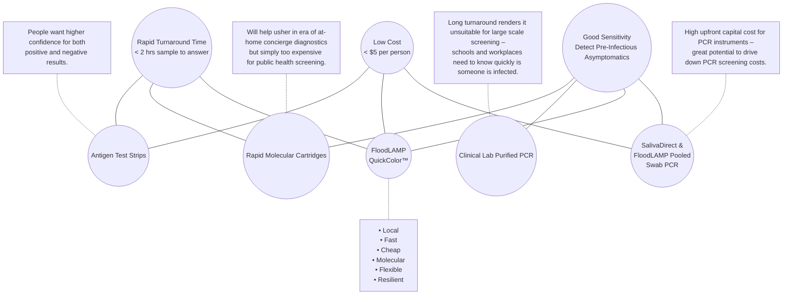
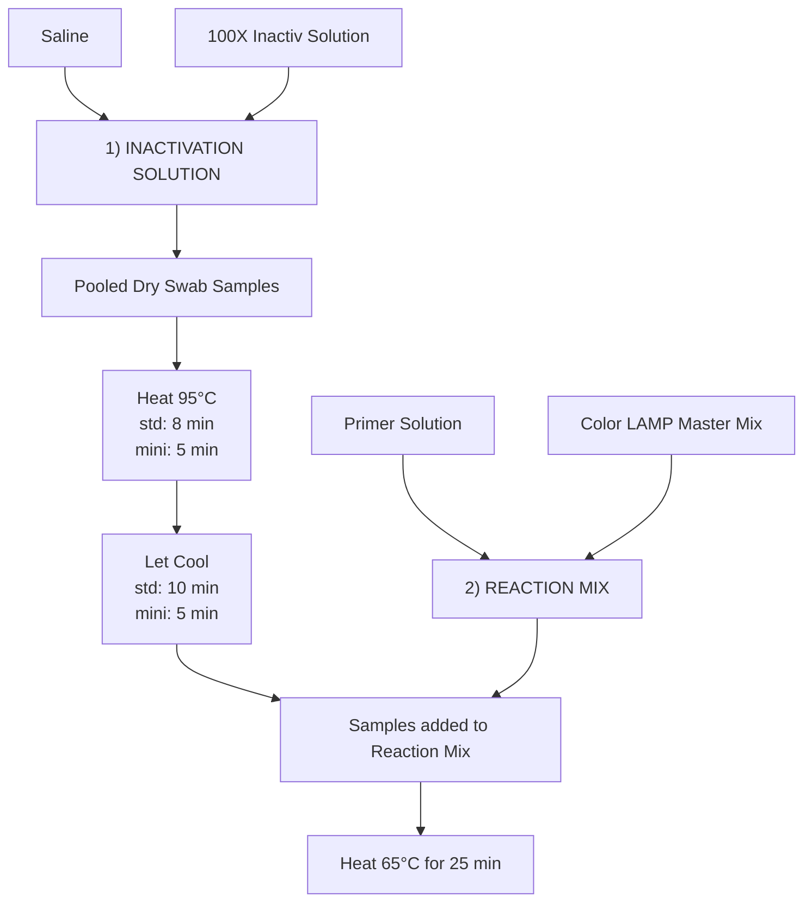
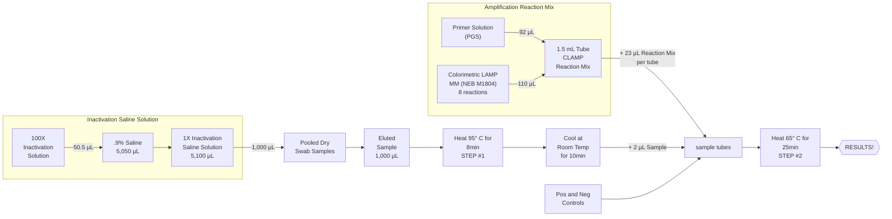
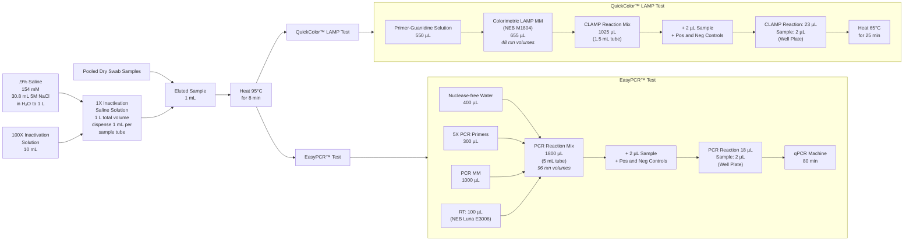

METADATA
last updated: 2026-02-26 BA
file_name: Bend Pilot Program Bring-up (12-01-2021).md
file_date: 2021-12-01
title: Bend Pilot Program Bring-up (12-01-2021)
category: various
subcategory: fl-presentations
tags:
source_file_type: gslide
xfile_type: pptx
gfile_url: https://docs.google.com/presentation/d/1-6cdPCi1TGpxUowlCVG9cgHKF19nxUwdvIG3BtBM-14/
xfile_github_download_url: https://raw.githubusercontent.com/FocusOnFoundationsNonprofit/floodlamp-archive-wip/main/various/fl-presentations/Bend%20Pilot%20Program%20Bring-up%20%2812-01-2021%29.pptx
pdf_gdrive_url: https://drive.google.com/file/d/1NIYwqnYtGal_UQnkMBksdBGFH8weP9Ne/
pdf_github_url: https://github.com/FocusOnFoundationsNonprofit/floodlamp-archive-wip/blob/main/various/fl-presentations/Bend%20Pilot%20Program%20Bring-up%20%2812-01-2021%29.pdf
conversion_input_file_type: pptx
conversion: msmid
license: CC BY 4.0 - https://creativecommons.org/licenses/by/4.0/
tokens: 6428
words: 3744
notes:
summary_short: Bend Fire and Rescue site bring-up training deck (December 1, 2021) covering FloodLAMP's technology overview, QuickColor™ LAMP and EasyPCR™ clinical evaluation results from the Stanford CLIA lab, real-world deployment case studies, the Open EUA regulatory strategy, and hands-on lab training sections including safety highlights, contamination procedures, test system overview, and a validation run protocol with training kit inventory.

CONTENT

## Slide 1: FloodLAMP Biotechnologies, PBC
Delivering the testing our world needs (and people want)
For COVID-19 and beyond
Randy True, Founder and CEO | randy@floodlamp.bio | 415-269-2974

Bend Fire and Rescue - Site Bring Up
12-01-2021

Special Thanks to:
- Katrina Brandis! Volunteer from Bend Science Station
- Kevin Schallert! FloodLAMP COO and Founder NSVD

## Slide 2: Today's Agenda
|  |  |  |  |
|---|---|---|---|
| 1 | Intros | 5 min | 9:30 am start |
| 2 | FloodLAMP Overview | 10 min | |
| 3 | Safety Highlights | 5 min | |
| 4 | Contamination Procedures | 10 min | 10:00 am |
| 5 | Test System Overview | 10 min | |
| 6 | Validation Run - Katrina | 80 min | 11:30 am |
| 7 | Training Kit Overview | 20 min | |
| 8 | Cleanup / Wrapup | 10 min | 12:00 noon |
||

## Slide 3: We Still Need Better Testing
FloodLAMP's mission is to improve global health and resiliency through universal access to rapid molecular testing.

FloodLAMP delivers:
- New testing technology that does not require any instrumentation or clinical lab overhead - it can be done at scale anywhere by anyone.
- Turnkey screening programs with all of the wraparound components that give people and organizations what they want.
- Disruptive open source strategy that unlocks molecular testing for our country and the world.

## Slide 4: Technology Readiness - TRL 6/8
Successful real world programs:
- With EMS departments in 3 states, screening first responders and city employees;
- Commercial contract screening TV production crew 3X per week with <2hr TAT;
- Local community pre-school testing program with at-home family pooling enabled by the FloodLAMP Mobile App.

Regulatory progress and potential:
- EMS programs green-lit as surveillance by top officials at FDA and CMS;
- 2 full FDA EUA submissions for open source protocol EUA's (direct PCR and LAMP);
- Successful clinical evaluation from Stanford CLIA Lab;
- Pre-EUA for Pooled Swab Collection Kit DTC with FloodLAMP Mobile App;
- IRB approved for clinical study of pooling, home collection and App;
- Experienced consultants and advisors on board, including Anne Wyllie (SalivaDirect).

Key IP protection:
- Broad coverage of pooling and digital integration;
- License to core assay chemistry from Harvard Medical School (Rabe-Cepko protocol);
- New game-changing platform IP in development.

Pilot manufacturing:
- Relationships with top reagent suppliers;
- 1.3M reactions of primers ready-to-go in freezers (for 5M people with 4X pooling).

## Slide 5: Performance in All Dimensions

### FloodLAMP QuickColor™
- LOW COST: < $5 per person
- GOOD SENSITIVITY: Detect Pre-Infectious Asymptomatics
- RAPID TURNAROUND TIME: < 2 hrs sample to answer
- Local, Fast, Cheap, Molecular, Flexible, Resilient

### Antigen Test Strips
People want higher confidence for both positive and negative results.

### Rapid Molecular Cartridges
Will help usher in era of at-home concierge diagnostics but simply too expensive for public health screening.

### SalivaDirect & FloodLAMP Pooled Swab PCR
High upfront capital cost for PCR instruments – great potential to drive down PCR screening costs.

### Clinical Lab Purified PCR
Long turnaround renders it unsuitable for large scale screening – schools and workplaces need to know quickly is someone is infected.

## Slide 6: Our Solution
Unique Combination of Advantages in a Fully Integrated Program

_Photo of a pooled swab collection kit_
### Pooled Swab Collection
- Up to 4 nasal swabs per sample tube

_Photo of FloodLAMP's mobile app interface_
### FloodLAMP Mobile App
- Custom app supports both self and sponsored collection
- Results can be reported directly to participants and administrators
- Lab staff interface for batch processing

_Photo of a rack of colorimetric LAMP reaction tube strips_
### FloodLAMP QuickColor™ Test
- RT-LAMP "PCR-like" molecular amplification
- No instruments required to run test or analyze results
- Low cost and easy to run
- Results in 45 minutes with only 15 minutes hands-on time

## Slide 7: Core Assay Technology
FloodLAMP has fully validated 2 complementary tests that are best-of-breed with EUAs submitted to the FDA. Pooled home collection kit was also submitted for interactive review. The test workflow and collection kit has been designed to expand to non-COVID-19 targets in the future.

### Streamlined Sample Prep
_Drawing of swabs in tubes being eluted_
- Upfront swab pooling
- Highly scalable, integrated processing
- Same sample for both tests

### QuickColor™ LAMP Test
_Photo of a rack of colorimetric LAMP reaction tube strips, showing pink (not detected) and yellow (detected) results_
- High sensitivity (90%)
- Ultra-high throughput
- Ideal for serial screening
- Uniquely scales without capital intensive instruments
*Licensed from Harvard Medical School (Rabe Cepko Protocol)*

### EasyPCR™ Test
_Drawing of a standard RT-qPCR instrument_
- Very high sensitivity (98%)
- Medium throughput (1.5 hrs/94)
- Ideal for diagnostics/reflex/confirm

## Slide 8: Clinical Evaluation Data
Clinical evaluation performed by the Stanford CLIA Lab, with excellent results and praise on the "really straightforward" protocol.

### EasyPCR™ Test
- 3 copies/µl LoD
- 98% sensitivity (PPA 39/40)
- 100% Specificity (40/40)
- No false positives

### QuickColor™ LAMP Test
- 12 copies/µl LoD
- 90% Sensitivity (PPA 36/40)
- Missed positives only high Ct (>36 with direct PCR)
- 100% Specificity (40/40)
- No false positives

_Scatter plot of FloodLAMP EasyPCR(TM) preliminary LoD showing Ct (y-axis) versus target concentration in copies/mL (x-axis), with Ct decreasing from ~37 to ~32 as copies/mL increases up to 100,000._

| FloodLAMP SwabDirect PCR Result | Comparator Positive | Comparator Negative | Total |
|---|---|---|---|
| Positive | 39 | 0 | 39 |
| Negative | 1 | 40 | 41 |
| Invalid | 0 | 0 | 0 |
| Total | 40 | 40 | 80 |
| Positive Agreement | 97.5% (39/40) 95% CI: 86.8% to 99.9% |||
| Negative Agreement | 100% (40/40) 95% CI: 91.2% to 100% |||
||

| FloodLAMP QuickColor Test Result | Comparator Positive | Comparator Negative | Total |
|---|---|---|---|
| Positive | 36 | 0 | 36 |
| Negative | 4 | 40 | 44 |
| Total | 40 | 40 | 80 |
| Positive Agreement | 90.0% (36/40) 95% CI: 76.3% to 97.2% |||
| Negative Agreement | 100% (40/40) 95% CI: 91.2% to 100% |||
||

Source of Specimens: Stanford COVID-19 Clinical Testing Program
Specimen Type: Anterior Nares Swab in PBS, previously tested and frozen
Comparator Test: Hologic Panther Fusion SARS-CoV-2 Assay and Hologic Panther Aptima SARS-CoV-2 Assay

## Slide 9: Case Studies
### Florida Municipal & EMS Deployments
- Davie and Coral Springs FL EMS Depts purchased systems to routinely screen first responders and city staff.
- Full-time light duty firefighters dedicated to running FloodLAMP.
- Unknown positive cases detected and many positives confirmed.
- Clearance from CMS and FDA to operate non-diagnostic "surveillance" testing program.
- Reordered test kits and expanding programs.

### Teen Summer Camp
- Screened entire camp, 2 cohorts, 300 and 400 campers.
- Remote bringup and processing by local academic volunteers.
- FloodLAMP screening brought up early after 1 positive case identified on Day2.
- Positive case confirmed by FloodLAMP.
- Daily surveillance screened bunkmates and contacts post exposure.

### EMS Leadership Conference Screening
- Pop-up lab at conference venue - Hard Rock Hotel Ft. Lauderdale.
- Setup and validation complete in 3 hrs.
- Screened conference attendees on-site in pools of 2-4.
- Same day training of volunteers to run test.
- No positive or invalid results.
- 69 minute average turnaround time in lab.

### Preschool At-home Family Pooled Collection
- Pilot underway with onboarding and first testing sessions successful.
- Implementing "holy grail" of at-home self-collection of entire families.
- Using FloodLAMP Mobile App for distributed collection and processing.
- Convenient drop-off at school.
- 75min true turnaround-time from dropoff cutoff time to results.

## Slide 10: Open EUAs
Path to establishing generics in Dx

|  | Typical IVD EUA | CDC EUA | SalivaDirect™ | SHIELD | FloodLAMP EasyPCR™ | FloodLAMP QuickColor™ |
|---|---|---|---|---|---|---|
| Disclosure of all chemicals and reagents? | No | Yes | Yes | Yes | Yes | Yes |
| Chemical and reagents available from multiple vendors? | No | Yes | Yes | No | Yes | Yes, *except NEB LAMP MM |
| Disclosure of primer sequences? | No | Yes std for PCR | Yes | No ProptryThermo | Yes | Yes |
| Primers commercially available from multiple vendors? | No | Yes | Yes CDC Primers | No ProptryThermo | Yes CDC SD Primers | Yes Available but not launched |
| Supply chain robust? | No | No/Maybe | Yes | No/Maybe | Yes | Yes |
| EUA Sponsor Organization Type | For Profit Company | Govt | Academic Not for Profit | Academic Not/For Profit ? | Public Benefit Corp | Public Benefit Corp |
| Designation of CLIA labs | Kit Sales | N/A open RoR | Impact & Expansion | Impact & Expansion | Impact & Expansion | Impact & Expansion |
||

## Slide 11: Team
Mission driven and execution experience, with a growing network of influential advisors and collaborators.

Randy True
Founder & CEO
- Founder TMI Inc. - Acq. Affymetrix 25MM
- VP of R&D at Affymetrix

Kevin Schallert
COO
- Co-Director covid19sci.org, National Volunteer Scientist DB
- Founder & COO of VineEye

Theresa Ling
UX/Design Lead
Former Uber, New Relic, R/GA

Gary Withey, Ph.D.
Director Process Development
- Current Associate Director, Atreca Inc.
- Former Pilot Production Manager, Affymetrix

Brandon Smith
Lab Assistant
- Silicon Valley CTE Graduate

### Scientific Advisory Board
Anne Wyllie
Yale, Lead Researcher – SalivaDirect
Bill Hyun
UC San Francisco, Genoa Ventures
Prof. Connie Cepko (former)
Harvard, Harvard Medical School, Genetics Department, Co-Dir Trans Med Program, HHMI

### Industry Advisors
Tim Lugo
William Blair Biotechnology Group Head
Zarak Khurshid
Asymmetry Capital, Top MDx Analyst
John Edge
Oxford Internet Institute, Blue Field Labs, ID2020

### Collaborators
gLAMP Group
Global LAMP consortium of 200+ Academic and industry scientists
OpenCOVIDScreen
Jeff Huber (Google, Grail)

## Slide 12: Safety Highlights - Protecting You!
Disclaimers:
- This is not a substitute for formal Lab and Biosafety Training.
- Site managers, site personnel, and volunteers are responsible for maintaining appropriate trainings and certifications, and for compliance with local, state, and federal regulations.
- FloodLAMP's safety information is provided on a best-effort basis during this Public Health Emergency.

Resources:
- [UCLA Online Slides/PDFs](https://ucla.app.box.com/v/ehs-handout-bio-bsl2-slides) - [UCLA Root Site](https://www.ehs.ucla.edu/training-support/courses/biosafety)
- [Yale - Laboratory Chemical Training by Yale (40 min) - free video based](https://ehs.yale.edu/trainings/laboratory-chemical-training)
- Yale - BioSafety Level 2 Training [Part1 (25 min)](https://ehs.yale.edu/trainings/biological-safety-training-part-1) [Part2 (50min)](https://ehs.yale.edu/trainings/biological-safety-training-part-ii)
- [UC Davis Training ~1 hour online - must request access](https://safetyservices.ucdavis.edu/training/biological-safety)
- [OSHA Requirements on Hazardous Chemicals in the Workplace](https://ohsonline.com/Articles/2018/09/01/Your-Blueprint-for-Chemical-Safety-Training.aspx?Page=1)

## Slide 13: Safety Highlights - PPE
_Photos of gloves, lab coat, safety glasses, and face mask_

### Amp Run Sheet Short Any System
PREP
[ ] Heaters on (Heat indicator lit!)
[ ] 1X Inactivation Saline Soln ready
[ ] Reaction mix strip8/plates ready
**[ ] Safety Procedures:**
- lab coat
- gloves
- face mask
- face shield or goggles

[ ] Alcohol wipe sample tubes

## Slide 14: Safety Highlights - Sample Handling
_Photo showing setup for proper sample handling_

- Incoming Sample Tubes should be in biohazard bags or in a rack in a closed bin.
- Samples tubes should be wiped with 70% alcohol or ethanol after debagging.
- Step with the highest risk of infectious exposure is opening the tube with dry swab for addition of the 1X Inactivation Saline Solution (1st step of the Inactivation protocol).
  - Recommend performing this step in biosafety cabinet, chem hood, or well ventilated location.

### Amp Run Sheet Short Any System
PREP
[ ] Heaters on (Heat indicator lit!)
[ ] 1X Inactivation Saline Soln ready
[ ] Reaction mix strip8/plates ready
[ ] Safety Procedures:
- lab coat
- gloves
- face mask
- face shield or goggles

**[ ] Alcohol wipe sample tubes**

## Slide 15: Safety Highlights - Chem Safety - TCEP Inactivation Solution
FloodLAMP Safety Data Sheets - [bit.ly/floodlamp-sds](https://bit.ly/floodlamp-sds)

### TCEP - Tris(2-carboxyethyl)phosphine hydrochloride
- Causes severe skin burns / eye damage if contact
- Ingestion / breathing in TCEP is dangerous
- Use in well ventilated area with appropriate PPE

### EDTA - Ethylenediamine Tetraacetic Acid
- Causes serious eye irritation / Harmful if inhaled / May cause damage to organs through prolonged or repeated exposure
- Use in well ventilated area with appropriate PPE

|  | 100X IS | 1X ISS (Sample) |
|---|---|---|
| TCEP | 250 mM | 2.5 mM |
| EDTA | 100 mM | 1 mM |
| NaOH | 1.15 N | 11 mM |
||

**Give extra care when handling the 100X Inactivation Solution!**

### Eye Wash Station
- Know location
- Familiarize with use

### Sink
- Know location of nearest
- Ensure stocked with soap

## Slide 16: Contamination Procedures - Protecting the Tests!
Focus on 4 Types of Contamination:
1. RNAse Contamination
2. Positive Control Contamination
3. Sample Cross Contamination
4. Amplicon Contamination = Death!

## Slide 17: Contamination Procedures - RNAse Contamination
https://www.neb.com/tools-and-resources/usage-guidelines/avoiding-ribonuclease-contamination

### What is RNAse and why do we care?
- Enzymes that destroy DNA and RNA, which is what our test detects
- Produced by every living organism in every living cell
- Creates unreliability in test results

**RNAse is EVERYWHERE!!**

### What do we do about it?
- Access Control - only people who know the rules can come in the room.
- Gloves, Gloves, Gloves - don't touch anything except the desk station without gloves.
- Always Wear Lab Coat - to avoid forearm slime from getting everywhere.
- Clean then Keep Clean - use bins, bags and foil to keep things clean and you life easier.
- Be Extra Careful w Reaction Plastics - clean gloves only, don't reach in bags, don't touch inside of caps when opening.
- Be Wary of Cross Contamination.
- Stage to Replace - avoid Matlock trap, keep stash clean and secure, and replace if problems.

### When and where do we care?
- Primarily in Amp Reaction

### How do we know?
- Positive Controls don't hit (pink or orange)
- BUT this is usually degraded Positive Control - tricky!

## Slide 18: Contamination Procedures - Positive Control Contamination
_Photos of CDC contamination incident news article - CDC coronavirus test kits were likely contaminated, federal review confirms_
_"It was at this stage of the manufacture, when the bulk reagent materials for the test kits were processed and tested at [the respiratory virus lab], that they were most likely exposed to positive control material."_

### How do we know?
- Negative control hit positive (yellow) or inconclusive (orange)
- Suspiciously high number of positive or inconclusive samples

### What do we do about it?
- Follow Protocol - there are specific procedures and steps explicitly described in the protocol steps and shown in training to take extra care in the handling of the positive controls (TPC and Zeptos).
- Handle tiny TPC tube carefully, open with left hand, keep right hand you pipet with clean.
- Change gloves right after putting TPC back in it's baggie in the freezer.
- Keep positive controls on bottom shelf in freezer, in bags.

## Slide 19: Contamination Procedures - Sample Cross Contamination
Means transferring material from one sample tube to another.
For example, a drop from the cap gets on your glove and then you touch the inside of another cap.

### How do we know?
- You won't if all samples in batch are negative, which is usually the case!
- Get multiple positives in a batch, especially neighbor tubes. You always confirm positives so if some aren't confirmed but some are, that would indicate sample cross contamination.

### What do we do about it?
- Follow Protocol - there are specific procedures and steps explicitly described in the protocol steps and shown in training to take extra care to avoid sample cross contamination.
- Do initial wipe of sample tubes with alcohol/ethanol.
- Be careful with caps when opening inactivated samples - we are not spinning them down in a centrifuge so there can be liquid on the cap.
- If you get sample drip/drop, stop and wipe it up carefully, change gloves, clean spot/area with bleach+alcohol. Note sample ID in "notes" on run sheet.

## Slide 20: Contamination Procedures - Amplicon Contamination
_Illustrations showing PCR and LAMP amplification process_

### What are amplicons?
- Amplicons refer to the large amount of DNA produced in a positive amplification reactions. AKA "products".

### Why Death?
- Can contaminate entire lab and require start from scratch, sometimes in new building!

### How do we avoid Death?
- NEVER OPEN THE TUBES! - after amplification.
- Treat the tubes, the heater, the lightbox (anything in the Amp area) as if it's radioactive.
- Amp Area is a Black Hole - anything that goes in does not come out: pen, marker, post-it notes.
- Change Gloves - after touching amp'd tubes and Amp area.
- Follow these rules and you should be able to avoid amplicon death. Our NEB LAMP Master Mix uses a UDG thermolabile nucleotide (like an extra life, but don't want to use it!).

## Slide 21: Test System Overview
2 x 2 x 2:
2 Solution Preps
2 Components Each
2 Heat Steps

### FloodLAMP QuickColor(TM) COVID-19 Test

## Slide 22: Test System Overview
### FloodLAMP QuickColor(TM) COVID-19 Test
_Diagram of detailed process flow with volumes and steps for preparing inactivation saline, inactivating pooled swabs, mixing reaction components, loading tubes/controls, and incubating to results._

## Slide 23: Test System Overview
_Detailed protocol workflow diagram continued, showing amplification and readout steps._

## Slide 24: Validation Run
Will create "contrived positive" sample by spiking inactivated virus into the 1XISS
(Zeptos 50uL = 50 cp/uL in ZCP)
Run this in triplicate along with your pooled samples.
Have cold chain concern over reagent shipment - fingers crossed!

_Photos of the Coral Springs validation run (8-2-21): strip layout with tube positions labeled and lab testing setup_
Single Strip8:
1. TPC
2. NC
3. ZCP50
4. ZCP50
5. ZCP50
6. Pool1
7. Pool2
8. Pool3

## Slide 25: Training Kit
Learn and practice without burning or contaminating real reagents.

| Line # | Item Description | Quantity |
|---:|---|---:|
| 1 | Training 1.5mL Tubes | 30 |
| 2 | Training 30mL Chub Tubes | 2 |
| 3 | Training 5mL Snap Tubes | 2 |
| 4 | Mock PGS | 10 |
| 5 | Mock CLAMPMM | 5 |
| 6 | Mock 100XIS | 1 |
| 7 | Mock 50mL Saline | 2 |
| 8 | Mock TPC | 8 |
||
