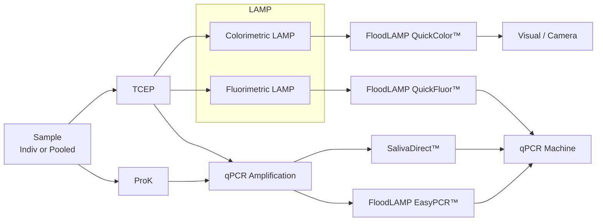

METADATA
last updated: 2026-03-06 by BA
file_name: FDA Reagan Udall Foundation - FloodLAMP Presentation (4-21-2022).md
file_date: 2022-04-21
title: FDA Reagan Udall Foundation - FloodLAMP Presentation (4-21-2022)
category: various
subcategory: fl-presentations
tags:
source_file_type: gslide
xfile_type: pptx
gfile_url: https://docs.google.com/presentation/d/1G2mQNd9SNX_LEmKA44T5HkA6pNQehwSxgqfGX8JUf-I
xfile_github_download_url: https://raw.githubusercontent.com/FocusOnFoundationsNonprofit/floodlamp-archive-wip/main/various/fl-presentations/FDA%20Reagan%20Udall%20Foundation%20-%20FloodLAMP%20Presentation%20%284-21-2022%29.pptx
pdf_gdrive_url: https://drive.google.com/file/d/1NwPXR4erWkITYhW0qKe4FzAKeOl10v6l
pdf_github_url: https://github.com/FocusOnFoundationsNonprofit/floodlamp-archive-wip/blob/main/various/fl-presentations/FDA%20Reagan%20Udall%20Foundation%20-%20FloodLAMP%20Presentation%20%284-21-2022%29.pdf
conversion_input_file_type: pdf
conversion: megaparse
license: CC BY 4.0 - https://creativecommons.org/licenses/by/4.0/
tokens: 4596
words: 2419
notes:
summary_short: Slide deck overview of FloodLAMP’s vision and platform for decentralized, low-cost molecular screening (targeting ~$1/person) using extraction-free colorimetric RT-LAMP plus a mobile app and pooled/household collection workflows. Presents clinical evaluation results (Stanford CLIA), real-world surveillance outcomes (Omicron surge deployments), and the regulatory strategy (two full EUA submissions + a pre-EUA; “open protocol” disclosure of components to enable broader adoption and potential generic-like interoperability).

CONTENT

## Slide 1: FloodLAMP Biotechnologies, PBC
_Title Slide_
Decentralized, Rapid Molecular Disease Screening for $1
Randy True, Founder and CEO, randy@floodlamp.bio

## Slide 2: The Unknowable and How to Prepare for it
_Screenshot from David Deutsch YouTube video referenced below_
_Image of book title for Bill Gates - "How to Prevent the Next Pandemic"_
David Deutsch, "The Unknowable & how to prepare for it" at TEDx Brussels - ([YouTube](https://youtu.be/SVgGYQ_5ID8))

## Slide 3: We still don't know how to prepare for another variant OR the next pandemic
_Line Chart from Our World in Data showing daily new confirmed COVID-19 cases per million people from March 1st, 2020 through April 19th, 2022 for the European Union, United Kingdom, United States and China. Shows COVID case surges for EU, UK, and US but China is at near zero._

## Slide 4: Ideal Profile of Screening Tests
1. Decentralized
- Local control, scalable during surge

2. Rapid
- <1hr turn around time

3. Molecular
- Greater accuracy compared to antigen tests
- More quickly adaptable to new targets

4. $1
- Low cost is critical for accessibility and wide distribution

1 Antigen tests catch only 23% of new asymptomatic infections same day as PCR; 47% within 48 hrs [Comparison of Rapid Antigen Tests' Performance between Delta (B. 1.61. 7: AYX) and Omicron (B.1.1.529: BA1) Variants of SARS-CoV-2: Secondary Analysis from a Serial Home Self-7 Testing Study](https://www.medrxiv.org/content/10.1101/2022.02.27.22271090v1?utm_source=pocket_mylist)

## Slide 5: What This Looks Like
_Photo showing wide angle of pop-up FloodLAMP testing room at NOVA University with 2 tables, signage on walls, and small shelf of supplies_
Programs operating in the real world, at the price of $1.25 per person

## Slide 6: A Disease Screening Program for Resiliency
1. At-home Accessioned Collection with Mobile App
_Drawing of swabs, collected tubes, and mobile app_
- Streamlines test processing

2. Family/Household Pooling
_Drawing of family_
- Extends protection

3.Rapid Molecular LAMP Test
_Drawing of LAMP test reaction plate_
- <1hr True TAT 

_Drawing of map with routes and pins_
- Run On or Near Site

## Slide 7: LAMP: Loop-Mediated Isothermal Amplification
- Alternative molecular amplification technology
- LAMP generates 10X more DNA product in 1/3 time compared to PCR
- Can be formulated for easy visual/camera-based readout
- Becoming an increasingly important part of diagnostics - many LAMP COVID EUAS!

| Category | qPCR | LAMP |
|---|---|---|
| Equipment | qPCR machine (thermal cycler & optics) | simple heat block or water bath (isothermal) |
| Time | 90 min | 30 min |
| Capital Cost | $30K-100K | $300 |
||

_Image showing PCR amplification process_
_Image showing LAMP amplification process_

Recommend NEB website and
global LAMP consortium review (FloodLAMP co-author)
[gLAMP Global Consortium - JBT Review Paper (Sept 2021).pdf](https://drive.google.com/file/d/1qdf-dL2cmbB7aK4rw57CgjPmWQ9K5X0F)
_FLOODLAMP ARCHIVE FILE PATH:_ various/glamp/gLAMP Global Consortium - JBT Review Paper (Sept 2021).md

## Slide 8: Molecular Assay Atlas
| PEOPLE | SAMPLE | INACTIV | PURIFIC | AMPLIF | READOUT |
|---|---|---|---|---|---|
| Individual | Nasopharyngeal Swab (NP) | **TCEP (Chem) + Heat** *(Rabe Cepko, HUDSON)* | **Glass Milk** *(Rabe Cepko)* | qPCR | qPCR Machine *(Fluorescence)* |
| Pool: 2–20 | Cheek Swab | Proteinase K (Enzyme) + Heat *(Saliva Direct)* | Mag Beads *(Kellner, Yu)* | **LAMP** *(Colorimetric, Fluorimetric)* | **Visual / Camera** *(Color Change)* |
| | **Anterior Nares Swab (AN)** | Heat Only | **Skip (Direct)** | Misc *(RPA, CRISPR, etc.)* | Plate Reader *(Absorbance, Color Genomics)* |
| | Saliva | Commercial *(Zymo, Lucigen)* | Commercial *(Thermo, Zymo, Kingfisher, Qiagen)* | | Lateral Flow Strip |
||

## Slide 9: FloodLAMP Tests
SAMPLE -> INACTIV -> AMPLIF -> READOUT

## Slide 10: Direct PCR and LAMP Tests
### Streamlined Sample Prep
_Drawing of 4 swabs in tubes being eluted_
- Shelf stable TCEP/EDTA inactivation solution
- Added directly to dry swabs

- Same sample for both tests
- 2µL sample volume

### QuickColor(TM) LAMP Test
_Drawing on 6 reaction tubes with the first one showing a yellow positive LAMP reaction and the other 5 pink for negative_
- Colorimetric LAMP reaction
- 3 primer sets mixed (AS1e, N2, E1)
- 25 minutes at 65°C

### EasyPCR(TM) Test
_Drawing of a PCR machine_
- Multiple PCR Master Mixes Validated
- CDC primers in SalivaDirect config (N1, RNAseP)

## Slide 11: Ideal for Austere Sites
_**Photos showing FloodLAMP pop-up Point of Need decentralized testing setups, in offices, a fire station, and a mobile kit in a small hard case for easy travel.**_
_Photo of a compact field lab bench with step-by-step wall signage, tube racks, and basic instruments set up for sample intake and inactivation._
_Photo of a temporary testing/processing room with folding tables, laptops, and supplies under a fire department/EMS emblem, showing an on-site setup in municipal facilities._
_Photo of a large indoor event with many attendees seated at tables, representing high-throughput screening in crowded community/workforce settings._
_Photo close-up of FloodLAMP reagent boxes labeled “100X Inactivation Solution” and “Primer Solution (PGS) + LAMP Master Mix,” staged for field use._
_Photo of a technician in PPE (mask, face shield, gown, gloves) pipetting/handling samples during on-site testing._
_Photo of an open rugged carry case stocked with micropipettes, a tip rack, tubes, and consumables—illustrating a portable “lab-in-a-box” kit for austere sites._

## Slide 12: FloodLAMP Platform
_Diagram grid summarizing the FloodLAMP platform—applications across diseases, core modules split into physical and digital components, product offerings, and network partner groups._

### Applications
- COVID Response
- Emerging Threats (Pandemic Prep)
- TB / Zikka
- Influenza / STD’s / Cancer

### Core Modules
#### Physical
- Reagent Test Kits
- Collection Kits
- Standard Consumables
- Standard Equipment

#### Digital
- App
- Admin Portal
- Training Program
- Quality Management System

### Network
- EMS & Municipalities
- Schools and Businesses
- U.S. Federal Agencies (BARDA, ASPR, CDC, DoD, FEMA)
- International Governments

### Products
- All-in Test Kits
- Sample Processing Sites (Labs)
- Service, Support, Consulting
- Testing Program Management

## Slide 13: Scale Up During Omicron Surge
_Bar chart collage (four panels) showing weekly screening volumes and positive results/positivity across sites (Davie FL, Coral Springs FL, Bend OR, Bay Area CA) during the Omicron surge, with peaks in early 2022._
**Davie, FL**
EMS and Muni

**Coral Springs, FL**
EMS and Muni

**Bend, OR**
EMS

**Bay Area, CA**
Preschool

## Slide 14: Real World Data
_Table and callout layout summarizing real-world surveillance outcomes (diagnostic follow-up highlights plus a “FloodLAMP Surveillance Testing Stats” table with totals for pools, people, and positives through Mar 2, 2022)._
### Comparison with diagnostic followup data in progress
- 22 FloodLAMP positives one day in late Dec and only 1 positive on BinaxNOW. All 22 became positive over next few days (reported).
- One site has 100% concordance of FloodLAMP positives with reflex PCR (34/34).

### Known adverse results in >10K tests
- 1 suspected false negative (lower instance than discordant lab PCR to FloodLAMP and antigen)
- 2 suspected false positives
- <1% to 5% rerun rate (initial inconclusives that rerun as negative)

### FloodLAMP Surveillance Testing Stats (Thru Mar 2, 2022)
| Org | Pools | People (Instances) | Positives (incl repeat indiv) |
|---|---:|---:|---:|
| Staff, Preschool, Community | 1,107 | 1,779 | 44 |
| Conference | 61 | 195 | 0 |
| Summer Camp | 190 | 696 | 1 |
| Coral Springs, FL | 7,400 | 21,676 | 348 |
| Davie, FL | 2,235 | 4,226 | 55 |
| Bend Fire, OR | 617 | 617 | 215 |
| **TOTAL** | **11,610** | **29,189** | **663** |
||

## Slide 15: Clinical Evaluation Data
Clinical evaluation performed by the Stanford CLIA Lab, with excellent results and praise on the "really straightforward" protocol.

### EasyPCR(TM) Test
- 3 copies/µl LoD
- 98% sensitivity (PPA 39/40)
- 100% Specificity (40/40)
- No false positives

### QuickColor(TM)  LAMP Test
- 12 copies/µl LoD
- 90% Sensitivity (PPA 36/40)
- Missed positives only high Ct (>36 with direct PCR)
- 100% Specificity (40/40)
- No false positives

_Scatter plot of FloodLAMP EasyPCR(TM) preliminary LoD showing Ct (y-axis) versus target concentration in copies/mL (x-axis), with Ct decreasing from ~37 to ~32 as copies/mL increases up to 100,000._
Gamma inactivated cell lysate from BEI spiked into raw clinical negative sample

| FloodLAMP SwabDirect PCR Result | Comparator Positive | Comparator Negative | Total |
|---|---:|---:|---:|
| Positive | 39 | 0 | 39 |
| Negative | 1 | 40 | 41 |
| Invalid | 0 | 0 | 0 |
| **Total** | **40** | **40** | **80** |
||

- Positive Agreement: **97.5% (39/40)**; 95% CI: **86.8% to 99.9%**
- Negative Agreement: **100% (40/40)**; 95% CI: **91.2% to 100%**

| FloodLAMP QuickColor Test Result | Comparator Positive | Comparator Negative | Total |
|---|---:|---:|---:|
| Positive | 36 | 0 | 36 |
| Negative | 4 | 40 | 44 |
| **Total** | **40** | **40** | **80** |
||

- Positive Agreement: **90.0% (36/40)**; 95% CI: **76.3% to 97.2%**
- Negative Agreement: **100% (40/40)**; 95% CI: **91.2% to 100%**

Source of Specimens: Stanford COVID-19 Clinical Testing Program
Specimen Type: Anterior Nares Swab in PBS, previously tested and frozen
Comparator Test: Hologic Panther Fusion SARS-CoV-2 Assay and Hologic Panther Aptima SARS-CoV-2 Assay

## Slide 16: EUA Submissions - 2 Full + Pre EUA
_Screenshots of three document cover pages representing regulatory materials: QuickColor™ and EasyPCR™ COVID-19 test “Instructions for Use” plus a pooled swab collection kit document._
### FloodLAMP QuickColor(TM) COVID-19 Test
Instructions for Use v1.2
IVD
COVID-19 Emergency Use Authorization Only
For in vitro diagnostic (IVD) Use

### FloodLAMP EasyPCR(TM) COVID-19 Test
Instructions for Use v1.1
IVD
COVID-19 Emergency Use Authorization Only
For in vitro diagnostic (IVD) Use

FloodLAMP
Biotechnologies
A Public Benefit Corporation
### FloodLAMP Pooled Swab Collection Kit DTC

For use with the FloodLAMP Mobile App

www.floodlamp.bio
FloodLAMP Biotechnologies, PBC 930 Brittan Ave. San Carlos, CA 94070 USA

## Slide 17: Open EUA - Disclosure of Components
_Table collage showing disclosed Open EUA components: validated reagent list, primer names/sequences, and preparation tables for primer–guanidine solution and the colorimetric LAMP reaction mix._
### Table 1: Validated reagents used with the Test
| Item | Concentration | Chemical Composition | Vendor | Catalog Number |
|---|---|---|---|---|
| TCEP | .5 M | tris(2-carboxyethyl)phosphine hydrochloride | Sigma-Aldrich / Millipore Sigma | 646547-10X1ML |
| EDTA | .5 M | Ethylenediaminetetraacetic acid | Thermo Fisher | 15575020 |
| NaOH | 10 N | Sodium Hydroxide | Sigma-Aldrich | SX0607N-6 |
| Nuclease-free Water |  | Ultrapure Water, nuclease-free | Thermo Fisher | 10977015 |
| NaCl | 5 M | Sodium Chloride | Thermo Fisher | 24740011 |
| Guanidine HCl | 6 M | Guanidine Hydrochloride | Sigma-Aldrich | SRE0066 |
| Colorimetric LAMP MM* |  | Colorimetric LAMP Master Mix | New England Biolabs | M1804 |
||

### Table 2: Primer names and sequences
| Primer Name | Sequence (5’-3’) |
|---|---|
| **ORF1ab gene (AS1e)** |  |
| Orf1ab_FIP | TCAGCACACAAAGCCAAAAATTTATTTTTCTGTGCAAAGGAAATTAAGGAG |
| Orf1ab_BIP | TATTGGTGGAGCTAAACTTAAAGCCTTTTCTGTACAATCCCTTTGAGTG |
| Orf1ab_F3 | CGGTGGACAAATTGTCAC |
| Orf1ab_B3 | CTTCTCTGGATTTAAACACACTT |
| Orf1ab_LF | TTACAAGCTTAAAGAATGTCTGAACACT |
| Orf1ab_LB | TTGAATTTAGGTGAAACATTTGTCACG |
| **N Gene (N2)** |  |
| N2_FIP | TTCCGAAGAACGCTGAAGCGGAACTGATTACAAACATTGGCC |
| N2_BIP | CGCATTGGCATGGAAGTCACAATTTGATGGCACCTGTGTA |
| N2_F3 | ACCAGGAACTAATCAGACAAG |
| N2_B3 | GACTTGATCTTTGAAATTTGGATCT |
| N2_LF | GGGGGCAAATTGTGCAATTTG |
| N2_LB | CTTCGGGAACGTGGTTGACC |
||

### Table 7: Primer-Guanidine: Solution
| Component | Volume (1 reaction) | Volume (1 reaction x 100) 1 x 96-plate w/ 4% overage |
|---|---:|---:|
| 10X LAMP Primer Mix | 2.5 µL | 250 µL |
| Guanidine HCl (400 mM) | 2.5 µL |  |
| Guanidine HCl (6 M) |  | 16.7 µL |
| Nuclease-free Water | 5.5 µL | 783 µL |
| **TOTAL VOLUME** | **10.5 µL** | **1050 µL** |
||

### Table 8: Colorimetric LAMP Amplification Reaction
| Component | Volume (1 reaction) | Volume (100 reactions) |
|---|---:|---:|
| Primer–Guanidine Solution | 10.5 µL | 1050 µL |
| Colorimetric LAMP MM | 12.5 µL | 1250 µL |
| **SUBTOTAL VOLUME** | **23 µL** | **2300 µL** |
| Sample | 2 µL |  |
| **REACTION VOLUME** | **25 µL** |  |
||

## Slide 18: Open EUAs
Provides a path to establishing generics in diagnostics.
Enables global dissemination of highly respected FDA authorized tests.
_Table comparing “open EUA” transparency and supply-chain criteria across EUA types and programs (Typical IVD, CDC, SalivaDirect™, SHIELD, and FloodLAMP EasyPCR™/QuickColor™), with program logos along the header row._

| Question | Typical IVD EUA | CDC EUA | SalivaDirect™ | SHIELD | FloodLAMP EasyPCR™ | FloodLAMP QuickColor™ |
|---|---|---|---|---|---|---|
| Disclosure of all chemicals and reagents? | No | Yes | Yes | Yes | Yes | Yes |
| Chemical and reagents available from multiple vendors? | No | Yes | Yes | No | Yes | Yes |
| Disclosure of primer sequences? | No | Yes (std for PCR) | Yes | No (ProprtyThermo) | Yes | Yes |
| Primers commercially available from multiple vendors? | No | Yes | Yes (CDC Primers) | No (ProprtyThermo) | Yes (CDC SD Primers) | Yes (Available but not launched) |
| Supply chain robust? | No | No/Maybe | Yes | No/Maybe | Yes | Yes |
| EUA Sponsor Organization Type | For Profit Company | Govt | Academic Not for Profit | Academic Not/For Profit ? | Public Benefit Corp | Public Benefit Corp |
| Designation of CLIA labs | Kit Sales | N/A open RoR | Impact & Expansion | Impact & Expansion | Impact & Expansion | Impact & Expansion |
||

## Slide 19: FloodLAMP Biotechnologies, PBC

**Decentralized, Rapid, Molecular, Disease Screening for $1**

Randy True, Founder and CEO | randy@floodlamp.bio
