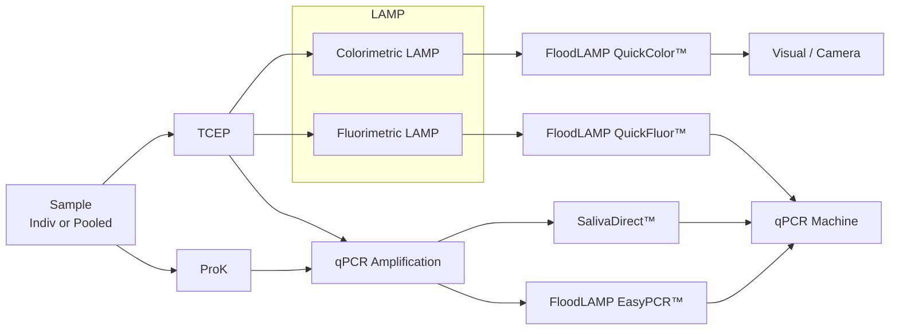

METADATA
last updated: 2026-03-06 by BA
file_name: FTFC EMS Conference - FloodLAMP Talk Slides (6-14-2021).md
file_date: 2021-06-14
title: FTFC EMS Conference - FloodLAMP Talk Slides (6-14-2021)
category: various
subcategory: fl-presentations
tags:
source_file_type: gslide
xfile_type: pptx
gfile_url: https://docs.google.com/presentation/d/1yLSZzyeon7EjZfsQ99zS7Eb5JGhlGnlKspPeFWb81b4
xfile_github_download_url: https://raw.githubusercontent.com/FocusOnFoundationsNonprofit/floodlamp-archive-wip/main/various/fl-presentations/FTFC%20EMS%20Conference%20-%20FloodLAMP%20Talk%20Slides%20%286-14-2021%29.pptx
pdf_gdrive_url: https://drive.google.com/file/d/16HGtBrJGdEIwbDZD9C1DS1pY9XkE-5Be
pdf_github_url: NA
conversion_input_file_type: pdf
conversion: megaparse
license: CC BY 4.0 - https://creativecommons.org/licenses/by/4.0/
tokens: 5454
words: 3105
notes:
summary_short: The “Deploying Mass Scale Molecular Testing” slide deck summarizes FloodLAMP’s instrument-free LAMP surveillance testing workflow, reported Stanford clinical evaluation results for QuickColor LAMP and EasyPCR, and the end-to-end screening program model for schools and other groups using pooled collection and same-day reporting. It positions FloodLAMP as a “sweet spot” between low-sensitivity antigen testing and slow centralized PCR, and highlights operational elements like distributed pop-up labs, digital program management tools, and an “open EUA” strategy amid evolving regulatory hurdles.

CONTENT

## Slide 1: Deploying Mass Scale Molecular Testing
_Logos of 3 collaborating organizations: FloodLAMP Biotechnologies, Research Aid Networks, NSVD - COVID-19 Nation Scientist Volunteer Database_

Randy True, CEO FloodLAMP Biotechnologies
randy@floodlamp.bio

## Slide 2: Today's Results
Pooled collection of as AN swabs.
Surveillance testing in pop up FloodLAMP lab.

This is what you want to see!
Pink is not detected.
Last yellow is positive control.
_Photo of two strips of reaction tubes showing mostly pink (not detected) with a single yellow positive-control tube at the end._

## Slide 3: Reaction Plate Photo
_Photo of a labeled multiwell sample reaction plate showing colorimetric test reactions — most wells are pink with a few yellow wells scattered across the grid._

## Slide 4: Clinical Evaluation Successful
Clinical evaluation performed by the Stanford CLIA Lab, with excellent results and praise on the "really straightforward" protocol.

### EasyPCR(TM) Test
- 3 copies/µl LoD
- 98% sensitivity (PPA 39/40)
- 100% Specificity (40/40)
- No false positives

### QuickColor(TM)  LAMP Test
- 12 copies/µl LoD
- 90% Sensitivity (PPA 36/40)
- Missed positives only high Ct (>36 with direct PCR)
- 100% Specificity (40/40)
- No false positives
_Scatter plot of FloodLAMP EasyPCR(TM) preliminary LoD showing Ct (y-axis) versus target concentration in copies/mL (x-axis), with Ct decreasing from ~37 to ~32 as copies/mL increases up to 100,000._

Gamma inactivated cell lysate from BEI spiked into raw clinical negative sample

| FloodLAMP SwabDirect PCR Result | Comparator Positive | Comparator Negative | Total |
|---|---:|---:|---:|
| Positive | 39 | 0 | 39 |
| Negative | 1 | 40 | 41 |
| Invalid | 0 | 0 | 0 |
| **Total** | **40** | **40** | **80** |
||

- Positive Agreement: **97.5% (39/40)**; 95% CI: **86.8% to 99.9%**
- Negative Agreement: **100% (40/40)**; 95% CI: **91.2% to 100%**

| FloodLAMP QuickColor Test Result | Comparator Positive | Comparator Negative | Total |
|---|---:|---:|---:|
| Positive | 36 | 0 | 36 |
| Negative | 4 | 40 | 44 |
| **Total** | **40** | **40** | **80** |
||

- Positive Agreement: **90.0% (36/40)**; 95% CI: **76.3% to 97.2%**
- Negative Agreement: **100% (40/40)**; 95% CI: **91.2% to 100%**

Source of Specimens: Stanford COVID-19 Clinical Testing Program
Specimen Type: Anterior Nares Swab in PBS, previously tested and frozen
Comparator Test: Hologic Panther Fusion SARS-CoV-2 Assay and Hologic Panther Aptima SARS-CoV-2 Assay

## Slide 5: Thank You!
Thank You! Peter Antevy, Eagles and FTFC for invitation and your service.

FloodLAMP Biotechnologies

Randy True
Founder and CEO
randy@floodlamp.bio
xxx-xxx-xxxx

## Slide 6: Accessible Testing for the Genomics Age
FloodLAMP Biotechnologies

FloodLAMP helps people to take control of their health and lets labs grow into new public health markets by unlocking access to molecular testing. Our core product is a mass screening system built around a highly scalable, instrument-free LAMP test, a home collection kit, and a novel digital health app.

## Slide 7: Problem
The current diagnostics model is built around expensive, doctor prescribed, insurance reimbursable tests. This does not scale. The COVID crisis has exposed critical problems in testing, however they also have negative consequences far beyond the pandemic.

Molecular tests are so expensive and - inaccessible that they are vastly underutilized to improve health and save lives.

## Slide 8: Opportunity
Huge govt investment in COVID-19 testing has created a once in a lifetime opportunity for rapid adoption of new modalities. FloodLAMP is using the opportunity for impact and growth in the short term, and as a beachhead to lead a future of accessible molecular testing using commodity chemistries. 

_Photo/graphic split background showing a masked student/classroom scene for “During COVID” and a DNA helix motif for “Post COVID.”_

### During COVID
- Deploy FloodLAMP best-in-class mass screening program
- Focus on COVID-19 school screening processed by  independent labs
- Grow lab network, sales channels and FloodLAMP adoption
- Use volume to reduce FloodLAMP adoption friction

### Post COVID
- Key enabler for emerging multi-target molecular screening market 
- Apply digital, processing and sourcing infrastructure to high volume clinical and non-clinical molecular applications
- Low prevalence, high consequence screening for public health intelligence, designed for the genomics age
- Excel as an operator built for industry cost compression and commoditization via suite of enabling technologies  

## Slide 9: Solution
FloodLAMP's COVID-19 screening program is an end-to-end solution that makes it easy and affordable to protect interacting groups such as schools, offices, or factories by providing sensitive and rapid turnaround testing.

How FloodLAMP Screening Works

_Diagram with three icon-topped steps (home pooled collection → school drop-off → same-day results) illustrating how FloodLAMP screening works._

### 1) Collect Samples
- pooled swabs
- at-home with family/household 
- on-site with pod
- FloodLAMP app to register samples
- fast and easy

### 2) Return Samples
- pick up or courier to lab/processing site
- low overhead and friction for organizations

### 3) Same Day Results
- app for students and parents
- web portal for school admins

## Slide 10: Advantages
FloodLAMP has licensed best-in-class LAMP amplification chemistry and sample prep from Harvard Medical School. Our streamlined workflow is optimized for mass screening for COVID-19 and beyond.

FloodLAMP in the Lab

_Diagram-style three-column layout with icons highlighting distributed lab/sites, streamlined workflow, and molecular tests._
### Distributed Lab/Sites
- reach to underserved communities
- almost all labs already have needed equipment
- local control
- same day turnaround times
- expandable and replicable

### Streamlined Workflow
- simple direct assays
- minimal hands-on time
- modular design
- instrument free
- highly efficient operationally

### Molecular Tests
- high sensitivity and specificity
- rapid results from LAMP
- deconvolute with LAMP or PCR
- target flexibility 

## Slide 11: LAMP: Loop-Mediated Isothermal Amplification
- Detects viral RNA
- LAMP generates 10X more DNA in 1/3 time compared to PCR
- Easy visual / camera-based readout

_Diagram and photo illustrating LAMP primer/loop mechanisms and a colorimetric tube readout, alongside a qPCR-vs-LAMP comparison table emphasizing faster, lower-cost LAMP setup._

| Category | qPCR | LAMP |
|---|---|---|
| Equipment | qPCR machine (thermal cycler & optics) | simple heat block or water bath (isothermal) |
| Time | 90 min | 30 min |
| Capital Cost | $30K-100K | $300 |
||

## Slide 12: Clinical Sample Plate
_Photo of a clinical sample plate showing mostly pink (negative) wells with scattered yellow (positive) reactions._

## Slide 13: Core Assay Technology
FloodLAMP has fully validated 2 complementary tests that are best-of-breed. Emergency Use Authorizations for the tests have been submitted to the FDA, along with the game-changing FloodLAMP Pooled Swab Collection Kit DTC, for interactive review. The IRB for the clinical studies has been approved. The test workflow and collection kit has been designed to expand to non COVID-19 targets in the future. 

_Diagram showing streamlined sample prep branching to QuickColor™ colorimetric LAMP (visual readout) and EasyPCR™ RT-qPCR (instrument readout), with small inset photos of the tube strip and a qPCR machine._

### Streamlined Sample Prep
- Upfront swab pooling
- Highly scalable, integrated processing
- Same sample for both tests

### QuickColor(TM) LAMP Test
- High sensitivity (90%)
- Ultra-high throughput
- Ideal for serial screening
- Uniquely scales without capital intensive instruments

### EasyPCR(TM) Test
- Very high sensitivity (98%)
- Medium throughput (1.5 hrs/94)
- Ideal for diagnostics/reflex/confirm

## Slide 14: Core Digital Technology
FloodLAMP’s digital suite is anchored on a powerful mobile tool for complete screening program management.

_Screenshot collage of the FloodLAMP mobile UI: a participant-facing app for collection/return/results and a lab-facing tool for QR scanning and batch workflow control._

### Easy, smooth UI for participants.
- Easy, shareable sign up
- Electronic consent
- Anywhere pooled collection
- Results notifications and reporting

### Powerful, lightweight tool for the lab.
- Rapid QR code scanning
- Pre-accessioned, pre-pooled sample tubes
- Batch flow control
- Can replace LIS
- Can interface w LIS thru API

## Slide 15: Testing Landscape
FloodLAMP's solution hits the sweet spot for mass screening. Low-sensitivity antigen tests and long turnaround times for centralized lab tests mean more pre-symptomatic, infectious cases in schools. FloodLAMP brings high performance molecular tests to a much broader range of labs.

_Infographic comparing antigen tests, centralized pooled PCR, and FloodLAMP on sensitivity and time-to-results, positioning FloodLAMP as the high-sensitivity/fast-turnaround “sweet spot.”_

| Testing Method | Sensitivity | Time to Results | Prevent Cases in School |
|----------------|-------------|-----------------|-------------------------|
| FloodLAMP | 4/5 | 4/5 | 4/5 |
| Antigen | 2/5 | 5/5 | 2/5 |
| Centralized Lab Processing (pooled PCR) | 5/5 | 3/5 | 2/5 |
||

FloodLAMP provides rapid, high sensitivity results with distributed local labs and processing sites. 

Poor sensitivity of antigen tests means they need to be run every day to protect a school, adding large cost and overhead.

The > 24hr turnaround on a classroom PCR pool is a deal breaker for most schools.

"The key is it's all about turnaround time ... [instead of just the lab time] we're redefining turnaround time to be swab to results."
\- Mara Aspinall, Advisor and lead author on Rockefeller Foundation National Testing Plan Report

## Slide 16: Team
Proven biotech and software experience
Multiple startup exits
Large network of influential advisors and collaborators

### FloodLAMP Leadership Team
#### Randy True  Founder & CEO
Founder TMI Inc. - Acq. Affymetrix 25MM
VP of R&D at Affymetrix

#### Kevin Schallert COO
Co-Director covid19sci.org, National Volunteer Scientist DB
Founder & COO of VineEye

#### Theresa Ling   UX Design
Design Lead at Uber and New Relic

### Research Aid Networks
Jeremy Rossman  ED, Virologist

### Volunteers
Vincent Law, Daria Tames, Amanda

### Scientific Advisory Board
Anne Wyllie 		Yale, Lead Researcher - SalivaDirect
Prof. Connie Cepko  	Harvard, Harvard Medical School, Genetics Department, 
Co-Dir Trans Med Program, HHMI
Bill Hyun 		UC San Francisco, Genoa Ventures

### Industry Advisors
Tim Lugo	   	William Blair Biotechnology Group Head 
Zarak Khurshid  	Asymmetry Capital, Top MDx Analyst 
Michael Hite	   	Parachute Therapeutics, Founder
John Edge 	   	Oxford Internet Institute, Blue Field Labs, ID2020

### Collaborators
gLAMP Group 	   	Global LAMP consortium of 200+ Academic and industry scientists
OpenCOVIDScreen 	Jeff Huber (Google, Grail),  Cliff Wang (former Stanford) 

## Slide 17: Qualification Run
Pooled collection of as AN swabs.
Surveillance testing in pop up FloodLAMP lab.
3 hours from showing up with luggage to results.

### 6-13-2021 FTFC Pop up FloodLAMP lab qual run
_Photo of a pop-up lab qualification run showing a strip of reaction tubes with pink negatives and yellow positives/controls._

Yellow is positive (detected).
Pink is negative (not detected).
Full process controls with spiked inactivated virus.

## Slide 18: Molecular Assay Atlas
_Diagram (“Molecular Assay Atlas”) mapping the end-to-end pipeline PEOPLE → SAMPLE → INACTIVATION → PURIFICATION → AMPLIFICATION → READOUT with example method options at each stage._
| PEOPLE | SAMPLE | INACTIV | PURIFIC | AMPLIF | READOUT |
|---|---|---|---|---|---|
| Individual | Nasopharyngeal Swab (NP) | **TCEP (Chem) + Heat** *(Rabe Cepko, HUDSON)* | **Glass Milk** *(Rabe Cepko)* | qPCR | qPCR Machine *(Fluorescence)* |
| Pool: 5–10 | Cheek Swab | Proteinase K (Enzyme) + Heat *(Saliva Direct)* | **Mag Beads** *(Kellner, Yu)* | **LAMP** *(Colorimetric, Fluorimetric)* | **Visual / Camera** *(Color Change)* |
| **Pool of Pools: 20–100** | **Anterior Nares Swab (AN)** | Heat Only | **Skip (Direct)** | Misc *(RPA, CRISPR, etc.)* | Plate Reader *(Absorbance, Color Genomics)* |
| | **Saliva** | Commercial *(Zymo, Lucigen)* | Commercial *(Thermo, Zymo, Kingfisher, Qiagen)* | | Lateral Flow Strip |
||

## Slide 19: FloodLAMP Tests
_Flowchart showing how a shared sample splits into TCEP or ProK prep and then into colorimetric/fluorimetric LAMP or qPCR, yielding products like QuickColor™, QuickFluor™, EasyPCR™, and SalivaDirect™ with visual/camera or qPCR-machine readout._

SAMPLE -> INACTIV -> AMPLIF -> READOUT

## Slide 20: Viral Load and Infectious Detection
Threshold for "Capable to Infect Others" ~ 1e6/ml

Pooling uses assay sensitivity to scale up coverage - and detect unknown infectious people in interacting populations
_Line chart of within-person virus kinetics over days since infection, contrasting “live virus” vs “viral RNA copies” and highlighting how test sensitivity relates to a short infectious window (~10^6/mL threshold)._

Source: Michael Mina, UCSF Grand Rounds 8-13-20
https://youtu.be/Ew2MEF4XX8w?t=761

## Slide 21: Viral Load and Infectious Detection
_Line chart with histogram relating cycle threshold to viral load and cumulative percent of virions, with vertical markers showing detection limits for antigen/RT-LAMP and FloodLAMP (QuickColor and direct PCR) versus high-sensitivity RT-PCR._

| Cycle Threshold (with CU-E Primers) | Saliva Viral Load (virion/mL) | TaqPath Ct | FL Direct PCR |
|---:|---:|---:|---:|
| 13.2 | 10^12 | 7 | 14 |
| 18.2 | 10^10 | 12 | 19 |
| 23.3 | 10^8 | 17 | 24 |
| 28.3 | 10^6 | 22 | 29 |
| 33.3 | 10^4 | 27 | 34 |
| 38.4 | 10^2 | 32 | 39 |
||

Source: Sara Sawyer Preprint https://doi.org/10.1101/2021.03.01.21252250

## Slide 22: FL School Screening
1. At-Home Pooled Samples
2. Collected at Local Schools
3. Processed by FloodLAMP 
Network of Labs

**Same Day Results**

_Map-style diagram showing at-home pooled samples collected at schools and routed to a processing site/lab network for same-day reporting._

## Slide 23: Current Screening Providers
Includes incumbent and upstart players. Products vary by sensitivity, level of integration and regional focus. 

WHO PROVIDES TESTING: LAB FOOTPRINT FOR SCALING K-12 TESTING
_Map-style bubble chart of the U.S. showing overlapping geographic lab-footprint coverage areas for current K–12 screening providers, annotated with company logos. Source: Rockefeller Foundation_

## Slide 24: My CTE Classroom
_Photo collage of a classroom electronics build (large breadboard with wiring/LEDs) and rows of student kits/workstations laid out on tables._

## Slide 25: Regulatory Pathways
1. FDA EUA - Emergency Use Authorization (IVD)
- LDT for labs and IVD for manufacturers

2. CLIA Lab LDT - Lab Developed Test

3) IRB = Internal Review Board
- typically at universities
- needed for EUAS

4) Non-Dx Surveillance
- not under CLIA
- no individual diagnostic results
- reflex positives to CLIA test

## Slide 26: Regulatory Challenges & Hurdles
- Complexity of regulatory space
- FDA approves test systems not protocols
- Accessing clinical samples
- Performing clinical studies
- Submission paperwork 
- Changing priorities

## Slide 27: Open EUAs
_Table comparing “open EUA” transparency and supply-chain criteria across EUA types and programs (Typical IVD, CDC, SalivaDirect™, SHIELD, and FloodLAMP EasyPCR™/QuickColor™), with program logos along the header row._

|  | Typical IVD EUA | CDC EUA | SalivaDirect™ | SHIELD | FloodLAMP EasyPCR™ | FloodLAMP QuickColor™ |
|---|---|---|---|---|---|---|
| Disclosure of all chemicals and reagents? | No | Yes | Yes | Yes | Yes | Yes |
| Chemical and reagents available from multiple vendors? | No | Yes | Yes | No | Yes | Yes |
| Disclosure of primer sequences? | No | Yes (std for PCR) | Yes | No (Proprietary Thermo) | Yes | Yes |
| Primers commercially available from multiple vendors? | No | Yes | Yes (CDC Primers) | No (Proprietary Thermo) | Yes (CDC SD Primers) | Yes (Available but not launched) |
| Supply chain robust? | No | No/Maybe | Yes | No/Maybe | Yes | Yes |
| EUA Sponsor Organization Type | For Profit Company | Govt | Academic Not for Profit | Academic Not/For Profit ? | Public Benefit Corp | Public Benefit Corp |
| Designation of CLIA labs | Kit Sales | N/A open RoR | Impact & Expansion | Impact & Expansion | Impact & Expansion | Impact & Expansion |
||

## Slide 28: LAMP EUAS
| EUA Date | Test | Diagnostic | Target | IC | Detection | Extraction | Amplification | LOD spike | LOD GE/3ml swab |
|---|---|---|---|---|---|---|---|---|---:|
| Nov-17 | Lucira (At Home POC) | Lucira COVID-19 All-In-One Test Kit | N, N | External + IC | Colorimetric | ~Direct | Lucira device | Inactivated virus | 2,700 |
| Oct-05 | Seasun (2 duplex) | AQ-TOP COVID-19 Rapid Detection Kit PLUS | orf1ab, N | Human RNaseP | PNA Probe | Manual (Qiagen_60704 or Seasun_SS-1300) or Automated (Panagene_PNAK-1001 on PanaMax48) | BioRad_CFX96 or ABI7500 | NCCP_43326 genomic RNA | 3000 |
| Sep-01 | Detectachem | MobileDetect Bio BCC19 (MD-Bio BCC19) Test Kit | N, E | only external controls | Colorimetric | Direct (1µl of transport media into LAMP) | heat block or qPCR (MD-Bio heater or BioRad_T100 or AB_Veriti or …) | Twist_MT007544.1 synthetic gRNA | 225,000 |
| Aug-31 | Mammoth | SARS-CoV-2 DETECTR Reagent Kit | N | Human RNaseP | CRISPR Probe | Automated (Qiagen_955134 on Qiagen_EZ1AdvancedBenchtop) | ABI7500 | SeraCare_AccuPlex_0505-0168 IVT encapsulated RNA | 60,000 |
| Aug-13 | Pro-Lab | Pro-AmpRT SARS-CoV-2 Test | RdRP | only external controls | Probe | Direct (swab into 0.1ml) or kit (swab into 1ml then Pro-lab_PLM-2000) | Optigene_GenieHT | BEI_NR-52287 inactivated virus | 125* |
| Jul-09 | UCSF/Mammoth | SARS-CoV-2 RNA DETECTR Assay | N | Human RNaseP | CRISPR Probe | automated (Qiagen_955134 on Qiagen_EZ1) | ABI7500 | SeraCare_AccuPlex_0505-0126 (lot 10480311) IVT RNA | 60,000 |
| May-21 | Seasun (1 duplex) | AQ-TOP COVID-19 Rapid Detection Kit | orf1ab | Human RNaseP | PNA Probe | manual (Qiagen_60704) | BioRad_CFX96 or ABI7500 | NCCP_43326 gRNA | 21,000 |
| May-18/Aug31 | Color | Color Genomics SARS-CoV-2 RT-LAMP Diagnostic Assay | N, E, nsp3 | Human RNaseP | Colorimetric | automated (PerkinElmer_CMG-1033 on PerkinElmer_Chemagic360) | plate reader (Biotek_NEO2), Hamilton_Star | ATCC_VR-1986D (gRNA) | 2,250 |
| May-06 | Sherlock BioSci | Sherlock CRISPR SARS-CoV-2 Kit | orf1ab, N | Human RNaseP | CRISPR Probe | Manual (ThermoFisher_12280050) | heat block or qPCR, Plate reader (BioTek_NEO2) | gRNA | 20,250 |
| Apr-10 | Atila BioSystems | iAMP COVID-19 Detection Kit | orf1ab, N | human GAPDH | Probe | Direct (swab into 350µl, 15min RT then 3µl to LAMP) | BioRad_CFX96 or ABI7500 or Roche_LightCycler480II or Atila_PG9600 | SeraCare_AccuPlex_0505-0129 pseudovirus (recombinant alphavirus) | 3,500* |
||

from Matt McFarlane mdmcfar@uvic.ca @mattmcfar 

## Slide 29: LAMP! RAPID RESULTS
New test for koala chlamydia
_Photo of a cute koala._
