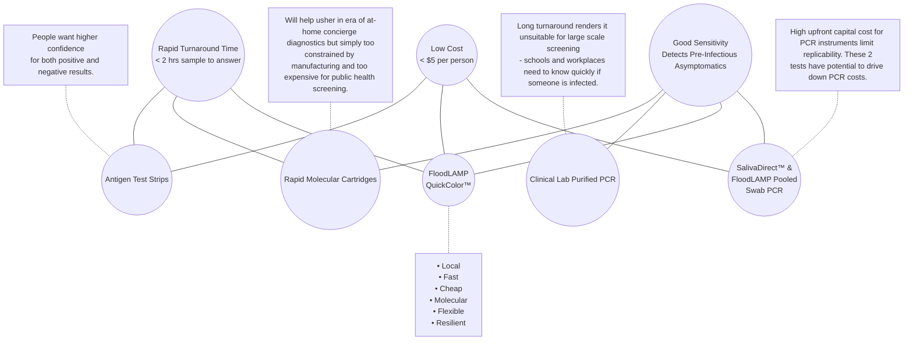

METADATA
last updated: 2026-03-06 by BA
file_name: Florida EMS Departments - FloodLAMP Slides (Aug 2022).md
file_date: 2022-08-04
title: Florida EMS Departments - FloodLAMP Slides (Aug 2022)
category: various
subcategory: fl-presentations
tags:
source_file_type: gslide
xfile_type: pptx
gfile_url: https://docs.google.com/presentation/d/1JaW4ytBV3mgA3MwDnlcT4SDGRddbIAJ-VH0XIQkAkHE
xfile_github_download_url: https://raw.githubusercontent.com/FocusOnFoundationsNonprofit/floodlamp-archive-wip/main/various/fl-presentations/Florida%20EMS%20Departments%20-%20FloodLAMP%20Slides%20%28Aug%202022%29.pptx
pdf_gdrive_url: https://drive.google.com/file/d/1zxaNPPWdDhXZwH3_vwMCBINOAeid6M3O
pdf_github_url: https://github.com/FocusOnFoundationsNonprofit/floodlamp-archive-wip/blob/main/various/fl-presentations/Florida%20EMS%20Departments%20-%20FloodLAMP%20Slides%20%28Aug%202022%29.pdf
conversion_input_file_type: pdf
conversion: megaparse
license: CC BY 4.0 - https://creativecommons.org/licenses/by/4.0/
tokens: 2724
words: 1674
notes:
summary_short: The FloodLAMP platform overview deck describes a low-cost, decentralized molecular screening system designed for rapid “point of need” deployment using pooled sample collection, standard lab equipment, and integrated digital tools, training, and quality processes. It highlights two core assays (a visual RT-LAMP test and a high-sensitivity RT-qPCR option) with reported clinical performance and frames the approach as supply-chain resilient and adaptable to future pathogens by swapping primer sets.

CONTENT

## Slide 1: FloodLAMP Biotechnologies, PBC
Delivering the testing our world needs For COVID-19 and beyond
Randy True, Founder and CEO randy@floodlamp.bio

## Slide 2: Addressing Current Vulnerabilities
### Antigen Tests are at Risk of Failure with New Variants
- Preliminary observational reports of antigen test failures in multiple outbreaks (BinaxNOW)
- Even if current antigen tests prove to detect Omicron, we're at risk of that not being the case with the next VOC

### Multi-Gene Molecular Tests are Resilient to New Variants
- Our test combines primer sets for 3 genes: ORF1ab, N2 and E1
- LAMP uses 6 primers and is highly tolerant to mismatches ( see recent NEB preprint analyzing our primers)

### Reagent Based Molecular Tests are Adaptable
- Primers can be swapped out quickly and cheaply, with all other test components remaining the same
- Primers can be produced in large volumes and distributed quickly (10's of M of reactions per production run)

### FloodLAMP can deliver Prepositioned Assets
- For distributed, rapid response surge capability
- Our systems comprise ordinary low cost lab equipment and offer best-in-class capacity per cost
- We deliver custom-designed wraparound components (digital tools, QA, training) that enable rapid scaling 

## Slide 3: Bypassing Typical Limitations
### Not limited by CLIA labs
- Non-Dx "surveillance" screening permitted by FDA and CMS but potential has not yet been realized at scale.
- Huge advantage in flexibility for deployment to widely distributed bare-bones test processing sites, which minimizes turnaround time and give highly valued local control and resiliency.

### Not limited by need for certified clinical lab techs
- Staffing shortages in the testing field are stifling. We can bring on and train new test operators very quickly while simultaneously ensuring test safety, reliably, and traceability.

### Not limited by upfront capital equipment
- $2K of standard, non-proprietary equipment gives 20K/day screening capacity.
- Sites can typically operate far under max capacity, and then quickly surge with addition of extra labor.

### Not limited by centralized manufacturing and sole sources
- Our test use standard consumables and has reagent supplier redundancy.

## Slide 4: Filling a Gap in the Testing Landscape
At Home OTC -> Point of Care -> Point of Need -> CLIA Labs

Current testing paradigms cannot stem a pandemic caused by an asymptomatically transmitted, aerosolized pathogen.

- Scaling a single test up to very high levels offers opportunities for innovation in sampling, test chemistry, and program configuration.
- A "Point of Need" modality of testing is needed that combines the scalability and low cost of liquid reagent processing with the ease, flexibility and decentralized nature of POC/At-Home.
- Public Health processing sites can fill the gap between CLIA labs and DIY at home tests.
- Want this new capability to be additive and not cannibalize the clinical diagnostic infrastructure.

## Slide 5: Performance in All Dimensions
_Diagram (Venn-style) comparing testing modalities by low cost, good sensitivity, and rapid turnaround time, with FloodLAMP QuickColor at the central overlap and a callout list of “Local/Fast/Cheap/Molecular/Flexible/Resilient” benefits._

## Slide 6: FLOODLAMP PLATFORM
_Diagram grid summarizing the FloodLAMP platform—applications across diseases, core modules split into physical and digital components, product offerings, and network partner groups._

### Applications
- COVID Response
- Emerging Threats (Pandemic Prep)
- TB / Zikka
- Influenza / STD’s / Cancer

### Core Modules
#### Physical
- Reagent Test Kits
- Collection Kits
- Standard Consumables
- Standard Equipment

#### Digital
- App
- Admin Portal
- Training Program
- Quality Management System

### Network
- EMS & Municipalities
- Schools and Businesses
- U.S. Federal Agencies (BARDA, ASPR, CDC, DoD, FEMA)
- International Governments

### Products
- All-in Test Kits
- Sample Processing Sites (Labs)
- Service, Support, Consulting
- Testing Program Management

## Slide 7: Our Unique Solution 
Standalone Components and Fully Integrated Program

### Pooled Swab Collection
_Photo of a labeled sample tube with a QR code, representing pooled swab collection for at-home family pooling._
**At-home Family Pooling**  
- Up to 4 nasal swabs per sample tube 
- Upfront at-home and on-site pooling makes lab processing far more efficient

### FloodLAMP Mobile App
_Screenshot of the FloodLAMP mobile app showing the collection workflow steps and a participant/results list for decentralized accessioning._
**Decentralized Accessioning**  
- Supports both self and sponsored collection
- Results can be reported directly to participants and administrators
- Lab staff and program admin interfaces

### Turnkey Complete Packages
**1000's Samples/Day Anywhere**  
- Everything needed to bringup program from empty room with 3 tables
- Comprises calibrated standard equipment, supplies, consumables, and test reagent kits (50+ SKUs, many pre-prepped for ease of use)

### Quality System
**Streamlined traceability**  
- In development with top QMS consulting group
- Covers suppliers, manufacturing, and test

### FloodLAMP QuickColor(TM) Test
_Photo of a tube rack with colorimetric RT-LAMP results (pink/yellow), illustrating the QuickColor visual readout._
**Molecular Performance**  
- RT-LAMP "PCR-like" molecular amplification 
- No instruments to run test or analyze results 
- Low cost and easy to run 
- Results in 45 minutes with only 15 min hands-on

### Training Program
**Remote certification**  
- In development with top learning experience consulting group
- Assessment for understanding and compliance 
- Enables rapid growth while maintaining quality 

## Slide 8: Core Assay Technology
FloodLAMP has fully validated 2 complementary tests that are best-of-breed with EUAs submitted to the FDA. Pooled home collection kit was also submitted for interactive review. The test workflow and collection kit has been designed to expand to other disease targets in the future.

_Flowchart diagram of streamlined sample prep feeding two complementary assays: QuickColor™ LAMP with visual tube readout and EasyPCR™ run on a standard RT‑qPCR instrument._

### Streamlined Sample Prep
- Upfront swab pooling 
- Highly scalable, integrated processing 
- Same sample for both tests

### QuickColor(TM) LAMP Test
- High sensitivity (90%) 
- Ultra-high throughput 
- Ideal for serial screening 
- Uniquely scales without capital intensive instruments
* Licensed from Harvard Medical School (Rabe Cepko - "SARS-CoV-2 detection using isothermal amplification and a rapid, inexpensive protocol for sample inactivation and purification" PNAS 09-29-2020, MGH Clinical Validation Preprint) 

### EasyPCR(TM) Test 
- Very high sensitivity (98%) 
- Medium throughput (1.5 hrs/94) 
- Ideal for diagnostics and confirmatory reflex

## Slide 9: Clinical Evaluation Data 
Clinical evaluation performed by the Stanford CLIA Lab, with excellent results and praise on the "really straightforward" protocol.

### EasyPCR(TM) Test
- 3 copies/µl LoD
- 98% sensitivity (PPA 39/40)
- 100% Specificity (40/40)
- No false positives

### QuickColor(TM)  LAMP Test
- 12 copies/µl LoD
- 90% Sensitivity (PPA 36/40)
- Missed positives only high Ct (>36 with direct PCR)
- 100% Specificity (40/40)
- No false positives

_G_Scatter plot of FloodLAMP EasyPCR(TM) preliminary LoD showing Ct (y-axis) versus target concentration in copies/mL (x-axis), with Ct decreasing from ~37 to ~32 as copies/mL increases up to 100,000._
Gamma inactivated cell lysate from BEI spiked into raw clinical negative sample

| FloodLAMP SwabDirect PCR Result | Comparator Positive | Comparator Negative | Total |
|---|---:|---:|---:|
| Positive | 39 | 0 | 39 |
| Negative | 1 | 40 | 41 |
| Invalid | 0 | 0 | 0 |
| **Total** | **40** | **40** | **80** |
||

- Positive Agreement: **97.5% (39/40)**; 95% CI: **86.8% to 99.9%**
- Negative Agreement: **100% (40/40)**; 95% CI: **91.2% to 100%**

| FloodLAMP QuickColor Test Result | Comparator Positive | Comparator Negative | Total |
|---|---:|---:|---:|
| Positive | 36 | 0 | 36 |
| Negative | 4 | 40 | 44 |
| **Total** | **40** | **40** | **80** |
||

- Positive Agreement: **90.0% (36/40)**; 95% CI: **76.3% to 97.2%**
- Negative Agreement: **100% (40/40)**; 95% CI: **91.2% to 100%**

Source of Specimens: Stanford COVID-19 Clinical Testing Program
Specimen Type: Anterior Nares Swab in PBS, previously tested and frozen
Comparator Test: Hologic Panther Fusion SARS-CoV-2 Assay and Hologic Panther Aptima SARS-CoV-2 Assay

## Slide 10: Program mechanics
### EMS/Employer program
- On-site employee pooled collection
- Multiple collection points 
- Courier service to lab (10-30 minutes)
- On-site lab
- Case study of hundreds of employees screened daily by one tester in 2 hrs
- Cost $2 per person
- Flexibility for follow up testing of families and contacts
- Case study of asymptomatic town manager testing positive, and using FloodLAMP to immediately test his family, picking up 2 asymptomatic positive kids and stopping exposure in their schools

_Flowchart diagram where multiple collection sites send pooled samples via 10–30 minute couriers to a centralized on-site FloodLAMP lab for processing._
