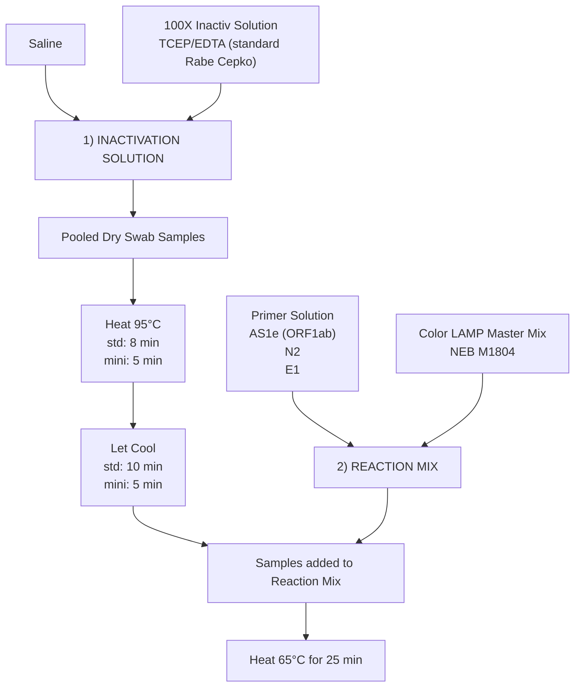
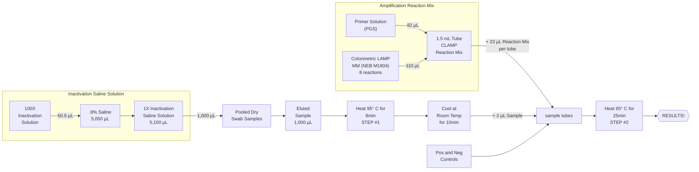
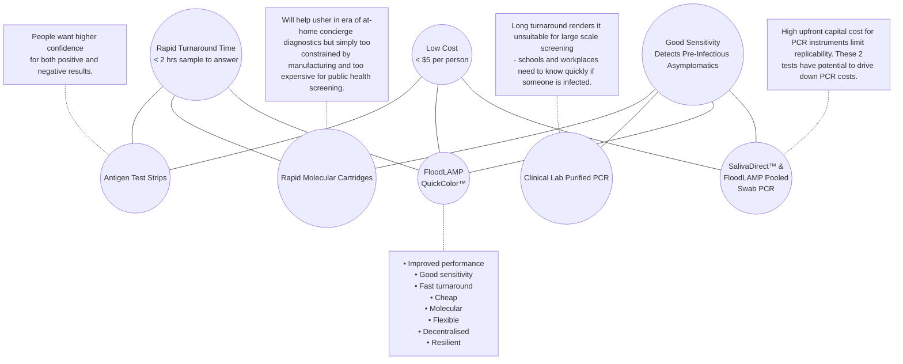

METADATA
last updated: 2026-03-06 by BA
file_name: New England Biolabs (NEB) Presentation - FloodLAMP (3-3-2022).md
file_date: 2022-03-03
title: New England Biolabs (NEB) Presentation - FloodLAMP (3-3-2022)
category: various
subcategory: fl-presentations
tags:
source_file_type: gslide
xfile_type: pptx
gfile_url: https://docs.google.com/presentation/d/1QBPpyxR3BLBtEJphxWNJvpULa3HWpWayMXFdh_skWq8
xfile_github_download_url: https://raw.githubusercontent.com/FocusOnFoundationsNonprofit/floodlamp-archive-wip/main/various/fl-presentations/New%20England%20Biolabs%20%28NEB%29%20Presentation%20-%20FloodLAMP%20%283-3-2022%29.pptx
pdf_gdrive_url: https://drive.google.com/file/d/1KZle6FJf4pdFdkO1VRVxWKqIuMFOB0Ks
pdf_github_url: https://github.com/FocusOnFoundationsNonprofit/floodlamp-archive-wip/blob/main/various/fl-presentations/New%20England%20Biolabs%20%28NEB%29%20Presentation%20-%20FloodLAMP%20%283-3-2022%29.pdf
conversion_input_file_type: pdf
conversion: megaparse
license: CC BY 4.0 - https://creativecommons.org/licenses/by/4.0/
tokens: 11561
words: 6211
notes:
summary_short: NEB seminar deck (Mar 3, 2022) presenting FloodLAMP’s “point-of-need” platform to extend LAMP’s reach for globally accessible disease screening. Covers real-world deployments (EMS, municipal workforces, preschool family pooling), workflow + kit/instrument/app stack, QA/QMS and training, clinical evaluation results (Stanford CLIA), and the “open protocol” regulatory vision (open EUA disclosures) positioning FloodLAMP’s QuickColor LAMP and sister PCR assay as a low-cost, decentralized alternative between OTC/home tests and centralized CLIA PCR.

CONTENT

## Slide 1: FloodLAMP Biotechnologies, PBC
Extending the Reach of LAMP:
the FloodLAMP platform for globally accessible disease screening

New England Biolabs Seminar - March 3, 2022
Randy True, Founder and CEO | randy@floodlamp.bio

## Slide 2: David Deutsch's Deep Optimism

"A much more general truth, namely that, for people, problems are inevitable. So let us carve that in stone:

**PROBLEMS ARE INEVITABLE**

It is inevitable that we face problems, but no particular problem is inevitable. We survive, and thrive, by solving each problem as it comes up. And, since the human ability to transform nature is limited only by the laws of physics, none of the endless stream of problems will ever constitute an impassable barrier. So a complementary and equally important truth about people and the physical world is that problems are soluble. By 'soluble' I mean that the right knowledge would solve them. It is not, of course, that we can possess knowledge just by wishing for it; but in principle it is accessible to us. So let us carve that in stone too:

**PROBLEMS ARE SOLUBLE**"

— *The Beginning of Infinity* by David Deutsch

## Slide 3: We still need better testing! 
_Screenshot collage of COVID-19 testing news headlines (e.g., Bloomberg Businessweek and other outlets) highlighting demand, shortages, and the call for “better testing.”_
### "All Anyone Wants for Christmas Is a Covid Test"

### Bloomberg Businessweek
"Want to go to a restaurant?
**We need better testing**
A sports event? A movie?
**We need better testing**
Travel somewhere? Anywhere?
**We need better testing**
Go to a wedding? A funeral? A party?
**We need better testing**
Send your kids back to an actual school?
**We need better testing**
A normal-ish life before there’s a vaccine?
**We need better testing**"

### "Covid has created a capitalist nightmare"
"Big Tech and Big Pharma are more powerful than ever"

### The New York Times
"Biden Promised 500 Million Free Tests. Then He Had To Find Them."
"Demand for Covid-19 testing is falling, but experts caution it's as important as ever"

## Slide 4: “FloodLAMP's mission is to improve global health and resiliency through universal access to rapid molecular testing.”
1. New testing technology
2. Turnkey screening programs
3. Disruptive open source strategy

## Slide 5: 1) Real World Programs
_Presentation Section Separator Slide_

## Slide 6: Operating Programs in the Real World
_Photo montage introducing FloodLAMP’s real-world screening programs (EMS deployments, municipal workforces, and preschool family pooling)._
### EMS Leadership Conference Screening
- 1,000 attendees

### Municipal & EMS Deployments
- Coral Springs, FL (approx. 132,000)
- Davie, FL (approx. 104,000)
- Bend, OR (approx. 94,000)

### Preschool Screening with Family Pooling
- Approx. 40 families
- 65-105 people per bi-weekly screening

## Slide 7: Town of Davie, FL
_Bar chart showing weekly screening volumes and positive results/positivity during the Omicron surge, with peaks in early 2022._

## Slide 8: Coral Springs, FL
_Bar chart showing weekly screening volumes and positive results/positivity with rapid increase in testing in early January 2022 and sustained high levels of testing through the end of February._

## Slide 9: Coral Springs, FL and Davie, FL
### Coral Springs, FL
_Photo collage of an on-site screening workspace and a PPE-clad tester, paired with a second photo of a Davie Fire Rescue room used for FloodLAMP COVID surveillance screening program operations._
A novice (but dedicated) tester is
able to screen 1000 critical city
employees.

### Davie, FL
_Photo of a small office/testing workspace at Davie Fire Rescue, with desks, supplies, and department insignia visible._

## Slide 10: Test Diagrams
### FloodLAMP QuickColor(TM) COVID-19 Test

## Slide 11: Bend, OR
_Bar chart plotting week starting date (x-axis) versus number of people (y-axis), showing people screened with positives overlaid (percent positive labeled)_

## Slide 12: Nova, Southeastern University Lab
Lab setup (Jan 2022)
_Photo collage of the Nova Southeastern University lab setup (Jan 2022), including bench layout, equipment, and supplies for running FloodLAMP assays._

## Slide 13: FloodLAMP accepted into Levan Innovation Center
_Photo(s) documenting FloodLAMP’s acceptance into the Levan Innovation Center (announcement/facility context)._

## Slide 14: Early Childcare COVID-19 Family Screening Pilot: Carillon Preschool
### Screenshot of Cover Page for FloodLAMP Whitepaper
**Protecting young children during the Omicron surge**

Prepared by:
Randy True - CEO, FloodLAMP Biotechnologies, PBC
randy@floodlamp.bio

Theresa Ling - User Experience and Design, FloodLAMP Biotechnologies, PBC
theresa@floodlamp.bio

_Photos of children at preschool_

### Quotes from Parents and School Staff
"I really appreciate this process. D tested positive on antigen test at home today and is now showing symptoms, so I truly appreciate the surveillance program picking this up!
Thank you again!!!"
\- Parent of a student who was referred to follow up testing while negative on antigen and
pre-symptomatic

"Thank you so much for helping to get our kids tested and doing what you can to keep them safely in school! We are all so lucky to have you as part of our community!"
\- Parent of a student and MD, wrote to school administrators' to move to mandatory testing
with FloodLAMP

"I thought \[FloodLAMP\] was perfect. Easy and convenient."
\- Parent of a student and restaurant owner who later wanted to extend FloodLAMP testing to
her restaurant employees

"You are a godsend to our community. I cannot begin to thank you for all of your support and love in keeping our community safe in this difficult time.
\- Preschool teacher and administrator

### Link for Preschool Pilot Description
[FloodLAMP Whitepaper - California Preschool Family Pooled Screening Pilot (June 2022)n](https://docs.google.com/document/d/1TOnklq-65XUX-v-li018rteK9jeL8NgqbNrtbndgD_o)
_FLOODLAMP ARCHIVE FILE PATH:_ various/fl-whitepapers/FloodLAMP Whitepaper - California Preschool Family Pooled Screening Pilot (June 2022).md

## Slide 15: Preschool, CA
_Bar chart plotting week starting date (x-axis) versus number of people (y-axis), showing people screened with positives overlaid (percent positive labeled)_

## Slide 16: Pre-School Screening - Case Report
- Several infections detected by FloodLAMP 1-2 days before symptoms or antigen tests
- In 3 different cases, family members of the preschool student were detected, showing the advantage of family pooling in protecting spread in a congregate setting such as schools and workplaces.

| Person/Test | 1/2/22 (Day 0) | 1/3/22 (Day 1) | 1/4/22 (Day 2) | 1/6/22 (Day 4) | 1/7/22 (Day 5) | 1/8/22 (Day 6) | 1/9/22 (Day 7) | 1/10/22 (Day 8) | 1/13/22 (Day 11) | 1/14/22 (Day 12) | 1/17/22 (Day 15) |
|---|---|---|---|---|---|---|---|---|---|---|---|
| Family Pool | POS FloodLAMP |  |  |  |  |  |  |  |  |  | POS FloodLAMP |
| Parent 1 | Asymptomatic POS FloodLAMP (Family Pool) NEG Antigen | POS FloodLAMP (Indiv) | POS PCR Lab (sent) |  | POS PCR Result |  | POS FloodLAMP (Indiv) | POS FL Result |  | NEG Antigen | POS FloodLAMP (Family Pool) |
| Parent 2 | Asymptomatic POS FloodLAMP (Family Pool) NEG Antigen | POS FloodLAMP POS PCR Lab (sent) | Symptoms POS PCR Result |  |  |  | POS FloodLAMP (Indiv) | POS FL Result |  | NEG Antigen | POS FloodLAMP (Family Pool) |
| Child 1 | Asymptomatic POS FloodLAMP (Family Pool) | NEG FloodLAMP | Symptoms POS Antigen | Asymptomatic | POS PCR Lab (sent) | POS PCR Result | POS FloodLAMP (Indiv) | POS FL Result |  | NEG Antigen | POS FloodLAMP (Family Pool) |
| Child 2 | Asymptomatic POS FloodLAMP (Family Pool) | NEG FloodLAMP | Symptoms POS Antigen | Asymptomatic POS PCR Lab (sent) | POS PCR Result |  | POS FloodLAMP (Indiv) | POS FL Result | POS Antigen (slight) | NEG Antigen | POS FloodLAMP (Family Pool) |
||

## Slide 17: Pre-School Screening
_Photo of the Mon 1/10 preschool screening run, showing labeled sample tubes/plates and a mix of pooled versus individual specimens prepared for testing._
Mon 1-10

_Photo of the Thu 1/13 follow-up preschool screening run, showing additional self-collected individual and family-pool samples processed through the same workflow._
Thurs 1-13

Mix of self collected individuals and family pools

## Slide 18: New Year's Eve Case Report
- FloodLAMP caught asymptomatic infection of advisor that 3 expensive OTC/POC rapid molecular tests missed (Detect, Lucira, and Mesa Accula)
- BinaX now wasn't positive until 2 days later.
- All FloodLAMP positive samples confirmed by PCR

**FloodLAMP New Years Eve Case Report**
caught asymptomatic infection that all antigen and OTC/POC molecular tests missed
| Test | 12-27-21 | 12-29-21 | 12-31-21 | 12-31-22 | 1-1-22 | 1-2-22 |
|---|---|---|---|---|---|---|
| FloodLAMP EasyPCR on saliva |  |  |  | POS - SalivaDirect PCR Ct 27.7 8 PM | POS - SalivaDirect PCR Ct 29.0 11 AM |  |
| Accula Rapid Molecular PCR (Worksite) |  |  |  |  | Accula NEG - nasal swab 4 PM |  |
| Lucira Rapid Molecular LAMP |  |  |  | Lucira NEG - nasal swab 5 PM |  |  |
| Detect Rapid Molecular LAMP | NEG - nasal swab 10 AM |  | Detect NEG - nasal swab 2 PM |  |  |  |
| CaseStart Antigen |  |  |  |  |  |  |
| FlowFlex Antigen |  | NEG - nasal swab 8 AM | NEG - nasal swab 2 PM |  |  | POS - nasal swab 10 AM |
| BinaxNow Antigen |  |  |  | NEG - nasal swab 5 PM | NEG - nasal and throat swabs 10 AM | POS - nasal swab 10 AM |
| FloodLAMP QuickColor LAMP Nasal Swab |  | NEG - nasal swab 1 PM |  | NEG - nasal swab PCR Ct Und/39.4 5PM | POS - nasal swab PCR Ct 32.2 10 AM |  |
| FloodLAMP QuickColor LAMP Throat Swab |  |  | POS - nasal swab PCR Ct 33.9 9 AM | POS - throat swab PCR Ct 30.2 5 PM | POS - throat swab PCR Ct 35.5 10 AM |  |
||

## Slide 19: Surveillance Testing Stats
**FloodLAMP Surveillance Testing Stats (Thru Mar 2, 2022)**

| Org | Pools | People | Positives |
|---|---:|---:|---:|
| FL FF | 1,107 | 1,779 | 44 |
| FL FTFC | 61 | 195 | 0 |
| Kent Summer Camp | 190 | 696 | 0 |
| Coral Springs City | 7,400 | 21,676 | 348 |
| Davie Fire Rescue | 2,235 | 4,226 | 55 |
| Pink Shoes Production | 671 | 671 | 1 |
| Bend Fire Rescue | 617 | 617 | 215 |
| **TOTAL** | **12,281** | **29,860** | **663** |
||

Avg Pool Size 2.4

## Slide 20: 2) Platform - Wrap Around Components
_Presentation Section Separator Slide_

## Slide 21: 2) Platform – Wraparound program components 
_Diagram grid summarizing the FloodLAMP platform—applications across diseases, core modules split into physical and digital components, product offerings, and network partner groups._

### Applications
- COVID Response
- Emerging Threats (Pandemic Prep)
- TB / Zikka
- Influenza / STD’s / Cancer

### Core Modules
#### Physical
- Reagent Test Kits
- Collection Kits
- Standard Consumables
- Standard Equipment

#### Digital
- App
- Admin Portal
- Training Program
- Quality Management System

### Network
- EMS & Municipalities
- Schools and Businesses
- U.S. Federal Agencies (BARDA, ASPR, CDC, DoD, FEMA)
- International Governments

### Products
- All-in Test Kits
- Sample Processing Sites (Labs)
- Service, Support, Consulting
- Testing Program Management

## Slide 22: Reagent Kits
_Photo collage of FloodLAMP reagent kit components (labeled tubes, assay reagents, and consumables) laid out for QuickColor™/EasyPCR™ workflows._

## Slide 23: Collection Kits
_Photo collage of participant collection kit materials (swabs, tubes/saline, labels, and packaging) used for pooled or individual sampling._

## Slide 24: Collection Instructions
_Photo of printed/graphic collection instructions showing how to swab, label, and package samples for submission._

## Slide 25: Equipment and Supplies
_Photo collage of packed equipment and consumables in boxes and bins(pipettes, racks, heat blocks, PPE, and disposables) used to run FloodLAMP tests, illustrating the supplies shipped/organized for site setup._

## Slide 26: "Lab"
_Photo collage of a small “lab” room setup and a stocked supply cabinet used for on-site processing._

## Slide 27: Portable System
_Photo collage of a portable hard-case system and its organized contents (pipettes, racks, consumables) for deploying a testing site._

## Slide 28: Portable System - in action
_Photo collage of the portable system in a home use case, showing the pipettes, tubes, and heater on a kitchen counter._

## Slide 29: Prepared Cart
_Photo collage of a prepared drawer cart with labeled bins and close-ups of organized consumables (tips, tubes, racks) ready for rapid setup and ease of use in processing._

## Slide 30: App
For program participants
_Screenshot collage of the participant-facing mobile app showing registration/check-in, sample accessioning (e.g., QR codes), and result notifications._

## Slide 31: App
For the lab
_Screenshot collage of the lab-facing app workflow for scanning samples, tracking runs, and recording/reporting results._

## Slide 32: Admin portal
Tools for program administrators
_Screenshot of the admin portal dashboard used by program administrators to manage participants, sites, and testing/reporting logistics._

## Slide 33: Test Diagrams
### FloodLAMP QuickColor(TM) COVID-19 Test
_Diagram of detailed process flow with volumes and steps for preparing inactivation saline, inactivating pooled swabs, mixing reaction components, loading tubes/controls, and incubating to results._

## Slide 34: Training Program - Interactive Video
_Screenshot collage of the interactive training program (video modules with embedded questions using platform EdPuzzle) used to train and standardize operators._

## Slide 35: Training Program - Assessment for Certification
_Flowchart diagram of the certification pathway in Moodle/EdPuzzle, showing video modules, quizzes, pass/fail loops, practice runs, staff review, and final certification._

```mermaid
flowchart LR
  %% Unconnected reference box in the slide
  vlist["Video List for Phase1<br/>1) Overview<br/>2) Safety and Contamination<br/>3) Prep 1X ISS<br/>4) Prep Rxn Mix<br/>5) Inactivation<br/>6) Amplification (assay run)<br/>7) App and Resulting<br/>8) Dispenser"]

  start{{Send learner link to self-enroll}} --> login((Learner logs into Moodle))

  subgraph Moodle["Moodle Course<br/>Enrollment, completion, activity, etc data collection"]
    direction LR

    %% EdPuzzle sequence (use asymmetric shape to better match the screenshot blocks)
    ep1>EdPuzzle Interactive video w/ questions<br/>Create 1X Inactivation Solution]
    ep2>EdPuzzle Interactive video w/ questions<br/>Create Reaction Mix Solution]
    ep3>EdPuzzle Interactive video w/ questions<br/>Inactivation of Samples]
    ep4>EdPuzzle Interactive video w/ questions<br/>Amplification Run]
    ep5>EdPuzzle Interactive screencast w/ questions<br/>Review Amp Run Sheet]

    %% Quiz sequence (diamonds in the slide)
    reviewQuiz{"Review Quiz w Answers (moodle doc)"}
    takeQuiz{"Take Moodle Quiz (closed book)"}
    selfGradeQuiz{"Self Grade (logged in moodle)"}

    %% Pass/Fail nodes (rounded-corner boxes in the slide)
    passQuiz(Pass)
    failQuiz(Fail)

    requestPractice{"Request on-site Practice and cert"}
    recordRun["Record Run On site"]

    selfGradeOnsite{"Self Grade (logged in moodle)"}
    passOnsite(Pass)
    failOnsite(Fail)

    selfGradeOnsite -.->|Redo as needed| recordRun

    %% Double-border “assignment/subprocess” style box
    submitRun[[Submit self recorded full run to Moodle Assignment]]

    notify["Triggers FL Staff notification"]

    %% Trapezoid-ish staff review box (screenshot looks like reverse trapezoid)
    staffReview[\FloodLAMP Staff reviews video/]

    staffChecklist>"FloodLAMP Staff submits checklist on review of video"]

    passStaff(Pass)
    failStaff(Fail)

    cert{{"Certificate<br/>!!!"}}

    reviewSelected["Review Selected Videos"]

    %% Main flow
    login --> ep1 --> ep2 --> ep3 --> ep4 --> ep5 --> reviewQuiz --> takeQuiz --> selfGradeQuiz

    %% Quiz grading branches
    selfGradeQuiz --> passQuiz --> requestPractice --> recordRun --> selfGradeOnsite
    selfGradeQuiz -.-> failQuiz -.-> reviewSelected

    %% On-site self grade branches
    selfGradeOnsite --> passOnsite --> submitRun --> notify --> staffReview --> staffChecklist --> passStaff --> cert
    selfGradeOnsite --> failOnsite -.-> reviewSelected

    %% Staff checklist fail branch (dotted in slide)
    staffChecklist -.-> failStaff -.-> reviewSelected

    %% Remediation loop (dotted back to video set in slide)
    reviewSelected -.-> ep1
  end
```

## Slide 36: Quality Management System
- Implementing ISO 13485 QMS
- QR Form Driven Logs
_Screenshot collage of QMS forms and run sheets (with QR codes) illustrating ISO 13485-style documentation and log capture._

## Slide 37: New Site Validation Run
_Photo of a validation run layout with multiple labeled reaction tube strips, showing control and pool identifiers for a site validation check._
FloodLAMP Coral Springs Validation Run 8-2-21

Pool1
Pool2
Pool3
ZCP25
ZCP25
ZCP25
NC
TPC

GCP100
GCP100
GCP100
NC
FPNC
FPNC
FPNC
TPC

## Slide 38: 3) Open Source "Generic" Tests
_Presentation Section Separator Slide_

## Slide 39: At Sweet Spot of Performance
_Diagram (Venn-style) contrasting rapid turnaround, low cost, and good sensitivity, with FloodLAMP positioned as the “sweet spot” relative to antigen strips, rapid cartridges, and clinical lab PCR._

## Slide 40: Filling a Gap in the Testing Landscape
At Home OTC -> Point of Care -> Point of Need -> CLIA Labs

Current testing paradigms cannot stem a pandemic caused by an asymptomatically transmitted, aerosolized pathogen.

- Scaling a single test up to very high levels offers opportunities for innovation in sampling, test chemistry, and program configuration.
- A "Point of Need" modality of testing is needed that combines the scalability and low cost of liquid reagent processing with the ease, flexibility and decentralized nature of POC/At-Home.
- Public Health processing sites can fill the gap between CLIA labs and DIY at home tests.
- Want this new capability to be additive and not cannibalize the clinical diagnostic infrastructure.

## Slide 41: LAMP EUAS for SARS-COV2
| EUA Date | Test | Diagnostic | Target | IC | Detection | Extraction | Amplification | LOD spike | LOD GE/3ml swab |
|---|---|---|---|---|---|---|---|---|---:|
| Nov-17 | Lucira (At Home POC) | Lucira COVID-19 All-In-One Test Kit | N, N | External + IC | Colorimetric | ~Direct | Lucira device | Inactivated virus | 2,700 |
| Oct-05 | Seasun (2 duplex) | AQ-TOP COVID-19 Rapid Detection Kit PLUS | orf1ab, N | Human RNaseP | PNA Probe | Manual (Qiagen_60704 or Seasun_SS-1300) or Automated (Panagene_PNAK-1001 on PanaMax48) | BioRad_CFX96 or ABI7500 | NCCP_43326 genomic RNA | 3000 |
| Sep-01 | Detectachem | MobileDetect Bio BCC19 (MD-Bio BCC19) Test Kit | N, E | only external controls | Colorimetric | Direct (1µl of transport media into LAMP) | heat block or qPCR (MD-Bio heater or BioRad_T100 or AB_Veriti or …) | Twist_MT007544.1 synthetic gRNA | 225,000 |
| Aug-31 | Mammoth | SARS-CoV-2 DETECTR Reagent Kit | N | Human RNaseP | CRISPR Probe | Automated (Qiagen_955134 on Qiagen_EZ1AdvancedBenchtop) | ABI7500 | SeraCare_AccuPlex_0505-0168 IVT encapsulated RNA | 60,000 |
| Aug-13 | Pro-Lab | Pro-AmpRT SARS-CoV-2 Test | RdRP | only external controls | Probe | Direct (swab into 0.1ml) or kit (swab into 1ml then Pro-lab_PLM-2000) | Optigene_GenieHT | BEI_NR-52287 inactivated virus | 125* |
| Jul-09 | UCSF/Mammoth | SARS-CoV-2 RNA DETECTR Assay | N | Human RNaseP | CRISPR Probe | automated (Qiagen_955134 on Qiagen_EZ1) | ABI7500 | SeraCare_AccuPlex_0505-0126 (lot 10480311) IVT RNA | 60,000 |
| May-21 | Seasun (1 duplex) | AQ-TOP COVID-19 Rapid Detection Kit | orf1ab | Human RNaseP | PNA Probe | manual (Qiagen_60704) | BioRad_CFX96 or ABI7500 | NCCP_43326 gRNA | 21,000 |
| May-18/Aug31 | Color | Color Genomics SARS-CoV-2 RT-LAMP Diagnostic Assay | N, E, nsp3 | Human RNaseP | Colorimetric | automated (PerkinElmer_CMG-1033 on PerkinElmer_Chemagic360) | plate reader (Biotek_NEO2), Hamilton_Star | ATCC_VR-1986D (gRNA) | 2,250 |
| May-06 | Sherlock BioSci | Sherlock CRISPR SARS-CoV-2 Kit | orf1ab, N | Human RNaseP | CRISPR Probe | Manual (ThermoFisher_12280050) | heat block or qPCR, Plate reader (BioTek_NEO2) | gRNA | 20,250 |
| Apr-10 | Atila BioSystems | iAMP COVID-19 Detection Kit | orf1ab, N | human GAPDH | Probe | Direct (swab into 350µl, 15min RT then 3µl to LAMP) | BioRad_CFX96 or ABI7500 or Roche_LightCycler480II or Atila_PG9600 | SeraCare_AccuPlex_0505-0129 pseudovirus (recombinant alphavirus) | 3,500* |
||

Just in 2020!
from Matt McFarlane
(twitter @mattmcfar)

## Slide 42: PCR and LAMP Sister Assays
### Streamlined Sample Prep
_Drawing of 4 swabs in tubes being eluted_
- Shelf stable TCEP/EDTA inactivation solution
- Added directly to dry swabs

- Same sample for both tests
- 2µL sample volume

### QuickColor(TM) LAMP Test
_Drawing on 6 reaction tubes with the first one showing a yellow positive LAMP reaction and the other 5 pink for negative_
- Colorimetric LAMP reaction
- 3 primer sets mixed (AS1e, N2, E1)
- 25 minutes at 65°C

### EasyPCR(TM) Test
_Drawing of a PCR machine_
- Multiple PCR Master Mixes Validated
- CDC primers in SalivaDirect config (N1, RNAseP)

## Slide 43: Clinical Evaluation Data
Clinical evaluation performed by the Stanford CLIA Lab, with excellent results and praise on the "really straightforward" protocol.

### EasyPCR(TM) Test
- 3 copies/µl LoD
- 98% sensitivity (PPA 39/40)
- 100% Specificity (40/40)
- No false positives

### QuickColor(TM)  LAMP Test
- 12 copies/µl LoD
- 90% Sensitivity (PPA 36/40)
- Missed positives only high Ct (>36 with direct PCR)
- 100% Specificity (40/40)
- No false positives

_Scatter plot of FloodLAMP EasyPCR(TM) preliminary LoD showing Ct (y-axis) versus target concentration in copies/mL (x-axis), with Ct decreasing from ~37 to ~32 as copies/mL increases up to 100,000._
Gamma inactivated cell lysate from BEI spiked into raw clinical negative sample

| FloodLAMP SwabDirect PCR Result | Comparator Positive | Comparator Negative | Total |
|---|---:|---:|---:|
| Positive | 39 | 0 | 39 |
| Negative | 1 | 40 | 41 |
| Invalid | 0 | 0 | 0 |
| **Total** | **40** | **40** | **80** |
||

- Positive Agreement: **97.5% (39/40)**; 95% CI: **86.8% to 99.9%**
- Negative Agreement: **100% (40/40)**; 95% CI: **91.2% to 100%**

| FloodLAMP QuickColor Test Result | Comparator Positive | Comparator Negative | Total |
|---|---:|---:|---:|
| Positive | 36 | 0 | 36 |
| Negative | 4 | 40 | 44 |
| **Total** | **40** | **40** | **80** |
||

- Positive Agreement: **90.0% (36/40)**; 95% CI: **76.3% to 97.2%**
- Negative Agreement: **100% (40/40)**; 95% CI: **91.2% to 100%**

Source of Specimens: Stanford COVID-19 Clinical Testing Program
Specimen Type: Anterior Nares Swab in PBS, previously tested and frozen
Comparator Test: Hologic Panther Fusion SARS-CoV-2 Assay and Hologic Panther Aptima SARS-CoV-2 Assay

## Slide 44: Clinical Evaluation by Stanford CLIA Lab
_Screenshot/photo from the Stanford CLIA Lab evaluation microtiter wellplate of LAMP reactions._

## Slide 45: Clinical Evaluation by Stanford CLIA Lab
_Bar chart of Stanford CLIA QuickColor™ evaluation outcomes for 40 positive and 40 negative samples, showing positives, inconclusives (high Ct/low viral load), and negatives among true positives and zero false positives in true negatives._
### 40 Clinical Positive Samples:
29 Positive by FloodLAMP QuickColor(TM) Test
  7 Inconclusive (all high Ct, low viral load)
  4 Negative (all > 36 Ct, very low viral load)

### 40 Clinical Negative Samples:
40 Negative by FloodLAMP QuickColor(TM) Test

## Slide 46: Clinical Evaluation by Stanford CLIA Lab
### Clinical Evaluation: 40 SARS-CoV2 Positive Remnant Samples
_Scatter Plot with Direct PCR (FloodLAMP EasyPCR) thawed after 2 months Ct values (y-axis) vs (Comparator Purified PCR (Hologic Fusion) original fresh sample Ct values (x-axis)_
One sample Undetermined (not detected) by FloodLAMP(TM) EasyPCR

Detected in FloodLAMP EasyPCR(TM)
Not detected by FloodLAMP QuickColor(TM) 
(EasyPCR(TM) PPA   39/40  97.5%)

Detected in both FloodLAMP EasyPCR(TM) and  QuickColor(TM) Colorimetric LAMP test
(QuickColor(TM) PPA   36/40   90%)
* includes initial inconclusive resolved by PCR

Both FloodLAMP EasyPCR(TM) and  QuickColor(TM) had no false positives
(NPA   40/40  100%)

## Slide 47: Clinical Evaluation by Stanford CLIA Lab
### FloodLAMP Stanford Clinical Evaluation - All 3 Tests: Fluorimetric LAMP, Colorimetric LAMP, and PCR
_Scatter Plot with FloodLAMP QuickFluor LAMP Ct (minutes) vs FloodLAMP EasyPCR Ct_
One sample not detected by
FloodLAMP EasyPCR(TM)
(PPA 39/40 97.5%)

6 Positives Not Detected by
FloodLAMP QuickFluor(TM) test
(PPA 34/40 85%)

Positives detected not by
FloodLAMP QuickColor(TM) test
(PPA 36/40 90%)
* includes initial inconclusives resolved by
PCR

All 3 Tests:
FloodLAMP EasyPCR(TM)
QuickColor(TM) LAMP
QuickFluor(TM) LAMP
had no false positives
(NPA 40/40 100%)

## Slide 48: SalivaDirect "most unique EUA" - FDA
_Screenshot of the SalivaDirect™ FDA EUA lab authorization request form, illustrating an open-protocol model where Yale can designate CLIA labs to run the assay._
- Is a protocol not a product
- Open Access - any CLIA can use
- Lots of clone assays being used

- Yale can "designate" CLIA labs

### SalivaDirect: Lab authorization request form
SalivaDirect received Emergency Use Authorization (EUA) from the Food and Drug
Administration (FDA) on August 15th, 2020.

The SalivaDirect FDA EUA is for a Laboratory Developed Test, but we have the right to designate other labs its use.

Only high complexity CLIA-certified labs in the United States C I become authorized to ru un SalivaDirect. Please fill out this form if you would like to receive more information on how to become a designated lab.

Do you have access to at least 5x SARS-COV-2 positive and 5x negative saliva samples for CLIA verification?*

Would you be open to collaboration on bridging studies for your automation
systems?

## Slide 49: Open EUAs - 2 Full Submissions + Pre-EUA
_Screenshots of three document cover pages representing regulatory materials: QuickColor™ and EasyPCR™ COVID-19 test “Instructions for Use” plus a pooled swab collection kit document._
### FloodLAMP QuickColor(TM) COVID-19 Test
Instructions for Use v1.2
IVD
COVID-19 Emergency Use Authorization Only
For in vitro diagnostic (IVD) Use

### FloodLAMP EasyPCR(TM) COVID-19 Test
Instructions for Use v1.1
IVD
COVID-19 Emergency Use Authorization Only
For in vitro diagnostic (IVD) Use

FloodLAMP
Biotechnologies
A Public Benefit Corporation

### FloodLAMP Pooled Swab Collection Kit DTC
For use with the FloodLAMP Mobile App
www.floodlamp.bio
FloodLAMP Biotechnologies, PBC 930 Brittan Ave. San Carlos, CA 94070 USA

## Slide 50: Open EUA - Disclosure of Components
_Table collage showing disclosed Open EUA components: validated reagent list, primer names/sequences, and preparation tables for primer–guanidine solution and the colorimetric LAMP reaction mix._
### Table 1: Validated reagents used with the Test
| Item | Concentration | Chemical Composition | Vendor | Catalog Number |
|---|---|---|---|---|
| TCEP | .5 M | tris(2-carboxyethyl)phosphine hydrochloride | Sigma-Aldrich / Millipore Sigma | 646547-10X1ML |
| EDTA | .5 M | Ethylenediaminetetraacetic acid | Thermo Fisher | 15575020 |
| NaOH | 10 N | Sodium Hydroxide | Sigma-Aldrich | SX0607N-6 |
| Nuclease-free Water |  | Ultrapure Water, nuclease-free | Thermo Fisher | 10977015 |
| NaCl | 5 M | Sodium Chloride | Thermo Fisher | 24740011 |
| Guanidine HCl | 6 M | Guanidine Hydrochloride | Sigma-Aldrich | SRE0066 |
| Colorimetric LAMP MM* |  | Colorimetric LAMP Master Mix | New England Biolabs | M1804 |
||

### Table 2: Primer names and sequences
| Primer Name | Sequence (5’-3’) |
|---|---|
| **ORF1ab gene (AS1e)** |  |
| Orf1ab_FIP | TCAGCACACAAAGCCAAAAATTTATTTTTCTGTGCAAAGGAAATTAAGGAG |
| Orf1ab_BIP | TATTGGTGGAGCTAAACTTAAAGCCTTTTCTGTACAATCCCTTTGAGTG |
| Orf1ab_F3 | CGGTGGACAAATTGTCAC |
| Orf1ab_B3 | CTTCTCTGGATTTAAACACACTT |
| Orf1ab_LF | TTACAAGCTTAAAGAATGTCTGAACACT |
| Orf1ab_LB | TTGAATTTAGGTGAAACATTTGTCACG |
| **N Gene (N2)** |  |
| N2_FIP | TTCCGAAGAACGCTGAAGCGGAACTGATTACAAACATTGGCC |
| N2_BIP | CGCATTGGCATGGAAGTCACAATTTGATGGCACCTGTGTA |
| N2_F3 | ACCAGGAACTAATCAGACAAG |
| N2_B3 | GACTTGATCTTTGAAATTTGGATCT |
| N2_LF | GGGGGCAAATTGTGCAATTTG |
| N2_LB | CTTCGGGAACGTGGTTGACC |
||

### Table 7: Primer-Guanidine: Solution
| Component | Volume (1 reaction) | Volume (1 reaction x 100) 1 x 96-plate w/ 4% overage |
|---|---:|---:|
| 10X LAMP Primer Mix | 2.5 µL | 250 µL |
| Guanidine HCl (400 mM) | 2.5 µL |  |
| Guanidine HCl (6 M) |  | 16.7 µL |
| Nuclease-free Water | 5.5 µL | 783 µL |
| **TOTAL VOLUME** | **10.5 µL** | **1050 µL** |
||

### Table 8: Colorimetric LAMP Amplification Reaction
| Component | Volume (1 reaction) | Volume (100 reactions) |
|---|---:|---:|
| Primer–Guanidine Solution | 10.5 µL | 1050 µL |
| Colorimetric LAMP MM | 12.5 µL | 1250 µL |
| **SUBTOTAL VOLUME** | **23 µL** | **2300 µL** |
| Sample | 2 µL |  |
| **REACTION VOLUME** | **25 µL** |  |
||

## Slide 51: Open EUAs
Provides a path to establishing generics in diagnostics.

_Table comparing “open EUA” transparency and supply-chain criteria across EUA types and programs (Typical IVD, CDC, SalivaDirect™, SHIELD, and FloodLAMP EasyPCR™/QuickColor™), with program logos along the header row._

| Question | Typical IVD EUA | CDC EUA | SalivaDirect™ | SHIELD | FloodLAMP EasyPCR™ | FloodLAMP QuickColor™ |
|---|---|---|---|---|---|---|
| Disclosure of all chemicals and reagents? | No | Yes | Yes | Yes | Yes | Yes |
| Chemical and reagents available from multiple vendors? | No | Yes | Yes | No | Yes | Yes |
| Disclosure of primer sequences? | No | Yes (std for PCR) | Yes | No (Proprietary Thermo) | Yes | Yes |
| Primers commercially available from multiple vendors? | No | Yes | Yes (CDC Primers) | No (Proprietary Thermo) | Yes (CDC SD Primers) | Yes (Available but not launched) |
| Supply chain robust? | No | No/Maybe | Yes | No/Maybe | Yes | Yes |
| EUA Sponsor Organization Type | For Profit Company | Govt | Academic Not for Profit | Academic Not/For Profit ? | Public Benefit Corp | Public Benefit Corp |
| Designation of CLIA labs | Kit Sales | N/A open RoR | Impact & Expansion | Impact & Expansion | Impact & Expansion | Impact & Expansion |
||

## Slide 52: Push for Regulatory Progress
_Screenshot of Excerpt from PREVENT Pandemics Act legislation_
**Prepare for and Respond to Existing Viruses, Emerging New Threats, and Pandemics Act (PREVENT Pandemics Act)**  

| Section | Topic | Key provisions |
|---|---|---|
| Sec. 505 | Facilitating the use of real world evidence | Requires FDA to issue or revise guidance on the use of real-world data and real-world evidence to support regulatory decisionmaking, including with respect to real-world data and real-world evidence from products authorized for emergency use. |
| Sec. 506 | Advanced platform technologies | Creates an advanced platform technology designation to expedite the development and review of new treatments and countermeasures that use cutting-edge, adaptable platform technologies that can be incorporated or used in more than one drug or biological product.  Requires FDA to issue guidance on the implementation of the new designation. |
| Sec. 507 | Increasing EUA decision transparency | Provides FDA with authority to share more safety and effectiveness information with the public about products authorized for emergency use. |
| Sec. 508 | Improving FDA guidance and communication | Requires publication of a report identifying best practices across the FDA and other applicable agencies for the development, issuance, and use of guidance documents and for communications with product sponsors and other stakeholders, and a plan for implementing such best practices.  Requires FDA to publish a report on the agency’s best practices for communicating with medical product sponsors and other stakeholders, and a plan for implementing such best practices. |
| Sec. 509 | GAO study and report on hiring challenges at FDA | Directs GAO to issue a report assessing FDA’s hiring, recruiting, and retention practices, policies, and processes, and their impact on FDA’s ability to carry out its public health mission, particularly in light of the COVID-19 pandemic. |
||

https://www.help.senate.gov/imo/media/doc/PREVENT%20Pandemics%20discussion%20draft%20sxs%20final.pdf

https://reaganudall.org/research-funding-opportunity

## Slide 53: Team Effort!
_Photo collage of lab staff at benches and close-up shots of personnel in PPE performing sample handling and labeling tasks._

## Slide 54: FloodLAMP Team - Thank You!
#### Randy True
Founder & CEO
Founder TMI Inc. Acq. Affymetrix
Former VP of R&D at. Affymetrix
bit.ly/biosketch-randalltrue
co-author global LAMP consortium review: bit.ly/GLAMP-review.
https://abrf.memberclicks.net/ibt-2021-september-issue

#### Theresa Ling
UX/Design Lead

#### Gary Withey, Ph.D.  
Vice President of Research & Development

#### Dr. Peter Antevy, MD
Program Medical Director 

#### Brandon Smith
Lab Assistant

### Scientific Advisory Board
Anne Wyllie
Yale, Lead Researcher SalivaDirect

Bill Hyun
UC San Francisco, Genoa Ventures

### Industry Advisors
Tim Lugo
William Blair Biotechnology Group Head

Zarak Khurshid
Asymmetry Capital, Top MDx Analyst

John Edge
Oxford Internet Institute, Blue Field Labs, ID2020

### Acknowledgments
Antanas Sadunas, Sam Fogelberg, Carey Tan,
Esmé Thornhill-Davis, Jeff Huber, Cliff Wang,
Chris Mason, Simon Johnson, Brett Johnson,
Mike Finney, Ron Cook
NSVD: Vincent Law, Michael Wells, Katrina
Brandis, Gaby Hartley, Tim Earley, Nasreen Haque
Research-Aid Networks: Jeremy Rossman
EMS deployments: Adam, Danny, Alex, Petar, Dr.
Paul Pepe
Thanks too to all of our advisors, volunteers &
former employees!

## Slide 55: APPENDIX
_Presentation Section Separator Slide_

## Slide 56: Successful Commercial Pilots
- Commercial deployments in 3 states.

- On-site, rapid mass molecular testing performed and operated by EMS staff.

2 cities have opted for mandatory FloodLAMP testing. Prioritizing it over antigen and PCR alternatives.

"FloodLAMP's testing program is a total game-changer. I didn't know this was possible. I've been blown away.
- President of Production Company for FloodLAMP Pilot program “ROSA”

"It's been a godsend!"
- EMS Training Director running the FloodLAMP program

## Slide 57: Collaboration with University of Antioquia (Medellín, Colombia)
_Photo/map or logo slide highlighting collaboration with the University of Antioquia in Medellín, Colombia._
Joint NEB/FloodLAMP project

## Slide 58: Rapid antigen tests work well for Omicron (study highlights)
_Screenshot collage of a news article and medRxiv preprint excerpt summarizing rapid antigen test performance for Omicron versus Delta in asymptomatic serial self-testing._

HEALTH
Several common rapid antigen tests work well for Omicron, according to a new study.
The new findings are from an ongoing U.S. study that began in October and was designed to assess the performance of rapid antigen tests in asymptomatic people.
By Emily Anthes
March 1, 2022

medRxiv
THE PREPRINT SERVER FOR HEALTH SCIENCES
CSH (Cold Spring Harbor Laboratory) • BMJ • Yale
View current version of this article
Comparison of Rapid Antigen Tests’ Performance between Delta (B.1.617.2;AY.X) and Omicron (B.1.1.529;BA.1) Variants of SARS-CoV-2: Secondary Analysis from a Serial Home Self-Testing Study
Apurv Soni; Carly Herbert; Andreas Filippaios; John Broach; Andres Colubri; Nisha Fahey; Kelsey Woods; Janvi Nanavati; Colton Wright; Taylor Orwig; Karen Gilliam; Vik Kheterpal; Tejas Suvarna; Chris Nowak; Summer Schrader; Honghuang Lin; Laurel O’Connor; Caitlin Pretz; Didem Ayturk; Elizabeth Orvek; Julie Flahive; Peter Lazar; Qiming Shi; Chad Achenbach; Robert Murphy; Matthew Robinson; Laura Gibson; Pamela Stamegna; Nathaniel Hafer; Katherine Luzuriaga; Bruce Barton; William Heetderks; Yukari C. Manabe; David McManus
doi: https://doi.org/10.1101/2022.02.27.22271090

Results From the 7,349 participants enrolled in the parent study, 5,506 met the eligibility criteria for this analysis. **A total of 153 participants were RT-PCR+ (61 Delta, 92 Omicron); among this group, 36 (23.5%) tested Ag-RDT+ on the same day and 36 (23.5%) tested Ag-RDT+ within 48 hours as first RT-PCR+.** The differences in sensitivity between variants were not statistically significant (same-day: Delta 16.4% [95% CI: 8.2-28.1] vs Omicron 28.2% [95% CI: 19.4-38.6]; and 48-hours: Delta 45.9% [33.1-59.2] vs.

## Slide 59: Primer Comparison
_Bar charts comparing amplification time across three primer sets (A/N/E) and purification methods (HPLC vs desalted) at two input concentrations, showing faster performance for selected HPLC primers._
All 3 primer sets chosen by HPLC purification

Run with NEB E1700 Fluorimetric LAMP on QuantStudio7

Sample is contrived positive with Gamma BEI spiked into negative clinical sample

A = AS1e primer Rabe-Cepko set for ORFlab
N = N2 primer set
E = E1 primer set
"H" = HPLC purified
"D" = Desalted
