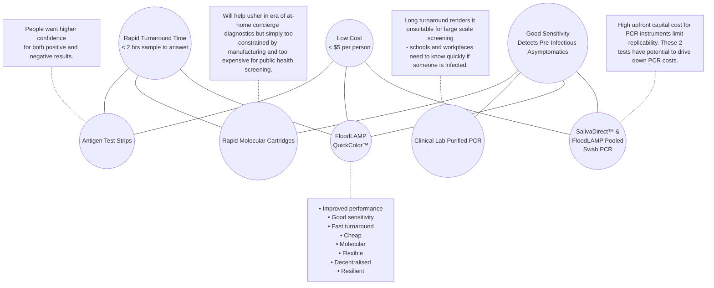
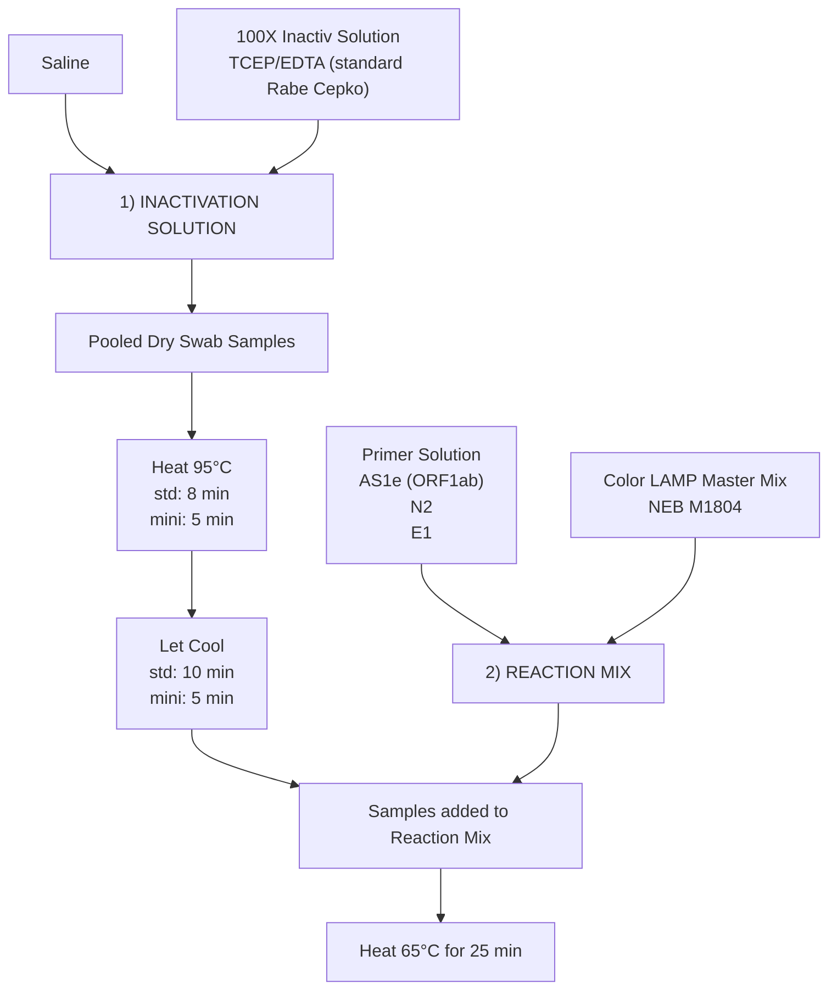
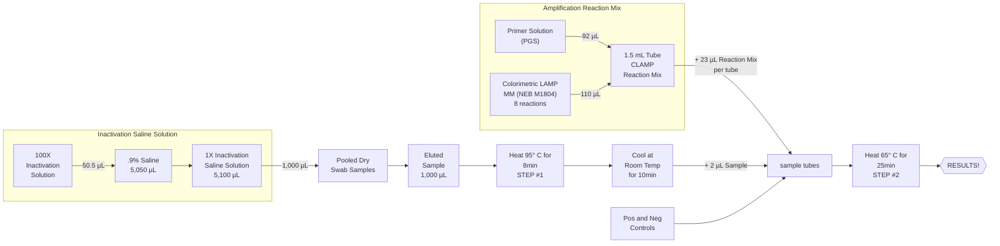
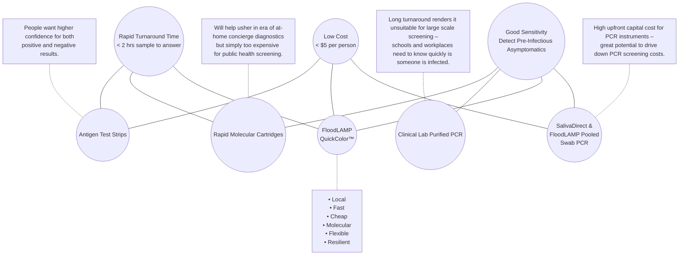
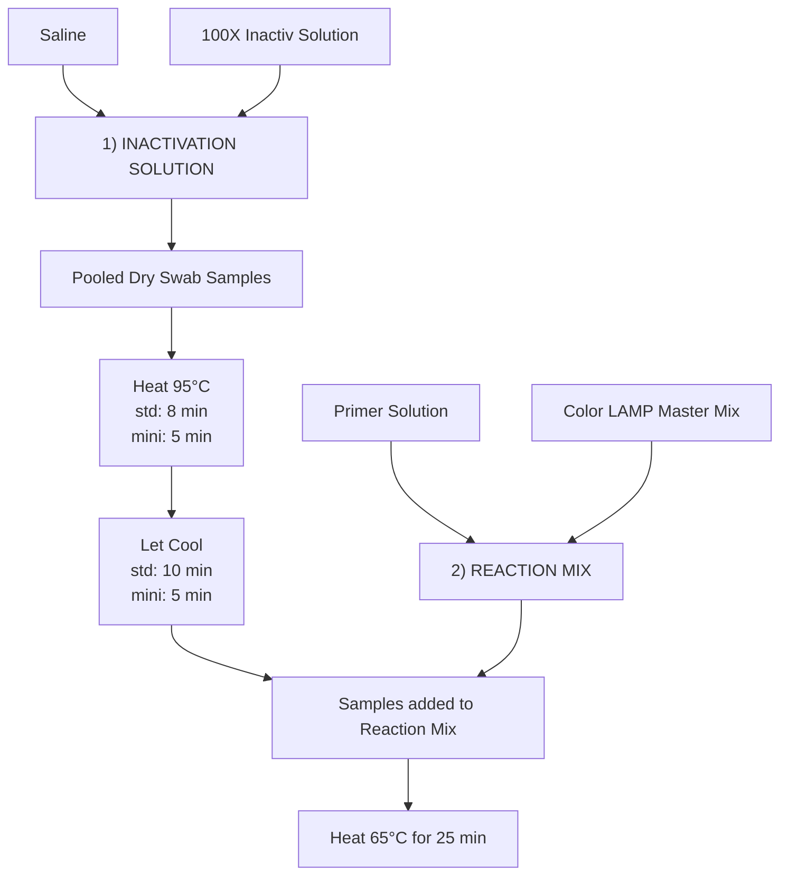
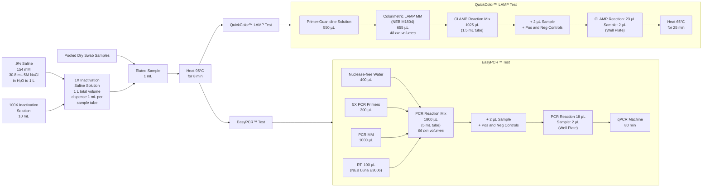
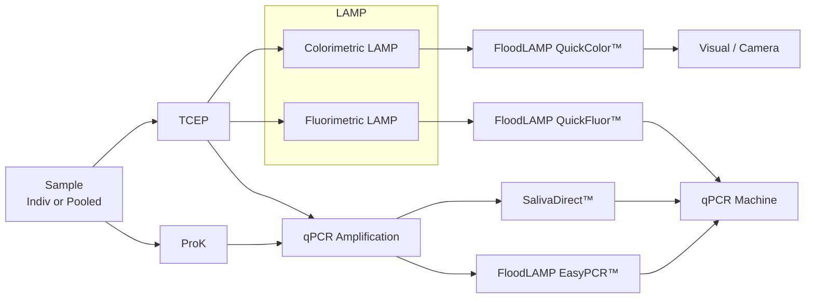
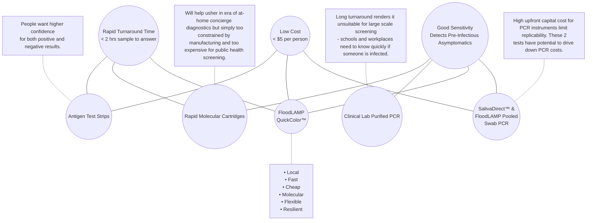

# ===== START OF FILE _archive-combined-files_fl-presentations_50k.md =====
# fl-presentations (10 files, 50,225 tokens)

# 1,159  _context-commentary_various-fl-presentations.md
METADATA
last updated: 2026-02-18 RT
file_name: _context-commentary_various-fl-presentations_WIP.md
category: various
subcategory: fl-presentations
words: 819
tokens: 1159

CONTENT

## Context
The fl-presentations subcategory contains eight files: six slide decks and two one-page summary documents (the quad charts and a COVID-19 tests summary sheet). Together they document how FloodLAMP presented itself and its technology to different external audiences between mid-2021 and mid-2022.

The presentations were prepared for specific occasions and audiences:

- The **BARDA Market Research deck** (March 7, 2022) was prepared for a formal market research call with BARDA and is the single most comprehensive presentation in the subcategory. It covers the full FloodLAMP platform: assay technology (QuickColor LAMP and EasyPCR), real-world deployment data, the "point of need" operating model, digital tools, clinical evaluation results from Stanford, the open EUA regulatory strategy, and the case for variant resilience through multi-gene molecular testing.
- The **New England BioLabs (NEB) seminar deck** (March 3, 2022) was prepared just four days earlier for an invited talk at NEB's facilities in Massachusetts. It shares substantial content with the BARDA deck but includes additional operational detail on specific pilot sites, a detailed preschool family screening case report, a New Year's Eve case report demonstrating early detection versus antigen and other rapid molecular tests, and more technical content on LAMP assay components, training workflows, and quality systems.
- The **FDA Reagan-Udall Foundation deck** (April 21, 2022) was given during their monthly call, and presents a condensed version of FloodLAMP's vision and platform, emphasizing regulatory framing: the "open protocol" EUA concept, real-world surveillance data through the Omicron surge, and clinical evaluation results.
- The **FTFC EMS Conference deck** (June 14, 2021) is the earliest presentation in the set, prepared for a talk at a fire/EMS leadership conference. It covers the core assay technology, clinical evaluation data, the school screening model, regulatory pathways and challenges, the open EUA comparison table, and the competitive landscape for K-12 screening providers.
- The **Florida EMS Departments deck** (August 2022) targets EMS organizations and focuses on practical "point of need" deployment: FloodLAMP's advantages over CLIA-dependent and antigen-based alternatives, the turnkey solution including pooled collection, mobile app, training and quality system, and operational mechanics for an EMS employer screening program.
- The **Quad Chart v1** (December 2021) and **Quad Chart v2** (January 2022) are structured one-page briefs summarizing objectives, deployments, performance metrics, milestones, risks, and funding structure for potential government or institutional funders.
- The **COVID-19 Tests Summary** (May 2021) is a single-page overview of the two FloodLAMP tests, digital tools, clinical evaluation status, and regulatory posture.

There is considerable content overlap across the presentations, particularly between the BARDA and NEB decks. This is typical for a small company adapting a core pitch for different audiences. Collectively the presentations show FloodLAMP's evolution from an early-stage pitch (FTFC conference in mid-2021) through increasingly data-rich and operationally detailed presentations (BARDA and NEB in early 2022) to the later Florida EMS outreach (mid-2022). Recurring themes include the "sweet spot" positioning of LAMP between antigen tests and centralized PCR, the open EUA strategy, real-world pilot data, and the vision for decentralized "point of need" molecular testing.

Related materials include the proposals in various/fl-proposals, pilot program documentation in pilots/pilot-data and pilots/pilot-sites, the regulatory submissions in regulatory/fl-fda-submissions, the preschool whitepaper in various/fl-whitepapers, the open EUA concept explored in regulatory/open-euas, and the gLAMP consortium review paper in various/glamp.

## Commentary
Communicating FloodLAMP's full picture, from the science to the operational model to the regulatory vision, was a persistent challenge. The company was attempting something unusual: not just a new test, but a complete decentralized screening platform with an open-source regulatory strategy, and that combination was difficult to convey in a slide deck. The presentations in this subcategory reflect that struggle, as well as the shifting strategic priorities as the company moved from pursuing FDA EUA authorization to building surveillance programs to seeking government funding and partnerships.

The overlap between presentations illustrates both the core consistency of what FloodLAMP was building and the incremental adaptations made for each audience. The BARDA deck and NEB seminar, prepared days apart in early March 2022, represent the most mature articulation of the platform. By that point FloodLAMP had accumulated meaningful real-world data from multiple pilot sites and could present concrete screening statistics, nearly 30,000 people screened and hundreds of positives detected, alongside the clinical evaluation results from Stanford.

The audience for these presentations ranged widely: BARDA officials evaluating market readiness, NEB scientists interested in LAMP chemistry, EMS leaders wanting practical deployment details, and FDA-adjacent stakeholders focused on regulatory innovation. The open EUA concept, which was central to FloodLAMP's strategy, required particularly careful framing because it challenged fundamental assumptions about how diagnostic tests are commercialized.

The earlier FTFC EMS conference deck (June 2021) is notable for carrying a more overtly commercial tone, reflecting a period when FloodLAMP was still positioning for growth. By the time of the BARDA and NEB presentations in early 2022, the framing had changed. The later Florida EMS deck (August 2022) returned to a more practical, deployment-focused pitch.

# 12,096  BARDA Market Research - FloodLAMP Presentation (2022-03-07).md
METADATA
last updated: 2026-01-20 BA after RT
file_name: BARDA Market Research - FloodLAMP Presentation (2022-03-07).pdf
file_date: 2022-03-07
title: BARDA Market Research - FloodLAMP Presentation (2022-03-07)
category: various
subcategory: fl-presentations
tags:
source_file_type: gslide
xfile_type: pptx
gfile_url: https://docs.google.com/presentation/d/1lv_tXtw7Q8OPwji6TB_aq1aPFF-616rdeIvVkBWr_AM
xfile_github_download_url:
pdf_gdrive_url: https://drive.google.com/file/d/1Sp3L8CDqbgKZSwP5pnEArSbJWVted2MY
pdf_github_url: 
conversion_input_file_type: pdf
conversion: megaparse
license: CC BY 4.0 - https://creativecommons.org/licenses/by/4.0/
tokens: 12096
words: 6632
notes:
summary_short: The “Extending the Reach of LAMP” BARDA market research deck (March 7, 2022) presents FloodLAMP’s case for a globally accessible, decentralized molecular screening platform built around pooled collection, an instrument-free QuickColor LAMP assay paired with a sister PCR assay, and wraparound digital, training, and quality systems. It summarizes real-world municipal/EMS and school pilots, argues for “open EUA” regulatory pathways with full component disclosure to enable interoperable “generic” diagnostics, and outlines the operational assets (kits, portable lab setups, mobile app/admin portal) needed to scale rapid community screening.

CONTENT

## Slide 1: FloodLAMP Biotechnologies, PBC
Extending the Reach of LAMP: A platform for globally accessible disease screening

BARDA Market Research = March 7, 2022
Randy True, Founder and CEO | randy@floodlamp.bio

## Slide 2: FloodLAMP's Mission
**FloodLAMP's mission is to improve global health and resiliency through universal access to rapid molecular testing.**
1. New testing technology
2. Turnkey screening programs
3. Disruptive open source strategy

## Slide 3: 2) Platform - Wraparound program components
_Diagram grid summarizing the FloodLAMP platform—applications across diseases, core modules split into physical and digital components, product offerings, and network partner groups._

### Applications
- COVID Response
- Emerging Threats (Pandemic Prep)
- TB / Zikka
- Influenza / STD’s / Cancer

### Core Modules
#### Physical
- Reagent Test Kits
- Collection Kits
- Standard Consumables
- Standard Equipment

#### Digital
- App
- Admin Portal
- Training Program
- Quality Management System

### Network
- EMS & Municipalities
- Schools and Businesses
- U.S. Federal Agencies (BARDA, ASPR, CDC, DoD, FEMA)
- International Governments

### Products
- All-in Test Kits
- Sample Processing Sites (Labs)
- Service, Support, Consulting
- Testing Program Management

## Slide 4: PCR and LAMP Sister Assays
### Streamlined Sample Prep
_Drawing of 4 swabs in tubes being eluted_
- Shelf stable TCEP/EDTA inactivation solution
- Added directly to dry swabs

- Same sample for both tests
- 2µL sample volume

### QuickColor(TM) LAMP Test
_Drawing on 6 reaction tubes with the first one showing a yellow positive LAMP reaction and the other 5 pink for negative_
- Colorimetric LAMP reaction
- 3 primer sets mixed (AS1e, N2, E1)
- 25 minutes at 65°C

### EasyPCR(TM) Test
_Drawing of a PCR machine_
- Multiple PCR Master Mixes Validated
- CDC primers in SalivaDirect config (N1, RNAseP)

## Slide 5: The Performance Sweet Spot
_Diagram (Venn-style) contrasting rapid turnaround, low cost, and good sensitivity, with FloodLAMP positioned as the “sweet spot” relative to antigen strips, rapid cartridges, and clinical lab PCR._

## Slide 6: Addressing Current Vulnerabilities
1. Antigen Tests are at Risk of Failure with New Variants

2. Multi-Gene Molecular Tests are Resilient to New Variants
- Test combines primer sets for 3 genes
  - ORF1ab ; N2 ; E1

- LAMP uses 6 primers and is highly tolerant to mismatches
  - (see recent NEB preprint analyzing our primers)

3. Reagent Based Molecular Tests are Adaptable and Scalable
- Primers swapped quickly and cheaply.
  - Other test components remain the same. 

- Primers produced in large volumes and distributed quickly.
  - 10s of M of reactions / production run.

4. FloodLAMP can deliver Prepositioned Assets
- For rapid response, scaling & surge capability
- Our systems comprise of ordinary, low-cost lab equipment
  - Offering best-in-class capacity per cost
- We deliver custom-designed wraparound components
  - E.g: digital tools, QA, training

## Slide 7: Operating Programs in the Real World
### ✅ EMS Leadership Conference Screening
- 1,000 attendees

### ✅ Municipal & EMS Deployments
- Coral Springs, FL (approx. 132,000)
- Davie, FL (approx. 104,000)
- Bend, OR (approx. 94,000)

### ✅ Preschool Screening with Family Pooling
- Approx. 40 families
- 65-105 people per bi-weekly screening

**FloodLAMP Surveillance Testing Stats (Thru Mar 2, 2022)**

| Org | Pools | People | Positives |
|---|---:|---:|---:|
| FL FF | 1,107 | 1,779 | 44 |
| FL FTFC | 61 | 195 | 0 |
| Kent Summer Camp | 190 | 696 | 0 |
| Coral Springs City | 7,400 | 21,676 | 348 |
| Davie Fire Rescue | 2,235 | 4,226 | 55 |
| Pink Shoes Production | 671 | 671 | 1 |
| Bend Fire Rescue | 617 | 617 | 215 |
| **TOTAL** | **12,281** | **29,860** | **663** |
||

## Slide 8: FloodLAMP's successful response to surges
Town of Davie, FL
_Bar chart collage showing weekly screening volumes and positive results/positivity during the Omicron surge, with peaks in early 2022._

Coral Springs, FL
_Bar chart collage showing weekly screening volumes and positive results/positivity during the Omicron surge, with peaks in early 2022._

## Slide 9: FloodLAMP's successful response to surges
Bend, OR
_Bar chart plotting week starting date (x-axis) versus number of people (y-axis), showing people screened with positives overlaid (percent positive labeled)_

Preschool, CA
_Bar chart plotting week starting date (x-axis) versus number of people (y-axis), showing people screened with positives overlaid (percent positive labeled)_

## Slide 10: Case Report: Pre-School Screening
- Several infections detected by FloodLAMP 1-2 days before symptoms or antigen tests
- In 3 different cases, family members of the preschool student were detected, showing the advantage of family pooling in protecting spread in a congregate setting such as schools and workplaces.

| Person/Test | 1/2/22 (Day 0) | 1/3/22 (Day 1) | 1/4/22 (Day 2) | 1/6/22 (Day 4) | 1/7/22 (Day 5) | 1/8/22 (Day 6) | 1/9/22 (Day 7) | 1/10/22 (Day 8) | 1/13/22 (Day 11) | 1/14/22 (Day 12) | 1/17/22 (Day 15) |
|---|---|---|---|---|---|---|---|---|---|---|---|
| Family Pool | POS FloodLAMP |  |  |  |  |  |  |  |  |  | POS FloodLAMP |
| Parent 1 | Asymptomatic POS FloodLAMP (Family Pool) NEG Antigen | POS FloodLAMP (Indiv) | POS PCR Lab (sent) |  | POS PCR Result |  | POS FloodLAMP (Indiv) | POS FL Result |  | NEG Antigen | POS FloodLAMP (Family Pool) |
| Parent 2 | Asymptomatic POS FloodLAMP (Family Pool) NEG Antigen | POS FloodLAMP POS PCR Lab (sent) | Symptoms POS PCR Result |  |  |  | POS FloodLAMP (Indiv) | POS FL Result |  | NEG Antigen | POS FloodLAMP (Family Pool) |
| Child 1 | Asymptomatic POS FloodLAMP (Family Pool) | NEG FloodLAMP | Symptoms POS Antigen | Asymptomatic | POS PCR Lab (sent) | POS PCR Result | POS FloodLAMP (Indiv) | POS FL Result |  | NEG Antigen | POS FloodLAMP (Family Pool) |
| Child 2 | Asymptomatic POS FloodLAMP (Family Pool) | NEG FloodLAMP | Symptoms POS Antigen | Asymptomatic POS PCR Lab (sent) | POS PCR Result |  | POS FloodLAMP (Indiv) | POS FL Result | POS Antigen (slight) | NEG Antigen | POS FloodLAMP (Family Pool) |
||

## Slide 11: Case Report: New Year's Eve
Detection of an asymptomatic infection that was missed by 3 expensive OTC/POC rapid molecular tests 
- Detect, Lucira, Mesa Accula were negative
- BinaxNOW wasn't positive until 2 days later.
- All FloodLAMP positive samples confirmed by PCR

| Test | 12-27-21 | 12-29-21 | 12-31-21 | 12-31-22 | 1-1-22 | 1-2-22 |
|---|---|---|---|---|---|---|
| FloodLAMP EasyPCR on saliva |  |  |  | POS - SalivaDirect PCR Ct 27.7 8 PM | POS - SalivaDirect PCR Ct 29.0 11 AM |  |
| Accula Rapid Molecular PCR (Worksite) |  |  |  |  | Accula NEG - nasal swab 4 PM |  |
| Lucira Rapid Molecular LAMP |  |  |  | Lucira NEG - nasal swab 5 PM |  |  |
| Detect Rapid Molecular LAMP | NEG - nasal swab 10 AM |  | Detect NEG - nasal swab 2 PM |  |  |  |
| CaseStart Antigen |  |  |  |  |  |  |
| FlowFlex Antigen |  | NEG - nasal swab 8 AM | NEG - nasal swab 2 PM |  |  | POS - nasal swab 10 AM |
| BinaxNow Antigen |  |  |  | NEG - nasal swab 5 PM | NEG - nasal and throat swabs 10 AM | POS - nasal swab 10 AM |
| FloodLAMP QuickColor LAMP Nasal Swab |  | NEG - nasal swab 1 PM |  | NEG - nasal swab PCR Ct Und/39.4 5PM | POS - nasal swab PCR Ct 32.2 10 AM |  |
| FloodLAMP QuickColor LAMP Throat Swab |  |  | POS - nasal swab PCR Ct 33.9 9 AM | POS - throat swab PCR Ct 30.2 5 PM | POS - throat swab PCR Ct 35.5 10 AM |  |
||

## Slide 12: Open EUAS
- Provide a path to establishing generics in diagnostics (direct opposition to typical IVD EUA).
- FloodLAMP has submitted 2 Full EUAS + pre-EUA as open protocol.

| Question | Typical IVD EUA | CDC EUA | SalivaDirect™ | SHIELD | FloodLAMP EasyPCR™ | FloodLAMP QuickColor™ |
|---|---|---|---|---|---|---|
| Disclosure of all chemicals and reagents? | No | Yes | Yes | Yes | Yes | Yes |
| Chemical and reagents available from multiple vendors? | No | Yes | Yes | No | Yes | Yes |
| Disclosure of primer sequences? | No | Yes (std for PCR) | Yes | No (Proprietary Thermo) | Yes | Yes |
| Primers commercially available from multiple vendors? | No | Yes | Yes (CDC Primers) | No (Proprietary Thermo) | Yes (CDC SD Primers) | Yes (Available but not launched) |
| Supply chain robust? | No | No/Maybe | Yes | No/Maybe | Yes | Yes |
| EUA Sponsor Organization Type | For Profit Company | Govt | Academic Not for Profit | Academic Not/For Profit ? | Public Benefit Corp | Public Benefit Corp |
| Designation of CLIA labs | Kit Sales | N/A open RoR | Impact & Expansion | Impact & Expansion | Impact & Expansion | Impact & Expansion |
||

## Slide 13: Support for Further Implementation
Federal support is required for rapid deployment to both a number of interested organizations
(e.g. EMS, early child-care hospitals) and to the communities most in need.

### Rapid Response Surge Screening
- Immediately deployable to hotspots
- Highly replicable with low capital cost (unlike most PCR based mobile testing)
- Partner with local community groups for building trust and driving adoption

### Sustained Community Assurance Screening
- Anchored in schools and workplaces
- Expand to entire communities with flexible and convenient options
- Marry with policies such as test-to-stay that drive adoption

### Multi-Site Study
Compare to antigen studies on key endpoints:
- Additional reduction in Rt from Screening Program
- % participation in program 
- Participant satisfaction in program
- School/work days saved by program (test-to-stay)

### Network of EMS Surveillance Screening Sites
High need for screening critical first-responders  owing to the large degree of  vaccine hesitancy in this population
- FloodLAMP has established relationships with EMS leadership (facilitates rapid expansion)
- Ideal group to expand screening to schools and businesses (EMS has community trust)

## Slide 14: FloodLAMP Team
### FloodLAMP Staff
Randy True
Founder & CEO
Founder TMI Inc. Acq. Affymetrix
Former VP of R&D at. Affymetrix
bit.ly/biosketch-randalltrue
co-author global LAMP consortium review: bit.ly/GLAMP-review.
https://abrf.memberclicks.net/ibt-2021-september-issue

Theresa Ling
UX/Design Lead

Gary Withey, Ph.D.  
Vice President of Research & Development

Dr. Peter Antevy, MD
Program Medical Director 

Brandon Smith
Lab Assistant

### Scientific Advisory Board
Anne Wyllie
Yale, Lead Researcher SalivaDirect

Bill Hyun
UC San Francisco, Genoa Ventures

### Industry Advisors
Tim Lugo
William Blair Biotechnology Group Head

Zarak Khurshid
Asymmetry Capital, Top MDx Analyst

John Edge
Oxford Internet Institute, Blue Field Labs, ID2020

### Acknowledgments
Antanas Sadunas, Sam Fogelberg, Carey Tan,
Esmé Thornhill-Davis, Jeff Huber, Cliff Wang,
Chris Mason, Simon Johnson, Brett Johnson,
Mike Finney, Ron Cook
NSVD: Vincent Law, Michael Wells, Katrina
Brandis, Gaby Hartley, Tim Earley, Nasreen Haque
Research-Aid Networks: Jeremy Rossman
EMS deployments: Adam, Danny, Alex, Petar, Dr.
Paul Pepe
Thanks too to all of our advisors, volunteers &
former employees!

## Slide 15: APPENDIX
_Presentation Section Separator Slide_

## Slide 16: Quad Chart

### Upper Left Quadrant
#### Objective:
FloodLAMP's mission is to improve global health and resiliency through universal access to rapid molecular testing. We have developed a key capability that can help realize the enormous potential of the field of diagnostics in ending this pandemic, preparing for the next one, and improving human health globally. Our near term objective is to deploy hundreds of sites delivering easy to use, flexible, fast turnaround COVID surveillance screening to drive durable adoption in the communities most in need. 

#### Description of effort:
- Fully integrated turnkey surveillance programs comprising all equipment, consumables, test kits, pooled collection kits, digital tools, training, and support;
- Systems cost of $2K gives 20K/day capacity, at low cost of <$2 pp (incl labor);
- Currently 8 systems deployed with EMS departments in 3 states, 11 staff trained to run test (5 with no experience), 5,600 people screened, 36 unknown positive cases detected, 44 known confirmed (100%), no known FN;
- Full FDA EUAs submitted for 2 tests, duplex PCR and colorimetric LAMP, as open source protocol EUAs, clinical evaluation by Stanford CLIA lab with 98% (PCR) and 90% (LAMP) sensitivity, and 100% specificity, pre-EUA sub for pooled home collection w/ FloodLAMP Mobile App, IRB approved.
- Key advisors, collaborators and industry connections (Anne Wyllie of SalivaDirect, Robby Sikka's Sports & Society call, gLAMP consortium, NEB, LGC)

### Lower Left Quadrant
#### Benefits:
- Scalable and replicable high quality molecular screening, deployable anywhere;
- Rapid response to hot spots: 10K/day capacity bringup in 24hrs;
- Outbreak risk reduction and disease suppression in high-need communities;
- Acceleration of return-to-normal and economic activity;
- Increased adoption over DIY antigen tests through convenience to end user;
- Improved mitigation effectiveness of pooling at the family/household level;
- Establishment of critical new regulatory paradigm – the generics of diagnostics through open source protocol FDA authorized tests, LAMP primer standards, and point-of-need flexible public health testing.

#### Challenges:
- Regulatory barriers – access to FDA review as a startup;
- Supply chain and staffing;
- Educating the public and political leaders of the benefits of frequent screening.

#### Maturity of Technology:
- Demonstrated real world success of full programs at multiple sites;
- Test system clinical evaluation successful and FDA EUA validations completed;
- Patent filings and licenses in place to secure control of key IP; 
- Pilot manufacturing of test reagents (40K reactions/day);
- Reagent supply partners in place (LGC Biosearch and New England Biolabs);
- Quality system and training program in development.

### Upper Right Quadrant
#### FloodLAMP Mobile App:
- At home collection of family pools;
- Lightweight LIMS for tracking and reporting;
- Admin for mgmt, results, and metrics.
_Screenshot of the FloodLAMP Mobile App interface used for at-home family pool collection, tracking, and reporting._

#### QuickColor(TM) COVID-19 Test and Turnkey Screening Program:
- Instrument free rapid molecular test,
- 2 hrs to setup and validate site,
- 10K+/day throughput at <$5K cost.
_Photo of a QuickColor™ testing setup showing reaction tubes/plate and simple lab supplies for an instrument-free rapid molecular screening workflow._

### Lower Right Quadrant
#### Major Milestones:
##### Milestone 1 - State level contract for all EMS sites screening first responders:
- Hub and spoke model for smaller departments;
- Pilot expansion to under served communities, schools and workplaces.

##### Milestone 2 - FDA open source protocol EUAs for pooled direct LAMP and PCR:
- Complete asymptomatic clinical trial with enrichment strategy;
- EUA for DTC pooled collection kit using FloodLAMP Mobile App;
- Quality and training systems completed;
- U.S. FDA EUA enables global distribution and copy cats.

##### Milestone 3 - Full suite of open source resources:
- Modern website with all information, tools, products for various scales;
- Includes quality and training systems.

##### Milestone 4 - 5M tests deployed:
- Key reagents are in-hand, ready to kit and distribute.

#### Proposed Funding:
- Phase 0: 1 week – deep dive due diligence;
- Phase 1: 2-4 weeks – workplan incl Milestone 1 and TBD based on feedback;
- Phase 2: 2-6 weeks – workplan incl Milestones 1, 2, 3  and TBD based on feedback.

## Slide 17: Filling a Gap in the Testing Landscape
At Home OTC -> Point of Care -> Point of Need -> CLIA Labs

Current testing paradigms cannot stem a pandemic caused by an asymptomatically transmitted, aerosolized pathogen.

- Scaling a single test up to very high levels offers opportunities for innovation in sampling, test chemistry, and program configuration.
- A "Point of Need" modality of testing is needed that combines the scalability and low cost of liquid reagent processing with the ease, flexibility and decentralized nature of POC/At-Home.
- Public Health processing sites can fill the gap between CLIA labs and DIY at home tests.
- Want this new capability to be additive and not cannibalize the clinical diagnostic infrastructure.

## Slide 18: Open EUA's-2 Full Submissions + Pre EUA
_Screenshots of three document cover pages representing regulatory materials: QuickColor™ and EasyPCR™ COVID-19 test “Instructions for Use” plus a pooled swab collection kit document._
### FloodLAMP QuickColor(TM) COVID-19 Test
Instructions for Use v1.2
IVD
COVID-19 Emergency Use Authorization Only
For in vitro diagnostic (IVD) Use

### FloodLAMP EasyPCR(TM) COVID-19 Test
Instructions for Use v1.1
IVD
COVID-19 Emergency Use Authorization Only
For in vitro diagnostic (IVD) Use

FloodLAMP
Biotechnologies
A Public Benefit Corporation

### FloodLAMP Pooled Swab Collection Kit DTC
For use with the FloodLAMP Mobile App
www.floodlamp.bio
FloodLAMP Biotechnologies, PBC 930 Brittan Ave. San Carlos, CA 94070 USA

## Slide 19: Open EUA - Disclosure of Components
_Table collage showing disclosed Open EUA components: validated reagent list, primer names/sequences, and preparation tables for primer–guanidine solution and the colorimetric LAMP reaction mix._
### Table 1: Validated reagents used with the Test
| Item | Concentration | Chemical Composition | Vendor | Catalog Number |
|---|---|---|---|---|
| TCEP | .5 M | tris(2-carboxyethyl)phosphine hydrochloride | Sigma-Aldrich / Millipore Sigma | 646547-10X1ML |
| EDTA | .5 M | Ethylenediaminetetraacetic acid | Thermo Fisher | 15575020 |
| NaOH | 10 N | Sodium Hydroxide | Sigma-Aldrich | SX0607N-6 |
| Nuclease-free Water |  | Ultrapure Water, nuclease-free | Thermo Fisher | 10977015 |
| NaCl | 5 M | Sodium Chloride | Thermo Fisher | 24740011 |
| Guanidine HCl | 6 M | Guanidine Hydrochloride | Sigma-Aldrich | SRE0066 |
| Colorimetric LAMP MM* |  | Colorimetric LAMP Master Mix | New England Biolabs | M1804 |

### Table 2: Primer names and sequences
| Primer Name | Sequence (5’-3’) |
|---|---|
| **ORF1ab gene (AS1e)** |  |
| Orf1ab_FIP | TCAGCACACAAAGCCAAAAATTTATTTTTCTGTGCAAAGGAAATTAAGGAG |
| Orf1ab_BIP | TATTGGTGGAGCTAAACTTAAAGCCTTTTCTGTACAATCCCTTTGAGTG |
| Orf1ab_F3 | CGGTGGACAAATTGTCAC |
| Orf1ab_B3 | CTTCTCTGGATTTAAACACACTT |
| Orf1ab_LF | TTACAAGCTTAAAGAATGTCTGAACACT |
| Orf1ab_LB | TTGAATTTAGGTGAAACATTTGTCACG |
| **N Gene (N2)** |  |
| N2_FIP | TTCCGAAGAACGCTGAAGCGGAACTGATTACAAACATTGGCC |
| N2_BIP | CGCATTGGCATGGAAGTCACAATTTGATGGCACCTGTGTA |
| N2_F3 | ACCAGGAACTAATCAGACAAG |
| N2_B3 | GACTTGATCTTTGAAATTTGGATCT |
| N2_LF | GGGGGCAAATTGTGCAATTTG |
| N2_LB | CTTCGGGAACGTGGTTGACC |

### Table 7: Primer-Guanidine: Solution
| Component | Volume (1 reaction) | Volume (1 reaction x 100) 1 x 96-plate w/ 4% overage |
|---|---:|---:|
| 10X LAMP Primer Mix | 2.5 µL | 250 µL |
| Guanidine HCl (400 mM) | 2.5 µL |  |
| Guanidine HCl (6 M) |  | 16.7 µL |
| Nuclease-free Water | 5.5 µL | 783 µL |
| **TOTAL VOLUME** | **10.5 µL** | **1050 µL** |

### Table 8: Colorimetric LAMP Amplification Reaction
| Component | Volume (1 reaction) | Volume (100 reactions) |
|---|---:|---:|
| Primer–Guanidine Solution | 10.5 µL | 1050 µL |
| Colorimetric LAMP MM | 12.5 µL | 1250 µL |
| **SUBTOTAL VOLUME** | **23 µL** | **2300 µL** |
| Sample | 2 µL |  |
| **REACTION VOLUME** | **25 µL** |  |

## Slide 20: Push for Regulatory Progress
_Screenshot of Excerpt from PREVENT Pandemics Act legislation_
**Prepare for and Respond to Existing Viruses, Emerging New Threats, and Pandemics Act (PREVENT Pandemics Act)**  

| Section | Topic | Key provisions |
|---|---|---|
| Sec. 505 | Facilitating the use of real world evidence | Requires FDA to issue or revise guidance on the use of real-world data and real-world evidence to support regulatory decisionmaking, including with respect to real-world data and real-world evidence from products authorized for emergency use. |
| Sec. 506 | Advanced platform technologies | Creates an advanced platform technology designation to expedite the development and review of new treatments and countermeasures that use cutting-edge, adaptable platform technologies that can be incorporated or used in more than one drug or biological product.  Requires FDA to issue guidance on the implementation of the new designation. |
| Sec. 507 | Increasing EUA decision transparency | Provides FDA with authority to share more safety and effectiveness information with the public about products authorized for emergency use. |
| Sec. 508 | Improving FDA guidance and communication | Requires publication of a report identifying best practices across the FDA and other applicable agencies for the development, issuance, and use of guidance documents and for communications with product sponsors and other stakeholders, and a plan for implementing such best practices.  Requires FDA to publish a report on the agency’s best practices for communicating with medical product sponsors and other stakeholders, and a plan for implementing such best practices. |
| Sec. 509 | GAO study and report on hiring challenges at FDA | Directs GAO to issue a report assessing FDA’s hiring, recruiting, and retention practices, policies, and processes, and their impact on FDA’s ability to carry out its public health mission, particularly in light of the COVID-19 pandemic. |
||

https://www.help.senate.gov/imo/media/doc/PREVENT%20Pandemics%20discussion%20draft%20sxs%20final.pdf

https://reaganudall.org/research-funding-opportunity

## Slide 21: LAMP EUAS for SARS-COV2
| EUA Date | Test | Diagnostic | Target | IC | Detection | Extraction | Amplification | LOD spike | LOD GE/3ml swab |
|---|---|---|---|---|---|---|---|---|---:|
| Nov-17 | Lucira (At Home POC) | Lucira COVID-19 All-In-One Test Kit | N, N | External + IC | Colorimetric | ~Direct | Lucira device | Inactivated virus | 2,700 |
| Oct-05 | Seasun (2 duplex) | AQ-TOP COVID-19 Rapid Detection Kit PLUS | orf1ab, N | Human RNaseP | PNA Probe | Manual (Qiagen_60704 or Seasun_SS-1300) or Automated (Panagene_PNAK-1001 on PanaMax48) | BioRad_CFX96 or ABI7500 | NCCP_43326 genomic RNA | 3000 |
| Sep-01 | Detectachem | MobileDetect Bio BCC19 (MD-Bio BCC19) Test Kit | N, E | only external controls | Colorimetric | Direct (1µl of transport media into LAMP) | heat block or qPCR (MD-Bio heater or BioRad_T100 or AB_Veriti or …) | Twist_MT007544.1 synthetic gRNA | 225,000 |
| Aug-31 | Mammoth | SARS-CoV-2 DETECTR Reagent Kit | N | Human RNaseP | CRISPR Probe | Automated (Qiagen_955134 on Qiagen_EZ1AdvancedBenchtop) | ABI7500 | SeraCare_AccuPlex_0505-0168 IVT encapsulated RNA | 60,000 |
| Aug-13 | Pro-Lab | Pro-AmpRT SARS-CoV-2 Test | RdRP | only external controls | Probe | Direct (swab into 0.1ml) or kit (swab into 1ml then Pro-lab_PLM-2000) | Optigene_GenieHT | BEI_NR-52287 inactivated virus | 125* |
| Jul-09 | UCSF/Mammoth | SARS-CoV-2 RNA DETECTR Assay | N | Human RNaseP | CRISPR Probe | automated (Qiagen_955134 on Qiagen_EZ1) | ABI7500 | SeraCare_AccuPlex_0505-0126 (lot 10480311) IVT RNA | 60,000 |
| May-21 | Seasun (1 duplex) | AQ-TOP COVID-19 Rapid Detection Kit | orf1ab | Human RNaseP | PNA Probe | manual (Qiagen_60704) | BioRad_CFX96 or ABI7500 | NCCP_43326 gRNA | 21,000 |
| May-18/Aug31 | Color | Color Genomics SARS-CoV-2 RT-LAMP Diagnostic Assay | N, E, nsp3 | Human RNaseP | Colorimetric | automated (PerkinElmer_CMG-1033 on PerkinElmer_Chemagic360) | plate reader (Biotek_NEO2), Hamilton_Star | ATCC_VR-1986D (gRNA) | 2,250 |
| May-06 | Sherlock BioSci | Sherlock CRISPR SARS-CoV-2 Kit | orf1ab, N | Human RNaseP | CRISPR Probe | Manual (ThermoFisher_12280050) | heat block or qPCR, Plate reader (BioTek_NEO2) | gRNA | 20,250 |
| Apr-10 | Atila BioSystems | iAMP COVID-19 Detection Kit | orf1ab, N | human GAPDH | Probe | Direct (swab into 350µl, 15min RT then 3µl to LAMP) | BioRad_CFX96 or ABI7500 or Roche_LightCycler480II or Atila_PG9600 | SeraCare_AccuPlex_0505-0129 pseudovirus (recombinant alphavirus) | 3,500* |
||

Just in 2020!
from Matt McFarlane
(twitter @mattmcfar)

## Slide 22: Saliva Direct most unique EUA" - FDA
_Screenshot of the SalivaDirect™ FDA EUA lab authorization request form, illustrating an open-protocol model where Yale can designate CLIA labs to run the assay._
- Is a protocol not a product
- Open Access - any CLIA can use
- Lots of clone assays being used

- Yale can "designate" CLIA labs

### SalivaDirect: Lab authorization request form
> SalivaDirect received Emergency Use Authorization (EUA) from the Food and Drug
> Administration (FDA) on August 15th, 2020.
> 
> The SalivaDirect FDA EUA is for a Laboratory Developed Test, but we have the right to designate other labs its use.
> 
> Only high complexity CLIA-certified labs in the United States C I become authorized to ru un SalivaDirect. Please fill out this form if you would like to receive more information on how to become a designated lab.
> 
> Do you have access to at least 5x SARS-COV-2 positive and 5x negative saliva samples for CLIA verification?*
> 
> Would you be open to collaboration on bridging studies for your automation
systems?

## Slide 23: Test Diagrams
### FloodLAMP QuickColor(TM) COVID-19 Test

## Slide 24: Test Diagrams
### FloodLAMP QuickColor(TM) COVID-19 Test
_Diagram of detailed process flow with volumes and steps for preparing inactivation saline, inactivating pooled swabs, mixing reaction components, loading tubes/controls, and incubating to results._

## Slide 25: Primer Comparison
_Bar charts comparing amplification time across three primer sets (A/N/E) and purification methods (HPLC vs desalted) at two input concentrations, showing faster performance for selected HPLC primers._
All 3 primer sets chosen by HPLC purification

Run with NEB E1700 Fluorimetric LAMP on QuantStudio7

Sample is contrived positive with Gamma BEI spiked into negative clinical sample

A = AS1e primer Rabe-Cepko set for ORFlab
N = N2 primer set
E = E1 primer set
"H" = HPLC purified
"D" = Desalted

## Slide 26: Successful Commercial Pilots
- Commercial deployments in 3 states.

- On-site, rapid mass molecular testing performed and operated by EMS staff.

2 cities have opted for mandatory FloodLAMP testing. Prioritizing it over antigen and PCR alternatives.

"FloodLAMP's testing program is a total game-changer. I didn't know this was possible. I've been blown away.
- President of Production Company for FloodLAMP Pilot program “ROSA”

"It's been a godsend!"
- EMS Training Director running the FloodLAMP program

## Slide 27: Town of Davie, FL
_Bar chart showing weekly screening volumes and positive results/positivity during the Omicron surge, with peaks in early 2022._

## Slide 28: Coral Springs, FL
_Bar chart showing weekly screening volumes and positive results/positivity with rapid increase in testing in early January 2022 and sustained high levels of testing through the end of February._

## Slide 29: Coral Springs, FL and Davie, FL
### Coral Springs, FL
_Photo collage of an on-site screening workspace and a PPE-clad tester, paired with a second photo of a Davie Fire Rescue room used for FloodLAMP COVID surveillance screening program operations._
A novice (but dedicated) tester is
able to screen 1000 critical city
employees.

### Davie, FL
_Photo of a small office/testing workspace at Davie Fire Rescue, with desks, supplies, and department insignia visible._

## Slide 30: Bend, OR
_Bar chart plotting week starting date (x-axis) versus number of people (y-axis), showing people screened with positives overlaid (percent positive labeled)_

## Slide 31: Preschool, CA
_Bar chart plotting week starting date (x-axis) versus number of people (y-axis), showing people screened with positives overlaid (percent positive labeled)_

## Slide 32: Pre-School Screening
_Photo of the Mon 1/10 preschool screening run, showing labeled sample tubes/plates and a mix of pooled versus individual specimens prepared for testing._
Mon 1-10

_Photo of the Thu 1/13 follow-up preschool screening run, showing additional self-collected individual and family-pool samples processed through the same workflow._
Thurs 1-13

Mix of self collected individuals and family pools

## Slide 33: Collaboration with University of Antioquia (Medellin, Colombia)
_Photo/map or logo slide highlighting collaboration with the University of Antioquia in Medellín, Colombia._
Joint NEB/FloodLAMP project

## Slide 34: Reagent Kits
_Photo collage of FloodLAMP reagent kit components (labeled tubes, assay reagents, and consumables) laid out for QuickColor™/EasyPCR™ workflows._

## Slide 35: Collection Kits
_Photo collage of participant collection kit materials (swabs, tubes/saline, labels, and packaging) used for pooled or individual sampling._

## Slide 36: Collection Instructions
_Photo of printed/graphic collection instructions showing how to swab, label, and package samples for submission._

## Slide 37: Training Program - Interactive Video
_Screenshot collage of the interactive training program (video modules with embedded questions using platform EdPuzzle) used to train and standardize operators._

## Slide 38: Training Program - Assessment for Certification
_Flowchart diagram of the certification pathway in Moodle/EdPuzzle, showing video modules, quizzes, pass/fail loops, practice runs, staff review, and final certification._

```mermaid
flowchart LR
  %% Unconnected reference box in the slide
  vlist["Video List for Phase1<br/>1) Overview<br/>2) Safety and Contamination<br/>3) Prep 1X ISS<br/>4) Prep Rxn Mix<br/>5) Inactivation<br/>6) Amplification (assay run)<br/>7) App and Resulting<br/>8) Dispenser"]

  start{{Send learner link to self-enroll}} --> login((Learner logs into Moodle))

  subgraph Moodle["Moodle Course<br/>Enrollment, completion, activity, etc data collection"]
    direction LR

    %% EdPuzzle sequence (use asymmetric shape to better match the screenshot blocks)
    ep1>EdPuzzle Interactive video w/ questions<br/>Create 1X Inactivation Solution]
    ep2>EdPuzzle Interactive video w/ questions<br/>Create Reaction Mix Solution]
    ep3>EdPuzzle Interactive video w/ questions<br/>Inactivation of Samples]
    ep4>EdPuzzle Interactive video w/ questions<br/>Amplification Run]
    ep5>EdPuzzle Interactive screencast w/ questions<br/>Review Amp Run Sheet]

    %% Quiz sequence (diamonds in the slide)
    reviewQuiz{"Review Quiz w Answers (moodle doc)"}
    takeQuiz{"Take Moodle Quiz (closed book)"}
    selfGradeQuiz{"Self Grade (logged in moodle)"}

    %% Pass/Fail nodes (rounded-corner boxes in the slide)
    passQuiz(Pass)
    failQuiz(Fail)

    requestPractice{"Request on-site Practice and cert"}
    recordRun["Record Run On site"]

    selfGradeOnsite{"Self Grade (logged in moodle)"}
    passOnsite(Pass)
    failOnsite(Fail)

    selfGradeOnsite -.->|Redo as needed| recordRun

    %% Double-border “assignment/subprocess” style box
    submitRun[[Submit self recorded full run to Moodle Assignment]]

    notify["Triggers FL Staff notification"]

    %% Trapezoid-ish staff review box (screenshot looks like reverse trapezoid)
    staffReview[\FloodLAMP Staff reviews video/]

    staffChecklist>"FloodLAMP Staff submits checklist on review of video"]

    passStaff(Pass)
    failStaff(Fail)

    cert{{"Certificate<br/>!!!"}}

    reviewSelected["Review Selected Videos"]

    %% Main flow
    login --> ep1 --> ep2 --> ep3 --> ep4 --> ep5 --> reviewQuiz --> takeQuiz --> selfGradeQuiz

    %% Quiz grading branches
    selfGradeQuiz --> passQuiz --> requestPractice --> recordRun --> selfGradeOnsite
    selfGradeQuiz -.-> failQuiz -.-> reviewSelected

    %% On-site self grade branches
    selfGradeOnsite --> passOnsite --> submitRun --> notify --> staffReview --> staffChecklist --> passStaff --> cert
    selfGradeOnsite --> failOnsite -.-> reviewSelected

    %% Staff checklist fail branch (dotted in slide)
    staffChecklist -.-> failStaff -.-> reviewSelected

    %% Remediation loop (dotted back to video set in slide)
    reviewSelected -.-> ep1
  end
```

## Slide 39: Quality Management System
_Screenshot collage of QMS forms and run sheets (with QR codes) illustrating ISO 13485-style documentation and log capture._
- Implementing ISO 13485 QMS
- QR Form Driven Logs

## Slide 40: New Site Validation Run
_Photo of a validation run layout with multiple labeled reaction tube strips, showing control and pool identifiers for a site validation check._
FloodLAMP Coral Springs Validation Run 8-2-21

Pool1
Pool2
Pool3
ZCP25
ZCP25
ZCP25
NC
TPC

GCP100
GCP100
GCP100
NC
FPNC
FPNC
FPNC
TPC

## Slide 41: Equipment and Supplies
_Photo collage of packed equipment and consumables in boxes and bins(pipettes, racks, heat blocks, PPE, and disposables) used to run FloodLAMP tests, illustrating the supplies shipped/organized for site setup._

## Slide 42: "Lab"
_Photo collage of a small “lab” room setup and a stocked supply cabinet used for on-site processing._

## Slide 43: Portable System
_Photo collage of a portable hard-case system and its organized contents (pipettes, racks, consumables) for deploying a testing site._

## Slide 44: Portable System -in action
_Photo collage of the portable system in a home use case, showing the pipettes, tubes, and heater on a kitchen counter._

## Slide 45: Prepared Cart
_Photo collage of a prepared drawer cart with labeled bins and close-ups of organized consumables (tips, tubes, racks) ready for rapid setup and ease of use in processing._

## Slide 46: Clinical Evaluation Data
Clinical evaluation performed by the Stanford CLIA Lab, with excellent results and praise on the "really straightforward" protocol.

### EasyPCR(TM) Test
- 3 copies/µl LoD
- 98% sensitivity (PPA 39/40)
- 100% Specificity (40/40)
- No false positives

### QuickColor(TM)  LAMP Test
- 12 copies/µl LoD
- 90% Sensitivity (PPA 36/40)
- Missed positives only high Ct (>36 with direct PCR)
- 100% Specificity (40/40)
- No false positives

_Scatter plot of FloodLAMP EasyPCR(TM) preliminary LoD showing Ct (y-axis) versus target concentration in copies/mL (x-axis), with Ct decreasing from ~37 to ~32 as copies/mL increases up to 100,000._
Gamma inactivated cell lysate from BEI spiked into raw clinical negative sample

| FloodLAMP SwabDirect PCR Result | Comparator Positive | Comparator Negative | Total |
|---|---:|---:|---:|
| Positive | 39 | 0 | 39 |
| Negative | 1 | 40 | 41 |
| Invalid | 0 | 0 | 0 |
| **Total** | **40** | **40** | **80** |

- Positive Agreement: **97.5% (39/40)**; 95% CI: **86.8% to 99.9%**
- Negative Agreement: **100% (40/40)**; 95% CI: **91.2% to 100%**

| FloodLAMP QuickColor Test Result | Comparator Positive | Comparator Negative | Total |
|---|---:|---:|---:|
| Positive | 36 | 0 | 36 |
| Negative | 4 | 40 | 44 |
| **Total** | **40** | **40** | **80** |

- Positive Agreement: **90.0% (36/40)**; 95% CI: **76.3% to 97.2%**
- Negative Agreement: **100% (40/40)**; 95% CI: **91.2% to 100%**

Source of Specimens: Stanford COVID-19 Clinical Testing Program
Specimen Type: Anterior Nares Swab in PBS, previously tested and frozen
Comparator Test: Hologic Panther Fusion SARS-CoV-2 Assay and Hologic Panther Aptima SARS-CoV-2 Assay

## Slide 47: Clinical Evaluation by Stanfora CLIA Lab
_Screenshot/photo from the Stanford CLIA Lab evaluation microtiter wellplate of LAMP reactions._

## Slide 48: Clinical Evaluation by Stanford CLIA Lab
_Bar chart of Stanford CLIA QuickColor™ evaluation outcomes for 40 positive and 40 negative samples, showing positives, inconclusives (high Ct/low viral load), and negatives among true positives and zero false positives in true negatives._
### 40 Clinical Positive Samples:
29 Positive by FloodLAMP QuickColor(TM) Test
  7 Inconclusive (all high Ct, low viral load)
  4 Negative (all > 36 Ct, very low viral load)

### 40 Clinical Negative Samples:
40 Negative by FloodLAMP QuickColor(TM) Test

## Slide 49: Clinical Evaluation by Stanfora CLIA Lab
### Clinical Evaluation: 40 SARS-CoV2 Positive Remnant Samples
_Scatter Plot with Direct PCR (FloodLAMP EasyPCR) thawed after 2 months Ct values (y-axis) vs (Comparator Purified PCR (Hologic Fusion) original fresh sample Ct values (x-axis)_
One sample Undetermined (not detected) by FloodLAMP(TM) EasyPCR

Detected in FloodLAMP EasyPCR(TM)
Not detected by FloodLAMP QuickColor(TM) 
(EasyPCR(TM) PPA   39/40  97.5%)

Detected in both FloodLAMP EasyPCR(TM) and  QuickColor(TM) Colorimetric LAMP test
(QuickColor(TM) PPA   36/40   90%)
* includes initial inconclusive resolved by PCR

Both FloodLAMP EasyPCR(TM) and  QuickColor(TM) had no false positives
(NPA   40/40  100%)

## Slide 50: Clinical Evaluation by Stanfora CLIA Lab
### FloodLAMP Stanford Clinical Evaluation - All 3 Tests: Fluorimetric LAMP, COlorimetric LAMP, and PCR
_Scatter Plot with FloodLAMP QuickFluor LAMP Ct (minutes) vs FloodLAMP EasyPCT Ct_
One sample not detected by
FloodLAMP EasyPCR(TM)
(PPA 39/40 97.5%)

6 Positives Not Detected by
FloodLAMP QuickFluor(TM) test
(PPA 34/40 85%)

Positives detected not by
FloodLAMP QuickColor(TM) test
(PPA 36/40 90%)
* includes initial inconclusives resolved by
PCR

All 3 Tests:
FloodLAMP EasyPCR(TM)
QuickColor(TM) LAMP
QuickFluor(TM) LAMP
had no false positives
(NPA 40/40 100%)

## Slide 51: Antigen Tests Headlines and Paper
_Screenshot collage of a news article and medRxiv preprint excerpt summarizing rapid antigen test performance for Omicron versus Delta in asymptomatic serial self-testing._

HEALTH
Several common rapid antigen tests work well for Omicron, according to a new study.
The new findings are from an ongoing U.S. study that began in October and was designed to assess the performance of rapid antigen tests in asymptomatic people.
By Emily Anthes
March 1, 2022

medRxiv
THE PREPRINT SERVER FOR HEALTH SCIENCES
CSH (Cold Spring Harbor Laboratory) • BMJ • Yale
View current version of this article
Comparison of Rapid Antigen Tests’ Performance between Delta (B.1.617.2;AY.X) and Omicron (B.1.1.529;BA.1) Variants of SARS-CoV-2: Secondary Analysis from a Serial Home Self-Testing Study
Apurv Soni; Carly Herbert; Andreas Filippaios; John Broach; Andres Colubri; Nisha Fahey; Kelsey Woods; Janvi Nanavati; Colton Wright; Taylor Orwig; Karen Gilliam; Vik Kheterpal; Tejas Suvarna; Chris Nowak; Summer Schrader; Honghuang Lin; Laurel O’Connor; Caitlin Pretz; Didem Ayturk; Elizabeth Orvek; Julie Flahive; Peter Lazar; Qiming Shi; Chad Achenbach; Robert Murphy; Matthew Robinson; Laura Gibson; Pamela Stagemna; Nathaniel Hafer; Katherine Luzuriaga; Bruce Barton; William Heetderks; Yukari C. Manabe; David McManus
doi: https://doi.org/10.1101/2022.02.27.22271090

Results From the 7,349 participants enrolled in the parent study, 5,506 met the eligibility criteria for this analysis. **A total of 153 participants were RT-PCR+ (61 Delta, 92 Omicron); among this group, 36 (23.5%) tested Ag-RDT+ on the same day and 36 (23.5%) tested Ag-RDT+ within 48 hours as first RT-PCR+.** The differences in sensitivity between variants were not statistically significant (same-day: Delta 16.4% [95% CI: 8.2-28.1] vs Omicron 28.2% [95% CI: 19.4-38.6]; and 48-hours: Delta 45.9% [33.1-59.2] vs.

## Slide 52: App
For program participants
_Screenshot collage of the participant-facing mobile app showing registration/check-in, sample accessioning (e.g., QR codes), and result notifications._

## Slide 53: App
For the lab
_Screenshot collage of the lab-facing app workflow for scanning samples, tracking runs, and recording/reporting results._

## Slide 54: Admin portal
Tools for program administrators
_Screenshot of the admin portal dashboard used by program administrators to manage participants, sites, and testing/reporting logistics._

## Slide 55: Team Effort!
_Photo collage of lab staff at benches and close-up shots of personnel in PPE performing sample handling and labeling tasks._

# 6,428  Bend Pilot Program Bring-up (12-01-2021).md
METADATA
last updated: 2026-02-26 BA
file_name: Bend Pilot Program Bring-up (12-01-2021).md
file_date: 2021-12-01
title: Bend Pilot Program Bring-up (12-01-2021)
category: various
subcategory: fl-presentations
tags:
source_file_type: gslide
xfile_type: pptx
gfile_url: https://docs.google.com/presentation/d/1-6cdPCi1TGpxUowlCVG9cgHKF19nxUwdvIG3BtBM-14/
xfile_github_download_url: https://raw.githubusercontent.com/FocusOnFoundationsNonprofit/floodlamp-archive-wip/main/various/fl-presentations/Bend%20Pilot%20Program%20Bring-up%20%2812-01-2021%29.pptx
pdf_gdrive_url: https://drive.google.com/file/d/1NIYwqnYtGal_UQnkMBksdBGFH8weP9Ne/
pdf_github_url: https://github.com/FocusOnFoundationsNonprofit/floodlamp-archive-wip/blob/main/various/fl-presentations/Bend%20Pilot%20Program%20Bring-up%20%2812-01-2021%29.pdf
conversion_input_file_type: pptx
conversion: msmid
license: CC BY 4.0 - https://creativecommons.org/licenses/by/4.0/
tokens: 6428
words: 3744
notes:
summary_short: Bend Fire and Rescue site bring-up training deck (December 1, 2021) covering FloodLAMP's technology overview, QuickColor™ LAMP and EasyPCR™ clinical evaluation results from the Stanford CLIA lab, real-world deployment case studies, the Open EUA regulatory strategy, and hands-on lab training sections including safety highlights, contamination procedures, test system overview, and a validation run protocol with training kit inventory.

CONTENT

## Slide 1: FloodLAMP Biotechnologies, PBC
Delivering the testing our world needs (and people want)
For COVID-19 and beyond
Randy True, Founder and CEO | randy@floodlamp.bio | 415-269-2974

Bend Fire and Rescue - Site Bring Up
12-01-2021

Special Thanks to:
- Katrina Brandis! Volunteer from Bend Science Station
- Kevin Schallert! FloodLAMP COO and Founder NSVD

## Slide 2: Today's Agenda
|  |  |  |  |
|---|---|---|---|
| 1 | Intros | 5 min | 9:30 am start |
| 2 | FloodLAMP Overview | 10 min | |
| 3 | Safety Highlights | 5 min | |
| 4 | Contamination Procedures | 10 min | 10:00 am |
| 5 | Test System Overview | 10 min | |
| 6 | Validation Run - Katrina | 80 min | 11:30 am |
| 7 | Training Kit Overview | 20 min | |
| 8 | Cleanup / Wrapup | 10 min | 12:00 noon |
||

## Slide 3: We Still Need Better Testing
FloodLAMP's mission is to improve global health and resiliency through universal access to rapid molecular testing.

FloodLAMP delivers:
- New testing technology that does not require any instrumentation or clinical lab overhead - it can be done at scale anywhere by anyone.
- Turnkey screening programs with all of the wraparound components that give people and organizations what they want.
- Disruptive open source strategy that unlocks molecular testing for our country and the world.

## Slide 4: Technology Readiness - TRL 6/8
Successful real world programs:
- With EMS departments in 3 states, screening first responders and city employees;
- Commercial contract screening TV production crew 3X per week with <2hr TAT;
- Local community pre-school testing program with at-home family pooling enabled by the FloodLAMP Mobile App.

Regulatory progress and potential:
- EMS programs green-lit as surveillance by top officials at FDA and CMS;
- 2 full FDA EUA submissions for open source protocol EUA's (direct PCR and LAMP);
- Successful clinical evaluation from Stanford CLIA Lab;
- Pre-EUA for Pooled Swab Collection Kit DTC with FloodLAMP Mobile App;
- IRB approved for clinical study of pooling, home collection and App;
- Experienced consultants and advisors on board, including Anne Wyllie (SalivaDirect).

Key IP protection:
- Broad coverage of pooling and digital integration;
- License to core assay chemistry from Harvard Medical School (Rabe-Cepko protocol);
- New game-changing platform IP in development.

Pilot manufacturing:
- Relationships with top reagent suppliers;
- 1.3M reactions of primers ready-to-go in freezers (for 5M people with 4X pooling).

## Slide 5: Performance in All Dimensions

### FloodLAMP QuickColor™
- LOW COST: < $5 per person
- GOOD SENSITIVITY: Detect Pre-Infectious Asymptomatics
- RAPID TURNAROUND TIME: < 2 hrs sample to answer
- Local, Fast, Cheap, Molecular, Flexible, Resilient

### Antigen Test Strips
People want higher confidence for both positive and negative results.

### Rapid Molecular Cartridges
Will help usher in era of at-home concierge diagnostics but simply too expensive for public health screening.

### SalivaDirect & FloodLAMP Pooled Swab PCR
High upfront capital cost for PCR instruments – great potential to drive down PCR screening costs.

### Clinical Lab Purified PCR
Long turnaround renders it unsuitable for large scale screening – schools and workplaces need to know quickly is someone is infected.

## Slide 6: Our Solution
Unique Combination of Advantages in a Fully Integrated Program

_Photo of a pooled swab collection kit_
### Pooled Swab Collection
- Up to 4 nasal swabs per sample tube

_Photo of FloodLAMP's mobile app interface_
### FloodLAMP Mobile App
- Custom app supports both self and sponsored collection
- Results can be reported directly to participants and administrators
- Lab staff interface for batch processing

_Photo of a rack of colorimetric LAMP reaction tube strips_
### FloodLAMP QuickColor™ Test
- RT-LAMP "PCR-like" molecular amplification
- No instruments required to run test or analyze results
- Low cost and easy to run
- Results in 45 minutes with only 15 minutes hands-on time

## Slide 7: Core Assay Technology
FloodLAMP has fully validated 2 complementary tests that are best-of-breed with EUAs submitted to the FDA. Pooled home collection kit was also submitted for interactive review. The test workflow and collection kit has been designed to expand to non-COVID-19 targets in the future.

### Streamlined Sample Prep
_Drawing of swabs in tubes being eluted_
- Upfront swab pooling
- Highly scalable, integrated processing
- Same sample for both tests

### QuickColor™ LAMP Test
_Photo of a rack of colorimetric LAMP reaction tube strips, showing pink (not detected) and yellow (detected) results_
- High sensitivity (90%)
- Ultra-high throughput
- Ideal for serial screening
- Uniquely scales without capital intensive instruments
*Licensed from Harvard Medical School (Rabe Cepko Protocol)*

### EasyPCR™ Test
_Drawing of a standard RT-qPCR instrument_
- Very high sensitivity (98%)
- Medium throughput (1.5 hrs/94)
- Ideal for diagnostics/reflex/confirm

## Slide 8: Clinical Evaluation Data
Clinical evaluation performed by the Stanford CLIA Lab, with excellent results and praise on the "really straightforward" protocol.

### EasyPCR™ Test
- 3 copies/µl LoD
- 98% sensitivity (PPA 39/40)
- 100% Specificity (40/40)
- No false positives

### QuickColor™ LAMP Test
- 12 copies/µl LoD
- 90% Sensitivity (PPA 36/40)
- Missed positives only high Ct (>36 with direct PCR)
- 100% Specificity (40/40)
- No false positives

_Scatter plot of FloodLAMP EasyPCR(TM) preliminary LoD showing Ct (y-axis) versus target concentration in copies/mL (x-axis), with Ct decreasing from ~37 to ~32 as copies/mL increases up to 100,000._

| FloodLAMP SwabDirect PCR Result | Comparator Positive | Comparator Negative | Total |
|---|---|---|---|
| Positive | 39 | 0 | 39 |
| Negative | 1 | 40 | 41 |
| Invalid | 0 | 0 | 0 |
| Total | 40 | 40 | 80 |
| Positive Agreement | 97.5% (39/40) 95% CI: 86.8% to 99.9% |||
| Negative Agreement | 100% (40/40) 95% CI: 91.2% to 100% |||
||

| FloodLAMP QuickColor Test Result | Comparator Positive | Comparator Negative | Total |
|---|---|---|---|
| Positive | 36 | 0 | 36 |
| Negative | 4 | 40 | 44 |
| Total | 40 | 40 | 80 |
| Positive Agreement | 90.0% (36/40) 95% CI: 76.3% to 97.2% |||
| Negative Agreement | 100% (40/40) 95% CI: 91.2% to 100% |||
||

Source of Specimens: Stanford COVID-19 Clinical Testing Program
Specimen Type: Anterior Nares Swab in PBS, previously tested and frozen
Comparator Test: Hologic Panther Fusion SARS-CoV-2 Assay and Hologic Panther Aptima SARS-CoV-2 Assay

## Slide 9: Case Studies
### Florida Municipal & EMS Deployments
- Davie and Coral Springs FL EMS Depts purchased systems to routinely screen first responders and city staff.
- Full-time light duty firefighters dedicated to running FloodLAMP.
- Unknown positive cases detected and many positives confirmed.
- Clearance from CMS and FDA to operate non-diagnostic "surveillance" testing program.
- Reordered test kits and expanding programs.

### Teen Summer Camp
- Screened entire camp, 2 cohorts, 300 and 400 campers.
- Remote bringup and processing by local academic volunteers.
- FloodLAMP screening brought up early after 1 positive case identified on Day2.
- Positive case confirmed by FloodLAMP.
- Daily surveillance screened bunkmates and contacts post exposure.

### EMS Leadership Conference Screening
- Pop-up lab at conference venue - Hard Rock Hotel Ft. Lauderdale.
- Setup and validation complete in 3 hrs.
- Screened conference attendees on-site in pools of 2-4.
- Same day training of volunteers to run test.
- No positive or invalid results.
- 69 minute average turnaround time in lab.

### Preschool At-home Family Pooled Collection
- Pilot underway with onboarding and first testing sessions successful.
- Implementing "holy grail" of at-home self-collection of entire families.
- Using FloodLAMP Mobile App for distributed collection and processing.
- Convenient drop-off at school.
- 75min true turnaround-time from dropoff cutoff time to results.

## Slide 10: Open EUAs
Path to establishing generics in Dx

|  | Typical IVD EUA | CDC EUA | SalivaDirect™ | SHIELD | FloodLAMP EasyPCR™ | FloodLAMP QuickColor™ |
|---|---|---|---|---|---|---|
| Disclosure of all chemicals and reagents? | No | Yes | Yes | Yes | Yes | Yes |
| Chemical and reagents available from multiple vendors? | No | Yes | Yes | No | Yes | Yes, *except NEB LAMP MM |
| Disclosure of primer sequences? | No | Yes std for PCR | Yes | No ProptryThermo | Yes | Yes |
| Primers commercially available from multiple vendors? | No | Yes | Yes CDC Primers | No ProptryThermo | Yes CDC SD Primers | Yes Available but not launched |
| Supply chain robust? | No | No/Maybe | Yes | No/Maybe | Yes | Yes |
| EUA Sponsor Organization Type | For Profit Company | Govt | Academic Not for Profit | Academic Not/For Profit ? | Public Benefit Corp | Public Benefit Corp |
| Designation of CLIA labs | Kit Sales | N/A open RoR | Impact & Expansion | Impact & Expansion | Impact & Expansion | Impact & Expansion |
||

## Slide 11: Team
Mission driven and execution experience, with a growing network of influential advisors and collaborators.

Randy True
Founder & CEO
- Founder TMI Inc. - Acq. Affymetrix 25MM
- VP of R&D at Affymetrix

Kevin Schallert
COO
- Co-Director covid19sci.org, National Volunteer Scientist DB
- Founder & COO of VineEye

Theresa Ling
UX/Design Lead
Former Uber, New Relic, R/GA

Gary Withey, Ph.D.
Director Process Development
- Current Associate Director, Atreca Inc.
- Former Pilot Production Manager, Affymetrix

Brandon Smith
Lab Assistant
- Silicon Valley CTE Graduate

### Scientific Advisory Board
Anne Wyllie
Yale, Lead Researcher – SalivaDirect
Bill Hyun
UC San Francisco, Genoa Ventures
Prof. Connie Cepko (former)
Harvard, Harvard Medical School, Genetics Department, Co-Dir Trans Med Program, HHMI

### Industry Advisors
Tim Lugo
William Blair Biotechnology Group Head
Zarak Khurshid
Asymmetry Capital, Top MDx Analyst
John Edge
Oxford Internet Institute, Blue Field Labs, ID2020

### Collaborators
gLAMP Group
Global LAMP consortium of 200+ Academic and industry scientists
OpenCOVIDScreen
Jeff Huber (Google, Grail)

## Slide 12: Safety Highlights - Protecting You!
Disclaimers:
- This is not a substitute for formal Lab and Biosafety Training.
- Site managers, site personnel, and volunteers are responsible for maintaining appropriate trainings and certifications, and for compliance with local, state, and federal regulations.
- FloodLAMP's safety information is provided on a best-effort basis during this Public Health Emergency.

Resources:
- [UCLA Online Slides/PDFs](https://ucla.app.box.com/v/ehs-handout-bio-bsl2-slides) - [UCLA Root Site](https://www.ehs.ucla.edu/training-support/courses/biosafety)
- [Yale - Laboratory Chemical Training by Yale (40 min) - free video based](https://ehs.yale.edu/trainings/laboratory-chemical-training)
- Yale - BioSafety Level 2 Training [Part1 (25 min)](https://ehs.yale.edu/trainings/biological-safety-training-part-1) [Part2 (50min)](https://ehs.yale.edu/trainings/biological-safety-training-part-ii)
- [UC Davis Training ~1 hour online - must request access](https://safetyservices.ucdavis.edu/training/biological-safety)
- [OSHA Requirements on Hazardous Chemicals in the Workplace](https://ohsonline.com/Articles/2018/09/01/Your-Blueprint-for-Chemical-Safety-Training.aspx?Page=1)

## Slide 13: Safety Highlights - PPE
_Photos of gloves, lab coat, safety glasses, and face mask_

### Amp Run Sheet Short Any System
PREP
[ ] Heaters on (Heat indicator lit!)
[ ] 1X Inactivation Saline Soln ready
[ ] Reaction mix strip8/plates ready
**[ ] Safety Procedures:**
- lab coat
- gloves
- face mask
- face shield or goggles

[ ] Alcohol wipe sample tubes

## Slide 14: Safety Highlights - Sample Handling
_Photo showing setup for proper sample handling_

- Incoming Sample Tubes should be in biohazard bags or in a rack in a closed bin.
- Samples tubes should be wiped with 70% alcohol or ethanol after debagging.
- Step with the highest risk of infectious exposure is opening the tube with dry swab for addition of the 1X Inactivation Saline Solution (1st step of the Inactivation protocol).
  - Recommend performing this step in biosafety cabinet, chem hood, or well ventilated location.

### Amp Run Sheet Short Any System
PREP
[ ] Heaters on (Heat indicator lit!)
[ ] 1X Inactivation Saline Soln ready
[ ] Reaction mix strip8/plates ready
[ ] Safety Procedures:
- lab coat
- gloves
- face mask
- face shield or goggles

**[ ] Alcohol wipe sample tubes**

## Slide 15: Safety Highlights - Chem Safety - TCEP Inactivation Solution
FloodLAMP Safety Data Sheets - [bit.ly/floodlamp-sds](https://bit.ly/floodlamp-sds)

### TCEP - Tris(2-carboxyethyl)phosphine hydrochloride
- Causes severe skin burns / eye damage if contact
- Ingestion / breathing in TCEP is dangerous
- Use in well ventilated area with appropriate PPE

### EDTA - Ethylenediamine Tetraacetic Acid
- Causes serious eye irritation / Harmful if inhaled / May cause damage to organs through prolonged or repeated exposure
- Use in well ventilated area with appropriate PPE

|  | 100X IS | 1X ISS (Sample) |
|---|---|---|
| TCEP | 250 mM | 2.5 mM |
| EDTA | 100 mM | 1 mM |
| NaOH | 1.15 N | 11 mM |
||

**Give extra care when handling the 100X Inactivation Solution!**

### Eye Wash Station
- Know location
- Familiarize with use

### Sink
- Know location of nearest
- Ensure stocked with soap

## Slide 16: Contamination Procedures - Protecting the Tests!
Focus on 4 Types of Contamination:
1. RNAse Contamination
2. Positive Control Contamination
3. Sample Cross Contamination
4. Amplicon Contamination = Death!

## Slide 17: Contamination Procedures - RNAse Contamination
https://www.neb.com/tools-and-resources/usage-guidelines/avoiding-ribonuclease-contamination

### What is RNAse and why do we care?
- Enzymes that destroy DNA and RNA, which is what our test detects
- Produced by every living organism in every living cell
- Creates unreliability in test results

**RNAse is EVERYWHERE!!**

### What do we do about it?
- Access Control - only people who know the rules can come in the room.
- Gloves, Gloves, Gloves - don't touch anything except the desk station without gloves.
- Always Wear Lab Coat - to avoid forearm slime from getting everywhere.
- Clean then Keep Clean - use bins, bags and foil to keep things clean and you life easier.
- Be Extra Careful w Reaction Plastics - clean gloves only, don't reach in bags, don't touch inside of caps when opening.
- Be Wary of Cross Contamination.
- Stage to Replace - avoid Matlock trap, keep stash clean and secure, and replace if problems.

### When and where do we care?
- Primarily in Amp Reaction

### How do we know?
- Positive Controls don't hit (pink or orange)
- BUT this is usually degraded Positive Control - tricky!

## Slide 18: Contamination Procedures - Positive Control Contamination
_Photos of CDC contamination incident news article - CDC coronavirus test kits were likely contaminated, federal review confirms_
_"It was at this stage of the manufacture, when the bulk reagent materials for the test kits were processed and tested at [the respiratory virus lab], that they were most likely exposed to positive control material."_

### How do we know?
- Negative control hit positive (yellow) or inconclusive (orange)
- Suspiciously high number of positive or inconclusive samples

### What do we do about it?
- Follow Protocol - there are specific procedures and steps explicitly described in the protocol steps and shown in training to take extra care in the handling of the positive controls (TPC and Zeptos).
- Handle tiny TPC tube carefully, open with left hand, keep right hand you pipet with clean.
- Change gloves right after putting TPC back in it's baggie in the freezer.
- Keep positive controls on bottom shelf in freezer, in bags.

## Slide 19: Contamination Procedures - Sample Cross Contamination
Means transferring material from one sample tube to another.
For example, a drop from the cap gets on your glove and then you touch the inside of another cap.

### How do we know?
- You won't if all samples in batch are negative, which is usually the case!
- Get multiple positives in a batch, especially neighbor tubes. You always confirm positives so if some aren't confirmed but some are, that would indicate sample cross contamination.

### What do we do about it?
- Follow Protocol - there are specific procedures and steps explicitly described in the protocol steps and shown in training to take extra care to avoid sample cross contamination.
- Do initial wipe of sample tubes with alcohol/ethanol.
- Be careful with caps when opening inactivated samples - we are not spinning them down in a centrifuge so there can be liquid on the cap.
- If you get sample drip/drop, stop and wipe it up carefully, change gloves, clean spot/area with bleach+alcohol. Note sample ID in "notes" on run sheet.

## Slide 20: Contamination Procedures - Amplicon Contamination
_Illustrations showing PCR and LAMP amplification process_

### What are amplicons?
- Amplicons refer to the large amount of DNA produced in a positive amplification reactions. AKA "products".

### Why Death?
- Can contaminate entire lab and require start from scratch, sometimes in new building!

### How do we avoid Death?
- NEVER OPEN THE TUBES! - after amplification.
- Treat the tubes, the heater, the lightbox (anything in the Amp area) as if it's radioactive.
- Amp Area is a Black Hole - anything that goes in does not come out: pen, marker, post-it notes.
- Change Gloves - after touching amp'd tubes and Amp area.
- Follow these rules and you should be able to avoid amplicon death. Our NEB LAMP Master Mix uses a UDG thermolabile nucleotide (like an extra life, but don't want to use it!).

## Slide 21: Test System Overview
2 x 2 x 2:
2 Solution Preps
2 Components Each
2 Heat Steps

### FloodLAMP QuickColor(TM) COVID-19 Test

## Slide 22: Test System Overview
### FloodLAMP QuickColor(TM) COVID-19 Test
_Diagram of detailed process flow with volumes and steps for preparing inactivation saline, inactivating pooled swabs, mixing reaction components, loading tubes/controls, and incubating to results._

## Slide 23: Test System Overview
_Detailed protocol workflow diagram continued, showing amplification and readout steps._

## Slide 24: Validation Run
Will create "contrived positive" sample by spiking inactivated virus into the 1XISS
(Zeptos 50uL = 50 cp/uL in ZCP)
Run this in triplicate along with your pooled samples.
Have cold chain concern over reagent shipment - fingers crossed!

_Photos of the Coral Springs validation run (8-2-21): strip layout with tube positions labeled and lab testing setup_
Single Strip8:
1. TPC
2. NC
3. ZCP50
4. ZCP50
5. ZCP50
6. Pool1
7. Pool2
8. Pool3

## Slide 25: Training Kit
Learn and practice without burning or contaminating real reagents.

| Line # | Item Description | Quantity |
|---:|---|---:|
| 1 | Training 1.5mL Tubes | 30 |
| 2 | Training 30mL Chub Tubes | 2 |
| 3 | Training 5mL Snap Tubes | 2 |
| 4 | Mock PGS | 10 |
| 5 | Mock CLAMPMM | 5 |
| 6 | Mock 100XIS | 1 |
| 7 | Mock 50mL Saline | 2 |
| 8 | Mock TPC | 8 |
||

# 4,596  FDA Reagan Udall Foundation - FloodLAMP Presentation (4-21-2022).md
METADATA
last updated: 2026-01-20 BA after RT
file_name: FDA Reagan Udall Foundation - FloodLAMP Presentation (4-21-2022).pdf
file_date: 2022-04-21
title: FDA Reagan Udall Foundation - FloodLAMP Presentation (4-21-2022)
category: various
subcategory: fl-presentations
tags:
source_file_type: gslide
xfile_type: pptx
gfile_url: https://docs.google.com/presentation/d/1G2mQNd9SNX_LEmKA44T5HkA6pNQehwSxgqfGX8JUf-I
xfile_github_download_url:
pdf_gdrive_url: https://drive.google.com/file/d/1NwPXR4erWkITYhW0qKe4FzAKeOl10v6l
pdf_github_url: 
conversion_input_file_type: pdf
conversion: megaparse
license: CC BY 4.0 - https://creativecommons.org/licenses/by/4.0/
tokens: 4596
words: 2419
notes:
summary_short: Slide deck overview of FloodLAMP’s vision and platform for decentralized, low-cost molecular screening (targeting ~$1/person) using extraction-free colorimetric RT-LAMP plus a mobile app and pooled/household collection workflows. Presents clinical evaluation results (Stanford CLIA), real-world surveillance outcomes (Omicron surge deployments), and the regulatory strategy (two full EUA submissions + a pre-EUA; “open protocol” disclosure of components to enable broader adoption and potential generic-like interoperability).

CONTENT

## Slide 1: FloodLAMPBiotechnologies, PBC
_Title Slide_
Decentralized, Rapid Molecular Disease Screening for $1
Randy True, Founder and CEO, randy@floodlamp.bio

## Slide 2: The Unknowable and How to Prepare for it
_Screenshot from David Deutsch YouTube video referenced below_
_Image of book title for Bill Gates - "How to Prevent the Next Pandemic"_
David Deutsch, "The Unknowable & how to prepare for it" at TEDx Brussels - (YouTube)

## Slide 3: We still don't know how to prepare for another variant OR the next pandemic
_Line Chart from Our World in Data showing daily new confirmed COVID-19 cases per million people from March 1st, 2020 through April 19th, 2022 for the European Union, United Kingdom, United States and China. Shows COVID case surges for EU, UK, and US but China is at near zero._

## Slide 4: Ideal Profile of Screening Tests
1. Decentralized
- Local control, scalable during surge

2. Rapid
- <1hr turn around time

3. Molecular
- Greater accuracy compared to antigen tests
- More quickly adaptable to new targets

4. $1
- Low cost is critical for accessibility and wide distribution

1 Antigen tests catch only 23% of new asymptomatic infections same day as PCR; 47% within 48 hrs [Comparison of Rapid Antigen Tests' Performance between Delta (B. 1.61. 7: AYX) and Omicron (B.1.1.529: BA1) Variants of SARS-CoV-2: Secondary Analysis from a Serial Home Self-7 Testing Study](https://www.medrxiv.org/content/10.1101/2022.02.27.22271090v1?utm_source=pocket_mylist)

## Slide 5: What This Looks Like
_Photo showing wide angle of pop-up FloodLAMP testing room at NOVA University with 2 tables, signage on walls, and small shelf of supplies_
Programs operating in the real world, at the price of $1.25 per person

## Slide 6: A Disease Screening Program for Resiliency
1. At-home Accessioned Collection with Mobile App
_Drawing of swabs, collected tubes, and mobile app_
- Streamlines test processing

2. Family Household Pooling
_Drawing of family_
- Extends protection

3.Rapid Molecular LAMP Test
_Drawing of LAMP test reaction plate_
- <1hr True TAT 

_Drawing of map with routes and pins_
- Run On or Near Site

## Slide 7: LAMP: Loop-Mediated Isothermal Amplification
- Alternative molecular amplification technology
- LAMP generates 10X more DNA product in 1/3 time compared to PCR
- Can be formulated for easy visual/camera-based readout
- Becoming an increasingly important part of diagnostics - many LAMP COVID EUAS!

| Category | qPCR | LAMP |
|---|---|---|
| Equipment | qPCR machine (thermal cycler & optics) | simple heat block or water bath (isothermal) |
| Time | 90 min | 30 min |
| Capital Cost | $30K-100K | $300 |

_Image showing PCR amplification process_
_Image showing LAMP amplification process_

Recommend NEB website and
global LAMP consortium review (FloodLAMP co-author)
[gLAMP Global Consortium - JBT Review Paper (Sept 2021).pdf](https://drive.google.com/file/d/1qdf-dL2cmbB7aK4rw57CgjPmWQ9K5X0F)
_FLOODLAMP ARCHIVE FILE PATH:_ various/glamp/gLAMP Global Consortium - JBT Review Paper (Sept 2021).md

## Slide 8: Molecular Assay Atlas
PEOPLE -> SAMPLE -> INACTIV -> PURIFIC -> AMPLIF -> READOUT

| Workflow Stage | Options / Methods | Notes / Examples (as shown) |
|---|---|---|
| Population / testing unit | Individual Pool: 2–20 |  |
| Sample type | Nasopharyngeal swab (NP) Cheek swab Anterior nares swab (AN) Saliva |  |
| Lysis / inactivation (pre-extraction) | TCEP (Chem) + Heat Proteinase K (Enzyme) + Heat Heat only Commercial | TCEP + Heat: Rabe Cepko, HUDSON Proteinase K + Heat: SalivaDirect Commercial: Zymo, Lucigen |
| Extraction / nucleic acid capture | Glass milk Mag beads Skip (Direct) Commercial | Glass milk: Rabe Cepko Mag beads: Kellner, Yu Commercial: Thermo, Zymo, Kingfisher, Qiagen |
| Amplification / detection chemistry | qPCR LAMP (colorimetric / fluorimetric) Misc (RPA, CRISPR, etc.) |  |
| Readout | qPCR machine (fluorescence) Visual / camera (color change) Plate reader (absorbance) Lateral flow strip | Plate reader: Color Genomics |

## Slide 9: FloodLAMP Tests
SAMPLE -> INACTIV -> AMPLIF -> READOUT

## Slide 10: Direct PCR and LAMP Tests
### Streamlined Sample Prep
_Drawing of 4 swabs in tubes being eluted_
- Shelf stable TCEP/EDTA inactivation solution
- Added directly to dry swabs

- Same sample for both tests
- 2µL sample volume

### QuickColor(TM) LAMP Test
_Drawing on 6 reaction tubes with the first one showing a yellow positive LAMP reaction and the other 5 pink for negative_
- Colorimetric LAMP reaction
- 3 primer sets mixed (AS1e, N2, E1)
- 25 minutes at 65°C

### EasyPCR(TM) Test
_Drawing of a PCR machine_
- Multiple PCR Master Mixes Validated
- CDC primers in SalivaDirect config (N1, RNAseP)

## Slide 11: Ideal for Austere Sites
_**Photos showing FloodLAMP pop-up Point of Need decentralized testing setups, in offices, a fire station, and a mobile kit in a small hard case for easy travel.**_
_Photo of a compact field lab bench with step-by-step wall signage, tube racks, and basic instruments set up for sample intake and inactivation._
_Photo of a temporary testing/processing room with folding tables, laptops, and supplies under a fire department/EMS emblem, showing an on-site setup in municipal facilities._
_Photo of a large indoor event with many attendees seated at tables, representing high-throughput screening in crowded community/workforce settings._
_Photo close-up of FloodLAMP reagent boxes labeled “100X Inactivation Solution” and “Primer Solution (PGS) + LAMP Master Mix,” staged for field use._
_Photo of a technician in PPE (mask, face shield, gown, gloves) pipetting/handling samples during on-site testing._
_Photo of an open rugged carry case stocked with micropipettes, a tip rack, tubes, and consumables—illustrating a portable “lab-in-a-box” kit for austere sites._

## Slide 12: FloodLAMP Platform
_Diagram grid summarizing the FloodLAMP platform—applications across diseases, core modules split into physical and digital components, product offerings, and network partner groups._

### Applications
- COVID Response
- Emerging Threats (Pandemic Prep)
- TB / Zikka
- Influenza / STD’s / Cancer

### Core Modules
#### Physical
- Reagent Test Kits
- Collection Kits
- Standard Consumables
- Standard Equipment

#### Digital
- App
- Admin Portal
- Training Program
- Quality Management System

### Network
- EMS & Municipalities
- Schools and Businesses
- U.S. Federal Agencies (BARDA, ASPR, CDC, DoD, FEMA)
- International Governments

### Products
- All-in Test Kits
- Sample Processing Sites (Labs)
- Service, Support, Consulting
- Testing Program Management

## Slide 13: Scale Up During Omicron Surge
_Bar chart collage (four panels) showing weekly screening volumes and positive results/positivity across sites (Davie FL, Coral Springs FL, Bend OR, Bay Area CA) during the Omicron surge, with peaks in early 2022._
**Davie, FL**
EMS and Muni

**Coral Springs, FL**
EMS and Muni

**Bend, OR**
EMS

**Bay Area, CA**
Preschool

## Slide 14: Real World Data
_Table and callout layout summarizing real-world surveillance outcomes (diagnostic follow-up highlights plus a “FloodLAMP Surveillance Testing Stats” table with totals for pools, people, and positives through Mar 2, 2022)._
**Comparison with diagnostic followup data in progress**
- 22 FloodLAMP positives one day in late Dec and only 1 positive on BinaxNOW. All 22 became positive over next few days (reported).
- One site has 100% concordance of FloodLAMP positives with reflex PCR (34/34).

**Known adverse results in >10K tests**
- 1 suspected false negative (lower instance than discordant lab PCR to FloodLAMP and antigen)
- 2 suspected false positives
- <1% to 5% rerun rate (initial inconclusives that rerun as negative)

**FloodLAMP Surveillance Testing Stats (Thru Mar 2, 2022)**
| Org | Pools | People (Instances) | Positives (incl repeat indiv) |
|---|---:|---:|---:|
| Staff, Preschool, Community | 1,107 | 1,779 | 44 |
| Conference | 61 | 195 | 0 |
| Summer Camp | 190 | 696 | 1 |
| Coral Springs, FL | 7,400 | 21,676 | 348 |
| Davie, FL | 2,235 | 4,226 | 55 |
| Bend Fire, OR | 617 | 617 | 215 |
| **TOTAL** | **11,610** | **29,189** | **663** |

## Slide 15: Clinical Evaluation Data
Clinical evaluation performed by the Stanford CLIA Lab, with excellent results and praise on the "really straightforward" protocol.

### EasyPCR(TM) Test
- 3 copies/µl LoD
- 98% sensitivity (PPA 39/40)
- 100% Specificity (40/40)
- No false positives

### QuickColor(TM)  LAMP Test
- 12 copies/µl LoD
- 90% Sensitivity (PPA 36/40)
- Missed positives only high Ct (>36 with direct PCR)
- 100% Specificity (40/40)
- No false positives

_Scatter plot of FloodLAMP EasyPCR(TM) preliminary LoD showing Ct (y-axis) versus target concentration in copies/mL (x-axis), with Ct decreasing from ~37 to ~32 as copies/mL increases up to 100,000._
Gamma inactivated cell lysate from BEI spiked into raw clinical negative sample

| FloodLAMP SwabDirect PCR Result | Comparator Positive | Comparator Negative | Total |
|---|---:|---:|---:|
| Positive | 39 | 0 | 39 |
| Negative | 1 | 40 | 41 |
| Invalid | 0 | 0 | 0 |
| **Total** | **40** | **40** | **80** |

- Positive Agreement: **97.5% (39/40)**; 95% CI: **86.8% to 99.9%**
- Negative Agreement: **100% (40/40)**; 95% CI: **91.2% to 100%**

| FloodLAMP QuickColor Test Result | Comparator Positive | Comparator Negative | Total |
|---|---:|---:|---:|
| Positive | 36 | 0 | 36 |
| Negative | 4 | 40 | 44 |
| **Total** | **40** | **40** | **80** |

- Positive Agreement: **90.0% (36/40)**; 95% CI: **76.3% to 97.2%**
- Negative Agreement: **100% (40/40)**; 95% CI: **91.2% to 100%**

Source of Specimens: Stanford COVID-19 Clinical Testing Program
Specimen Type: Anterior Nares Swab in PBS, previously tested and frozen
Comparator Test: Hologic Panther Fusion SARS-CoV-2 Assay and Hologic Panther Aptima SARS-CoV-2 Assay

## Slide 16: EUA Submissions - 2 Full + Pre EUA
_Screenshots of three document cover pages representing regulatory materials: QuickColor™ and EasyPCR™ COVID-19 test “Instructions for Use” plus a pooled swab collection kit document._
### FloodLAMP QuickColor(TM) COVID-19 Test
Instructions for Use v1.2
IVD
COVID-19 Emergency Use Authorization Only
For in vitro diagnostic (IVD) Use

### FloodLAMP EasyPCR(TM) COVID-19 Test
Instructions for Use v1.1
IVD
COVID-19 Emergency Use Authorization Only
For in vitro diagnostic (IVD) Use

FloodLAMP
Biotechnologies
A Public Benefit Corporation
### FloodLAMP Pooled Swab Collection Kit DTC

For use with the FloodLAMP Mobile App

www.floodlamp.bio
FloodLAMP Biotechnologies, PBC 930 Brittan Ave. San Carlos, CA 94070 USA

## Slide 17: Open EUA - Disclosure of Components
_Table collage showing disclosed Open EUA components: validated reagent list, primer names/sequences, and preparation tables for primer–guanidine solution and the colorimetric LAMP reaction mix._
### Table 1: Validated reagents used with the Test
| Item | Concentration | Chemical Composition | Vendor | Catalog Number |
|---|---|---|---|---|
| TCEP | .5 M | tris(2-carboxyethyl)phosphine hydrochloride | Sigma-Aldrich / Millipore Sigma | 646547-10X1ML |
| EDTA | .5 M | Ethylenediaminetetraacetic acid | Thermo Fisher | 15575020 |
| NaOH | 10 N | Sodium Hydroxide | Sigma-Aldrich | SX0607N-6 |
| Nuclease-free Water |  | Ultrapure Water, nuclease-free | Thermo Fisher | 10977015 |
| NaCl | 5 M | Sodium Chloride | Thermo Fisher | 24740011 |
| Guanidine HCl | 6 M | Guanidine Hydrochloride | Sigma-Aldrich | SRE0066 |
| Colorimetric LAMP MM* |  | Colorimetric LAMP Master Mix | New England Biolabs | M1804 |

### Table 2: Primer names and sequences
| Primer Name | Sequence (5’-3’) |
|---|---|
| **ORF1ab gene (AS1e)** |  |
| Orf1ab_FIP | TCAGCACACAAAGCCAAAAATTTATTTTTCTGTGCAAAGGAAATTAAGGAG |
| Orf1ab_BIP | TATTGGTGGAGCTAAACTTAAAGCCTTTTCTGTACAATCCCTTTGAGTG |
| Orf1ab_F3 | CGGTGGACAAATTGTCAC |
| Orf1ab_B3 | CTTCTCTGGATTTAAACACACTT |
| Orf1ab_LF | TTACAAGCTTAAAGAATGTCTGAACACT |
| Orf1ab_LB | TTGAATTTAGGTGAAACATTTGTCACG |
| **N Gene (N2)** |  |
| N2_FIP | TTCCGAAGAACGCTGAAGCGGAACTGATTACAAACATTGGCC |
| N2_BIP | CGCATTGGCATGGAAGTCACAATTTGATGGCACCTGTGTA |
| N2_F3 | ACCAGGAACTAATCAGACAAG |
| N2_B3 | GACTTGATCTTTGAAATTTGGATCT |
| N2_LF | GGGGGCAAATTGTGCAATTTG |
| N2_LB | CTTCGGGAACGTGGTTGACC |

### Table 7: Primer-Guanidine: Solution
| Component | Volume (1 reaction) | Volume (1 reaction x 100) 1 x 96-plate w/ 4% overage |
|---|---:|---:|
| 10X LAMP Primer Mix | 2.5 µL | 250 µL |
| Guanidine HCl (400 mM) | 2.5 µL |  |
| Guanidine HCl (6 M) |  | 16.7 µL |
| Nuclease-free Water | 5.5 µL | 783 µL |
| **TOTAL VOLUME** | **10.5 µL** | **1050 µL** |

### Table 8: Colorimetric LAMP Amplification Reaction
| Component | Volume (1 reaction) | Volume (100 reactions) |
|---|---:|---:|
| Primer–Guanidine Solution | 10.5 µL | 1050 µL |
| Colorimetric LAMP MM | 12.5 µL | 1250 µL |
| **SUBTOTAL VOLUME** | **23 µL** | **2300 µL** |
| Sample | 2 µL |  |
| **REACTION VOLUME** | **25 µL** |  |

## Slide 18: Open EUAs
Provides a path to establishing generics in diagnostics.
Enables global dissemination of highly respected FDA authorized tests.
_Table comparing “open EUA” transparency and supply-chain criteria across EUA types and programs (Typical IVD, CDC, SalivaDirect™, SHIELD, and FloodLAMP EasyPCR™/QuickColor™), with program logos along the header row._

| Question | Typical IVD EUA | CDC EUA | SalivaDirect™ | SHIELD | FloodLAMP EasyPCR™ | FloodLAMP QuickColor™ |
|---|---|---|---|---|---|---|
| Disclosure of all chemicals and reagents? | No | Yes | Yes | Yes | Yes | Yes |
| Chemical and reagents available from multiple vendors? | No | Yes | Yes | No | Yes | Yes |
| Disclosure of primer sequences? | No | Yes (std for PCR) | Yes | No (ProprtyThermo) | Yes | Yes |
| Primers commercially available from multiple vendors? | No | Yes | Yes (CDC Primers) | No (ProprtyThermo) | Yes (CDC SD Primers) | Yes (Available but not launched) |
| Supply chain robust? | No | No/Maybe | Yes | No/Maybe | Yes | Yes |
| EUA Sponsor Organization Type | For Profit Company | Govt | Academic Not for Profit | Academic Not/For Profit ? | Public Benefit Corp | Public Benefit Corp |
| Designation of CLIA labs | Kit Sales | N/A open RoR | Impact & Expansion | Impact & Expansion | Impact & Expansion | Impact & Expansion |

## Slide 19: FloodLAMP Biotechnologies, PBC
_Logo showing the FloodLAMP wordmark with a pipette icon and small red virus symbols on the closing slide._
Decentralized, Rapid, Molecular,
Randy True, Founder and CEO I randy@floodlamp.bio I 415-269-29/4

# 5,540  FTFC EMS Conference - FloodLAMP Talk Slides (6-14-2021).md
METADATA
last updated: 2026-01-20 BA after RT
file_name: FTFC EMS Conference - FloodLAMP Talk Slides (6-14-2021).pdf
file_date: 2021-06-14
title: FTFC EMS Conference - FloodLAMP Talk Slides (6-14-2021)
category: various
subcategory: fl-presentations
tags:
source_file_type: gslide
xfile_type: pptx
gfile_url: https://docs.google.com/presentation/d/1yLSZzyeon7EjZfsQ99zS7Eb5JGhlGnlKspPeFWb81b4
xfile_github_download_url:
pdf_gdrive_url: https://drive.google.com/file/d/16HGtBrJGdEIwbDZD9C1DS1pY9XkE-5Be
pdf_github_url: NA
conversion_input_file_type: pdf
conversion: megaparse
license: CC BY 4.0 - https://creativecommons.org/licenses/by/4.0/
tokens: 5540
words: 3138
notes:
summary_short: The “Deploying Mass Scale Molecular Testing” slide deck summarizes FloodLAMP’s instrument-free LAMP surveillance testing workflow, reported Stanford clinical evaluation results for QuickColor LAMP and EasyPCR, and the end-to-end screening program model for schools and other groups using pooled collection and same-day reporting. It positions FloodLAMP as a “sweet spot” between low-sensitivity antigen testing and slow centralized PCR, and highlights operational elements like distributed pop-up labs, digital program management tools, and an “open EUA” strategy amid evolving regulatory hurdles.

CONTENT

## Slide 1: Deploying Mass Scale Molecular Testing
_Logos of 3 collaborating organizations: FloodLAMP Biotechnologies, Research Aid Networks, NSVD - COVID-19 Nation Scientist Volunteer Database_

Randy True, CEO FloodLAMP Biotechnologies
randy@floodlamp.bio

## Slide 2: Today's Results
Pooled collection of as AN swabs.
Surveillance testing in pop up FloodLAMP lab.

This is what you want to see!
Pink is not detected.
Last yellow is positive control.
_Photo of two strips of reaction tubes showing mostly pink (not detected) with a single yellow positive-control tube at the end._

## Slide 3: Reaction Plate Photo
_Photo of a labeled multiwell sample reaction plate showing colorimetric test reactions — most wells are pink with a few yellow wells scattered across the grid._

## Slide 4: Clinical Evaluation Successful
Clinical evaluation performed by the Stanford CLIA Lab, with excellent results and praise on the "really straightforward" protocol.

### EasyPCR(TM) Test
- 3 copies/µl LoD
- 98% sensitivity (PPA 39/40)
- 100% Specificity (40/40)
- No false positives

### QuickColor(TM)  LAMP Test
- 12 copies/µl LoD
- 90% Sensitivity (PPA 36/40)
- Missed positives only high Ct (>36 with direct PCR)
- 100% Specificity (40/40)
- No false positives
_Scatter plot of FloodLAMP EasyPCR(TM) preliminary LoD showing Ct (y-axis) versus target concentration in copies/mL (x-axis), with Ct decreasing from ~37 to ~32 as copies/mL increases up to 100,000._

Gamma inactivated cell lysate from BEI spiked into raw clinical negative sample

| FloodLAMP SwabDirect PCR Result | Comparator Positive | Comparator Negative | Total |
|---|---:|---:|---:|
| Positive | 39 | 0 | 39 |
| Negative | 1 | 40 | 41 |
| Invalid | 0 | 0 | 0 |
| **Total** | **40** | **40** | **80** |

- Positive Agreement: **97.5% (39/40)**; 95% CI: **86.8% to 99.9%**
- Negative Agreement: **100% (40/40)**; 95% CI: **91.2% to 100%**

| FloodLAMP QuickColor Test Result | Comparator Positive | Comparator Negative | Total |
|---|---:|---:|---:|
| Positive | 36 | 0 | 36 |
| Negative | 4 | 40 | 44 |
| **Total** | **40** | **40** | **80** |

- Positive Agreement: **90.0% (36/40)**; 95% CI: **76.3% to 97.2%**
- Negative Agreement: **100% (40/40)**; 95% CI: **91.2% to 100%**

Source of Specimens: Stanford COVID-19 Clinical Testing Program
Specimen Type: Anterior Nares Swab in PBS, previously tested and frozen
Comparator Test: Hologic Panther Fusion SARS-CoV-2 Assay and Hologic Panther Aptima SARS-CoV-2 Assay

## Slide 5: Thank You. Peter Antevy, Eagles and FTFC for invitation and your service.
_Graphic slide with a pipette-and-virus icon used as a simple “Thank You” closing page._

FloodLAMP Biotechnologies

Randy True
Founder and CEO
randy@floodlamp.bio
xxx-xxx-xxxx

## Slide 6: Accessible Testing for the Genomics Age
FloodLAMP Biotechnologies

FloodLAMP helps people to take control of their health and lets labs grow into new public health markets by unlocking access to molecular testing. Our core product is a mass screening system built around a highly scalable, instrument-free LAMP test, a home collection kit, and a novel digital health app.

## Slide 7: Problem
The current diagnostics model is built around expensive, doctor prescribed, insurance reimbursable tests. This does not scale. The COVID crisis has exposed critical problems in testing, however they also have negative consequences far beyond the pandemic.

Molecular tests are so expensive and - inaccessible that they are vastly underutilized to improve health and save lives.

## Slide 8: Opportunity
Huge govt investment in COVID-19 testing has created a once in a lifetime opportunity for rapid adoption of new modalities. FloodLAMP is using the opportunity for impact and growth in the short term, and as a beachhead to lead a future of accessible molecular testing using commodity chemistries. 

_Photo/graphic split background showing a masked student/classroom scene for “During COVID” and a DNA helix motif for “Post COVID.”_

### During COVID
- Deploy FloodLAMP best-in-class mass screening program
- Focus on COVID-19 school screening processed by  independent labs
- Grow lab network, sales channels and FloodLAMP adoption
- Use volume to reduce FloodLAMP adoption friction

### Post COVID
- Key enabler for emerging multi-target molecular screening market 
- Apply digital, processing and sourcing infrastructure to high volume clinical and non-clinical molecular applications
- Low prevalence, high consequence screening for public health intelligence, designed for the genomics age
- Excel as an operator built for industry cost compression and commoditization via suite of enabling technologies  

## Slide 9: Solution
FloodLAMP's COVID-19 screening program is an end-to-end solution that makes it easy and affordable to protect interacting groups such as schools, offices, or factories by providing sensitive and rapid turnaround testing.

How FloodLAMP Screening Works

_Diagram with three icon-topped steps (home pooled collection → school drop-off → same-day results) illustrating how FloodLAMP screening works._

1. Collect Samples
- pooled swabs
- at-home with family/household 
- on-site with pod
- FloodLAMP app to register samples
- fast and easy

2. Return Samples
- pick up or courier to lab/processing site
- low overhead and friction for organizations

3. Same Day Results
- app for students and parents
- web portal for school admins

## Slide 10: Advantages
FloodLAMP has licensed best-in-class LAMP amplification chemistry and sample prep from Harvard Medical School. Our streamlined workflow is optimized for mass screening for COVID-19 and beyond.

FloodLAMP in the Lab

_Diagram-style three-column layout with icons highlighting distributed lab/sites, streamlined workflow, and molecular tests._
1. Distributed Lab/Sites
- reach to underserved communities
- almost all labs already have needed equipment
- local control
- same day turnaround times
- expandable and replicable

2. Streamlined Workflow
- simple direct assays
- minimal hands-on time
- modular design
- instrument free
- highly efficient operationally

3. Molecular Tests
- high sensitivity and specificity
- rapid results from LAMP
- deconvolute with LAMP or PCR
- target flexibility 

## Slide 11: LAMP: Loop-Mediated Isothermal Amplification
- Detects viral RNA
- LAMP generates 10X more DNA in 1/3 time compared to PCR
- Easy visual / camera-based readout

_Diagram and photo illustrating LAMP primer/loop mechanisms and a colorimetric tube readout, alongside a qPCR-vs-LAMP comparison table emphasizing faster, lower-cost LAMP setup._

| Category | qPCR | LAMP |
|---|---|---|
| Equipment | qPCR machine (thermal cycler & optics) | simple heat block or water bath (isothermal) |
| Time | 90 min | 30 min |
| Capital Cost | $30K-100K | $300 |
||

## Slide 12: Clinical Sample Plate
_Photo of a clinical sample plate showing mostly pink (negative) wells with scattered yellow (positive) reactions._

## Slide 13: Core Assay Technology
FloodLAMP has fully validated 2 complementary tests that are best-of-breed. Emergency Use Authorizations for the tests have been submitted to the FDA, along with the game-changing FloodLAMP Pooled Swab Collection Kit DTC, for interactive review. The IRB for the clinical studies has been approved. The test workflow and collection kit has been designed to expand to non COVID-19 targets in the future. 

_Diagram showing streamlined sample prep branching to QuickColor™ colorimetric LAMP (visual readout) and EasyPCR™ RT-qPCR (instrument readout), with small inset photos of the tube strip and a qPCR machine._

### Streamlined Sample Prep
- Upfront swab pooling
- Highly scalable, integrated processing
- Same sample for both tests

### QuickColor(TM) LAMP Test
- High sensitivity (90%)
- Ultra-high throughput
- Ideal for serial screening
- Uniquely scales without capital intensive instruments

### EasyPCR(TM) Test
- Very high sensitivity (98%)
- Medium throughput (1.5 hrs/94)
- Ideal for diagnostics/reflex/confirm

## Slide 14: Core Digital Technology
FloodLAMP’s digital suite is anchored on a powerful mobile tool for complete screening program management.

_Screenshot collage of the FloodLAMP mobile UI: a participant-facing app for collection/return/results and a lab-facing tool for QR scanning and batch workflow control._

### Easy, smooth UI for participants.
- Easy, shareable sign up
- Electronic consent
- Anywhere pooled collection
- Results notifications and reporting

### Powerful, lightweight tool for the lab.
- Rapid QR code scanning
- Pre-accessioned, pre-pooled sample tubes
- Batch flow control
- Can replace LIS
- Can interface w LIS thru API

## Slide 15: Testing Landscape
FloodLAMP's solution hits the sweet spot for mass screening. Low-sensitivity antigen tests and long turnaround times for centralized lab tests mean more pre-symptomatic, infectious cases in schools. FloodLAMP brings high performance molecular tests to a much broader range of labs.

_Infographic comparing antigen tests, centralized pooled PCR, and FloodLAMP on sensitivity and time-to-results, positioning FloodLAMP as the high-sensitivity/fast-turnaround “sweet spot.”_

| Testing Method | Sensitivity | Time to Results | Prevent Cases in School |
|----------------|-------------|-----------------|-------------------------|
| FloodLAMP | 4/5 | 4/5 | 4/5 |
| Antigen | 2/5 | 5/5 | 2/5 |
| Centralized Lab Processing (pooled PCR) | 5/5 | 3/5 | 2/5 |

FloodLAMP provides rapid, high sensitivity results with distributed local labs and processing sites. 

Poor sensitivity of antigen tests means they need to be run every day to protect a school, adding large cost and overhead.

The > 24hr turnaround on a classroom PCR pool is a deal breaker for most schools.

> "The key is it's all about turnaround time ... [instead of just the lab time] we're redefining turnaround time to be swab to results." 
> - Mara Aspinall, Advisor and lead author on Rockefeller Foundation National Testing Plan Report

## Slide 16: Team
Proven biotech and software experience
Multiple startup exits
Large network of influential advisors and collaborators

### FloodLAMP Leadership Team
#### Randy True  Founder & CEO
Founder TMI Inc. - Acq. Affymetrix 25MM
VP of R&D at Affymetrix

#### Kevin Schallert COO
Co-Director covid19sci.org, National Volunteer Scientist DB
Founder & COO of VineEye

#### Theresa Ling   UX Design
Design Lead at Uber and New Relic

### Research Aid Networks
Jeremy Rossman  ED, Virologist

### Volunteers
Vincent Law, Daria Tames, Amanda

### Scientific Advisory Board
Anne Wyllie 		Yale, Lead Researcher - SalivaDirect
Prof. Connie Cepko  	Harvard, Harvard Medical School, Genetics Department, 
Co-Dir Trans Med Program, HHMI
Bill Hyun 		UC San Francisco, Genoa Ventures

### Industry Advisors
Tim Lugo	   	William Blair Biotechnology Group Head 
Zarak Khurshid  	Asymmetry Capital, Top MDx Analyst 
Michael Hite	   	Parachute Therapeutics, Founder
John Edge 	   	Oxford Internet Institute, Blue Field Labs, ID2020

### Collaborators
gLAMP Group 	   	Global LAMP consortium of 200+ Academic and industry scientists
OpenCOVIDScreen 	Jeff Huber (Google, Grail),  Cliff Wang (former Stanford) 

## Slide 17: Qualification Run
Pooled collection of as AN swabs.
Surveillance testing in pop up FloodLAMP lab.
3 hours from showing up with luggage to results.

### 6-13-2021 FTFC Pop up FloodLAMP lab qual run
_Photo of a pop-up lab qualification run showing a strip of reaction tubes with pink negatives and yellow positives/controls._

Yellow is positive (detected).
Pink is negative (not detected).
Full process controls with spiked inactivated virus.

## Slide 18: Molecular Assay Atlas
_Diagram (“Molecular Assay Atlas”) mapping the end-to-end pipeline PEOPLE → SAMPLE → INACTIVATION → PURIFICATION → AMPLIFICATION → READOUT with example method options at each stage._

PEOPLE -> SAMPLE -> INACTIV -> PURIFIC -> AMPLIF -> READOUT

| Workflow Stage | Options / Methods | Notes / Examples (as shown) |
|---|---|---|
| Population / testing unit | Individual Pool: 5–10 Pool of Pools: 20–100 |  |
| Sample type | Nasopharyngeal swab (NP) Cheek swab Anterior nares swab (AN) Saliva |  |
| Lysis / inactivation (pre-extraction) | TCEP (Chem) + Heat Proteinase K (Enzyme) + Heat Heat only Commercial | TCEP + Heat: Rabe Cepko, HUDSON Proteinase K + Heat: Saliva Direct Commercial: Zymo, Lucigen |
| Extraction / nucleic acid capture | Glass milk Mag beads Skip (Direct) Commercial | Glass milk: Rabe Cepko Mag beads: Kellner, Yu Commercial: Thermo, Zymo, Kingfisher, Qiagen |
| Amplification / detection chemistry | qPCR LAMP (Colorimetric / Fluorimetric) Misc (RPA, CRISPR, etc.) |  |
| Readout | qPCR machine (Fluorescence) Visual / Camera (Color Change) Plate Reader (Absorbance) Lateral Flow Strip | Plate Reader: Color Genomics |
||

## Slide 19: FloodLAMP Tests
_Flowchart showing how a shared sample splits into TCEP or ProK prep and then into colorimetric/fluorimetric LAMP or qPCR, yielding products like QuickColor™, QuickFluor™, EasyPCR™, and SalivaDirect™ with visual/camera or qPCR-machine readout._

SAMPLE -> INACTIV -> AMPLIF -> READOUT

## Slide 20: Viral Load and Infectious Detection
Threshold for "Capable to Infect Others" ~ 1e6/ml

Pooling uses assay sensitivity to scale up coverage - and detect unknown infectious people in interacting populations
_Line chart of within-person virus kinetics over days since infection, contrasting “live virus” vs “viral RNA copies” and highlighting how test sensitivity relates to a short infectious window (~10^6/mL threshold)._

Source: Michael Mina, UCSF Grand Rounds 8-13-20
https://youtu.be/Ew2MEF4XX8w?t=761

## Slide 21: Viral Load and Infectious Detection
_Line chart with histogram relating cycle threshold to viral load and cumulative percent of virions, with vertical markers showing detection limits for antigen/RT-LAMP and FloodLAMP (QuickColor and direct PCR) versus high-sensitivity RT-PCR._

| Cycle Threshold (with CU-E Primers) | Saliva Viral Load (virion/mL) | TaqPath Ct | FL Direct PCR |
|---:|---:|---:|---:|
| 13.2 | 10^12 | 7 | 14 |
| 18.2 | 10^10 | 12 | 19 |
| 23.3 | 10^8 | 17 | 24 |
| 28.3 | 10^6 | 22 | 29 |
| 33.3 | 10^4 | 27 | 34 |
| 38.4 | 10^2 | 32 | 39 |
||

Source: Sara Sawyer Preprint https://doi.org/10.1101/2021.03.01.21252250

## Slide 22: FL School Screening
1. At-Home Pooled Samples
2. Collected at Local Schools
3. Processed by FloodLAMP 
Network of Labs

Same Day Results

_Map-style diagram showing at-home pooled samples collected at schools and routed to a processing site/lab network for same-day reporting._

## Slide 23: Current Screening Providers
Includes incumbent and upstart players. Products vary by sensitivity, level of integration and regional focus. 

WHO PROVIDES TESTING: LAB FOOTPRINT FOR SCALING K-12 TESTING
_Map-style bubble chart of the U.S. showing overlapping geographic lab-footprint coverage areas for current K–12 screening providers, annotated with company logos. Source: Rockefeller Foundation_

## Slide 24: My CTE Classroom
_Photo collage of a classroom electronics build (large breadboard with wiring/LEDs) and rows of student kits/workstations laid out on tables._

## Slide 25: Regulatory Pathways
1. FDA EUA - Emergency Use Authorization (IVD)
- LDT for labs and IVD for manufacturers

2. CLIA Lab LDT - Lab Developed Test

3) IRB = Internal Review Board
- typically at universities
- needed for EUAS

4) Non-Dx Surveillance
- not under CLIA
- no individual diagnostic results
- reflex positives to CLIA test

## Slide 26: Regulatory Challenges & Hurdles
- Complexity of regulatory space
- FDA approves test systems not protocols
- Accessing clinical samples
- Performing clinical studies
- Submission paperwork 
- Changing priorities

## Slide 27: Open EUAs
_Table comparing “open EUA” transparency and supply-chain criteria across EUA types and programs (Typical IVD, CDC, SalivaDirect™, SHIELD, and FloodLAMP EasyPCR™/QuickColor™), with program logos along the header row._

| Question | Typical IVD EUA | CDC EUA | SalivaDirect™ | SHIELD | FloodLAMP EasyPCR™ | FloodLAMP QuickColor™ |
|---|---|---|---|---|---|---|
| Disclosure of all chemicals and reagents? | No | Yes | Yes | Yes | Yes | Yes |
| Chemical and reagents available from multiple vendors? | No | Yes | Yes | No | Yes | Yes |
| Disclosure of primer sequences? | No | Yes (std for PCR) | Yes | No (Proprietary Thermo) | Yes | Yes |
| Primers commercially available from multiple vendors? | No | Yes | Yes (CDC Primers) | No (Proprietary Thermo) | Yes (CDC SD Primers) | Yes (Available but not launched) |
| Supply chain robust? | No | No/Maybe | Yes | No/Maybe | Yes | Yes |
| EUA Sponsor Organization Type | For Profit Company | Govt | Academic Not for Profit | Academic Not/For Profit ? | Public Benefit Corp | Public Benefit Corp |
| Designation of CLIA labs | Kit Sales | N/A open RoR | Impact & Expansion | Impact & Expansion | Impact & Expansion | Impact & Expansion |
||

## Slide 28: LAMP EUAS
| EUA Date | Test | Diagnostic | Target | IC | Detection | Extraction | Amplification | LOD spike | LOD GE/3ml swab |
|---|---|---|---|---|---|---|---|---|---:|
| Nov-17 | Lucira (At Home POC) | Lucira COVID-19 All-In-One Test Kit | N, N | External + IC | Colorimetric | ~Direct | Lucira device | Inactivated virus | 2,700 |
| Oct-05 | Seasun (2 duplex) | AQ-TOP COVID-19 Rapid Detection Kit PLUS | orf1ab, N | Human RNaseP | PNA Probe | Manual (Qiagen_60704 or Seasun_SS-1300) or Automated (Panagene_PNAK-1001 on PanaMax48) | BioRad_CFX96 or ABI7500 | NCCP_43326 genomic RNA | 3000 |
| Sep-01 | Detectachem | MobileDetect Bio BCC19 (MD-Bio BCC19) Test Kit | N, E | only external controls | Colorimetric | Direct (1µl of transport media into LAMP) | heat block or qPCR (MD-Bio heater or BioRad_T100 or AB_Veriti or …) | Twist_MT007544.1 synthetic gRNA | 225,000 |
| Aug-31 | Mammoth | SARS-CoV-2 DETECTR Reagent Kit | N | Human RNaseP | CRISPR Probe | Automated (Qiagen_955134 on Qiagen_EZ1AdvancedBenchtop) | ABI7500 | SeraCare_AccuPlex_0505-0168 IVT encapsulated RNA | 60,000 |
| Aug-13 | Pro-Lab | Pro-AmpRT SARS-CoV-2 Test | RdRP | only external controls | Probe | Direct (swab into 0.1ml) or kit (swab into 1ml then Pro-lab_PLM-2000) | Optigene_GenieHT | BEI_NR-52287 inactivated virus | 125* |
| Jul-09 | UCSF/Mammoth | SARS-CoV-2 RNA DETECTR Assay | N | Human RNaseP | CRISPR Probe | automated (Qiagen_955134 on Qiagen_EZ1) | ABI7500 | SeraCare_AccuPlex_0505-0126 (lot 10480311) IVT RNA | 60,000 |
| May-21 | Seasun (1 duplex) | AQ-TOP COVID-19 Rapid Detection Kit | orf1ab | Human RNaseP | PNA Probe | manual (Qiagen_60704) | BioRad_CFX96 or ABI7500 | NCCP_43326 gRNA | 21,000 |
| May-18/Aug31 | Color | Color Genomics SARS-CoV-2 RT-LAMP Diagnostic Assay | N, E, nsp3 | Human RNaseP | Colorimetric | automated (PerkinElmer_CMG-1033 on PerkinElmer_Chemagic360) | plate reader (Biotek_NEO2), Hamilton_Star | ATCC_VR-1986D (gRNA) | 2,250 |
| May-06 | Sherlock BioSci | Sherlock CRISPR SARS-CoV-2 Kit | orf1ab, N | Human RNaseP | CRISPR Probe | Manual (ThermoFisher_12280050) | heat block or qPCR, Plate reader (BioTek_NEO2) | gRNA | 20,250 |
| Apr-10 | Atila BioSystems | iAMP COVID-19 Detection Kit | orf1ab, N | human GAPDH | Probe | Direct (swab into 350µl, 15min RT then 3µl to LAMP) | BioRad_CFX96 or ABI7500 or Roche_LightCycler480II or Atila_PG9600 | SeraCare_AccuPlex_0505-0129 pseudovirus (recombinant alphavirus) | 3,500* |
||

from Matt McFarlane mdmcfar@uvic.ca @mattmcfar 

## Slide 29: LAMP! RAPID RESULTS
New test fo koala chlamydia
_Photo of a cute koala.”_

# 525  FloodLAMP - COVID-19 Tests Summary.md
METADATA
last updated: 2025-12-31 RT
file_name: FloodLAMP - COVID-19 Tests Summary.pdf
file_date: 2021-05-20
title: FloodLAMP - COVID-19 Tests Summary
category: various
subcategory: fl-presentations
tags:
source_file_type: pdf
xfile_type: NA
gfile_url: NA
xfile_github_download_url:
pdf_gdrive_url: https://drive.google.com/file/d/1Y8Q09VdMMTB1PnBQv2xJuvRAuvq8yv1-
pdf_github_url:
conversion_input_file_type: pdf
conversion: megaparse
license: CC BY 4.0 - https://creativecommons.org/licenses/by/4.0/
tokens: 525
words: 321
notes:
summary_short: The FloodLAMP Biotechnologies one-page overview presents its low-cost, open-source molecular testing platform for infectious disease mass screening, combining an extraction-free colorimetric LAMP assay (QuickColor) and a higher-sensitivity RT-qPCR assay (EasyPCR) with a purpose-built digital system for pooled collection, accessioning, and reporting. It highlights claimed performance metrics (e.g., sensitivity/specificity and LoD), scaling advantages without capital-intensive instruments, and digital workflow features for participants and labs. It summarizes validation and regulatory posture (Stanford CLIA evaluation, EUAs and a pre-EUA submitted, IRB approval) and includes a clear statement that the tests were not FDA cleared/approved/authorized at the time.

CONTENT

***INTERNAL TITLE:*** FloodLAMP Biotechnologies Unlocking mass screening for infectious disease

FloodLAMP is a public benefit corporation advancing public health with low cost, open-source, widely accessible molecular testing. We have developed key innovations in testing program administration, the underlying tests themselves, and the test supply chain. FloodLAMP’s flagship test is an isothermal, colorimetric, direct LAMP assay. FloodLAMP has reimagined molecular amplification workflows by pairing our tests with a purpose-built digital solution to streamline sample collection, accession and reporting. FloodLAMP provides a low overhead path for labs to enter the COVID-19 mass screening market today, and is a platform that enables expansion to other targets in the future.

## Tests
### Streamlined Sample Prep
- Direct extraction-free assay 
- Individual and pooled swabs 
- Highly scalable, integrated processing 
- Same sample for both tests

### QuickColor(TM) COVID-19 Test
- High sensitivity (90%) 
- 100% specificity 
- 12 copies/µL LoD 
- Ideal for serial screening 
- Uniquely scales without capital intensive instruments

### EasyPCR(TM) COVID-19 Test
- Very high sensitivity (98%) 
- 100% specificity 3 copies/µL LoD 
- Ideal for diagnostics/reflex/confirm

## Digital Tools
### Easy, smooth UI for participants
- Easy, shareable sign up 
- Electronic consent
- Anywhere pooled collection 
- Results notifications and reporting

### Powerful, lightweight tool for the lab 
- Rapid QR code scanning Pre-accessioned, pre-pooled sample tubes 
- Batch flow control
- Optimized for confirming negatives in screening (can replace LIS)
- Can interface w LIS thru API

## Validation
### Validation kits
- Kits and guide available upon request

## Clinical evaluation
- Performed by Stanford University CLIA lab 
- 100% specificity for both tests (no FP) 
- Praise for "really straightforward" protocol

## Regulatory status
- Full EUAs for QuickColorTM and EasyPCR(TM) COVID-19 Tests submitted to FDA
- FloodLAMP Pooled Swab Home Collection Kit DTC pre-EUA submitted to FDA 
- IRB approved for clinical studies

**Tests have not been cleared, approved, or authorized by the FDA.**

# 2,724  Florida EMS Departments - FloodLAMP Slides (Aug 2022).md
METADATA
last updated: 2026-01-20 BA after CT
file_name: Florida EMS Departments - FloodLAMP Slides (Aug 2022).pdf
file_date: 2022-08-04
title: Florida EMS Departments - FloodLAMP Slides (Aug 2022)
category: various
subcategory: fl-presentations
tags:
source_file_type: gslide
xfile_type: pptx
gfile_url: https://docs.google.com/presentation/d/1JaW4ytBV3mgA3MwDnlcT4SDGRddbIAJ-VH0XIQkAkHE
xfile_github_download_url:
pdf_gdrive_url: https://drive.google.com/file/d/1zxaNPPWdDhXZwH3_vwMCBINOAeid6M3O
pdf_github_url: 
conversion_input_file_type: pdf
conversion: megaparse
license: CC BY 4.0 - https://creativecommons.org/licenses/by/4.0/
tokens: 2724
words: 1674
notes:
summary_short: The FloodLAMP platform overview deck describes a low-cost, decentralized molecular screening system designed for rapid “point of need” deployment using pooled sample collection, standard lab equipment, and integrated digital tools, training, and quality processes. It highlights two core assays (a visual RT-LAMP test and a high-sensitivity RT-qPCR option) with reported clinical performance and frames the approach as supply-chain resilient and adaptable to future pathogens by swapping primer sets.

CONTENT

## Slide 1: FloodLAMP Biotechnologies, PBC
Delivering the testing our world needs For COVID-19 and beyond
Randy True, Founder and CEO randy@floodlamp.bio

## Slide 2: Addressing Current Vulnerabilities
### Antigen Tests are at Risk of Failure with New Variants
- Preliminary observational reports of antigen test failures in multiple outbreaks (BinaxNOW)
- Even if current antigen tests prove to detect Omicron, we're at risk of that not being the case with the next VOC

### Multi-Gene Molecular Tests are Resilient to New Variants
- Our test combines primer sets for 3 genes: ORF1ab, N2 and E1
- LAMP uses 6 primers and is highly tolerant to mismatches ( see recent NEB preprint analyzing our primers)

### Reagent Based Molecular Tests are Adaptable
- Primers can be swapped out quickly and cheaply, with all other test components remaining the same
- Primers can be produced in large volumes and distributed quickly (10's of M of reactions per production run)

### FloodLAMP can deliver Prepositioned Assets
- For distributed, rapid response surge capability
- Our systems comprise ordinary low cost lab equipment and offer best-in-class capacity per cost
- We deliver custom-designed wraparound components (digital tools, QA, training) that enable rapid scaling 

## Slide 3: Bypassing Typical Limitations
### Not limited by CLIA labs
- Non-Dx "surveillance" screening permitted by FDA and CMS but potential has not yet been realized at scale.
- Huge advantage in flexibility for deployment to widely distributed bare-bones test processing sites, which minimizes turnaround time and give highly valued local control and resiliency.

### Not limited by need for certified clinical lab techs
- Staffing shortages in the testing field are stifling. We can bring on and train new test operators very quickly while simultaneously ensuring test safety, reliably, and traceability.

### Not limited by upfront capital equipment
- $2K of standard, non-proprietary equipment gives 20K/day screening capacity.
- Sites can typically operate far under max capacity, and then quickly surge with addition of extra labor.

### Not limited by centralized manufacturing and sole sources
- Our test use standard consumables and has reagent supplier redundancy.

## Slide 4: Filling a Gap in the Testing Landscape
At Home OTC -> Point of Care -> Point of Need -> CLIA Labs

Current testing paradigms cannot stem a pandemic caused by an asymptomatically transmitted, aerosolized pathogen.

- Scaling a single test up to very high levels offers opportunities for innovation in sampling, test chemistry, and program configuration.
- A "Point of Need" modality of testing is needed that combines the scalability and low cost of liquid reagent processing with the ease, flexibility and decentralized nature of POC/At-Home.
- Public Health processing sites can fill the gap between CLIA labs and DIY at home tests.
- Want this new capability to be additive and not cannibalize the clinical diagnostic infrastructure.

## Slide 5: Performance in All Dimensions
_Diagram (Venn-style) comparing testing modalities by low cost, good sensitivity, and rapid turnaround time, with FloodLAMP QuickColor at the central overlap and a callout list of “Local/Fast/Cheap/Molecular/Flexible/Resilient” benefits._

## Slide 6: FLOODLAMP PLATFORM
_Diagram grid summarizing the FloodLAMP platform—applications across diseases, core modules split into physical and digital components, product offerings, and network partner groups._

### Applications
- COVID Response
- Emerging Threats (Pandemic Prep)
- TB / Zikka
- Influenza / STD’s / Cancer

### Core Modules
#### Physical
- Reagent Test Kits
- Collection Kits
- Standard Consumables
- Standard Equipment

#### Digital
- App
- Admin Portal
- Training Program
- Quality Management System

### Network
- EMS & Municipalities
- Schools and Businesses
- U.S. Federal Agencies (BARDA, ASPR, CDC, DoD, FEMA)
- International Governments

### Products
- All-in Test Kits
- Sample Processing Sites (Labs)
- Service, Support, Consulting
- Testing Program Management

## Slide 7: Our Unique Solution 
Standalone Components and Fully Integrated Program

### Pooled Swab Collection
_Photo of a labeled sample tube with a QR code, representing pooled swab collection for at-home family pooling._
**At-home Family Pooling**  
- Up to 4 nasal swabs per sample tube 
- Upfront at-home and on-site pooling makes lab processing far more efficient

### FloodLAMP Mobile App
_Screenshot of the FloodLAMP mobile app showing the collection workflow steps and a participant/results list for decentralized accessioning._
**Decentralized Accessioning**  
- Supports both self and sponsored collection
- Results can be reported directly to participants and administrators
- Lab staff and program admin interfaces

### Turnkey Complete Packages
**1000's Samples/Day Anywhere**  
- Everything needed to bringup program from empty room with 3 tables
- Comprises calibrated standard equipment, supplies, consumables, and test reagent kits (50+ SKUs, many pre-prepped for ease of use)

### Quality System
**Streamlined traceability**  
- In development with top QMS consulting group
- Covers suppliers, manufacturing, and test

### FloodLAMP QuickColor(TM) Test
_Photo of a tube rack with colorimetric RT-LAMP results (pink/yellow), illustrating the QuickColor visual readout._
**Molecular Performance**  
- RT-LAMP "PCR-like" molecular amplification 
- No instruments to run test or analyze results 
- Low cost and easy to run 
- Results in 45 minutes with only 15 min hands-on

### Training Program
**Remote certification**  
- In development with top learning experience consulting group
- Assessment for understanding and compliance 
- Enables rapid growth while maintaining quality 

## Slide 8: Core Assay Technology
FloodLAMP has fully validated 2 complementary tests that are best-of-breed with EUAs submitted to the FDA. Pooled home collection kit was also submitted for interactive review. The test workflow and collection kit has been designed to expand to other disease targets in the future.

_Flowchart diagram of streamlined sample prep feeding two complementary assays: QuickColor™ LAMP with visual tube readout and EasyPCR™ run on a standard RT‑qPCR instrument._

### Streamlined Sample Prep
- Upfront swab pooling 
- Highly scalable, integrated processing 
- Same sample for both tests

### QuickColor(TM) LAMP Test
- High sensitivity (90%) 
- Ultra-high throughput 
- Ideal for serial screening 
- Uniquely scales without capital intensive instruments
* Licensed from Harvard Medical School (Rabe Cepko - "SARS-CoV-2 detection using isothermal amplification and a rapid, inexpensive protocol for sample inactivation and purification" PNAS 09-29-2020, MGH Clinical Validation Preprint) 

### EasyPCR(TM) Test 
- Very high sensitivity (98%) 
- Medium throughput (1.5 hrs/94) 
- Ideal for diagnostics and confirmatory reflex

## Slide 9: Clinical Evaluation Data 
Clinical evaluation performed by the Stanford CLIA Lab, with excellent results and praise on the "really straightforward" protocol.

### EasyPCR(TM) Test
- 3 copies/µl LoD
- 98% sensitivity (PPA 39/40)
- 100% Specificity (40/40)
- No false positives

### QuickColor(TM)  LAMP Test
- 12 copies/µl LoD
- 90% Sensitivity (PPA 36/40)
- Missed positives only high Ct (>36 with direct PCR)
- 100% Specificity (40/40)
- No false positives

_G_Scatter plot of FloodLAMP EasyPCR(TM) preliminary LoD showing Ct (y-axis) versus target concentration in copies/mL (x-axis), with Ct decreasing from ~37 to ~32 as copies/mL increases up to 100,000._
Gamma inactivated cell lysate from BEI spiked into raw clinical negative sample

| FloodLAMP SwabDirect PCR Result | Comparator Positive | Comparator Negative | Total |
|---|---:|---:|---:|
| Positive | 39 | 0 | 39 |
| Negative | 1 | 40 | 41 |
| Invalid | 0 | 0 | 0 |
| **Total** | **40** | **40** | **80** |

- Positive Agreement: **97.5% (39/40)**; 95% CI: **86.8% to 99.9%**
- Negative Agreement: **100% (40/40)**; 95% CI: **91.2% to 100%**

| FloodLAMP QuickColor Test Result | Comparator Positive | Comparator Negative | Total |
|---|---:|---:|---:|
| Positive | 36 | 0 | 36 |
| Negative | 4 | 40 | 44 |
| **Total** | **40** | **40** | **80** |

- Positive Agreement: **90.0% (36/40)**; 95% CI: **76.3% to 97.2%**
- Negative Agreement: **100% (40/40)**; 95% CI: **91.2% to 100%**

Source of Specimens: Stanford COVID-19 Clinical Testing Program
Specimen Type: Anterior Nares Swab in PBS, previously tested and frozen
Comparator Test: Hologic Panther Fusion SARS-CoV-2 Assay and Hologic Panther Aptima SARS-CoV-2 Assay

## Slide 10: Program mechanics
### EMS/Employer program
- On-site employee pooled collection
- Multiple collection points 
- Courier service to lab (10-30 minutes)
- On-site lab
- Case study of hundreds of employees screened daily by one tester in 2 hrs
- Cost $2 per person
- Flexibility for follow up testing of families and contacts
- Case study of asymptomatic town manager testing positive, and using FloodLAMP to immediately test his family, picking up 2 asymptomatic positive kids and stopping exposure in their schools

_Flowchart diagram where multiple collection sites send pooled samples via 10–30 minute couriers to a centralized on-site FloodLAMP lab for processing._

# 11,577  New England Biolabs (NEB) Presentation - FloodLAMP (3-3-2022).md
METADATA
last updated: 2026-01-20 BA after RT
file_name: New England Biolabs (NEB) Presentation - FloodLAMP (3-3-2022).pdf
file_date: 2022-03-03
title: New England Biolabs (NEB) Presentation - FloodLAMP (3-3-2022)
category: various
subcategory: fl-presentations
tags:
source_file_type: gslide
xfile_type: pptx
gfile_url: https://docs.google.com/presentation/d/1QBPpyxR3BLBtEJphxWNJvpULa3HWpWayMXFdh_skWq8
xfile_github_download_url:
pdf_gdrive_url: https://drive.google.com/file/d/1KZle6FJf4pdFdkO1VRVxWKqIuMFOB0Ks
pdf_github_url: 
conversion_input_file_type: pdf
conversion: megaparse
license: CC BY 4.0 - https://creativecommons.org/licenses/by/4.0/
tokens: 11577
words: 6221
notes:
summary_short: NEB seminar deck (Mar 3, 2022) presenting FloodLAMP’s “point-of-need” platform to extend LAMP’s reach for globally accessible disease screening. Covers real-world deployments (EMS, municipal workforces, preschool family pooling), workflow + kit/instrument/app stack, QA/QMS and training, clinical evaluation results (Stanford CLIA), and the “open protocol” regulatory vision (open EUA disclosures) positioning FloodLAMP’s QuickColor LAMP and sister PCR assay as a low-cost, decentralized alternative between OTC/home tests and centralized CLIA PCR.

CONTENT

## Slide 1: FloodLAMP Biotechnologies, PBC
Extending the Reach of LAMP:
the FloodLAMP platform for globally accessible disease screening

New England Biolabs Seminar - March 3, 2022
Randy True, Founder and CEO | randy@floodlamp.bio

## Slide 2: David Deutsch's Deep Optimism

> "A much more general truth, namely that, for people, problems are inevitable. So let us carve that in stone:
>
> **PROBLEMS ARE INEVITABLE**
>
> It is inevitable that we face problems, but no particular problem is inevitable. We survive, and thrive, by solving each problem as it comes up. And, since the human ability to transform nature is limited only by the laws of physics, none of the endless stream of problems will ever constitute an impassable barrier. So a complementary and equally important truth about people and the physical world is that problems are soluble. By 'soluble' I mean that the right knowledge would solve them. It is not, of course, that we can possess knowledge just by wishing for it; but in principle it is accessible to us. So let us carve that in stone too:
>
> **PROBLEMS ARE SOLUBLE**"
>
> — *The Beginning of Infinity* by David Deutsch

## Slide 3: We still need better testing! 
_Screenshot collage of COVID-19 testing news headlines (e.g., Bloomberg Businessweek and other outlets) highlighting demand, shortages, and the call for “better testing.”_
### "All Anyone Wants for Christmas Is a Covid Test"

### Bloomberg Businessweek
"Want to go to a restaurant?
**We need better testing**
A sports event? A movie?
**We need better testing**
Travel somewhere? Anywhere?
**We need better testing**
Go to a wedding? A funeral? A party?
**We need better testing**
Send your kids back to an actual school?
**We need better testing**
A normal-ish life before there’s a vaccine?
**We need better testing**"

### "Covid has created a capitalist nightmare"
"Big Tech and Big Pharma are more powerful than ever"

### The New York Times
"Biden Promised 500 Million Free Tests. Then He Had To Find Them."
"Demand for Covid-19 testing is falling, but experts caution it's as important as ever"

## Slide 4: “FloodLAMP's mission is to improve global health and resiliency through universal access to rapid molecular testing.”
1. New testing technology
2. Turnkey screening programs
3. Disruptive open source strategy

## Slide 5: 1) Real World Programs
_Presentation Section Separator Slide_

## Slide 6: Operating Programs in the Real World
_Photo montage introducing FloodLAMP’s real-world screening programs (EMS deployments, municipal workforces, and preschool family pooling)._
### EMS Leadership Conference Screening
- 1,000 attendees

### Municipal & EMS Deployments
- Coral Springs, FL (approx. 132,000)
- Davie, FL (approx. 104,000)
- Bend, OR (approx. 94,000)

### Preschool Screening with Family Pooling
- Approx. 40 families
- 65-105 people per bi-weekly screening

## Slide 7: Town of Davie, FL
_Bar chart showing weekly screening volumes and positive results/positivity during the Omicron surge, with peaks in early 2022._

## Slide 8: Coral Springs, FL
_Bar chart showing weekly screening volumes and positive results/positivity with rapid increase in testing in early January 2022 and sustained high levels of testing through the end of February._

## Slide 9: Coral Springs, FL and Davie, FL
### Coral Springs, FL
_Photo collage of an on-site screening workspace and a PPE-clad tester, paired with a second photo of a Davie Fire Rescue room used for FloodLAMP COVID surveillance screening program operations._
A novice (but dedicated) tester is
able to screen 1000 critical city
employees.

### Davie, FL
_Photo of a small office/testing workspace at Davie Fire Rescue, with desks, supplies, and department insignia visible._

## Slide 10: Test Diagrams
### FloodLAMP QuickColor(TM) COVID-19 Test

## Slide 11: Bend, OR
_Bar chart plotting week starting date (x-axis) versus number of people (y-axis), showing people screened with positives overlaid (percent positive labeled)_

## Slide 12: Nova, Southeastern University Lab
Lab setup (Jan 2022)
_Photo collage of the Nova Southeastern University lab setup (Jan 2022), including bench layout, equipment, and supplies for running FloodLAMP assays._

## Slide 13: FloodLAMP accepted into Levan Innovation Center
_Photo(s) documenting FloodLAMP’s acceptance into the Levan Innovation Center (announcement/facility context)._

## Slide 14: Early Childcare COVID-19 Family Screening Pilot: Carillon Preschool
### Screenshot of Cover Page for FloodLAMP Whitepaper
**Protecting young children during the Omicron surge**

Prepared by:
Randy True - CEO, FloodLAMP Biotechnologies, PBC
randy@foodlamp.bio

Theresa Ling - User Experience and Design, FloodLAMP Biotechnologies, PBC
theresa@floodlamp.bio

_Photos of children at preschool_

### Quotes from Parents and School Staff
"I really appreciate this process. D tested positive on antigen test at home today and is now showing symptoms, so I truly appreciate the surveillance program picking this up!
Thank you again!!!"
\- Parent of a student who was referred to follow up testing while negative on antigen and
pre-symptomatic

"Thank you so much for helping to get our kids tested and doing what you can to keep them safely in school! We are all so lucky to have you as part of our community!"
\- Parent of a student and MD, wrote to school administrators' to move to mandatory testing
with FloodLAMP

"I thought \[FloodLAMP\] was perfect. Easy and convenient."
\- Parent of a student and restaurant owner who later wanted to extend FloodLAMP testing to
her restaurant employees

"You are a godsend to our community. I cannot begin to thank you for all of your support and love in keeping our community safe in this difficult time.
\- Preschool teacher and administrator

### Preschool Pilot Whitepaper Links
[FloodLAMP Whitepaper - California Preschool Family Pooled Screening Pilot (June 2022)n](https://docs.google.com/document/d/1TOnklq-65XUX-v-li018rteK9jeL8NgqbNrtbndgD_o)
_FLOODLAMP ARCHIVE FILE PATH:_ various/fl-whitepapers/FloodLAMP Whitepaper - California Preschool Family Pooled Screening Pilot (June 2022).md

## Slide 15: Preschool, CA
_Bar chart plotting week starting date (x-axis) versus number of people (y-axis), showing people screened with positives overlaid (percent positive labeled)_

## Slide 16: Pre-School Screening - Case Report
- Several infections detected by FloodLAMP 1-2 days before symptoms or antigen tests
- In 3 different cases, family members of the preschool student were detected, showing the advantage of family pooling in protecting spread in a congregate setting such as schools and workplaces.

| Person/Test | 1/2/22 (Day 0) | 1/3/22 (Day 1) | 1/4/22 (Day 2) | 1/6/22 (Day 4) | 1/7/22 (Day 5) | 1/8/22 (Day 6) | 1/9/22 (Day 7) | 1/10/22 (Day 8) | 1/13/22 (Day 11) | 1/14/22 (Day 12) | 1/17/22 (Day 15) |
|---|---|---|---|---|---|---|---|---|---|---|---|
| Family Pool | POS FloodLAMP |  |  |  |  |  |  |  |  |  | POS FloodLAMP |
| Parent 1 | Asymptomatic POS FloodLAMP (Family Pool) NEG Antigen | POS FloodLAMP (Indiv) | POS PCR Lab (sent) |  | POS PCR Result |  | POS FloodLAMP (Indiv) | POS FL Result |  | NEG Antigen | POS FloodLAMP (Family Pool) |
| Parent 2 | Asymptomatic POS FloodLAMP (Family Pool) NEG Antigen | POS FloodLAMP POS PCR Lab (sent) | Symptoms POS PCR Result |  |  |  | POS FloodLAMP (Indiv) | POS FL Result |  | NEG Antigen | POS FloodLAMP (Family Pool) |
| Child 1 | Asymptomatic POS FloodLAMP (Family Pool) | NEG FloodLAMP | Symptoms POS Antigen | Asymptomatic | POS PCR Lab (sent) | POS PCR Result | POS FloodLAMP (Indiv) | POS FL Result |  | NEG Antigen | POS FloodLAMP (Family Pool) |
| Child 2 | Asymptomatic POS FloodLAMP (Family Pool) | NEG FloodLAMP | Symptoms POS Antigen | Asymptomatic POS PCR Lab (sent) | POS PCR Result |  | POS FloodLAMP (Indiv) | POS FL Result | POS Antigen (slight) | NEG Antigen | POS FloodLAMP (Family Pool) |
||

## Slide 17: Pre-School Screening
_Photo of the Mon 1/10 preschool screening run, showing labeled sample tubes/plates and a mix of pooled versus individual specimens prepared for testing._
Mon 1-10

_Photo of the Thu 1/13 follow-up preschool screening run, showing additional self-collected individual and family-pool samples processed through the same workflow._
Thurs 1-13

Mix of self collected individuals and family pools

## Slide 18: New Year's Eve Case Report
- FloodLAMP caught asymptomatic infection of advisor that 3 expensive OTC/POC rapid molecular tests missed (Detect, Lucira, and Mesa Accula)
- BinaX now wasn't positive until 2 days later.
- All FloodLAMP positive samples confirmed by PCR

**FloodLAMP New Years Eve Case Report**
caught asymptomatic infection that all antigen and OTC/POC molecular tests missed
| Test | 12-27-21 | 12-29-21 | 12-31-21 | 12-31-22 | 1-1-22 | 1-2-22 |
|---|---|---|---|---|---|---|
| FloodLAMP EasyPCR on saliva |  |  |  | POS - SalivaDirect PCR Ct 27.7 8 PM | POS - SalivaDirect PCR Ct 29.0 11 AM |  |
| Accula Rapid Molecular PCR (Worksite) |  |  |  |  | Accula NEG - nasal swab 4 PM |  |
| Lucira Rapid Molecular LAMP |  |  |  | Lucira NEG - nasal swab 5 PM |  |  |
| Detect Rapid Molecular LAMP | NEG - nasal swab 10 AM |  | Detect NEG - nasal swab 2 PM |  |  |  |
| CaseStart Antigen |  |  |  |  |  |  |
| FlowFlex Antigen |  | NEG - nasal swab 8 AM | NEG - nasal swab 2 PM |  |  | POS - nasal swab 10 AM |
| BinaxNow Antigen |  |  |  | NEG - nasal swab 5 PM | NEG - nasal and throat swabs 10 AM | POS - nasal swab 10 AM |
| FloodLAMP QuickColor LAMP Nasal Swab |  | NEG - nasal swab 1 PM |  | NEG - nasal swab PCR Ct Und/39.4 5PM | POS - nasal swab PCR Ct 32.2 10 AM |  |
| FloodLAMP QuickColor LAMP Throat Swab |  |  | POS - nasal swab PCR Ct 33.9 9 AM | POS - throat swab PCR Ct 30.2 5 PM | POS - throat swab PCR Ct 35.5 10 AM |  |
||

## Slide 19: Surveillance Testing Stats
**FloodLAMP Surveillance Testing Stats (Thru Mar 2, 2022)**

| Org | Pools | People | Positives |
|---|---:|---:|---:|
| FL FF | 1,107 | 1,779 | 44 |
| FL FTFC | 61 | 195 | 0 |
| Kent Summer Camp | 190 | 696 | 0 |
| Coral Springs City | 7,400 | 21,676 | 348 |
| Davie Fire Rescue | 2,235 | 4,226 | 55 |
| Pink Shoes Production | 671 | 671 | 1 |
| Bend Fire Rescue | 617 | 617 | 215 |
| **TOTAL** | **12,281** | **29,860** | **663** |
||

Avg Pool Size 2.4

## Slide 20: 2) Platform - Wrap Around Components
_Presentation Section Separator Slide_

## Slide 21: 2) Platform – Wraparound program components 
_Diagram grid summarizing the FloodLAMP platform—applications across diseases, core modules split into physical and digital components, product offerings, and network partner groups._

### Applications
- COVID Response
- Emerging Threats (Pandemic Prep)
- TB / Zikka
- Influenza / STD’s / Cancer

### Core Modules
#### Physical
- Reagent Test Kits
- Collection Kits
- Standard Consumables
- Standard Equipment

#### Digital
- App
- Admin Portal
- Training Program
- Quality Management System

### Network
- EMS & Municipalities
- Schools and Businesses
- U.S. Federal Agencies (BARDA, ASPR, CDC, DoD, FEMA)
- International Governments

### Products
- All-in Test Kits
- Sample Processing Sites (Labs)
- Service, Support, Consulting
- Testing Program Management

## Slide 22: Reagent Kits
_Photo collage of FloodLAMP reagent kit components (labeled tubes, assay reagents, and consumables) laid out for QuickColor™/EasyPCR™ workflows._

## Slide 23: Collection Kits
_Photo collage of participant collection kit materials (swabs, tubes/saline, labels, and packaging) used for pooled or individual sampling._

## Slide 24: Collection Instructions
_Photo of printed/graphic collection instructions showing how to swab, label, and package samples for submission._

## Slide 25: Equipment and Supplies
_Photo collage of packed equipment and consumables in boxes and bins(pipettes, racks, heat blocks, PPE, and disposables) used to run FloodLAMP tests, illustrating the supplies shipped/organized for site setup._

## Slide 26: "Lab"
_Photo collage of a small “lab” room setup and a stocked supply cabinet used for on-site processing._

## Slide 27: Portable System
_Photo collage of a portable hard-case system and its organized contents (pipettes, racks, consumables) for deploying a testing site._

## Slide 28: Portable System - in action
_Photo collage of the portable system in a home use case, showing the pipettes, tubes, and heater on a kitchen counter._

## Slide 29: Prepared Cart
_Photo collage of a prepared drawer cart with labeled bins and close-ups of organized consumables (tips, tubes, racks) ready for rapid setup and ease of use in processing._

## Slide 30: App
For program participants
_Screenshot collage of the participant-facing mobile app showing registration/check-in, sample accessioning (e.g., QR codes), and result notifications._

## Slide 31: App
For the lab
_Screenshot collage of the lab-facing app workflow for scanning samples, tracking runs, and recording/reporting results._

## Slide 32: Admin portal
Tools for program administrators
_Screenshot of the admin portal dashboard used by program administrators to manage participants, sites, and testing/reporting logistics._

## Slide 33: Test Diagrams
### FloodLAMP QuickColor(TM) COVID-19 Test
_Diagram of detailed process flow with volumes and steps for preparing inactivation saline, inactivating pooled swabs, mixing reaction components, loading tubes/controls, and incubating to results._

## Slide 34: Training Program - Interactive Video
_Screenshot collage of the interactive training program (video modules with embedded questions using platform EdPuzzle) used to train and standardize operators._

## Slide 35: Training Program - Assessment for Certification
_Flowchart diagram of the certification pathway in Moodle/EdPuzzle, showing video modules, quizzes, pass/fail loops, practice runs, staff review, and final certification._

## Slide 36: Quality Management System
- Implementing ISO 13485 QMS
- QR Form Driven Logs
_Screenshot collage of QMS forms and run sheets (with QR codes) illustrating ISO 13485-style documentation and log capture._

## Slide 37: New Site Validation Run
_Photo of a validation run layout with multiple labeled reaction tube strips, showing control and pool identifiers for a site validation check._
FloodLAMP Coral Springs Validation Run 8-2-21

Pool1
Pool2
Pool3
ZCP25
ZCP25
ZCP25
NC
TPC

GCP100
GCP100
GCP100
NC
FPNC
FPNC
FPNC
TPC

## Slide 38: 3) Open Source "Generic" Tests
_Presentation Section Separator Slide_

## Slide 39: At Sweet Spot of Performance
_Diagram (Venn-style) contrasting rapid turnaround, low cost, and good sensitivity, with FloodLAMP positioned as the “sweet spot” relative to antigen strips, rapid cartridges, and clinical lab PCR._

## Slide 40: Filling a Gap in the Testing Landscape
At Home OTC -> Point of Care -> Point of Need -> CLIA Labs

Current testing paradigms cannot stem a pandemic caused by an asymptomatically transmitted, aerosolized pathogen.

- Scaling a single test up to very high levels offers opportunities for innovation in sampling, test chemistry, and program configuration.
- A "Point of Need" modality of testing is needed that combines the scalability and low cost of liquid reagent processing with the ease, flexibility and decentralized nature of POC/At-Home.
- Public Health processing sites can fill the gap between CLIA labs and DIY at home tests.
- Want this new capability to be additive and not cannibalize the clinical diagnostic infrastructure.

## Slide 41: LAMP EUAS for SARS-COV2
| EUA Date | Test | Diagnostic | Target | IC | Detection | Extraction | Amplification | LOD spike | LOD GE/3ml swab |
|---|---|---|---|---|---|---|---|---|---:|
| Nov-17 | Lucira (At Home POC) | Lucira COVID-19 All-In-One Test Kit | N, N | External + IC | Colorimetric | ~Direct | Lucira device | Inactivated virus | 2,700 |
| Oct-05 | Seasun (2 duplex) | AQ-TOP COVID-19 Rapid Detection Kit PLUS | orf1ab, N | Human RNaseP | PNA Probe | Manual (Qiagen_60704 or Seasun_SS-1300) or Automated (Panagene_PNAK-1001 on PanaMax48) | BioRad_CFX96 or ABI7500 | NCCP_43326 genomic RNA | 3000 |
| Sep-01 | Detectachem | MobileDetect Bio BCC19 (MD-Bio BCC19) Test Kit | N, E | only external controls | Colorimetric | Direct (1µl of transport media into LAMP) | heat block or qPCR (MD-Bio heater or BioRad_T100 or AB_Veriti or …) | Twist_MT007544.1 synthetic gRNA | 225,000 |
| Aug-31 | Mammoth | SARS-CoV-2 DETECTR Reagent Kit | N | Human RNaseP | CRISPR Probe | Automated (Qiagen_955134 on Qiagen_EZ1AdvancedBenchtop) | ABI7500 | SeraCare_AccuPlex_0505-0168 IVT encapsulated RNA | 60,000 |
| Aug-13 | Pro-Lab | Pro-AmpRT SARS-CoV-2 Test | RdRP | only external controls | Probe | Direct (swab into 0.1ml) or kit (swab into 1ml then Pro-lab_PLM-2000) | Optigene_GenieHT | BEI_NR-52287 inactivated virus | 125* |
| Jul-09 | UCSF/Mammoth | SARS-CoV-2 RNA DETECTR Assay | N | Human RNaseP | CRISPR Probe | automated (Qiagen_955134 on Qiagen_EZ1) | ABI7500 | SeraCare_AccuPlex_0505-0126 (lot 10480311) IVT RNA | 60,000 |
| May-21 | Seasun (1 duplex) | AQ-TOP COVID-19 Rapid Detection Kit | orf1ab | Human RNaseP | PNA Probe | manual (Qiagen_60704) | BioRad_CFX96 or ABI7500 | NCCP_43326 gRNA | 21,000 |
| May-18/Aug31 | Color | Color Genomics SARS-CoV-2 RT-LAMP Diagnostic Assay | N, E, nsp3 | Human RNaseP | Colorimetric | automated (PerkinElmer_CMG-1033 on PerkinElmer_Chemagic360) | plate reader (Biotek_NEO2), Hamilton_Star | ATCC_VR-1986D (gRNA) | 2,250 |
| May-06 | Sherlock BioSci | Sherlock CRISPR SARS-CoV-2 Kit | orf1ab, N | Human RNaseP | CRISPR Probe | Manual (ThermoFisher_12280050) | heat block or qPCR, Plate reader (BioTek_NEO2) | gRNA | 20,250 |
| Apr-10 | Atila BioSystems | iAMP COVID-19 Detection Kit | orf1ab, N | human GAPDH | Probe | Direct (swab into 350µl, 15min RT then 3µl to LAMP) | BioRad_CFX96 or ABI7500 or Roche_LightCycler480II or Atila_PG9600 | SeraCare_AccuPlex_0505-0129 pseudovirus (recombinant alphavirus) | 3,500* |
||

Just in 2020!
from Matt McFarlane
(twitter @mattmcfar)

## Slide 42: PCR and LAMP Sister Assays
### Streamlined Sample Prep
_Drawing of 4 swabs in tubes being eluted_
- Shelf stable TCEP/EDTA inactivation solution
- Added directly to dry swabs

- Same sample for both tests
- 2µL sample volume

### QuickColor(TM) LAMP Test
_Drawing on 6 reaction tubes with the first one showing a yellow positive LAMP reaction and the other 5 pink for negative_
- Colorimetric LAMP reaction
- 3 primer sets mixed (AS1e, N2, E1)
- 25 minutes at 65°C

### EasyPCR(TM) Test
_Drawing of a PCR machine_
- Multiple PCR Master Mixes Validated
- CDC primers in SalivaDirect config (N1, RNAseP)

## Slide 43: Clinical Evaluation Data
Clinical evaluation performed by the Stanford CLIA Lab, with excellent results and praise on the "really straightforward" protocol.

### EasyPCR(TM) Test
- 3 copies/µl LoD
- 98% sensitivity (PPA 39/40)
- 100% Specificity (40/40)
- No false positives

### QuickColor(TM)  LAMP Test
- 12 copies/µl LoD
- 90% Sensitivity (PPA 36/40)
- Missed positives only high Ct (>36 with direct PCR)
- 100% Specificity (40/40)
- No false positives

_Scatter plot of FloodLAMP EasyPCR(TM) preliminary LoD showing Ct (y-axis) versus target concentration in copies/mL (x-axis), with Ct decreasing from ~37 to ~32 as copies/mL increases up to 100,000._
Gamma inactivated cell lysate from BEI spiked into raw clinical negative sample

| FloodLAMP SwabDirect PCR Result | Comparator Positive | Comparator Negative | Total |
|---|---:|---:|---:|
| Positive | 39 | 0 | 39 |
| Negative | 1 | 40 | 41 |
| Invalid | 0 | 0 | 0 |
| **Total** | **40** | **40** | **80** |

- Positive Agreement: **97.5% (39/40)**; 95% CI: **86.8% to 99.9%**
- Negative Agreement: **100% (40/40)**; 95% CI: **91.2% to 100%**

| FloodLAMP QuickColor Test Result | Comparator Positive | Comparator Negative | Total |
|---|---:|---:|---:|
| Positive | 36 | 0 | 36 |
| Negative | 4 | 40 | 44 |
| **Total** | **40** | **40** | **80** |

- Positive Agreement: **90.0% (36/40)**; 95% CI: **76.3% to 97.2%**
- Negative Agreement: **100% (40/40)**; 95% CI: **91.2% to 100%**

Source of Specimens: Stanford COVID-19 Clinical Testing Program
Specimen Type: Anterior Nares Swab in PBS, previously tested and frozen
Comparator Test: Hologic Panther Fusion SARS-CoV-2 Assay and Hologic Panther Aptima SARS-CoV-2 Assay

## Slide 44: Clinical Evaluation by Stanford CLIA Lab
_Screenshot/photo from the Stanford CLIA Lab evaluation microtiter wellplate of LAMP reactions._

## Slide 45: Clinical Evaluation by Stanford CLIA Lab
_Bar chart of Stanford CLIA QuickColor™ evaluation outcomes for 40 positive and 40 negative samples, showing positives, inconclusives (high Ct/low viral load), and negatives among true positives and zero false positives in true negatives._
### 40 Clinical Positive Samples:
29 Positive by FloodLAMP QuickColor(TM) Test
  7 Inconclusive (all high Ct, low viral load)
  4 Negative (all > 36 Ct, very low viral load)

### 40 Clinical Negative Samples:
40 Negative by FloodLAMP QuickColor(TM) Test

## Slide 46: Clinical Evaluation by Stanford CLIA Lab
### Clinical Evaluation: 40 SARS-CoV2 Positive Remnant Samples
_Scatter Plot with Direct PCR (FloodLAMP EasyPCR) thawed after 2 months Ct values (y-axis) vs (Comparator Purified PCR (Hologic Fusion) original fresh sample Ct values (x-axis)_
One sample Undetermined (not detected) by FloodLAMP(TM) EasyPCR

Detected in FloodLAMP EasyPCR(TM)
Not detected by FloodLAMP QuickColor(TM) 
(EasyPCR(TM) PPA   39/40  97.5%)

Detected in both FloodLAMP EasyPCR(TM) and  QuickColor(TM) Colorimetric LAMP test
(QuickColor(TM) PPA   36/40   90%)
* includes initial inconclusive resolved by PCR

Both FloodLAMP EasyPCR(TM) and  QuickColor(TM) had no false positives
(NPA   40/40  100%)

## Slide 47: Clinical Evaluation by Stanford CLIA Lab
### FloodLAMP Stanford Clinical Evaluation - All 3 Tests: Fluorimetric LAMP, COlorimetric LAMP, and PCR
_Scatter Plot with FloodLAMP QuickFluor LAMP Ct (minutes) vs FloodLAMP EasyPCT Ct_
One sample not detected by
FloodLAMP EasyPCR(TM)
(PPA 39/40 97.5%)

6 Positives Not Detected by
FloodLAMP QuickFluor(TM) test
(PPA 34/40 85%)

Positives detected not by
FloodLAMP QuickColor(TM) test
(PPA 36/40 90%)
* includes initial inconclusives resolved by
PCR

All 3 Tests:
FloodLAMP EasyPCR(TM)
QuickColor(TM) LAMP
QuickFluor(TM) LAMP
had no false positives
(NPA 40/40 100%)

## Slide 48: SalivaDirect "most unique EUA" - FDA
_Screenshot of the SalivaDirect™ FDA EUA lab authorization request form, illustrating an open-protocol model where Yale can designate CLIA labs to run the assay._
- Is a protocol not a product
- Open Access - any CLIA can use
- Lots of clone assays being used

- Yale can "designate" CLIA labs

### SalivaDirect: Lab authorization request form
> SalivaDirect received Emergency Use Authorization (EUA) from the Food and Drug
> Administration (FDA) on August 15th, 2020.
> 
> The SalivaDirect FDA EUA is for a Laboratory Developed Test, but we have the right to designate other labs its use.
> 
> Only high complexity CLIA-certified labs in the United States C I become authorized to ru un SalivaDirect. Please fill out this form if you would like to receive more information on how to become a designated lab.
> 
> Do you have access to at least 5x SARS-COV-2 positive and 5x negative saliva samples for CLIA verification?*
> 
> Would you be open to collaboration on bridging studies for your automation
systems?

## Slide 49: Open EUAs - 2 Full Submissions + Pre-EUA
_Screenshots of three document cover pages representing regulatory materials: QuickColor™ and EasyPCR™ COVID-19 test “Instructions for Use” plus a pooled swab collection kit document._
### FloodLAMP QuickColor(TM) COVID-19 Test
Instructions for Use v1.2
IVD
COVID-19 Emergency Use Authorization Only
For in vitro diagnostic (IVD) Use

### FloodLAMP EasyPCR(TM) COVID-19 Test
Instructions for Use v1.1
IVD
COVID-19 Emergency Use Authorization Only
For in vitro diagnostic (IVD) Use

FloodLAMP
Biotechnologies
A Public Benefit Corporation

### FloodLAMP Pooled Swab Collection Kit DTC
For use with the FloodLAMP Mobile App
www.floodlamp.bio
FloodLAMP Biotechnologies, PBC 930 Brittan Ave. San Carlos, CA 94070 USA

## Slide 50: Open EUA - Disclosure of Components
_Table collage showing disclosed Open EUA components: validated reagent list, primer names/sequences, and preparation tables for primer–guanidine solution and the colorimetric LAMP reaction mix._
### Table 1: Validated reagents used with the Test
| Item | Concentration | Chemical Composition | Vendor | Catalog Number |
|---|---|---|---|---|
| TCEP | .5 M | tris(2-carboxyethyl)phosphine hydrochloride | Sigma-Aldrich / Millipore Sigma | 646547-10X1ML |
| EDTA | .5 M | Ethylenediaminetetraacetic acid | Thermo Fisher | 15575020 |
| NaOH | 10 N | Sodium Hydroxide | Sigma-Aldrich | SX0607N-6 |
| Nuclease-free Water |  | Ultrapure Water, nuclease-free | Thermo Fisher | 10977015 |
| NaCl | 5 M | Sodium Chloride | Thermo Fisher | 24740011 |
| Guanidine HCl | 6 M | Guanidine Hydrochloride | Sigma-Aldrich | SRE0066 |
| Colorimetric LAMP MM* |  | Colorimetric LAMP Master Mix | New England Biolabs | M1804 |

### Table 2: Primer names and sequences
| Primer Name | Sequence (5’-3’) |
|---|---|
| **ORF1ab gene (AS1e)** |  |
| Orf1ab_FIP | TCAGCACACAAAGCCAAAAATTTATTTTTCTGTGCAAAGGAAATTAAGGAG |
| Orf1ab_BIP | TATTGGTGGAGCTAAACTTAAAGCCTTTTCTGTACAATCCCTTTGAGTG |
| Orf1ab_F3 | CGGTGGACAAATTGTCAC |
| Orf1ab_B3 | CTTCTCTGGATTTAAACACACTT |
| Orf1ab_LF | TTACAAGCTTAAAGAATGTCTGAACACT |
| Orf1ab_LB | TTGAATTTAGGTGAAACATTTGTCACG |
| **N Gene (N2)** |  |
| N2_FIP | TTCCGAAGAACGCTGAAGCGGAACTGATTACAAACATTGGCC |
| N2_BIP | CGCATTGGCATGGAAGTCACAATTTGATGGCACCTGTGTA |
| N2_F3 | ACCAGGAACTAATCAGACAAG |
| N2_B3 | GACTTGATCTTTGAAATTTGGATCT |
| N2_LF | GGGGGCAAATTGTGCAATTTG |
| N2_LB | CTTCGGGAACGTGGTTGACC |

### Table 7: Primer-Guanidine: Solution
| Component | Volume (1 reaction) | Volume (1 reaction x 100) 1 x 96-plate w/ 4% overage |
|---|---:|---:|
| 10X LAMP Primer Mix | 2.5 µL | 250 µL |
| Guanidine HCl (400 mM) | 2.5 µL |  |
| Guanidine HCl (6 M) |  | 16.7 µL |
| Nuclease-free Water | 5.5 µL | 783 µL |
| **TOTAL VOLUME** | **10.5 µL** | **1050 µL** |

### Table 8: Colorimetric LAMP Amplification Reaction
| Component | Volume (1 reaction) | Volume (100 reactions) |
|---|---:|---:|
| Primer–Guanidine Solution | 10.5 µL | 1050 µL |
| Colorimetric LAMP MM | 12.5 µL | 1250 µL |
| **SUBTOTAL VOLUME** | **23 µL** | **2300 µL** |
| Sample | 2 µL |  |
| **REACTION VOLUME** | **25 µL** |  |

## Slide 51: Open EUAs
Provides a path to establishing generics in diagnostics.

_Table comparing “open EUA” transparency and supply-chain criteria across EUA types and programs (Typical IVD, CDC, SalivaDirect™, SHIELD, and FloodLAMP EasyPCR™/QuickColor™), with program logos along the header row._

| Question | Typical IVD EUA | CDC EUA | SalivaDirect™ | SHIELD | FloodLAMP EasyPCR™ | FloodLAMP QuickColor™ |
|---|---|---|---|---|---|---|
| Disclosure of all chemicals and reagents? | No | Yes | Yes | Yes | Yes | Yes |
| Chemical and reagents available from multiple vendors? | No | Yes | Yes | No | Yes | Yes |
| Disclosure of primer sequences? | No | Yes (std for PCR) | Yes | No (Proprietary Thermo) | Yes | Yes |
| Primers commercially available from multiple vendors? | No | Yes | Yes (CDC Primers) | No (Proprietary Thermo) | Yes (CDC SD Primers) | Yes (Available but not launched) |
| Supply chain robust? | No | No/Maybe | Yes | No/Maybe | Yes | Yes |
| EUA Sponsor Organization Type | For Profit Company | Govt | Academic Not for Profit | Academic Not/For Profit ? | Public Benefit Corp | Public Benefit Corp |
| Designation of CLIA labs | Kit Sales | N/A open RoR | Impact & Expansion | Impact & Expansion | Impact & Expansion | Impact & Expansion |
||

## Slide 52: Push for Regulatory Progress
_Screenshot of Excerpt from PREVENT Pandemics Act legislation_
**Prepare for and Respond to Existing Viruses, Emerging New Threats, and Pandemics Act (PREVENT Pandemics Act)**  

| Section | Topic | Key provisions |
|---|---|---|
| Sec. 505 | Facilitating the use of real world evidence | Requires FDA to issue or revise guidance on the use of real-world data and real-world evidence to support regulatory decisionmaking, including with respect to real-world data and real-world evidence from products authorized for emergency use. |
| Sec. 506 | Advanced platform technologies | Creates an advanced platform technology designation to expedite the development and review of new treatments and countermeasures that use cutting-edge, adaptable platform technologies that can be incorporated or used in more than one drug or biological product.  Requires FDA to issue guidance on the implementation of the new designation. |
| Sec. 507 | Increasing EUA decision transparency | Provides FDA with authority to share more safety and effectiveness information with the public about products authorized for emergency use. |
| Sec. 508 | Improving FDA guidance and communication | Requires publication of a report identifying best practices across the FDA and other applicable agencies for the development, issuance, and use of guidance documents and for communications with product sponsors and other stakeholders, and a plan for implementing such best practices.  Requires FDA to publish a report on the agency’s best practices for communicating with medical product sponsors and other stakeholders, and a plan for implementing such best practices. |
| Sec. 509 | GAO study and report on hiring challenges at FDA | Directs GAO to issue a report assessing FDA’s hiring, recruiting, and retention practices, policies, and processes, and their impact on FDA’s ability to carry out its public health mission, particularly in light of the COVID-19 pandemic. |
||

https://www.help.senate.gov/imo/media/doc/PREVENT%20Pandemics%20discussion%20draft%20sxs%20final.pdf

https://reaganudall.org/research-funding-opportunity

## Slide 53: Team Effort!
_Photo collage of lab staff at benches and close-up shots of personnel in PPE performing sample handling and labeling tasks._

## Slide 54: FloodLAMP Team - Thank You!
### FloodLAMP Staff
Randy True
Founder & CEO
Founder TMI Inc. Acq. Affymetrix
Former VP of R&D at. Affymetrix
bit.ly/biosketch-randalltrue
co-author global LAMP consortium review: bit.ly/GLAMP-review.
https://abrf.memberclicks.net/ibt-2021-september-issue

Theresa Ling
UX/Design Lead

Gary Withey, Ph.D.  
Vice President of Research & Development

Dr. Peter Antevy, MD
Program Medical Director 

Brandon Smith
Lab Assistant

### Scientific Advisory Board
Anne Wyllie
Yale, Lead Researcher SalivaDirect

Bill Hyun
UC San Francisco, Genoa Ventures

### Industry Advisors
Tim Lugo
William Blair Biotechnology Group Head

Zarak Khurshid
Asymmetry Capital, Top MDx Analyst

John Edge
Oxford Internet Institute, Blue Field Labs, ID2020

### Acknowledgments
Antanas Sadunas, Sam Fogelberg, Carey Tan,
Esmé Thornhill-Davis, Jeff Huber, Cliff Wang,
Chris Mason, Simon Johnson, Brett Johnson,
Mike Finney, Ron Cook
NSVD: Vincent Law, Michael Wells, Katrina
Brandis, Gaby Hartley, Tim Earley, Nasreen Haque
Research-Aid Networks: Jeremy Rossman
EMS deployments: Adam, Danny, Alex, Petar, Dr.
Paul Pepe
Thanks too to all of our advisors, volunteers &
former employees!

## Slide 55: APPENDIX
_Presentation Section Separator Slide_

## Slide 56: Successful Commercial Pilots
- Commercial deployments in 3 states.

- On-site, rapid mass molecular testing performed and operated by EMS staff.

2 cities have opted for mandatory FloodLAMP testing. Prioritizing it over antigen and PCR alternatives.

"FloodLAMP's testing program is a total game-changer. I didn't know this was possible. I've been blown away.
- President of Production Company for FloodLAMP Pilot program “ROSA”

"It's been a godsend!"
- EMS Training Director running the FloodLAMP program

## Slide 57: Collaboration with University of Antioquia (Medellín, Colombia)
_Photo/map or logo slide highlighting collaboration with the University of Antioquia in Medellín, Colombia._
Joint NEB/FloodLAMP project

## Slide 58: Rapid antigen tests work well for Omicron (study highlights)
_Screenshot collage of a news article and medRxiv preprint excerpt summarizing rapid antigen test performance for Omicron versus Delta in asymptomatic serial self-testing._

HEALTH
Several common rapid antigen tests work well for Omicron, according to a new study.
The new findings are from an ongoing U.S. study that began in October and was designed to assess the performance of rapid antigen tests in asymptomatic people.
By Emily Anthes
March 1, 2022

medRxiv
THE PREPRINT SERVER FOR HEALTH SCIENCES
CSH (Cold Spring Harbor Laboratory) • BMJ • Yale
View current version of this article
Comparison of Rapid Antigen Tests’ Performance between Delta (B.1.617.2;AY.X) and Omicron (B.1.1.529;BA.1) Variants of SARS-CoV-2: Secondary Analysis from a Serial Home Self-Testing Study
Apurv Soni; Carly Herbert; Andreas Filippaios; John Broach; Andres Colubri; Nisha Fahey; Kelsey Woods; Janvi Nanavati; Colton Wright; Taylor Orwig; Karen Gilliam; Vik Kheterpal; Tejas Suvarna; Chris Nowak; Summer Schrader; Honghuang Lin; Laurel O’Connor; Caitlin Pretz; Didem Ayturk; Elizabeth Orvek; Julie Flahive; Peter Lazar; Qiming Shi; Chad Achenbach; Robert Murphy; Matthew Robinson; Laura Gibson; Pamela Stagemna; Nathaniel Hafer; Katherine Luzuriaga; Bruce Barton; William Heetderks; Yukari C. Manabe; David McManus
doi: https://doi.org/10.1101/2022.02.27.22271090

Results From the 7,349 participants enrolled in the parent study, 5,506 met the eligibility criteria for this analysis. **A total of 153 participants were RT-PCR+ (61 Delta, 92 Omicron); among this group, 36 (23.5%) tested Ag-RDT+ on the same day and 36 (23.5%) tested Ag-RDT+ within 48 hours as first RT-PCR+.** The differences in sensitivity between variants were not statistically significant (same-day: Delta 16.4% [95% CI: 8.2-28.1] vs Omicron 28.2% [95% CI: 19.4-38.6]; and 48-hours: Delta 45.9% [33.1-59.2] vs.

## Slide 59: Primer Comparison
_Bar charts comparing amplification time across three primer sets (A/N/E) and purification methods (HPLC vs desalted) at two input concentrations, showing faster performance for selected HPLC primers._
All 3 primer sets chosen by HPLC purification

Run with NEB E1700 Fluorimetric LAMP on QuantStudio7

Sample is contrived positive with Gamma BEI spiked into negative clinical sample

A = AS1e primer Rabe-Cepko set for ORFlab
N = N2 primer set
E = E1 primer set
"H" = HPLC purified
"D" = Desalted

# 999  Quad Chart v1 - FloodLAMP (Dec 2021).md
METADATA
last updated: 2026-01-20 BA after RT
file_name: Quad Chart v1 - FloodLAMP (Dec 2021).pdf
file_date: 2021-12-30
title: Quad Chart v1 - FloodLAMP (Dec 2021)
category: various
subcategory: fl-presentations
tags:
source_file_type: gslide
xfile_type: pptx
gfile_url: https://docs.google.com/presentation/d/1eM-vsagiWr9G-0JLx7wHVvbtUbmGt_ustjyLNIwKLNk
xfile_github_download_url:
pdf_gdrive_url: https://drive.google.com/file/d/1loAhvgNA7A5UZhdcz-nodPEShqnAqgfv
pdf_github_url: NA
conversion_input_file_type: pdf
conversion: megaparse
license: CC BY 4.0 - https://creativecommons.org/licenses/by/4.0/
tokens: 999
words: 702
notes:
summary_short: The FloodLAMP Rapid Response Molecular Screening Network brief outlines a plan to scale a distributed network of low-cost, instrument-free molecular surveillance sites using the QuickColor LAMP test and a mobile app/LIMS for pooled collection, tracking, and reporting. It summarizes current deployments and reported performance, then defines milestones for rapidly bringing up local screening sites, securing “open source protocol” EUAs (including a pooled home collection kit and app), and expanding resources, supply chain, and training/QMS to enable multi-million–test deployment.

CONTENT

FloodLAMP Rapid Response Molecular Screening Network 
Randy True (randy@floodlamp.bio), FloodLAMP Biotechnologies, PBC

## Upper Left Quadrant
### Objective:
FloodLAMP's mission is to improve global health and resiliency through universal access to rapid molecular testing. We have developed a key capability that can help realize the enormous potential of the field of diagnostics in ending this pandemic, preparing for the next one, and improving human health globally. Our near term objective is to deploy hundreds of sites delivering easy to use, flexible, fast turnaround COVID surveillance screening to drive durable adoption in the communities most in need. 

### Description of effort:
- Fully integrated turnkey surveillance programs comprising all equipment, consumables, test kits, pooled collection kits, digital tools, training, and support;
- Systems cost of $2K gives 20K/day capacity, at low cost of <$2 pp (incl labor);
- Currently 8 systems deployed with EMS departments in 3 states, 11 staff trained to run test (5 with no experience), 5,600 people screened, 36 unknown positive cases detected, 44 known confirmed (100%), no known FN;
- Full FDA EUAs submitted for 2 tests, duplex PCR and colorimetric LAMP, as open source protocol EUAs, clinical evaluation by Stanford CLIA lab with 98% (PCR) and 90% (LAMP) sensitivity, and 100% specificity, pre-EUA sub for pooled home collection w/ FloodLAMP Mobile App, IRB approved.
- Key advisors, collaborators and industry connections (Anne Wyllie of SalivaDirect, Robby Sikka's Sports & Society call, gLAMP consortium, NEB, LGC)

## Lower Left Quadrant
### Benefits:
- Scalable and replicable high quality molecular screening, deployable anywhere;
- Rapid response to hot spots: 10K/day capacity bringup in 24hrs;
- Outbreak risk reduction and disease suppression in high-need communities;
- Acceleration of return-to-normal and economic activity;
- Increased adoption over DIY antigen tests through convenience to end user;
- Improved mitigation effectiveness of pooling at the family/household level;
- Establishment of critical new regulatory paradigm – the generics of diagnostics through open source protocol FDA authorized tests, LAMP primer standards, and point-of-need flexible public health testing.

### Challenges:
- Regulatory barriers – access to FDA review as a startup;
- Supply chain and staffing;
- Educating the public and political leaders of the benefits of frequent screening.

### Maturity of Technology:
- Demonstrated real world success of full programs at multiple sites;
- Test system clinical evaluation successful and FDA EUA validations completed;
- Patent filings and licenses in place to secure control of key IP; 
- Pilot manufacturing of test reagents (40K reactions/day);
- Reagent supply partners in place (LGC Biosearch and New England Biolabs);
- Quality system and training program in development.

## Upper Right Quadrant
### FloodLAMP Mobile App:
- At home collection of family pools;
- Lightweight LIMS for tracking and reporting;
- Admin for mgmt, results, and metrics.
_Screenshot of the FloodLAMP Mobile App interface used for at-home family pool collection, tracking, and reporting._

### QuickColor(TM) COVID-19 Test and Turnkey Screening Program:
- Instrument free rapid molecular test,
- 2 hrs to setup and validate site,
- 10K+/day throughput at <$5K cost.
_Photo of a QuickColor™ testing setup showing reaction tubes/plate and simple lab supplies for an instrument-free rapid molecular screening workflow._

## Lower Right Quadrant
### Major Milestones:
#### Milestone 1 - State level contract for all EMS sites screening first responders:
- Hub and spoke model for smaller departments;
- Pilot expansion to under served communities, schools and workplaces.

#### Milestone 2 - FDA open source protocol EUAs for pooled direct LAMP and PCR:
- Complete asymptomatic clinical trial with enrichment strategy;
- EUA for DTC pooled collection kit using FloodLAMP Mobile App;
- Quality and training systems completed;
- U.S. FDA EUA enables global distribution and copy cats.

#### Milestone 3 - Full suite of open source resources:
- Modern website with all information, tools, products for various scales;
- Includes quality and training systems.

#### Milestone 4 - 5M tests deployed:
- Key reagents are in-hand, ready to kit and distribute.

### Proposed Funding:
- Phase 0: 1 week – deep dive due diligence;
- Phase 1: 2-4 weeks – workplan incl Milestone 1 and TBD based on feedback;
- Phase 2: 2-6 weeks – workplan incl Milestones 1, 2, 3  and TBD based on feedback.

# 1,100  Quad Chart v2 - FloodLAMP (Jan 2022).md
METADATA
last updated: 2026-01-20 BA after RT
file_name: Quad Chart v2 - FloodLAMP (Jan 2022).pdf
file_date: 2022-01-08
title: Quad Chart v2 - FloodLAMP (Jan 2022)
category: various
subcategory: fl-presentations
tags:
source_file_type: gslide
xfile_type: pptx
gfile_url: https://docs.google.com/presentation/d/1u_Qs33LHnoKvucNNd2IrayJ4TYcxtkxWT44ZY5Hy8-I
xfile_github_download_url:
pdf_gdrive_url: https://drive.google.com/file/d/1YOMiDATjQhI2J0nLTT4IQs69x-g5ezwU
pdf_github_url:
conversion_input_file_type: pdf
conversion: megaparse
license: CC BY 4.0 - https://creativecommons.org/licenses/by/4.0/
tokens: 1100
words: 712
notes: 
summary_short: The FloodLAMP Rapid Molecular Mass Screening Platform brief summarizes a vertically integrated, deployable-in-hours LAMP-based screening system combining turnkey field workflows with a mobile app for program management and pooled collection. It lists near-term deliverables across digital tools, training, QMS, regulatory engagement, sourcing, staffing, and funding, alongside reported performance metrics, pilot deployments with municipal/EMS partners, and scaling needs focused on securing commodity lab equipment and consumables.

CONTENT

FloodLAMP Rapid Molecular Mass Screening Platform
Randy True (randy@floodlamp.bio), FloodLAMP Biotechnologies, PBC

## Upper Left Quadrant
### Solution:
FloodLAMP has developed a vertically integrated platform for rapid molecular disease screening that can quickly scale to massive levels. We've optimized a highly efficient workflow around colorimetric LAMP, and built all the physical and digital components for a turnkey solution that is deployable anywhere in hours.
_Photo: A classroom-style room set up for on-site screening operations, with tables and testing equipment visible._

### Demonstrated Success:
We have commercial deployments in 3 states, soon to be 6+, with **EMS departments and municipalities.** Our programs are very successful and vastly outperforming antigen and lab PCR options. 2 of 3 cities operating FloodLAMP have ramped from testing first responders to mandatory for all employees, multiple times per week.
_Photo: Close-up of a gloved hand handling a rack of labeled sample tubes, suggesting pooled or batch processing._

### Value Proposition:
- Local control over population level serial screening.
- Ideal sensitivity that outperforms antigen on front end and purified PCR on back end of infection.
- Improved health and minimized staffing shortages.
- Multiple flexible configurations including ultra portable.
_Photo: Portable hard case used to transport FloodLAMP testing hardware for field deployment._

## Lower Left Quadrant
### Progress:
- 6,000+ people screened, 8 systems deployed.
- Full FDA EUAs submitted for 2 tests, duplex PCR and colorimetric LAMP, as open source protocol EUAs.
- Pre-EUA submitted for clinical study of pooled home collection w/ FloodLAMP Mobile App, IRB approved.
- FloodLAMP Mobile App available in Apple and Google App stores.
- Key IP filed as PCT, LAMP primers licensed from Harvard.
- Pooled home collection pilot successful with local pre-school, caught 2 families positive, school has moved to mandatory surveillance 2X/week.

### Performance Specs:
- Stanford Clin Eval:
  - 90% sensitivity, 100% specificity, 12 cp/uL LoD (LAMP EUA)
  - 98% sensitivity, 100% specificity, 3 cp/uL LoD (PCR EUA)
- Real World:
  - 100% confirmation of known positives (50+)
  - only 1 potential false positive from EMS deployments, no known FN
- Recent case report 12/31: FloodLAMP caught positive but Detect, Lucira, Accula and BinaXNow all missed, confirmed with PCR and BinaX 2 days later
- TAT 40min minimum, 60-75min on batches

### COGS and Pricing:
- Currently quoting $8/pool ($2 pp) kit price (reagents, plastics, collection kits).
- $20/pool ($5 pp) full service screening.

## Upper Right Quadrant
### Key Deliverables/Risks/Issues:
| Section | Description & Status | Deliverable Date |
|---|---|---|
| Digital | Launched digital program management App and assets for collection and administration of surveillance screening. | 9/30/21 |
| Quality System | Implement phase1 of quality management system across deployments. | 1/14/22 |
| Training | Ship async training and onboarding material to certify new testing staff quickly. | 1/21/22 |
| Regulatory | 2nd deprioritization by FDA for open source EUAs. Seeking support from BARD/RADx. | 2/1/21 |
| Sourcing | Strong relationships with key reagent suppliers. Seeking agency support for sourcing key consumables at scale. | 1/28/21 |
| Staffing | 3 FT, 2 PT, many advisors. Hire 10 new FT staff to support high volume roll out. | 1/14/22 |
| Funding | Sufficiently capitalize to secure supply, staff and manage demand fluctuations. | 1/15/22 |
||

## Lower Right Quadrant
### Risks:
The biggest delivery risks are on commodity components such as basic lab equipment (heat block and pipettes) and lab consumables (tips and PCR plates). We have secured nonstandard components (mastermix, primers, controls, swabs) at large volume, and have creative options for standard unsecured components.

### Funding:
FloodLAMP has raised XXX from seed investors, and done over $100k in sales with local government pilot sites.

### Customers:
FloodLAMP has partnered with Cities of Coral Springs and  Davie Florida, Sacramento Metropolitan Fire District, City of Bend Fire and Rescue Department to protect their critical human infrastructure with locally controlled testing

### Inventory
|  | On Hand | 3 Weeks | 6 Weeks+ |
|---|---|---|---|
| Primers | 450,000 reactions 1.8M tests | 1.25M reactions 5M tests | 5M+ tests weekly |
| Consumables | 50k tests | 500k tests* | 5M+ tests weekly* |
| Equipment | 20 systems | 100 systems | 1,000+ systems |
||

*pending agency supply chain support

# ===== END OF FILE _archive-combined-files_fl-presentations_50k.md =====
